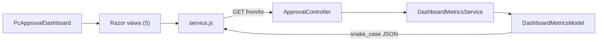

# Approval Dashboard Component

A manager-facing PageComponent that surfaces real-time approval-workflow KPIs inside the WebVella page builder.

## Purpose

The Approval Dashboard presents five approval KPIs for managers: pending approvals count, average approval time, approval rate, overdue requests count, and a recent-activity feed. It renders inside the page builder and is visible only to users in the `manager`, `administrator`, or `admin` roles; everyone else receives an access-denied view.

## Architecture

`PcApprovalDashboard.cs` is the server-side PageComponent: it selects one of five Razor views by render mode and seeds the configured options into `Display.cshtml`. The client `service.js` polls the `ApprovalController` REST endpoint (`GET /api/v3.0/p/approval/dashboard/metrics`), which delegates to `DashboardMetricsService`, which returns the `DashboardMetricsModel` DTO (in `Api/`). The controller wraps that DTO in `ResponseModel.Object` with snake_case JSON keys the client reads by exact name. The average-approval-time KPI is computed by the service's `GetAverageApprovalTime` method and feeds the DTO property `AverageApprovalTimeHours`. The runtime call and data flow is shown in Diagram 1.

**Diagram 1 — Approval Dashboard component interaction.**
Legend: arrows show runtime call/data flow; `PcApprovalDashboard` (page-builder render) and `ApprovalController` (direct REST URL) are the two authorized entry paths.

## Configuration options

All options are read from `PcApprovalDashboardOptions`.

| Option | Type | Default |
|--------|------|---------|
| `refresh_interval` | int | `60` |
| `date_range_default` | string | `"30d"` |
| `show_overdue_alert` | bool | `true` |
| `metrics_to_display` | string | `"pending,avg_time,approval_rate,overdue,recent"` |
| `dashboard_title` | string | `"Approval Dashboard"` |

## Date range filtering

The Options panel persists `date_range_default`, and `Display.cshtml` renders the matching preset as the pre-selected date-range option. On refresh, `service.js` `getDateRange` reads the selected preset (7d/30d/90d) and converts it into `from`/`to` timestamps sent as API query params, which `DashboardMetricsService` uses to compute metrics over that window. On the initial server render, `CalculateFromDate` seeds the same window so the first paint matches the preset.

## Auto-refresh

Polling is driven by `setInterval`. The Page Visibility API pauses polling when the tab is hidden and triggers an immediate refresh plus resume when it becomes visible again. The browser `beforeunload` event clears the timer on navigation away from the page. Page-builder lifecycle hooks are observed separately: `WvPbManager_Design_Unloaded` stops design-time polling, while `WvPbManager_Design_Loaded` and `WvPbManager_Node_Moved` are observation-only. A 30-second polling floor bounds each user's request rate against the database and is enforced on both the client (`MIN_REFRESH_INTERVAL`) and the server (the options clamp), so a misconfigured interval cannot overload the backend.

## Authorization

Access is enforced at two layers: the PageComponent checks its `AuthorizedRoles` list and the controller checks its `AuthorizedDashboardRoles` list, both holding `{manager, administrator, admin}` and separately declared rather than shared. This dual-layer pattern exists because of ADR-004: the dashboard has two independently reachable entry paths — page-builder render reaching the component and a direct REST URL reaching the controller — so each path must enforce the role policy itself.

## Known gaps

- Custom date picker is pending (AC3 partial): only the 7d/30d/90d presets are available today.
- `ApprovalPlugin.cs` registration is pending; the file does not yet exist in the plugin.
- Service-layer unit tests for `DashboardMetricsService` are pending.
