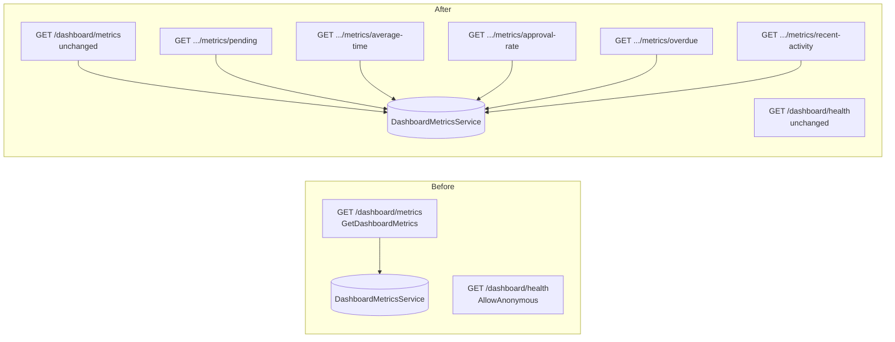
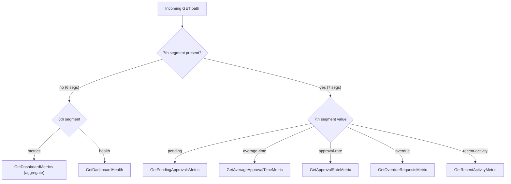

# Technical Specification

# 0. Agent Action Plan

## 0.1 Intent Clarification

This Agent Action Plan is the authoritative interpretation layer between the user's request and the implementation Blitzy will execute against the `WebVella.Erp.Plugins.Approval` plugin. It restates the request in precise technical terms, surfaces implicit requirements, and reconciles the request against the **actual** source code — which differs from the request's idealized description in several material ways. Where the request and the source disagree, the immutable source is authoritative, and those reconciliations are documented explicitly below and carried through every downstream sub-section.

### 0.1.1 Core Refactoring Objective

Based on the prompt, the Blitzy platform understands that the refactoring objective is to **decompose read access to the five approval dashboard KPIs by adding five discrete `GET` endpoints to the existing `ApprovalController`** — one endpoint per `DashboardMetricsService` KPI method — so that external and headless consumers (mobile clients, third-party integrations) can retrieve a single metric without invoking the aggregate dashboard endpoint and without coupling to the full `DashboardMetricsModel` payload.

The five new endpoints, their backing service methods, and their response `Object` types are:

| New Endpoint (`GET`) | Backing Service Method (actual signature) | `Object` Type |
|----------------------|-------------------------------------------|---------------|
| `/api/v3.0/p/approval/dashboard/metrics/pending` | `GetPendingApprovalsCount(Guid userId)` | `int` |
| `/api/v3.0/p/approval/dashboard/metrics/average-time` | `GetAverageApprovalTime(DateTime fromDate, DateTime toDate)` | `decimal` |
| `/api/v3.0/p/approval/dashboard/metrics/approval-rate` | `GetApprovalRate(DateTime fromDate, DateTime toDate)` | `decimal` |
| `/api/v3.0/p/approval/dashboard/metrics/overdue` | `GetOverdueRequestsCount(Guid userId)` | `int` |
| `/api/v3.0/p/approval/dashboard/metrics/recent-activity` | `GetRecentActivity(5)` | `List<RecentActivityItem>` |

- **Refactoring type:** Code structure and Modularity — specifically an **API surface extension / endpoint decomposition**, in which granular, individually addressable endpoints are carved from an existing aggregate. This is **not** a performance optimization, a design-pattern overhaul, or a tech-stack migration. It is strictly **additive and behavior-preserving**: no existing method is altered.
- **Target repository:** The **same repository**. Exactly one source file changes — `WebVella.Erp.Plugins.Approval/Controllers/ApprovalController.cs` [WebVella.Erp.Plugins.Approval/Controllers/ApprovalController.cs:L113-L205].

The refactoring goals, restated with enhanced clarity:

- Expose each of the five KPIs computed by `DashboardMetricsService` [WebVella.Erp.Plugins.Approval/Services/DashboardMetricsService.cs:L58-L252] as its own REST sub-resource under the existing `/api/v3.0/p/approval/dashboard/metrics` namespace.
- Replicate the existing aggregate action's validation chain **identically** in each new action so that authentication, authorization, date-range semantics, and error handling are uniform across the discrete and aggregate surfaces [WebVella.Erp.Plugins.Approval/Controllers/ApprovalController.cs:L119-L179].
- Return a single typed value per endpoint, wrapped in the platform's standard `ResponseModel` envelope, rather than the full `DashboardMetricsModel` [WebVella.Erp.Plugins.Approval/Api/DashboardMetricsModel.cs:L17-L61].
- Keep `DashboardMetricsService` the single source of KPI computation so discrete results stay numerically identical to the aggregate's component values.

**Source-versus-request reconciliations (critical — the source is authoritative because the service and model are immutable):**

- **`pending` and `overdue` take a user id, not dates.** The request's table implies `GetPendingApprovalsCount(fromDate, toDate)` and `GetOverdueRequestsCount(fromDate, toDate)`, but the actual signatures are `GetPendingApprovalsCount(Guid userId)` and `GetOverdueRequestsCount(Guid userId)` [WebVella.Erp.Plugins.Approval/Services/DashboardMetricsService.cs:L58,L90]. These endpoints must call the methods with `CurrentUserId.Value`.
- **The average-time method is named `GetAverageApprovalTime`**, not `GetAverageApprovalTimeHours` [WebVella.Erp.Plugins.Approval/Services/DashboardMetricsService.cs:L146].
- **There is no class-level `[Route]` prefix.** The controller declares only `[Authorize]` at the class level [WebVella.Erp.Plugins.Approval/Controllers/ApprovalController.cs:L20-L21]; each action carries a **full absolute** route template [WebVella.Erp.Plugins.Approval/Controllers/ApprovalController.cs:L113,L187]. The request's "class-level prefix + sub-path" premise does not apply to this codebase; the existing convention (absolute per-action templates) is followed instead while preserving the exact target path names.
- The `Object` **types** named in the request's table (`int`/`decimal`/`decimal`/`int`/`List<RecentActivityItem>`) are all correct and are preserved.

Implicit requirements surfaced from the request:

- **API backward compatibility:** the aggregate `GET /dashboard/metrics` and `GET /dashboard/health` request/response schemas remain unchanged, and the dashboard client's `API_ENDPOINT` continues to target the aggregate path [WebVella.Erp.Plugins.Approval/Components/PcApprovalDashboard/service.js:L20]. The browser polling loop calls only the aggregate; the five new endpoints are purely additive for external consumers.
- **Behavior preservation:** each new action reproduces the exact `401 → 403 → date-default → range-check → service-call → 200 → 500` sequence with identical status codes and message strings as the aggregate [WebVella.Erp.Plugins.Approval/Controllers/ApprovalController.cs:L119-L179].
- **Authorization inheritance:** all five new actions inherit class-level `[Authorize]`; none is `[AllowAnonymous]`; the parameterless `IsManagerRole()` gate is mandatory [WebVella.Erp.Plugins.Approval/Controllers/ApprovalController.cs:L92-L97].
- **Zero new dependencies, no dependency injection registration, no `.csproj` change, no host change.**
- **Separate non-code deliverable:** a self-contained reveal.js executive summary deck is required by the project rule and is independent of the plugin compilation unit.

### 0.1.2 Technical Interpretation

This refactoring translates to the following technical transformation strategy.

**Current architecture.** `ApprovalController` exposes exactly two actions inside its `#region Dashboard Metrics` [WebVella.Erp.Plugins.Approval/Controllers/ApprovalController.cs:L99-L207]: one authenticated, manager-gated aggregate action, `GetDashboardMetrics`, that returns all five KPIs in a single `DashboardMetricsModel` [WebVella.Erp.Plugins.Approval/Controllers/ApprovalController.cs:L113-L180]; and one anonymous `GetDashboardHealth` probe [WebVella.Erp.Plugins.Approval/Controllers/ApprovalController.cs:L187-L205]. The aggregate action internally delegates to the five KPI methods of a directly instantiated `DashboardMetricsService` [WebVella.Erp.Plugins.Approval/Services/DashboardMetricsService.cs:L42-L46].

**Target architecture.** Five sibling actions are added alongside the aggregate, each:

- decorated with a full absolute `[Route("api/v3.0/p/approval/dashboard/metrics/<metric>")]` plus `[HttpGet]`, matching the existing per-action routing convention;
- carrying the signature `public ActionResult <Name>([FromQuery] DateTime? from = null, [FromQuery] DateTime? to = null)`;
- replicating the aggregate's validation chain verbatim; and
- delegating to exactly one service method, returning the single typed result inside `ResponseModel`.



**Transformation rules.**

- **Validation parity:** every new action implements the seven-step chain exactly as the aggregate does — extract `CurrentUserId` (else `401`), enforce `IsManagerRole()` (else `403`), apply the per-parameter 30-day date default (`toDate = to ?? DateTime.UtcNow; fromDate = from ?? toDate.AddDays(-30)`), reject `fromDate > toDate` (`400`), invoke the service, wrap success in `ResponseModel` (`200`), and convert unhandled exceptions to a `500` with an `ErrorModel` in `Errors[]` [WebVella.Erp.Plugins.Approval/Controllers/ApprovalController.cs:L124-L179].
- **Uniform-chain nuance:** `from`/`to` are parsed and range-validated on **all five** endpoints to keep the chain identical, but the parsed dates are **consumed only by** `average-time` and `approval-rate`; `pending`/`overdue` pass `CurrentUserId.Value`, and `recent-activity` passes the literal `5`, mirroring the aggregate's internal usage [WebVella.Erp.Plugins.Approval/Services/DashboardMetricsService.cs:L42-L46].
- **403 acceptance enhancement (flagged decision):** the existing aggregate sets only `response.Message` on the `403` path [WebVella.Erp.Plugins.Approval/Controllers/ApprovalController.cs:L132-L137], but the request's acceptance criterion for the new endpoints requires at least one `ErrorModel` entry in `Errors[]` on `403`. The new actions therefore **add** ≥1 `ErrorModel` to `Errors[]` on the `403` path; the aggregate's `403` remains message-only and unchanged.
- **Single source of truth:** `new DashboardMetricsService()` is instantiated inside each action (no DI), exactly as the aggregate does, guaranteeing the discrete and aggregate results derive from one implementation [WebVella.Erp.Plugins.Approval/Controllers/ApprovalController.cs:L152].
- **Route specificity:** the five sub-paths are strictly more specific (one extra literal segment) than the aggregate `dashboard/metrics`, so attribute routing resolves each unambiguously — formally confirmed in section 0.6.


## 0.2 Scope Boundaries

All paths below are relative to the repository root. The plugin root is `WebVella.Erp.Plugins.Approval/`. The scope is deliberately narrow: exactly one source file is edited, plus one rule-mandated non-code deliverable.

### 0.2.1 Exhaustively In Scope

**Modifiable source (the only code change):**

- `WebVella.Erp.Plugins.Approval/Controllers/ApprovalController.cs` — **UPDATE**. Add exactly five new `[HttpGet]` action methods (`pending`, `average-time`, `approval-rate`, `overdue`, `recent-activity`) inside the existing `#region Dashboard Metrics` [WebVella.Erp.Plugins.Approval/Controllers/ApprovalController.cs:L99-L207]. The two existing actions, `GetDashboardMetrics` and `GetDashboardHealth`, are preserved verbatim.

**Create (rule-mandated, non-code deliverable, outside the plugin compilation unit):**

- `blitzy-deck/approval-kpi-endpoints-executive-summary.html` — **CREATE**. A single self-contained reveal.js executive summary deck satisfying the "Executive Presentation" project rule. This file does not modify any plugin source and is not part of the build.

**Reference (read-only — used to mirror call contracts and patterns; not modified):**

- `WebVella.Erp.Plugins.Approval/Services/DashboardMetricsService.cs` — the exact KPI method signatures the new actions invoke [WebVella.Erp.Plugins.Approval/Services/DashboardMetricsService.cs:L58-L252].
- `WebVella.Erp.Plugins.Approval/Api/DashboardMetricsModel.cs` — the `RecentActivityItem` return type and the snake_case `[JsonProperty]` serialization contract [WebVella.Erp.Plugins.Approval/Api/DashboardMetricsModel.cs:L43,L73-L97].
- The existing `GetDashboardMetrics` action (same file as the UPDATE target) — the canonical validation chain to replicate [WebVella.Erp.Plugins.Approval/Controllers/ApprovalController.cs:L113-L180].
- `blitzy-deck/references/blitzy-reveal-theme.css` — the canonical Blitzy reveal.js theme cited by the project rule. This file is **not present in the repository**; its classes and tokens are embedded inline in the deck.

**Scope patterns (for completeness; trailing-only, used precisely):**

| Pattern | Mode | Meaning |
|---------|------|---------|
| `WebVella.Erp.Plugins.Approval/Controllers/ApprovalController.cs` | UPDATE | The sole source-code edit (literal path, no wildcard). |
| `blitzy-deck/*.html` | CREATE | The executive summary deck. |

### 0.2.2 Explicitly Out of Scope

The following are confirmed to exist and **must not be modified**. They are listed to make the boundary unambiguous for downstream agents.

- **Plugin internals that define immutable contracts:**
  - `WebVella.Erp.Plugins.Approval/Services/DashboardMetricsService.cs` — all KPI method signatures are frozen [WebVella.Erp.Plugins.Approval/Services/DashboardMetricsService.cs:L35-L252].
  - `WebVella.Erp.Plugins.Approval/Api/DashboardMetricsModel.cs` — `DashboardMetricsModel` and `RecentActivityItem` are consumed read-only; no new DTOs are created [WebVella.Erp.Plugins.Approval/Api/DashboardMetricsModel.cs:L1-L99].
  - `WebVella.Erp.Plugins.Approval/Components/PcApprovalDashboard/**` — the page component and its assets (`PcApprovalDashboard.cs`, `service.js`, and the `Display`/`Design`/`Options`/`Help`/`Error` Razor views). The client `API_ENDPOINT` stays pinned to the aggregate path [WebVella.Erp.Plugins.Approval/Components/PcApprovalDashboard/service.js:L20].
  - `WebVella.Erp.Plugins.Approval/WebVella.Erp.Plugins.Approval.csproj` — no dependency, target-framework, or build change [WebVella.Erp.Plugins.Approval/WebVella.Erp.Plugins.Approval.csproj:L1-L29].
- **The two existing `ApprovalController` actions** — `GetDashboardMetrics` and `GetDashboardHealth` are preserved exactly, including the aggregate's message-only `403` path and the health probe's `[AllowAnonymous]` attribute [WebVella.Erp.Plugins.Approval/Controllers/ApprovalController.cs:L132-L137,L187-L189].
- **Host platform and configuration:**
  - `global.json`, all `Config.json` files (including `WebVella.Erp.Site/Config.json`), and `WebVella.Erp.Site/Startup.cs` [WebVella.Erp.Site/Startup.cs:L67-L80].
  - Host projects `WebVella.Erp/**`, `WebVella.Erp.Web/**`, and `WebVella.Erp.Site/**` — entirely host-owned.
- **All sibling plugins and sites** — `WebVella.Erp.Plugins.{Crm,Mail,Next,Project,SDK,MicrosoftCDM}/**`, `WebVella.Erp.Site.{Crm,Mail,Next,Project,Sdk,MicrosoftCDM}/**`, `WebVella.Erp.ConsoleApp/**`, and `WebVella.Erp.WebAssembly/**`.
- **No new dependency-injection registration, no logging/caching infrastructure, and no API-versioning or middleware changes** — the new actions are discovered by attribute routing and inherit the host's global MVC + Newtonsoft serialization configuration [WebVella.Erp.Site/Startup.cs:L67-L74].


## 0.3 Target Design

The target design adds five sibling actions to a single controller and produces one standalone presentation artifact. No folders are created in the plugin; the only new directory is `blitzy-deck/` for the executive deck.

### 0.3.1 Refactored Structure Planning

The post-refactor layout of the affected plugin and the new deliverable folder is shown below. Files marked `(unchanged)` are immutable and listed only to anchor the new work in context.

```
Target:
WebVella.Erp.Plugins.Approval/
├── Controllers/
│   └── ApprovalController.cs        (UPDATE: +5 GET actions; existing 2 actions unchanged)
├── Services/
│   └── DashboardMetricsService.cs   (unchanged — KPI source of truth)
├── Api/
│   └── DashboardMetricsModel.cs     (unchanged — RecentActivityItem + snake_case contract)
├── Components/
│   └── PcApprovalDashboard/         (unchanged — page component, service.js, Razor views)
└── WebVella.Erp.Plugins.Approval.csproj  (unchanged)

blitzy-deck/
├── approval-kpi-endpoints-executive-summary.html  (CREATE — reveal.js deck, inline theme)
└── references/
    └── blitzy-reveal-theme.css      (REFERENCE — canonical theme, not in repo; inlined)
```

Within `ApprovalController.cs`, the five new actions are placed inside the existing `#region Dashboard Metrics` [WebVella.Erp.Plugins.Approval/Controllers/ApprovalController.cs:L99-L207], immediately following the aggregate action. Each new method follows this shape (illustrative, abbreviated):

```
[Route("api/v3.0/p/approval/dashboard/metrics/pending")]
[HttpGet]
public ActionResult GetPendingApprovalsMetric([FromQuery] DateTime? from = null, [FromQuery] DateTime? to = null)
{
    // 401 -> 403 (+ErrorModel) -> date default -> 400 -> new DashboardMetricsService() -> 200 -> 500
}
```

The metric-to-service-method delegation is fixed against the **actual** service signatures:

| New Action (suggested name) | Route segment | Service call |
|-----------------------------|---------------|--------------|
| `GetPendingApprovalsMetric` | `pending` | `GetPendingApprovalsCount(CurrentUserId.Value)` |
| `GetAverageApprovalTimeMetric` | `average-time` | `GetAverageApprovalTime(fromDate, toDate)` |
| `GetApprovalRateMetric` | `approval-rate` | `GetApprovalRate(fromDate, toDate)` |
| `GetOverdueRequestsMetric` | `overdue` | `GetOverdueRequestsCount(CurrentUserId.Value)` |
| `GetRecentActivityMetric` | `recent-activity` | `GetRecentActivity(5)` |

### 0.3.2 Web Search Research Conducted

Targeted research confirmed the routing semantics that govern the registration pattern and the no-shadowing guarantee for ASP.NET Core 9 attribute routing:

- **Attribute routing builds a route tree evaluated as a set, with the most specific match winning.** Attribute routes do not depend on declaration order; the matcher selects the best (most specific) candidate, and literal segments take precedence over parameter segments. This is the basis for confirming that the five new literal sub-paths cannot be shadowed by, and cannot shadow, the aggregate route (detailed in section 0.6).
- **Class-level route prefixes combine with non-absolute action templates.** When a controller declares a class-level `[Route]`, each action template that does not begin with `/` or `~/` is concatenated to it. Because the existing actions use full absolute templates with no class-level prefix [WebVella.Erp.Plugins.Approval/Controllers/ApprovalController.cs:L113,L187], introducing a class-level prefix would double the existing paths and break the immutable endpoints — so the existing absolute-template convention is retained for the new actions.
- **REST resource modeling with HTTP verb attributes.** Microsoft's guidance is to model API functionality as resources addressed by literal paths and HTTP verb attributes (`[HttpGet]`), which matches the chosen sub-resource design.

### 0.3.3 Design Pattern Applications

- **Validation-chain template replication (per method).** The seven-step validation chain is duplicated in each new action rather than extracted into a shared helper. This is a deliberate consequence of the minimal-change constraint: introduce no new shared abstraction unless physically unavoidable. The chain is copied from the canonical aggregate action [WebVella.Erp.Plugins.Approval/Controllers/ApprovalController.cs:L119-L179].
- **Direct transient instantiation.** Each action constructs `new DashboardMetricsService()` locally rather than resolving it from DI, matching the existing controller pattern and the service's parameterless constructor [WebVella.Erp.Plugins.Approval/Controllers/ApprovalController.cs:L152, WebVella.Erp.Plugins.Approval/Services/DashboardMetricsService.cs:L23-L26].
- **Response envelope (uniform `ResponseModel`).** Every action returns `ResponseModel { Success, Message, Object, Errors }`, with `Object` carrying the single typed KPI value [WebVella.Erp.Plugins.Approval/Controllers/ApprovalController.cs:L121-L162].
- **REST sub-resource modeling.** Each KPI is exposed as a literal sub-resource of `/dashboard/metrics`, with the read operation expressed via `[HttpGet]`.
- **Claims-based authorization gate.** Authorization reuses the existing `CurrentUserId` claim extraction and the parameterless `IsManagerRole()` role check [WebVella.Erp.Plugins.Approval/Controllers/ApprovalController.cs:L53-L97].

### 0.3.4 User Interface Design

Not applicable. This is a backend REST refactor with no application UI in scope. The only UI artifacts in the plugin — the `PcApprovalDashboard` page component, its `service.js`, and its Razor views — are immutable and out of scope [WebVella.Erp.Plugins.Approval/Components/PcApprovalDashboard/service.js:L20]. The sole visual deliverable is the executive summary deck, whose presentation design is governed by the Blitzy reveal.js theme and is documented under section 0.7 (Refactoring Rules & Constraints) and section 0.8 (Attachments & References).


## 0.4 Transformation Mapping

This sub-section maps every target file to a source file and documents the (minimal) cross-file impact.

### 0.4.1 File-by-File Transformation Plan

| Target File | Transformation | Source File | Key Changes |
|-------------|----------------|-------------|-------------|
| `WebVella.Erp.Plugins.Approval/Controllers/ApprovalController.cs` | UPDATE | `WebVella.Erp.Plugins.Approval/Controllers/ApprovalController.cs` (same file) | Add 5 `[HttpGet]` action methods inside `#region Dashboard Metrics`, each replicating the `GetDashboardMetrics` validation chain [L119-L179] and delegating to the single matching service method; the new `403` path adds ≥1 `ErrorModel` to `Errors[]`. The only plugin source-code edit. |
| `blitzy-deck/approval-kpi-endpoints-executive-summary.html` | CREATE | `blitzy-deck/references/blitzy-reveal-theme.css` (REFERENCE, inlined) + this AAP | New single self-contained reveal.js executive deck (12–18 slides) per the "Executive Presentation" rule; CDN-pinned reveal.js 5.1.0 / Mermaid 11.4.0 / Lucide 0.460.0; Blitzy theme CSS embedded inline. |
| `WebVella.Erp.Plugins.Approval/Services/DashboardMetricsService.cs` | REFERENCE | — | Read-only: provides the five KPI method signatures the new endpoints call [L58-L252]. Not modified. |
| `WebVella.Erp.Plugins.Approval/Api/DashboardMetricsModel.cs` | REFERENCE | — | Read-only: `RecentActivityItem` return type and snake_case `[JsonProperty]` contract [L43,L73-L97]. Not modified. |
| `WebVella.Erp.Plugins.Approval/Controllers/ApprovalController.cs` (`GetDashboardMetrics` action) | REFERENCE | — | The canonical validation-chain template the five new actions replicate verbatim [L113-L180]. Not modified. |
| `blitzy-deck/references/blitzy-reveal-theme.css` | REFERENCE | — | Canonical Blitzy reveal.js theme cited by the rule; not present in the repository, so its classes/tokens are embedded inline in the deck. |

### 0.4.2 Cross-File Dependencies

There are **no cross-file import changes**. The new actions reference only types that are already imported or in-assembly:

- All required `using` directives are already present in `ApprovalController.cs` [WebVella.Erp.Plugins.Approval/Controllers/ApprovalController.cs:L1-L11], covering `DashboardMetricsService` (`WebVella.Erp.Plugins.Approval.Services`), `DashboardMetricsModel`/`RecentActivityItem` (`WebVella.Erp.Plugins.Approval.Api`), and `ResponseModel`/`ErrorModel` (`WebVella.Erp.Api.Models`).
- No new `using` directive, no namespace change, and no edit to any consumer of the controller are required.
- The dashboard client's import surface is untouched: `service.js` keeps `API_ENDPOINT = '/api/v3.0/p/approval/dashboard/metrics'` [WebVella.Erp.Plugins.Approval/Components/PcApprovalDashboard/service.js:L20].
- No host registration change: new actions are auto-discovered by attribute routing, and JSON serialization (snake_case via `[JsonProperty]`) is inherited from the host's `AddMvc().AddNewtonsoftJson()` configuration [WebVella.Erp.Site/Startup.cs:L67-L74].

Illustrative (no change required — shown to confirm the imports already in place):

```
// Already present at the top of ApprovalController.cs — no edit needed
using WebVella.Erp.Plugins.Approval.Api;       // DashboardMetricsModel, RecentActivityItem
using WebVella.Erp.Plugins.Approval.Services;  // DashboardMetricsService
using WebVella.Erp.Api.Models;                 // ResponseModel, ErrorModel
```

### 0.4.3 Wildcard Patterns

No wildcard patterns are required — the scope resolves to two precise paths. For reference, the only code change is the literal path `WebVella.Erp.Plugins.Approval/Controllers/ApprovalController.cs` (no trailing wildcard), and the only created artifact is `blitzy-deck/*.html`. No leading wildcards are used anywhere.

### 0.4.4 One-Phase Execution

The entire refactor — the five endpoint additions to `ApprovalController.cs` and the executive summary deck — executes in a single Blitzy phase. There is no multi-phase split; all files are included in one phase.


## 0.5 Dependency Inventory

### 0.5.1 Key Packages

The packages relevant to this refactor, with exact versions read from the dependency manifests. No placeholder versions are used.

| Registry | Package / Reference | Version | Purpose |
|----------|---------------------|---------|---------|
| NuGet | `Microsoft.AspNetCore.Mvc.NewtonsoftJson` | `9.0.10` | Newtonsoft-based MVC JSON serialization; produces the snake_case `[JsonProperty]` output the new endpoints inherit automatically [WebVella.Erp.Plugins.Approval/WebVella.Erp.Plugins.Approval.csproj:L22]. |
| .NET SDK | `Microsoft.NET.Sdk.Razor` (project SDK) | SDK-style (no explicit version) | Razor-enabled project SDK for the plugin; `AddRazorSupportForMvc` is enabled [WebVella.Erp.Plugins.Approval/WebVella.Erp.Plugins.Approval.csproj:L1,L5]. |
| Shared framework | `Microsoft.AspNetCore.App` (FrameworkReference) | pinned to the `net9.0` runtime | Provides MVC, `[Authorize]`, attribute routing, and `ActionResult` used by the new actions [WebVella.Erp.Plugins.Approval/WebVella.Erp.Plugins.Approval.csproj:L10]. |
| Target framework | `net9.0` | — | ASP.NET Core 9 runtime target [WebVella.Erp.Plugins.Approval/WebVella.Erp.Plugins.Approval.csproj:L4]. |
| Project reference | `WebVella.Erp.Web` | in-solution | `WebVella.Erp.Web.Services` (`IErpService`) and web host services [WebVella.Erp.Plugins.Approval/WebVella.Erp.Plugins.Approval.csproj:L26]. |
| Project reference | `WebVella.Erp` (core) | in-solution | `WebVella.Erp.Api.Models` (`ResponseModel`, `ErrorModel`), `WebVella.Erp.Eql`, and `RecordManager` [WebVella.Erp.Plugins.Approval/WebVella.Erp.Plugins.Approval.csproj:L27]. |

Notes:

- **SDK pin:** the request states the SDK is pinned in `global.json`, but the version line there is **commented out** (`//"version": "7.0.103"`), so there is no active SDK pin; the SDK resolves to the highest installed version compatible with `net9.0` [global.json:version]. This is documented as-is and requires no change.
- **Transitive dependencies (host/core-owned; not added or changed):** `Irony.NetCore 1.1.11` (EQL grammar parsing) and `Npgsql 9.0.4` (PostgreSQL driver) are pulled via `WebVella.Erp` core and used internally by `DashboardMetricsService`; they are out of scope and untouched.
- **Executive deck (browser CDN, not NuGet):** reveal.js 5.1.0, Mermaid 11.4.0, Lucide 0.460.0, and Google Fonts (Inter, Space Grotesk, Fira Code) are pinned per the "Executive Presentation" rule. The deck is self-contained with no build step and adds no package-manager entry.

### 0.5.2 Dependency Updates and Import Refactoring

- **Dependency changes:** none. No NuGet package is added, updated, or removed. The five endpoints compile against types already provided by the existing references, and the executive deck is CDN-only.
- **Import refactoring:** none. There are no `using`/namespace edits in any file, and no import-correction wildcards apply. All symbols the new actions reference are already imported in `ApprovalController.cs` [WebVella.Erp.Plugins.Approval/Controllers/ApprovalController.cs:L1-L11].
- **External reference / build / CI updates:** none. No `*.config.*`, `*.json`, build manifest (`.csproj`, `global.json`), or CI workflow change is required.


## 0.6 Special Analysis: Route Template Resolution Order

The request explicitly asks the Action Plan to confirm, before implementation, that the five new sub-paths do not shadow or conflict with the existing aggregate route. This sub-section provides that confirmation.

### 0.6.1 Post-Refactor Route Table

All routes live on `ApprovalController`, which declares class-level `[Authorize]` and **no** class-level `[Route]` [WebVella.Erp.Plugins.Approval/Controllers/ApprovalController.cs:L20-L21].

| Route template (absolute) | Verb | Action | Segment count | Status |
|---------------------------|------|--------|---------------|--------|
| `api/v3.0/p/approval/dashboard/metrics` | GET | `GetDashboardMetrics` | 6 | Existing (immutable) [L113] |
| `api/v3.0/p/approval/dashboard/health` | GET | `GetDashboardHealth` (`[AllowAnonymous]`) | 6 | Existing (immutable) [L187] |
| `api/v3.0/p/approval/dashboard/metrics/pending` | GET | new | 7 | Added |
| `api/v3.0/p/approval/dashboard/metrics/average-time` | GET | new | 7 | Added |
| `api/v3.0/p/approval/dashboard/metrics/approval-rate` | GET | new | 7 | Added |
| `api/v3.0/p/approval/dashboard/metrics/overdue` | GET | new | 7 | Added |
| `api/v3.0/p/approval/dashboard/metrics/recent-activity` | GET | new | 7 | Added |

### 0.6.2 No-Shadowing Proof

Every template is **fully literal** — there is no `{param}`, no `{*catchall}`, and no optional segment anywhere. ASP.NET Core attribute routing builds an endpoint dataset and matches an incoming path against templates; a literal template matches only a request path with the **same segment count and identical literals**. From this, the four disjointness facts follow:

- The aggregate `…/metrics` (6 segments) terminates at the literal `metrics` with no catch-all, so a 7-segment `…/metrics/<x>` request cannot match it. The new routes are **not** shadowed by the aggregate.
- Each new template requires 7 literal segments ending in its distinct metric name, so a 6-segment `…/metrics` request matches none of them. The aggregate is **not** shadowed by the new routes.
- The five new routes differ in their 7th segment (`pending`, `average-time`, `approval-rate`, `overdue`, `recent-activity`), so they are mutually disjoint.
- `health` and `metrics` differ in the 6th segment, so they are disjoint.



**Result:** each URL maps to exactly one endpoint; there is zero risk of `AmbiguousMatchException`, and no `Order` property is needed. The "literal beats parameter" specificity tie-breaker is not even invoked here, because there are no parameters — the routes are simply disjoint literals. Verb selection is moot since every route is `GET` and the paths are unique; class-level `[Authorize]` applies to all five new actions, while the existing `[AllowAnonymous]` on `health` is unaffected [WebVella.Erp.Plugins.Approval/Controllers/ApprovalController.cs:L187-L189].

### 0.6.3 Implementation Guardrails

The no-conflict guarantee holds only if the implementation honors the following, which also explain the chosen registration pattern:

- **Do not add a class-level `[Route("api/v3.0/p/approval")]`.** It would combine with the existing actions' non-absolute templates and double their paths, breaking the immutable aggregate and health endpoints. The existing absolute per-action template convention is retained.
- **Use the full absolute template per new action** — `[Route("api/v3.0/p/approval/dashboard/metrics/<metric>")]` — rather than a relative template, which (with no class prefix) would resolve to the wrong path.
- **Give each new route its unique 7th segment.** Accidentally reusing `…/dashboard/metrics` (dropping the metric segment) would collide with the aggregate on the same path and verb, producing a runtime `AmbiguousMatchException`.
- **Route templates are case-insensitive by default;** the lowercase-hyphenated metric names match the target path-name specification.

**Recommended registration:** mirror the existing two-attribute style — `[Route("api/v3.0/p/approval/dashboard/metrics/<metric>")]` followed by `[HttpGet]` — keeping the exact target path names. The five new sub-paths are confirmed non-conflicting and non-shadowing; implementation may proceed.


## 0.7 Refactoring Rules and Constraints

This sub-section captures the directives the implementation must honor, the acceptance criteria for the new endpoints, and the user-specified project rules.

### 0.7.1 Minimal-Change Clause and Immutable Contracts

- **Add only; do not refactor.** Introduce exactly five new action methods. Do not rename, re-signature, or restructure any existing method; do not extract shared validation into a base class or helper unless physically unavoidable. Note — but do not fix — any pre-existing code-quality observations.
- **Preserve all public API contracts.** The aggregate `GET /dashboard/metrics` and `GET /dashboard/health` request/response schemas are unchanged, including the aggregate's message-only `403` body and the health probe's `[AllowAnonymous]` attribute [WebVella.Erp.Plugins.Approval/Controllers/ApprovalController.cs:L132-L137,L187-L189].
- **Preserve behavior.** Each new action reproduces the aggregate's status codes and message strings exactly [WebVella.Erp.Plugins.Approval/Controllers/ApprovalController.cs:L119-L179].
- **Frozen contracts:** all `DashboardMetricsService` method signatures [WebVella.Erp.Plugins.Approval/Services/DashboardMetricsService.cs:L35-L252]; the `ResponseModel { Success, Message, Object, Errors }` envelope; the `AuthorizedDashboardRoles` allow-list (`manager`, `administrator`, `admin`) [WebVella.Erp.Plugins.Approval/Controllers/ApprovalController.cs:L31-L36]; the host's `JWT_OR_COOKIE` hybrid authentication policy [WebVella.Erp.Site/Startup.cs:L115]; and the client `API_ENDPOINT` [WebVella.Erp.Plugins.Approval/Components/PcApprovalDashboard/service.js:L20].
- **No dependency, DI, `.csproj`, `global.json`, or host changes**, and no logging/caching introduced.

### 0.7.2 Validation Acceptance Criteria

Each new endpoint must satisfy the following, replicating the aggregate's chain [WebVella.Erp.Plugins.Approval/Controllers/ApprovalController.cs:L124-L179]:

| Condition | Status | `ResponseModel` expectation |
|-----------|--------|-----------------------------|
| Missing/invalid `NameIdentifier` claim | `401` | `Success = false`; `Message` non-empty ("User authentication required.") |
| Role not in manager allow-list | `403` | `Success = false`; `Message` non-empty **and** `Errors[]` has ≥1 `ErrorModel` (see flagged decision below) |
| `fromDate > toDate` | `400` | `Success = false`; `Message` non-empty ("Invalid date range…") |
| Valid request | `200` | `Success = true`; `Object` carries the single typed KPI value |
| Unhandled exception | `500` | `Success = false`; `Errors[]` carries an `ErrorModel` with the exception detail |
| Both `from` and `to` absent | n/a | 30-day default: `toDate = DateTime.UtcNow`; `fromDate = toDate.AddDays(-30)` |

**Flagged decision — `403` `Errors[]` enhancement.** The existing aggregate populates only `Message` on the `403` path [WebVella.Erp.Plugins.Approval/Controllers/ApprovalController.cs:L132-L137], whereas the acceptance criterion for the new endpoints requires at least one `Errors[]` entry on `403`. The new actions therefore **add** ≥1 `ErrorModel` to `Errors[]` on `403`; the existing aggregate's `403` remains message-only and unchanged. This is a deliberate, required enhancement scoped strictly to the new endpoints, recorded here for downstream review.

### 0.7.3 Executive Presentation Rule (User-Specified)

The project's "Executive Presentation" rule mandates a deliverable that the refactor must produce in addition to the code change:

- **Artifact:** a single self-contained reveal.js HTML file at `blitzy-deck/approval-kpi-endpoints-executive-summary.html`, aimed at non-technical leadership and covering what was done, the business value, the architectural change (with diagrams), risks and mitigations, and onboarding/continuation.
- **Slide constraints:** 12–18 slides (target 16); four slide types (`slide-title`, `slide-divider`, default content, `slide-closing`); every slide includes at least one non-text visual (Mermaid diagram, KPI card, styled table, or Lucide SVG icon); content slides limited to 4 bullets / 40 words; zero emoji (Lucide SVG icons only); no fenced code blocks inside slides.
- **Visual identity:** the Blitzy brand palette (`#5B39F3` primary, `#2D1C77` dark, `#94FAD5` teal accent, `#1A105F` navy, plus the documented gradients and neutrals) and fonts Inter, Space Grotesk, and Fira Code loaded via Google Fonts; hero, divider, and closing slide treatments as specified.
- **Technical delivery:** no build step and no local file dependencies; CDN versions pinned to reveal.js 5.1.0, Mermaid 11.4.0, and Lucide 0.460.0; reveal.js configured with `hash: true`, `transition: 'slide'`, `controlsTutorial: false`, `width: 1920`, `height: 1080`; Mermaid initialized with `startOnLoad: false` and re-run on `ready` and every `slidechanged`; `lucide.createIcons()` likewise invoked on `ready` and every `slidechanged`.
- **Theme source:** the canonical theme `blitzy-deck/references/blitzy-reveal-theme.css` and its required `:root` custom properties and component classes (`kpi-card`, `kpi-grid`, `kpi-value`, `kpi-label`, `kpi-icon`, `eyebrow`, `accent-bar`, `brand-lockup`, `hero-icon`, `icon-row`, and the mermaid container) are embedded inline because the file is not present in the repository.

### 0.7.4 Design System Compliance (Applicability)

A full Design System Compliance catalog (component-mapping and token-mapping tables) is **not applicable** to this work. This is a backend REST refactor: no application UI is in scope, the only UI artifacts (`PcApprovalDashboard`, `service.js`, and the Razor views) are immutable and out of scope, and no application component library (such as Ant Design or Material UI) is named for the code under change. The only "design system" involved is the Blitzy reveal.js **presentation** theme, which governs the executive deck deliverable and is fully specified in section 0.7.3 rather than as an application component catalog.


## 0.8 Attachments and References

### 0.8.1 Attachments

- **Project attachments:** none were provided.
- **Figma frames:** none were provided. No design-to-system mapping is applicable.

### 0.8.2 Source Files Inspected

The following repository files were read and used as the authoritative basis for this plan (paths relative to repository root `WebVella.Erp.Plugins.Approval/` unless noted):

| File | Role | Key facts established |
|------|------|-----------------------|
| `Controllers/ApprovalController.cs` | UPDATE target / REFERENCE | Class-level `[Authorize]` only, no class-level `[Route]`; per-action absolute templates; the canonical 7-step validation chain [L20-L21,L113-L205]. |
| `Services/DashboardMetricsService.cs` | REFERENCE (immutable) | Actual KPI signatures: `GetPendingApprovalsCount(Guid)`, `GetOverdueRequestsCount(Guid)`, `GetAverageApprovalTime(DateTime,DateTime)`, `GetApprovalRate(DateTime,DateTime)`, `GetRecentActivity(int)` [L58-L252]. |
| `Api/DashboardMetricsModel.cs` | REFERENCE (immutable) | `RecentActivityItem` type and snake_case `[JsonProperty]` contract [L43,L73-L97]. |
| `Components/PcApprovalDashboard/service.js` | REFERENCE (out of scope) | Client `API_ENDPOINT` pinned to the aggregate path; 30s polling floor [L20,L26]. |
| `WebVella.Erp.Plugins.Approval.csproj` | REFERENCE (immutable) | `net9.0`; `Microsoft.NET.Sdk.Razor`; `Microsoft.AspNetCore.Mvc.NewtonsoftJson 9.0.10`; project references to `WebVella.Erp.Web` and `WebVella.Erp` [L1-L27]. |
| `global.json` (repo root) | REFERENCE | SDK version line is commented out — no active SDK pin [version]. |
| `WebVella.Erp.Site/Startup.cs` | REFERENCE (host, out of scope) | `AddMvc().AddNewtonsoftJson()`; `JWT_OR_COOKIE` policy scheme [L67-L74,L115]. |

### 0.8.3 Reference Materials

- **Canonical presentation theme:** `blitzy-deck/references/blitzy-reveal-theme.css` — cited by the "Executive Presentation" rule; not present in the repository, so its tokens and component classes are embedded inline in the deck.
- **Existing technical specification:** `blitzy/documentation/Technical Specifications.md` — consulted for background corroboration only; it independently confirms the actual service signatures (§5.2.3.2), the aggregate endpoint and `ResponseModel` envelope (§2.1.6), and the health endpoint as the only `[AllowAnonymous]` action (§2.1.7). Where the existing spec and the source disagree (for example, §5.2.2.2's claim that the `400` path returns an `Errors[]` entry, which the source does not), the source is authoritative.

### 0.8.4 Web Research Citations

- Microsoft Learn — *Routing to controller actions in ASP.NET Core*: REST APIs should use attribute routing with HTTP verb attributes to model resources, and route attributes implement `IRouteTemplateProvider` so the runtime builds the route set at startup. <cite index="3-15,3-18,3-27,3-28,3-29">When building a REST API, it's rare that you need to use [Route(...)] on an action method because the action accepts all HTTP methods; REST APIs should use attribute routing to model the app's functionality as a set of resources where operations are represented by HTTP verbs. All of the route attributes implement IRouteTemplateProvider, and the ASP.NET Core runtime looks for attributes on controller classes and action methods when the app starts and uses the attributes that implement IRouteTemplateProvider to build the initial set of routes.</cite>
- Attribute-route specificity: <cite index="1-13,1-14">attribute routing creates a tree of all routes and evaluates them simultaneously, which means that more-specific routes will always be evaluated earlier than less-specific ones.</cite> This is the basis for the no-shadowing conclusion in section 0.6.
- Route precedence ordering: <cite index="6-1">when multiple routes could potentially match the same URL, ASP.NET Core uses a precedence system in which literal segments beat parameter segments — for example, /products/featured wins over /products/{id}.</cite>
- Class-level prefix combination: <cite index="4-12,4-16">by default, if a route prefix exists at the controller level, all routes inside the controller inherit it, and the ~ symbol tells ASP.NET Core to ignore the controller's route prefix and treat the route as absolute.</cite> This confirms why a class-level prefix would break the existing absolute templates.


