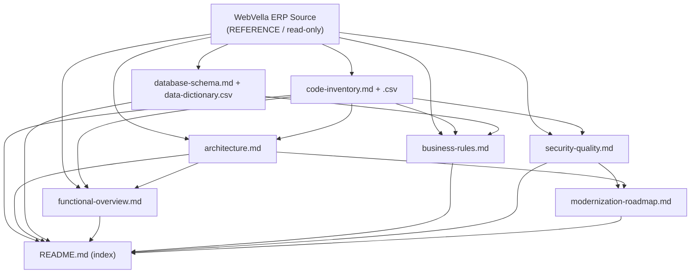

# Technical Specification

# 0. Agent Action Plan

## 0.1 Intent Clarification

### 0.1.1 Core Objective

Based on the prompt, the Blitzy platform understands that the objective is to **generate a production-grade reverse-engineering documentation suite for the entire WebVella ERP legacy codebase**, written exclusively into a new `docs/reverse-engineering/` directory, with **zero modifications to any production code, configuration, or schema artifact**. The suite must enable modernization planning, developer onboarding, and architectural decision-making.

The work product is **seven interconnected technical documents** plus two CSV data exports and one master index, derived entirely from read-only analysis of the existing solution `[WebVella.ERP3.sln]`:

- Code Inventory Report → `code-inventory.md` + `code-inventory.csv`
- System Architecture & Data Flow → `architecture.md`
- Database Schema & Data Dictionary → `database-schema.md` + `data-dictionary.csv`
- Functional Overview → `functional-overview.md`
- Business Rules Catalog → `business-rules.md`
- Security & Quality Assessment → `security-quality.md`
- Modernization Roadmap → `modernization-roadmap.md`
- Master index → `README.md`

**Refactoring type:** This is a **Documentation / Modularity** transformation — specifically *knowledge externalization*. It is purely **additive**: it improves system understandability and maintainability by externalizing structure, schema, business rules, and architecture into portable artifacts, **without any structural or behavioral change to code**.

**Target repository:** **Same repository** (an additive `docs/reverse-engineering/` folder). This is **not** a new-repository migration; nothing is moved or relocated.

The enhanced, disambiguated refactoring goals are:

- Catalog ≥95% of source files with per-file metadata (module, language, dependencies, LOC, last-modified, purpose, complexity).
- Render the as-built architecture (layered + plugin-extensibility model) as narrative plus ≥3 Mermaid diagrams.
- Reconstruct the database schema and data dictionary from the codebase, since no SQL migration files exist (see §0.1.2).
- Enumerate functional modules, workflows, and user roles.
- Catalog ≥50 business rules, each cited to its source location.
- Assess security posture, code quality/complexity, and dependency health (CVE audit).
- Produce a three-phase modernization roadmap.

**Implicit requirements surfaced from the prompt:**

- **Zero code modification** is the hard governing constraint — every output file is isolated to `docs/reverse-engineering/`.
- **Strict output-format compliance** — GitHub-Flavored Markdown, Mermaid (component / flowchart / ERD / sequence), and CSV (UTF-8, RFC-4180-escaped, with the exact column schemas the prompt specifies).
- **Cross-document consistency** — module names and code references must be aligned identically across all artifacts.
- **Citation discipline** — every code reference must resolve to a real file/class/method, since downstream consumers use these docs to navigate the source.
- **Factual "what-exists" reporting** — the documentation describes the system as built, not as idealized; aspirational claims belong only in the modernization roadmap.

### 0.1.2 Technical Interpretation

This documentation effort translates to the following transformation strategy: **ingest each in-scope source area (read-only), extract metadata / metrics / patterns / rules / schema, and render the results as Markdown + Mermaid + CSV** in the target directory. Every target artifact is a **CREATE**; every source area is a **REFERENCE**. There are no `UPDATE` or `DELETE` operations against production code.

Reverse-engineering the codebase surfaced **four material discrepancies between the prompt's stated technology assumptions and the actual system**. These corrections are foundational and must be reflected in every affected deliverable:

| # | Prompt Assumption | Verified Reality | Evidence |
|---|-------------------|------------------|----------|
| 1 | Entity Framework Core ORM | **Custom ORM / data layer** — raw parameterized Npgsql SQL with a dynamic entity/record model serialized as JSON | `[WebVella.Erp/Database/DbRecordRepository.cs]`, `[WebVella.Erp/WebVella.Erp.csproj:Npgsql 9.0.4]` |
| 2 | Angular / React / TypeScript frontend | **Razor Pages (.cshtml) + ERP TagHelpers + Blazor WebAssembly (.razor) + plain-JS page-builder components**; 0 `.ts` files in repo | `[WebVella.Erp.Web/Pages]`, `[WebVella.Erp.WebAssembly]`, `[WebVella.Erp.Web/WebVella.Erp.Web.csproj:WebVella.TagHelpers 1.7.2]` |
| 3 | EF Core Migrations folder (`WebVella.Erp.Web/Migrations/`) | **No Migrations folder anywhere.** Schema created via embedded PostgreSQL DDL in `ERPService.InitializeSystemEntities` plus date-versioned plugin patch methods (e.g., `Patch20190123`) | `[WebVella.Erp/ERPService.cs]`, `[WebVella.Erp.Plugins.Crm/CrmPlugin._.cs:Patch20190123]` |
| 4 | Docker containerization | **No Dockerfile / docker-compose anywhere.** Deployment is plain ASP.NET Core host sites on IIS (InProcess). Containerization becomes a *roadmap recommendation*, not an existing artifact | `[WebVella.Erp.Site/Program.cs]`, `[WebVella.Erp.Site/Startup.cs]` |

The current-state architecture being documented maps as follows:

- **Runtime / platform:** ASP.NET Core 9 on PostgreSQL 16; core library `WebVella.Erp` v1.7.4, Apache-2.0 `[WebVella.Erp/WebVella.Erp.csproj:Version]`. 18 of 20 projects target `net9.0`; 2 Blazor WebAssembly projects target out-of-support `net7.0` `[WebVella.Erp.WebAssembly/Server]`.
- **Architecture style:** A classic layered architecture (Sites → Web → Core) wrapped in a **plugin-extensibility model** (SDK, CRM, Mail, Next, Project, MicrosoftCDM, Approval) `[WebVella.ERP3.sln]`.
- **Data access:** EQL (a custom query language parsed by Irony.NetCore 1.1.11) translated to SQL over Npgsql `[WebVella.Erp/Eql]`, `[WebVella.Erp/WebVella.Erp.csproj:Irony.NetCore 1.1.11]`.
- **API surface:** A single centralized, monolithic Web API controller of **4,313 lines** plus a base class — not per-resource controllers `[WebVella.Erp.Web/Controllers/WebApiController.cs]`, `[WebVella.Erp.Web/Controllers/ApiControllerBase.cs]`.
- **Authentication:** Hybrid JWT-or-Cookie scheme `[WebVella.Erp.Site/Startup.cs]`.

The **transformation rule** is therefore "code → documentation," not "code → code." The plan that follows defines the exact source-to-target mapping, the analysis techniques required to extract each artifact, and the governing constraints — all engineered so the suite is internally consistent and faithful to the system as it actually exists.

## 0.2 Scope Boundaries

### 0.2.1 Exhaustively In Scope

All in-scope source areas are analyzed in **REFERENCE (read-only)** mode; the only files **created** are the ten documentation artifacts in `docs/reverse-engineering/`. The trailing-pattern groups below enumerate every area the analysis ingests.

**Source code to analyze (read-only):**

- `WebVella.Erp/**` — core server library (232 `.cs` files; ~30,587 LOC) `[WebVella.Erp]`
- `WebVella.Erp.Web/**` — primary ASP.NET Core web application (252 `.cs`, 282 `.cshtml`, 2 `.razor`, 73 `.js`; ~36,807 `.cs` LOC), including `Theme/styles.css` and `wwwroot/**` `[WebVella.Erp.Web]`
- `WebVella.Erp.WebAssembly/**` — Blazor WebAssembly Client/Server/Shared (36 `.cs`, 9 `.razor`) `[WebVella.Erp.WebAssembly]`
- `WebVella.Erp.ConsoleApp/**` — console bootstrap/sample harness (4 `.cs`) `[WebVella.Erp.ConsoleApp]`
- `WebVella.Erp.Plugins.*/**` — all 7 plugins: Approval, Crm, Mail, MicrosoftCDM, Next, Project, SDK `[WebVella.ERP3.sln]`
- `WebVella.Erp.Site*/**` — all 7 runnable host sites (`Program.cs`, `Startup.cs`, `Config.json`) `[WebVella.Erp.Site]`

**Build / configuration to analyze (read-only):**

- All 20 `*.csproj`, `WebVella.ERP3.sln`, `global.json`, `create-nuget-pkgs.bat`, `.editorconfig` (×2), `.gitattributes`, `.gitignore`
- Per-site `Config.json` and the `appsettings*.json` present in `Site.MicrosoftCDM` and `WebVella.Erp.WebAssembly`
- Native dependency `ExternalLibraries/libwkhtmltox.dll` (wkhtmltopdf HTML→PDF)

**Schema-bearing code to analyze (read-only) — substitutes for the absent SQL/migration files:**

- `WebVella.Erp/ERPService.cs` (`InitializeSystemEntities` embedded PostgreSQL DDL) `[WebVella.Erp/ERPService.cs]`
- `WebVella.Erp/Database/**` (DDL builders, record repository)
- Plugin patch methods (e.g., `WebVella.Erp.Plugins.Crm/CrmPlugin._.cs`) `[WebVella.Erp.Plugins.Crm/CrmPlugin._.cs]`

**Reference-only context (cross-checked, never modified):**

- `docs/developer/**` (14 existing topic areas), `blitzy/documentation/**` (existing generated docs), `jira-stories/**`, root `README.md`, `LICENSE.txt`, `LIBRARIES.md`, `doc-images/**`

**Files to create (the deliverables — CREATE mode):**

- `docs/reverse-engineering/README.md`
- `docs/reverse-engineering/code-inventory.md` and `code-inventory.csv`
- `docs/reverse-engineering/architecture.md`
- `docs/reverse-engineering/database-schema.md` and `data-dictionary.csv`
- `docs/reverse-engineering/functional-overview.md`
- `docs/reverse-engineering/business-rules.md`
- `docs/reverse-engineering/security-quality.md`
- `docs/reverse-engineering/modernization-roadmap.md`

There are **no rule-mandated files** to force into scope: the user supplied no implementation rules (the rules list was empty). The governing constraints are the prompt's own prohibitions, documented in §0.7.

### 0.2.2 Explicitly Out of Scope

The following are **hard "do-not-modify" boundaries**. Touching any of them would violate the zero-modification constraint:

- **All production source** — every `*.cs`, `*.cshtml`, `*.razor`, and `*.js` file in the solution.
- **All build / configuration files** — every `*.csproj`, `*.sln`, `global.json`, `Config.json`, `appsettings*.json`, `web.config`, and `.editorconfig`.
- **All schema and behavior** — code-embedded DDL, plugin patch methods, plugin implementations, API contracts, and the EQL grammar are documented but never altered.
- **Everything outside `docs/reverse-engineering/`** — the existing `docs/`, `blitzy/`, `jira-stories/`, root `README.md`, and `doc-images/` remain untouched.
- **No dependency changes** — no NuGet package is added, removed, or upgraded (see §0.5).
- **No build, deploy, or CI changes**, and **no bug fixes, optimizations, refactors, or inline code comments**.

### 0.2.3 Non-Applicable Protocols

- **Design System Compliance:** Not applicable. The prompt names no component library or design system, and no UI redesign is requested. No design-system catalog, component mapping, or token mapping is produced.
- **Environment Setup:** Not applicable. This is a documentation-only task requiring no compilation, test execution, or runtime. Analysis is performed via repository inspection and optional read-only static measures. No runtime, virtual environment, or dependency installation is required to produce the deliverables.
- **Figma Analysis:** Not applicable. No attachments — Figma or otherwise — were provided (see §0.8).

## 0.3 Target Design

### 0.3.1 Refactored Structure Planning

All ten artifacts are created under a single new directory. The directory `docs/reverse-engineering/` does not yet exist (only `docs/developer/` exists), so every target below is a **CREATE**.

<pre>
Target:
docs/reverse-engineering/
├── README.md                  (master index: links all 7 deliverables, executive overview, generation timestamp)
├── code-inventory.md          (Deliverable 1 — narrative + per-module file/LOC/dependency tables)
├── code-inventory.csv         (Module, File Path, Language, Dependencies, LOC, Last Modified, Primary Purpose, Complexity Score)
├── architecture.md            (Deliverable 2 — narrative + Mermaid component, data-flow, sequence diagrams)
├── database-schema.md         (Deliverable 3 — narrative + Mermaid ERD + patch/version history)
├── data-dictionary.csv        (Table, Column, Data Type, Key Type, Nullable, Default, Description, Constraints)
├── functional-overview.md     (Deliverable 4 — module catalog, workflows, user roles)
├── business-rules.md          (Deliverable 5 — 50+ rules: validation / process / integrity / calculation / authorization)
├── security-quality.md        (Deliverable 6 — vulnerabilities, code metrics, dependency CVE audit, compliance)
└── modernization-roadmap.md   (Deliverable 7 — current-state, target-state, 3-phase plan)
</pre>

Because the target lives inside the existing repository and is documentation only, no standalone scaffolding (project files, dependency manifests, deployment config) is required — this is **not** a new-repository migration.

### 0.3.2 Web Search Research Conducted

Two focused research streams were conducted to ground the analysis methodology in current industry practice:

- **C# / .NET code-metrics tooling** (for the `code-inventory.csv` Complexity Score and the `security-quality.md` metrics): Microsoft's code-metrics model defines **Maintainability Index** (0–100; 20–100 good, 10–19 moderate, 0–9 low), **Cyclomatic Complexity** (McCabe's commonly cited limit of ~10; values above 15 are hard to maintain and above 30 warrant splitting), **Class Coupling**, and **Depth of Inheritance**. These are produced by the .NET code-quality (Roslyn) analyzers (rules CA1501/CA1502/CA1505/CA1506, with configurable thresholds and command-line support) or by third-party tooling such as NDepend (CLI, 100+ metrics, technical-debt estimation). The Maintainability Index is a composite of Halstead Volume, Cyclomatic Complexity, and lines of code.
- **.NET legacy / monolith modernization best practices** (for `modernization-roadmap.md`): industry guidance favors the **Strangler Fig pattern** of incremental replacement over a "big-bang" rewrite; targeting a **.NET LTS** release for support stability; adopting **modular-monolith / Clean Architecture / Domain-Driven Design bounded contexts** to decompose oversized components such as the 4,313-line Web API controller; and **containerization (Docker)** for portability — none of which exists in the repository today. Security-hardening guidance includes OAuth2/OpenID Connect, ASP.NET Core Identity, claims-based authorization, HTTPS/HSTS, externalized secret management, and input validation / output encoding. A relevant cadence note: **.NET 9 is a Standard-Term-Support release**, not LTS — a roadmap consideration versus the .NET 8 / .NET 10 LTS line.

### 0.3.3 Documentation and Analysis Patterns

Because no code is refactored, the conventional "design patterns" of a code refactor are replaced by **documentation and analysis patterns** — one per deliverable:

- **Code Inventory:** Walk the solution tree; record per-file metadata (path, language, LOC excluding comments/blank lines, last-modified via Git, primary purpose, complexity); group by functional area (Core / Web / WebAssembly / Console / Plugins / Sites); build the dependency tree from `.csproj` `PackageReference` / `ProjectReference` entries.
- **Architecture:** C4-style component diagram plus data-flow flowcharts and sequence diagrams (Mermaid). Document the layered + plugin-extensibility model, the EQL → SQL data path, the JWT-or-Cookie authentication flow, and the page-builder render lifecycle.
- **Database Schema:** Since there are no `.sql` files or migration folders, extract schema from the embedded `CREATE TABLE` DDL in `ERPService` `[WebVella.Erp/ERPService.cs]`, the `Database/**` builders, the system-entity seed definitions, and the plugin `ProcessPatches()` methods; additionally document the **dynamic entity meta-model** (user/plugin entities and fields stored as records). Render a Mermaid ERD; export `data-dictionary.csv`.
- **Functional Overview:** Derive ERP modules from the project/plugin organization (CRM, Project, Mail, Next, MicrosoftCDM, SDK, Approval) and the `docs/developer` topic taxonomy; derive workflows from service classes; derive roles from the security/roles seed.
- **Business Rules:** Infer rules from validation logic (`ValidationException` / `ValidationError`), service conditional logic, EQL query constraints, plugin patch versioning, and authorization allow-lists; cite each to its file/class/method.
- **Security & Quality:** Scan for hardcoded secrets/connection strings (`Config.json`), the raw-SQL surface (verifying Npgsql parameterization), dynamic code-compilation endpoints (Roslyn / CS-Script), commented-out security code, and NuGet CVEs; compute complexity/maintainability metrics.
- **Modernization Roadmap:** Synthesize current-state strengths/debt/risk → target-state → a three-phase plan, informed by the research above.

### 0.3.4 User Interface Design

Not applicable. No user-interface change is proposed; all deliverables are documentation artifacts (Markdown, Mermaid, CSV). The system's existing UI (Razor Pages + ERP TagHelpers + Blazor WebAssembly) is *documented* in `architecture.md` and `functional-overview.md` but never altered.

## 0.4 Transformation Mapping

### 0.4.1 File-by-File Transformation Plan

Every target artifact is a **CREATE**; every source area is a **REFERENCE** (read-only). The table below maps each of the ten target files to the specific source area(s) it derives from. No target relies on an `UPDATE` of any production file.

| Target File | Transformation | Source File(s) — REFERENCE | Key Derivation |
|-------------|---------------|----------------------------|----------------|
| `docs/reverse-engineering/README.md` | CREATE | `README.md` (tone/structure) + synthesis of all 7 deliverables | Master index, suite navigation, executive overview, generation timestamp |
| `docs/reverse-engineering/code-inventory.md` | CREATE | `WebVella.ERP3.sln`, all `*.csproj`, `WebVella.Erp/**`, `WebVella.Erp.Web/**`, `WebVella.Erp.WebAssembly/**`, `WebVella.Erp.ConsoleApp/**`, `WebVella.Erp.Plugins.*/**`, `WebVella.Erp.Site*/**` | Per-project file/LOC tables, dependency tree, functional grouping |
| `docs/reverse-engineering/code-inventory.csv` | CREATE | Same as `code-inventory.md` | Per-file rows: Module, File Path, Language, Dependencies, LOC, Last Modified, Primary Purpose, Complexity Score |
| `docs/reverse-engineering/architecture.md` | CREATE | `WebVella.Erp/ERPService.cs`, `WebVella.Erp.Web/ErpMvcExtensions.cs`, `WebVella.Erp.Site/Program.cs` + `Startup.cs`, `WebVella.Erp/Eql/**`, `WebVella.Erp/Database/**`, `WebVella.Erp.Web/Middleware/**`, `WebVella.Erp.Web/Components/**`, `WebVella.Erp.Plugins.Approval/**` | Layered + plugin model, EQL→SQL path, JWT-or-Cookie flow, page-builder lifecycle; Mermaid component/data-flow/sequence |
| `docs/reverse-engineering/database-schema.md` | CREATE | `WebVella.Erp/ERPService.cs` (`InitializeSystemEntities` DDL), `WebVella.Erp/Database/**`, system-entity seeds, plugin `ProcessPatches()` (e.g., `WebVella.Erp.Plugins.Crm/CrmPlugin._.cs`) | Schema from DDL + seeds + patches; Mermaid ERD; patch/version history |
| `docs/reverse-engineering/data-dictionary.csv` | CREATE | Same DB sources as `database-schema.md` | Rows: Table, Column, Data Type, Key Type, Nullable, Default, Description, Constraints |
| `docs/reverse-engineering/functional-overview.md` | CREATE | `WebVella.Erp.Plugins.*/**`, `WebVella.Erp.Web/Services/**`, security/roles seed, `docs/developer/**` (cross-check only) | Module catalog, workflows, user roles |
| `docs/reverse-engineering/business-rules.md` | CREATE | `WebVella.Erp/Exceptions/**`, `WebVella.Erp.Web/Services/**` + plugin services, `WebVella.Erp/Eql/**`, plugin patch methods, authorization allow-lists | 50+ rules (validation / process / integrity / calculation / authorization), each cited |
| `docs/reverse-engineering/security-quality.md` | CREATE | `WebVella.Erp.Web/Security/**`, `WebVella.Erp.Web/Controllers/WebApiController.cs`, `WebVella.Erp.Site*/Config.json`, `WebVella.Erp/Database/**`, `WebVella.Erp/Jobs/**`, all `*.csproj` | Vulnerabilities, code metrics, dependency CVE audit, commented-out security, compliance posture |
| `docs/reverse-engineering/modernization-roadmap.md` | CREATE | `WebVella.Erp.WebAssembly/{Server,Shared}` (net7.0), `WebVella.Erp.Site/Startup.cs`, `WebApiController.cs`, absence of Docker/tests, all prior findings | Current-state assessment + target-state + 3-phase roadmap |

`README.md` is the only target without a single dedicated code source — it is a synthesis of the other nine artifacts, using the repository's existing `[README.md]` for tone and structure.

### 0.4.2 Cross-Document Dependencies

The suite is internally cross-referential. The following consistency contracts must hold so the documents reconcile with one another:

- **Shared module taxonomy** — the same names are used everywhere: Core (`WebVella.Erp`), Web (`WebVella.Erp.Web`), WebAssembly, ConsoleApp, the 7 Plugins, and the 7 Sites.
- **`code-inventory` is the foundational coverage map** — the file paths and module names it establishes are reused verbatim by `architecture.md`, `functional-overview.md`, `business-rules.md`, and `security-quality.md`.
- **`architecture.md` component names must match `functional-overview.md` module names.**
- **`database-schema.md` ERD table/column names must exactly match `data-dictionary.csv` rows.**
- **`business-rules.md` citations must reference the same file paths catalogued in `code-inventory`.**
- **`security-quality.md` findings feed directly into the `modernization-roadmap.md` phases.**
- **`README.md` links to and summarizes all nine other artifacts.**

### 0.4.3 Wildcard Patterns

Source groups are addressed with **trailing, prefix-anchored** wildcards only (never leading patterns):

- `WebVella.Erp/**`
- `WebVella.Erp.Web/**`
- `WebVella.Erp.WebAssembly/**`
- `WebVella.Erp.ConsoleApp/**`
- `WebVella.Erp.Plugins.*/**`
- `WebVella.Erp.Site*/**`
- `*.csproj`

### 0.4.4 One-Phase Execution

The entire documentation suite is generated by Blitzy in **one phase**. Because the ten artifacts are mutually cross-referential (shared taxonomy, inventory-as-foundation, ERD-to-dictionary alignment, findings-to-roadmap flow), they must be produced together as one cohesive unit. The work is **never** split into multiple phases.

## 0.5 Dependency Inventory

### 0.5.1 Key Packages

The following are the principal third-party (public, nuget.org) dependencies of the system under analysis, captured at their **exact** pinned versions from the `.csproj` manifests. These are **inputs** to the documentation (audited in `code-inventory.md` and `security-quality.md`), not packages added by this task.

| Registry | Package | Version | Purpose |
|----------|---------|---------|---------|
| nuget.org | Npgsql | 9.0.4 | PostgreSQL ADO.NET driver (custom data layer) |
| nuget.org | Newtonsoft.Json | 13.0.4 | JSON serialization (record/entity model, API envelope) |
| nuget.org | AutoMapper | 14.0.0 | DTO ↔ entity mapping |
| nuget.org | Irony.NetCore | 1.1.11 | EQL grammar/parser |
| nuget.org | Ical.Net | 4.3.1 | Recurrence / calendar |
| nuget.org | CsvHelper | 33.1.0 | CSV read/write |
| nuget.org | Storage.Net | 9.3.0 | Blob/file storage abstraction |
| nuget.org | MimeMapping | 3.1.0 | MIME-type lookup |
| nuget.org | System.Drawing.Common | 9.0.10 | Imaging (Windows-only since .NET 6 — portability caveat) |
| nuget.org | SixLabors.ImageSharp / ImageSharp.Drawing | 3.1.6 / 2.1.5 | Cross-platform image processing |
| nuget.org | Microsoft.Extensions.* | 9.0.10 | Caching, configuration, hosting, logging, HTTP, DI |
| nuget.org | Microsoft.CodeAnalysis.CSharp(.Scripting/.Workspaces)/Common | 4.14.0 | Roslyn — **runtime code compilation** (security-relevant) |
| nuget.org | CS-Script | 4.11.2 | Runtime C# scripting (datasource code-compile) |
| nuget.org | HtmlAgilityPack | 1.12.4 | HTML parsing |
| nuget.org | Microsoft.AspNetCore.Mvc.NewtonsoftJson | 9.0.10 | JSON.NET MVC formatter |
| nuget.org | Microsoft.AspNetCore.Mvc.Razor.RuntimeCompilation | 9.0.10 | Runtime Razor view compilation |
| nuget.org | Wangkanai.Detection | 8.20.0 | Device/browser detection |
| nuget.org | WebVella.TagHelpers | 1.7.2 | **Proprietary** ERP UI tag-helper library (ships Bootstrap/jQuery/Stencil assets) |
| nuget.org | System.IdentityModel.Tokens.Jwt | 8.14.0 | JWT token handling |
| nuget.org | Microsoft.AspNetCore.Authentication.JwtBearer | 9.0.10 | JWT bearer authentication |
| nuget.org | MailKit | 4.14.1 | Email (Mail plugin) |
| nuget.org | Microsoft.AspNetCore.Components.WebAssembly* | 9.0.10 | Blazor WebAssembly runtime |
| nuget.org | Blazored.LocalStorage | 4.5.0 | Blazor local-storage helper |
| nuget.org | Microsoft.Web.LibraryManager.Build | 3.0.71 | LibMan client-library restore |

**Runtime / SDK:** 18 of 20 projects target `net9.0`; the two Blazor WebAssembly projects (`Server`, `Shared`) target `net7.0` `[WebVella.Erp.WebAssembly/Server]`. The `global.json` SDK version is **commented out**, so the build uses the latest installed SDK `[global.json]`. The core library is `WebVella.Erp` v1.7.4, Apache-2.0 `[WebVella.Erp/WebVella.Erp.csproj:Version]`.

**Notable legacy / risk dependencies** (surfaced for `security-quality.md` and `modernization-roadmap.md`):

- Several `Microsoft.AspNetCore.*` packages — `Http.Abstractions`, `Mvc.ViewFeatures`, `ResponseCompression`, `StaticFiles` — are pinned at **2.2.0**. ASP.NET Core 2.2 reached end-of-life in December 2019; referencing EOL 2.2 packages inside a .NET 9 solution is a material dependency-hygiene finding.
- The two `net7.0` projects (with `Microsoft.AspNetCore.Components.WebAssembly.Server` 7.0.13) sit on a .NET runtime that is out of support.

### 0.5.2 Dependency Changes

**None.** This is an analysis-only documentation task. No dependency is added, removed, upgraded, or re-pinned; no `*.csproj`, lock file, or `global.json` is modified. The dependency manifest is consumed strictly as input and reproduced in the deliverables for audit purposes.

There is correspondingly **no import refactoring** and **no external-reference rewriting** — no `using` directives, configuration files, build files, or CI definitions are changed, because no production file is edited.

### 0.5.3 Analysis Tooling

The optional metrics that populate the `code-inventory.csv` **Complexity Score** column and the `security-quality.md` quality section are produced by **read-only** measures that do not alter the build:

- The .NET code-quality (Roslyn) analyzers — rules CA1502 (cyclomatic complexity), CA1505 (maintainability index), CA1501 (inheritance depth), CA1506 (class coupling) — which can be run from the command line, or
- A third-party CLI such as NDepend (100+ metrics, technical-debt estimation), or
- A deterministic heuristic (LOC plus decision-point counting) where tooling is not run.

No analyzer package is permanently added to the repository; any measurement is transient and leaves the source tree unchanged.

## 0.6 Special Analysis

This section documents the additional, in-depth analysis techniques required to produce the harder deliverables — those that cannot be generated by a simple file walk. Each technique was validated against the actual codebase.

### 0.6.1 Database Schema Extraction Without Migration Files

Because the repository contains **no `.sql` files and no Migrations folder**, the schema is reconstructed from code. Embedded `CREATE TABLE public.*` DDL statements were confirmed present in C# `[WebVella.Erp/ERPService.cs]`. The confirmed fixed system tables include:

- `entities`, `entity_relations`, `system_settings`, `system_search`, `files`, `jobs`, `schedule_plan`, `system_log`, `plugin_data`, `app`, `app_sitemap_area`, `app_sitemap_area_group`, `app_sitemap_area_node`, `app_page`, `app_page_body_node`, `data_source`, `app_page_data_source`

The system uses a **dual schema model** that both `database-schema.md` and `data-dictionary.csv` must capture:

- **Fixed system tables** — created by embedded DDL.
- **Dynamic entity meta-model** — user- and plugin-defined "entities" and "fields" are stored *as records* (JSON) inside the entity/record store rather than as physical tables.

The Mermaid ERD therefore renders the physical system tables plus the meta-model relationships, and the patch/version history is read from the date-versioned plugin `ProcessPatches()` methods `[WebVella.Erp.Plugins.Crm/CrmPlugin._.cs:Patch20190123]`.

### 0.6.2 Business-Rule Inference and the 50+ Target

The ≥50-rule target is comfortably achievable; the codebase contains a large surplus of rule-bearing constructs, quantified during analysis:

| Signal | Count | Source |
|--------|-------|--------|
| Files throwing `ValidationException` | 129 files | `[WebVella.Erp/Exceptions]` |
| `AddError` / `AddValidationError` call sites | 145 | solution-wide |
| `throw new *Exception` sites | 1,326 | solution-wide |
| `[Authorize]` attributes | 37 | solution-wide |
| `Required` occurrences | 853 | solution-wide |

Rules are categorized as **Validation** (required fields, type/format, uniqueness), **Process** (workflow/state transitions, plugin patch ordering), **Data Integrity** (relation/foreign-key constraints via `entity_relations`), **Calculation** (KPI formulas such as the Approval average-time and approval-rate computations), and **Authorization** (role allow-lists such as `{manager, administrator, admin}` and `[Authorize]` scopes). Each catalogued rule cites its file/class/method.

### 0.6.3 Security Scan Target Inventory

`security-quality.md` directs its analysis at the following confirmed high-signal targets:

- `WebVella.Erp.Web/Security/**` — substantial commented-out authentication/authorization code `[WebVella.Erp.Web/Security]`.
- `WebApiController.cs` `datasource/code-compile` — runtime Roslyn / CS-Script compilation, a remote-code-execution surface `[WebVella.Erp.Web/Controllers/WebApiController.cs]`.
- `WebVella.Erp.Site*/Config.json` — plaintext connection string, encryption key, and JWT secret.
- `WebVella.Erp/Database/**` — raw Npgsql usage; verify parameterization (`NpgsqlParameter`) against injection.
- `WebVella.Erp/Jobs/**` — Newtonsoft `TypeNameHandling.All`, an insecure-deserialization vector.
- End-of-life dependencies (ASP.NET Core 2.2.0 packages; `net7.0` projects) and the `Npgsql.EnableLegacyTimestampBehavior` switch `[WebVella.Erp.Site/Startup.cs]`.

### 0.6.4 Metrics, Diagrams, and Coverage Accounting

- **LOC / Complexity method:** LOC is source lines excluding blank/comment lines per file (measured baseline: ~137,605 `.cs` LOC, ~17,929 `.cshtml` LOC). The Complexity Score derives from Cyclomatic Complexity / Maintainability Index via the read-only tooling in §0.5.3, with thresholds CC > 10 (watch), > 15 (high), > 30 (split).
- **Mermaid diagram inventory (≥3 required; ≥6 planned):** (a) system component diagram; (b) request data-flow (EQL query lifecycle); (c) authentication sequence (JWT-or-Cookie); (d) page-builder render sequence — all in `architecture.md`; (e) entity-relationship diagram in `database-schema.md`; (f) phased roadmap flow in `modernization-roadmap.md`.
- **CSV schemas (UTF-8, RFC-4180-escaped):** `code-inventory.csv` = `Module, File Path, Language, Dependencies, LOC, Last Modified, Primary Purpose, Complexity Score`; `data-dictionary.csv` = `Table, Column, Data Type, Key Type, Nullable, Default, Description, Constraints`.
- **Coverage accounting (≥95% criterion):** the denominator is all in-scope primary code files — 703 `.cs` + 400 `.cshtml` + 11 `.razor` + 181 `.js` + 20 `.csproj` ≈ 1,315 files (excluding `bin`/`obj`/`.git`/`node_modules`). `code-inventory.csv` enumerates ≥95% of these with per-file metadata; generated/embedded resources may be summarized in aggregate while still counting toward coverage.

No weekly or hourly estimates and no execution-phase timelines are included anywhere in the deliverables.

## 0.7 Documentation Rules and Constraints

The user supplied no separate implementation rules (the rules list was empty). The governing constraints are therefore the prompt's own prohibitions, permitted operations, output-format mandates, and success criteria, captured here verbatim in intent.

### 0.7.1 Absolute Prohibitions

- **No production code modification** of any kind — no edits to `.cs`, `.cshtml`, `.razor`, `.js`, configuration, schema/DDL, or plugin files.
- **No refactoring, optimization, or code improvement**, and **no inline code comments** added to source.
- **No bug fixes** and **no behavior changes** — 100% of existing functionality, interfaces, and behaviors are preserved.
- **No new runtime dependencies** and **no build/deploy/CI changes**.
- **No files created outside `docs/reverse-engineering/`** — existing `docs/`, `blitzy/`, `jira-stories/`, and root files remain untouched.

### 0.7.2 Permitted Operations

- **Read-only analysis** of the entire WebVella ERP solution.
- **Creation of new documentation files** exclusively within `docs/reverse-engineering/`.
- **Optional, transient, read-only static measurement** (Roslyn analyzers / NDepend / heuristics) that leaves the source tree unchanged.

### 0.7.3 Output-Format Requirements

- **GitHub-Flavored Markdown** for all narrative documents.
- **Mermaid diagrams** for component, data-flow, ERD, and sequence visuals (≥3 total).
- **CSV** exports in UTF-8 with RFC-4180 escaping, using the exact column schemas specified in §0.6.4.
- Each document carries a **generated timestamp** and an **executive summary**, and reports the system factually ("what exists").

### 0.7.4 Success Criteria

- **≥95%** of source files catalogued in the inventory.
- **≥50** business rules documented, each with a code reference.
- **≥3** Mermaid diagrams across the suite.
- **All 7 deliverables** produced (plus the two CSVs and the README index).
- **Exactly 0** production-code modifications.
- A **3-phase** modernization roadmap.

### 0.7.5 Special Instructions and Fidelity Constraints

- **Accuracy over assumption:** the four prompt-vs-reality corrections in §0.1.2 (custom ORM not EF Core; Razor + Blazor + JS not Angular/React/TS; code-embedded patch migrations not a Migrations folder; no Docker present) must be honored throughout; the documentation describes the system as built.
- **Cross-document consistency:** module names and code references are aligned identically across all artifacts (see §0.4.2).
- **Citation discipline:** every claim about the existing system resolves to a real file/class/method.
- **Web-search-informed roadmap:** modernization recommendations draw on the researched best practices in §0.3.2 (Strangler Fig, modular-monolith/Clean Architecture/DDD, .NET LTS cadence, containerization, security hardening) — presented as recommendations, never as existing state.

## 0.8 Attachments

No attachments were provided for this project.

- **File attachments (PDF/image):** None.
- **Figma frames/URLs:** None — consequently no Figma design analysis or design-to-system mapping is applicable.
- **External reference URLs supplied by the user:** None.

The only external inputs to this plan are the public web-research sources consulted for analysis methodology (C# code-metrics guidance and .NET modernization best practices, summarized in §0.3.2). All other inputs are the WebVella ERP source repository itself, analyzed read-only.

