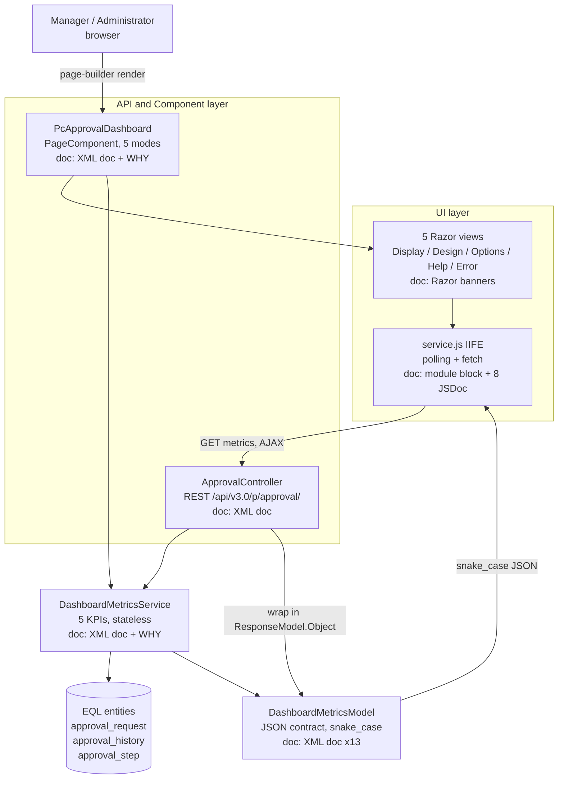
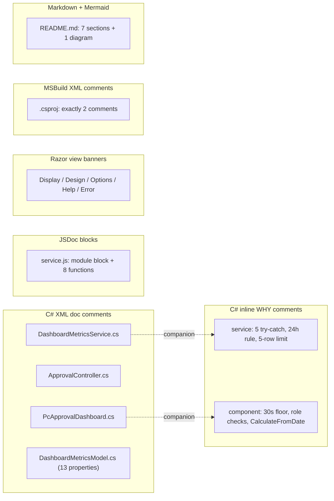
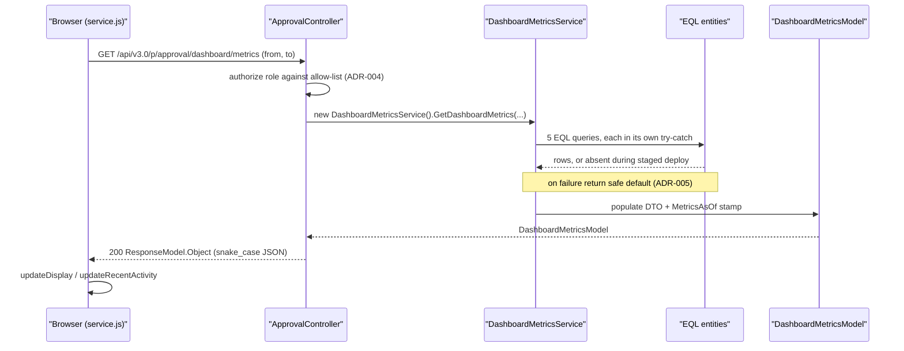

# Technical Specification

# 0. Agent Action Plan

## 0.1 Intent Clarification

This Agent Action Plan governs a **documentation-only** task on the `WebVella.Erp.Plugins.Approval` plugin (the "Manager Approval Dashboard"). No production behavior, signatures, names, return types, or attribute values are changed by this work; every deliverable is a comment, an XML doc block, or a new Markdown file.

### 0.1.1 Core Documentation Objective

Based on the provided requirements, the Blitzy platform understands that the documentation objective is to **produce complete inline and module-level documentation across all 11 source files of the `WebVella.Erp.Plugins.Approval` plugin, so that a developer unfamiliar with the codebase can understand the purpose, constraints, and non-obvious decisions of every component without reading the technical specification.**

- **Request category:** Create new documentation **and** Improve documentation coverage. The dominant action is authoring new inline documentation and one new module README; a meaningful subset of the work *enriches pre-existing partial XML-doc stubs* (an Update facet), and the project file receives a documentation-only Update (exactly two XML comments).
- **Documentation type:** Inline **API/code reference documentation** — C# XML doc comments (`///`), C# inline WHY-comments (`//`), JSDoc (`/** */`), Razor view banner comments (`@* *@`), and MSBuild XML comments (`<!-- -->`) — **plus one module-level README** (architecture and usage guide) at `WebVella.Erp.Plugins.Approval/Components/PcApprovalDashboard/README.md`.

The eight CRITICAL Directives translate to the following target files and required documentation:

| Directive | Target File | Documentation Required |
|-----------|-------------|------------------------|
| 1 | `Services/DashboardMetricsService.cs` [308 lines] | Method-header comments on the 5 KPI methods (business question + EQL entity + safe default); WHY comment on each `try/catch` (ADR-005 graceful degradation); `defaultTimeoutHours = 24` as a business rule [Services/DashboardMetricsService.cs:L112]; the 5-row limit as a deliberate performance boundary [Services/DashboardMetricsService.cs:L46] |
| 2 | `Controllers/ApprovalController.cs` [209 lines] | Class XML doc (route `/api/v3.0/p/approval/`, `JWT_OR_COOKIE`, `[Authorize]` inverted only by `[AllowAnonymous]` on health); `GetDashboardMetrics` (optional `from`/`to`, 30-day default, HTTP 400/403 conditions, stateless delegation); `GetDashboardHealth` `[AllowAnonymous]` rationale; `IsManagerRole()` allow-list + case-insensitivity; `AuthorizedDashboardRoles` single-source-of-truth + ADR-004 mirroring |
| 3 | `Components/PcApprovalDashboard/PcApprovalDashboard.cs` [301 lines] | Class comment (`[PageComponent]` identity, 5 render modes, ADR-004 duplicated enforcement); per-property comments on `PcApprovalDashboardOptions`; 30 s floor rationale [PcApprovalDashboard.cs:L145-L147]; role-check cross-reference; `CalculateFromDate` branch documentation + duplication note [PcApprovalDashboard.cs:L290-L299] |
| 4 | `Components/PcApprovalDashboard/service.js` [343 lines] | Module-level IIFE block comment (polling, Page Visibility API, page-builder hooks, `beforeunload`); `MIN_REFRESH_INTERVAL` mirrors server floor [service.js:L26]; `getDateRange` duplication note; silent-error rationale; `startAutoRefresh` idempotency guard; JSDoc on all 8 named functions |
| 5 | `Models/DashboardMetricsModel.cs` [99 lines] | Class comment (JSON contract wrapped in `ResponseModel.Object`); per-property XML doc + unit on all 13 properties; `MetricsAsOf` freshness stamp; `RecentActivityItem` 5-item cap; `[JsonProperty]` snake_case rationale |
| 6 | `Display.cshtml`, `Design.cshtml`, `Options.cshtml`, `Help.cshtml`, `Error.cshtml` | Top-of-file banner on all five; Display inline-script annotation; Options form-field → backing-property comments |
| 7 | `WebVella.Erp.Plugins.Approval.csproj` [29 lines] | Exactly two XML comments — `NewtonsoftJson` `<PackageReference>` rationale [.csproj:L22]; `service.js` `<EmbeddedResource>` rationale [.csproj:L18] |
| 8 | `Components/PcApprovalDashboard/README.md` (**new**) | 7-section module README, no code snippets, ≤ 600 words |

### 0.1.2 Special Instructions and Constraints

The following directives are captured exactly as emphasized by the user and govern every comment authored:

- **Comment quality rule (enforced on every comment):** Comments explain **WHY** (business rule, design decision, constraint) — **not WHAT** (code narration). **Maximum 2 sentences per inline comment block.**
- **No narration of self-evident code**, no TODO/placeholder comments, and **no Markdown boilerplate** beyond section headers and parameter tables in the README.
- **Exactly two** XML comments are permitted in the `.csproj`; no other project-file modification.
- **README hard limit:** "No code snippets. Max 600 words total." The user further specifies the failure/truncation rule verbatim: *"Output exceeding 600 words is a FAIL; truncate the lowest-priority sections first (Known Gaps, then Auto-refresh detail) to comply."*

**USER PROVIDED TEMPLATE — README required sections (preserved exactly):**

```
1. Purpose — What this PageComponent does and which user roles see it.
2. Architecture — The relationship between PcApprovalDashboard.cs, the 5 Razor views, service.js, ApprovalController, and DashboardMetricsService in 3–5 sentences.
3. Configuration options — Table of all 5 options with types and defaults (sourced from PcApprovalDashboardOptions).
4. Date range filtering — How presets (7d/30d/90d) flow from the Options panel → Display.cshtml seed → service.js getDateRange → API query params → DashboardMetricsService.
5. Auto-refresh — How setInterval, the Page Visibility API, and page-builder lifecycle hooks interact; the 30s polling floor and its rationale.
6. Authorization — The dual-layer enforcement pattern (PageComponent + Controller) and why it exists.
7. Known gaps — Custom date picker pending (AC3 partial); ApprovalPlugin.cs registration pending; service-layer unit tests pending.
```

**User-specified rule (project-level), preserved exactly:** *"All visual documentation MUST use Mermaid diagrams. Diagrams MUST be appropriate to the scope of the work … Every diagram MUST have a descriptive title and legend. Diagrams MUST be referenced by name in accompanying documentation. Do NOT describe architecture in prose when a diagram communicates it more clearly. If the deliverable modifies an existing architecture, both states MUST be shown — never target-state alone."*

- **Conflict resolution (README "no code snippets" vs. Mermaid rule):** A Mermaid diagram is a **diagram**, not a code snippet, so a single compact, titled-and-legended component-interaction diagram is permissible in the README Architecture section; node labels are kept terse to preserve the 600-word budget, and the diagram is referenced by name.
- **Conflict resolution (Mermaid "before/after" vs. "no architecture change"):** Because this is documentation-only, the plugin's **structural architecture is not modified**; the rule's before/after dimension is therefore satisfied by contrasting the **current (largely undocumented) state vs. the post-documentation state** (see §0.7), while the architecture itself is shown as a single current-state diagram.

### 0.1.3 Technical Interpretation

These documentation requirements translate to the following technical documentation strategy — an **inline-first** approach in which documentation lives inside the source files via the language's native mechanism, supplemented by one new Markdown module guide:

- To **document the KPI service**, we will extend `Services/DashboardMetricsService.cs` with XML doc headers on its six methods and inline WHY-comments on its five `try/catch` blocks and two magic numbers.
- To **document the REST surface**, we will extend `Controllers/ApprovalController.cs` class- and member-level XML doc, adding the currently-missing HTTP 400 `<response>` tag so all five status codes are traceable to comments at their emission sites.
- To **document the PageComponent and its options**, we will extend `Components/PcApprovalDashboard/PcApprovalDashboard.cs` with a class comment and per-property comments, cross-referencing the controller allow-list.
- To **document the client behavior**, we will extend `Components/PcApprovalDashboard/service.js` with a module block comment and JSDoc on all eight named functions.
- To **document the JSON contract**, we will complete the XML doc stubs on all 13 properties of `Models/DashboardMetricsModel.cs`.
- To **document the views**, we will add a banner comment to each of the five `.cshtml` files plus targeted inline annotations.
- To **document the build configuration**, we will add exactly two XML comments to `WebVella.Erp.Plugins.Approval.csproj`.
- To **provide a single entry point for new developers**, we will **create** `Components/PcApprovalDashboard/README.md` with the seven user-specified sections and one Mermaid diagram.

### 0.1.4 Inferred Documentation Needs

The following needs are not stated verbatim but are necessary for the work to be correct and complete; each is reflected in the scope and quality criteria below:

- **Enrichment, not pure greenfield.** Several files already carry partial XML-doc stubs, so a number of "create inline docs" items are in fact *updates*: the controller class doc [Controllers/ApprovalController.cs:L15-L19] and `AuthorizedDashboardRoles` doc [Controllers/ApprovalController.cs:L28-L30] exist but lack the route/auth/ADR-004 detail; `GetDashboardMetrics` has `<response>` tags for 200/401/403/500 but is **missing the 400 tag**; the component class doc [PcApprovalDashboard.cs:L18-L23] omits the five render modes; and **all 13 properties** of `DashboardMetricsModel` already have empty `<summary>` stubs to be filled.
- **Cross-file consistency for duplicated decisions.** Three deliberate duplications must be cross-referenced symmetrically so the rationale is discoverable from either side: `CalculateFromDate` [PcApprovalDashboard.cs:L290] ↔ `getDateRange` [service.js:L50]; the server 30 s floor [PcApprovalDashboard.cs:L145-L147] ↔ `MIN_REFRESH_INTERVAL` [service.js:L26]; and `AuthorizedRoles` [PcApprovalDashboard.cs:L41] ↔ `AuthorizedDashboardRoles` [Controllers/ApprovalController.cs:L31].
- **ADR traceability in comments.** ADR-004 (dual-layer authorization) and ADR-005 (graceful degradation) are the two recurring decisions and must be named in the relevant comments so a reader can trace intent.
- **Naming nuance to document accurately (ambiguity flag).** Directive 1 names the method `GetAverageApprovalTimeHours`, but the actual symbol is `GetAverageApprovalTime(DateTime, DateTime)` [Services/DashboardMetricsService.cs:L146]; the `Hours` suffix lives on the DTO property `AverageApprovalTimeHours` [Models/DashboardMetricsModel.cs:L23-L24], populated by the orchestrator [Services/DashboardMetricsService.cs:L44]. The documentation will describe the **real** symbols and note the property they feed.
- **The "5" lives at the call site (ambiguity flag).** `GetRecentActivity(int limit)` takes a parameter [Services/DashboardMetricsService.cs:L252]; the literal `5` is passed by the orchestrator at the call site [Services/DashboardMetricsService.cs:L46]. The performance-boundary annotation therefore belongs at the call site, while the method's `<param name="limit">` documents the cap generically.
- **Two distinct allow-list identifiers (ambiguity flag).** `AuthorizedRoles` (component) and `AuthorizedDashboardRoles` (controller) are **separately declared** constants holding the same `{manager, administrator, admin}` values; they are not a single shared constant. The documentation will describe them as two independently-declared allow-lists enforcing the same policy at two reachable entry points.

## 0.2 Documentation Discovery and Analysis

Repository analysis confirms the plugin is a self-contained, four-layer feature (UI → API/Component → Service → DTO) of approximately 2,095 lines across 11 files, with **no documentation-generation toolchain** of any kind present.

### 0.2.1 Existing Documentation Infrastructure Assessment

- **No documentation generator is configured anywhere in the repository** — there is no `docfx.json`, `mkdocs.yml`, `docusaurus.config.js`, `typedoc.json`, `jsdoc.json`, or Sphinx `conf.py`. Documentation is therefore not built into a site; it is consumed in-IDE and in the source tree.
- **No XML-documentation file is emitted.** The project file does **not** set `GenerateDocumentationFile` or `DocumentationFile` [WebVella.Erp.Plugins.Approval.csproj:L1-L29], so the `///` comments serve IDE IntelliSense and reader comprehension rather than a generated `.xml` artifact. This is consistent with the system boundary that forbids project-file changes beyond the two permitted comments.
- **Existing in-code documentation is partial.** The C# files already contain `///` stubs: a class summary and two method summaries in the service [Services/DashboardMetricsService.cs:L28-L34], a class summary and `AuthorizedDashboardRoles` summary in the controller [Controllers/ApprovalController.cs:L15-L19], a class summary on the component [Components/PcApprovalDashboard/PcApprovalDashboard.cs:L18-L23], and empty `<summary>` stubs on all 13 DTO properties [Models/DashboardMetricsModel.cs:L11-L97]. `service.js` and the five Razor views currently carry no structured header documentation.
- **README convention is minimal.** Sibling plugins ship two-line READMEs (for example, `WebVella.Erp.Plugins.SDK/README.md` is a title plus a one-line description); these establish a light heading-style precedent only and are recorded below as REFERENCE files.
- **Tooling already present** is sufficient for the deliverable: the .NET 9 SDK's built-in C# XML-doc support, the JSDoc convention (read natively by IDEs such as Visual Studio and VS Code), and Mermaid (rendered natively in Markdown viewers such as GitHub). No diagram CLI or doc framework needs installation.

### 0.2.2 Repository Code Analysis for Documentation

The code surface to be documented was inventoried directly from the 11 files:

- **Public APIs / service layer:** `DashboardMetricsService` exposes one orchestrator [Services/DashboardMetricsService.cs:L35] and five KPI methods — `GetPendingApprovalsCount` [L58], `GetOverdueRequestsCount` [L90], `GetAverageApprovalTime` [L146], `GetApprovalRate` [L205], and `GetRecentActivity` [L252] — each wrapping its query in a `try/catch` that returns a safe default. The service is instantiated statelessly via `new` from both the controller [Controllers/ApprovalController.cs:L152] and the component, with no dependency injection (ADR-002).
- **REST endpoints:** `ApprovalController` exposes `GetDashboardMetrics` at `api/v3.0/p/approval/dashboard/metrics` [Controllers/ApprovalController.cs:L113-L115] and `GetDashboardHealth` at `.../health` [Controllers/ApprovalController.cs:L187-L190]; the class is `[Authorize]` [L20] and the health endpoint is `[AllowAnonymous]` [L189].
- **PageComponent + configuration:** `PcApprovalDashboard` declares its identity via `[PageComponent(...)]` [Components/PcApprovalDashboard/PcApprovalDashboard.cs:L24-L30], a nested `PcApprovalDashboardOptions` with five options [L61-L94], a 30-second floor [L145-L147], and `CalculateFromDate` [L290].
- **Client module:** `service.js` is an IIFE [Components/PcApprovalDashboard/service.js:L14] with eight named functions (`initDashboard`, `getDateRange`, `formatTime`, `refreshMetrics`, `updateDisplay`, `updateRecentActivity`, `startAutoRefresh`, `stopAutoRefresh`) and the `MIN_REFRESH_INTERVAL = 30000` constant [L26].
- **Views:** `Display.cshtml` carries its **own** inline `<script>` block [Components/PcApprovalDashboard/Display.cshtml:L256-L355] separate from `service.js`; `Options.cshtml` renders form fields whose `name` attributes map to option properties [Components/PcApprovalDashboard/Options.cshtml:L30-L88]; `Error.cshtml` branches on access-denied vs. other validation errors [Components/PcApprovalDashboard/Error.cshtml:L6-L13].

The diagram below names the components, their interactions, and the documentation mechanism each one receives. It is the current-state architecture (unchanged by this task) and is referenced throughout this plan as **Diagram 0.2-A**.



**Diagram 0.2-A — Approval Dashboard Plugin: Current Component Architecture and Documentation Targets.** *Legend:* rectangles are code components annotated with the documentation mechanism each receives (`doc: …`); the cylinder is the EQL-backed data store; solid arrows are runtime calls/data flow; the two arrows into the API/Component layer represent the two independently reachable entry paths (direct URL → controller; page-builder → component) that motivate the dual-layer authorization documented under ADR-004.

### 0.2.3 Web Search Research Conducted

Targeted research validated the documentation conventions applied by this plan:

- **C# XML documentation comments** — Microsoft Learn guidance confirms that, for consistency, all publicly visible types and their public members should be documented; that, at minimum, types and members should carry a `<summary>` tag; that documentation text should be written as complete sentences ending with periods; and that the `<param>`/`<returns>` tags are compiler-verifiable. This supports the per-member XML doc approach for the five `.cs` files.
- **JSDoc** — the standard JSDoc convention uses `@param {Type} name - description` for each parameter and `@returns {Type} description` for the return value, within `/** … */` blocks, written concisely. This supports the JSDoc requirement on the eight `service.js` functions.
- **Mermaid** — Mermaid renders natively in Markdown viewers, requiring no build dependency, which supports satisfying the visual-documentation rule with zero added tooling.

## 0.3 Documentation Scope Analysis

This section maps each code module to the documentation it requires and states the gaps that the work closes. The analysis is exhaustive for the plugin; nothing is left "to be discovered."

### 0.3.1 Code-to-Documentation Mapping

**Modules requiring documentation:**

- **Module: `Services/DashboardMetricsService.cs`**
  - Public APIs: `GetDashboardMetrics` (orchestrator) [L35], `GetPendingApprovalsCount` [L58], `GetOverdueRequestsCount` [L90], `GetAverageApprovalTime` [L146], `GetApprovalRate` [L205], `GetRecentActivity` [L252].
  - Current documentation: partial — class + two method stubs exist [Services/DashboardMetricsService.cs:L28-L34]; the remaining methods, all five `catch` blocks, and two constants are undocumented.
  - Documentation needed: method-header XML doc (business question, EQL entity, safe default) on all six methods; WHY-comment on each `catch` (ADR-005); business-rule comment on `defaultTimeoutHours = 24` [L112]; performance-boundary comment on the `5` passed at [L46].

- **Module: `Controllers/ApprovalController.cs`**
  - Endpoints: `GET .../dashboard/metrics` [L113-L115], `GET .../dashboard/health` [L187-L190].
  - Current documentation: partial — class summary and `AuthorizedDashboardRoles` summary exist [L15-L19, L28-L30]; `GetDashboardMetrics` has `<response>` tags for 200/401/403/500 but **lacks the 400 tag**.
  - Documentation needed: class XML doc (route prefix, `JWT_OR_COOKIE`, `[Authorize]`/`[AllowAnonymous]` inversion); request/response documentation for both endpoints including the missing 400; `IsManagerRole()` allow-list + case-insensitivity [L92-L96]; ADR-004 single-source-of-truth annotation on `AuthorizedDashboardRoles` [L31-L36].

- **Module: `Components/PcApprovalDashboard/PcApprovalDashboard.cs`**
  - Public surface: the component class, its `[PageComponent]` attribute [L24-L30], `PcApprovalDashboardOptions` (5 options) [L61-L94], `InvokeAsync` [L103], `CalculateFromDate` [L290].
  - Current documentation: partial — class summary exists [L18-L23] but omits the five render modes and the ADR-004 duplication rationale; options and methods are undocumented.
  - Documentation needed: class comment (identity, five render modes, ADR-004 duplication); per-property option comments; 30 s floor rationale [L145-L147]; role-check cross-reference; per-branch documentation of `CalculateFromDate` with the duplication note.

- **Module: `Components/PcApprovalDashboard/service.js`**
  - Public surface: eight named functions plus the module IIFE and two constants.
  - Current documentation: none (no structured header or JSDoc).
  - Documentation needed: module-level block comment (polling, Page Visibility API, page-builder hooks, `beforeunload`); JSDoc (`@param`/`@returns`) on all eight functions; WHY-comments on `MIN_REFRESH_INTERVAL` [L26], `getDateRange` duplication [L50], silent error handling [L121-L122], and the `startAutoRefresh` idempotency guard [L258-L262].

- **Module: `Models/DashboardMetricsModel.cs`**
  - Public surface: `DashboardMetricsModel` (8 properties) and nested `RecentActivityItem` (5 properties).
  - Current documentation: empty `<summary>` stubs on all 13 properties.
  - Documentation needed: class contract comment; per-property XML doc with units; `MetricsAsOf` freshness-stamp rationale [L48-L49]; `RecentActivityItem` 5-item cap [L67]; `[JsonProperty]` snake_case rationale.

**Configuration options requiring documentation** (from `PcApprovalDashboardOptions`): `refresh_interval` (default 60, 30 s floor) [L65-L68], `date_range_default` (default `30d`; valid `7d/30d/90d/custom`) [L72-L75], `show_overdue_alert` (default `true`) [L81], `metrics_to_display` (default `pending,avg_time,approval_rate,overdue,recent`) [L88], `dashboard_title` (default `Approval Dashboard`) [L94]. Currently 0/5 documented; target 5/5, and all five surfaced in the README options table.

**Features requiring the module guide (README):** the dashboard's purpose and audience, the cross-component architecture, the five configuration options, the date-range filter flow, the auto-refresh behavior, the dual-layer authorization, and the known gaps — none of which currently has a consolidated developer-facing description.

### 0.3.2 Documentation Gap Analysis

Given the requirements and repository analysis, documentation gaps include:

- **Undocumented public APIs:** four of six service methods lack headers; both controller endpoints lack complete request/response documentation (and the 400 response is entirely absent); all eight `service.js` functions lack JSDoc; all five `PcApprovalDashboardOptions` properties lack comments.
- **Undocumented design decisions:** ADR-005 graceful degradation (five `catch` blocks), ADR-004 dual-layer authorization (two allow-lists), the 30 s polling floor (server and client), and the three deliberate duplications are not currently explained at the code sites.
- **Unexplained magic numbers:** `defaultTimeoutHours = 24` [L112] and the recent-activity limit `5` [L46] carry no business/performance rationale.
- **Missing module overview:** there is no README for the component, leaving a new developer without an entry point that ties the views, client script, controller, service, and DTO together.
- **Incomplete DTO contract documentation:** all 13 properties have empty summaries and no unit annotations, and the snake_case convention's purpose (the jQuery consumer) is undocumented.

No gap requires source-code or behavioral change to close; every gap is addressed by comments, XML doc, or the new README.

## 0.4 Documentation Implementation Design

The design is **inline-first**: each file is documented with the native mechanism for its language, and one new Markdown README provides the module overview. No documentation site, generator, or build step is introduced.

### 0.4.1 Documentation Structure Planning

Because the repository has no docs site and the system boundaries forbid adding one, documentation is not organized into a `docs/` tree. Instead it is co-located with the code it describes, in the existing plugin layout:

```
WebVella.Erp.Plugins.Approval/
├── WebVella.Erp.Plugins.Approval.csproj      (UPDATE: 2 MSBuild XML comments)
├── Controllers/
│   └── ApprovalController.cs                  (UPDATE: C# XML doc + inline WHY)
├── Services/
│   └── DashboardMetricsService.cs             (UPDATE: C# XML doc + inline WHY)
├── Models/
│   └── DashboardMetricsModel.cs               (UPDATE: C# XML doc on 13 properties)
└── Components/
    └── PcApprovalDashboard/
        ├── PcApprovalDashboard.cs             (UPDATE: C# XML doc + inline WHY)
        ├── service.js                         (UPDATE: module block + 8 JSDoc)
        ├── Display.cshtml                      (UPDATE: banner + inline-script note)
        ├── Design.cshtml                       (UPDATE: banner)
        ├── Options.cshtml                      (UPDATE: banner + field comments)
        ├── Help.cshtml                         (UPDATE: banner)
        ├── Error.cshtml                        (UPDATE: banner)
        └── README.md                           (CREATE: 7-section module guide)
```

### 0.4.2 Content Generation Strategy

**Information extraction approach** — every documentation statement is derived from the source itself; no behavior is inferred or invented:

- Method signatures, parameters, and return types are read from the service, controller, and component for the XML doc and JSDoc headers.
- KPI semantics and EQL entity names are taken from each metric method body in `Services/DashboardMetricsService.cs`.
- The JSON contract and units are read from the `[JsonProperty]` attributes and CLR types in `Models/DashboardMetricsModel.cs`.
- Option names and defaults for the README table and the Options field comments are read from `PcApprovalDashboardOptions` [Components/PcApprovalDashboard/PcApprovalDashboard.cs:L61-L94].

**Documentation standards applied:**

- C# XML doc uses `<summary>`, `<param>`, `<returns>`, and `<response>` tags, written as complete sentences ending with periods (per Microsoft guidance); the controller's missing 400 `<response>` is added so all five status codes are documented at their emission sites.
- JSDoc uses `/** … */` with `@param {Type} name - description` and `@returns {Type} description` on each named function.
- Razor banners use `@* … *@`; MSBuild comments use `<!-- … -->`; both kept to the WHY content the directives specify.
- Inline `//` comments obey the quality rule: WHY not WHAT, **≤ 2 sentences** per block, and name the governing ADR (ADR-004 or ADR-005) where relevant.
- Source citations: the README and these annotations reference real symbols and the duplicated-logic counterparts so a reader can navigate between them.

**Cross-referencing strategy for the three deliberate duplications** — each side names its counterpart and the reason:

- `CalculateFromDate` [PcApprovalDashboard.cs:L290] ↔ `getDateRange` [service.js:L50]: server-side seed on initial load vs. client-side computation on AJAX refresh.
- 30 s floor [PcApprovalDashboard.cs:L145-L147] ↔ `MIN_REFRESH_INTERVAL` [service.js:L26]: bound per-user request rate against the database from both layers.
- `AuthorizedRoles` [PcApprovalDashboard.cs:L41] ↔ `AuthorizedDashboardRoles` [Controllers/ApprovalController.cs:L31]: defense-in-depth across two reachable entry paths (ADR-004).

### 0.4.3 Diagram and Visual Strategy

Per the user's visual-documentation rule, architecture is communicated with named, titled, and legended Mermaid diagrams rather than prose. This plan defines three diagrams: **Diagram 0.2-A** (current component architecture, in §0.2), and the two below. The README will additionally embed one compact component-interaction diagram (see §0.5).

**Diagram 0.4-A** maps every documentation target to the mechanism that documents it:



**Diagram 0.4-A — Documentation Layer Mapping.** *Legend:* each subgraph is a single documentation mechanism; a node inside a subgraph is a file (or symbol group) documented by that mechanism; the dotted "companion" edges indicate that `DashboardMetricsService.cs` and `PcApprovalDashboard.cs` receive **both** XML doc headers and inline WHY-comments. This diagram is the authoring checklist for §0.5's transformation table.

**Diagram 0.4-B** captures the runtime data flow that the inline docs and README describe, so the documentation's claims about authorization, graceful degradation, and the snake_case contract are anchored to a concrete sequence:



**Diagram 0.4-B — Dashboard Metrics Request Sequence (documented data flow).** *Legend:* solid arrows are synchronous calls; dashed arrows are returns; the self-call on `ApprovalController` is the role-allow-list check that precedes stateless delegation; the note marks the ADR-005 graceful-degradation path that each service `catch` block documents. The 401/403/400/500 branches (omitted for clarity) are documented at their emission sites per Directive 2.

## 0.5 Documentation File Transformation Mapping

Every documentation target is enumerated below with its transformation mode. There are **11 UPDATE** targets (inline documentation only) and **1 CREATE** target (the README); there are **no DELETE** targets. REFERENCE entries are style precedents, not modified. The target file is listed first in each row.

### 0.5.1 File-by-File Documentation Plan

Transformation modes: **CREATE** (new documentation file), **UPDATE** (add documentation to an existing file), **DELETE** (remove obsolete documentation — none here), **REFERENCE** (used as a style/structure example, not modified).

| Target Documentation File | Transformation | Source Code/Docs | Content/Changes |
|---------------------------|----------------|------------------|-----------------|
| `WebVella.Erp.Plugins.Approval/Services/DashboardMetricsService.cs` | UPDATE | self | XML doc headers on `GetDashboardMetrics` + 5 KPI methods (business question, EQL entity, safe default); WHY-comment on each of the 5 `try/catch` blocks (ADR-005); business-rule comment on `defaultTimeoutHours = 24` [L112]; performance-boundary comment on the `5` at the call site [L46] |
| `WebVella.Erp.Plugins.Approval/Controllers/ApprovalController.cs` | UPDATE | self | Class XML doc (route `/api/v3.0/p/approval/`, `JWT_OR_COOKIE`, `[Authorize]`/`[AllowAnonymous]` inversion); `GetDashboardMetrics` doc + **add missing HTTP 400 `<response>`**, 30-day default, 401/403 conditions, stateless delegation; `GetDashboardHealth` `[AllowAnonymous]` rationale; `IsManagerRole()` allow-list + case-insensitivity; ADR-004 annotation on `AuthorizedDashboardRoles` |
| `WebVella.Erp.Plugins.Approval/Components/PcApprovalDashboard/PcApprovalDashboard.cs` | UPDATE | self | Class comment (`[PageComponent]` identity, 5 render modes, ADR-004 duplicated enforcement); per-property comments on the 5 `PcApprovalDashboardOptions`; 30 s floor rationale [L145-L147]; role-check cross-reference to the controller allow-list; per-branch `CalculateFromDate` doc + duplication note [L290-L299] |
| `WebVella.Erp.Plugins.Approval/Components/PcApprovalDashboard/service.js` | UPDATE | self | Module-level IIFE block comment (polling, Page Visibility API, page-builder hooks, `beforeunload`); JSDoc (`@param`/`@returns`) on all 8 named functions; WHY-comments on `MIN_REFRESH_INTERVAL` [L26], `getDateRange` duplication, silent error handling [L121-L122], `startAutoRefresh` idempotency guard [L258-L262] |
| `WebVella.Erp.Plugins.Approval/Models/DashboardMetricsModel.cs` | UPDATE | self | Class contract comment (response for `GET .../dashboard/metrics`, wrapped in `ResponseModel.Object`); fill XML doc on all 13 properties with KPI + unit; `MetricsAsOf` freshness-stamp note; `RecentActivityItem` 5-item-cap comment; `[JsonProperty]` snake_case rationale |
| `WebVella.Erp.Plugins.Approval/Components/PcApprovalDashboard/Display.cshtml` | UPDATE | self | Top-of-file banner (runtime view; manager/administrator/admin only; seeds `refreshInterval`/`dateRangeDefault`; `service.js` takes over after DOM load); comment on the inline `<script>` block explaining server-side option injection avoids a first-load race [L256-L355] |
| `WebVella.Erp.Plugins.Approval/Components/PcApprovalDashboard/Design.cshtml` | UPDATE | self | Top-of-file banner (page-builder Design mode only; hardcoded sample data; no real metrics fetched) |
| `WebVella.Erp.Plugins.Approval/Components/PcApprovalDashboard/Options.cshtml` | UPDATE | self | Top-of-file banner (config panel for `PcApprovalDashboardOptions`; persisted by page builder, rehydrated next render); inline comment on each form field naming its backing option property + default [L30-L88] |
| `WebVella.Erp.Plugins.Approval/Components/PcApprovalDashboard/Help.cshtml` | UPDATE | self | Top-of-file banner (static in-product documentation; Help mode; never fetched from the API) |
| `WebVella.Erp.Plugins.Approval/Components/PcApprovalDashboard/Error.cshtml` | UPDATE | self | Top-of-file banner (rendered on `ValidationException`; warning alert = access-denied; danger alert + validation list = other errors) [L6-L13] |
| `WebVella.Erp.Plugins.Approval/WebVella.Erp.Plugins.Approval.csproj` | UPDATE | self | **Exactly two** XML comments: `<EmbeddedResource>` `service.js` rationale (host `UseStaticFiles` serves from the plugin assembly) [L18]; `<PackageReference>` `NewtonsoftJson` rationale (only NuGet dep; platform JSON serialization for snake_case; others via framework reference) [L22] |
| `WebVella.Erp.Plugins.Approval/Components/PcApprovalDashboard/README.md` | CREATE | `PcApprovalDashboard.cs`, the 5 Razor views, `service.js`, `ApprovalController.cs`, `DashboardMetricsService.cs` | New 7-section module guide (Purpose, Architecture, Configuration options, Date range filtering, Auto-refresh, Authorization, Known gaps); one Mermaid component diagram; **no code snippets; ≤ 600 words** |
| `WebVella.Erp.Plugins.SDK/README.md`, `WebVella.Erp.Plugins.Mail/README.md` | REFERENCE | n/a | Sibling-plugin READMEs used only as a heading-style precedent (title + short description); **not modified** |
| Existing `///` stubs in the 5 `.cs` files | REFERENCE | n/a | Existing XML-doc voice/style used as a consistency precedent; the stubs themselves are enriched (see UPDATE rows) |

### 0.5.2 New Documentation Files Detail

```
File: WebVella.Erp.Plugins.Approval/Components/PcApprovalDashboard/README.md
Type: Module-level developer guide (Markdown)
Source: PcApprovalDashboard.cs, Display/Design/Options/Help/Error.cshtml, service.js, ApprovalController.cs, DashboardMetricsService.cs
Sections (exactly the 7 user-specified, in order):
    1. Purpose — what the PageComponent does; visible only to manager/administrator/admin
    2. Architecture — PcApprovalDashboard.cs ↔ 5 Razor views ↔ service.js ↔ ApprovalController ↔ DashboardMetricsService (3–5 sentences) + 1 Mermaid diagram
    3. Configuration options — table of all 5 options (type + default) from PcApprovalDashboardOptions
    4. Date range filtering — preset flow: Options panel → Display.cshtml seed → service.js getDateRange → API query params → DashboardMetricsService
    5. Auto-refresh — setInterval + Page Visibility API + page-builder hooks; 30s floor rationale
    6. Authorization — dual-layer (PageComponent + Controller) enforcement and why (ADR-004)
    7. Known gaps — custom date picker pending (AC3 partial); ApprovalPlugin.cs registration pending; service-layer unit tests pending
Diagram: ONE compact, titled + legended Mermaid component-interaction diagram, referenced by name (terse labels to respect the word budget)
Constraints: NO code snippets; ≤ 600 words; if over, truncate Known Gaps first, then Auto-refresh detail
Key citations: PcApprovalDashboard.cs (options L61-L94; modes L245-L262), ApprovalController.cs (routes L113-L190), DashboardMetricsService.cs (KPIs)
```

### 0.5.3 Documentation Files to Update Detail

Representative high-value updates (full set in §0.5.1):

- **`Services/DashboardMetricsService.cs`** — six method headers; five ADR-005 `catch` comments; two magic-number comments. Documents `GetAverageApprovalTime` accurately and notes it feeds the DTO property `AverageApprovalTimeHours`.
- **`Controllers/ApprovalController.cs`** — the only update that touches a documentation completeness defect: the **HTTP 400 `<response>` tag is added** so 200/400/401/403/500 are all documented; class doc gains the route/auth/AllowAnonymous narrative.
- **`Components/PcApprovalDashboard/service.js`** — module block comment plus eight JSDoc headers; the three deliberate design choices (silent failure, polling floor, date duplication) each get a WHY comment.
- **`Models/DashboardMetricsModel.cs`** — all 13 empty `<summary>` stubs filled with KPI + unit; snake_case rationale added once at the class level and referenced.
- **`WebVella.Erp.Plugins.Approval.csproj`** — exactly two comments, no other change.

### 0.5.4 Documentation Configuration Updates

**None.** No documentation generator or site configuration exists (`mkdocs.yml`, `docusaurus.config.js`, `.readthedocs.yml`, `docfx.json`, Sphinx `conf.py`), and the system boundaries forbid introducing one. The `.csproj` is **not** switched to emit an XML documentation file; its only change is the two permitted comments [WebVella.Erp.Plugins.Approval.csproj:L18, L22].

### 0.5.5 Cross-Documentation Dependencies

- **Symmetric cross-references** must stay consistent across the three duplicated-logic pairs (date-range, refresh floor, allow-list) so the rationale is reachable from either file.
- **README ↔ code consistency:** the README options table (Section 3) must match `PcApprovalDashboardOptions` defaults exactly [Components/PcApprovalDashboard/PcApprovalDashboard.cs:L61-L94]; the README date-range flow (Section 4) must match `CalculateFromDate`/`getDateRange`; the README authorization section (Section 6) must match the two allow-lists.
- **No internal documentation links require rewriting** (there is no existing docs tree), so there are no link-transformation rules to apply.

## 0.6 Dependency Inventory

**No dependency changes occur in this task.** No documentation packages are added, updated, or removed, and the system boundaries forbid modifying the `.csproj` beyond two comments. The documentation mechanisms used are all already available in the toolchain.

### 0.6.1 Documentation Dependencies

The "tooling" for this exercise is native to the existing stack and requires no installation:

| Registry | Tool / Mechanism | Version | Purpose |
|----------|------------------|---------|---------|
| Built-in (.NET SDK) | C# XML documentation comments | `net9.0` target framework [WebVella.Erp.Plugins.Approval.csproj:L4] | IDE IntelliSense and reader comprehension for the 5 `.cs` files (no `.xml` artifact emitted) |
| Convention (IDE-native) | JSDoc annotations | n/a (no package; read by Visual Studio / VS Code) | Document the 8 named functions in `service.js` |
| Markdown-native | Mermaid diagrams | n/a (rendered by Markdown viewers / GitHub) | Architecture diagrams in this AAP and the README |

For context, the plugin's single NuGet dependency is the **subject** of a Directive-7 comment, not a documentation dependency:

| Registry | Package Name | Version | Role in this task |
|----------|--------------|---------|-------------------|
| nuget | `Microsoft.AspNetCore.Mvc.NewtonsoftJson` | `9.0.10` [WebVella.Erp.Plugins.Approval.csproj:L22] | Runtime JSON serialization for the `[JsonProperty]` snake_case contract; **documented**, not added or changed |

All other framework types are provided by the `Microsoft.AspNetCore.App` framework reference [WebVella.Erp.Plugins.Approval.csproj:L10]; the build SDK is `Microsoft.NET.Sdk.Razor` [WebVella.Erp.Plugins.Approval.csproj:L1].

### 0.6.2 Documentation Reference Updates

**Not applicable.** There is no existing documentation tree or cross-document link graph, so no link transformations are required. The only inter-document consistency obligations are the symmetric code-comment cross-references and the README-to-code consistency described in §0.5.5.

## 0.7 Coverage and Quality Targets

The target is **100% documentation coverage of the plugin's public surface** plus a module overview, achieved entirely through comments and one new README — with zero behavioral change.

### 0.7.1 Documentation Coverage Metrics

The table contrasts the **current (largely undocumented) state** with the **post-documentation target**. This before/after view satisfies the visual-documentation rule's two-state requirement for a deliverable that does not alter the architecture itself (only its documentation coverage changes).

| Documentation Surface | Current Coverage | Target Coverage |
|-----------------------|------------------|-----------------|
| Service methods (`DashboardMetricsService`) | 2/6 stubs [L28-L34] | 6/6 full headers |
| Service `try/catch` WHY-comments (ADR-005) | 0/5 (weak one-liners) | 5/5 |
| Service magic numbers (`24`, `5`) | 0/2 | 2/2 |
| Controller endpoints (`ApprovalController`) | 2/2 partial; **400 response missing** | 2/2 complete (200/400/401/403/500) |
| `service.js` named functions (JSDoc) | 0/8 | 8/8 + module block |
| `PcApprovalDashboardOptions` properties | 0/5 | 5/5 |
| `DashboardMetricsModel` properties (XML doc) | 0/13 (empty stubs) | 13/13 with units |
| Razor view banners | 0/5 | 5/5 |
| `.csproj` rationale comments | 0/2 | 2/2 |
| Module README | Absent | Present (7 sections, ≤ 600 words) |

Target coverage is 100% of the listed surface, based on the directives' explicit success criteria (every method/property documented; every status code traceable; both `.csproj` comments present; all five view banners present; README complete and within budget).

### 0.7.2 Documentation Quality Criteria

- **Completeness:** every public type and member carries at least a `<summary>`; every named JS function carries `@param`/`@returns`; the README contains all seven sections.
- **Accuracy (anchored to real symbols):** comments describe the actual code — `GetAverageApprovalTime` (not `GetAverageApprovalTimeHours`) [Services/DashboardMetricsService.cs:L146]; the `5` documented at the call site [L46]; `AuthorizedRoles` and `AuthorizedDashboardRoles` described as two distinct allow-lists; the README options table matches `PcApprovalDashboardOptions` defaults exactly.
- **Clarity / WHY-not-WHAT:** comments explain rationale (business rule, design decision, constraint), never narrate self-evident code; **maximum 2 sentences per inline block**; C# XML doc uses complete sentences ending with periods (per Microsoft guidance).
- **Traceability:** ADR-004 (dual-layer authorization) and ADR-005 (graceful degradation) are named at the relevant sites; the three duplicated-logic pairs are cross-referenced symmetrically.
- **Maintainability:** documentation is co-located with the code it describes, minimizing drift; no new toolchain is introduced to maintain.

### 0.7.3 Example and Diagram Requirements

- **Code examples:** **none in the README** — the directive forbids code snippets; usage is conveyed through the configuration-options table and the date-range/auto-refresh narrative flows instead. (XML doc `<example>` blocks are not required by any directive and are omitted to honor the "no narration / minimal" rule.)
- **Diagrams:** four total — **Diagram 0.2-A** (current component architecture), **Diagram 0.4-A** (documentation layer mapping), **Diagram 0.4-B** (request sequence), and **one** compact component-interaction diagram embedded in the README. Each diagram has a descriptive title and a legend and is referenced by name.
- **Verification:** README compliance is checked by section-presence (all 7) and a word count ≤ 600 (truncate Known Gaps, then Auto-refresh detail, if exceeded); controller completeness is checked by confirming all five HTTP status codes are traceable to comments at their emission sites; the `.csproj` is checked for exactly two comments and no other change.

## 0.8 Scope Boundaries

Scope is confined to documentation changes within the `WebVella.Erp.Plugins.Approval/` directory. Everything else — including all host projects and sibling plugins — is explicitly out of scope.

### 0.8.1 Exhaustively In Scope

- **C# inline/XML documentation (comment-only changes):**
  - `WebVella.Erp.Plugins.Approval/Services/DashboardMetricsService.cs`
  - `WebVella.Erp.Plugins.Approval/Controllers/ApprovalController.cs`
  - `WebVella.Erp.Plugins.Approval/Models/DashboardMetricsModel.cs`
  - `WebVella.Erp.Plugins.Approval/Components/PcApprovalDashboard/PcApprovalDashboard.cs`
- **JavaScript documentation (comment-only changes):**
  - `WebVella.Erp.Plugins.Approval/Components/PcApprovalDashboard/service.js`
- **Razor view documentation (comment-only changes):**
  - `WebVella.Erp.Plugins.Approval/Components/PcApprovalDashboard/*.cshtml` (all five: `Display`, `Design`, `Options`, `Help`, `Error`)
- **Project-file documentation (exactly two XML comments):**
  - `WebVella.Erp.Plugins.Approval/WebVella.Erp.Plugins.Approval.csproj`
- **New module documentation (the only new file):**
  - `WebVella.Erp.Plugins.Approval/Components/PcApprovalDashboard/README.md`

### 0.8.2 Explicitly Out of Scope

- **Any production logic** in `.cs`, `.cshtml`, or `service.js` — no behavioral change of any kind.
- **Function signatures, method names, property names, and return types** — documented, never renamed or re-typed.
- **The `[JsonProperty]` attribute values** on `DashboardMetricsModel` (the snake_case JSON keys) — referenced in comments, never altered.
- **The `AuthorizedDashboardRoles` constant value or structure** [Controllers/ApprovalController.cs:L31-L36] and the mirrored `AuthorizedRoles` [PcApprovalDashboard.cs:L41] — documented, never modified.
- **The `.csproj` beyond the two permitted comments** — no `GenerateDocumentationFile`, no new packages, no target/SDK changes.
- **Any file outside `WebVella.Erp.Plugins.Approval/`** — the host projects (`WebVella.Erp`, `WebVella.Erp.Web`, `WebVella.Erp.Site`) and all sibling plugins (`Crm`, `Mail`, `MicrosoftCDM`, `Next`, `Project`, `SDK`) are out of scope; sibling READMEs are read only as a REFERENCE style precedent.
- **Documentation generator / site configuration** — none exists and none is added (`mkdocs.yml`, `docusaurus.config.js`, `.readthedocs.yml`, `docfx.json`, Sphinx `conf.py`).
- **Any new file other than the README**, and **no TODO/placeholder comments** or verbose code-narration comments.
- **Test code and test documentation** — no test files are added or modified (the absence of service-layer unit tests is *noted* in the README Known Gaps section but not addressed here).
- **`ApprovalPlugin.cs` registration** — noted as a known gap in the README, not implemented.

## 0.9 Execution Parameters

Because no documentation toolchain exists, there are no documentation build, preview, or deployment commands. The parameters below describe how the documentation is authored, formatted, and validated against the directives.

### 0.9.1 Documentation-Specific Instructions

- **Documentation build command:** none. Documentation is not generated; the project compiles normally. A read-only sanity build verifies that added comments (especially Razor banners and well-formed XML doc) do not break compilation: `dotnet build WebVella.Erp.Plugins.Approval/WebVella.Erp.Plugins.Approval.csproj`.
- **Documentation preview command:** none. The README and its Mermaid diagram render in any Markdown viewer (GitHub, IDE Markdown preview); XML doc and JSDoc surface in IDE IntelliSense.
- **Diagram generation command:** none. Mermaid blocks are rendered by the Markdown viewer; no diagram CLI is installed or required.
- **Documentation deployment command:** not applicable (no docs site).
- **Default format:** Markdown with Mermaid for the README and this plan; C# XML doc (`///`) and inline `//` for `.cs`; JSDoc (`/** */`) for `service.js`; Razor comments (`@* *@`) for `.cshtml`; MSBuild XML comments (`<!-- -->`) for the `.csproj`.
- **Citation requirement:** every comment references the real symbol it documents, and the three duplicated-logic pairs cross-reference their counterpart file/symbol so intent is reachable from either side.
- **Style guide to follow:** the existing `///` stub voice in the five `.cs` files, the minimal sibling-plugin README heading style, Microsoft's C# XML-doc conventions (every public member ≥ `<summary>`, complete sentences), and the standard JSDoc `@param`/`@returns` convention.
- **Documentation validation:**
  - README: confirm all seven sections present, **no code snippets**, and word count ≤ 600 (truncate Known Gaps, then Auto-refresh detail, if exceeded).
  - Controller: confirm all five HTTP status codes (200/400/401/403/500) are traceable to comments at their emission sites, including the newly added 400 `<response>`.
  - `.csproj`: confirm exactly two comments and no other modification.
  - Build: `dotnet build` of the plugin succeeds with no new warnings introduced by the documentation.

## 0.10 Rules for Documentation

The following rules are explicitly emphasized by the user and govern this documentation work. They are reproduced faithfully and bind every comment and the README.

### 0.10.1 User-Specified Project Rule — Visual Architecture Documentation

- All visual documentation **MUST use Mermaid diagrams**.
- Diagrams **MUST be appropriate to the scope** of the work.
- Every diagram **MUST have a descriptive title and a legend**.
- Diagrams **MUST be referenced by name** in the accompanying documentation.
- **Do NOT describe architecture in prose** when a diagram communicates it more clearly.
- If the deliverable **modifies an existing architecture, both states (before/after) MUST be shown** — never target-state alone.
- **Applied here:** all diagrams in this plan and the README are Mermaid, each with a title and legend, each referenced by name (Diagram 0.2-A, 0.4-A, 0.4-B, and the README component diagram). Because this is documentation-only, the architecture is **not** modified; the before/after requirement is satisfied by the current-vs-post-documentation coverage table in §0.7, and the architecture is shown as a single current-state diagram (§0.2). A Mermaid diagram in the README is treated as a diagram (permitted), not a code snippet (forbidden).

### 0.10.2 Directive-Mandated Documentation Rules

- **"Explain WHY, not WHAT"** on every comment added — no narration of self-evident code.
- **Maximum 2 sentences per inline comment block.**
- **C# XML doc:** every public type and member carries at least a `<summary>`; the controller's missing HTTP 400 `<response>` is added so all status codes are documented.
- **JSDoc** (`@param`, `@returns`) on **all** named functions in `service.js`.
- **`.csproj`: exactly two XML comments** (the `NewtonsoftJson` `<PackageReference>` rationale and the `service.js` `<EmbeddedResource>` rationale) — no other project-file change.
- **README:** the **seven specified sections in order**, **no code snippets**, **≤ 600 words**; if over budget, truncate Known Gaps first, then Auto-refresh detail.
- **No TODO/placeholder comments** and **no Markdown boilerplate** beyond section headers and parameter tables.
- **Cross-file consistency:** the three deliberate duplications (date-range logic, refresh floor, role allow-list) are cross-referenced symmetrically, naming ADR-004 / ADR-005 where relevant.
- **Accuracy over the prompt's shorthand:** document the real symbols — `GetAverageApprovalTime` (feeding the `AverageApprovalTimeHours` property), the recent-activity `5` at the call site, and the two distinctly-named allow-lists.
- **No source-code, signature, name, return-type, `[JsonProperty]`-value, or `AuthorizedDashboardRoles` changes** — documentation only.

## 0.11 Attachments

- **File attachments:** None. No PDF, image, or document attachments were provided for this project.
- **Figma attachments:** None. No Figma frames or design URLs were provided; consequently no Figma design analysis and no design-system compliance sub-section apply to this documentation task.
- **External reference URLs:** None supplied by the user. The only external sources consulted were public best-practice references for C# XML documentation comments and JSDoc conventions (see §0.2.3), used to validate authoring conventions; no third-party content is reproduced in the deliverables.
- **In-repository reference files** (not attachments, listed for completeness): the existing sibling-plugin READMEs (`WebVella.Erp.Plugins.SDK/README.md`, `WebVella.Erp.Plugins.Mail/README.md`) and the pre-existing `///` doc stubs in the five `.cs` files, used solely as style precedents per §0.5.1.

