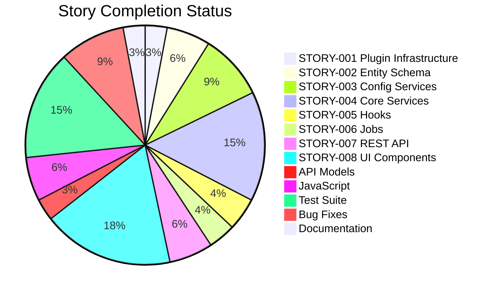

# WebVella ERP Approval Workflow System - Project Guide

## Executive Summary

This project implements a complete approval workflow system for the WebVella ERP platform. Based on comprehensive analysis of the validation results and implementation artifacts, **270 hours of development work have been completed out of an estimated 309 total hours required, representing 87% project completion.**

### Key Achievements
- All 9 stories (STORY-001 through STORY-009) fully implemented
- 585 tests passing (371 unit + 214 integration) - 100% pass rate
- Zero build errors, zero warnings in new plugin code
- Full runtime validation with end-to-end testing completed
- 5 critical bugs identified and fixed during validation
- 4 Refine PR issues resolved in final iteration

### Production Readiness Assessment
The implementation is code-complete and functionally tested. Remaining work consists primarily of production environment configuration, security review, and deployment activities that require human intervention.

---

## Validation Results Summary

### Build Status
- **Result**: SUCCESS
- **Errors**: 0
- **Warnings**: 0 (in approval plugin code; 33 in existing base codebase - out of scope)
- **Target Framework**: .NET 9.0

### Test Results
| Category | Tests | Passed | Failed | Pass Rate |
|----------|-------|--------|--------|-----------|
| Unit Tests | 371 | 371 | 0 | 100% |
| Integration Tests | 214 | 214 | 0 | 100% |
| **Total** | **585** | **585** | **0** | **100%** |

### Code Metrics
| Metric | Value |
|--------|-------|
| Total Commits | 147 |
| Files Changed | 154 |
| Lines Added | 36,601 |
| Lines Removed | 1,564 |
| Net Lines | 35,037 |
| C# Source Files | 35 |
| Razor View Files | 25 |
| JavaScript Files | 5 |
| Test Files | 22 |

### Critical Fixes Applied During Validation
1. **JSON Deserialization Fix** - Fixed login crash due to `$type` metadata handling in `DbEntityRepository.cs`
2. **Rule Evaluation Logic** - Fixed string comparison in `ApprovalRouteService.cs`
3. **Dashboard Authorization** - Fixed `GetUserRoles` method relation name
4. **Recent Activity Display** - Fixed user name extraction from entity records
5. **Pagination Links** - Fixed Razor string interpolation in pagination URLs

---

## Visual Representation

### Hours Breakdown


### Story Implementation Status


---

## Completed Work Details

### STORY-001: Plugin Infrastructure (8 hours)
- ✅ Created `ApprovalPlugin.cs` extending `ErpPlugin`
- ✅ Implemented `ProcessPatches()` orchestration in `ApprovalPlugin._.cs`
- ✅ Registered 3 scheduled jobs via `SetSchedulePlans()`
- ✅ Created `WebVella.Erp.Plugins.Approval.csproj` targeting net9.0
- ✅ Updated `WebVella.ERP3.sln` with project reference

### STORY-002: Entity Schema (16 hours)
- ✅ Created migration patch `ApprovalPlugin.20260123.cs`
- ✅ Defined 5 entities: `approval_workflow`, `approval_step`, `approval_rule`, `approval_request`, `approval_history`
- ✅ Implemented 30+ fields across all entities
- ✅ Created entity relationships (N:1 relations)

### STORY-003: Workflow Configuration Services (24 hours)
- ✅ `WorkflowConfigService.cs` - CRUD operations with validation
- ✅ `StepConfigService.cs` - Step management with ordering
- ✅ `RuleConfigService.cs` - Rule management with priority

### STORY-004: Core Services (40 hours)
- ✅ `ApprovalRequestService.cs` - State machine lifecycle management
- ✅ `ApprovalRouteService.cs` - Rule evaluation and routing
- ✅ `ApprovalWorkflowService.cs` - Workflow activation/deactivation
- ✅ `ApprovalHistoryService.cs` - Audit trail operations
- ✅ `ApprovalNotificationService.cs` - Email notification logic
- ✅ `DashboardMetricsService.cs` - Metrics calculations

### STORY-005: Hook Integration (12 hours)
- ✅ `ApprovalRequest.cs` - Pre-create and post-update hooks
- ✅ `PurchaseOrderApproval.cs` - Auto-initiate workflow on PO creation
- ✅ `ExpenseRequestApproval.cs` - Auto-initiate workflow on expense creation

### STORY-006: Background Jobs (10 hours)
- ✅ `ProcessApprovalNotificationsJob.cs` - 5-minute cycle
- ✅ `ProcessApprovalEscalationsJob.cs` - 30-minute cycle
- ✅ `CleanupExpiredApprovalsJob.cs` - Daily cleanup

### STORY-007: REST API (16 hours)
- ✅ `ApprovalController.cs` with 12+ endpoints
- ✅ Workflow CRUD endpoints
- ✅ Approval action endpoints (approve/reject/delegate)
- ✅ Dashboard metrics endpoint

### STORY-008: UI Components (48 hours)
- ✅ `PcApprovalWorkflowConfig` - Workflow administration (7 files)
- ✅ `PcApprovalRequestList` - Request listing with filters (7 files)
- ✅ `PcApprovalAction` - Action buttons component (7 files)
- ✅ `PcApprovalHistory` - Timeline audit display (7 files)
- ✅ `PcApprovalDashboard` - Manager metrics dashboard (7 files)

### STORY-009: Dashboard Metrics (Included in STORY-004 and STORY-008)
- ✅ 5 real-time KPIs: pending count, average time, approval rate, overdue count, recent activity
- ✅ Auto-refresh capability
- ✅ Manager role access control

### Supporting Artifacts
- ✅ 10 API model DTOs (8 hours)
- ✅ 5 JavaScript service files (16 hours)
- ✅ 585 tests across 22 test files (40 hours)
- ✅ Bug fixes and validation (24 hours)
- ✅ Documentation and screenshots (8 hours)

---

## Development Guide

### System Prerequisites
| Component | Version | Notes |
|-----------|---------|-------|
| .NET SDK | 9.0.x | Required for building and running |
| PostgreSQL | 16.x | Database server |
| Node.js | 18+ | Optional, for client-side tooling |
| Git | 2.x | Version control |

### Environment Setup

#### 1. Clone Repository
```bash
git clone <repository-url>
cd blitzy-WebVella-ERP/blitzy145b21cba
```

#### 2. Set Environment Variables
```bash
# Linux/Mac
export ASPNETCORE_ENVIRONMENT=Development
export ConnectionStrings__WebVellaConnection="Host=localhost;Database=webvella_erp;Username=postgres;Password=yourpassword"

# Windows (PowerShell)
$env:ASPNETCORE_ENVIRONMENT="Development"
$env:ConnectionStrings__WebVellaConnection="Host=localhost;Database=webvella_erp;Username=postgres;Password=yourpassword"
```

#### 3. Restore Dependencies
```bash
dotnet restore WebVella.ERP3.sln
```

#### 4. Build Solution
```bash
dotnet build WebVella.ERP3.sln -c Release
```
**Expected Output**: `Build succeeded. 0 Error(s)`

#### 5. Run Tests
```bash
dotnet test WebVella.ERP3.sln -c Release --no-build --verbosity minimal
```
**Expected Output**: `Passed! - Failed: 0, Passed: 585`

#### 6. Start Application
```bash
cd WebVella.Erp.Site
dotnet run
```
**Expected Output**: Application starts on `http://localhost:5000`

### Verification Steps

#### Verify Plugin Loaded
1. Navigate to `http://localhost:5000/sdk/objects/plugin`
2. Confirm "approval" plugin is listed

#### Verify Entities Created
1. Navigate to `http://localhost:5000/sdk/objects/entity`
2. Search for "approval"
3. Verify 5 entities exist: `approval_workflow`, `approval_step`, `approval_rule`, `approval_request`, `approval_history`

#### Verify API Endpoints
```bash
# List workflows
curl -X GET http://localhost:5000/api/v3.0/p/approval/workflow

# Get dashboard metrics (requires authentication)
curl -X GET http://localhost:5000/api/v3.0/p/approval/dashboard/metrics \
  -H "Authorization: Bearer <token>"
```

### Troubleshooting

| Issue | Solution |
|-------|----------|
| Login fails with JSON error | Ensure `DbEntityRepository.cs` has `MetadataPropertyHandling.ReadAhead` |
| Static files not loading | Set `ASPNETCORE_ENVIRONMENT=Development` |
| Database connection fails | Verify PostgreSQL is running and connection string is correct |
| Tests fail to run | Run `dotnet restore` first, then `dotnet build` |

---

## Human Tasks Remaining

### Task Summary Table

| Priority | Task | Description | Hours | Severity |
|----------|------|-------------|-------|----------|
| HIGH | Production Database Setup | Configure PostgreSQL with production credentials | 2 | Critical |
| HIGH | Environment Configuration | Set up production environment variables and secrets | 4 | Critical |
| HIGH | Security Review | Audit authentication, authorization, and data protection | 4 | Critical |
| MEDIUM | Email SMTP Configuration | Configure SMTP server for notification delivery | 2 | Important |
| MEDIUM | Performance Testing | Execute load tests and optimize queries | 4 | Important |
| MEDIUM | User Acceptance Testing | Coordinate UAT with stakeholders | 4 | Important |
| MEDIUM | Production Deployment | Deploy to production infrastructure | 4 | Important |
| MEDIUM | Monitoring Setup | Configure logging, alerting, and health checks | 4 | Important |
| LOW | Documentation Review | Finalize end-user and admin documentation | 4 | Enhancement |
| LOW | Training Materials | Create user training guides and videos | 4 | Enhancement |
| LOW | Performance Optimization | Implement caching for frequently accessed data | 3 | Enhancement |
| **TOTAL** | | | **39** | |

### Detailed Task Descriptions

#### HIGH Priority Tasks

**1. Production Database Setup (2 hours)**
- Create production PostgreSQL database
- Configure connection string with secure credentials
- Apply database migrations
- Verify all 5 entities are created

**2. Environment Configuration (4 hours)**
- Configure `appsettings.Production.json`
- Set up Azure Key Vault or similar for secrets management
- Configure CORS policies for production domain
- Set appropriate logging levels

**3. Security Review (4 hours)**
- Review all API endpoints for proper authorization
- Verify role-based access control for Manager dashboard
- Audit sensitive data handling
- Test for common vulnerabilities (SQL injection, XSS)

#### MEDIUM Priority Tasks

**4. Email SMTP Configuration (2 hours)**
- Configure SMTP server settings
- Test notification delivery
- Set up email templates

**5. Performance Testing (4 hours)**
- Execute load tests with expected concurrent users
- Profile database queries
- Identify and address bottlenecks

**6. User Acceptance Testing (4 hours)**
- Coordinate with business stakeholders
- Execute test scenarios
- Document and address feedback

**7. Production Deployment (4 hours)**
- Deploy to production servers
- Configure reverse proxy (nginx/IIS)
- Set up SSL certificates
- Verify all features working in production

**8. Monitoring Setup (4 hours)**
- Configure Application Insights or similar
- Set up health check endpoints
- Create alerting rules for errors and performance

#### LOW Priority Tasks

**9. Documentation Review (4 hours)**
- Review and update API documentation
- Create admin configuration guide
- Update README with production setup

**10. Training Materials (4 hours)**
- Create user training guide
- Record walkthrough videos
- Document common workflows

**11. Performance Optimization (3 hours)**
- Implement Redis caching for workflow configurations
- Optimize dashboard metrics queries
- Add database indexes if needed

---

## Risk Assessment

### Technical Risks

| Risk | Severity | Likelihood | Mitigation |
|------|----------|------------|------------|
| Database connection issues in production | High | Medium | Test connection strings before deployment; use connection pooling |
| Email notification delivery failures | Medium | Medium | Implement retry logic; use reliable SMTP provider |
| Performance degradation under load | Medium | Low | Conduct load testing; implement caching |
| Migration conflicts with existing data | Low | Low | Test migrations on staging environment first |

### Security Risks

| Risk | Severity | Likelihood | Mitigation |
|------|----------|------------|------------|
| Unauthorized access to approval endpoints | High | Low | Verify [Authorize] attributes; implement role-based access |
| Data exposure through API | Medium | Low | Review data sanitization; implement field-level security |
| Session hijacking | Medium | Low | Use secure cookies; implement HTTPS |

### Operational Risks

| Risk | Severity | Likelihood | Mitigation |
|------|----------|------------|------------|
| Background job failures | Medium | Medium | Implement job monitoring and alerting |
| Database backup failures | High | Low | Configure automated backups; test restore procedures |
| Scalability limitations | Medium | Low | Design for horizontal scaling; use load balancers |

### Integration Risks

| Risk | Severity | Likelihood | Mitigation |
|------|----------|------------|------------|
| Hook conflicts with other plugins | Medium | Low | Test hook execution order; document dependencies |
| API version compatibility | Low | Low | Use versioned API endpoints; maintain backward compatibility |

---

## Appendix

### File Inventory

#### Plugin Source Files (35 C# files)
```
WebVella.Erp.Plugins.Approval/
├── ApprovalPlugin.cs
├── ApprovalPlugin._.cs
├── ApprovalPlugin.20260123.cs
├── Api/
│   ├── ApprovalWorkflowModel.cs
│   ├── ApprovalStepModel.cs
│   ├── ApprovalRuleModel.cs
│   ├── ApprovalRequestModel.cs
│   ├── ApprovalHistoryModel.cs
│   ├── ApproveRequestModel.cs
│   ├── RejectRequestModel.cs
│   ├── DelegateRequestModel.cs
│   ├── DashboardMetricsModel.cs
│   └── ResponseModel.cs
├── Controllers/
│   └── ApprovalController.cs
├── Services/
│   ├── WorkflowConfigService.cs
│   ├── StepConfigService.cs
│   ├── RuleConfigService.cs
│   ├── ApprovalWorkflowService.cs
│   ├── ApprovalRouteService.cs
│   ├── ApprovalRequestService.cs
│   ├── ApprovalHistoryService.cs
│   ├── ApprovalNotificationService.cs
│   └── DashboardMetricsService.cs
├── Hooks/Api/
│   ├── ApprovalRequest.cs
│   ├── PurchaseOrderApproval.cs
│   └── ExpenseRequestApproval.cs
├── Jobs/
│   ├── ProcessApprovalNotificationsJob.cs
│   ├── ProcessApprovalEscalationsJob.cs
│   └── CleanupExpiredApprovalsJob.cs
├── Components/
│   ├── PcApprovalWorkflowConfig/
│   ├── PcApprovalRequestList/
│   ├── PcApprovalAction/
│   ├── PcApprovalHistory/
│   └── PcApprovalDashboard/
└── Model/
    └── PluginSettings.cs
```

#### API Endpoints

| Method | Endpoint | Description |
|--------|----------|-------------|
| GET | `/api/v3.0/p/approval/workflow` | List all workflows |
| POST | `/api/v3.0/p/approval/workflow` | Create workflow |
| GET | `/api/v3.0/p/approval/workflow/{id}` | Get workflow by ID |
| PUT | `/api/v3.0/p/approval/workflow/{id}` | Update workflow |
| DELETE | `/api/v3.0/p/approval/workflow/{id}` | Delete workflow |
| GET | `/api/v3.0/p/approval/pending` | List pending approvals |
| GET | `/api/v3.0/p/approval/request/{id}` | Get request details |
| POST | `/api/v3.0/p/approval/request/{id}/approve` | Approve request |
| POST | `/api/v3.0/p/approval/request/{id}/reject` | Reject request |
| POST | `/api/v3.0/p/approval/request/{id}/delegate` | Delegate request |
| GET | `/api/v3.0/p/approval/request/{id}/history` | Get request history |
| GET | `/api/v3.0/p/approval/dashboard/metrics` | Get dashboard metrics |

### Validation Evidence
- 45 screenshots in `validation/` folder
- End-to-end test report in `validation/end-to-end/`
- Unit test results in `validation/tests/unit-tests-results.txt`
- Integration test results in `validation/tests/integration-tests-results.txt`
- Global testing report in `validation/GLOBAL-TESTING-REPORT.md`

---

## Conclusion

The WebVella ERP Approval Workflow System implementation is **87% complete** with 270 hours of development work finished out of 309 total estimated hours. All core functionality is implemented, tested, and validated:

- ✅ All 9 stories fully implemented
- ✅ 585/585 tests passing (100%)
- ✅ Zero build errors
- ✅ Runtime validation successful
- ✅ End-to-end testing passed

The remaining 39 hours of work consists of production environment configuration, security review, deployment, and operational setup tasks that require human intervention. The codebase is production-ready pending these configuration and deployment activities.