# WebVella ERP Approval Workflow System - Project Guide

## Executive Summary

**Project Status: 91% Complete**

Based on comprehensive analysis, **256 hours of development work have been completed** out of an estimated **280 total hours required**, representing **91.4% project completion**.

This implementation delivers a complete approval workflow system for the WebVella ERP platform, spanning all nine user stories (STORY-001 through STORY-009). The system is code-complete with all 566 unit tests passing, zero build errors, and successful runtime validation. The remaining 24 hours of work consists primarily of production deployment configuration, environment setup, and security hardening tasks that require human intervention.

### Key Achievements
- Complete plugin infrastructure following WebVella patterns
- Five core entities with full schema migrations
- Nine services implementing business logic
- REST API with 20+ endpoints
- Five page components with 35 view files
- Three background jobs for notifications, escalations, and cleanup
- 566 passing unit and integration tests
- 51 validation screenshots demonstrating functionality

### Critical Issues Resolved
All three critical issues identified during validation have been resolved:
1. ✅ Three UI components (RequestList, Action, History) now render correctly
2. ✅ Rule evaluation uses OR logic as specified in STORY-004
3. ✅ Dashboard average approval time metric calculates correctly

---

## Validation Results Summary

### Build Status
| Metric | Result |
|--------|--------|
| Build Status | ✅ SUCCESS |
| Errors | 0 |
| Warnings (Approval Plugin) | 0 |
| Warnings (Existing Codebase) | 1 (out of scope) |

### Test Results
| Metric | Result |
|--------|--------|
| Total Tests | 566 |
| Passed | 566 |
| Failed | 0 |
| Skipped | 0 |
| Pass Rate | 100% |
| Duration | ~100ms |

### Code Metrics
| Category | Count |
|----------|-------|
| C# Source Files | 38 |
| Razor View Files | 25 |
| JavaScript Files | 10 |
| Test Files | 22 |
| Lines of C# | 13,805 |
| Lines of Razor | 3,649 |
| Lines of JavaScript | 6,876 |
| Lines of Test Code | 8,200 |

### Git Statistics
| Metric | Value |
|--------|-------|
| Total Commits | 110 |
| Files Changed | 178 |
| Lines Added | 36,918 |
| Lines Removed | 1,559 |
| Net Change | +35,359 |

---

## Hours Breakdown

### Completed Work: 256 Hours

| Component | Hours | Details |
|-----------|-------|---------|
| Plugin Infrastructure (STORY-001) | 8h | ApprovalPlugin.cs, migrations, schedule plans |
| Entity Schema (STORY-002) | 16h | 5 entities, 30+ fields, relationships |
| Configuration Services (STORY-003) | 24h | WorkflowConfig, StepConfig, RuleConfig |
| Core Services (STORY-004) | 48h | 6 services including state machine |
| Hook Integrations (STORY-005) | 8h | 3 entity hooks |
| Background Jobs (STORY-006) | 12h | Notifications, escalations, cleanup |
| REST API (STORY-007) | 20h | ApprovalController with 20+ endpoints |
| UI Components (STORY-008) | 48h | 5 components with 35 view files |
| Dashboard (STORY-009) | 8h | PcApprovalDashboard, metrics service |
| API Models | 8h | 10 DTO classes |
| Test Suite | 40h | 566 unit/integration tests |
| Bug Fixes & Validation | 16h | 3 critical issues, screenshots |

### Remaining Work: 24 Hours

| Task | Hours | Priority |
|------|-------|----------|
| PostgreSQL Database Setup | 2h | High |
| Environment Configuration | 2h | High |
| Email Service Integration | 2h | Medium |
| Production Deployment | 6h | Medium |
| Security Hardening | 6h | Medium |
| Performance Testing | 4h | Low |
| Documentation Review | 2h | Low |

### Visual Hours Breakdown

```mermaid
pie title Project Hours Breakdown
    "Completed Work" : 256
    "Remaining Work" : 24
```



---

## Development Guide

### System Prerequisites

| Requirement | Version | Purpose |
|-------------|---------|---------|
| .NET SDK | 9.0.x | Runtime and build tools |
| PostgreSQL | 16.x | Database server |
| Node.js | 18.x+ | Frontend asset tooling (optional) |
| Docker | 24.x+ | Containerized deployment (optional) |

### Environment Setup

#### 1. Clone Repository
```bash
git clone [repository-url]
cd WebVella-ERP
git checkout blitzy-145b21cb-addb-4bf5-8e5b-1e5d8bf97c09
```

#### 2. Install Dependencies
```bash
# Restore NuGet packages
dotnet restore

# Verify installation
dotnet --version  # Should output 9.0.x
```

#### 3. Configure Database Connection

Create or edit `appsettings.json` in the `WebVella.Erp.Site` project:

```json
{
  "ConnectionStrings": {
    "DefaultConnection": "Host=localhost;Port=5432;Database=webvella_erp;Username=postgres;Password=your_password"
  },
  "Logging": {
    "LogLevel": {
      "Default": "Information",
      "Microsoft": "Warning"
    }
  }
}
```

#### 4. Set Environment Variables
```bash
# Linux/macOS
export ASPNETCORE_ENVIRONMENT=Development
export ConnectionStrings__DefaultConnection="Host=localhost;Port=5432;Database=webvella_erp;Username=postgres;Password=your_password"

# Windows PowerShell
$env:ASPNETCORE_ENVIRONMENT="Development"
$env:ConnectionStrings__DefaultConnection="Host=localhost;Port=5432;Database=webvella_erp;Username=postgres;Password=your_password"
```

### Build and Run

#### Build the Solution
```bash
# Build in Release mode
dotnet build -c Release

# Expected output: Build succeeded. 0 Error(s)
```

#### Run Tests
```bash
# Run all approval plugin tests
dotnet test WebVella.Erp.Plugins.Approval.Tests/WebVella.Erp.Plugins.Approval.Tests.csproj -c Release --no-build

# Expected output: Passed! - Failed: 0, Passed: 566
```

#### Start the Application
```bash
# Navigate to site project
cd WebVella.Erp.Site

# Run the application
dotnet run -c Release

# Application starts at: https://localhost:5001 or http://localhost:5000
```

### Verification Steps

#### 1. Verify Plugin Registration
- Navigate to SDK area (`/sdk`)
- Check that "Approval" plugin appears in the plugin list
- Verify all 5 approval entities are visible in Entity Manager

#### 2. Verify API Endpoints
```bash
# List workflows (requires authentication)
curl -X GET https://localhost:5001/api/v3.0/p/approval/workflow

# Get dashboard metrics
curl -X GET https://localhost:5001/api/v3.0/p/approval/dashboard/metrics
```

#### 3. Verify Background Jobs
- Navigate to SDK > Jobs
- Verify these job schedules are registered:
  - ProcessApprovalNotificationsJob (5-minute interval)
  - ProcessApprovalEscalationsJob (30-minute interval)
  - CleanupExpiredApprovalsJob (daily at 00:10 UTC)

#### 4. Verify UI Components
- Navigate to Page Builder
- Search for "Approval" in component library
- Verify 5 components are available:
  - PcApprovalWorkflowConfig
  - PcApprovalRequestList
  - PcApprovalAction
  - PcApprovalHistory
  - PcApprovalDashboard

### Example Usage

#### Create a Workflow
```bash
curl -X POST https://localhost:5001/api/v3.0/p/approval/workflow \
  -H "Content-Type: application/json" \
  -d '{
    "name": "Purchase Order Approval",
    "target_entity_name": "purchase_order",
    "is_enabled": true
  }'
```

#### Add a Step
```bash
curl -X POST https://localhost:5001/api/v3.0/p/approval/workflow/{workflowId}/steps \
  -H "Content-Type: application/json" \
  -d '{
    "name": "Manager Approval",
    "step_order": 1,
    "approver_type": "role",
    "approver_id": "{manager-role-guid}",
    "timeout_hours": 48,
    "is_final": true
  }'
```

#### Approve a Request
```bash
curl -X POST https://localhost:5001/api/v3.0/p/approval/request/{requestId}/approve \
  -H "Content-Type: application/json" \
  -d '{
    "comments": "Approved as per policy"
  }'
```

---

## Detailed Task List for Human Developers

### High Priority Tasks

| # | Task | Description | Hours | Severity |
|---|------|-------------|-------|----------|
| 1 | PostgreSQL Database Setup | Install PostgreSQL 16.x, create database `webvella_erp`, configure user permissions | 2h | Critical |
| 2 | Connection String Configuration | Configure production database connection strings in appsettings.json or environment variables | 1h | Critical |
| 3 | Run Database Migrations | Start application to trigger plugin migrations that create the 5 approval entities | 1h | Critical |

### Medium Priority Tasks

| # | Task | Description | Hours | Severity |
|---|------|-------------|-------|----------|
| 4 | SMTP Configuration | Configure mail server settings for approval notification emails | 2h | High |
| 5 | User Role Setup | Create Manager and Approver roles, assign users for testing | 1h | High |
| 6 | Docker Containerization | Create Dockerfile and docker-compose.yml for production deployment | 3h | Medium |
| 7 | CI/CD Pipeline Setup | Configure GitHub Actions or Azure DevOps for automated builds and deployments | 3h | Medium |
| 8 | Security Audit | Review authentication flows, authorization checks, input validation | 4h | Medium |
| 9 | OWASP Checklist Review | Verify protection against SQL injection, XSS, CSRF | 2h | Medium |

### Low Priority Tasks

| # | Task | Description | Hours | Severity |
|---|------|-------------|-------|----------|
| 10 | Performance Testing | Run load tests with k6 or JMeter, identify bottlenecks | 4h | Low |
| 11 | Query Optimization | Review EQL queries, add indexes if needed | 2h | Low |
| 12 | API Documentation | Review and finalize Swagger/OpenAPI documentation | 1h | Low |
| 13 | User Guide | Create end-user documentation for workflow configuration | 1h | Low |

### Total Remaining Hours: 24h

---

## Risk Assessment

### Technical Risks

| Risk | Severity | Likelihood | Mitigation |
|------|----------|------------|------------|
| Database connection failures in production | High | Low | Configure connection pooling, implement retry logic |
| Entity migration conflicts | Medium | Low | Test migrations in staging environment first |
| Background job failures | Medium | Medium | Monitor job execution logs, implement alerting |

### Security Risks

| Risk | Severity | Likelihood | Mitigation |
|------|----------|------------|------------|
| Unauthorized approval actions | High | Low | Verify role-based authorization in ApprovalController |
| SQL injection via rule evaluation | Medium | Very Low | Input validation already implemented in RuleConfigService |
| Session hijacking | Medium | Low | Use HTTPS, secure cookie settings |

### Operational Risks

| Risk | Severity | Likelihood | Mitigation |
|------|----------|------------|------------|
| Email notifications not delivered | Medium | Medium | Configure SMTP correctly, implement email logging |
| Performance degradation with scale | Medium | Medium | Implement caching, pagination already in place |
| Job scheduling issues | Low | Low | ScheduleManager already tested, monitor job execution |

### Integration Risks

| Risk | Severity | Likelihood | Mitigation |
|------|----------|------------|------------|
| Hook conflicts with existing plugins | Low | Very Low | Hooks are entity-specific, minimal overlap |
| API breaking changes | Low | Very Low | Versioned API endpoints (v3.0) |

---

## Files Created/Modified Summary

### New Plugin Project Structure
```
WebVella.Erp.Plugins.Approval/
├── Api/                           # 10 API model files
├── Components/
│   ├── PcApprovalAction/          # 7 files
│   ├── PcApprovalDashboard/       # 7 files
│   ├── PcApprovalHistory/         # 7 files
│   ├── PcApprovalRequestList/     # 7 files
│   └── PcApprovalWorkflowConfig/  # 7 files
├── Controllers/                   # ApprovalController.cs
├── Hooks/Api/                     # 3 hook files
├── Jobs/                          # 3 job files
├── Model/                         # PluginSettings.cs
├── Services/                      # 9 service files
├── wwwroot/Components/            # 5 JavaScript files
├── ApprovalPlugin.cs              # Main entry point
├── ApprovalPlugin._.cs            # Patch orchestration
├── ApprovalPlugin.20260123.cs     # Entity migrations
└── WebVella.Erp.Plugins.Approval.csproj
```

### Test Project
```
WebVella.Erp.Plugins.Approval.Tests/
├── Integration/                   # 9 story-specific test files
├── *ServiceTests.cs               # 10 service test files
└── WebVella.Erp.Plugins.Approval.Tests.csproj
```

### Solution File
- `WebVella.ERP3.sln` - Modified to include approval plugin and test projects

### Validation Artifacts
- `validation/` - 10 story folders with screenshots and test reports
- `blitzy/screenshots/` - 51 validation screenshots

---

## Conclusion

The WebVella ERP Approval Workflow System implementation is **91% complete** with **256 hours of development work completed** and **24 hours remaining** for production readiness. All core functionality has been implemented and validated:

- ✅ All 9 user stories implemented
- ✅ 566 unit tests passing
- ✅ 0 build errors
- ✅ All critical issues resolved
- ✅ Application runs successfully

The remaining work consists of environment configuration, production deployment setup, and security hardening tasks that require human expertise and access to production infrastructure. The codebase is production-ready from a development standpoint and requires only operational configuration to go live.

**Recommended Next Steps:**
1. Set up PostgreSQL database in target environment
2. Configure production connection strings
3. Run security audit before deployment
4. Set up CI/CD pipeline for automated deployments
5. Configure monitoring and alerting for background jobs