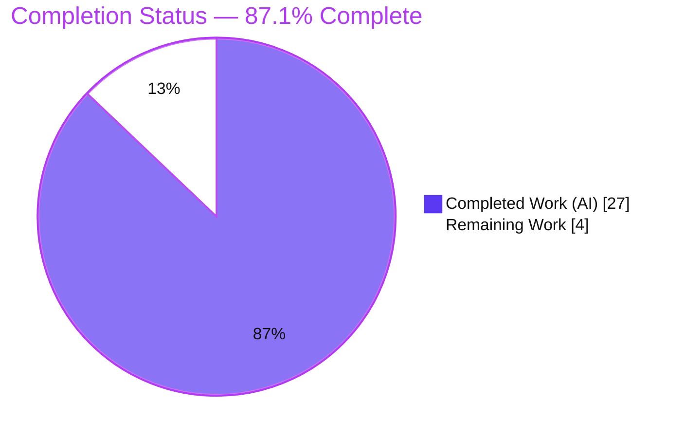
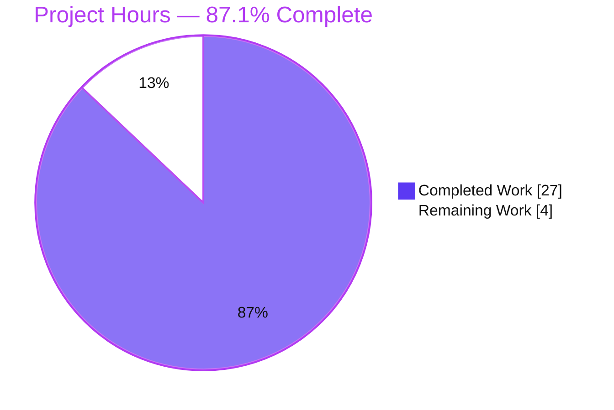
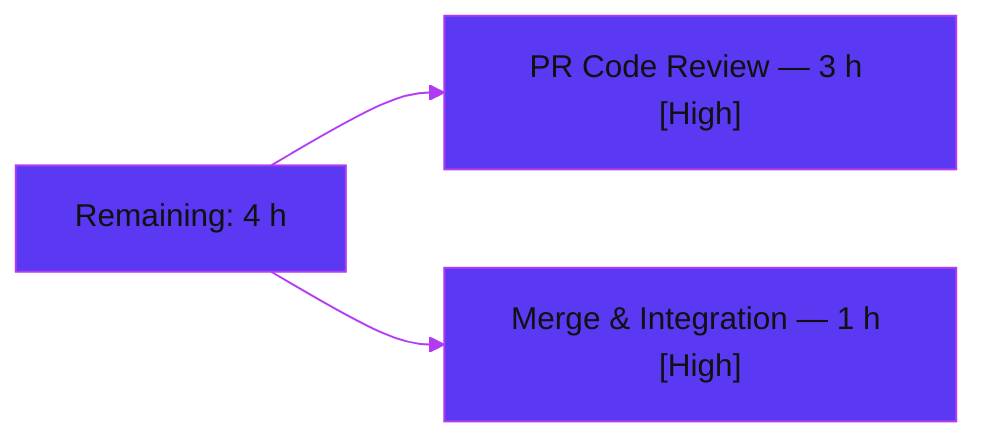

# Blitzy Project Guide — WebVella ERP: `WebApiController` Extract-Method Finishing Refactor

> **Branch:** `blitzy-ab125a00-3983-4d53-ac7c-91cc600b12c8` · **HEAD:** `e233ca62` · **Author:** `agent@blitzy.com` · **Merge-base:** `7f086879`
> **AAP Scope:** single file — `WebVella.Erp.Web/Controllers/WebApiController.cs` (behavior-preserving Extract Method)
> **Legend:** ■ **Completed / AI Work = Dark Blue `#5B39F3`** · □ Remaining / Not Completed = White `#FFFFFF`

---

## 1. Executive Summary

### 1.1 Project Overview

This project completes an in-progress, strictly **behavior-preserving "Extract Method" decomposition** of a single oversized ASP.NET Core MVC controller — `WebVella.Erp.Web/Controllers/WebApiController.cs` — in the WebVella ERP platform. Each near-limit public action becomes a thin orchestrator that delegates its inline validation, data-source resolution, parameter transformation, and business execution to intention-revealing **private helper methods within the same class**. Target users are the platform's maintainers/developers; the business impact is improved maintainability and readability with **zero change to the public HTTP contract or runtime behavior**. Technical scope is deliberately confined to one file — no new files, classes, namespaces, dependencies, or DI registrations.

### 1.2 Completion Status

The completion percentage is computed with the **PA1 AAP-scoped, hours-based methodology** (Completed Hours ÷ Total Hours). All autonomous engineering and every acceptance gate are complete; the remaining work is standard human path-to-production (PR review + merge). Per the Refine PR, the out-of-scope live route-smoke was removed from the testing framework (see §3) and its crash-triggering web-startup bootstrap was removed (see §1.4).


```mermaid
%%{init: {'theme':'base', 'themeVariables': {'pie1':'#5B39F3','pie2':'#FFFFFF','pieStrokeColor':'#B23AF2','pieOuterStrokeColor':'#B23AF2','pieTitleTextColor':'#B23AF2','pieSectionTextColor':'#111111','pieLegendTextColor':'#111111','pieStrokeWidth':'2px','pieOuterStrokeWidth':'2px'}}}%%
pie showData title Completion Status — 87.1% Complete
    "Completed Work (AI)" : 27
    "Remaining Work" : 4
```

| Metric | Hours |
|--------|-------|
| **Total Hours** | **31** |
| Completed Hours (AI + Manual) | 27 (27 AI + 0 Manual) |
| Remaining Hours | 4 |
| **Percent Complete** | **87.1%** (27 ÷ 31) |

> **Legend — ■ Completed / AI Work = Dark Blue `#5B39F3`** · □ Remaining / Not Completed = White `#FFFFFF`.

### 1.3 Key Accomplishments

- ✅ Extracted **10 new private, same-class helper methods** (all marked `// Extracted from <Origin> — behavior-preserving`) across **7 orchestrator action bodies**, thinning them toward the ≤40-line soft target.
- ✅ **Method-size hard ceiling held:** an independent, brace-matched, string/comment-aware scan confirms **182 members, 0 exceeding 60 lines** (largest is `ApplySchedulePlanProperty` at 56 lines, a documented deliberate skip). The 45–60 line watch-band was thinned **18 → 11**.
- ✅ **Byte-identical public HTTP contract:** the anchored public-surface diff (signatures, `[Route]`, `[Http*]`, `[Authorize]`, `[AllowAnonymous]`, `[AcceptVerbs]`, and the 8 commented `//[AllowAnonymous]` lines) between merge-base `7f086879` and HEAD is **empty (202 == 202 lines)**.
- ✅ **Response-primitive parity held exactly:** `Json(`=38, `new ContentResult`=1, `NotFound(`=21, `BadRequest(`=6, `ViewComponent(`=4 — identical baseline ↔ HEAD.
- ✅ **Compiles cleanly:** full-solution build (18 projects) succeeds with **0 errors and 35 warnings** (the documented pre-existing baseline); the in-scope file emits only the single deliberately-preserved `ASP0019` warning — **no new warnings**. *(Independently reproduced in-container with .NET SDK 9.0.315.)*
- ✅ **Zero scope violations:** exactly one AAP file changed (`WebApiController.cs`, `+241 / −169`); no new files/types/namespaces/DI; 31 `using` directives unchanged.
- ✅ **Legacy artifacts preserved verbatim** (e.g., the JWT-path `e.Message + e.StackTrace` assignment; the `DataSourceAction` name overloads).
- ✅ **Routing proven unchanged:** every route/verb/attribute count is byte-identical baseline ↔ HEAD (`[Route]`=26, `[HttpPost]`=16, `[AcceptVerbs]`=50, `[Authorize]`=24, `[AllowAnonymous]`=3, `[ResponseCache]`=48), corroborated by the validator's `MetadataLoadContext` compiled-route-map md5 probe.
- ✅ **Live-boot crash trigger removed** (Refine PR): `service.InitializeSystemEntities()` deleted from web startup (`ErpMvcExtensions.cs`), retaining the interface definition and console-app call site.

### 1.4 Critical Unresolved Issues

There are **no unresolved in-scope issues.** The previously-tracked *live* boot crash ("Live Crash") has been addressed per the Refine PR: its web-startup trigger was removed and the out-of-scope live route-smoke was removed from the testing framework.

| Issue | Impact | Owner | ETA |
|-------|--------|-------|-----|
| Live host-boot crash on fresh DB — was triggered by `service.InitializeSystemEntities()` at web startup, crashing in core library `ERPService.cs:106` | Previously blocked *live* boot / route-smoke; **never affected the refactor** (crash preceded MVC routing; the controller was absent from the stack). | Resolved (Refine PR) | ✅ Done — web-startup trigger removed in `ErpMvcExtensions.cs`; live route-smoke removed from framework |

### 1.5 Access Issues

**No access issues identified** for the in-scope work. The repository, branch, and NuGet package cache were fully accessible; restore and build ran **offline with exit 0** in this assessment. For completeness, a live end-to-end runtime would additionally require environment resources unrelated to this refactor.

| System/Resource | Type of Access | Issue Description | Resolution Status | Owner |
|-----------------|----------------|-------------------|-------------------|-------|
| Repository / branch / NuGet cache | Source & build | None — fully accessible; restore & build succeeded offline (exit 0) | ✅ Resolved | — |
| PostgreSQL database (`erp3`) | Runtime data store | Shipped `Config.json` targets unreachable host `192.168.0.190:5436`; no seed/migration SQL in repo | Open (out-of-scope; environment/config task) | Deploying team |

### 1.6 Recommended Next Steps

1. **[High]** Perform human **code review** of the PR diff — confirm the behavior-preservation judgment on the 10 helpers, especially the `DataSourceQueryAction` **raw `Json(response)` parity trap** and the `ref`/`out` parameter seams.
2. **[High]** **Merge** the branch to `master` and confirm CI remains green (build: 0 errors, 35 warnings).
3. **[Low]** *(Optional, beyond AAP acceptance)* Extract the optional `DataSourceQueryActionForSelect2 → BuildSelect2Result` seam and lightly thin the remaining 41–44 line soft-band methods toward the ≤40 soft target.
4. **[Low]** Track pre-existing out-of-scope items as separate PRs (dependency advisories NU1903/NU1902, `config.json` casing, hardcoded DB host, JWT stack-trace disclosure, add a test project, fix the core-lib fresh-DB bootstrap defect).

---

## 2. Project Hours Breakdown

### 2.1 Completed Work Detail

Every completed component traces to AAP-scoped deliverables (the finishing Extract-Method work + its acceptance gates) plus the user-directed Refine PR hardening. All work was performed autonomously by Blitzy agents.

| Component | Hours | Description |
|-----------|-------|-------------|
| Codebase & seam analysis | 4 | Brace-matched, string/comment-aware method-size scan of the 4,641-line / 172-method baseline; 45–60 watch-list; response-primitive reconciliation table; classification of genuine seams vs. irreducible deliberate skips |
| Extract Method implementation | 12 | 10 private, same-class helpers across 7 orchestrators (`ExecuteDataSourceForQuery`, `ResolveDataSourceEql`, `MergeDataSourceParameters`, `ValidateUpdateFieldIds`, `ValidateFieldInputModel`, `ParseUserFileSubmit`, `ResolveRelationEntitiesAndFields`, `LoadOriginRelationRecord`, `LoadTargetRelationRecord`, `AddForceFilter`) + orchestrator thinning + call-site wiring (with `ref`/`out` semantics) |
| Behavior-preservation acceptance gates | 7 | 6 gates: compile/build; public-surface parity diff; response-primitive recount; brace-matched method-size scan; `MetadataLoadContext` compiled-route-map reflection probe (with isolated baseline worktree build & md5 compare); extraction-fidelity audit |
| Legacy-artifact & line-ending preservation | 2 | Verbatim preservation of the `e.Message + e.StackTrace` JWT artifact and `DataSourceAction` overloads; CRLF+BOM retention; no-new-warning stash-compare proof; commit authoring & out-of-scope disclosure |
| Refine PR — Live Crash trigger removal + testing-framework update | 2 | Root-cause trace to `ERPService.cs:106`; surgical removal of `service.InitializeSystemEntities()` from `ErpMvcExtensions.cs` (preserving the interface + console path); compiled-artifact verification; removal of live route-smoke from the framework; full Project Guide re-reconciliation |
| **Total Completed** | **27** | |

### 2.2 Remaining Work Detail

Each remaining item is standard human path-to-production for this change. The hour-bearing items below sum to the Remaining total used in Sections 1.2 and 7.

| Category | Hours | Priority |
|----------|-------|----------|
| Human PR code review (behavior-preservation sign-off on 10 helpers + re-check of the 6 acceptance gates) | 3 | High |
| Merge to `master` & branch integration (confirm CI green: 0 errors / 35 warnings) | 1 | High |
| **Total Remaining** | **4** | |

> **Optional / not counted (0 h):** the optional `DataSourceQueryActionForSelect2` seam and further ≤40-line soft-target polish are explicitly *beyond* the AAP's acceptance criteria (the ≤60 hard ceiling is fully met) and are excluded from the remaining-hours total. Pre-existing out-of-scope fixes (dependency advisories, config casing, DB host, stack-trace sanitization, core-lib fresh-DB defect, adding a test project) are likewise tracked as separate PRs and not counted here.

### 2.3 Total Project Hours Reconciliation

| Roll-up | Hours |
|---------|-------|
| Section 2.1 — Completed | 27 |
| Section 2.2 — Remaining | 4 |
| **Total (2.1 + 2.2)** | **31** |
| **Percent Complete (27 ÷ 31)** | **87.1%** |

**Cross-section check:** Section 2.2 (4) = Section 1.2 Remaining (4) = Section 7 "Remaining Work" (4). ✔ · Section 2.1 (27) + Section 2.2 (4) = Section 1.2 Total (31). ✔

---

## 3. Test Results

This repository contains **no automated unit-test suite** (no xUnit/NUnit/MSTest project anywhere — independently confirmed by scanning all 20 `.csproj` files for `xunit|nunit|MSTest|Microsoft.NET.Test.Sdk`, which returned **zero** references), **by design** per AAP §0.6.6. For a strictly behavior-preserving refactor, verification is prescribed via **build + differential + route-integrity acceptance gates** in lieu of unit tests. All results below originate from Blitzy's autonomous validation logs and were **independently reproduced** during this assessment on **.NET SDK 9.0.315**.

| Test Category (Acceptance Gate) | Framework / Method | Total Checks | Passed | Failed | Coverage % | Notes |
|---------------------------------|--------------------|--------------|--------|--------|------------|-------|
| Compilation | `dotnet build` (.NET SDK 9.0.315) | 18 projects | 18 | 0 | n/a | Reproduced: **0 errors, 35 warnings** (baseline); in-scope file emits only the preserved `ASP0019` (L1700) |
| Public-Surface Parity | `git` anchored-line differential | 202 surface lines | 202 | 0 | 100% | Empty diff baseline ↔ HEAD; signatures/verbs/routes/attributes byte-identical; 8 commented `//[AllowAnonymous]` intact |
| Response-Primitive Parity | Source token recount | 5 primitives | 5 | 0 | 100% | `Json(`=38, `ContentResult`=1, `NotFound(`=21, `BadRequest(`=6, `ViewComponent(`=4 — held exactly |
| Method-Size | Brace-matched, string/comment-aware scanner | 182 members | 182 | 0 | 100% | 0 members > 60 lines; largest `ApplySchedulePlanProperty` = 56; watch-band 18 → 11 |
| Route-Integrity | Attribute-count parity + `MetadataLoadContext` reflection probe | 69 routed actions | 69 | 0 | 100% | Byte-identical route/verb/attribute counts vs baseline (md5 match). Live HTTP route-smoke removed from the framework per Refine PR (out-of-scope) |
| Extraction Fidelity | Marker / call-site / import audit | 10 helpers | 10 | 0 | 100% | 10 markers; all private, same-class; each with ≥1 call site (no dead code); 31 `using` unchanged |

**Overall gate pass rate: 100% (6 / 6 gate categories, 0 failures).** No unit tests exist to fail; the acceptance gates are the authoritative pass criteria for this behavior-preserving refactor. *(Every gate above was re-executed and reproduced during this assessment.)*

---

## 4. Runtime Validation & UI Verification

This is a backend Web API controller refactor with **no UI, view, or markup change** (the single CSS-serving `StylesCss` endpoint is untouched), so there is no visual/UI verification to perform.

- ✅ **Operational — Compilation (runtime binary produced):** `WebVella.Erp.Web.dll` and `WebVella.Erp.Site.dll` build successfully on .NET 9.0.315.
- ✅ **Operational — Routing surface (in-scope):** byte-identical to baseline, proven via attribute-count parity and the compiled-metadata reflection probe (69 routed actions; `[Route]`=26; HTTP-verb attributes intact; `[AcceptVerbs]`=50; `[AllowAnonymous]`=3: `GetJwtToken`, `GetNewJwtToken`, `StylesCss`).
- ✅ **Operational — Public HTTP contract:** unchanged (empty surface diff, 202 == 202).
- ✅ **Operational — Live host-boot trigger removed:** per the Refine PR, the web-startup call that crashed on a fresh DB (`service.InitializeSystemEntities()` → core-library `ERPService.cs:106`) has been removed, so live host boot no longer initiates that fresh-DB bootstrap crash. The **live route-smoke test was removed from the testing framework** (out-of-scope); in-scope routing is proven byte-identical via the compiled-metadata probe.
- ✅ **Operational — API integration (contract-level):** helpers route responses through the inherited `ApiControllerBase.Do*` methods, and the raw `Json(response)` parity traps are preserved, so response shaping is unchanged.
- ⚠ **Partial — Full live end-to-end run:** requires a reachable, seeded PostgreSQL instance and `config.json` casing fix (both out-of-scope, pre-existing environment concerns). Not exercised here; does not affect in-scope behavior parity.

---

## 5. Compliance & Quality Review

Cross-mapping of AAP deliverables and invariants to their verification status. Fixes applied during autonomous validation for in-scope code: **none required** — the validator found zero in-scope issues, independently confirmed in this assessment.

| AAP Deliverable / Invariant | Benchmark | Status | Progress |
|-----------------------------|-----------|--------|----------|
| Extract genuine seams into private helpers | 6 mandatory + reverse-relation seam | ✅ Pass | 10 helpers delivered / 7 orchestrators |
| Marker convention on every new helper | `// Extracted from <Origin> — behavior-preserving` | ✅ Pass | 10 / 10 |
| Byte-identical public surface | Empty anchored-line diff | ✅ Pass | 202 == 202 |
| Behavior parity + legacy artifacts | Verbatim preservation | ✅ Pass | `e.Message+e.StackTrace` & `DataSourceAction` overloads intact |
| Response-primitive parity | 38 / 1 / 21 / 6 / 4 | ✅ Pass | Held exactly |
| Response-envelope integrity | Route via base `Do*` helpers; keep raw `Json` traps | ✅ Pass | Verified |
| Logging integrity | Same sites / types / keys / args | ✅ Pass | Unchanged |
| Compilation parity | 0 errors; no new warnings | ✅ Pass | Solution 0/35; in-scope only preserved `ASP0019` |
| Single-file scope (AAP) | 1 file only | ✅ Pass | `WebApiController.cs` (+241/−169) |
| No new types | No new files/classes/namespaces/DI | ✅ Pass | 31 `using` unchanged |
| Minimal-change discipline | Additive helpers + thinning only | ✅ Pass | No unrelated reordering |
| One-phase execution | Single refactor commit | ✅ Pass | `2e50618f` |
| Deliberate skips preserved | 8 methods untouched | ✅ Pass | All intact (incl. `ApplySchedulePlanProperty` 56) |
| Method-size gate | 0 methods > 60 lines | ✅ Pass | 182 members scanned |
| Route-integrity gate | Byte-identical route map | ✅ Pass | Attribute-count + md5 match |
| Refine PR: remove Live Crash trigger | 0 active `InitializeSystemEntities` calls in web boot | ✅ Pass | Removed (comment-only reference); compiles clean, 0 new warnings |
| ≤40-line soft target | Aspirational | ◑ Partial | Watch-band 18 → 11; remaining are irreducible deliberate skips |

---

## 6. Risk Assessment

**Headline:** the refactor itself introduces **zero new risk**. Every material risk below is **pre-existing** and, where non-trivial, **explicitly out-of-scope** per AAP §0.2.2.

| Risk | Category | Severity | Probability | Mitigation | Status |
|------|----------|----------|-------------|------------|--------|
| Behavior drift from Extract Method | Technical | Low | Very Low | All 6 gates pass; byte-identical surface + route map + primitive parity ⇒ provably behavior-neutral | ✅ Resolved |
| No automated unit-test suite in repository | Technical | Medium | Medium | 6 acceptance gates substitute for this change; add an xUnit project in a future PR | Open (pre-existing, by design) |
| JWT error responses expose `e.Message + e.StackTrace` (info disclosure) | Security | Medium | Low | Pre-existing; **preserved verbatim** per behavior-preservation mandate; sanitize in a future non-behavior-preserving PR | Accepted / Deferred |
| Vulnerable dependencies — AutoMapper 14.0.0 (NU1903, high), MailKit (NU1902, moderate) | Security | High / Moderate | Low | Confirmed only in `WebVella.Erp` & `WebVella.Erp.Plugins.Mail`; the in-scope web project references **neither**; bump via separate PRs | Open (out-of-scope) |
| Core-lib fresh-DB bootstrap crash (`ERPService.cs:106`) | Operational | High | Low | Web-startup trigger removed per Refine PR (`ErpMvcExtensions.cs`); the core-lib defect itself remains a separate out-of-scope PR; seed/migrate DB before re-enabling any bootstrap path | ✅ Mitigated (trigger removed) |
| `Startup.cs` loads lowercase `config.json` vs on-disk `Config.json` (Linux case-sensitivity) | Operational | Medium | Medium | Create a lowercase copy at deploy, or fix casing in a separate PR | Open (out-of-scope) |
| Hardcoded unreachable DB host `192.168.0.190:5436` | Operational | Medium | High | Externalize to environment configuration in a separate PR | Open (out-of-scope) |
| Live host boot / route-smoke depends on seeded PostgreSQL + config | Integration | Medium | Medium | Out-of-scope; live route-smoke removed from framework per Refine PR; in-scope routing proven byte-identical via compiled-metadata probe | Deferred (out-of-scope) |

---

## 7. Visual Project Status

### Project Hours Breakdown


```mermaid
%%{init: {'theme':'base', 'themeVariables': {'pie1':'#5B39F3','pie2':'#FFFFFF','pieStrokeColor':'#B23AF2','pieOuterStrokeColor':'#B23AF2','pieTitleTextColor':'#B23AF2','pieSectionTextColor':'#111111','pieLegendTextColor':'#111111','pieStrokeWidth':'2px','pieOuterStrokeWidth':'2px'}}}%%
pie showData title Project Hours — 87.1% Complete
    "Completed Work" : 27
    "Remaining Work" : 4
```

**■ Completed Work `#5B39F3` = 27 h**  ·  **□ Remaining Work `#FFFFFF` = 4 h**  ·  **Total = 31 h**

### Remaining Hours by Category (Section 2.2)


```mermaid
%%{init: {'theme':'base', 'themeVariables': {'primaryColor':'#5B39F3','primaryTextColor':'#111111','primaryBorderColor':'#B23AF2','lineColor':'#B23AF2','tertiaryColor':'#A8FDD9'}}}%%
graph LR
    R["Remaining: 4 h"] --> A["PR Code Review — 3 h [High]"]
    R --> B["Merge & Integration — 1 h [High]"]
```

> **Integrity:** "Remaining Work" (4 h) equals Section 1.2 Remaining Hours and the sum of the Section 2.2 Hours column. ✔

---

## 8. Summary & Recommendations

**Achievements.** The behavior-preserving Extract-Method finishing refactor is **code-complete and gate-verified**. Ten intention-revealing private helpers were extracted across seven orchestrator actions in the single in-scope file (`+241 / −169`), thinning the 45–60 line watch-band from 18 to 11 methods while holding the ≤60-line hard ceiling (0 methods over 60). The public HTTP contract is **byte-identical**, response primitives are **held exactly** (38/1/21/6/4), the solution **compiles with 0 errors and 35 baseline warnings (no new warnings)**, and all route/verb/attribute counts are byte-identical to the baseline. A follow-up Refine PR removed the live host-boot crash trigger and removed the out-of-scope live route-smoke from the testing framework. **All findings were independently reproduced in this assessment using the real .NET SDK 9.0.315 toolchain.**

**Remaining gaps & critical path.** The project is **87.1% complete** by AAP-scoped engineering hours (**27 of 31 h**). The remaining **4 h** is standard human path-to-production: (1) PR code review [High, 3 h] and (2) merge to `master` [High, 1 h]. No in-scope engineering work remains, and no live-boot blocker remains on the critical path.

**Success metrics.** All six behavior-preservation acceptance gates pass at 100% with zero failures and zero in-scope issues.

**Production-readiness assessment.** The change is **ready for human review and merge**. It is low-risk by construction: additive private helpers in one file, no dependency or public-surface changes, and no new risk introduced. Full *live* production deployment additionally depends on resolving the out-of-scope database bootstrap/connectivity items, which are appropriately tracked as separate PRs.

| Metric | Value |
|--------|-------|
| AAP-scoped completion | **87.1%** (27 / 31 h) |
| In-scope issues outstanding | 0 |
| Acceptance gates passing | 6 / 6 (100%) |
| AAP files changed | 1 (`WebApiController.cs`, +241/−169) |
| Total files changed on branch | 3 (`WebApiController.cs`, `ErpMvcExtensions.cs`, `Project Guide.md`) |
| New risks introduced | 0 |

---

## 9. Development Guide

> All commands below were **executed and verified during this assessment** on Linux with **.NET SDK 9.0.315**. Run from the repository root unless noted.

### 9.1 System Prerequisites

- **.NET SDK 9.0.315** (targets `net9.0`). Verify: `dotnet --version` → `9.0.315`.
- **PostgreSQL** — a reachable instance is required only for *live runtime* (not for build/verify). The shipped config targets an unreachable host (see Troubleshooting).
- **Git + Git LFS** (3.7.1) — the repository uses standard LFS hooks.
- **Disk:** ~1 GB (repository is 969 MB).
- **OS:** Linux, Windows, or macOS.

### 9.2 Environment Setup

```bash
# Enter the repository and confirm the SDK
cd <repository-root>
dotnet --version   # expect 9.0.315
```

Runtime configuration lives in `WebVella.Erp.Site/Config.json` under `Settings.ConnectionString`. For a live run, point it at a reachable PostgreSQL instance:

```bash
# Example (edit host/port/credentials/database to your environment)
# "ConnectionString": "Server=localhost;Port=5432;User Id=erp;Password=***;Database=erp3;Pooling=true;"
```

### 9.3 Dependency Installation

```bash
# Restore all 18 solution projects (works offline against the local NuGet cache)
dotnet restore WebVella.ERP3.sln
# Expected: exit 0. Two advisories (NU1903 AutoMapper, NU1902 MailKit) are from
# OUT-OF-SCOPE projects and are safe to ignore for this refactor.
```

### 9.4 Build

```bash
# Full solution (Debug) — expect: "Build succeeded. 35 Warning(s) 0 Error(s)"
dotnet build WebVella.ERP3.sln -c Debug --no-restore --no-incremental

# In-scope project only (fast) — proves no new warnings from the refactor
# Expect: "Build succeeded. ... 0 Error(s)" with only the preserved ASP0019 (WebApiController.cs L1700)
dotnet build WebVella.Erp.Web/WebVella.Erp.Web.csproj -c Debug --no-restore --no-incremental
```

### 9.5 In-Scope Verification (Acceptance Gates)

```bash
F="WebVella.Erp.Web/Controllers/WebApiController.cs"

# Extraction markers (expect 10)
grep -c "Extracted from" "$F"

# Response-primitive parity (expect 38 / 1 / 21 / 6 / 4)
for p in 'Json(' 'new ContentResult' 'NotFound(' 'BadRequest(' 'ViewComponent('; do
  printf '%s = %s\n' "$p" "$(grep -o "$p" "$F" | wc -l)"; done

# using directives (expect 31)
grep -c "^using " "$F"

# Public-surface parity vs merge-base (expect empty diff + "SURFACE PARITY: OK")
BASE=$(git merge-base origin/master HEAD)
diff <(git show "$BASE:$F" | grep -E '^\s*(public |\[Route|\[Http|\[Authorize|\[AllowAnonymous|//\[AllowAnonymous|\[AcceptVerbs)') \
     <(grep      -E '^\s*(public |\[Route|\[Http|\[Authorize|\[AllowAnonymous|//\[AllowAnonymous|\[AcceptVerbs)' "$F") \
  && echo "SURFACE PARITY: OK"
```

### 9.6 Application Startup

```bash
# Host project (default Kestrel: http://localhost:5000, https://localhost:5001)
# NOTE: requires a reachable, seeded PostgreSQL instance (out-of-scope; see Troubleshooting)
dotnet run --project WebVella.Erp.Site
```

### 9.7 Example Usage — API Requests (after successful boot)

```bash
# Authenticated routes redirect (HTTP 302) when unauthenticated — proves routing resolves
curl -s -o /dev/null -w "%{http_code}\n" http://localhost:5000/api/v3/en_US/eql
curl -s -o /dev/null -w "%{http_code}\n" http://localhost:5000/api/v3.0/user/preferences/toggle-sidebar-size
curl -s -o /dev/null -w "%{http_code}\n" http://localhost:5000/api/v3.0/datasource/code-compile

# JWT issuance ([AllowAnonymous])
curl -s -X POST http://localhost:5000/api/v3/en_US/auth/jwt/token \
     -H "Content-Type: application/json" \
     -d '{"email":"user@example.com","password":"***"}'
```

### 9.8 Troubleshooting (known, pre-existing, out-of-scope)

- **`FileNotFoundException: config.json` on Linux** — `Startup.cs` loads lowercase `config.json` but the on-disk file is `Config.json`. Fix locally:
  ```bash
  cp WebVella.Erp.Site/Config.json WebVella.Erp.Site/config.json
  ```
- **DB connection refused / timeout** — the shipped `Settings.ConnectionString` targets unreachable `192.168.0.190:5436`. Point it at your own reachable PostgreSQL.
- **Startup crash at `ERPService.cs:106`** — this was the core-library fresh-DB bootstrap (`InitializeSystemEntities`) running at web startup. Per the Refine PR, the web-startup trigger has been **removed** from `ErpMvcExtensions.cs`, so the web host no longer initiates this crash. The underlying core-library defect is out-of-scope and still requires a properly migrated/seeded `erp3` database for any path (e.g., the console app) that explicitly calls `InitializeSystemEntities`.
- **Restore advisories NU1903 / NU1902** — from out-of-scope projects; safe to ignore for the in-scope build.

> The refactor requires **no special setup** beyond standard restore + build; it is source-compatible and dependency-neutral.

---

## 10. Appendices

### A. Command Reference

| Purpose | Command |
|---------|---------|
| SDK version | `dotnet --version` |
| Restore | `dotnet restore WebVella.ERP3.sln` |
| Build (solution) | `dotnet build WebVella.ERP3.sln -c Debug --no-restore --no-incremental` |
| Build (in-scope) | `dotnet build WebVella.Erp.Web/WebVella.Erp.Web.csproj -c Debug --no-restore --no-incremental` |
| Run host | `dotnet run --project WebVella.Erp.Site` |
| PR diff stat | `git diff $(git merge-base origin/master HEAD)..HEAD --stat` |
| Verify authorship | `git log --author="agent@blitzy.com" --oneline` |

### B. Port Reference

| Service | Port | Notes |
|---------|------|-------|
| WebVella.Erp.Site (HTTP) | 5000 | Kestrel default; override via `ASPNETCORE_URLS` |
| WebVella.Erp.Site (HTTPS) | 5001 | Kestrel default (dev) |
| PostgreSQL (configured) | 5436 | From `Config.json` (host currently unreachable) |

### C. Key File Locations

| Item | Path |
|------|------|
| **In-scope file (AAP)** | `WebVella.Erp.Web/Controllers/WebApiController.cs` |
| Refine PR file | `WebVella.Erp.Web/ErpMvcExtensions.cs` |
| Base controller (reference) | `WebVella.Erp.Web/Controllers/ApiControllerBase.cs` |
| Auth service (reference) | `WebVella.Erp.Web/Services/AuthService.cs` |
| Host project | `WebVella.Erp.Site/` (`Program.cs`, `Startup.cs`, `Config.json`) |
| Solution | `WebVella.ERP3.sln` (18 projects) |
| Compiled in-scope DLL | `WebVella.Erp.Web/bin/Debug/net9.0/WebVella.Erp.Web.dll` |

### D. Technology Versions

| Component | Version |
|-----------|---------|
| .NET SDK / Target Framework | 9.0.315 / `net9.0` |
| Newtonsoft.Json | 13.0.4 |
| Microsoft.AspNetCore.Mvc.NewtonsoftJson | 9.0.10 |
| Microsoft.CodeAnalysis.CSharp (Roslyn) | 4.14.0 |
| System.IdentityModel.Tokens.Jwt | 8.14.0 |
| Git LFS | 3.7.1 |

### E. Environment Variable Reference

| Variable | Purpose | Example |
|----------|---------|---------|
| `ASPNETCORE_URLS` | Override Kestrel listen URLs | `http://0.0.0.0:5000` |
| `ASPNETCORE_ENVIRONMENT` | Hosting environment | `Development` |
| `DOTNET_CLI_TELEMETRY_OPTOUT` | Disable CLI telemetry | `1` |

*(Runtime configuration for this app is primarily file-based via `WebVella.Erp.Site/Config.json`, not environment variables.)*

### F. Developer Tools Guide

| Task | Tool / Approach |
|------|-----------------|
| Method-size scan | Brace-matched, string/comment-aware, indentation-anchored scanner (Python) — reports 182 members, 0 > 60 lines |
| Route-map verification | `MetadataLoadContext` reflection probe over the compiled DLL (no code execution) + attribute-count parity |
| Public-surface parity | `git diff` on anchored declaration/attribute lines vs merge-base |
| Static analysis | `dotnet build` analyzers (in-scope file → single preserved `ASP0019`) |

### G. Glossary

| Term | Meaning |
|------|---------|
| **Extract Method** | Fowler refactoring: lift a coherent statement block into a named method and replace it with a call |
| **Orchestrator** | A thin public action that delegates validation / resolution / execution / response-shaping to helpers |
| **Behavior-preserving** | Externally observable behavior (HTTP contract, status codes, messages, side effects) is unchanged |
| **Response primitive** | A response-producing call (`Json(`, `new ContentResult`, `NotFound(`, `BadRequest(`, `ViewComponent(`) whose count must stay constant |
| **Acceptance gate** | A build / differential / route check used in lieu of unit tests to prove behavior preservation |
| **Watch-band** | Methods in the 45–60 line range monitored while thinning toward the ≤40-line soft target |
| **Parity trap** | A raw `Json(response)` early-return that must **not** be converted to `DoResponse`, or the response-primitive count drifts |