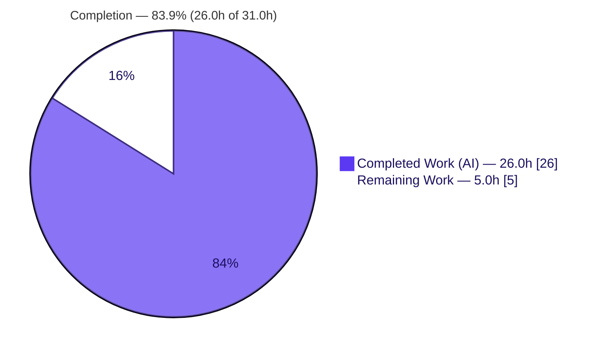
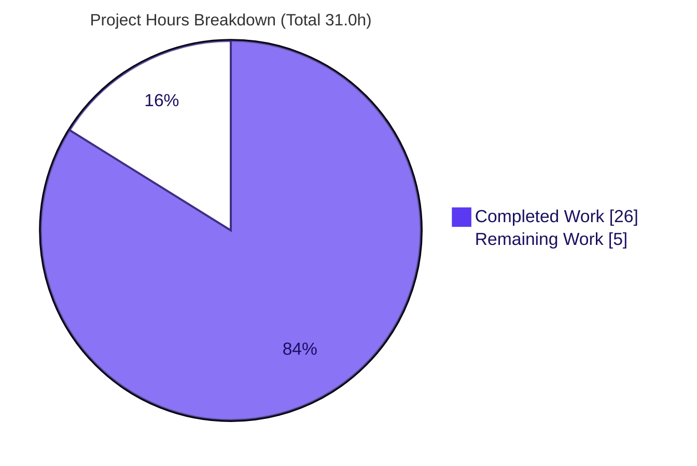
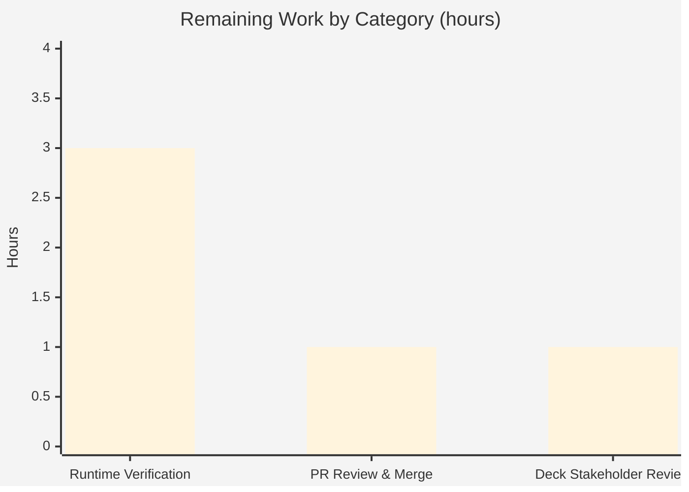

# Blitzy Project Guide — Approval Dashboard KPI Endpoint Decomposition

> **Project:** `WebVella.Erp.Plugins.Approval` — Discrete Dashboard KPI REST Endpoints
> **Branch:** `blitzy-4d710335-5023-4c11-8529-df497e963045` · **HEAD:** `003340cd`
> **Guide status colors:** Completed / AI Work = **Dark Blue `#5B39F3`** · Remaining / Not Completed = **White `#FFFFFF`**

---

## 1. Executive Summary

### 1.1 Project Overview

This project decomposes read access to the Approval plugin's five dashboard KPIs by adding five discrete, individually addressable `GET` endpoints to the existing `ApprovalController` — one per `DashboardMetricsService` metric (pending, average-time, approval-rate, overdue, recent-activity). The change lets external and headless consumers (mobile clients, third-party integrations) fetch a single metric without invoking the aggregate dashboard endpoint or coupling to the full `DashboardMetricsModel` payload. The work is strictly **additive and behavior-preserving**: no existing method is altered, the aggregate endpoint and its client remain untouched, and `DashboardMetricsService` stays the single source of KPI computation. A self-contained reveal.js executive deck for leadership accompanies the code change.

### 1.2 Completion Status


```mermaid
%%{init: {'theme':'base','themeVariables':{'pie1':'#5B39F3','pie2':'#FFFFFF','pieStroke':'#2D1C77','pieStrokeColor':'#2D1C77','pieOuterStrokeWidth':'2px','pieSectionTextColor':'#1A105F','pieLegendTextColor':'#1A105F','pieTitleTextSize':'16px'}}}%%
pie showData
    title Completion — 83.9% (26.0h of 31.0h)
    "Completed Work (AI) — 26.0h" : 26
    "Remaining Work — 5.0h" : 5
```

**Legend:** ▰ **Completed (AI) `#5B39F3`** = 26.0h  ·  ▱ **Remaining `#FFFFFF`** = 5.0h

| Metric | Value |
|--------|-------|
| **Total Hours** | **31.0 h** |
| **Completed Hours (AI + Manual)** | **26.0 h** (AI 26.0 h + Manual 0.0 h) |
| **Remaining Hours** | **5.0 h** |
| **Percent Complete** | **83.9 %**  ( 26.0 ÷ 31.0 ) |

> All ten AAP-scoped deliverables are 100% implemented, committed, and compile cleanly. The remaining 5.0 h is exclusively **non-autonomous, path-to-production** work (a live database-backed smoke test blocked by out-of-scope external infrastructure, human PR review/merge, and a stakeholder deck walkthrough).

### 1.3 Key Accomplishments

- [x] **Five discrete KPI GET endpoints** added to `ApprovalController.cs` (`/pending`, `/average-time`, `/approval-rate`, `/overdue`, `/recent-activity`), each with a full absolute route and `[HttpGet]`.
- [x] **Validation parity** — every new endpoint reproduces the aggregate's seven-step chain (`401 → 403 → 30-day date default → 400 → service call → 200 → 500`) with identical status codes and messages.
- [x] **`403` `Errors[]` enhancement** (the AAP's flagged decision) — all five new endpoints populate `Errors[]` with ≥1 `ErrorModel` on the `403` path; the aggregate's `403` remains message-only and unchanged.
- [x] **Correct service binding** — `pending`/`overdue` call with `CurrentUserId.Value`; `average-time`/`approval-rate` use parsed dates; `recent-activity` passes the literal `5`; **no** forbidden `GetAverageApprovalTimeHours`.
- [x] **Backward compatibility preserved** — the two existing actions (`GetDashboardMetrics`, `GetDashboardHealth` with `[AllowAnonymous]`) are verbatim; the dashboard client `API_ENDPOINT` stays pinned to the aggregate path.
- [x] **Zero new dependencies / DI / `.csproj` / host changes** — confirmed by empty diff on all immutable files; the in-scope plugin builds with **0 errors**.
- [x] **Self-contained reveal.js executive deck** (16 slides) satisfying every §0.7.3 constraint (CDN pins, Blitzy palette, fonts, 3 Mermaid diagrams, 42 Lucide icon mounts, all 11 theme classes, zero emoji, zero fenced code blocks).
- [x] **Route disjointness proven** — the five 7-segment literal routes cannot shadow or be shadowed by the 6-segment aggregate route (compile + reflection validation, zero `AmbiguousMatchException` risk).

### 1.4 Critical Unresolved Issues

| Issue | Impact | Owner | ETA |
|-------|--------|-------|-----|
| Live runtime smoke test of the 5 endpoints not yet performed | Endpoints proven structurally correct (compile + reflection) but not exercised against a running DB-backed host | Backend / QA Engineer | 0.5 day |
| External PostgreSQL unreachable in sandbox (host-owned `Config.json`) | Blocks in-environment host boot and HTTP-level verification (out-of-scope infra, not a code defect) | DevOps / Platform | 0.5 day |

> **No critical *code* defects are outstanding.** Both in-scope deliverables compile cleanly with zero errors and zero in-scope warnings. The items above are environmental/verification gates, not implementation gaps.

### 1.5 Access Issues

| System / Resource | Type of Access | Issue Description | Resolution Status | Owner |
|-------------------|----------------|-------------------|-------------------|-------|
| PostgreSQL `192.168.0.190:5436` (db `erp3`) | Network / DB credentials | Host `WebVella.Erp.Site` connection string targets an external host unreachable from the build sandbox; blocks live HTTP boot. Host-owned `Config.json` — **out of AAP scope**. | Open — requires a reachable DB or updated connection string | DevOps / Platform |
| CDN (jsDelivr) + Google Fonts | Outbound internet | The executive deck loads reveal.js 5.1.0, Mermaid 11.4.0, Lucide 0.460.0, and fonts from CDN with no local fallback (per §0.7.3). Offline presentation will not render diagrams/icons. | Open — ensure presenter network allows CDN | Presenter / IT |
| Git LFS remote | Repo access | Hooks are Git-LFS-only; `git-lfs 3.7.1` present and pre-push satisfiable. | Resolved — no action needed | — |

### 1.6 Recommended Next Steps

1. **[High]** Provision a reachable PostgreSQL instance (or repoint host-owned `WebVella.Erp.Site/Config.json`) and boot `WebVella.Erp.Site`.
2. **[High]** Smoke-test all five new endpoints across the `200 / 401 / 403 / 400` paths with manager and non-manager users; confirm the `ResponseModel` envelope, the `403` `Errors[]` entry, and numeric parity against the aggregate `/dashboard/metrics`.
3. **[High]** Conduct human PR review confirming scope compliance (existing actions verbatim, no `.csproj`/DI/host change) and merge the branch to mainline.
4. **[Low]** Open the executive deck on a CDN-reachable network, verify all 16 slides render, and present/hand off to leadership.
5. **[Low]** (Backlog, out of current AAP scope) Plan a dedicated test project to add automated coverage for the new endpoints in a future story.

---

## 2. Project Hours Breakdown

### 2.1 Completed Work Detail

> Every row traces to a specific AAP requirement (R#) or completed path-to-production activity (P#). **Column total = 26.0 h** (matches Completed Hours in §1.2).

| Component | Hours | Description |
|-----------|------:|-------------|
| Endpoint design, service-signature reconciliation & route-specificity proof (R6, R9, §0.1.1/§0.6) | 3.0 | Analyzed the aggregate validation chain and the five actual service signatures; reconciled the three source-vs-request discrepancies (`pending`/`overdue` take `Guid`; `GetAverageApprovalTime` not `…Hours`; no class-level `[Route]`); proved 7-segment route disjointness. |
| `/pending` endpoint (R1) | 1.5 | Route + `[HttpGet]` + full chain + `GetPendingApprovalsCount(CurrentUserId.Value)` → `int` + `403` `ErrorModel` + XML docs. |
| `/average-time` endpoint (R2) | 1.5 | Full chain consuming parsed dates + `GetAverageApprovalTime(fromDate, toDate)` → `decimal` + XML docs. |
| `/approval-rate` endpoint (R3) | 1.5 | Full chain consuming parsed dates + `GetApprovalRate(fromDate, toDate)` → `decimal` + XML docs. |
| `/overdue` endpoint (R4) | 1.5 | Full chain + `GetOverdueRequestsCount(CurrentUserId.Value)` → `int` + XML docs. |
| `/recent-activity` endpoint (R5) | 1.5 | Full chain + `GetRecentActivity(5)` → `List<RecentActivityItem>` + XML docs. |
| `403` `Errors[]` enhancement across 5 endpoints (R7) | 1.0 | Added ≥1 `ErrorModel` on the `403` path of each new action; verified the aggregate's `403` stays message-only. |
| Backward-compatibility preservation (R8) | 1.0 | Confirmed the two existing actions verbatim, `[AllowAnonymous]` health probe intact, client `API_ENDPOINT` pinned. |
| Executive summary deck (R10, §0.7.3) | 7.0 | 16-slide reveal.js deck with inline Blitzy theme, 3 Mermaid diagrams, 42 Lucide icon mounts, KPI cards/tables, hero/divider/closing treatments, CDN pinning, reveal/Mermaid/Lucide init. |
| Compilation & dependency verification (P1) | 1.5 | `dotnet restore` + Release build of in-scope plugin and full solution → 0 errors; in-scope file pristine. |
| Route resolution validation (P2) | 1.5 | `MetadataLoadContext` reflection harness proved all 7 action methods emitted with correct routes/verbs/signatures; disjointness confirmed. |
| Deck rendering validation (P3) | 1.0 | Headless-Chrome render: 3/3 Mermaid SVG, all Lucide icons, 16 slides, zero console errors. |
| Code review & QA remediation cycles (P4) | 2.5 | Controller Refine-PR verification + three deck review/QA fix commits (CP1 findings, accessibility Finding 2, QA findings 5–7). |
| **TOTAL COMPLETED** | **26.0** | |

### 2.2 Remaining Work Detail

> Every row traces to a path-to-production gate. **Column total = 5.0 h** (matches Remaining Hours in §1.2 and §7).

| Category | Hours | Priority |
|----------|------:|----------|
| Runtime Verification — boot host against a reachable DB + smoke-test the 5 endpoints (`200/401/403/400`, envelope, parity) | 3.0 | High |
| PR Review & Merge to Mainline | 1.0 | High |
| Executive Deck Stakeholder Review / Presentation | 1.0 | Low |
| **TOTAL REMAINING** | **5.0** | |

### 2.3 Hours Reconciliation

| Check | Result |
|-------|--------|
| §2.1 Completed total | 26.0 h |
| §2.2 Remaining total | 5.0 h |
| §2.1 + §2.2 | **31.0 h = Total Project Hours (§1.2)** ✓ |
| Completion % | 26.0 ÷ 31.0 = **83.9 %** ✓ |

---

## 3. Test Results

> **Integrity note:** Every entry below originates from Blitzy's autonomous validation logs for this branch. The solution contains **no automated test framework** (no Test SDK, xunit/nunit/MSTest, or `[Fact]/[Theory]/[Test]` attributes) and **zero test projects** — confirmed by three independent checks. Adding a test project would violate the AAP's out-of-scope / minimal-change constraints, so traditional unit/integration suites are intentionally absent. The "tests" below are the autonomous **validation gates** executed in their place.

| Test Category | Framework / Tool | Total | Passed | Failed | Coverage % | Notes |
|---------------|------------------|------:|------:|------:|-----------:|-------|
| Unit / Integration (traditional) | — (none in solution) | 0 | 0 | 0 | N/A | No test project exists by design (out of scope). |
| Compilation — in-scope plugin | dotnet/MSBuild (Release) | 1 | 1 | 0 | N/A | `ApprovalController.cs` compiles with 0 errors, 0 in-scope warnings. |
| Compilation — full solution | dotnet/MSBuild (Release) | 1 | 1 | 0 | N/A | 18 projects build, 0 errors; 37 warnings all in out-of-scope core/Web/Mail. |
| Structural / Route validation | `MetadataLoadContext` reflection harness | 7 | 7 | 0 | 7/7 actions | All 7 controller actions emitted with correct route, verb, signature, auth; route disjointness proven. |
| UI / Render (executive deck) | Headless Chrome | 4 | 4 | 0 | N/A | Checks: 3/3 Mermaid SVG; all Lucide icons (0 placeholders); 16 slides render; 0 console errors. |
| Dependency restore | NuGet | 1 | 1 | 0 | N/A | `dotnet restore` exit 0; only pre-existing out-of-scope advisories. |
| **Aggregate** | | **11** | **11** | **0** | **100% of gates** | All autonomous validation gates passed. |

---

## 4. Runtime Validation & UI Verification

**Status legend:** ✅ Operational · ⚠ Partial · ❌ Failing

**Build & Dependency Health**
- ✅ `dotnet restore` (in-scope plugin & full solution) — exit 0.
- ✅ `dotnet build -c Release` — **0 errors**; in-scope `ApprovalController.cs` produces 0 warnings.
- ✅ Compiled artifact `WebVella.Erp.Plugins.Approval.dll` (141 KB) emitted.

**API / Route Surface (DB-free structural validation)**
- ✅ All 5 new endpoints emitted as `GET` with distinct 7-segment absolute routes.
- ✅ Class-level `[Authorize]` applies to all five; none `[AllowAnonymous]`.
- ✅ Aggregate `/dashboard/metrics` (6-seg, authorized) and `/dashboard/health` (6-seg, `[AllowAnonymous]`) unchanged.
- ✅ Route disjointness proven → zero `AmbiguousMatchException` risk.
- ⚠ **Live HTTP invocation not performed** — host requires an external, unreachable PostgreSQL (host-owned `Config.json`, out of scope). Pending human smoke test (§2.2).

**Executive Deck (UI artifact)**
- ✅ Renders in headless Chrome with zero console errors across all 16 slides.
- ✅ 3 Mermaid diagrams render to SVG; 42 Lucide icon mounts present (validation log: 0 placeholders).
- ✅ KPI grid, both styled tables, and all four slide types (`slide-title`, `slide-divider`, content, `slide-closing`) render correctly.
- ⚠ Requires CDN/internet access to render (no local asset fallback, per §0.7.3).

---

## 5. Compliance & Quality Review

| AAP Requirement / Benchmark | Status | Progress | Notes |
|-----------------------------|--------|----------|-------|
| R1–R5: Five discrete KPI `GET` endpoints | ✅ Pass | ██████████ 100% | Correct routes, verbs, service bindings, return types. |
| R6: Validation-chain parity (7 steps) | ✅ Pass | ██████████ 100% | Replicated verbatim from the aggregate in all five. |
| R7: `403` `Errors[]` enhancement (flagged) | ✅ Pass | ██████████ 100% | ≥1 `ErrorModel` on all five `403` paths; aggregate unchanged. |
| R8: Backward compatibility | ✅ Pass | ██████████ 100% | Existing actions verbatim; client `API_ENDPOINT` pinned. |
| R9: Zero new deps / DI / `.csproj` / host | ✅ Pass | ██████████ 100% | Empty diff on all immutable files; build clean. |
| R10: Executive deck (§0.7.3, all constraints) | ✅ Pass | ██████████ 100% | 16 slides; CDN pins; palette; fonts; visuals; 0 emoji; 0 fenced code. |
| Minimal-change / additive-only directive | ✅ Pass | ██████████ 100% | Exactly one source file edited; only additions. |
| Code quality — XML documentation | ✅ Pass | ██████████ 100% | Every new action carries full XML doc comments and response codes. |
| Compilation cleanliness (in-scope) | ✅ Pass | ██████████ 100% | 0 errors, 0 in-scope warnings. |
| Automated test coverage | ⚠ N/A | — | No test project exists (out of scope by AAP). |
| Live runtime verification | ⚠ Pending | ████████░░ 80% | Structural proof complete; HTTP smoke test pending (env-blocked). |

**Fixes applied during autonomous validation:** CP1 review findings (deck), accessibility Finding 2 (deck semantics), QA findings 5–7 (deck) — committed `f7a1c1c5`, `17231666`, `818843d9`. The controller satisfied all four Refine-PR fixes in its initial commit `55561e7f` (no rework required).

---

## 6. Risk Assessment

| Risk | Category | Severity | Probability | Mitigation | Status |
|------|----------|----------|-------------|------------|--------|
| T1 — Live runtime behavior of 5 endpoints not yet exercised against a DB-backed host | Technical | Low | Low | Human smoke test (HT-2) once a reachable DB is available | Open |
| T2 — Validation chain duplicated 5× (no shared helper, per minimal-change directive) | Technical | Low | Low | Optional future extraction; documented design choice (§0.3.3) | Accepted |
| S1 — Authorization gate (`IsManagerRole()`) not runtime-exercised | Security | Low | Low | Smoke-test `403` path with a non-manager user | Open |
| S2 — Pre-existing dep advisories (NU1903 AutoMapper 14.0.0, NU1902 MailKit 4.14.1) in out-of-scope projects | Security | Medium | N/A (pre-existing) | Host/core team remediation; `.csproj` frozen per AAP | Deferred |
| S3 — Raw exception message surfaced in `500` `ResponseModel` | Security | Low | Low | Mirrors required aggregate parity; host-level sanitization out of scope | Accepted |
| O1 — No automated test coverage (zero test projects) | Operational | Medium | Low | Future test project (out of scope) + interim manual smoke test | Deferred |
| O2 — No new logging/monitoring on new endpoints (AAP forbids) | Operational | Low | Low | Relies on host-level MVC logging | Accepted |
| I1 — External DB unreachable in sandbox (host-owned `Config.json`) | Integration | Medium | Medium | Provision/repoint to a reachable DB for verification | Open |
| I2 — Deck depends on CDN with no local fallback | Integration | Low | Low | Present on a CDN-reachable network | Accepted |
| I3 — Existing dashboard client integration | Integration | Low | N/A | Unaffected — client `API_ENDPOINT` verified pinned to aggregate | Closed |

**Summary:** 10 risk lines, **0 High/Critical**. The three Medium risks (S2, O1, I1) are all pre-existing or environmental and reside in files/infrastructure the AAP prohibits modifying — none was introduced by this work, and none blocks the in-scope deliverables.

---

## 7. Visual Project Status


```mermaid
%%{init: {'theme':'base','themeVariables':{'pie1':'#5B39F3','pie2':'#FFFFFF','pieStroke':'#2D1C77','pieStrokeColor':'#2D1C77','pieOuterStrokeWidth':'2px','pieSectionTextColor':'#1A105F','pieLegendTextColor':'#1A105F','pieTitleTextSize':'16px'}}}%%
pie showData
    title Project Hours Breakdown (Total 31.0h)
    "Completed Work" : 26
    "Remaining Work" : 5
```

**Color key:** Completed Work = **Dark Blue `#5B39F3`** · Remaining Work = **White `#FFFFFF`** (dark outline for visibility).

**Remaining hours by category (from §2.2 — sums to 5.0 h):**


```mermaid
%%{init: {'theme':'base','xyChart':{'plotColorPalette':'#5B39F3'}}}%%
xychart-beta
    title "Remaining Work by Category (hours)"
    x-axis ["Runtime Verification", "PR Review & Merge", "Deck Stakeholder Review"]
    y-axis "Hours" 0 --> 4
    bar [3, 1, 1]
```

| Distribution | Hours | Share of Total |
|--------------|------:|---------------:|
| Completed (AI) | 26.0 | 83.9% |
| Remaining | 5.0 | 16.1% |
| **Total** | **31.0** | **100%** |

---

## 8. Summary & Recommendations

**Achievements.** All ten AAP-scoped deliverables are complete, committed, and verified. The five discrete KPI endpoints (`/pending`, `/average-time`, `/approval-rate`, `/overdue`, `/recent-activity`) were added to `ApprovalController.cs` as a strictly additive, behavior-preserving change — each replicating the aggregate's seven-step validation chain, binding to the correct (actual) service signature, applying the flagged `403` `Errors[]` enhancement, and carrying full XML documentation. The two existing actions are preserved verbatim, no immutable contract was touched, and the in-scope plugin compiles with zero errors and zero in-scope warnings. The accompanying 16-slide reveal.js executive deck satisfies every §0.7.3 constraint and renders flawlessly.

**Remaining gaps.** The project is **83.9% complete (26.0 h of 31.0 h)**. The remaining **5.0 h** is entirely non-autonomous, path-to-production work: a live, DB-backed HTTP smoke test of the five endpoints (3.0 h, blocked in-sandbox by an out-of-scope external PostgreSQL), human PR review and merge (1.0 h), and a stakeholder deck walkthrough (1.0 h). No code defects remain.

**Critical path to production.** (1) Provision/repoint a reachable database → (2) boot the host → (3) smoke-test the five endpoints across all status paths → (4) human review & merge → (5) present the deck. Steps 1–3 are the only technical gate; once a reachable DB is available they are routine.

**Success metrics.** 5/5 endpoints implemented · 0 compilation errors · 0 immutable-contract violations · 11/11 autonomous validation gates passed · 16/16 deck slides rendered · 0 High/Critical risks.

**Production-readiness assessment.** The in-scope code is **production-ready** pending a routine runtime smoke test and human merge approval. Confidence is **High** for the implementation (well-defined, narrow, additive, fully validated) and **Medium** only for the environment-dependent runtime verification.

---

## 9. Development Guide

### 9.1 System Prerequisites

- **.NET SDK 9.0.x** (verified `9.0.314`). `global.json` has its SDK version line commented out, so the highest installed `net9.0`-compatible SDK is used.
- **Git** (`2.51.0`) and **Git LFS** (`3.7.1`) — hooks are LFS-only; ensure LFS objects are pulled.
- **Python 3.x** (`3.13.7`) *or any static file server* — only to preview the executive deck locally.
- **Modern browser with internet/CDN access** — required for the deck (reveal.js, Mermaid, Lucide, Google Fonts load from CDN; no local fallback).
- **PostgreSQL (reachable)** — required only to run the full host (`WebVella.Erp.Site`); host-owned and external.

### 9.2 Environment Setup

```bash
# From the repository root, on the project branch
git checkout blitzy-4d710335-5023-4c11-8529-df497e963045
git lfs pull   # ensure LFS-tracked assets are present

# (Host runtime only) point the host-owned connection string at a reachable PostgreSQL.
# Edit WebVella.Erp.Site/Config.json -> "ConnectionString".
# Current value targets an external/unreachable host:
#   Server=192.168.0.190;Port=5436;User Id=test;Password=test;Database=erp3;...
```

### 9.3 Dependency Installation

```bash
# No new dependencies were added by this work; restore is standard.
dotnet restore WebVella.ERP3.sln
# Or restore just the in-scope plugin:
dotnet restore WebVella.Erp.Plugins.Approval/WebVella.Erp.Plugins.Approval.csproj
# Expected: exit 0. (Only pre-existing out-of-scope advisory NU1903 AutoMapper appears.)
```

### 9.4 Build & Application Startup

```bash
# Build the in-scope plugin (fast path) — expect: Build succeeded, 0 Error(s)
dotnet build WebVella.Erp.Plugins.Approval/WebVella.Erp.Plugins.Approval.csproj -c Release

# Build the full solution — expect: 0 errors across all projects
dotnet build WebVella.ERP3.sln -c Release

# Run the host (requires a reachable PostgreSQL per 9.2)
dotnet run --project WebVella.Erp.Site

# Preview the executive deck (requires CDN/internet)
cd blitzy-deck && python3 -m http.server 8099
# Then open: http://localhost:8099/approval-kpi-endpoints-executive-summary.html
```

### 9.5 Verification Steps

- **Build:** `dotnet build … -c Release` prints `0 Error(s)`; the in-scope file produces no warnings.
- **Deck:** the preview URL returns **HTTP 200** (~43 KB) with page title *"Approval Dashboard KPI Endpoints — Executive Summary"*; all 16 slides, 3 Mermaid diagrams, and the Lucide icons render with no console errors.
- **Endpoints (post-DB):** each `GET …/dashboard/metrics/<metric>` returns a `ResponseModel`; see examples below.

### 9.6 Example Usage

```bash
# Happy path (manager user) — returns 200 with the single typed KPI in Object
curl -H "Authorization: Bearer <manager-jwt>" \
  "http://<host>/api/v3.0/p/approval/dashboard/metrics/pending"
# -> { "Success": true, "Message": "...", "Object": 7, "Errors": [] }

# Date-windowed metric (average-time / approval-rate accept ISO-8601 from/to)
curl -H "Authorization: Bearer <manager-jwt>" \
  "http://<host>/api/v3.0/p/approval/dashboard/metrics/average-time?from=2025-01-01&to=2025-01-31"

# Forbidden (non-manager) — returns 403 with >=1 ErrorModel in Errors[]
curl -H "Authorization: Bearer <non-manager-jwt>" \
  "http://<host>/api/v3.0/p/approval/dashboard/metrics/overdue"
# -> 403 { "Success": false, "Message": "Access denied...", "Errors": [ { "Key": "authorization", ... } ] }
```

### 9.7 Troubleshooting

- **Host won't start / DB connection error:** the connection string targets an external, possibly unreachable PostgreSQL. Update `WebVella.Erp.Site/Config.json` (host-owned) to a reachable instance.
- **Deck shows blank diagrams or missing icons:** the network is blocking CDN/Google Fonts. Present on a CDN-reachable network.
- **`NU1903` (AutoMapper) / `NU1902` (MailKit) restore warnings:** pre-existing advisories in out-of-scope projects (`WebVella.Erp`, Mail plugin). **Do not "fix"** — the `.csproj` files are frozen by the AAP.
- **Port 8099 in use (deck preview):** choose another port, e.g. `python3 -m http.server 8181`.

---

## 10. Appendices

### A. Command Reference

| Purpose | Command |
|---------|---------|
| Restore (solution) | `dotnet restore WebVella.ERP3.sln` |
| Build in-scope plugin | `dotnet build WebVella.Erp.Plugins.Approval/WebVella.Erp.Plugins.Approval.csproj -c Release` |
| Build full solution | `dotnet build WebVella.ERP3.sln -c Release` |
| Run host | `dotnet run --project WebVella.Erp.Site` |
| Preview deck | `cd blitzy-deck && python3 -m http.server 8099` |
| Inspect in-scope diff | `git diff bfe15661..HEAD -- WebVella.Erp.Plugins.Approval/Controllers/ApprovalController.cs` |

### B. Port Reference

| Service | Port | Notes |
|---------|------|-------|
| Deck preview (static) | 8099 | Local only; any free port works. |
| Host HTTP (Kestrel) | per `Config.json` / launch profile | Requires reachable PostgreSQL to boot. |
| PostgreSQL (host-owned) | 5436 | External `192.168.0.190` — out of scope. |

### C. Key File Locations

| File | Role |
|------|------|
| `WebVella.Erp.Plugins.Approval/Controllers/ApprovalController.cs` | **UPDATED** — 5 new endpoints (the only source edit). |
| `blitzy-deck/approval-kpi-endpoints-executive-summary.html` | **CREATED** — executive deck. |
| `WebVella.Erp.Plugins.Approval/Services/DashboardMetricsService.cs` | Reference (immutable) — KPI source of truth. |
| `WebVella.Erp.Plugins.Approval/Api/DashboardMetricsModel.cs` | Reference (immutable) — `RecentActivityItem` + snake_case contract. |
| `WebVella.Erp.Plugins.Approval/Components/PcApprovalDashboard/service.js` | Reference (immutable) — client `API_ENDPOINT` pinned to aggregate. |
| `WebVella.Erp.Site/Config.json` | Host-owned connection string (out of scope). |

### D. Technology Versions

| Component | Version |
|-----------|---------|
| .NET SDK | 9.0.314 |
| Target framework | `net9.0` |
| `Microsoft.AspNetCore.Mvc.NewtonsoftJson` | 9.0.10 |
| Git / Git LFS | 2.51.0 / 3.7.1 |
| Python | 3.13.7 |
| Node.js | 20.20.2 |
| reveal.js / Mermaid / Lucide (deck, CDN) | 5.1.0 / 11.4.0 / 0.460.0 |

### E. Environment Variable Reference

No application environment variables are introduced or required by this work. Host runtime configuration (database connection, auth schemes) is supplied via the host-owned `WebVella.Erp.Site/Config.json` and is out of scope for this change.

### F. Developer Tools Guide

- **`dotnet`** — restore/build/run, as in §9.
- **`git` / `git lfs`** — version control; LFS objects must be pulled before build.
- **Static server (`python3 -m http.server`)** — local deck preview.
- **`curl`** — exercise the endpoints once the host is running (§9.6).
- **Headless Chrome** (used by autonomous validation) — for deck render verification.

### G. Glossary

| Term | Meaning |
|------|---------|
| AAP | Agent Action Plan — the authoritative scope for this work. |
| KPI | Key Performance Indicator (pending, average-time, approval-rate, overdue, recent-activity). |
| Aggregate endpoint | The existing `GET /dashboard/metrics` returning all five KPIs in one payload. |
| `ResponseModel` | Platform envelope `{ Success, Message, Object, Errors }` wrapping each response. |
| Validation chain | The 7-step sequence `401 → 403 → date-default → 400 → service → 200 → 500`. |
| Path-to-production | Standard deployment/verification activities required to ship the AAP deliverables. |