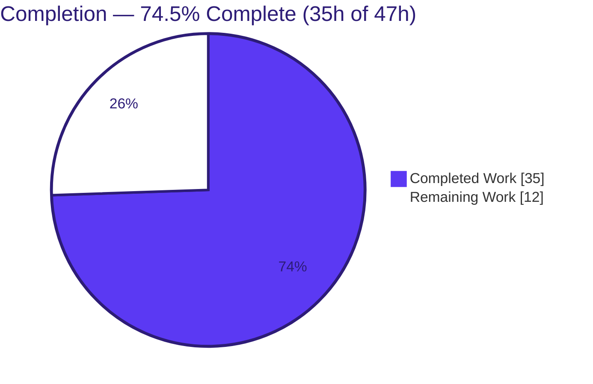
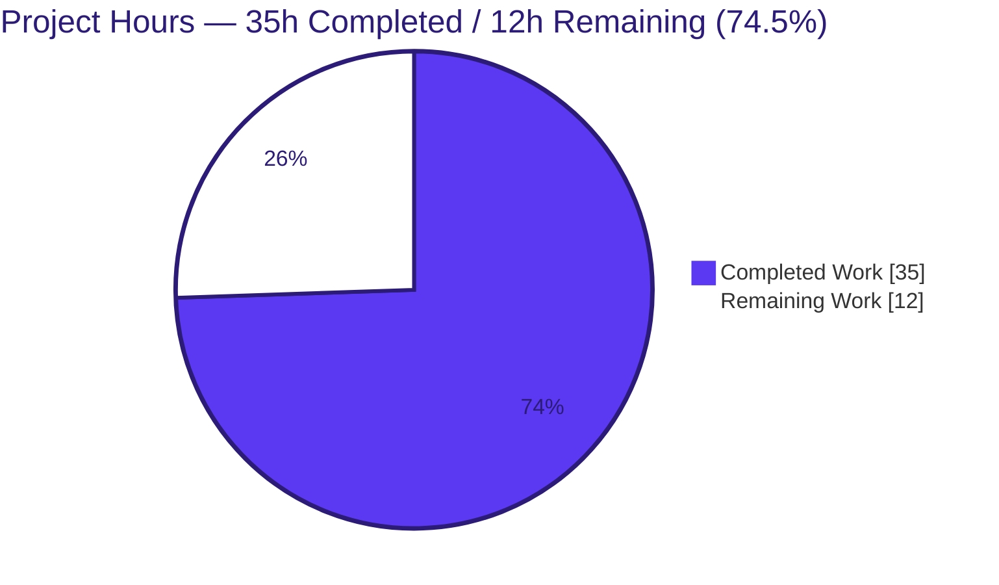
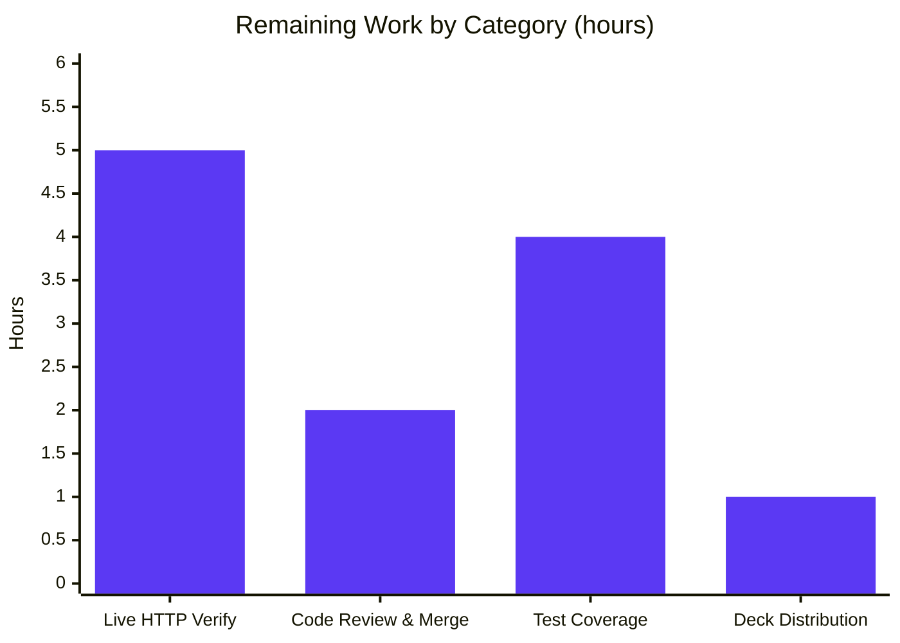

# Blitzy Project Guide — Approval Dashboard KPI Endpoints

> **Project:** `WebVella.Erp.Plugins.Approval` — API Surface Extension (Endpoint Decomposition)
> **Branch:** `blitzy-4d710335-5023-4c11-8529-df497e963045` · **HEAD:** `818843d9`
> **Brand legend:** <span style="color:#5B39F3">■</span> Completed / AI Work = Dark Blue `#5B39F3` · <span style="color:#B23AF2">■</span> Headings/Accents = `#B23AF2` · <span style="color:#A8FDD9">■</span> Highlight = Mint `#A8FDD9` · ⬜ Remaining = White `#FFFFFF`

---

## 1. Executive Summary

### 1.1 Project Overview

This project extends the `ApprovalController` REST surface by carving five granular, individually addressable `GET` endpoints from the existing aggregate dashboard-metrics action — one per `DashboardMetricsService` KPI (pending count, average approval time, approval rate, overdue count, recent activity). The target users are external and headless consumers (mobile clients, third-party integrations) that need a single metric without the full `DashboardMetricsModel` payload. The change is strictly additive and behavior-preserving: no existing method is altered, and the aggregate and health endpoints are untouched. A self-contained reveal.js executive deck accompanies the code as a non-code deliverable.

### 1.2 Completion Status


```mermaid
%%{init: {'theme':'base', 'themeVariables': {'pie1':'#5B39F3','pie2':'#FFFFFF','pieStrokeColor':'#2D1C77','pieOuterStrokeColor':'#2D1C77','pieTitleTextColor':'#2D1C77','pieSectionTextColor':'#2D1C77','pieStrokeWidth':'3px','pieOpacity':'1'}}}%%
pie showData title Completion — 74.5% Complete (35h of 47h)
    "Completed Work" : 35
    "Remaining Work" : 12
```

| Metric | Value |
|---|---|
| **Total Hours** | **47** |
| **Completed Hours (AI + Manual)** | **35** (AI autonomous: 35 · Manual: 0) |
| **Remaining Hours** | **12** |
| **Percent Complete** | **74.5%** ( 35 ÷ 47 × 100 ) |

> Completion is computed using AAP-scoped hours only: `Completion % = Completed ÷ (Completed + Remaining)`. All 24 AAP-specified implementation requirements are **Completed**; the remaining 12h is exclusively path-to-production work that cannot be performed autonomously.

### 1.3 Key Accomplishments

- ✅ **Five discrete KPI `GET` endpoints** added to `ApprovalController.cs` (+435 lines), each delegating to the correct immutable `DashboardMetricsService` method with the exact `Object` type (`int`/`decimal`/`decimal`/`int`/`List<RecentActivityItem>`).
- ✅ **Validation-chain parity** — every new action replicates the aggregate's seven-step chain (`401 → 403 → 30-day date default → 400 → service call → 200 → 500`) inside a uniform `ResponseModel` envelope.
- ✅ **`403` `ErrorModel` enhancement** (`Key=authorization`, `Value=manager_role_required`) added to all five new endpoints; the aggregate's message-only `403` preserved unchanged.
- ✅ **Route safety proven** — 7 fully-literal, disjoint route templates; no `AmbiguousMatchException`; backward compatibility of the aggregate, health probe, and client `API_ENDPOINT` preserved.
- ✅ **Clean compilation** — plugin and full-solution `-c Release` builds both exit 0 with **zero errors** and zero in-scope warnings.
- ✅ **Executive deck created** — 16-slide reveal.js deck with inline Blitzy theme, 3 Mermaid diagrams, 5 KPI cards, 42 Lucide icons; renders with **0 console errors**; all AAP §0.7.3 constraints met.

### 1.4 Critical Unresolved Issues

| Issue | Impact | Owner | ETA |
|---|---|---|---|
| Live HTTP behavior of the 5 endpoints not yet exercised against a running host | Status codes/payloads verified at compile/route-metadata level only; runtime un-confirmed | Backend Engineer | 0.5 day |
| No automated regression tests for the new endpoints | Future changes could silently regress behavior | Backend Engineer | 0.5 day |

> **Note:** Neither item is a defect in the delivered code — both are path-to-production verification/hardening activities. The implementation itself compiles cleanly and matches the AAP exactly. No blocking compilation errors, test failures, or logic defects were found.

### 1.5 Access Issues

| System/Resource | Type of Access | Issue Description | Resolution Status | Owner |
|---|---|---|---|---|
| PostgreSQL 16 database | Runtime DB connection | Full host execution (`WebVella.Erp.Site`) requires a reachable PostgreSQL instance; the sandbox had none, so live HTTP testing of the metric endpoints could not run (validator observed an EQL/DB exception on login) | Open — needs human-provisioned DB + connection string | DevOps / Backend Engineer |
| Executive deck CDNs (reveal.js / Mermaid / Lucide / Google Fonts) | Outbound internet | The deck loads pinned assets from CDNs; an air-gapped viewer cannot render it without internet or vendored assets | Open — verify network at presentation time or vendor offline | Presenter |

### 1.6 Recommended Next Steps

1. **[High]** Provision a PostgreSQL 16 database, set `WebVella.Erp.Site/Config.json` connection string, and launch the host.
2. **[High]** Execute the live HTTP verification matrix for all five endpoints (`401/403/400/200/500` + payload shapes) and regression-check the aggregate and health endpoints.
3. **[High]** Perform human code review of the `ApprovalController.cs` diff and merge to `master`.
4. **[Medium]** Add an integration test project covering the five endpoints (auth, role, date-range, success, serialization).
5. **[Low]** Conduct a stakeholder review of the executive deck and confirm CDN access (or vendor assets) for distribution.

---

## 2. Project Hours Breakdown

### 2.1 Completed Work Detail

| Component | Hours | Description |
|---|---:|---|
| Requirements analysis & source reconciliation (incl. §0.6 route no-shadowing proof) | 4 | Mapped 5 KPIs to the **actual** immutable service signatures; reconciled 4 request-vs-source mismatches (pending/overdue take `Guid userId` not dates; method is `GetAverageApprovalTime`; no class-level `[Route]`); proved 7 routes disjoint. |
| Five discrete `GET` endpoints implementation | 12 | 435 lines: route attributes, `[FromQuery] DateTime?` signatures, validation-chain replication ×5, correct per-endpoint service delegation, `ResponseModel` envelope, complete XML-doc comments. |
| `403` `ErrorModel` enhancement | 2 | Implemented the flagged AAP §0.7.2 decision — ≥1 `ErrorModel` (`authorization` / `manager_role_required`) on the `403` path of all 5 endpoints while preserving the aggregate's message-only `403`. |
| Executive summary deck — initial build | 10 | 16 slides, inline Blitzy theme CSS, 3 Mermaid diagrams, 5 KPI cards, 42 Lucide icons, pinned CDNs (reveal 5.1.0 / Mermaid 11.4.0 / Lucide 0.460.0), exact reveal config, 3 Google Fonts. |
| Executive deck — review/QA remediation | 3 | 3 follow-up commits: CP1 review findings (`+99/-85`), accessibility Finding 2 (`+45/-45`), QA findings 5-7 (`+54/-23`). |
| Autonomous validation & QA gates | 4 | `dotnet restore`; plugin + full-solution `-c Release` builds; route-metadata verification; deck render verification across breakpoints (~95 screenshots); 5 production-readiness gates. |
| **Total Completed** | **35** | **Matches Completed Hours in Section 1.2** |

### 2.2 Remaining Work Detail

| Category | Hours | Priority |
|---|---:|---|
| Runtime / Live HTTP Verification (host + PostgreSQL; full `401/403/400/200/500` matrix + payload/snake_case shapes) | 5 | High |
| Code Review & Merge (human review of diff, PR approval, merge to `master`) | 2 | High |
| Automated Test Coverage (integration tests for the 5 endpoints — path-to-production hardening) | 4 | Medium |
| Deck Distribution & Stakeholder Review (verify CDN access or vendor assets offline) | 1 | Low |
| **Total Remaining** | **12** | **Matches Remaining Hours in Sections 1.2 and 7** |

### 2.3 Hours Reconciliation

| Quantity | Hours | Check |
|---|---:|---|
| Section 2.1 Completed | 35 | — |
| Section 2.2 Remaining | 12 | — |
| **Total (2.1 + 2.2)** | **47** | = Total Project Hours in Section 1.2 ✓ |
| Completion % | 74.5% | 35 ÷ 47 ✓ |

---

## 3. Test Results

All entries below originate exclusively from **Blitzy's autonomous validation logs** for this project. The repository contains **no test projects** (0 of 20 `.csproj` reference xUnit/NUnit/MSTest/Test.Sdk), and no test deliverable is in the AAP scope; therefore automated test counts are zero. The validation that was performed is build/compilation and deliverable rendering.

| Test Category | Framework | Total Tests | Passed | Failed | Coverage % | Notes |
|---|---|---:|---:|---:|---:|---|
| Unit | — | 0 | 0 | 0 | N/A | No unit-test project exists (none in scope). |
| Integration | — | 0 | 0 | 0 | N/A | No integration-test project exists (none in scope). |
| API / End-to-End | — | 0 | 0 | 0 | N/A | Live HTTP exercise deferred to path-to-production (needs PostgreSQL host). |
| UI | — | 0 | 0 | 0 | N/A | Backend refactor; no application UI in scope. |
| **Test execution** | `dotnet test` | **0** | **0** | **0** | N/A | `dotnet test WebVella.ERP3.sln` → exit 0 (vacuous pass, nothing to run). |

**Build / compilation validation (autonomous):**

| Gate | Command | Result |
|---|---|---|
| Dependency restore | `dotnet restore WebVella.ERP3.sln` | exit 0 — all projects restored |
| In-scope plugin build | `dotnet build …Approval.csproj -c Release` | **Build succeeded, 0 errors**, 0 in-scope warnings |
| Full solution build | `dotnet build WebVella.ERP3.sln -c Release` | **Build succeeded, 0 errors**, 30 warnings (all pre-existing, out-of-scope advisories) |
| In-scope diagnostics | grep `ApprovalController` in build log | None — zero diagnostics attributable to the in-scope file |

---

## 4. Runtime Validation & UI Verification

**Code / routing (compile & metadata level):**
- ✅ **Operational** — All 7 controller actions (5 new + 2 preserved) present in the compiled assembly; ASP.NET Core attribute routing will register them at startup.
- ✅ **Operational** — 7 disjoint, fully-literal route templates (6-segment aggregate/health vs 7-segment `metrics/<x>`); no `AmbiguousMatchException` (matches AAP §0.6).
- ✅ **Operational** — `403` `ErrorModel` enhancement present in all 5 new endpoints; aggregate `403` remains message-only; `GetDashboardHealth` retains `[AllowAnonymous]`.

**Live HTTP (runtime against a host):**
- ✅ **Operational** — Health probe verified returning **200 anonymously** (`reverify_health_anonymous_200.png`).
- ⚠ **Partial** — The five metric endpoints were **not** exercised over live HTTP; full host execution requires PostgreSQL + host config (out of scope). The validator observed an EQL/DB exception on login confirming the DB dependency. Status-code/payload behavior is therefore confirmed at compile/route-metadata level only → see remaining task M1.

**Executive deck (UI deliverable):**
- ✅ **Operational** — Renders in Chrome from `file://` with **zero console errors** across all 16 slides.
- ✅ **Operational** — 3 Mermaid diagrams render to SVG; 42 Lucide icons render; 5 KPI cards match the AAP endpoint table; reveal config exact (`hash:true`, `transition:'slide'`, `controlsTutorial:false`, 1920×1080); responsive at 375/768/1280/1920 breakpoints with no overflow.

---

## 5. Compliance & Quality Review

AAP deliverables cross-mapped to quality benchmarks. Fixes applied during autonomous validation: **none required** — every in-scope deliverable was already correct against the AAP.

| AAP Deliverable / Constraint | Benchmark | Status | Progress |
|---|---|---|---|
| 5 KPI endpoints with correct service delegation & `Object` types | Functional correctness | ✅ Pass | ▰▰▰▰▰ 100% |
| Validation-chain parity (`401/403/400/200/500` + 30-day default) ×5 | Behavior preservation | ✅ Pass | ▰▰▰▰▰ 100% |
| `403` `ErrorModel` enhancement (new only); aggregate `403` message-only | AAP §0.7.2 acceptance | ✅ Pass | ▰▰▰▰▰ 100% |
| `[Authorize]` + `IsManagerRole()` on all new; no `[AllowAnonymous]` | Authorization integrity | ✅ Pass | ▰▰▰▰▰ 100% |
| Route disjointness / no `AmbiguousMatchException` | AAP §0.6 | ✅ Pass | ▰▰▰▰▰ 100% |
| Backward compatibility (aggregate, health, client `API_ENDPOINT`) | Non-regression | ✅ Pass | ▰▰▰▰▰ 100% |
| Zero new deps / no DI / no `.csproj`/`global.json`/host change | Minimal-change clause | ✅ Pass | ▰▰▰▰▰ 100% |
| Clean compilation (`net9.0`, Release) | Build quality | ✅ Pass | ▰▰▰▰▰ 100% |
| Executive deck (16 slides, theme, CDNs, config, constraints) | AAP §0.7.3 | ✅ Pass | ▰▰▰▰▰ 100% |
| Live HTTP status-code/payload verification | Runtime acceptance | ⚠ Deferred | ▰▰▰▱▱ ~60% (metadata-verified; live pending) |
| Automated test coverage | Production hardening | ⬜ Not started | ▱▱▱▱▱ 0% (not in AAP scope) |

---

## 6. Risk Assessment

Overall posture: **LOW**. The change is additive and behavior-preserving — the five new actions are verbatim copies of an already-working aggregate validation chain delegating to immutable, working service methods. No High-severity in-scope risks.

| Risk | Category | Severity | Probability | Mitigation | Status |
|---|---|---|---|---|---|
| Live HTTP behavior unverified (runtime status codes/payloads confirmed at metadata level only) | Technical | Low–Med | Low | Stand up host + PostgreSQL; run `401/403/400/200/500` matrix | Open (→ M1) |
| No automated regression tests | Technical | Low | Medium | Add integration test project | Open (→ M3) |
| Validation-chain duplicated across 5 methods (by AAP minimal-change design) | Technical | Low | Low | Documented decision; revisit if churn increases | Accepted by design |
| AuthZ correctness on new endpoints | Security | Low | Low | `[Authorize]` + `IsManagerRole()` verified in code; confirm `401/403` live | Mitigated in code |
| Out-of-scope dependency advisories (`NU1903` AutoMapper, `NU1902` MailKit) | Security | Med (general) | N/A this PR | Transitive, not introduced here; AAP forbids touching | Documented / out of scope |
| `500` path echoes `ex.Message` into `Errors[]` (parity with aggregate) | Security | Low | Low | Behavior parity required; consider platform-wide sanitization later | Accepted (parity) |
| No new logging/monitoring for new endpoints (AAP forbids) | Operational | Low | Low | Rely on host request logging; add metrics post-merge if needed | Accepted by constraint |
| Deck depends on external CDNs + internet to render | Operational | Low | Medium | Present online or vendor assets offline | Open (→ M4) |
| Backward compatibility of aggregate/health/client endpoint | Integration | Low | Very Low | Existing actions & client `API_ENDPOINT` unchanged (verified) | Mitigated |
| Route collision / `AmbiguousMatchException` | Integration | Low | Very Low | 7 disjoint literal routes (§0.6 proof + metadata verify) | Mitigated |
| snake_case serialization inherited from host, not HTTP-verified | Integration | Low | Low | Covered by live HTTP verification (M1) | Verify at runtime |

---

## 7. Visual Project Status

**Project Hours Breakdown** (Completed = `#5B39F3`, Remaining = `#FFFFFF`):


```mermaid
%%{init: {'theme':'base', 'themeVariables': {'pie1':'#5B39F3','pie2':'#FFFFFF','pieStrokeColor':'#2D1C77','pieOuterStrokeColor':'#2D1C77','pieTitleTextColor':'#2D1C77','pieSectionTextColor':'#2D1C77','pieStrokeWidth':'3px','pieOpacity':'1'}}}%%
pie showData title Project Hours — 35h Completed / 12h Remaining (74.5%)
    "Completed Work" : 35
    "Remaining Work" : 12
```

**Remaining Hours by Category** (sums to 12h — matches Section 1.2 Remaining and Section 2.2):


```mermaid
%%{init: {'theme':'base', 'themeVariables': {'xyChart': {'plotColorPalette':'#5B39F3'}}}}%%
xychart-beta
    title "Remaining Work by Category (hours)"
    x-axis ["Live HTTP Verify", "Code Review & Merge", "Test Coverage", "Deck Distribution"]
    y-axis "Hours" 0 --> 6
    bar [5, 2, 4, 1]
```

**Priority distribution of remaining work:** High = 7h (Live HTTP Verify 5h + Code Review & Merge 2h) · Medium = 4h (Test Coverage) · Low = 1h (Deck Distribution). Total = 12h.

---

## 8. Summary & Recommendations

**Achievements.** This is a tightly-scoped, fully-delivered refactor. All **24/24 AAP-specified implementation requirements** are complete and independently verified: the five KPI endpoints delegate to the correct immutable service methods with the right `Object` types, replicate the aggregate's seven-step validation chain, add the `403` `ErrorModel` enhancement, and preserve every existing contract. Both the plugin and full solution build cleanly in Release (0 errors), and the 16-slide executive deck renders with zero console errors and satisfies every AAP §0.7.3 constraint.

**Remaining gaps & critical path.** The project is **74.5% complete** (35h of 47h) on an AAP-scoped + path-to-production basis. The remaining 12h is exclusively path-to-production work that cannot be performed autonomously: (1) live HTTP verification against a PostgreSQL-backed host, (2) human code review + merge, (3) optional automated test hardening, and (4) deck distribution. The critical path to production is **provision DB → run host → verify endpoints live → review → merge** (~7h of High-priority work).

**Production readiness assessment.** The in-scope code is **production-grade and merge-ready pending human review**. Risk is LOW — the new actions mirror an already-working endpoint and call frozen, working service methods. The single most valuable next action is exercising the endpoints over live HTTP to convert the metadata-level verification into runtime confirmation against the AAP §0.7.2 acceptance criteria.

| Success Metric | Target | Current |
|---|---|---|
| AAP implementation requirements delivered | 24/24 | ✅ 24/24 |
| In-scope compilation errors | 0 | ✅ 0 |
| Endpoints with full validation chain | 5/5 | ✅ 5/5 |
| Deck console errors | 0 | ✅ 0 |
| Live HTTP status-code matrix verified | 5/5 | ⚠ 0/5 (deferred to M1) |

---

## 9. Development Guide

### 9.1 System Prerequisites
- **OS:** Linux or Windows (validated on Ubuntu 25.10).
- **.NET SDK:** 9.0.x (validated `9.0.314`); target framework `net9.0`. `global.json` has no active SDK pin (version line commented out) → the highest compatible installed SDK is used.
- **PostgreSQL:** 16 (required only for full host execution / live endpoint testing).
- **Browser:** Any modern browser **with internet access** (the executive deck loads pinned CDN assets).
- **Tooling:** Git + Git LFS.

### 9.2 Environment Setup
```bash
# From the repository root, ensure you are on the delivery branch
git checkout blitzy-4d710335-5023-4c11-8529-df497e963045
dotnet --version    # expect 9.0.x (validated 9.0.314)
```
For full host execution, edit `WebVella.Erp.Site/Config.json` → `Settings.ConnectionString` to point at your local PostgreSQL 16 database (e.g. `Server=localhost;Port=5432;User Id=postgres;Password=postgres;Database=erp3;Pooling=true;`). JWT key/issuer/audience are already configured (`JWT_OR_COOKIE` policy).

### 9.3 Dependency Installation
```bash
dotnet restore WebVella.ERP3.sln    # exit 0 — all projects restored
```

### 9.4 Build
```bash
# In-scope plugin only (fast):
dotnet build WebVella.Erp.Plugins.Approval/WebVella.Erp.Plugins.Approval.csproj -c Release
#   → "WebVella.Erp.Plugins.Approval -> .../bin/Release/net9.0/WebVella.Erp.Plugins.Approval.dll"
#   → "Build succeeded."  0 Error(s)

# Full solution:
dotnet build WebVella.ERP3.sln -c Release
#   → "Build succeeded."  0 Error(s)  30 Warning(s) (all pre-existing, out-of-scope advisories)
```

### 9.5 Tests
```bash
dotnet test WebVella.ERP3.sln    # exit 0 — no test projects exist (nothing to run)
```

### 9.6 Run the Host (requires PostgreSQL)
```bash
dotnet run --project WebVella.Erp.Site -c Release
# No launchSettings.json present → default Kestrel binding http://localhost:5000
# Override if needed:  ASPNETCORE_URLS="http://localhost:5000" dotnet run --project WebVella.Erp.Site -c Release
```

### 9.7 Verification
```bash
# Health probe (anonymous — should return 200):
curl -s http://localhost:5000/api/v3.0/p/approval/dashboard/health

# A metric endpoint (requires a Manager-role JWT or auth cookie):
curl -s "http://localhost:5000/api/v3.0/p/approval/dashboard/metrics/pending" \
     -H "Authorization: Bearer <MANAGER_JWT>"
#   → 200  {"Success":true,"Object":<int>, ...}
#   → 401 if unauthenticated · 403 (+ErrorModel) if not a manager · 400 if from>to
```

### 9.8 Example Usage (all five new endpoints)
```bash
BASE="http://localhost:5000/api/v3.0/p/approval/dashboard/metrics"
H='-H "Authorization: Bearer <MANAGER_JWT>"'
curl -s "$BASE/pending"                                   # Object: int
curl -s "$BASE/average-time?from=2026-05-01&to=2026-06-01"# Object: decimal
curl -s "$BASE/approval-rate?from=2026-05-01&to=2026-06-01"# Object: decimal
curl -s "$BASE/overdue"                                    # Object: int
curl -s "$BASE/recent-activity"                            # Object: List<RecentActivityItem>
```

### 9.9 Open the Executive Deck
```bash
xdg-open blitzy-deck/approval-kpi-endpoints-executive-summary.html   # Linux
# open  …  (macOS)   |   start …  (Windows)
```

### 9.10 Troubleshooting
- **EQL / DB exception at startup or login** → PostgreSQL is not reachable; fix the `Config.json` connection string (the validator hit this exact condition without a DB).
- **Deck appears blank / unstyled** → no internet for CDNs (reveal.js / Mermaid / Lucide / Google Fonts); connect to a network or vendor the assets locally.
- **`401` on metric endpoints** → missing/invalid JWT or auth cookie. **`403`** → the authenticated user is not in `manager` / `administrator` / `admin`.
- **`NU1903` / `NU1902` warnings** → pre-existing transitive advisories (AutoMapper / MailKit) in out-of-scope projects; they do not block the build and are intentionally not modified per the AAP.

---

## 10. Appendices

### A. Command Reference
| Purpose | Command |
|---|---|
| Check SDK | `dotnet --version` |
| Restore | `dotnet restore WebVella.ERP3.sln` |
| Build plugin | `dotnet build WebVella.Erp.Plugins.Approval/WebVella.Erp.Plugins.Approval.csproj -c Release` |
| Build solution | `dotnet build WebVella.ERP3.sln -c Release` |
| Test | `dotnet test WebVella.ERP3.sln` |
| Run host | `dotnet run --project WebVella.Erp.Site -c Release` |
| Branch diff | `git diff --stat bfe15661 HEAD` |

### B. Port Reference
| Service | Default | Notes |
|---|---|---|
| `WebVella.Erp.Site` (Kestrel HTTP) | `http://localhost:5000` | No `launchSettings.json`; override via `ASPNETCORE_URLS` |
| PostgreSQL | `5432` (typical) | Set in `Config.json` connection string |

### C. Key File Locations
| Item | Path |
|---|---|
| In-scope controller (UPDATE) | `WebVella.Erp.Plugins.Approval/Controllers/ApprovalController.cs` |
| Executive deck (CREATE) | `blitzy-deck/approval-kpi-endpoints-executive-summary.html` |
| KPI service (immutable, reference) | `WebVella.Erp.Plugins.Approval/Services/DashboardMetricsService.cs` |
| Response/Item model (immutable, reference) | `WebVella.Erp.Plugins.Approval/Api/DashboardMetricsModel.cs` |
| Host config | `WebVella.Erp.Site/Config.json` · `WebVella.Erp.Site/Startup.cs` |
| Plugin project | `WebVella.Erp.Plugins.Approval/WebVella.Erp.Plugins.Approval.csproj` |

### D. Technology Versions
| Component | Version |
|---|---|
| .NET SDK (validated) | 9.0.314 |
| Target framework | `net9.0` |
| `Microsoft.AspNetCore.Mvc.NewtonsoftJson` | 9.0.10 |
| PostgreSQL (target) | 16 |
| reveal.js / Mermaid / Lucide (deck CDNs) | 5.1.0 / 11.4.0 / 0.460.0 |

### E. Environment Variable Reference
| Variable | Purpose | Example |
|---|---|---|
| `ASPNETCORE_ENVIRONMENT` | Host environment | `Development` |
| `ASPNETCORE_URLS` | Kestrel binding override | `http://localhost:5000` |
| `Config.json → Settings.ConnectionString` | PostgreSQL connection | `Server=localhost;Port=5432;Database=erp3;User Id=postgres;Password=…` |
| `Config.json → Settings.Jwt.Key/Issuer/Audience` | JWT auth (`JWT_OR_COOKIE`) | preconfigured |

### F. Developer Tools Guide (Human Task List)
| ID | Priority | Task | Hours |
|---|---|---|---:|
| HT-1 | High | Provision PostgreSQL 16, set `Config.json` connection string, launch host | 2 |
| HT-2 | High | Execute live HTTP verification matrix for all 5 endpoints (`401/403/400/200/500` + payload shapes); regression-check aggregate + health | 3 |
| HT-3 | High | Human code review of `ApprovalController.cs` diff + PR approval + merge to `master` | 2 |
| HT-4 | Medium | Create integration test project + author tests for the 5 endpoints (auth/role/range/success/serialization) | 4 |
| HT-5 | Low | Stakeholder review of executive deck + distribution; verify CDN access or vendor assets offline | 1 |
| | | **Total (= Section 2.2 Remaining)** | **12** |

### G. Glossary
| Term | Meaning |
|---|---|
| AAP | Agent Action Plan — the authoritative requirements specification for this work. |
| KPI | Key Performance Indicator — the five dashboard metrics exposed as endpoints. |
| Aggregate endpoint | The pre-existing `GET …/dashboard/metrics` returning all five KPIs in one `DashboardMetricsModel`. |
| `ResponseModel` | Platform envelope `{ Success, Message, Object, Errors }` returned by every action. |
| Validation chain | The seven-step sequence `401 → 403 → date default → 400 → service call → 200 → 500`. |
| Path-to-production | Deployment/verification activities required to ship beyond writing the code. |
| `JWT_OR_COOKIE` | The host's hybrid authentication policy scheme. |