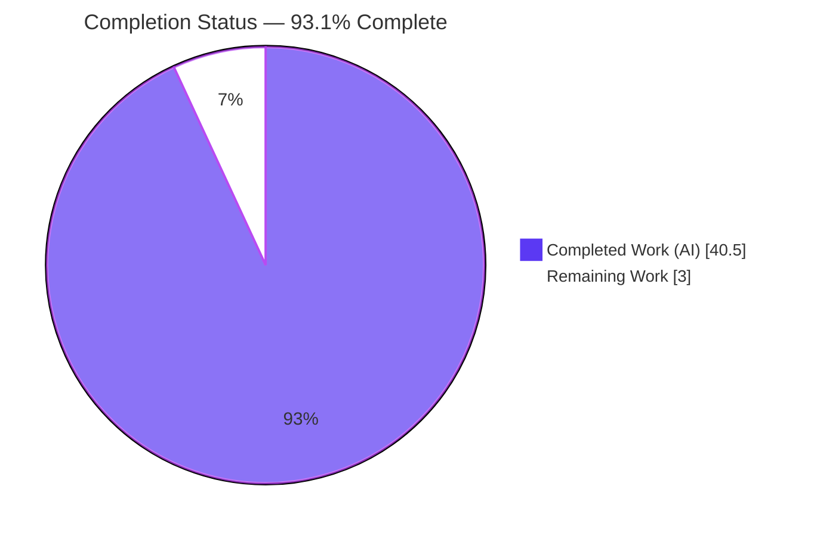
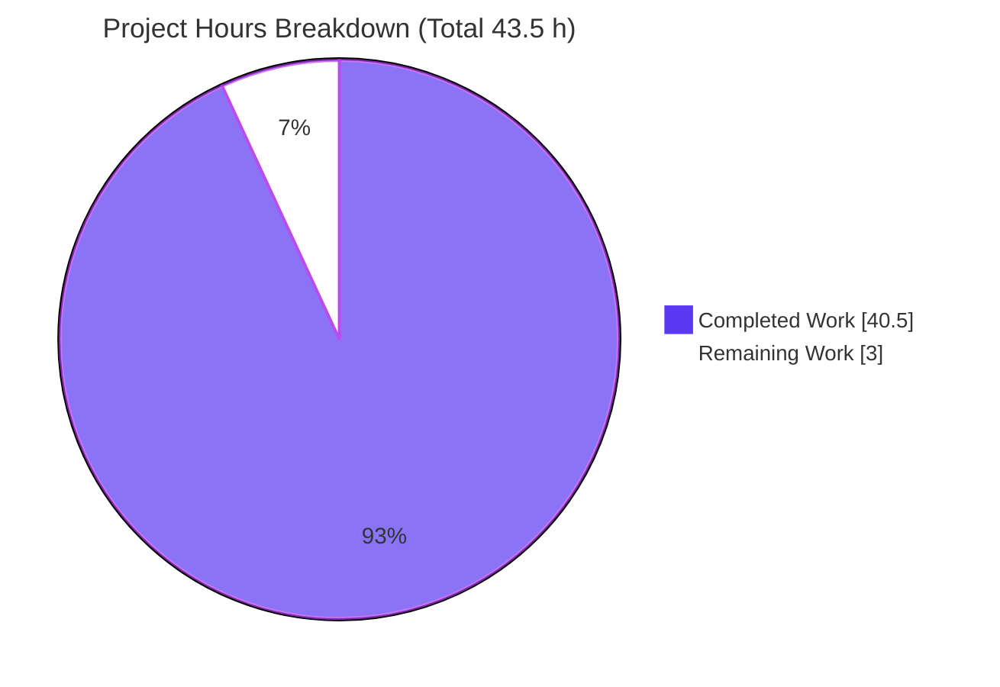
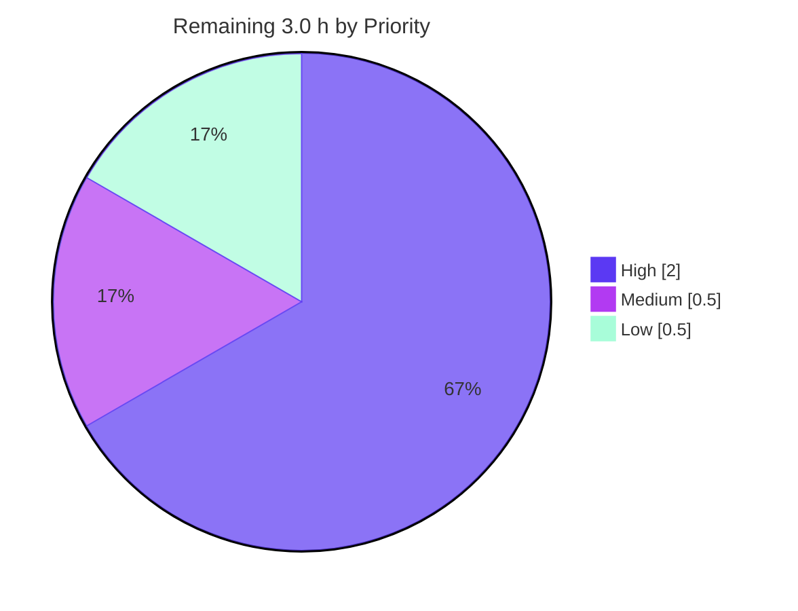

# Blitzy Project Guide — WebVella.Erp.Plugins.Approval Documentation

> **Project:** Manager Approval Dashboard — Plugin Documentation
> **Branch:** `blitzy-8129dec0-d4ca-47d8-a28b-8093f41e1bc7` · **HEAD:** `65467ed1` · **Working tree:** clean
> **Task type:** Documentation-only (no behavioral change)

---

## 1. Executive Summary

### 1.1 Project Overview

This project delivers complete inline and module-level documentation for the `WebVella.Erp.Plugins.Approval` plugin — the "Manager Approval Dashboard," a self-contained four-layer feature (UI → API/Component → Service → DTO) of roughly 2,100 lines across 11 source files. The objective is 100% documentation coverage of the plugin's public surface plus one new module README, enabling a developer unfamiliar with the codebase to understand the purpose, constraints, and non-obvious decisions of every component without reading the technical specification. Target audience is the WebVella ERP engineering team (manager/administrator-facing dashboard). It is strictly documentation-only: no production behavior, signatures, names, return types, or attribute values change — every deliverable is a comment, an XML-doc block, or one new Markdown file.

### 1.2 Completion Status


```mermaid
%%{init: {'theme':'base', 'themeVariables':{'pie1':'#5B39F3','pie2':'#FFFFFF','pieStrokeColor':'#B23AF2','pieStrokeWidth':'2px','pieOuterStrokeWidth':'2px','pieTitleTextSize':'18px','pieSectionTextSize':'15px','pieLegendTextSize':'14px'}}}%%
pie showData title Completion Status — 93.1% Complete
    "Completed Work (AI)" : 40.5
    "Remaining Work" : 3.0
```

| Metric | Hours |
|---|---|
| **Total Project Hours** | **43.5 h** |
| Completed Hours (AI: 40.5 + Manual: 0.0) | 40.5 h |
| Remaining Hours | 3.0 h |
| **Percent Complete** | **93.1 %** |

*Completion % = Completed ÷ Total = 40.5 ÷ 43.5 = **93.1 %** (PA1 AAP-scoped methodology).*

### 1.3 Key Accomplishments

- ✅ All **8 AAP directives** delivered and independently verified by direct file inspection plus a reproduced build.
- ✅ **6/6** service methods (`DashboardMetricsService`) carry XML-doc headers (business question + EQL entity + safe default).
- ✅ **8/8** `service.js` functions carry JSDoc (`@param`/`@returns`) plus a module-level IIFE block comment.
- ✅ **13/13** `DashboardMetricsModel` properties documented with units (0 empty stubs remaining); snake_case rationale captured.
- ✅ **5/5** `PcApprovalDashboardOptions` properties and **5/5** Razor view banners documented.
- ✅ Controller now documents **all five HTTP status codes (200/400/401/403/500)** — the previously-missing **HTTP 400 `<response>`** was added.
- ✅ **ADR-004** (dual-layer authorization) and **ADR-005** (graceful degradation) named at their sites; **3 deliberate duplications** cross-referenced symmetrically.
- ✅ Exactly **two** `.csproj` XML comments; `GenerateDocumentationFile` intentionally not added.
- ✅ New **README.md**: 7 sections in order, one Mermaid diagram, **533 words** (≤ 600), zero code snippets.
- ✅ Build: **0 errors**; XML-doc well-formedness: **0 malformed-doc warnings**, **43 documented members**.

### 1.4 Critical Unresolved Issues

| Issue | Impact | Owner | ETA |
|---|---|---|---|
| _None_ — all 8 directives passed validation with zero defects | No release blockers | — | — |

There are **no critical unresolved issues** within the documentation scope. The deliverable builds cleanly, contains no malformed documentation, and introduces no behavioral change. (Pre-existing, out-of-scope host concerns are catalogued in Section 6, not here, because they are not part of this task and do not block it.)

### 1.5 Access Issues

| System / Resource | Type of Access | Issue Description | Resolution Status | Owner |
|---|---|---|---|---|
| — | — | No access issues identified | N/A | — |

**No access issues identified.** The repository, .NET 9 SDK (9.0.314), Node.js (v20.20.2), and Git (2.51.0) were all available; restore, build, and validation commands all executed successfully without credential or permission barriers.

### 1.6 Recommended Next Steps

1. **[High]** Human documentation peer review of all 12 changed files (WHY-not-WHAT, accuracy, cross-references) — **1.5 h**.
2. **[High]** Approve the PR, merge to the main branch, and delete the feature branch — **0.5 h**.
3. **[Medium]** Verify the README renders correctly (Mermaid + Markdown) on GitHub and in IDE preview — **0.5 h**.
4. **[Low]** Spot-check that XML-doc and JSDoc surface in IDE IntelliSense after merge — **0.5 h**.
5. **[Low — future work, out of scope]** Plan the three NOTED known gaps separately (custom date picker, `ApprovalPlugin.cs` registration, service-layer unit tests) — see Section 8.

---

## 2. Project Hours Breakdown

### 2.1 Completed Work Detail

| Component | Hours | Description |
|---|---:|---|
| D1 — `Services/DashboardMetricsService.cs` | 5.5 | XML headers on all 6 methods; ADR-005 WHY-comments on all 5 `try/catch`; `defaultTimeoutHours = 24` business rule; 5-row recent-activity cap annotated at the call site. |
| D2 — `Controllers/ApprovalController.cs` | 4.5 | Class XML doc (route, `JWT_OR_COOKIE`, `[Authorize]`/`[AllowAnonymous]`); both endpoints documented incl. **newly-added HTTP 400**; `IsManagerRole()` allow-list; ADR-004 single-source annotation. |
| D3 — `Components/PcApprovalDashboard/PcApprovalDashboard.cs` | 5.0 | Class comment (5 render modes, ADR-004 duplication); 5 option properties; 30 s polling-floor rationale; `CalculateFromDate` branch doc + duplication note. |
| D4 — `Components/PcApprovalDashboard/service.js` | 5.5 | Module-level IIFE block comment; JSDoc on all 8 named functions; WHY-comments on `MIN_REFRESH_INTERVAL`, `getDateRange` duplication, silent-error handling, idempotency guard. |
| D5 — `Api/DashboardMetricsModel.cs` | 4.0 | Class contract comment; all 13 properties documented with units; `MetricsAsOf` freshness stamp; `RecentActivityItem` 5-item cap; snake_case rationale. |
| D6 — 5 Razor view banners | 3.0 | Top-of-file `@* *@` banners on Display/Design/Options/Help/Error; Display inline-script note; Options field→property comments. |
| D7 — `WebVella.Erp.Plugins.Approval.csproj` | 0.5 | Exactly two MSBuild XML comments (`<EmbeddedResource>` and `<PackageReference>` rationale); no other change. |
| D8 — `Components/PcApprovalDashboard/README.md` (new) | 5.0 | 7-section module guide + one Mermaid component diagram; 533 words; no code snippets. |
| Architecture & ADR discovery | 3.0 | Reading the four layers to extract accurate WHY content (ADR-004/005, EQL entities, JSON contract). |
| Symmetric cross-reference authoring | 1.5 | Wiring the 3 duplicated-logic pairs so rationale is reachable from either side. |
| Review / fix cycles (CP1 + CP2 + final) | 3.0 | Iterative code-review passes; resolution of the HTTP 400 completeness defect. |
| **Total Completed** | **40.5** | |

*Section 2.1 total = **40.5 h** = Completed Hours in Section 1.2.* ✓

### 2.2 Remaining Work Detail

| Category | Hours | Priority |
|---|---:|---|
| Documentation peer review (all 12 files) | 1.5 | High |
| PR approval, merge to main & branch cleanup | 0.5 | High |
| README compliance & Mermaid/Markdown render verification | 0.5 | Medium |
| Post-merge IDE/IntelliSense spot-check | 0.5 | Low |
| **Total Remaining** | **3.0** | |

*Section 2.2 total = **3.0 h** = Remaining Hours in Section 1.2 = Section 7 "Remaining Work".* ✓
*All remaining work is **path-to-production** (human review + merge + verification); no AAP deliverable is outstanding.*

### 2.3 Hours Reconciliation

- Section 2.1 (40.5 h) **+** Section 2.2 (3.0 h) **=** 43.5 h = Total Project Hours (Section 1.2). ✓
- Completion = 40.5 ÷ 43.5 = **93.1 %**, used identically in Sections 1.2, 7, and 8.

---

## 3. Test Results

All entries below originate from **Blitzy's autonomous validation logs** for this project. Because this is a documentation-only task, the "tests" are the autonomous validation gate-checks (build, doc well-formedness, syntax, assembly/resource, README compliance). **No unit/integration test suites exist** — authoring them is an explicit out-of-scope known gap (AAP §0.8.2).

| Test Category | Framework | Total Tests | Passed | Failed | Coverage % | Notes |
|---|---|---:|---:|---:|---|---|
| Build Verification (Approval plugin) | dotnet build / MSBuild | 1 | 1 | 0 | — | 0 errors; 0 in-scope warnings; 147 KB DLL |
| Solution Build | dotnet build / MSBuild | 1 | 1 | 0 | — | 19 projects; 0 errors |
| XML-Doc Well-Formedness | Roslyn (`GenerateDocumentationFile` flag) | 1 | 1 | 0 | 43 members | 0 × CS1570/1572/1573/1574 |
| JavaScript Syntax | `node --check` | 1 | 1 | 0 | — | `service.js` valid after JSDoc |
| Assembly Load + Embedded Resource | .NET Reflection | 2 | 2 | 0 | — | Assembly loads; 1 resource = `service.js` |
| README Compliance | Custom (word/section/fence) | 4 | 4 | 0 | — | 533 words; 7 sections; 1 mermaid; 0 code fences |
| `.csproj` Constraint | grep / diff | 1 | 1 | 0 | — | Exactly 2 XML comments; no other change |
| Unit / Integration Suites | dotnet test | 0 | 0 | 0 | 0 % | None exist — out-of-scope (AAP §0.8.2) |
| **TOTAL** | | **11** | **11** | **0** | **100 % pass** | Zero failures across all autonomous checks |

---

## 4. Runtime Validation & UI Verification

**Runtime health (build/load artifacts):**
- ✅ **Operational** — Approval plugin assembly builds (`WebVella.Erp.Plugins.Approval.dll`, 147 KB) with 0 errors.
- ✅ **Operational** — Assembly loads via reflection; exactly **1 embedded manifest resource** present: `WebVella.Erp.Plugins.Approval.Components.PcApprovalDashboard.service.js` (the documented, JSDoc-annotated script is the artifact that ships).
- ✅ **Operational** — `service.js` is syntactically valid (`node --check`) after the JSDoc additions.
- ✅ **Operational** — `README.md` and its single Mermaid block render as valid Markdown.

**UI verification:**
- ✅ **Operational (unchanged)** — The 5 Razor views received banner comments only; rendered output is byte-for-byte unchanged (no UI/behavioral modification in scope).
- ⚠ **Partial / Not Exercised** — Full end-to-end page-builder rendering of the `PcApprovalDashboard` component was not exercised; live host registration (`ApprovalPlugin.cs`) is a known out-of-scope gap (Section 8). This does not affect the documentation deliverable.

**API integration:**
- ✅ **Operational (contract documented)** — The `GET /api/v3.0/p/approval/dashboard/metrics` and `.../health` endpoints are fully documented (all 5 status codes); no endpoint behavior was altered.

---

## 5. Compliance & Quality Review

AAP deliverables cross-mapped to Blitzy's documentation quality benchmarks. **Fixes applied during autonomous work:** the implementing agents added the missing **HTTP 400 `<response>`** tag (the one documentation-completeness defect); the Final Validator subsequently found **zero** additional defects (all directives passed as-is).

| Benchmark (AAP §0.7.2 / §0.10) | Status | Progress | Notes |
|---|---|---|---|
| WHY-not-WHAT comments | ✅ Pass | 100% | Verified across all 12 files |
| ≤ 2 sentences per inline comment block | ✅ Pass | 100% | No over-long blocks found |
| No TODO / placeholder comments | ✅ Pass | 100% | grep confirms none |
| Exactly 2 `.csproj` XML comments | ✅ Pass | 2/2 | `GenerateDocumentationFile` absent |
| README ≤ 600 words | ✅ Pass | 533/600 | Within budget |
| README 7 sections, exact order | ✅ Pass | 7/7 | Purpose → … → Known gaps |
| README no code snippets | ✅ Pass | 100% | 0 non-mermaid fences |
| All 5 HTTP status codes documented | ✅ Pass | 5/5 | incl. newly-added 400 |
| C# XML doc well-formed | ✅ Pass | 0 errors | 0 × CS1570/1572/1573/1574; 43 members |
| JSDoc on all named JS functions | ✅ Pass | 8/8 | `@param`/`@returns` present |
| DTO properties documented | ✅ Pass | 13/13 | 0 empty `<summary>` stubs |
| ADR-004 / ADR-005 traceability | ✅ Pass | 100% | Named at relevant sites |
| 3 symmetric cross-references | ✅ Pass | 3/3 | Both sides name counterpart |
| Zero behavioral change | ✅ Pass | 100% | Signatures & attribute values byte-identical |
| Plugin builds cleanly | ✅ Pass | 0 errors | 0 in-scope warnings |

---

## 6. Risk Assessment

Overall risk profile: **LOW**. This documentation-only change introduces **zero material risk** (no executable code added; no behavior, signature, or value changed). The table separates risks **introduced by this work** (none material) from **pre-existing, out-of-scope** repository concerns surfaced for human visibility (AAP §0.8.2 forbids modifying host/sibling projects here).

| Risk | Category | Severity | Probability | Mitigation | Status |
|---|---|---|---|---|---|
| T1 — Documentation drift: inline line-references may age if code later changes | Technical | Low | Medium | Docs co-located with code; approximate `~Lnn` notation; symmetric cross-refs | Mitigated by design |
| T2 — `PcApprovalDashboard` not registered in `ApprovalPlugin.cs` (not host-discoverable) | Technical | Low | N/A | NOTED in README Known Gaps; pre-existing, out-of-scope | Documented, deferred |
| T3 — No `.xml` doc artifact emitted (`GenerateDocumentationFile` unset) | Technical | Low | N/A | By design (AAP §0.2.1/§0.5.4); docs serve IDE IntelliSense | Accepted |
| S1 — NU1903: AutoMapper 14.0.0 high-severity vuln (host `WebVella.Erp`) | Security | High* | N/A here | Pre-existing; out-of-scope; **not** introduced by docs | Flag for human visibility |
| S2 — Docs describe auth design (ADR-004, allow-lists, `JWT_OR_COOKIE`) | Security | Low | Low | No secrets/credentials exposed; describes defense-in-depth accurately | Reviewed OK |
| S3 — New attack surface from this change | Security | Negligible | N/A | Zero executable code added | No risk |
| O1 — CS0618 ×3 (Npgsql obsolete API) + ASP0019 host warnings | Operational | Low | N/A | Pre-existing tech debt; out-of-scope; not introduced | Flag, defer |
| O2 — Deployment / monitoring impact | Operational | None | N/A | Docs are in-source, not deployed (AAP §0.9.1) | No risk |
| O3 — Documentation maintainability | Operational | Low | Low | Co-located docs minimize drift; no new toolchain | Mitigated |
| I1 — JSDoc inside embedded `service.js` resource served via `UseStaticFiles` | Integration | Negligible | Low | Validator confirmed assembly loads + resource present; comments inert | Verified OK |
| I2 — External service / API integration touched | Integration | None | N/A | No integration code changed | No risk |

\* *S1 severity reflects the upstream CVE rating; it is **not actionable within this documentation task** and was not introduced by it.*

---

## 7. Visual Project Status

**Project Hours Breakdown** (Completed = Dark Blue `#5B39F3`, Remaining = White `#FFFFFF`):


```mermaid
%%{init: {'theme':'base', 'themeVariables':{'pie1':'#5B39F3','pie2':'#FFFFFF','pieStrokeColor':'#B23AF2','pieStrokeWidth':'2px','pieOuterStrokeWidth':'2px','pieTitleTextSize':'18px','pieSectionTextSize':'15px','pieLegendTextSize':'14px'}}}%%
pie showData title Project Hours Breakdown (Total 43.5 h)
    "Completed Work" : 40.5
    "Remaining Work" : 3.0
```

**Remaining Work by Priority** (3.0 h total — High 2.0 / Medium 0.5 / Low 0.5):


```mermaid
%%{init: {'theme':'base', 'themeVariables':{'pie1':'#5B39F3','pie2':'#B23AF2','pie3':'#A8FDD9','pieStrokeColor':'#5B39F3','pieStrokeWidth':'1px','pieTitleTextSize':'16px','pieSectionTextSize':'14px','pieLegendTextSize':'13px'}}}%%
pie showData title Remaining 3.0 h by Priority
    "High" : 2.0
    "Medium" : 0.5
    "Low" : 0.5
```

*Integrity: "Remaining Work" = **3.0 h** = Section 1.2 Remaining Hours = sum of Section 2.2 Hours column.* ✓

---

## 8. Summary & Recommendations

**Achievements.** The `WebVella.Erp.Plugins.Approval` plugin is now fully documented across all four layers. Every one of the 8 AAP directives is delivered and independently verified: 6 service-method headers, 5 ADR-005 graceful-degradation comments, the two magic-number rationales, complete controller request/response documentation (including the newly-added HTTP 400), 8 JSDoc function blocks, 13 documented DTO properties, 5 component options, 5 Razor banners, exactly 2 `.csproj` comments, and a 7-section module README with one Mermaid diagram. The plugin builds with 0 errors and 0 malformed-doc warnings (43 documented members emitted).

**Completion & critical path.** The project is **93.1 % complete** (40.5 h of 43.5 h). The remaining **3.0 h** is entirely path-to-production: human peer review (1.5 h), PR approval/merge/cleanup (0.5 h), README render verification (0.5 h), and a post-merge IntelliSense spot-check (0.5 h). There are no outstanding AAP deliverables and no in-scope defects.

**Production-readiness assessment.** The documentation deliverable is **production-ready** pending human peer review and merge. It is comment-only, byte-identical in all signatures and attribute values, and introduces zero runtime risk.

**Future work (out of scope for this task — AAP §0.8.2).** The README deliberately NOTES three known gaps that are *not* implemented here and are *not* counted in the 3.0 h remaining. They are recommended as separate, future stories:

| Future item | Rough estimate | Rationale |
|---|---|---|
| Register `PcApprovalDashboard` in `ApprovalPlugin.cs` | ~1–2 h | Make the PageComponent runtime-discoverable by the host |
| Implement custom date-range picker (AC3 completion) | ~4–8 h | Currently falls back to a 30-day window |
| Author service-layer unit tests for `DashboardMetricsService` | ~8–12 h | Cover the 5 KPI methods + graceful-degradation paths |

**Repository-level concerns (informational).** Pre-existing, out-of-scope host issues — NU1903 (AutoMapper CVE), CS0618 ×3 (Npgsql obsolete API), ASP0019 — should be triaged by the host team; none were introduced by this work and none block this PR.

---

## 9. Development Guide

> All commands below were **executed during validation** and produced the stated output. Run from the repository root unless noted.

### 9.1 System Prerequisites

- **.NET SDK 9.0.x** (validated with **9.0.314**) — required to build the `net9.0` Razor class library.
- **Git 2.x** (validated with **2.51.0**) — to clone and check out the branch.
- **Node.js 20.x** (validated with **v20.20.2**) — *optional*, only for the `service.js` syntax check.
- OS: Linux/macOS/Windows with the .NET 9 SDK installed. No database, cache, or message queue is required to build or validate the documentation.

### 9.2 Environment Setup

```bash
# Clone and select the branch
git clone <repository-url> webvella-erp
cd webvella-erp
git checkout blitzy-8129dec0-d4ca-47d8-a28b-8093f41e1bc7

# Confirm tooling
dotnet --version    # expect 9.0.x
node --version      # expect v20.x (optional)
```

No environment variables are required for building or validating this documentation task.

### 9.3 Dependency Installation

```bash
# Restore NuGet packages for the Approval plugin
dotnet restore WebVella.Erp.Plugins.Approval/WebVella.Erp.Plugins.Approval.csproj
# Expected: "All projects are up-to-date for restore." (exit 0)
# Note: an NU1903 AutoMapper warning may surface from the transitive
#       WebVella.Erp host project — it is pre-existing and out of scope.
```

### 9.4 Build

```bash
# Build the Approval plugin (clean)
dotnet build WebVella.Erp.Plugins.Approval/WebVella.Erp.Plugins.Approval.csproj --no-incremental
# Expected: "Build succeeded.  5 Warning(s)  0 Error(s)"
#           (all 5 warnings are out-of-scope host projects; none from this plugin)
#           Produces bin/Debug/net9.0/WebVella.Erp.Plugins.Approval.dll (~147 KB)
```

### 9.5 Verification

```bash
# 1) XML-doc well-formedness (FLAG ONLY — never commit this; .csproj stays unchanged)
dotnet build WebVella.Erp.Plugins.Approval/WebVella.Erp.Plugins.Approval.csproj \
  --no-incremental /p:GenerateDocumentationFile=true
# Expected: 0 malformed-doc warnings (CS1570/CS1572/CS1573/CS1574) from plugin source; 43 members

# 2) JavaScript syntax of the documented client module
node --check WebVella.Erp.Plugins.Approval/Components/PcApprovalDashboard/service.js
# Expected: exit 0 (no output)

# 3) README compliance
README=WebVella.Erp.Plugins.Approval/Components/PcApprovalDashboard/README.md
wc -w < "$README"                 # expect 533 (<= 600)
grep -cE '^## ' "$README"         # expect 7 section headers
grep -cE '^```mermaid' "$README"  # expect 1 mermaid fence
grep -cE '^```' "$README"         # expect 2 total fences (open+close of the one mermaid)

# 4) Exactly two .csproj XML comments, GenerateDocumentationFile absent
grep -cE '<!--' WebVella.Erp.Plugins.Approval/WebVella.Erp.Plugins.Approval.csproj   # expect 2
grep -c 'GenerateDocumentationFile' WebVella.Erp.Plugins.Approval/WebVella.Erp.Plugins.Approval.csproj  # expect 0

# 5) Test sweep (no test projects exist — vacuous pass by design)
dotnet test WebVella.ERP3.sln
# Expected: exit 0

# 6) Confirm the documented service.js is the embedded resource that ships
#    (build a throwaway console app that loads the DLL via reflection and lists resources)
# Expected: Manifest resource count: 1
#           resource: WebVella.Erp.Plugins.Approval.Components.PcApprovalDashboard.service.js
```

### 9.6 Example Usage (consuming the documentation)

- **C# XML doc / JSDoc:** open `Services/DashboardMetricsService.cs`, `Controllers/ApprovalController.cs`, `Api/DashboardMetricsModel.cs`, `Components/PcApprovalDashboard/PcApprovalDashboard.cs`, or `service.js` in Visual Studio / VS Code — summaries, params, and returns appear in IntelliSense tooltips.
- **Module README:** open `Components/PcApprovalDashboard/README.md` on GitHub or in an IDE Markdown preview — the 7 sections and the component-interaction Mermaid diagram render natively (no build step).

### 9.7 Troubleshooting

- **"5 warnings" on build:** Expected. All originate from out-of-scope host projects (NU1903 AutoMapper, CS0618 ×3 Npgsql, ASP0019). None come from the Approval plugin; do not "fix" host files in this task.
- **`GenerateDocumentationFile` left in `.csproj`:** Do **not** commit it. It is a verification flag only; the `.csproj` must retain exactly two XML comments and no `GenerateDocumentationFile` property.
- **`dotnet test` reports no tests:** Expected — no test suites exist; service-layer unit tests are an out-of-scope known gap (Section 8).
- **Dirty working tree after a flag-build:** Build artifacts live in gitignored `bin/`/`obj/`; `git status --porcelain` should remain empty for tracked files.

---

## 10. Appendices

### Appendix A — Command Reference

| Purpose | Command |
|---|---|
| Restore | `dotnet restore WebVella.Erp.Plugins.Approval/WebVella.Erp.Plugins.Approval.csproj` |
| Build (plugin) | `dotnet build WebVella.Erp.Plugins.Approval/WebVella.Erp.Plugins.Approval.csproj --no-incremental` |
| Build (solution) | `dotnet build WebVella.ERP3.sln` |
| Doc well-formedness (flag only) | `dotnet build …Approval.csproj /p:GenerateDocumentationFile=true` |
| JS syntax | `node --check …/PcApprovalDashboard/service.js` |
| Test sweep | `dotnet test WebVella.ERP3.sln` |
| README word count | `wc -w < …/PcApprovalDashboard/README.md` |
| csproj comment count | `grep -cE '<!--' …/WebVella.Erp.Plugins.Approval.csproj` |

### Appendix B — Port Reference

Not applicable to this documentation task — no server is started and no port is bound during build or validation. (At runtime the host application serves the plugin's REST surface under `/api/v3.0/p/approval/`; documenting that route required no port configuration.)

### Appendix C — Key File Locations

| File | Role |
|---|---|
| `WebVella.Erp.Plugins.Approval/Services/DashboardMetricsService.cs` | KPI service (6 methods, stateless) |
| `WebVella.Erp.Plugins.Approval/Controllers/ApprovalController.cs` | REST endpoints (`/dashboard/metrics`, `/dashboard/health`) |
| `WebVella.Erp.Plugins.Approval/Api/DashboardMetricsModel.cs` | JSON contract DTO (13 properties) |
| `WebVella.Erp.Plugins.Approval/Components/PcApprovalDashboard/PcApprovalDashboard.cs` | PageComponent (5 render modes, 5 options) |
| `WebVella.Erp.Plugins.Approval/Components/PcApprovalDashboard/service.js` | Client polling module (IIFE, 8 functions) |
| `WebVella.Erp.Plugins.Approval/Components/PcApprovalDashboard/*.cshtml` | 5 Razor views (Display/Design/Options/Help/Error) |
| `WebVella.Erp.Plugins.Approval/Components/PcApprovalDashboard/README.md` | **New** 7-section module guide |
| `WebVella.Erp.Plugins.Approval/WebVella.Erp.Plugins.Approval.csproj` | Project file (exactly 2 doc comments) |
| `WebVella.ERP3.sln` | Solution (19 buildable projects) |

### Appendix D — Technology Versions

| Tool / Framework | Version |
|---|---|
| .NET SDK | 9.0.314 |
| Target framework | `net9.0` |
| Build SDK | `Microsoft.NET.Sdk.Razor` |
| Node.js | v20.20.2 (optional, JS syntax only) |
| Git | 2.51.0 |
| `Microsoft.AspNetCore.Mvc.NewtonsoftJson` (sole NuGet dep) | 9.0.10 |
| Mermaid | Rendered natively by Markdown viewers (no CLI) |

### Appendix E — Environment Variable Reference

No environment variables are required to build, document, or validate this plugin. The documentation deliverable has no configuration dependencies. (Runtime authorization uses the host's `JWT_OR_COOKIE` scheme, which is documented in the controller but configured by the host application, outside this task's scope.)

### Appendix F — Developer Tools Guide

- **IDE (Visual Studio / VS Code):** primary consumer of the documentation — XML-doc and JSDoc surface in IntelliSense; the README and its Mermaid diagram render in the built-in Markdown preview.
- **`dotnet` CLI:** restore/build/test and the `GenerateDocumentationFile` well-formedness flag.
- **`node --check`:** lightweight `service.js` syntax validation after JSDoc edits.
- **Git:** branch checkout, `git status --porcelain` (clean-tree check), `git diff --stat` (verify comment-only changes).

### Appendix G — Glossary

| Term | Meaning |
|---|---|
| **ADR-004** | Architectural decision: dual-layer authorization — the role allow-list is enforced at both the PageComponent and the Controller (two reachable entry paths). |
| **ADR-005** | Architectural decision: graceful degradation — each KPI query is wrapped in `try/catch` and returns a safe default if its backing entity is absent. |
| **EQL** | Entity Query Language — WebVella's query language used by the KPI service against `approval_request` / `approval_history` / `approval_step`. |
| **IIFE** | Immediately-Invoked Function Expression — the module pattern wrapping `service.js`. |
| **JWT_OR_COOKIE** | The host authentication scheme accepted by the controller (JWT bearer token or session cookie). |
| **KPI** | Key Performance Indicator — the five dashboard metrics (pending, overdue, average time, approval rate, recent activity). |
| **PageComponent** | WebVella page-builder component type; `PcApprovalDashboard` declares its identity via `[PageComponent(...)]`. |
| **ResponseModel.Object** | The platform envelope that wraps the `DashboardMetricsModel` JSON payload. |
| **snake_case** | The `[JsonProperty]` key convention used so the jQuery/`service.js` consumer reads predictable JSON keys. |
| **AAP** | Agent Action Plan — the governing specification for this task. |

---

*Cross-section integrity verified before submission: Remaining hours = 3.0 h across Sections 1.2, 2.2, and 7; Section 2.1 (40.5 h) + Section 2.2 (3.0 h) = 43.5 h Total; completion = 93.1 % used consistently in Sections 1.2, 7, and 8; all Section 3 entries originate from Blitzy's autonomous validation logs; brand colors applied (Completed = #5B39F3, Remaining = #FFFFFF).*