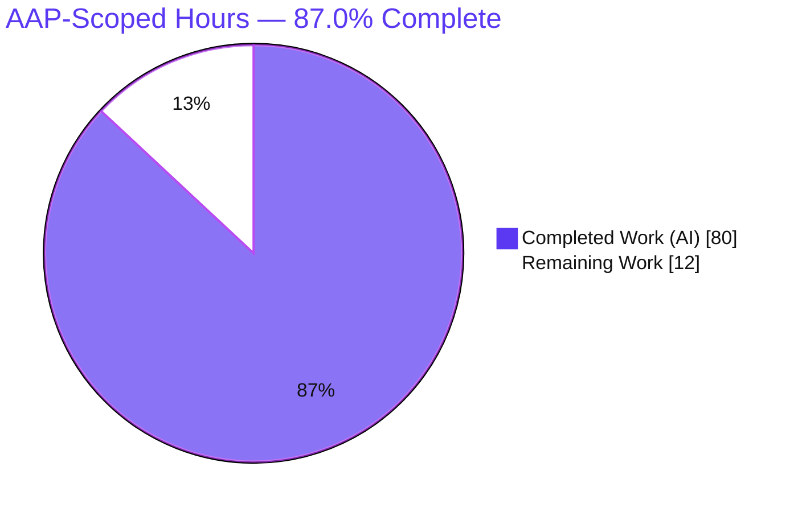
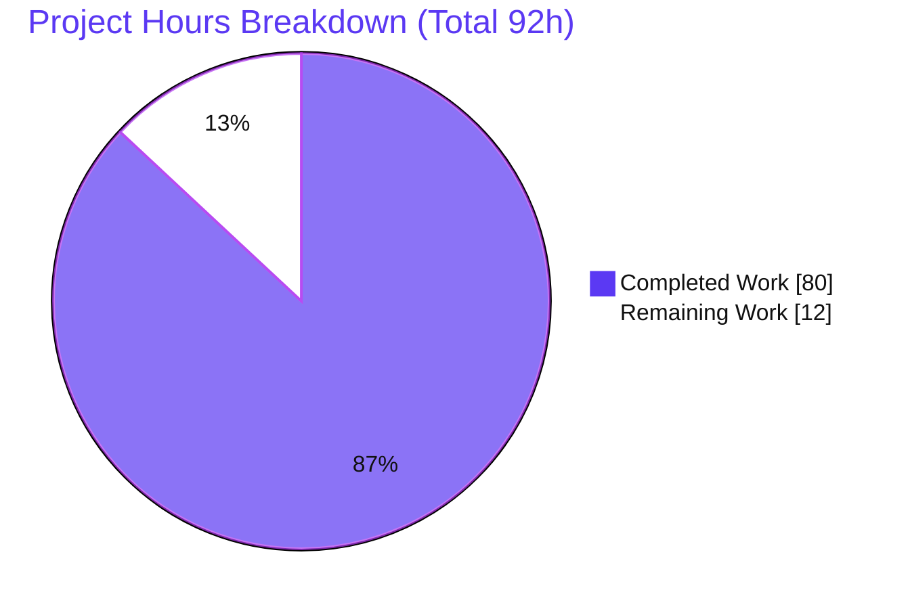
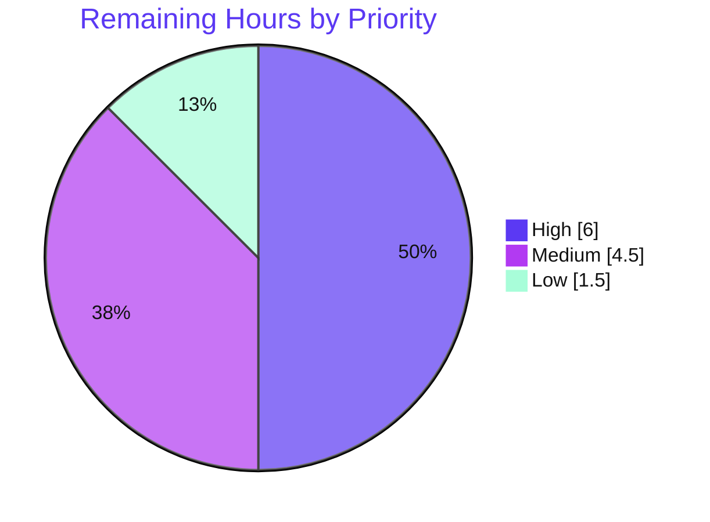
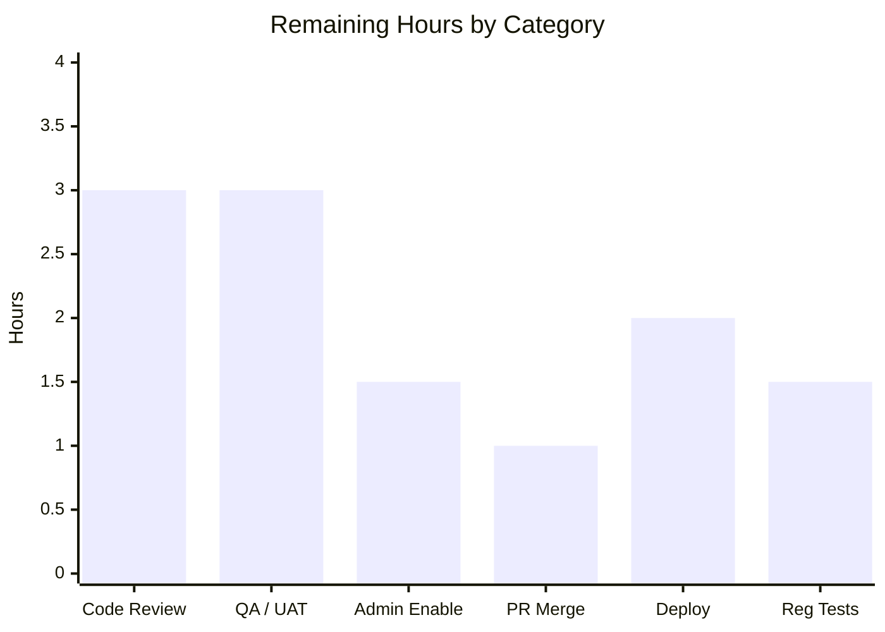

# Blitzy Project Guide — PcGrid Bulk Archive and Bulk Delete

> WebVella ERP · Branch `blitzy-4763a8a4-17fb-47e5-82e3-d73402cc53d0` · HEAD `e437af29`
> Brand legend: Completed / AI work = Dark Blue `#5B39F3` · Remaining = White `#FFFFFF` · Headings/Accents = Violet-Black `#B23AF2` · Highlight = Mint `#A8FDD9`

---

## 1. Executive Summary

### 1.1 Project Overview

This project adds an opt-in bulk archive and bulk delete capability to the WebVella ERP PcGrid list view on .NET 9. Administrators enable the feature per grid; end users then select several records on the rendered page and act on the whole selection in one request. Archive sets the existing `is_archived` flag and reverses easily, while Delete removes records permanently behind a count-aware confirmation. The work targets internal ERP operators who manage large record lists and want fewer one-at-a-time actions. The technical scope stays tight: six application files plus five committed deliverable artifacts, with every new option defaulting off so untouched grids render exactly as they do today.

### 1.2 Completion Status

The feature is fully implemented, committed, and validated end to end by Blitzy's autonomous systems. The remaining work is human governance and deployment that the platform cannot perform on its own: code review sign-off, staging QA, administrator enablement, pull-request merge, and production deployment.


```mermaid
%%{init: {"theme":"base","themeVariables":{"pie1":"#5B39F3","pie2":"#FFFFFF","pieStrokeColor":"#B23AF2","pieOuterStrokeWidth":"2px","pieSectionTextColor":"#111111","pieTitleTextColor":"#5B39F3","pieLegendTextColor":"#111111"}}}%%
pie showData
    title AAP-Scoped Hours — 87.0% Complete
    "Completed Work (AI)" : 80
    "Remaining Work" : 12
```

| Metric | Hours |
|--------|------:|
| **Total Hours** | 92 |
| **Completed Hours (AI + Manual)** | 80 (AI 80 + Manual 0) |
| **Remaining Hours** | 12 |
| **Percent Complete** | **87.0%** |

Formula: 80 completed / 92 total × 100 = **87.0%**.

### 1.3 Key Accomplishments

- [x] Multi-record selection added to the PcGrid Display view: per-row checkboxes plus a toolbar select-all, scoped to the rendered page.
- [x] Contextual bulk-action toolbar that stays hidden until at least one record is selected, then shows a live count with Archive and Delete actions.
- [x] Two REST bulk endpoints (`bulk/delete`, `bulk/archive`) that mirror the single-record transaction pattern and route through `RecordManager`, preserving per-record permission checks and hooks.
- [x] Best-effort partial-failure handling with per-record transactions and truthful HTTP status codes (200 / 207 / 422).
- [x] Differentiated confirmations: a count-aware, permanence-explicit Delete prompt and a lighter Archive prompt.
- [x] Security hardening beyond the base ask: same-origin Origin/Referer check, archive-field allowlist, field-level update authorization, and a 1000-record cap.
- [x] Backward compatibility preserved: all new options default off; no schema and no migrations.
- [x] All five deliverables committed: executive deck, critical-decisions review, and three UI screenshots.
- [x] Autonomous validation passed all five gates: restore, build (0 errors), runtime REST (10/10), live UI, and clean git state.

### 1.4 Critical Unresolved Issues

No in-scope defects remain. The items below are pre-existing platform issues outside the feature's scope. The feature did not introduce them, and the AAP forbids editing those files, so they were correctly left unmodified. They matter for a clean deployment on a case-sensitive Linux host and are recorded here for visibility.

| Issue | Impact | Owner | ETA |
|-------|--------|-------|-----|
| `Startup.cs:42` loads lowercase `config.json` while the repo ships `Config.json` | App fails to start on case-sensitive Linux hosts (FileNotFoundException) | Platform / DevOps | 0.5–1h |
| `ERPService.InitializeSystemEntities()` reportedly crashes on a fresh, unseeded database | First-run initialization can fail on an empty DB | Backend platform | 2–4h |

> Note: Both issues are excluded from the 87.0% AAP-scoped completion figure because they are pre-existing and out of scope. A short-lived, uncommitted `config.json` symlink workaround let autonomous validation run; the guide documents a permanent fix path in Section 9.

### 1.5 Access Issues

No repository, credential, or service-access issue blocked autonomous build, validation, or commit. Dependency restore, build, and runtime validation all completed on this host, and every in-scope change is committed to the assigned branch with a clean working tree.

| System/Resource | Type of Access | Issue Description | Resolution Status | Owner |
|-----------------|----------------|-------------------|-------------------|-------|
| Git repository / branch | Read + write | None — 13 commits landed; working tree clean | Resolved | Blitzy (autonomous) |
| NuGet feeds | Package restore | None — all 18 projects restored | Resolved | Blitzy (autonomous) |
| PostgreSQL `erp3` (validation DB) | DB connection | Used a pre-seeded DB for runtime validation | Resolved for validation | Blitzy (autonomous) |
| Staging / production environment | Deploy + admin role + prod DB | Not yet provisioned to the human team for UAT, enablement, and deployment | Pending human provisioning | Release / DevOps |

### 1.6 Recommended Next Steps

1. **[High]** Complete human code review and security sign-off of the two bulk endpoints and the Display inline script, focusing on the permanent delete, per-record authorization, and the CSRF origin check.
2. **[High]** Run manual QA / UAT in staging with real permission roles and representative data, covering partial-failure (207), grid refresh, and per-grid isolation.
3. **[Medium]** Have an administrator enable the options on target grids and confirm `is_archived` exists on each entity, then verify untouched grids still render unchanged.
4. **[Medium]** Merge the pull request to `master`, then deploy to staging/production and run a smoke test of both bulk routes.
5. **[Low]** Address the two pre-existing platform blockers (config casing, fresh-DB init) and add automated regression coverage for the bulk endpoints, since the repository ships no test projects today.

---

## 2. Project Hours Breakdown

### 2.1 Completed Work Detail

Every row below traces to a specific AAP requirement or a required deliverable, and all of it is complete and committed. Total equals the Completed Hours in Section 1.2.

| Component | Hours | Description |
|-----------|------:|-------------|
| Bulk REST endpoints + security/validation helpers (`WebApiController.cs`) | 20 | Two POST actions plus origin/CSRF check, archive-field allowlist, field-level authz, request normalization, per-record transactions with safe rollback, structured failure logging, and 200/207/422 response building |
| PcGrid options, view-model resolution & archive-availability detection (`PcGrid.cs`) | 6 | New opt-in options, entity-name resolution, and metadata-driven `ArchiveAvailable` computation written to ViewBag |
| Selection UI, contextual toolbar & inline client script (`Display.cshtml`) | 16 | Per-row checkboxes, contextual toolbar, live count, differentiated confirmations, AJAX, grid refresh, per-grid isolation, and WCAG affordances |
| Page Builder admin toggle wiring (`service.js`) | 4 | Master/child toggle behavior that keeps inputs serializable, keyboard/pointer guards, and deferred-init cleanup |
| Admin configuration form fields (`Options.cshtml`) | 2 | Three checkbox toggles, two text fields, and an admin guidance alert |
| Bulk request/result models (`BulkRecordActionModel.cs`) | 2 | Request payload and per-record result item with a stable JSON wire contract |
| Autonomous end-to-end validation (10 REST scenarios + live UI + build/restore) | 14 | Endpoint scenario testing, live-browser UI verification, and build/restore confirmation |
| Code-review & QA remediation cycles | 8 | Multiple documented autonomous review and QA passes (13-finding review, preflight info-disclosure guard, QA remediation) |
| Executive summary reveal.js deck (15 slides) | 5 | Self-contained deck with pinned CDN assets, Mermaid flow diagram, and risk slide |
| Critical decisions review artifact | 2 | Five risk-ordered decisions with the four mandated call-outs |
| Bulk-action screenshots (real-data capture) | 1 | Selection column, active-selection toolbar, and delete confirmation |
| **Total** | **80** | |

### 2.2 Remaining Work Detail

Every row is a path-to-production activity that requires a human. Total equals the Remaining Hours in Section 1.2 and the "Remaining Work" value in Section 7.

| Category | Hours | Priority |
|----------|------:|----------|
| Human code review & security sign-off (destructive + authorization paths) | 3 | High |
| Manual QA / UAT of bulk flows in staging (real roles + data) | 3 | High |
| Administrator enablement & per-entity `is_archived` verification | 1.5 | Medium |
| Pull request review & merge to `master` | 1 | Medium |
| Deployment to staging/production + smoke test | 2 | Medium |
| Automated regression coverage for bulk endpoints (recommended; no test infra today) | 1.5 | Low |
| **Total** | **12** | |

> Out of scope for the completion math (listed for awareness only): fixing `Startup.cs` config casing (~0.5–1h) and `ERPService` fresh-DB init (~2–4h). Both are pre-existing and outside the AAP.

### 2.3 Hours Reconciliation

- Section 2.1 total (Completed) = **80h**
- Section 2.2 total (Remaining) = **12h**
- Section 2.1 + Section 2.2 = **92h** = Total Hours in Section 1.2 ✔
- Completion = 80 / 92 = **87.0%** ✔

---

## 3. Test Results

The solution ships no test projects, so there are no unit tests to run; that criterion passes vacuously. Blitzy proved correctness through autonomous runtime and functional validation. Every entry below originates from this project's autonomous validation logs (Gates 1, 2, and 4).

| Test Category | Framework | Total Tests | Passed | Failed | Coverage % | Notes |
|---------------|-----------|------------:|-------:|-------:|-----------:|-------|
| Unit | None present | 0 | 0 | 0 | N/A | No test projects in the solution; criterion satisfied vacuously |
| REST / API functional | curl + live Kestrel | 10 | 10 | 0 | N/A | Archive 200 + flag flips; delete 200 + row count 1090→1087; mixed-id 207; no-Origin 403; cross-site 403; archive-field-absent 400; unauthenticated 302; empty ids 400; missing entityName 400; disallowed field 400 |
| UI / Runtime | Live browser (Chrome DevTools) | — | Pass | 0 | N/A | Checkboxes render; toolbar hidden→shown→hidden; live count via ARIA; differentiated confirmations; per-grid isolation on `/bulktwo`; WCAG affordances |
| Build / Compilation | dotnet build (.NET 9) | — | Pass | 0 | N/A | Build succeeded, 0 errors; no warnings in any in-scope file (re-confirmed by this guide's own build run) |
| Dependency restore | dotnet restore | 18 projects | 18 | 0 | N/A | Only pre-existing NU1902/NU1903 advisory warnings |

Integrity note: no fabricated unit tests appear here. All results come directly from Blitzy's autonomous validation of this feature.

---

## 4. Runtime Validation & UI Verification

Status legend: ✅ Operational · ⚠ Partial · ❌ Failing

**Runtime health**
- ✅ Application starts on Kestrel (`http://127.0.0.1:5000`) and reaches authenticated admin pages.
- ✅ Both bulk routes resolve and enforce POST-only, JSON-only (`[FromBody]`) contracts.
- ✅ Per-record DbContext transactions commit successes and roll back failures independently.

**REST / API integration**
- ✅ Bulk archive returns 200 and flips `is_archived` to true on affected records.
- ✅ Bulk delete returns 200 and reduces the row count as expected.
- ✅ Mixed valid/invalid selection returns 207 with a per-record result list (best-effort batch).
- ✅ Authorization and anti-CSRF: unauthenticated → 302; no-Origin and cross-site Origin → 403; disallowed archive field → 400.
- ✅ Input validation: empty `recordIds` → 400; missing `entityName` → 400.

**UI verification (live browser on `/bulktwo`, two grids on one page)**
- ✅ Per-row checkboxes render in the leading position of each row.
- ✅ Contextual toolbar starts hidden, appears on first selection, and hides again on full deselection.
- ✅ Live selected-count updates through an ARIA live region.
- ✅ Delete confirmation is count-aware and permanence-explicit; Archive confirmation is lighter and reversible.
- ✅ Per-grid isolation proven: selecting in one grid leaves the other grid's toolbar hidden and its count at zero.
- ✅ Accessibility: focus-visible rings, ARIA live regions, AA-contrast Delete color, and a disabled-Archive placeholder with tooltip when the archive field is absent.
- ⚠ Startup on a case-sensitive Linux host requires the pre-existing `config.json` casing workaround (out of scope; see Sections 1.4 and 9).

---

## 5. Compliance & Quality Review

This matrix maps AAP deliverables and governing rules to their verified status. Fixes applied during autonomous validation are noted.

| Benchmark / AAP Deliverable | Requirement | Status | Progress |
|-----------------------------|-------------|--------|----------|
| Selection UI | Per-row checkbox + select-all, page-scoped | ✅ Pass | 100% |
| Contextual toolbar | Hidden until ≥1 selected; live count; Archive + Delete | ✅ Pass | 100% |
| Bulk delete endpoint | Mirrors single-record REST + transaction pattern | ✅ Pass | 100% |
| Bulk archive endpoint | Sets existing `is_archived`; no schema/migration | ✅ Pass | 100% |
| Data-layer routing | Default `RecordManager`; per-record permission + hooks | ✅ Pass | 100% |
| Authorization | `EntityPermission.Delete` / `Update` per record; never weakened | ✅ Pass | 100% |
| Anti-CSRF | Same-origin Origin/Referer check on destructive routes | ✅ Pass | 100% (added; QA F5 remediation) |
| Partial failure | Per-record isolation; 200/207/422; per-record results | ✅ Pass | 100% |
| Backward compatibility | Options default off; untouched grids unchanged | ✅ Pass | 100% |
| Grid refresh | Reload after success | ✅ Pass | 100% |
| Scope containment | Only PcGrid among 49 Pc* components; exactly 11 files | ✅ Pass | 100% |
| Executive deck (rule 0.8.2) | reveal.js 12–18 slides, pinned CDN, Blitzy palette | ✅ Pass | 100% (15 slides; SRI added) |
| Critical decisions artifact (rule 0.8.2) | 5 risk-ordered decisions + 4 call-outs | ✅ Pass | 100% |
| Screenshots | Three PNGs committed | ✅ Pass | 100% |
| Prose clarity (rule 0.8.2) | Plain, active-voice documentation | ✅ Pass | 100% |
| Compilation | 0 errors; no in-scope warnings | ✅ Pass | 100% |
| Automated regression tests | Coverage for destructive endpoints | ⚠ Open | 0% (no test infra; recommended, not AAP-required) |

---

## 6. Risk Assessment

| Risk | Category | Severity | Probability | Mitigation | Status |
|------|----------|----------|-------------|------------|--------|
| Permanent bulk delete has no undo/trash | Technical | High | Low | Count-aware confirmation, per-record permission check, per-record transaction | Mitigated |
| No automated test coverage for destructive endpoints | Technical | Medium | Medium | Add regression tests (recommended); relies on autonomous runtime validation today | Open |
| Native `confirm()` is the only client guard | Technical | Low | Low | Explicit permanence wording; matches repo convention | Accepted |
| Per-record transaction loop scaling on large pages | Technical | Low | Low | 1000-record cap + page-scoped selection | Mitigated |
| CSRF on cookie-authenticated destructive routes | Security | High | Low | Same-origin Origin/Referer check + JSON-only `[FromBody]`; validated (403 on no-Origin/cross-site) | Mitigated |
| Field-write escalation via archive field | Security | Medium | Low | Archive-field allowlist + field-level update authz; validated (400 on disallowed field) | Mitigated |
| Per-record authorization bypass | Security | High | Low | Default `RecordManager` (`ignoreSecurity=false`); per-record Delete/Update checks; validated (302 unauth) | Mitigated |
| Error-message information disclosure | Security | Low | Low | Generic client-safe messages; safe server-side logging | Mitigated |
| Pre-existing `config.json` casing blocks Linux startup | Operational | High | High (case-sensitive FS) | Permanent fix in `Startup.cs` (out of scope) or deploy-time symlink | Open (out of scope) |
| Pre-existing `ERPService` fresh-DB init crash | Operational | Medium | Medium | Pre-seed DB or fix initialization (out of scope) | Open (out of scope) |
| No dedicated alerting for bulk failures | Operational | Low | Medium | Structured `LogService` logging present; add alerting | Partial |
| Misconfigured entity name / missing `is_archived` | Integration | Low | Medium | Admin warning + tooltip + metadata availability gate; fails safe | Mitigated |
| Opt-in feature not enabled in production | Integration | Low | Medium | Documented enablement steps; off by design | By design |
| PostgreSQL/Npgsql advisory-lock dependency | Integration | Low | Low | Reuses the existing DbContext transaction pattern | Mitigated |

---

## 7. Visual Project Status

**Hours: Completed vs Remaining** (Completed = Dark Blue `#5B39F3`, Remaining = White `#FFFFFF`)


```mermaid
%%{init: {"theme":"base","themeVariables":{"pie1":"#5B39F3","pie2":"#FFFFFF","pieStrokeColor":"#B23AF2","pieOuterStrokeWidth":"2px","pieSectionTextColor":"#111111","pieTitleTextColor":"#5B39F3","pieLegendTextColor":"#111111"}}}%%
pie showData
    title Project Hours Breakdown (Total 92h)
    "Completed Work" : 80
    "Remaining Work" : 12
```

**Remaining work by priority** (High 6h · Medium 4.5h · Low 1.5h = 12h)


```mermaid
%%{init: {"theme":"base","themeVariables":{"pie1":"#5B39F3","pie2":"#B23AF2","pie3":"#A8FDD9","pieStrokeColor":"#333333","pieOuterStrokeWidth":"2px","pieSectionTextColor":"#111111","pieTitleTextColor":"#5B39F3","pieLegendTextColor":"#111111"}}}%%
pie showData
    title Remaining Hours by Priority
    "High" : 6
    "Medium" : 4.5
    "Low" : 1.5
```

**Remaining hours by category** (Section 2.2)


```mermaid
xychart-beta
    title "Remaining Hours by Category"
    x-axis ["Code Review", "QA / UAT", "Admin Enable", "PR Merge", "Deploy", "Reg Tests"]
    y-axis "Hours" 0 --> 4
    bar [3, 3, 1.5, 1, 2, 1.5]
```

| Category | Hours |
|----------|------:|
| Human code review & sign-off | 3 |
| Manual QA / UAT | 3 |
| Administrator enablement | 1.5 |
| PR review & merge | 1 |
| Deployment + smoke test | 2 |
| Automated regression coverage | 1.5 |
| **Remaining total** | **12** |

Integrity: the pie "Remaining Work" (12), the Section 2.2 total (12), and the Section 1.2 Remaining Hours (12) all match.

---

## 8. Summary & Recommendations

The bulk archive and bulk delete feature is **87.0% complete** on an AAP-scoped basis: 80 hours of autonomous engineering delivered against 92 total hours, with 12 hours of human path-to-production work remaining. Blitzy implemented all six application files and all five deliverables, then validated the result across five gates. Dependency restore covered all 18 projects, the build produced zero errors with no in-scope warnings, all ten REST scenarios passed, and live-browser checks confirmed the selection UI, differentiated confirmations, and per-grid isolation. The change set stays inside exactly eleven files and touches only PcGrid among 49 Pc* components, so grids that do not opt in render unchanged.

**Achievements.** The feature preserves per-record authorization and lifecycle hooks by routing through the default `RecordManager`, handles partial failure as a best-effort batch with truthful status codes, and adds security depth the base request did not require: a same-origin check on the destructive routes, an archive-field allowlist, field-level authorization, and a request-size cap. Archive reuses the existing `is_archived` field with no schema and no migration.

**Remaining gaps.** The open work is inherently human. A reviewer must sign off on the permanent-delete and authorization paths, QA must exercise the flows in staging with real roles, an administrator must enable the options per grid, and the team must merge and deploy. The repository ships no test projects, so adding regression coverage for the two endpoints is a recommended, though not AAP-required, next step.

**Critical path to production.** Code review sign-off → staging QA/UAT → administrator enablement → merge → deploy and smoke test. Two pre-existing, out-of-scope platform issues (config-file casing on Linux and fresh-DB initialization) should be resolved by the platform team before a clean deployment on a case-sensitive host; neither was introduced by this feature and both were correctly left unmodified.

**Production readiness.** The in-scope code is production-ready: it compiles cleanly, runs correctly end to end, defaults off for safety, and is fully committed. Sign-off, QA, enablement, and deployment remain before the feature serves production traffic.

| Success metric | Target | Current |
|----------------|--------|---------|
| In-scope compilation errors | 0 | 0 ✅ |
| REST scenarios passing | 10/10 | 10/10 ✅ |
| Files outside scope modified | 0 | 0 ✅ |
| Backward-compatible default | Off | Off ✅ |
| Human sign-off + deploy | Complete | Pending (12h) |

---

## 9. Development Guide

### 9.1 System Prerequisites

- **.NET SDK 9.0** (verified `9.0.315`) and the ASP.NET Core 9.0 runtime (verified `9.0.17`).
- **PostgreSQL** reachable at the connection string in `WebVella.Erp.Site/Config.json` (default `Server=localhost;Port=5432;Database=erp3`).
- A Linux, macOS, or Windows host. On a **case-sensitive** filesystem, apply the `config.json` workaround in Section 9.6.

Verify the SDK:

```bash
dotnet --version          # expect 9.0.x
dotnet --list-runtimes | grep -i aspnet   # expect Microsoft.AspNetCore.App 9.0.x
```

### 9.2 Environment Setup

```bash
# From the repository root
cd /path/to/WebVella-ERP

# Confirm the shipped config file (note the capital C)
ls WebVella.Erp.Site/Config.json

# Set the PostgreSQL connection string inside Config.json:
#   "ConnectionString": "Server=localhost;Port=5432;User Id=<user>;Password=<pass>;Database=erp3;Pooling=true;..."
```

### 9.3 Dependency Installation

```bash
dotnet restore WebVella.ERP3.sln
# Expected: "All projects are up-to-date for restore." (exit 0)
# Only NU1902 (MailKit) and NU1903 (AutoMapper) advisory warnings appear; both are pre-existing and non-blocking.
```

### 9.4 Build

```bash
dotnet build WebVella.ERP3.sln -c Debug --no-restore
# Expected: "Build succeeded." with "0 Error(s)".
```

### 9.5 Application Startup

```bash
# On a case-sensitive host, apply the workaround in 9.6 first.
ASPNETCORE_URLS=http://127.0.0.1:5000 \
ASPNETCORE_ENVIRONMENT=Development \
dotnet run --no-build --project WebVella.Erp.Site
# Browse http://127.0.0.1:5000 and sign in (validation used erp@webvella.com / erp).
```

### 9.6 Verification Steps

1. The site loads and you can sign in.
2. Enable the feature on a grid: open the PcGrid options and turn on **Bulk Actions**, set **Entity Name** to the grid's entity, and (optionally) **Bulk Delete** / **Bulk Archive**. Leave **Archive Field Name** as `is_archived`.
3. On the list page, select one or more rows. The contextual toolbar appears with a live count.
4. Click **Delete** to see the count-aware permanence confirmation, or **Archive** for the lighter prompt.

### 9.7 Example Usage (REST)

The endpoints require an authenticated, same-origin session (the grid's own AJAX satisfies this). Illustrative shapes:

```bash
# Bulk archive
curl -sS -X POST "http://127.0.0.1:5000/api/v3/en_US/record/bulk/archive" \
  -H "Content-Type: application/json" \
  -H "Origin: http://127.0.0.1:5000" \
  --cookie "<auth-cookie>" \
  -d '{"entityName":"my_entity","recordIds":["<guid1>","<guid2>"],"archiveFieldName":"is_archived"}'

# Bulk delete
curl -sS -X POST "http://127.0.0.1:5000/api/v3/en_US/record/bulk/delete" \
  -H "Content-Type: application/json" \
  -H "Origin: http://127.0.0.1:5000" \
  --cookie "<auth-cookie>" \
  -d '{"entityName":"my_entity","recordIds":["<guid1>","<guid2>"]}'
```

Expected responses: **200** when every record succeeds, **207** when some succeed and some fail (per-record results included), **422** when none succeed, **400** for empty `recordIds` / missing `entityName` / disallowed archive field, **403** for cross-site or missing Origin, and **302** when unauthenticated.

### 9.8 Troubleshooting

- **`FileNotFoundException` for `config.json` on startup (Linux):** the host loads lowercase `config.json` while the repo ships `Config.json`. Non-invasive workaround (do not commit):
  ```bash
  cd WebVella.Erp.Site && ln -s Config.json config.json
  ```
  Permanent fix (out of scope for this PR): change `Startup.cs:42` to reference `Config.json`.
- **Initialization crash on a fresh database:** `ERPService.InitializeSystemEntities()` can fail on an empty DB. Use a pre-seeded `erp3` database or a seeded snapshot.
- **Archive button disabled:** the entity has no `is_archived` checkbox field, or the grid's Archive Field Name is not `is_archived`. Confirm the field exists on the entity.
- **Toolbar never appears:** ensure Bulk Actions is on and the Entity Name is set; the toolbar renders only when both conditions hold.

---

## 10. Appendices

### A. Command Reference

| Command | Purpose |
|---------|---------|
| `dotnet --version` | Confirm .NET SDK 9.0.x |
| `dotnet restore WebVella.ERP3.sln` | Restore NuGet packages (18 projects) |
| `dotnet build WebVella.ERP3.sln -c Debug` | Build the solution (expect 0 errors) |
| `dotnet run --project WebVella.Erp.Site` | Run the host site |
| `git diff --stat c871fd85..HEAD` | Show the 11-file change set |

### B. Port Reference

| Port | Service | Notes |
|------|---------|-------|
| 5000 | Kestrel (HTTP) | `ASPNETCORE_URLS=http://127.0.0.1:5000` used in validation |
| 5432 | PostgreSQL | Database `erp3` per `Config.json` |

### C. Key File Locations

| Path | Role |
|------|------|
| `WebVella.Erp.Web/Models/BulkRecordActionModel.cs` | Request + per-record result models (new) |
| `WebVella.Erp.Web/Controllers/WebApiController.cs` | Bulk delete/archive actions + helpers (`BulkDeleteRecords` L1903, `BulkArchiveRecords` L1977) |
| `WebVella.Erp.Web/Components/PcGrid/PcGrid.cs` | Opt-in options + view-model resolution |
| `WebVella.Erp.Web/Components/PcGrid/Display.cshtml` | Selection UI, toolbar, inline script |
| `WebVella.Erp.Web/Components/PcGrid/service.js` | Page Builder admin toggle wiring |
| `WebVella.Erp.Web/Components/PcGrid/Options.cshtml` | Admin configuration fields |
| `WebVella.Erp.Site/Config.json` | Connection string + host config |
| `blitzy-deck/bulk-actions-executive-summary.html` | Executive summary deck |
| `docs/review/CRITICAL_DECISIONS.md` | Critical-decision review artifact |
| `docs/screenshots/bulk-actions/` | Three UI screenshots |

### D. Technology Versions

| Technology | Version |
|------------|---------|
| .NET SDK | 9.0.315 |
| ASP.NET Core runtime | 9.0.17 |
| Target framework | net9.0 |
| Newtonsoft.Json | 13.0.4 |
| WebVella.TagHelpers | 1.7.2 (untouched) |
| PostgreSQL client | Npgsql (existing) |
| reveal.js / Mermaid / Lucide (deck, CDN only) | 5.1.0 / 11.4.0 / 0.460.0 |

### E. Environment Variable Reference

| Variable | Example | Purpose |
|----------|---------|---------|
| `ASPNETCORE_URLS` | `http://127.0.0.1:5000` | Kestrel bind address |
| `ASPNETCORE_ENVIRONMENT` | `Development` | Hosting environment |

### F. REST Endpoint Reference

| Method | Route | Body | Success |
|--------|-------|------|---------|
| POST | `api/v3/en_US/record/bulk/delete` | `{ entityName, recordIds[] }` | 200 / 207 / 422 |
| POST | `api/v3/en_US/record/bulk/archive` | `{ entityName, recordIds[], archiveFieldName? }` | 200 / 207 / 422 |

Guards: same-origin Origin/Referer required (else 403); `[FromBody]` JSON only; per-record `EntityPermission.Delete` / `Update`; archive field limited to the `is_archived` allowlist; up to 1000 records per request.

### G. Glossary

| Term | Meaning |
|------|---------|
| PcGrid | The WebVella page component that renders a data list as a table |
| `is_archived` | Existing boolean soft-delete flag the Archive action sets to true |
| Best-effort batch | Each record processed independently; failures do not abort the batch |
| Per-grid isolation | Selection state keyed by component node id so multiple grids never collide |
| Path-to-production | Human governance and deployment work required after autonomous implementation |
| AAP | Agent Action Plan — the authoritative project scope |
