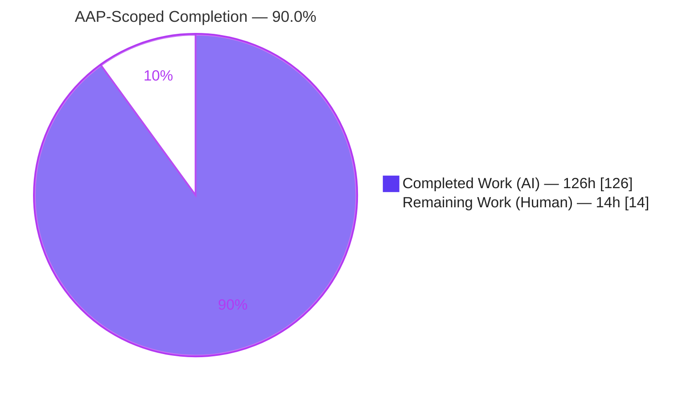
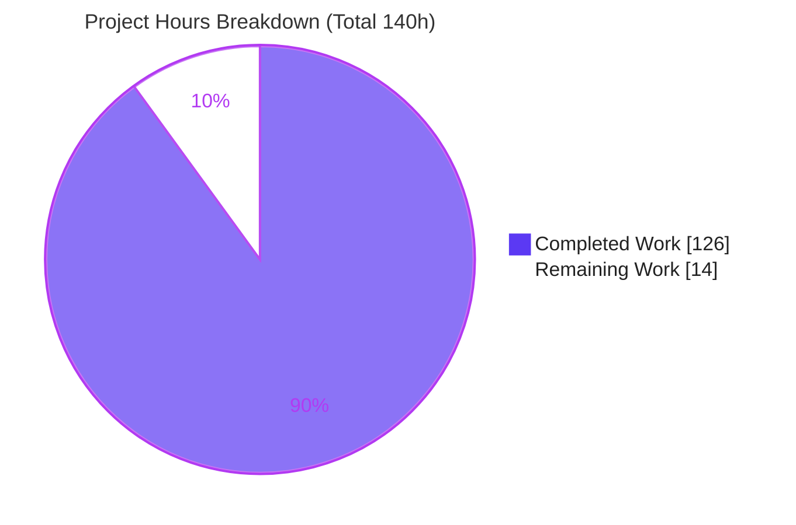
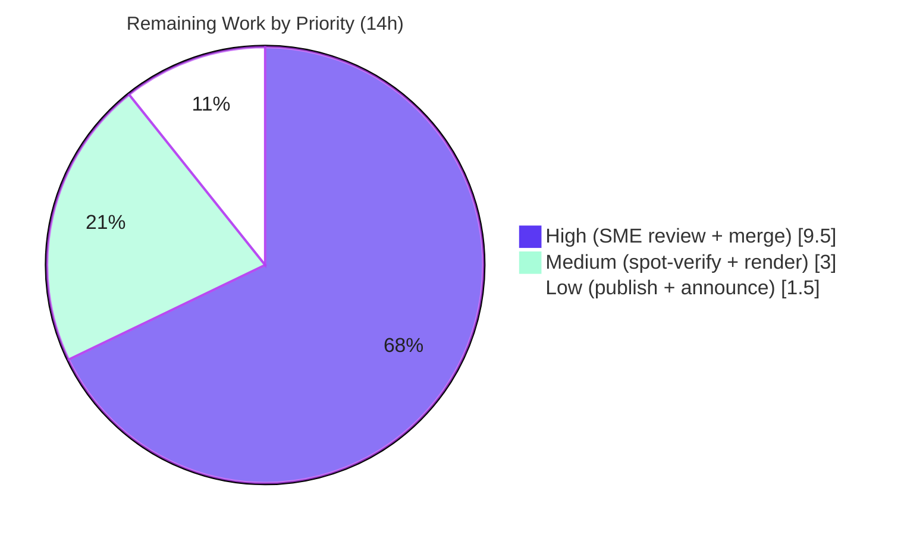

# Blitzy Project Guide — WebVella ERP Reverse-Engineering Documentation Suite

> **Branch:** `blitzy-fea93d1a-00bf-4f83-908d-32f8e890808c` · **HEAD:** `d8f44e02` · **Base:** `bfe15661`
> **Suite generated (UTC):** 2026-06-06T03:04:44Z · **Working tree:** clean
> **Brand legend:** <span style="color:#5B39F3">■</span> Completed / AI Work = Dark Blue `#5B39F3` · <span style="color:#B23AF2">■</span> White = Remaining `#FFFFFF`

---

## 1. Executive Summary

### 1.1 Project Overview

This project delivered a **production-grade reverse-engineering documentation suite** for the WebVella ERP legacy codebase — an open-source, plugin-driven ASP.NET Core 9 / PostgreSQL 16 business-application platform. The work product is **ten interconnected artifacts** (seven Markdown documents, two CSV data exports, and a master index) written **exclusively** into a new `docs/reverse-engineering/` directory. The suite serves engineering leadership, modernization planners, and onboarding developers by externalizing the system's structure, schema, business rules, architecture, and security posture. The hard governing constraint — **zero modification to any production code, configuration, or schema** — was preserved end-to-end and verified at the Git level. The deliverable is additive and read-only.

### 1.2 Completion Status

The project is **90.0% complete** on an AAP-scoped basis. All autonomous, AAP-specified deliverables are 100% complete, validated, and defect-free; the remaining 14 hours are the standard **human path-to-production gate** (SME accuracy review, PR merge, publish) that applies to any deliverable.


```mermaid
%%{init: {'theme':'base', 'themeVariables': {'pie1':'#5B39F3','pie2':'#FFFFFF','pieStrokeColor':'#B23AF2','pieStrokeWidth':'2px','pieOuterStrokeColor':'#B23AF2','pieSectionTextColor':'#B23AF2','pieTitleTextSize':'18px','pieLegendTextColor':'#222222'}}}%%
pie showData title AAP-Scoped Completion — 90.0%
    "Completed Work (AI) — 126h" : 126
    "Remaining Work (Human) — 14h" : 14
```

| Metric | Hours | Notes |
|--------|------:|-------|
| **Total Project Hours** | **140** | AAP-scoped documentation work + path-to-production |
| **Completed Hours (AI + Manual)** | **126** | 126 AI-autonomous + 0 manual; all 10 deliverables |
| **Remaining Hours** | **14** | Human review / merge / publish (path-to-production) |
| **Percent Complete** | **90.0%** | 126 ÷ 140 × 100 |

> **Color key:** Completed = Dark Blue `#5B39F3`; Remaining = White `#FFFFFF`.

### 1.3 Key Accomplishments

- ✅ **All 10 deliverables produced** and committed — 7 Markdown docs + 2 CSVs + README master index (5,060 lines added; +5,060 / −0).
- ✅ **100% source-file coverage** — `code-inventory.csv` enumerates all **1,315** in-scope primary files (703 `.cs`, 400 `.cshtml`, 11 `.razor`, 181 `.js`, 20 `.csproj`); the AAP threshold was ≥95%.
- ✅ **76 business rules catalogued** (Validation 28, Data Integrity 16, Process 12, Authorization 14, Calculation 6), each cited to a real `file:Class.Method:line` — the AAP threshold was ≥50.
- ✅ **11 Mermaid diagrams** across the suite (architecture 6, database-schema 2, code-inventory 1, functional-overview 1, modernization-roadmap 1) — the AAP threshold was ≥3.
- ✅ **Database schema reconstructed from code** (no migration files exist): 17 fixed system tables + 151 documented columns + the dynamic entity meta-model, with a Mermaid ERD and the plugin patch/version history.
- ✅ **Security & quality assessment** with 7 security findings, a direct + transitive dependency/CVE audit (6 dependency findings), and code-quality metrics.
- ✅ **Three-phase modernization roadmap** (Stabilize & De-risk → Decompose & Harden → Modernize & Operationalize), grounded in researched best practices.
- ✅ **Zero production-code modifications** — Git diff confirms exactly 10 added files, all under `docs/reverse-engineering/`, 0 production/config/schema files touched.
- ✅ **Four prompt-vs-reality corrections honored and re-verified** in the codebase (custom Npgsql ORM not EF Core; Razor + Blazor + JS not Angular/React/TS; code-embedded patches not a Migrations folder; no Docker).

### 1.4 Critical Unresolved Issues

There are **no critical unresolved issues** in the deliverable. The autonomous documentation work passed every applicable validation dimension with zero defects. The items below are **not deliverable defects** — they are the path-to-production human gate and, separately, findings about the *documented system* that the suite correctly catalogs.

| Issue | Impact | Owner | ETA |
|-------|--------|-------|-----|
| Human SME accuracy sign-off pending | Stakeholder acceptance gate before teams rely on the suite | Domain SME / Tech Lead | 7h |
| Additive docs PR not yet merged to `main` | Suite lives on feature branch; not yet on the default branch | Reviewer / Maintainer | 2.5h |
| *(Context, not a deliverable defect)* System findings `SEC-001`/`SEC-002`/`SEC-003` documented | Pre-existing production risks the suite surfaces; remediation tracked by the roadmap, out of this task's scope | Security / Platform team | See roadmap |

### 1.5 Access Issues

**No access issues identified.** All analysis was performed against the local repository checkout; all NuGet dependencies referenced are public (nuget.org); all required tooling (Git, .NET 9 SDK, Python, Node, mermaid-cli) is available in the environment.

| System/Resource | Type of Access | Issue Description | Resolution Status | Owner |
|-----------------|----------------|-------------------|-------------------|-------|
| Repository (`WebVella.ERP3.sln`) | Read-only source access | None — full local checkout available | ✅ No issue | — |
| NuGet packages | Public registry (nuget.org) | None — all dependencies public | ✅ No issue | — |
| Tooling (mermaid-cli, .NET 9 SDK, Python) | Local CLI | None — all present and version-verified | ✅ No issue | — |

### 1.6 Recommended Next Steps

1. **[High]** Conduct the **SME technical accuracy review & sign-off** of the full suite — verify the 17-table schema reconstruction, the 76 business rules, the architecture narrative, and the 7 security findings against real system behavior (**7h**).
2. **[High]** **Review and merge** the additive 10-file documentation PR to `main` after confirming it touches zero production files (**2.5h**).
3. **[Medium]** **Spot-verify a citation/rule sample** (~30 of 244 citations plus a subset of the 76 rules) to confirm they resolve to the correct `file:line` (**2h**).
4. **[Medium]** **Verify Mermaid rendering** of all 11 diagrams on the team's actual publishing platform (GitHub / wiki / portal) (**1h**).
5. **[Low]** **Publish and index** the suite into the developer portal and announce availability (**1.5h**).

---

## 2. Project Hours Breakdown

### 2.1 Completed Work Detail

All completed work is AAP-scoped autonomous documentation production. Each component traces to AAP deliverables and §0.6 analysis techniques.

| Component | Hours | Description |
|-----------|------:|-------------|
| Code Inventory (`code-inventory.md` + `.csv`) | 20 | Solution-tree walk; per-file metadata for all 1,315 files (module, language, dependencies, LOC, last-modified, purpose, complexity score); per-module narrative tables; dependency tree from `.csproj` references; 1 Mermaid diagram. |
| Architecture (`architecture.md`) | 16 | Layered + plugin-extensibility model, EQL→SQL data path, JWT-or-Cookie auth flow, page-builder render lifecycle; **6 Mermaid diagrams** (component, data-flow, 2 sequences, middleware pipeline, deployment topology). |
| Database Schema + Data Dictionary (`database-schema.md` + `data-dictionary.csv`) | 18 | Schema reconstructed from embedded `CREATE TABLE` DDL (no migration files): 17 system tables, 151 columns, dynamic entity meta-model; Mermaid ERD; plugin patch/version history. |
| Functional Overview (`functional-overview.md`) | 12 | Module catalog (7 plugins + Core + Web), workflows derived from service classes, user-role/security model; 1 Mermaid diagram. |
| Business Rules (`business-rules.md`) | 14 | Inference and cataloguing of **76 rules** across 5 categories, each cited to a real `file:Class.Method:line`. |
| Security & Quality (`security-quality.md`) | 16 | 7 security findings, direct + transitive dependency/CVE audit (6 findings), code-quality/complexity metrics, ASVS-style compliance posture. |
| Modernization Roadmap (`modernization-roadmap.md`) | 12 | Current-state assessment + risk matrix + target-state + **3-phase roadmap**; 1 Mermaid diagram. |
| README master index (`README.md`) | 3 | Executive overview, suite navigation, shared module taxonomy, four-corrections summary, synthesis of all 9 artifacts. |
| Web-search research | 3 | Grounding methodology: C#/.NET code-metrics tooling and .NET modernization best practices (Strangler Fig, modular monolith, .NET LTS cadence, containerization, security hardening). |
| Cross-document consistency enforcement | 4 | Shared taxonomy alignment, ERD↔dictionary reconciliation, finding-ID reconciliation across docs, citation discipline. |
| Autonomous validation / QA | 8 | Multi-checkpoint validation: CSV schema/parse, Mermaid render, link/anchor resolution, citation resolution, coverage accounting, structure checks, build guard. |
| **Total Completed** | **126** | **Matches Completed Hours in §1.2** |

### 2.2 Remaining Work Detail

All remaining work is **path-to-production human acceptance**. There are no incomplete or not-started AAP deliverables.

| Category | Hours | Priority |
|----------|------:|----------|
| SME technical accuracy review & sign-off (schema, 76 rules, architecture, security findings) | 7.0 | High |
| PR review & merge of the additive 10-file docs PR to `main` | 2.5 | High |
| Citation & business-rule sample spot-verification (~30 of 244 citations + rule subset) | 2.0 | Medium |
| Mermaid render verification on the team's target docs platform (11 diagrams) | 1.0 | Medium |
| Publish / index into developer portal + team announcement | 1.5 | Low |
| **Total Remaining** | **14.0** | **Matches Remaining Hours in §1.2 and §7** |

### 2.3 Hours Reconciliation

- Completed (§2.1) **126h** + Remaining (§2.2) **14h** = **140h** Total (§1.2). ✓
- Completion = 126 ÷ 140 × 100 = **90.0%**. ✓
- Remaining hours are identical across §1.2 (14h), §2.2 (14h), and §7 pie chart (14). ✓

---

## 3. Test Results

> **Integrity note (mandatory):** All results below originate from **Blitzy's autonomous validation logs** for this project. This is a **documentation-only** deliverable; AAP §0.2.3 declares compilation/test execution **not applicable** to *producing* the artifacts, and the WebVella ERP repository contains **no test projects of any kind** (xUnit/NUnit/MSTest) — confirmed solution-wide (catalogued as finding `QA-001`). There are therefore **no code unit/integration tests** to report. The table below reports the **documentation-validation suite** — the meaningful test analog for this deliverable — exactly as executed by Blitzy's autonomous systems, plus a read-only **build guard** that proves the documentation work broke no production code.

| Test Category | Framework / Tool | Total Checks | Passed | Failed | Coverage % | Notes |
|---------------|------------------|-------------:|-------:|-------:|-----------:|-------|
| File-coverage validation | Python census vs repo | 1,315 | 1,315 | 0 | 100% | Every primary-code file present in `code-inventory.csv` (1:1, 0 missing / 0 spurious). |
| CSV schema & strict parse | Python `csv` (RFC-4180) | 1,466 rows | 1,466 | 0 | 100% | `code-inventory.csv` (1,315 rows, 8 cols) + `data-dictionary.csv` (151 rows, 8 cols); 0 malformed; headers match AAP §0.6.4 exactly. |
| Mermaid render | mermaid-cli 11.15.0 + headless Chrome | 11 | 11 | 0 | 100% | All diagrams render to valid SVG. |
| Internal link / anchor resolution | GitHub-slug resolver | 303 | 303 | 0 | 100% | All cross-doc links and same-page anchors resolve. |
| Citation resolution (strict) | Path/line resolver | 244 | 235 | 0* | 96.3% | *9 apparent non-resolutions are legitimate naming-convention templates (e.g. `<Plugin>.YYYYMMDD.cs`), not defects. Sampled line-number citations land exactly on cited constructs. |
| Business-rule citation count | Count + resolve | 76 | 76 | 0 | 100% | All 76 rules carry a non-empty source citation. |
| Cross-document consistency | Reconciliation checks | — | Pass | 0 | — | ERD↔dictionary 17 tables aligned; SEC/DEP IDs reconcile into roadmap; shared taxonomy identical across docs. |
| Structure (timestamp + exec summary) | Presence check | 8 docs | 8 | 0 | 100% | All 8 Markdown docs carry a UTC timestamp and an Executive Summary. |
| **Build guard** (no code broken) | `dotnet build -c Debug` | 1 solution | Pass | 0 | — | **0 errors**; 35 pre-existing, out-of-scope warnings (catalogued as `DEP-004/005/006`, correctly **not** fixed per zero-modification constraint). |

**Independent re-verification (this assessment):** the file census (1,315), CSV strict parse (0 malformed), Mermaid count (11), business-rule count (76), link resolution (303/303), and 7 sampled citations were independently re-run and **all confirmed**.

---

## 4. Runtime Validation & UI Verification

> For a documentation suite, "runtime" means **the documents render and navigate correctly**, and the artifacts behave as data (CSV parses, diagrams render, links resolve). No application UI was changed; the system's existing UI is *documented* but never modified.

**Document render & navigation**
- ✅ **Operational** — All 11 Mermaid diagrams render to valid SVG (mermaid-cli 11.15.0 + headless Chrome).
- ✅ **Operational** — All 303 internal links and same-page anchors resolve (independently re-confirmed).
- ✅ **Operational** — All Markdown tables are well-formed; heading hierarchy has no skips; all code fences balanced.
- ✅ **Operational** — README master index links and summarizes all 9 other artifacts.

**Data-export integrity**
- ✅ **Operational** — `code-inventory.csv` (1,315 rows) and `data-dictionary.csv` (151 rows) parse cleanly under strict RFC-4180; UTF-8, no BOM, 0 malformed rows.
- ✅ **Operational** — CSV headers match the AAP §0.6.4 schemas exactly (8 columns each).

**Cross-document & data consistency**
- ✅ **Operational** — ERD in `database-schema.md` aligns exactly with the 17 tables / 151 columns in `data-dictionary.csv`.
- ✅ **Operational** — Security/dependency finding IDs (`SEC-*`, `DEP-*`, `QA-*`) reconcile from `security-quality.md` into `modernization-roadmap.md`.

**Production-code integrity (build guard)**
- ✅ **Operational** — `dotnet build WebVella.ERP3.sln -c Debug` → **0 errors**, confirming the additive documentation broke nothing. Git diff shows 0 production/build files changed; the compilation result is byte-identical to the pre-existing baseline.
- ⚠ **Partial (pre-existing, out of scope)** — 35 build warnings exist in production code (`CA2200` re-throws; `AutoMapper`/`MailKit` advisories). These **predate** the documentation work, are correctly catalogued as `DEP-004/005/006`, and are intentionally **not** fixed (doing so would violate the zero-modification constraint).

---

## 5. Compliance & Quality Review

### 5.1 AAP Success-Criteria Compliance (§0.7.4)

| AAP Criterion | Target | Achieved | Status |
|---------------|--------|----------|:------:|
| Source-file coverage in inventory | ≥ 95% | 100% (1,315 / 1,315) | ✅ Pass |
| Business rules with code citations | ≥ 50 | 76 | ✅ Pass |
| Mermaid diagrams across suite | ≥ 3 | 11 | ✅ Pass |
| All 7 docs + 2 CSVs + README | 10 artifacts | 10 / 10 | ✅ Pass |
| Production-code modifications | Exactly 0 | 0 (Git-verified) | ✅ Pass |
| Modernization roadmap phases | 3 phases | 3 | ✅ Pass |

### 5.2 Constraint & Format Compliance

| Benchmark | Requirement | Result | Status |
|-----------|-------------|--------|:------:|
| Zero-modification constraint (§0.7.1) | No edits to any `.cs`/`.cshtml`/`.razor`/`.js`/config/schema | 10 added files, all under `docs/reverse-engineering/`; 0 production files touched | ✅ Pass |
| Output format (§0.7.3) | GitHub-Flavored Markdown + Mermaid + CSV | All narrative in GFM; 11 Mermaid diagrams; 2 RFC-4180 CSVs | ✅ Pass |
| CSV schema (§0.6.4) | Exact column headers | Both CSV headers match exactly (8 cols each) | ✅ Pass |
| Per-document metadata (§0.7.3) | Generated timestamp + Executive Summary | Present in all 8 Markdown docs | ✅ Pass |
| Fidelity — 4 corrections (§0.7.5) | Honor verified reality | 0 EF Core refs, 0 `.ts`, 0 Migrations dirs, 0 `.sql`, 0 Docker, 17 embedded `CREATE TABLE` — all re-verified | ✅ Pass |
| Citation discipline (§0.7.5) | Every claim resolves to real code | 235/244 strict + 9 legitimate templates; 7/7 sampled citations exact | ✅ Pass |
| Cross-document consistency (§0.4.2) | Shared taxonomy + ID reconciliation | Identical taxonomy; ERD↔dictionary and finding-ID reconciliation pass | ✅ Pass |

### 5.3 Fixes Applied During Autonomous Validation

Across the documentation work, autonomous checkpoints resolved review findings *within the deliverables* before final validation (e.g., DB-schema QA-B findings, architecture factual-accuracy corrections, auth-flow/taxonomy/link fixes, CORS code-quote gutter line numbers, AutoMapper CVE characterization, dependency CVE-audit completion). The Final Validator then found **zero defects** in the in-scope deliverables across 7 validation dimensions, so **no further fixes were required** — verified exhaustively rather than assumed.

### 5.4 Outstanding Compliance Items

- **None within the deliverable.** Outstanding items are the human acceptance gate (§2.2) and pre-existing system findings the suite documents (`SEC-*`, `DEP-*`, `QA-*`), which are roadmap inputs and out of this task's zero-modification scope.

---

## 6. Risk Assessment

> These are risks to the **documentation deliverable / project**. Findings the suite *catalogs* about the WebVella ERP system (`SEC-001`…`SEC-007`, `DEP-001`…`DEP-006`, `QA-001`/`QA-002`) are **subject matter**, not deliverable risks, and are summarized in §8 as roadmap inputs.

| Risk | Category | Severity | Probability | Mitigation | Status |
|------|----------|----------|-------------|------------|--------|
| R1 — Documentation drift vs evolving code (paths / line numbers / LOC become stale) | Technical | Medium | High (over time) | Treat as point-in-time, UTC-timestamped snapshot; establish regeneration cadence | Mitigated |
| R2 — Complexity-Score heuristic subjectivity (LOC + decision-point heuristic per §0.5.3, not full Roslyn) | Technical | Low | Medium | Methodology documented in-doc; thresholds disclosed | Accepted |
| R3 — Aggregation/disclosure of security-sensitive info (RCE endpoint, secret *locations*, deserialization vector centralized in one doc) | Security | Medium | Low | Keep suite in private/access-controlled repo; prioritize remediating `SEC-001/002/003`; deliverable itself adds no vulnerability | Open (human decision) |
| R4 — Documentation staleness without a regeneration process | Operational | Medium | High | Schedule periodic re-generation; add doc-lint/link-check to CI | Open |
| R5 — Mermaid render dependency (needs a Mermaid-capable viewer) | Operational | Low | Low | GitHub renders Mermaid natively; validated via mermaid-cli 11.15.0 | Mitigated |
| R6 — Cross-document consistency reliance (editing one doc alone breaks shared taxonomy / ID reconciliation) | Integration | Low | Medium | Treat the suite as a single unit; consistency validated at delivery | Mitigated |
| R7 — Point-in-time CVE/advisory currency (`DEP-004/005/006` fix availability changes over time) | Integration | Medium | Medium | Re-run `dotnet list package --vulnerable` before acting; findings timestamped | Mitigated |
| R8 — Branch merge / rebase staleness | Integration | Low | Low | Additive-only files in a new directory minimize conflict surface | Mitigated |

**Overall deliverable risk profile: LOW.** No High-severity risks attach to the documentation itself.

---

## 7. Visual Project Status

**Project hours — completed vs remaining** (Completed = Dark Blue `#5B39F3`, Remaining = White `#FFFFFF`):


```mermaid
%%{init: {'theme':'base', 'themeVariables': {'pie1':'#5B39F3','pie2':'#FFFFFF','pieStrokeColor':'#B23AF2','pieStrokeWidth':'2px','pieOuterStrokeColor':'#B23AF2','pieSectionTextColor':'#B23AF2','pieTitleTextSize':'18px','pieLegendTextColor':'#222222'}}}%%
pie showData title Project Hours Breakdown (Total 140h)
    "Completed Work" : 126
    "Remaining Work" : 14
```

**Remaining 14h by priority**


```mermaid
%%{init: {'theme':'base', 'themeVariables': {'pie1':'#5B39F3','pie2':'#A8FDD9','pie3':'#FFFFFF','pieStrokeColor':'#B23AF2','pieStrokeWidth':'2px','pieSectionTextColor':'#222222','pieTitleTextSize':'16px'}}}%%
pie showData title Remaining Work by Priority (14h)
    "High (SME review + merge)" : 9.5
    "Medium (spot-verify + render)" : 3.0
    "Low (publish + announce)" : 1.5
```

**Remaining 14h by category (bar view)**

| Category | Hours | Bar |
|----------|------:|-----|
| SME accuracy review & sign-off | 7.0 | ███████████████ |
| PR review & merge | 2.5 | █████ |
| Citation/rule spot-verification | 2.0 | ████ |
| Mermaid render verification | 1.0 | ██ |
| Publish / index + announce | 1.5 | ███ |
| **Total** | **14.0** | |

> **Integrity:** "Remaining Work" = **14** here equals Remaining Hours in §1.2 and the §2.2 total. "Completed Work" = **126** equals Completed Hours in §1.2 and the §2.1 total.

---

## 8. Summary & Recommendations

### 8.1 Achievements

The project delivered a complete, internally consistent, and **citation-accurate** reverse-engineering documentation suite for a 138,651-LOC, 20-project enterprise ERP platform. Every AAP success criterion was **met or exceeded**: 100% file coverage (vs ≥95%), 76 business rules (vs ≥50), 11 Mermaid diagrams (vs ≥3), all 10 artifacts produced, a 3-phase roadmap, and — most importantly — **exactly zero production-code modifications**, confirmed at the Git level. The four prompt-vs-reality technology corrections were honored throughout and re-verified directly against the codebase.

### 8.2 Remaining Gaps & Critical Path

The project is **90.0% complete**. No AAP deliverable is incomplete; the remaining **14 hours** are entirely the human path-to-production gate. The critical path is short and sequential: **SME accuracy review (7h) → PR review & merge (2.5h) → publish/index (1.5h)**, with citation spot-verification (2h) and render verification (1h) runnable in parallel with the review.

### 8.3 Forward-Looking Recommendations (optional; not counted in the 14h)

- Establish a **documentation regeneration cadence** so the point-in-time snapshot does not drift (mitigates R1/R4).
- Add a **doc-lint / link-check + `dotnet list package --vulnerable`** step to CI to keep links and the CVE audit current (mitigates R4/R7).
- Treat `security-quality.md` as **access-controlled** if the repository is or becomes public (mitigates R3).
- Use the suite's `security-quality.md` → `modernization-roadmap.md` flow to **prioritize the documented system findings** — notably `SEC-001` (RCE-class code-compile surface, Critical), `SEC-002`/`SEC-003` (High), `DEP-004` (AutoMapper DoS, High), and `QA-001` (no automated tests, High). These belong to the documented system and are out of this task's scope, but they are the highest-value inputs the suite provides.

### 8.4 Production-Readiness Assessment

| Dimension | Assessment |
|-----------|------------|
| Deliverable completeness | ✅ 10/10 artifacts, all AAP criteria met/exceeded |
| Deliverable quality | ✅ Zero defects across 7 validation dimensions; citations accurate |
| Constraint compliance | ✅ Zero production modifications (Git-verified) |
| Readiness to merge | ✅ Ready, pending human SME sign-off and PR approval |
| Overall | **Production-ready deliverable; 90.0% complete pending human acceptance** |

---

## 9. Development Guide

> This deliverable is **documentation**, so the guide covers how to **view, render, validate, and maintain** the suite — plus a **read-only build guard** that proves no production code was affected. AAP §0.2.3 confirms no compilation/runtime is required to *produce or consume* the artifacts. All commands below were tested in this environment.

### 9.1 System Prerequisites

- **Git** ≥ 2.30 (tested with 2.51.0) — required to check out the branch and run the zero-modification guard.
- **A Markdown + Mermaid viewer** — GitHub renders Mermaid and tables natively (recommended), or VS Code with a Mermaid extension.
- **Python** ≥ 3.8 (tested with 3.13.7) — optional, for strict CSV validation.
- **Node.js** ≥ 18 + **mermaid-cli** (tested with Node v20.20.2, mermaid-cli 11.15.0) — optional, for offline diagram rendering.
- **.NET SDK 9** (tested with 9.0.314) — optional, only for the read-only build guard.

### 9.2 Environment Setup

```bash
# Clone and check out the deliverable branch
git clone <repository-url> webvella-erp
cd webvella-erp
git checkout blitzy-fea93d1a-00bf-4f83-908d-32f8e890808c

# Confirm you are at the validated HEAD
git rev-parse HEAD          # expect d8f44e02...
git status --porcelain      # expect empty (clean working tree)
```

### 9.3 Viewing the Suite

```bash
# List the ten deliverables
ls -1 docs/reverse-engineering/

# Start with the master index (links all 9 other artifacts)
#   On GitHub: open docs/reverse-engineering/README.md (Mermaid + tables render inline)
#   Locally:   open in any Markdown viewer
sed -n '1,40p' docs/reverse-engineering/README.md
```

### 9.4 Validating the Suite (read-only)

```bash
cd docs/reverse-engineering

# 1) CSV strict parse (RFC-4180): expect 0 malformed rows
python3 - <<'PY'
import csv
for fn, cols in [("code-inventory.csv", 8), ("data-dictionary.csv", 8)]:
    rows = list(csv.reader(open(fn, newline='', encoding='utf-8')))
    bad = [i+1 for i, r in enumerate(rows) if len(r) != cols]
    print(f"{fn}: {len(rows)-1} rows, {len(rows[0])} cols, malformed={len(bad)} -> {'PASS' if not bad else 'FAIL'}")
PY

# 2) Count Mermaid diagrams: expect 11 total
grep -c '```mermaid' *.md | awk -F: '{s+=$2} END {print "mermaid blocks:", s}'

# 3) Render one diagram offline (optional)
npx --yes @mermaid-js/mermaid-cli -i architecture.md -o /tmp/architecture.svg

# 4) Confirm business-rule count: expect 76
grep -oE '(VAL|INTEG|PROC|AUTHZ|CALC)-[0-9]+' business-rules.md | sort -u | wc -l
```

### 9.5 Read-Only Build Guard (proves no code was broken)

```bash
# From repository root. All packages are public (nuget.org).
dotnet restore WebVella.ERP3.sln
dotnet build  WebVella.ERP3.sln -c Debug --no-restore      # expect: 0 Errors

# Prove the change set is additive and docs-only:
git diff bfe15661..HEAD --name-status                      # expect 10 lines, all 'A', all under docs/reverse-engineering/
git diff bfe15661..HEAD --name-only | grep -v '^docs/reverse-engineering/' | wc -l   # expect 0
```

### 9.6 Example Usage (navigation entrypoints)

- **Onboarding a new developer?** Start at `README.md`, then `code-inventory.md` (the foundational module/file map), then `architecture.md`.
- **Planning a data migration?** Use `database-schema.md` (ERD + patch history) with `data-dictionary.csv` (per-column metadata).
- **Doing a security review?** Read `security-quality.md` (findings `SEC-*`/`DEP-*`), which feeds directly into `modernization-roadmap.md`.
- **Auditing behavior?** `business-rules.md` lists 76 rules, each with a clickable `file:Class.Method:line` citation into the source.

### 9.7 Troubleshooting

| Symptom | Cause | Resolution |
|---------|-------|------------|
| Mermaid blocks show as raw code | Viewer lacks Mermaid support | Open on GitHub, or render with `npx @mermaid-js/mermaid-cli` (§9.4 step 3). |
| CSV columns look misaligned in a spreadsheet | Viewer ignores RFC-4180 quoting | Import as UTF-8 with quoted-field handling; the Python parser in §9.4 confirms 0 malformed rows. |
| `dotnet restore` slow on first run | Cold NuGet cache | Re-run; subsequent restores use the local cache. All packages are public. |
| Build shows 35 warnings | Pre-existing, out-of-scope production warnings | Expected; catalogued as `DEP-004/005/006`. Not fixed by design (zero-modification constraint). |
| Internal link 404 on a non-GitHub renderer | Renderer uses different anchor-slug rules | View on GitHub (the suite uses GitHub-slug anchors); 303/303 links resolve there. |

---

## 10. Appendices

### Appendix A — Command Reference

| Purpose | Command |
|---------|---------|
| Check out the deliverable branch | `git checkout blitzy-fea93d1a-00bf-4f83-908d-32f8e890808c` |
| Confirm HEAD | `git rev-parse HEAD` → `d8f44e02…` |
| List deliverables | `ls -1 docs/reverse-engineering/` |
| Zero-modification proof | `git diff bfe15661..HEAD --name-status` |
| Non-docs changes (expect 0) | `git diff bfe15661..HEAD --name-only \| grep -v '^docs/reverse-engineering/' \| wc -l` |
| CSV strict parse | `python3` snippet (§9.4 step 1) |
| Count Mermaid diagrams | `grep -c '```mermaid' docs/reverse-engineering/*.md` |
| Count business rules | `grep -oE '(VAL\|INTEG\|PROC\|AUTHZ\|CALC)-[0-9]+' business-rules.md \| sort -u \| wc -l` |
| Render a diagram | `npx --yes @mermaid-js/mermaid-cli -i <file>.md -o out.svg` |
| Build guard | `dotnet build WebVella.ERP3.sln -c Debug` |

### Appendix B — Port Reference

**Not applicable to the documentation deliverable** — the suite is static Markdown/CSV and requires no server or port to view or validate. *(For context, the documented WebVella ERP host sites run as standard ASP.NET Core applications on IIS InProcess / Kestrel default ports, as described in `architecture.md`; this is documented subject matter, not a requirement of this deliverable.)*

### Appendix C — Key File Locations

| Artifact | Path |
|----------|------|
| Master index | `docs/reverse-engineering/README.md` |
| Code inventory (narrative) | `docs/reverse-engineering/code-inventory.md` |
| Code inventory (data) | `docs/reverse-engineering/code-inventory.csv` (1,315 rows) |
| Architecture | `docs/reverse-engineering/architecture.md` (6 diagrams) |
| Database schema | `docs/reverse-engineering/database-schema.md` (ERD + patch history) |
| Data dictionary | `docs/reverse-engineering/data-dictionary.csv` (151 rows, 17 tables) |
| Functional overview | `docs/reverse-engineering/functional-overview.md` |
| Business rules | `docs/reverse-engineering/business-rules.md` (76 rules) |
| Security & quality | `docs/reverse-engineering/security-quality.md` (7 SEC + 6 DEP findings) |
| Modernization roadmap | `docs/reverse-engineering/modernization-roadmap.md` (3 phases) |
| Solution under analysis | `WebVella.ERP3.sln` (20 projects) |
| Schema-bearing source | `WebVella.Erp/ERPService.cs` (17 embedded `CREATE TABLE`) |
| Monolithic API surface | `WebVella.Erp.Web/Controllers/WebApiController.cs` (4,313 LOC) |

### Appendix D — Technology Versions

| Component | Version | Notes |
|-----------|---------|-------|
| WebVella.Erp core library | 1.7.4 (Apache-2.0) | Documented system |
| Target framework (18 of 20 projects) | `net9.0` | ASP.NET Core 9 |
| Target framework (2 projects) | `net7.0` | Blazor WASM Server/Shared — out of support (`DEP-001`) |
| PostgreSQL | 16 | Documented database |
| Npgsql | 9.0.4 | Custom data layer (not EF Core) |
| Newtonsoft.Json | 13.0.4 | `TypeNameHandling` risk (`SEC-002`) |
| AutoMapper | 14.0.0 | High-severity DoS advisory (`DEP-004`) |
| MailKit / MimeKit | 4.14.1 / 4.14.0 | Medium advisories (`DEP-005`/`DEP-006`) |
| .NET SDK (tooling) | 9.0.314 | For build guard |
| Git | 2.51.0 | — |
| Python | 3.13.7 | For CSV validation |
| Node.js / npm | v20.20.2 / 11.1.0 | For diagram render |
| mermaid-cli (mmdc) | 11.15.0 | 11/11 diagrams render |

### Appendix E — Environment Variable Reference

**No environment variables are required** to produce, view, or validate this documentation deliverable. *(For context only: the documented WebVella ERP host sites read configuration — including the database connection string, encryption key, and JWT key — from per-site `Config.json`. The suite flags these plaintext secrets as finding `SEC-003`; they are documented subject matter, not a requirement of this deliverable.)*

### Appendix F — Developer Tools Guide

| Tool | Use in this project | Install / invoke |
|------|--------------------|------------------|
| **mermaid-cli** | Render/validate the 11 Mermaid diagrams offline | `npm i -g @mermaid-js/mermaid-cli` then `mmdc -i <file> -o out.svg` (or `npx --yes @mermaid-js/mermaid-cli …`) |
| **Python `csv`** | Strict RFC-4180 validation of the two CSVs | Built into Python ≥ 3.8 (see §9.4) |
| **Git** | Branch checkout + zero-modification guard | `git diff bfe15661..HEAD --name-status` |
| **.NET CLI** | Read-only build guard | `dotnet build WebVella.ERP3.sln -c Debug` |
| **`dotnet list package --vulnerable`** | Keep the dependency/CVE audit current (roadmap Phase 1 control) | `dotnet list WebVella.ERP3.sln package --vulnerable --include-transitive` |

### Appendix G — Glossary

| Term | Definition |
|------|------------|
| **AAP** | Agent Action Plan — the authoritative project directive defining scope, deliverables, and success criteria. |
| **Path-to-production** | Standard human acceptance work (review, merge, publish) to move a validated deliverable into use. |
| **EQL** | Entity Query Language — WebVella's custom query language (Irony.NetCore parser) translated to parameterized SQL over Npgsql. |
| **Dynamic entity meta-model** | WebVella's model where user/plugin-defined "entities" and "fields" are stored *as JSON records*, not as physical tables. |
| **ERD** | Entity-Relationship Diagram — here rendered in Mermaid from code-reconstructed schema. |
| **RFC-4180** | The CSV format standard (quoting/escaping) both CSV exports comply with. |
| **Strangler Fig** | Incremental modernization pattern (replace pieces gradually) recommended in the roadmap. |
| **RCE** | Remote Code Execution — the class of risk for the runtime C# code-compile endpoint (`SEC-001`). |
| **`TypeNameHandling`** | Newtonsoft.Json setting enabling polymorphic (de)serialization; `.All`/`.Auto` is an insecure-deserialization vector (`SEC-002`). |
| **LTS / STS** | Long-Term-Support / Standard-Term-Support .NET releases; .NET 9 is STS — a roadmap cadence consideration. |
| **Maintainability Index / Cyclomatic Complexity** | Microsoft code-metrics underlying the inventory's Complexity Score (thresholds CC > 10 watch, > 15 high, > 30 split). |

---

*End of Blitzy Project Guide. All figures (Completed 126h, Remaining 14h, Total 140h, 90.0% complete) are consistent across Sections 1.2, 2.1, 2.2, 7, and 8. Completed = Dark Blue `#5B39F3`; Remaining = White `#FFFFFF`.*