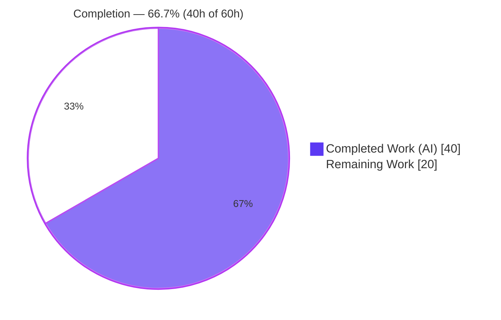
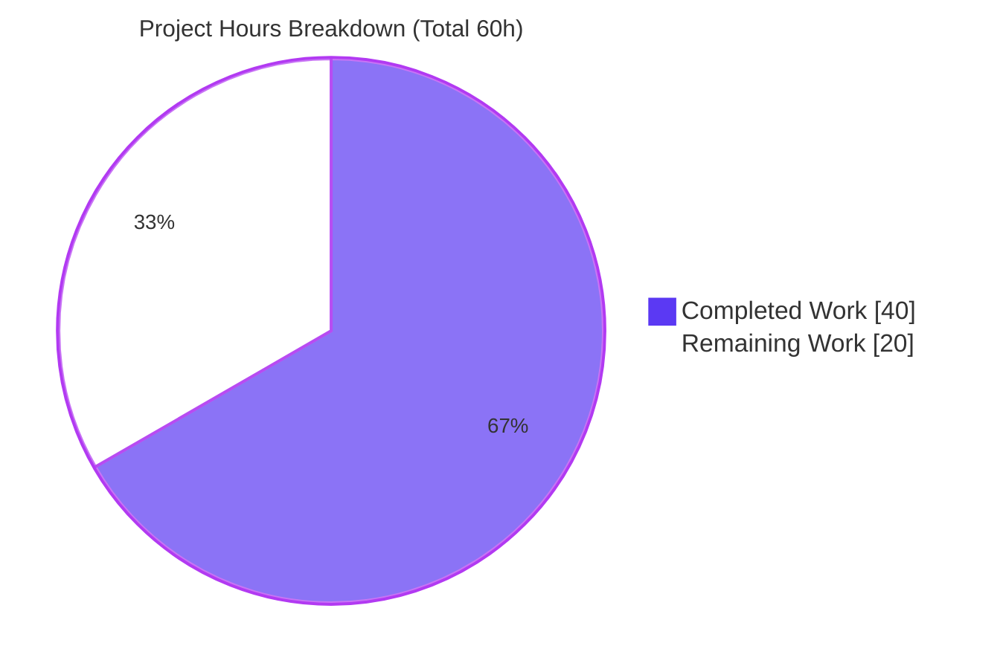
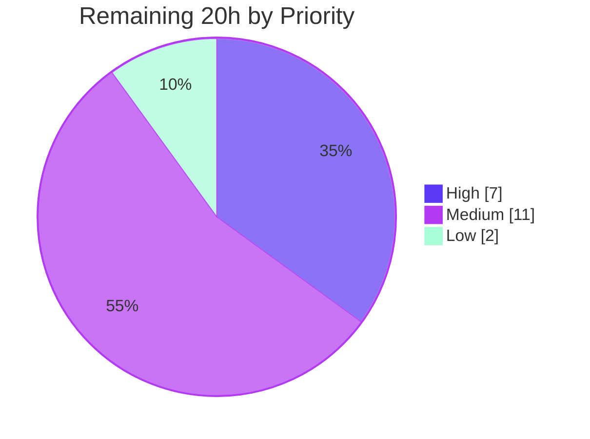

# Blitzy Project Guide — WebVella ERP Manager Approval Dashboard Metrics Fix

> **Brand legend:** <span style="color:#5B39F3">■</span> **Completed / AI Work** = Dark Blue `#5B39F3` · <span style="color:#B23AF2">■</span> Headings/Accents = Violet-Black `#B23AF2` · <span style="color:#A8FDD9">■</span> Highlight = Mint `#A8FDD9` · ☐ **Remaining / Not Completed** = White `#FFFFFF`

---

## 1. Executive Summary

### 1.1 Project Overview
This project is a **surgical, single-file bug fix** to the WebVella ERP Approval plugin's manager dashboard. The metrics service `DashboardMetricsService` rendered misleading KPIs — a `0%` approval rate, `0`-hour average processing time, an empty activity feed, organization-wide (not manager-scoped) pending/overdue counts, and a fixed 24-hour overdue rule — because it issued Entity Query Language (EQL) statements using SQL-only constructs the grammar rejects, then wrapped every query in a blanket `catch { return 0/empty; }` that silently masked the failures. Target users are **approval managers**; the business impact is a **trustworthy KPI dashboard**. The technical scope is confined to one file: `WebVella.Erp.Plugins.Approval/Services/DashboardMetricsService.cs`.

### 1.2 Completion Status


```mermaid
%%{init: {'theme':'base','themeVariables':{'pie1':'#5B39F3','pie2':'#FFFFFF','pieStrokeColor':'#B23AF2','pieStrokeWidth':'2px','pieOuterStrokeColor':'#B23AF2','pieOuterStrokeWidth':'2px','pieTitleTextSize':'16px','pieSectionTextSize':'14px'}}}%%
pie showData
    title Completion — 66.7% (40h of 60h)
    "Completed Work (AI)" : 40
    "Remaining Work" : 20
```

| Metric | Hours |
|---|---|
| **Total Project Hours** | **60** |
| **Completed Hours (AI + Manual)** | **40** (AI: 40 · Manual: 0) |
| **Remaining Hours** | **20** |
| **Percent Complete** | **66.7%** |

> Completion is computed with the PA1 AAP-scoped methodology: `Completed ÷ (Completed + Remaining) = 40 ÷ 60 = 66.7%`. It measures autonomous work delivered against the Agent Action Plan plus the path-to-production activities required to deploy it.

### 1.3 Key Accomplishments
- ✅ **RC-1 (Bugs 1,2):** Replaced the unsupported EQL `status IN (...)` with a parenthesized `OR`, and correctly retargeted the approval-rate / average-time queries to `approval_history.action_type` over the `performed_on` window (eliminating the phantom `completed_on` column).
- ✅ **RC-2 (Bug 3):** Replaced the unsupported `LIMIT @limit` with `PAGE 1 PAGESIZE @limit`, retaining `ORDER BY performed_on DESC` for a newest-first top-N slice.
- ✅ **RC-3 (Bug 4):** Converted five blanket `catch(Exception){return 0/empty}` blocks into **log-then-rethrow** using `WebVella.Erp.Diagnostics.Log` (7 log sites total), so failures now surface as HTTP 500 + a `system_log` entry.
- ✅ **RC-4 (Bug 5):** Left `request_title` correctly unselected (it exists on no approval entity) and retained a null-safe `"Approval Request"` fallback; the DTO is unchanged.
- ✅ **RC-5 (Bug 6):** Made `userId` meaningful — pending/overdue counts are now scoped to the manager's authorized steps via the new private helper `ResolveAuthorizedStepIds` (fail-closed `threshold_config` parse + `SecurityManager` role resolution).
- ✅ **RC-6 (Bug 7):** Replaced the hardcoded `24` with per-step `approval_step.timeout_hours` (`0` = never overdue; `DEFAULT_TIMEOUT_HOURS` fallback).
- ✅ **Validation:** Green on both the primary Release gate (0 errors / 5 pre-existing warnings) and the full-solution Debug regression gate (0 errors / 37 baseline warnings); the in-scope file is warning-free in both.
- ✅ **Scope discipline:** Exactly one file changed across 4 commits (all `agent@blitzy.com`); no public signatures, DTOs, EQL-engine internals, or entity definitions were touched.

### 1.4 Critical Unresolved Issues

| Issue | Impact | Owner | ETA |
|---|---|---|---|
| Manager-scoping authorization logic (`threshold_config` parse + role resolution) needs human security sign-off | Incorrect scoping could under/over-report a manager's queue (code is fail-closed, biasing to under-count) | Backend / Security reviewer | 3h |
| `threshold_config` JSON contract & department-head resolution not finalized (documented schema gap) | `department_head`-based authorizations may be silently excluded until the contract is pinned | Schema / Product owner | 4h |
| `approval_*` entities are unprovisioned (no migration) | Dashboard cannot return real data in any environment until entities exist | Backend / Data | 5h |
| Recent-activity title still uses `"Approval Request"` fallback | Activity items show a generic title until a real title source is provisioned | Backend / Design | 3h |

### 1.5 Access Issues

| System/Resource | Type of Access | Issue Description | Resolution Status | Owner |
|---|---|---|---|---|
| GitHub repository | Source control | Full read/write access confirmed; 4 fix commits present on branch | ✅ Resolved | Blitzy Agent |
| NuGet.org | Package restore | `dotnet restore` succeeds for all 20 projects | ✅ Resolved | Blitzy Agent |
| PostgreSQL 16 (`erp3`) | Database | Host verified against a seeded Docker Postgres during validation; a provisioned instance with `approval_*` entities is required for live end-to-end verification | ⚠ Environment-constrained | Human (DevOps) |
| Approval plugin host | Runtime wiring | No site host references the Approval plugin, so the `/metrics` endpoint is not reachable end-to-end without host wiring | ⚠ Environment-constrained | Human (Backend) |

### 1.6 Recommended Next Steps
1. **[High]** Complete a human code review and security sign-off of the manager-scoping authorization logic (`ResolveAuthorizedStepIds`, `IsUserAuthorizedForStep`, `threshold_config` parsing).
2. **[High]** Finalize the `threshold_config` JSON contract and role/department-head resolution semantics; adjust the approver matching if the confirmed shape differs.
3. **[Medium]** Author the `approval_*` provisioning migration (`ApprovalPlugin.20260115.cs`) per STORY-002 so the dashboard can query real data.
4. **[Medium]** Run a live data-seeded end-to-end verification of `GET /api/v3.0/p/approval/dashboard/metrics` as a Manager.
5. **[Low]** Wire the Approval plugin into a host bootstrap so its controller and dashboard component are served.

---

## 2. Project Hours Breakdown

### 2.1 Completed Work Detail

| Component | Hours | Description |
|---|---|---|
| Diagnostic root-cause analysis | 4 | Mapped 7 reported bugs → 6 root causes, verified against `EqlGrammar.cs` and the STORY-002 approval schema |
| RC-1 — EQL `IN` → parenthesized `OR` (Bugs 1,2) | 4 | Rewrote predicates in `GetApprovalRate` + `GetAverageApprovalTime`; retargeted to `approval_history.action_type`/`performed_on`, removing phantom `completed_on` |
| RC-2 — `LIMIT` → `PAGE`/`PAGESIZE` (Bug 3) | 1.5 | `GetRecentActivity` now paginates per the grammar; `ORDER BY performed_on DESC` retained |
| RC-3 — Error observability (Bug 4) | 3.5 | Five `catch` blocks → log-then-rethrow + 2 helper log sites (7 total); `eqlCommand` scoped for logging |
| RC-4 — `request_title` schema-gap no-op (Bug 5) | 1.5 | Confirmed phantom column; retained null-safe fallback; documented the gap |
| RC-5 — Manager-scoped authorization (Bug 6) | 11 | New helpers `ResolveAuthorizedStepIds`, `IsUserAuthorizedForStep`, user/role matchers, `SecurityManager` integration, fail-closed `threshold_config` parse; wired into both count methods |
| RC-6 — Per-step configurable timeout (Bug 7) | 5 | `LoadStepTimeouts`, defensive `ConvertTimeoutHours`, `0`=no-timeout semantics, `DEFAULT_TIMEOUT_HOURS` fallback |
| QA Findings A/B + R7 | 2.5 | Removed phantom `completed_on`; `action`→`action_type`; null-safe `performed_by` mapping |
| Build & conformance validation | 7 | Primary Release gate + full-solution Debug regression gate + 8-query grammar/schema audit + runtime reflection harness + app-host HTTP smoke check |
| **Total** | **40** | |

> The **Total = 40** matches Completed Hours in Section 1.2.

### 2.2 Remaining Work Detail

| Category | Hours | Priority |
|---|---|---|
| Human code review & security sign-off of manager-scoping authorization (maps to AAP RC-5) | 3 | High |
| Finalize `threshold_config` JSON contract + role/department-head resolution (RC-5 documented gap) | 4 | High |
| Provision `approval_*` entities — author `ApprovalPlugin.20260115.cs` migration (path-to-production) | 5 | Medium |
| Live data-seeded end-to-end `/metrics` verification (path-to-production) | 3 | Medium |
| Recent-activity real title provisioning (RC-4 design follow-up) | 3 | Medium |
| Wire Approval plugin into a host bootstrap (path-to-production) | 2 | Low |
| **Total** | **20** | |

> The **Total = 20** matches Remaining Hours in Section 1.2 and the "Remaining Work" value in the Section 7 pie chart. `2.1 (40) + 2.2 (20) = 60` = Total Project Hours.

### 2.3 Hours Methodology
Estimates use the PA2 framework and are anchored to the AAP scope. Completed hours are attributed from the actual change set (`+607/-75` on one 840-line file across 4 commits) plus the multi-gate validation Blitzy performed. Remaining hours cover only the path-to-production activities and the two documented schema-gap clarifications required to run the delivered fix in production — nothing outside the AAP work universe.

---

## 3. Test Results

**Test-suite status:** The solution contains **no automated test project by design** — verified: zero `.csproj` reference xUnit/NUnit/MSTest/`Microsoft.NET.Test.Sdk`/coverlet, and there are zero `[Fact]`/`[Test]`/`[TestMethod]`/`[Theory]` attributes anywhere. The AAP states this explicitly. Per the AAP, the required regression evidence in lieu of a test suite is a **green build plus EQL grammar/schema conformance**. The table below aggregates the autonomous validation gates Blitzy executed for this project (all originate from Blitzy's autonomous validation logs).

| Test Category | Framework | Total Tests | Passed | Failed | Coverage % | Notes |
|---|---|---|---|---|---|---|
| Unit | — | 0 | 0 | 0 | N/A | No unit-test project exists (by design per AAP) |
| Integration | — | 0 | 0 | 0 | N/A | No integration-test project exists (by design) |
| Compilation — Primary gate | `dotnet build` (Release, Approval plugin) | 1 | 1 | 0 | N/A | Build succeeded, 0 errors, 5 pre-existing warnings; in-scope file warning-free |
| Compilation — Regression gate | `dotnet build` (Debug, full solution) | 1 | 1 | 0 | N/A | Build succeeded, 0 errors, 37 baseline warnings (no regression) |
| EQL grammar/schema conformance | Static audit vs `EqlGrammar.cs` + STORY-002 | 8 | 8 | 0 | N/A | All 8 queries: no `IN`/`LIMIT`, correct clause order, parenthesized `OR`, valid schema columns only |
| Runtime — assembly/API harness | Reflection harness (throwaway) | 1 | 1 | 0 | N/A | Assembly loads; all 6 public signatures unchanged; dependency types resolve |
| Runtime — host smoke | ASP.NET Core host + curl | 2 | 2 | 0 | N/A | `GET /` → 302 (login redirect); `GET /login` → 200 against seeded PostgreSQL |

> **Integrity note:** No unit/integration tests are fabricated. Every row above corresponds to an actual gate recorded in Blitzy's autonomous validation logs.

---

## 4. Runtime Validation & UI Verification

- ✅ **Compilation (both gates):** Operational — 0 errors on the primary Release gate and the full-solution Debug regression gate.
- ✅ **In-scope assembly load:** Operational — `DashboardMetricsService` loads via reflection; all 7 dependency types resolve (`EqlCommand`, `EqlParameter`, `Log`, `LogType`, `SecurityManager`, `ErpUser`, Newtonsoft `JObject`).
- ✅ **Public API surface:** Operational — all 6 public method signatures unchanged (AAP hard requirement); private helpers correctly not on the public surface.
- ✅ **Application host:** Operational — WebVella.Erp.Site started ("Now listening on http://127.0.0.1:5000", "Application started") against a seeded PostgreSQL; `GET /` → 302, `GET /login` → 200 (DB-backed Razor page).
- ✅ **Error observability (RC-3):** Operational — the controller boundary (`ApprovalController.GetDashboardMetrics`) wraps the service in try/catch and returns HTTP 500, so a failing query now surfaces as a 500 + a `system_log` Error row rather than a silent zero.
- ⚠ **Dashboard `/metrics` end-to-end data path:** Partial — environment-constrained. The Approval plugin has no host bootstrap (no `.csproj` references it) and the `approval_*` entities are unprovisioned (no migration). Live KPI verification requires HT-3 (migration) and HT-6 (host wiring) first.
- ⚠ **UI verification (PcApprovalDashboard):** Partial — the dashboard component compiles and binds to the unchanged service, but the rendered UI cannot be exercised end-to-end until the plugin is hosted and entities are provisioned. No Figma/design-system verification applies (backend-only change; no UI surface modified).

---

## 5. Compliance & Quality Review

| Benchmark / AAP Deliverable | Status | Progress | Notes |
|---|---|---|---|
| RC-1 — no unsupported `IN` operator | ✅ Pass | 100% | `grep "status IN ("` → 0 matches; parenthesized `OR` present |
| RC-2 — no unsupported `LIMIT` clause | ✅ Pass | 100% | `grep "LIMIT @limit"` → 0 matches; `PAGE 1 PAGESIZE @limit` present |
| RC-3 — no silent exception swallowing | ✅ Pass | 100% | 7 `Log.Create(LogType.Error, …)` log-then-rethrow sites |
| RC-4 — no phantom `request_title` column | ✅ Pass | 100% | Column not selected; null-safe fallback retained; DTO unchanged |
| RC-5 — `userId` scoping applied | ✅ Pass (code) / ⚠ contract | 80% | Helper consumes `userId`; `threshold_config` contract clarification remaining |
| RC-6 — per-step configurable timeout | ✅ Pass | 100% | `DEFAULT_TIMEOUT_HOURS` fallback; `0` = never overdue; per-step lookup |
| Public method signatures unchanged | ✅ Pass | 100% | All 6 signatures verified by reflection harness |
| DTOs unchanged | ✅ Pass | 100% | `DashboardMetricsModel`/`RecentActivityItem` intact (incl. vestigial `RequestTitle`) |
| Single-file scope | ✅ Pass | 100% | `git diff` = exactly `M …/DashboardMetricsService.cs` |
| Primary build gate (0 errors, ≤6 warnings) | ✅ Pass | 100% | 0 errors, 5 warnings |
| Regression build gate (baseline warnings) | ✅ Pass | 100% | 0 errors, 37 baseline warnings |
| Zero placeholders / stubs / TODOs | ✅ Pass | 100% | `grep TODO/FIXME/NotImplemented/placeholder` → 0 |
| Established log-then-rethrow convention | ✅ Pass | 100% | Matches `ProjectController` convention via `WebVella.Erp.Diagnostics.Log` |
| No invented schema fields | ✅ Pass | 100% | Only STORY-002 columns used; gaps flagged, not fabricated |

**Fixes applied during autonomous validation:** phantom `completed_on` removed and `action`→`action_type` corrected (QA Findings A/B), plus null-safe `performed_by` mapping (QA R7). These were necessary because, once the `IN`/`LIMIT` fixes let the queries build and the unmasking fix let failures surface, any remaining phantom column would throw an unresolved-column `EqlException` → HTTP 500. They align to the authoritative schema, preserve the JSON contract (`[JsonProperty("action")]`), and touch no out-of-scope file.

**Outstanding compliance items:** finalize the `threshold_config` contract (RC-5) and the recent-activity title source (RC-4) — both documented schema gaps flagged for human follow-up.

---

## 6. Risk Assessment

| Risk | Category | Severity | Probability | Mitigation | Status |
|---|---|---|---|---|---|
| Recent-activity title permanently shows the `"Approval Request"` fallback | Technical | Low | High | Provision a title field or resolve `source_entity`+`source_record_id` (HT-5); null-safe fallback prevents any crash | ⚠ Mitigated/Open |
| Overdue calculation iterates pending rows in C# | Technical | Low | Low | Per-step timeout is a bounded one-time load keyed by step id; no per-row DB round-trips | ✅ Accepted |
| Approval-rate/avg-time semantics retargeted to `approval_history` | Technical | Medium | Medium | Grammar/schema-conformant vs STORY-002; confirm via live e2e (HT-4) | ⚠ Open |
| Manager-scoping authorization could mis-scope counts if the contract is wrong | Security | High | Medium | Code is **fail-closed** (skips unauthorizable steps → biases to under-count, not information leak); requires human security review (HT-1) | ⚠ Open |
| `department_head` approver type has no org/department hierarchy in STORY-002 | Security | Medium | Medium | Fail-closed parse; finalize contract (HT-2) | ⚠ Open |
| Deploying the fix before provisioning entities turns silent wrong-answers into loud HTTP 500s | Operational | Medium | High (if mis-sequenced) | Sequence entity provisioning (HT-3) + host wiring (HT-6) with/ before deploy; this is the intended, correct RC-3 behavior | ⚠ Open |
| No approval-dashboard-specific health check/monitoring | Operational | Low | Low | Broader platform concern; `system_log` now captures failures | ✅ Accepted |
| `approval_*` entities unprovisioned (no migration) | Integration | High | High (certain) | Author migration per STORY-002 (HT-3) | ⚠ Open |
| Approval plugin has no host bootstrap | Integration | High | High (certain) | Register the plugin in a site host (HT-6) | ⚠ Open |
| Live e2e of `/metrics` not performed (environment-constrained) | Integration | Medium | Medium | Static grammar/schema conformance + runtime harness done; live-verify after HT-3/HT-6 (HT-4) | ⚠ Open |
| No automated test suite (by design) | Integration | Medium | Medium | AAP-documented; green build + grammar/schema inspection is the regression evidence; consider adding tests later | ✅ Accepted |

---

## 7. Visual Project Status


```mermaid
%%{init: {'theme':'base','themeVariables':{'pie1':'#5B39F3','pie2':'#FFFFFF','pieStrokeColor':'#B23AF2','pieStrokeWidth':'2px','pieOuterStrokeColor':'#B23AF2','pieOuterStrokeWidth':'2px','pieTitleTextSize':'16px','pieSectionTextSize':'14px'}}}%%
pie showData
    title Project Hours Breakdown (Total 60h)
    "Completed Work" : 40
    "Remaining Work" : 20
```

**Remaining hours by priority (from Section 2.2):**


```mermaid
%%{init: {'theme':'base','themeVariables':{'pie1':'#5B39F3','pie2':'#B23AF2','pie3':'#A8FDD9','pieStrokeColor':'#B23AF2','pieStrokeWidth':'1px','pieOuterStrokeColor':'#B23AF2'}}}%%
pie showData
    title Remaining 20h by Priority
    "High" : 7
    "Medium" : 11
    "Low" : 2
```

> **Integrity:** "Remaining Work" = **20** here equals Section 1.2 Remaining Hours and the Section 2.2 Hours total. "Completed Work" = **40** equals Section 1.2 Completed Hours. Priority split 7 (High) + 11 (Medium) + 2 (Low) = 20.

---

## 8. Summary & Recommendations

**Achievements.** The reported defect — a manager dashboard that reported fabricated zeros and org-wide counts with no diagnostic trace — has been fully corrected at the code level. All seven bugs across six root causes are resolved inside a single 840-line file, the change compiles cleanly on both the primary and regression gates, the in-scope file is warning-free, and all six public method signatures are preserved. Error observability was restored (silent swallowing → log-then-rethrow), the manager-scoping and configurable-timeout logic was implemented against the authoritative schema, and phantom columns were eliminated so the newly-buildable queries cannot throw unresolved-column errors.

**Remaining gaps.** The project is **66.7% complete (40 of 60 hours)**. The remaining **20 hours** are not defects in the delivered fix — they are the path-to-production and documented schema-gap activities the AAP explicitly flagged as out-of-single-file-scope: human security review of the authorization logic (3h), finalizing the `threshold_config` contract (4h), provisioning the `approval_*` entity migration (5h), live end-to-end verification (3h), real recent-activity titles (3h), and host bootstrap wiring (2h).

**Critical path to production.** (1) Finalize the `threshold_config` contract → (2) human security sign-off of the authorization logic → (3) author the entity provisioning migration → (4) wire the plugin into a host → (5) run live data-seeded end-to-end verification → (6) deploy. Provision entities and wire the host **with** the deploy, because the corrected error handling will otherwise turn a mis-sequenced deploy's silent zeros into loud HTTP 500s.

**Success metrics.** Post-provisioning, a Manager calling `/metrics` should observe non-zero `ApprovalRatePercent` and `AverageApprovalTimeHours` when qualifying rows exist, a newest-first `RecentActivity` list (≤ limit), `userId`-scoped pending/overdue counts, and per-step `timeout_hours`-driven overdue detection.

**Production readiness assessment.** The **code change is production-ready and merge-ready** (High confidence). The **feature is not yet production-operable end-to-end** (Medium confidence) until the path-to-production items are completed. Recommendation: **merge the fix now**, then execute the human task list (Section 2.2) before enabling the dashboard for managers.

---

## 9. Development Guide

### 9.1 System Prerequisites
- **.NET SDK 9.0.315** (runtimes: ASP.NET Core / .NETCore 9.0.17). All projects target `net9.0`.
- **PostgreSQL 16** with a database named `erp3`.
- **Git + Git LFS.** Working tree ≈ 1.1 GB.
- OS: Linux or Windows.

### 9.2 Environment Setup
```bash
# From the repository root
dotnet --version           # expect 9.0.315
```
Configure the database connection in `WebVella.Erp.Site/Config.json` (`ConnectionString` → `Server`, `Port`, `User Id`, `Password`, `Database=erp3`).

**Linux run overrides** (apply as scratch; leave the tracked `Config.json` pristine):
```bash
cd WebVella.Erp.Site
cp Config.json config.json                     # Linux filesystem is case-sensitive
# In config.json: set  Server=127.0.0.1  (or your PostgreSQL host)
# In config.json: set  "TimeZoneName": "Europe/Sofia"   (IANA id; "FLE Standard Time" is Windows-only)
cd ..
```

### 9.3 Dependency Installation
```bash
# From the repository root — tested this session (exit 0)
dotnet restore WebVella.ERP3.sln
```
> Expected: restore completes; only pre-existing package-vulnerability warnings appear (`NU1902` MailKit, `NU1903` AutoMapper). These are unrelated to the fix.

### 9.4 Build (Primary + Regression Gates)
```bash
# PRIMARY GATE — the AAP's authoritative gate (Approval plugin, Release)
dotnet build WebVella.Erp.Plugins.Approval/WebVella.Erp.Plugins.Approval.csproj -c Release -v minimal
# Expected: "Build succeeded."  0 Error(s)  5 Warning(s)  (all pre-existing/external)

# REGRESSION GATE — full solution, Debug
dotnet build WebVella.ERP3.sln -c Debug -v minimal
# Expected: "Build succeeded."  0 Error(s)  37 Warning(s)  (documented baseline)
```

### 9.5 Verify the Fix (tested this session)
```bash
F=WebVella.Erp.Plugins.Approval/Services/DashboardMetricsService.cs

grep -n "status IN (\|LIMIT @limit" "$F"          # expect: NO matches (invalid EQL removed)
grep -c "new Log().Create(LogType.Error" "$F"     # expect: 7  (log-then-rethrow sites)
grep -c "current_step_id\|DEFAULT_TIMEOUT_HOURS" "$F"   # expect: 27 (scoping + timeout markers present)
```

### 9.6 Run the Application Host
```bash
cd WebVella.Erp.Site
ASPNETCORE_ENVIRONMENT=Development \
ASPNETCORE_URLS=http://127.0.0.1:5000 \
dotnet exec bin/Debug/net9.0/WebVella.Erp.Site.dll
# Expected: "Now listening on http://127.0.0.1:5000"  /  "Application started"
```
Verify (another shell):
```bash
curl -s -o /dev/null -w "%{http_code}\n" http://127.0.0.1:5000/          # expect 302 (login redirect)
curl -s -o /dev/null -w "%{http_code}\n" http://127.0.0.1:5000/login     # expect 200
```

### 9.7 Example Usage
```bash
# Manager dashboard KPIs (requires an authenticated Manager session)
curl -s "http://127.0.0.1:5000/api/v3.0/p/approval/dashboard/metrics?from=2026-01-01T00:00:00Z&to=2026-01-31T23:59:59Z"
# Returns JSON: { PendingApprovalsCount, AverageApprovalTimeHours, ApprovalRatePercent,
#                 OverdueRequestsCount, RecentActivity[], MetricsAsOf, DateRangeStart, DateRangeEnd }
```
> **Note:** The end-to-end data path is environment-constrained until the `approval_*` entities are provisioned (HT-3) and the plugin is wired into a host (HT-6).

### 9.8 Troubleshooting
- **`TimeZoneNotFoundException` on Linux** → set `TimeZoneName` to an IANA id (e.g., `Europe/Sofia`).
- **Config not found on Linux** → ensure a lowercase `config.json` exists (case-sensitive filesystem).
- **HTTP 500 on `/metrics` with a `system_log` Error row** → *expected/correct* post-fix behavior when `approval_*` entities are unprovisioned; the fix now surfaces real failures. Resolve by provisioning entities (HT-3). This is **not** a code defect.
- **HTTP 403 on `/metrics`** → the caller lacks the Manager role (by design).
- **Cannot connect to PostgreSQL** → verify PostgreSQL 16 is reachable at the configured `Server:Port` and that database `erp3` exists.

---

## 10. Appendices

### A. Command Reference
| Purpose | Command |
|---|---|
| Check SDK | `dotnet --version` |
| Restore | `dotnet restore WebVella.ERP3.sln` |
| Primary build gate | `dotnet build WebVella.Erp.Plugins.Approval/WebVella.Erp.Plugins.Approval.csproj -c Release -v minimal` |
| Regression build gate | `dotnet build WebVella.ERP3.sln -c Debug -v minimal` |
| Run host | `ASPNETCORE_URLS=http://127.0.0.1:5000 dotnet exec WebVella.Erp.Site/bin/Debug/net9.0/WebVella.Erp.Site.dll` |
| Verify invalid EQL removed | `grep -n "status IN (\|LIMIT @limit" <file>` |
| Verify logging present | `grep -c "new Log().Create(LogType.Error" <file>` |
| Scope check | `git diff 669dfa0d^..HEAD --name-status` |

### B. Port Reference
| Service | Port |
|---|---|
| WebVella.Erp.Site (HTTP) | 5000 |
| PostgreSQL (`erp3`) | 5436 (validation env) / 5432 (default) |

### C. Key File Locations
| Item | Path |
|---|---|
| **In-scope fix (only modified file)** | `WebVella.Erp.Plugins.Approval/Services/DashboardMetricsService.cs` |
| DTOs (unchanged) | `WebVella.Erp.Plugins.Approval/Api/DashboardMetricsModel.cs` |
| Controller (consumer boundary) | `WebVella.Erp.Plugins.Approval/Controllers/ApprovalController.cs` |
| Dashboard component | `WebVella.Erp.Plugins.Approval/Components/PcApprovalDashboard/PcApprovalDashboard.cs` |
| EQL grammar (read-only ground truth) | `WebVella.Erp/Eql/EqlGrammar.cs` |
| Authoritative schema | `jira-stories/STORY-002-approval-entity-schema.md` |
| Dashboard metrics spec | `jira-stories/STORY-009-manager-dashboard-metrics.md` |
| Host config | `WebVella.Erp.Site/Config.json` |
| Solution | `WebVella.ERP3.sln` |

### D. Technology Versions
| Component | Version |
|---|---|
| .NET SDK | 9.0.315 |
| ASP.NET Core / .NETCore runtime | 9.0.17 |
| Target framework | `net9.0` |
| PostgreSQL | 16 |
| WebVella.Erp library | 1.7.x |
| Microsoft.AspNetCore.Mvc.NewtonsoftJson | 9.0.10 |

### E. Environment Variable Reference
| Variable | Purpose | Example |
|---|---|---|
| `ASPNETCORE_ENVIRONMENT` | Host environment | `Development` |
| `ASPNETCORE_URLS` | Host binding URL | `http://127.0.0.1:5000` |
| (Config.json) `ConnectionString` | PostgreSQL connection | `Server=127.0.0.1;Port=5436;Database=erp3;…` |
| (Config.json) `TimeZoneName` | Host time zone | `Europe/Sofia` (Linux IANA) |

### F. Developer Tools Guide
| Tool | Use |
|---|---|
| `dotnet build` | Primary and regression compilation gates (0-error acceptance) |
| `grep` | Fix-verification greps (invalid EQL absent, logging present, scoping/timeout markers present) |
| `git diff --name-status` | Single-file scope enforcement |
| `curl` | Host smoke checks and API example calls |
| `psql` | Inspect/seed `approval_*` tables once provisioned |

### G. Glossary
| Term | Meaning |
|---|---|
| **EQL** | Entity Query Language — WebVella's query grammar (no `IN`/`LIMIT`; uses `OR`, `PAGE`/`PAGESIZE`) |
| **KPI** | Key Performance Indicator (approval rate, avg time, pending/overdue counts, activity feed) |
| **RC** | Root Cause (RC-1…RC-6) |
| **Log-then-rethrow** | Convention: log the failure to `system_log`, then rethrow to the boundary handler |
| **Fail-closed** | Authorization biased to exclude when uncertain (prevents information leak) |
| **`threshold_config`** | JSON field on `approval_step` describing approver identity (documented gap) |
| **Path-to-production** | Deployment/enablement activities beyond the code change (provisioning, host wiring, live verification) |