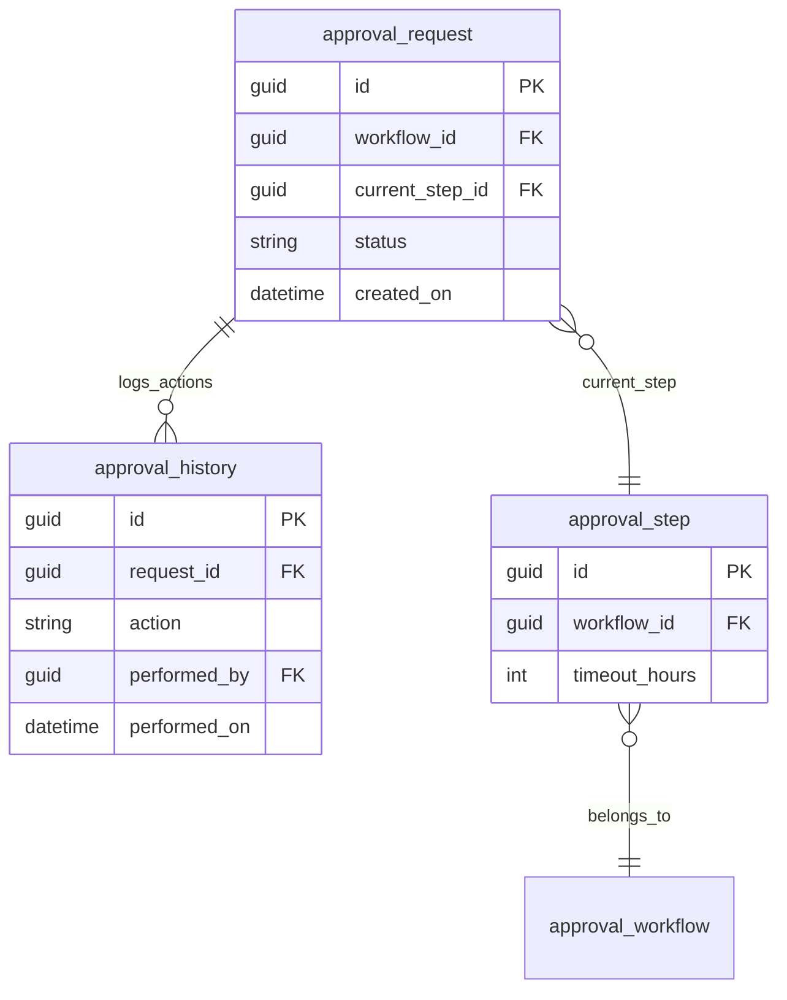
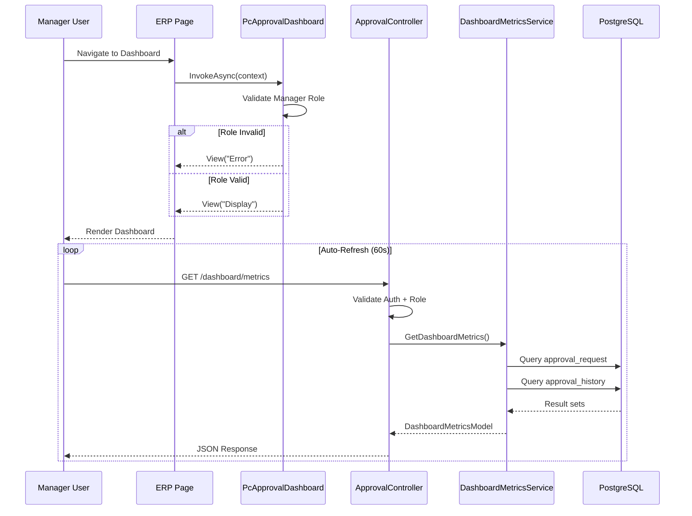
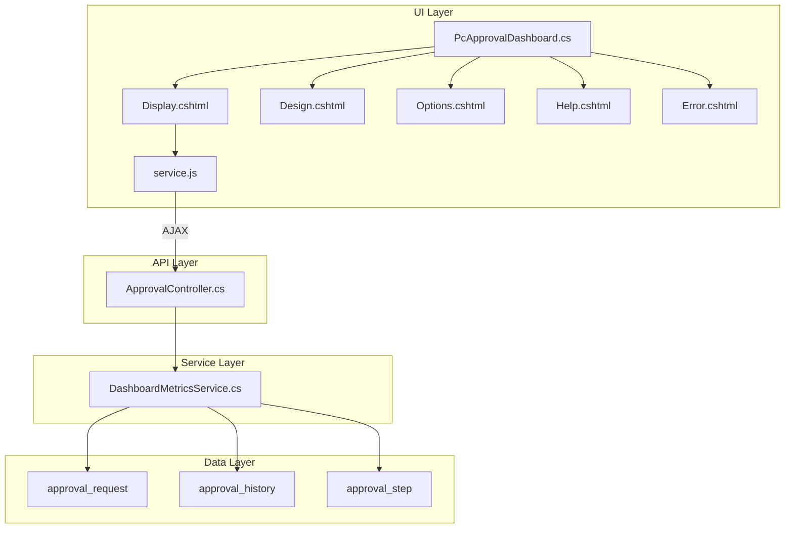

# Technical Specification

# 0. Agent Action Plan

## 0.1 Intent Clarification

Based on the prompt, the Blitzy platform understands that the new feature requirement is to create a comprehensive JIRA User Story that enables managers to make faster decisions by providing real-time dashboard views of team performance metrics within the WebVella ERP Approval Workflow system.

### 0.1.1 Core Feature Objective

The business objective is to implement a Manager Dashboard feature that provides:

- **Real-Time Performance Metrics**: Dashboard displaying live team approval workflow metrics including pending approvals count, average processing time, approval rate percentage, overdue requests, and recent activity feed
- **Decision Support Interface**: Consolidated view enabling managers to quickly assess team workload, identify bottlenecks, and prioritize actions
- **Auto-Refresh Capability**: Metrics automatically update at configurable intervals (default 60 seconds) without requiring page reload
- **Date Range Filtering**: Ability to view metrics for different time periods (7 days, 30 days, 90 days, custom range)
- **Role-Based Access**: Dashboard restricted to users with Manager role ensuring appropriate data visibility

**Implicit Requirements Detected:**

- Integration with existing WebVella ERP PageComponent architecture
- Consumption of REST API endpoints for metrics retrieval
- Client-side JavaScript for AJAX-based auto-refresh functionality
- Service layer for calculating metrics from `approval_request` and `approval_history` entities
- Consistent UI patterns following existing component design standards

### 0.1.2 JIRA User Story (SST Template Format)

**Summary** (255 characters max):

```
Manager Dashboard - Real-Time Team Performance Metrics for Approval Workflows
```

**Description** (Who, What, Why format):

```
As a Manager with approval responsibilities,
I want to view a real-time dashboard displaying my team's approval workflow metrics,
so that I can make faster, data-driven decisions about resource allocation and identify processing bottlenecks.
```

**Business Value:**

| Value Area | Description |
|------------|-------------|
| Time Savings | Consolidates key approval metrics into single view, eliminating manual data gathering |
| Proactive Management | Enables early identification of workflow bottlenecks before escalation |
| Resource Planning | Provides workload visibility for staffing and allocation decisions |
| Compliance Support | Real-time SLA monitoring supports regulatory requirements |
| Accountability | Transparent metrics create shared performance understanding |

**Acceptance Criteria** (Given/When/Then format):

- **AC1**: Given I am logged in as a user with Manager role, When I navigate to the Approvals Dashboard page, Then I see a dashboard displaying my team's approval metrics including Pending Approvals Count, Average Approval Time, Approval Rate, Overdue Requests, and Recent Activity

- **AC2**: Given the dashboard is displayed, When 60 seconds have elapsed, Then the metrics automatically refresh without requiring page reload and the display updates to reflect current data

- **AC3**: Given I am viewing the dashboard, When I select a date range filter (7 days, 30 days, 90 days, or custom range), Then the metrics update to reflect only the selected time period

- **AC4**: Given I have pending approval requests in queue where I am an authorized approver, When I view the Pending Approvals metric, Then the count accurately reflects requests awaiting my action

- **AC5**: Given approval requests exceed their configured timeout from the associated approval step, When I view the Overdue Requests metric, Then the count accurately identifies requests past their SLA

- **AC6**: Given I am a user without Manager role, When I attempt to access the dashboard, Then I receive an access denied message and am not shown the dashboard metrics

**INVEST Criteria Validation:**

| Criterion | Status | Validation |
|-----------|--------|------------|
| Independent | ✓ Pass | Self-contained component building on completed API and UI components |
| Negotiable | ✓ Pass | Metrics selection, refresh interval, and display options are configurable |
| Valuable | ✓ Pass | Directly addresses manager decision-making business objective |
| Estimable | ✓ Pass | Similar scope to existing components with clear implementation path |
| Sized | ✓ Pass | Single dashboard view with five metrics; appropriate for single sprint |
| Testable | ✓ Pass | All acceptance criteria have clear pass/fail conditions |
| Demo-able | ✓ Pass | Dashboard with live metrics can be demonstrated to Product Owner |

### 0.1.3 Special Instructions and Constraints

**Architectural Requirements:**

- Follow established WebVella ERP PageComponent pattern (`PageComponent` base class)
- Implement standard render modes: Display, Design, Options, Help, Error
- Use `PageComponentLibraryService` for component registration in page builder
- Apply `[PageComponent]` attribute with appropriate metadata

**Security Constraints:**

- Manager role validation required in both component class and API endpoint
- Use `SecurityContext.CurrentUser` for authentication verification
- Return 403 status for unauthorized access attempts

**Performance Considerations:**

- Implement efficient EQL queries for metric calculations
- Use appropriate caching strategies for frequently accessed data
- Configure reasonable auto-refresh intervals to balance freshness and server load

**Integration Requirements:**

- Consume `/api/v3.0/p/approval/dashboard/metrics` REST endpoint
- Follow `ResponseModel` envelope pattern for API responses
- Use existing `RecordManager` and `EntityQuery` for data operations

### 0.1.4 Technical Interpretation

These feature requirements translate to the following technical implementation strategy:

| Requirement | Technical Action |
|-------------|------------------|
| Real-time metrics display | Create `PcApprovalDashboard` PageComponent with AJAX-based `service.js` for periodic metric fetching |
| Manager role access | Implement `IsManagerRole()` validation in component and controller using `SecurityContext.CurrentUser.Roles` |
| Auto-refresh capability | Use `setInterval()` in client-side JavaScript with configurable interval from component options |
| Date range filtering | Add `from` and `to` query parameters to dashboard metrics endpoint with UI date picker |
| Five KPI metrics | Implement `DashboardMetricsService` with methods for each metric calculation from approval entities |
| Activity feed | Query `approval_history` entity with descending timestamp sort, limited to last 5 records |

**Implementation Components:**

- To implement the dashboard view, we will create `PcApprovalDashboard.cs` as a PageComponent with Display/Design/Options/Help/Error views
- To calculate metrics, we will create `DashboardMetricsService.cs` with entity queries against `approval_request` and `approval_history`
- To expose metrics via API, we will extend `ApprovalController.cs` with a `GetDashboardMetrics` endpoint
- To enable auto-refresh, we will create `service.js` with AJAX fetch and setInterval timer
- To transfer data, we will create `DashboardMetricsModel.cs` as a DTO with JSON serialization attributes

## 0.2 Repository Scope Discovery

### 0.2.1 Comprehensive File Analysis

The Manager Dashboard feature requires modifications and additions across multiple layers of the WebVella ERP Approval plugin architecture. This section documents all affected files discovered through exhaustive repository analysis.

**Repository Structure Overview:**

```
WebVella.ERP3.sln                          # Solution file (net9.0, VS 2022)
├── WebVella.Erp/                          # Core ERP runtime library
├── WebVella.Erp.Web/                      # ASP.NET Core web layer
│   ├── Components/                        # Base PageComponent implementations
│   ├── Controllers/                       # REST API controllers
│   ├── Models/                            # PageComponent, ErpPage models
│   └── Services/                          # PageComponentLibraryService
├── WebVella.Erp.Plugins.Approval/         # Target plugin (to be created/extended)
│   ├── Components/PcApprovalDashboard/    # New dashboard component
│   ├── Controllers/ApprovalController.cs  # API endpoint extension
│   ├── Services/DashboardMetricsService.cs # New metrics service
│   └── Api/DashboardMetricsModel.cs       # New DTO model
└── jira-stories/                          # JIRA story specifications
```

**Existing Modules to Modify:**

| File Pattern | Location | Modification Purpose |
|--------------|----------|---------------------|
| `ApprovalController.cs` | `WebVella.Erp.Plugins.Approval/Controllers/` | Add dashboard metrics endpoint |
| `ApprovalPlugin.cs` | `WebVella.Erp.Plugins.Approval/` | Register dashboard component |

**Test Files to Create:**

| File Path | Purpose |
|-----------|---------|
| `tests/unit/DashboardMetricsService_Tests.cs` | Unit tests for metric calculations |
| `tests/integration/DashboardMetrics_Integration_Tests.cs` | API endpoint integration tests |

**Configuration Files Affected:**

| File | Location | Change |
|------|----------|--------|
| `WebVella.Erp.Plugins.Approval.csproj` | Plugin root | Ensure embedded resources configured |
| `README.md` | Repository root | Document dashboard feature |

**Documentation Updates:**

| File | Section to Update |
|------|-------------------|
| `docs/features/approval-workflow.md` | Add dashboard documentation |
| `jira-stories/STORY-009-manager-dashboard-metrics.md` | Reference implementation spec |
| `jira-stories/stories-export.json` | Update story metadata |

### 0.2.2 Integration Point Discovery

**API Endpoints Connecting to Feature:**

| Endpoint | Controller | Integration Type |
|----------|------------|------------------|
| `GET /api/v3.0/p/approval/dashboard/metrics` | ApprovalController | New - Dashboard data source |
| `GET /api/v3.0/p/approval/pending` | ApprovalController | Existing - Pending count source |
| `GET /api/v3.0/p/approval/request/{id}` | ApprovalController | Existing - Request details |

**Database Entities Affected:**

| Entity | Usage | Query Type |
|--------|-------|------------|
| `approval_request` | Pending count, overdue detection | SELECT with status filter |
| `approval_history` | Average time, approval rate, activity feed | SELECT with date range, aggregation |
| `approval_step` | Timeout threshold lookup | JOIN for overdue calculation |

**Service Classes Requiring Integration:**

| Service | File | Integration Point |
|---------|------|-------------------|
| `ApprovalRequestService` | `Services/ApprovalRequestService.cs` | Pending requests query |
| `ApprovalHistoryService` | `Services/ApprovalHistoryService.cs` | History records for metrics |

**Middleware/Context Dependencies:**

| Component | Purpose |
|-----------|---------|
| `ErpRequestContext` | Access current user context in component |
| `SecurityContext.CurrentUser` | Role validation for manager access |
| `PageComponentLibraryService` | Component registration in page builder |

### 0.2.3 New File Requirements

**New Source Files to Create:**

| File Path | Description |
|-----------|-------------|
| `WebVella.Erp.Plugins.Approval/Components/PcApprovalDashboard/PcApprovalDashboard.cs` | Dashboard page component class implementing PageComponent base with metrics display logic |
| `WebVella.Erp.Plugins.Approval/Components/PcApprovalDashboard/Design.cshtml` | Page builder preview view showing dashboard layout with sample metrics |
| `WebVella.Erp.Plugins.Approval/Components/PcApprovalDashboard/Display.cshtml` | Runtime display view rendering live metrics with auto-refresh capability |
| `WebVella.Erp.Plugins.Approval/Components/PcApprovalDashboard/Options.cshtml` | Configuration options panel for refresh interval, date range, and display preferences |
| `WebVella.Erp.Plugins.Approval/Components/PcApprovalDashboard/Help.cshtml` | Component documentation view explaining dashboard features and configuration |
| `WebVella.Erp.Plugins.Approval/Components/PcApprovalDashboard/Error.cshtml` | Error display view for access denied and data retrieval failures |
| `WebVella.Erp.Plugins.Approval/Components/PcApprovalDashboard/service.js` | Client-side JavaScript for AJAX metrics retrieval and auto-refresh timer |
| `WebVella.Erp.Plugins.Approval/Services/DashboardMetricsService.cs` | Service class containing metric calculation methods querying approval entities |
| `WebVella.Erp.Plugins.Approval/Api/DashboardMetricsModel.cs` | Response DTO containing all dashboard metric values |

**Folder Structure to Create:**

```
WebVella.Erp.Plugins.Approval/
├── Components/
│   └── PcApprovalDashboard/
│       ├── PcApprovalDashboard.cs      # Dashboard component class
│       ├── Design.cshtml               # Page builder preview
│       ├── Display.cshtml              # Runtime metrics display
│       ├── Options.cshtml              # Configuration panel
│       ├── Help.cshtml                 # Documentation view
│       ├── Error.cshtml                # Error handling view
│       └── service.js                  # AJAX refresh logic
├── Services/
│   └── DashboardMetricsService.cs      # Metrics calculation service
├── Api/
│   └── DashboardMetricsModel.cs        # Response model
└── Controllers/
    └── ApprovalController.cs           # Add dashboard metrics endpoint (existing file)
```

### 0.2.4 Web Search Research Conducted

**Best Practices Researched:**

| Topic | Application |
|-------|-------------|
| Dashboard UI patterns | Bootstrap card layout for KPI display |
| Auto-refresh implementation | JavaScript setInterval with AJAX fetch |
| ASP.NET Core ViewComponents | PageComponent render mode handling |
| Metrics visualization | Progress indicators and trend arrows |

**Library Recommendations:**

| Functionality | Recommendation |
|---------------|----------------|
| JSON serialization | Newtonsoft.Json (existing in project) |
| Date handling | Native DateTime with UTC normalization |
| AJAX requests | Vanilla JavaScript fetch API |
| UI styling | Bootstrap 4/5 cards (existing in project) |

**Security Considerations:**

| Aspect | Implementation |
|--------|----------------|
| Role validation | Check Manager role in both component and API |
| CORS protection | API restricted to same-origin requests |
| XSS prevention | Proper HTML encoding in Razor views |
| Authentication | Cookie + JWT Bearer hybrid (existing) |

## 0.3 Dependency Inventory

### 0.3.1 Private and Public Packages

The Manager Dashboard feature leverages existing dependencies from the WebVella ERP ecosystem. No new external package dependencies are required.

**Core Framework Dependencies:**

| Registry | Package Name | Version | Purpose |
|----------|--------------|---------|---------|
| NuGet | Microsoft.AspNetCore.App | 9.0.x (framework reference) | ASP.NET Core web framework |
| NuGet | Microsoft.NET.Sdk.Razor | 9.0.x | Razor compilation for views |

**Existing Project Dependencies:**

| Registry | Package Name | Version | Purpose |
|----------|--------------|---------|---------|
| NuGet | Newtonsoft.Json | 13.0.3 | JSON serialization for DTOs and options |
| NuGet | Microsoft.AspNetCore.Mvc.NewtonsoftJson | 9.0.0 | MVC JSON integration |
| NuGet | Npgsql | 9.0.2 | PostgreSQL database connectivity |

**Internal Project References:**

| Project Reference | Purpose |
|-------------------|---------|
| `WebVella.Erp` | Core ERP runtime APIs (RecordManager, EntityManager, SecurityContext) |
| `WebVella.Erp.Web` | PageComponent base class, ErpRequestContext, UI services |

**Plugin-Specific Dependencies:**

| Package | Version | Purpose |
|---------|---------|---------|
| MailKit | 4.8.0 | Referenced by notification jobs (existing in Mail plugin) |
| MimeKit | 4.8.0 | Email content formatting for notifications |

### 0.3.2 Dependency Updates

**Import Updates Required:**

| File Pattern | Current State | Required Update |
|--------------|---------------|-----------------|
| `WebVella.Erp.Plugins.Approval/Components/**/*.cs` | N/A (new files) | Add imports for `WebVella.Erp.Web.Models`, `WebVella.Erp.Api` |
| `WebVella.Erp.Plugins.Approval/Services/**/*.cs` | N/A (new files) | Add imports for `WebVella.Erp.Api.Models`, `WebVella.Erp.Database` |
| `WebVella.Erp.Plugins.Approval/Api/**/*.cs` | N/A (new files) | Add imports for `Newtonsoft.Json` |

**Import Transformation Rules:**

```csharp
// Required namespace imports for PcApprovalDashboard.cs
using Microsoft.AspNetCore.Mvc;
using Newtonsoft.Json;
using System;
using System.Collections.Generic;
using System.Threading.Tasks;
using WebVella.Erp.Api;
using WebVella.Erp.Api.Models;
using WebVella.Erp.Exceptions;
using WebVella.Erp.Web.Models;
using WebVella.Erp.Web.Services;
using WebVella.Erp.Plugins.Approval.Services;

// Required namespace imports for DashboardMetricsService.cs
using System;
using System.Collections.Generic;
using System.Linq;
using WebVella.Erp.Api;
using WebVella.Erp.Api.Models;
using WebVella.Erp.Plugins.Approval.Api;
```

### 0.3.3 External Reference Updates

**Configuration Files:**

| File | Update Required |
|------|-----------------|
| `WebVella.Erp.Plugins.Approval.csproj` | Ensure `Components/**/*.cshtml` included as embedded resources |
| `WebVella.Erp.Plugins.Approval.csproj` | Ensure `Components/**/*.js` included as embedded resources |

**Project File Configuration:**

```xml
<!-- Add to WebVella.Erp.Plugins.Approval.csproj -->
<ItemGroup>
  <EmbeddedResource Include="Components\**\*.js" />
</ItemGroup>
```

**Documentation Updates:**

| File | Section | Update |
|------|---------|--------|
| `README.md` | Features | Add dashboard component documentation |
| `docs/approval-workflow.md` | Components | Document PcApprovalDashboard usage |

### 0.3.4 Version Compatibility Matrix

| Component | Minimum Version | Target Version | Compatibility Notes |
|-----------|-----------------|----------------|---------------------|
| .NET SDK | 9.0.0 | 9.0.x | Required for net9.0 TFM |
| ASP.NET Core | 9.0.0 | 9.0.x | Framework reference |
| PostgreSQL | 16.0 | 16.x | Database backend |
| Newtonsoft.Json | 13.0.0 | 13.0.3 | Existing in project |
| Npgsql | 9.0.0 | 9.0.2 | PostgreSQL ADO.NET provider |

### 0.3.5 No New External Dependencies

The dashboard feature is designed to leverage existing WebVella ERP infrastructure without introducing new external package dependencies. This ensures:

- Consistent versioning across the plugin ecosystem
- Reduced deployment complexity
- No additional security audit requirements for new packages
- Simplified maintenance and upgrade paths

## 0.4 Integration Analysis

### 0.4.1 Existing Code Touchpoints

**Direct Modifications Required:**

| File | Location | Modification |
|------|----------|--------------|
| `ApprovalController.cs` | `WebVella.Erp.Plugins.Approval/Controllers/` | Add `GetDashboardMetrics()` endpoint at route `/api/v3.0/p/approval/dashboard/metrics` |
| `ApprovalController.cs` | `WebVella.Erp.Plugins.Approval/Controllers/` | Add `IsManagerRole()` helper method for role validation |

**Controller Extension Pattern:**

```csharp
// Add to existing ApprovalController.cs
[Route("api/v3.0/p/approval/dashboard/metrics")]
[HttpGet]
public ActionResult GetDashboardMetrics(
    [FromQuery] DateTime? from = null, 
    [FromQuery] DateTime? to = null)
{
    // Implementation delegates to DashboardMetricsService
}
```

### 0.4.2 Dependency Injections

**Service Registration:**

| Container | Service | Lifetime | Registration Location |
|-----------|---------|----------|----------------------|
| Plugin Services | `DashboardMetricsService` | Transient | Manual instantiation in controller |

**Component Registration:**

| Registration Method | Component | Attribute |
|---------------------|-----------|-----------|
| `PageComponentLibraryService` | `PcApprovalDashboard` | `[PageComponent(Label="Approval Dashboard", ...)]` |

**Context Dependencies:**

| Dependency | Injection Method | Usage |
|------------|------------------|-------|
| `ErpRequestContext` | `[FromServices]` in constructor | Access current page/user context |
| `SecurityContext.CurrentUser` | Static access | Role validation |

### 0.4.3 Database/Schema Integration

The dashboard feature queries existing entities created by the Approval plugin schema. No schema modifications required.

**Entity Query Patterns:**

| Entity | Query Purpose | EQL Pattern |
|--------|---------------|-------------|
| `approval_request` | Pending count | `SELECT * FROM approval_request WHERE status = 'pending'` |
| `approval_request` | Overdue detection | `SELECT * FROM approval_request WHERE status = 'pending' AND created_on < @threshold` |
| `approval_history` | Average time | `SELECT * FROM approval_history WHERE performed_on BETWEEN @from AND @to` |
| `approval_history` | Recent activity | `SELECT * FROM approval_history ORDER BY performed_on DESC LIMIT 5` |

**Entity Relationships Used:**



### 0.4.4 Component Architecture Integration

**PageComponent Lifecycle:**



### 0.4.5 Integration Points Summary

| Integration Layer | Component | Integration Type | Description |
|-------------------|-----------|------------------|-------------|
| UI | `PcApprovalDashboard` | PageComponent | Displays metrics dashboard in page builder |
| API | `ApprovalController` | REST Endpoint | Serves metrics data via JSON |
| Service | `DashboardMetricsService` | Business Logic | Calculates metrics from entities |
| Data | `approval_request` | Entity Query | Source for pending/overdue counts |
| Data | `approval_history` | Entity Query | Source for rates/times/activity |
| Security | `SecurityContext` | Role Validation | Restricts access to Manager role |
| Context | `ErpRequestContext` | Request Scope | Provides user/page context |

### 0.4.6 API Contract Integration

**Request/Response Contract:**

| Aspect | Specification |
|--------|---------------|
| Method | GET |
| Route | `/api/v3.0/p/approval/dashboard/metrics` |
| Authentication | Cookie + JWT Bearer (hybrid) |
| Authorization | Manager role required |
| Query Parameters | `from` (DateTime, optional), `to` (DateTime, optional) |
| Response Envelope | `ResponseModel { Success, Message, Object, Errors }` |
| Response Object | `DashboardMetricsModel` |

**Response Model Structure:**

```json
{
  "success": true,
  "message": "Dashboard metrics retrieved successfully",
  "object": {
    "pending_approvals_count": 12,
    "average_approval_time_hours": 4.5,
    "approval_rate_percent": 87.5,
    "overdue_requests_count": 2,
    "recent_activity": [
      {
        "action": "approved",
        "performed_by": "John Smith",
        "performed_on": "2026-01-17T14:30:00Z",
        "request_id": "a1b2c3d4-..."
      }
    ],
    "metrics_as_of": "2026-01-17T14:35:00Z",
    "date_range_start": "2025-12-18T00:00:00Z",
    "date_range_end": "2026-01-17T23:59:59Z"
  },
  "errors": []
}
```

## 0.5 Technical Implementation

### 0.5.1 File-by-File Execution Plan

**Group 1 - Core Feature Files:**

| Action | File Path | Purpose |
|--------|-----------|---------|
| CREATE | `WebVella.Erp.Plugins.Approval/Components/PcApprovalDashboard/PcApprovalDashboard.cs` | Dashboard page component class with role validation and render mode handling |
| CREATE | `WebVella.Erp.Plugins.Approval/Services/DashboardMetricsService.cs` | Service class for metric calculations from approval entities |
| CREATE | `WebVella.Erp.Plugins.Approval/Api/DashboardMetricsModel.cs` | DTO model for dashboard metrics response |

**Group 2 - UI View Files:**

| Action | File Path | Purpose |
|--------|-----------|---------|
| CREATE | `WebVella.Erp.Plugins.Approval/Components/PcApprovalDashboard/Display.cshtml` | Runtime view rendering live metrics with Bootstrap card layout |
| CREATE | `WebVella.Erp.Plugins.Approval/Components/PcApprovalDashboard/Design.cshtml` | Page builder preview with sample metrics |
| CREATE | `WebVella.Erp.Plugins.Approval/Components/PcApprovalDashboard/Options.cshtml` | Configuration form for refresh interval and date range |
| CREATE | `WebVella.Erp.Plugins.Approval/Components/PcApprovalDashboard/Help.cshtml` | Documentation view explaining dashboard features |
| CREATE | `WebVella.Erp.Plugins.Approval/Components/PcApprovalDashboard/Error.cshtml` | Error display for access denied and failures |

**Group 3 - Client-Side Logic:**

| Action | File Path | Purpose |
|--------|-----------|---------|
| CREATE | `WebVella.Erp.Plugins.Approval/Components/PcApprovalDashboard/service.js` | AJAX metrics retrieval and auto-refresh timer |

**Group 4 - API Extension:**

| Action | File Path | Purpose |
|--------|-----------|---------|
| MODIFY | `WebVella.Erp.Plugins.Approval/Controllers/ApprovalController.cs` | Add `GetDashboardMetrics` endpoint and `IsManagerRole` helper |

### 0.5.2 Implementation Approach per File

**Step 1: Create DTO Model (`DashboardMetricsModel.cs`)**

Establish data transfer contract with JSON serialization attributes for all metric properties.

```csharp
public class DashboardMetricsModel
{
    [JsonProperty(PropertyName = "pending_approvals_count")]
    public int PendingApprovalsCount { get; set; }
    // Additional properties...
}
```

**Step 2: Create Metrics Service (`DashboardMetricsService.cs`)**

Implement business logic for calculating each metric from approval entities using `RecordManager` and `EntityQuery`.

```csharp
public DashboardMetricsModel GetDashboardMetrics(
    Guid userId, DateTime fromDate, DateTime toDate)
{
    return new DashboardMetricsModel {
        PendingApprovalsCount = GetPendingCount(userId),
        // Additional calculations...
    };
}
```

**Step 3: Extend API Controller (`ApprovalController.cs`)**

Add dashboard metrics endpoint following existing ResponseModel envelope pattern.

```csharp
[Route("api/v3.0/p/approval/dashboard/metrics")]
[HttpGet]
public ActionResult GetDashboardMetrics(
    [FromQuery] DateTime? from = null,
    [FromQuery] DateTime? to = null)
```

**Step 4: Create Component Class (`PcApprovalDashboard.cs`)**

Implement PageComponent with `[PageComponent]` attribute, options model, and render mode handling.

```csharp
[PageComponent(Label = "Approval Dashboard", 
    Library = "WebVella", 
    Category = "Approval Workflow")]
public class PcApprovalDashboard : PageComponent
```

**Step 5: Create Display View (`Display.cshtml`)**

Render metrics in Bootstrap card layout with JavaScript initialization for auto-refresh.

**Step 6: Create Client-Side Script (`service.js`)**

Implement AJAX fetch and setInterval timer for periodic metrics refresh.

```javascript
function refreshMetrics() {
    fetch('/api/v3.0/p/approval/dashboard/metrics')
        .then(response => response.json())
        .then(data => updateDisplay(data));
}
setInterval(refreshMetrics, options.refreshInterval * 1000);
```

### 0.5.3 Component Options Configuration

| Option | Type | Default | Description |
|--------|------|---------|-------------|
| `refresh_interval` | Number | 60 | Seconds between auto-refresh cycles |
| `date_range_default` | Text | "30d" | Default date range (7d/30d/90d) |
| `show_overdue_alert` | Boolean | true | Highlight overdue requests |
| `metrics_to_display` | Text | "pending,avg_time,approval_rate,overdue,recent" | Comma-separated metric list |

### 0.5.4 Dashboard Metrics Specifications

| Metric | Calculation Logic | Entity Source |
|--------|-------------------|---------------|
| Pending Approvals Count | Count of `approval_request` WHERE `status='pending'` AND user is authorized approver | `approval_request` |
| Average Approval Time | Mean hours from request `created_on` to history `performed_on` for completed requests | `approval_history` |
| Approval Rate | (Approved count / Total processed) × 100 | `approval_history` |
| Overdue Requests | Count WHERE `status='pending'` AND `created_on + timeout_hours < NOW()` | `approval_request`, `approval_step` |
| Recent Activity | Last 5 records ordered by `performed_on` DESC | `approval_history` |

### 0.5.5 Component Architecture Diagram



### 0.5.6 User Interface Design

The dashboard feature does not require Figma designs as it follows established WebVella ERP UI patterns using Bootstrap card components.

**UI Layout Summary:**

| Section | Layout | Content |
|---------|--------|---------|
| Header | Full width | Dashboard title, date range selector |
| Metrics Row | 4-column grid | KPI cards (Pending, Avg Time, Rate, Overdue) |
| Activity Section | Full width | Recent activity list (last 5 actions) |
| Footer | Hidden | Auto-refresh timer indicator |

**Bootstrap Card Pattern:**

```html
<div class="card">
  <div class="card-body">
    <h5 class="card-title">Pending Approvals</h5>
    <p class="card-text display-4">12</p>
  </div>
</div>
```

## 0.6 Scope Boundaries

### 0.6.1 Exhaustively In Scope

**All Feature Source Files:**

| Pattern | Description |
|---------|-------------|
| `WebVella.Erp.Plugins.Approval/Components/PcApprovalDashboard/**/*.cs` | Dashboard component class files |
| `WebVella.Erp.Plugins.Approval/Components/PcApprovalDashboard/**/*.cshtml` | All Razor views (Display, Design, Options, Help, Error) |
| `WebVella.Erp.Plugins.Approval/Components/PcApprovalDashboard/**/*.js` | Client-side JavaScript |
| `WebVella.Erp.Plugins.Approval/Services/DashboardMetricsService.cs` | Metrics calculation service |
| `WebVella.Erp.Plugins.Approval/Api/DashboardMetricsModel.cs` | Response DTO model |
| `WebVella.Erp.Plugins.Approval/Api/RecentActivityItem.cs` | Activity item DTO |

**Integration Points:**

| File | Specific Lines/Sections |
|------|------------------------|
| `WebVella.Erp.Plugins.Approval/Controllers/ApprovalController.cs` | Add `GetDashboardMetrics()` endpoint method |
| `WebVella.Erp.Plugins.Approval/Controllers/ApprovalController.cs` | Add `IsManagerRole()` helper method |

**Configuration Files:**

| File | Change Description |
|------|-------------------|
| `WebVella.Erp.Plugins.Approval/WebVella.Erp.Plugins.Approval.csproj` | Ensure embedded resources for component files |
| `.env.example` | No new environment variables required |

**Documentation:**

| File | Update |
|------|--------|
| `README.md` | Add dashboard feature documentation section |
| `jira-stories/STORY-009-manager-dashboard-metrics.md` | Reference implementation specification |
| `docs/features/approval-workflow.md` | Document PcApprovalDashboard component usage |

**Test Files:**

| File Pattern | Purpose |
|--------------|---------|
| `tests/unit/*DashboardMetrics*.cs` | Unit tests for DashboardMetricsService |
| `tests/integration/*Dashboard*.cs` | Integration tests for dashboard API endpoint |

### 0.6.2 Complete File Inventory

| # | File Path | Action | Priority |
|---|-----------|--------|----------|
| 1 | `WebVella.Erp.Plugins.Approval/Components/PcApprovalDashboard/PcApprovalDashboard.cs` | CREATE | Critical |
| 2 | `WebVella.Erp.Plugins.Approval/Components/PcApprovalDashboard/Display.cshtml` | CREATE | Critical |
| 3 | `WebVella.Erp.Plugins.Approval/Components/PcApprovalDashboard/Design.cshtml` | CREATE | High |
| 4 | `WebVella.Erp.Plugins.Approval/Components/PcApprovalDashboard/Options.cshtml` | CREATE | High |
| 5 | `WebVella.Erp.Plugins.Approval/Components/PcApprovalDashboard/Help.cshtml` | CREATE | Medium |
| 6 | `WebVella.Erp.Plugins.Approval/Components/PcApprovalDashboard/Error.cshtml` | CREATE | High |
| 7 | `WebVella.Erp.Plugins.Approval/Components/PcApprovalDashboard/service.js` | CREATE | Critical |
| 8 | `WebVella.Erp.Plugins.Approval/Services/DashboardMetricsService.cs` | CREATE | Critical |
| 9 | `WebVella.Erp.Plugins.Approval/Api/DashboardMetricsModel.cs` | CREATE | Critical |
| 10 | `WebVella.Erp.Plugins.Approval/Controllers/ApprovalController.cs` | MODIFY | Critical |

### 0.6.3 Explicitly Out of Scope

**Unrelated Features or Modules:**

| Exclusion | Reason |
|-----------|--------|
| Other approval plugin components (PcApprovalWorkflowConfig, PcApprovalRequestList, etc.) | Pre-existing components, no modifications required |
| Core WebVella.Erp library changes | Dashboard uses existing APIs without core modifications |
| WebVella.Erp.Web base classes | Uses PageComponent as-is |
| Other plugins (CRM, Mail, Project, SDK) | No cross-plugin integration required |

**Performance Optimizations Beyond Feature Requirements:**

| Exclusion | Reason |
|-----------|--------|
| Database indexing | Assumes existing indexes on approval entities |
| Caching infrastructure | Initial implementation uses direct queries |
| CDN configuration for static assets | Uses existing embedded resource pattern |

**Refactoring of Existing Code:**

| Exclusion | Reason |
|-----------|--------|
| Existing ApprovalController methods | Dashboard endpoint is additive |
| Existing service layer patterns | New service follows existing conventions |
| Legacy component migration | Not applicable |

**Additional Features Not Specified:**

| Exclusion | Reason |
|-----------|--------|
| Team member filtering | Not in acceptance criteria |
| Department/workflow type filters | Not in acceptance criteria |
| Export to PDF/Excel | Not in acceptance criteria |
| Historical trend charts | Not in acceptance criteria |
| Push notifications via SignalR | Not in acceptance criteria |
| Drill-down to request details | Not in acceptance criteria |
| Customizable widget layouts | Not in acceptance criteria |

### 0.6.4 Boundary Validation Matrix

| Boundary | In Scope | Out of Scope | Validation |
|----------|----------|--------------|------------|
| Dashboard Component | ✓ PcApprovalDashboard | ✗ Other Pc* components | Per acceptance criteria AC1 |
| Metrics Displayed | ✓ 5 KPIs specified | ✗ Additional metrics | Per acceptance criteria AC1 |
| Auto-Refresh | ✓ 60-second default interval | ✗ Real-time push updates | Per acceptance criteria AC2 |
| Date Filtering | ✓ 7d/30d/90d/custom | ✗ Hour/minute granularity | Per acceptance criteria AC3 |
| Role Access | ✓ Manager role validation | ✗ Custom permission schemes | Per acceptance criteria AC6 |
| API Endpoints | ✓ GET /dashboard/metrics | ✗ CRUD for dashboard config | Minimum viable endpoint |

### 0.6.5 Future Enhancements (Explicitly Deferred)

The following enhancements are documented for potential future stories but are explicitly out of scope for this implementation:

| Enhancement | Story ID (Future) | Rationale for Deferral |
|-------------|-------------------|------------------------|
| Additional filtering by team member | TBD | Requires user hierarchy model |
| Export functionality (PDF/Excel) | TBD | Requires reporting infrastructure |
| Historical trend charts | TBD | Requires charting library integration |
| Push notifications via SignalR | TBD | Requires WebSocket infrastructure |
| Drill-down to individual requests | TBD | Can be added incrementally |
| Customizable dashboard layouts | TBD | Requires drag-and-drop framework |

## 0.7 Rules for Feature Addition

### 0.7.1 SST User Story Template Compliance

The JIRA User Story must adhere to the SST (State Street) User Story Template requirements as specified in the attached documentation:

**Summary Requirements:**
- Maximum 255 characters
- Clear, descriptive title identifying the feature

**Description Format (Who, What, Why):**
```
As a < named user or role >,
I want < some goal >,
so that < some reason >.
```

**Acceptance Criteria Format (Given/When/Then):**
```
Given < a scenario >
When < a criteria is met >
Then < the expected result >
```

**INVEST Criteria:**

| Criterion | Requirement | Validation Method |
|-----------|-------------|-------------------|
| Independent | Self-contained, no inherent dependency on another user story | Verify component can be developed/tested independently |
| Negotiable | Can be changed or rewritten until part of iteration | Options panel provides configuration flexibility |
| Valuable | Delivers value to end user and/or customer | Enables faster manager decision-making |
| Estimable | Can estimate the size of the user story | Clear scope with defined deliverables |
| Sized appropriately | Not so big that planning becomes impossible | Single sprint deliverable (5 story points) |
| Testable | Provides necessary information for test development | Given/When/Then criteria enable test cases |

**Demo-able Requirement:**
- Dashboard must be demonstrable to Product Owner
- Live metrics displayed with visual confirmation
- Role-based access validation verifiable

### 0.7.2 WebVella ERP Development Patterns

**PageComponent Pattern Requirements:**

| Pattern | Requirement |
|---------|-------------|
| Base Class | Inherit from `WebVella.Erp.Web.Models.PageComponent` |
| Attribute | Apply `[PageComponent(Label, Library, Description, Version, IconClass, Category)]` |
| Render Modes | Support Display, Design, Options, Help, Error modes |
| Options Model | Create nested `PcApprovalDashboardOptions` class with JSON properties |
| Constructor | Accept `[FromServices] ErpRequestContext` dependency |

**Controller Pattern Requirements:**

| Pattern | Requirement |
|---------|-------------|
| Route Prefix | Use `/api/v3.0/p/approval/` namespace |
| Authentication | Apply `[Authorize]` attribute |
| Response Envelope | Return `ResponseModel` with Success, Message, Object, Errors |
| Error Handling | Catch exceptions and return appropriate error messages |

**Service Pattern Requirements:**

| Pattern | Requirement |
|---------|-------------|
| Data Access | Use `RecordManager` and `EntityQuery` for database operations |
| Security | Execute within appropriate `SecurityContext` scope |
| Transaction | Wrap multi-operation workflows in database transactions |

### 0.7.3 Integration Requirements with Existing Features

**Approval Plugin Integration:**

| Integration Point | Requirement |
|-------------------|-------------|
| Controller Location | Add to existing `ApprovalController.cs` in Controllers folder |
| Service Location | Create in Services folder following existing service patterns |
| Model Location | Create in Api folder following existing DTO patterns |
| Component Location | Create in Components folder with standard subfolder structure |

**API Consistency:**

| Aspect | Requirement |
|--------|-------------|
| Route Naming | Follow `/api/v3.0/p/approval/{resource}` convention |
| HTTP Methods | Use GET for data retrieval endpoints |
| Query Parameters | Support `from` and `to` date filters |
| Response Format | Use `ResponseModel` envelope for all responses |

### 0.7.4 Performance and Scalability Considerations

**Query Optimization:**

| Consideration | Implementation |
|---------------|----------------|
| Efficient Queries | Use EQL with appropriate WHERE clauses |
| Result Limiting | Limit recent activity to 5 records |
| Date Filtering | Apply date range filters to reduce result sets |

**Auto-Refresh Considerations:**

| Consideration | Implementation |
|---------------|----------------|
| Default Interval | 60 seconds to balance freshness and server load |
| Configurable | Allow interval adjustment via Options panel |
| Minimum Value | Enforce minimum 30-second interval to prevent abuse |

### 0.7.5 Security Requirements

**Role-Based Access Control:**

| Requirement | Implementation |
|-------------|----------------|
| Manager Role Check | Validate `SecurityContext.CurrentUser.Roles` contains "manager" or "administrator" |
| Component Level | Validate in `InvokeAsync()` before rendering Display view |
| API Level | Validate in `GetDashboardMetrics()` before processing request |
| Error Response | Return 403 Forbidden for unauthorized access |

**Authentication Requirements:**

| Requirement | Implementation |
|-------------|----------------|
| Authentication | Require valid authentication via Cookie or JWT Bearer |
| Session Validation | Verify user session is active |
| Cross-Site Protection | Implement CSRF protection for state-changing operations |

### 0.7.6 Testing Requirements

**Unit Test Coverage:**

| Component | Test Scenarios |
|-----------|----------------|
| `DashboardMetricsService` | Each metric calculation method |
| `DashboardMetricsService` | Date range filtering |
| `DashboardMetricsService` | Empty data handling |

**Integration Test Coverage:**

| Component | Test Scenarios |
|-----------|----------------|
| API Endpoint | Authentication required |
| API Endpoint | Manager role required |
| API Endpoint | Date range parameter handling |
| API Endpoint | Response format validation |

**UI Test Coverage:**

| Component | Test Scenarios |
|-----------|----------------|
| Dashboard Component | Component appears in page builder |
| Dashboard Component | Manager role blocks non-manager access |
| Dashboard Component | Auto-refresh timer fires at interval |
| Dashboard Component | Date range filter updates metrics |

### 0.7.7 Documentation Requirements

**Code Documentation:**

| Requirement | Standard |
|-------------|----------|
| XML Comments | All public classes and methods |
| Summary Tags | Describe purpose and behavior |
| Parameter Tags | Document all method parameters |
| Returns Tags | Document return values |

**User Documentation:**

| Document | Content |
|----------|---------|
| Component Help View | Feature description, configuration options |
| API Documentation | Endpoint routes, parameters, response format |
| README Update | Dashboard feature overview |

## 0.8 References

### 0.8.1 Repository Files and Folders Searched

**Root Level Files Examined:**

| File Path | Purpose | Findings |
|-----------|---------|----------|
| `README.md` | Project overview | WebVella ERP platform description, technology stack |
| `WebVella.ERP3.sln` | Solution structure | Multi-project .NET 9.0 solution |
| `global.json` | SDK configuration | SDK version commented out |
| `LICENSE.txt` | Licensing | Apache License 2.0 |

**Core Project Folders Examined:**

| Folder Path | Purpose | Key Files Discovered |
|-------------|---------|---------------------|
| `WebVella.Erp/` | Core ERP runtime | Api/, Database/, Utilities/ |
| `WebVella.Erp.Web/` | Web layer | Components/, Controllers/, Models/, Services/ |
| `WebVella.Erp.Web/Components/` | PageComponent implementations | Various Pc* component patterns |
| `WebVella.Erp.Web/Controllers/` | API controllers | WebApiController.cs |
| `WebVella.Erp.Web/Models/` | Data models | PageComponent.cs |

**Plugin Projects Examined:**

| Folder Path | Purpose | Relevance |
|-------------|---------|-----------|
| `WebVella.Erp.Plugins.SDK/` | SDK plugin | Component pattern reference |
| `WebVella.Erp.Plugins.Project/` | Project plugin | Plugin structure reference |
| `WebVella.Erp.Plugins.Mail/` | Mail plugin | Job pattern reference |

**JIRA Stories Folder:**

| File Path | Description |
|-----------|-------------|
| `jira-stories/STORY-001-approval-plugin-infrastructure.md` | Plugin foundation story |
| `jira-stories/STORY-002-approval-entity-schema.md` | Entity schema story |
| `jira-stories/STORY-007-approval-rest-api.md` | REST API story |
| `jira-stories/STORY-008-approval-ui-components.md` | UI components story |
| `jira-stories/STORY-009-manager-dashboard-metrics.md` | Dashboard metrics story (primary reference) |
| `jira-stories/stories-export.json` | Structured story metadata |
| `jira-stories/stories-export.csv` | Tabular story export |

**Project Configuration Files:**

| File Path | Key Information |
|-----------|-----------------|
| `WebVella.Erp.Web/WebVella.Erp.Web.csproj` | Target framework net9.0, package versions |

### 0.8.2 Attachments Provided

**Attachment 1: SST User Story Template.pdf**

| Attribute | Value |
|-----------|-------|
| File Name | SST User Story Template.pdf |
| MIME Type | application/pdf |
| File Size | 429,127 bytes |
| Pages | 6 |

**Content Summary:**

The SST User Story Template document provides comprehensive guidance for writing JIRA user stories following the State Street methodology:

- **Section 1.1.1.2**: Writing a User Story
  - Purpose: User perspective requirements with business value
  - Ownership: Team-owned stories with individual sub-tasks
  - Relationships: Children are sub-tasks, parents are Epics

- **Story Anatomy**:
  - Summary: Maximum 255 characters
  - Description: "As a <role>, I want <goal>, so that <reason>"
  - Acceptance Criteria: "Given/When/Then" format

- **INVEST Criteria**:
  - Independent, Negotiable, Valuable, Estimable, Sized, Testable
  - Stories must be Demo-able for Product Owner acceptance

- **Acceptance Criteria Effectiveness**:
  - Clarity, Conciseness, Testability, Result-Oriented

- **Story Estimation**:
  - Fibonacci sequence for story points
  - Relative sizing based on effort, complexity, uncertainty

### 0.8.3 Technical Specification Sections Referenced

| Section | Content Retrieved |
|---------|-------------------|
| 1.1 EXECUTIVE SUMMARY | Project overview, business problem, stakeholders |
| 2.1 FEATURE CATALOG | Feature specifications F-001 through F-009 |

### 0.8.4 Figma URLs

No Figma URLs were provided for this feature. The dashboard UI follows established WebVella ERP component patterns using Bootstrap card layouts.

### 0.8.5 Source Code Pattern References

| Reference | File Path | Purpose |
|-----------|-----------|---------|
| PageComponent Pattern | `WebVella.Erp.Web/Components/*/` | Component structure and render modes |
| Controller Pattern | `WebVella.Erp.Web/Controllers/WebApiController.cs` | API endpoint structure |
| Service Pattern | `WebVella.Erp/Api/RecordManager.cs` | Data access patterns |
| Plugin Pattern | `WebVella.Erp.Plugins.Project/ProjectPlugin.cs` | Plugin initialization |

### 0.8.6 External Documentation

| Resource | URL | Purpose |
|----------|-----|---------|
| WebVella ERP Repository | https://github.com/WebVella/WebVella-ERP | Official repository |
| ASP.NET Core Documentation | https://docs.microsoft.com/aspnet/core | Framework reference |
| Newtonsoft.Json Documentation | https://www.newtonsoft.com/json/help | JSON serialization |

### 0.8.7 Story Dependencies

| Story ID | Title | Dependency Type |
|----------|-------|-----------------|
| STORY-007 | Approval REST API Endpoints | Required - API patterns and controller structure |
| STORY-008 | Approval UI Page Components | Required - Component patterns and folder structure |

### 0.8.8 Search History Summary

| Search # | Tool Used | Target | Purpose |
|----------|-----------|--------|---------|
| 1 | bash | `.blitzyignore` | Check for ignore patterns |
| 2 | get_source_folder_contents | Root (`""`) | Repository structure |
| 3 | get_source_folder_contents | `jira-stories/` | Existing story formats |
| 4 | read_file | `STORY-009-manager-dashboard-metrics.md` | Reference implementation |
| 5 | read_file | `STORY-001-approval-plugin-infrastructure.md` | Story format reference |
| 6 | get_tech_spec_section | 1.1 EXECUTIVE SUMMARY | Project context |
| 7 | get_tech_spec_section | 2.1 FEATURE CATALOG | Feature specifications |
| 8 | get_source_folder_contents | `WebVella.Erp.Web/` | Web layer structure |
| 9 | read_file | `global.json` | SDK version |
| 10 | read_file | `WebVella.Erp.Web.csproj` | Target framework confirmation |

