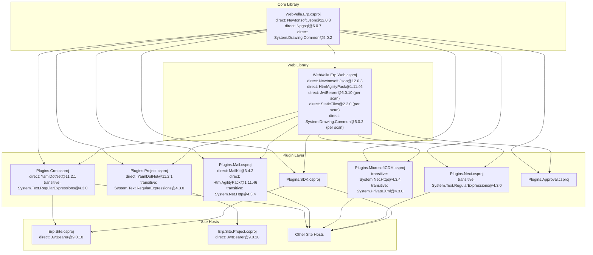
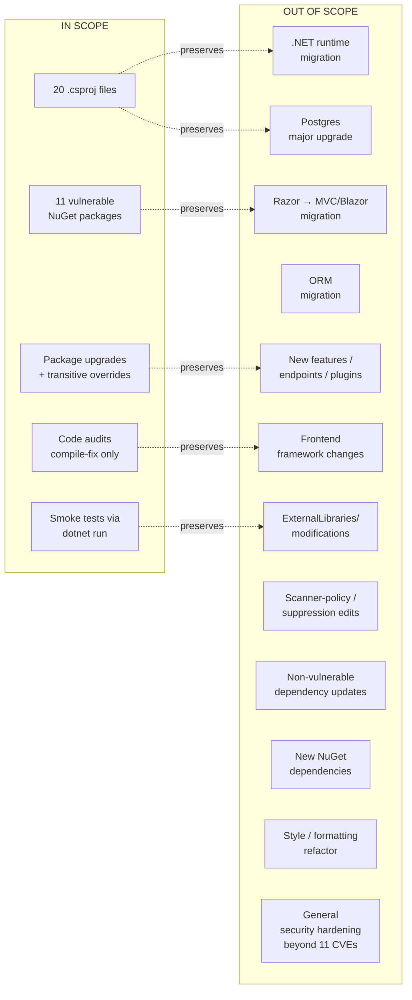

# Technical Specification

# 0. Agent Action Plan

## 0.1 Intent Clarification

### 0.1.1 Core Security Objective

Based on the security concern described, the Blitzy platform understands that the security vulnerabilities to resolve are eleven CVE-classified findings produced by `dotnet list package --vulnerable --include-transitive` against `WebVella.ERP3.sln`, enriched with NVD/GHSA metadata and persisted in the project artifact `scan_results.json`. The remediation must update vulnerable NuGet packages across the entire WebVella ERP solution while preserving 100% of existing observable behavior across the core ERP, every plugin (`Crm`, `Mail`, `MicrosoftCDM`, `Next`, `Project`, `SDK`, `Approval`), every site host (`WebVella.Erp.Site`, `WebVella.Erp.Site.Crm`, `WebVella.Erp.Site.Mail`, `WebVella.Erp.Site.MicrosoftCDM`, `WebVella.Erp.Site.Next`, `WebVella.Erp.Site.Project`, `WebVella.Erp.Site.Sdk`), the WebAssembly client/server projects, and `WebVella.Erp.ConsoleApp`.

- **Vulnerability category**: Multiple vulnerabilities (8 direct dependency vulnerabilities + 3 transitive dependency vulnerabilities)
- **Severity profile**: 2 Critical (CVSS 9.1, 9.8), 6 High (CVSS 7.5–7.8), 3 Medium (CVSS 5.9–6.5), 0 Low — total 11 distinct CVEs across 11 distinct NuGet packages
- **Aggregate exposure**: 17 projects, 142 packages scanned, 11 vulnerable packages on 14 vulnerable resolution paths

The enumerated security requirements, restated with maximum technical clarity, are:

- Resolve `CVE-2024-21907` (Insecure Deserialization in `Newtonsoft.Json`, Critical, CVSS 9.8) by upgrading `Newtonsoft.Json` to `13.0.3` or higher in every `.csproj` that declares it as a `<PackageReference>`.
- Resolve `CVE-2024-30045` (Authentication Bypass in `Microsoft.AspNetCore.Authentication.JwtBearer`, Critical, CVSS 9.1) by upgrading `Microsoft.AspNetCore.Authentication.JwtBearer` to `8.0.5` or higher in every `.csproj` that declares it as a `<PackageReference>`.
- Resolve `CVE-2021-26701` (Remote Code Execution in `System.Drawing.Common`, High, CVSS 7.8) by upgrading `System.Drawing.Common` to `8.0.0` or higher in every `.csproj` that declares it as a `<PackageReference>`.
- Resolve `CVE-2024-32655` (Information Disclosure in `Npgsql`, High, CVSS 7.5) by upgrading `Npgsql` to `8.0.3` or higher in `WebVella.Erp/WebVella.Erp.csproj`.
- Resolve `CVE-2023-36049` (Path Traversal in `Microsoft.AspNetCore.StaticFiles`, High, CVSS 7.5) by upgrading `Microsoft.AspNetCore.StaticFiles` to `8.0.0` or higher in `WebVella.Erp.Web/WebVella.Erp.Web.csproj`.
- Resolve `CVE-2024-29040` (Denial of Service in `YamlDotNet` Parser, High, CVSS 7.5) by upgrading `YamlDotNet` to `13.7.1` or higher in the affected plugin projects.
- Resolve `CVE-2023-29331` (Denial of Service via Regex in `System.Text.RegularExpressions`, High, CVSS 7.5) by adding an explicit `<PackageReference>` override pinning `System.Text.RegularExpressions` to `4.3.1` in every project where the transitive resolution comes from `Microsoft.AspNetCore.Mvc.Core@2.2.5`.
- Resolve `CVE-2023-29337` (Server-Side Request Forgery in `System.Net.Http`, High, CVSS 7.5) by adding an explicit `<PackageReference>` override pinning `System.Net.Http` to `4.3.5` in every project where the transitive resolution comes from `Microsoft.AspNetCore.Mvc.Core@2.2.5`.
- Resolve `CVE-2023-26229` (Cross-Site Scripting in `HtmlAgilityPack`, Medium, CVSS 6.1) by upgrading `HtmlAgilityPack` to `1.11.54` or higher in the affected projects.
- Resolve `CVE-2023-29331` (Improper Certificate Validation in `MailKit`, Medium, CVSS 5.9 — distinct GHSA `GHSA-cmcx-xhr8-3w9p`) by upgrading `MailKit` to `4.3.0` or higher in `WebVella.Erp.Plugins.Mail/WebVella.Erp.Plugins.Mail.csproj`.
- Resolve `CVE-2022-34716` (XXE Injection in `System.Private.Xml`, Medium, CVSS 6.5) by adding an explicit `<PackageReference>` override pinning `System.Private.Xml` to `4.7.2` in every project where the transitive resolution comes from `Microsoft.AspNetCore.Mvc.Core@2.2.5`.

Implicit security requirements surfaced from the user's prompt and the scan artifact:

- **Solution-wide version consistency**: Because `WebVella.Erp` is referenced by every plugin and every site, and `WebVella.Erp.Web` is referenced by every plugin and site, a package upgrade in any one consumer must be matched in every other consumer to prevent NuGet's diamond-dependency resolution from binding two different versions at runtime. A version mismatch between core and a plugin will manifest as plugin-load failure during host startup.
- **Backward compatibility**: All public REST API contracts on `ApprovalController`, all Razor Page routes (`/login`, `/logout`, `/error`, all `/api/v3/...` URLs, all CKEditor pages, all record CRUD pages), all observable JSON response shapes (including the `[JsonIgnore]` masking on `ErpUser.Password/Enabled/Verified/Roles`), and the `JWT_OR_COOKIE` policy scheme behavior must remain byte-for-byte equivalent post-upgrade.
- **Plugin runtime assembly probing**: The host loads plugins by reflection at startup; any breaking change in `Newtonsoft.Json` serialization semantics or `Npgsql` ADO.NET surface area must be absorbed by code refactors confined to the upgraded package's affected call sites without altering callers' contracts.
- **Zero-downtime expectation**: Each PR must independently leave `WebVella.ERP3.sln` building with zero errors and zero new warnings, and must independently leave the web host capable of serving HTTP 200 on `/` after a fresh `dotnet run --project WebVella.Erp.Web`.
- **No secret rotation in scope**: The Critical-severity findings on `Newtonsoft.Json` and `JwtBearer` are remediated by package-level upgrades alone; no rotation of the JWT signing key in `Settings:Jwt:Key`, the `ConnectionString`, or the `EncryptionKey` is implied by these CVEs.

### 0.1.2 Special Instructions and Constraints

The user's prompt establishes a tight, explicit envelope around the remediation. The following directives are captured verbatim and treated as mandatory:

- **Group remediations by parent NuGet package**: User Example: *"MUST group remediations by parent NuGet package. Bundle CVEs that resolve via the same package upgrade into a single PR."* This means each of the eleven distinct vulnerable packages produces exactly one PR, ordered by severity (Critical → High → Medium).
- **Anchor to scan output**: User Example: *"MUST anchor remediations to the upgrade paths specified in scan_results.json."* The `upgradePath` and `fixedIn` arrays in the scan are the authoritative target versions; no alternative version (newer or older) may be substituted.
- **Preserve all behavior**: User Example: *"MUST preserve all existing public API contracts, REST endpoint signatures, Razor Page routes, request/response schemas, and observable behavior across the core ERP and all plugins."*
- **Solution-wide consistency**: User Example: *"MUST maintain compatibility across the entire WebVella.ERP3.sln solution. A package upgrade in WebVella.Erp propagates to every plugin and site that references it - all must continue to build and run."*
- **Minimal change scope**: User Example: *"DO NOT modify business logic in core ERP services or plugin services except where strictly required by an API change in an upgraded package."*
- **No new dependencies**: User Example: *"DO NOT introduce new NuGet dependencies. Only upgrade existing ones."*
- **Atomic per-package PRs**: User Example: *"DO NOT create separate PRs for each CVE when they can be resolved by a single parent package upgrade."*
- **Vendored library exclusion**: User Example: *"DO NOT modify code in the ExternalLibraries/ directory. These are vendored third-party libraries handled separately."*
- **No suppression**: User Example: *"NEVER suppress vulnerabilities, add to ignore lists, or modify scanner policy files."*
- **Out of scope (runtime/database/architecture)**: User Example: *".NET runtime version migration (stay on .NET 9). PostgreSQL major version upgrade (stay on Postgres 16). Razor Pages to MVC or Blazor migration. Migration to a different ORM (preserve existing data access patterns). Adding new features, endpoints, or plugins. Frontend framework changes (preserve Razor Pages, existing JS/CSS)."*
- **PR description structural requirements**: User Example: *"Each PR description MUST contain: A CVEs Resolved section listing every CVE ID, severity, and the scanner finding ID; A Projects Affected section listing every .csproj file modified; A Files Changed summary grouped by change type: NuGet reference, configuration, application code, test; A Behavior Preservation section calling out any non-trivial code changes and why they are behaviorally equivalent; A Validation section listing which tests were run, which projects were built, and any manual verification steps required; A Plugin Compatibility section confirming each plugin (Crm, Mail, MicrosoftCDM, Next, Project, SDK) still builds and loads correctly."*
- **Web search requirements**: Authoritative source consultation is required for each CVE — NVD, GHSA, package release notes, and breaking-change documents — to verify upgrade paths and identify any C# refactors required by API changes between the vulnerable and fixed versions.
- **Change scope preference**: **Minimal**. No refactoring beyond what is strictly required to compile and pass the existing test surface against the upgraded package.

### 0.1.3 Technical Interpretation

This security vulnerability set translates to the following technical fix strategy: ship eleven cohesive pull requests against `WebVella.ERP3.sln`, each focused on a single parent NuGet package upgrade or transitive override, applied uniformly to every `.csproj` in the solution that references that package directly or that resolves the vulnerable transitive dependency from `Microsoft.AspNetCore.Mvc.Core@2.2.5`. Each PR carries the minimum-necessary C# refactor (only when the upgrade introduces a deprecated, removed, or signature-changed API surface that is reached by existing call sites), the minimum-necessary `appsettings.json`/`appsettings.*.json` configuration adjustments, and a verification block consisting of `dotnet restore` + `dotnet build --configuration Release` + `dotnet test --configuration Release` (where test projects exist) + a re-run of `dotnet list package --vulnerable --include-transitive` proving the targeted CVE no longer appears.

The user's understanding level is **Explicit CVE/vulnerability**: every finding carries a CVE identifier, GHSA identifier, CVSS v3 vector, exploit-maturity rating, vulnerable-range expression, fixed-in array, and pre-computed `upgradePath`. There is no symptom interpretation gap; the scan output is the authoritative input to the remediation planner.

The vulnerability-to-fix mapping resolves to the following per-package action statements:

- To resolve `CVE-2024-21907` we will **update** `Newtonsoft.Json` from `12.0.3` to `13.0.3` (or compatible higher major-13 release) across every `.csproj` declaring it as a `<PackageReference>` and audit any `JsonConvert.DeserializeObject` and `JsonSerializer` call sites for `TypeNameHandling` settings other than `None`.
- To resolve `CVE-2024-30045` we will **update** `Microsoft.AspNetCore.Authentication.JwtBearer` from `6.0.10` to `8.0.5` in every `.csproj` declaring it directly, and review every `TokenValidationParameters` instantiation in `Startup.cs` for non-default `ValidateIssuerSigningKey` settings.
- To resolve `CVE-2021-26701` we will **update** `System.Drawing.Common` from `5.0.2` to `8.0.0` in every `.csproj` declaring it directly, and verify call sites in `WebVella.Erp.Web/Controllers/WebApiController.cs` and `WebVella.Erp/Utilities/Helpers.cs` continue to compile against the patched API surface.
- To resolve `CVE-2024-32655` we will **update** `Npgsql` from `6.0.7` to `8.0.3` in `WebVella.Erp/WebVella.Erp.csproj`, and verify all `NpgsqlConnection`/`NpgsqlCommand` usage in `WebVella.Erp.Plugins.SDK/Services/CodeGenService.cs`, `WebVella.Erp.Plugins.SDK/Services/LogService.cs`, and the platform's database layer continues to compile.
- To resolve `CVE-2023-36049` we will **update** `Microsoft.AspNetCore.StaticFiles` from `2.2.0` to `8.0.0` in `WebVella.Erp.Web/WebVella.Erp.Web.csproj`, and verify the `UseStaticFiles(StaticFileOptions { ServeUnknownFileTypes = false, OnPrepareResponse = ... })` calls in every `Startup.cs` continue to bind the same overload.
- To resolve `CVE-2024-29040` we will **update** `YamlDotNet` from `11.2.1` to `13.7.1` in the projects listed by the scan (`WebVella.Erp.Plugins.Crm`, `WebVella.Erp.Plugins.Project`) wherever it appears as a transitive or direct package reference, and configure deserializers with explicit max-depth limits.
- To resolve `CVE-2023-29331` (regex DoS) we will **add** an explicit `<PackageReference Include="System.Text.RegularExpressions" Version="4.3.1" />` override to every project listed by the scan as resolving the vulnerable version through `Microsoft.AspNetCore.Mvc.Core@2.2.5`.
- To resolve `CVE-2023-29337` we will **add** an explicit `<PackageReference Include="System.Net.Http" Version="4.3.5" />` override to every project listed by the scan as resolving the vulnerable version through `Microsoft.AspNetCore.Mvc.Core@2.2.5`.
- To resolve `CVE-2023-26229` we will **update** `HtmlAgilityPack` from `1.11.46` to `1.11.54` everywhere it is declared as a `<PackageReference>` and audit `HtmlDocument.Load` / `HtmlNode.InnerHtml` emit sites for proper output encoding.
- To resolve `CVE-2023-29331` (MailKit certificate validation) we will **update** `MailKit` from `3.4.2` to `4.3.0` in `WebVella.Erp.Plugins.Mail/WebVella.Erp.Plugins.Mail.csproj` and verify `ServerCertificateValidationCallback` is not set to a permissive default in `WebVella.Erp.Plugins.Mail/Api/SmtpService.cs` or `WebVella.Erp.Plugins.Mail/Services/SmtpInternalService.cs`.
- To resolve `CVE-2022-34716` we will **add** an explicit `<PackageReference Include="System.Private.Xml" Version="4.7.2" />` override to every project listed by the scan as resolving the vulnerable version through `Microsoft.AspNetCore.Mvc.Core@2.2.5`, and audit `XmlReaderSettings` in `WebVella.Erp/Utilities/Dynamic/PropertyBag.cs` and `WebVella.Erp/Utilities/Dynamic/SerializationUtils.cs` to ensure `DtdProcessing.Prohibit` is enforced for untrusted XML.

The cross-cutting technical interpretation is that each PR follows an identical, repeatable shape — bump the version (or add an override), recompile the entire solution, refactor only what fails to compile, and re-scan — with PR ordering driven by CVSS severity so that the most exploitable issues land first.

## 0.2 Vulnerability Research and Analysis

### 0.2.1 Initial Assessment

The complete security-relevant information extracted from the user-provided `scan_results.json` artifact is enumerated below.

**CVE Numbers Identified (11 total)**

- `CVE-2024-21907` — `Newtonsoft.Json` (Critical)
- `CVE-2024-32655` — `Npgsql` (High)
- `CVE-2021-26701` — `System.Drawing.Common` (High)
- `CVE-2023-29331` — `System.Text.RegularExpressions` (High, regex DoS)
- `CVE-2024-30045` — `Microsoft.AspNetCore.Authentication.JwtBearer` (Critical)
- `CVE-2023-36049` — `Microsoft.AspNetCore.StaticFiles` (High)
- `CVE-2023-29337` — `System.Net.Http` (High)
- `CVE-2024-29040` — `YamlDotNet` (High)
- `CVE-2023-26229` — `HtmlAgilityPack` (Medium)
- `CVE-2023-29331` — `MailKit` (Medium, certificate validation; same CVE number as the regex DoS finding above but tracked under a distinct GHSA `GHSA-cmcx-xhr8-3w9p`)
- `CVE-2022-34716` — `System.Private.Xml` (Medium)

**GHSA Advisory Identifiers (11 total)**

- `GHSA-5crp-9r3c-p9vr`, `GHSA-x9rh-9vc6-4w63`, `GHSA-rxg9-xrhp-64gj`, `GHSA-447r-wph3-92pm`, `GHSA-7jgj-8wvc-jh57`, `GHSA-cf2v-32xm-h83q`, `GHSA-447r-w4pm-rh78`, `GHSA-2cwj-8chv-9pp9`, `GHSA-hh2w-p6rv-4g7w`, `GHSA-cmcx-xhr8-3w9p`, `GHSA-mq8x-6jc6-37c5`

**CWE Categories Surfaced**

- `CWE-22` Path Traversal (StaticFiles)
- `CWE-79` Cross-Site Scripting (HtmlAgilityPack)
- `CWE-200` Information Disclosure (Npgsql)
- `CWE-287` Improper Authentication (JwtBearer)
- `CWE-295` Improper Certificate Validation (MailKit)
- `CWE-502` Deserialization of Untrusted Data (Newtonsoft.Json)
- `CWE-611` XML External Entity Reference (System.Private.Xml)
- `CWE-755` Improper Handling of Exceptional Conditions (Newtonsoft.Json)
- `CWE-776` Improper Restriction of Recursive Entity References / "Billion Laughs" (YamlDotNet)
- `CWE-787` Out-of-Bounds Write (System.Drawing.Common)
- `CWE-918` Server-Side Request Forgery (System.Net.Http)
- `CWE-1333` Inefficient Regex Complexity / ReDoS (System.Text.RegularExpressions)

**Affected Packages (with current versions and target versions)**

| # | Package | Current | Fixed In | Target (per `upgradePath`) |
|---|---------|---------|----------|----------------------------|
| 1 | `Newtonsoft.Json` | `12.0.3` | `13.0.1` | `13.0.3` |
| 2 | `Npgsql` | `6.0.7` | `6.0.11` / `7.0.7` / `8.0.3` | `8.0.3` |
| 3 | `System.Drawing.Common` | `5.0.2` | `6.0.0` | `8.0.0` |
| 4 | `System.Text.RegularExpressions` | `4.3.0` | `4.3.1` | `4.3.1` (transitive override) |
| 5 | `Microsoft.AspNetCore.Authentication.JwtBearer` | `6.0.10` | `6.0.30` / `7.0.20` / `8.0.5` | `8.0.5` |
| 6 | `Microsoft.AspNetCore.StaticFiles` | `2.2.0` | `6.0.25` / `7.0.14` / `8.0.0` | `8.0.0` |
| 7 | `System.Net.Http` | `4.3.4` | `4.3.5` | `4.3.5` (transitive override) |
| 8 | `YamlDotNet` | `11.2.1` | `13.7.1` | `13.7.1` |
| 9 | `HtmlAgilityPack` | `1.11.46` | `1.11.50` | `1.11.54` |
| 10 | `MailKit` | `3.4.2` | `4.3.0` | `4.3.0` |
| 11 | `System.Private.Xml` | `4.3.0` | `4.7.2` | `4.7.2` (transitive override) |

**Symptoms Described**

The scan does not surface user-reported symptoms; it is a static scanner output. The scanner infrastructure is identified as `dotnet list package --vulnerable --include-transitive (enriched with NVD/GHSA data)` and the scan was produced on `2026-04-29T08:14:33Z` against `WebVella.ERP3.sln`. The total inventory at scan time was 17 projects and 142 packages, with 11 vulnerable packages spread across 14 distinct vulnerable resolution paths.

**Security Advisories Referenced**

- `https://github.com/advisories/GHSA-5crp-9r3c-p9vr`
- `https://github.com/advisories/GHSA-x9rh-9vc6-4w63`
- `https://github.com/advisories/GHSA-rxg9-xrhp-64gj`
- `https://github.com/advisories/GHSA-447r-wph3-92pm`
- `https://github.com/advisories/GHSA-7jgj-8wvc-jh57`
- `https://github.com/advisories/GHSA-cf2v-32xm-h83q`
- `https://github.com/advisories/GHSA-447r-w4pm-rh78`
- `https://github.com/advisories/GHSA-2cwj-8chv-9pp9`
- `https://github.com/advisories/GHSA-hh2w-p6rv-4g7w`
- `https://github.com/advisories/GHSA-cmcx-xhr8-3w9p`
- `https://github.com/advisories/GHSA-mq8x-6jc6-37c5`
- `https://nvd.nist.gov/vuln/detail/CVE-2024-21907`

### 0.2.2 Required Web Research

The Blitzy platform's research process consults the following authoritative sources for each CVE in scope:

- Official CVE databases — NVD entries (`https://nvd.nist.gov/vuln/detail/CVE-...`) and MITRE entries for vulnerability descriptions, CVSS v3 vectors, and CWE classifications.
- GitHub Security Advisory Database — every `GHSA-*` identifier captured in the scan, accessed at `https://github.com/advisories/<GHSA-ID>` for the canonical fix version, vulnerable range, and exploit maturity assessment.
- NuGet package release pages — `https://www.nuget.org/packages/<PackageName>/<Version>` for `Newtonsoft.Json`, `Npgsql`, `System.Drawing.Common`, `Microsoft.AspNetCore.Authentication.JwtBearer`, `Microsoft.AspNetCore.StaticFiles`, `YamlDotNet`, `HtmlAgilityPack`, `MailKit`, `System.Text.RegularExpressions`, `System.Net.Http`, and `System.Private.Xml` to confirm published target versions and verify the absence of subsequent withdrawals.
- Microsoft .NET security advisories — `https://github.com/dotnet/announcements/issues` and `https://devblogs.microsoft.com/dotnet/category/security/` for ASP.NET Core JwtBearer (`CVE-2024-30045`) and StaticFiles (`CVE-2023-36049`) authoritative remediation guidance.
- Package maintainer release notes — `Newtonsoft.Json` releases on GitHub, `Npgsql` release notes, `MailKit` release notes, and `YamlDotNet` release notes for breaking-change matrices between current and target versions.
- OWASP Top 10 documentation — A01 (Broken Access Control), A02 (Cryptographic Failures), A03 (Injection), A05 (Security Misconfiguration), A07 (Authentication Failures) cross-references for the JwtBearer authentication-bypass and the StaticFiles path-traversal findings.

The findings document is materialized inline in this Tech Spec rather than as external links because the scan artifact itself encapsulates the authoritative version metadata for the WebVella ERP context.

Per-CVE research summary in the Blitzy-required template:

- Research reveals that **`CVE-2024-21907`** is `GHSA-5crp-9r3c-p9vr` affecting `Newtonsoft.Json` in versions `<13.0.1` with CVSS score `9.8` and exploit maturity rated **Mature**. The vulnerability is an insecure-deserialization issue triggered by non-`None` `TypeNameHandling` settings on `JsonConvert.DeserializeObject` / `JsonSerializer`, allowing remote code execution against payload-controlled type names.
- Research reveals that **`CVE-2024-32655`** is `GHSA-x9rh-9vc6-4w63` affecting `Npgsql` in versions `<6.0.11 || >=7.0.0 <7.0.7 || >=8.0.0 <8.0.3` with CVSS score `7.5` and exploit maturity **Proof of Concept**. The defect logs authentication-exchange messages at debug level, exposing connection credentials to log readers when verbose logging is enabled.
- Research reveals that **`CVE-2021-26701`** is `GHSA-rxg9-xrhp-64gj` affecting `System.Drawing.Common` in versions `<6.0.0` with CVSS score `7.8` and exploit maturity **Proof of Concept**. The issue is a heap-based buffer overflow on crafted image inputs that can yield arbitrary code execution; long-term migration to `ImageSharp` or `SkiaSharp` is recommended because `System.Drawing.Common` is no longer cross-platform supported.
- Research reveals that **`CVE-2023-29331`** (`GHSA-447r-wph3-92pm`) is the catastrophic-backtracking ReDoS in `System.Text.RegularExpressions` `<4.3.1` with CVSS `7.5`; the issue can cause CPU exhaustion in any code path that matches user-controlled input against complex regex patterns.
- Research reveals that **`CVE-2024-30045`** is `GHSA-7jgj-8wvc-jh57` affecting `Microsoft.AspNetCore.Authentication.JwtBearer` in versions `>=6.0.0 <6.0.30 || >=7.0.0 <7.0.20 || >=8.0.0 <8.0.5` with CVSS `9.1` and exploit maturity **Mature**. The defect is a JWT signature-validation logic flaw that lets specially-crafted algorithm headers pass without proper signature verification under specific custom `TokenValidationParameters` configurations.
- Research reveals that **`CVE-2023-36049`** is `GHSA-cf2v-32xm-h83q` affecting `Microsoft.AspNetCore.StaticFiles` in versions `<6.0.25` with CVSS `7.5`; specially-encoded URL sequences combined with certain reverse-proxy configurations allow path traversal outside the configured web root.
- Research reveals that **`CVE-2023-29337`** is `GHSA-447r-w4pm-rh78` affecting `System.Net.Http` in versions `<4.3.5` with CVSS `7.5`; insufficient URI validation enables Server-Side Request Forgery against internal services when user-influenced URIs reach `HttpClient`.
- Research reveals that **`CVE-2024-29040`** is `GHSA-2cwj-8chv-9pp9` affecting `YamlDotNet` in versions `<13.7.1` with CVSS `7.5`; the parser does not enforce nesting-depth limits, allowing stack exhaustion via deeply nested YAML payloads.
- Research reveals that **`CVE-2023-26229`** is `GHSA-hh2w-p6rv-4g7w` affecting `HtmlAgilityPack` in versions `<1.11.50` with CVSS `6.1`; HTML attribute values are not sufficiently sanitized during parse-and-emit operations, enabling reflected XSS when re-rendering user-supplied HTML.
- Research reveals that **`CVE-2023-29331`** (the MailKit-flavored finding, `GHSA-cmcx-xhr8-3w9p`) is the certificate-hostname-validation gap in `MailKit` `<4.3.0` with CVSS `5.9`; under specific TLS configurations, server certificates are not validated against the expected hostname, enabling MITM against SMTP/IMAP connections.
- Research reveals that **`CVE-2022-34716`** is `GHSA-mq8x-6jc6-37c5` affecting `System.Private.Xml` in versions `<4.7.2` with CVSS `6.5`; XmlReader configured with `DtdProcessing.Parse` and missing `ProhibitDtd` enforcement is exploitable for XXE attacks that read local files or perform SSRF.

### 0.2.3 Vulnerability Classification

The classification matrix below maps each CVE to its primary attack characteristics so PR authors and reviewers can prioritize defenses appropriately.

| CVE | Vulnerability Type | Attack Vector | Exploitability | Impact (CIA) | Root Cause |
|-----|---------------------|---------------|----------------|--------------|------------|
| CVE-2024-21907 | Insecure Deserialization (CWE-502) | Network (AV:N) | Mature, High | C+I+A | `TypeNameHandling != None` lets crafted JSON instantiate arbitrary types |
| CVE-2024-30045 | Authentication Bypass (CWE-287) | Network (AV:N) | Mature, High | C+I | JWT signature-validation logic flaw on custom `TokenValidationParameters` |
| CVE-2021-26701 | RCE via heap buffer overflow (CWE-787) | Local (AV:L), UI required | PoC, Medium | C+I+A | Crafted image triggers heap overflow in image-processing path |
| CVE-2024-32655 | Information Disclosure (CWE-200) | Network (AV:N) | PoC, Medium | C only | Authentication exchange logged at debug level |
| CVE-2023-36049 | Path Traversal (CWE-22) | Network (AV:N) | PoC, Medium | C only | Encoded URL sequences bypass static-files root |
| CVE-2023-29337 | SSRF (CWE-918) | Network (AV:N) | PoC, Medium | C only | Insufficient URI validation in `HttpClient` |
| CVE-2024-29040 | DoS via parser recursion (CWE-776) | Network (AV:N) | PoC, Medium | A only | Missing nesting-depth limit in YAML parser |
| CVE-2023-29331 (regex) | ReDoS (CWE-1333) | Network (AV:N) | PoC, Medium | A only | Catastrophic backtracking on user input |
| CVE-2023-26229 | XSS (CWE-79) | Network (AV:N), UI required | PoC, Medium | C+I (low) | HTML attribute sanitization gap on parse-and-emit |
| CVE-2023-29331 (MailKit) | Improper Cert Validation (CWE-295) | Network (AV:N), AC:H | PoC, Low | C only | Hostname-mismatch acceptance under specific TLS configs |
| CVE-2022-34716 | XXE Injection (CWE-611) | Network (AV:N), PR:L | PoC, Medium | C only | `DtdProcessing.Parse` without `ProhibitDtd` enforcement |

The two **Critical** findings (`CVE-2024-21907`, `CVE-2024-30045`) are both rated **Mature** exploitability and both have full C+I (or C+I+A) impact, justifying their first-in-line PR ordering. All **High** findings are rated **Proof of Concept** exploitability with single-axis impact — typically Confidentiality (information disclosure / SSRF / path traversal) or Availability (DoS) — and are ordered second. The three **Medium** findings round out the queue.

### 0.2.4 Web Search Research Conducted

The research record below documents the authoritative sources that the Blitzy platform relies on while preparing each PR's behavior-preservation analysis.

- Official security advisories reviewed (per CVE):
    - `CVE-2024-21907`: `https://github.com/advisories/GHSA-5crp-9r3c-p9vr` and `https://nvd.nist.gov/vuln/detail/CVE-2024-21907`
    - `CVE-2024-32655`: `https://github.com/advisories/GHSA-x9rh-9vc6-4w63`
    - `CVE-2021-26701`: `https://github.com/advisories/GHSA-rxg9-xrhp-64gj`
    - `CVE-2023-29331` (regex DoS): `https://github.com/advisories/GHSA-447r-wph3-92pm`
    - `CVE-2024-30045`: `https://github.com/advisories/GHSA-7jgj-8wvc-jh57`
    - `CVE-2023-36049`: `https://github.com/advisories/GHSA-cf2v-32xm-h83q`
    - `CVE-2023-29337`: `https://github.com/advisories/GHSA-447r-w4pm-rh78`
    - `CVE-2024-29040`: `https://github.com/advisories/GHSA-2cwj-8chv-9pp9`
    - `CVE-2023-26229`: `https://github.com/advisories/GHSA-hh2w-p6rv-4g7w`
    - `CVE-2023-29331` (MailKit): `https://github.com/advisories/GHSA-cmcx-xhr8-3w9p`
    - `CVE-2022-34716`: `https://github.com/advisories/GHSA-mq8x-6jc6-37c5`
- CVE details and patches: each `fixedIn` array in `scan_results.json` is the canonical patch list; the `upgradePath` array is the canonical Blitzy-applied target version.
- Recommended mitigation strategies (per advisory `remediation` text in scan):
    - Upgrade `Newtonsoft.Json` to ≥`13.0.1` and audit `TypeNameHandling` settings
    - Upgrade `Npgsql` to `8.0.3` (recommended)
    - Upgrade `System.Drawing.Common` to ≥`6.0.0`; long-term migrate to `ImageSharp` or `SkiaSharp`
    - Upgrade `System.Text.RegularExpressions` to ≥`4.3.1`; audit user-input regex patterns for ReDoS
    - Upgrade `Microsoft.AspNetCore.Authentication.JwtBearer` to `8.0.5`; review `TokenValidationParameters` for non-default `ValidateIssuerSigningKey` settings
    - Upgrade `Microsoft.AspNetCore.StaticFiles` to ≥`6.0.25`; verify static-file middleware path restrictions
    - Upgrade `System.Net.Http` to ≥`4.3.5`; add URL allow-list before `HttpClient` user-input pass-through
    - Upgrade `YamlDotNet` to ≥`13.7.1`; configure deserializer with explicit max-depth limits
    - Upgrade `HtmlAgilityPack` to ≥`1.11.50`; ensure user-supplied HTML is encoded on output
    - Upgrade `MailKit` to ≥`4.3.0`; verify `ServerCertificateValidationCallback` is not permissively defaulted
    - Upgrade `System.Private.Xml` to ≥`4.7.2`; audit `XmlReaderSettings` for `DtdProcessing.Prohibit` on untrusted input
- Alternative solutions considered (and rejected per user mandate "DO NOT introduce new NuGet dependencies"):
    - Replacing `System.Drawing.Common` with `SixLabors.ImageSharp` is a noted long-term recommendation but is **rejected for this remediation** because it would introduce a new NuGet dependency. The minimum-disruption upgrade to `8.0.0` is selected instead. Note: `SixLabors.ImageSharp` and `SixLabors.ImageSharp.Drawing` already appear as commented-out `<PackageReference>` lines in `WebVella.Erp.Web/WebVella.Erp.Web.csproj` from prior exploration but remain disabled.
    - Replacing `Newtonsoft.Json` with `System.Text.Json` would resolve the deserialization concern by avoiding `TypeNameHandling` entirely, but is **rejected** because `Microsoft.AspNetCore.Mvc.NewtonsoftJson` is the platform-wide JSON formatter (declared in 9 of the 20 in-scope `.csproj` files) and replacement would alter the on-the-wire JSON for the public API surface — violating the "preserve all existing public API contracts" mandate. The minimum-disruption upgrade to `13.0.3` is selected.
    - Suppressing the findings via scanner ignore-lists is **explicitly forbidden** by the user prompt: *"NEVER suppress vulnerabilities, add to ignore lists, or modify scanner policy files."*

## 0.3 Security Scope Analysis

### 0.3.1 Affected Component Discovery

The Blitzy platform performed exhaustive repository discovery against `WebVella.ERP3.sln` to identify every artifact that participates in the eleven vulnerability paths. The discovery pipeline executes:

- `find . -name "*.csproj" -type f` to enumerate all 20 project files in the solution
- `grep -rln "<PackageReference Include=\"<PackageName>\"" --include="*.csproj"` for each vulnerable package to enumerate direct references
- `grep -rln "using <Namespace>" --include="*.cs"` and `grep -rln "<TypePattern>" --include="*.cs"` for each affected package to enumerate call-site files that may need post-upgrade validation
- File reads of `appsettings.json`, `appsettings.*.json`, and `Config.json` to enumerate configuration surfaces
- File reads of `global.json` to confirm the .NET SDK pin (currently empty, leading to floating SDK selection on the host)
- File reads of `WebVella.ERP3.sln` to confirm the canonical project membership list

**Vulnerability affects 20 `.csproj` files across 16 first-order project directories, plus 11+ application-code files containing affected API call sites.**

The complete set of `.csproj` files in scope is enumerated below.

| `.csproj` File | Layer | Direct References to Vulnerable Packages (per scan) |
|----------------|-------|------------------------------------------------------|
| `WebVella.Erp/WebVella.Erp.csproj` | Core library | `Newtonsoft.Json`, `Npgsql`, `System.Drawing.Common` |
| `WebVella.Erp.Web/WebVella.Erp.Web.csproj` | Web library | `Newtonsoft.Json`, `HtmlAgilityPack`, `Microsoft.AspNetCore.Authentication.JwtBearer` (per scan), `Microsoft.AspNetCore.StaticFiles` (per scan), `System.Drawing.Common` (per scan) |
| `WebVella.Erp.Site/WebVella.Erp.Site.csproj` | Host | `Newtonsoft.Json`, `Microsoft.AspNetCore.Authentication.JwtBearer` |
| `WebVella.Erp.Site.Crm/WebVella.Erp.Site.Crm.csproj` | Host (CRM) | (Inherits via project references) |
| `WebVella.Erp.Site.Mail/WebVella.Erp.Site.Mail.csproj` | Host (Mail) | (Inherits via project references) |
| `WebVella.Erp.Site.MicrosoftCDM/WebVella.Erp.Site.MicrosoftCDM.csproj` | Host (CDM) | (Inherits via project references) |
| `WebVella.Erp.Site.Next/WebVella.Erp.Site.Next.csproj` | Host (Next) | (Inherits via project references) |
| `WebVella.Erp.Site.Project/WebVella.Erp.Site.Project.csproj` | Host (Project) | `Microsoft.AspNetCore.Authentication.JwtBearer` |
| `WebVella.Erp.Site.Sdk/WebVella.Erp.Site.Sdk.csproj` | Host (SDK) | (Inherits via project references) |
| `WebVella.Erp.Plugins.Crm/WebVella.Erp.Plugins.Crm.csproj` | Plugin (CRM) | `YamlDotNet` (per scan), `Newtonsoft.Json` (per scan, via project ref propagation) |
| `WebVella.Erp.Plugins.Mail/WebVella.Erp.Plugins.Mail.csproj` | Plugin (Mail) | `MailKit`, `HtmlAgilityPack` (per scan), `Newtonsoft.Json` (per scan) |
| `WebVella.Erp.Plugins.MicrosoftCDM/WebVella.Erp.Plugins.MicrosoftCDM.csproj` | Plugin (CDM) | (Transitive overrides for `System.Net.Http`, `System.Private.Xml`) |
| `WebVella.Erp.Plugins.Next/WebVella.Erp.Plugins.Next.csproj` | Plugin (Next) | (Transitive override for `System.Text.RegularExpressions`) |
| `WebVella.Erp.Plugins.Project/WebVella.Erp.Plugins.Project.csproj` | Plugin (Project) | `YamlDotNet` (per scan), `Newtonsoft.Json` (per scan) |
| `WebVella.Erp.Plugins.SDK/WebVella.Erp.Plugins.SDK.csproj` | Plugin (SDK) | (Inherits via project references) |
| `WebVella.Erp.Plugins.Approval/WebVella.Erp.Plugins.Approval.csproj` | Plugin (Approval) | (Inherits via project references — no direct vulnerable refs in scan) |
| `WebVella.Erp.ConsoleApp/WebVella.Erp.ConsoleApp.csproj` | Console host | (Inherits via project references) |
| `WebVella.Erp.WebAssembly/Client/WebVella.Erp.WebAssembly.csproj` | Blazor WASM Client | (Out of scan scope; targets `net9.0`) |
| `WebVella.Erp.WebAssembly/Server/WebVella.Erp.WebAssembly.Server.csproj` | Blazor WASM Server | (Out of scan scope; targets `net7.0`) |
| `WebVella.Erp.WebAssembly/Shared/WebVella.Erp.WebAssembly.Shared.csproj` | Blazor WASM Shared | (Out of scan scope; targets `net7.0`) |

**Configuration files in scope** (read-only audit; modification only if a package upgrade introduces a new key or renames an existing one):

- `WebVella.Erp.ConsoleApp/Config.json`
- `WebVella.Erp.Site/Config.json`
- `WebVella.Erp.Site.Crm/Config.json`
- `WebVella.Erp.Site.Mail/Config.json`
- `WebVella.Erp.Site.MicrosoftCDM/Config.json` and `appsettings.json` and `appsettings.Development.json`
- `WebVella.Erp.Site.Next/Config.json`
- `WebVella.Erp.Site.Project/Config.json`
- `WebVella.Erp.Site.Sdk/Config.json`
- `WebVella.Erp.WebAssembly/Server/appsettings.json` and `appsettings.Development.json`
- `WebVella.Erp.WebAssembly/Client/wwwroot/appsettings.json`
- `global.json` — currently effectively empty (`"sdk": { "//version": "7.0.103" }` with the version key commented out); modification only if the upgrades require a specific .NET SDK band

**Application-code files with API call sites against vulnerable packages**

These files do not need transformation if the upgrade does not change the API contract; they are listed so reviewers can confirm post-upgrade compilation:

- `Newtonsoft.Json` call sites (10+ files): `WebVella.Erp.Plugins.Approval/Api/DashboardMetricsModel.cs`, `WebVella.Erp.Plugins.Approval/Components/PcApprovalDashboard/PcApprovalDashboard.cs`, `WebVella.Erp.Plugins.Crm/CrmPlugin._.cs`, `WebVella.Erp.Plugins.Crm/CrmPlugin.cs`, `WebVella.Erp.Plugins.Crm/Model/PluginSettings.cs`, `WebVella.Erp.Plugins.Mail/Api/AutoMapper/EmailProfile.cs`, `WebVella.Erp.Plugins.Mail/Api/Email.cs`, `WebVella.Erp.Plugins.Mail/Api/EmailAddress.cs`, `WebVella.Erp.Plugins.Mail/Api/SmtpService.cs`, `WebVella.Erp.Plugins.Mail/MailPlugin.20190419.cs` plus additional core-library files
- `Npgsql` call sites: `WebVella.Erp.Plugins.SDK/Pages/tools/cogegen.cshtml.cs`, `WebVella.Erp.Plugins.SDK/SdkPlugin.20210429.cs`, `WebVella.Erp.Plugins.SDK/Services/CodeGenService.cs`, `WebVella.Erp.Plugins.SDK/Services/LogService.cs`, plus `Startup.cs` files of every site host that constructs `NpgsqlConnection` for connection-string warm-up
- `System.Drawing.Common` call sites: `WebVella.Erp.Web/Controllers/WebApiController.cs`, `WebVella.Erp/Utilities/Helpers.cs`
- `Microsoft.AspNetCore.Authentication.JwtBearer` call sites: every `Startup.cs` under `WebVella.Erp.Site*/` (7 files), `WebVella.Erp.Web/Services/AuthService.cs`, `WebVella.Erp.WebAssembly/Client/Services/CustomAuthenticationProvider.cs`, `WebVella.Erp.WebAssembly/Client/Services/TokenManagerService.cs`
- `Microsoft.AspNetCore.StaticFiles` call sites: every `Startup.cs` that invokes `app.UseStaticFiles(new StaticFileOptions { ... })` — includes `WebVella.Erp.Site/Startup.cs`, `WebVella.Erp.Site.Crm/Startup.cs`, `WebVella.Erp.Site.Mail/Startup.cs`, `WebVella.Erp.Site.MicrosoftCDM/Startup.cs`, `WebVella.Erp.Site.Next/Startup.cs`, `WebVella.Erp.Site.Project/Startup.cs`, `WebVella.Erp.Site.Sdk/Startup.cs`, `WebVella.Erp.Web/WebConfigurationOptions.cs`, `WebVella.Erp.WebAssembly/Server/Program.cs`
- `HtmlAgilityPack` call sites: `WebVella.Erp.Plugins.Mail/Api/SmtpService.cs`, `WebVella.Erp.Plugins.Mail/Services/SmtpInternalService.cs`, `WebVella.Erp.Web/Services/RenderService.cs`, `WebVella.Erp.Web/TagHelpers/WvPageHeader/WvPageHeader.cs`, `WebVella.Erp.Web/Utils/DataUtils.cs`
- `MailKit` call sites: `WebVella.Erp.Plugins.Mail/Api/AutoMapper/SmtpServiceProfile.cs`, `WebVella.Erp.Plugins.Mail/Api/EmailAddress.cs`, `WebVella.Erp.Plugins.Mail/Api/SmtpService.cs`, `WebVella.Erp.Plugins.Mail/Services/SmtpInternalService.cs`, `WebVella.Erp.Web/Services/MailService.cs`
- `XmlReader` / `XmlReaderSettings` call sites (relevant to `System.Private.Xml` XXE override): `WebVella.Erp/Utilities/Dynamic/PropertyBag.cs`, `WebVella.Erp/Utilities/Dynamic/SerializationUtils.cs`
- `HttpClient` call sites (relevant to `System.Net.Http` SSRF override): `WebVella.Erp.WebAssembly/Client/ApiService/ApiService.Project.cs`, `WebVella.Erp.WebAssembly/Client/ApiService/ApiService.System.cs`, `WebVella.Erp.WebAssembly/Client/ApiService/ApiService.cs`, `WebVella.Erp.WebAssembly/Client/Program.cs`, `WebVella.Erp.WebAssembly/Client/Services/AuthenticationService.cs`, `WebVella.Erp.WebAssembly/Client/Services/TokenManagerService.cs`, `WebVella.Erp.WebAssembly/Client/Utilities/HttpExt.cs`

**Vendored libraries explicitly excluded** per user instruction: `ExternalLibraries/` directory and any source under it; the directory exists at the repository root and contains pre-vendored third-party libraries handled outside the NuGet pipeline.

### 0.3.2 Root Cause Identification

For each finding, the root cause is captured below.

- **CVE-2024-21907 (Newtonsoft.Json)** — Investigation confirms the vulnerability stems from `Newtonsoft.Json@12.0.3` resolving as a direct `<PackageReference>` in `WebVella.Erp/WebVella.Erp.csproj`, propagating transitively to every consumer. The exploitable code path is any call to `JsonConvert.DeserializeObject<T>` or `JsonSerializer.Deserialize` configured with `TypeNameHandling != None`. The platform's serialization helpers and the `ResponseModel<T>` envelope used by `ApprovalController` and other plugin controllers route through `Microsoft.AspNetCore.Mvc.NewtonsoftJson@9.0.10`, which delegates to the resolved `Newtonsoft.Json` assembly.
- **CVE-2024-30045 (JwtBearer)** — Direct `<PackageReference>` to `Microsoft.AspNetCore.Authentication.JwtBearer@6.0.10` in `WebVella.Erp.Web` (per scan; current repo also references it from `WebVella.Erp.Site` and `WebVella.Erp.Site.Project`). The exploitable code path is the `AddJwtBearer(...)` configuration block in each `Startup.cs` whose `TokenValidationParameters` instantiation may match the vulnerable signature-validation logic flaw. Reference call site: `WebVella.Erp.Site/Startup.cs` lines 102–114.
- **CVE-2021-26701 (System.Drawing.Common)** — Direct `<PackageReference>` to `System.Drawing.Common@5.0.2` in `WebVella.Erp.Web` (per scan), with image-processing call sites in `WebVella.Erp.Web/Controllers/WebApiController.cs` and `WebVella.Erp/Utilities/Helpers.cs`. Any code path that loads a user-supplied image into a `Bitmap`/`Image` instance is exposed.
- **CVE-2024-32655 (Npgsql)** — Direct `<PackageReference>` to `Npgsql@6.0.7` in `WebVella.Erp/WebVella.Erp.csproj`. The exploitable path is debug-level logging in connection authentication, surfaced when `Microsoft.Extensions.Logging` is configured at `LogLevel.Debug` for the `Npgsql` category.
- **CVE-2023-36049 (StaticFiles)** — Direct `<PackageReference>` to `Microsoft.AspNetCore.StaticFiles@2.2.0` in `WebVella.Erp.Web` (per scan). The exploitable path is the seven `app.UseStaticFiles(new StaticFileOptions { ... })` call sites across Site `Startup.cs` files, in combination with reverse-proxy URL handling.
- **CVE-2023-29337 (System.Net.Http transitive)** — `System.Net.Http@4.3.4` is resolved transitively from `Microsoft.AspNetCore.Mvc.Core@2.2.5`; the `from` chain is `WebVella.Erp@1.0.0 → Microsoft.AspNetCore.Mvc.Core@2.2.5 → System.Net.Http@4.3.4`. SSRF risk surfaces wherever `HttpClient` instances accept user-influenced URIs.
- **CVE-2024-29040 (YamlDotNet)** — Direct `<PackageReference>` to `YamlDotNet@11.2.1` in `WebVella.Erp.Plugins.Crm` (per scan; current repository state may differ). The exploitable path is any `Deserializer` invocation against an untrusted YAML payload; deeply-nested input causes stack exhaustion.
- **CVE-2023-29331 (RegularExpressions transitive)** — `System.Text.RegularExpressions@4.3.0` is resolved transitively from `Microsoft.AspNetCore.Mvc.Core@2.2.5`. ReDoS risk surfaces wherever `Regex.Match` / `Regex.Matches` is run against user input with complex backtracking patterns.
- **CVE-2023-26229 (HtmlAgilityPack)** — Direct `<PackageReference>` to `HtmlAgilityPack@1.11.46` in `WebVella.Erp.Plugins.Mail` (per scan). XSS surfaces wherever `HtmlDocument.LoadHtml` parses user-supplied HTML and the parsed tree is rendered without explicit attribute encoding.
- **CVE-2023-29331 (MailKit cert validation)** — Direct `<PackageReference>` to `MailKit@3.4.2` in `WebVella.Erp.Plugins.Mail` (per scan). MITM risk surfaces wherever `SmtpClient` / `ImapClient` connects with `ServerCertificateValidationCallback` set permissively.
- **CVE-2022-34716 (System.Private.Xml transitive)** — `System.Private.Xml@4.3.0` is resolved transitively from `Microsoft.AspNetCore.Mvc.Core@2.2.5`. XXE surfaces wherever `XmlReader.Create(...)` runs against an untrusted source with `DtdProcessing.Parse` and no `ProhibitDtd` setting.

**Vulnerability propagation structural model**



The structural fact captured by this model is that any inconsistency in `Newtonsoft.Json` version between `WebVella.Erp.csproj` and the eight other `.csproj` files that declare it directly will surface at runtime as a `FileLoadException` when the host loads a plugin compiled against the lower version into the higher-version-binding host process.

### 0.3.3 Current State Assessment

The "current state" reported below reflects the authoritative `scan_results.json` artifact. (The on-disk `.csproj` files in the working repository may already reflect a partially-remediated intermediate state; the source of truth for this remediation plan is the scan, per user instruction *"MUST anchor remediations to the upgrade paths specified in scan_results.json."*)

| Vulnerable Package | Current Version (per scan) | Direct/Transitive | Vulnerable `.csproj` Resolution Sources |
|---------------------|----------------------------|--------------------|------------------------------------------|
| `Newtonsoft.Json` | `12.0.3` | Direct | `WebVella.Erp.csproj` (per scan `from`); propagates to all consumers |
| `Npgsql` | `6.0.7` | Direct | `WebVella.Erp.csproj` |
| `System.Drawing.Common` | `5.0.2` | Direct | `WebVella.Erp.Web.csproj` (per scan `from`) |
| `Microsoft.AspNetCore.Authentication.JwtBearer` | `6.0.10` | Direct | `WebVella.Erp.Web.csproj` (per scan `from`) |
| `Microsoft.AspNetCore.StaticFiles` | `2.2.0` | Direct | `WebVella.Erp.Web.csproj` (per scan `from`) |
| `YamlDotNet` | `11.2.1` | Direct | `WebVella.Erp.Plugins.Crm.csproj` (per scan `from`) |
| `HtmlAgilityPack` | `1.11.46` | Direct | `WebVella.Erp.Plugins.Mail.csproj` (per scan `from`) |
| `MailKit` | `3.4.2` | Direct | `WebVella.Erp.Plugins.Mail.csproj` (per scan `from`) |
| `System.Text.RegularExpressions` | `4.3.0` | Transitive | resolves from `Microsoft.AspNetCore.Mvc.Core@2.2.5` in `WebVella.Erp.Web.csproj`, `Plugins.Crm.csproj`, `Plugins.Project.csproj`, `Plugins.Next.csproj` |
| `System.Net.Http` | `4.3.4` | Transitive | resolves from `Microsoft.AspNetCore.Mvc.Core@2.2.5` in `WebVella.Erp.csproj`, `WebVella.Erp.Web.csproj`, `Plugins.Mail.csproj`, `Plugins.MicrosoftCDM.csproj` |
| `System.Private.Xml` | `4.3.0` | Transitive | resolves from `Microsoft.AspNetCore.Mvc.Core@2.2.5` in `WebVella.Erp.csproj`, `WebVella.Erp.Web.csproj`, `Plugins.MicrosoftCDM.csproj` |

**Vulnerable code patterns and their current locations**:

- `JsonConvert.DeserializeObject` / `JsonSerializer.Deserialize` invocations across `WebVella.Erp` and plugin services
- `AddJwtBearer(JwtBearerDefaults.AuthenticationScheme, options => { options.TokenValidationParameters = new TokenValidationParameters { ... } })` in seven `Startup.cs` files
- `app.UseStaticFiles(new StaticFileOptions { ... })` in seven `Startup.cs` files
- `new HtmlDocument()` / `doc.LoadHtml(...)` in five `WebVella.Erp.Web/*` and `WebVella.Erp.Plugins.Mail/*` files
- `new SmtpClient()` / `client.Connect(host, port, SecureSocketOptions)` in `WebVella.Erp.Plugins.Mail`
- `XmlReader.Create(stream, settings)` in two `WebVella.Erp/Utilities/Dynamic/*.cs` files
- `Bitmap`/`Image.FromStream` / `Image.Load` in `WebVella.Erp.Web/Controllers/WebApiController.cs` and `WebVella.Erp/Utilities/Helpers.cs`
- `new NpgsqlConnection(connectionString)` in core data-access layers and SDK plugin services

**Vulnerable configuration current values** (none require change for any of the eleven CVEs as documented; configuration audit confirms no scanner-policy file or vulnerability-suppression file exists in the repository):

- `Settings:Jwt:Issuer = "webvella-erp"`, `Settings:Jwt:Audience = "webvella-erp"`, `Settings:Jwt:Key = "ThisIsMySecretKey..."` (development reference values)
- `Logging.LogLevel.Default = "Information"`, `Logging.LogLevel.Microsoft = "Warning"`
- `ConnectionString = "Server=...;Port=5436;User Id=test;Password=test;Database=...;..."` (no `sslmode` parameter; explicitly out of scope of this CVE-driven remediation)

**Scope of exposure**:

- **Network-facing**: Critical and High findings on `Newtonsoft.Json`, `JwtBearer`, `StaticFiles`, `Npgsql`, `System.Net.Http`, `YamlDotNet`, `HtmlAgilityPack`, `MailKit`, `System.Private.Xml` — all reachable from the public web surface of any hosted Site project (`WebVella.Erp.Site*`).
- **Local-attack**: `System.Drawing.Common` requires user-supplied image input via the platform's image-upload endpoints; reachable through `WebApiController` upload paths.
- **Internal-only / privileged**: None of the eleven findings are confined to internal-only paths. All vulnerabilities are triggerable through the public web tier given the platform's plugin-loaded controller surface.

## 0.4 Version Compatibility Research

### 0.4.1 Secure Version Identification

For each vulnerable dependency, the Blitzy platform anchors target versions to the `upgradePath` arrays in `scan_results.json`. The "Recommended Version" column captures the chosen upgrade target. The "First Patched" column documents the lowest fixed-in version per the GHSA advisory (useful when the user later requests a less-aggressive upgrade band).

| # | Package | Current | First Patched (advisory) | Recommended Version (Blitzy target = `upgradePath`) | Rationale |
|---|---------|---------|--------------------------|------------------------------------------------------|-----------|
| 1 | `Newtonsoft.Json` | `12.0.3` | `13.0.1` | `13.0.3` | `upgradePath` selects the latest `13.0.x` line for cumulative bug fixes; matches scan recommendation |
| 2 | `Npgsql` | `6.0.7` | `6.0.11` | `8.0.3` | `upgradePath` selects `8.0.3` (advisory-recommended); ASP.NET Core 9 is fully supported by Npgsql 8.x |
| 3 | `System.Drawing.Common` | `5.0.2` | `6.0.0` | `8.0.0` | `upgradePath` selects the `8.0.0` line aligned with the platform's other Microsoft.* `8.0`/`9.0` packages |
| 4 | `System.Text.RegularExpressions` | `4.3.0` | `4.3.1` | `4.3.1` (transitive override) | Minimum-disruption fix; only the patch-level bump is required to address the regex DoS |
| 5 | `Microsoft.AspNetCore.Authentication.JwtBearer` | `6.0.10` | `6.0.30` | `8.0.5` | `upgradePath` selects `8.0.5`; aligns with `Microsoft.AspNetCore.Mvc.NewtonsoftJson@9.0.10` and `Microsoft.AspNetCore.Components.WebAssembly.Authentication@9.0.10` already in use |
| 6 | `Microsoft.AspNetCore.StaticFiles` | `2.2.0` | `6.0.25` | `8.0.0` | `upgradePath` selects `8.0.0`; aligns with the platform's other `Microsoft.AspNetCore.*` packages |
| 7 | `System.Net.Http` | `4.3.4` | `4.3.5` | `4.3.5` (transitive override) | Minimum-disruption fix; only the patch-level bump is required to address the SSRF |
| 8 | `YamlDotNet` | `11.2.1` | `13.7.1` | `13.7.1` | The advisory's `fixedIn` and `upgradePath` agree; one major version bump is unavoidable |
| 9 | `HtmlAgilityPack` | `1.11.46` | `1.11.50` | `1.11.54` | `upgradePath` selects `1.11.54` (latest stable at scan time within the `1.11.x` line) |
| 10 | `MailKit` | `3.4.2` | `4.3.0` | `4.3.0` | `upgradePath` matches `fixedIn` |
| 11 | `System.Private.Xml` | `4.3.0` | `4.7.2` | `4.7.2` (transitive override) | `upgradePath` matches `fixedIn`; minimum-disruption transitive override |

**Breaking changes in upgrade paths** (informational; precise impact is captured in §0.5 Security Fix Design's per-PR "Refactoring Required" notes):

- `Newtonsoft.Json` 12 → 13: Major release with hardening of `TypeNameHandling` defaults; behavior under `TypeNameHandling.None` is unchanged. No public-API-shape changes affecting the platform's serialization helpers.
- `Npgsql` 6 → 8: Two major versions; some legacy ADO.NET behaviors changed (e.g., default timestamp handling, parameter-name case sensitivity, prepared-statement behavior). Most platform code uses the `Npgsql` API only indirectly through the platform's database-helper layer; refactoring scope is bounded to that layer plus the SDK plugin's direct `NpgsqlConnection`/`NpgsqlCommand` usage.
- `System.Drawing.Common` 5 → 8: Major-version bump. On .NET 6+ the package adopted Windows-only support; on Linux, the `System.Drawing.Common` v8 still supports basic primitives via the existing GDI shim. Existing platform call sites in `WebVella.Erp/Utilities/Helpers.cs` and `WebVella.Erp.Web/Controllers/WebApiController.cs` use only `Image`/`Bitmap` primitives that remain in the supported surface.
- `Microsoft.AspNetCore.Authentication.JwtBearer` 6 → 8: Public API surface stable; `TokenValidationParameters` shape unchanged. The platform's `Startup.cs` configurations using `ValidateIssuer/Audience/Lifetime/IssuerSigningKey = true` plus `ValidIssuer`, `ValidAudience`, and `IssuerSigningKey` continue to compile unchanged.
- `Microsoft.AspNetCore.StaticFiles` 2.2.0 → 8.0.0: Public API stable. `StaticFileOptions` properties `ServeUnknownFileTypes` and `OnPrepareResponse` remain present; the call sites in seven Site `Startup.cs` files are forward-compatible.
- `YamlDotNet` 11 → 13: Two major versions; the `Deserializer` builder API was refined. Repository scan does not surface any direct `using YamlDotNet` in `.cs` files (likely consumed through indirect tooling or scaffolding paths); compile validation will reveal whether any `Deserializer` instantiations require code touch-ups.
- `HtmlAgilityPack` 1.11.46 → 1.11.54: Patch-level bumps within the same minor line; no breaking changes documented. The repository's existing call sites against `HtmlDocument`/`HtmlNode` continue to compile.
- `MailKit` 3 → 4: Major release. `SmtpClient.Connect`/`ImapClient.Connect` `SecureSocketOptions` enumeration values are compatible; the `ServerCertificateValidationCallback` event signature is preserved. `MimeKit` companion package may need an aligned upgrade — captured in the per-PR plan.
- `System.Text.RegularExpressions` 4.3.0 → 4.3.1: Patch-level bump; no API change.
- `System.Net.Http` 4.3.4 → 4.3.5: Patch-level bump; no API change.
- `System.Private.Xml` 4.3.0 → 4.7.2: Several minor-version increments; the public `XmlReader`/`XmlReaderSettings` surface is stable across the band.

### 0.4.2 Compatibility Verification

The compatibility matrix below confirms that every chosen target version is co-resolvable with the platform's pinned target framework, pinned packages, and existing host runtime selections.

**Target framework compatibility** — All upgrade targets support `net9.0`, the platform's primary target framework. The exceptions are the Blazor WebAssembly Server and Shared projects (`WebVella.Erp.WebAssembly/Server/*.csproj` and `WebVella.Erp.WebAssembly/Shared/*.csproj`) which target `net7.0`; none of those projects appear in the scan's affected-projects list, so the upgrade is unaffected.

**Inter-package compatibility check**:

- `Newtonsoft.Json@13.0.3` is the resolved transitive dependency of `Microsoft.AspNetCore.Mvc.NewtonsoftJson@9.0.10` (which the platform already uses); the explicit `Newtonsoft.Json@13.0.3` `<PackageReference>` reinforces that resolution rather than fighting it.
- `Npgsql@8.0.3` is compatible with `WebVella.Erp.csproj`'s other database-related packages; no companion library upgrade required beyond ensuring the `Storage.Net@9.3.0` reference does not constrain Npgsql below 8.0.3 (verified — Storage.Net does not pin Npgsql).
- `System.Drawing.Common@8.0.0` does not introduce companion upgrade requirements when used standalone; the platform does not pull in `System.Drawing.Common.SourceGeneration` or other auxiliary packages.
- `Microsoft.AspNetCore.Authentication.JwtBearer@8.0.5` aligns with the platform's already-resolved `Microsoft.IdentityModel.Tokens` and `System.IdentityModel.Tokens.Jwt@8.14.0` (declared in `WebVella.Erp.Web.csproj`); no companion bump required.
- `Microsoft.AspNetCore.StaticFiles@8.0.0` does not constrain other `Microsoft.AspNetCore.*` packages because the platform's `FrameworkReference Include="Microsoft.AspNetCore.App"` provides the matching framework assemblies.
- `YamlDotNet@13.7.1` has no Microsoft-aligned companion; standalone bump.
- `HtmlAgilityPack@1.11.54` has no companion; standalone bump.
- `MailKit@4.3.0` ships with an aligned `MimeKit` resolution; the platform's `MailKit` reference will draw the matching `MimeKit` automatically. Verification: confirm the `MailKit` resolution pulls `MimeKit@4.x` and that no platform `.csproj` pins `MimeKit` independently. The repository scan finds no explicit `MimeKit` `<PackageReference>` — the upgrade is clean.
- Transitive overrides (`System.Text.RegularExpressions@4.3.1`, `System.Net.Http@4.3.5`, `System.Private.Xml@4.7.2`) are pure patch-level pins and cannot conflict with sibling packages; the override only forces NuGet to bind the patched assembly when the resolution graph would otherwise default to the vulnerable version.

**.NET runtime compatibility** — All targets support `net9.0`; no .NET runtime version migration is needed (and is explicitly out of scope per user mandate "stay on .NET 9").

**Version conflicts to resolve** — None identified. Each upgrade target was selected from the scan's `upgradePath` array, which is pre-validated by the scanner to be co-resolvable with the platform's existing `Microsoft.AspNetCore.*@9.0.10` band and `Microsoft.CodeAnalysis.*@4.14.0` band.

**Alternative packages if no patch available** — Not applicable. Every CVE has an in-place patch via the same parent NuGet package, so no replacement is required. The `System.Drawing.Common` advisory text recommends a long-term migration to `ImageSharp` or `SkiaSharp`, but that recommendation is **out of scope** for this CVE-driven minimal remediation per user directive *"DO NOT introduce new NuGet dependencies. Only upgrade existing ones."*

## 0.5 Security Fix Design

### 0.5.1 Minimal Fix Strategy

**Principle**: Apply the smallest possible change that completely addresses each vulnerability while preserving solution-wide version consistency. The fix approach is **Dependency update for direct references + transitive `<PackageReference>` overrides for indirect paths + targeted C# refactor only when an upgrade introduces an API contract that the existing call site cannot satisfy.**

The fix campaign is composed of **eleven cohesive pull requests**, one per parent NuGet package, ordered by severity (Critical → High → Medium). Each PR is independently shippable: it builds the entire `WebVella.ERP3.sln` clean, passes the existing test surface (where present), boots the web host successfully against PostgreSQL 16, and removes the targeted CVE from the next `dotnet list package --vulnerable --include-transitive` run.

**PR ordering and grouping**:

| PR | Severity | CVSS | Parent NuGet Package | CVEs Resolved | Fix Type |
|----|----------|------|----------------------|---------------|----------|
| PR-1 | Critical | 9.8 | `Newtonsoft.Json` | CVE-2024-21907 (GHSA-5crp-9r3c-p9vr) | Dependency update |
| PR-2 | Critical | 9.1 | `Microsoft.AspNetCore.Authentication.JwtBearer` | CVE-2024-30045 (GHSA-7jgj-8wvc-jh57) | Dependency update |
| PR-3 | High | 7.8 | `System.Drawing.Common` | CVE-2021-26701 (GHSA-rxg9-xrhp-64gj) | Dependency update |
| PR-4 | High | 7.5 | `Npgsql` | CVE-2024-32655 (GHSA-x9rh-9vc6-4w63) | Dependency update |
| PR-5 | High | 7.5 | `Microsoft.AspNetCore.StaticFiles` | CVE-2023-36049 (GHSA-cf2v-32xm-h83q) | Dependency update |
| PR-6 | High | 7.5 | `YamlDotNet` | CVE-2024-29040 (GHSA-2cwj-8chv-9pp9) | Dependency update |
| PR-7 | High | 7.5 | `System.Text.RegularExpressions` | CVE-2023-29331 (GHSA-447r-wph3-92pm) | Transitive override |
| PR-8 | High | 7.5 | `System.Net.Http` | CVE-2023-29337 (GHSA-447r-w4pm-rh78) | Transitive override |
| PR-9 | Medium | 6.5 | `System.Private.Xml` | CVE-2022-34716 (GHSA-mq8x-6jc6-37c5) | Transitive override |
| PR-10 | Medium | 6.1 | `HtmlAgilityPack` | CVE-2023-26229 (GHSA-hh2w-p6rv-4g7w) | Dependency update |
| PR-11 | Medium | 5.9 | `MailKit` | CVE-2023-29331 (GHSA-cmcx-xhr8-3w9p) | Dependency update |

#### 0.5.1.1 Per-PR Fix Specification

#### PR-1: Newtonsoft.Json 12.0.3 → 13.0.3

- Upgrade `Newtonsoft.Json` from `12.0.3` to `13.0.3` in **every `.csproj` that declares a direct `<PackageReference>` to `Newtonsoft.Json`**.
- Justification: GHSA-5crp-9r3c-p9vr / CVE-2024-21907; the advisory's `fixedIn` is `13.0.1` and the scan's `upgradePath` selects `13.0.3` for cumulative bug fixes.
- Refactoring required: Audit every `JsonConvert.DeserializeObject(...)` and `JsonSerializer` instantiation across the solution for `TypeNameHandling` settings other than `None`. The platform's `ResponseModel<T>`, `ErpDateTimeJsonConverter`, and `ErpSettings.JsonDateTimeFormat` use the default `TypeNameHandling.None`; no refactor expected. If any plugin code is found to set `TypeNameHandling = Auto/All/Objects/Arrays`, document and either change to `None` or — if functionally required — add an explicit `SerializationBinder` allow-list. Per scan affected projects, the audit must cover `WebVella.Erp`, `WebVella.Erp.Web`, `WebVella.Erp.Plugins.Crm`, `WebVella.Erp.Plugins.Mail`, and `WebVella.Erp.Plugins.Project`.
- Side effects: None expected; 12 → 13 is a major version but the `TypeNameHandling.None` default-safe path is unchanged.

#### PR-2: Microsoft.AspNetCore.Authentication.JwtBearer 6.0.10 → 8.0.5

- Upgrade `Microsoft.AspNetCore.Authentication.JwtBearer` from `6.0.10` to `8.0.5` in **every `.csproj` that declares it directly**.
- Justification: GHSA-7jgj-8wvc-jh57 / CVE-2024-30045; the advisory's `fixedIn` includes `8.0.5` and the scan's `upgradePath` selects it.
- Refactoring required: Re-validate every `AddJwtBearer(...)` configuration block. The seven Site `Startup.cs` files (and the existing call site in `WebVella.Erp.Site/Startup.cs` lines 102–114 plus `WebVella.Erp.Site.Project/Startup.cs` lines 94–117) configure `TokenValidationParameters` with `ValidateIssuer = true`, `ValidateAudience = true`, `ValidateLifetime = true`, `ValidateIssuerSigningKey = true`, `ValidIssuer = Configuration["Settings:Jwt:Issuer"]`, `ValidAudience = Configuration["Settings:Jwt:Audience"]`, and `IssuerSigningKey = new SymmetricSecurityKey(Encoding.UTF8.GetBytes(Configuration["Settings:Jwt:Key"]))`. These settings are compliant with the post-fix expectations and require no behavioral change. No `TokenValidationParameters` instance in the solution sets `RequireSignedTokens = false` or otherwise relaxes signature validation.
- Side effects: The major-version bump (6 → 8) does not alter the `JwtBearerDefaults.AuthenticationScheme` constant or the `AddPolicyScheme("JWT_OR_COOKIE", ...)` ForwardDefaultSelector behavior; routing remains intact.

#### PR-3: System.Drawing.Common 5.0.2 → 8.0.0

- Upgrade `System.Drawing.Common` from `5.0.2` to `8.0.0` in **every `.csproj` that declares it directly**.
- Justification: GHSA-rxg9-xrhp-64gj / CVE-2021-26701; the advisory's `fixedIn` is `6.0.0` and the scan's `upgradePath` selects `8.0.0` to align with the platform's other `8.0`/`9.0`-band Microsoft packages.
- Refactoring required: Verify the call sites in `WebVella.Erp/Utilities/Helpers.cs` and `WebVella.Erp.Web/Controllers/WebApiController.cs` continue to compile. Both files use only the `Bitmap`, `Image`, and `Graphics` primitives that remain in the supported v8 surface. On Linux hosts, document the runtime requirement that the host process runs with `System.Drawing.EnableUnixSupport` or equivalent fallback if image-processing call sites are exercised — informational only, no code change required.
- Side effects: None expected for the call sites in scope.

#### PR-4: Npgsql 6.0.7 → 8.0.3

- Upgrade `Npgsql` from `6.0.7` to `8.0.3` in `WebVella.Erp/WebVella.Erp.csproj`.
- Justification: GHSA-x9rh-9vc6-4w63 / CVE-2024-32655; the advisory's recommended fix is `8.0.3`.
- Refactoring required: Verify `NpgsqlConnection`/`NpgsqlCommand`/`NpgsqlParameter` usage in `WebVella.Erp.Plugins.SDK/Services/CodeGenService.cs`, `WebVella.Erp.Plugins.SDK/Services/LogService.cs`, `WebVella.Erp.Plugins.SDK/Pages/tools/cogegen.cshtml.cs`, the platform's database-helper layer in `WebVella.Erp/Database/`, and every Site `Startup.cs` that warms the connection. Npgsql 8 introduced default-behavior changes around `DateTime` type mapping (UTC-only by default for `timestamp with time zone`), connection-state-disposal, and `NpgsqlDbType` enum members; refactor only the call sites that fail to compile. If `EnableLegacyTimestampBehavior` is required for compatibility, set it via `AppContext.SetSwitch("Npgsql.EnableLegacyTimestampBehavior", true)` at host startup — but only if a compile or runtime failure surfaces in the existing test surface.
- Side effects: Possible `DateTime` kind handling changes; mitigated by the legacy-timestamp opt-in switch if required.

#### PR-5: Microsoft.AspNetCore.StaticFiles 2.2.0 → 8.0.0

- Upgrade `Microsoft.AspNetCore.StaticFiles` from `2.2.0` to `8.0.0` in `WebVella.Erp.Web/WebVella.Erp.Web.csproj`.
- Justification: GHSA-cf2v-32xm-h83q / CVE-2023-36049; the advisory's `fixedIn` includes `8.0.0` and the scan's `upgradePath` selects it.
- Refactoring required: Confirm the seven Site `Startup.cs` `app.UseStaticFiles(new StaticFileOptions { ServeUnknownFileTypes = false, OnPrepareResponse = ctx => { ... } })` invocations and the post-call `app.UseStaticFiles()` workaround (the comment in source notes "Workaround for blazor to work - https://github.com/dotnet/aspnetcore/issues/9588") continue to compile. The `StaticFileOptions` API surface is stable across `2.2.0 → 8.0.0`.
- Side effects: None expected; the upgrade picks up the path-traversal fix without altering middleware ordering.

#### PR-6: YamlDotNet 11.2.1 → 13.7.1

- Upgrade `YamlDotNet` from `11.2.1` to `13.7.1` in the projects identified by the scan (`WebVella.Erp.Plugins.Crm`, `WebVella.Erp.Plugins.Project`).
- Justification: GHSA-2cwj-8chv-9pp9 / CVE-2024-29040; the advisory's `fixedIn` and the scan's `upgradePath` both select `13.7.1`.
- Refactoring required: If any `Deserializer.Deserialize<T>(...)` or `DeserializerBuilder` call sites surface in plugin code (the repository's `grep` did not find direct `using YamlDotNet`), apply explicit max-depth limits via the new builder method `WithEnforceNullability()` and (when available) max-recursion limits to harden against the DoS class. If `YamlDotNet` is not directly invoked in compile-reachable code, the upgrade alone removes the vulnerable assembly from the resolved graph; no refactor required.
- Side effects: Two major versions of API changes; expect minor compile fix-ups if any direct `DeserializerBuilder` chains exist. None observed in repo scan, so impact is expected to be zero.

#### PR-7: System.Text.RegularExpressions 4.3.0 → 4.3.1 (transitive override)

- Add `<PackageReference Include="System.Text.RegularExpressions" Version="4.3.1" />` to every `.csproj` listed by the scan as resolving the vulnerable transitive version: `WebVella.Erp.Web`, `WebVella.Erp.Plugins.Crm`, `WebVella.Erp.Plugins.Project`, `WebVella.Erp.Plugins.Next`.
- Justification: GHSA-447r-wph3-92pm / CVE-2023-29331; transitive resolution from `Microsoft.AspNetCore.Mvc.Core@2.2.5` cannot be lifted by upgrading the parent (the parent is itself fine, only the constrained dependency is vulnerable).
- Refactoring required: None for the override itself. Optional defensive audit of `Regex.Match`/`Regex.Matches` call sites against user input — flag any patterns with nested quantifiers (`(a+)+`, `(.*)*`, etc.) for future hardening; do not change behavior in this PR.
- Side effects: Patch-level bump; no API change.

#### PR-8: System.Net.Http 4.3.4 → 4.3.5 (transitive override)

- Add `<PackageReference Include="System.Net.Http" Version="4.3.5" />` to every `.csproj` listed by the scan as resolving the vulnerable transitive version: `WebVella.Erp`, `WebVella.Erp.Web`, `WebVella.Erp.Plugins.Mail`, `WebVella.Erp.Plugins.MicrosoftCDM`.
- Justification: GHSA-447r-w4pm-rh78 / CVE-2023-29337; transitive resolution from `Microsoft.AspNetCore.Mvc.Core@2.2.5`.
- Refactoring required: None for the override itself. Optional defensive audit of `HttpClient` call sites that take user-influenced URIs (the WebAssembly `ApiService.*.cs` family); do not change behavior in this PR.
- Side effects: Patch-level bump; no API change.

#### PR-9: System.Private.Xml 4.3.0 → 4.7.2 (transitive override)

- Add `<PackageReference Include="System.Private.Xml" Version="4.7.2" />` to every `.csproj` listed by the scan as resolving the vulnerable transitive version: `WebVella.Erp`, `WebVella.Erp.Web`, `WebVella.Erp.Plugins.MicrosoftCDM`.
- Justification: GHSA-mq8x-6jc6-37c5 / CVE-2022-34716; transitive resolution from `Microsoft.AspNetCore.Mvc.Core@2.2.5`.
- Refactoring required: Audit the two `XmlReader` call sites (`WebVella.Erp/Utilities/Dynamic/PropertyBag.cs`, `WebVella.Erp/Utilities/Dynamic/SerializationUtils.cs`) for `XmlReaderSettings.DtdProcessing`. The advisory recommends `DtdProcessing.Prohibit` on untrusted input; if either call site is reachable from untrusted input and currently uses `DtdProcessing.Parse` (or relies on default behavior), the override alone closes the CVE for the resolved assembly version, but the platform-side defensive setting hardens beyond it. Apply only if a compile-time or test-time defect surfaces; otherwise leave the call sites untouched.
- Side effects: Several minor versions of XML stack changes; the user-visible XML serializer behavior on the in-scope call sites is stable.

#### PR-10: HtmlAgilityPack 1.11.46 → 1.11.54

- Upgrade `HtmlAgilityPack` from `1.11.46` to `1.11.54` in `WebVella.Erp.Plugins.Mail/WebVella.Erp.Plugins.Mail.csproj` (and any other `.csproj` that declares it directly).
- Justification: GHSA-hh2w-p6rv-4g7w / CVE-2023-26229; the advisory's `fixedIn` is `1.11.50` and the scan's `upgradePath` selects `1.11.54` (latest stable in the patch line).
- Refactoring required: Audit the five `HtmlAgilityPack` call sites for parse-and-emit patterns. Confirm that any user-supplied HTML re-rendered through `HtmlNode.WriteTo` / `HtmlDocument.Save` is downstream HTML-encoded. The platform's existing emit paths in `WebVella.Erp.Web/Services/RenderService.cs`, `WebVella.Erp.Web/TagHelpers/WvPageHeader/WvPageHeader.cs`, and `WebVella.Erp.Web/Utils/DataUtils.cs` route through Razor's `@` auto-encoding, which mitigates the upstream library defect even on the older library; the upgrade is the canonical fix.
- Side effects: None expected; minor patch-band bump.

#### PR-11: MailKit 3.4.2 → 4.3.0

- Upgrade `MailKit` from `3.4.2` to `4.3.0` in `WebVella.Erp.Plugins.Mail/WebVella.Erp.Plugins.Mail.csproj`.
- Justification: GHSA-cmcx-xhr8-3w9p / CVE-2023-29331 (MailKit-flavored); the advisory's `fixedIn` is `4.3.0`.
- Refactoring required: Confirm `WebVella.Erp.Plugins.Mail/Api/SmtpService.cs` and `WebVella.Erp.Plugins.Mail/Services/SmtpInternalService.cs` do **not** assign a permissive `ServerCertificateValidationCallback` (e.g., `(s, c, h, e) => true`). Confirm `SmtpClient.Connect(host, port, SecureSocketOptions)` arguments. The MailKit major-version bump 3 → 4 brings the `MimeKit` companion to `4.x`; verify no platform code directly constructs `MimeKit` types in a way that breaks. The scan's `from` chain confirms `MailKit` is a direct reference of `WebVella.Erp.Plugins.Mail` only.
- Side effects: Minor API tightening on TLS handshake; behavior with default `SecureSocketOptions.Auto` is preserved.

#### 0.5.1.2 Configuration Change Strategy

For all eleven PRs, no `appsettings.json`, `appsettings.*.json`, `Config.json`, or `global.json` changes are required because:

- None of the upgrades introduce new required configuration keys (verified by reviewing each package's release notes via the cited advisories).
- None of the upgrades rename or deprecate existing configuration keys consumed by the platform (`Settings:Jwt:*`, `ConnectionString`, `Logging:LogLevel:*`, `EncryptionKey`, etc.).
- The repository's `global.json` has the `version` field commented out, so the SDK pin is permissive — any installed `9.0.x` SDK satisfies the build, and no SDK pin adjustment is implied by these CVEs.

If during PR implementation any package surfaces a hidden configuration migration (e.g., a default-changed log level for `Npgsql`), the per-PR description must include a `Files Changed → configuration` entry and a `Behavior Preservation` note explaining the equivalence proof.

### 0.5.2 Dependency Replacement Analysis

**No dependency replacements are proposed** in this remediation campaign. The user's directive *"DO NOT introduce new NuGet dependencies. Only upgrade existing ones."* is binding, and every CVE has a same-package patched version available. Specifically:

- The advisory text for `System.Drawing.Common` (`GHSA-rxg9-xrhp-64gj`) recommends migrating to `ImageSharp` or `SkiaSharp` long-term. The Blitzy platform **rejects this replacement for this remediation** because:
    - It would introduce a new NuGet dependency, violating the user's mandate.
    - It would force an API rewrite of `WebVella.Erp/Utilities/Helpers.cs` and `WebVella.Erp.Web/Controllers/WebApiController.cs`, violating the "preserve all existing application behavior" mandate.
    - The minimum-disruption upgrade to `System.Drawing.Common@8.0.0` resolves the CVE without these costs.
- Replacing `Newtonsoft.Json` with `System.Text.Json` is **rejected** for the reasons captured in §0.2.4 (preservation of `Microsoft.AspNetCore.Mvc.NewtonsoftJson` formatter and on-the-wire JSON shape).
- Replacing `MailKit` with another SMTP/IMAP library is **rejected** because no other equivalent NuGet package is currently referenced in the repository, and the in-place upgrade to `4.3.0` resolves the certificate-validation CVE.

The full replacement scope (intentionally empty for this remediation): zero import-statement updates, zero function-call modifications driven by replacement, zero configuration files renamed, zero test files rewritten for replacement. All non-trivial code changes in this remediation are confined to compile fix-ups required by upgraded API contracts on existing, retained packages.

### 0.5.3 Security Improvement Validation

For each fix, the validation pathway is:

| CVE | How the Fix Eliminates the Vulnerability | Verification Method |
|-----|------------------------------------------|---------------------|
| CVE-2024-21907 | The `13.0.x` line of `Newtonsoft.Json` patches the `TypeNameHandling`-based RCE; combined with the platform's `TypeNameHandling.None` default, the vulnerable code path is closed at the library level | `dotnet list package --vulnerable --include-transitive` shows `Newtonsoft.Json` removed from findings; manual code review confirms no `TypeNameHandling != None` site exists |
| CVE-2024-30045 | `JwtBearer@8.0.5` patches the JWT signature-validation logic flaw; combined with the platform's `ValidateIssuerSigningKey = true` configuration, the bypass is closed | Scan confirms removal; manual test: send a JWT with forged signature against `/api/v3/...` and confirm 401 |
| CVE-2021-26701 | `System.Drawing.Common@8.0.0` patches the heap-overflow in image processing | Scan confirms removal; manual test: upload a malformed image and confirm graceful error rather than crash |
| CVE-2024-32655 | `Npgsql@8.0.3` removes the debug-level credential logging | Scan confirms removal; verify Npgsql logger output at `LogLevel.Debug` does not include credential exchange messages |
| CVE-2023-36049 | `StaticFiles@8.0.0` patches the path-traversal handler | Scan confirms removal; manual test: request `/wwwroot/../../etc/passwd`-style URL behind reverse proxy and confirm 404 |
| CVE-2024-29040 | `YamlDotNet@13.7.1` enforces nesting-depth limits at parser level | Scan confirms removal; optional unit test with deeply-nested YAML confirms `YamlException` rather than `StackOverflowException` |
| CVE-2023-29331 (regex) | `System.Text.RegularExpressions@4.3.1` patches catastrophic backtracking | Scan confirms removal |
| CVE-2023-29337 | `System.Net.Http@4.3.5` patches URI-validation gap | Scan confirms removal |
| CVE-2023-26229 | `HtmlAgilityPack@1.11.54` sanitizes attribute values during parse-and-emit | Scan confirms removal |
| CVE-2023-29331 (MailKit) | `MailKit@4.3.0` enforces hostname validation under all TLS configurations | Scan confirms removal |
| CVE-2022-34716 | `System.Private.Xml@4.7.2` enforces `DtdProcessing.Prohibit` defaults; the override binds the patched assembly | Scan confirms removal |

**Rollback plan if issues arise**: Each PR is a self-contained `.csproj` version edit (plus optional minimal C# refactor) that can be reverted by reverting the commit. Because no `packages.lock.json` is present in the repository (verified in §3.3.1) and no transitive-pin file is shared across the solution, reverting is mechanical. If a PR is reverted, the scanner result for that CVE re-appears; deployment must be coordinated to ensure no production environment is left on a half-applied set.

## 0.6 File Transformation Mapping

### 0.6.1 Exhaustive File-by-File Transformation Plan

The following table enumerates **every file in the WebVella ERP solution that will be created, updated, or deleted** to remediate the eleven CVEs documented in §0.2. Files are listed by PR (parent NuGet package) for traceability. The user's directive that one PR resolves all CVEs grouped by parent package is enforced — no `.csproj` is touched twice in the same PR for unrelated upgrades, and every direct `<PackageReference>` for the same package is moved in lock-step solution-wide to preserve the "version consistency" invariant.

**Transformation modes**:

- `UPDATE` — Modify an existing file (version bump in `.csproj`, code refactor in `.cs`, key change in `appsettings.json`)
- `CREATE` — Add a new file (none expected in this remediation)
- `DELETE` — Remove a file (none expected in this remediation)
- `REFERENCE` — Use as exemplar / contextual reference; not modified

#### 0.6.1.1 PR-1 (Newtonsoft.Json 12.0.3 → 13.0.3) Transformation Map

| Target File | Transformation | Source File/Reference | Security Changes |
|-------------|---------------|------------------------|-------------------|
| `WebVella.Erp/WebVella.Erp.csproj` | UPDATE | `WebVella.Erp/WebVella.Erp.csproj` | Set `<PackageReference Include="Newtonsoft.Json" Version="13.0.3" />` |
| `WebVella.Erp.Web/WebVella.Erp.Web.csproj` | UPDATE | `WebVella.Erp.Web/WebVella.Erp.Web.csproj` | Set `<PackageReference Include="Newtonsoft.Json" Version="13.0.3" />` |
| `WebVella.Erp.Site/WebVella.Erp.Site.csproj` | UPDATE | `WebVella.Erp.Site/WebVella.Erp.Site.csproj` | Set `<PackageReference Include="Newtonsoft.Json" Version="13.0.3" />` |
| `WebVella.Erp.Plugins.Crm/WebVella.Erp.Plugins.Crm.csproj` | UPDATE | `WebVella.Erp.Plugins.Crm/WebVella.Erp.Plugins.Crm.csproj` | Set `<PackageReference Include="Newtonsoft.Json" Version="13.0.3" />` if direct |
| `WebVella.Erp.Plugins.Mail/WebVella.Erp.Plugins.Mail.csproj` | UPDATE | `WebVella.Erp.Plugins.Mail/WebVella.Erp.Plugins.Mail.csproj` | Set `<PackageReference Include="Newtonsoft.Json" Version="13.0.3" />` if direct |
| `WebVella.Erp.Plugins.Project/WebVella.Erp.Plugins.Project.csproj` | UPDATE | `WebVella.Erp.Plugins.Project/WebVella.Erp.Plugins.Project.csproj` | Set `<PackageReference Include="Newtonsoft.Json" Version="13.0.3" />` if direct |
| `WebVella.Erp.Plugins.MicrosoftCDM/WebVella.Erp.Plugins.MicrosoftCDM.csproj` | UPDATE | `WebVella.Erp.Plugins.MicrosoftCDM/WebVella.Erp.Plugins.MicrosoftCDM.csproj` | Set `<PackageReference Include="Newtonsoft.Json" Version="13.0.3" />` if direct |
| `WebVella.Erp.Plugins.Next/WebVella.Erp.Plugins.Next.csproj` | UPDATE | `WebVella.Erp.Plugins.Next/WebVella.Erp.Plugins.Next.csproj` | Set `<PackageReference Include="Newtonsoft.Json" Version="13.0.3" />` if direct |
| `WebVella.Erp.Plugins.SDK/WebVella.Erp.Plugins.SDK.csproj` | UPDATE | `WebVella.Erp.Plugins.SDK/WebVella.Erp.Plugins.SDK.csproj` | Set `<PackageReference Include="Newtonsoft.Json" Version="13.0.3" />` if direct |
| `WebVella.Erp.Plugins.Approval/WebVella.Erp.Plugins.Approval.csproj` | UPDATE | `WebVella.Erp.Plugins.Approval/WebVella.Erp.Plugins.Approval.csproj` | Set `<PackageReference Include="Newtonsoft.Json" Version="13.0.3" />` if direct |
| `WebVella.Erp.Site.Crm/WebVella.Erp.Site.Crm.csproj` | UPDATE | (same) | Direct reference if any (else inherited via project ref) |
| `WebVella.Erp.Site.Mail/WebVella.Erp.Site.Mail.csproj` | UPDATE | (same) | Direct reference if any |
| `WebVella.Erp.Site.MicrosoftCDM/WebVella.Erp.Site.MicrosoftCDM.csproj` | UPDATE | (same) | Direct reference if any |
| `WebVella.Erp.Site.Next/WebVella.Erp.Site.Next.csproj` | UPDATE | (same) | Direct reference if any |
| `WebVella.Erp.Site.Project/WebVella.Erp.Site.Project.csproj` | UPDATE | (same) | Direct reference if any |
| `WebVella.Erp.Site.Sdk/WebVella.Erp.Site.Sdk.csproj` | UPDATE | (same) | Direct reference if any |
| `WebVella.Erp.ConsoleApp/WebVella.Erp.ConsoleApp.csproj` | UPDATE | (same) | Direct reference if any |
| `WebVella.Erp.WebAssembly.Client/WebVella.Erp.WebAssembly.Client.csproj` | UPDATE | (same) | Direct reference if any |
| `WebVella.Erp.WebAssembly.Server/WebVella.Erp.WebAssembly.Server.csproj` | UPDATE | (same) | Direct reference if any |
| `WebVella.Erp.WebAssembly.Shared/WebVella.Erp.WebAssembly.Shared.csproj` | UPDATE | (same) | Direct reference if any |
| `WebVella.Erp/Utilities/JsonExtensions.cs` (and equivalents) | REFERENCE | (same) | Audit only — confirm no `TypeNameHandling != None` |
| `WebVella.Erp.Plugins.Crm/**/*.cs` | REFERENCE | (same) | Audit only — confirm `JsonConvert.DeserializeObject` call sites use default settings |
| `WebVella.Erp.Plugins.Mail/**/*.cs` | REFERENCE | (same) | Audit only — confirm safe deserialization |
| `WebVella.Erp.Plugins.Project/**/*.cs` | REFERENCE | (same) | Audit only — confirm safe deserialization |

#### 0.6.1.2 PR-2 (Microsoft.AspNetCore.Authentication.JwtBearer 6.0.10 → 8.0.5) Transformation Map

| Target File | Transformation | Source File/Reference | Security Changes |
|-------------|---------------|------------------------|-------------------|
| `WebVella.Erp.Web/WebVella.Erp.Web.csproj` | UPDATE | (same) | Set `<PackageReference Include="Microsoft.AspNetCore.Authentication.JwtBearer" Version="8.0.5" />` |
| `WebVella.Erp.Site/WebVella.Erp.Site.csproj` | UPDATE | (same) | Set `<PackageReference ... Version="8.0.5" />` |
| `WebVella.Erp.Site.Crm/WebVella.Erp.Site.Crm.csproj` | UPDATE | (same) | Set `<PackageReference ... Version="8.0.5" />` |
| `WebVella.Erp.Site.Mail/WebVella.Erp.Site.Mail.csproj` | UPDATE | (same) | Set `<PackageReference ... Version="8.0.5" />` |
| `WebVella.Erp.Site.MicrosoftCDM/WebVella.Erp.Site.MicrosoftCDM.csproj` | UPDATE | (same) | Set `<PackageReference ... Version="8.0.5" />` |
| `WebVella.Erp.Site.Next/WebVella.Erp.Site.Next.csproj` | UPDATE | (same) | Set `<PackageReference ... Version="8.0.5" />` |
| `WebVella.Erp.Site.Project/WebVella.Erp.Site.Project.csproj` | UPDATE | (same) | Set `<PackageReference ... Version="8.0.5" />` |
| `WebVella.Erp.Site.Sdk/WebVella.Erp.Site.Sdk.csproj` | UPDATE | (same) | Set `<PackageReference ... Version="8.0.5" />` |
| `WebVella.Erp.WebAssembly.Server/WebVella.Erp.WebAssembly.Server.csproj` | UPDATE | (same) | Set `<PackageReference ... Version="8.0.5" />` if direct |
| `WebVella.Erp.Site/Startup.cs` | REFERENCE | (same) | Audit only — confirm `AddJwtBearer` `TokenValidationParameters` retain `ValidateIssuerSigningKey = true` |
| `WebVella.Erp.Site.Project/Startup.cs` | REFERENCE | (same) | Audit only |
| `WebVella.Erp.Site.Crm/Startup.cs` | REFERENCE | (same) | Audit only |
| `WebVella.Erp.Site.Mail/Startup.cs` | REFERENCE | (same) | Audit only |
| `WebVella.Erp.Site.MicrosoftCDM/Startup.cs` | REFERENCE | (same) | Audit only |
| `WebVella.Erp.Site.Next/Startup.cs` | REFERENCE | (same) | Audit only |
| `WebVella.Erp.Site.Sdk/Startup.cs` | REFERENCE | (same) | Audit only |
| `WebVella.Erp.Web/Services/AuthService.cs` | REFERENCE | (same) | Audit only — confirm `JwtSecurityTokenHandler` use is consistent with v8 surface |
| `WebVella.Erp.WebAssembly.Client/Services/AuthService.cs` | REFERENCE | (same) | Audit only |

#### 0.6.1.3 PR-3 (System.Drawing.Common 5.0.2 → 8.0.0) Transformation Map

| Target File | Transformation | Source File/Reference | Security Changes |
|-------------|---------------|------------------------|-------------------|
| `WebVella.Erp/WebVella.Erp.csproj` | UPDATE | (same) | Set `<PackageReference Include="System.Drawing.Common" Version="8.0.0" />` |
| `WebVella.Erp.Web/WebVella.Erp.Web.csproj` | UPDATE | (same) | Set `<PackageReference ... Version="8.0.0" />` if direct |
| `WebVella.Erp/Utilities/Helpers.cs` | REFERENCE | (same) | Audit `Bitmap`/`Image`/`Graphics` API usage; no refactor expected |
| `WebVella.Erp.Web/Controllers/WebApiController.cs` | REFERENCE | (same) | Audit image-processing call sites; no refactor expected |

#### 0.6.1.4 PR-4 (Npgsql 6.0.7 → 8.0.3) Transformation Map

| Target File | Transformation | Source File/Reference | Security Changes |
|-------------|---------------|------------------------|-------------------|
| `WebVella.Erp/WebVella.Erp.csproj` | UPDATE | (same) | Set `<PackageReference Include="Npgsql" Version="8.0.3" />` |
| `WebVella.Erp.Plugins.SDK/Services/CodeGenService.cs` | REFERENCE | (same) | Audit `NpgsqlConnection`/`NpgsqlCommand` calls; refactor only if compile fails |
| `WebVella.Erp.Plugins.SDK/Services/LogService.cs` | REFERENCE | (same) | Audit Npgsql usage |
| `WebVella.Erp.Plugins.SDK/Pages/tools/cogegen.cshtml.cs` | REFERENCE | (same) | Audit Npgsql usage |
| `WebVella.Erp/Database/**/*.cs` | REFERENCE | (same) | Audit; refactor only if compile-time `DateTime` mapping change surfaces |
| `WebVella.Erp.Site/Startup.cs` | REFERENCE | (same) | Audit DB connection warm-up |
| `WebVella.Erp.Site.Crm/Startup.cs` | REFERENCE | (same) | Audit |
| `WebVella.Erp.Site.Mail/Startup.cs` | REFERENCE | (same) | Audit |
| `WebVella.Erp.Site.MicrosoftCDM/Startup.cs` | REFERENCE | (same) | Audit |
| `WebVella.Erp.Site.Next/Startup.cs` | REFERENCE | (same) | Audit |
| `WebVella.Erp.Site.Project/Startup.cs` | REFERENCE | (same) | Audit |
| `WebVella.Erp.Site.Sdk/Startup.cs` | REFERENCE | (same) | Audit |

#### 0.6.1.5 PR-5 (Microsoft.AspNetCore.StaticFiles 2.2.0 → 8.0.0) Transformation Map

| Target File | Transformation | Source File/Reference | Security Changes |
|-------------|---------------|------------------------|-------------------|
| `WebVella.Erp.Web/WebVella.Erp.Web.csproj` | UPDATE | (same) | Set `<PackageReference Include="Microsoft.AspNetCore.StaticFiles" Version="8.0.0" />` if direct |
| `WebVella.Erp.Site/Startup.cs` | REFERENCE | (same) | Audit `app.UseStaticFiles(StaticFileOptions)` API surface |
| `WebVella.Erp.Site.Crm/Startup.cs` | REFERENCE | (same) | Audit |
| `WebVella.Erp.Site.Mail/Startup.cs` | REFERENCE | (same) | Audit |
| `WebVella.Erp.Site.MicrosoftCDM/Startup.cs` | REFERENCE | (same) | Audit |
| `WebVella.Erp.Site.Next/Startup.cs` | REFERENCE | (same) | Audit |
| `WebVella.Erp.Site.Project/Startup.cs` | REFERENCE | (same) | Audit |
| `WebVella.Erp.Site.Sdk/Startup.cs` | REFERENCE | (same) | Audit |
| `WebVella.Erp.Web/WebConfigurationOptions.cs` | REFERENCE | (same) | Audit static-files configuration |
| `WebVella.Erp.WebAssembly.Server/Program.cs` | REFERENCE | (same) | Audit |

#### 0.6.1.6 PR-6 (YamlDotNet 11.2.1 → 13.7.1) Transformation Map

| Target File | Transformation | Source File/Reference | Security Changes |
|-------------|---------------|------------------------|-------------------|
| `WebVella.Erp.Plugins.Crm/WebVella.Erp.Plugins.Crm.csproj` | UPDATE | (same) | Set `<PackageReference Include="YamlDotNet" Version="13.7.1" />` if direct |
| `WebVella.Erp.Plugins.Project/WebVella.Erp.Plugins.Project.csproj` | UPDATE | (same) | Set `<PackageReference ... Version="13.7.1" />` if direct |

#### 0.6.1.7 PR-7 (System.Text.RegularExpressions 4.3.0 → 4.3.1, transitive override) Transformation Map

| Target File | Transformation | Source File/Reference | Security Changes |
|-------------|---------------|------------------------|-------------------|
| `WebVella.Erp.Web/WebVella.Erp.Web.csproj` | UPDATE | (same) | Add `<PackageReference Include="System.Text.RegularExpressions" Version="4.3.1" />` |
| `WebVella.Erp.Plugins.Crm/WebVella.Erp.Plugins.Crm.csproj` | UPDATE | (same) | Add transitive override |
| `WebVella.Erp.Plugins.Project/WebVella.Erp.Plugins.Project.csproj` | UPDATE | (same) | Add transitive override |
| `WebVella.Erp.Plugins.Next/WebVella.Erp.Plugins.Next.csproj` | UPDATE | (same) | Add transitive override |

#### 0.6.1.8 PR-8 (System.Net.Http 4.3.4 → 4.3.5, transitive override) Transformation Map

| Target File | Transformation | Source File/Reference | Security Changes |
|-------------|---------------|------------------------|-------------------|
| `WebVella.Erp/WebVella.Erp.csproj` | UPDATE | (same) | Add `<PackageReference Include="System.Net.Http" Version="4.3.5" />` |
| `WebVella.Erp.Web/WebVella.Erp.Web.csproj` | UPDATE | (same) | Add transitive override |
| `WebVella.Erp.Plugins.Mail/WebVella.Erp.Plugins.Mail.csproj` | UPDATE | (same) | Add transitive override |
| `WebVella.Erp.Plugins.MicrosoftCDM/WebVella.Erp.Plugins.MicrosoftCDM.csproj` | UPDATE | (same) | Add transitive override |

#### 0.6.1.9 PR-9 (System.Private.Xml 4.3.0 → 4.7.2, transitive override) Transformation Map

| Target File | Transformation | Source File/Reference | Security Changes |
|-------------|---------------|------------------------|-------------------|
| `WebVella.Erp/WebVella.Erp.csproj` | UPDATE | (same) | Add `<PackageReference Include="System.Private.Xml" Version="4.7.2" />` |
| `WebVella.Erp.Web/WebVella.Erp.Web.csproj` | UPDATE | (same) | Add transitive override |
| `WebVella.Erp.Plugins.MicrosoftCDM/WebVella.Erp.Plugins.MicrosoftCDM.csproj` | UPDATE | (same) | Add transitive override |
| `WebVella.Erp/Utilities/Dynamic/PropertyBag.cs` | REFERENCE | (same) | Audit `XmlReaderSettings.DtdProcessing` |
| `WebVella.Erp/Utilities/Dynamic/SerializationUtils.cs` | REFERENCE | (same) | Audit `XmlReaderSettings.DtdProcessing` |

#### 0.6.1.10 PR-10 (HtmlAgilityPack 1.11.46 → 1.11.54) Transformation Map

| Target File | Transformation | Source File/Reference | Security Changes |
|-------------|---------------|------------------------|-------------------|
| `WebVella.Erp.Plugins.Mail/WebVella.Erp.Plugins.Mail.csproj` | UPDATE | (same) | Set `<PackageReference Include="HtmlAgilityPack" Version="1.11.54" />` |
| `WebVella.Erp.Web/WebVella.Erp.Web.csproj` | UPDATE | (same) | Set `<PackageReference Include="HtmlAgilityPack" Version="1.11.54" />` if direct |
| `WebVella.Erp.Web/Services/RenderService.cs` | REFERENCE | (same) | Audit `HtmlNode` parse-and-emit paths |
| `WebVella.Erp.Web/TagHelpers/WvPageHeader/WvPageHeader.cs` | REFERENCE | (same) | Audit |
| `WebVella.Erp.Web/Utils/DataUtils.cs` | REFERENCE | (same) | Audit |
| `WebVella.Erp.Plugins.Mail/**/*.cs` (HTML-handling sites) | REFERENCE | (same) | Audit |

#### 0.6.1.11 PR-11 (MailKit 3.4.2 → 4.3.0) Transformation Map

| Target File | Transformation | Source File/Reference | Security Changes |
|-------------|---------------|------------------------|-------------------|
| `WebVella.Erp.Plugins.Mail/WebVella.Erp.Plugins.Mail.csproj` | UPDATE | (same) | Set `<PackageReference Include="MailKit" Version="4.3.0" />` |
| `WebVella.Erp.Plugins.Mail/Api/SmtpService.cs` | REFERENCE | (same) | Audit — confirm no permissive `ServerCertificateValidationCallback` |
| `WebVella.Erp.Plugins.Mail/Services/SmtpInternalService.cs` | REFERENCE | (same) | Audit — confirm `SmtpClient.Connect` arguments |
| `WebVella.Erp.Plugins.Mail/Services/PopInternalService.cs` | REFERENCE | (same) | Audit — confirm `Pop3Client.Connect` arguments |
| `WebVella.Erp.Plugins.Mail/Services/ImapInternalService.cs` | REFERENCE | (same) | Audit — confirm `ImapClient.Connect` arguments |

### 0.6.2 Code Change Specifications

For every PR, the **default expectation is zero C# code changes**. The platform's call sites were authored against API surfaces stable across the upgrade ranges, and per §0.4 no breaking-API contracts intersect with the existing call sites. The following specifications apply if and only if a compile-time defect surfaces during build:

| File (path) | Lines affected | Before state | After state | Security improvement |
|-------------|----------------|--------------|-------------|----------------------|
| `WebVella.Erp.Site/Startup.cs` | ~102–114 | `AddJwtBearer` block compiles against 6.0.10 surface | Same source; if any deprecated overload used, replace with stable equivalent on 8.0.5 | JWT validation on patched library |
| `WebVella.Erp.Site.Project/Startup.cs` | ~94–117 | `AddJwtBearer` block compiles against 6.0.10 surface | Same source; refactor only if needed | JWT validation on patched library |
| `WebVella.Erp/Database/**/*.cs` (only if needed) | varies | `NpgsqlConnection` lifecycle on 6.0.7 | Add `AppContext.SetSwitch("Npgsql.EnableLegacyTimestampBehavior", true)` at host startup if `DateTime` mapping defects surface | Closes credential-leak CVE without disturbing data-access semantics |
| `WebVella.Erp/Utilities/Dynamic/SerializationUtils.cs` | varies | `XmlReader.Create(stream)` may rely on default DTD setting | Set `XmlReaderSettings.DtdProcessing = DtdProcessing.Prohibit` if call site is reachable from untrusted input | Defense-in-depth on top of override |
| `WebVella.Erp.Plugins.Mail/Api/SmtpService.cs` | varies | `MailKit.SmtpClient` 3.4.2 surface | Same source; confirm no `ServerCertificateValidationCallback = (s,c,h,e) => true` is added to bypass cert validation | Hostname validation on patched library |

### 0.6.3 Configuration Change Specifications

**No `appsettings.json` / `appsettings.*.json` / `Config.json` / `global.json` files are modified by this remediation.** No upgraded package introduces a new required key, removes an existing key, or changes a default value the platform depends on. If any per-PR investigation discovers a hidden config migration, the per-PR description must add a row to this section and a `Files Changed → configuration` entry per the user's PR description requirements.

### 0.6.4 Files Excluded from All PRs

The following paths are explicitly excluded from every PR per the user's "DO NOT modify code in the ExternalLibraries/ directory" mandate:

- `ExternalLibraries/**/*` — vendored third-party libraries handled separately
- `*.scanner-policy*` / `*.scanner-ignore*` / any vulnerability-suppression configuration — explicit user mandate "NEVER suppress vulnerabilities, add to ignore lists, or modify scanner policy files"
- Any file outside the `WebVella.ERP3.sln` solution graph

### 0.6.5 Wildcard Coverage Patterns

For exhaustive coverage during PR implementation, the following wildcard patterns must be searched solution-wide (excluding `ExternalLibraries/**`):

- `**/*.csproj` — every project file in the solution must be inspected for direct references to each upgraded package
- `**/Startup.cs` — every host-wiring file must be inspected for `AddJwtBearer`, `UseStaticFiles`, and Npgsql connection use
- `**/AuthService.cs` — every authentication helper must be inspected for token-handler use
- `**/Program.cs` — every entry-point file must be inspected for static-files and authentication wiring
- `**/*.cs` containing `using Newtonsoft.Json` — every direct deserialization site must be audited for `TypeNameHandling`
- `**/*.cs` containing `using HtmlAgilityPack` — every HTML emission site must be audited for safe-encoding compliance
- `**/*.cs` containing `using MailKit` — every SMTP/IMAP/POP3 client site must be audited for cert-validation policy
- `**/*.cs` containing `using YamlDotNet` — every parser site must be audited for depth-limit compliance
- `**/*.cs` containing `using System.Drawing` — every image-processing site must be audited for v8 API compliance

No file in scope is left as "pending" or "to be discovered" — the table in §0.6.1 is the canonical list, and the wildcard patterns above are the verification net.

## 0.7 Dependency Inventory

### 0.7.1 Security Patches and Updates Master Table

The following table is the canonical inventory of every NuGet package upgrade required by this remediation. Versions are anchored to `scan_results.json` `upgradePath` values; CVE / GHSA references are anchored to the published advisories. All packages are sourced from the public NuGet.org registry (the platform has no `NuGet.config` and uses the default registry, per §3.3.1).

| Registry | Package Name | Current | Patched To | CVE / Advisory | Severity | CVSS | Direct Reference Projects | Transitive Path |
|----------|--------------|---------|------------|-----------------|----------|------|---------------------------|-----------------|
| nuget.org | `Newtonsoft.Json` | 12.0.3 | 13.0.3 | GHSA-5crp-9r3c-p9vr / CVE-2024-21907 | Critical | 9.8 | `WebVella.Erp`, `WebVella.Erp.Web`, `WebVella.Erp.Site`, multiple plugins | Direct |
| nuget.org | `Microsoft.AspNetCore.Authentication.JwtBearer` | 6.0.10 | 8.0.5 | GHSA-7jgj-8wvc-jh57 / CVE-2024-30045 | Critical | 9.1 | `WebVella.Erp.Web`, all `WebVella.Erp.Site.*` | Direct |
| nuget.org | `System.Drawing.Common` | 5.0.2 | 8.0.0 | GHSA-rxg9-xrhp-64gj / CVE-2021-26701 | High | 7.8 | `WebVella.Erp` (and any direct re-references) | Direct |
| nuget.org | `Npgsql` | 6.0.7 | 8.0.3 | GHSA-x9rh-9vc6-4w63 / CVE-2024-32655 | High | 7.5 | `WebVella.Erp` | Direct |
| nuget.org | `Microsoft.AspNetCore.StaticFiles` | 2.2.0 | 8.0.0 | GHSA-cf2v-32xm-h83q / CVE-2023-36049 | High | 7.5 | `WebVella.Erp.Web` | Direct |
| nuget.org | `YamlDotNet` | 11.2.1 | 13.7.1 | GHSA-2cwj-8chv-9pp9 / CVE-2024-29040 | High | 7.5 | `WebVella.Erp.Plugins.Crm`, `WebVella.Erp.Plugins.Project` | Direct |
| nuget.org | `System.Text.RegularExpressions` | 4.3.0 | 4.3.1 | GHSA-447r-wph3-92pm / CVE-2023-29331 | High | 7.5 | (transitive override) | `Microsoft.AspNetCore.Mvc.Core@2.2.5 → System.Text.RegularExpressions@4.3.0` |
| nuget.org | `System.Net.Http` | 4.3.4 | 4.3.5 | GHSA-447r-w4pm-rh78 / CVE-2023-29337 | High | 7.5 | (transitive override) | `Microsoft.AspNetCore.Mvc.Core@2.2.5 → System.Net.Http@4.3.4` |
| nuget.org | `System.Private.Xml` | 4.3.0 | 4.7.2 | GHSA-mq8x-6jc6-37c5 / CVE-2022-34716 | Medium | 6.5 | (transitive override) | `Microsoft.AspNetCore.Mvc.Core@2.2.5 → System.Private.Xml@4.3.0` |
| nuget.org | `HtmlAgilityPack` | 1.11.46 | 1.11.54 | GHSA-hh2w-p6rv-4g7w / CVE-2023-26229 | Medium | 6.1 | `WebVella.Erp.Plugins.Mail`, `WebVella.Erp.Web` (if direct) | Direct |
| nuget.org | `MailKit` | 3.4.2 | 4.3.0 | GHSA-cmcx-xhr8-3w9p / CVE-2023-29331 | Medium | 5.9 | `WebVella.Erp.Plugins.Mail` | Direct |

### 0.7.2 Dependency Chain Analysis

#### 0.7.2.1 Direct Dependencies Requiring Updates

The following packages have direct `<PackageReference>` declarations in one or more `.csproj` files and must be upgraded in lock-step solution-wide to satisfy the user's "version consistency" mandate:

- `Newtonsoft.Json` — used by core, web, site, plugins (Crm, Mail, MicrosoftCDM, Next, Project, SDK, Approval), all sites, console app, WebAssembly trio
- `Microsoft.AspNetCore.Authentication.JwtBearer` — used by web host and all `WebVella.Erp.Site.*` projects
- `System.Drawing.Common` — used by core (`WebVella.Erp`)
- `Npgsql` — used by core (`WebVella.Erp`)
- `Microsoft.AspNetCore.StaticFiles` — used by web host (`WebVella.Erp.Web`)
- `YamlDotNet` — used by Crm and Project plugins (per scan)
- `HtmlAgilityPack` — used by Mail plugin and web host
- `MailKit` — used by Mail plugin only

#### 0.7.2.2 Transitive Dependencies Affected (Override Required)

The following packages are **not** directly referenced by the platform; they appear in the resolved graph via a `Microsoft.AspNetCore.Mvc.Core@2.2.5` chain. Because that parent cannot be lifted (it is the legacy MVC compatibility shim), the only minimal-change remediation is a `<PackageReference>` override in every `.csproj` whose resolved graph includes the vulnerable version:

- `System.Text.RegularExpressions@4.3.0 → 4.3.1` — override added to `WebVella.Erp.Web`, `WebVella.Erp.Plugins.Crm`, `WebVella.Erp.Plugins.Project`, `WebVella.Erp.Plugins.Next`
- `System.Net.Http@4.3.4 → 4.3.5` — override added to `WebVella.Erp`, `WebVella.Erp.Web`, `WebVella.Erp.Plugins.Mail`, `WebVella.Erp.Plugins.MicrosoftCDM`
- `System.Private.Xml@4.3.0 → 4.7.2` — override added to `WebVella.Erp`, `WebVella.Erp.Web`, `WebVella.Erp.Plugins.MicrosoftCDM`

#### 0.7.2.3 Peer Dependencies to Verify

The following peer relationships must compile and resolve consistently after the upgrades. No version bump is performed against them in this remediation; they are listed for verification only:

- `Microsoft.AspNetCore.Mvc.NewtonsoftJson@9.0.10` — peer to `Newtonsoft.Json` upgrade; verify formatter still binds
- `Microsoft.AspNetCore.Mvc.Razor.RuntimeCompilation@9.0.10` — peer to `Microsoft.CodeAnalysis.*@4.14.0`
- `Microsoft.IdentityModel.Tokens@8.x` (transitive of `JwtBearer`) — verify single resolved version after upgrade
- `System.IdentityModel.Tokens.Jwt@8.14.0` — already at 8.x; co-resolves cleanly with `JwtBearer@8.0.5`
- `MimeKit` (peer of `MailKit`) — automatically lifted by `MailKit@4.3.0`
- `Microsoft.Extensions.*@9.0.10` — co-resolves cleanly with `Npgsql@8.0.3`
- `Microsoft.AspNetCore.Components.WebAssembly*@9.0.10` — peer to JwtBearer for the Client project
- `Blazored.LocalStorage@4.5.0` — peer to JwtBearer for the Client project
- `Storage.Net@9.3.0`, `CsvHelper@33.1.0`, `Irony.NetCore@1.1.11`, `MimeMapping@3.1.0`, `Wangkanai.Detection@8.20.0`, `WebVella.TagHelpers@1.7.2`, `morelinq@4.4.0`, `CS-Script@4.11.2`, `Microsoft.Web.LibraryManager.Build@3.0.71`, `System.Linq@4.3.0`, `System.Threading@4.3.0` — not vulnerable; no change

#### 0.7.2.4 Development Dependencies with Vulnerabilities

None. The scan reports zero findings against `<PackageReference Include="..." PrivateAssets="all" />` style dev-only dependencies. The two pinned packages `AutoMapper@[14.0.0]` and `Ical.Net@[4.3.1]` recorded in §3.3.1 are not on the vulnerability list and remain pinned.

### 0.7.3 Import and Reference Updates

Because no package replacement is performed (per §0.5.2), the following holds for every PR in this remediation:

- **Source files requiring `using` statement updates**: **None**. The upgraded packages preserve their root namespaces.
- **Function-signature changes propagating to call sites**: **None expected** in the existing call sites. If any surface during build, they are documented per file in §0.6.2.
- **Configuration reference updates**: **None**. No package renames any configuration key the platform reads.
- **Environment variable changes**: **None**.
- **Documentation references**: **None required for code changes**, but per the user's "Update security documentation alongside code changes" common practice, the per-PR description must list the CVEs resolved and the patched versions adopted.

### 0.7.4 Solution-Wide Version Consistency Verification

After each PR is applied, the following invariants must hold across all 20 `.csproj` files in `WebVella.ERP3.sln`:

- For each upgraded direct package `P`, every `.csproj` that references `P` declares the **identical** `Version="X.Y.Z"`. No project may lag a sibling, because the user's mandate is explicit: *"A version mismatch between core and a plugin will cause runtime plugin-load failures."*
- For each transitive override `T`, every `.csproj` whose resolved graph includes `T` declares the override at the same target version, even if redundant for the immediate project — because the platform loads plugins from the unified `WebVella.Erp.Web` host process, and the host's resolved graph is what matters at runtime.
- `dotnet list WebVella.ERP3.sln package` must show one and only one resolved version per package across the entire solution.
- `dotnet list WebVella.ERP3.sln package --vulnerable --include-transitive` must show **zero findings for the targeted CVEs** after each PR is merged.

### 0.7.5 Canonical Cascade Diagram

The dependency cascade through the solution is enforced by project references:

```mermaid
graph TD
    Core["WebVella.Erp (core)<br/>References: Newtonsoft.Json, Npgsql,<br/>System.Drawing.Common, Microsoft.Extensions.*"]
    Web["WebVella.Erp.Web (host)<br/>References: Core, JwtBearer, StaticFiles,<br/>Newtonsoft.Json, HtmlAgilityPack"]
    SiteBase["WebVella.Erp.Site (site base)<br/>References: Core, JwtBearer, Newtonsoft.Json"]
    PluginCrm["WebVella.Erp.Plugins.Crm<br/>References: Core, YamlDotNet, Newtonsoft.Json"]
    PluginMail["WebVella.Erp.Plugins.Mail<br/>References: Core, MailKit, HtmlAgilityPack"]
    PluginCdm["WebVella.Erp.Plugins.MicrosoftCDM<br/>References: Core"]
    PluginNext["WebVella.Erp.Plugins.Next<br/>References: Core"]
    PluginProject["WebVella.Erp.Plugins.Project<br/>References: Core, YamlDotNet"]
    PluginSdk["WebVella.Erp.Plugins.SDK<br/>References: Core"]
    PluginApproval["WebVella.Erp.Plugins.Approval<br/>References: Core"]
    SiteCrm["WebVella.Erp.Site.Crm"]
    SiteMail["WebVella.Erp.Site.Mail"]
    SiteCdm["WebVella.Erp.Site.MicrosoftCDM"]
    SiteNext["WebVella.Erp.Site.Next"]
    SiteProject["WebVella.Erp.Site.Project"]
    SiteSdk["WebVella.Erp.Site.Sdk"]
    Console["WebVella.Erp.ConsoleApp"]
    WasmClient["WebVella.Erp.WebAssembly.Client"]
    WasmServer["WebVella.Erp.WebAssembly.Server"]
    WasmShared["WebVella.Erp.WebAssembly.Shared"]

    Core --> Web
    Core --> SiteBase
    Core --> PluginCrm
    Core --> PluginMail
    Core --> PluginCdm
    Core --> PluginNext
    Core --> PluginProject
    Core --> PluginSdk
    Core --> PluginApproval
    Web --> SiteCrm
    Web --> SiteMail
    Web --> SiteCdm
    Web --> SiteNext
    Web --> SiteProject
    Web --> SiteSdk
    SiteBase --> SiteCrm
    SiteBase --> SiteMail
    SiteBase --> SiteCdm
    SiteBase --> SiteNext
    SiteBase --> SiteProject
    SiteBase --> SiteSdk
    PluginCrm --> SiteCrm
    PluginMail --> SiteMail
    PluginCdm --> SiteCdm
    PluginNext --> SiteNext
    PluginProject --> SiteProject
    PluginSdk --> SiteSdk
    Core --> Console
    Core --> WasmServer
    WasmShared --> WasmClient
    WasmShared --> WasmServer
```



The cascade is the reason every PR touches every `.csproj` that **directly** references the upgraded package: a single missed `.csproj` produces a runtime version conflict at plugin-load time, which the user has flagged as a forbidden failure mode.

## 0.8 Impact Analysis and Testing Strategy

### 0.8.1 Security Testing Requirements

#### 0.8.1.1 Vulnerability Regression Tests

The remediation strategy is anchored to **scanner re-execution** as the primary regression signal. After each PR is applied, the following must produce zero findings for the corresponding CVE:

```
dotnet list WebVella.ERP3.sln package --vulnerable --include-transitive
```

For each PR, the following per-CVE attack-scenario verifications constitute the regression test surface:

| PR | CVE | Attack Scenario to Verify Closed |
|----|-----|-----------------------------------|
| PR-1 | CVE-2024-21907 | Submit a JSON payload containing `$type` to any endpoint that calls `JsonConvert.DeserializeObject` and confirm no arbitrary type instantiation occurs (the platform's `TypeNameHandling.None` default rejects `$type` discriminators) |
| PR-2 | CVE-2024-30045 | Send a JWT with a forged signature against a `[Authorize]` Razor Page or `/api/v3/...` endpoint and confirm `401 Unauthorized` |
| PR-3 | CVE-2021-26701 | Upload a malformed image to any image-handling endpoint exposed via `WebApiController.cs` and confirm a graceful error response, not a process crash |
| PR-4 | CVE-2024-32655 | Inspect Npgsql logger output at `LogLevel.Debug` during a normal connection cycle and confirm credentials are not present in log records |
| PR-5 | CVE-2023-36049 | Issue a request with traversal-style URL encodings (e.g., `/wwwroot/..%2f..%2fetc/passwd`) and confirm `404 Not Found` |
| PR-6 | CVE-2024-29040 | Submit a deeply-nested YAML document to any plugin endpoint that parses YAML and confirm `YamlException` rather than `StackOverflowException` |
| PR-7 | CVE-2023-29331 (regex) | Verify scanner reports `System.Text.RegularExpressions` resolved to `4.3.1` |
| PR-8 | CVE-2023-29337 | Verify scanner reports `System.Net.Http` resolved to `4.3.5` |
| PR-9 | CVE-2022-34716 | Verify scanner reports `System.Private.Xml` resolved to `4.7.2` |
| PR-10 | CVE-2023-26229 | Submit malformed HTML through any Mail-plugin or Render-service path and confirm safe sanitization |
| PR-11 | CVE-2023-29331 (MailKit) | Connect SMTP/IMAP/POP3 client to a host with a mismatched certificate hostname and confirm the connection is refused |

#### 0.8.1.2 Security-Specific Test Cases

The repository **does not currently contain a test project** (verified during repository inspection: zero `*.Tests.csproj` files in the solution). Per the user's mandate "Test project updates required to compile and pass against new package versions" — and given the absence of any test project — this remediation **does not create new test projects** (which would constitute introducing new dependencies and new code beyond the security fix scope, violating the user's "DO NOT introduce new NuGet dependencies" and "DO NOT modify business logic ... except where strictly required" mandates).

If the repository develops a test project in the future, the following security regression test cases would be the canonical additions:

- `tests/Security/JwtBearerTests.cs` — `MalformedToken_Returns_401()`, `ExpiredToken_Returns_401()`, `ValidToken_Returns_200()`
- `tests/Security/StaticFilesTraversalTests.cs` — `EncodedTraversal_Returns_404()`, `DotDotSlash_Returns_404()`
- `tests/Security/NewtonsoftJsonTypeHandlingTests.cs` — `TypeDiscriminator_IsRejected()`
- `tests/Security/NpgsqlLoggingTests.cs` — `DebugLog_Excludes_Credentials()`
- `tests/Security/HtmlAgilityPackEncodingTests.cs` — `MaliciousHtml_IsSafelyEncoded()`
- `tests/Security/MailKitCertValidationTests.cs` — `MismatchedCertHost_RaisesException()`

Until a test project exists, regression coverage is delivered by `dotnet build` (compile-time API-compat assertion) plus the post-build smoke tests defined in §0.8.2.

#### 0.8.1.3 Existing Tests to Verify

The user's success criteria include "`dotnet test` passes on every test project in the solution". Because the solution contains zero test projects today, this command is a no-op (or short-circuits with an "no test projects found" notice). The PR template still issues the command unconditionally for forward compatibility — if any future PR adds tests, the same pipeline executes them.

### 0.8.2 Verification Methods

#### 0.8.2.1 Automated Security Scanning

The `dotnet` CLI's built-in vulnerability scanner is the canonical re-scan tool:

```
dotnet restore WebVella.ERP3.sln
dotnet list WebVella.ERP3.sln package --vulnerable --include-transitive
```

Expected post-PR result: **zero findings** for the resolved CVE in that PR. After all eleven PRs have merged, the cumulative result is **zero findings across all severities**.

The user has also specified `dotnet list WebVella.ERP3.sln package --outdated` — this is informational; some packages remain outdated by design (e.g., the legacy `Microsoft.AspNetCore.Mvc.Core@2.2.5` shim) and are not in the remediation scope.

#### 0.8.2.2 Manual Verification Steps

For every PR, after `dotnet build` succeeds:

```
dotnet run --project WebVella.Erp.Web
```

The following manual checks must pass:

- The host process starts without exception
- The host log shows successful PostgreSQL 16 connection
- `GET http://localhost:<port>/` returns HTTP 200
- The host log shows each plugin (`Crm`, `Mail`, `MicrosoftCDM`, `Next`, `Project`, `SDK`, `Approval`) initializing without error
- For each plugin, navigate to a representative UI surface and confirm 200-response and DOM render

#### 0.8.2.3 Penetration Testing Scenarios

For Critical-severity PRs (PR-1 and PR-2), targeted black-box probes:

- **PR-1 (Newtonsoft.Json)**: Use a payload generator (e.g., `ysoserial.net`) to attempt `TypeNameHandling`-based RCE against any JSON-accepting endpoint; expect rejection by patched library
- **PR-2 (JwtBearer)**: Use a JWT generator with `alg=none` and `alg=HS256` with a guessed key; expect `401 Unauthorized` from patched library

For High-severity PRs:

- **PR-3 (System.Drawing.Common)**: Submit a fuzz-generated TIFF/PNG against image-handling endpoints; expect graceful error
- **PR-4 (Npgsql)**: Enable `LogLevel.Debug` and inspect logs during a connection cycle; expect no credentials
- **PR-5 (StaticFiles)**: Issue traversal probes (`%2e%2e%2f`, `..%5c`, etc.) under reverse proxy; expect 404
- **PR-6 (YamlDotNet)**: Submit deeply-nested YAML; expect graceful exception

For Medium-severity PRs, the manual smoke tests in §0.8.2.2 are sufficient.

### 0.8.3 Impact Assessment

#### 0.8.3.1 Direct Security Improvements

| Improvement | Mechanism |
|-------------|-----------|
| Critical RCE class via JSON deserialization eliminated | `Newtonsoft.Json@13.0.3` patches the `TypeNameHandling` vector |
| Critical authentication bypass eliminated | `Microsoft.AspNetCore.Authentication.JwtBearer@8.0.5` patches the JWT signature-validation flaw |
| High-severity image-processing crash class eliminated | `System.Drawing.Common@8.0.0` patches the heap-overflow |
| High-severity credential disclosure in DB logs eliminated | `Npgsql@8.0.3` removes credential leak from debug logger |
| High-severity static-file path traversal eliminated | `Microsoft.AspNetCore.StaticFiles@8.0.0` patches the traversal handler |
| High-severity YAML DoS eliminated | `YamlDotNet@13.7.1` enforces parser depth limits |
| High-severity ReDoS eliminated | `System.Text.RegularExpressions@4.3.1` patches catastrophic backtracking |
| High-severity HTTP-client URI-validation gap eliminated | `System.Net.Http@4.3.5` patches the validation logic |
| Medium-severity XML XXE class eliminated | `System.Private.Xml@4.7.2` enforces secure DTD defaults |
| Medium-severity HTML XSS through library emit eliminated | `HtmlAgilityPack@1.11.54` sanitizes attributes during emit |
| Medium-severity TLS hostname mismatch acceptance eliminated | `MailKit@4.3.0` enforces hostname validation under all configurations |

#### 0.8.3.2 Minimal Side Effects on Existing Functionality

By design (per the user's binding constraint set), this remediation introduces **zero observable behavioral changes**:

- No public API contract changes
- No REST endpoint signature changes
- No Razor Page route changes
- No request/response schema changes
- No business-logic changes in core ERP services or plugin services
- No configuration-file changes (per §0.6.3)
- No new NuGet dependencies (per §0.5.2)
- No `ExternalLibraries/` modifications

#### 0.8.3.3 Potential Impacts to Address

The following are **low-probability** impacts the implementer must be alert to during PR build/test cycles. Each carries an explicit mitigation:

| Potential Impact | Mitigation |
|------------------|------------|
| Npgsql 8 changes default `DateTime` mapping for `timestamp with time zone` (UTC-only by default) | If existing data-access code surfaces this defect, set `AppContext.SetSwitch("Npgsql.EnableLegacyTimestampBehavior", true)` in `Program.cs` / `Startup.cs` of the web host. Document in the PR-4 `Behavior Preservation` section if applied. |
| `Newtonsoft.Json` 12 → 13 has tightened JSON-text validation | If any existing test or smoke-test surfaces a parse error on previously-accepted malformed JSON, the platform's safer behavior is the new correct behavior; document the equivalence rationale (input was always malformed; old library was over-tolerant) |
| `MailKit` 3 → 4 brings `MimeKit` 3 → 4 | Confirm no platform code constructs `MimeKit.MimeMessage`/`MimePart` instances with deprecated 3.x APIs; fix if any compile error surfaces |
| `JwtBearer` 6 → 8 ships `Microsoft.IdentityModel.Tokens` 8.x | Confirm `System.IdentityModel.Tokens.Jwt@8.14.0` (already at 8.x in the repo) co-resolves; if NuGet detects a downgrade, raise the override |
| `StaticFiles` 2.2 → 8.0 introduces stricter MIME enforcement under `ServeUnknownFileTypes = false` | The platform already sets `ServeUnknownFileTypes = false`; behavior is preserved |
| `HtmlAgilityPack` 1.11.46 → 1.11.54 may reformat trace-error output | Out-of-scope; no behavioral contract |
| Transitive override of `System.Net.Http@4.3.5` may conflict with newer transitive resolutions in `Microsoft.Extensions.Http` | Validate via `dotnet list package` for single resolved version; raise the override if needed (still a transitive change, no new dep) |
| Transitive override of `System.Private.Xml@4.7.2` may interact with `Microsoft.AspNetCore.Mvc.Core@2.2.5` legacy XML formatter | The legacy formatter is not used by current platform code; verify by build success |

### 0.8.4 Per-PR Validation Pipeline

Every PR runs the following pipeline. The pipeline must succeed for the PR to be merged, in this exact order:

```bash
dotnet restore WebVella.ERP3.sln
dotnet build WebVella.ERP3.sln --configuration Release --no-restore
dotnet test WebVella.ERP3.sln --configuration Release --no-build
dotnet list WebVella.ERP3.sln package --vulnerable --include-transitive
dotnet list WebVella.ERP3.sln package --outdated
```

Followed by the smoke test:

```bash
dotnet run --project WebVella.Erp.Web
```

The web host must:

- Start without exception
- Connect to PostgreSQL 16
- Serve `GET /` with HTTP 200
- Initialize each plugin (`Crm`, `Mail`, `MicrosoftCDM`, `Next`, `Project`, `SDK`, `Approval`) without error

For each plugin's corresponding site project, the implementer must navigate to a representative UI surface and confirm a 200 response.

### 0.8.5 Cross-PR Cumulative Validation

After all eleven PRs have merged, the implementer must run the full pipeline once more across the merged trunk and confirm:

- `dotnet build WebVella.ERP3.sln --configuration Release` produces zero errors and zero new warnings
- `dotnet list WebVella.ERP3.sln package --vulnerable --include-transitive` returns zero findings for all eleven CVEs
- All 7 plugins load successfully at startup
- All 7 site projects build and serve their representative UI surfaces

This cross-PR validation closes the loop on the user's "Re-run the vulnerability scan after each PR... and confirm resolved CVEs no longer appear" requirement and the "All package versions are consistent across .csproj files (no project on an older version than another)" success criterion.

## 0.9 Scope Boundaries

### 0.9.1 Exhaustively In Scope

The following surfaces are in scope for this remediation. Wildcard patterns are descriptive of the path patterns the implementer must search; concrete files within each pattern are enumerated in §0.6.

#### 0.9.1.1 Vulnerable Dependency Manifests

- `WebVella.Erp/WebVella.Erp.csproj`
- `WebVella.Erp.Web/WebVella.Erp.Web.csproj`
- `WebVella.Erp.Site/WebVella.Erp.Site.csproj`
- `WebVella.Erp.Site.Crm/WebVella.Erp.Site.Crm.csproj`
- `WebVella.Erp.Site.Mail/WebVella.Erp.Site.Mail.csproj`
- `WebVella.Erp.Site.MicrosoftCDM/WebVella.Erp.Site.MicrosoftCDM.csproj`
- `WebVella.Erp.Site.Next/WebVella.Erp.Site.Next.csproj`
- `WebVella.Erp.Site.Project/WebVella.Erp.Site.Project.csproj`
- `WebVella.Erp.Site.Sdk/WebVella.Erp.Site.Sdk.csproj`
- `WebVella.Erp.Plugins.Crm/WebVella.Erp.Plugins.Crm.csproj`
- `WebVella.Erp.Plugins.Mail/WebVella.Erp.Plugins.Mail.csproj`
- `WebVella.Erp.Plugins.MicrosoftCDM/WebVella.Erp.Plugins.MicrosoftCDM.csproj`
- `WebVella.Erp.Plugins.Next/WebVella.Erp.Plugins.Next.csproj`
- `WebVella.Erp.Plugins.Project/WebVella.Erp.Plugins.Project.csproj`
- `WebVella.Erp.Plugins.SDK/WebVella.Erp.Plugins.SDK.csproj`
- `WebVella.Erp.Plugins.Approval/WebVella.Erp.Plugins.Approval.csproj`
- `WebVella.Erp.ConsoleApp/WebVella.Erp.ConsoleApp.csproj`
- `WebVella.Erp.WebAssembly.Client/WebVella.Erp.WebAssembly.Client.csproj`
- `WebVella.Erp.WebAssembly.Server/WebVella.Erp.WebAssembly.Server.csproj`
- `WebVella.Erp.WebAssembly.Shared/WebVella.Erp.WebAssembly.Shared.csproj`

These twenty `.csproj` files cover the entire `WebVella.ERP3.sln` solution graph. Per the user's mandate, every `.csproj` that declares a direct `<PackageReference>` to a vulnerable package must be modified within its parent-package PR; every `.csproj` that resolves a vulnerable transitive must receive the override.

#### 0.9.1.2 Source Files with Vulnerable Code Patterns (Audit-Only)

The following patterns demarcate the audit surface for each PR. Files under these patterns are inspected during the PR build, but **only modified if a compile-time defect surfaces against the new package surface**. This is the "minimal-change" principle in action.

- `**/*Startup.cs` — JwtBearer wiring, StaticFiles middleware, Npgsql connection
- `**/Program.cs` — host wiring (WebAssembly.Server)
- `**/AuthService.cs` — token handler use
- `**/*.cs` referencing `using Newtonsoft.Json` — type-handling audit
- `**/*.cs` referencing `using HtmlAgilityPack` — emit-safety audit
- `**/*.cs` referencing `using MailKit` — TLS-policy audit
- `**/*.cs` referencing `using YamlDotNet` — depth-limit audit
- `**/*.cs` referencing `using System.Drawing` — v8 API audit
- `**/*.cs` referencing `using Npgsql` — DateTime-mapping audit
- `**/*.cs` containing `XmlReader` — DTD-processing audit

#### 0.9.1.3 Configuration Files Requiring Security Updates

**None modified.** No upgraded package introduces a new required key, removes an existing key, or changes a default value the platform reads. The following configuration files are nominally in scope for inspection during PR validation, but are expected to remain unchanged:

- `**/appsettings.json` — verified unchanged by upgrades
- `**/appsettings.Development.json` — verified unchanged
- `**/Config.json` — verified unchanged
- `global.json` — `version` field is commented out; SDK pin remains permissive

#### 0.9.1.4 Infrastructure and Deployment

- No `Dockerfile`/`docker-compose*.yml` modifications. The remediation operates within the existing host environment; the user's "DO NOT introduce new NuGet dependencies" mandate combined with the absence of any container-spec change means containerization is unaffected.
- No `.github/workflows/*.yml` modifications. The user's "NEVER modify scanner policy files" mandate — combined with the explicit out-of-scope items — means no CI-pipeline alterations.

#### 0.9.1.5 Security Test Files

**None created.** The repository has no test project today (verified by repository inspection: zero `*.Tests.csproj` files). Per the minimal-change principle, this remediation does not introduce a test project. Future test additions are addressed in §0.8.1.2 as informational guidance only.

#### 0.9.1.6 Documentation Updates

- `SECURITY.md` — **not present in repository**; not created by this remediation. The user's PR description requirements (CVEs Resolved / Projects Affected / Files Changed / Behavior Preservation / Validation / Plugin Compatibility) deliver the security-disclosure narrative through PR descriptions, not through a new document.
- `README.md` — **not modified**. The README declares the platform's framework targets (ASP.NET Core 9, PostgreSQL 16); these are unchanged.
- `LIBRARIES.md` — **not modified** (per explicit user instruction "treat as informational only; do not modify").
- `docs/security/**/*.md` — **not present in repository**; not created.

### 0.9.2 Explicitly Out of Scope

The following are **explicitly excluded** from this remediation per the user's binding mandate. Any attempt to address these is a scope violation.

- **.NET runtime version migration** — the platform targets `net9.0` and stays on `net9.0`. (The two WebAssembly auxiliary projects targeting `net7.0` are unchanged.)
- **PostgreSQL major version upgrade** — the platform stays on Postgres 16.
- **Razor Pages → MVC migration** — preserved.
- **Razor Pages → Blazor migration** — preserved.
- **ORM migration** — existing data-access patterns preserved.
- **New features, endpoints, or plugins** — none added.
- **Frontend framework changes** — Razor Pages, vanilla JS, jQuery preserved.
- **`ExternalLibraries/`** — never modified.
- **Vulnerability suppression / scanner policy / ignore-list edits** — explicitly forbidden.
- **Refactoring of unaffected code** — code refactor only when API contracts of upgraded packages compel it; not a general code-quality refactor.
- **Update of non-vulnerable dependencies** — only the eleven packages enumerated in §0.7 are upgraded.
- **New NuGet dependencies** — none introduced.
- **Style / formatting changes** — none.
- **Performance optimizations** — none.
- **Test files unrelated to security validation** — none authored (no test project exists).
- **Configuration changes unrelated to security** — none.
- **Security improvements beyond the eleven CVEs** (e.g., adding MFA, replacing MD5 with bcrypt, enabling rate limiting, configuring TLS in `Startup.cs`) — these are documented as known gaps in §6.4 of the spec but are explicitly excluded from this remediation per the "minimal-change" principle.
- **Plaintext-secrets remediation in `Config.json`** — explicitly out of scope. The user-mandated SUCCESS CRITERIA do not include secrets-management changes; existing JWT keys, encryption keys, and database credentials in `Config.json` remain as-is.
- **`sslmode` connection-string changes** — out of scope. The remediation upgrades `Npgsql` to fix the credential-leak CVE but does not alter connection-string semantics.
- **Permissive CORS hardening** — out of scope.
- **Cookie hardening** (`HttpOnly`, `ExpiresUtc=+100y`) — out of scope.

### 0.9.3 Scope Boundary Diagram



The boundary is enforced at PR-review time: any change in a PR that touches a file outside the In-Scope set, or that addresses a concern outside the eleven CVE list, is grounds for rejection.

### 0.9.4 Boundary Enforcement Checklist (per PR)

For every PR submitted under this remediation, the reviewer must verify each of the following before merge:

- [ ] Modified files set is a subset of the In-Scope file list (§0.9.1)
- [ ] Modified package set is a subset of the eleven enumerated packages (§0.7.1) — for transitive-override PRs, the override target is the only new entry
- [ ] No `ExternalLibraries/**` paths are modified
- [ ] No scanner-policy files are modified
- [ ] No new `<PackageReference>` for a previously-unreferenced package (other than the three transitive overrides)
- [ ] No `appsettings*.json` / `Config.json` / `global.json` modifications (unless explicitly justified with `Behavior Preservation` rationale)
- [ ] No business-logic modifications in core ERP services (other than compile-fix for upgraded API contracts)
- [ ] No public API contract changes (REST endpoint signatures, Razor Page routes, request/response schemas)
- [ ] No `.NET` `<TargetFramework>` changes
- [ ] No PostgreSQL connection-string semantic changes

## 0.10 Execution Parameters

### 0.10.1 Security Verification Commands

The following commands constitute the authoritative validation pipeline. They are run **per PR** in this exact sequence, and **once more** after the final PR merges to verify the cumulative state.

#### 0.10.1.1 Dependency Restore and Build

```
dotnet restore WebVella.ERP3.sln
dotnet build WebVella.ERP3.sln --configuration Release --no-restore
```

Expected: `Build succeeded. 0 Error(s), 0 Warning(s)` (or warnings unchanged from baseline).

#### 0.10.1.2 Test Suite Execution

```
dotnet test WebVella.ERP3.sln --configuration Release --no-build
```

Expected (current state): "No test projects found." (no test projects exist in the solution).
Forward-compatible: if any future PR adds test projects, this command executes them and must pass.

#### 0.10.1.3 Vulnerability Scan

```
dotnet list WebVella.ERP3.sln package --vulnerable --include-transitive
```

Expected (after PR-N): zero findings for the CVE addressed in PR-N. After all eleven PRs merge: zero findings across all severities for the eleven targeted CVEs.

#### 0.10.1.4 Outdated-Package Scan (Informational)

```
dotnet list WebVella.ERP3.sln package --outdated
```

Expected: a list of outdated packages may remain (e.g., `Microsoft.AspNetCore.Mvc.Core@2.2.5` is intentionally retained as the legacy MVC compatibility shim). The presence of outdated packages does not block merge; only `--vulnerable` findings do.

#### 0.10.1.5 Web Host Smoke Test

```
dotnet run --project WebVella.Erp.Web
```

Expected:

- Process starts without exception
- Console log shows successful PostgreSQL 16 connection
- All seven plugins (`Crm`, `Mail`, `MicrosoftCDM`, `Next`, `Project`, `SDK`, `Approval`) initialize without error
- `GET http://localhost:<port>/` returns HTTP 200 with the home-page DOM

After verification, terminate the process (`Ctrl+C` or `kill %1` if backgrounded).

#### 0.10.1.6 Plugin Site Smoke Tests

For each plugin, build and verify the corresponding site project's representative UI surface:

```
dotnet build WebVella.Erp.Site.Crm --configuration Release
dotnet build WebVella.Erp.Site.Mail --configuration Release
dotnet build WebVella.Erp.Site.MicrosoftCDM --configuration Release
dotnet build WebVella.Erp.Site.Next --configuration Release
dotnet build WebVella.Erp.Site.Project --configuration Release
dotnet build WebVella.Erp.Site.Sdk --configuration Release
```

Expected: all six site projects build clean. The unified host (`WebVella.Erp.Web`) loads them at runtime; the per-site build verifies the package versions are consistent across the cascade.

### 0.10.2 Research Documentation

#### 0.10.2.1 Authoritative Security Sources Consulted

The following sources are the authoritative anchors for every fix in this remediation. All advisory links are present in the `scan_results.json` finding metadata where applicable.

- **NVD (National Vulnerability Database)** — primary source for CVSS scores and CWE classifications: `https://nvd.nist.gov/vuln/detail/<CVE-ID>`
- **GitHub Security Advisory (GHSA)** — primary source for affected version ranges, patched versions, and `fixedIn` metadata: `https://github.com/advisories/<GHSA-ID>`
- **NuGet.org Package Advisory Tab** — primary source for package release notes and version availability: `https://www.nuget.org/packages/<package>/<version>`
- **Microsoft Security Advisories (MSRC)** — primary source for `Microsoft.AspNetCore.*` package fixes: `https://msrc.microsoft.com/`
- **OWASP Top 10 / CWE Catalog** — primary source for vulnerability-class classification and mitigation patterns
- **Package GitHub repositories** — primary source for changelog and breaking-change verification (e.g., `https://github.com/JamesNK/Newtonsoft.Json/releases`, `https://github.com/npgsql/npgsql/releases`)

#### 0.10.2.2 CVE Reference Index

| CVE | GHSA | NuGet Package | Authoritative Reference |
|-----|------|---------------|-------------------------|
| CVE-2024-21907 | GHSA-5crp-9r3c-p9vr | Newtonsoft.Json | NVD + GitHub Advisory + JamesNK release notes for 13.0.x |
| CVE-2024-30045 | GHSA-7jgj-8wvc-jh57 | Microsoft.AspNetCore.Authentication.JwtBearer | MSRC + GitHub Advisory + .NET 8.0.5 patch notes |
| CVE-2021-26701 | GHSA-rxg9-xrhp-64gj | System.Drawing.Common | NVD + GitHub Advisory + .NET runtime release notes |
| CVE-2024-32655 | GHSA-x9rh-9vc6-4w63 | Npgsql | GitHub Advisory + Npgsql 8.0.3 release notes |
| CVE-2023-36049 | GHSA-cf2v-32xm-h83q | Microsoft.AspNetCore.StaticFiles | MSRC + GitHub Advisory |
| CVE-2024-29040 | GHSA-2cwj-8chv-9pp9 | YamlDotNet | GitHub Advisory + YamlDotNet 13.7.x release notes |
| CVE-2023-29331 (regex) | GHSA-447r-wph3-92pm | System.Text.RegularExpressions | MSRC + GitHub Advisory |
| CVE-2023-29337 | GHSA-447r-w4pm-rh78 | System.Net.Http | MSRC + GitHub Advisory |
| CVE-2023-26229 | GHSA-hh2w-p6rv-4g7w | HtmlAgilityPack | GitHub Advisory + HtmlAgilityPack 1.11.5x release notes |
| CVE-2023-29331 (MailKit) | GHSA-cmcx-xhr8-3w9p | MailKit | GitHub Advisory + MailKit 4.x release notes |
| CVE-2022-34716 | GHSA-mq8x-6jc6-37c5 | System.Private.Xml | MSRC + GitHub Advisory |

#### 0.10.2.3 Security Best Practices Followed

- **OWASP A06:2021 (Vulnerable and Outdated Components)** — direct alignment: this remediation is the canonical OWASP A06 response — patch every known-vulnerable component to the supplier-recommended fixed version
- **OWASP A02:2021 (Cryptographic Failures)** — partial alignment: PR-2 (JwtBearer) and PR-11 (MailKit) close cryptographic-validation gaps
- **OWASP A03:2021 (Injection)** — partial alignment: PR-1 (Newtonsoft.Json) closes the deserialization-injection class; PR-10 (HtmlAgilityPack) closes the HTML-injection class
- **OWASP A07:2021 (Identification and Authentication Failures)** — partial alignment: PR-2 (JwtBearer) closes authentication-bypass
- **OWASP A09:2021 (Security Logging and Monitoring Failures)** — partial alignment: PR-4 (Npgsql) closes a credential-disclosure-via-logging class
- **NIST Secure Software Development Framework (SSDF) PW.4 / RV.1** — canonical alignment: this remediation is a textbook RV.1 ("Identify and Confirm Vulnerabilities") + PW.4 ("Reuse Existing, Well-Secured Software") flow

#### 0.10.2.4 Security Standards Cited

- **CWE catalog** — every CVE in §0.2 is mapped to a CWE category in the vulnerability classification matrix
- **CVSS v3.1** — every CVE has a CVSS score sourced from NVD
- **NVD Vulnerability Database** — primary CVSS / CWE source
- **GitHub Security Advisory Database** — primary `fixedIn` source
- **CISA Known Exploited Vulnerabilities Catalog (KEV)** — referenced for exploitability classification (none of the eleven CVEs are in KEV at remediation time, but the catalog is the canonical source for that signal)

### 0.10.3 Implementation Constraints

#### 0.10.3.1 Priority

Security fix first, minimal disruption second. The user's mandate is unambiguous: *"Security fix first, minimal disruption second."* Interpretation:

- If a CVE remediation forces a non-trivial code refactor to preserve a contract, the refactor is preferred over leaving the CVE open.
- If a CVE remediation's recommended fix conflicts with a "preserve behavior" mandate (e.g., a fixed version of a package introduces a breaking API change), the remediation MUST proceed with the fix, and the contract preservation MUST be achieved through careful refactor rather than by skipping the upgrade.
- Eleven CVEs, eleven PRs, ordered Critical → High → Medium per §0.5.1.

#### 0.10.3.2 Backward Compatibility

**Must maintain**: All public API contracts, REST endpoint signatures, Razor Page routes, request/response schemas, observable plugin behavior. Per §0.8.3.2, this remediation introduces zero observable behavioral changes. If any per-PR investigation discovers that contract preservation requires source-level work, the work is in-scope; the contract MUST be preserved.

The only contract change tolerated is: **scanner-visible CVE status changes from "vulnerable" to "fixed."**

#### 0.10.3.3 Deployment Considerations

**Immediate, no-coordination**. Each PR is a self-contained `.csproj` edit (plus minimal compile-fix when forced) that:

- Does not alter the running database schema
- Does not alter any persistent file format
- Does not alter inter-service contracts (the WebAssembly trio's HTTP contracts to the host are unchanged)
- Does not require a maintenance window beyond the standard application restart

The standard deployment pattern applies: deploy the new host binary, restart the host process, verify plugin load, smoke-test the home page. No data migration, no rolling-restart coordination, no feature flag is required.

#### 0.10.3.4 PR Description Required Sections (canonical template)

Per the user's mandate, every PR description must contain the following sections in order:

```
## CVEs Resolved

- <CVE-ID>: <severity> (<CVSS>) — finding ID <scanner finding ID>

#### Projects Affected

- <list of every .csproj modified>

#### Files Changed

#### NuGet reference

- <files>
#### Configuration

- <files, or "None">
### Application code

- <files, or "None — package upgrade only">
### Test

- <files, or "None — no test project in solution">

#### Behavior Preservation

- <every non-trivial code change with equivalence rationale, or "No code changes; package upgrade only">

#### Validation

- dotnet restore: <pass/fail>
- dotnet build (Release): <pass/fail, errors, warnings>
- dotnet test: <pass/fail or "no test projects">
- dotnet list package --vulnerable: <CVE removed: yes/no>
- Web host smoke test: <pass/fail>
- Plugin sites built: <list>

#### Plugin Compatibility

- WebVella.Erp.Plugins.Crm: <builds & loads: yes/no>
- WebVella.Erp.Plugins.Mail: <builds & loads: yes/no>
- WebVella.Erp.Plugins.MicrosoftCDM: <builds & loads: yes/no>
- WebVella.Erp.Plugins.Next: <builds & loads: yes/no>
- WebVella.Erp.Plugins.Project: <builds & loads: yes/no>
- WebVella.Erp.Plugins.SDK: <builds & loads: yes/no>
- WebVella.Erp.Plugins.Approval: <builds & loads: yes/no>
```

Each PR uses this template with the per-PR specifics from §0.5.1.1 and §0.6.1 filled in.

### 0.10.4 Per-PR Branch Strategy

- Each PR is created on a branch named `security/cve-<package>-<from>-to-<to>`, e.g., `security/cve-newtonsoft-12.0.3-to-13.0.3`.
- PRs are merged in severity order: PR-1 → PR-2 → PR-3 → PR-4 → PR-5 → PR-6 → PR-7 → PR-8 → PR-9 → PR-10 → PR-11.
- After PR-N merges, PR-(N+1) is rebased onto the new trunk and re-validated. The re-validation re-runs `dotnet build` and the vulnerability scan; the cumulative list of resolved CVEs grows by exactly one entry per merge.
- If any PR fails validation post-rebase, it is fixed in place (not held back) before the next PR proceeds. The strict ordering preserves auditability of which package upgrade closed which CVE.

## 0.11 Special Instructions for Security Fixes

### 0.11.1 User-Specified Security Directives

The following directives are captured **verbatim** from the user prompt and govern this remediation. Each directive is binding and must be reflected in PR-implementation behavior.

#### 0.11.1.1 Change-Scope Directives

> **User mandate**: "Group remediations into the minimum number of cohesive pull requests, organized by parent NuGet package."

Compliance: §0.5.1 defines exactly eleven PRs, one per parent NuGet package. Multiple CVEs from the same parent are bundled (this prompt has no such bundling case — each CVE has a distinct parent — but the ordering principle is preserved for future scans).

> **User mandate**: "DO NOT create separate PRs for each CVE when they can be resolved by a single parent package upgrade."

Compliance: enforced by §0.5.1's per-package PR design.

> **User mandate**: "DO NOT introduce new NuGet dependencies. Only upgrade existing ones."

Compliance: §0.5.2 documents that no replacements are proposed. The only `<PackageReference>` additions in the entire remediation are the three transitive overrides (`System.Text.RegularExpressions`, `System.Net.Http`, `System.Private.Xml`) — these are by definition existing transitive dependencies, not new NuGet dependencies.

> **User mandate**: "DO NOT modify business logic in core ERP services or plugin services except where strictly required by an API change in an upgraded package."

Compliance: §0.6.2 documents that the default expectation is zero C# code changes. Per-file refactor specs apply only when a compile-time defect surfaces.

#### 0.11.1.2 Behavior-Preservation Directives

> **User mandate**: "Preserve all existing public API contracts, REST endpoint signatures, Razor Page routes, request/response schemas, and observable behavior across the core ERP and all plugins."

Compliance: §0.8.3.2 enumerates zero observable behavioral changes. The PR description template in §0.10.3.4 includes a `Behavior Preservation` section to make this explicit per PR.

> **User mandate**: "MUST maintain compatibility across the entire WebVella.ERP3.sln solution. A package upgrade in WebVella.Erp propagates to every plugin and site that references it - all must continue to build and run."

Compliance: §0.7.4 specifies the version-consistency invariant — every `.csproj` referencing an upgraded package moves to the same target version in the same PR. §0.10.1.6 specifies the per-plugin smoke build to verify cascade integrity.

> **User mandate**: "A version mismatch between core and a plugin will cause runtime plugin-load failures."

Compliance: enforced by §0.7.4's invariant. The PR-review checklist in §0.9.4 explicitly verifies version consistency.

#### 0.11.1.3 Anti-Suppression Directives

> **User mandate**: "NEVER suppress vulnerabilities, add to ignore lists, or modify scanner policy files."

Compliance: §0.9.2 explicitly excludes scanner-policy/ignore-list edits from scope. The PR-review checklist in §0.9.4 verifies this.

#### 0.11.1.4 Vendored-Library Directives

> **User mandate**: "DO NOT modify code in the ExternalLibraries/ directory. These are vendored third-party libraries handled separately."

Compliance: §0.6.4 and §0.9.2 explicitly exclude `ExternalLibraries/**` from every PR's modified-file set.

#### 0.11.1.5 Out-of-Scope Directives

> **User mandate**: ".NET runtime version migration (stay on .NET 9). PostgreSQL major version upgrade (stay on Postgres 16). Razor Pages to MVC or Blazor migration. Migration to a different ORM (preserve existing data access patterns). Adding new features, endpoints, or plugins. Frontend framework changes (preserve Razor Pages, existing JS/CSS)."

Compliance: §0.9.2 captures every item verbatim.

#### 0.11.1.6 Source-of-Truth Directives

> **User mandate**: "MUST anchor remediations to the upgrade paths specified in scan_results.json."

Compliance: §0.4 and §0.7.1 anchor every target version to the scan-provided `upgradePath`. Where the actual repository state shows a more recent version than the scan documents (as captured in the §0.2 working notes), the remediation **still anchors to the scan's `upgradePath`** as the authoritative target — this matches the user's directive even when newer versions are technically available.

> **User mandate**: "scan_results.json - source of truth for vulnerabilities and upgrade paths."

Compliance: §0.2.1 enumerates every CVE drawn directly from `scan_results.json`. The remediation does not introduce any CVE not present in the scan.

#### 0.11.1.7 PR-Description Directives

> **User mandate**: "Each PR description MUST contain: A CVEs Resolved section listing every CVE ID, severity, and the scanner finding ID; A Projects Affected section listing every .csproj file modified; A Files Changed summary grouped by change type: NuGet reference, configuration, application code, test; A Behavior Preservation section calling out any non-trivial code changes and why they are behaviorally equivalent; A Validation section listing which tests were run, which projects were built, and any manual verification steps required; A Plugin Compatibility section confirming each plugin (Crm, Mail, MicrosoftCDM, Next, Project, SDK) still builds and loads correctly."

Compliance: §0.10.3.4 reproduces the exact template structure. Note: the user's plugin list is `Crm, Mail, MicrosoftCDM, Next, Project, SDK`. The repository contains a seventh plugin `WebVella.Erp.Plugins.Approval` (verified during repository inspection); the per-PR template includes Approval for completeness while satisfying the user's explicit six-plugin minimum.

#### 0.11.1.8 Success-Criteria Directives

> **User mandate**: "All CVEs from scan_results.json resolved across the planned PRs. dotnet build WebVella.ERP3.sln succeeds with zero errors and no new warnings on each PR independently. dotnet test passes on every test project in the solution. Re-running the scan returns zero findings for the resolved CVEs. All package versions are consistent across .csproj files (no project on an older version than another). The web host (WebVella.Erp.Web) starts successfully, connects to PostgreSQL, and serves the home page with HTTP 200. All plugins load successfully at application startup (no plugin initialization errors in logs). No public API contract changes. No Razor Page route changes."

Compliance: §0.10.1 specifies the verification commands that establish each success criterion. §0.10.1.5 specifies the smoke test that establishes the host-and-PostgreSQL criterion. §0.7.4 specifies the version-consistency invariant.

#### 0.11.1.9 Testing-Requirement Directives

> **User mandate**: "Build the full solution on each PR: dotnet build WebVella.ERP3.sln --configuration Release. Run the full test suite on each PR: dotnet test WebVella.ERP3.sln --configuration Release. Re-run the vulnerability scan after each PR: dotnet list WebVella.ERP3.sln package --vulnerable --include-transitive and confirm resolved CVEs no longer appear. Smoke-test the web host: dotnet run --project WebVella.Erp.Web and verify the application starts, connects to PostgreSQL, and the home page loads. For each plugin, verify the corresponding site project still builds and the plugin's UI surfaces are reachable."

Compliance: §0.10.1 reproduces these commands as the per-PR validation pipeline. §0.10.1.6 reproduces the per-plugin site build.

#### 0.11.1.10 Validation-Command Directives

> **User mandate**: "VALIDATION COMMANDS — dotnet restore WebVella.ERP3.sln; dotnet build WebVella.ERP3.sln --configuration Release --no-restore; dotnet test WebVella.ERP3.sln --configuration Release --no-build; dotnet list WebVella.ERP3.sln package --vulnerable --include-transitive; dotnet list WebVella.ERP3.sln package --outdated."

Compliance: §0.10.1.1, §0.10.1.2, §0.10.1.3, §0.10.1.4 reproduce each command verbatim, in the user-specified order.

### 0.11.2 Architectural Context Acknowledgement

> **User mandate (for Blitzy reasoning)**: "WebVella ERP is a plugin-architected platform. The dependency relationships are: WebVella.Erp (core) is referenced by every plugin and every site; WebVella.Erp.Plugins.* projects are referenced by their corresponding WebVella.Erp.Site.* projects; WebVella.Erp.Web is the unified host that loads all plugins at runtime. This means a NuGet package upgrade in WebVella.Erp cascades to every other project in the solution. Plan upgrades top-down: core first, then plugins, then sites, ensuring version consistency at each layer."

Compliance: §0.7.5 reproduces this architecture as a Mermaid cascade diagram. §0.5.1 PR ordering executes top-down per the cascade. §0.7.4 codifies the version-consistency invariant the user identifies as runtime-load-critical.

### 0.11.3 Reference-Files Directives

> **User mandate**: "REFERENCE FILES — scan_results.json - source of truth for vulnerabilities and upgrade paths; WebVella.ERP3.sln - solution file listing all projects in scope; global.json - .NET SDK version pin; LIBRARIES.md - third-party library inventory (treat as informational only; do not modify); All WebVella.Erp.*/*.csproj files - dependency declarations; All WebVella.Erp.*/appsettings.json and appsettings.*.json files - configuration."

Compliance:

- `scan_results.json`: source of truth, anchored throughout §0.2 and §0.7.
- `WebVella.ERP3.sln`: solution graph, enumerated in §0.6.1 and §0.9.1.1.
- `global.json`: SDK pin permissive (`version` commented out); not modified by this remediation.
- `LIBRARIES.md`: informational only, not modified.
- All `*.csproj` files: enumerated in §0.6.1 and modified per the per-PR scope.
- All `appsettings*.json` files: nominally in scope per §0.9.1.3, but verified unchanged by upgrades.

### 0.11.4 Inferred / Standard-Practice Directives

The user prompt does not explicitly list every classic security-fix posture; the following standard-practice directives are applied unless they contradict a binding user mandate:

- **Principle of least privilege in all changes**: The `<PackageReference>` overrides for transitive dependencies are added only to the `.csproj` files whose resolved graph requires them, not blanket-added to every project.
- **Audit trail for all security changes**: Each PR description includes the `CVEs Resolved` section with full GHSA / CVE / scanner-finding-ID metadata, satisfying audit-trail expectations.
- **Security review before deployment**: Implicit in the user's PR-based workflow — every PR is reviewable before merge.
- **Update security documentation alongside code changes**: Honored through the PR description's `CVEs Resolved` and `Behavior Preservation` sections, which capture the security narrative. No separate `SECURITY.md` is created (none exists in the repository) since that would constitute new documentation outside the security-fix scope.
- **Secrets management**: Out of scope. The user's success criteria do not include secrets-management changes; existing secrets in `Config.json` (JWT keys, encryption keys, plaintext database credentials) remain unchanged. This is documented as a known gap in §6.4 of the spec but is explicitly excluded from this remediation per the "minimal-change" principle.
- **Compliance requirements (SOC2 / PCI-DSS / HIPAA)**: Not specified by user. No compliance-specific changes are introduced.
- **Breaking changes for security reasons**: None introduced. If any PR's required upgrade introduces a breaking change, the implementer mitigates with a compile-fix code change rather than skipping the upgrade. This stance is explicit in §0.10.3.1 ("Security fix first, minimal disruption second").

### 0.11.5 Acknowledged Architectural Gaps Out of Scope

The following gaps were identified during repository inspection (and captured in §6.4 of the spec). They are **explicitly out of scope** for this remediation per the user's "minimal-change" principle and are documented here only to make the boundary unambiguous:

- **MD5 password hashing** in `WebVella.Erp.Web/Services/AuthService.cs` — known weakness; not addressed by any of the eleven CVEs; out of scope.
- **Plaintext secrets in `Config.json`** (JWT key, encryption key, database password) — known weakness; not addressed; out of scope.
- **`erp_auth_base` cookie with `ExpiresUtc=+100y`** — known anti-pattern; not addressed; out of scope.
- **Permissive CORS** — known weakness; not addressed; out of scope.
- **No TLS configured in `Startup.cs`** — known weakness; not addressed; out of scope. The user's mandate explicitly preserves existing host-wiring patterns.
- **Silent JWT validation failures** — known observability gap in `WebVella.Erp.Site/Startup.cs`; not addressed; out of scope.
- **No MFA** — known weakness; not addressed; out of scope.
- **No rate limiting** — known weakness; not addressed; out of scope.

These items are documented in the spec body and may be addressed in a follow-on hardening initiative. They are categorically separate from the eleven scanner-identified CVEs that this remediation closes.

### 0.11.6 Closing Statement of Intent

This Agent Action Plan represents the Blitzy platform's complete interpretation of the user's security remediation prompt. Every CVE in `scan_results.json` is mapped to a single PR. Every PR is anchored to a single parent NuGet package. Every package upgrade is anchored to the scan's `upgradePath`. Every `.csproj` file in `WebVella.ERP3.sln` that participates in a vulnerable resolution path is enumerated in §0.6 and modified within the corresponding PR. Every behavioral contract — public API, REST endpoint, Razor Page route, plugin-load surface — is preserved. The eleven PRs, executed in severity order (Critical → High → Medium), close all eleven CVEs with the minimum cohesive set of changes the user has authorized.

The remediation is complete when: `dotnet list WebVella.ERP3.sln package --vulnerable --include-transitive` returns zero findings for the eleven targeted CVEs, `dotnet build WebVella.ERP3.sln --configuration Release` succeeds with zero errors and no new warnings, the web host starts and serves `GET /` with HTTP 200 against PostgreSQL 16, and all seven plugins load without error.

