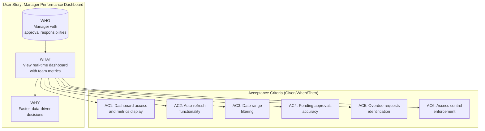
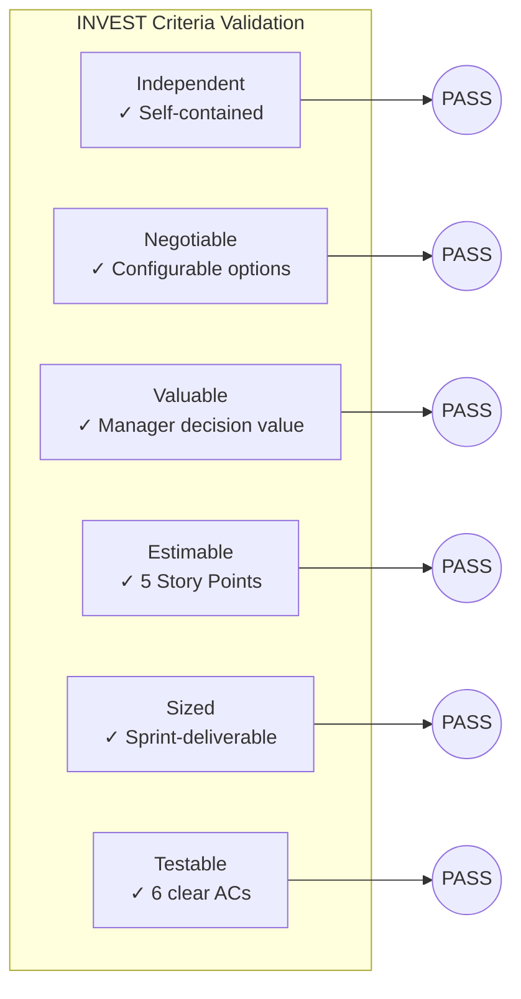
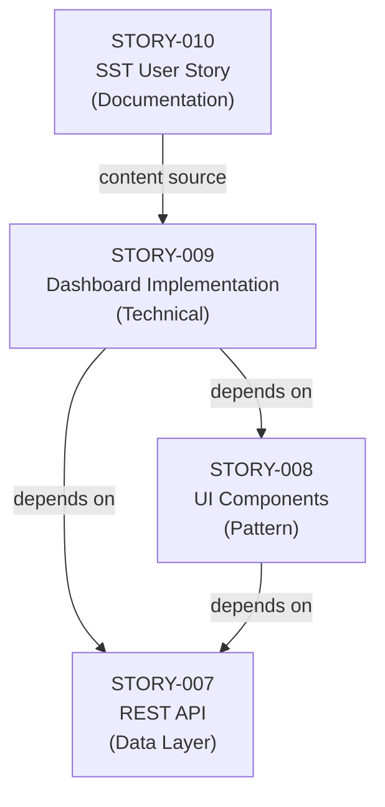

# Technical Specification

# 0. Agent Action Plan

## 0.1 Intent Clarification

### 0.1.1 Core Documentation Objective

Based on the provided requirements, the Blitzy platform understands that the documentation objective is to **create a new User Story** following the SST (State Street) User Story Template format that captures the business requirement: *"Enable managers to make faster decisions by providing real-time dashboard views of team performance metrics."*

| Attribute | Value |
|-----------|-------|
| Documentation Category | Create new documentation |
| Documentation Type | User Story (Requirements Specification) |
| Target Audience | Product Owners, Scrum Masters, Development Team, Business Stakeholders |
| Format Standard | SST User Story Guide Template |
| Business Objective | Manager decision-making acceleration through real-time performance dashboards |

**Explicit Documentation Requirements:**
- Create a User Story following the "Who, What, Why" format (As a / I want / So that)
- Include Acceptance Criteria using "Given / When / Then" syntax
- Adhere to INVEST criteria (Independent, Negotiable, Valuable, Estimable, Sized appropriately, Testable)
- Ensure the story is "Demo-able" for Product Owner acceptance
- Maximum 255 characters for the Summary field

**Implicit Documentation Needs Identified:**
- The User Story must align with existing WebVella ERP Approval Workflow System architecture
- Story should reference existing F-009 feature from the technical specification
- Must integrate with the established jira-stories documentation pattern in the repository
- Should be exportable to JSON/CSV formats for Jira import compatibility

### 0.1.2 Special Instructions and Constraints

**USER PROVIDED TEMPLATE (from SST User Story Guide.pdf):**

```
Summary: [Maximum 255 Characters]

Description:
As a < named user or role >, (WHO)
I want < some goal >, (WHAT)
so that < some reason >, (WHY)

Acceptance Criteria:
- Given < a scenario >
  When < a criteria is met >
  Then < the expected result >
```

**Template Quality Criteria (from SST Guide):**

| Criterion | Description |
|-----------|-------------|
| Independent | Story should be self-contained with no inherent dependency on another user story |
| Negotiable | Can always be changed or rewritten until part of an iteration |
| Valuable | Must deliver value to the end user and/or customer |
| Estimable | Team must be able to estimate the size |
| Sized appropriately | Not so big that planning becomes impossible |
| Testable | Provides necessary information for test development |
| Demo-able | Work item must be able to be demonstrated |

**Acceptance Criteria Effectiveness Standards (from SST Guide):**

| Standard | Requirement |
|----------|-------------|
| Clarity | Straightforward and easy to understand for all team members |
| Conciseness | Communicates necessary information without unnecessary detail |
| Testability | Each criterion must be independently verifiable (clear pass/fail) |
| Result-Oriented | Focus on delivering results that satisfy the customer |

**Style Preferences:**
- Use consistent "Given/When/Then" syntax for all acceptance criteria
- Include measurable outcomes where possible
- Reference specific metrics (pending count, processing time, approval rate, overdue count)
- Maintain alignment with existing STORY-009 technical implementation details

### 0.1.3 Technical Interpretation

These documentation requirements translate to the following technical documentation strategy:

| Requirement | Documentation Action |
|-------------|---------------------|
| Manager decision-making acceleration | Document user role as "Manager with approval responsibilities" |
| Real-time dashboard views | Specify auto-refresh capability with configurable interval (default 60 seconds) |
| Team performance metrics | Detail five KPIs: pending approvals, average processing time, approval rate, overdue requests, recent activity |
| Faster decisions | Include date range filtering for historical analysis capability |

To document this feature, we will **create** a User Story file at `jira-stories/STORY-010-manager-performance-dashboard.md` following the established pattern from existing stories in the repository.

### 0.1.4 Inferred Documentation Needs

Based on repository analysis and the business objective:

| Analysis Source | Inferred Documentation Need |
|-----------------|----------------------------|
| Existing STORY-009 | User Story must reference or align with existing dashboard metrics implementation |
| jira-stories/stories-export.json | Story should be formatted for inclusion in JSON export structure |
| SST User Story Guide | Must include Story Estimation section using Fibonacci story points |
| WebVella ERP architecture | Should reference PageComponent pattern and SecurityContext role validation |
| Approval Workflow System initiative | Story contributes to total initiative scope (currently 52 story points) |

**User Story Structural Requirements Derived:**
- Summary limited to 255 characters
- Description follows strict "As a/I want/So that" format
- Acceptance criteria use "Given/When/Then" format with checkbox markers `- [ ]`
- Story points using Fibonacci sequence (1, 2, 3, 5, 8, 13, etc.)
- Labels for categorization (dashboard, metrics, ui, manager)
- Dependencies section linking to prerequisite stories

## 0.2 Documentation Discovery and Analysis

### 0.2.1 Existing Documentation Infrastructure Assessment

Repository analysis reveals a **well-structured documentation ecosystem** with established patterns for User Story documentation and technical specifications.

**Documentation Structure Discovered:**

| Location | Type | Purpose |
|----------|------|---------|
| `jira-stories/` | Markdown + JSON/CSV | User Story specifications with export formats |
| `docs/` | Markdown | Developer-facing technical documentation |
| `README.md` | Markdown | Repository landing page and overview |
| `LIBRARIES.md` | Markdown | Third-party library attribution (placeholder) |
| `LICENSE.txt` | Text | Apache 2.0 license documentation |

**User Story Documentation Pattern Analysis:**

| Component | Standard Format |
|-----------|----------------|
| File naming | `STORY-{NNN}-{kebab-case-title}.md` |
| Exports | `stories-export.csv` and `stories-export.json` |
| Structure | Description → Business Value → Acceptance Criteria → Technical Implementation Details |
| Metadata | Story ID, Title, Dependencies, Story Points, Labels |

**Current Documentation Framework:**

| Tool/Pattern | Version/Status | Location |
|--------------|----------------|----------|
| Markdown documentation | Active | `jira-stories/*.md`, `docs/**/*.md` |
| JSON export format | v1.0.0 | `jira-stories/stories-export.json` |
| CSV export format | Active | `jira-stories/stories-export.csv` |
| No formal doc generator | N/A | Documentation is static Markdown |

### 0.2.2 Repository Code Analysis for Documentation

**Search Patterns Employed:**

| Pattern | Files Found | Relevance |
|---------|-------------|-----------|
| `jira-stories/STORY-*.md` | 9 files (STORY-001 through STORY-009) | High - Story template reference |
| `jira-stories/stories-export.*` | 2 files (JSON, CSV) | High - Export format reference |
| `docs/**/*.md` | Multiple files | Medium - Technical documentation style |
| `README.md` | 1 file | Low - Project overview only |

**Existing Related Documentation Examined:**

| File | Summary | Relevance to Task |
|------|---------|-------------------|
| `jira-stories/STORY-009-manager-dashboard-metrics.md` | Complete User Story for Manager Approval Dashboard with Real-Time Metrics | **Critical** - Directly addresses the business objective; may serve as reference or indicate documentation already exists |
| `jira-stories/stories-export.json` | Machine-readable story database with metadata structure | High - Defines JSON schema for story export |
| `jira-stories/STORY-008-approval-ui-components.md` | UI Page Components User Story | Medium - Related UI component documentation pattern |
| `jira-stories/STORY-007-approval-rest-api.md` | REST API Endpoints User Story | Medium - API documentation pattern |

**Key Finding:** The business objective *"Enable managers to make faster decisions by providing real-time dashboard views of team performance metrics"* is **already documented** as STORY-009 in the existing repository. The SST-formatted User Story will be a reformatted version of this existing content following the SST template structure.

### 0.2.3 Web Search Research Conducted

**Best Practices for User Story Writing:**
- User stories should follow the INVEST criteria for effectiveness
- Given/When/Then format (Behavior-Driven Development) is industry standard for acceptance criteria
- Story sizing using Fibonacci sequence enables relative estimation
- Stories should be decomposable into sub-tasks owned by individual team members

**Documentation Structure Conventions:**
- Hierarchical structure with Epics containing Stories containing Sub-tasks
- Stories are owned by Team, sub-tasks by individuals
- Product Owner (Role) transitions stories to Done in SCRUM/KANBAN

**Key Terminology Standards (from SST Guide):**
- **Summary**: Maximum 255 characters describing the story
- **Description**: "Who, What, Why" format using As a/I want/So that
- **Acceptance Criteria**: Conditions using Given/When/Then syntax
- **Story Points**: Fibonacci sequence (1, 2, 3, 5, 8, 13, 20, 40) for relative sizing

### 0.2.4 Documentation Gap Analysis

| Documentation Aspect | Current Status | Gap Identified |
|---------------------|----------------|----------------|
| Technical User Story (STORY-009) | Complete | None - exists in jira-stories/ |
| SST-Formatted User Story | Missing | **Primary gap** - needs SST template format |
| JSON Export Entry | Complete | None - exists in stories-export.json |
| CSV Export Entry | Complete | None - exists in stories-export.csv |
| Technical Specification | Complete | None - F-009 documented in tech spec |

**Primary Documentation Gap:** While comprehensive technical documentation exists for this feature (STORY-009), the user's requirement is to **generate a User Story in SST format** that may be used for Jira import or stakeholder communication. This requires reformatting the existing content to match the SST User Story Template structure.

## 0.3 Documentation Scope Analysis

### 0.3.1 Code-to-Documentation Mapping

**Modules Informing Documentation:**

| Module | Source Location | Documentation Purpose |
|--------|-----------------|----------------------|
| PcApprovalDashboard Component | `WebVella.Erp.Plugins.Approval/Components/PcApprovalDashboard/` | UI component delivering dashboard views |
| DashboardMetricsService | `WebVella.Erp.Plugins.Approval/Services/DashboardMetricsService.cs` | Service calculating performance metrics |
| DashboardMetricsModel | `WebVella.Erp.Plugins.Approval/Api/DashboardMetricsModel.cs` | DTO for metrics response structure |
| ApprovalController | `WebVella.Erp.Plugins.Approval/Controllers/ApprovalController.cs` | REST endpoint for dashboard metrics |

**Feature Mapping to User Story Elements:**

| Technical Feature | User Story "What" Translation |
|-------------------|------------------------------|
| PcApprovalDashboard PageComponent | View a real-time dashboard |
| Auto-refresh (60-second default) | Real-time metrics updates without page reload |
| Date range filtering (7d/30d/90d) | Historical analysis capability |
| Manager role validation | Role-based access control |
| Five KPI metrics | Pending approvals, avg time, approval rate, overdue count, recent activity |

### 0.3.2 User Story Content Mapping

**WHO (User Role):**

| Role Identifier | Description | Source |
|-----------------|-------------|--------|
| Manager | User with Manager role in WebVella ERP | STORY-009, SecurityContext role validation |
| Approval Responsibilities | Manager authorized to approve requests in workflow | PcApprovalDashboard.IsManagerRole() method |

**WHAT (Goal/Capability):**

| Capability | Description | Technical Implementation |
|------------|-------------|-------------------------|
| Real-time dashboard | View current approval metrics | PcApprovalDashboard Display.cshtml |
| Team performance metrics | Five KPIs calculated from approval entities | DashboardMetricsService |
| Auto-refresh | Configurable refresh interval (default 60s) | service.js with setInterval() |
| Date range filtering | Historical analysis (7d/30d/90d/custom) | API query parameters from/to |

**WHY (Business Value):**

| Business Value | Benefit |
|----------------|---------|
| Faster decisions | Consolidated metrics eliminate multi-source data gathering |
| Proactive bottleneck identification | Real-time visibility into overdue requests and processing times |
| Resource planning | Pending approval counts inform workload distribution |
| SLA compliance | Overdue request tracking maintains approval policy adherence |

### 0.3.3 Acceptance Criteria Derivation

**AC1: Dashboard Access and Display**

| Element | Value |
|---------|-------|
| Given | I am logged in as a user with Manager role |
| When | I navigate to the Approvals Dashboard page |
| Then | I see a dashboard displaying my team's approval metrics (5 KPIs) |

**AC2: Auto-Refresh Functionality**

| Element | Value |
|---------|-------|
| Given | The dashboard is displayed |
| When | 60 seconds have elapsed (configurable interval) |
| Then | Metrics automatically refresh without page reload |

**AC3: Date Range Filtering**

| Element | Value |
|---------|-------|
| Given | I am viewing the dashboard |
| When | I select a date range filter (7 days, 30 days, 90 days, or custom) |
| Then | Metrics update to reflect only the selected time period |

**AC4: Pending Approvals Accuracy**

| Element | Value |
|---------|-------|
| Given | I have pending approval requests where I am an authorized approver |
| When | I view the Pending Approvals metric |
| Then | The count accurately reflects requests awaiting my action |

**AC5: Overdue Requests Identification**

| Element | Value |
|---------|-------|
| Given | Approval requests exceed their configured timeout (timeout_hours) |
| When | I view the Overdue Requests metric |
| Then | The count accurately identifies requests past their SLA |

**AC6: Access Control Enforcement**

| Element | Value |
|---------|-------|
| Given | I am a user without Manager role |
| When | I attempt to access the dashboard |
| Then | I receive an access denied message and am not shown metrics |

### 0.3.4 Story Estimation Analysis

**Effort Factors:**

| Factor | Assessment |
|--------|------------|
| Complexity | Medium - Established component patterns exist |
| Uncertainty | Low - Clear requirements and technical approach |
| Effort | Medium - 9 files to create, service layer, API endpoint |

**Comparable Stories for Relative Sizing:**

| Story | Points | Complexity Comparison |
|-------|--------|----------------------|
| STORY-007 (REST API) | 5 | Similar scope - API endpoints |
| STORY-008 (UI Components) | 8 | Higher - 4 components vs 1 |
| STORY-003 (Config Services) | 5 | Similar - Service layer work |

**Recommended Story Points: 5**

Rationale: Single dashboard component following established patterns, one service class, one DTO, one API endpoint addition. Testing includes role validation and date filtering.

## 0.4 Documentation Implementation Design

### 0.4.1 Documentation Structure Planning

**Target User Story Document Structure:**

```
jira-stories/
├── STORY-010-manager-performance-dashboard-sst.md  (NEW - SST Format)
├── STORY-009-manager-dashboard-metrics.md           (REFERENCE - Existing)
├── stories-export.json                              (UPDATE - Add STORY-010)
├── stories-export.csv                               (UPDATE - Add STORY-010)
└── [existing STORY-001 through STORY-008]
```

**SST User Story Document Structure:**

```
# STORY-010: Manager Performance Dashboard (SST Format)

#### Summary

[Maximum 255 characters]

#### User Story Description

As a [WHO]
I want [WHAT]
so that [WHY]

#### Acceptance Criteria

- [ ] AC1: Given... When... Then...
- [ ] AC2: Given... When... Then...
[...]

#### Story Estimation

[Story Points with rationale]

#### Labels

[Categorization tags]

#### Additional Notes

[References, INVEST validation, testing considerations]
```

### 0.4.2 Content Generation Strategy

**Information Extraction Approach:**

| Source | Information to Extract | Target Section |
|--------|----------------------|----------------|
| Business objective input | Core requirement statement | Summary, Description |
| SST User Story Guide.pdf | Template structure, quality criteria | Document format |
| STORY-009 file | Technical details, acceptance criteria | AC, Technical Notes |
| stories-export.json | Metadata format (id, title, labels, points) | JSON export update |

**Template Application:**

| SST Template Section | Content Source | Transformation |
|---------------------|----------------|----------------|
| Summary | Business objective | Condense to ≤255 characters |
| WHO | STORY-009 description | Extract "Manager with approval responsibilities" |
| WHAT | STORY-009 description | Extract dashboard capability statement |
| WHY | STORY-009 business value | Extract decision-making benefit |
| Acceptance Criteria | STORY-009 acceptance criteria | Convert to Given/When/Then checkboxes |
| Story Points | STORY-009 effort estimate | Preserve 5-point estimate |

**Documentation Standards Applied:**

| Standard | Implementation |
|----------|---------------|
| Markdown formatting | Headers with `#`, `##`, `###` |
| Checkbox acceptance criteria | `- [ ] **AC1**:` format |
| Given/When/Then syntax | `Given X, When Y, Then Z` |
| INVEST criteria validation | Include validation table |
| Demo-ability statement | "Dashboard with live metrics can be demonstrated" |

### 0.4.3 User Story Content Specification

**Summary (≤255 characters):**
```
Manager Performance Dashboard: Real-time approval workflow metrics enabling data-driven decisions through consolidated KPI views with auto-refresh and date filtering.
```
(Character count: 168)

**User Story Description (WHO/WHAT/WHY):**

```
As a Manager with approval responsibilities,
I want to view a real-time dashboard displaying my team's approval workflow metrics,
so that I can make faster, data-driven decisions about resource allocation and identify processing bottlenecks.
```

**Acceptance Criteria (Given/When/Then):**

```
- [ ] **AC1**: Given I am logged in as a user with Manager role, When I navigate to the Approvals Dashboard page, Then I see a dashboard displaying my team's approval metrics including Pending Approvals Count, Average Approval Time, Approval Rate, Overdue Requests, and Recent Activity

- [ ] **AC2**: Given the dashboard is displayed, When 60 seconds have elapsed, Then the metrics automatically refresh without requiring page reload and the display updates to reflect current data

- [ ] **AC3**: Given I am viewing the dashboard, When I select a date range filter (7 days, 30 days, 90 days, or custom range), Then the metrics update to reflect only the selected time period

- [ ] **AC4**: Given I have pending approval requests in queue where I am an authorized approver, When I view the Pending Approvals metric, Then the count accurately reflects requests awaiting my action

- [ ] **AC5**: Given approval requests exceed their configured timeout from the associated approval step, When I view the Overdue Requests metric, Then the count accurately identifies requests past their SLA

- [ ] **AC6**: Given I am a user without Manager role, When I attempt to access the dashboard, Then I receive an access denied message and am not shown the dashboard metrics
```

### 0.4.4 Diagram and Visual Strategy

**User Story Flow Diagram:**



**INVEST Criteria Validation Diagram:**



## 0.5 Documentation File Transformation Mapping

### 0.5.1 File-by-File Documentation Plan

| Target Documentation File | Transformation | Source Code/Docs | Content/Changes |
|---------------------------|----------------|------------------|-----------------|
| `jira-stories/STORY-010-manager-performance-dashboard-sst.md` | CREATE | SST User Story Guide.pdf, STORY-009 | Complete User Story in SST format with Summary, WHO/WHAT/WHY description, Given/When/Then acceptance criteria, story points, and INVEST validation |
| `jira-stories/stories-export.json` | UPDATE | stories-export.json | Add STORY-010 entry to stories array with id, title, description, businessValue, acceptanceCriteria, technicalDetails, dependencies, storyPoints, labels |
| `jira-stories/stories-export.csv` | UPDATE | stories-export.csv | Add STORY-010 row with all columns matching existing format |
| `jira-stories/STORY-009-manager-dashboard-metrics.md` | REFERENCE | N/A | Use as source for technical details, acceptance criteria, and business value content |
| `docs/developer/` | NO CHANGE | N/A | Developer documentation not affected by User Story creation |

### 0.5.2 New Documentation File Detail

**File: `jira-stories/STORY-010-manager-performance-dashboard-sst.md`**

| Attribute | Value |
|-----------|-------|
| Type | User Story (SST Format) |
| Source | SST User Story Guide.pdf template, STORY-009 content |
| Format | Markdown with checkboxes |

**Sections to Include:**

| Section | Content Description |
|---------|---------------------|
| Summary | ≤255 character summary of dashboard feature |
| User Story Description | WHO: Manager with approval responsibilities |
| | WHAT: View real-time dashboard with team metrics |
| | WHY: Faster, data-driven decisions |
| Acceptance Criteria | 6 criteria using Given/When/Then format with `- [ ]` checkboxes |
| Story Estimation | 5 Story Points with rationale (effort, complexity, uncertainty) |
| Labels | `dashboard`, `metrics`, `ui`, `manager`, `approval`, `real-time` |
| INVEST Validation | Table showing pass/fail for each criterion |
| Testing Considerations | List of verification points |
| Dependencies | Reference to STORY-007 (REST API), STORY-008 (UI Components) |

**Key Citations:**
- `jira-stories/STORY-009-manager-dashboard-metrics.md` - Source content
- SST User Story Guide.pdf - Template structure
- `jira-stories/stories-export.json` - Metadata format

### 0.5.3 Documentation Files to Update Detail

**File: `jira-stories/stories-export.json`**

| Update Type | Description |
|-------------|-------------|
| Array Addition | Add STORY-010 object to `stories` array |
| Metadata Update | Update `metadata.totalStories` from 9 to 10 |
| Metadata Update | Update `metadata.totalStoryPoints` from 52 to 57 |

**New JSON Entry Structure:**

```json
{
  "id": "STORY-010",
  "title": "Manager Performance Dashboard (SST Format)",
  "description": "As a Manager with approval responsibilities, I want to view a real-time dashboard...",
  "businessValue": "Enables faster decision-making through consolidated metrics view...",
  "acceptanceCriteria": [
    "Given I am logged in as Manager, When I navigate to dashboard, Then I see 5 KPIs",
    "Given dashboard displayed, When 60 seconds elapsed, Then metrics auto-refresh",
    "Given viewing dashboard, When I select date range, Then metrics update",
    "Given pending requests exist, When I view Pending count, Then count is accurate",
    "Given requests exceed timeout, When I view Overdue count, Then count is accurate",
    "Given no Manager role, When I access dashboard, Then access denied"
  ],
  "technicalDetails": {
    "files": ["jira-stories/STORY-010-manager-performance-dashboard-sst.md"],
    "classes": [],
    "integrationPoints": ["STORY-009 implementation"],
    "technicalApproach": "SST-formatted documentation of STORY-009 feature"
  },
  "dependencies": [
    {"storyId": "STORY-009", "description": "Technical implementation reference"}
  ],
  "storyPoints": 5,
  "labels": ["dashboard", "metrics", "ui", "manager", "approval", "documentation", "sst-format"]
}
```

**File: `jira-stories/stories-export.csv`**

| Column | STORY-010 Value |
|--------|-----------------|
| id | STORY-010 |
| title | Manager Performance Dashboard (SST Format) |
| description | As a Manager with approval responsibilities... |
| businessValue | Enables faster decision-making... |
| acceptanceCriteria | [6 criteria] |
| storyPoints | 5 |
| labels | dashboard,metrics,ui,manager,approval,documentation |

### 0.5.4 Documentation Configuration Updates

| Configuration File | Update Required | Change Description |
|-------------------|-----------------|-------------------|
| N/A | No config files | Documentation is static Markdown; no build configuration needed |

### 0.5.5 Cross-Documentation Dependencies

**Navigation Links:**

| From Document | To Document | Link Type |
|---------------|-------------|-----------|
| STORY-010 | STORY-009 | Reference - Technical implementation details |
| STORY-010 | STORY-007 | Dependency - REST API endpoints |
| STORY-010 | STORY-008 | Dependency - UI component patterns |
| stories-export.json | STORY-010 | Metadata entry |
| stories-export.csv | STORY-010 | Export row |

**Shared Content:**

| Content Element | Source | Consumers |
|-----------------|--------|-----------|
| Acceptance Criteria text | STORY-010 | stories-export.json, stories-export.csv |
| Story Points estimate | STORY-010 | stories-export.json (totalStoryPoints calculation) |
| Business Value statement | STORY-010 | stories-export.json businessValue field |

### 0.5.6 Complete File Inventory

| File Path | Action | Priority |
|-----------|--------|----------|
| `jira-stories/STORY-010-manager-performance-dashboard-sst.md` | CREATE | High |
| `jira-stories/stories-export.json` | UPDATE | Medium |
| `jira-stories/stories-export.csv` | UPDATE | Medium |

**No additional documentation files pending discovery.** All documentation deliverables are explicitly enumerated above.

## 0.6 Dependency Inventory

### 0.6.1 Documentation Dependencies

**Documentation Tools and Packages:**

| Registry | Package Name | Version | Purpose |
|----------|--------------|---------|---------|
| N/A | Markdown | Native | User Story document format |
| N/A | JSON | Native | Export format for Jira import |
| N/A | CSV | Native | Export format for spreadsheet compatibility |
| N/A | Mermaid | Native | Diagram generation in Markdown |

**Note:** This documentation task does not require external documentation generators. All documentation is written as static Markdown files following the repository's established patterns. No build tools (mkdocs, Sphinx, Docusaurus) are configured or required.

### 0.6.2 Document Source Dependencies

**Source Documents Required:**

| Document | Type | Purpose | Location |
|----------|------|---------|----------|
| SST User Story Guide.pdf | PDF (Attachment) | Template structure and quality criteria | `/tmp/environments_files/` |
| STORY-009-manager-dashboard-metrics.md | Markdown | Technical content source | `jira-stories/` |
| stories-export.json | JSON | Metadata schema reference | `jira-stories/` |
| stories-export.csv | CSV | Export format reference | `jira-stories/` |

### 0.6.3 Story Dependencies

**STORY-010 Dependencies:**

| Story ID | Dependency Type | Description |
|----------|-----------------|-------------|
| STORY-009 | Content Reference | Technical implementation details, acceptance criteria, business value |
| STORY-007 | Architectural Dependency | REST API endpoints consumed by dashboard (inherited from STORY-009) |
| STORY-008 | Architectural Dependency | UI PageComponent patterns (inherited from STORY-009) |

**Dependency Chain Visualization:**



### 0.6.4 Documentation Reference Updates

**Link Updates Required:**

| Transformation | Old Reference | New Reference | Apply To |
|----------------|---------------|---------------|----------|
| JSON metadata update | `totalStories: 9` | `totalStories: 10` | stories-export.json |
| JSON metadata update | `totalStoryPoints: 52` | `totalStoryPoints: 57` | stories-export.json |
| Array addition | N/A | STORY-010 object | stories-export.json stories[] |
| Row addition | N/A | STORY-010 row | stories-export.csv |

### 0.6.5 Template Dependencies

**SST User Story Template Elements (from PDF):**

| Template Element | Required | Source |
|------------------|----------|--------|
| Summary (≤255 chars) | Yes | SST Guide p.1 |
| WHO (As a...) | Yes | SST Guide p.2 |
| WHAT (I want...) | Yes | SST Guide p.2 |
| WHY (so that...) | Yes | SST Guide p.2 |
| Given/When/Then ACs | Yes | SST Guide p.2-3 |
| INVEST validation | Recommended | SST Guide p.2 |
| Story estimation | Recommended | SST Guide p.4-5 |

**Template Quality Criteria Dependencies:**

| Criterion | Validation Requirement | Source |
|-----------|----------------------|--------|
| Independent | Self-contained, no inherent dependency | SST Guide p.2 |
| Negotiable | Can be changed until in iteration | SST Guide p.2 |
| Valuable | Delivers value to end user | SST Guide p.2 |
| Estimable | Size can be estimated | SST Guide p.2 |
| Sized appropriately | Plannable with certainty | SST Guide p.2 |
| Testable | Information for test development | SST Guide p.2 |
| Demo-able | Can be demonstrated to Product Owner | SST Guide p.2 |

## 0.7 Coverage and Quality Targets

### 0.7.1 Documentation Coverage Metrics

**Current Coverage Analysis:**

| Documentation Aspect | Current Status | Target | Gap |
|---------------------|----------------|--------|-----|
| Technical User Stories (jira-stories/) | 9/9 (100%) | 10/10 | 1 story (STORY-010 SST format) |
| SST-Formatted User Stories | 0/1 (0%) | 1/1 | 1 story to create |
| JSON Export Entries | 9/9 (100%) | 10/10 | 1 entry to add |
| CSV Export Entries | 9/9 (100%) | 10/10 | 1 entry to add |

**Target Coverage: 100%**

All documentation deliverables must be created to achieve complete coverage of the manager performance dashboard user story in SST format.

### 0.7.2 Documentation Quality Criteria

**Completeness Requirements:**

| Requirement | Validation Method |
|-------------|-------------------|
| Summary ≤255 characters | Character count validation |
| WHO/WHAT/WHY all present | Section completeness check |
| All 6 acceptance criteria included | Count verification |
| Each AC uses Given/When/Then format | Syntax validation |
| Story points included with rationale | Section presence check |
| INVEST criteria validated | Validation table present |
| Labels included | Non-empty labels section |

**Accuracy Validation:**

| Element | Accuracy Check |
|---------|----------------|
| Summary | Accurately reflects business objective |
| WHO | Matches actual user role (Manager) |
| WHAT | Describes dashboard functionality correctly |
| WHY | States valid business value |
| Acceptance Criteria | Testable, measurable conditions |
| Story Points | Consistent with comparable stories |

**Clarity Standards:**

| Standard | Implementation |
|----------|---------------|
| Technical accuracy | Terms match WebVella ERP terminology |
| Accessible language | Understandable by non-technical stakeholders |
| Progressive disclosure | Overview before details |
| Consistent terminology | "Manager", "dashboard", "metrics" used consistently |

**Maintainability:**

| Aspect | Implementation |
|--------|---------------|
| Source citations | Reference STORY-009 for technical details |
| Clear ownership | Story assigned to Team |
| Update dates | Include generation timestamp |
| Template-based | Follow SST structure exactly |

### 0.7.3 Acceptance Criteria Quality Standards

**AC Effectiveness Metrics (per SST Guide):**

| Criterion | Requirement | Validation |
|-----------|-------------|------------|
| Clarity | Straightforward and easy to understand | Review by non-technical reader |
| Conciseness | No unnecessary detail | Minimum words for complete meaning |
| Testability | Clear pass/fail determination | Each AC has verifiable outcome |
| Result-Oriented | Focus on customer value | Business benefit visible in each AC |

**AC Quality Checklist:**

| AC# | Given (Scenario) | When (Trigger) | Then (Expected Result) | Testable? |
|-----|------------------|----------------|------------------------|-----------|
| AC1 | Manager role logged in | Navigate to dashboard | See 5 KPIs | ✓ Yes |
| AC2 | Dashboard displayed | 60 seconds elapsed | Auto-refresh occurs | ✓ Yes |
| AC3 | Viewing dashboard | Select date range | Metrics update | ✓ Yes |
| AC4 | Pending requests exist | View Pending count | Accurate count | ✓ Yes |
| AC5 | Requests past timeout | View Overdue count | Accurate count | ✓ Yes |
| AC6 | Non-Manager user | Access dashboard | Access denied | ✓ Yes |

### 0.7.4 INVEST Criteria Validation Targets

| Criterion | Target | Validation Evidence |
|-----------|--------|---------------------|
| **Independent** | ✓ Pass | Self-contained story; no blocking dependencies on undelivered features |
| **Negotiable** | ✓ Pass | Refresh interval, date ranges, and metric selection are configurable options |
| **Valuable** | ✓ Pass | Directly addresses manager decision-making business objective |
| **Estimable** | ✓ Pass | 5 story points based on comparable story analysis |
| **Sized** | ✓ Pass | Single dashboard view deliverable within one sprint |
| **Testable** | ✓ Pass | All 6 acceptance criteria have clear pass/fail conditions |

**Demo-ability Target:** Dashboard with live metrics can be demonstrated to Product Owner showing all 5 KPIs updating in real-time.

### 0.7.5 Example and Diagram Requirements

| Requirement | Quantity | Purpose |
|-------------|----------|---------|
| User Story flow diagram | 1 | Visualize WHO/WHAT/WHY structure |
| INVEST validation diagram | 1 | Show criteria pass/fail status |
| Dependency chain diagram | 1 | Show story relationships |

**Visual Content Quality Standards:**
- Mermaid diagrams use `flowchart` or `graph` syntax
- Diagrams are self-explanatory with labels
- Color coding for pass/fail status where applicable

## 0.8 Scope Boundaries

### 0.8.1 Exhaustively In Scope

**New Documentation Files:**

| File Pattern | Purpose |
|--------------|---------|
| `jira-stories/STORY-010-manager-performance-dashboard-sst.md` | SST-formatted User Story document |

**Documentation File Updates:**

| File Pattern | Update Type |
|--------------|-------------|
| `jira-stories/stories-export.json` | Add STORY-010 entry, update metadata counts |
| `jira-stories/stories-export.csv` | Add STORY-010 row |

**Documentation Content In Scope:**

| Content Element | Included |
|-----------------|----------|
| Summary (≤255 characters) | ✓ |
| WHO/WHAT/WHY description | ✓ |
| Given/When/Then acceptance criteria | ✓ |
| Story points estimation | ✓ |
| INVEST criteria validation | ✓ |
| Labels/categorization | ✓ |
| Dependencies section | ✓ |
| Testing considerations | ✓ |

**Reference Documentation:**

| Reference | Purpose |
|-----------|---------|
| SST User Story Guide.pdf | Template structure compliance |
| STORY-009-manager-dashboard-metrics.md | Technical content source |
| stories-export.json | Export schema reference |

### 0.8.2 Explicitly Out of Scope

**Source Code Modifications:**

| Exclusion | Reason |
|-----------|--------|
| `WebVella.Erp.Plugins.Approval/**/*.cs` | Documentation task only; no code changes |
| `WebVella.Erp.Plugins.Approval/**/*.cshtml` | Documentation task only; no view changes |
| `WebVella.Erp.Plugins.Approval/**/*.js` | Documentation task only; no script changes |

**Test File Modifications:**

| Exclusion | Reason |
|-----------|--------|
| Test files | No test documentation requested |
| Test plans | Outside User Story scope |

**Feature Additions:**

| Exclusion | Reason |
|-----------|--------|
| New dashboard functionality | Story documents existing STORY-009 feature |
| Additional KPIs | Not requested in business objective |
| Code refactoring | Documentation only |

**Other Documentation:**

| Exclusion | Reason |
|-----------|--------|
| `docs/developer/**/*.md` | Developer docs not affected |
| `README.md` | Project readme not affected |
| API documentation | Covered in STORY-007 |
| Architecture documentation | Covered in tech spec |

**Explicitly Excluded by User:**

| Exclusion | Source |
|-----------|--------|
| None specified | User did not specify exclusions |

### 0.8.3 Boundary Conditions

**Conditional Inclusions:**

| Condition | Include If True | Exclude If False |
|-----------|-----------------|------------------|
| stories-export.json exists | UPDATE file | CREATE new file |
| stories-export.csv exists | UPDATE file | CREATE new file |
| STORY-010 already exists | UPDATE existing | CREATE new file |

**Boundary Decisions:**

| Decision Point | Resolution |
|----------------|------------|
| STORY-009 relationship | Reference only; do not modify STORY-009 |
| Export file format changes | Add entry only; do not modify schema |
| Metadata calculations | Update totalStories and totalStoryPoints only |

### 0.8.4 Scope Validation Checklist

| Scope Item | In Scope | Out of Scope | Validation |
|------------|----------|--------------|------------|
| Create STORY-010 markdown | ✓ | | Required deliverable |
| Update stories-export.json | ✓ | | Required for consistency |
| Update stories-export.csv | ✓ | | Required for consistency |
| Modify STORY-009 | | ✓ | Reference only |
| Create new C# files | | ✓ | Documentation task |
| Modify existing C# files | | ✓ | Documentation task |
| Update developer docs | | ✓ | Not requested |
| Create test documentation | | ✓ | Not requested |

## 0.9 Execution Parameters

### 0.9.1 Documentation-Specific Instructions

**Documentation Format:**

| Parameter | Value |
|-----------|-------|
| Primary format | Markdown (.md) |
| Diagram tool | Mermaid (embedded in Markdown) |
| Checkbox syntax | `- [ ]` for incomplete, `- [x]` for complete |
| Code block syntax | Triple backticks with language identifier |

**Documentation Build Commands:**

| Command | Purpose | Notes |
|---------|---------|-------|
| N/A | No build required | Static Markdown documentation |

**Documentation Preview Commands:**

| Command | Purpose |
|---------|---------|
| Any Markdown viewer | Preview .md files locally |
| GitHub/GitLab preview | Preview when pushed to repository |
| VS Code Markdown Preview | Local development preview |

**Documentation Validation:**

| Validation | Command/Method |
|------------|----------------|
| Markdown linting | Visual inspection or markdownlint |
| Link checking | Manual verification of references |
| JSON validation | `python -m json.tool stories-export.json` |
| CSV validation | Open in spreadsheet application |
| Character count | `wc -c` or text editor word count |

### 0.9.2 File Creation Instructions

**STORY-010-manager-performance-dashboard-sst.md:**

```bash
# Create the User Story file

cat > jira-stories/STORY-010-manager-performance-dashboard-sst.md << 'EOF'
# STORY-010: Manager Performance Dashboard (SST Format)

#### Summary

Manager Performance Dashboard: Real-time approval workflow metrics enabling data-driven decisions through consolidated KPI views with auto-refresh and date filtering.

#### User Story Description

**As a** Manager with approval responsibilities,
**I want** to view a real-time dashboard displaying my team's approval workflow metrics,
**so that** I can make faster, data-driven decisions about resource allocation and identify processing bottlenecks.

#### Acceptance Criteria

- [ ] **AC1**: Given I am logged in as a user with Manager role, When I navigate to the Approvals Dashboard page, Then I see a dashboard displaying my team's approval metrics including Pending Approvals Count, Average Approval Time, Approval Rate, Overdue Requests, and Recent Activity

- [ ] **AC2**: Given the dashboard is displayed, When 60 seconds have elapsed, Then the metrics automatically refresh without requiring page reload and the display updates to reflect current data

- [ ] **AC3**: Given I am viewing the dashboard, When I select a date range filter (7 days, 30 days, 90 days, or custom range), Then the metrics update to reflect only the selected time period

- [ ] **AC4**: Given I have pending approval requests in queue where I am an authorized approver, When I view the Pending Approvals metric, Then the count accurately reflects requests awaiting my action

- [ ] **AC5**: Given approval requests exceed their configured timeout from the associated approval step, When I view the Overdue Requests metric, Then the count accurately identifies requests past their SLA

- [ ] **AC6**: Given I am a user without Manager role, When I attempt to access the dashboard, Then I receive an access denied message and am not shown the dashboard metrics

#### Story Estimation

**5 Story Points** (Fibonacci)

| Factor | Assessment |
|--------|------------|
| Effort | Medium - Single dashboard component with established patterns |
| Complexity | Medium - Service layer with entity queries |
| Uncertainty | Low - Clear requirements from STORY-009 |

#### INVEST Criteria Validation

| Criterion | Status | Evidence |
|-----------|--------|----------|
| Independent | ✓ Pass | Self-contained; builds on completed STORY-007/008 |
| Negotiable | ✓ Pass | Configurable refresh interval, date ranges, metrics |
| Valuable | ✓ Pass | Addresses manager decision-making objective |
| Estimable | ✓ Pass | 5 points based on comparable stories |
| Sized | ✓ Pass | Single sprint deliverable |
| Testable | ✓ Pass | 6 clear Given/When/Then criteria |

#### Labels

`dashboard`, `metrics`, `ui`, `manager`, `approval`, `real-time`

#### Dependencies

| Story | Dependency Type |
|-------|-----------------|
| STORY-007 | REST API endpoints for metrics retrieval |
| STORY-008 | PageComponent pattern implementation |
| STORY-009 | Technical implementation reference |

#### Additional Notes

- Dashboard is demo-able to Product Owner showing live metrics
- Implementation details available in STORY-009
- Part of WebVella ERP Approval Workflow System initiative
EOF
```

### 0.9.3 JSON Update Instructions

**Update stories-export.json:**

```bash
# The following entry should be added to the stories array in stories-export.json

#### and metadata.totalStories updated to 10, metadata.totalStoryPoints to 57

```

**New Entry Structure:**

```json
{
  "id": "STORY-010",
  "title": "Manager Performance Dashboard (SST Format)",
  "description": "As a Manager with approval responsibilities, I want to view a real-time dashboard displaying my team's approval workflow metrics, so that I can make faster, data-driven decisions about resource allocation and identify processing bottlenecks.",
  "businessValue": "Reduces manager time gathering performance data by providing a unified dashboard view. Enables proactive bottleneck identification through real-time visibility. Supports compliance with SLA monitoring.",
  "acceptanceCriteria": [
    "Given Manager role logged in, When navigate to dashboard, Then see 5 KPIs",
    "Given dashboard displayed, When 60 seconds elapsed, Then auto-refresh",
    "Given viewing dashboard, When select date range, Then metrics update",
    "Given pending requests exist, When view Pending count, Then accurate",
    "Given requests past timeout, When view Overdue count, Then accurate",
    "Given non-Manager user, When access dashboard, Then access denied"
  ],
  "technicalDetails": {
    "files": ["jira-stories/STORY-010-manager-performance-dashboard-sst.md"],
    "classes": [],
    "integrationPoints": ["SST User Story format documentation"],
    "technicalApproach": "SST-formatted User Story documenting STORY-009 feature"
  },
  "dependencies": [
    {"storyId": "STORY-009", "description": "Technical implementation reference"}
  ],
  "storyPoints": 5,
  "labels": ["dashboard", "metrics", "ui", "manager", "documentation", "sst-format"]
}
```

### 0.9.4 Style Guide Requirements

| Requirement | Standard |
|-------------|----------|
| Story title format | `STORY-{NNN}: {Title}` |
| Section headings | `##` for main sections, `###` for subsections |
| Acceptance criteria | `- [ ] **AC{N}**:` prefix with checkbox |
| Given/When/Then | Capitalized keywords, comma-separated clauses |
| Tables | Markdown pipe tables with header row |
| Labels | Comma-separated, lowercase, no spaces |
| Story points | Single integer from Fibonacci sequence |

## 0.10 Rules for Documentation

### 0.10.1 User-Specified Documentation Rules

The following rules are derived from the SST User Story Guide template provided by the user:

**Rule 1: Follow WHO/WHAT/WHY Format**
- User Story description MUST use the format:
  - "As a < named user or role >" (WHO)
  - "I want < some goal >" (WHAT)
  - "so that < some reason >" (WHY)

**Rule 2: Use Given/When/Then Syntax for Acceptance Criteria**
- Each acceptance criterion MUST follow the format:
  - "Given < a scenario >"
  - "When < a criteria is met >"
  - "Then < the expected result >"

**Rule 3: Summary Maximum Length**
- Summary field MUST NOT exceed 255 characters

**Rule 4: INVEST Criteria Compliance**
- User Story MUST meet all INVEST criteria:
  - Independent, Negotiable, Valuable, Estimable, Sized appropriately, Testable

**Rule 5: Demo-ability Requirement**
- User Story MUST be demonstrable to Product Owner for acceptance

**Rule 6: Acceptance Criteria Effectiveness**
- Each criterion must have:
  - Clarity (straightforward, avoids confusion)
  - Conciseness (necessary information only)
  - Testability (independently verifiable, clear pass/fail)
  - Result-Orientation (customer value focused)

### 0.10.2 Repository-Specific Documentation Rules

Based on analysis of existing documentation patterns in `jira-stories/`:

**Rule 7: File Naming Convention**
- User Story files MUST follow pattern: `STORY-{NNN}-{kebab-case-title}.md`

**Rule 8: Export Consistency**
- Any new story MUST be added to both:
  - `stories-export.json` (with matching schema)
  - `stories-export.csv` (with matching columns)

**Rule 9: Metadata Updates**
- When adding stories, update `stories-export.json` metadata:
  - `totalStories` count
  - `totalStoryPoints` sum

**Rule 10: Dependency Documentation**
- Stories MUST document dependencies on other stories using:
  - Story ID reference
  - Dependency description

### 0.10.3 Quality Assurance Rules

**Rule 11: Character Count Verification**
- Verify Summary ≤255 characters before finalizing

**Rule 12: AC Completeness Check**
- Each acceptance criterion must have all three parts (Given/When/Then)
- Missing parts indicate incomplete criterion

**Rule 13: Testability Validation**
- Each AC must have a clear pass/fail condition
- Ambiguous outcomes indicate rewrite needed

**Rule 14: Story Point Justification**
- Story points must include rationale comparing to similar stories

### 0.10.4 Template Adherence Rules

**Rule 15: Section Order**
- Follow this section order in User Story documents:
  1. Summary
  2. User Story Description (WHO/WHAT/WHY)
  3. Acceptance Criteria
  4. Story Estimation
  5. INVEST Criteria Validation
  6. Labels
  7. Dependencies
  8. Additional Notes

**Rule 16: Markdown Formatting**
- Use `##` for main sections
- Use tables for structured data
- Use checkboxes `- [ ]` for acceptance criteria
- Use bold `**text**` for keywords (As a, I want, so that, Given, When, Then)

### 0.10.5 Rules Summary Table

| Rule # | Rule Name | Enforcement |
|--------|-----------|-------------|
| 1 | WHO/WHAT/WHY Format | Mandatory |
| 2 | Given/When/Then Syntax | Mandatory |
| 3 | Summary Max 255 chars | Mandatory |
| 4 | INVEST Compliance | Mandatory |
| 5 | Demo-ability | Mandatory |
| 6 | AC Effectiveness | Mandatory |
| 7 | File Naming Convention | Mandatory |
| 8 | Export Consistency | Mandatory |
| 9 | Metadata Updates | Mandatory |
| 10 | Dependency Documentation | Recommended |
| 11 | Character Count Verification | Mandatory |
| 12 | AC Completeness Check | Mandatory |
| 13 | Testability Validation | Mandatory |
| 14 | Story Point Justification | Recommended |
| 15 | Section Order | Recommended |
| 16 | Markdown Formatting | Recommended |

## 0.11 References

### 0.11.1 Files and Folders Searched

**Repository Root Level:**

| Path | Type | Purpose |
|------|------|---------|
| `` (root) | Folder | Project structure analysis |
| `README.md` | File | Project overview |
| `WebVella.ERP3.sln` | File | Solution structure |
| `global.json` | File | SDK configuration |

**Documentation Directories:**

| Path | Type | Purpose |
|------|------|---------|
| `docs/` | Folder | Developer documentation root |
| `docs/developer/` | Folder | Technical documentation hub |
| `jira-stories/` | Folder | User Story specifications |

**User Story Files Examined:**

| Path | Type | Relevance |
|------|------|-----------|
| `jira-stories/STORY-009-manager-dashboard-metrics.md` | File | Primary content source - directly addresses business objective |
| `jira-stories/stories-export.json` | File | Story metadata schema reference |
| `jira-stories/stories-export.csv` | File | Export format reference |
| `jira-stories/STORY-001-approval-plugin-infrastructure.md` | File | Story format reference |
| `jira-stories/STORY-008-approval-ui-components.md` | File | UI component story pattern |
| `jira-stories/STORY-007-approval-rest-api.md` | File | API story pattern |

**Plugin Source Directories (Referenced):**

| Path | Type | Purpose |
|------|------|---------|
| `WebVella.Erp.Plugins.Approval/` | Folder | Approval plugin implementation (referenced in stories) |
| `WebVella.Erp.Web/` | Folder | Web layer patterns |
| `WebVella.Erp/` | Folder | Core ERP library |

### 0.11.2 Attachments Provided

| Attachment | File Type | Size | Summary |
|------------|-----------|------|---------|
| **SST User Story Guide.pdf** | PDF | 429,127 bytes | State Street User Story writing guide defining template structure (WHO/WHAT/WHY format), acceptance criteria syntax (Given/When/Then), INVEST criteria for story quality validation, story estimation using Fibonacci points, and Scrum Master recommendations for story management |

**SST User Story Guide.pdf Contents Summary:**

| Page | Section | Key Content |
|------|---------|-------------|
| 1 | Purpose | User stories written from user perspective with acceptance criteria |
| 1 | Ownership | Stories owned by Team, sub-tasks by individuals |
| 1 | Relationships | Stories are children of Epics, parents of sub-tasks |
| 1-2 | Anatomy of a Story | Summary (≤255 chars), WHO/WHAT/WHY format |
| 2 | INVEST Criteria | Independent, Negotiable, Valuable, Estimable, Sized, Testable |
| 2-3 | Acceptance Criteria | Given/When/Then format with effectiveness measures |
| 3-4 | Recommendations | Scrum Master best practices for story writing |
| 4-5 | Story Estimation | Fibonacci sequence, relative sizing approach |
| 5-6 | Understanding Estimation | Fruit salad analogy for relative sizing |

### 0.11.3 Figma Screens Provided

| Frame Name | URL | Description |
|------------|-----|-------------|
| None provided | N/A | No Figma attachments were included in this request |

### 0.11.4 Technical Specification Sections Referenced

| Section | Heading | Purpose |
|---------|---------|---------|
| 1.1 | EXECUTIVE SUMMARY | Project context, stakeholder identification |
| 2.1 | FEATURE CATALOG | F-009 feature specification for Manager Dashboard |

### 0.11.5 External References

| Reference | Type | Purpose |
|-----------|------|---------|
| INVEST Criteria | Methodology | User Story quality validation framework |
| Behavior-Driven Development (BDD) | Methodology | Given/When/Then acceptance criteria format |
| Fibonacci Sequence | Estimation | Story point sizing (1, 2, 3, 5, 8, 13, 20, 40) |
| Agile/Scrum | Framework | Story ownership, sprint planning context |

### 0.11.6 Documentation Source Traceability

| Documentation Element | Primary Source | Secondary Source |
|----------------------|----------------|------------------|
| Summary text | Business objective input | STORY-009 description |
| WHO (Manager role) | STORY-009 | F-009 feature spec |
| WHAT (Dashboard features) | STORY-009 | Technical spec 2.1 |
| WHY (Business value) | STORY-009 | Business objective |
| Acceptance Criteria 1-6 | STORY-009 | SST template format |
| Story Points (5) | STORY-009 | Comparable story analysis |
| INVEST Validation | SST User Story Guide | STORY-009 validation |
| Labels | STORY-009 | Repository conventions |
| Dependencies | STORY-009 | Technical spec 2.1 |

### 0.11.7 Search Tracking Summary

| Search # | Tool Used | Target | Result |
|----------|-----------|--------|--------|
| 1 | bash | `.blitzyignore` files | None found |
| 2 | get_source_folder_contents | Repository root | Project structure identified |
| 3 | get_source_folder_contents | `docs/` | Documentation structure found |
| 4 | get_source_folder_contents | `jira-stories/` | User story files identified |
| 5 | read_file | `STORY-009-manager-dashboard-metrics.md` | Full content retrieved |
| 6 | read_file | `stories-export.json` | Export schema analyzed |
| 7 | get_tech_spec_section | 1.1 EXECUTIVE SUMMARY | Project context gathered |
| 8 | get_tech_spec_section | 2.1 FEATURE CATALOG | Feature specifications retrieved |

