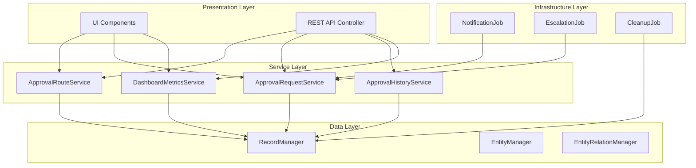
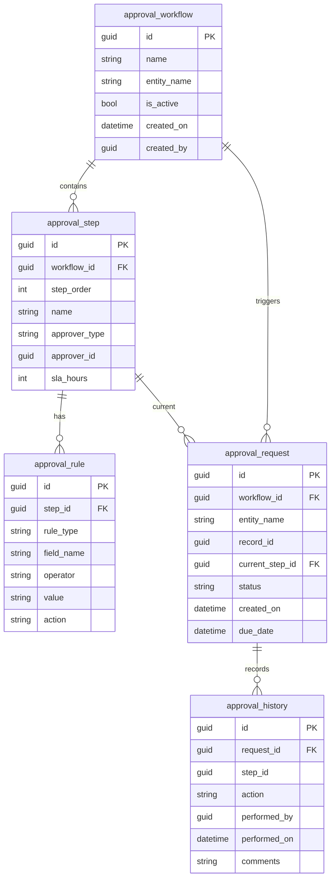
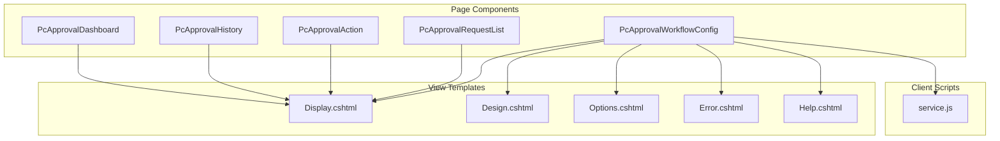
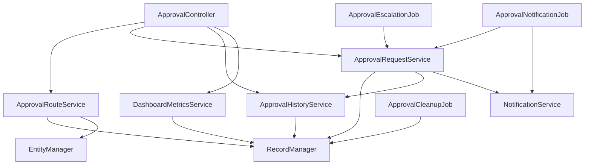
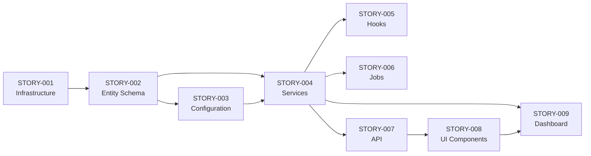

# Technical Specification

# 0. Agent Action Plan

## 0.1 Intent Clarification

### 0.1.1 Core Refactoring Objective

Based on the prompt, the Blitzy platform understands that the refactoring objective is to **implement a complete approval workflow system** for WebVella ERP by creating a new plugin called `WebVella.Erp.Plugins.Approval`. This implementation encompasses nine interconnected stories (STORY-001 through STORY-009) that must be executed sequentially due to their interdependencies.

**Refactoring Type:** New Product Creation / Feature Addition (Plugin Development)

**Target Repository:** Same repository (WebVella ERP codebase) - Adding new plugin alongside existing plugins

**Core Objectives:**

- Create a standalone approval workflow plugin following established WebVella architecture patterns
- Implement five entity schemas for workflow state management (`approval_workflow`, `approval_step`, `approval_rule`, `approval_request`, `approval_history`)
- Develop service layer components for routing, request processing, and history logging
- Build background job infrastructure for notifications, escalations, and cleanup operations
- Create REST API endpoints following WebVella conventions
- Develop five PageComponent-based UI components for workflow management and execution
- Implement a manager dashboard with real-time metrics and reporting

**Implicit Requirements Surfaced:**

- All code must follow WebVella's RecordManager/EntityManager patterns for database operations
- Plugin must integrate with WebVella's existing security and permission model
- UI components must inherit from `PageComponent` base class and follow the established view structure
- Background jobs must use WebVella's `ErpJob` and `SchedulePlan` infrastructure
- API must follow the `/api/v3.0/p/approval/*` routing convention

### 0.1.2 Special Instructions and Constraints

**Critical Directives from User:**

- Stories MUST be implemented in sequential order (STORY-001 → STORY-009) due to dependency chain
- Follow WebVella plugin architecture patterns exactly as demonstrated in `WebVella.Erp.Plugins.Project`
- Use WebVella RecordManager for ALL database operations - no direct SQL queries
- All public methods (excluding simple getters/setters) require XML documentation comments
- No hard-coded strings except for common property names like "Id", "Name"
- Use async/await for ALL I/O operations
- Implement dependency injection for all services

**Migration Requirements:**

- Schema changes must use WebVella migration patch pattern (`ProcessPatches()`)
- Each patch must be idempotent and transaction-scoped
- Fixed GUIDs required for deterministic entity provisioning

**Performance/Scalability Expectations:**

- Background jobs must operate at specified intervals: Notifications (5 min), Escalations (30 min), Cleanup (Daily)
- Dashboard metrics must calculate in real-time from `approval_request` and `approval_history` entities
- Pagination required for large request lists

### 0.1.3 Technical Interpretation

This refactoring translates to the following technical transformation strategy:

**Current Architecture → Target Architecture:**

```
BEFORE:                              AFTER:
WebVella.Erp                         WebVella.Erp
├── Plugins/                         ├── Plugins/
│   ├── Project/                     │   ├── Project/
│   ├── Mail/                        │   ├── Mail/
│   ├── Next/                        │   ├── Next/
│   ├── SDK/                         │   ├── SDK/
│   └── [No Approval]               │   └── Approval/  ← NEW PLUGIN
│                                    │       ├── ApprovalPlugin.cs
│                                    │       ├── ApprovalPlugin.*.cs (patches)
│                                    │       ├── Controllers/
│                                    │       ├── Components/
│                                    │       ├── Hooks/
│                                    │       ├── Jobs/
│                                    │       ├── Model/
│                                    │       ├── Services/
│                                    │       └── wwwroot/
```

**Transformation Rules and Patterns:**

| Pattern | Source Reference | Target Implementation |
|---------|------------------|----------------------|
| Plugin Initialization | `ProjectPlugin.cs` | `ApprovalPlugin.cs` with `ErpPlugin` inheritance |
| Migration Patches | `ProjectPlugin.20190203.cs` | `ApprovalPlugin.YYYYMMDD.cs` patches |
| Background Jobs | `StartTasksOnStartDate.cs` | `NotificationJob.cs`, `EscalationJob.cs`, `CleanupJob.cs` |
| Page Components | `PcFeedList.cs` | `PcApprovalWorkflowConfig.cs`, etc. |
| Controller | `ProjectController.cs` | `ApprovalController.cs` |
| Services | `TaskService.cs` | `ApprovalRouteService.cs`, etc. |

**Layer Mapping:**



## 0.2 Source Analysis

### 0.2.1 Comprehensive Source File Discovery

Since this implementation adds a new plugin, source files serve as **reference patterns** for the new development. The following existing patterns must be studied and replicated:

**Reference Pattern Files:**

| Source File | Purpose | Pattern to Extract |
|-------------|---------|-------------------|
| `WebVella.Erp.Plugins.Project/ProjectPlugin.cs` | Plugin initialization | `ErpPlugin` inheritance, `Name` property, `Initialize()` method |
| `WebVella.Erp.Plugins.Project/ProjectPlugin._.cs` | Patch orchestration | `ProcessPatches()` method, version tracking, transaction management |
| `WebVella.Erp.Plugins.Project/ProjectPlugin.20190203.cs` | Migration patch | Entity/relation creation, page provisioning, fixed GUIDs |
| `WebVella.Erp.Plugins.Project/Jobs/StartTasksOnStartDate.cs` | Background job | `ErpJob` inheritance, `[Job]` attribute, `Execute()` method |
| `WebVella.Erp.Plugins.Project/Controllers/ProjectController.cs` | REST API | Controller structure, `ResponseModel`, authorization |
| `WebVella.Erp.Plugins.Project/Components/PcFeedList/PcFeedList.cs` | Page component | `PageComponent` inheritance, `[PageComponent]` attribute |
| `WebVella.Erp.Plugins.Project/Services/TaskService.cs` | Service layer | Service patterns, RecordManager usage |

**Jira Story Documentation Files (Primary Source):**

| File | Content | Implementation Dependency |
|------|---------|--------------------------|
| `jira-stories/STORY-001-approval-plugin-infrastructure.md` | Plugin structure, namespaces, project files | Foundation - No dependencies |
| `jira-stories/STORY-002-approval-entity-schema.md` | 5 entity definitions, fields, relations | Depends on STORY-001 |
| `jira-stories/STORY-003-workflow-configuration-management.md` | Workflow CRUD operations, validation | Depends on STORY-002 |
| `jira-stories/STORY-004-approval-service-layer.md` | Core service implementations | Depends on STORY-002, STORY-003 |
| `jira-stories/STORY-005-approval-hooks-integration.md` | Entity operation hooks | Depends on STORY-004 |
| `jira-stories/STORY-006-notification-escalation-jobs.md` | Background job implementations | Depends on STORY-004 |
| `jira-stories/STORY-007-approval-rest-api.md` | Controller and endpoints | Depends on STORY-004 |
| `jira-stories/STORY-008-approval-ui-components.md` | 4 UI page components | Depends on STORY-007 |
| `jira-stories/STORY-009-manager-dashboard-metrics.md` | Dashboard and metrics service | Depends on STORY-004, STORY-008 |

### 0.2.2 Current Structure Mapping

**Existing Plugin Structure (Reference: WebVella.Erp.Plugins.Project):**

```
WebVella.Erp.Plugins.Project/
├── WebVella.Erp.Plugins.Project.csproj    # Razor SDK project
├── ProjectPlugin.cs                        # Main plugin class
├── ProjectPlugin._.cs                      # Patch orchestrator
├── ProjectPlugin.20190203.cs               # Migration patches...
├── ProjectPlugin.20190205.cs
├── ProjectPlugin.20190206.cs
├── ProjectPlugin.20190207.cs
├── ProjectPlugin.20190208.cs
├── ProjectPlugin.20190222.cs
├── ProjectPlugin.20211012.cs
├── ProjectPlugin.20211013.cs
├── Components/                             # Page components
│   ├── PcFeedList/
│   │   ├── PcFeedList.cs
│   │   ├── Display.cshtml
│   │   ├── Design.cshtml
│   │   ├── Options.cshtml
│   │   ├── Error.cshtml
│   │   ├── Help.cshtml
│   │   └── service.js
│   ├── PcPostList/
│   └── [other components...]
├── Controllers/
│   └── ProjectController.cs
├── Datasource/
├── Files/
├── Hooks/
├── Jobs/
│   └── StartTasksOnStartDate.cs
├── Model/
│   └── PluginSettings.cs
├── Services/
│   ├── BaseService.cs
│   ├── TaskService.cs
│   ├── ProjectService.cs
│   └── [other services...]
├── Theme/
│   └── styles.css
├── Utils/
└── wwwroot/
    └── js/
```

### 0.2.3 Entity Schema Requirements (from STORY-002)

**Five entities to be created:**

| Entity Name | Key Fields | Relations |
|-------------|-----------|-----------|
| `approval_workflow` | id, name, entity_name, is_active, created_on, created_by | 1:N → approval_step |
| `approval_step` | id, workflow_id, step_order, name, approver_type, approver_id, sla_hours | N:1 → approval_workflow, 1:N → approval_rule |
| `approval_rule` | id, step_id, rule_type, field_name, operator, value, action | N:1 → approval_step |
| `approval_request` | id, workflow_id, entity_id, record_id, current_step_id, status, created_on | N:1 → approval_workflow, N:1 → approval_step |
| `approval_history` | id, request_id, step_id, action, performed_by, performed_on, comments | N:1 → approval_request |

### 0.2.4 Service Requirements (from STORY-003, STORY-004, STORY-009)

**Core Services:**

| Service | Responsibilities | Key Methods |
|---------|-----------------|-------------|
| `ApprovalRouteService` | Workflow routing, step determination | `DetermineNextStep()`, `EvaluateRules()`, `GetApproverForStep()` |
| `ApprovalRequestService` | Request lifecycle management | `CreateRequest()`, `Approve()`, `Reject()`, `Delegate()`, `Escalate()` |
| `ApprovalHistoryService` | Audit trail management | `LogAction()`, `GetHistoryForRequest()`, `GetUserApprovalHistory()` |
| `DashboardMetricsService` | Real-time metrics calculation | `GetPendingCount()`, `GetAverageApprovalTime()`, `GetApprovalRate()`, `GetOverdueCount()` |

### 0.2.5 UI Component Requirements (from STORY-008, STORY-009)

**Five PageComponent implementations:**

| Component | Purpose | Key Views |
|-----------|---------|-----------|
| `PcApprovalWorkflowConfig` | Admin workflow management | Workflow CRUD, step/rule configuration |
| `PcApprovalRequestList` | Pending request dashboard | Filterable list, status indicators |
| `PcApprovalAction` | Approve/Reject/Delegate actions | Action buttons, comment modal |
| `PcApprovalHistory` | Audit trail timeline | Chronological history view |
| `PcApprovalDashboard` | Manager metrics dashboard | 5 metric cards with real-time data |

### 0.2.6 Background Job Requirements (from STORY-006)

**Three scheduled jobs:**

| Job | Schedule | Responsibility |
|-----|----------|----------------|
| `ApprovalNotificationJob` | Every 5 minutes | Send pending approval notifications |
| `ApprovalEscalationJob` | Every 30 minutes | Escalate overdue requests |
| `ApprovalCleanupJob` | Daily | Archive old records, cleanup orphans |

## 0.3 Target Design

### 0.3.1 Refactored Structure Planning

**Target Architecture - Complete Plugin Structure:**

```
WebVella.Erp.Plugins.Approval/
├── WebVella.Erp.Plugins.Approval.csproj
├── ApprovalPlugin.cs
├── ApprovalPlugin._.cs
├── ApprovalPlugin.Patch20240101.cs
├── Components/
│   ├── HookMetaHead/
│   │   ├── HookMetaHead.cs
│   │   └── HookMetaHead.cshtml
│   ├── PcApprovalWorkflowConfig/
│   │   ├── PcApprovalWorkflowConfig.cs
│   │   ├── Display.cshtml
│   │   ├── Design.cshtml
│   │   ├── Options.cshtml
│   │   ├── Error.cshtml
│   │   ├── Help.cshtml
│   │   └── service.js
│   ├── PcApprovalRequestList/
│   │   ├── PcApprovalRequestList.cs
│   │   ├── Display.cshtml
│   │   ├── Design.cshtml
│   │   ├── Options.cshtml
│   │   ├── Error.cshtml
│   │   ├── Help.cshtml
│   │   └── service.js
│   ├── PcApprovalAction/
│   │   ├── PcApprovalAction.cs
│   │   ├── Display.cshtml
│   │   ├── Design.cshtml
│   │   ├── Options.cshtml
│   │   ├── Error.cshtml
│   │   ├── Help.cshtml
│   │   └── service.js
│   ├── PcApprovalHistory/
│   │   ├── PcApprovalHistory.cs
│   │   ├── Display.cshtml
│   │   ├── Design.cshtml
│   │   ├── Options.cshtml
│   │   ├── Error.cshtml
│   │   ├── Help.cshtml
│   │   └── service.js
│   └── PcApprovalDashboard/
│       ├── PcApprovalDashboard.cs
│       ├── Display.cshtml
│       ├── Design.cshtml
│       ├── Options.cshtml
│       ├── Error.cshtml
│       ├── Help.cshtml
│       └── service.js
├── Controllers/
│   └── ApprovalController.cs
├── Hooks/
│   ├── ApprovalApiHook.cs
│   └── ApprovalPageHook.cs
├── Jobs/
│   ├── ApprovalNotificationJob.cs
│   ├── ApprovalEscalationJob.cs
│   └── ApprovalCleanupJob.cs
├── Model/
│   ├── PluginSettings.cs
│   ├── ApprovalStatus.cs
│   ├── ApproverType.cs
│   ├── RuleOperator.cs
│   ├── DashboardMetricsModel.cs
│   └── ApprovalActionType.cs
├── Services/
│   ├── BaseService.cs
│   ├── ApprovalRouteService.cs
│   ├── ApprovalRequestService.cs
│   ├── ApprovalHistoryService.cs
│   ├── DashboardMetricsService.cs
│   └── NotificationService.cs
├── Theme/
│   └── styles.css
├── Utils/
│   └── ApprovalUtils.cs
└── wwwroot/
    └── js/
        └── approval-components/
```

### 0.3.2 Web Search Research Conducted

**Best Practices Identified:**

Based on web search research on approval workflow patterns in ASP.NET Core:

- <cite index="2-10,2-11">"Instances of Holiday objects will be treated always the same because the HolidayApprovalWorkflow definition exactly defines the transition behavior for each transition. Imagine a bit more complex workflow and you will be thankful having the transition logic exactly in one place and not distributed within your codebase."</cite>

- <cite index="9-15,9-16,9-17,9-18">"Common business processes that require someone to sign off on the data at a certain stage. An approval workflow is a logical sequence of tasks, including human approvals and rejections, to process data. Requiring managers to sign off can require an endless series of emails or messages to verify the status of various processes. Automating the workflow will save time and money."</cite>

- <cite index="10-1,10-2">"Meet Elsa, an open source suite of .NET Standard libraries and tools that enable developers to implement long-running workflows. The core philosophy of Elsa is to be able to connect small executable units with one another, allowing you to orchestrate real business processes such as document approval, customer on-boarding and order fulfillment processes."</cite>

**Key Implementation Patterns:**

- State machine pattern for workflow transitions
- Service-based architecture with clear separation of concerns
- Signal/event-based communication for workflow progression
- Centralized transition logic to avoid distributed state management
- Audit trail for compliance and debugging

### 0.3.3 Design Pattern Applications

**Repository Pattern for Data Access:**

```csharp
// Pattern: All data access through RecordManager
public class ApprovalRequestService : BaseService
{
    public EntityRecord GetRequestById(Guid id)
    {
        return new RecordManager()
            .Find("approval_request", id);
    }
}
```

**Service Layer for Business Logic:**

```csharp
// Pattern: Business logic encapsulated in services
public class ApprovalRouteService : BaseService
{
    public Guid? DetermineNextStep(Guid workflowId, Guid currentStepId)
    {
        // Business logic here
    }
}
```

**Factory Pattern for Object Creation:**

```csharp
// Pattern: Complex entity record creation
public static EntityRecord CreateApprovalRequest(/* params */)
{
    var record = new EntityRecord();
    record["id"] = Guid.NewGuid();
    // ... populate fields
    return record;
}
```

**Dependency Injection for Loose Coupling:**

```csharp
// Pattern: Controller with injected services
public class ApprovalController : Controller
{
    private readonly IErpService _erpService;
    
    public ApprovalController(IErpService erpService)
    {
        _erpService = erpService;
    }
}
```

### 0.3.4 Entity Relationship Design



### 0.3.5 API Endpoint Design

**ApprovalController Endpoints:**

| Method | Route | Purpose |
|--------|-------|---------|
| GET | `/api/v3.0/p/approval/workflows` | List all workflows |
| GET | `/api/v3.0/p/approval/workflows/{id}` | Get workflow details |
| POST | `/api/v3.0/p/approval/workflows` | Create workflow |
| PUT | `/api/v3.0/p/approval/workflows/{id}` | Update workflow |
| DELETE | `/api/v3.0/p/approval/workflows/{id}` | Delete workflow |
| GET | `/api/v3.0/p/approval/requests` | List requests (with filters) |
| GET | `/api/v3.0/p/approval/requests/{id}` | Get request details |
| POST | `/api/v3.0/p/approval/requests/{id}/approve` | Approve request |
| POST | `/api/v3.0/p/approval/requests/{id}/reject` | Reject request |
| POST | `/api/v3.0/p/approval/requests/{id}/delegate` | Delegate request |
| GET | `/api/v3.0/p/approval/requests/{id}/history` | Get request history |
| GET | `/api/v3.0/p/approval/dashboard/metrics` | Get dashboard metrics |

### 0.3.6 Component Architecture



## 0.4 Transformation Mapping

### 0.4.1 File-by-File Transformation Plan

**CRITICAL: This is a new plugin implementation. All target files are CREATE operations using existing files as REFERENCE patterns.**

**File Transformation Modes:**

- **CREATE** - Create a new file
- **REFERENCE** - Use as an example to reflect existing patterns, styles or designs

#### Project Configuration Files

| Target File | Transformation | Source File | Key Changes |
|-------------|---------------|-------------|-------------|
| `WebVella.Erp.Plugins.Approval/WebVella.Erp.Plugins.Approval.csproj` | CREATE | `WebVella.Erp.Plugins.Project/WebVella.Erp.Plugins.Project.csproj` | New Razor SDK project for Approval plugin, reference WebVella.Erp and WebVella.Erp.Web |

#### Plugin Core Files

| Target File | Transformation | Source File | Key Changes |
|-------------|---------------|-------------|-------------|
| `WebVella.Erp.Plugins.Approval/ApprovalPlugin.cs` | CREATE | `WebVella.Erp.Plugins.Project/ProjectPlugin.cs` | Plugin initialization with Name="approval", SetSchedulePlans() for 3 jobs |
| `WebVella.Erp.Plugins.Approval/ApprovalPlugin._.cs` | CREATE | `WebVella.Erp.Plugins.Project/ProjectPlugin._.cs` | ProcessPatches() orchestration with version tracking |
| `WebVella.Erp.Plugins.Approval/ApprovalPlugin.Patch20240101.cs` | CREATE | `WebVella.Erp.Plugins.Project/ProjectPlugin.20190203.cs` | Entity schema creation for 5 entities, relation setup, page provisioning |

#### Model Files

| Target File | Transformation | Source File | Key Changes |
|-------------|---------------|-------------|-------------|
| `WebVella.Erp.Plugins.Approval/Model/PluginSettings.cs` | CREATE | `WebVella.Erp.Plugins.Project/Model/PluginSettings.cs` | Version tracking DTO |
| `WebVella.Erp.Plugins.Approval/Model/ApprovalStatus.cs` | CREATE | N/A (enum) | Enum: Pending, Approved, Rejected, Delegated, Escalated, Cancelled |
| `WebVella.Erp.Plugins.Approval/Model/ApproverType.cs` | CREATE | N/A (enum) | Enum: User, Role, Manager, Custom |
| `WebVella.Erp.Plugins.Approval/Model/RuleOperator.cs` | CREATE | N/A (enum) | Enum: Equals, NotEquals, GreaterThan, LessThan, Contains, StartsWith |
| `WebVella.Erp.Plugins.Approval/Model/ApprovalActionType.cs` | CREATE | N/A (enum) | Enum: Approve, Reject, Delegate, Escalate, Comment |
| `WebVella.Erp.Plugins.Approval/Model/DashboardMetricsModel.cs` | CREATE | N/A (DTO) | DTO for dashboard metrics API response |

#### Service Files

| Target File | Transformation | Source File | Key Changes |
|-------------|---------------|-------------|-------------|
| `WebVella.Erp.Plugins.Approval/Services/BaseService.cs` | CREATE | `WebVella.Erp.Plugins.Project/Services/BaseService.cs` | Base service with RecordManager, EntityManager, SecurityManager |
| `WebVella.Erp.Plugins.Approval/Services/ApprovalRouteService.cs` | CREATE | `WebVella.Erp.Plugins.Project/Services/TaskService.cs` | Workflow routing, step determination, rule evaluation |
| `WebVella.Erp.Plugins.Approval/Services/ApprovalRequestService.cs` | CREATE | `WebVella.Erp.Plugins.Project/Services/TaskService.cs` | Request CRUD, Approve/Reject/Delegate/Escalate actions |
| `WebVella.Erp.Plugins.Approval/Services/ApprovalHistoryService.cs` | CREATE | `WebVella.Erp.Plugins.Project/Services/CommentService.cs` | Audit trail management, history logging |
| `WebVella.Erp.Plugins.Approval/Services/DashboardMetricsService.cs` | CREATE | `WebVella.Erp.Plugins.Project/Services/ReportService.cs` | Real-time metrics calculation |
| `WebVella.Erp.Plugins.Approval/Services/NotificationService.cs` | CREATE | REFERENCE (new pattern) | Email notifications for approvals |

#### Controller Files

| Target File | Transformation | Source File | Key Changes |
|-------------|---------------|-------------|-------------|
| `WebVella.Erp.Plugins.Approval/Controllers/ApprovalController.cs` | CREATE | `WebVella.Erp.Plugins.Project/Controllers/ProjectController.cs` | REST API under /api/v3.0/p/approval/*, workflow and request endpoints |

#### Hook Files

| Target File | Transformation | Source File | Key Changes |
|-------------|---------------|-------------|-------------|
| `WebVella.Erp.Plugins.Approval/Hooks/ApprovalApiHook.cs` | CREATE | REFERENCE (WebVella patterns) | API hooks for entity operations triggering workflows |
| `WebVella.Erp.Plugins.Approval/Hooks/ApprovalPageHook.cs` | CREATE | REFERENCE (WebVella patterns) | Page hooks for approval UI integration |

#### Job Files

| Target File | Transformation | Source File | Key Changes |
|-------------|---------------|-------------|-------------|
| `WebVella.Erp.Plugins.Approval/Jobs/ApprovalNotificationJob.cs` | CREATE | `WebVella.Erp.Plugins.Project/Jobs/StartTasksOnStartDate.cs` | 5-minute job for pending notifications |
| `WebVella.Erp.Plugins.Approval/Jobs/ApprovalEscalationJob.cs` | CREATE | `WebVella.Erp.Plugins.Project/Jobs/StartTasksOnStartDate.cs` | 30-minute job for overdue escalations |
| `WebVella.Erp.Plugins.Approval/Jobs/ApprovalCleanupJob.cs` | CREATE | `WebVella.Erp.Plugins.Project/Jobs/StartTasksOnStartDate.cs` | Daily job for archive/cleanup |

#### Component Files - PcApprovalWorkflowConfig

| Target File | Transformation | Source File | Key Changes |
|-------------|---------------|-------------|-------------|
| `WebVella.Erp.Plugins.Approval/Components/PcApprovalWorkflowConfig/PcApprovalWorkflowConfig.cs` | CREATE | `WebVella.Erp.Plugins.Project/Components/PcFeedList/PcFeedList.cs` | Workflow configuration component class |
| `WebVella.Erp.Plugins.Approval/Components/PcApprovalWorkflowConfig/Display.cshtml` | CREATE | `WebVella.Erp.Plugins.Project/Components/PcFeedList/Display.cshtml` | Workflow list and edit UI |
| `WebVella.Erp.Plugins.Approval/Components/PcApprovalWorkflowConfig/Design.cshtml` | CREATE | `WebVella.Erp.Plugins.Project/Components/PcFeedList/Design.cshtml` | Design-time preview |
| `WebVella.Erp.Plugins.Approval/Components/PcApprovalWorkflowConfig/Options.cshtml` | CREATE | `WebVella.Erp.Plugins.Project/Components/PcFeedList/Options.cshtml` | Component options editor |
| `WebVella.Erp.Plugins.Approval/Components/PcApprovalWorkflowConfig/Error.cshtml` | CREATE | `WebVella.Erp.Plugins.Project/Components/PcFeedList/Error.cshtml` | Error display view |
| `WebVella.Erp.Plugins.Approval/Components/PcApprovalWorkflowConfig/Help.cshtml` | CREATE | `WebVella.Erp.Plugins.Project/Components/PcFeedList/Help.cshtml` | Help documentation view |
| `WebVella.Erp.Plugins.Approval/Components/PcApprovalWorkflowConfig/service.js` | CREATE | `WebVella.Erp.Plugins.Project/Components/PcFeedList/service.js` | Client-side interaction handlers |

#### Component Files - PcApprovalRequestList

| Target File | Transformation | Source File | Key Changes |
|-------------|---------------|-------------|-------------|
| `WebVella.Erp.Plugins.Approval/Components/PcApprovalRequestList/PcApprovalRequestList.cs` | CREATE | `WebVella.Erp.Plugins.Project/Components/PcFeedList/PcFeedList.cs` | Request list component class |
| `WebVella.Erp.Plugins.Approval/Components/PcApprovalRequestList/Display.cshtml` | CREATE | REFERENCE | Pending requests list with filters |
| `WebVella.Erp.Plugins.Approval/Components/PcApprovalRequestList/Design.cshtml` | CREATE | REFERENCE | Design-time preview |
| `WebVella.Erp.Plugins.Approval/Components/PcApprovalRequestList/Options.cshtml` | CREATE | REFERENCE | Component options editor |
| `WebVella.Erp.Plugins.Approval/Components/PcApprovalRequestList/Error.cshtml` | CREATE | REFERENCE | Error display view |
| `WebVella.Erp.Plugins.Approval/Components/PcApprovalRequestList/Help.cshtml` | CREATE | REFERENCE | Help documentation view |
| `WebVella.Erp.Plugins.Approval/Components/PcApprovalRequestList/service.js` | CREATE | REFERENCE | Client-side interaction handlers |

#### Component Files - PcApprovalAction

| Target File | Transformation | Source File | Key Changes |
|-------------|---------------|-------------|-------------|
| `WebVella.Erp.Plugins.Approval/Components/PcApprovalAction/PcApprovalAction.cs` | CREATE | REFERENCE | Action buttons component class |
| `WebVella.Erp.Plugins.Approval/Components/PcApprovalAction/Display.cshtml` | CREATE | REFERENCE | Approve/Reject/Delegate buttons with modal |
| `WebVella.Erp.Plugins.Approval/Components/PcApprovalAction/Design.cshtml` | CREATE | REFERENCE | Design-time preview |
| `WebVella.Erp.Plugins.Approval/Components/PcApprovalAction/Options.cshtml` | CREATE | REFERENCE | Component options editor |
| `WebVella.Erp.Plugins.Approval/Components/PcApprovalAction/Error.cshtml` | CREATE | REFERENCE | Error display view |
| `WebVella.Erp.Plugins.Approval/Components/PcApprovalAction/Help.cshtml` | CREATE | REFERENCE | Help documentation view |
| `WebVella.Erp.Plugins.Approval/Components/PcApprovalAction/service.js` | CREATE | REFERENCE | AJAX handlers for approve/reject/delegate |

#### Component Files - PcApprovalHistory

| Target File | Transformation | Source File | Key Changes |
|-------------|---------------|-------------|-------------|
| `WebVella.Erp.Plugins.Approval/Components/PcApprovalHistory/PcApprovalHistory.cs` | CREATE | REFERENCE | History timeline component class |
| `WebVella.Erp.Plugins.Approval/Components/PcApprovalHistory/Display.cshtml` | CREATE | REFERENCE | Chronological history timeline |
| `WebVella.Erp.Plugins.Approval/Components/PcApprovalHistory/Design.cshtml` | CREATE | REFERENCE | Design-time preview |
| `WebVella.Erp.Plugins.Approval/Components/PcApprovalHistory/Options.cshtml` | CREATE | REFERENCE | Component options editor |
| `WebVella.Erp.Plugins.Approval/Components/PcApprovalHistory/Error.cshtml` | CREATE | REFERENCE | Error display view |
| `WebVella.Erp.Plugins.Approval/Components/PcApprovalHistory/Help.cshtml` | CREATE | REFERENCE | Help documentation view |
| `WebVella.Erp.Plugins.Approval/Components/PcApprovalHistory/service.js` | CREATE | REFERENCE | Client-side interaction handlers |

#### Component Files - PcApprovalDashboard

| Target File | Transformation | Source File | Key Changes |
|-------------|---------------|-------------|-------------|
| `WebVella.Erp.Plugins.Approval/Components/PcApprovalDashboard/PcApprovalDashboard.cs` | CREATE | `WebVella.Erp.Plugins.Project/Components/PcProjectWidgetBudgetChart/PcProjectWidgetBudgetChart.cs` | Dashboard metrics component class |
| `WebVella.Erp.Plugins.Approval/Components/PcApprovalDashboard/Display.cshtml` | CREATE | REFERENCE | 5 metric cards with real-time data |
| `WebVella.Erp.Plugins.Approval/Components/PcApprovalDashboard/Design.cshtml` | CREATE | REFERENCE | Design-time preview |
| `WebVella.Erp.Plugins.Approval/Components/PcApprovalDashboard/Options.cshtml` | CREATE | REFERENCE | Component options editor |
| `WebVella.Erp.Plugins.Approval/Components/PcApprovalDashboard/Error.cshtml` | CREATE | REFERENCE | Error display view |
| `WebVella.Erp.Plugins.Approval/Components/PcApprovalDashboard/Help.cshtml` | CREATE | REFERENCE | Help documentation view |
| `WebVella.Erp.Plugins.Approval/Components/PcApprovalDashboard/service.js` | CREATE | REFERENCE | Client-side interaction handlers |

#### Component Files - HookMetaHead

| Target File | Transformation | Source File | Key Changes |
|-------------|---------------|-------------|-------------|
| `WebVella.Erp.Plugins.Approval/Components/HookMetaHead/HookMetaHead.cs` | CREATE | `WebVella.Erp.Plugins.Project/Components/HookMetaHead/HookMetaHead.cs` | CSS injection hook |
| `WebVella.Erp.Plugins.Approval/Components/HookMetaHead/HookMetaHead.cshtml` | CREATE | REFERENCE | CSS link tag rendering |

#### Theme and Utility Files

| Target File | Transformation | Source File | Key Changes |
|-------------|---------------|-------------|-------------|
| `WebVella.Erp.Plugins.Approval/Theme/styles.css` | CREATE | `WebVella.Erp.Plugins.Project/Theme/styles.css` | Approval plugin CSS styles |
| `WebVella.Erp.Plugins.Approval/Utils/ApprovalUtils.cs` | CREATE | REFERENCE | Utility methods for approval processing |

#### Solution Configuration

| Target File | Transformation | Source File | Key Changes |
|-------------|---------------|-------------|-------------|
| `WebVella.Erp.sln` | UPDATE | `WebVella.Erp.sln` | Add WebVella.Erp.Plugins.Approval project reference |

### 0.4.2 Cross-File Dependencies

**Import Statement Updates:**

All new files will use the following namespace structure:

```csharp
// Primary namespace
namespace WebVella.Erp.Plugins.Approval

// Sub-namespaces
namespace WebVella.Erp.Plugins.Approval.Controllers
namespace WebVella.Erp.Plugins.Approval.Services
namespace WebVella.Erp.Plugins.Approval.Jobs
namespace WebVella.Erp.Plugins.Approval.Hooks
namespace WebVella.Erp.Plugins.Approval.Model
namespace WebVella.Erp.Plugins.Approval.Components
```

**Required Imports Across All Files:**

```csharp
using WebVella.Erp.Api;
using WebVella.Erp.Api.Models;
using WebVella.Erp.Jobs;
using WebVella.Erp.Web.Pages;
using Newtonsoft.Json;
```

### 0.4.3 Configuration Updates

**Solution File Update (WebVella.Erp.sln):**

```diff
+ Project("{FAE04EC0-301F-11D3-BF4B-00C04F79EFBC}") = "WebVella.Erp.Plugins.Approval", "WebVella.Erp.Plugins.Approval\WebVella.Erp.Plugins.Approval.csproj", "{NEW-GUID}"
+ EndProject
```

### 0.4.4 One-Phase Execution

**CRITICAL: The entire implementation will be executed by Blitzy in ONE phase.**

All files listed in this transformation mapping will be created in a single execution cycle. No multi-phase splitting is required or permitted.

**Execution Order (within single phase):**

1. Project file and solution reference
2. Plugin core files (ApprovalPlugin.cs, patches)
3. Model files (enums, DTOs)
4. Service files
5. Controller files
6. Hook files
7. Job files
8. Component files (all 5 components with all views)
9. Theme and utility files

## 0.5 Dependency Inventory

### 0.5.1 Key Private and Public Packages

**Core Framework Dependencies:**

| Registry | Package Name | Version | Purpose |
|----------|-------------|---------|---------|
| NuGet | `Microsoft.AspNetCore.App` | 9.0.x (framework) | ASP.NET Core runtime framework reference |
| NuGet | `Microsoft.AspNetCore.Mvc.NewtonsoftJson` | 9.0.10 | JSON serialization for MVC controllers |
| NuGet | `Microsoft.NET.Sdk.Razor` | SDK | Razor class library support |

**Internal Project Dependencies:**

| Registry | Package Name | Version | Purpose |
|----------|-------------|---------|---------|
| Project | `WebVella.Erp` | 1.7.4 | Core ERP APIs - RecordManager, EntityManager, SecurityManager |
| Project | `WebVella.Erp.Web` | 1.7.5 | Web components - PageComponent, ErpRequestContext |

**Key Package Dependencies (Inherited from Core Projects):**

| Registry | Package Name | Version | Purpose |
|----------|-------------|---------|---------|
| NuGet | `Newtonsoft.Json` | 13.0.4 | JSON serialization/deserialization |
| NuGet | `Npgsql` | 9.0.4 | PostgreSQL database driver |
| NuGet | `HtmlAgilityPack` | 1.12.4 | HTML parsing utilities |

### 0.5.2 Dependency Updates

**New Project File (WebVella.Erp.Plugins.Approval.csproj):**

```xml
<Project Sdk="Microsoft.NET.Sdk.Razor">
  <PropertyGroup>
    <TargetFramework>net9.0</TargetFramework>
    <AddRazorSupportForMvc>true</AddRazorSupportForMvc>
    <RootNamespace>WebVella.Erp.Plugins.Approval</RootNamespace>
    <GenerateEmbeddedFilesManifest>true</GenerateEmbeddedFilesManifest>
  </PropertyGroup>

  <ItemGroup>
    <FrameworkReference Include="Microsoft.AspNetCore.App" />
  </ItemGroup>

  <ItemGroup>
    <PackageReference Include="Microsoft.AspNetCore.Mvc.NewtonsoftJson" Version="9.0.10" />
  </ItemGroup>

  <ItemGroup>
    <ProjectReference Include="..\WebVella.Erp\WebVella.Erp.csproj" />
    <ProjectReference Include="..\WebVella.Erp.Web\WebVella.Erp.Web.csproj" />
  </ItemGroup>
</Project>
```

### 0.5.3 Import Refactoring

**Files Requiring Import Updates:**

No existing files require import updates since this is a new plugin. All imports are defined fresh in new files.

**Standard Import Template for New Files:**

```csharp
// Core .NET
using System;
using System.Collections.Generic;
using System.Linq;
using System.Threading.Tasks;

// ASP.NET Core
using Microsoft.AspNetCore.Authorization;
using Microsoft.AspNetCore.Mvc;

// Third-party
using Newtonsoft.Json;

// WebVella Core
using WebVella.Erp.Api;
using WebVella.Erp.Api.Models;
using WebVella.Erp.Database;
using WebVella.Erp.Diagnostics;
using WebVella.Erp.Eql;

// WebVella Web
using WebVella.Erp.Web.Pages;
using WebVella.Erp.Web.Services;

// WebVella Jobs
using WebVella.Erp.Jobs;

// Approval Plugin
using WebVella.Erp.Plugins.Approval.Model;
using WebVella.Erp.Plugins.Approval.Services;
```

### 0.5.4 External Reference Updates

**Configuration Files Requiring Updates:**

| File Pattern | Update Required |
|--------------|-----------------|
| `WebVella.Erp.sln` | Add project reference for WebVella.Erp.Plugins.Approval |

**No Additional Configuration Changes Required:**

- WebVella ERP auto-discovers plugins via assembly scanning
- No `appsettings.json` changes needed
- No `Startup.cs` or `Program.cs` modifications required
- Plugin registration is automatic via `ErpPlugin` inheritance

### 0.5.5 Database Dependencies

**Entity Creation Order (Migration Patch):**

1. `approval_workflow` - Root entity, no foreign keys
2. `approval_step` - FK to `approval_workflow`
3. `approval_rule` - FK to `approval_step`
4. `approval_request` - FK to `approval_workflow`, FK to `approval_step`
5. `approval_history` - FK to `approval_request`

**Relation Manager Setup:**

```csharp
// Relations to be created in migration patch
relMan.Create(new EntityRelation {
    Name = "approval_workflow_steps",
    OriginEntityId = workflowEntityId,
    TargetEntityId = stepEntityId,
    // ...
});
```

### 0.5.6 Runtime Dependencies

**Service Dependencies (Injection Graph):**



**Job Schedule Dependencies:**

| Job | Schedule Plan GUID | Job Type GUID | Interval |
|-----|-------------------|---------------|----------|
| ApprovalNotificationJob | (New GUID) | (New GUID) | 5 minutes |
| ApprovalEscalationJob | (New GUID) | (New GUID) | 30 minutes |
| ApprovalCleanupJob | (New GUID) | (New GUID) | 1440 minutes (daily) |

## 0.6 Scope Boundaries

### 0.6.1 Exhaustively In Scope

**Plugin Infrastructure (STORY-001):**

- `WebVella.Erp.Plugins.Approval/WebVella.Erp.Plugins.Approval.csproj` - Project configuration
- `WebVella.Erp.Plugins.Approval/ApprovalPlugin.cs` - Plugin entry point
- `WebVella.Erp.Plugins.Approval/ApprovalPlugin._.cs` - Patch orchestrator
- `WebVella.Erp.Plugins.Approval/ApprovalPlugin.Patch*.cs` - Migration patches
- `WebVella.Erp.Plugins.Approval/Model/PluginSettings.cs` - Version tracking

**Entity Schema (STORY-002):**

- `approval_workflow` entity with all fields and indexes
- `approval_step` entity with workflow relation
- `approval_rule` entity with step relation
- `approval_request` entity with workflow/step relations
- `approval_history` entity with request relation
- All entity relationships configured via EntityRelationManager

**Workflow Configuration (STORY-003):**

- `WebVella.Erp.Plugins.Approval/Services/ApprovalRouteService.cs` - Workflow routing logic
- Workflow CRUD operations via RecordManager
- Step and rule configuration services

**Service Layer (STORY-004):**

- `WebVella.Erp.Plugins.Approval/Services/BaseService.cs` - Base service class
- `WebVella.Erp.Plugins.Approval/Services/ApprovalRouteService.cs` - Routing service
- `WebVella.Erp.Plugins.Approval/Services/ApprovalRequestService.cs` - Request service
- `WebVella.Erp.Plugins.Approval/Services/ApprovalHistoryService.cs` - History service
- `WebVella.Erp.Plugins.Approval/Services/NotificationService.cs` - Notification service

**Hooks Integration (STORY-005):**

- `WebVella.Erp.Plugins.Approval/Hooks/ApprovalApiHook.cs` - API operation hooks
- `WebVella.Erp.Plugins.Approval/Hooks/ApprovalPageHook.cs` - Page lifecycle hooks

**Background Jobs (STORY-006):**

- `WebVella.Erp.Plugins.Approval/Jobs/ApprovalNotificationJob.cs` - 5-minute notification job
- `WebVella.Erp.Plugins.Approval/Jobs/ApprovalEscalationJob.cs` - 30-minute escalation job
- `WebVella.Erp.Plugins.Approval/Jobs/ApprovalCleanupJob.cs` - Daily cleanup job
- Schedule plan registration in ApprovalPlugin.cs

**REST API (STORY-007):**

- `WebVella.Erp.Plugins.Approval/Controllers/ApprovalController.cs` - All endpoints
- Workflow endpoints: GET/POST/PUT/DELETE `/api/v3.0/p/approval/workflows/*`
- Request endpoints: GET/POST `/api/v3.0/p/approval/requests/*`
- Action endpoints: POST `approve`, `reject`, `delegate`
- Dashboard endpoint: GET `/api/v3.0/p/approval/dashboard/metrics`

**UI Components (STORY-008):**

- `WebVella.Erp.Plugins.Approval/Components/PcApprovalWorkflowConfig/*` (7 files)
- `WebVella.Erp.Plugins.Approval/Components/PcApprovalRequestList/*` (7 files)
- `WebVella.Erp.Plugins.Approval/Components/PcApprovalAction/*` (7 files)
- `WebVella.Erp.Plugins.Approval/Components/PcApprovalHistory/*` (7 files)
- `WebVella.Erp.Plugins.Approval/Components/HookMetaHead/*` (2 files)

**Dashboard & Metrics (STORY-009):**

- `WebVella.Erp.Plugins.Approval/Components/PcApprovalDashboard/*` (7 files)
- `WebVella.Erp.Plugins.Approval/Services/DashboardMetricsService.cs`
- `WebVella.Erp.Plugins.Approval/Model/DashboardMetricsModel.cs`

**Supporting Files:**

- `WebVella.Erp.Plugins.Approval/Model/ApprovalStatus.cs` - Status enum
- `WebVella.Erp.Plugins.Approval/Model/ApproverType.cs` - Approver type enum
- `WebVella.Erp.Plugins.Approval/Model/RuleOperator.cs` - Rule operator enum
- `WebVella.Erp.Plugins.Approval/Model/ApprovalActionType.cs` - Action type enum
- `WebVella.Erp.Plugins.Approval/Theme/styles.css` - Plugin CSS
- `WebVella.Erp.Plugins.Approval/Utils/ApprovalUtils.cs` - Utility methods

**Solution Updates:**

- `WebVella.Erp.sln` - Add project reference

**Documentation & Validation:**

- `VALIDATION_CHECKLIST.md` - Validation status tracking
- `PROJECT_GUIDE.md` - Implementation documentation
- `validation/STORY-001/` through `validation/STORY-009/` - Screenshot folders
- `validation/end-to-end/` - Integration validation screenshots

### 0.6.2 Explicitly Out of Scope

**Per User Instructions:**

- **No modifications to existing WebVella core codebase** - Only create new plugin
- **No changes to existing plugins** - WebVella.Erp.Plugins.Project, Mail, Next, SDK remain untouched
- **No modifications to existing entity schemas** - Only create new approval entities
- **No changes to existing UI components** - Only create new approval components
- **No modifications to existing controllers** - Only create ApprovalController
- **No changes to appsettings or configuration files** - Plugin auto-registers
- **Existing warnings in WebVella codebase** - Not addressed (per user directive)

**Technical Exclusions:**

- External email service configuration (assumes WebVella Mail plugin handles this)
- User management and authentication (uses existing WebVella security)
- Custom authentication providers
- Database schema modifications outside of new entities
- Load balancing or horizontal scaling configuration
- Cloud deployment configurations
- CI/CD pipeline modifications
- Unit test creation (not specified in stories)
- Integration test creation (not specified in stories)

**Feature Exclusions:**

- Workflow versioning (not in story requirements)
- Parallel approval paths (sequential only per requirements)
- External system integrations beyond email
- Mobile-specific UI components
- Offline approval capabilities
- Bulk approval operations (unless specified in stories)
- Custom reporting beyond dashboard metrics
- Workflow templates or presets

### 0.6.3 Boundary Validation Matrix

| Item | In Scope | Out of Scope | Reason |
|------|----------|--------------|--------|
| New plugin creation | ✅ | | Core requirement |
| Entity schema | ✅ | | STORY-002 |
| Services | ✅ | | STORY-004 |
| Controller | ✅ | | STORY-007 |
| UI Components | ✅ | | STORY-008, STORY-009 |
| Background jobs | ✅ | | STORY-006 |
| Solution file update | ✅ | | Project reference needed |
| Existing plugin changes | | ✅ | User directive |
| Core WebVella changes | | ✅ | User directive |
| External integrations | | ✅ | Not in requirements |
| Test creation | | ✅ | Not specified |

## 0.7 Refactoring Rules

### 0.7.1 WebVella ERP Architecture Compliance Rules

**Plugin Structure Rules:**

- All plugin classes MUST inherit from `ErpPlugin` base class
- Plugin MUST expose `Name` property via JsonProperty attribute
- Plugin MUST implement `Initialize(IServiceProvider)` method
- Plugin MUST call `ProcessPatches()` within system security scope
- Schedule plans MUST be set via `SetSchedulePlans()` method

**Entity and Data Layer Rules:**

- ALL database operations MUST use `RecordManager` - no direct SQL
- Entity schemas MUST be created via `EntityManager` in migration patches
- Entity relations MUST use `EntityRelationManager`
- All patches MUST be idempotent (safe to run multiple times)
- All patches MUST be wrapped in `DbContext.Current.Transaction`
- Fixed GUIDs MUST be used for deterministic provisioning

**Service Layer Rules:**

- All services MUST be injectable via constructor
- Services MUST follow repository pattern for data access
- Services MUST use `SecurityContext.OpenSystemScope()` for elevated operations
- Async/await MUST be used for all I/O operations
- Services MUST NOT contain direct UI logic

**API Layer Rules:**

- Controller MUST use `[Authorize]` attribute for protected endpoints
- Controller MUST follow route pattern: `/api/v3.0/p/approval/*`
- All endpoints MUST return `ResponseModel` for consistency
- Request validation MUST occur at controller entry points

**Background Job Rules:**

- Jobs MUST inherit from `ErpJob` base class
- Jobs MUST have `[Job]` attribute with unique GUID
- Jobs MUST use `SecurityContext.OpenSystemScope()` for operations
- Jobs MUST handle exceptions gracefully with logging

### 0.7.2 C# and .NET Standards Rules

**Naming Convention Rules:**

- Public members: PascalCase (e.g., `ProcessApprovalRequest`)
- Private members: camelCase with underscore prefix (e.g., `_recordManager`)
- Parameters: camelCase (e.g., `requestId`)
- Constants: UPPER_SNAKE_CASE or PascalCase

**Code Quality Rules:**

- ALL public methods (excluding simple getters/setters) MUST have XML documentation
- Async/await MUST be used for ALL I/O operations
- LINQ MUST be used for data manipulation where appropriate
- No hard-coded strings except common property names ("Id", "Name", etc.)
- Constants or configuration MUST be used for magic numbers/strings

**Exception Handling Rules:**

- Try-catch blocks MUST wrap all I/O operations
- Exceptions MUST be logged before re-throwing or handling
- `ValidationException` MUST be used for business rule violations
- Never swallow exceptions silently

**Design Pattern Rules:**

- Dependency injection for all service dependencies
- Repository pattern for data access
- Factory pattern for complex object creation
- Service layer for business logic separation

### 0.7.3 Performance Rules

**Database Access Rules:**

- Minimize database round-trips via batch operations
- Use pagination for large data sets (page size: 10-50)
- Avoid N+1 query problems via proper joins/includes
- Use EQL (Entity Query Language) for complex queries

**Caching Rules:**

- Cache workflow configurations (low change frequency)
- Cache user/role lookups where appropriate
- Invalidate cache on configuration changes

**Background Job Rules:**

- Jobs MUST complete within reasonable timeframes
- Jobs MUST process records in batches
- Jobs MUST log start/end times for monitoring

### 0.7.4 Security Rules

**Input Validation Rules:**

- ALL user inputs MUST be validated at entry points
- GUIDs MUST be validated using `Guid.TryParse()`
- String inputs MUST be sanitized for XSS prevention
- File uploads (if any) MUST be validated for type/size

**Authorization Rules:**

- All protected operations MUST check user permissions
- Manager role MUST be required for dashboard access
- Approval actions MUST validate user is authorized approver
- Audit trail MUST be maintained for all actions

**Data Protection Rules:**

- Parameterized queries via RecordManager (automatic)
- No sensitive data in logs
- Comments and history MUST be sanitized for display

### 0.7.5 Component Architecture Rules

**PageComponent Rules:**

- Components MUST inherit from `PageComponent` base class
- Components MUST have `[PageComponent]` attribute with metadata
- Components MUST implement `InvokeAsync(PageComponentContext)`
- Options MUST be serializable via Newtonsoft.Json

**View Template Rules:**

- Each component MUST have: Display, Design, Options, Error, Help views
- Views MUST use tag helpers from `WebVella.Erp.Web`
- Views MUST handle null/empty states gracefully
- JavaScript MUST be in separate `service.js` file

**Client-Side Rules:**

- Use jQuery for DOM manipulation (per WebVella convention)
- Use AJAX for API calls
- Handle loading/error states in UI
- Use toastr for notifications

### 0.7.6 Documentation Rules

**Code Documentation:**

- All public classes MUST have `/// <summary>` documentation
- All public methods MUST have parameter and return documentation
- Complex algorithms MUST have inline comments

**Project Documentation:**

- `PROJECT_GUIDE.md` MUST document implementation approach
- Screenshot verification steps MUST be documented
- Testing procedures MUST be documented

### 0.7.7 Validation and Quality Rules

**Build Rules:**

- Solution MUST build without errors
- No new warnings from approval plugin code (existing warnings acceptable)
- No unused using statements in new files
- Code analysis MUST pass for approval code

**Runtime Rules:**

- Application MUST start without errors
- Plugin MUST load and initialize successfully
- Database migrations MUST execute cleanly
- All pages MUST load without errors
- API endpoints MUST respond correctly

**Functional Testing Rules:**

- Complete end-to-end workflow MUST execute successfully
- All story acceptance criteria MUST be met
- Screenshots MUST demonstrate real, working functionality
- All screenshots MUST be from actual running code (no mocks)

## 0.8 References

### 0.8.1 Repository Files Searched

**Plugin Pattern Reference Files:**

| File Path | Purpose |
|-----------|---------|
| `WebVella.Erp.Plugins.Project/ProjectPlugin.cs` | Plugin initialization pattern |
| `WebVella.Erp.Plugins.Project/ProjectPlugin._.cs` | Patch orchestration pattern |
| `WebVella.Erp.Plugins.Project/ProjectPlugin.20190203.cs` | Migration patch pattern |
| `WebVella.Erp.Plugins.Project/WebVella.Erp.Plugins.Project.csproj` | Project file configuration |
| `WebVella.Erp.Plugins.Project/Jobs/StartTasksOnStartDate.cs` | Background job pattern |
| `WebVella.Erp.Plugins.Project/Controllers/ProjectController.cs` | REST API controller pattern |
| `WebVella.Erp.Plugins.Project/Components/PcFeedList/PcFeedList.cs` | PageComponent pattern |
| `WebVella.Erp.Plugins.Project/Components/PcFeedList/Display.cshtml` | Display view pattern |
| `WebVella.Erp.Plugins.Project/Components/PcFeedList/Options.cshtml` | Options view pattern |
| `WebVella.Erp.Plugins.Project/Components/PcFeedList/service.js` | Client-side script pattern |
| `WebVella.Erp.Plugins.Project/Components/HookMetaHead/` | CSS injection hook pattern |

**Core Framework Files:**

| File Path | Purpose |
|-----------|---------|
| `WebVella.Erp/WebVella.Erp.csproj` | Core project configuration, framework version (net9.0) |
| `WebVella.Erp.Web/WebVella.Erp.Web.csproj` | Web project configuration |
| `WebVella.Erp.Plugins.SDK/WebVella.Erp.Plugins.SDK.csproj` | SDK plugin structure reference |

**Story Documentation Files:**

| File Path | Purpose |
|-----------|---------|
| `jira-stories/STORY-001-approval-plugin-infrastructure.md` | Plugin infrastructure requirements |
| `jira-stories/STORY-002-approval-entity-schema.md` | Entity schema definitions |
| `jira-stories/STORY-003-workflow-configuration-management.md` | Workflow configuration requirements |
| `jira-stories/STORY-004-approval-service-layer.md` | Service layer specifications |
| `jira-stories/STORY-005-approval-hooks-integration.md` | Hook integration requirements |
| `jira-stories/STORY-006-notification-escalation-jobs.md` | Background job specifications |
| `jira-stories/STORY-007-approval-rest-api.md` | REST API endpoint definitions |
| `jira-stories/STORY-008-approval-ui-components.md` | UI component specifications |
| `jira-stories/STORY-009-manager-dashboard-metrics.md` | Dashboard and metrics requirements |

### 0.8.2 Folders Explored

| Folder Path | Purpose |
|-------------|---------|
| `WebVella.Erp.Plugins.Project/` | Reference plugin structure |
| `WebVella.Erp.Plugins.Project/Components/` | Component architecture |
| `WebVella.Erp.Plugins.Project/Components/PcFeedList/` | Individual component pattern |
| `WebVella.Erp.Plugins.Project/Jobs/` | Job implementation patterns |
| `WebVella.Erp.Plugins.Project/Services/` | Service layer patterns |
| `WebVella.Erp.Plugins.Project/Controllers/` | Controller patterns |
| `WebVella.Erp.Plugins.Project/Model/` | Model/DTO patterns |
| `jira-stories/` | Requirements documentation |

### 0.8.3 User-Provided Attachments

**No file attachments were provided by the user.**

All requirements are documented in the following locations:

- Main prompt: WebVella Complete Approval System Implementation guide
- Story files: `jira-stories/STORY-001` through `STORY-009`
- Technical constraints embedded in prompt

### 0.8.4 External URLs and Resources

**No Figma URLs were provided.**

**Web Search References:**

| Source | Topic | Key Insight |
|--------|-------|-------------|
| tomware.ch | ASP.NET Core Workflow System | Centralized transition logic pattern |
| WorkflowEngine.io | .NET Workflow Engine | Approval workflow automation best practices |
| Elsa Workflows (Medium) | Long-running Workflows | Connecting executable units for business processes |
| Microsoft Learn | Document Approval Process | WCF/WF workflow patterns |
| C# Corner | Approval Workflow | Manager approval via email patterns |

### 0.8.5 Technology Stack Summary

| Component | Technology | Version |
|-----------|-----------|---------|
| Runtime | .NET | 9.0 |
| Framework | ASP.NET Core | 9.0 |
| Database | PostgreSQL | (via Npgsql 9.0.4) |
| JSON | Newtonsoft.Json | 13.0.4 |
| Razor | Microsoft.NET.Sdk.Razor | SDK |
| ERP Core | WebVella.Erp | 1.7.4 |
| ERP Web | WebVella.Erp.Web | 1.7.5 |

### 0.8.6 Story Dependency Chain



### 0.8.7 Implementation File Count Summary

| Category | File Count |
|----------|-----------|
| Plugin Core | 4 files |
| Model/DTOs | 6 files |
| Services | 6 files |
| Controllers | 1 file |
| Hooks | 2 files |
| Jobs | 3 files |
| Components (5 × 7 files each) | 35 files |
| HookMetaHead | 2 files |
| Theme/Utils | 2 files |
| Documentation | 2 files |
| Solution Update | 1 file |
| **Total New Files** | **64 files** |

