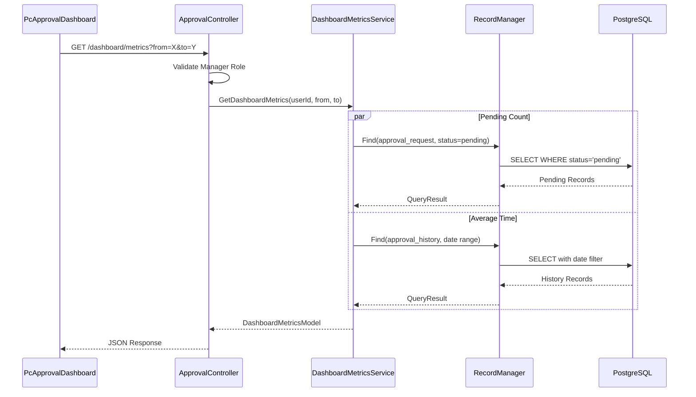
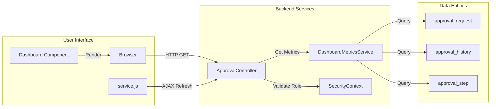
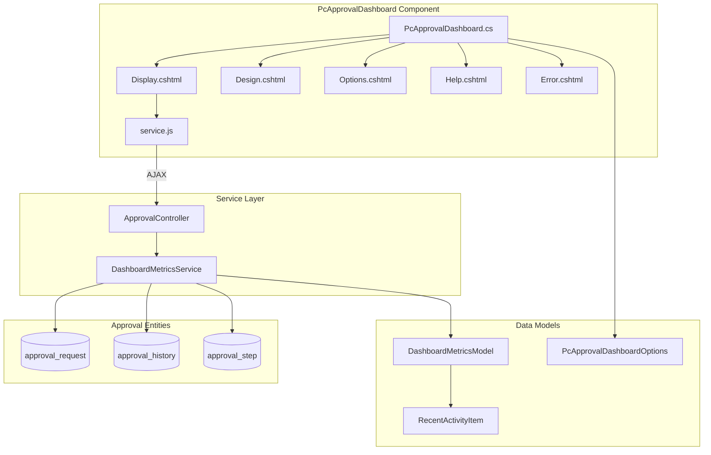
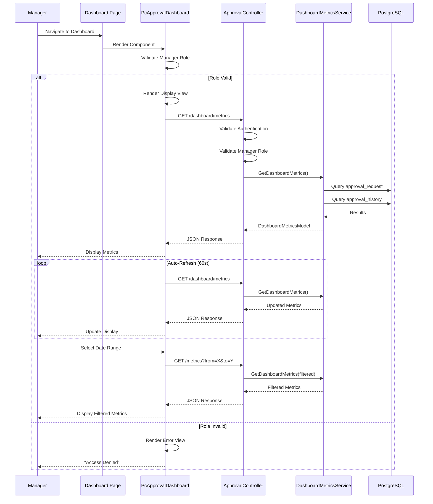
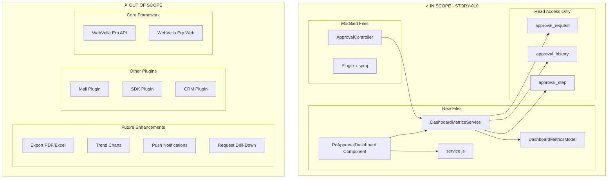

# Agent Action Plan

# 0. Agent Action Plan
## 0.1 Intent Clarification

### 0.1.1 Core Feature Objective

Based on the prompt, the Blitzy platform understands that the new feature requirement is to implement a **Manager Approval Dashboard with Real-Time Metrics** (STORY-010) within the WebVella ERP Approval Workflow System. This feature provides managers with visibility into team approval workflow performance through an interactive dashboard displaying key performance indicators.

**Primary Feature Requirements:**

- **Dashboard Page Component**: Create a `PcApprovalDashboard` component following the established WebVella ERP PageComponent pattern with Display, Design, Options, Help, and Error rendering modes
- **Real-Time Metrics Display**: Implement auto-refreshing metrics that update at a configurable interval (default 60 seconds) without requiring full page reload
- **Key Performance Indicators**:
  - **Pending Approvals Count**: Number of approval requests awaiting the manager's action
  - **Average Approval Time**: Mean time from request creation to final approval decision
  - **Approval Rate**: Percentage of approved requests versus total processed (approved + rejected)
  - **Overdue Requests**: Count of pending requests exceeding configured `timeout_hours` from the associated `approval_step`
  - **Recent Activity Feed**: Last 5 approval actions performed showing action type, performer, and timestamp
- **Date Range Filtering**: Allow managers to filter metrics by predefined time periods (7 days, 30 days, 90 days)
- **Role-Based Access Control**: Restrict dashboard access to users with the Manager role

**Implicit Requirements Detected:**

- REST API endpoint for metrics retrieval (`/api/v3.0/p/approval/dashboard/metrics`)
- Dedicated `DashboardMetricsService` service class for metric calculations
- `DashboardMetricsModel` DTO for API response serialization
- Client-side JavaScript (`service.js`) for AJAX-based auto-refresh functionality
- Integration with existing `approval_request` and `approval_history` entities for data queries
- Manager role validation in both component class and API endpoint

### 0.1.2 Special Instructions and Constraints

**Architectural Requirements:**

- Follow the established `PageComponent` base class pattern from `WebVella.Erp.Web.Models`
- Use the `[PageComponent]` attribute for component discovery and registration
- Implement all five render modes: Display, Design, Options, Help, Error
- Place component in the `WebVella.Erp.Plugins.Approval/Components/PcApprovalDashboard/` folder structure
- Extend existing `ApprovalController` with dashboard metrics endpoint

**Integration Directives:**

- Integrate with existing `SecurityContext.CurrentUser` for role validation
- Consume `approval_request` and `approval_history` entities for metrics calculation
- Follow `ResponseModel` envelope pattern for API responses
- Use `RecordManager` and EQL queries for data access

**Pattern Compliance:**

- Match existing component structure from `PcChart` and other WebVella components
- Use Newtonsoft.Json `[JsonProperty]` attributes for all DTOs
- Follow Bootstrap card layout conventions for dashboard metrics display

**User Example - Acceptance Criteria:**

```gherkin
Given I am logged in as a user with Manager role
When I navigate to the Approvals Dashboard
Then I see metrics including Pending Approvals Count, Average Approval Time, Approval Rate, and Overdue Requests

Given the dashboard is displayed
When 60 seconds have elapsed
Then the metrics automatically refresh without requiring page reload

Given I am viewing the dashboard
When I select a date range filter (7 days, 30 days, or 90 days)
Then the metrics update to reflect only the selected time period

Given I am a user without Manager role
When I attempt to access the Approvals Dashboard
Then I receive an access denied message
```

**Testing Acceptance Criteria:**

```gherkin
Given the dashboard metrics service is implemented
When unit tests are executed
Then all metric calculation methods pass validation for boundary conditions, null handling, and correct data aggregation

Given the dashboard API endpoint is implemented
When integration tests are executed
Then the endpoint correctly handles authentication, role validation, date range parameters, and returns properly formatted responses
```

### 0.1.3 Technical Interpretation

These feature requirements translate to the following technical implementation strategy:

| Requirement | Technical Implementation Strategy |
| --- | --- |
| Dashboard component for managers | Create PcApprovalDashboard.cs extending PageComponent with [PageComponent] attribute, Options model, and role validation in InvokeAsync() |
| Real-time metrics display | Implement DashboardMetricsService.cs with methods for each metric calculation using EQL queries against approval_request and approval_history entities |
| Auto-refresh without page reload | Create service.js with setInterval() timer calling dashboard API endpoint via AJAX fetch requests |
| Date range filtering | Add from and to query parameters to API endpoint; implement date filtering in service methods |
| Manager role restriction | Validate SecurityContext.CurrentUser.Roles for "manager" or "administrator" role in both component and API endpoint |
| API endpoint for metrics | Extend ApprovalController.cs with GetDashboardMetrics() action returning DashboardMetricsModel |
| Pending approvals count | Query approval_request WHERE status='pending' AND user is authorized approver for current step |
| Average approval time | Calculate from approval_history timestamp differences for completed requests |
| Approval rate percentage | Compute approved count / (approved + rejected) * 100 from approval_history |
| Overdue requests count | Compare created_on + timeout_hours against current time for pending requests |
| Recent activity feed | Query last 5 records from approval_history ordered by performed_on descending |

To implement the Manager Approval Dashboard, we will:

- **Create** `WebVella.Erp.Plugins.Approval/Components/PcApprovalDashboard/` folder with component class and Razor views
- **Create** `WebVella.Erp.Plugins.Approval/Services/DashboardMetricsService.cs` for metric calculations
- **Create** `WebVella.Erp.Plugins.Approval/Api/DashboardMetricsModel.cs` for response DTO
- **Modify** `WebVella.Erp.Plugins.Approval/Controllers/ApprovalController.cs` to add dashboard metrics endpoint

## 0.2 Repository Scope Discovery

### 0.2.1 Comprehensive File Analysis

**Repository Structure Overview:**

The WebVella ERP platform is a multi-project .NET 9.0 solution with a plugin-based architecture. The Approval Workflow feature will be implemented as a new plugin following the established patterns of existing plugins like `WebVella.Erp.Plugins.Mail`.

**Existing Modules to Reference (Pattern Templates):**

| File Path | Purpose | Relevance |
| --- | --- | --- |
| WebVella.Erp.Web/Models/PageComponent.cs | Base class for page components | Required base class |
| WebVella.Erp.Web/Models/PageComponentAttribute.cs | Component discovery attribute | Registration pattern |
| WebVella.Erp.Web/Models/ComponentMode.cs | Render mode enumeration | View selection logic |
| WebVella.Erp.Web/Components/PcChart/PcChart.cs | Chart component implementation | Component pattern reference |
| WebVella.Erp.Web/Components/PcChart/Display.cshtml | Runtime display view | View structure reference |
| WebVella.Erp.Web/Components/PcChart/Options.cshtml | Configuration options view | Options panel reference |
| WebVella.Erp.Web/Controllers/WebApiController.cs | API controller patterns | Endpoint implementation reference |
| WebVella.Erp.Plugins.Mail/MailPlugin.cs | Plugin initialization | Plugin lifecycle pattern |
| WebVella.Erp.Plugins.Mail/WebVella.Erp.Plugins.Mail.csproj | Plugin project structure | csproj configuration reference |
| WebVella.Erp/Api/SecurityContext.cs | Security context management | Role validation reference |
| WebVella.Erp/Api/Models/BaseModels.cs | ResponseModel envelope | API response pattern |
| WebVella.Erp/Api/RecordManager.cs | Record CRUD operations | Data access pattern |

**Configuration Files to Review:**

| File Path | Purpose |
| --- | --- |
| WebVella.ERP3.sln | Solution file for plugin project registration |
| WebVella.Erp.Web/WebVella.Erp.Web.csproj | Dependencies and embedded resources |
| global.json | SDK version configuration |

**Documentation Files:**

| File Path | Purpose |
| --- | --- |
| jira-stories/STORY-009-manager-dashboard-metrics.md | Detailed story specification |
| jira-stories/stories-export.json | Stories metadata export |
| docs/ | Developer documentation |

### 0.2.2 Integration Point Discovery

**API Endpoints Connected to Feature:**

| Endpoint Pattern | Entity | Operation |
| --- | --- | --- |
| /api/v3.0/p/approval/dashboard/metrics | DashboardMetrics | GET metrics data |
| /api/v3/en_US/eql | EQL execution | Query approval entities |

**Database Entities Affected:**

| Entity | Access Type | Fields Used |
| --- | --- | --- |
| approval_request | Read | id, status, current_step_id, created_on, created_by |
| approval_history | Read | id, request_id, action, performed_by, performed_on |
| approval_step | Read | id, timeout_hours, approver_type |
| user | Read | id, roles (for authorization) |

**Service Classes Requiring Updates:**

| Service | Modification Type | Purpose |
| --- | --- | --- |
| ApprovalController | MODIFY | Add GetDashboardMetrics() endpoint |

**Controllers/Handlers to Modify:**

| Controller | Modification |
| --- | --- |
| WebVella.Erp.Plugins.Approval/Controllers/ApprovalController.cs | Add dashboard metrics endpoint with manager role validation |

### 0.2.3 New File Requirements

**New Source Files to Create:**

| File Path | Purpose |
| --- | --- |
| WebVella.Erp.Plugins.Approval/Components/PcApprovalDashboard/PcApprovalDashboard.cs | Dashboard page component class implementing PageComponent base with metrics display logic and role validation |
| WebVella.Erp.Plugins.Approval/Components/PcApprovalDashboard/Display.cshtml | Runtime display view rendering live metrics with Bootstrap cards and auto-refresh capability |
| WebVella.Erp.Plugins.Approval/Components/PcApprovalDashboard/Design.cshtml | Page builder preview view showing dashboard layout with sample/placeholder metrics |
| WebVella.Erp.Plugins.Approval/Components/PcApprovalDashboard/Options.cshtml | Configuration options panel for refresh interval, date range defaults, and display preferences |
| WebVella.Erp.Plugins.Approval/Components/PcApprovalDashboard/Help.cshtml | Component documentation view explaining dashboard features and configuration options |
| WebVella.Erp.Plugins.Approval/Components/PcApprovalDashboard/Error.cshtml | Error display view for access denied and data retrieval failures using ValidationException |
| WebVella.Erp.Plugins.Approval/Components/PcApprovalDashboard/service.js | Client-side JavaScript for AJAX metrics retrieval and auto-refresh timer using setInterval() |
| WebVella.Erp.Plugins.Approval/Services/DashboardMetricsService.cs | Service class containing metric calculation methods querying approval_request and approval_history entities |
| WebVella.Erp.Plugins.Approval/Api/DashboardMetricsModel.cs | Response DTO containing all dashboard metric values with Newtonsoft.Json serialization attributes |

**New Folder Structure:**

```plaintext
WebVella.Erp.Plugins.Approval/
├── Components/
│   └── PcApprovalDashboard/
│       ├── PcApprovalDashboard.cs
│       ├── Display.cshtml
│       ├── Design.cshtml
│       ├── Options.cshtml
│       ├── Help.cshtml
│       ├── Error.cshtml
│       └── service.js
├── Services/
│   └── DashboardMetricsService.cs
├── Api/
│   └── DashboardMetricsModel.cs
└── Controllers/
    └── ApprovalController.cs (existing - to modify)
```

**New Test Files to Create:**

| File Path | Purpose |
| --- | --- |
| WebVella.Erp.Plugins.Approval.Tests/Services/DashboardMetricsServiceTests.cs | Unit test coverage for metric calculations |
| WebVella.Erp.Plugins.Approval.Tests/Controllers/ApprovalControllerDashboardTests.cs | Integration tests for dashboard API endpoint |

### 0.2.4 Web Search Research Conducted

**Best Practices Research Topics:**

| Topic | Application |
| --- | --- |
| ASP.NET Core ViewComponent patterns | Component architecture design |
| Bootstrap 5 dashboard card layouts | UI display structure |
| JavaScript setInterval for auto-refresh | Client-side refresh implementation |
| Role-based authorization in ASP.NET Core | Manager role validation |
| EQL query optimization | Efficient metrics calculation |

### 0.2.5 Existing Plugin Reference Files

The implementation follows patterns established in existing WebVella ERP plugins:

| Reference File | Pattern Extracted |
| --- | --- |
| WebVella.Erp.Plugins.Mail/MailPlugin.cs | Plugin initialization with SecurityContext.OpenSystemScope(), ProcessPatches(), and SetSchedulePlans() |
| WebVella.Erp.Plugins.Mail/Services/SmtpInternalService.cs | Service class pattern with RecordManager operations |
| WebVella.Erp.Web/Components/PcChart/PcChart.cs | PageComponent implementation with Options model and ViewBag population |
| WebVella.Erp.Web/Components/PcChart/Display.cshtml | Razor view with TagHelper registration and ViewBag consumption |

## 0.3 Dependency Inventory

### 0.3.1 Private and Public Packages

**Core Framework Dependencies:**

| Registry | Package Name | Version | Purpose |
| --- | --- | --- | --- |
| Microsoft | Microsoft.AspNetCore.App | (Framework Reference) | ASP.NET Core framework for web application |
| Microsoft | Microsoft.NET.Sdk.Razor | net9.0 | Razor SDK for component views |
| NuGet | Microsoft.AspNetCore.Mvc.NewtonsoftJson | 9.0.10 | JSON serialization for API responses |
| NuGet | Newtonsoft.Json | 13.0.4 | JSON serialization utilities |

**WebVella ERP Project Dependencies:**

| Registry | Package/Project Name | Version | Purpose |
| --- | --- | --- | --- |
| Project | WebVella.Erp | (local) | Core ERP runtime library |
| Project | WebVella.Erp.Web | (local) | Web components and PageComponent base |
| NuGet | WebVella.TagHelpers | 1.7.2 | Custom TagHelpers for UI rendering |

**Plugin-Specific Dependencies:**

| Registry | Package Name | Version | Purpose |
| --- | --- | --- | --- |
| NuGet | HtmlAgilityPack | 1.12.4 | HTML parsing (for potential content rendering) |
| NuGet | Microsoft.CodeAnalysis.CSharp.Scripting | 4.14.0 | Code evaluation for dynamic options |

### 0.3.2 Import Updates

**Files Requiring Import Updates:**

| File Pattern | Import Changes |
| --- | --- |
| WebVella.Erp.Plugins.Approval/Components/PcApprovalDashboard/*.cs | Add using WebVella.Erp.Api, using WebVella.Erp.Web.Models, using WebVella.Erp.Plugins.Approval.Services |
| WebVella.Erp.Plugins.Approval/Services/DashboardMetricsService.cs | Add using WebVella.Erp.Api, using WebVella.Erp.Plugins.Approval.Api |
| WebVella.Erp.Plugins.Approval/Controllers/ApprovalController.cs | Add using WebVella.Erp.Plugins.Approval.Services |

**Standard Import Block for New Component:**

```csharp
using Microsoft.AspNetCore.Mvc;
using Newtonsoft.Json;
using System;
using System.Collections.Generic;
using System.Linq;
using System.Threading.Tasks;
using WebVella.Erp.Api;
using WebVella.Erp.Api.Models;
using WebVella.Erp.Exceptions;
using WebVella.Erp.Web.Models;
using WebVella.Erp.Web.Services;
using WebVella.Erp.Plugins.Approval.Services;
using WebVella.Erp.Plugins.Approval.Api;
```

**Standard Import Block for Razor Views:**

```razor
@addTagHelper *, WebVella.Erp.Plugins.Core
@addTagHelper *, WebVella.Erp.Web
@addTagHelper *, WebVella.TagHelpers
@using WebVella.Erp.Web.Utils;
@using WebVella.Erp.Web.Components;
@using WebVella.Erp.Web.Models;
@using WebVella.Erp.Plugins.Approval.Components;
```

### 0.3.3 External Reference Updates

**Configuration Files:**

| File Pattern | Update Required |
| --- | --- |
| WebVella.Erp.Plugins.Approval/WebVella.Erp.Plugins.Approval.csproj | Add EmbeddedResource entries for component service.js files |
| WebVella.ERP3.sln | Verify Approval plugin project is registered |

**Project File Updates for Component Registration:**

The `.csproj` file should include embedded resource entries:

```xml
<ItemGroup>
  <EmbeddedResource Include="Components\PcApprovalDashboard\service.js" />
</ItemGroup>
```

### 0.3.4 Dependency Relationship Diagram

```mermaid
graph TB
    subgraph Plugins["Plugin Layer"]
        ApprovalPlugin["WebVella.Erp.Plugins.Approval"]
        PcDashboard["PcApprovalDashboard"]
        DashService["DashboardMetricsService"]
        DashModel["DashboardMetricsModel"]
        ApprovalCtrl["ApprovalController"]
    end
    
    subgraph Web["Web Layer"]
        PageComponent["PageComponent"]
        ErpRequestContext["ErpRequestContext"]
        PageComponentLib["PageComponentLibraryService"]
    end
    
    subgraph Core["Core Layer"]
        SecurityContext["SecurityContext"]
        RecordManager["RecordManager"]
        ResponseModel["ResponseModel"]
        ErpUser["ErpUser"]
    end
    
    subgraph Data["Data Layer"]
        ApprovalRequest["approval_request"]
        ApprovalHistory["approval_history"]
        ApprovalStep["approval_step"]
    end
    
    ApprovalPlugin --> Web
    PcDashboard --> PageComponent
    PcDashboard --> ErpRequestContext
    PcDashboard --> DashService
    PcDashboard --> SecurityContext
    ApprovalCtrl --> DashService
    ApprovalCtrl --> ResponseModel
    ApprovalCtrl --> SecurityContext
    DashService --> RecordManager
    DashService --> DashModel
    DashService --> ApprovalRequest
    DashService --> ApprovalHistory
    DashService --> ApprovalStep
    SecurityContext --> ErpUser
```



### 0.3.5 Story Dependencies

| Dependency Story | Relationship | Required Artifacts |
| --- | --- | --- |
| STORY-007 (REST API) | Prerequisite | ApprovalController base class, ResponseModel envelope pattern |
| STORY-008 (UI Components) | Prerequisite | PageComponent implementation pattern, component folder structure |
| STORY-002 (Entity Schema) | Prerequisite | approval_request, approval_history, approval_step entities |
| STORY-004 (Service Layer) | Prerequisite | Service class patterns with RecordManager |

## 0.4 Integration Analysis

### 0.4.1 Existing Code Touchpoints

**Direct Modifications Required:**

| File Path | Modification Type | Description |
| --- | --- | --- |
| WebVella.Erp.Plugins.Approval/Controllers/ApprovalController.cs | ADD | Add GetDashboardMetrics() endpoint with [Route("api/v3.0/p/approval/dashboard/metrics")] |
| WebVella.Erp.Plugins.Approval/Controllers/ApprovalController.cs | ADD | Add IsManagerRole() private helper method for role validation |

**Controller Integration Point:**

```csharp
// Add to ApprovalController.cs
[Route("api/v3.0/p/approval/dashboard/metrics")]
[HttpGet]
public ActionResult GetDashboardMetrics(
    [FromQuery] DateTime? from = null, 
    [FromQuery] DateTime? to = null)
```

### 0.4.2 Dependency Injections

**Service Registration:**

| Container | Service | Lifetime | Purpose |
| --- | --- | --- | --- |
| Component Constructor | ErpRequestContext | Scoped | Request context for page and user information |
| Service Method | RecordManager | Transient | Data access for entity queries |
| Component Method | PageComponentLibraryService | Transient | Component metadata retrieval |

**Constructor Injection Pattern:**

```csharp
public PcApprovalDashboard([FromServices] ErpRequestContext coreReqCtx)
{
    ErpRequestContext = coreReqCtx;
}
```

### 0.4.3 Database/Schema Access

**Entity Query Patterns:**

| Entity | Query Type | EQL Pattern |
| --- | --- | --- |
| approval_request | Read (count pending) | SELECT * FROM approval_request WHERE status = 'pending' |
| approval_history | Read (metrics) | SELECT * FROM approval_history WHERE performed_on >= @fromDate AND performed_on <= @toDate |
| approval_step | Read (timeout config) | Joined via approval_request.current_step_id |

**Data Access Flow:**



### 0.4.4 Security Integration

**Role Validation Points:**

| Integration Point | Validation Method | Action on Failure |
| --- | --- | --- |
| Component Display Mode | IsManagerRole(SecurityContext.CurrentUser) | Return Error view with "Access denied" |
| API Endpoint | IsManagerRole(SecurityContext.CurrentUser) | Return 403 Forbidden response |

**Role Check Implementation:**

```csharp
private bool IsManagerRole(ErpUser user)
{
    if (user == null) return false;
    foreach (var role in user.Roles)
    {
        if (role.Name.ToLower() == "manager" || 
            role.Name.ToLower() == "administrator")
            return true;
    }
    return false;
}
```

### 0.4.5 PageComponent Framework Integration

**Component Registration:**

| Attribute Property | Value | Purpose |
| --- | --- | --- |
| Label | "Approval Dashboard" | Display name in page builder |
| Library | "WebVella" | Component library grouping |
| Description | "Real-time dashboard displaying team approval workflow metrics" | Help text |
| Version | "0.0.1" | Component version |
| IconClass | "fas fa-chart-line" | FontAwesome icon |
| Category | "Approval Workflow" | Category in component palette |

**ViewBag Contract:**

| Key | Type | Purpose |
| --- | --- | --- |
| Options | PcApprovalDashboardOptions | Component configuration |
| Node | PageBodyNode | Current page node |
| ComponentMeta | PageComponentMeta | Component metadata |
| RequestContext | ErpRequestContext | Request context |
| AppContext | ErpAppContext | Application context |
| ComponentContext | PageComponentContext | Component render context |
| CurrentUser | ErpUser | Authenticated user |
| Error | ValidationException | Error details (for Error view) |

### 0.4.6 Client-Side Integration

**JavaScript AJAX Integration:**

| Event | Handler | API Call |
| --- | --- | --- |
| Page Load | initDashboard() | GET /api/v3.0/p/approval/dashboard/metrics |
| Timer Tick | refreshMetrics() | GET /api/v3.0/p/approval/dashboard/metrics |
| Date Filter Change | onDateRangeChange() | GET /api/v3.0/p/approval/dashboard/metrics?from=X&to=Y |

**Auto-Refresh Timer:**

```javascript
let refreshInterval = 60000; // 60 seconds default
setInterval(function() {
    refreshMetrics();
}, refreshInterval);
```

### 0.4.7 Integration Points Summary



## 0.5 Technical Implementation

### 0.5.1 File-by-File Execution Plan

**CRITICAL**: Every file listed here MUST be created or modified as specified.

**Group 1 - Core Dashboard Component Files:**

| Action | File Path | Purpose |
| --- | --- | --- |
| CREATE | WebVella.Erp.Plugins.Approval/Components/PcApprovalDashboard/PcApprovalDashboard.cs | Dashboard page component class with [PageComponent] attribute, PcApprovalDashboardOptions nested class, InvokeAsync() method with role validation, and view mode routing |
| CREATE | WebVella.Erp.Plugins.Approval/Components/PcApprovalDashboard/Display.cshtml | Runtime display view with Bootstrap card layout for five metrics, date range selector dropdown, and JavaScript initialization for auto-refresh |
| CREATE | WebVella.Erp.Plugins.Approval/Components/PcApprovalDashboard/Design.cshtml | Page builder preview showing dashboard layout with placeholder sample metrics |
| CREATE | WebVella.Erp.Plugins.Approval/Components/PcApprovalDashboard/Options.cshtml | Configuration panel with form fields for refresh_interval, date_range_default, show_overdue_alert, and metrics_to_display |
| CREATE | WebVella.Erp.Plugins.Approval/Components/PcApprovalDashboard/Help.cshtml | Documentation view explaining dashboard features, metrics calculations, and configuration options |
| CREATE | WebVella.Erp.Plugins.Approval/Components/PcApprovalDashboard/Error.cshtml | Error display using <wv-validation> tag helper with ValidationException |
| CREATE | WebVella.Erp.Plugins.Approval/Components/PcApprovalDashboard/service.js | Client-side JavaScript with AJAX fetch for /api/v3.0/p/approval/dashboard/metrics and setInterval() auto-refresh |

**Group 2 - Service and Model Files:**

| Action | File Path | Purpose |
| --- | --- | --- |
| CREATE | WebVella.Erp.Plugins.Approval/Services/DashboardMetricsService.cs | Service class with GetDashboardMetrics(), GetPendingApprovalsCount(), GetAverageApprovalTime(), GetApprovalRate(), GetOverdueRequestsCount(), GetRecentActivity() methods |
| CREATE | WebVella.Erp.Plugins.Approval/Api/DashboardMetricsModel.cs | DTO with [JsonProperty] attributes for pending_approvals_count, average_approval_time_hours, approval_rate_percent, overdue_requests_count, recent_activity, metrics_as_of, date_range_start, date_range_end |
| CREATE | WebVella.Erp.Plugins.Approval/Api/RecentActivityItem.cs | DTO for activity feed item with action, performed_by, performed_on, request_id |

**Group 3 - API Endpoint Modification:**

| Action | File Path | Purpose |
| --- | --- | --- |
| MODIFY | WebVella.Erp.Plugins.Approval/Controllers/ApprovalController.cs | Add GetDashboardMetrics() endpoint with [Route("api/v3.0/p/approval/dashboard/metrics")], [HttpGet], date range query parameters, manager role validation, and DashboardMetricsService invocation |

**Group 4 - Project Configuration:**

| Action | File Path | Purpose |
| --- | --- | --- |
| MODIFY | WebVella.Erp.Plugins.Approval/WebVella.Erp.Plugins.Approval.csproj | Add <EmbeddedResource Include="Components\PcApprovalDashboard\service.js" /> entry |

### 0.5.2 Implementation Approach per File

**Step 1: Create Component Class Structure**

Establish the foundation by creating `PcApprovalDashboard.cs`:

- Define `[PageComponent]` attribute with metadata
- Create nested `PcApprovalDashboardOptions` class with JsonProperty attributes
- Implement `InvokeAsync(PageComponentContext context)` with:
  - Context validation
  - Options deserialization
  - Manager role check (return Error view if unauthorized)
  - ViewBag population
  - Mode-based view routing

**Step 2: Create Metrics Service**

Implement `DashboardMetricsService.cs`:

- Initialize `RecordManager` in constructor
- `GetDashboardMetrics()` - Orchestrates all metric calculations
- `GetPendingApprovalsCount()` - Query `approval_request` WHERE `status='pending'`
- `GetAverageApprovalTime()` - Calculate from `approval_history` timestamp differences
- `GetApprovalRate()` - Compute approved / (approved + rejected) \* 100
- `GetOverdueRequestsCount()` - Compare `created_on + timeout_hours` vs current time
- `GetRecentActivity()` - Query last 5 `approval_history` records

**Step 3: Create Response DTOs**

Implement `DashboardMetricsModel.cs` and `RecentActivityItem.cs`:

- All properties with `[JsonProperty(PropertyName = "snake_case")]`
- Proper types: `int`, `double`, `DateTime`, `List<RecentActivityItem>`

**Step 4: Add API Endpoint**

Extend `ApprovalController.cs`:

- Add route `[Route("api/v3.0/p/approval/dashboard/metrics")]`
- Implement `GetDashboardMetrics([FromQuery] DateTime? from, [FromQuery] DateTime? to)`
- Validate manager role, return 403 if unauthorized
- Default date range to last 30 days
- Invoke `DashboardMetricsService.GetDashboardMetrics()`
- Return `ResponseModel` with metrics

**Step 5: Create Display View**

Implement `Display.cshtml`:

- Register TagHelpers
- Cast ViewBag to typed locals
- Bootstrap row with five metric cards
- Date range dropdown selector
- JavaScript initialization call

**Step 6: Create Client-Side Logic**

Implement `service.js`:

- `initDashboard()` - Initial load and timer setup
- `refreshMetrics()` - Fetch API and update DOM
- `updateMetricCards()` - DOM manipulation for metric values
- `onDateRangeChange()` - Handle filter selection

**Step 7: Create Supporting Views**

Implement remaining cshtml files:

- `Design.cshtml` - Static preview with sample data
- `Options.cshtml` - Form fields using `wv-field-*` TagHelpers
- `Help.cshtml` - Documentation text
- `Error.cshtml` - `<wv-validation>` with error message

### 0.5.3 Component Options Configuration

| Option | JSON Property | Type | Default | Description |
| --- | --- | --- | --- | --- |
| Refresh Interval | refresh_interval | Number | 60 | Seconds between auto-refresh cycles |
| Date Range Default | date_range_default | Text | "30d" | Default date range (7d/30d/90d) |
| Show Overdue Alert | show_overdue_alert | Boolean | true | Highlight overdue requests with alert styling |
| Metrics to Display | metrics_to_display | Text | "pending,avg_time,approval_rate,overdue,recent" | Comma-separated list of visible metrics |

### 0.5.4 API Response Structure

**Endpoint**: `GET /api/v3.0/p/approval/dashboard/metrics`

**Query Parameters:**

- `from` (DateTime, optional): Start date for metrics range
- `to` (DateTime, optional): End date for metrics range

**Response Model:**

```json
{
  "timestamp": "2026-01-17T14:35:00Z",
  "success": true,
  "message": "Dashboard metrics retrieved successfully",
  "object": {
    "pending_approvals_count": 12,
    "average_approval_time_hours": 4.5,
    "approval_rate_percent": 87.5,
    "overdue_requests_count": 2,
    "recent_activity": [
      {
        "action": "approved",
        "performed_by": "John Smith",
        "performed_on": "2026-01-17T14:30:00Z",
        "request_id": "a1b2c3d4-..."
      }
    ],
    "metrics_as_of": "2026-01-17T14:35:00Z",
    "date_range_start": "2025-12-18T00:00:00Z",
    "date_range_end": "2026-01-17T23:59:59Z"
  },
  "errors": []
}
```

### 0.5.5 Dashboard Architecture Diagram



### 0.5.6 User Workflow Sequence



---

### 0.5.7 Validation and Screenshot Requirements

After implementation is complete, execute tests and capture UI screenshots:

**Test Execution:**

```bash
dotnet test WebVella.Erp.Plugins.Approval.Tests --filter "FullyQualifiedName~Dashboard"
```

**Required Screenshots (save to** `/mnt/user-data/outputs/screenshots/`**):**

**Test Results:**

- `test-dashboard-all-passing.png` - Terminal output showing all dashboard tests passing

**UI Validation:**

- `dashboard-display.png` - Dashboard displaying all five metrics
- `dashboard-options.png` - Options panel in page builder
- `dashboard-access-denied.png` - Error view for non-Manager user

**Validation Checklist:**

- [ ]  All unit and integration tests pass (terminal screenshot captured)

- [ ]  Dashboard renders correctly with all metrics visible

- [ ]  Options panel displays configuration fields

- [ ]  Access denied message displays for non-Manager users

## 0.6 Scope Boundaries

### 0.6.1 Exhaustively In Scope

**Dashboard Component Files:**

| Pattern | Files Included |
| --- | --- |
| WebVella.Erp.Plugins.Approval/Components/PcApprovalDashboard/**/* | All component files (cs, cshtml, js) |

**Specific Component Files:**

| File Path | Status |
| --- | --- |
| WebVella.Erp.Plugins.Approval/Components/PcApprovalDashboard/PcApprovalDashboard.cs | CREATE |
| WebVella.Erp.Plugins.Approval/Components/PcApprovalDashboard/Display.cshtml | CREATE |
| WebVella.Erp.Plugins.Approval/Components/PcApprovalDashboard/Design.cshtml | CREATE |
| WebVella.Erp.Plugins.Approval/Components/PcApprovalDashboard/Options.cshtml | CREATE |
| WebVella.Erp.Plugins.Approval/Components/PcApprovalDashboard/Help.cshtml | CREATE |
| WebVella.Erp.Plugins.Approval/Components/PcApprovalDashboard/Error.cshtml | CREATE |
| WebVella.Erp.Plugins.Approval/Components/PcApprovalDashboard/service.js | CREATE |

**Service Layer Files:**

| File Path | Status |
| --- | --- |
| WebVella.Erp.Plugins.Approval/Services/DashboardMetricsService.cs | CREATE |

**API Model Files:**

| File Path | Status |
| --- | --- |
| WebVella.Erp.Plugins.Approval/Api/DashboardMetricsModel.cs | CREATE |
| WebVella.Erp.Plugins.Approval/Api/RecentActivityItem.cs | CREATE |

**Controller Integration:**

| File Path | Status | Lines Affected |
| --- | --- | --- |
| WebVella.Erp.Plugins.Approval/Controllers/ApprovalController.cs | MODIFY | Add endpoint method (~50 lines) |

**Project Configuration:**

| File Path | Status | Changes |
| --- | --- | --- |
| WebVella.Erp.Plugins.Approval/WebVella.Erp.Plugins.Approval.csproj | MODIFY | Add EmbeddedResource entry |

**Entity Data Access (Read-Only):**

| Entity | Access Pattern |
| --- | --- |
| approval_request | Query pending requests, calculate overdue |
| approval_history | Query for metrics calculation, recent activity |
| approval_step | Read timeout_hours configuration |

### 0.6.2 Explicitly Out of Scope

**Features NOT Included in STORY-010:**

| Feature | Reason for Exclusion |
| --- | --- |
| Additional filtering by team member | Future enhancement - not in acceptance criteria |
| Filtering by department or workflow type | Future enhancement - not in acceptance criteria |
| Export functionality (PDF/Excel) | Future enhancement - not in acceptance criteria |
| Historical trend charts/graphs | Future enhancement - not in acceptance criteria |
| Push notifications via SignalR | Future enhancement - auto-refresh uses polling |
| Drill-down to individual requests | Future enhancement - not in acceptance criteria |
| Customizable dashboard layouts | Future enhancement - not in acceptance criteria |
| Drag-and-drop widget arrangement | Future enhancement - not in acceptance criteria |

**System Areas NOT Modified:**

| Area | Reason |
| --- | --- |
| approval_workflow entity | Read-only via existing services |
| approval_step entity creation/update | Only reading timeout_hours |
| approval_rule entity | Not relevant to dashboard metrics |
| Existing STORY-001 through STORY-008 files | Prerequisites - assumed complete |
| Email notification system | Handled by existing notification jobs |
| Escalation processing | Handled by existing escalation jobs |
| User management/role creation | Uses existing role infrastructure |

**Code NOT Modified:**

| File Pattern | Reason |
| --- | --- |
| WebVella.Erp.Web/Components/**/* | Core framework - no changes |
| WebVella.Erp/Api/**/* | Core API - no changes |
| WebVella.Erp.Plugins.Mail/**/* | Separate plugin - no changes |
| WebVella.Erp.Plugins.SDK/**/* | Separate plugin - no changes |
| Database schema migrations | Dashboard uses existing entities |

### 0.6.3 Scope Boundary Diagram



### 0.6.4 Acceptance Criteria Coverage

| Acceptance Criteria | Implementation Scope |
| --- | --- |
| AC1: Manager sees dashboard with metrics | PcApprovalDashboard component with Display view |
| AC2: 60-second auto-refresh | service.js with setInterval() |
| AC3: Date range filter | API query parameters, UI selector |
| AC4: Pending count accuracy | DashboardMetricsService.GetPendingApprovalsCount() |
| AC5: Overdue detection | DashboardMetricsService.GetOverdueRequestsCount() |
| AC6: Non-manager access denied | Role validation in component and API |
| Testing AC1: Unit tests pass | DashboardMetricsServiceTests with terminal screenshot validation |
| Testing AC2: Integration tests pass | ApprovalControllerDashboardTests with terminal screenshot validation |

### 0.6.5 Testing Scope

**Unit Tests (In Scope):**

| Test Category | Coverage |
| --- | --- |
| DashboardMetricsService methods | All calculation methods |
| Role validation logic | IsManagerRole() method |
| Date range parameter handling | Default and custom ranges |
| Null/empty data handling | Boundary conditions |

**Integration Tests (In Scope):**

| Test Category | Coverage |
| --- | --- |
| API endpoint authentication | 401 for unauthenticated |
| API endpoint authorization | 403 for non-manager |
| API response format | ResponseModel envelope |
| Date range filtering | Correct metrics scoping |

**Tests Out of Scope:**

| Test Category | Reason |
| --- | --- |
| UI/Selenium tests | Not specified in acceptance criteria |
| Load/performance tests | Not specified in acceptance criteria |
| Cross-browser testing | Not specified in acceptance criteria |

## 0.7 Rules for Feature Addition

### 0.7.1 Component Development Patterns

**PageComponent Implementation Rules:**

- All page components MUST extend `WebVella.Erp.Web.Models.PageComponent` base class
- Component class MUST be decorated with `[PageComponent]` attribute including Label, Library, Description, Version, and IconClass
- Component MUST implement `InvokeAsync(PageComponentContext context)` method returning `Task<IViewComponentResult>`
- Options MUST be defined as a nested class with `[JsonProperty]` attributes for all properties
- View selection MUST use `ComponentMode` enum: Display, Design, Options, Help, Error
- Error handling MUST catch exceptions and return Error view with `ValidationException` in ViewBag

**ViewBag Contract Rules:**

- ViewBag.Options MUST contain deserialized options object
- ViewBag.Node MUST contain current `PageBodyNode`
- ViewBag.ComponentMeta MUST contain component metadata
- ViewBag.RequestContext MUST contain `ErpRequestContext`
- ViewBag.AppContext MUST contain `ErpAppContext.Current`
- ViewBag.Error MUST contain `ValidationException` for Error view

### 0.7.2 Service Layer Patterns

**Service Class Rules:**

- Service classes MUST be stateless with instance-per-call `RecordManager`
- Service methods MUST validate input parameters
- Service methods MUST handle null/empty result sets gracefully
- Service methods returning metrics MUST use appropriate data types (int for counts, double for percentages/averages)
- Database operations SHOULD use EQL queries via `RecordManager.Find()`

**Data Access Rules:**

- All entity queries MUST use `RecordManager` or EQL
- Query results MUST be validated for success before accessing data
- Large result sets MUST implement pagination where appropriate
- DateTime values MUST be handled in UTC

### 0.7.3 API Endpoint Patterns

**Controller Rules:**

- API endpoints MUST be decorated with `[Authorize]` attribute
- Endpoints MUST return `ResponseModel` envelope
- Route naming MUST follow pattern `/api/v3.0/p/approval/[resource]`
- Role validation MUST occur before business logic execution
- Unauthorized access MUST return 403 Forbidden with descriptive message
- Exceptions MUST be caught and returned as `response.Success = false` with error message

**Response Model Rules:**

- Success responses MUST set `response.Success = true`
- Success responses MUST include data in `response.Object`
- Error responses MUST set `response.Success = false`
- Error responses MUST include meaningful `response.Message`
- Response DTOs MUST use `[JsonProperty]` with snake_case property names

### 0.7.4 Security Requirements

**Authentication Rules:**

- All API endpoints MUST require authentication via `[Authorize]` attribute
- Component Display mode MUST validate user authentication

**Authorization Rules:**

- Dashboard access MUST be restricted to Manager or Administrator roles
- Role validation MUST check `SecurityContext.CurrentUser.Roles`
- Role names MUST be compared case-insensitively
- Unauthorized access MUST log the attempt (recommended)
- Unauthorized component access MUST display Error view with clear message
- Unauthorized API access MUST return 403 status code

### 0.7.5 Client-Side Integration Rules

**JavaScript Rules:**

- JavaScript MUST be placed in `service.js` file within component folder
- AJAX calls MUST use `fetch()` API or equivalent
- Auto-refresh MUST use `setInterval()` with configurable interval
- DOM updates MUST be efficient (update specific elements, not full page)
- Error handling MUST display user-friendly messages
- Timer MUST be cleared on component unload if applicable

**Refresh Behavior Rules:**

- Default refresh interval: 60 seconds
- Refresh MUST NOT cause full page reload
- Refresh MUST update metrics in place
- Refresh errors MUST NOT break the timer cycle

### 0.7.6 Razor View Patterns

**View Structure Rules:**

- Views MUST register TagHelpers: `WebVella.Erp.Plugins.Core`, `WebVella.Erp.Web`, `WebVella.TagHelpers`
- Views MUST include required `@using` statements
- Views MUST cast ViewBag values to typed locals at the start
- Display views MUST include `is-visible` attribute support where applicable
- Error views MUST use `<wv-validation>` TagHelper

**Naming Conventions:**

- Display.cshtml - Runtime user view
- Design.cshtml - Page builder preview
- Options.cshtml - Configuration panel
- Help.cshtml - Documentation
- Error.cshtml - Error display

### 0.7.7 Performance Considerations

**Query Optimization Rules:**

- Metrics calculations SHOULD minimize database round trips
- Count queries SHOULD use EQL COUNT functions where available
- Date range filters MUST be applied at the database level
- Large result sets MUST be limited (e.g., recent activity = 5 items)

**Caching Considerations:**

- Dashboard metrics are real-time and SHOULD NOT be cached long-term
- Consider caching configuration data (e.g., step timeout values)
- Auto-refresh interval provides natural cache-like behavior

### 0.7.8 Testing Requirements

**Unit Test Coverage:**

- All service methods MUST have unit tests
- Tests MUST cover:
  - Normal operation with valid data
  - Empty/null data handling
  - Boundary conditions (zero counts, 100% approval rate)
  - Date range edge cases

**Integration Test Coverage:**

- API endpoint MUST be tested for:
  - Successful metrics retrieval
  - Authentication enforcement (401)
  - Authorization enforcement (403)
  - Date range parameter handling
  - Response format validation

### 0.7.9 Documentation Standards

**Code Documentation:**

- Component class MUST have XML summary documentation
- Options properties MUST have XML documentation explaining purpose and defaults
- Service methods MUST have XML documentation with parameter descriptions
- Complex calculations MUST have inline comments explaining logic

**Help View Requirements:**

- Help.cshtml MUST explain:
  - Component purpose and features
  - Configuration options and their effects
  - Metrics definitions and calculations
  - Role requirements for access

## 0.8 References

### 0.8.1 Files and Folders Searched

**Core Framework Files Examined:**

| File Path | Purpose |
| --- | --- |
| WebVella.Erp.Web/Models/PageComponent.cs | Base component class definition |
| WebVella.Erp.Web/Models/PageComponentAttribute.cs | Component registration attribute |
| WebVella.Erp.Web/Models/ComponentMode.cs | Render mode enumeration |
| WebVella.Erp.Web/Models/BaseErpPageModel.cs | Page model lifecycle |
| WebVella.Erp.Web/ErpRequestContext.cs | Request context structure |
| WebVella.Erp.Web/WebVella.Erp.Web.csproj | Project dependencies and embedded resources |
| WebVella.Erp.Web/Controllers/WebApiController.cs | API controller patterns |

**Example Component Files Examined:**

| File Path | Purpose |
| --- | --- |
| WebVella.Erp.Web/Components/PcChart/PcChart.cs | Component implementation pattern |
| WebVella.Erp.Web/Components/PcChart/Display.cshtml | Display view structure |
| WebVella.Erp.Web/Components/PcChart/Options.cshtml | Options panel structure |
| WebVella.Erp.Web/Components/PcChart/Help.cshtml | Help view structure |
| WebVella.Erp.Web/Components/PcChart/Error.cshtml | Error view structure |
| WebVella.Erp.Web/Components/PcChart/service.js | Client-side JavaScript pattern |

**API Layer Files Examined:**

| File Path | Purpose |
| --- | --- |
| WebVella.Erp/Api/SecurityContext.cs | Security context and role validation |
| WebVella.Erp/Api/RecordManager.cs | Record CRUD operations |
| WebVella.Erp/Api/Models/BaseModels.cs | ResponseModel envelope pattern |
| WebVella.Erp/Api/Models/ErpUser.cs | User model with roles |
| WebVella.Erp/Api/Models/ErpRole.cs | Role model structure |
| WebVella.Erp/ErpPlugin.cs | Plugin base class |

**Plugin Reference Files Examined:**

| File Path | Purpose |
| --- | --- |
| WebVella.Erp.Plugins.Mail/MailPlugin.cs | Plugin initialization pattern |
| WebVella.Erp.Plugins.Mail/WebVella.Erp.Plugins.Mail.csproj | Plugin project structure |
| WebVella.Erp.Plugins.Mail/Services/SmtpInternalService.cs | Service class pattern |

**Story Specification Files Examined:**

| File Path | Purpose |
| --- | --- |
| jira-stories/STORY-009-manager-dashboard-metrics.md | Detailed feature specification |
| jira-stories/stories-export.json | Stories metadata |
| jira-stories/stories-export.csv | Stories export data |

**Solution and Configuration Files Examined:**

| File Path | Purpose |
| --- | --- |
| WebVella.ERP3.sln | Solution structure |
| global.json | SDK configuration |
| README.md | Repository overview |

### 0.8.2 Folders Explored

| Folder Path | Contents Examined |
| --- | --- |
| `` (root) | Solution files, license, readme |
| WebVella.Erp/ | Core ERP library structure |
| WebVella.Erp/Api/ | Manager classes and cache |
| WebVella.Erp/Api/Models/ | Entity and response models |
| WebVella.Erp.Web/ | Web layer structure |
| WebVella.Erp.Web/Components/ | Component catalog |
| WebVella.Erp.Web/Components/PcChart/ | Chart component example |
| WebVella.Erp.Web/Models/ | Web models including PageComponent |
| WebVella.Erp.Web/Controllers/ | API controllers |
| WebVella.Erp.Plugins.Mail/ | Mail plugin reference |
| jira-stories/ | Story specifications |
| blitzy/ | Documentation artifacts |

### 0.8.3 Technical Specification Sections Referenced

| Section | Purpose |
| --- | --- |
| 2.1 FEATURE CATALOG | Feature specifications and dependencies |
| 6.1 Core Services Architecture | Manager pattern and service architecture |
| 7.3 Page Component Framework | Component architecture and rendering pipeline |

### 0.8.4 User-Provided Attachments

**Story Specification:**

| Attachment | Description |
| --- | --- |
| STORY-010 User Story | Manager Approval Dashboard with Real-Time Metrics - User story defining dashboard requirements, acceptance criteria, and testing criteria |

**No Figma URLs were provided for this feature.**

### 0.8.5 External Dependencies Documentation

| Package | Documentation Reference |
| --- | --- |
| ASP.NET Core 9.0 | Microsoft ASP.NET Core documentation |
| Newtonsoft.Json | JSON.NET documentation |
| WebVella.TagHelpers | WebVella TagHelpers NuGet package |
| Bootstrap 5 | Bootstrap documentation for card layouts |

### 0.8.6 Search Tracking Summary

**Deep Searches Performed:**

| Search # | Tool | Target | Purpose |
| --- | --- | --- | --- |
| 1 | get_source_folder_contents | "" (root) | Repository structure overview |
| 2 | get_source_folder_contents | jira-stories | Story specifications |
| 3 | read_file | STORY-009-manager-dashboard-metrics.md | Detailed feature requirements |
| 4 | get_source_folder_contents | WebVella.Erp.Web | Web layer structure |
| 5 | get_source_folder_contents | WebVella.Erp.Web/Components | Component catalog |
| 6 | get_source_folder_contents | WebVella.Erp.Web/Components/PcChart | Chart component pattern |
| 7 | get_source_folder_contents | WebVella.Erp.Web/Models | Web models |
| 8 | read_file | PageComponent.cs | Base component class |
| 9 | get_source_folder_contents | WebVella.Erp.Plugins.Mail | Plugin pattern |
| 10 | read_file | MailPlugin.cs | Plugin initialization |
| 11 | read_file | MailPlugin.csproj | Plugin project structure |
| 12 | get_source_folder_contents | WebVella.Erp | Core library structure |
| 13 | get_source_folder_contents | WebVella.Erp/Api | API layer |
| 14 | read_file | SecurityContext.cs | Security and roles |
| 15 | get_source_folder_contents | WebVella.Erp/Api/Models | API models |
| 16 | read_file | ErpUser.cs | User model |
| 17 | read_file | BaseModels.cs | Response envelope |
| 18 | read_file | PcChart.cs | Component example |
| 19 | read_file | Display.cshtml | View example |
| 20 | read_file | WebApiController.cs | Controller pattern |
| 21 | read_file | WebVella.Erp.Web.csproj | Dependencies |
| 22 | read_file | global.json | SDK version |

**Tech Spec Sections Retrieved:**

| Section | Purpose |
| --- | --- |
| 2.1 FEATURE CATALOG | Feature dependencies and specifications |
| 6.1 Core Services Architecture | Manager pattern architecture |
| 7.3 Page Component Framework | Component implementation patterns |

### 0.8.7 Validation Checklist

| Validation Item | Status |
| --- | --- |
| All acceptance criteria mapped to implementation | ✓ Complete |
| All required files identified | ✓ Complete |
| Integration points documented | ✓ Complete |
| Scope boundaries defined | ✓ Complete |
| Security requirements specified | ✓ Complete |
| Testing requirements outlined | ✓ Complete |
| Pattern compliance verified | ✓ Complete |
