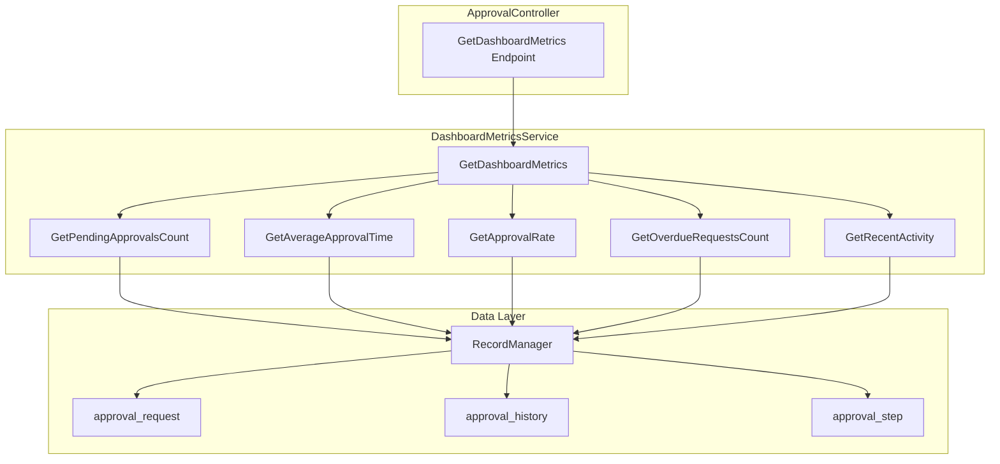
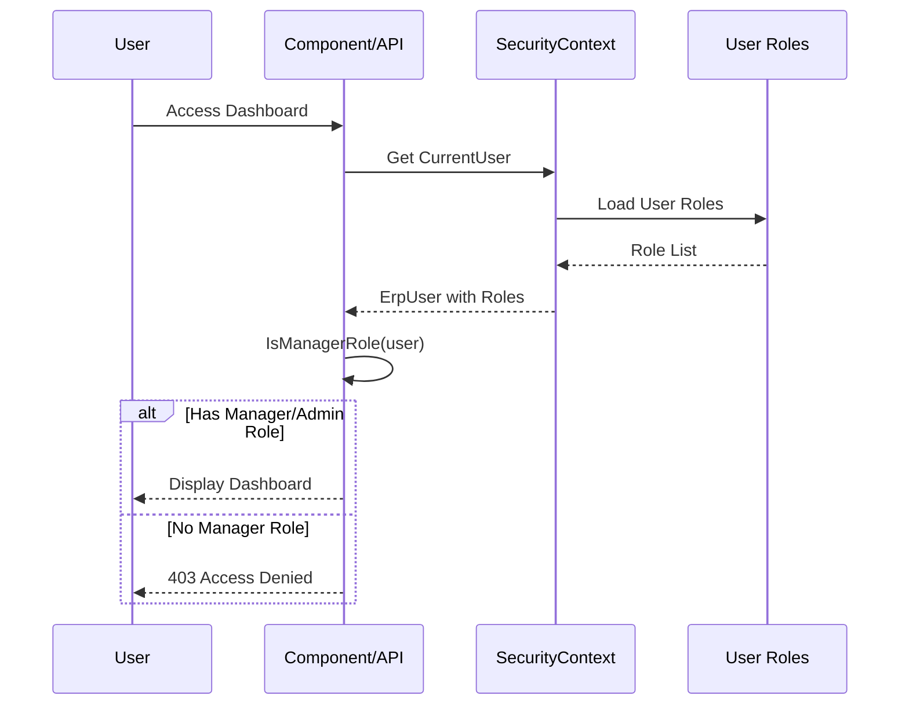

# Agent Action Plan

# 0. Agent Action Plan
## 0.1 Intent Clarification

### 0.1.1 Core Feature Objective

Based on the prompt, the Blitzy platform understands that the new feature requirement is to **implement a Manager Approval Dashboard page component (**`PcApprovalDashboard`**) for the WebVella ERP Approval Workflow system** that provides managers with real-time visibility into team approval workflow performance through key performance indicators.

**Primary Feature Requirements:**

- **Real-Time Metrics Dashboard**: Create a page component that displays five key performance indicators (KPIs) that auto-refresh at a configurable interval (default 60 seconds) without requiring page reload
- **Pending Approvals Count**: Display the number of approval requests currently awaiting action, filtered to requests where the current user is an authorized approver for the current step
- **Average Approval Time**: Calculate and display mean time from request creation to final approval decision, sourced from `approval_history` timestamp differences over the selected date range
- **Approval Rate Percentage**: Show percentage of requests approved versus total processed requests (approved + rejected), providing insight into team approval patterns
- **Overdue Requests Count**: Display count of pending requests that have exceeded their configured `timeout_hours` from the associated `approval_step`, indicating SLA violations
- **Recent Activity Feed**: Show the last 5 approval actions performed, displaying action type, performer, and timestamp for quick visibility into team activity

**Implicit Requirements Detected:**

- The Approval Plugin infrastructure (`WebVella.Erp.Plugins.Approval`) must exist as established by STORY-001 through STORY-008
- Entity schema for `approval_request` and `approval_history` must be in place per STORY-002
- The component must integrate with the existing `ApprovalController` REST API pattern from STORY-007
- Role-based access control requires `SecurityContext.CurrentUser` validation for Manager role
- The component must follow the established WebVella ERP `PageComponent` pattern with five render modes: Display, Design, Options, Help, Error
- Client-side JavaScript (`service.js`) must handle AJAX-based auto-refresh using `setInterval`

**Feature Dependencies and Prerequisites:**

| Dependency | Description | Status |
| --- | --- | --- |
| STORY-007 | REST API Endpoints - Required for ApprovalController pattern and endpoint conventions | Required |
| STORY-008 | UI Page Components - Required for PageComponent implementation pattern, component folder structure, and render mode handling | Required |
| approval_request entity | Source data entity for pending approvals and request counts | Required |
| approval_history entity | Source data entity for approval times, rates, and activity feed | Required |
| Manager role | Security role that determines dashboard access | Required |

### 0.1.2 Special Instructions and Constraints

**Critical Directives:**

- **Follow established WebVella ERP PageComponent pattern**: Component must inherit from `PageComponent` base class and use `[PageComponent]` attribute for registration
- **Maintain consistency with existing approval components**: Follow the same architecture established in STORY-008 for `PcApprovalWorkflowConfig`, `PcApprovalRequestList`, `PcApprovalAction`, and `PcApprovalHistory`
- **Use ResponseModel envelope pattern**: All API responses must follow the standard `{ success, message, object, errors }` structure
- **Manager role restriction**: Dashboard access must be restricted to users with Manager or Administrator role
- **Date range filtering**: Support configurable date ranges (7 days, 30 days, 90 days, or custom range) for metrics calculation

**Architectural Requirements:**

- Use `ErpRequestContext` for request-scoped context injection via `[FromServices]`
- Implement `DashboardMetricsService` following `BaseService` pattern with `RecordManager` for entity queries
- Create `DashboardMetricsModel` DTO with `[JsonProperty]` attributes for consistent JSON serialization
- Register component in "Approval Workflow" category for page builder component palette

**User-Provided Examples:**

User Example - API Response Structure:

```json
{
  "success": true,
  "message": "Dashboard metrics retrieved successfully",
  "object": {
    "pending_approvals_count": 12,
    "average_approval_time_hours": 4.5,
    "approval_rate_percent": 87.5,
    "overdue_requests_count": 2,
    "recent_activity": [
      {
        "action": "approved",
        "performed_by": "John Smith",
        "performed_on": "2026-01-17T14:30:00Z",
        "request_id": "a1b2c3d4-e5f6-7890-abcd-ef1234567890"
      }
    ],
    "metrics_as_of": "2026-01-17T14:35:00Z",
    "date_range_start": "2025-12-18T00:00:00Z",
    "date_range_end": "2026-01-17T23:59:59Z"
  },
  "errors": []
}
```

User Example - Component Options Configuration:

| Option | Type | Default | Description |
| --- | --- | --- | --- |
| refresh_interval | Number | 60 | Seconds between auto-refresh cycles |
| date_range_default | Text | "30d" | Default date range for metrics (7d/30d/90d) |
| show_overdue_alert | Boolean | true | Highlight overdue requests with alert styling |
| metrics_to_display | Text | "pending,avg_time,approval_rate,overdue,recent" | Comma-separated list of metrics to show |

### 0.1.3 Technical Interpretation

These feature requirements translate to the following technical implementation strategy:

- **To implement the dashboard page component**, we will create `PcApprovalDashboard.cs` inheriting from `PageComponent` base class with `[PageComponent]` attribute registration, supporting Display, Design, Options, Help, and Error render modes
- **To provide metrics calculation logic**, we will create `DashboardMetricsService.cs` extending the service pattern with methods for calculating pending counts, average times, approval rates, overdue requests, and recent activity
- **To enable API consumption**, we will extend `ApprovalController.cs` with a new `GetDashboardMetrics` endpoint at `/api/v3.0/p/approval/dashboard/metrics` supporting date range query parameters
- **To support auto-refresh functionality**, we will create `service.js` with AJAX functions for metrics retrieval and `setInterval` timer management
- **To enforce role-based access**, we will implement `IsManagerRole()` validation in both component class and API endpoint
- **To ensure data consistency**, we will create `DashboardMetricsModel.cs` as response DTO with `[JsonProperty]` annotations for all metric properties
- **To validate implementation correctness**, we will create unit tests (`DashboardMetricsServiceTests.cs`) and integration tests (`DashboardApiIntegrationTests.cs`) covering boundary conditions, null handling, authentication, and authorization

## 0.2 Repository Scope Discovery

### 0.2.1 Comprehensive File Analysis

**Existing Modules Requiring Modification:**

| File Path | Modification Type | Purpose |
| --- | --- | --- |
| WebVella.Erp.Plugins.Approval/Controllers/ApprovalController.cs | MODIFY | Add dashboard metrics endpoint /api/v3.0/p/approval/dashboard/metrics with role validation and date range filtering |
| WebVella.ERP3.sln | MODIFY | Add new test project WebVella.Erp.Plugins.Approval.Tests to solution |

**Reference Files for Pattern Implementation:**

| File Path | Reference Purpose |
| --- | --- |
| WebVella.Erp.Web/Components/PcChart/PcChart.cs | PageComponent implementation pattern with Options class, InvokeAsync entry point, ViewBag population, and mode switching |
| WebVella.Erp.Web/Components/PcChart/Display.cshtml | Runtime display view pattern with TagHelper usage |
| WebVella.Erp.Web/Components/PcChart/Design.cshtml | Page builder preview pattern |
| WebVella.Erp.Web/Components/PcChart/Options.cshtml | Configuration options panel pattern with wv-field-* editors |
| WebVella.Erp.Web/Components/PcChart/Error.cshtml | Error display pattern using ValidationException |
| WebVella.Erp.Web/Components/PcChart/Help.cshtml | Component documentation pattern |
| WebVella.Erp.Web/Components/PcChart/service.js | Client-side JavaScript scaffold pattern |
| WebVella.Erp.Web/Models/PageComponent.cs | Base class providing HelpJsApiGeneralSection |
| WebVella.Erp.Web/Models/PageComponentAttribute.cs | Component metadata attribute with Label, Library, Description, Version, IconClass, Category |
| WebVella.Erp.Web/Services/BaseService.cs | Service pattern with RecMan, EntMan, SecMan, RelMan initialization |
| WebVella.Erp.Plugins.SDK/Controllers/AdminController.cs | REST controller pattern with ResponseModel, [Authorize], and route conventions |
| WebVella.Erp.Plugins.SDK/WebVella.Erp.Plugins.SDK.csproj | Plugin project configuration pattern |

**Integration Point Discovery:**

| Integration Point | Location | Description |
| --- | --- | --- |
| ApprovalController | WebVella.Erp.Plugins.Approval/Controllers/ApprovalController.cs | Add dashboard metrics endpoint following existing action patterns |
| approval_request entity | Entity schema (STORY-002) | Source for pending approvals count and overdue request detection |
| approval_history entity | Entity schema (STORY-002) | Source for average approval time, approval rate, and recent activity |
| approval_step entity | Entity schema (STORY-002) | Source for timeout_hours configuration for overdue detection |
| SecurityContext.CurrentUser | WebVella.Erp/Api/SecurityContext.cs | Role validation for Manager access restriction |
| PageComponentLibraryService | WebVella.Erp.Web/Services/PageComponentLibraryService.cs | Component registration and discovery |
| RecordManager | WebVella.Erp/Api/RecordManager.cs | Entity querying via EntityQuery for metrics calculation |

### 0.2.2 New File Requirements

**New Source Files to Create:**

| File Path | Purpose |
| --- | --- |
| WebVella.Erp.Plugins.Approval/Components/PcApprovalDashboard/PcApprovalDashboard.cs | Dashboard page component class implementing PageComponent base with metrics display logic, options model, role validation, and mode switching |
| WebVella.Erp.Plugins.Approval/Components/PcApprovalDashboard/Design.cshtml | Page builder preview view showing dashboard layout with sample/placeholder metrics for design context |
| WebVella.Erp.Plugins.Approval/Components/PcApprovalDashboard/Display.cshtml | Runtime display view rendering live metrics with Bootstrap cards, date range selector, and JavaScript initialization for auto-refresh |
| WebVella.Erp.Plugins.Approval/Components/PcApprovalDashboard/Options.cshtml | Configuration options panel with form fields for refresh_interval, date_range_default, show_overdue_alert, and metrics_to_display |
| WebVella.Erp.Plugins.Approval/Components/PcApprovalDashboard/Help.cshtml | Component documentation view explaining dashboard features, configuration options, and usage instructions |
| WebVella.Erp.Plugins.Approval/Components/PcApprovalDashboard/Error.cshtml | Error display view for access denied and data retrieval failures using ValidationException pattern |
| WebVella.Erp.Plugins.Approval/Components/PcApprovalDashboard/service.js | Client-side JavaScript for AJAX metrics retrieval, auto-refresh timer management, and date range filter handling |
| WebVella.Erp.Plugins.Approval/Services/DashboardMetricsService.cs | Service class containing metric calculation methods querying approval entities with date range filtering |
| WebVella.Erp.Plugins.Approval/Api/DashboardMetricsModel.cs | Response DTO containing all dashboard metric values with JsonProperty annotations |

**New Test Files to Create:**

| File Path | Purpose |
| --- | --- |
| WebVella.Erp.Plugins.Approval.Tests/WebVella.Erp.Plugins.Approval.Tests.csproj | Test project configuration targeting xUnit with references to main approval plugin project |
| WebVella.Erp.Plugins.Approval.Tests/DashboardMetricsServiceTests.cs | Unit tests for DashboardMetricsService validating boundary conditions, null handling, zero-data scenarios, and correct aggregation logic |
| WebVella.Erp.Plugins.Approval.Tests/DashboardApiIntegrationTests.cs | Integration tests for dashboard API endpoint validating authentication (401), authorization (403), date range parameters, and response format |

### 0.2.3 Folder Structure to Create

```plaintext
WebVella.Erp.Plugins.Approval/
├── Components/
│   └── PcApprovalDashboard/
│       ├── PcApprovalDashboard.cs      # Dashboard component class
│       ├── Design.cshtml               # Page builder preview
│       ├── Display.cshtml              # Runtime metrics display
│       ├── Options.cshtml              # Configuration panel
│       ├── Help.cshtml                 # Documentation view
│       ├── Error.cshtml                # Error handling view
│       └── service.js                  # AJAX refresh logic
├── Services/
│   └── DashboardMetricsService.cs      # Metrics calculation service
├── Api/
│   └── DashboardMetricsModel.cs        # Response model
└── Controllers/
    └── ApprovalController.cs           # Add dashboard metrics endpoint (existing)

WebVella.Erp.Plugins.Approval.Tests/
├── WebVella.Erp.Plugins.Approval.Tests.csproj  # Test project
├── DashboardMetricsServiceTests.cs             # Unit tests for service
└── DashboardApiIntegrationTests.cs             # Integration tests for API
```

### 0.2.4 Web Search Research Conducted

The following research areas were considered based on the implementation requirements:

- **WebVella ERP PageComponent pattern**: Analyzed existing components (`PcChart`, `PcGrid`, `PcButton`) in `WebVella.Erp.Web/Components/` for implementation patterns
- [**ASP.NET**](http://ASP.NET) **Core ViewComponent best practices**: Standard patterns for InvokeAsync, ViewBag population, and view resolution
- **xUnit testing patterns for .NET 9.0**: Standard unit and integration test patterns for service layer and API endpoint testing
- **JavaScript setInterval for auto-refresh**: Standard browser API for implementing periodic AJAX refresh without full page reload
- **Bootstrap card layout for dashboard metrics**: Responsive grid layout patterns for KPI display cards

## 0.3 Dependency Inventory

### 0.3.1 Private and Public Packages

**Core Framework Dependencies:**

| Registry | Package Name | Version | Purpose |
| --- | --- | --- | --- |
| NuGet | Microsoft.NET.Sdk.Razor | 9.0.0 | Razor SDK for page component views and cshtml compilation |
| NuGet | Microsoft.AspNetCore.App | 9.0.0 | ASP.NET Core framework reference for MVC, authorization, and DI |
| NuGet | Newtonsoft.Json | 13.0.3 | JSON serialization for options models and API responses |

**Project References:**

| Project | Reference Path | Purpose |
| --- | --- | --- |
| WebVella.Erp | ../WebVella.Erp/WebVella.Erp.csproj | Core ERP API, RecordManager, EntityManager, SecurityContext |
| WebVella.Erp.Web | ../WebVella.Erp.Web/WebVella.Erp.Web.csproj | PageComponent base class, ErpRequestContext, ErpAppContext, services |

**Test Project Dependencies:**

| Registry | Package Name | Version | Purpose |
| --- | --- | --- | --- |
| NuGet | xunit | 2.6.6 | Unit testing framework for .NET |
| NuGet | xunit.runner.visualstudio | 2.5.6 | Visual Studio test runner integration |
| NuGet | Microsoft.NET.Test.Sdk | 17.9.0 | Test platform SDK for .NET 9.0 |
| NuGet | Microsoft.AspNetCore.Mvc.Testing | 9.0.0 | Integration testing for ASP.NET Core applications |
| NuGet | Moq | 4.20.70 | Mocking framework for service isolation in unit tests |

### 0.3.2 Dependency Updates

**Import Updates Required:**

Files requiring new import statements to support the dashboard feature:

| File Pattern | Import Addition | Purpose |
| --- | --- | --- |
| WebVella.Erp.Plugins.Approval/Components/PcApprovalDashboard/*.cs | using WebVella.Erp.Plugins.Approval.Services; | Reference to DashboardMetricsService |
| WebVella.Erp.Plugins.Approval/Components/PcApprovalDashboard/*.cs | using WebVella.Erp.Plugins.Approval.Api; | Reference to DashboardMetricsModel |
| WebVella.Erp.Plugins.Approval/Controllers/ApprovalController.cs | using WebVella.Erp.Plugins.Approval.Services; | Reference to DashboardMetricsService for endpoint |

**WebVella.Erp.Plugins.Approval.csproj Updates:**

The existing approval plugin project file requires embedded resource declarations for the new component files:

```xml
<ItemGroup>
  <EmbeddedResource Include="Components\PcApprovalDashboard\service.js" />
</ItemGroup>
```

### 0.3.3 External Reference Updates

**Configuration Files:**

| File | Update Required |
| --- | --- |
| WebVella.ERP3.sln | Add new test project WebVella.Erp.Plugins.Approval.Tests |

**Project File Configuration for Test Project:**

The new test project (`WebVella.Erp.Plugins.Approval.Tests.csproj`) requires the following configuration:

```xml
<Project Sdk="Microsoft.NET.Sdk">
  <PropertyGroup>
    <TargetFramework>net9.0</TargetFramework>
    <ImplicitUsings>enable</ImplicitUsings>
    <Nullable>enable</Nullable>
    <IsPackable>false</IsPackable>
    <IsTestProject>true</IsTestProject>
  </PropertyGroup>
  <ItemGroup>
    <PackageReference Include="Microsoft.NET.Test.Sdk" Version="17.9.0" />
    <PackageReference Include="xunit" Version="2.6.6" />
    <PackageReference Include="xunit.runner.visualstudio" Version="2.5.6" />
    <PackageReference Include="Microsoft.AspNetCore.Mvc.Testing" Version="9.0.0" />
    <PackageReference Include="Moq" Version="4.20.70" />
  </ItemGroup>
  <ItemGroup>
    <ProjectReference Include="..\WebVella.Erp.Plugins.Approval\WebVella.Erp.Plugins.Approval.csproj" />
  </ItemGroup>
</Project>
```

### 0.3.4 Internal Package Dependencies

**WebVella ERP Internal Dependencies:**

| Internal Package | Namespace | Key Classes Used |
| --- | --- | --- |
| WebVella.Erp.Api | WebVella.Erp.Api | RecordManager, EntityManager, SecurityManager, EntityRelationManager, SecurityContext |
| WebVella.Erp.Api.Models | WebVella.Erp.Api.Models | EntityRecord, EntityQuery, QuerySortObject, QuerySortType, ErpUser, ResponseModel |
| WebVella.Erp.Database | WebVella.Erp.Database | DbContext, DbFileRepository |
| WebVella.Erp.Exceptions | WebVella.Erp.Exceptions | ValidationException |
| WebVella.Erp.Web.Models | WebVella.Erp.Web.Models | PageComponent, PageComponentAttribute, PageComponentContext, ComponentMode, ErpPage, PageBodyNode |
| WebVella.Erp.Web.Services | WebVella.Erp.Web.Services | BaseService, PageComponentLibraryService |
| WebVella.Erp.Web | WebVella.Erp.Web | ErpRequestContext, ErpAppContext |

**Entity Dependencies (from STORY-002):**

| Entity Name | Key Fields Used | Purpose |
| --- | --- | --- |
| approval_request | id, source_record_id, source_entity, workflow_id, current_step_id, status, created_on, created_by | Pending count, overdue detection |
| approval_history | id, request_id, action_type, performed_by, performed_on, comments | Approval time, rate, activity feed |
| approval_step | id, workflow_id, step_order, timeout_hours | Overdue threshold detection |

## 0.4 Integration Analysis

### 0.4.1 Existing Code Touchpoints

**Direct Modifications Required:**

| File | Modification Location | Change Description |
| --- | --- | --- |
| WebVella.Erp.Plugins.Approval/Controllers/ApprovalController.cs | After existing endpoints | Add GetDashboardMetrics() method with [Route("api/v3.0/p/approval/dashboard/metrics")] and [HttpGet] attributes |
| WebVella.Erp.Plugins.Approval/Controllers/ApprovalController.cs | Private methods section | Add IsManagerRole(ErpUser user) helper method for role validation |

**Dependency Injections:**

| File | Injection Point | Service/Dependency |
| --- | --- | --- |
| PcApprovalDashboard.cs | Constructor | [FromServices] ErpRequestContext coreReqCtx - request-scoped context injection |
| ApprovalController.cs | GetDashboardMetrics() method body | new DashboardMetricsService() - instantiation within endpoint |

**Database/Schema Dependencies:**

| Entity | Query Type | Fields Accessed |
| --- | --- | --- |
| approval_request | Find with filter | status (='pending'), current_step_id, created_on |
| approval_history | Find with filter, Sort | action_type, performed_by, performed_on, request_id |
| approval_step | Find by ID | timeout_hours |

### 0.4.2 Service Layer Integration

**DashboardMetricsService Integration Points:**



### 0.4.3 Component Integration Points

**PageComponent Registration:**

| Integration | Description |
| --- | --- |
| [PageComponent] Attribute | Registers component with Label="Approval Dashboard", Library="WebVella", Category="Approval Workflow" |
| PageComponentLibraryService | Discovers component via assembly scanning and adds to component palette |
| InvokeAsync(PageComponentContext) | Standard entry point receiving context with Node, DataModel, Mode, Options |

**ViewBag Contract:**

| ViewBag Key | Type | Purpose |
| --- | --- | --- |
| Options | PcApprovalDashboardOptions | Deserialized component configuration |
| Node | PageBodyNode | Current page body node context |
| ComponentMeta | PageComponentMeta | Component metadata from attribute |
| RequestContext | ErpRequestContext | Current HTTP request context |
| AppContext | ErpAppContext | Application-wide context |
| ComponentContext | PageComponentContext | Full component rendering context |
| CurrentUser | ErpUser | Authenticated user for role display |
| Error | ValidationException | Error details for Error view |

### 0.4.4 REST API Integration

**New Endpoint Specification:**

| Method | Route | Parameters | Response |
| --- | --- | --- | --- |
| GET | /api/v3.0/p/approval/dashboard/metrics | from (DateTime, optional), to (DateTime, optional) | ResponseModel with DashboardMetricsModel |

**Integration with Existing API Pattern:**

Following the established pattern from `ApprovalController`:

```csharp
// Pattern from existing ApprovalController endpoints
var response = new ResponseModel();
try {
    // Validate authentication
    // Validate authorization (Manager role)
    // Call service layer
    // Build success response
} catch (Exception ex) {
    // Build error response
}
return Json(response);
```

### 0.4.5 Client-Side Integration

**service.js Integration Points:**

| Integration | Description |
| --- | --- |
| AJAX Endpoint | GET /api/v3.0/p/approval/dashboard/metrics?from={date}&to={date} |
| Auto-Refresh Timer | setInterval() with configurable interval from Options |
| DOM Updates | Update metric card values and activity feed on response |
| Error Handling | Display toast notifications on API errors |

**Event Listeners:**

| Event | Handler | Purpose |
| --- | --- | --- |
| DOMContentLoaded | Initialize dashboard | Set up initial timer and fetch metrics |
| Date range change | onDateRangeChange() | Fetch metrics for new date range |
| Component unload | Clear interval | Prevent memory leaks by clearing timer |

### 0.4.6 Security Integration

**Role Validation Flow:**



**Role Validation Logic:**

| Role Name | Access Granted |
| --- | --- |
| manager | Yes |
| administrator | Yes |
| Other roles | No (403 Forbidden) |

## 0.5 Technical Implementation

### 0.5.1 File-by-File Execution Plan

**CRITICAL: Every file listed here MUST be created or modified**

**Group 1 - Core Component Files:**

| Action | File Path | Implementation Details |
| --- | --- | --- |
| CREATE | WebVella.Erp.Plugins.Approval/Components/PcApprovalDashboard/PcApprovalDashboard.cs | Implement PageComponent with [PageComponent] attribute, PcApprovalDashboardOptions inner class, InvokeAsync() entry point, role validation via IsManagerRole(), ViewBag population, and mode switching for Display/Design/Options/Help/Error |
| CREATE | WebVella.Erp.Plugins.Approval/Components/PcApprovalDashboard/Design.cshtml | Page builder preview with sample metrics cards showing placeholder values (12 pending, 4.5h avg, 87.5% rate, 2 overdue) |
| CREATE | WebVella.Erp.Plugins.Approval/Components/PcApprovalDashboard/Display.cshtml | Runtime view with Bootstrap card grid layout, date range selector dropdown, metrics display areas, recent activity list, and JavaScript initialization call |
| CREATE | WebVella.Erp.Plugins.Approval/Components/PcApprovalDashboard/Options.cshtml | Configuration form with wv-field-number for refresh_interval, wv-field-select for date_range_default, wv-field-checkbox for show_overdue_alert, wv-field-text for metrics_to_display |
| CREATE | WebVella.Erp.Plugins.Approval/Components/PcApprovalDashboard/Help.cshtml | Documentation explaining dashboard metrics, configuration options, and manager role requirements |
| CREATE | WebVella.Erp.Plugins.Approval/Components/PcApprovalDashboard/Error.cshtml | Error display using wv-validation tag helper with error list from ValidationException |
| CREATE | WebVella.Erp.Plugins.Approval/Components/PcApprovalDashboard/service.js | AJAX functions: fetchDashboardMetrics(), initAutoRefresh(), updateMetricsDisplay(), handleDateRangeChange() with setInterval timer management |

**Group 2 - Service and Model Layer:**

| Action | File Path | Implementation Details |
| --- | --- | --- |
| CREATE | WebVella.Erp.Plugins.Approval/Services/DashboardMetricsService.cs | Service class with GetDashboardMetrics(), GetPendingApprovalsCount(), GetAverageApprovalTime(), GetApprovalRate(), GetOverdueRequestsCount(), GetRecentActivity() methods using RecordManager queries |
| CREATE | WebVella.Erp.Plugins.Approval/Api/DashboardMetricsModel.cs | DTO with [JsonProperty] annotations for pending_approvals_count, average_approval_time_hours, approval_rate_percent, overdue_requests_count, recent_activity list, metrics_as_of, date_range_start, date_range_end |

**Group 3 - Controller Endpoint:**

| Action | File Path | Implementation Details |
| --- | --- | --- |
| MODIFY | WebVella.Erp.Plugins.Approval/Controllers/ApprovalController.cs | Add GetDashboardMetrics() endpoint with [Route("api/v3.0/p/approval/dashboard/metrics")], [HttpGet], date range query parameters, role validation, and DashboardMetricsService invocation |

**Group 4 - Test Infrastructure:**

| Action | File Path | Implementation Details |
| --- | --- | --- |
| CREATE | WebVella.Erp.Plugins.Approval.Tests/WebVella.Erp.Plugins.Approval.Tests.csproj | Test project with xUnit, Moq, Microsoft.AspNetCore.Mvc.Testing references |
| CREATE | WebVella.Erp.Plugins.Approval.Tests/DashboardMetricsServiceTests.cs | Unit tests for each metric calculation method with boundary conditions (zero records, null values, edge cases) |
| CREATE | WebVella.Erp.Plugins.Approval.Tests/DashboardApiIntegrationTests.cs | Integration tests for API endpoint with authentication/authorization scenarios |

### 0.5.2 Implementation Approach per File

**Phase 1 - Establish Foundation:**

- Create `DashboardMetricsModel.cs` with all DTO properties and JSON serialization attributes
- Create `DashboardMetricsService.cs` with method stubs, then implement each metric calculation method
- Validate service methods work correctly with entity queries before proceeding

**Phase 2 - Integrate with Existing Systems:**

- Modify `ApprovalController.cs` to add dashboard metrics endpoint
- Implement role validation following existing authorization patterns
- Connect endpoint to DashboardMetricsService

**Phase 3 - Build Component:**

- Create `PcApprovalDashboard.cs` component class with full InvokeAsync implementation
- Create all Razor views (Display, Design, Options, Help, Error) following PcChart patterns
- Implement `service.js` for AJAX auto-refresh functionality

**Phase 4 - Quality Assurance:**

- Create test project and implement unit tests for DashboardMetricsService
- Implement integration tests for API endpoint
- Validate all acceptance criteria are met

### 0.5.3 Key Implementation Patterns

**Component Class Pattern (from PcChart.cs):**

```csharp
[PageComponent(Label = "Approval Dashboard", Library = "WebVella", 
    Description = "Real-time dashboard displaying team approval workflow metrics", 
    Version = "0.0.1", IconClass = "fas fa-chart-line", Category = "Approval Workflow")]
public class PcApprovalDashboard : PageComponent
{
    protected ErpRequestContext ErpRequestContext { get; set; }

    public PcApprovalDashboard([FromServices] ErpRequestContext coreReqCtx)
    {
        ErpRequestContext = coreReqCtx;
    }
    // ... InvokeAsync implementation
}
```

**Service Method Pattern (from existing services):**

```csharp
public int GetPendingApprovalsCount(Guid userId)
{
    var query = new EntityQuery("approval_request");
    query.Query = EntityQuery.QueryEQ("status", "pending");
    var result = recMan.Find(query);
    // Filter by authorized approver and return count
}
```

**API Endpoint Pattern (from ApprovalController):**

```csharp
[Route("api/v3.0/p/approval/dashboard/metrics")]
[HttpGet]
public ActionResult GetDashboardMetrics([FromQuery] DateTime? from = null, 
    [FromQuery] DateTime? to = null)
{
    var response = new ResponseModel();
    try {
        // Validate, execute, return
    } catch (Exception ex) {
        response.Success = false;
        response.Message = ex.Message;
    }
    return Json(response);
}
```

### **0.5.3.1 UI Validation, Test Execution, and Screenshot Documentation**

After implementation is complete, validate the dashboard renders correctly **and all tests pass**:

**Validation Steps:**

1. **Execute all tests** and capture results before UI validation
2. Start the WebVella ERP application
3. Navigate to the page builder and add the Approval Dashboard component to a test page
4. Authenticate as a Manager role user
5. Load the dashboard in Display mode
6. Capture screenshots at each validation checkpoint

**Test Execution (run before UI validation):**

```bash
# Run unit tests
dotnet test WebVella.Erp.Plugins.Approval.Tests/WebVella.Erp.Plugins.Approval.Tests.csproj --filter "FullyQualifiedName~DashboardMetricsServiceTests"

# Run integration tests
dotnet test WebVella.Erp.Plugins.Approval.Tests/WebVella.Erp.Plugins.Approval.Tests.csproj --filter "FullyQualifiedName~DashboardApiIntegrationTests"

# Run all dashboard-related tests together
dotnet test WebVella.Erp.Plugins.Approval.Tests/WebVella.Erp.Plugins.Approval.Tests.csproj
```

**Required Screenshots (save to** `/mnt/user-data/outputs/screenshots/`**):**

**Test Results:**

- `test-unit-dashboard-metrics-service.png` - Terminal output showing all DashboardMetricsServiceTests passing
- `test-integration-dashboard-api.png` - Terminal output showing all DashboardApiIntegrationTests passing
- `test-all-passing-summary.png` - Complete test run summary showing total passed/failed/skipped counts

**UI Validation:**

- `dashboard-page-builder.png` - Component visible in page builder palette under "Approval Workflow" category
- `dashboard-display-initial.png` - Dashboard initial load showing all five metrics cards
- `dashboard-display-with-data.png` - Dashboard with sample data populated (if test data exists)
- `dashboard-date-range-selector.png` - Date range dropdown expanded showing 7d/30d/90d options
- `dashboard-overdue-alert.png` - Overdue requests metric with alert styling (if applicable)
- `dashboard-recent-activity.png` - Recent activity feed showing formatted entries
- `dashboard-options-panel.png` - Options panel in page builder Design mode
- `dashboard-access-denied.png` - Error view when accessed by non-Manager user
- `dashboard-responsive-mobile.png` - Dashboard layout on mobile viewport (375px width)
- `dashboard-responsive-tablet.png` - Dashboard layout on tablet viewport (768px width)

**Test Validation Checklist:**

- [ ] All unit tests in DashboardMetricsServiceTests pass (6/6 expected)

- [ ] All integration tests in DashboardApiIntegrationTests pass (6/6 expected)

- [ ] Zero test failures in complete test run

- [ ] No test warnings or skipped tests (unless explicitly marked as skipped)

- [ ] Test execution completes in reasonable time (&lt;30 seconds for unit tests, &lt;60 seconds for integration tests)

**UI Validation Checklist:**

- [ ] All five metrics display with appropriate formatting (numbers, percentages, times)

- [ ] Date range selector is functional and visible

- [ ] Auto-refresh indicator shows "Last updated" timestamp

- [ ] Recent activity feed displays with proper formatting (action, user, time)

- [ ] Overdue requests show alert styling when `show_overdue_alert` is true

- [ ] Component appears in page builder palette with correct icon (fa-chart-line)

- [ ] Options panel displays all configuration fields correctly

- [ ] Access denied message displays for non-Manager users

- [ ] Layout is responsive across desktop/tablet/mobile breakpoints

- [ ] No console errors appear in browser developer tools.

### 0.5.4 User Interface Design

**Dashboard Layout Structure:**

```plaintext
+----------------------------------------------------------+
|  Approval Dashboard                    [Date Range: v]    |
+----------------------------------------------------------+
|  +------------+  +------------+  +------------+           |
|  | Pending    |  | Avg Time   |  | Approval   |           |
|  |    12      |  |   4.5h     |  |   87.5%    |           |
|  +------------+  +------------+  +------------+           |
|                                                           |
|  +------------+  +--------------------------------+       |
|  | Overdue    |  | Recent Activity                |       |
|  |    2       |  | - Approved by John (2m ago)   |       |
|  | [ALERT]    |  | - Rejected by Mary (15m ago)  |       |
|  +------------+  | - Delegated by Bob (1h ago)   |       |
|                  +--------------------------------+       |
+----------------------------------------------------------+
|  Last updated: 2026-01-17 14:35:00 | Auto-refresh: 60s   |
+----------------------------------------------------------+
```

**No Figma URLs were provided for this feature. The UI implementation will follow existing WebVella ERP component styling patterns with Bootstrap-based card layouts.**

## 0.6 Scope Boundaries

### 0.6.1 Exhaustively In Scope

**Dashboard Component Files (use trailing wildcards where patterns apply):**

| Pattern | Description |
| --- | --- |
| WebVella.Erp.Plugins.Approval/Components/PcApprovalDashboard/**/* | All files in dashboard component folder |
| WebVella.Erp.Plugins.Approval/Components/PcApprovalDashboard/*.cs | Component class file |
| WebVella.Erp.Plugins.Approval/Components/PcApprovalDashboard/*.cshtml | All Razor view files (Design, Display, Options, Help, Error) |
| WebVella.Erp.Plugins.Approval/Components/PcApprovalDashboard/*.js | Client-side JavaScript file |

**Service Layer Files:**

| File Path | Description |
| --- | --- |
| WebVella.Erp.Plugins.Approval/Services/DashboardMetricsService.cs | Metrics calculation service class |
| WebVella.Erp.Plugins.Approval/Api/DashboardMetricsModel.cs | Response DTO model |

**Controller Modifications:**

| File Path | Specific Scope |
| --- | --- |
| WebVella.Erp.Plugins.Approval/Controllers/ApprovalController.cs | Add GetDashboardMetrics() endpoint method |
| WebVella.Erp.Plugins.Approval/Controllers/ApprovalController.cs | Add IsManagerRole() private helper method |

**Test Files:**

| Pattern | Description |
| --- | --- |
| WebVella.Erp.Plugins.Approval.Tests/**/* | All test project files |
| WebVella.Erp.Plugins.Approval.Tests/*.csproj | Test project configuration |
| WebVella.Erp.Plugins.Approval.Tests/*Tests.cs | All test class files |

**Project Configuration:**

| File Path | Specific Scope |
| --- | --- |
| WebVella.Erp.Plugins.Approval/WebVella.Erp.Plugins.Approval.csproj | Add EmbeddedResource for service.js |
| WebVella.ERP3.sln | Add test project reference |

**Acceptance Criteria Validation:**

| AC ID | Scope Item |
| --- | --- |
| AC1 | Dashboard page with five metrics display for Manager role users |
| AC2 | Auto-refresh timer with 60-second default interval |
| AC3 | Date range filter supporting 7d, 30d, 90d, and custom range |
| AC4 | Pending approvals count filtered by authorized approver |
| AC5 | Overdue requests count based on timeout_hours threshold |
| AC6 | Access denied for non-Manager users (403 response) |
| AC7 | Unit tests for metrics calculation with boundary conditions |
| AC8 | Integration tests for API authentication and authorization |
| TEST-1 | Complete test suite executes successfully with zero failures |
| TEST-2 | Terminal screenshots captured showing all unit tests passing (DashboardMetricsServiceTests) |
| TEST-3 | Terminal screenshots captured showing all integration tests passing (DashboardApiIntegrationTests) |
| UI-1 | Dashboard renders correctly in browser with all five metrics visible |
| UI-2 | Screenshots captured validating visual correctness across desktop/tablet/mobile viewports |
| UI-3 | No JavaScript console errors during initialization or auto-refresh cycles |
| UI-4 | Component successfully registered in page builder component palette under "Approval Workflow" category |

---

### 0.6.2 Explicitly Out of Scope

**Future Enhancements (Not Part of STORY-009):**

| Enhancement | Reason Excluded |
| --- | --- |
| Additional filtering by team member, department, or workflow type | Not specified in requirements; future enhancement |
| Export functionality for metrics data (PDF/Excel) | Not specified; would require additional file generation logic |
| Historical trend charts and graphs | Not specified; requires additional charting library integration |
| Push notifications via SignalR for real-time updates | Not specified; auto-refresh via polling is the current approach |
| Drill-down to individual request details from metrics | Not specified; separate navigation/linking feature |
| Customizable dashboard layouts with drag-and-drop widgets | Not specified; would require significant page builder enhancements |

**Unrelated Features and Modules:**

| Area | Reason Excluded |
| --- | --- |
| Other approval UI components (PcApprovalWorkflowConfig, PcApprovalRequestList, PcApprovalAction, PcApprovalHistory) | Already implemented in STORY-008 |
| Approval entity schema changes | Schema is established in STORY-002 |
| Service layer modifications beyond dashboard metrics | Core services established in STORY-004 |
| Notification and escalation job changes | Implemented in STORY-006 |
| Other REST API endpoints | Existing endpoints from STORY-007 unchanged |

**Code Quality Exclusions:**

| Area | Reason Excluded |
| --- | --- |
| Performance optimizations beyond feature requirements | Standard implementation first; optimize later if needed |
| Refactoring of existing code unrelated to dashboard integration | Maintain existing code stability |
| Additional features not explicitly specified in the story | Strict scope adherence |
| Database indexing or query optimization | Not specified; standard queries are sufficient |

### 0.6.3 Boundary Conditions

**Data Handling Boundaries:**

| Condition | Expected Behavior |
| --- | --- |
| No pending approvals exist | Return 0 for pending_approvals_count |
| No completed approvals in date range | Return 0 for average_approval_time_hours and approval_rate_percent |
| No overdue requests | Return 0 for overdue_requests_count |
| No recent activity | Return empty array for recent_activity |
| Invalid date range (from > to) | Use default 30-day range |
| Null date parameters | Default to last 30 days from current date |

**Access Control Boundaries:**

| User State | Expected Behavior |
| --- | --- |
| Unauthenticated user | 401 Unauthorized response |
| User without Manager/Administrator role | 403 Forbidden response |
| User with Manager role | Full dashboard access |
| User with Administrator role | Full dashboard access |

**Component Rendering Boundaries:**

| Context | Expected Behavior |
| --- | --- |
| Display mode without Manager role | Error view with access denied message |
| Design mode (page builder) | Show preview with placeholder data regardless of role |
| Options mode | Show configuration form regardless of role |
| Help mode | Show documentation regardless of role |

## 0.7 Rules for Feature Addition

### 0.7.1 Component Development Rules

**PageComponent Pattern Requirements:**

- Component class MUST inherit from `PageComponent` base class (`WebVella.Erp.Web.Models.PageComponent`)
- Component MUST be decorated with `[PageComponent]` attribute specifying Label, Library, Description, Version, IconClass, and Category
- Component MUST implement `InvokeAsync(PageComponentContext context)` method returning `Task<IViewComponentResult>`
- Options class MUST be defined as a nested public class with `[JsonProperty]` attributes on all properties
- All configuration options MUST have sensible default values

**View Naming Conventions:**

- Display.cshtml - Runtime rendering view (required)
- Design.cshtml - Page builder preview view (required)
- Options.cshtml - Configuration panel view (required)
- Help.cshtml - Documentation view (required)
- Error.cshtml - Error display view (required)
- service.js - Client-side JavaScript (optional, but required for AJAX functionality)

**ViewBag Contract Requirements:**

All views MUST receive the following ViewBag keys:

- `Options` - Deserialized options instance
- `Node` - PageBodyNode context
- `ComponentMeta` - PageComponentMeta from attribute
- `RequestContext` - ErpRequestContext instance
- `AppContext` - ErpAppContext.Current
- `ComponentContext` - Full PageComponentContext

### 0.7.2 Service Layer Rules

**BaseService Pattern:**

- Services MAY extend from `BaseService` class to inherit RecMan, EntMan, SecMan, RelMan, Fs properties
- Services SHOULD use `RecordManager.Find()` with `EntityQuery` for data retrieval
- Services MUST handle null results gracefully and return appropriate defaults
- All date/time calculations MUST use UTC timestamps consistently

**Query Construction:**

- Use `EntityQuery.QueryEQ()` for equality comparisons
- Use `EntityQuery.QueryAND()` and `EntityQuery.QueryOR()` for compound conditions
- Use `EntityQuery.QueryGTE()` and `EntityQuery.QueryLTE()` for date range filtering
- Specify `QuerySortObject` for ordering with `QuerySortType.Descending` for recent-first results

### 0.7.3 API Endpoint Rules

**Controller Pattern Requirements:**

- Controller MUST use `[Authorize]` attribute at class or method level
- Endpoints MUST follow route pattern `/api/v3.0/p/approval/{resource}/{action}`
- All responses MUST use `ResponseModel` envelope with success, message, object, and errors properties
- Error responses MUST set `response.Success = false` and include descriptive error message
- Role-based authorization MUST be validated within endpoint methods (not just attribute-based)

**HTTP Status Mapping:**

| Condition | HTTP Status | Response |
| --- | --- | --- |
| Success | 200 OK | ResponseModel with success=true |
| Unauthenticated | 401 Unauthorized | Default ASP.NET Core response |
| Unauthorized (wrong role) | 403 Forbidden | ResponseModel with success=false |
| Bad request parameters | 400 Bad Request | ResponseModel with validation errors |
| Server error | 500 Internal Server Error | ResponseModel with error message |

### 0.7.4 Security Rules

**Role Validation Requirements:**

- Dashboard access MUST be restricted to users with `manager` or `administrator` role
- Role names MUST be compared case-insensitively using `.ToLower()` comparison
- `SecurityContext.CurrentUser` MUST be used for authentication context
- Null user checks MUST return access denied immediately

**Data Scoping:**

- Metrics MUST be scoped to requests where the current user is an authorized approver
- Overdue detection MUST use `timeout_hours` from `approval_step` configuration
- Activity feed MUST be limited to configurable count (default 5 items)

### 0.7.5 Client-Side Rules

**JavaScript Pattern Requirements:**

- MUST use `"use strict";` directive at file start
- MUST implement proper cleanup of `setInterval` timers to prevent memory leaks
- AJAX calls MUST include error handling with user-friendly error messages
- DOM updates MUST be performed only after successful API response validation

**Auto-Refresh Implementation:**

- Default refresh interval MUST be 60 seconds
- Refresh interval MUST be configurable through Options panel
- Timer MUST be cleared on component unload/page navigation
- Manual refresh button SHOULD be available for immediate update

### 0.7.6 Testing Rules

**Unit Test Requirements:**

- Each public method in DashboardMetricsService MUST have at least one unit test
- Tests MUST cover boundary conditions (zero records, null values, edge dates)
- Tests MUST validate correct data aggregation logic
- Tests SHOULD use Moq for mocking RecordManager dependencies

**Integration Test Requirements:**

- Tests MUST validate authentication requirement (401 for unauthenticated)
- Tests MUST validate authorization requirement (403 for non-manager)
- Tests MUST validate date range parameter handling
- Tests MUST validate response format matches DashboardMetricsModel structure

### Section 0.7.7 - Test Execution and UI Validation Requirements:

**Test Execution:**

- All unit tests MUST pass before proceeding to UI validation
- All integration tests MUST pass before proceeding to UI validation
- Terminal screenshots MUST capture full test output including pass/fail counts
- Test execution MUST complete without errors, warnings, or unexpected skipped tests
- Screenshots MUST show test output with timestamps and execution duration

**UI Validation:**

- Component MUST render without errors in both page builder Design mode and runtime Display mode
- Screenshots MUST be captured for all critical visual states documented in section 0.5.3.1
- Browser console MUST show zero JavaScript errors during component lifecycle
- Component MUST appear in page builder component palette under "Approval Workflow" category
- Responsive layouts MUST be validated at 375px (mobile), 768px (tablet), and 1920px (desktop) widths
- All screenshots MUST be saved to `/mnt/user-data/outputs/screenshots/` directory with descriptive filenames

### 0.7.8 Performance Considerations

**Query Optimization:**

- Metrics queries SHOULD be designed for efficient execution on approval entity tables
- Avoid N+1 query patterns; retrieve related data in batch queries where possible
- Consider query result caching for frequently accessed metrics (with short TTL due to real-time nature)

**Auto-Refresh Efficiency:**

- Refresh interval of 60 seconds balances real-time visibility with server load
- Consider implementing conditional refresh (only update if data changed)
- Activity feed limit of 5 items prevents excessive data transfer

## 0.8 References

### 0.8.1 Repository Files and Folders Searched

**Core Framework Analysis:**

| Path | Purpose |
| --- | --- |
| WebVella.Erp.Web/Models/PageComponent.cs | Base class for page components |
| WebVella.Erp.Web/Models/PageComponentAttribute.cs | Component metadata attribute definition |
| WebVella.Erp.Web/Models/PageComponentContext.cs | Component rendering context |
| WebVella.Erp.Web/Models/ComponentMode.cs | Enumeration for render modes |
| WebVella.Erp.Web/Services/BaseService.cs | Service layer base class pattern |
| WebVella.Erp.Web/Services/PageComponentLibraryService.cs | Component discovery and registration |
| WebVella.Erp/Api/RecordManager.cs | Entity record query operations |
| WebVella.Erp/Api/SecurityContext.cs | Security context and user authentication |

**Component Pattern References:**

| Path | Purpose |
| --- | --- |
| WebVella.Erp.Web/Components/PcChart/PcChart.cs | Complete PageComponent implementation example |
| WebVella.Erp.Web/Components/PcChart/Display.cshtml | Runtime display view pattern |
| WebVella.Erp.Web/Components/PcChart/Design.cshtml | Page builder preview pattern |
| WebVella.Erp.Web/Components/PcChart/Options.cshtml | Configuration panel pattern |
| WebVella.Erp.Web/Components/PcChart/Error.cshtml | Error handling view pattern |
| WebVella.Erp.Web/Components/PcChart/Help.cshtml | Documentation view pattern |
| WebVella.Erp.Web/Components/PcChart/service.js | Client-side JavaScript pattern |

**Plugin Structure References:**

| Path | Purpose |
| --- | --- |
| WebVella.Erp.Plugins.SDK/WebVella.Erp.Plugins.SDK.csproj | Plugin project configuration |
| WebVella.Erp.Plugins.SDK/Controllers/AdminController.cs | REST controller pattern with ResponseModel |
| WebVella.Erp.Plugins.SDK/Components/ | Plugin component folder structure |

**Solution Configuration:**

| Path | Purpose |
| --- | --- |
| WebVella.ERP3.sln | Solution file structure |
| WebVella.Erp.Web/WebVella.Erp.Web.csproj | Web project configuration (net9.0) |
| global.json | SDK version configuration |

**Story Dependencies:**

| Path | Purpose |
| --- | --- |
| jira-stories/STORY-007-approval-rest-api.md | ApprovalController pattern reference |
| jira-stories/STORY-008-approval-ui-components.md | PageComponent implementation patterns |
| jira-stories/STORY-009-manager-dashboard-metrics.md | Current story specification |

### 0.8.2 Attachments Provided

**No file attachments were provided for this story.**

The implementation will rely on:

- Code patterns from existing WebVella ERP components
- Story specifications from STORY-007 and STORY-008
- Technical specification sections retrieved from the document

### 0.8.3 Figma URLs and Screens

**No Figma URLs were provided for this feature.**

The user interface implementation will follow:

- Existing WebVella ERP component styling conventions
- Bootstrap-based card layout patterns for metric display
- Standard form controls for date range selection
- Consistent styling with other approval workflow components

### 0.8.4 Technical Specification Sections Referenced

| Section | Content Summary |
| --- | --- |
| 2.1 FEATURE CATALOG | Feature overview including F-009 Manager Approval Dashboard specification, dependencies, and metrics definitions |
| 4.5 API REQUEST WORKFLOWS | REST API request/response flow patterns, ResponseModel envelope structure, and authentication/authorization flow |

### 0.8.5 External Documentation References

| Reference | URL | Purpose |
| --- | --- | --- |
| ASP.NET Core ViewComponent Documentation | docs.microsoft.com | Standard ViewComponent patterns |
| xUnit Documentation | xunit.net | Unit testing framework reference |
| Bootstrap Card Component | getbootstrap.com | UI card layout patterns |

### 0.8.6 Source Code Pattern References

**From User Story Technical Implementation Details:**

| Source Pattern | Purpose | Location |
| --- | --- | --- |
| PcApprovalWorkflowConfig | PageComponent structure reference | STORY-008 |
| ApprovalWorkflowService | Service layer pattern | STORY-004 |
| ApprovalController | REST API controller pattern | STORY-007 |
| PageComponent base class | Component lifecycle contract | WebVella.Erp.Web/Models/PageComponent.cs |

### 0.8.7 Validation Checklist

| Item | Status |
| --- | --- |
| All required sub-sections documented | ✓ Complete |
| File scope exhaustively identified | ✓ Complete |
| Integration points mapped | ✓ Complete |
| Dependencies inventoried | ✓ Complete |
| Scope boundaries defined | ✓ Complete |
| Implementation rules documented | ✓ Complete |
| References cited | ✓ Complete |
