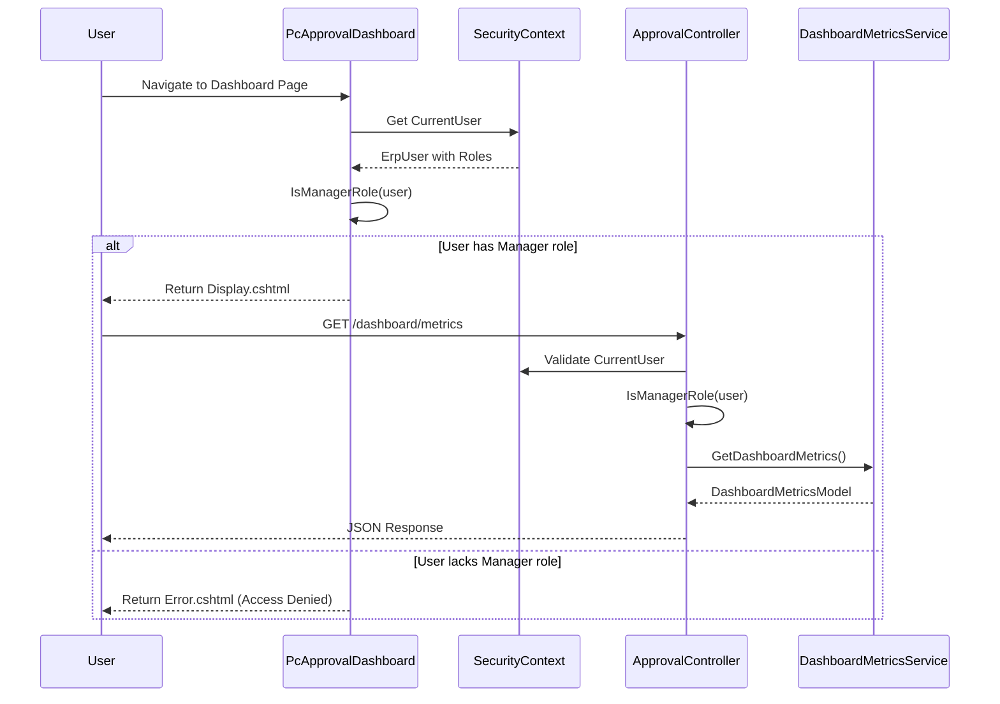
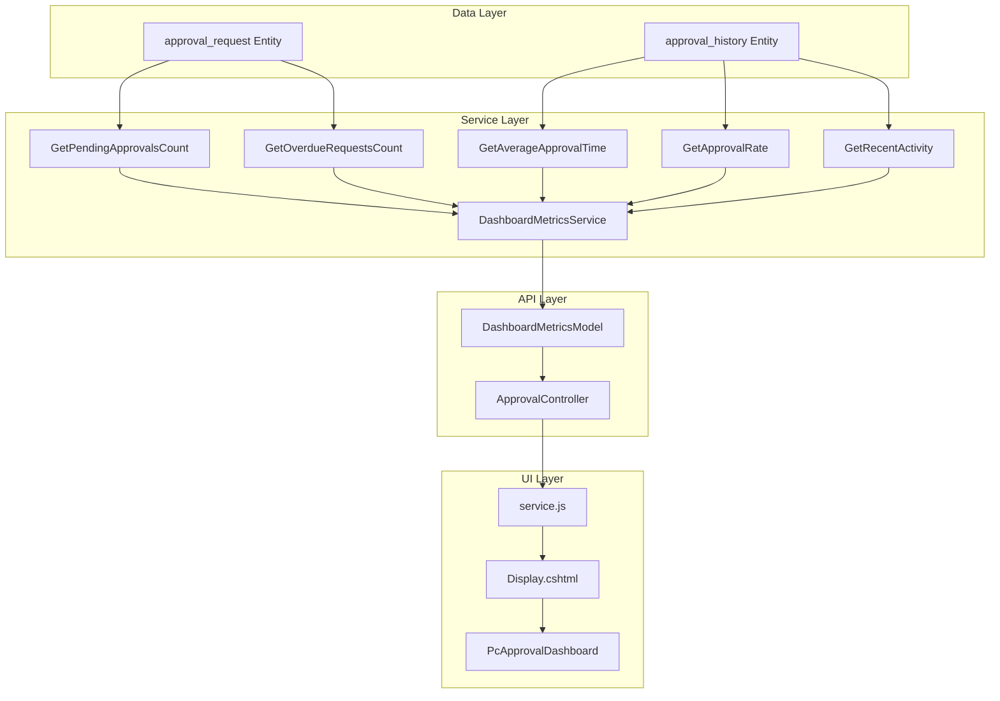
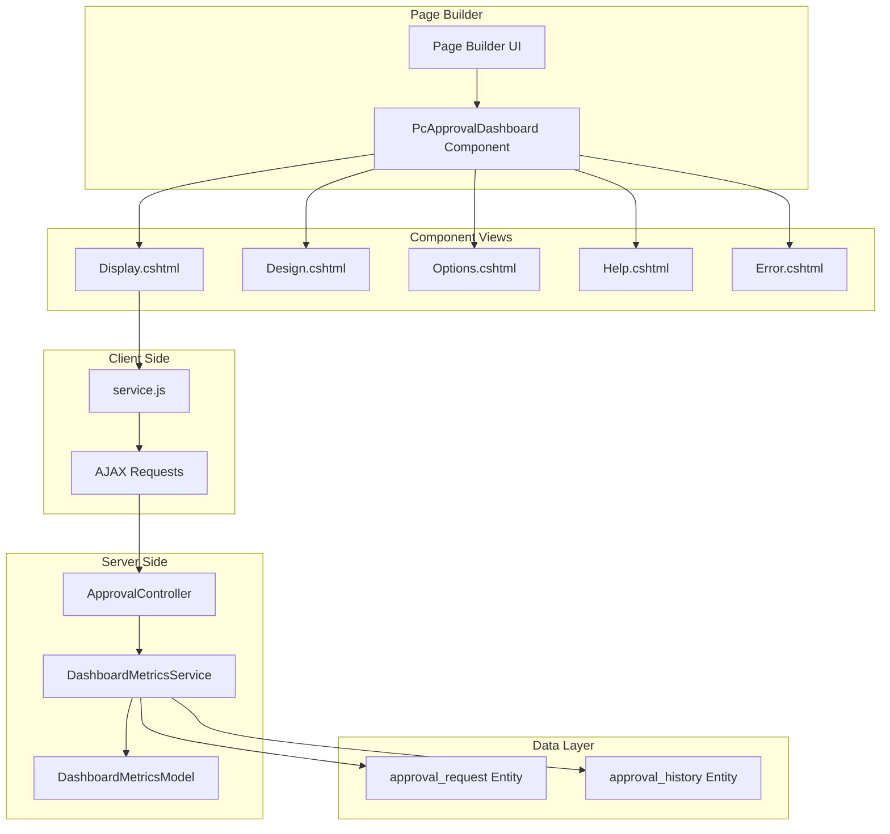
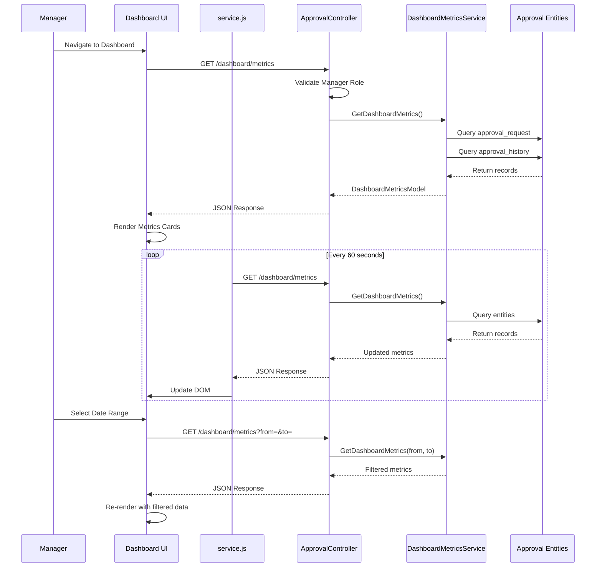

# 0. Agent Action Plan

## 0.1 Intent Clarification

### 0.1.1 Core Feature Objective

Based on the prompt, the Blitzy platform understands that the new feature requirement is to implement a **Manager Approval Dashboard with Real-Time Metrics** (STORY-009) as a page component within the WebVella ERP Approval Workflow plugin. The core requirements include:

- **Dashboard Page Component Creation**: Implement `PcApprovalDashboard` as a new PageComponent following the established WebVella ERP page component architecture pattern, similar to existing components like `PcPageHeader`, `PcChart`, and the approval workflow components defined in STORY-008.

- **Five Key Performance Indicators (KPIs)**: The dashboard must display real-time metrics including:

  - Pending Approvals Count - requests awaiting the current user's action
  - Average Approval Time - mean time from request creation to final decision
  - Approval Rate Percentage - approved vs. total processed requests
  - Overdue Requests Count - pending requests exceeding configured SLA timeout
  - Recent Activity Feed - last 5 approval actions with action type, performer, and timestamp

- **Auto-Refresh Capability**: Metrics must automatically refresh at a configurable interval (default 60 seconds) without requiring page reload, implemented via client-side JavaScript using AJAX calls.

- **Date Range Filtering**: Support for filtering metrics by selectable date ranges (7 days, 30 days, 90 days, or custom range).

- **Role-Based Access Control**: Dashboard access must be restricted to users with Manager role, with appropriate access denied messaging for unauthorized users.

- **Test Coverage**: Comprehensive unit tests for metrics calculation methods and integration tests for API endpoint validation.

**Implicit Requirements Detected:**

- The component must register with `PageComponentLibraryService` under the "Approval Workflow" category
- JSON serialization must use `Newtonsoft.Json` with explicit `JsonProperty` attributes
- Error handling must use `ValidationException` pattern consistent with WebVella components
- The dashboard API endpoint must follow the `/api/v3.0/p/approval/` route pattern established in STORY-007

### 0.1.2 Special Instructions and Constraints

**Critical Directives:**

- Integrate with existing ApprovalController established in STORY-007 for the dashboard metrics endpoint
- Follow the PageComponent pattern established by `PcApprovalWorkflowConfig` and other STORY-008 components
- Maintain consistency with WebVella ERP component conventions including render modes: Display, Design, Options, Help, Error
- Service layer must follow `ApprovalWorkflowService` patterns from STORY-004 for entity queries

**Architectural Requirements:**

- Component must inherit from `PageComponent` base class and use `[PageComponent]` attribute
- Options panel must be configurable through the page builder visual design interface
- Client-side `service.js` must handle AJAX-based auto-refresh using setInterval pattern
- Use `RecordManager` and `EntityQuery` for database access following existing service patterns

**User-Provided Examples:**

- User Example: API Response Format

```json
{
  "success": true,
  "message": "Dashboard metrics retrieved successfully",
  "object": {
    "pending_approvals_count": 12,
    "average_approval_time_hours": 4.5,
    "approval_rate_percent": 87.5,
    "overdue_requests_count": 2,
    "recent_activity": [...]
  }
}
```

- User Example: Component Options
  - `refresh_interval`: Number (default 60 seconds)
  - `date_range_default`: Text (default "30d")
  - `show_overdue_alert`: Boolean (default true)
  - `metrics_to_display`: Text (comma-separated list)

**Validation Requirements:**

- Frontend screenshots must be captured in `validation/frontend-validation/`
- Test validation screenshots must be captured in `validation/test-validation/`
- Unit test coverage must exceed 80% for `DashboardMetricsService`

### 0.1.3 Technical Interpretation

These feature requirements translate to the following technical implementation strategy:

- **To implement the dashboard component**, we will **create** `PcApprovalDashboard.cs` with ViewComponent pattern inheriting from `PageComponent`, implementing `InvokeAsync` method with mode-based view selection, and registering via `[PageComponent]` attribute.

- **To display metrics in Display mode**, we will **create** `Display.cshtml` Razor view using Bootstrap card layout for metric cards, with JavaScript initialization for the auto-refresh timer.

- **To support page builder preview**, we will **create** `Design.cshtml` showing placeholder/sample metrics data for design-time visualization.

- **To enable configuration**, we will **create** `Options.cshtml` with form fields for configuring refresh interval, date range defaults, overdue alerts, and metrics selection.

- **To provide documentation**, we will **create** `Help.cshtml` explaining dashboard features and configuration options.

- **To handle errors gracefully**, we will **create** `Error.cshtml` for displaying access denied and data retrieval failure messages.

- **To implement client-side auto-refresh**, we will **create** `service.js` with AJAX functions calling the dashboard metrics endpoint and setInterval timer management.

- **To calculate metrics**, we will **create** `DashboardMetricsService.cs` with methods querying `approval_request` and `approval_history` entities using `RecordManager` and `EntityQuery`.

- **To define the API response structure**, we will **create** `DashboardMetricsModel.cs` as a DTO with JSON-serializable properties for all metrics.

- **To expose the metrics API**, we will **modify** `ApprovalController.cs` to add the `GetDashboardMetrics` endpoint at `/api/v3.0/p/approval/dashboard/metrics`.

- **To validate business logic**, we will **create** `DashboardMetricsServiceTests.cs` with xUnit tests for all metric calculation methods.

- **To validate API behavior**, we will **create** `DashboardApiIntegrationTests.cs` with integration tests for endpoint authentication, authorization, and response format.

## 0.2 Repository Scope Discovery

### 0.2.1 Comprehensive File Analysis

**Existing Modules to Modify:**

| File Path | Purpose | Modification Type |
| --- | --- | --- |
| WebVella.Erp.Plugins.Approval/Controllers/ApprovalController.cs | Add dashboard metrics endpoint | MODIFY |
| WebVella.Erp.Plugins.Approval/WebVella.Erp.Plugins.Approval.csproj | Add embedded resources for service.js | MODIFY |

**Integration Point Discovery:**

| Integration Point | Description | Files Affected |
| --- | --- | --- |
| API Endpoints | Dashboard metrics endpoint following STORY-007 patterns | ApprovalController.cs |
| Entity Queries | Queries to approval_request and approval_history entities | DashboardMetricsService.cs |
| Security Context | Manager role validation | PcApprovalDashboard.cs, ApprovalController.cs |
| Page Component Library | Registration with page builder | PcApprovalDashboard.cs |
| ErpRequestContext | Request-scoped context injection | PcApprovalDashboard.cs |

**Configuration Files:**

| File Pattern | Purpose |
| --- | --- |
| WebVella.Erp.Plugins.Approval/*.csproj | Project configuration and embedded resources |
| WebVella.Erp.Plugins.Approval.Tests/*.csproj | Test project configuration |

**Build/Deployment Files:**

| File Pattern | Purpose |
| --- | --- |
| WebVella.ERP3.sln | Solution file (may need test project reference) |

### 0.2.2 New File Requirements

**New Source Files to Create:**

| File Path | Purpose |
| --- | --- |
| WebVella.Erp.Plugins.Approval/Components/PcApprovalDashboard/PcApprovalDashboard.cs | Dashboard page component class with ViewComponent implementation, options model, and role validation |
| WebVella.Erp.Plugins.Approval/Components/PcApprovalDashboard/Design.cshtml | Page builder preview view showing dashboard layout with sample/placeholder metrics |
| WebVella.Erp.Plugins.Approval/Components/PcApprovalDashboard/Display.cshtml | Runtime display view rendering live metrics with Bootstrap card layout and auto-refresh initialization |
| WebVella.Erp.Plugins.Approval/Components/PcApprovalDashboard/Options.cshtml | Configuration panel with form fields for refresh interval, date range, alert settings |
| WebVella.Erp.Plugins.Approval/Components/PcApprovalDashboard/Help.cshtml | Component documentation view explaining features and configuration |
| WebVella.Erp.Plugins.Approval/Components/PcApprovalDashboard/Error.cshtml | Error display view for access denied and data retrieval failures |
| WebVella.Erp.Plugins.Approval/Components/PcApprovalDashboard/service.js | Client-side JavaScript for AJAX metrics retrieval and auto-refresh timer |
| WebVella.Erp.Plugins.Approval/Services/DashboardMetricsService.cs | Service class with metric calculation methods querying approval entities |
| WebVella.Erp.Plugins.Approval/Api/DashboardMetricsModel.cs | Response DTO with JSON-serializable properties for all metrics |

**New Test Files to Create:**

| File Path | Purpose |
| --- | --- |
| WebVella.Erp.Plugins.Approval.Tests/WebVella.Erp.Plugins.Approval.Tests.csproj | Test project configuration targeting net9.0 |
| WebVella.Erp.Plugins.Approval.Tests/DashboardMetricsServiceTests.cs | xUnit unit tests for all metric calculation methods |
| WebVella.Erp.Plugins.Approval.Tests/DashboardApiIntegrationTests.cs | xUnit integration tests for API endpoint validation |

**New Validation Structure to Create:**

| Directory Path | Purpose |
| --- | --- |
| validation/frontend-validation/ | UI screenshots demonstrating dashboard functionality |
| validation/test-validation/ | Terminal screenshots of passing tests |

### 0.2.3 Folder Structure to Create

```plaintext
WebVella.Erp.Plugins.Approval/
├── Components/
│   └── PcApprovalDashboard/
│       ├── PcApprovalDashboard.cs
│       ├── Design.cshtml
│       ├── Display.cshtml
│       ├── Options.cshtml
│       ├── Help.cshtml
│       ├── Error.cshtml
│       └── service.js
├── Services/
│   └── DashboardMetricsService.cs
├── Api/
│   └── DashboardMetricsModel.cs
└── Controllers/
    └── ApprovalController.cs (existing - add endpoint)

WebVella.Erp.Plugins.Approval.Tests/
├── WebVella.Erp.Plugins.Approval.Tests.csproj
├── DashboardMetricsServiceTests.cs
└── DashboardApiIntegrationTests.cs

validation/
├── frontend-validation/
│   ├── dashboard-display-manager-role.png
│   ├── dashboard-metrics-cards.png
│   ├── dashboard-date-range-filter.png
│   ├── dashboard-recent-activity-feed.png
│   ├── dashboard-auto-refresh-indicator.png
│   ├── dashboard-access-denied-non-manager.png
│   ├── dashboard-design-mode.png
│   ├── dashboard-options-panel.png
│   └── dashboard-responsive-mobile.png
└── test-validation/
    ├── unit-tests-all-passing.png
    ├── unit-tests-coverage-summary.png
    ├── integration-tests-all-passing.png
    ├── integration-tests-api-validation.png
    └── full-test-suite-summary.png
```

### 0.2.4 Referenced Pattern Files

The following existing files serve as reference implementations:

| Reference File | Pattern Provided |
| --- | --- |
| WebVella.Erp.Web/Components/PcPageHeader/PcPageHeader.cs | PageComponent structure, InvokeAsync pattern, mode selection |
| WebVella.Erp.Web/Components/PcChart/PcChart.cs | Data visualization component pattern |
| WebVella.Erp.Plugins.SDK/Controllers/AdminController.cs | REST API controller pattern |
| WebVella.Erp.Web/Models/PageComponent.cs | Base class for all page components |
| WebVella.Erp.Web/Models/PageComponentAttribute.cs | Component registration attribute |
| jira-stories/STORY-007-approval-rest-api.md | ApprovalController pattern and ResponseModel envelope |
| jira-stories/STORY-008-approval-ui-components.md | Approval component folder structure and view patterns |

## 0.3 Dependency Inventory

### 0.3.1 Private and Public Packages

**Framework and Runtime Dependencies:**

| Registry | Package Name | Version | Purpose |
| --- | --- | --- | --- |
| NuGet | Microsoft.NET.Sdk.Razor | 9.0 (SDK) | Razor Class Library SDK for component views |
| NuGet | Microsoft.AspNetCore.App | 9.0 (Framework) | ASP.NET Core shared framework reference |
| NuGet | Newtonsoft.Json | 13.0.4 | JSON serialization for Options and API responses |
| NuGet | Microsoft.AspNetCore.Mvc.NewtonsoftJson | 9.0.10 | MVC integration for Newtonsoft.Json |

**Project Dependencies (Internal):**

| Project Reference | Version | Purpose |
| --- | --- | --- |
| WebVella.Erp | 1.7.4 | Core ERP runtime with RecordManager, EntityQuery, SecurityContext |
| WebVella.Erp.Web | 1.7.5 | Web layer with PageComponent base, ErpRequestContext, ErpAppContext |

**Test Project Dependencies:**

| Registry | Package Name | Version | Purpose |
| --- | --- | --- | --- |
| NuGet | xunit | 2.9.x | Unit testing framework |
| NuGet | xunit.runner.visualstudio | 2.8.x | Test runner integration |
| NuGet | Microsoft.NET.Test.Sdk | 17.x | Test SDK |
| NuGet | coverlet.collector | 6.x | Code coverage collection |
| NuGet | Microsoft.AspNetCore.Mvc.Testing | 9.0.x | Integration testing for ASP.NET Core |
| NuGet | Moq | 4.20.x | Mocking framework for unit tests |

### 0.3.2 Dependency Updates

**Import Updates for New Files:**

Files requiring namespace imports follow the established patterns:

- `PcApprovalDashboard.cs` requires:

```csharp
using Microsoft.AspNetCore.Mvc;
using Newtonsoft.Json;
using System;
using System.Collections.Generic;
using System.Threading.Tasks;
using WebVella.Erp.Api;
using WebVella.Erp.Api.Models;
using WebVella.Erp.Exceptions;
using WebVella.Erp.Web.Models;
using WebVella.Erp.Web.Services;
using WebVella.Erp.Plugins.Approval.Services;
```

- `DashboardMetricsService.cs` requires:

```csharp
using System;
using System.Collections.Generic;
using System.Linq;
using WebVella.Erp.Api;
using WebVella.Erp.Api.Models;
using WebVella.Erp.Plugins.Approval.Api;
```

- `DashboardMetricsModel.cs` requires:

```csharp
using Newtonsoft.Json;
using System;
using System.Collections.Generic;
```

**csproj Embedded Resource Updates:**

Add to `WebVella.Erp.Plugins.Approval.csproj`:

```xml
<ItemGroup>
  <EmbeddedResource Include="Components\PcApprovalDashboard\service.js" />
</ItemGroup>
```

### 0.3.3 Target Framework Configuration

**Plugin Project (WebVella.Erp.Plugins.Approval.csproj):**

```xml
<Project Sdk="Microsoft.NET.Sdk.Razor">
  <PropertyGroup>
    <TargetFramework>net9.0</TargetFramework>
    <AddRazorSupportForMvc>true</AddRazorSupportForMvc>
  </PropertyGroup>
  <ItemGroup>
    <FrameworkReference Include="Microsoft.AspNetCore.App" />
  </ItemGroup>
  <ItemGroup>
    <ProjectReference Include="..\WebVella.Erp.Web\WebVella.Erp.Web.csproj" />
    <ProjectReference Include="..\WebVella.Erp\WebVella.Erp.csproj" />
  </ItemGroup>
</Project>
```

**Test Project (WebVella.Erp.Plugins.Approval.Tests.csproj):**

```xml
<Project Sdk="Microsoft.NET.Sdk">
  <PropertyGroup>
    <TargetFramework>net9.0</TargetFramework>
    <IsPackable>false</IsPackable>
  </PropertyGroup>
  <ItemGroup>
    <PackageReference Include="xunit" Version="2.9.0" />
    <PackageReference Include="xunit.runner.visualstudio" Version="2.8.2" />
    <PackageReference Include="Microsoft.NET.Test.Sdk" Version="17.11.0" />
    <PackageReference Include="coverlet.collector" Version="6.0.2" />
    <PackageReference Include="Microsoft.AspNetCore.Mvc.Testing" Version="9.0.0" />
    <PackageReference Include="Moq" Version="4.20.72" />
  </ItemGroup>
  <ItemGroup>
    <ProjectReference Include="..\WebVella.Erp.Plugins.Approval\WebVella.Erp.Plugins.Approval.csproj" />
  </ItemGroup>
</Project>
```

### 0.3.4 Client-Side Dependencies

**JavaScript Dependencies (via WebVella ERP infrastructure):**

| Dependency | Version | Purpose | Loaded By |
| --- | --- | --- | --- |
| jQuery | 3.x | DOM manipulation and AJAX | Base layout |
| Bootstrap | 5.x | UI styling and components | Base layout |
| FontAwesome | 6.x | Icons for metrics cards | Base layout |
| toastr | 2.x | Toast notifications | Base layout |

These dependencies are already loaded by the WebVella ERP base layout (`_AppMaster.cshtml`) and do not require additional installation.

## 0.4 Integration Analysis

### 0.4.1 Existing Code Touchpoints

**Direct Modifications Required:**

| File | Modification | Location |
| --- | --- | --- |
| WebVella.Erp.Plugins.Approval/Controllers/ApprovalController.cs | Add GetDashboardMetrics endpoint method | After existing endpoint methods |
| WebVella.Erp.Plugins.Approval/Controllers/ApprovalController.cs | Add IsManagerRole private helper method | Private methods region |
| WebVella.Erp.Plugins.Approval/WebVella.Erp.Plugins.Approval.csproj | Add embedded resource for service.js | ItemGroup section |

**Service Layer Integration:**

| Integration Point | Source | Target | Purpose |
| --- | --- | --- | --- |
| DashboardMetricsService | RecordManager | approval_request entity | Query pending approvals |
| DashboardMetricsService | RecordManager | approval_history entity | Calculate approval times and rates |
| ApprovalController | DashboardMetricsService | API endpoint | Retrieve metrics for response |
| PcApprovalDashboard | SecurityContext.CurrentUser | Component | Validate manager role access |

**Entity Queries:**

| Entity | Query Purpose | Method |
| --- | --- | --- |
| approval_request | Count pending requests for current approver | GetPendingApprovalsCount |
| approval_request | Identify overdue requests exceeding timeout | GetOverdueRequestsCount |
| approval_history | Calculate average approval time | GetAverageApprovalTime |
| approval_history | Calculate approval rate percentage | GetApprovalRate |
| approval_history | Retrieve recent activity feed | GetRecentActivity |

### 0.4.2 Component Registration Integration

**PageComponentLibraryService Registration:**

The `PcApprovalDashboard` component automatically registers with the page builder through the `[PageComponent]` attribute:

```csharp
[PageComponent(
    Label = "Approval Dashboard",
    Library = "WebVella",
    Description = "Real-time dashboard displaying team approval workflow metrics",
    Version = "0.0.1",
    IconClass = "fas fa-chart-line",
    Category = "Approval Workflow")]
```

This registration enables:

- Discovery in page builder component palette under "Approval Workflow" category
- Component metadata retrieval via `PageComponentLibraryService.GetComponentMeta()`
- Design-time preview rendering in page builder

### 0.4.3 Security Integration

**Role-Based Access Control Flow:**



**Security Checkpoints:**

| Checkpoint | Location | Validation |
| --- | --- | --- |
| Component Access | PcApprovalDashboard.InvokeAsync() | Check Manager/Administrator role before Display mode |
| API Access | ApprovalController.GetDashboardMetrics() | Validate [Authorize] and Manager role |
| User Authentication | ApprovalController.CurrentUserId | Extract from HttpContext claims |

### 0.4.4 Data Flow Integration

**Metrics Calculation Flow:**



### 0.4.5 Auto-Refresh Integration

**Timer-Based Refresh Mechanism:**

The client-side auto-refresh integrates with the WebVella ERP JavaScript infrastructure:

| Integration | Description |
| --- | --- |
| AJAX Endpoint | GET /api/v3.0/p/approval/dashboard/metrics |
| Timer Mechanism | JavaScript setInterval() at configured refresh rate |
| DOM Update | jQuery-based selective DOM updates for metric values |
| Error Handling | Toast notifications via toastr on AJAX failures |
| Credential Handling | Automatic cookie-based authentication via browser |

**Date Range Integration:**

| Parameter | Format | Example |
| --- | --- | --- |
| from | ISO 8601 Date | 2025-12-18T00:00:00Z |
| to | ISO 8601 Date | 2026-01-17T23:59:59Z |

These parameters are passed as query strings and processed by the API endpoint to filter metrics calculation.

## 0.5 Technical Implementation

### 0.5.1 File-by-File Execution Plan

**Group 1 - Core Component Files:**

| Action | File Path | Purpose |
| --- | --- | --- |
| CREATE | WebVella.Erp.Plugins.Approval/Components/PcApprovalDashboard/PcApprovalDashboard.cs | Implement dashboard PageComponent with options model, InvokeAsync, and role validation |
| CREATE | WebVella.Erp.Plugins.Approval/Components/PcApprovalDashboard/Display.cshtml | Runtime view with Bootstrap metric cards, date range selector, recent activity feed |
| CREATE | WebVella.Erp.Plugins.Approval/Components/PcApprovalDashboard/Design.cshtml | Page builder preview with sample/placeholder metric values |
| CREATE | WebVella.Erp.Plugins.Approval/Components/PcApprovalDashboard/Options.cshtml | Configuration form for refresh interval, date range, alerts, metrics selection |
| CREATE | WebVella.Erp.Plugins.Approval/Components/PcApprovalDashboard/Help.cshtml | Documentation explaining dashboard features and configuration |
| CREATE | WebVella.Erp.Plugins.Approval/Components/PcApprovalDashboard/Error.cshtml | Error display for access denied and retrieval failures |
| CREATE | WebVella.Erp.Plugins.Approval/Components/PcApprovalDashboard/service.js | Client-side AJAX and setInterval auto-refresh logic |

**Group 2 - Service Layer Files:**

| Action | File Path | Purpose |
| --- | --- | --- |
| CREATE | WebVella.Erp.Plugins.Approval/Services/DashboardMetricsService.cs | Service class with GetDashboardMetrics, GetPendingApprovalsCount, GetAverageApprovalTime, GetApprovalRate, GetOverdueRequestsCount, GetRecentActivity methods |
| CREATE | WebVella.Erp.Plugins.Approval/Api/DashboardMetricsModel.cs | DTO with PendingApprovalsCount, AverageApprovalTimeHours, ApprovalRatePercent, OverdueRequestsCount, RecentActivity, MetricsAsOf, DateRangeStart, DateRangeEnd properties |

**Group 3 - API Integration:**

| Action | File Path | Purpose |
| --- | --- | --- |
| MODIFY | WebVella.Erp.Plugins.Approval/Controllers/ApprovalController.cs | Add GetDashboardMetrics endpoint at /api/v3.0/p/approval/dashboard/metrics with date range parameters |
| MODIFY | WebVella.Erp.Plugins.Approval/WebVella.Erp.Plugins.Approval.csproj | Add EmbeddedResource for service.js |

**Group 4 - Test Files:**

| Action | File Path | Purpose |
| --- | --- | --- |
| CREATE | WebVella.Erp.Plugins.Approval.Tests/WebVella.Erp.Plugins.Approval.Tests.csproj | Test project configuration with xunit, coverlet, Moq |
| CREATE | WebVella.Erp.Plugins.Approval.Tests/DashboardMetricsServiceTests.cs | Unit tests for all metric calculation methods |
| CREATE | WebVella.Erp.Plugins.Approval.Tests/DashboardApiIntegrationTests.cs | Integration tests for API authentication, authorization, parameters |

**Group 5 - Validation Artifacts:**

| Action | File Path | Purpose |
| --- | --- | --- |
| CREATE | validation/frontend-validation/ | Directory for UI screenshots |
| CREATE | validation/test-validation/ | Directory for test result screenshots |

### 0.5.2 Implementation Approach per File

**PcApprovalDashboard.cs - Component Class:**

- Establish component with `[PageComponent]` attribute for category "Approval Workflow"
- Implement nested `PcApprovalDashboardOptions` class with JSON-mapped properties
- InvokeAsync method validates context.Node and Page property presence
- Check manager role before Display mode rendering
- Populate ViewBag with Options, Node, ComponentMeta, RequestContext, AppContext
- Return appropriate view based on ComponentMode (Display, Design, Options, Help, Error)

**Display.cshtml - Runtime View:**

- Bootstrap card grid layout for 5 metric KPIs (2x3 grid)
- Date range dropdown selector with 7d/30d/90d/custom options
- Recent activity timeline with action icons and timestamps
- Auto-refresh indicator showing last update time
- JavaScript initialization block calling service.js functions

**service.js - Client-Side Logic:**

```javascript
// Initialize dashboard with refresh interval
function initDashboard(nodeId, options) {
  loadMetrics(nodeId, options);
  setInterval(() => loadMetrics(nodeId, options), options.refreshInterval * 1000);
}
// AJAX call to metrics endpoint
function loadMetrics(nodeId, options) {
  $.ajax({ url: '/api/v3.0/p/approval/dashboard/metrics', ... });
}
```

**DashboardMetricsService.cs - Service Class:**

- Constructor initializes RecordManager instance
- GetDashboardMetrics orchestrates all metric calculations
- Each metric method uses EntityQuery with appropriate filters
- Date range parameters filter approval_history queries
- Pending and overdue counts query approval_request with status='pending'

**ApprovalController.cs - API Endpoint Addition:**

- Add `[Route("api/v3.0/p/approval/dashboard/metrics")]` method
- Validate authentication via CurrentUserId
- Check manager role with IsManagerRole helper
- Default date range: last 30 days if parameters not provided
- Return ResponseModel envelope with DashboardMetricsModel

### 0.5.3 Component Architecture Diagram



### 0.5.4 User Workflow Sequence



### 0.5.5 API Endpoint Specification

| Method | Endpoint | Parameters | Response |
| --- | --- | --- | --- |
| GET | /api/v3.0/p/approval/dashboard/metrics | None (defaults to 30d) | DashboardMetricsModel |
| GET | /api/v3.0/p/approval/dashboard/metrics?from={date}&to={date} | from, to (ISO dates) | DashboardMetricsModel |

**Response Format:**

```json
{
  "success": true,
  "message": "Dashboard metrics retrieved successfully",
  "object": {
    "pending_approvals_count": 12,
    "average_approval_time_hours": 4.5,
    "approval_rate_percent": 87.5,
    "overdue_requests_count": 2,
    "recent_activity": [...],
    "metrics_as_of": "2026-01-17T14:35:00Z",
    "date_range_start": "2025-12-18T00:00:00Z",
    "date_range_end": "2026-01-17T23:59:59Z"
  },
  "errors": []
}
```

## 0.6 Scope Boundaries

### 0.6.1 Exhaustively In Scope

**Dashboard Component Files:**

| Pattern | Description |
| --- | --- |
| WebVella.Erp.Plugins.Approval/Components/PcApprovalDashboard/**/* | All dashboard component files (cs, cshtml, js) |
| WebVella.Erp.Plugins.Approval/Services/DashboardMetricsService.cs | Metrics calculation service |
| WebVella.Erp.Plugins.Approval/Api/DashboardMetricsModel.cs | Response DTO model |

**Controller Integration:**

| Pattern | Description |
| --- | --- |
| WebVella.Erp.Plugins.Approval/Controllers/ApprovalController.cs | Add GetDashboardMetrics endpoint and IsManagerRole helper |

**Project Configuration:**

| Pattern | Description |
| --- | --- |
| WebVella.Erp.Plugins.Approval/WebVella.Erp.Plugins.Approval.csproj | Add EmbeddedResource for service.js |

**Test Files:**

| Pattern | Description |
| --- | --- |
| WebVella.Erp.Plugins.Approval.Tests/**/* | All test project files |
| WebVella.Erp.Plugins.Approval.Tests/DashboardMetricsServiceTests.cs | Unit tests for metrics service |
| WebVella.Erp.Plugins.Approval.Tests/DashboardApiIntegrationTests.cs | Integration tests for API endpoint |

**Validation Artifacts:**

| Pattern | Description |
| --- | --- |
| validation/frontend-validation/*.png | UI screenshots per acceptance criteria |
| validation/test-validation/*.png | Test result screenshots per acceptance criteria |

**Entity Queries (Read-Only):**

| Entity | Query Operations |
| --- | --- |
| approval_request | SELECT for pending count, SELECT for overdue count |
| approval_history | SELECT for average time, SELECT for approval rate, SELECT for recent activity |

### 0.6.2 Explicitly Out of Scope

**Unrelated Features or Modules:**

| Item | Reason |
| --- | --- |
| Entity schema modifications | Entities defined in STORY-002, no changes required |
| Workflow configuration changes | Covered by STORY-003, separate concern |
| Approval service layer changes | Covered by STORY-004, no modifications needed |
| Hook implementations | Covered by STORY-005, separate concern |
| Job and notification changes | Covered by STORY-006, separate concern |
| Other ApprovalController endpoints | Covered by STORY-007, only adding new endpoint |
| Other UI components (PcApprovalWorkflowConfig, etc.) | Covered by STORY-008, separate components |

**Performance Optimizations Beyond Requirements:**

| Item | Reason |
| --- | --- |
| Caching layer for metrics | Not specified in requirements |
| Database query optimization | Out of scope unless causing issues |
| Real-time push notifications (SignalR) | Explicitly listed as future enhancement |

**Refactoring of Existing Code:**

| Item | Reason |
| --- | --- |
| Existing ApprovalController structure | Only adding new endpoint, preserving existing |
| Existing service patterns | Following patterns, not modifying them |
| WebVella core components | Using as reference only |

**Additional Features Not Specified:**

| Item | Reason |
| --- | --- |
| Filtering by team member | Explicitly listed as out of scope |
| Filtering by department or workflow type | Explicitly listed as out of scope |
| Export functionality (PDF/Excel) | Explicitly listed as out of scope |
| Historical trend charts | Explicitly listed as out of scope |
| Drill-down to individual request details | Explicitly listed as out of scope |
| Customizable dashboard layouts | Explicitly listed as out of scope |

### 0.6.3 Boundary Conditions

**Manager Role Definition:**

- Users with role name "manager" (case-insensitive) have dashboard access
- Users with role name "administrator" (case-insensitive) have dashboard access
- All other roles receive access denied response

**Date Range Boundaries:**

- Default: Last 30 days from current UTC time
- Minimum: No minimum enforced (can query historical data)
- Maximum: Current date (future dates clamped to now)

**Auto-Refresh Boundaries:**

- Default interval: 60 seconds
- Configurable range: Component options allow custom intervals
- No upper limit enforced (administrator responsibility)

**Metrics Calculation Boundaries:**

- Pending count: Only requests with status='pending' where user is authorized approver
- Average time: Calculated from requests with final status (approved/rejected)
- Approval rate: Approved count / (Approved + Rejected count), returns 0 if no data
- Overdue count: Pending requests where (created_on + timeout_hours) &lt; now
- Recent activity: Last 5 entries, ordered by performed_on descending

### 0.6.4 Acceptance Criteria Mapping

| AC | Scope Item | Validation |
| --- | --- | --- |
| AC1 | Display.cshtml renders 5 metrics | Screenshot: dashboard-display-manager-role.png |
| AC2 | service.js implements auto-refresh | Screenshot: dashboard-auto-refresh-indicator.png |
| AC3 | Display.cshtml includes date range selector | Screenshot: dashboard-date-range-filter.png |
| AC4 | GetPendingApprovalsCount filters by authorized approver | Unit test: GetPendingApprovalsCount_* |
| AC5 | GetOverdueRequestsCount checks timeout_hours | Unit test: GetOverdueRequestsCount_* |
| AC6 | PcApprovalDashboard checks manager role | Screenshot: dashboard-access-denied-non-manager.png |
| AC7 | DashboardMetricsServiceTests validate all methods | Screenshot: unit-tests-all-passing.png |
| AC8 | DashboardApiIntegrationTests validate endpoint | Screenshot: integration-tests-all-passing.png |
| AC9 | All validation screenshots captured | validation/ folder structure complete |

## 0.7 Rules for Feature Addition

### 0.7.1 WebVella ERP Component Conventions

**PageComponent Implementation Pattern:**

- All page components MUST inherit from `PageComponent` base class
- All page components MUST use `[PageComponent]` attribute with Label, Library, Description, Version, IconClass, and Category
- All page components MUST implement `InvokeAsync(PageComponentContext context)` method
- All components MUST support five render modes: Display, Design, Options, Help, Error
- All components MUST validate `context.Node` and `context.DataModel.GetProperty("Page")` presence

**Options Model Pattern:**

- Options class MUST be nested within the component class
- All properties MUST use `[JsonProperty(PropertyName = "snake_case")]` attribute
- All properties MUST have default values initialized
- Options MUST be deserialized using `JsonConvert.DeserializeObject<T>(context.Options.ToString())`

**ViewBag Contract:**

- ViewBag MUST include: Options, Node, ComponentMeta, RequestContext, AppContext, ComponentContext
- ViewBag.Error MUST contain ValidationException for error display
- ViewBag.IsVisible MUST be set for visibility-controlled rendering

### 0.7.2 API Endpoint Conventions

**Route Pattern:**

- All approval API endpoints MUST use route prefix `/api/v3.0/p/approval/`
- Resource-based routes: `/api/v3.0/p/approval/{resource}/{action}`
- Dashboard metrics route: `/api/v3.0/p/approval/dashboard/metrics`

**Response Model:**

- All endpoints MUST return `ResponseModel` envelope structure
- ResponseModel MUST include: success (bool), message (string), object (any), errors (array)
- HTTP status codes: 200 (success), 401 (unauthenticated), 403 (forbidden)

**Authentication/Authorization:**

- All endpoints MUST use `[Authorize]` attribute
- User ID extraction MUST use `HttpContext.User.Claims.FirstOrDefault(x => x.Type == ClaimTypes.NameIdentifier)`
- Role validation MUST check `SecurityContext.CurrentUser.Roles` collection

### 0.7.3 Service Layer Conventions

**RecordManager Usage:**

- Service classes MUST instantiate RecordManager in constructor: `recMan = new RecordManager();`
- Entity queries MUST use `EntityQuery` with appropriate Query expressions
- Query operations: `EntityQuery.QueryEQ`, `EntityQuery.QueryAND`, `EntityQuery.QueryOR`, `EntityQuery.QueryGTE`, `EntityQuery.QueryLTE`
- Results MUST check `result.Success` and `result.Object?.Data` before processing

**Date Handling:**

- All dates MUST use `DateTime` with UTC normalization
- Date comparisons MUST account for timezone using `DateTime.UtcNow`
- Date range parameters MUST default to sensible values (e.g., last 30 days)

### 0.7.4 Testing Conventions

**Unit Test Pattern:**

- Test classes MUST follow naming: `{ServiceName}Tests`
- Test methods MUST follow naming: `{MethodName}_{Scenario}_{ExpectedResult}`
- All public methods MUST have at least one test case
- Boundary conditions and null handling MUST be tested
- Test assertions MUST use xUnit Assert methods

**Integration Test Pattern:**

- Test classes MUST use `IClassFixture<WebApplicationFactory<Startup>>`
- HTTP client MUST be created via factory: `_client = factory.CreateClient()`
- Authentication scenarios MUST include: unauthenticated, non-manager role, manager role
- Response validation MUST check status code, success flag, and object structure

### 0.7.5 Client-Side JavaScript Conventions

**service.js Structure:**

- MUST be wrapped in IIFE or strict mode
- MUST use jQuery for AJAX and DOM manipulation
- MUST handle WvPbManager lifecycle events for page builder integration
- MUST include error handling with toastr notifications

**Auto-Refresh Pattern:**

```javascript
// Timer initialization
let refreshTimer = null;
function startRefresh(interval) {
  if (refreshTimer) clearInterval(refreshTimer);
  refreshTimer = setInterval(refreshMetrics, interval * 1000);
}
```

**AJAX Pattern:**

```javascript
$.ajax({
  url: '/api/v3.0/p/approval/dashboard/metrics',
  method: 'GET',
  data: { from: fromDate, to: toDate },
  success: function(response) {
    if (response.success) updateUI(response.object);
    else toastr.error(response.message);
  },
  error: function() { toastr.error('Failed to load metrics'); }
});
```

### 0.7.6 Razor View Conventions

**View Header:**

```cshtml
@addTagHelper *, Microsoft.AspNetCore.Mvc.TagHelpers
@addTagHelper *, WebVella.Erp.Web
@addTagHelper *, WebVella.TagHelpers
@using WebVella.Erp.Web.Models
@using WebVella.Erp.Plugins.Approval.Components
```

**ViewBag Casting:**

```cshtml
@{
  var options = (PcApprovalDashboard.PcApprovalDashboardOptions)ViewBag.Options;
  var node = (PageBodyNode)ViewBag.Node;
  var componentMeta = (PageComponentMeta)ViewBag.ComponentMeta;
}
```

**Error View Pattern:**

```cshtml
@{
  var validation = (ValidationException)ViewBag.Error;
}
<wv-validation errors="@validation.ToErrorList()" message="@validation.Message"></wv-validation>
```

### 0.7.7 Security Requirements

**Role Validation:**

- Dashboard access MUST be restricted to Manager and Administrator roles
- Role check MUST be case-insensitive
- Access denied MUST display user-friendly error message
- API endpoints MUST return HTTP 403 for non-manager users

**Data Scoping:**

- Metrics MUST be scoped to requests where user is authorized approver
- No cross-team data leakage allowed
- Recent activity MUST only show team-relevant actions

### 0.7.8 Validation Screenshot Requirements

**Frontend Screenshots (validation/frontend-validation/):**

- dashboard-display-manager-role.png - Full dashboard with all 5 metrics
- dashboard-metrics-cards.png - Close-up of metric cards
- dashboard-date-range-filter.png - Date range selector interaction
- dashboard-recent-activity-feed.png - Activity section populated
- dashboard-auto-refresh-indicator.png - Refresh indicator visible
- dashboard-access-denied-non-manager.png - Error for non-manager
- dashboard-design-mode.png - Page builder preview
- dashboard-options-panel.png - Configuration panel
- dashboard-responsive-mobile.png - Mobile viewport (375px)

**Test Screenshots (validation/test-validation/):**

- unit-tests-all-passing.png - Green test results
- unit-tests-coverage-summary.png - &gt;80% coverage
- integration-tests-all-passing.png - Green test results
- integration-tests-api-validation.png - API test details
- full-test-suite-summary.png - Complete summary

## 0.8 References

### 0.8.1 Repository Files and Folders Searched

**Root Level Analysis:**

| Path | Type | Purpose |
| --- | --- | --- |
| `` (root) | Folder | Repository root containing solution and projects |
| WebVella.ERP3.sln | File | Visual Studio solution file |
| global.json | File | SDK version configuration |
| README.md | File | Project overview and documentation |

**Core Project Analysis:**

| Path | Type | Purpose |
| --- | --- | --- |
| WebVella.Erp/ | Folder | Core ERP library with API, database, hooks, jobs |
| WebVella.Erp/WebVella.Erp.csproj | File | Project configuration, target net9.0 |
| WebVella.Erp/Api/ | Folder | API models and managers |
| WebVella.Erp/Hooks/ | Folder | Hook interfaces and implementations |

**Web Project Analysis:**

| Path | Type | Purpose |
| --- | --- | --- |
| WebVella.Erp.Web/ | Folder | Web layer with components, controllers, models |
| WebVella.Erp.Web/WebVella.Erp.Web.csproj | File | Razor class library configuration |
| WebVella.Erp.Web/Components/ | Folder | PageComponent implementations |
| WebVella.Erp.Web/Components/PcPageHeader/ | Folder | Reference PageComponent implementation |
| WebVella.Erp.Web/Components/PcChart/ | Folder | Reference visualization component |
| WebVella.Erp.Web/Models/ | Folder | Core models including PageComponent, PageComponentAttribute |
| WebVella.Erp.Web/Controllers/ | Folder | API controllers including WebApiController |

**Plugin Project Analysis:**

| Path | Type | Purpose |
| --- | --- | --- |
| WebVella.Erp.Plugins.SDK/ | Folder | SDK plugin with component and controller patterns |
| WebVella.Erp.Plugins.SDK/WebVella.Erp.Plugins.SDK.csproj | File | Plugin project configuration template |
| WebVella.Erp.Plugins.SDK/Components/ | Folder | Plugin component examples |
| WebVella.Erp.Plugins.SDK/Controllers/ | Folder | Plugin controller examples |

**Story Documentation Analysis:**

| Path | Type | Purpose |
| --- | --- | --- |
| jira-stories/ | Folder | Story specifications and exports |
| jira-stories/STORY-007-approval-rest-api.md | File | ApprovalController pattern reference |
| jira-stories/STORY-008-approval-ui-components.md | File | Approval component pattern reference |
| jira-stories/STORY-009-manager-dashboard-metrics.md | File | Dashboard requirements source |
| jira-stories/stories-export.json | File | Story metadata export |

**Planning Documentation:**

| Path | Type | Purpose |
| --- | --- | --- |
| blitzy/ | Folder | Planning and documentation artifacts |
| blitzy/documentation/ | Folder | Project guide and technical specs |

### 0.8.2 External Reference Documentation

**WebVella ERP Patterns:**

| Pattern | Reference Location |
| --- | --- |
| PageComponent Base | WebVella.Erp.Web/Models/PageComponent.cs |
| PageComponentAttribute | WebVella.Erp.Web/Models/PageComponentAttribute.cs |
| PageComponentContext | WebVella.Erp.Web/Models/PageComponentContext.cs |
| ErpRequestContext | WebVella.Erp.Web/ErpRequestContext.cs |
| ValidationException | WebVella.Erp/Exceptions/ValidationException.cs |
| RecordManager | WebVella.Erp/Api/RecordManager.cs |
| EntityQuery | WebVella.Erp/Api/EntityQuery.cs |

[**ASP.NET**](http://ASP.NET) **Core References:**

| Technology | Version | Documentation |
| --- | --- | --- |
| .NET SDK | 9.0 | Microsoft .NET documentation |
| ASP.NET Core | 9.0 | Microsoft ASP.NET Core documentation |
| Razor Pages | 9.0 | ASP.NET Core Razor documentation |
| xUnit | 2.9.x | xUnit.net documentation |

### 0.8.3 Attachment Summary

**User Story Document:**

| Attachment | Summary |
| --- | --- |
| STORY-009 User Story | Complete requirements for Manager Approval Dashboard including description, business value, 9 acceptance criteria, technical implementation details with code samples, validation folder structure, component options, API endpoints, mermaid diagrams, and testing considerations |

**Key Technical Artifacts from Story:**

| Section | Content Summary |
| --- | --- |
| Files/Modules to Create | 11 files including component, service, model, and test files |
| Validation Folder Structure | 9 frontend screenshots, 5 test screenshots |
| Key Classes and Functions | PcApprovalDashboard, DashboardMetricsService, DashboardMetricsModel, controller endpoint |
| Component Options | 4 configurable options (refresh_interval, date_range_default, show_overdue_alert, metrics_to_display) |
| API Endpoints | GET /api/v3.0/p/approval/dashboard/metrics with optional date parameters |
| Mermaid Diagrams | Component architecture and user workflow sequence diagrams |

### 0.8.4 Figma References

No Figma screens were provided for this story. The dashboard UI follows WebVella ERP component conventions and Bootstrap styling patterns established in existing components.

### 0.8.5 Dependency Story References

| Story ID | Title | Dependency Type |
| --- | --- | --- |
| STORY-007 | Approval REST API Endpoints | Required - ApprovalController pattern, endpoint conventions, ResponseModel structure |
| STORY-008 | Approval UI Page Components | Required - PageComponent pattern, component folder structure, render mode handling |

### 0.8.6 Search History Summary

| Search # | Tool | Target | Purpose |
| --- | --- | --- | --- |
| 1 | bash | .blitzyignore files | Check for ignored patterns |
| 2 | get_source_folder_contents | Root (``) | Repository structure overview |
| 3 | get_source_folder_contents | WebVella.Erp.Plugins.SDK | Plugin pattern reference |
| 4 | get_source_folder_contents | WebVella.Erp.Web | Web layer structure |
| 5 | get_source_folder_contents | WebVella.Erp.Web/Components | Component library structure |
| 6 | get_source_folder_contents | WebVella.Erp.Web/Components/PcPageHeader | Component implementation pattern |
| 7 | get_source_folder_contents | blitzy | Planning documentation |
| 8 | get_source_folder_contents | jira-stories | Story specifications |
| 9 | read_file | global.json | SDK version configuration |
| 10 | read_file | WebVella.Erp.Web/WebVella.Erp.Web.csproj | Web project dependencies |
| 11 | read_file | WebVella.Erp.Plugins.SDK/WebVella.Erp.Plugins.SDK.csproj | Plugin project template |
| 12 | read_file | jira-stories/STORY-007-approval-rest-api.md | API patterns |
| 13 | read_file | jira-stories/STORY-008-approval-ui-components.md | Component patterns |
| 14 | bash | Approval-related files search | Verify no existing implementation |
| 15 | read_file | WebVella.ERP3.sln | Solution structure |
| 16 | read_file | WebVella.Erp/WebVella.Erp.csproj | Core project dependencies |
| 17 | search_files | PageComponent patterns | Component implementation patterns |
| 18 | read_file | WebVella.Erp.Web/Components/PcChart/PcChart.cs | Chart component reference |
| 19 | bash | Test file patterns | Existing test conventions |
