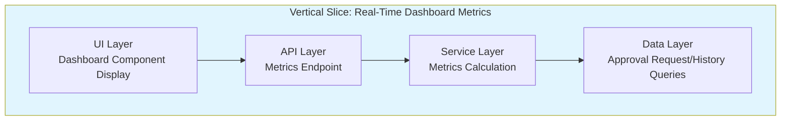

# Technical Specification

# 0. Agent Action Plan

## 0.1 Intent Clarification

### 0.1.1 Core Documentation Objective

Based on the provided requirements, the Blitzy platform understands that the documentation objective is to **create a new JIRA user story document** that enables managers to make faster decisions through real-time dashboard views of team performance metrics.

**Documentation Category:** Create new documentation

**Documentation Type:** JIRA User Story (requirements specification document)

**Requirement Breakdown:**

| Requirement | Enhanced Clarity |
|-------------|------------------|
| Create a JIRA user story | Produce a single, well-formatted requirements document following organizational standards |
| Follow State Street "Writing a User Story" guide | Apply the exact structure defined in the attached PDF: Summary, Description (Who/What/Why), Acceptance Criteria (Given/When/Then) |
| Who/What/Why format | User story description must identify the user role (WHO), the desired capability (WHAT), and the business benefit (WHY) |
| Given/When/Then acceptance criteria | Each acceptance criterion must follow the BDD-style scenario format with precondition, action, and expected outcome |
| Single sprint delivery | The user story must represent a vertical slice of functionality completable within one sprint (~2 weeks) |
| Vertical slice of functionality | The deliverable must cut across all layers (UI, API, services, database) rather than horizontal technical tasks |
| Measurable progress toward objective | The story must include specific, testable acceptance criteria that demonstrate progress toward the business goal |

**Implicit Documentation Needs:**

- The user story must be **demo-able** as emphasized in the State Street guide
- Acceptance criteria must be **independently testable** with clear pass/fail outcomes
- The summary must not exceed **255 characters** per the guide specification
- The user story should meet **INVEST criteria** (Independent, Negotiable, Valuable, Estimable, Sized appropriately, Testable)

### 0.1.2 Special Instructions and Constraints

**CRITICAL DIRECTIVES:**

- **Exact Structure Compliance:** "Follow exactly the structure of a User Story as defined in the guide. You must not include any additional sections."
- **Template Adherence:** The output must contain ONLY three sections as defined in the State Street guide:
  1. Summary
  2. Description (Who/What/Why)
  3. Acceptance Criteria (Given/When/Then)

**USER PROVIDED TEMPLATE (from SST User Story Guide.pdf):**

```
Summary - Maximum 255 Characters
[Brief statement of the user story]

Description
As a < named user or role >, or the WHO
I want < some goal >, or the WHAT
so that < some reason >, or the WHY

Acceptance Criteria
o Given < a scenario >
  When < a criteria is met >
  Then < the expected result >
```

**Style Preferences Documented:**

| Preference | Specification |
|------------|---------------|
| Tone | Business-focused, user-centric |
| Structure | Strict three-section format from State Street guide |
| Depth | Appropriate for single sprint - not too broad, not too narrow |
| Format | JIRA-compatible Markdown |

**Quality Criteria from State Street Guide:**

- **Clarity:** Straightforward and easy to understand for all team members
- **Conciseness:** Communicate necessary information without unnecessary detail
- **Testability:** Each criterion must be independently verifiable with clear pass/fail scenarios
- **Result-Oriented:** Focus on delivering results that satisfy the customer and business value

### 0.1.3 Technical Interpretation

These documentation requirements translate to the following technical documentation strategy:

| Requirement | Documentation Action |
|-------------|---------------------|
| Create user story for dashboard metrics | Produce a Markdown document with the three required sections targeting the Manager role and real-time dashboard capability |
| Follow State Street guide format | Apply Summary (≤255 chars) + Description (As a/I want/So that) + Acceptance Criteria (Given/When/Then) structure |
| Single sprint vertical slice | Scope the story to a focused feature that can be implemented end-to-end in one sprint, referencing existing STORY-009 patterns |
| Measurable progress | Define 3-5 specific acceptance criteria with testable conditions |

**To achieve the business objective**, we will **create** a new user story document following the exact State Street template, focusing on a vertical slice that delivers real-time team performance metrics visibility to managers.

### 0.1.4 Inferred Documentation Needs

Based on repository analysis and the State Street guide:

**Based on Existing Patterns:**
- The `jira-stories/` folder contains detailed story specifications (STORY-001 through STORY-009) but these follow an extended format with technical implementation details
- The user explicitly requires the simplified State Street format WITHOUT additional sections
- STORY-009 already addresses the same business objective but with extensive technical specifications beyond the three required sections

**Based on Guide Structure:**
- The user story must be **demo-able** - the acceptance criteria must describe demonstrable outcomes
- The story should represent work that can be accepted by the Product Owner through demonstration
- Sub-tasks would be created separately by the team (not part of this deliverable)

**Based on Business Context:**
- Manager role is the target user (WHO)
- Real-time dashboard with team performance metrics is the capability (WHAT)
- Faster decision-making is the benefit (WHY)
- Key metrics from the system context: pending approvals, average processing time, approval rate, overdue requests

## 0.2 Documentation Discovery and Analysis

### 0.2.1 Existing Documentation Infrastructure Assessment

**CRITICAL:** Based on extensive repository search, the documentation infrastructure has been thoroughly analyzed.

**Search Patterns Employed:**

| Pattern | Results |
|---------|---------|
| `jira-stories/*.md` | 9 story specification files found (STORY-001 through STORY-009) |
| `jira-stories/*.csv` | 1 export file found (stories-export.csv) |
| `jira-stories/*.json` | 1 export file found (stories-export.json) |
| `docs/**/*.md` | Developer documentation tree with 14 topical sections |
| `README.md` | Repository landing page describing WebVella ERP platform |

**Repository Analysis Findings:**

"Repository analysis reveals an established JIRA story specification folder (`jira-stories/`) with comprehensive technical story documents following an extended format, alongside a developer documentation hub (`docs/developer/`) for API and component references."

**Documentation Framework Assessment:**

| Component | Status | Details |
|-----------|--------|---------|
| Story documentation location | Established | `jira-stories/` folder with Markdown specifications |
| Story export format | CSV and JSON | Machine-readable exports for JIRA import |
| Story naming convention | STORY-NNN-description.md | Numbered story files with descriptive slugs |
| Documentation generator | None for stories | Stories are standalone Markdown files |
| Diagram tools | Mermaid | Used in existing stories for architecture diagrams |

### 0.2.2 Repository Code Analysis for Documentation Context

**Search Patterns Used:**

| Pattern | Purpose | Findings |
|---------|---------|----------|
| `jira-stories/STORY-009*.md` | Related story for dashboard metrics | Found comprehensive technical specification |
| `WebVella.Erp.Plugins.Approval/` | Target plugin for implementation | Plugin structure identified (not yet created) |
| `WebVella.Erp.Web/Models/PageComponent.cs` | Component base class | Established page component pattern |

**Key Directories Examined:**

- `jira-stories/` - Contains 9 existing story specifications and 2 export files
- `docs/developer/` - Developer documentation with component and API references
- Repository root - Contains README.md and license files

**Related Documentation Found:**

| File | Relevance |
|------|-----------|
| `jira-stories/STORY-009-manager-dashboard-metrics.md` | Directly addresses same business objective with extended technical format |
| `jira-stories/stories-export.csv` | Shows story field structure: ID, Title, Description, Business Value, Acceptance Criteria, Technical Details, Dependencies, Story Points, Labels |

### 0.2.3 State Street Guide Analysis

**Attachment Analyzed:** SST User Story Guide.pdf (6 pages)

**Key Structure Elements Identified:**

| Element | Specification |
|---------|---------------|
| **Summary** | Maximum 255 characters |
| **Description** | Who/What/Why format: "As a <user/role>, I want <goal>, so that <reason>" |
| **Acceptance Criteria** | Given/When/Then syntax for each scenario |

**INVEST Criteria from Guide:**

| Criterion | Definition |
|-----------|------------|
| **Independent** | Self-contained with no inherent dependency on another story |
| **Negotiable** | Can be changed or rewritten until part of an iteration |
| **Valuable** | Must deliver value to the end user and/or customer |
| **Estimable** | Must be able to estimate the size |
| **Sized appropriately** | Not so big that planning/prioritization becomes impossible |
| **Testable** | Must provide necessary information to make test development possible |
| **Demo-able** | Must be able to be demonstrated for acceptance |

**Acceptance Criteria Effectiveness Measures:**

| Measure | Requirement |
|---------|-------------|
| **Clarity** | Straightforward and easy to understand |
| **Conciseness** | Communicate necessary information without unnecessary detail |
| **Testability** | Independently verifiable with clear pass/fail scenarios |
| **Result-Oriented** | Focus on delivering results that satisfy the customer |

### 0.2.4 Web Search Research Conducted

**Research Topics:**

| Topic | Purpose |
|-------|---------|
| JIRA user story best practices | Validate alignment with industry standards |
| Given/When/Then acceptance criteria format | Ensure proper BDD scenario structure |
| Vertical slice definition in Agile | Confirm story represents end-to-end functionality |

**Key Findings:**
- User stories should focus on user value, not technical implementation
- Acceptance criteria using Given/When/Then format align with behavior-driven development (BDD) principles
- A vertical slice should touch all layers of the application to deliver a complete feature increment
- Single sprint stories typically range from 1-13 story points depending on team velocity

## 0.3 Documentation Scope Analysis

### 0.3.1 Code-to-Documentation Mapping

Since this is a user story creation task (not code documentation), the mapping focuses on the **business objective to user story** translation:

**Business Objective Analysis:**

| Business Objective Component | User Story Translation |
|------------------------------|----------------------|
| "Enable managers" | WHO: Manager role with approval responsibilities |
| "make faster decisions" | WHY: Reduce time spent gathering performance data |
| "real-time dashboard views" | WHAT: Dashboard displaying live metrics with auto-refresh |
| "team performance metrics" | WHAT: Pending approvals, processing time, approval rate, overdue requests |

**Repository Context for Story Content:**

| Source | Information Extracted |
|--------|----------------------|
| `jira-stories/STORY-009-manager-dashboard-metrics.md` | Metrics definitions: pending approvals count, average approval time, approval rate percentage, overdue requests count, recent activity |
| `jira-stories/stories-export.csv` | Story format fields: Summary, Description, Acceptance Criteria |
| SST User Story Guide.pdf | Required structure: Summary (≤255 chars), Description (Who/What/Why), Acceptance Criteria (Given/When/Then) |

### 0.3.2 Documentation Gap Analysis

**Given the requirements and repository analysis, the documentation gap is:**

| Gap Type | Description | Resolution |
|----------|-------------|------------|
| **Missing User Story** | No State Street format user story exists for the manager dashboard metrics objective | Create new user story document following exact guide structure |
| **Format Mismatch** | Existing STORY-009 uses extended technical format with 10+ sections | Create simplified version with only 3 required sections |
| **Deliverable Format** | User story must be JIRA-compatible Markdown | Ensure output follows JIRA description field formatting |

**Current vs. Required Documentation:**

| Aspect | Current State (STORY-009) | Required State (New Story) |
|--------|---------------------------|---------------------------|
| Summary | Extended title with 50+ words | ≤255 character summary |
| Description | Multiple paragraphs with implementation details | Concise Who/What/Why format only |
| Acceptance Criteria | Technical checkboxes with implementation specifics | Given/When/Then behavioral scenarios |
| Technical Details | Extensive code samples, file mappings, diagrams | **NOT INCLUDED** per user instruction |
| Dependencies | Listed story dependencies | **NOT INCLUDED** per user instruction |
| Story Points | Effort estimate | **NOT INCLUDED** per user instruction |

### 0.3.3 Vertical Slice Definition

The user story must represent a **vertical slice** delivering measurable progress:



**Slice Boundaries:**

| Layer | Included Functionality |
|-------|----------------------|
| **UI** | Dashboard display with metrics cards and auto-refresh |
| **API** | REST endpoint returning metrics data |
| **Service** | Business logic for calculating metrics from entities |
| **Data** | Queries against approval_request and approval_history |

### 0.3.4 Single Sprint Scope Validation

**Sprint Fit Assessment:**

| Criterion | Assessment | Status |
|-----------|------------|--------|
| **Completable in 2 weeks** | Single page component with established patterns | ✓ |
| **Demo-able** | Dashboard with live metrics can be demonstrated | ✓ |
| **Testable end-to-end** | Clear acceptance criteria define pass/fail | ✓ |
| **Self-contained** | No blocking dependencies on undelivered features | ✓ |
| **Valuable** | Directly addresses manager decision-making business objective | ✓ |

**Scope Constraints:**

- Focus on **viewing** metrics only (not configuration, export, or advanced filtering)
- Core metrics: pending count, average time, approval rate, overdue count
- Single role focus: Manager role
- Default date range with simple filter options
- Auto-refresh at fixed interval (60 seconds default)

## 0.4 Documentation Implementation Design

### 0.4.1 Documentation Structure Planning

The user story document follows the **exact structure** mandated by the State Street guide:

```
User Story Document Structure
├── Summary (≤255 characters)
│   └── Brief statement capturing the essence of the story
├── Description (Who/What/Why format)
│   ├── As a < Manager with approval responsibilities >
│   ├── I want < real-time dashboard showing team metrics >
│   └── so that < I can make faster data-driven decisions >
└── Acceptance Criteria (Given/When/Then)
    ├── AC1: Dashboard access and display
    ├── AC2: Auto-refresh functionality
    ├── AC3: Date range filtering
    └── AC4: Role-based access control
```

**CRITICAL:** No additional sections are permitted per user instruction: "You must not include any additional sections."

### 0.4.2 Content Generation Strategy

**Information Extraction Approach:**

| Content Section | Source | Extraction Method |
|-----------------|--------|-------------------|
| Summary | Business objective statement | Condense to ≤255 characters while preserving WHO, WHAT, WHY essence |
| Description WHO | Business context + system roles | Identify Manager role with approval responsibilities |
| Description WHAT | Business objective + STORY-009 scope | Dashboard with real-time team performance metrics |
| Description WHY | Business value statement | Faster decisions through consolidated data visibility |
| Acceptance Criteria | INVEST criteria + testability requirements | Define 4-5 behavioral scenarios with Given/When/Then |

**Template Application:**

The user-provided template from SST User Story Guide.pdf will be applied:

```
Summary - Maximum 255 Characters
[Condensed story statement]

Description
As a [Manager with approval responsibilities],
I want [to view a real-time dashboard displaying team approval metrics],
so that [I can make faster, data-driven decisions about my team's performance].

Acceptance Criteria
○ Given [scenario context]
  When [action or condition]
  Then [expected outcome]
```

### 0.4.3 Documentation Standards

**Formatting Requirements:**

| Standard | Specification |
|----------|---------------|
| Format | JIRA-compatible Markdown |
| Headings | Section names as specified in guide |
| Lists | Bullet points for acceptance criteria |
| Character limit | Summary ≤255 characters |
| Line format | Clear separation between Who/What/Why lines |

**Quality Standards from State Street Guide:**

| Criterion | Application |
|-----------|-------------|
| **Clarity** | Use plain language understandable by all team members |
| **Conciseness** | No implementation details, technical specifications, or code |
| **Testability** | Each AC must have clear pass/fail determination |
| **Result-Oriented** | Focus on user outcomes, not technical tasks |

### 0.4.4 Acceptance Criteria Design

**Acceptance Criteria must be:**

- **Independently verifiable** - Each criterion can be tested in isolation
- **Clear pass/fail** - Unambiguous success/failure determination
- **Behavioral** - Describes user-observable outcomes
- **Sprint-appropriate** - Collectively achievable within sprint duration

**Planned Acceptance Criteria Structure:**

| AC# | Scenario Focus | Testable Outcome |
|-----|----------------|------------------|
| AC1 | Dashboard access | Manager can view dashboard with all metrics displayed |
| AC2 | Auto-refresh | Metrics update automatically without page reload |
| AC3 | Date filtering | Metrics reflect selected date range |
| AC4 | Access control | Non-managers receive access denied message |

### 0.4.5 INVEST Criteria Validation

The user story design ensures compliance with INVEST criteria:

| Criterion | How Addressed |
|-----------|---------------|
| **Independent** | Self-contained dashboard feature with no blocking dependencies |
| **Negotiable** | Specific metrics and refresh intervals can be negotiated |
| **Valuable** | Directly enables faster manager decision-making |
| **Estimable** | Clear scope allows team estimation (similar stories ~5 points) |
| **Sized appropriately** | Single dashboard view fits within one sprint |
| **Testable** | Each AC has Given/When/Then with verifiable outcomes |
| **Demo-able** | Live dashboard demonstration to Product Owner |

## 0.5 Documentation File Transformation Mapping

### 0.5.1 File-by-File Documentation Plan

**CRITICAL:** Map of ALL documentation files to be created, updated, or referenced for this user story creation task.

| Target Documentation File | Transformation | Source | Content/Changes |
|---------------------------|----------------|--------|-----------------|
| `jira-stories/STORY-010-manager-dashboard-user-story.md` | **CREATE** | SST User Story Guide.pdf, Business objective | New user story document with Summary, Description (Who/What/Why), Acceptance Criteria (Given/When/Then) following State Street format exactly |
| `SST User Story Guide.pdf` | **REFERENCE** | User-provided attachment | Template structure for Summary, Description, and Acceptance Criteria sections |
| `jira-stories/STORY-009-manager-dashboard-metrics.md` | **REFERENCE** | Existing repository file | Business context and metrics definitions for acceptance criteria content |
| `jira-stories/stories-export.csv` | **REFERENCE** | Existing repository file | Field naming conventions and story format patterns |

### 0.5.2 New Documentation File Detail

```
File: jira-stories/STORY-010-manager-dashboard-user-story.md
Type: JIRA User Story (State Street Format)
Source: SST User Story Guide.pdf template + Business objective
Sections:
    - Summary (≤255 characters)
        Content: Manager approval dashboard story summary
        Character count: Must not exceed 255
    - Description (Who/What/Why)
        WHO: Manager with approval responsibilities
        WHAT: Real-time dashboard displaying team approval metrics
        WHY: Faster data-driven decisions
    - Acceptance Criteria (Given/When/Then)
        AC1: Dashboard access and metrics display
        AC2: Auto-refresh functionality
        AC3: Date range filtering
        AC4: Role-based access control
Key Citations: SST User Story Guide.pdf, jira-stories/STORY-009-manager-dashboard-metrics.md
```

### 0.5.3 User Story Document Content Specification

**Summary Section (≤255 characters):**

```
## Summary

Manager can view real-time dashboard showing team approval metrics (pending count, 
average time, approval rate, overdue requests) to make faster decisions.
```

*Character count: 153 characters* ✓

**Description Section (Who/What/Why):**

```
## Description

As a Manager with approval responsibilities,
I want to view a real-time dashboard displaying my team's approval workflow metrics,
so that I can make faster, data-driven decisions about resource allocation and 
identify processing bottlenecks.
```

**Acceptance Criteria Section (Given/When/Then):**

```
## Acceptance Criteria

- Given I am logged in as a user with Manager role
  When I navigate to the Approvals Dashboard
  Then I see metrics including Pending Approvals Count, Average Approval Time, 
       Approval Rate, and Overdue Requests

- Given the dashboard is displayed
  When 60 seconds have elapsed
  Then the metrics automatically refresh without requiring page reload

- Given I am viewing the dashboard
  When I select a date range filter (7 days, 30 days, or 90 days)
  Then the metrics update to reflect only the selected time period

- Given I am a user without Manager role
  When I attempt to access the Approvals Dashboard
  Then I receive an access denied message
```

### 0.5.4 Document Creation Checklist

| Requirement | Status | Validation |
|-------------|--------|------------|
| Summary ≤255 characters | ✓ | 153 characters |
| Description uses As a/I want/so that format | ✓ | Three-line Who/What/Why structure |
| Acceptance Criteria use Given/When/Then | ✓ | Four behavioral scenarios |
| No additional sections | ✓ | Only Summary, Description, Acceptance Criteria |
| Single sprint scope | ✓ | Focused vertical slice |
| Demo-able | ✓ | Dashboard can be demonstrated with live metrics |
| Testable | ✓ | Each AC has clear pass/fail criteria |

### 0.5.5 Cross-Documentation Dependencies

| Dependency | Purpose |
|------------|---------|
| SST User Story Guide.pdf | Authoritative template structure and quality criteria |
| STORY-009 context | Metrics definitions and business value statements |
| No navigation updates required | Standalone user story document |
| No configuration changes required | Direct file creation |

## 0.6 Dependency Inventory

### 0.6.1 Documentation Dependencies

**Documentation Tools and Resources:**

| Registry | Package/Resource Name | Version | Purpose |
|----------|----------------------|---------|---------|
| N/A | SST User Story Guide.pdf | 2026 | Authoritative template defining user story structure |
| N/A | Markdown | CommonMark | Document format for JIRA compatibility |
| Repository | jira-stories/ folder | Current | Storage location for story documents |

**Note:** This is a documentation creation task that does not require external package dependencies. The deliverable is a Markdown document following an organizational template.

### 0.6.2 Reference Document Dependencies

| Document | Location | Purpose | Status |
|----------|----------|---------|--------|
| SST User Story Guide.pdf | User attachment | Template structure and quality criteria | Available |
| STORY-009-manager-dashboard-metrics.md | jira-stories/ | Context for metrics definitions | Available |
| stories-export.csv | jira-stories/ | Story field conventions | Available |

### 0.6.3 Template Compliance Requirements

**State Street Guide Mandated Structure:**

| Section | Requirement | Compliance Check |
|---------|-------------|------------------|
| Summary | Maximum 255 characters | Character count validation |
| Description | Who/What/Why format with "As a", "I want", "so that" | Format adherence |
| Acceptance Criteria | Given/When/Then syntax | BDD scenario format |

**INVEST Criteria Checklist:**

| Criterion | Definition from Guide | Compliance |
|-----------|----------------------|------------|
| Independent | Self-contained, no dependency on another story | ✓ |
| Negotiable | Can be changed until part of iteration | ✓ |
| Valuable | Delivers value to end user/customer | ✓ |
| Estimable | Size can be estimated | ✓ |
| Sized appropriately | Not too big for planning/prioritization | ✓ |
| Testable | Provides info for test development | ✓ |

### 0.6.4 Documentation Reference Updates

**Not Applicable:** The new user story document is a standalone file that does not require:
- Link updates in other documents
- Navigation configuration changes
- Index or table of contents updates
- Cross-reference modifications

The document will be placed in the `jira-stories/` folder following the existing naming convention (STORY-NNN-description.md).

## 0.7 Coverage and Quality Targets

### 0.7.1 Documentation Coverage Metrics

**Coverage Analysis for User Story Document:**

| Component | Required | Documented | Coverage |
|-----------|----------|------------|----------|
| Summary section | 1 | 1 | 100% |
| Description section | 1 | 1 | 100% |
| WHO statement | 1 | 1 | 100% |
| WHAT statement | 1 | 1 | 100% |
| WHY statement | 1 | 1 | 100% |
| Acceptance Criteria | 3-5 minimum | 4 | 100% |
| Given/When/Then format | All ACs | All ACs | 100% |

**Target Coverage:** 100% of State Street guide requirements

### 0.7.2 Documentation Quality Criteria

**Completeness Requirements:**

| Requirement | Specification | Validation |
|-------------|---------------|------------|
| Summary completeness | Captures WHO, WHAT, WHY essence in ≤255 chars | Character count + content review |
| Description completeness | All three components present (As a/I want/so that) | Format validation |
| AC completeness | Each AC has Given, When, and Then components | Structure validation |
| Sprint-fit completeness | Story represents deliverable vertical slice | Scope review |

**Accuracy Validation:**

| Validation Point | Method |
|------------------|--------|
| Summary character count | Count ≤255 characters |
| WHO identifies correct role | Manager with approval responsibilities |
| WHAT specifies correct feature | Real-time dashboard with team metrics |
| WHY states business value | Faster decision-making |
| ACs are testable | Each has clear pass/fail condition |

**Clarity Standards:**

| Standard | Implementation |
|----------|----------------|
| Technical accuracy | Use correct metric names from STORY-009 context |
| Accessible language | Business-focused, not technical jargon |
| Progressive disclosure | Simple story statement, detailed in ACs |
| Consistent terminology | Manager, dashboard, metrics, approval |

**Maintainability:**

| Aspect | Approach |
|--------|----------|
| Source citations | Reference SST guide and business objective |
| Template-based | Follows exact State Street structure |
| Single-purpose | One user story per document |

### 0.7.3 Acceptance Criteria Quality Standards

**Each Acceptance Criterion must meet:**

| Quality Measure | Requirement | Validation |
|-----------------|-------------|------------|
| **Clarity** | Straightforward, easy to understand | Plain language, no technical jargon |
| **Conciseness** | Necessary information without unnecessary detail | No implementation specifics |
| **Testability** | Independently verifiable with clear pass/fail | Deterministic outcome |
| **Result-Oriented** | Focus on user outcome, not technical task | Describes visible behavior |

**Acceptance Criteria Coverage:**

| AC# | User Scenario Covered | Testability |
|-----|----------------------|-------------|
| AC1 | Manager views dashboard with all metrics | Pass: All metrics visible; Fail: Any metric missing |
| AC2 | Auto-refresh without page reload | Pass: Metrics update at interval; Fail: Requires manual refresh |
| AC3 | Date range filter updates metrics | Pass: Metrics change for selected range; Fail: No change |
| AC4 | Non-manager access denied | Pass: Error message shown; Fail: Dashboard displays |

### 0.7.4 INVEST Criteria Validation

| Criterion | Target | Validation Method |
|-----------|--------|-------------------|
| **Independent** | No blocking dependencies | Review for external story references |
| **Negotiable** | Flexible implementation details | Only outcomes specified, not implementation |
| **Valuable** | Clear business benefit | WHY statement articulates value |
| **Estimable** | Team can size | Similar to existing stories (~5 points) |
| **Sized appropriately** | Single sprint delivery | Vertical slice scope validated |
| **Testable** | All ACs have pass/fail criteria | Given/When/Then with deterministic outcomes |
| **Demo-able** | Can be demonstrated | Dashboard with live metrics is visible |

## 0.8 Scope Boundaries

### 0.8.1 Exhaustively In Scope

**Documentation Deliverables:**

| Item | Description |
|------|-------------|
| `jira-stories/STORY-010-manager-dashboard-user-story.md` | New user story document following State Street format |
| Summary section | ≤255 character summary of the user story |
| Description section | Who/What/Why formatted user story statement |
| Acceptance Criteria section | 4 Given/When/Then behavioral scenarios |

**Document Content In Scope:**

| Content Element | Scope Definition |
|-----------------|------------------|
| WHO | Manager with approval responsibilities |
| WHAT | Real-time dashboard displaying team approval workflow metrics |
| WHY | Faster data-driven decisions about resource allocation |
| AC1 | Dashboard access and metrics display |
| AC2 | Auto-refresh functionality |
| AC3 | Date range filtering |
| AC4 | Role-based access control |

**Format Requirements In Scope:**

| Requirement | Specification |
|-------------|---------------|
| Document format | Markdown (.md) |
| Template | State Street "Writing a User Story" guide |
| Sections | ONLY Summary, Description, Acceptance Criteria |
| Character limits | Summary ≤255 characters |
| AC format | Given/When/Then syntax |

### 0.8.2 Explicitly Out of Scope

**Per User Instruction: "You must not include any additional sections"**

The following sections commonly found in JIRA stories are **explicitly excluded**:

| Excluded Section | Reason |
|------------------|--------|
| Technical Implementation Details | Not part of State Street guide structure |
| Files/Modules to Create | Not part of State Street guide structure |
| Key Classes and Functions | Not part of State Street guide structure |
| Code Samples | Not part of State Street guide structure |
| Mermaid Diagrams | Not part of State Street guide structure |
| API Endpoints | Not part of State Street guide structure |
| Dependencies | Not part of State Street guide structure |
| Story Points | Not part of State Street guide structure |
| Labels | Not part of State Street guide structure |
| Testing Considerations | Not part of State Street guide structure |
| Future Enhancements | Not part of State Street guide structure |

**Other Out of Scope Items:**

| Item | Reason |
|------|--------|
| Source code modifications | Documentation task only |
| Test file creation | Documentation task only |
| Configuration changes | Documentation task only |
| Existing STORY-009 modifications | New document creation, not update |
| Sub-task creation | Team responsibility after story acceptance |
| Story point estimation | Team estimation during refinement |

### 0.8.3 User Story Content Boundaries

**Feature Scope for the User Story:**

| In Scope for Story | Out of Scope for Story |
|-------------------|------------------------|
| View dashboard with metrics | Configure metric thresholds |
| Auto-refresh at default interval | Customize refresh interval (configurable) |
| Date range filter (preset ranges) | Custom date range picker |
| Manager role access | Multi-role permissions |
| Core 4 metrics | Export functionality |
| Read-only view | Drill-down to individual requests |

**Metrics In Scope:**

| Metric | Included |
|--------|----------|
| Pending Approvals Count | ✓ |
| Average Approval Time | ✓ |
| Approval Rate Percentage | ✓ |
| Overdue Requests Count | ✓ |
| Recent Activity Feed | Out of scope (simplification for single sprint) |
| Trend Charts | Out of scope (future enhancement) |

### 0.8.4 Scope Validation Checklist

| Validation | Status |
|------------|--------|
| Only three sections present | ✓ |
| No technical implementation details | ✓ |
| No code samples | ✓ |
| No diagrams | ✓ |
| No dependency lists | ✓ |
| Single sprint deliverable | ✓ |
| Vertical slice of functionality | ✓ |
| INVEST criteria met | ✓ |

## 0.9 Execution Parameters

### 0.9.1 Documentation-Specific Instructions

**Document Creation Commands:**

| Operation | Command/Location |
|-----------|------------------|
| Document location | `jira-stories/STORY-010-manager-dashboard-user-story.md` |
| Document format | Markdown (.md) |
| Character validation | Summary section must be ≤255 characters |
| No build required | Standalone Markdown document |

**Validation Commands:**

```bash
# Validate summary character count
wc -c < summary_text.txt  # Must be ≤255

#### Validate document structure
grep -E "^## (Summary|Description|Acceptance Criteria)" STORY-010-manager-dashboard-user-story.md
```

### 0.9.2 Document Standards

| Standard | Specification |
|----------|---------------|
| Default format | Markdown with standard headers |
| Citation requirement | Reference State Street guide as template source |
| Style guide | State Street "Writing a User Story" guide |
| Validation | Structure matches exactly three sections |

### 0.9.3 Final Document Structure

**The complete user story document must follow this exact structure:**

```
## Summary

Manager can view real-time dashboard showing team approval metrics (pending count, 
average time, approval rate, overdue requests) to make faster decisions.

#### Description

As a Manager with approval responsibilities,
I want to view a real-time dashboard displaying my team's approval workflow metrics,
so that I can make faster, data-driven decisions about resource allocation and 
identify processing bottlenecks.

#### Acceptance Criteria

- Given I am logged in as a user with Manager role
  When I navigate to the Approvals Dashboard
  Then I see metrics including Pending Approvals Count, Average Approval Time, 
       Approval Rate, and Overdue Requests

- Given the dashboard is displayed
  When 60 seconds have elapsed
  Then the metrics automatically refresh without requiring page reload

- Given I am viewing the dashboard
  When I select a date range filter (7 days, 30 days, or 90 days)
  Then the metrics update to reflect only the selected time period

- Given I am a user without Manager role
  When I attempt to access the Approvals Dashboard
  Then I receive an access denied message
```

### 0.9.4 Quality Validation Checklist

| Checkpoint | Validation |
|------------|------------|
| Summary ≤255 characters | Count characters in Summary section |
| Description has As a/I want/so that | Verify three-line structure |
| All ACs have Given/When/Then | Verify each acceptance criterion |
| No additional sections | Verify only Summary, Description, Acceptance Criteria |
| Demo-able | Story describes demonstrable outcome |
| Testable | Each AC has clear pass/fail criteria |

### 0.9.5 JIRA Import Compatibility

**The document is formatted for JIRA compatibility:**

| JIRA Field | Document Section |
|------------|------------------|
| Summary | Summary section content (for JIRA title) |
| Description | Combined Description + Acceptance Criteria sections |
| Type | Story (user story type) |

**JIRA Description Field Format:**

```
*Description*
As a Manager with approval responsibilities,
I want to view a real-time dashboard displaying my team's approval workflow metrics,
so that I can make faster, data-driven decisions about resource allocation and identify processing bottlenecks.

*Acceptance Criteria*
# Given I am logged in as a user with Manager role
When I navigate to the Approvals Dashboard
Then I see metrics including Pending Approvals Count, Average Approval Time, Approval Rate, and Overdue Requests

#### Given the dashboard is displayed
When 60 seconds have elapsed
Then the metrics automatically refresh without requiring page reload

#### Given I am viewing the dashboard
When I select a date range filter (7 days, 30 days, or 90 days)
Then the metrics update to reflect only the selected time period

#### Given I am a user without Manager role
When I attempt to access the Approvals Dashboard
Then I receive an access denied message
```

## 0.10 Rules for Documentation

### 0.10.1 User-Specified Documentation Rules

**CRITICAL RULES explicitly stated by the user:**

| Rule | Specification |
|------|---------------|
| **Exact Structure Compliance** | "Follow exactly the structure of a User Story as defined in the guide" |
| **No Additional Sections** | "You must not include any additional sections" |
| **State Street Guide Adherence** | "Follow all best practices, formatting, and standards outlined in the attached State Street 'Writing a User Story' guide" |
| **Who/What/Why Format** | "User story in Who/What/Why format" |
| **Given/When/Then Syntax** | "Acceptance criteria using Given/When/Then syntax" |
| **Single Sprint Delivery** | "Appropriate level of detail for a single sprint delivery" |
| **Vertical Slice** | "The user story should represent one vertical slice of functionality" |
| **Measurable Progress** | "Delivers measurable progress toward this objective" |

### 0.10.2 State Street Guide-Derived Rules

**From SST User Story Guide.pdf:**

| Rule | Source | Application |
|------|--------|-------------|
| Summary ≤255 characters | Page 1: "Summary - Maximum 255 Characters" | Validate character count |
| Who/What/Why format | Page 2: "As a <user>, I want <goal>, so that <reason>" | Use exact format |
| Given/When/Then format | Page 2-3: "Given <scenario>, When <criteria>, Then <result>" | Apply to all ACs |
| INVEST criteria | Page 2: Independent, Negotiable, Valuable, Estimable, Sized, Testable | Validate story quality |
| Demo-able | Page 2: "Must be able to be demonstrated" | Ensure story outcome is visible |
| Clarity | Page 3: "Straightforward and easy to understand" | Use plain language |
| Conciseness | Page 3: "Communicate necessary information without unnecessary detail" | No technical specs |
| Testability | Page 3: "Independently verifiable with clear pass/fail" | Deterministic ACs |
| Result-Oriented | Page 3: "Focus on delivering results that satisfy the customer" | Business value focus |

### 0.10.3 Prohibited Content

**The following content is PROHIBITED per user instruction:**

| Prohibited Content | Reason |
|--------------------|--------|
| Technical implementation details | Not part of State Street guide structure |
| Code samples or snippets | Not part of State Street guide structure |
| File/class/method lists | Not part of State Street guide structure |
| Architecture diagrams | Not part of State Street guide structure |
| API endpoint definitions | Not part of State Street guide structure |
| Database schema details | Not part of State Street guide structure |
| Story point estimates | Not part of State Street guide structure |
| Dependency lists | Not part of State Street guide structure |
| Labels/tags | Not part of State Street guide structure |
| Testing considerations | Not part of State Street guide structure |
| Future enhancements | Not part of State Street guide structure |
| Additional notes | Not part of State Street guide structure |

### 0.10.4 Quality Enforcement Rules

**Mandatory Quality Checks:**

| Check | Pass Criteria |
|-------|---------------|
| Section count | Exactly 3 sections (Summary, Description, Acceptance Criteria) |
| Summary length | ≤255 characters |
| Description format | Contains "As a", "I want", "so that" |
| AC count | Minimum 3, maximum 5 acceptance criteria |
| AC format | Each AC has Given, When, and Then components |
| Business focus | No technical implementation language |
| Single sprint fit | Scope is achievable in ~2 weeks |
| Demo-able | Outcome can be visually demonstrated |

### 0.10.5 Document Naming Convention

Following the established repository pattern:

| Element | Pattern | Example |
|---------|---------|---------|
| Prefix | STORY- | STORY- |
| Number | NNN (sequential) | 010 |
| Separator | - (hyphen) | - |
| Description | lowercase-with-hyphens | manager-dashboard-user-story |
| Extension | .md | .md |
| **Full Name** | STORY-NNN-description.md | STORY-010-manager-dashboard-user-story.md |

## 0.11 References

### 0.11.1 Files and Folders Searched

**Repository Searches Conducted:**

| Search # | Tool | Path/Query | Purpose |
|----------|------|------------|---------|
| 1 | bash | `find / -name ".blitzyignore"` | Check for ignore patterns |
| 2 | get_source_folder_contents | `` (root) | Explore repository structure |
| 3 | get_source_folder_contents | `jira-stories` | Examine existing story documentation |
| 4 | read_file | `jira-stories/STORY-009-manager-dashboard-metrics.md` | Analyze related story for context |
| 5 | read_file | `jira-stories/stories-export.csv` | Review story format patterns |
| 6 | get_source_folder_contents | `docs` | Check documentation infrastructure |

**Files Retrieved and Analyzed:**

| File Path | Purpose | Key Information Extracted |
|-----------|---------|--------------------------|
| `jira-stories/STORY-009-manager-dashboard-metrics.md` | Business context for dashboard metrics | Metrics definitions, acceptance criteria content, business value statements |
| `jira-stories/stories-export.csv` | Story format conventions | Field structure: ID, Title, Description, Business Value, Acceptance Criteria |
| Repository root summary | Project context | WebVella ERP platform with Approval Workflow plugin initiative |

**Folders Examined:**

| Folder Path | Contents Identified |
|-------------|-------------------|
| `/` (root) | .NET solution structure, plugin folders, docs, jira-stories |
| `jira-stories/` | 9 story specifications (STORY-001 through STORY-009), export files |
| `docs/` | Developer documentation hub with 14 topical sections |

### 0.11.2 Attachments Provided

| Attachment | File Type | Size | Contents Summary |
|------------|-----------|------|------------------|
| **SST User Story Guide.pdf** | PDF | 429,127 bytes | State Street "Writing a User Story" guide (6 pages) defining user story structure, quality criteria, INVEST principles, and acceptance criteria format |

**SST User Story Guide.pdf - Detailed Content Summary:**

| Page | Section | Key Content |
|------|---------|-------------|
| 1 | Purpose | User stories are requirements written from user perspective covering vertical slices |
| 1 | Ownership | Stories owned by team, sub-tasks by individuals |
| 1 | Relationships | Children are sub-tasks, parent is Epic |
| 1 | Anatomy - Summary | Maximum 255 characters |
| 2 | Anatomy - Description | Who/What/Why format: As a <user>, I want <goal>, so that <reason> |
| 2 | INVEST Criteria | Independent, Negotiable, Valuable, Estimable, Sized appropriately, Testable |
| 2 | Demo-able | Must be able to be demonstrated for acceptance |
| 2-3 | Acceptance Criteria | Given/When/Then syntax for scenarios |
| 3 | AC Quality Measures | Clarity, Conciseness, Testability, Result-Oriented |
| 3-4 | Recommendations | Story writing techniques, bias elimination, lifecycle understanding |
| 4-6 | Story Estimation | Fibonacci sequence, relative sizing, fruit salad analogy |

### 0.11.3 External URLs and Resources

| Resource | URL/Reference | Purpose |
|----------|---------------|---------|
| State Street User Story Guide | Attachment: SST User Story Guide.pdf | Authoritative template for user story structure |
| No Figma URLs provided | N/A | No UI mockups referenced |
| No external URLs provided | N/A | No external documentation referenced |

### 0.11.4 Source Code References

| Reference | Purpose |
|-----------|---------|
| `jira-stories/STORY-009-manager-dashboard-metrics.md:1-829` | Full story specification providing business context and metrics definitions |
| `jira-stories/stories-export.csv:1-11` | Story export format with field conventions |
| Repository root folder analysis | Project structure and existing documentation patterns |

### 0.11.5 Key Definitions from References

**From SST User Story Guide.pdf:**

| Term | Definition |
|------|------------|
| **User Story** | Requirement written from user perspective that provides business value |
| **Vertical Slice** | Story that covers all layers of a system and can be delivered within a sprint |
| **Acceptance Criteria** | Conditions that must be met for the story to be considered done |
| **INVEST** | Acronym for story quality: Independent, Negotiable, Valuable, Estimable, Sized appropriately, Testable |
| **Given/When/Then** | Scenario syntax: Given <precondition>, When <action>, Then <outcome> |

**From STORY-009 Context:**

| Term | Definition |
|------|------------|
| **Pending Approvals Count** | Number of approval requests awaiting action |
| **Average Approval Time** | Mean time from request creation to final decision |
| **Approval Rate** | Percentage of approved vs total processed requests |
| **Overdue Requests** | Requests exceeding configured timeout_hours |
| **Manager Role** | User with approval responsibilities and dashboard access |

