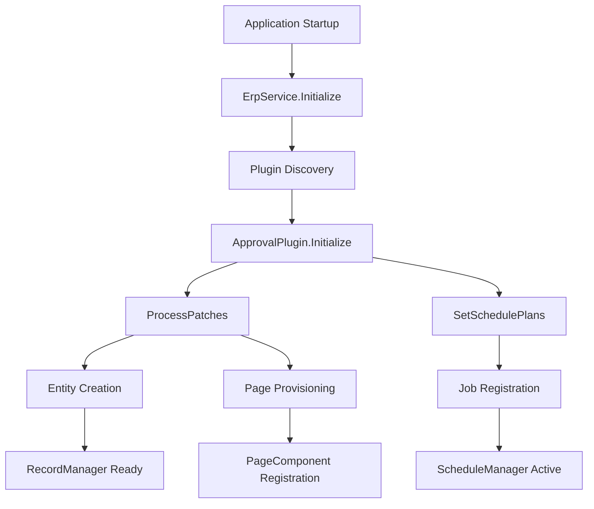
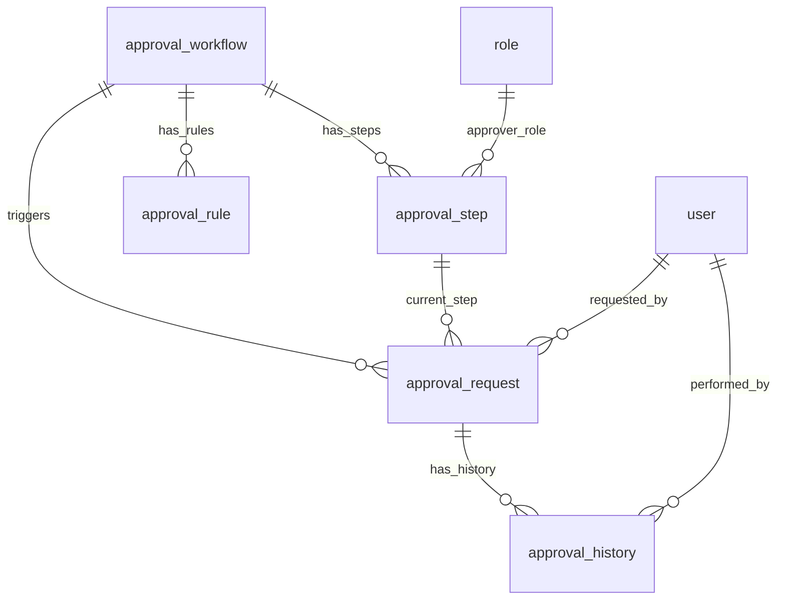
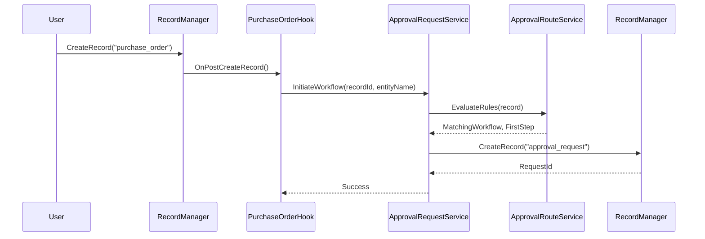
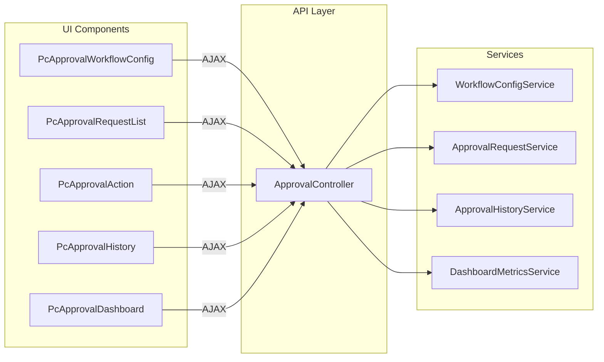
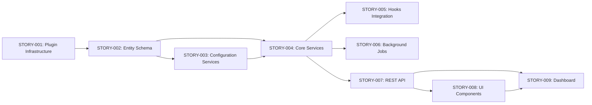

# Technical Specification

# 0. Agent Action Plan

## 0.1 Intent Clarification

Based on the prompt, the Blitzy platform understands that the new feature requirement is to implement a **complete approval workflow system** for the WebVella ERP platform. This implementation spans nine interconnected stories (STORY-001 through STORY-009) that collectively deliver an enterprise-grade approval management solution.

### 0.1.1 Core Feature Objectives

The Blitzy platform interprets the requirements as follows:

- **STORY-001 - Plugin Infrastructure**: Create the foundational `WebVella.Erp.Plugins.Approval` plugin assembly with proper initialization, migration orchestration via `ProcessPatches`, and scheduled job registration via `SetSchedulePlans`

- **STORY-002 - Entity Schema**: Define five core entities (`approval_workflow`, `approval_step`, `approval_rule`, `approval_request`, `approval_history`) with complete field definitions, relationships, and migration patches

- **STORY-003 - Workflow Configuration**: Implement admin-facing services (`WorkflowConfigService`, `StepConfigService`, `RuleConfigService`) for CRUD operations on workflow definitions with validation logic

- **STORY-004 - Service Layer**: Build core business logic services (`ApprovalWorkflowService`, `ApprovalRouteService`, `ApprovalRequestService`, `ApprovalHistoryService`) for runtime workflow processing

- **STORY-005 - Hook Integration**: Implement entity hooks using `IErpPreCreateRecordHook` and `IErpPostUpdateRecordHook` interfaces to automatically trigger approval workflows on target entity operations

- **STORY-006 - Background Jobs**: Create three `ErpJob` implementations for notifications (5-minute cycle), escalations (30-minute cycle), and expired approval cleanup (daily)

- **STORY-007 - REST API**: Expose `ApprovalController` endpoints for workflow management, approval actions (approve/reject/delegate), and queries

- **STORY-008 - UI Components**: Develop four `PageComponent` implementations (`PcApprovalWorkflowConfig`, `PcApprovalRequestList`, `PcApprovalAction`, `PcApprovalHistory`) with standard view files

- **STORY-009 - Dashboard Metrics**: Create `PcApprovalDashboard` component with `DashboardMetricsService` for real-time KPIs (pending count, average time, approval rate, overdue count, recent activity)

### 0.1.2 Implicit Requirements Detected

The Blitzy platform has identified the following implicit requirements:

- **Sequential Story Dependencies**: Each story builds upon previous ones; STORY-002 requires STORY-001 infrastructure; services (004) require entities (002); UI (008) requires API (007)
- **WebVella Architecture Compliance**: All implementations must follow established patterns from existing plugins (e.g., `WebVella.Erp.Plugins.Project`)
- **C# .NET 9.0 Standards**: Target framework is `net9.0`; use async/await for I/O, PascalCase for public members, proper XML documentation
- **Database Transaction Safety**: All multi-step operations must use `DbContext.Current.CreateConnection()` with explicit transaction management
- **Security Integration**: Implement role-based access control using `SecurityContext.CurrentUser` and role validation for Manager dashboard access

### 0.1.3 Special Instructions and Constraints

**Architectural Requirements:**
- Follow WebVella plugin architecture patterns using `ErpPlugin` base class
- Use dependency injection for all services (constructor injection)
- Implement repository pattern via `RecordManager` for data access
- Register page components with `PageComponentLibraryService` under "Approval Workflow" category

**Validation Scope Constraints:**
- All validation criteria apply ONLY to approval system implementation code
- Existing WebVella codebase warnings and patterns must remain unchanged
- Do NOT modify existing base codebase to meet new validation criteria

**Screenshot Requirements:**
- All screenshots must be from actual running code (not mocks)
- Create `validation/` folder with subfolders for each story (STORY-001 through STORY-009 and end-to-end)
- Include timestamps where applicable to prove real execution

### 0.1.4 Technical Interpretation

These feature requirements translate to the following technical implementation strategy:

| Requirement | Technical Action |
|-------------|------------------|
| Plugin Infrastructure | Create `ApprovalPlugin.cs` extending `ErpPlugin`, implement `Initialize()` calling `ProcessPatches()` and `SetSchedulePlans()` |
| Entity Schema | Create `ApprovalPlugin.YYYYMMDD.cs` migration files using `EntityManager.CreateEntity()` and `EntityRelationManager.Create()` |
| Configuration Services | Create service classes in `Services/` folder with CRUD methods using `RecordManager` queries |
| Core Services | Implement state machine logic in `ApprovalRequestService`, rule evaluation in `ApprovalRouteService` |
| Hook Integration | Create `[HookAttachment]` decorated classes implementing `IErpPreCreateRecordHook`, `IErpPostUpdateRecordHook` |
| Background Jobs | Create `[Job]` decorated classes extending `ErpJob` with `Execute(JobContext)` method |
| REST API | Create `ApprovalController` with `[Authorize]` and `[Route("api/v3.0/p/approval/...")]` attributes |
| UI Components | Create `[PageComponent]` decorated classes with `InvokeAsync(PageComponentContext)` and standard view files |
| Dashboard | Create `PcApprovalDashboard` component consuming `DashboardMetricsService` with auto-refresh capability |


## 0.2 Repository Scope Discovery

### 0.2.1 Comprehensive File Analysis

The following repository structure analysis identifies all files that must be created or modified for the complete approval system implementation.

**Existing Plugin Architecture Reference Files (Read-Only Patterns):**

| File Path | Purpose | Pattern Reference |
|-----------|---------|-------------------|
| `WebVella.Erp.Plugins.Project/ProjectPlugin.cs` | Plugin initialization pattern | `ErpPlugin` extension, `ProcessPatches()` invocation |
| `WebVella.Erp.Plugins.Project/ProjectPlugin._.cs` | Migration orchestration pattern | Version-gated patch execution with transactions |
| `WebVella.Erp.Plugins.Project/ProjectPlugin.20*.cs` | Entity/page migration patterns | `EntityManager`, `PageService` operations |
| `WebVella.Erp.Plugins.Project/Controllers/ProjectController.cs` | REST API controller pattern | `[Authorize]`, `ResponseModel`, endpoint structure |
| `WebVella.Erp.Plugins.Project/Components/PcFeedList/` | Page component structure | View files, `service.js`, options model |
| `WebVella.Erp.Plugins.Project/Hooks/Api/Task.cs` | API hook implementation | `[HookAttachment]`, `IErpPreCreateRecordHook` |
| `WebVella.Erp.Plugins.Project/Jobs/StartTasksOnStartDate.cs` | Background job pattern | `[Job]`, `ErpJob`, `Execute()` |
| `WebVella.Erp.Plugins.Project/Services/TaskService.cs` | Service layer pattern | `RecordManager` usage, EQL queries |

**Solution File Modification Required:**

| File Path | Modification Type | Description |
|-----------|-------------------|-------------|
| `WebVella.ERP3.sln` | MODIFY | Add new `WebVella.Erp.Plugins.Approval` project reference |

### 0.2.2 New Plugin Project Structure

**Root Plugin Files to Create:**

| File Path | Description |
|-----------|-------------|
| `WebVella.Erp.Plugins.Approval/WebVella.Erp.Plugins.Approval.csproj` | Plugin project file targeting net9.0 |
| `WebVella.Erp.Plugins.Approval/ApprovalPlugin.cs` | Main plugin entry point extending `ErpPlugin` |
| `WebVella.Erp.Plugins.Approval/ApprovalPlugin._.cs` | `ProcessPatches()` orchestration logic |
| `WebVella.Erp.Plugins.Approval/ApprovalPlugin.20260123.cs` | Initial entity schema migration |
| `WebVella.Erp.Plugins.Approval/Model/PluginSettings.cs` | Plugin version tracking DTO |

### 0.2.3 Entity and API Model Files

**Entity Models (Api Folder):**

| File Path | Description |
|-----------|-------------|
| `WebVella.Erp.Plugins.Approval/Api/ApprovalWorkflowModel.cs` | Workflow definition DTO |
| `WebVella.Erp.Plugins.Approval/Api/ApprovalStepModel.cs` | Workflow step DTO |
| `WebVella.Erp.Plugins.Approval/Api/ApprovalRuleModel.cs` | Routing rule DTO |
| `WebVella.Erp.Plugins.Approval/Api/ApprovalRequestModel.cs` | Request instance DTO |
| `WebVella.Erp.Plugins.Approval/Api/ApprovalHistoryModel.cs` | Audit history DTO |
| `WebVella.Erp.Plugins.Approval/Api/ApproveRequestModel.cs` | Approve action request DTO |
| `WebVella.Erp.Plugins.Approval/Api/RejectRequestModel.cs` | Reject action request DTO |
| `WebVella.Erp.Plugins.Approval/Api/DelegateRequestModel.cs` | Delegate action request DTO |
| `WebVella.Erp.Plugins.Approval/Api/DashboardMetricsModel.cs` | Dashboard metrics response DTO |
| `WebVella.Erp.Plugins.Approval/Api/ResponseModel.cs` | Standard API response envelope |

### 0.2.4 Service Layer Files

**Core Services:**

| File Path | Description |
|-----------|-------------|
| `WebVella.Erp.Plugins.Approval/Services/WorkflowConfigService.cs` | Workflow CRUD operations |
| `WebVella.Erp.Plugins.Approval/Services/StepConfigService.cs` | Step CRUD operations |
| `WebVella.Erp.Plugins.Approval/Services/RuleConfigService.cs` | Rule CRUD operations |
| `WebVella.Erp.Plugins.Approval/Services/ApprovalWorkflowService.cs` | Workflow runtime operations |
| `WebVella.Erp.Plugins.Approval/Services/ApprovalRouteService.cs` | Rule evaluation and routing |
| `WebVella.Erp.Plugins.Approval/Services/ApprovalRequestService.cs` | Request lifecycle management |
| `WebVella.Erp.Plugins.Approval/Services/ApprovalHistoryService.cs` | Audit trail operations |
| `WebVella.Erp.Plugins.Approval/Services/ApprovalNotificationService.cs` | Email notification logic |
| `WebVella.Erp.Plugins.Approval/Services/DashboardMetricsService.cs` | Dashboard metrics calculations |

### 0.2.5 Controller Files

| File Path | Description |
|-----------|-------------|
| `WebVella.Erp.Plugins.Approval/Controllers/ApprovalController.cs` | REST API endpoints for all approval operations |

### 0.2.6 Hook Implementation Files

**API Hooks:**

| File Path | Description |
|-----------|-------------|
| `WebVella.Erp.Plugins.Approval/Hooks/Api/ApprovalRequest.cs` | Pre-create and post-update hooks for approval_request entity |
| `WebVella.Erp.Plugins.Approval/Hooks/Api/PurchaseOrderApproval.cs` | Hook to auto-initiate workflows on purchase_order entity |
| `WebVella.Erp.Plugins.Approval/Hooks/Api/ExpenseRequestApproval.cs` | Hook to auto-initiate workflows on expense_request entity |

### 0.2.7 Background Job Files

| File Path | Description |
|-----------|-------------|
| `WebVella.Erp.Plugins.Approval/Jobs/ProcessApprovalNotificationsJob.cs` | 5-minute notification processing job |
| `WebVella.Erp.Plugins.Approval/Jobs/ProcessApprovalEscalationsJob.cs` | 30-minute escalation processing job |
| `WebVella.Erp.Plugins.Approval/Jobs/CleanupExpiredApprovalsJob.cs` | Daily expired approval cleanup job |

### 0.2.8 UI Page Component Files

**PcApprovalWorkflowConfig Component:**

| File Path | Description |
|-----------|-------------|
| `WebVella.Erp.Plugins.Approval/Components/PcApprovalWorkflowConfig/PcApprovalWorkflowConfig.cs` | Component class |
| `WebVella.Erp.Plugins.Approval/Components/PcApprovalWorkflowConfig/Design.cshtml` | Page builder preview |
| `WebVella.Erp.Plugins.Approval/Components/PcApprovalWorkflowConfig/Display.cshtml` | Runtime display |
| `WebVella.Erp.Plugins.Approval/Components/PcApprovalWorkflowConfig/Options.cshtml` | Configuration panel |
| `WebVella.Erp.Plugins.Approval/Components/PcApprovalWorkflowConfig/Help.cshtml` | Documentation |
| `WebVella.Erp.Plugins.Approval/Components/PcApprovalWorkflowConfig/Error.cshtml` | Error display |
| `WebVella.Erp.Plugins.Approval/Components/PcApprovalWorkflowConfig/service.js` | Client-side logic |

**PcApprovalRequestList Component:**

| File Path | Description |
|-----------|-------------|
| `WebVella.Erp.Plugins.Approval/Components/PcApprovalRequestList/PcApprovalRequestList.cs` | Component class |
| `WebVella.Erp.Plugins.Approval/Components/PcApprovalRequestList/Design.cshtml` | Page builder preview |
| `WebVella.Erp.Plugins.Approval/Components/PcApprovalRequestList/Display.cshtml` | Runtime display |
| `WebVella.Erp.Plugins.Approval/Components/PcApprovalRequestList/Options.cshtml` | Configuration panel |
| `WebVella.Erp.Plugins.Approval/Components/PcApprovalRequestList/Help.cshtml` | Documentation |
| `WebVella.Erp.Plugins.Approval/Components/PcApprovalRequestList/Error.cshtml` | Error display |
| `WebVella.Erp.Plugins.Approval/Components/PcApprovalRequestList/service.js` | Client-side logic |

**PcApprovalAction Component:**

| File Path | Description |
|-----------|-------------|
| `WebVella.Erp.Plugins.Approval/Components/PcApprovalAction/PcApprovalAction.cs` | Component class |
| `WebVella.Erp.Plugins.Approval/Components/PcApprovalAction/Design.cshtml` | Page builder preview |
| `WebVella.Erp.Plugins.Approval/Components/PcApprovalAction/Display.cshtml` | Runtime display |
| `WebVella.Erp.Plugins.Approval/Components/PcApprovalAction/Options.cshtml` | Configuration panel |
| `WebVella.Erp.Plugins.Approval/Components/PcApprovalAction/Help.cshtml` | Documentation |
| `WebVella.Erp.Plugins.Approval/Components/PcApprovalAction/Error.cshtml` | Error display |
| `WebVella.Erp.Plugins.Approval/Components/PcApprovalAction/service.js` | Client-side logic |

**PcApprovalHistory Component:**

| File Path | Description |
|-----------|-------------|
| `WebVella.Erp.Plugins.Approval/Components/PcApprovalHistory/PcApprovalHistory.cs` | Component class |
| `WebVella.Erp.Plugins.Approval/Components/PcApprovalHistory/Design.cshtml` | Page builder preview |
| `WebVella.Erp.Plugins.Approval/Components/PcApprovalHistory/Display.cshtml` | Runtime display |
| `WebVella.Erp.Plugins.Approval/Components/PcApprovalHistory/Options.cshtml` | Configuration panel |
| `WebVella.Erp.Plugins.Approval/Components/PcApprovalHistory/Help.cshtml` | Documentation |
| `WebVella.Erp.Plugins.Approval/Components/PcApprovalHistory/Error.cshtml` | Error display |
| `WebVella.Erp.Plugins.Approval/Components/PcApprovalHistory/service.js` | Client-side logic |

**PcApprovalDashboard Component:**

| File Path | Description |
|-----------|-------------|
| `WebVella.Erp.Plugins.Approval/Components/PcApprovalDashboard/PcApprovalDashboard.cs` | Component class |
| `WebVella.Erp.Plugins.Approval/Components/PcApprovalDashboard/Design.cshtml` | Page builder preview |
| `WebVella.Erp.Plugins.Approval/Components/PcApprovalDashboard/Display.cshtml` | Runtime display with auto-refresh |
| `WebVella.Erp.Plugins.Approval/Components/PcApprovalDashboard/Options.cshtml` | Configuration panel |
| `WebVella.Erp.Plugins.Approval/Components/PcApprovalDashboard/Help.cshtml` | Documentation |
| `WebVella.Erp.Plugins.Approval/Components/PcApprovalDashboard/Error.cshtml` | Error display |
| `WebVella.Erp.Plugins.Approval/Components/PcApprovalDashboard/service.js` | Client-side auto-refresh logic |

### 0.2.9 Validation Output Structure

| Folder Path | Description |
|-------------|-------------|
| `validation/STORY-001/` | Plugin registration screenshots |
| `validation/STORY-002/` | Entity schema screenshots |
| `validation/STORY-003/` | Workflow configuration screenshots |
| `validation/STORY-004/` | Service layer screenshots |
| `validation/STORY-005/` | Hook integration screenshots |
| `validation/STORY-006/` | Background job screenshots |
| `validation/STORY-007/` | REST API screenshots |
| `validation/STORY-008/` | UI component screenshots |
| `validation/STORY-009/` | Dashboard metrics screenshots |
| `validation/end-to-end/` | Complete workflow execution screenshots |

### 0.2.10 Web Search Research Conducted

- Best practices for implementing multi-level approval workflows in ERP systems
- .NET 9.0 async/await patterns for database operations
- WebVella ERP plugin development conventions and patterns
- Entity-based state machine implementations in C#
- Real-time dashboard metrics calculation approaches


## 0.3 Dependency Inventory

### 0.3.1 Private and Public Packages

The approval plugin requires the following packages, all aligned with the existing WebVella ERP ecosystem:

| Registry | Package Name | Version | Purpose |
|----------|--------------|---------|---------|
| NuGet (Public) | Microsoft.AspNetCore.Mvc.NewtonsoftJson | 9.0.10 | JSON serialization for API responses |
| NuGet (Public) | Newtonsoft.Json | 13.0.4 | JSON operations and DTO serialization |
| NuGet (Public) | Npgsql | 9.0.4 | PostgreSQL database connectivity |
| Framework | Microsoft.AspNetCore.App | 9.0 | ASP.NET Core framework reference |
| Project | WebVella.Erp | 1.7.4 | Core ERP library (EntityManager, RecordManager, Jobs) |
| Project | WebVella.Erp.Web | 1.7.5 | Web components library (PageComponent, TagHelpers) |

### 0.3.2 Framework and Runtime Requirements

| Component | Version | Source |
|-----------|---------|--------|
| .NET SDK | 9.0.x | Target framework from all csproj files |
| ASP.NET Core | 9.0 | FrameworkReference in project files |
| PostgreSQL | 16.x | Database requirement from repository README |

### 0.3.3 Project Reference Structure

The new `WebVella.Erp.Plugins.Approval` project must include:

```xml
<ItemGroup>
  <ProjectReference Include="..\WebVella.Erp.Web\WebVella.Erp.Web.csproj" />
  <ProjectReference Include="..\WebVella.ERP\WebVella.Erp.csproj" />
</ItemGroup>
```

### 0.3.4 Dependency Updates

**Import Transformation Rules:**

All source files in the new plugin will use the following import patterns:

| Import Type | Required Namespaces |
|-------------|---------------------|
| Core API | `using WebVella.Erp.Api;` `using WebVella.Erp.Api.Models;` |
| Database | `using WebVella.Erp.Database;` |
| Jobs | `using WebVella.Erp.Jobs;` |
| Hooks | `using WebVella.Erp.Hooks;` |
| Web Models | `using WebVella.Erp.Web.Models;` |
| Web Services | `using WebVella.Erp.Web.Services;` |
| EQL | `using WebVella.Erp.Eql;` |
| Exceptions | `using WebVella.Erp.Exceptions;` |
| ASP.NET Core | `using Microsoft.AspNetCore.Mvc;` `using Microsoft.AspNetCore.Authorization;` |
| JSON | `using Newtonsoft.Json;` |

### 0.3.5 Embedded Resource Configuration

The csproj file must configure embedded resources for client-side JavaScript:

```xml
<ItemGroup>
  <None Remove="Components\PcApprovalWorkflowConfig\service.js" />
  <None Remove="Components\PcApprovalRequestList\service.js" />
  <None Remove="Components\PcApprovalAction\service.js" />
  <None Remove="Components\PcApprovalHistory\service.js" />
  <None Remove="Components\PcApprovalDashboard\service.js" />
</ItemGroup>

<ItemGroup>
  <EmbeddedResource Include="Components\PcApprovalWorkflowConfig\service.js" />
  <EmbeddedResource Include="Components\PcApprovalRequestList\service.js" />
  <EmbeddedResource Include="Components\PcApprovalAction\service.js" />
  <EmbeddedResource Include="Components\PcApprovalHistory\service.js" />
  <EmbeddedResource Include="Components\PcApprovalDashboard\service.js" />
</ItemGroup>
```

### 0.3.6 Key Type Dependencies from WebVella.Erp

| Type | Namespace | Usage |
|------|-----------|-------|
| `ErpPlugin` | `WebVella.Erp.Api` | Base class for plugin entry point |
| `EntityManager` | `WebVella.Erp.Api` | Entity schema creation and management |
| `RecordManager` | `WebVella.Erp.Api` | Record CRUD operations |
| `EntityRelationManager` | `WebVella.Erp.Api` | Entity relationship management |
| `SecurityContext` | `WebVella.Erp.Api` | User authentication context |
| `ErpJob` | `WebVella.Erp.Jobs` | Base class for background jobs |
| `ScheduleManager` | `WebVella.Erp.Jobs` | Job schedule registration |
| `SchedulePlan` | `WebVella.Erp.Jobs` | Job schedule definition |
| `EntityRecord` | `WebVella.Erp.Api.Models` | Record data container |
| `EqlCommand` | `WebVella.Erp.Eql` | ERP Query Language execution |
| `ValidationException` | `WebVella.Erp.Exceptions` | Validation error handling |

### 0.3.7 Key Type Dependencies from WebVella.Erp.Web

| Type | Namespace | Usage |
|------|-----------|-------|
| `PageComponent` | `WebVella.Erp.Web.Models` | Base class for UI components |
| `PageComponentAttribute` | `WebVella.Erp.Web.Models` | Component metadata registration |
| `PageComponentContext` | `WebVella.Erp.Web.Models` | Component rendering context |
| `ComponentMode` | `WebVella.Erp.Web.Models` | Render mode enumeration |
| `ErpPage` | `WebVella.Erp.Web.Models` | Page model |
| `ErpRequestContext` | `WebVella.Erp.Web.Models` | HTTP request context |
| `PageComponentLibraryService` | `WebVella.Erp.Web.Services` | Component registration service |
| `IErpService` | `WebVella.Erp.Web` | Core ERP service interface |

### 0.3.8 Hook Interface Dependencies

| Interface | Namespace | Usage |
|-----------|-----------|-------|
| `IErpPreCreateRecordHook` | `WebVella.Erp.Hooks` | Pre-create validation hook |
| `IErpPostCreateRecordHook` | `WebVella.Erp.Hooks` | Post-create side effects hook |
| `IErpPreUpdateRecordHook` | `WebVella.Erp.Hooks` | Pre-update validation hook |
| `IErpPostUpdateRecordHook` | `WebVella.Erp.Hooks` | Post-update side effects hook |
| `HookAttachmentAttribute` | `WebVella.Erp.Hooks` | Entity binding attribute |


## 0.4 Integration Analysis

### 0.4.1 Existing Code Touchpoints

**Direct Modifications Required:**

| File | Modification | Purpose |
|------|--------------|---------|
| `WebVella.ERP3.sln` | Add project reference to `WebVella.Erp.Plugins.Approval` | Include new plugin in solution build |
| `WebVella.Erp.Site.*/Startup.cs` (optional) | Add `.UseErpPlugin<ApprovalPlugin>()` if explicit registration needed | Plugin activation |

**Site Project Integration Pattern:**

Following the existing pattern from `WebVella.Erp.Site/Startup.cs`, if explicit plugin registration is needed:

```csharp
app.UseErpPlugin<ApprovalPlugin>()
```

However, WebVella ERP typically auto-discovers plugins via assembly scanning, so explicit registration may not be required.

### 0.4.2 Plugin Initialization Integration

**ApprovalPlugin Integration Points:**



### 0.4.3 Entity Relationship Integration

The five approval entities integrate with WebVella's entity system:



**Entity Registration Points:**

| Entity | Registration Location | Integration |
|--------|----------------------|-------------|
| `approval_workflow` | `ApprovalPlugin.20260123.cs` | `EntityManager.CreateEntity()` |
| `approval_step` | `ApprovalPlugin.20260123.cs` | `EntityManager.CreateEntity()` + N:1 relation to workflow |
| `approval_rule` | `ApprovalPlugin.20260123.cs` | `EntityManager.CreateEntity()` + N:1 relation to workflow |
| `approval_request` | `ApprovalPlugin.20260123.cs` | `EntityManager.CreateEntity()` + relations to workflow, step |
| `approval_history` | `ApprovalPlugin.20260123.cs` | `EntityManager.CreateEntity()` + N:1 relation to request |

### 0.4.4 Service Layer Integration

**Service Dependency Injections:**

| Service | Dependencies | Integration Point |
|---------|--------------|-------------------|
| `WorkflowConfigService` | `RecordManager`, `EntityManager` | Workflow CRUD via `ApprovalController` |
| `StepConfigService` | `RecordManager`, `WorkflowConfigService` | Step management nested under workflow |
| `RuleConfigService` | `RecordManager`, `WorkflowConfigService` | Rule management nested under workflow |
| `ApprovalWorkflowService` | `RecordManager`, `StepConfigService`, `RuleConfigService` | Workflow activation/deactivation |
| `ApprovalRouteService` | `RecordManager`, `ApprovalWorkflowService` | Rule evaluation, step routing |
| `ApprovalRequestService` | `RecordManager`, `ApprovalRouteService`, `ApprovalHistoryService` | Request lifecycle state machine |
| `ApprovalHistoryService` | `RecordManager` | Audit trail persistence |
| `ApprovalNotificationService` | `RecordManager`, `EmailService` (WebVella.Erp.Plugins.Mail) | Email notifications |
| `DashboardMetricsService` | `RecordManager` | Metrics aggregation |

### 0.4.5 Controller API Integration

**ApprovalController Endpoints:**

| Endpoint | Method | Integration |
|----------|--------|-------------|
| `/api/v3.0/p/approval/workflow` | GET | List workflows via `WorkflowConfigService.GetAll()` |
| `/api/v3.0/p/approval/workflow` | POST | Create workflow via `WorkflowConfigService.Create()` |
| `/api/v3.0/p/approval/workflow/{id}` | GET | Get workflow via `WorkflowConfigService.GetById()` |
| `/api/v3.0/p/approval/workflow/{id}` | PUT | Update workflow via `WorkflowConfigService.Update()` |
| `/api/v3.0/p/approval/workflow/{id}` | DELETE | Delete workflow via `WorkflowConfigService.Delete()` |
| `/api/v3.0/p/approval/pending` | GET | Pending requests via `ApprovalRequestService.GetPending()` |
| `/api/v3.0/p/approval/request/{id}` | GET | Request details via `ApprovalRequestService.GetById()` |
| `/api/v3.0/p/approval/request/{id}/approve` | POST | Approve via `ApprovalRequestService.Approve()` |
| `/api/v3.0/p/approval/request/{id}/reject` | POST | Reject via `ApprovalRequestService.Reject()` |
| `/api/v3.0/p/approval/request/{id}/delegate` | POST | Delegate via `ApprovalRequestService.Delegate()` |
| `/api/v3.0/p/approval/request/{id}/history` | GET | History via `ApprovalHistoryService.GetByRequestId()` |
| `/api/v3.0/p/approval/dashboard/metrics` | GET | Metrics via `DashboardMetricsService.GetDashboardMetrics()` |

### 0.4.6 Hook Integration Points

**API Hooks for Workflow Triggering:**

| Hook Class | Entity | Events | Integration |
|------------|--------|--------|-------------|
| `ApprovalRequest` | `approval_request` | PreCreate, PostUpdate | Validates request, logs history on status change |
| `PurchaseOrderApproval` | `purchase_order` | PostCreate | Initiates workflow via `ApprovalRequestService.Create()` |
| `ExpenseRequestApproval` | `expense_request` | PostCreate | Initiates workflow via `ApprovalRequestService.Create()` |

**Hook Execution Flow:**



### 0.4.7 Background Job Integration

**Job Schedule Registration:**

| Job | Schedule Type | Interval | GUID |
|----|---------------|----------|------|
| `ProcessApprovalNotificationsJob` | Interval | 5 minutes | Generate unique GUID |
| `ProcessApprovalEscalationsJob` | Interval | 30 minutes | Generate unique GUID |
| `CleanupExpiredApprovalsJob` | Daily | Once at 00:10 UTC | Generate unique GUID |

**Job Integration with ScheduleManager:**

```csharp
// In ApprovalPlugin.SetSchedulePlans()
var schedulePlan = new SchedulePlan
{
    Id = new Guid("..."),
    Name = "Process Approval Notifications",
    Type = SchedulePlanType.Interval,
    IntervalInMinutes = 5,
    JobTypeId = new Guid("..."), // Job class GUID
    Enabled = true
};
ScheduleManager.Current.CreateSchedulePlan(schedulePlan);
```

### 0.4.8 UI Component Integration

**Page Component Registration:**

All components register with `PageComponentLibraryService` via the `[PageComponent]` attribute:

| Component | Category | IconClass |
|-----------|----------|-----------|
| `PcApprovalWorkflowConfig` | Approval Workflow | `fas fa-cogs` |
| `PcApprovalRequestList` | Approval Workflow | `fas fa-list-alt` |
| `PcApprovalAction` | Approval Workflow | `fas fa-check-circle` |
| `PcApprovalHistory` | Approval Workflow | `fas fa-history` |
| `PcApprovalDashboard` | Approval Workflow | `fas fa-chart-line` |

**Component-to-API Integration:**




## 0.5 Technical Implementation

### 0.5.1 File-by-File Execution Plan

**CRITICAL: Every file listed below MUST be created or modified as specified.**

#### Group 1 - Plugin Foundation (STORY-001)

| Action | File Path | Implementation Details |
|--------|-----------|------------------------|
| CREATE | `WebVella.Erp.Plugins.Approval/WebVella.Erp.Plugins.Approval.csproj` | SDK.Razor project targeting net9.0, references to WebVella.Erp and WebVella.Erp.Web |
| CREATE | `WebVella.Erp.Plugins.Approval/ApprovalPlugin.cs` | Extends `ErpPlugin`, `Name = "approval"`, calls `ProcessPatches()` and `SetSchedulePlans()` |
| CREATE | `WebVella.Erp.Plugins.Approval/ApprovalPlugin._.cs` | Version-gated patch orchestration with transaction management |
| CREATE | `WebVella.Erp.Plugins.Approval/Model/PluginSettings.cs` | DTO with `Version` property for tracking |
| MODIFY | `WebVella.ERP3.sln` | Add project reference for new plugin |

#### Group 2 - Entity Schema (STORY-002)

| Action | File Path | Implementation Details |
|--------|-----------|------------------------|
| CREATE | `WebVella.Erp.Plugins.Approval/ApprovalPlugin.20260123.cs` | Entity creation patch: `approval_workflow`, `approval_step`, `approval_rule`, `approval_request`, `approval_history` |

**Entity Field Specifications:**

**approval_workflow:**
- `id` (Guid, PK, Auto)
- `name` (Text, Required, Max 256)
- `target_entity_name` (Text, Required, Max 128)
- `is_enabled` (Checkbox, Default true)
- `created_on` (DateTime, Auto)
- `created_by` (Guid, FK to user)

**approval_step:**
- `id` (Guid, PK, Auto)
- `workflow_id` (Guid, FK to approval_workflow)
- `step_order` (Number, Required)
- `name` (Text, Required)
- `approver_type` (Text: "role", "user", "department_head")
- `approver_id` (Guid, nullable)
- `timeout_hours` (Number, nullable)
- `is_final` (Checkbox, Default false)

**approval_rule:**
- `id` (Guid, PK, Auto)
- `workflow_id` (Guid, FK to approval_workflow)
- `name` (Text, Required)
- `field_name` (Text, Required)
- `operator` (Text: "eq", "neq", "gt", "gte", "lt", "lte", "contains")
- `value` (Text, Required)
- `priority` (Number, Default 0)

**approval_request:**
- `id` (Guid, PK, Auto)
- `workflow_id` (Guid, FK to approval_workflow)
- `current_step_id` (Guid, FK to approval_step)
- `source_entity_name` (Text, Required)
- `source_record_id` (Guid, Required)
- `status` (Text: "pending", "approved", "rejected", "escalated", "expired")
- `requested_by` (Guid, FK to user)
- `requested_on` (DateTime, Auto)
- `completed_on` (DateTime, nullable)

**approval_history:**
- `id` (Guid, PK, Auto)
- `request_id` (Guid, FK to approval_request)
- `step_id` (Guid, FK to approval_step)
- `action` (Text: "submitted", "approved", "rejected", "delegated", "escalated")
- `performed_by` (Guid, FK to user)
- `performed_on` (DateTime, Auto)
- `comments` (Multiline Text, nullable)

#### Group 3 - API Models (STORY-003, STORY-004)

| Action | File Path | Implementation Details |
|--------|-----------|------------------------|
| CREATE | `WebVella.Erp.Plugins.Approval/Api/ApprovalWorkflowModel.cs` | DTO matching entity fields |
| CREATE | `WebVella.Erp.Plugins.Approval/Api/ApprovalStepModel.cs` | DTO with workflow relation |
| CREATE | `WebVella.Erp.Plugins.Approval/Api/ApprovalRuleModel.cs` | DTO with operator enum |
| CREATE | `WebVella.Erp.Plugins.Approval/Api/ApprovalRequestModel.cs` | DTO with status enum |
| CREATE | `WebVella.Erp.Plugins.Approval/Api/ApprovalHistoryModel.cs` | DTO with action enum |
| CREATE | `WebVella.Erp.Plugins.Approval/Api/ApproveRequestModel.cs` | Input DTO: comments |
| CREATE | `WebVella.Erp.Plugins.Approval/Api/RejectRequestModel.cs` | Input DTO: comments, reason |
| CREATE | `WebVella.Erp.Plugins.Approval/Api/DelegateRequestModel.cs` | Input DTO: delegateToUserId, comments |
| CREATE | `WebVella.Erp.Plugins.Approval/Api/DashboardMetricsModel.cs` | Response DTO with all 5 metrics |

#### Group 4 - Configuration Services (STORY-003)

| Action | File Path | Implementation Details |
|--------|-----------|------------------------|
| CREATE | `WebVella.Erp.Plugins.Approval/Services/WorkflowConfigService.cs` | CRUD for approval_workflow with validation |
| CREATE | `WebVella.Erp.Plugins.Approval/Services/StepConfigService.cs` | CRUD for approval_step, order management |
| CREATE | `WebVella.Erp.Plugins.Approval/Services/RuleConfigService.cs` | CRUD for approval_rule, priority management |

#### Group 5 - Core Services (STORY-004)

| Action | File Path | Implementation Details |
|--------|-----------|------------------------|
| CREATE | `WebVella.Erp.Plugins.Approval/Services/ApprovalWorkflowService.cs` | Workflow lifecycle, enable/disable |
| CREATE | `WebVella.Erp.Plugins.Approval/Services/ApprovalRouteService.cs` | Rule evaluation, step routing logic |
| CREATE | `WebVella.Erp.Plugins.Approval/Services/ApprovalRequestService.cs` | State machine: Create, Approve, Reject, Delegate |
| CREATE | `WebVella.Erp.Plugins.Approval/Services/ApprovalHistoryService.cs` | History logging, audit trail queries |
| CREATE | `WebVella.Erp.Plugins.Approval/Services/ApprovalNotificationService.cs` | Email notification composition |
| CREATE | `WebVella.Erp.Plugins.Approval/Services/DashboardMetricsService.cs` | Metrics calculation methods |

#### Group 6 - Hooks (STORY-005)

| Action | File Path | Implementation Details |
|--------|-----------|------------------------|
| CREATE | `WebVella.Erp.Plugins.Approval/Hooks/Api/ApprovalRequest.cs` | `[HookAttachment("approval_request")]`, PreCreate, PostUpdate |
| CREATE | `WebVella.Erp.Plugins.Approval/Hooks/Api/PurchaseOrderApproval.cs` | `[HookAttachment("purchase_order")]`, PostCreate trigger |
| CREATE | `WebVella.Erp.Plugins.Approval/Hooks/Api/ExpenseRequestApproval.cs` | `[HookAttachment("expense_request")]`, PostCreate trigger |

#### Group 7 - Background Jobs (STORY-006)

| Action | File Path | Implementation Details |
|--------|-----------|------------------------|
| CREATE | `WebVella.Erp.Plugins.Approval/Jobs/ProcessApprovalNotificationsJob.cs` | `[Job]`, 5-min cycle, sends pending notifications |
| CREATE | `WebVella.Erp.Plugins.Approval/Jobs/ProcessApprovalEscalationsJob.cs` | `[Job]`, 30-min cycle, handles timeout escalations |
| CREATE | `WebVella.Erp.Plugins.Approval/Jobs/CleanupExpiredApprovalsJob.cs` | `[Job]`, daily, expires old pending requests |

#### Group 8 - REST API Controller (STORY-007)

| Action | File Path | Implementation Details |
|--------|-----------|------------------------|
| CREATE | `WebVella.Erp.Plugins.Approval/Controllers/ApprovalController.cs` | `[Authorize]`, all approval endpoints |

#### Group 9 - UI Components (STORY-008, STORY-009)

For each of the 5 components, create the following file set:

**PcApprovalWorkflowConfig:**
| Action | File Path |
|--------|-----------|
| CREATE | `WebVella.Erp.Plugins.Approval/Components/PcApprovalWorkflowConfig/PcApprovalWorkflowConfig.cs` |
| CREATE | `WebVella.Erp.Plugins.Approval/Components/PcApprovalWorkflowConfig/Design.cshtml` |
| CREATE | `WebVella.Erp.Plugins.Approval/Components/PcApprovalWorkflowConfig/Display.cshtml` |
| CREATE | `WebVella.Erp.Plugins.Approval/Components/PcApprovalWorkflowConfig/Options.cshtml` |
| CREATE | `WebVella.Erp.Plugins.Approval/Components/PcApprovalWorkflowConfig/Help.cshtml` |
| CREATE | `WebVella.Erp.Plugins.Approval/Components/PcApprovalWorkflowConfig/Error.cshtml` |
| CREATE | `WebVella.Erp.Plugins.Approval/Components/PcApprovalWorkflowConfig/service.js` |

**PcApprovalRequestList, PcApprovalAction, PcApprovalHistory, PcApprovalDashboard:** Same 7-file pattern each.

### 0.5.2 Implementation Approach per File

**Phase 1: Establish Plugin Foundation**
- Create csproj with proper SDK, framework, and project references
- Implement `ApprovalPlugin.cs` with `ErpPlugin` extension pattern
- Set up `ProcessPatches()` orchestration in `ApprovalPlugin._.cs`
- Add plugin to solution file

**Phase 2: Create Entity Schema**
- Implement migration patch with all 5 entities
- Define fields, relationships, and indexes
- Set up proper entity relations using `EntityRelationManager`

**Phase 3: Build Service Layer**
- Create configuration services with validation
- Implement core business logic services
- Add notification and metrics services

**Phase 4: Implement API Layer**
- Create `ApprovalController` with all endpoints
- Implement request/response DTOs
- Add proper authorization and error handling

**Phase 5: Integrate Hooks**
- Create entity hooks with `[HookAttachment]`
- Implement workflow triggering logic
- Add validation in pre-create hooks

**Phase 6: Configure Background Jobs**
- Create job classes with `[Job]` attribute
- Implement job logic using services
- Register schedules in `SetSchedulePlans()`

**Phase 7: Develop UI Components**
- Create all 5 page components
- Implement view files for all modes
- Add client-side JavaScript for AJAX

**Phase 8: Validate and Document**
- Run application and capture screenshots
- Verify all acceptance criteria
- Document verification steps

### 0.5.3 Code Pattern Examples

**Plugin Entry Point Pattern:**
```csharp
[JsonProperty(PropertyName = "name")]
public override string Name { get; protected set; } = "approval";

public override void Initialize(IServiceProvider svc)
{
    using (var ctx = SecurityContext.OpenSystemScope())
    {
        ProcessPatches();
        SetSchedulePlans();
    }
}
```

**Entity Creation Pattern:**
```csharp
var entity = new InputEntity();
entity.Id = new Guid("...");
entity.Name = "approval_workflow";
entity.Label = "Approval Workflow";
// Add fields...
var response = entMan.CreateEntity(entity);
```

**Service Method Pattern:**
```csharp
public ApprovalRequestModel Approve(Guid requestId, Guid userId, string comments)
{
    var recMan = new RecordManager();
    var patchRecord = new EntityRecord();
    patchRecord["id"] = requestId;
    patchRecord["status"] = "approved";
    var result = recMan.UpdateRecord("approval_request", patchRecord);
    // Log history...
    return MapToModel(result.Object.Data[0]);
}
```

**Page Component Pattern:**
```csharp
[PageComponent(Label = "Approval Dashboard", Library = "WebVella",
    Description = "Real-time dashboard", Version = "0.0.1",
    IconClass = "fas fa-chart-line", Category = "Approval Workflow")]
public class PcApprovalDashboard : PageComponent
{
    public async Task<IViewComponentResult> InvokeAsync(PageComponentContext ctx)
    {
        // Implementation...
    }
}
```


## 0.6 Scope Boundaries

### 0.6.1 Exhaustively In Scope

**Plugin Source Files:**
- `WebVella.Erp.Plugins.Approval/**/*.cs` - All C# source files in the new plugin
- `WebVella.Erp.Plugins.Approval/**/*.cshtml` - All Razor view files for components
- `WebVella.Erp.Plugins.Approval/**/*.js` - All embedded JavaScript files

**Specific File Patterns:**

| Pattern | Description |
|---------|-------------|
| `WebVella.Erp.Plugins.Approval/ApprovalPlugin*.cs` | Plugin entry and migration files |
| `WebVella.Erp.Plugins.Approval/Model/*.cs` | Plugin configuration models |
| `WebVella.Erp.Plugins.Approval/Api/*.cs` | All API DTOs and response models |
| `WebVella.Erp.Plugins.Approval/Services/*.cs` | All service layer implementations |
| `WebVella.Erp.Plugins.Approval/Controllers/*.cs` | REST API controller(s) |
| `WebVella.Erp.Plugins.Approval/Hooks/Api/*.cs` | All API hook implementations |
| `WebVella.Erp.Plugins.Approval/Jobs/*.cs` | All background job implementations |
| `WebVella.Erp.Plugins.Approval/Components/*/*.cs` | All page component classes |
| `WebVella.Erp.Plugins.Approval/Components/*/*.cshtml` | All component view files |
| `WebVella.Erp.Plugins.Approval/Components/*/service.js` | All component JavaScript files |

**Project Configuration Files:**
- `WebVella.Erp.Plugins.Approval/WebVella.Erp.Plugins.Approval.csproj` - Project definition

**Solution File:**
- `WebVella.ERP3.sln` - Add project reference (minimal modification)

**Database Entities (Created via Migration):**
- `approval_workflow` - Workflow definitions
- `approval_step` - Workflow steps with approver assignments
- `approval_rule` - Conditional routing rules
- `approval_request` - Runtime approval instances
- `approval_history` - Audit trail records

**Entity Relationships:**
- `approval_workflow` ← `approval_step` (N:1)
- `approval_workflow` ← `approval_rule` (N:1)
- `approval_workflow` ← `approval_request` (N:1)
- `approval_step` ← `approval_request.current_step` (N:1)
- `approval_request` ← `approval_history` (N:1)

**Background Job Schedules:**
- `ProcessApprovalNotificationsJob` - 5-minute interval schedule
- `ProcessApprovalEscalationsJob` - 30-minute interval schedule
- `CleanupExpiredApprovalsJob` - Daily schedule at 00:10 UTC

**REST API Endpoints:**
- `GET /api/v3.0/p/approval/workflow` - List workflows
- `POST /api/v3.0/p/approval/workflow` - Create workflow
- `GET /api/v3.0/p/approval/workflow/{id}` - Get workflow
- `PUT /api/v3.0/p/approval/workflow/{id}` - Update workflow
- `DELETE /api/v3.0/p/approval/workflow/{id}` - Delete workflow
- `GET /api/v3.0/p/approval/pending` - List pending approvals
- `GET /api/v3.0/p/approval/request/{id}` - Get request details
- `POST /api/v3.0/p/approval/request/{id}/approve` - Approve request
- `POST /api/v3.0/p/approval/request/{id}/reject` - Reject request
- `POST /api/v3.0/p/approval/request/{id}/delegate` - Delegate request
- `GET /api/v3.0/p/approval/request/{id}/history` - Get history
- `GET /api/v3.0/p/approval/dashboard/metrics` - Get dashboard metrics

**UI Page Components:**
- `PcApprovalWorkflowConfig` - Workflow administration
- `PcApprovalRequestList` - Request listing with filters
- `PcApprovalAction` - Approve/Reject/Delegate buttons
- `PcApprovalHistory` - Timeline audit display
- `PcApprovalDashboard` - Manager metrics dashboard

**Validation Artifacts:**
- `validation/STORY-001/*.png` through `validation/STORY-009/*.png`
- `validation/end-to-end/*.png`

### 0.6.2 Explicitly Out of Scope

**Existing WebVella Codebase:**
- DO NOT modify any files in `WebVella.Erp/` core library
- DO NOT modify any files in `WebVella.Erp.Web/` web library
- DO NOT modify any files in existing plugins (`WebVella.Erp.Plugins.Project/`, etc.)
- DO NOT fix existing warnings or issues in base codebase

**Unrelated Features:**
- User management or authentication system modifications
- Permission/role system modifications beyond using existing APIs
- Reporting or analytics beyond the dashboard component
- Email template management (use existing WebVella.Erp.Plugins.Mail infrastructure)
- File attachment handling for approval requests (future enhancement)

**Performance Optimizations:**
- Database indexing beyond entity defaults
- Caching mechanisms for approval data
- Query optimization for large datasets (beyond basic pagination)
- Background job parallelization

**Advanced Features Not Specified:**
- Workflow versioning and migration
- Approval delegation chains (beyond single delegation)
- Conditional step branching (beyond sequential steps)
- Custom approval forms per workflow
- Mobile-specific UI optimizations
- WebSocket/SignalR real-time notifications
- Multi-language support beyond English
- External system integrations (API webhooks)

**Documentation Beyond Code:**
- User manuals or training materials
- Video tutorials or walkthroughs
- Architecture decision records (ADRs)

### 0.6.3 Boundary Clarifications

| Boundary Item | Status | Rationale |
|---------------|--------|-----------|
| Existing entity hooks in other plugins | OUT | May conflict; use new plugin-specific hooks |
| Mail service integration | IN (use existing) | Leverage `WebVella.Erp.Plugins.Mail` services |
| User/Role lookups | IN (use existing) | Use `SecurityContext` and `RecordManager` |
| Page builder integration | IN | Components must register with `PageComponentLibraryService` |
| Database schema changes to existing entities | OUT | Create new entities only |
| Test automation code | OUT | Manual validation with screenshots |
| CI/CD pipeline modifications | OUT | Build using existing solution structure |

### 0.6.4 Success Criteria Mapping

| Story | Primary Deliverable | Validation Method |
|-------|---------------------|-------------------|
| STORY-001 | Plugin loads without errors | Screenshot: plugin-registration.png |
| STORY-002 | All 5 entities visible in entity manager | Screenshot: entity-manager-view.png |
| STORY-003 | Workflow configuration UI functional | Screenshot: workflow-configuration-page.png |
| STORY-004 | Service layer creates requests | Screenshot: approval-request-created.png |
| STORY-005 | Hooks trigger on entity operations | Screenshot: workflow-triggered-by-hook.png |
| STORY-006 | Jobs execute on schedule | Screenshot: job-execution-logs.png |
| STORY-007 | API endpoints respond correctly | Screenshot: api-endpoint-response.png |
| STORY-008 | All 4 UI components render | Screenshots per component |
| STORY-009 | Dashboard displays live metrics | Screenshot: dashboard-full-view.png |
| End-to-End | Complete workflow execution | Screenshot: complete-workflow-execution.png |


## 0.7 Rules for Feature Addition

### 0.7.1 WebVella ERP Architecture Compliance

**Plugin Structure Rules:**

- Plugin class MUST extend `ErpPlugin` base class
- Plugin MUST implement `Initialize(IServiceProvider)` method
- Plugin MUST call `ProcessPatches()` within system security scope
- Plugin MUST use `SetSchedulePlans()` for background job registration
- Plugin name MUST be lowercase (e.g., "approval")
- Plugin namespace MUST follow pattern: `WebVella.Erp.Plugins.Approval`

**Entity and Data Layer Rules:**

- ALL database operations MUST use `RecordManager` for record CRUD
- Entity creation MUST use `EntityManager.CreateEntity()` in migration patches
- Entity relations MUST use `EntityRelationManager.Create()`
- ALL multi-step operations MUST use explicit database transactions via `DbContext.Current.CreateConnection()`
- Entity names MUST use snake_case (e.g., `approval_workflow`)
- Field names MUST use snake_case (e.g., `source_record_id`)
- Primary keys MUST be Guid type with auto-generation
- Foreign keys MUST reference valid entity fields

**Service Layer Rules:**

- Services MUST be implemented as injectable components (constructor injection pattern)
- Services MUST use `RecordManager` for data access (repository pattern)
- Services MUST handle exceptions with try-catch blocks
- Services MUST log errors using WebVella's logging infrastructure
- Service methods performing multiple operations MUST manage transactions

**API Layer Rules:**

- Controllers MUST be decorated with `[Authorize]` attribute
- Endpoint routes MUST follow pattern: `/api/v3.0/p/approval/{resource}`
- ALL responses MUST use `ResponseModel` envelope pattern
- Error responses MUST include appropriate HTTP status codes
- Input validation MUST occur at controller entry points

**Background Job Rules:**

- Job classes MUST extend `ErpJob` base class
- Job classes MUST be decorated with `[Job]` attribute with unique GUID
- Job execution MUST open system security scope via `SecurityContext.OpenSystemScope()`
- Jobs MUST handle exceptions gracefully with logging
- Jobs MUST implement retry logic for transient failures

### 0.7.2 C# and .NET Standards

**Naming Conventions:**

| Element | Convention | Example |
|---------|------------|---------|
| Public class | PascalCase | `ApprovalRequestService` |
| Public method | PascalCase | `GetPendingRequests()` |
| Public property | PascalCase | `WorkflowId` |
| Private field | camelCase with underscore | `_recordManager` |
| Local variable | camelCase | `approvalRequest` |
| Constants | UPPER_SNAKE_CASE or PascalCase | `INIT_VERSION` |
| Interfaces | IPascalCase | `IApprovalService` |

**Code Quality Rules:**

- ALL public methods MUST have XML documentation comments
- ALL I/O operations MUST use async/await patterns
- Exception handling MUST use specific exception types
- NO hard-coded strings for entity/field names; use constants
- LINQ MUST be used for data manipulation where appropriate
- Avoid N+1 query problems by using appropriate EQL joins

**Async Pattern Example:**
```csharp
/// <summary>
/// Retrieves pending approval requests for the current user.
/// </summary>
public async Task<List<ApprovalRequestModel>> GetPendingAsync(Guid userId)
{
    return await Task.Run(() => GetPending(userId));
}
```

### 0.7.3 Security Requirements

**Authorization Rules:**

- ALL API endpoints MUST validate user authentication
- Dashboard access MUST verify Manager or Administrator role
- Approval actions MUST verify user is authorized approver for current step
- Delegation MUST verify delegatee has appropriate permissions
- Sensitive data MUST be sanitized before display

**Role Validation Pattern:**
```csharp
private bool IsManagerRole(ErpUser user)
{
    if (user == null) return false;
    foreach (var role in user.Roles)
    {
        if (role.Name.ToLower() == "manager" || 
            role.Name.ToLower() == "administrator")
            return true;
    }
    return false;
}
```

### 0.7.4 Performance Requirements

**Database Access Rules:**

- Minimize database round-trips by batching queries
- Use pagination for listing endpoints (default page size: 10-20)
- Implement caching for frequently accessed configuration data
- Avoid loading full entity graphs when partial data suffices

**Background Job Rules:**

- Jobs MUST complete within reasonable timeframes (< 5 minutes)
- Jobs MUST process records in batches to avoid memory issues
- Jobs MUST log execution metrics for monitoring

### 0.7.5 UI Component Rules

**Page Component Structure:**

- Components MUST extend `PageComponent` base class
- Components MUST be decorated with `[PageComponent]` attribute
- Components MUST support all standard render modes: Display, Design, Options, Help, Error
- Components MUST use `InvokeAsync(PageComponentContext)` pattern
- Options MUST be defined as nested class with `[JsonProperty]` attributes

**View File Rules:**

- Views MUST register WebVella tag helpers: `@addTagHelper *, WebVella.Erp.Web`
- Views MUST handle null/empty ViewBag values gracefully
- Error views MUST display ValidationException messages
- JavaScript files MUST use IIFE pattern for scope isolation

**Client-Side Integration:**

- AJAX calls MUST use `/api/v3.0/p/approval/` endpoints
- AJAX calls MUST include proper error handling with toast notifications
- Auto-refresh MUST use `setInterval` with configurable interval
- Forms MUST validate input before submission

### 0.7.6 Validation Scope Rules

**Critical Constraint:** ALL validation criteria apply ONLY to approval system implementation code (STORY-001 through STORY-009).

**DO:**
- Validate new approval plugin code meets all quality standards
- Ensure new code has no build errors or warnings
- Verify new code follows naming conventions
- Test new functionality works correctly

**DO NOT:**
- Modify existing WebVella base codebase
- Fix existing warnings in base codebase
- Change existing patterns in other plugins
- Alter existing entity schemas

### 0.7.7 Screenshot Validation Rules

**Screenshot Requirements:**

- ALL screenshots MUST be from actual running code
- Screenshots MUST NOT be mocks, fakes, or simulations
- Screenshots MUST clearly show functionality working
- Screenshots MUST include timestamps where applicable
- Screenshots MUST demonstrate error-free operation

**Screenshot Quality:**

- Text and UI elements MUST be clearly visible
- Screenshots MUST include browser context (address bar, navigation)
- Screenshots MUST use realistic test data
- Screenshots MUST capture full context of the feature being validated

### 0.7.8 Story Dependency Rules

Stories MUST be implemented in order due to dependencies:




## 0.8 References

### 0.8.1 Repository Files Analyzed

**JIRA Story Documentation:**

| File Path | Summary |
|-----------|---------|
| `jira-stories/STORY-001-approval-plugin-infrastructure.md` | Plugin foundation: `ApprovalPlugin` class, `ProcessPatches`, `SetSchedulePlans`, project structure |
| `jira-stories/STORY-002-approval-entity-schema.md` | Entity definitions: 5 entities with 30+ fields, relationships, migration patches |
| `jira-stories/STORY-003-workflow-configuration-management.md` | Admin services: `WorkflowConfigService`, `StepConfigService`, `RuleConfigService` with CRUD and validation |
| `jira-stories/STORY-004-approval-service-layer.md` | Core services: `ApprovalWorkflowService`, `ApprovalRouteService`, `ApprovalRequestService`, `ApprovalHistoryService` |
| `jira-stories/STORY-005-approval-hooks-integration.md` | Hook implementations: `ApprovalRequest`, `PurchaseOrderApproval`, `ExpenseRequestApproval` hooks |
| `jira-stories/STORY-006-notification-escalation-jobs.md` | Background jobs: notifications (5 min), escalations (30 min), cleanup (daily) |
| `jira-stories/STORY-007-approval-rest-api.md` | REST endpoints: `ApprovalController` with 12+ endpoints for workflow and request management |
| `jira-stories/STORY-008-approval-ui-components.md` | UI components: 4 page components with 28 total files |
| `jira-stories/STORY-009-manager-dashboard-metrics.md` | Dashboard: `PcApprovalDashboard` with `DashboardMetricsService`, 5 real-time metrics |

**Existing Plugin Reference Files:**

| File Path | Pattern Reference |
|-----------|-------------------|
| `WebVella.Erp.Plugins.Project/ProjectPlugin.cs` | Plugin entry point, `ErpPlugin` extension, `Initialize()` pattern |
| `WebVella.Erp.Plugins.Project/ProjectPlugin._.cs` | Migration orchestration, version-gated patches, transaction management |
| `WebVella.Erp.Plugins.Project/ProjectPlugin.20190203.cs` | Entity creation migration patch pattern |
| `WebVella.Erp.Plugins.Project/Controllers/ProjectController.cs` | REST API controller structure, `[Authorize]`, `ResponseModel` |
| `WebVella.Erp.Plugins.Project/Components/PcFeedList/PcFeedList.cs` | Page component class structure, `InvokeAsync()`, options model |
| `WebVella.Erp.Plugins.Project/Components/PcFeedList/*.cshtml` | View file patterns for Display, Design, Options, Help, Error |
| `WebVella.Erp.Plugins.Project/Components/PcFeedList/service.js` | Client-side JavaScript IIFE pattern |
| `WebVella.Erp.Plugins.Project/Hooks/Api/Task.cs` | API hook implementation, `[HookAttachment]`, interface implementations |
| `WebVella.Erp.Plugins.Project/Jobs/StartTasksOnStartDate.cs` | Background job pattern, `[Job]`, `ErpJob`, `Execute()` |
| `WebVella.Erp.Plugins.Project/Services/TaskService.cs` | Service layer pattern, `RecordManager` usage |

**Project Configuration Files:**

| File Path | Information Extracted |
|-----------|----------------------|
| `WebVella.Erp.Plugins.Project/WebVella.Erp.Plugins.Project.csproj` | SDK.Razor project structure, net9.0 target, embedded resources |
| `WebVella.Erp/WebVella.Erp.csproj` | Core dependencies: Newtonsoft.Json 13.0.4, Npgsql 9.0.4 |
| `WebVella.Erp.Web/WebVella.Erp.Web.csproj` | Web dependencies: TagHelpers, view components |
| `WebVella.ERP3.sln` | Solution structure with 16 projects |
| `global.json` | SDK version configuration (version line commented out) |

**Core Framework Reference Files:**

| File Path | API/Pattern Reference |
|-----------|----------------------|
| `WebVella.Erp.Site/Startup.cs` | Plugin registration with `.UseErpPlugin<>()`, service configuration |

### 0.8.2 Attachments Provided

No external attachments were provided for this project.

### 0.8.3 External URLs Referenced

No Figma URLs or external design resources were provided for this project.

### 0.8.4 Technology Stack Summary

| Layer | Technology | Version |
|-------|------------|---------|
| Runtime | .NET | 9.0 |
| Framework | ASP.NET Core | 9.0 |
| Database | PostgreSQL | 16.x |
| ORM | WebVella RecordManager | Custom |
| JSON | Newtonsoft.Json | 13.0.4 |
| Database Driver | Npgsql | 9.0.4 |
| UI Components | WebVella PageComponent | 1.7.5 |
| Tag Helpers | WebVella.TagHelpers | 1.7.2 |

### 0.8.5 Key Architecture Decisions

| Decision | Rationale |
|----------|-----------|
| Use existing `ErpPlugin` pattern | Ensures compatibility with WebVella plugin discovery and lifecycle |
| Entity-based state machine | Leverages WebVella's entity/record infrastructure for persistence |
| Sequential migration patches | Follows established version-gated patch pattern for safe upgrades |
| Service layer with inline construction | Matches existing plugin patterns (no DI container) |
| REST API with ResponseModel | Consistent with existing WebVella API conventions |
| Page components with 6 views | Standard WebVella UI component structure |
| Background jobs with ScheduleManager | Uses built-in job scheduling infrastructure |

### 0.8.6 Search Paths Executed

The following repository paths were systematically explored to gather context:

| Path | Exploration Method | Files Examined |
|------|-------------------|----------------|
| `/` (root) | `get_source_folder_contents` | Solution structure, project folders |
| `jira-stories/` | `get_source_folder_contents`, `read_file` | All 9 STORY files |
| `WebVella.Erp.Plugins.Project/` | `get_source_folder_contents`, `read_file` | Plugin pattern reference |
| `WebVella.Erp.Plugins.Project/Components/PcFeedList/` | `get_source_folder_contents` | Component structure |
| `WebVella.Erp.Plugins.Project/Hooks/` | `get_source_folder_contents` | Hook patterns |
| `WebVella.Erp.Plugins.Project/Jobs/` | `read_file` | Job implementation |
| `WebVella.Erp.Plugins.Project/Controllers/` | `read_file` | Controller patterns |
| `WebVella.Erp/` | `read_file` (csproj) | Core dependencies |
| `WebVella.Erp.Web/` | `read_file` (csproj) | Web dependencies |
| `WebVella.Erp.Site/` | `read_file` | Plugin registration |

### 0.8.7 Validation Checklist Cross-Reference

| Validation Category | Story Coverage | Documentation Reference |
|--------------------|----------------|------------------------|
| Plugin Architecture | STORY-001 | Section 0.5.1 Group 1 |
| Entity Schema | STORY-002 | Section 0.5.1 Group 2 |
| Service Layer | STORY-003, STORY-004 | Section 0.5.1 Groups 3-5 |
| Hook Integration | STORY-005 | Section 0.5.1 Group 6 |
| Background Jobs | STORY-006 | Section 0.5.1 Group 7 |
| REST API | STORY-007 | Section 0.5.1 Group 8 |
| UI Components | STORY-008, STORY-009 | Section 0.5.1 Group 9 |
| Build Validation | All | Section 0.7.2 |
| Runtime Testing | All | Section 0.6.4 |


