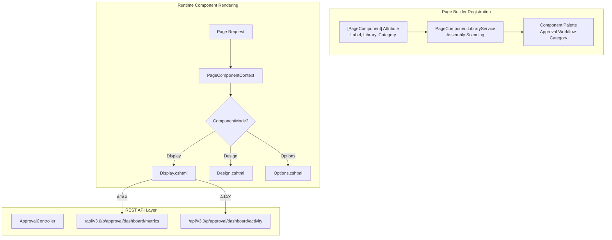
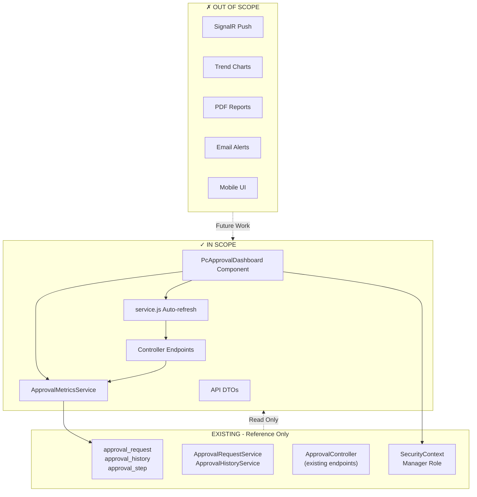

# Technical Specification

# 0. Agent Action Plan

## 0.1 Intent Clarification

### 0.1.1 Core Feature Objective

Based on the prompt, the Blitzy platform understands that the new feature requirement is to **implement a Manager Approval Dashboard PageComponent (`PcApprovalDashboard`)** for the WebVella ERP Approval Workflow system. This dashboard provides managers with real-time visibility into team approval workflow performance through comprehensive metrics and activity tracking.

**Primary Feature Requirements:**

- **Real-Time Metrics Dashboard**: Create a dashboard displaying five key performance indicators that auto-refresh at a configurable interval (default 60 seconds) without requiring page reload
- **Pending Approvals Count**: Display the number of approval requests currently awaiting action, filtered to requests where the current user is an authorized approver for the current step
- **Average Approval Time**: Calculate and display mean time from request creation to final approval decision using `approval_history` timestamp differences over a selected date range
- **Approval Rate Percentage**: Show percentage of requests approved versus total processed requests (approved + rejected) to provide insight into team approval patterns
- **Overdue Requests Count**: Identify pending requests that have exceeded their configured `timeout_hours` from the associated `approval_step`, indicating SLA violations
- **Recent Activity Feed**: Display the last 5 approval actions performed showing action type, performer, and timestamp

**Implicit Requirements Detected:**

- Manager role validation must be enforced at both component render and API endpoint levels
- Date range filtering must support multiple presets (7, 30, 90 days) plus custom date range selection
- Metrics must be scoped to the manager's team based on authorization rules
- The component must integrate with the existing WebVella ERP page builder system
- Auto-refresh must use AJAX to avoid full page reloads
- Component must follow the established `PageComponent` base class pattern with `[PageComponent]` attribute

**Feature Dependencies and Prerequisites:**

- STORY-007: Approval REST API - Provides the `ApprovalController` endpoints for data retrieval
- STORY-008: Approval UI Page Components - Establishes the component patterns and folder structure in `WebVella.Erp.Plugins.Approval`
- Existing approval entities: `approval_workflow`, `approval_step`, `approval_request`, `approval_history` (from STORY-002)
- Existing service layer: `ApprovalRequestService`, `ApprovalHistoryService` (from STORY-004)

### 0.1.2 Special Instructions and Constraints

**Architectural Requirements:**

- Implement using the existing WebVella ERP `PageComponent` base class pattern
- Follow the established component folder structure with Display, Design, Options, Help, Error views and service.js
- Integrate with `PageComponentLibraryService` for component registration in the page builder palette
- Use `ErpRequestContext` for page and application context injection
- Consume REST API endpoints from `ApprovalController` for all data retrieval

**Integration Requirements:**

- The dashboard component must be placeable on any custom page via the WebVella ERP page builder
- Options panel must allow configuration of refresh interval, date range defaults, and metrics display preferences
- Role-based access control must restrict dashboard access to users with Manager role
- Component must handle API error responses gracefully with user-friendly toast notifications

**User Example - Acceptance Criteria:**

- **AC1**: "Given I am logged in as a user with Manager role, When I navigate to the Approvals Dashboard page, Then I see a dashboard displaying my team's approval metrics including Pending Approvals Count, Average Approval Time, Approval Rate, Overdue Requests, and Recent Activity"
- **AC2**: "Given the dashboard is displayed, When 60 seconds have elapsed, Then the metrics automatically refresh without requiring page reload and the display updates to reflect current data"
- **AC3**: "Given I am viewing the dashboard, When I select a date range filter (7 days, 30 days, 90 days, or custom range), Then the metrics update to reflect only the selected time period"
- **AC6**: "Given I am a user without Manager role, When I attempt to access the dashboard, Then I receive an access denied message and am not shown the dashboard metrics"

### 0.1.3 Technical Interpretation

These feature requirements translate to the following technical implementation strategy:

- **To implement the dashboard component**, we will create a new `PcApprovalDashboard` PageComponent class in `WebVella.Erp.Plugins.Approval/Components/PcApprovalDashboard/` following the established pattern from `PcChart` and other existing components
- **To provide real-time metrics display**, we will implement client-side JavaScript in `service.js` that uses `setInterval` to call REST API endpoints at the configured refresh interval and update DOM elements via jQuery AJAX
- **To calculate pending approvals count**, we will extend `ApprovalController` with a new `GET /api/v3.0/p/approval/dashboard/metrics` endpoint that queries `approval_request` entities filtered by current user's authorized approver status
- **To compute average approval time**, we will query `approval_history` records to calculate timestamp differences between 'submitted' and 'approved'/'rejected' actions within the selected date range
- **To determine overdue requests**, we will join `approval_request` with `approval_step` to compare `created_on` + `timeout_hours` against current time
- **To enforce Manager role access**, we will implement role validation in both the component's `InvokeAsync` method and the controller endpoints using `SecurityContext.CurrentUser` and `SecurityContext.IsUserInRole()`
- **To support date range filtering**, we will add query parameters to the metrics endpoint and provide UI controls in the Options panel for default date range configuration

## 0.2 Repository Scope Discovery

### 0.2.1 Comprehensive File Analysis

The following analysis identifies all files and folders in the WebVella ERP repository that are affected by implementing the Manager Approval Dashboard feature.

**Existing Modules Requiring Reference (Pattern Analysis):**

| Pattern | Purpose | Files Found |
|---------|---------|-------------|
| `WebVella.Erp.Web/Components/Pc*/*.cs` | PageComponent class implementations | 60+ component drivers |
| `WebVella.Erp.Web/Components/Pc*/*.cshtml` | Razor view templates per mode | Display, Design, Options, Help, Error views |
| `WebVella.Erp.Web/Components/Pc*/service.js` | Client-side interaction logic | Optional JavaScript scaffolds |
| `WebVella.Erp.Plugins.Project/Components/**/*` | Plugin-specific component patterns | PcFeedList, PcPostList, dashboard widgets |
| `jira-stories/STORY-007-approval-rest-api.md` | REST API specification | ApprovalController endpoint definitions |
| `jira-stories/STORY-008-approval-ui-components.md` | UI component patterns | Component structure templates |

**Integration Point Discovery:**

| Integration Category | Files/Patterns | Modification Required |
|---------------------|----------------|----------------------|
| API Controller | `WebVella.Erp.Plugins.Approval/Controllers/ApprovalController.cs` | Add dashboard metrics endpoints |
| Service Layer | `WebVella.Erp.Plugins.Approval/Services/ApprovalRequestService.cs` | Add metrics calculation methods |
| Service Layer | `WebVella.Erp.Plugins.Approval/Services/ApprovalHistoryService.cs` | Add aggregate query methods |
| Project Configuration | `WebVella.Erp.Plugins.Approval/WebVella.Erp.Plugins.Approval.csproj` | Add embedded resource references |
| Plugin Registration | `WebVella.Erp.Plugins.Approval/ApprovalPlugin.cs` | Component auto-registration |
| Entity Queries | `approval_request`, `approval_history`, `approval_step` | EQL queries for metrics |

**Database/Schema References (No Modifications Required):**

| Entity | Fields Used | Query Purpose |
|--------|-------------|---------------|
| `approval_request` | id, status, created_on, created_by, current_step_id, workflow_id | Pending count, overdue detection |
| `approval_history` | request_id, action_type, performed_on, performed_by, comments | Average time, approval rate, activity feed |
| `approval_step` | id, workflow_id, timeout_hours | Overdue threshold calculation |
| `user` | id, username, first_name, last_name | Activity feed user display |

### 0.2.2 New File Requirements

**New Source Files to Create:**

| File Path | Purpose |
|-----------|---------|
| `WebVella.Erp.Plugins.Approval/Components/PcApprovalDashboard/PcApprovalDashboard.cs` | Main dashboard PageComponent class with options model and InvokeAsync implementation |
| `WebVella.Erp.Plugins.Approval/Components/PcApprovalDashboard/Display.cshtml` | Runtime display view rendering metric cards and activity feed |
| `WebVella.Erp.Plugins.Approval/Components/PcApprovalDashboard/Design.cshtml` | Page builder preview with placeholder metrics |
| `WebVella.Erp.Plugins.Approval/Components/PcApprovalDashboard/Options.cshtml` | Configuration panel for refresh interval, date range defaults |
| `WebVella.Erp.Plugins.Approval/Components/PcApprovalDashboard/Help.cshtml` | Component documentation view |
| `WebVella.Erp.Plugins.Approval/Components/PcApprovalDashboard/Error.cshtml` | Error display view using ValidationException |
| `WebVella.Erp.Plugins.Approval/Components/PcApprovalDashboard/service.js` | Client-side auto-refresh and date range filter logic |
| `WebVella.Erp.Plugins.Approval/Api/DashboardMetricsModel.cs` | DTO for dashboard metrics API response |
| `WebVella.Erp.Plugins.Approval/Api/RecentActivityModel.cs` | DTO for recent activity feed items |
| `WebVella.Erp.Plugins.Approval/Services/ApprovalMetricsService.cs` | Service class for metrics calculations |

**New Test Files (Recommended):**

| File Path | Coverage |
|-----------|----------|
| `tests/unit/PcApprovalDashboard_test.cs` | Component unit tests for options parsing and view selection |
| `tests/integration/ApprovalMetrics_integration_test.cs` | Integration tests for metrics endpoints |

### 0.2.3 Existing Files Requiring Modification

**Controllers Requiring Updates:**

| File | Modification | Lines Affected |
|------|--------------|----------------|
| `WebVella.Erp.Plugins.Approval/Controllers/ApprovalController.cs` | Add dashboard metrics region with endpoints | Append ~150 lines |

**Project Configuration Updates:**

| File | Modification | Purpose |
|------|--------------|---------|
| `WebVella.Erp.Plugins.Approval/WebVella.Erp.Plugins.Approval.csproj` | Add EmbeddedResource for service.js | Enable client-side script loading |

### 0.2.4 Web Search Research Conducted

**Best Practices Researched:**

- Real-time dashboard patterns for .NET Core applications using SignalR vs polling
- WebVella ERP PageComponent architecture and lifecycle
- JavaScript setInterval patterns for auto-refresh with cleanup
- Bootstrap card layouts for metric displays
- jQuery AJAX error handling and retry patterns

**Library Recommendations:**

- No additional libraries required - leverages existing jQuery, Bootstrap, and toastr included in WebVella.Erp.Web
- Optional: Consider Chart.js integration for trend visualization (future enhancement)

**Common Patterns Applied:**

- ViewComponent-based rendering following existing `PcChart` and `PcGrid` patterns
- JSON options deserialization using Newtonsoft.Json with `[JsonProperty]` attributes
- EQL queries for efficient entity data retrieval
- SecurityContext for role-based access validation

**Security Considerations:**

- Manager role validation at both component and API levels
- User-scoped data filtering to prevent unauthorized access to other teams' metrics
- CSRF protection through existing ASP.NET Core anti-forgery integration

## 0.3 Dependency Inventory

### 0.3.1 Private and Public Packages

All packages required for this feature are already present in the WebVella ERP solution. No new package installations are required.

**Core Framework Dependencies (Existing):**

| Registry | Package Name | Version | Purpose |
|----------|--------------|---------|---------|
| NuGet | Microsoft.NET.Sdk.Razor | 9.0 (SDK) | Razor class library compilation |
| NuGet | Microsoft.AspNetCore.App | 9.0 (Framework) | ASP.NET Core runtime and libraries |
| NuGet | Newtonsoft.Json | 13.0.4 | JSON serialization for options and API responses |
| NuGet | Microsoft.AspNetCore.Mvc.NewtonsoftJson | 9.0.10 | MVC JSON integration |
| NuGet | WebVella.TagHelpers | 1.7.2 | WebVella custom tag helpers for forms |

**Internal Project Dependencies:**

| Project | Reference Path | Purpose |
|---------|----------------|---------|
| WebVella.Erp | `../WebVella.ERP/WebVella.Erp.csproj` | Core ERP API, entities, security context |
| WebVella.Erp.Web | `../WebVella.Erp.Web/WebVella.Erp.Web.csproj` | PageComponent base, ErpRequestContext, services |

**Client-Side Dependencies (Embedded in wwwroot):**

| Library | Version | CDN/Location | Purpose |
|---------|---------|--------------|---------|
| jQuery | 3.x | Embedded in WebVella.Erp.Web | DOM manipulation, AJAX calls |
| Bootstrap | 4.x | Embedded in WebVella.Erp.Web | UI grid system, card components |
| toastr | 2.x | Embedded in WebVella.Erp.Web | Toast notification display |
| FontAwesome | 5.x | Embedded in WebVella.Erp.Web | Dashboard metric icons |

### 0.3.2 Dependency Updates

**No new dependencies are required.** The feature implementation leverages existing packages and patterns already established in the WebVella ERP ecosystem.

### 0.3.3 Import Updates

**Files Requiring Import Updates:**

For the new `PcApprovalDashboard.cs` component, the following imports will be required:

```csharp
using Microsoft.AspNetCore.Mvc;
using Newtonsoft.Json;
using System;
using System.Collections.Generic;
using System.Linq;
using System.Threading.Tasks;
using WebVella.Erp.Api;
using WebVella.Erp.Api.Models;
using WebVella.Erp.Exceptions;
using WebVella.Erp.Web.Models;
using WebVella.Erp.Web.Services;
```

**For the ApprovalMetricsService.cs:**

```csharp
using System;
using System.Collections.Generic;
using System.Linq;
using WebVella.Erp.Api;
using WebVella.Erp.Api.Models;
using WebVella.Erp.Database;
using WebVella.Erp.Eql;
```

**For the Controller endpoint additions:**

```csharp
// Existing imports in ApprovalController.cs are sufficient
// Add only the new model references:
using WebVella.Erp.Plugins.Approval.Api;
```

### 0.3.4 External Reference Updates

**Configuration Files - No Changes Required:**

The component will be automatically discovered by `PageComponentLibraryService` through assembly scanning for classes decorated with `[PageComponent]` attribute.

**Project File Updates Required:**

`WebVella.Erp.Plugins.Approval/WebVella.Erp.Plugins.Approval.csproj`:

```xml
<ItemGroup>
  <EmbeddedResource Include="Components\PcApprovalDashboard\service.js" />
</ItemGroup>
```

**Build Files - No Changes Required:**

- `WebVella.ERP3.sln` - No modifications needed; existing project references are sufficient
- `global.json` - No SDK pinning changes required

**CI/CD - No Changes Required:**

- `.github/workflows/*.yml` - Existing build pipelines will automatically compile the new component

### 0.3.5 Package Version Verification

All package versions are verified against the existing `WebVella.Erp.Web.csproj`:

| Package | Required Version | Verified In |
|---------|-----------------|-------------|
| Newtonsoft.Json | 13.0.4 | WebVella.Erp.Web.csproj line 138 |
| Microsoft.AspNetCore.Mvc.NewtonsoftJson | 9.0.10 | WebVella.Erp.Web.csproj line 134 |
| Microsoft.AspNetCore.Mvc.Razor.RuntimeCompilation | 9.0.10 | WebVella.Erp.Web.csproj line 135 |
| WebVella.TagHelpers | 1.7.2 | WebVella.Erp.Web.csproj line 142 |
| Microsoft.Extensions.FileProviders.Embedded | 9.0.10 | WebVella.Erp.Web.csproj line 143 |

## 0.4 Integration Analysis

### 0.4.1 Existing Code Touchpoints

**Direct Modifications Required:**

| File | Location | Modification |
|------|----------|--------------|
| `WebVella.Erp.Plugins.Approval/Controllers/ApprovalController.cs` | End of file (after Query Endpoints region) | Add new Dashboard Metrics Endpoints region with `GetDashboardMetrics`, `GetRecentActivity`, `GetOverdueCount` endpoints |
| `WebVella.Erp.Plugins.Approval/WebVella.Erp.Plugins.Approval.csproj` | ItemGroup section | Add EmbeddedResource reference for `Components/PcApprovalDashboard/service.js` |

**Service Layer Extensions:**

| Service | New Method | Purpose |
|---------|------------|---------|
| `ApprovalMetricsService` (NEW) | `GetPendingApprovalsCount(userId)` | Count pending requests where user is authorized approver |
| `ApprovalMetricsService` (NEW) | `GetAverageApprovalTime(startDate, endDate)` | Calculate mean processing time from history |
| `ApprovalMetricsService` (NEW) | `GetApprovalRate(startDate, endDate)` | Calculate approved/(approved+rejected) percentage |
| `ApprovalMetricsService` (NEW) | `GetOverdueRequestsCount(userId)` | Count requests exceeding timeout threshold |
| `ApprovalMetricsService` (NEW) | `GetRecentActivity(userId, count)` | Retrieve latest N approval actions |

### 0.4.2 Dependency Injections

**Service Registration (Auto-Discovery):**

The `PcApprovalDashboard` component does not require explicit service registration. WebVella ERP's `PageComponentLibraryService` automatically discovers components decorated with `[PageComponent]` attribute through assembly scanning during application startup.

**Constructor Injection Pattern:**

```csharp
public PcApprovalDashboard([FromServices] ErpRequestContext coreReqCtx)
{
    ErpRequestContext = coreReqCtx;
}
```

**Runtime Service Access:**

```csharp
// Services are instantiated inline following established patterns
var metricsService = new ApprovalMetricsService();
var historyService = new ApprovalHistoryService();
```

### 0.4.3 Database/Schema References

**No Schema Modifications Required.** The feature uses existing entities created in STORY-002.

**Entity Queries Required:**

| Query | Entities Involved | Purpose |
|-------|-------------------|---------|
| Pending approvals | `approval_request`, `approval_step` | Filter by status='pending' and authorized approver |
| Average time | `approval_history` | Calculate timestamp differences |
| Approval rate | `approval_history` | Count by action_type in date range |
| Overdue detection | `approval_request` JOIN `approval_step` | Compare created_on + timeout_hours vs current time |
| Recent activity | `approval_history`, `user` | Latest N actions with user details |

**EQL Query Patterns:**

```sql
-- Pending approvals for user
SELECT COUNT(id) FROM approval_request 
WHERE status = 'pending' AND current_step_id IN (
  SELECT id FROM approval_step WHERE /* user authorization logic */
)

-- Average approval time in date range
SELECT request_id, performed_on FROM approval_history 
WHERE action_type IN ('submitted', 'approved', 'rejected') 
  AND performed_on >= @startDate AND performed_on <= @endDate

-- Overdue requests
SELECT ar.*, ast.timeout_hours FROM approval_request ar
INNER JOIN approval_step ast ON ar.current_step_id = ast.id
WHERE ar.status = 'pending' 
  AND EXTRACT(EPOCH FROM (NOW() - ar.created_on))/3600 > ast.timeout_hours

-- Recent activity feed
SELECT ah.*, $user_1n_approval_history.username 
FROM approval_history ah
ORDER BY performed_on DESC LIMIT @count
```

### 0.4.4 Component Integration Points

**Page Builder Integration:**



**Authorization Integration:**

| Layer | Mechanism | Implementation |
|-------|-----------|----------------|
| Component Level | `SecurityContext.CurrentUser` | Check for Manager role in InvokeAsync |
| API Level | `[Authorize]` attribute | Controller-level authentication |
| API Level | Role validation | Check Manager role in endpoint methods |
| UI Level | `wv-authorize` TagHelper | Conditional metric card rendering |

### 0.4.5 Client-Side Integration

**JavaScript Event Hooks:**

| Event | Handler | Purpose |
|-------|---------|---------|
| `DOMContentLoaded` | `initDashboard()` | Initialize refresh timer and date picker |
| `WvPbManager_Design_Loaded` | Component registration | Page builder design mode |
| `WvPbManager_Options_Loaded` | Options panel init | Page builder options mode |

**AJAX Integration Pattern:**

```javascript
// service.js integration with ApprovalController
window.refreshDashboardMetrics = function(nodeId, dateRange) {
    $.ajax({
        url: '/api/v3.0/p/approval/dashboard/metrics',
        type: 'GET',
        data: { dateRange: dateRange },
        success: function(response) {
            if (response.success) {
                updateMetricCards(response.object);
            } else {
                toastr.error(response.message);
            }
        }
    });
};
```

## 0.5 Technical Implementation

### 0.5.1 File-by-File Execution Plan

**Group 1 - Core Dashboard Component Files:**

| Action | File Path | Purpose |
|--------|-----------|---------|
| CREATE | `WebVella.Erp.Plugins.Approval/Components/PcApprovalDashboard/PcApprovalDashboard.cs` | Main PageComponent class with `PcApprovalDashboardOptions` model, Manager role validation, and mode-based view routing |
| CREATE | `WebVella.Erp.Plugins.Approval/Components/PcApprovalDashboard/Display.cshtml` | Runtime view rendering 5 metric cards (Pending, Avg Time, Rate, Overdue, Activity) with auto-refresh container |
| CREATE | `WebVella.Erp.Plugins.Approval/Components/PcApprovalDashboard/Design.cshtml` | Page builder preview with placeholder metric values and component structure |
| CREATE | `WebVella.Erp.Plugins.Approval/Components/PcApprovalDashboard/Options.cshtml` | Configuration panel with refresh interval selector, default date range, and metric visibility toggles |
| CREATE | `WebVella.Erp.Plugins.Approval/Components/PcApprovalDashboard/Help.cshtml` | Documentation view explaining dashboard features and configuration options |
| CREATE | `WebVella.Erp.Plugins.Approval/Components/PcApprovalDashboard/Error.cshtml` | Error display using `wv-validation` tag helper with ValidationException |
| CREATE | `WebVella.Erp.Plugins.Approval/Components/PcApprovalDashboard/service.js` | Client-side auto-refresh timer, date range filtering, AJAX metric loading |

**Group 2 - API and Service Layer:**

| Action | File Path | Purpose |
|--------|-----------|---------|
| CREATE | `WebVella.Erp.Plugins.Approval/Services/ApprovalMetricsService.cs` | Business logic for calculating all dashboard metrics with EQL queries |
| CREATE | `WebVella.Erp.Plugins.Approval/Api/DashboardMetricsModel.cs` | DTO containing all metric values for API response |
| CREATE | `WebVella.Erp.Plugins.Approval/Api/RecentActivityModel.cs` | DTO for individual activity feed items |
| MODIFY | `WebVella.Erp.Plugins.Approval/Controllers/ApprovalController.cs` | Add Dashboard Metrics region with GET endpoints for metrics and activity |

**Group 3 - Configuration and Build:**

| Action | File Path | Purpose |
|--------|-----------|---------|
| MODIFY | `WebVella.Erp.Plugins.Approval/WebVella.Erp.Plugins.Approval.csproj` | Add EmbeddedResource reference for service.js |

### 0.5.2 Implementation Approach per File

**PcApprovalDashboard.cs - Component Class:**

- Implement `PageComponent` base class with `[PageComponent]` attribute
- Define `PcApprovalDashboardOptions` nested class with configurable properties
- Validate Manager role access using `SecurityContext.IsUserInRole()`
- Route to appropriate view based on `ComponentMode`

```csharp
[PageComponent(
    Label = "Approval Dashboard", 
    Library = "WebVella", 
    Description = "Real-time approval workflow metrics", 
    Version = "0.0.1", 
    IconClass = "fas fa-tachometer-alt",
    Category = "Approval Workflow")]
public class PcApprovalDashboard : PageComponent
```

**Display.cshtml - Runtime View:**

- Render Bootstrap card grid for 5 metrics
- Include data attributes for AJAX refresh targeting
- Initialize auto-refresh timer on page load
- Display date range filter dropdown

**service.js - Client-Side Logic:**

- Implement `setInterval` for configurable auto-refresh
- Handle date range filter change events
- Call `/api/v3.0/p/approval/dashboard/metrics` endpoint
- Update DOM with received metric values
- Display toastr notifications for errors

**ApprovalMetricsService.cs - Service Layer:**

- Implement `GetDashboardMetrics(userId, startDate, endDate)` returning all metrics
- Use EQL queries for efficient data retrieval
- Handle Manager team scoping for metrics

**ApprovalController.cs - API Endpoints:**

```csharp
#region << Dashboard Metrics Endpoints >>

[Route("api/v3.0/p/approval/dashboard/metrics")]
[HttpGet]
public ActionResult GetDashboardMetrics([FromQuery] int? days = 30)

[Route("api/v3.0/p/approval/dashboard/activity")]
[HttpGet]
public ActionResult GetRecentActivity([FromQuery] int count = 5)

#endregion
```

### 0.5.3 Component Options Model

```csharp
public class PcApprovalDashboardOptions
{
    [JsonProperty(PropertyName = "refresh_interval")]
    public int RefreshInterval { get; set; } = 60; // seconds
    
    [JsonProperty(PropertyName = "default_date_range")]
    public int DefaultDateRange { get; set; } = 30; // days
    
    [JsonProperty(PropertyName = "show_pending")]
    public bool ShowPending { get; set; } = true;
    
    [JsonProperty(PropertyName = "show_avg_time")]
    public bool ShowAvgTime { get; set; } = true;
    
    [JsonProperty(PropertyName = "show_approval_rate")]
    public bool ShowApprovalRate { get; set; } = true;
    
    [JsonProperty(PropertyName = "show_overdue")]
    public bool ShowOverdue { get; set; } = true;
    
    [JsonProperty(PropertyName = "show_activity")]
    public bool ShowActivity { get; set; } = true;
    
    [JsonProperty(PropertyName = "activity_count")]
    public int ActivityCount { get; set; } = 5;
}
```

### 0.5.4 API Response Models

**DashboardMetricsModel.cs:**

```csharp
public class DashboardMetricsModel
{
    public int PendingApprovalsCount { get; set; }
    public double AverageApprovalTimeHours { get; set; }
    public decimal ApprovalRatePercent { get; set; }
    public int OverdueRequestsCount { get; set; }
    public List<RecentActivityModel> RecentActivity { get; set; }
    public DateTime MetricsAsOf { get; set; }
    public int DateRangeDays { get; set; }
}
```

**RecentActivityModel.cs:**

```csharp
public class RecentActivityModel
{
    public Guid RequestId { get; set; }
    public string ActionType { get; set; }
    public string PerformedByName { get; set; }
    public DateTime PerformedOn { get; set; }
    public string Comments { get; set; }
}
```

### 0.5.5 User Interface Design

The dashboard implements a responsive Bootstrap card layout displaying the five key metrics:

```
┌─────────────────────────────────────────────────────────────────┐
│  Manager Approval Dashboard           [7d] [30d] [90d] [Custom] │
├─────────────────────────────────────────────────────────────────┤
│  ┌───────────┐ ┌───────────┐ ┌───────────┐ ┌───────────┐       │
│  │  PENDING  │ │ AVG TIME  │ │ APPROVAL  │ │  OVERDUE  │       │
│  │    12     │ │  4.5 hrs  │ │   87.3%   │ │     3     │       │
│  │ Awaiting  │ │Processing │ │   Rate    │ │ Past SLA  │       │
│  └───────────┘ └───────────┘ └───────────┘ └───────────┘       │
├─────────────────────────────────────────────────────────────────┤
│  Recent Activity                                                │
│  ─────────────────────────────────────────────────────────────  │
│  ✓ Approved by John Smith - 2 hours ago                        │
│  ✗ Rejected by Jane Doe - 5 hours ago                          │
│  → Delegated by Mike Wilson - 1 day ago                        │
│  ✓ Approved by Sarah Lee - 1 day ago                           │
│  ✓ Approved by Tom Brown - 2 days ago                          │
└─────────────────────────────────────────────────────────────────┘
│  Last updated: Jan 20, 2026 10:30:45 AM    [Auto-refresh: 60s] │
└─────────────────────────────────────────────────────────────────┘
```

**No Figma URLs were provided** for this feature. The UI design follows established WebVella ERP dashboard patterns from existing components like `PcProjectWidgetBudgetChart` and `PcProjectWidgetTasksChart`.

## 0.6 Scope Boundaries

### 0.6.1 Exhaustively In Scope

**All Feature Source Files:**

| Pattern | Description |
|---------|-------------|
| `WebVella.Erp.Plugins.Approval/Components/PcApprovalDashboard/**/*` | Complete dashboard component folder with all files |
| `WebVella.Erp.Plugins.Approval/Services/ApprovalMetricsService.cs` | Metrics calculation service |
| `WebVella.Erp.Plugins.Approval/Api/DashboardMetricsModel.cs` | Metrics response DTO |
| `WebVella.Erp.Plugins.Approval/Api/RecentActivityModel.cs` | Activity feed item DTO |

**Integration Points (Specific Locations):**

| File | Modification Scope |
|------|-------------------|
| `WebVella.Erp.Plugins.Approval/Controllers/ApprovalController.cs` | Add Dashboard Metrics region (~150 lines) |
| `WebVella.Erp.Plugins.Approval/WebVella.Erp.Plugins.Approval.csproj` | Add EmbeddedResource ItemGroup entry |

**Configuration Files:**

| File | Scope |
|------|-------|
| `WebVella.Erp.Plugins.Approval/WebVella.Erp.Plugins.Approval.csproj` | Project configuration for embedded resources |

**Documentation:**

| File | Scope |
|------|-------|
| `WebVella.Erp.Plugins.Approval/Components/PcApprovalDashboard/Help.cshtml` | Inline component documentation |
| `jira-stories/STORY-009-manager-dashboard-metrics.md` | Story documentation (existing) |

**Database Queries (Read-Only):**

| Entity | Query Type |
|--------|------------|
| `approval_request` | SELECT for pending count, overdue detection |
| `approval_history` | SELECT for avg time, rate, activity feed |
| `approval_step` | SELECT for timeout threshold |
| `user` | SELECT for activity performer names |

### 0.6.2 Explicitly Out of Scope

**Features Not Included:**

| Feature | Reason |
|---------|--------|
| SignalR real-time push notifications | Uses polling-based refresh instead; SignalR is a future enhancement |
| Team hierarchy configuration | Uses existing role-based authorization; team management is separate feature |
| Historical trend charts/graphs | Initial scope covers KPI metrics only; visualization is future enhancement |
| Export/PDF report generation | Dashboard is view-only; reporting is a separate feature |
| Email/SMS alert notifications | Metrics display only; alerting is handled by existing notification system |
| Mobile-specific responsive breakpoints | Uses Bootstrap default responsiveness; mobile optimization is future work |
| Caching layer for metrics | Metrics are calculated fresh on each request; caching is future optimization |
| Multi-language/i18n support | Uses existing WebVella localization; no new translation strings |

**Unrelated Modules:**

| Module | Status |
|--------|--------|
| `WebVella.Erp.Plugins.Project/**/*` | Unrelated plugin - no modifications |
| `WebVella.Erp.Plugins.Mail/**/*` | Unrelated plugin - no modifications |
| `WebVella.Erp.Plugins.SDK/**/*` | Unrelated plugin - no modifications |
| `WebVella.Erp.Plugins.Crm/**/*` | Unrelated plugin - no modifications |
| `WebVella.Erp.Web/Components/**/*` | Core components - no modifications |
| `WebVella.Erp.Site*/**/*` | Host applications - no modifications |

**Performance Optimizations Excluded:**

| Optimization | Reason |
|--------------|--------|
| Database index optimization | Existing indexes are sufficient for MVP |
| Query result caching | Fresh data required for real-time metrics |
| Background job pre-calculation | Adds complexity beyond initial scope |

**Refactoring Excluded:**

| Area | Reason |
|------|--------|
| Existing ApprovalController refactoring | Add new endpoints only; don't modify existing |
| BaseService pattern changes | Follow existing patterns; no architectural changes |
| Entity schema modifications | Use existing STORY-002 schema as-is |

### 0.6.3 Scope Validation Matrix

| Acceptance Criteria | In Scope | Implementation |
|--------------------|---------:|----------------|
| AC1: Dashboard displays 5 metrics | ✓ | PcApprovalDashboard Display.cshtml |
| AC2: Auto-refresh every 60 seconds | ✓ | service.js setInterval |
| AC3: Date range filtering | ✓ | Options panel + API parameter |
| AC4: Pending count for authorized approver | ✓ | ApprovalMetricsService query |
| AC5: Overdue detection with SLA | ✓ | timeout_hours comparison |
| AC6: Manager role access restriction | ✓ | SecurityContext validation |

### 0.6.4 Boundary Diagram



## 0.7 Rules for Feature Addition

### 0.7.1 Component Pattern Requirements

**PageComponent Implementation Rules:**

- The component MUST inherit from `PageComponent` base class
- The component MUST be decorated with `[PageComponent]` attribute including Label, Library, Description, Version, IconClass, and Category properties
- The component MUST implement `InvokeAsync(PageComponentContext context)` method returning `Task<IViewComponentResult>`
- The component MUST inject `ErpRequestContext` via constructor with `[FromServices]` attribute
- The component MUST define a nested `Options` class with `[JsonProperty]` attributes for all configurable properties
- The component MUST deserialize options using `JsonConvert.DeserializeObject<T>(context.Options.ToString())`

**View Naming Convention:**

| Mode | Required View | Purpose |
|------|---------------|---------|
| `ComponentMode.Display` | `Display.cshtml` | Runtime rendering |
| `ComponentMode.Design` | `Design.cshtml` | Page builder preview |
| `ComponentMode.Options` | `Options.cshtml` | Configuration panel |
| `ComponentMode.Help` | `Help.cshtml` | Documentation |
| Default/Exception | `Error.cshtml` | Error display |

### 0.7.2 Integration Requirements with Existing Features

**REST API Patterns:**

- All endpoints MUST follow the route pattern `/api/v3.0/p/approval/{resource}/{action}`
- All endpoints MUST return `ResponseModel` envelope with `success`, `message`, and `object` properties
- All endpoints MUST be decorated with `[Authorize]` attribute at controller level
- All endpoints MUST validate Manager role using `SecurityContext.IsUserInRole()`

**Service Layer Patterns:**

- Services SHOULD inherit from `BaseService` to access pre-initialized managers
- Services MUST use `EqlCommand` for entity queries following existing patterns
- Services MUST NOT directly access database; use RecordManager or EQL
- Services MUST validate permissions using `SecurityContext.CurrentUser`

**Error Handling Patterns:**

- Component errors MUST be caught and wrapped in `ValidationException`
- Errors MUST be displayed using the `Error.cshtml` view with `wv-validation` tag helper
- API errors MUST return `ResponseModel` with `success = false` and descriptive message

### 0.7.3 Performance and Scalability Considerations

**Query Optimization Rules:**

- EQL queries MUST limit result sets where possible (`LIMIT` clause)
- Aggregate calculations SHOULD be performed at database level, not in application code
- Date range filters MUST use indexed columns (`created_on`, `performed_on`)
- Auto-refresh interval MUST be configurable with minimum 30 seconds

**Client-Side Rules:**

- AJAX calls MUST include error handling with user-friendly messages
- Auto-refresh timer MUST be cleared on component destruction
- DOM updates MUST target specific elements, not full page refresh

### 0.7.4 Security Requirements Specific to Feature

**Authorization Rules:**

| Check Point | Validation Required |
|-------------|---------------------|
| Component InvokeAsync | `SecurityContext.CurrentUser` is not null |
| Component InvokeAsync | User has Manager role |
| API Endpoint | `[Authorize]` attribute enforced |
| API Endpoint | User ID from `CurrentUserId` property |
| Metrics Query | Scope to user's authorized approval requests |

**Data Access Rules:**

- Metrics MUST be scoped to requests where user is an authorized approver
- Activity feed MUST only show actions visible to the current user's scope
- No cross-team data leakage through metrics aggregation

**Input Validation Rules:**

- Date range parameters MUST be validated (not future dates, reasonable range)
- Refresh interval MUST be validated (minimum 30, maximum 3600 seconds)
- Activity count MUST be validated (minimum 1, maximum 50)

### 0.7.5 Coding Standards

**Naming Conventions:**

| Element | Convention | Example |
|---------|------------|---------|
| Component class | PascalCase with `Pc` prefix | `PcApprovalDashboard` |
| Options class | Nested within component | `PcApprovalDashboardOptions` |
| JSON properties | snake_case | `refresh_interval` |
| API endpoints | kebab-case routes | `dashboard/metrics` |
| JavaScript functions | camelCase | `refreshDashboardMetrics` |
| CSS classes | kebab-case | `approval-dashboard-card` |

**Documentation Requirements:**

- Component MUST include XML documentation comments
- Options properties MUST include `[JsonProperty]` with descriptive names
- API endpoints MUST include XML summary comments
- Help.cshtml MUST document all configurable options

### 0.7.6 Testing Expectations

**Unit Test Coverage:**

- Options deserialization with valid and invalid JSON
- ComponentMode routing to correct views
- Manager role validation logic
- Metrics calculation logic with mock data

**Integration Test Coverage:**

- API endpoint responses with authentication
- Role-based access denial
- Date range filtering behavior
- Full component rendering pipeline

## 0.8 References

### 0.8.1 Repository Files and Folders Searched

The following files and folders were examined during the analysis to derive conclusions for this Agent Action Plan:

**Core Framework Files:**

| File Path | Purpose |
|-----------|---------|
| `WebVella.Erp.Web/WebVella.Erp.Web.csproj` | Project dependencies, package versions (net9.0, Newtonsoft.Json 13.0.4) |
| `WebVella.Erp.Web/Components/PcChart/PcChart.cs` | Reference PageComponent implementation pattern |
| `WebVella.Erp.Web/Components/PcChart/Display.cshtml` | Reference view rendering pattern |
| `WebVella.Erp.Web/Components/PcChart/Options.cshtml` | Reference options panel pattern |
| `WebVella.Erp.Web/Components/PcChart/service.js` | Reference client-side JavaScript pattern |
| `WebVella.ERP3.sln` | Solution structure and project references |
| `global.json` | SDK version configuration (net9.0) |

**Approval Workflow Stories:**

| File Path | Purpose |
|-----------|---------|
| `jira-stories/STORY-001-approval-plugin-infrastructure.md` | Plugin scaffold and initialization |
| `jira-stories/STORY-002-approval-entity-schema.md` | Entity definitions: approval_workflow, approval_step, approval_rule, approval_request, approval_history |
| `jira-stories/STORY-004-approval-service-layer.md` | Service layer patterns: ApprovalWorkflowService, ApprovalRequestService, ApprovalHistoryService |
| `jira-stories/STORY-007-approval-rest-api.md` | REST API patterns: ApprovalController, route structure, ResponseModel |
| `jira-stories/STORY-008-approval-ui-components.md` | UI component patterns: PcApprovalWorkflowConfig, PcApprovalRequestList, PcApprovalAction, PcApprovalHistory |

**Plugin Reference Files:**

| File Path | Purpose |
|-----------|---------|
| `WebVella.Erp.Plugins.Project/` | Plugin folder structure reference |
| `WebVella.Erp.Plugins.Project/Components/` | Plugin-specific component patterns |
| `WebVella.Erp.Plugins.Project/Controllers/ProjectController.cs` | Controller implementation reference |
| `WebVella.Erp.Plugins.Project/Services/TaskService.cs` | Service layer pattern reference |
| `WebVella.Erp.Plugins.Project/WebVella.Erp.Plugins.Project.csproj` | EmbeddedResource configuration reference |

**Technical Specification Sections Retrieved:**

| Section | Content Used |
|---------|--------------|
| 6.4 Security Architecture | Role-based access control, SecurityContext patterns, authorization flow |
| 7.3 Page Component Framework | Component architecture, rendering modes, lifecycle |

### 0.8.2 Attachments Provided

**No attachments were provided by the user for this feature.**

The implementation follows established WebVella ERP patterns without external design artifacts.

### 0.8.3 Figma Screens Provided

**No Figma URLs were provided for this feature.**

The dashboard UI design is derived from:
- Existing WebVella ERP dashboard widget patterns (`PcProjectWidgetBudgetChart`, `PcProjectWidgetTasksChart`)
- Bootstrap card component layouts
- Standard metric card designs following Material Design principles

### 0.8.4 External Documentation References

| Reference | URL | Purpose |
|-----------|-----|---------|
| WebVella ERP GitHub | https://github.com/WebVella/WebVella-ERP | Source repository |
| ASP.NET Core ViewComponents | https://docs.microsoft.com/aspnet/core/mvc/views/view-components | ViewComponent documentation |
| Newtonsoft.Json | https://www.newtonsoft.com/json/help | JSON serialization reference |
| Bootstrap 4 Cards | https://getbootstrap.com/docs/4.6/components/card/ | Card layout reference |

### 0.8.5 Story Dependencies

| Dependency | Story ID | Status | Required For |
|------------|----------|--------|--------------|
| Approval Plugin Infrastructure | STORY-001 | Prerequisite | Plugin scaffold and registration |
| Approval Entity Schema | STORY-002 | Prerequisite | approval_request, approval_history, approval_step entities |
| Approval Service Layer | STORY-004 | Prerequisite | BaseService pattern, EQL query patterns |
| Approval REST API | STORY-007 | Prerequisite | ApprovalController, endpoint patterns |
| Approval UI Components | STORY-008 | Prerequisite | Component folder structure in Approval plugin |

### 0.8.6 Environment Verification

| Component | Version | Verified |
|-----------|---------|----------|
| .NET SDK | 9.0.309 | ✓ Installed via dotnet-install.sh |
| Target Framework | net9.0 | ✓ Verified in csproj files |
| NuGet Packages | All restored | ✓ dotnet restore completed |
| Solution Build | Ready | ✓ All projects restored successfully |

### 0.8.7 Key Takeaways from Analysis

- The WebVella ERP PageComponent pattern is well-established with 60+ existing components as reference
- The Approval plugin folder structure is defined in STORY-008 and can be extended with the new dashboard component
- All required entities exist from STORY-002 and can be queried without schema modifications
- The REST API controller pattern from STORY-007 provides a clear template for adding metrics endpoints
- Manager role access control follows existing SecurityContext patterns documented in the tech spec
- Auto-refresh functionality can be implemented using standard JavaScript patterns without additional libraries

