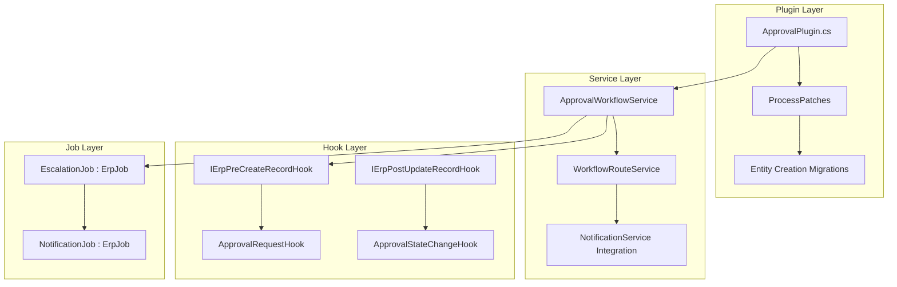
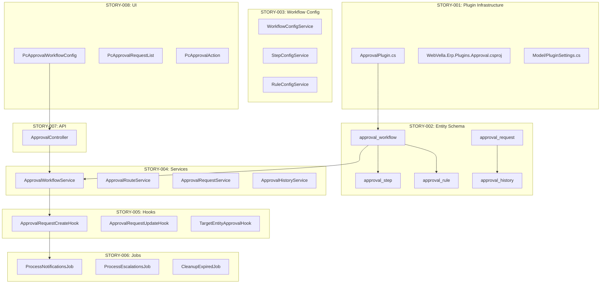
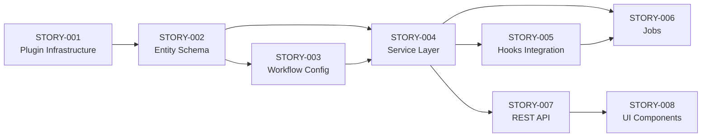
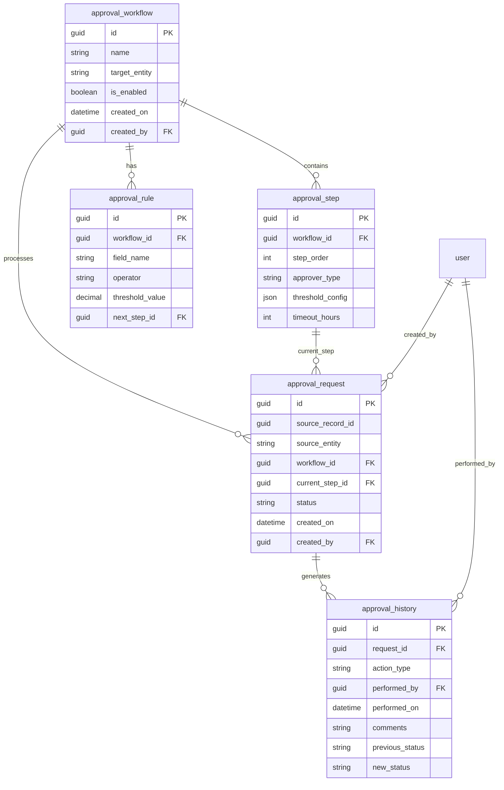

# Technical Specification

# 0. Agent Action Plan

## 0.1 Core Documentation Objective

Based on the provided requirements, the Blitzy platform understands that the documentation objective is to **generate actionable JIRA stories** that define the implementation plan for a multi-level approval workflow automation system within the WebVella ERP platform. This is a **documentation generation task** that produces structured technical deliverables rather than code.

#### Documentation Request Categorization

- **Category**: Create new documentation
- **Documentation Type**: Technical specifications / JIRA stories / Implementation requirements
- **Output Format**: Markdown files, CSV, and JSON exports

#### Core Requirements Clarification

The user's business objective translates to the following documentation requirements:

| Requirement | Clarified Intent |
|-------------|------------------|
| Multi-level approval workflow | Document stories for implementing hierarchical approval chains with configurable routing based on amount thresholds, department structures, and authorization levels |
| Purchase orders and expense requests | Target document types requiring approval workflow integration - these are the business entities that will flow through the approval system |
| Amount thresholds | Document configuration entities for monetary limits that trigger different approval levels (e.g., $1K requires manager, $10K requires director) |
| Department structures | Document organizational hierarchy integration enabling department-based routing rules |
| Authorization levels | Document role-based permission system for approvers at different levels |
| Automated routing | Document workflow engine logic for automatic assignment and escalation |
| Notifications | Document integration with WebVella Mail plugin for approval request notifications and reminders |
| Audit trail | Document comprehensive logging requirements for compliance and traceability |

#### Documentation Deliverables

The Blitzy platform will generate:
- **5-8 individual JIRA story markdown files** in `/jira-stories/` folder
- **Consolidated CSV export** (`stories-export.csv`) for spreadsheet import
- **Consolidated JSON export** (`stories-export.json`) for programmatic consumption

#### Implicit Documentation Needs Discovered

Based on analysis of the WebVella ERP codebase architecture:

- **Plugin architecture documentation**: New approval workflow will be implemented as a WebVella plugin (following `WebVella.Erp.Plugins.Project` patterns)
- **Entity schema documentation**: Stories must define new entities (approval_workflow, approval_rule, approval_step, approval_request, approval_history)
- **Hook integration documentation**: Pre/post record hooks for approval state transitions
- **Background job documentation**: Scheduled jobs for escalation and notification processing
- **API endpoint documentation**: REST API specifications for approval operations
- **UI component documentation**: Page components for approval configuration and user actions

## 0.2 Special Instructions and Constraints

#### User-Specified Directives

The following special instructions must be adhered to throughout JIRA story generation:

| Directive | Implementation Guidance |
|-----------|------------------------|
| Reference actual WebVella ERP architecture | All stories must cite specific files, modules, and patterns discovered in the codebase |
| Consider pluggable architecture | Solutions must follow the `ErpPlugin` inheritance pattern established in existing plugins |
| Stories should be independently deployable | Each story should produce a working increment where possible |
| Balance quick wins with infrastructure work | Mix smaller configuration stories with larger architectural stories |
| Proper dependency sequencing | Stories must explicitly declare dependencies by Story ID |
| Include both backend and UI components | Each feature story should address full stack implementation |
| Realistic and implementable | Stories sized for ASP.NET Core / WebVella-experienced developers |

#### Story Format Requirements

Each JIRA story must include:
- **Title**: Clear, concise (max 80 characters)
- **Story ID**: Sequential format `STORY-001`, `STORY-002`, etc.
- **Description**: Detailed technical and business context
- **Business Value**: Clear articulation of why this story matters
- **Acceptance Criteria**: Minimum 3-5 testable criteria per story
- **Technical Implementation Details**: Specific files, classes, integration points
- **Dependencies**: References to prerequisite Story IDs
- **Effort Estimate**: Story points (1, 2, 3, 5, 8, or 13 scale)
- **Labels/Tags**: Relevant categorization tags

#### Template Structure

**USER PROVIDED TEMPLATE:**

```
# {STORY-ID}: {Title}

#### Description
{Detailed description}

#### Business Value
{Why this matters}

#### Acceptance Criteria
- [ ] {Criterion 1}
- [ ] {Criterion 2}
- [ ] {Criterion 3}

#### Technical Implementation Details
#### Files/Modules to Change
- {file path} - {change description}

#### Key Classes or Functions
- {Class/Function name} - {purpose}

#### Integration Points
- {Integration detail}

#### Technical Approach
{Implementation overview}

#### Dependencies
- {STORY-XXX} - {dependency description}

#### Effort Estimate
{X} Story Points

#### Labels
`workflow`, `approval`, `backend`, `api`, `ui`
```

#### Output Directory Structure

```
/jira-stories/
├── STORY-001-{slug}.md
├── STORY-002-{slug}.md
├── STORY-003-{slug}.md
├── STORY-004-{slug}.md
├── STORY-005-{slug}.md
├── STORY-006-{slug}.md
├── STORY-007-{slug}.md
├── STORY-008-{slug}.md
├── stories-export.csv
└── stories-export.json
```

#### Style and Quality Preferences

- **Tone**: Technical but accessible to developers with 2+ years experience
- **Structure**: Consistent heading hierarchy across all stories
- **Depth**: Sufficient technical detail for independent implementation
- **Format**: Standard JIRA-compatible markdown
- **Code examples**: Short snippets only where essential for clarity

## 0.3 Technical Interpretation

These documentation requirements translate to the following technical documentation strategy:

#### Requirement-to-Documentation Action Mapping

| Requirement | Documentation Action |
|-------------|---------------------|
| Approval workflow configuration | Create JIRA story documenting new `approval_workflow` entity with fields: id, name, description, entity_target, enabled, created_on, created_by |
| Multi-step approval hierarchies | Create JIRA story documenting `approval_step` entity with: step_order, approver_type (role/user/department_head), threshold_min, threshold_max, auto_approve_conditions |
| Amount threshold routing | Create JIRA story documenting `approval_rule` entity with: field_name, operator, threshold_value, next_step_id, workflow_id |
| Notification mechanisms | Create JIRA story documenting integration with `WebVella.Erp.Plugins.Mail` and scheduled job for notification dispatch |
| Workflow state management | Create JIRA story documenting `approval_request` entity with: status enum (Pending, Approved, Rejected, Escalated), current_step_id, requested_by, requested_on |
| Audit logging | Create JIRA story documenting `approval_history` entity with: action_type, performed_by, performed_on, comments, previous_status, new_status |
| Delegation support | Create JIRA story documenting delegation rules and proxy approval configuration |
| Role-based authorization | Create JIRA story documenting approver role assignments and permission checks |

#### Architectural Pattern Alignment

Based on codebase analysis, the JIRA stories must document implementations following these WebVella patterns:



#### Technical Interpretation Details

- **To implement approval workflow configuration**, we will create `WebVella.Erp.Plugins.Approval/ApprovalPlugin.cs` following the `ErpPlugin` base class pattern with migration patches creating the `approval_workflow` entity using `EntityManager.CreateEntity()`

- **To implement approval step management**, we will create `approval_step` entity with foreign key relation to `approval_workflow` using `EntityRelationManager.Create()` for OneToMany relationship

- **To implement threshold-based routing**, we will create `ApprovalRouteService.cs` in Services folder implementing rule evaluation logic with EQL queries against `approval_rule` entity

- **To implement notifications**, we will integrate with existing `SmtpInternalService` from `WebVella.Erp.Plugins.Mail` and create `ProcessApprovalNotificationsJob.cs` following the `ErpJob` pattern with `JobAttribute` decoration

- **To implement state management**, we will create pre/post hooks implementing `IErpPreUpdateRecordHook` and `IErpPostUpdateRecordHook` interfaces with `HookAttachmentAttribute` for `approval_request` entity

- **To implement audit trail**, we will create `ApprovalHistoryService.cs` that creates `approval_history` records on every state transition, capturing the full approval decision context

#### Inferred Documentation Needs

Based on WebVella ERP patterns discovered:

| Inferred Need | Rationale |
|---------------|-----------|
| Plugin initialization documentation | All entities/jobs must be registered in `Initialize(IServiceProvider)` method |
| Migration versioning documentation | Patches use date-based naming (e.g., `ApprovalPlugin.20260115.cs`) |
| DbContext transaction handling | All entity operations require `DbContext.Current.Transaction` scope |
| SecurityContext scoping | Background jobs must use `SecurityContext.OpenSystemScope()` |
| EQL query patterns | Record retrieval uses EQL syntax with `$relation` expansion |
| UI page registration | Admin pages need sitemap area/node registration via `AppService` |

## 0.4 Documentation Discovery and Analysis

#### Existing Documentation Infrastructure Assessment

Repository analysis reveals the following documentation structure and coverage status:

| Documentation Area | Location | Status |
|--------------------|----------|--------|
| Developer Documentation | `docs/developer/` | Comprehensive - 14 topic folders with folder.json manifests |
| Plugin Development Guide | `docs/developer/plugins/` | Exists - overview.md and create-your-own.md |
| Background Jobs Guide | `docs/developer/background-jobs/` | Complete - overview, schedule plans, job types |
| Hooks Documentation | `docs/developer/hooks/` | Complete - API hooks, page hooks, render hooks |
| Entity Documentation | `docs/developer/entities/` | Complete - fields, relations, create patterns |
| Existing JIRA Stories | `/jira-stories/` | Does not exist - must be created |

#### Documentation Framework Configuration

- **Documentation Format**: Markdown with JSON front-matter in HTML comments
- **Front-matter Schema**: `{"sort_order": N, "name": "slug", "label": "Display Label"}`
- **Static Site Generator**: Custom build system consuming folder.json manifests
- **Screenshot Location**: `docs/developer/*/doc-images/`

#### Repository Code Analysis for Documentation

**Search patterns used for workflow-related code:**

| Pattern | Directories Examined | Findings |
|---------|---------------------|----------|
| Workflow/Approval patterns | `WebVella.Erp/`, All Plugins | No existing approval workflow implementation |
| State machine patterns | `WebVella.Erp/Api/`, `WebVella.Erp/Jobs/` | Job state management (Pending/Running/Finished) provides pattern |
| Notification patterns | `WebVella.Erp/Notifications/`, `WebVella.Erp.Plugins.Mail/` | Postgres LISTEN/NOTIFY + SMTP email infrastructure exists |
| Hook patterns | `WebVella.Erp/Hooks/`, Plugin Hooks folders | Pre/Post CRUD hooks well-documented |
| Service patterns | `WebVella.Erp.Plugins.Project/Services/` | BaseService pattern with manager injection |

**Key Existing Components for Reference:**

| Component | Location | Documentation Value |
|-----------|----------|-------------------|
| TaskService | `WebVella.Erp.Plugins.Project/Services/TaskService.cs` | State management, hook integration pattern |
| ProcessSmtpQueueJob | `WebVella.Erp.Plugins.Mail/Jobs/ProcessSmtpQueueJob.cs` | Background job + email pattern |
| SmtpInternalService | `WebVella.Erp.Plugins.Mail/Services/SmtpInternalService.cs` | Email send/queue APIs |
| RecordHookManager | `WebVella.Erp/Hooks/RecordHookManager.cs` | Hook discovery and invocation |
| JobManager | `WebVella.Erp/Jobs/JobManager.cs` | Job scheduling and execution |

#### Plugin Pattern Analysis

Analysis of existing plugins reveals consistent implementation patterns:

```
WebVella.Erp.Plugins.{Name}/
├── {Name}Plugin.cs                    # ErpPlugin inheritor with Initialize()
├── {Name}Plugin._.cs                  # ProcessPatches() orchestrator
├── {Name}Plugin.{YYYYMMDD}.cs        # Dated migration patches
├── WebVella.Erp.Plugins.{Name}.csproj # net9.0, Razor SDK project
├── Api/                               # DTOs and models
├── Components/                        # Page components
├── Controllers/                       # REST API controllers
├── DataSource/                        # CodeDataSource implementations
├── Hooks/                             # Api/ and Page/ hook adapters
├── Jobs/                              # ErpJob implementations
├── Model/                             # Plugin-specific models
├── Services/                          # Business logic services
└── wwwroot/                           # Static assets
```

#### Related Documentation Found

| Existing Doc | Path | Relevance |
|--------------|------|-----------|
| Background Jobs Overview | `docs/developer/background-jobs/overview.md` | Pattern for scheduled notification jobs |
| Hook Implementation | `docs/developer/hooks/overview.md` | Pattern for approval state hooks |
| Plugin Structure | `docs/developer/plugins/create-your-own.md` | Template for ApprovalPlugin |
| Entity Creation | `docs/developer/entities/create-entity.md` | Pattern for approval entities |
| Server API | `docs/developer/server-api/overview.md` | Manager class usage patterns |

#### Web Search Research Not Required

The codebase provides sufficient patterns and examples for JIRA story generation. External research was not necessary as:
- WebVella ERP documentation is self-contained
- Plugin patterns are well-established in existing plugins
- Approval workflow patterns can be derived from existing state management code

## 0.5 Documentation Scope Analysis

#### Code-to-Documentation Mapping

#### Modules Requiring Documentation (JIRA Stories)

**1. Approval Plugin Core Infrastructure**
- **Source Pattern**: `WebVella.Erp.Plugins.Project/ProjectPlugin.cs`
- **Documentation Needed**: JIRA story for plugin scaffold creation
- **New Files to Document**:
  - `WebVella.Erp.Plugins.Approval/ApprovalPlugin.cs`
  - `WebVella.Erp.Plugins.Approval/WebVella.Erp.Plugins.Approval.csproj`
  - `WebVella.Erp.Plugins.Approval/Model/PluginSettings.cs`

**2. Approval Entity Schema**
- **Source Pattern**: `WebVella.Erp/Api/Models/Entity.cs`, `WebVella.Erp.Plugins.SDK/SdkPlugin.20181215.cs`
- **Documentation Needed**: JIRA stories for entity creation migrations
- **Entities to Document**:

| Entity Name | Purpose | Key Fields |
|-------------|---------|------------|
| approval_workflow | Workflow definition | id, name, target_entity, is_enabled, created_on |
| approval_step | Step in workflow | id, workflow_id, step_order, approver_type, threshold_config |
| approval_rule | Routing rule | id, workflow_id, field_name, operator, value, next_step_id |
| approval_request | Active request | id, record_id, entity_name, workflow_id, status, current_step_id |
| approval_history | Audit log | id, request_id, action, performed_by, timestamp, comments |

**3. Approval Services**
- **Source Pattern**: `WebVella.Erp.Plugins.Project/Services/TaskService.cs`
- **Documentation Needed**: JIRA story for service layer
- **Services to Document**:

| Service | Responsibility | Key Methods |
|---------|---------------|-------------|
| ApprovalWorkflowService | Workflow CRUD and configuration | CreateWorkflow(), GetWorkflow(), UpdateWorkflow() |
| ApprovalRouteService | Route evaluation and step progression | EvaluateNextStep(), GetApproversForStep() |
| ApprovalRequestService | Request lifecycle management | CreateRequest(), ApproveRequest(), RejectRequest() |
| ApprovalHistoryService | Audit trail management | LogApprovalAction(), GetRequestHistory() |

**4. Approval Hooks**
- **Source Pattern**: `WebVella.Erp.Plugins.Project/Hooks/Api/Task.cs`
- **Documentation Needed**: JIRA story for hook implementations
- **Hooks to Document**:

| Hook Class | Interface | Entity | Purpose |
|------------|-----------|--------|---------|
| ApprovalRequestCreateHook | IErpPreCreateRecordHook | approval_request | Initialize workflow routing |
| ApprovalRequestUpdateHook | IErpPostUpdateRecordHook | approval_request | Trigger notifications on state change |
| TargetEntityHook | IErpPreCreateRecordHook | purchase_order, expense_request | Initiate approval on record creation |

**5. Background Jobs**
- **Source Pattern**: `WebVella.Erp.Plugins.Mail/Jobs/ProcessSmtpQueueJob.cs`
- **Documentation Needed**: JIRA story for scheduled jobs
- **Jobs to Document**:

| Job | Schedule | Purpose |
|-----|----------|---------|
| ProcessApprovalNotificationsJob | Every 5 minutes | Send pending approval notifications |
| ProcessApprovalEscalationsJob | Every 30 minutes | Escalate overdue approvals |
| CleanupExpiredApprovalsJob | Daily | Archive old approval requests |

**6. API Endpoints**
- **Source Pattern**: `WebVella.Erp.Plugins.Project/Controllers/ProjectController.cs`
- **Documentation Needed**: JIRA story for REST API
- **Endpoints to Document**:

| Endpoint | Method | Purpose |
|----------|--------|---------|
| /api/v3.0/p/approval/workflow | GET/POST | Workflow CRUD |
| /api/v3.0/p/approval/request/{id}/approve | POST | Approve request |
| /api/v3.0/p/approval/request/{id}/reject | POST | Reject request |
| /api/v3.0/p/approval/request/{id}/delegate | POST | Delegate approval |
| /api/v3.0/p/approval/pending | GET | Get user's pending approvals |

#### Documentation Gap Analysis

Given the requirements and repository analysis, documentation gaps include:

| Gap Category | Current State | Required Documentation |
|--------------|---------------|----------------------|
| Approval Workflow Entities | Does not exist | 5 new entities fully specified |
| Approval Services | Does not exist | 4 service classes with method signatures |
| Approval Hooks | Does not exist | 3 hook classes with implementation details |
| Approval Jobs | Does not exist | 3 background jobs with schedules |
| Approval API | Does not exist | 5+ REST endpoints with contracts |
| Approval UI Components | Does not exist | Configuration and action components |
| Integration Documentation | Does not exist | Mail plugin integration, entity hooks |

#### JIRA Story Coverage Matrix

| Feature Area | STORY-001 | STORY-002 | STORY-003 | STORY-004 | STORY-005 | STORY-006 | STORY-007 | STORY-008 |
|--------------|:---------:|:---------:|:---------:|:---------:|:---------:|:---------:|:---------:|:---------:|
| Plugin Infrastructure | ● | | | | | | | |
| Entity Schema | | ● | | | | | | |
| Workflow Configuration | | | ● | | | | | |
| Service Layer | | | | ● | | | | |
| Hook Integration | | | | | ● | | | |
| Notification Jobs | | | | | | ● | | |
| API Endpoints | | | | | | | ● | |
| UI Components | | | | | | | | ● |

## 0.6 Documentation Implementation Design

#### Documentation Structure Planning

The JIRA stories will be organized in the following hierarchy:

```
/jira-stories/
├── STORY-001-approval-plugin-infrastructure.md
├── STORY-002-approval-entity-schema.md
├── STORY-003-workflow-configuration-management.md
├── STORY-004-approval-service-layer.md
├── STORY-005-approval-hooks-integration.md
├── STORY-006-notification-escalation-jobs.md
├── STORY-007-approval-rest-api.md
├── STORY-008-approval-ui-components.md
├── stories-export.csv
└── stories-export.json
```

#### Content Generation Strategy

#### Information Extraction Approach

| Information Source | Extraction Method | Target Story |
|-------------------|-------------------|--------------|
| Plugin structure from `WebVella.Erp.Plugins.Project/` | Pattern replication | STORY-001 |
| Entity definitions from `WebVella.Erp/Api/Models/Entity.cs` | Field type mapping | STORY-002 |
| Migration patches from `*Plugin.*.cs` files | Code generation pattern | STORY-002 |
| Service layer from `*/Services/*.cs` | Method signature templates | STORY-004 |
| Hook interfaces from `WebVella.Erp/Hooks/I*.cs` | Interface contracts | STORY-005 |
| Job implementations from `*/Jobs/*.cs` | ErpJob pattern | STORY-006 |
| Controller patterns from `*/Controllers/*.cs` | REST API structure | STORY-007 |
| Component structure from `*/Components/*` | UI component templates | STORY-008 |

#### Technical Architecture Diagram



#### Story Dependency Graph



#### Documentation Standards

| Standard | Specification |
|----------|--------------|
| Markdown Formatting | GitHub-flavored Markdown with proper headers |
| Code Blocks | Triple backtick with language identifier |
| Diagrams | Mermaid syntax for architecture diagrams |
| Source Citations | Inline references: `Source: /path/to/file.cs:LineNumber` |
| Tables | Used for parameter descriptions and mappings |
| Terminology | Consistent with WebVella ERP naming conventions |

#### Entity Relationship Diagram for Stories



## 0.7 Documentation File Transformation Mapping

#### File-by-File Documentation Plan

#### Documentation Transformation Overview

| Target Documentation File | Transformation | Source Code/Docs | Content/Changes |
|---------------------------|----------------|------------------|-----------------|
| /jira-stories/STORY-001-approval-plugin-infrastructure.md | CREATE | WebVella.Erp.Plugins.Project/ProjectPlugin.cs | Plugin scaffold, project file, namespace setup |
| /jira-stories/STORY-002-approval-entity-schema.md | CREATE | WebVella.Erp/Api/Models/Entity.cs, SdkPlugin.20181215.cs | Entity definitions and migration patches |
| /jira-stories/STORY-003-workflow-configuration-management.md | CREATE | docs/developer/entities/create-entity.md | Workflow CRUD operations and validation |
| /jira-stories/STORY-004-approval-service-layer.md | CREATE | WebVella.Erp.Plugins.Project/Services/*.cs | Service classes and business logic |
| /jira-stories/STORY-005-approval-hooks-integration.md | CREATE | WebVella.Erp/Hooks/*.cs, Plugins/Project/Hooks/ | Pre/Post hooks for approval events |
| /jira-stories/STORY-006-notification-escalation-jobs.md | CREATE | WebVella.Erp.Plugins.Mail/Jobs/*.cs | Background jobs for notifications |
| /jira-stories/STORY-007-approval-rest-api.md | CREATE | WebVella.Erp.Plugins.Project/Controllers/*.cs | REST API endpoint specifications |
| /jira-stories/STORY-008-approval-ui-components.md | CREATE | WebVella.Erp.Plugins.Project/Components/ | Page components for approval UI |
| /jira-stories/stories-export.csv | CREATE | All STORY-*.md files | Consolidated CSV export |
| /jira-stories/stories-export.json | CREATE | All STORY-*.md files | Consolidated JSON export |

#### New Documentation Files Detail

#### STORY-001: Approval Plugin Infrastructure

```
File: /jira-stories/STORY-001-approval-plugin-infrastructure.md
Type: JIRA Story - Infrastructure
Source Pattern: WebVella.Erp.Plugins.Project/ProjectPlugin.cs
Sections:
    - Description (plugin purpose and architecture)
    - Business Value (extensibility, modularity)
    - Acceptance Criteria (5 criteria)
    - Technical Implementation Details
        * Files: ApprovalPlugin.cs, csproj, Model/PluginSettings.cs
        * Classes: ApprovalPlugin : ErpPlugin
        * Methods: Initialize(), ProcessPatches(), SetSchedulePlans()
    - Dependencies: None (first story)
    - Effort: 3 Story Points
Key Citations:
    - WebVella.Erp.Plugins.Project/ProjectPlugin.cs
    - WebVella.Erp/ErpPlugin.cs
    - WebVella.Erp.Plugins.Project/WebVella.Erp.Plugins.Project.csproj
```

#### STORY-002: Approval Entity Schema

```
File: /jira-stories/STORY-002-approval-entity-schema.md
Type: JIRA Story - Data Model
Source Pattern: WebVella.Erp.Plugins.SDK/SdkPlugin.20181215.cs
Sections:
    - Description (5 entities for approval workflow)
    - Business Value (data persistence, audit trail)
    - Acceptance Criteria (5 criteria per entity)
    - Technical Implementation Details
        * Entities: approval_workflow, approval_step, approval_rule, 
                   approval_request, approval_history
        * Relations: OneToMany (workflow->steps, workflow->rules)
        * Migration: ApprovalPlugin.20260115.cs
    - Dependencies: STORY-001
    - Effort: 8 Story Points
Key Citations:
    - WebVella.Erp/Api/EntityManager.cs
    - WebVella.Erp/Api/EntityRelationManager.cs
    - WebVella.Erp/Api/Models/Entity.cs
```

#### STORY-003: Workflow Configuration Management

```
File: /jira-stories/STORY-003-workflow-configuration-management.md
Type: JIRA Story - Configuration
Source Pattern: docs/developer/entities/create-entity.md
Sections:
    - Description (workflow CRUD and step configuration)
    - Business Value (admin configuration flexibility)
    - Acceptance Criteria (5 criteria)
    - Technical Implementation Details
        * Services: WorkflowConfigService, StepConfigService, RuleConfigService
        * Validation: Threshold ordering, approver role validation
        * EQL Queries: Workflow retrieval with step expansion
    - Dependencies: STORY-001, STORY-002
    - Effort: 5 Story Points
Key Citations:
    - WebVella.Erp/Eql/EqlBuilder.cs
    - WebVella.Erp/Api/RecordManager.cs
```

#### STORY-004: Approval Service Layer

```
File: /jira-stories/STORY-004-approval-service-layer.md
Type: JIRA Story - Business Logic
Source Pattern: WebVella.Erp.Plugins.Project/Services/TaskService.cs
Sections:
    - Description (core approval business logic)
    - Business Value (encapsulated business rules)
    - Acceptance Criteria (5 criteria)
    - Technical Implementation Details
        * Services: ApprovalWorkflowService, ApprovalRouteService,
                   ApprovalRequestService, ApprovalHistoryService
        * Patterns: BaseService inheritance, manager injection
        * Integration: SecurityContext for permission checks
    - Dependencies: STORY-001, STORY-002, STORY-003
    - Effort: 8 Story Points
Key Citations:
    - WebVella.Erp.Plugins.Project/Services/BaseService.cs
    - WebVella.Erp.Plugins.Project/Services/TaskService.cs
    - WebVella.Erp/Api/SecurityContext.cs
```

#### STORY-005: Approval Hooks Integration

```
File: /jira-stories/STORY-005-approval-hooks-integration.md
Type: JIRA Story - Event Processing
Source Pattern: WebVella.Erp.Plugins.Project/Hooks/Api/Task.cs
Sections:
    - Description (pre/post record hooks for approval events)
    - Business Value (automated workflow triggering)
    - Acceptance Criteria (5 criteria)
    - Technical Implementation Details
        * Hooks: ApprovalRequestCreateHook, ApprovalRequestUpdateHook,
                TargetEntityApprovalHook
        * Interfaces: IErpPreCreateRecordHook, IErpPostUpdateRecordHook
        * Attributes: HookAttachmentAttribute with entity key
    - Dependencies: STORY-004
    - Effort: 5 Story Points
Key Citations:
    - WebVella.Erp/Hooks/IErpPreCreateRecordHook.cs
    - WebVella.Erp/Hooks/IErpPostUpdateRecordHook.cs
    - WebVella.Erp/Hooks/HookAttachmentAttribute.cs
    - WebVella.Erp/Hooks/RecordHookManager.cs
```

#### STORY-006: Notification and Escalation Jobs

```
File: /jira-stories/STORY-006-notification-escalation-jobs.md
Type: JIRA Story - Background Processing
Source Pattern: WebVella.Erp.Plugins.Mail/Jobs/ProcessSmtpQueueJob.cs
Sections:
    - Description (scheduled jobs for notifications and escalations)
    - Business Value (automated reminders, SLA enforcement)
    - Acceptance Criteria (5 criteria)
    - Technical Implementation Details
        * Jobs: ProcessApprovalNotificationsJob, ProcessApprovalEscalationsJob,
               CleanupExpiredApprovalsJob
        * Scheduling: SchedulePlan with interval configuration
        * Integration: SmtpInternalService for email dispatch
    - Dependencies: STORY-004, STORY-005
    - Effort: 5 Story Points
Key Citations:
    - WebVella.Erp.Plugins.Mail/Jobs/ProcessSmtpQueueJob.cs
    - WebVella.Erp/Jobs/ErpJob.cs
    - WebVella.Erp/Jobs/JobAttribute.cs
    - WebVella.Erp/Jobs/SheduleManager.cs
```

#### STORY-007: Approval REST API

```
File: /jira-stories/STORY-007-approval-rest-api.md
Type: JIRA Story - API Layer
Source Pattern: WebVella.Erp.Plugins.Project/Controllers/ProjectController.cs
Sections:
    - Description (REST API endpoints for approval operations)
    - Business Value (external integration, UI consumption)
    - Acceptance Criteria (5 criteria)
    - Technical Implementation Details
        * Controller: ApprovalController
        * Endpoints: workflow CRUD, request actions, pending list
        * Security: [Authorize] attribute, role validation
        * Response: ResponseModel envelope pattern
    - Dependencies: STORY-004
    - Effort: 5 Story Points
Key Citations:
    - WebVella.Erp.Plugins.Project/Controllers/ProjectController.cs
    - WebVella.Erp/Api/Models/BaseModels.cs (ResponseModel)
```

#### STORY-008: Approval UI Components

```
File: /jira-stories/STORY-008-approval-ui-components.md
Type: JIRA Story - User Interface
Source Pattern: WebVella.Erp.Plugins.Project/Components/
Sections:
    - Description (page components for approval management UI)
    - Business Value (user-friendly approval interface)
    - Acceptance Criteria (5 criteria)
    - Technical Implementation Details
        * Components: PcApprovalWorkflowConfig, PcApprovalRequestList,
                     PcApprovalAction, PcApprovalHistory
        * Views: Design.cshtml, Display.cshtml, Options.cshtml
        * JavaScript: service.js for client interactions
    - Dependencies: STORY-007
    - Effort: 8 Story Points
Key Citations:
    - WebVella.Erp.Plugins.Project/Components/
    - docs/developer/components/create-your-own.md
```

#### Export Files Detail

## stories-export.csv

```
File: /jira-stories/stories-export.csv
Type: CSV Export
Format: Comma-separated with quoted fields
Columns: Story ID, Title, Description, Business Value, Acceptance Criteria, 
         Technical Details, Dependencies, Story Points, Labels
Rows: 8 (one per JIRA story)
```

## stories-export.json

```
File: /jira-stories/stories-export.json
Type: JSON Export
Format: Array of story objects
Schema:
{
  "stories": [
    {
      "id": "STORY-001",
      "title": "...",
      "description": "...",
      "businessValue": "...",
      "acceptanceCriteria": ["...", "..."],
      "technicalDetails": {
        "files": ["..."],
        "classes": ["..."],
        "integrationPoints": ["..."],
        "technicalApproach": "..."
      },
      "dependencies": [],
      "storyPoints": 3,
      "labels": ["workflow", "approval", "backend"]
    }
  ]
}
```

## 0.8 Dependency Inventory

#### Documentation Dependencies

The JIRA stories reference the following existing WebVella ERP dependencies and their versions:

| Registry | Package Name | Version | Purpose |
|----------|--------------|---------|---------|
| NuGet | Microsoft.AspNetCore.App | 9.0.x (Framework) | ASP.NET Core runtime framework |
| NuGet | Newtonsoft.Json | 13.0.4 | JSON serialization for entity records and API responses |
| NuGet | Npgsql | 9.0.4 | PostgreSQL database connectivity |
| NuGet | AutoMapper | 14.0.0 | Entity-to-DTO mapping |
| NuGet | Microsoft.Extensions.Caching.Memory | 9.0.10 | In-memory caching for workflow configurations |
| NuGet | Microsoft.Extensions.Hosting.Abstractions | 9.0.10 | Background service hosting for jobs |
| NuGet | MailKit | 4.14.1 | Email sending (referenced via Mail plugin) |
| NuGet | MimeKit | 4.14.1 | Email message construction |
| NuGet | Irony.NetCore | 1.1.11 | EQL query parsing |
| NuGet | CsvHelper | 33.1.0 | CSV import/export functionality |

#### WebVella Core Framework Dependencies

The approval workflow implementation depends on these core WebVella components:

| Component | Namespace | Dependency Type |
|-----------|-----------|-----------------|
| ErpPlugin | WebVella.Erp | Base class for plugin |
| EntityManager | WebVella.Erp.Api | Entity CRUD operations |
| EntityRelationManager | WebVella.Erp.Api | Relation management |
| RecordManager | WebVella.Erp.Api | Record CRUD operations |
| SecurityManager | WebVella.Erp.Api | User/role management |
| SecurityContext | WebVella.Erp.Api | Auth context scope |
| DbContext | WebVella.Erp.Database | Database transactions |
| HookManager | WebVella.Erp.Hooks | Hook registration |
| RecordHookManager | WebVella.Erp.Hooks | Hook invocation |
| JobManager | WebVella.Erp.Jobs | Job scheduling |
| ScheduleManager | WebVella.Erp.Jobs | Schedule plan management |
| EqlBuilder | WebVella.Erp.Eql | Query building |
| EqlCommand | WebVella.Erp.Eql | Query execution |

#### Plugin Dependencies

The approval plugin will depend on these existing plugins:

| Plugin | Purpose | Integration Point |
|--------|---------|-------------------|
| WebVella.Erp.Plugins.Mail | Email notifications | SmtpInternalService.QueueEmail() |
| WebVella.Erp.Plugins.SDK | Admin UI pages | Sitemap registration |
| WebVella.Erp.Web | Razor UI framework | PageComponent base classes |

#### External Service Dependencies

| Service | Purpose | Configuration |
|---------|---------|---------------|
| PostgreSQL 16+ | Data persistence | Connection string in Config.json |
| SMTP Server | Email delivery | Configured via smtp_service entity |

#### Documentation Reference Updates

If this were updating existing documentation, the following would need link updates:

| Documentation File | Change Required |
|-------------------|-----------------|
| README.md | Add reference to Approval plugin in features list |
| docs/developer/plugins/overview.md | Add Approval plugin to plugin examples |
| docs/developer/hooks/overview.md | Reference approval hooks as use case |
| docs/developer/background-jobs/overview.md | Reference approval jobs as use case |

#### Version Compatibility Matrix

| Component | Minimum Version | Tested Version | Maximum Version |
|-----------|-----------------|----------------|-----------------|
| .NET Runtime | 9.0.0 | 9.0.0 | 9.x |
| PostgreSQL | 14.0 | 16.0 | 16.x |
| WebVella.Erp | 1.7.4 | 1.7.4 | 1.x |
| WebVella.Erp.Web | 1.7.4 | 1.7.4 | 1.x |
| WebVella.Erp.Plugins.Mail | 1.7.4 | 1.7.4 | 1.x |

## 0.9 Coverage and Quality Targets

#### Documentation Coverage Metrics

#### JIRA Story Coverage Analysis

| Coverage Area | Stories | Percentage |
|---------------|---------|------------|
| Plugin Infrastructure | STORY-001 | 100% |
| Entity Schema | STORY-002 | 100% |
| Configuration Management | STORY-003 | 100% |
| Service Layer | STORY-004 | 100% |
| Hook Integration | STORY-005 | 100% |
| Background Jobs | STORY-006 | 100% |
| REST API | STORY-007 | 100% |
| UI Components | STORY-008 | 100% |

#### Feature Coverage Matrix

| Feature | Documented | Story Reference |
|---------|------------|-----------------|
| Approval workflow definition | ✓ | STORY-002, STORY-003 |
| Multi-step approval chains | ✓ | STORY-002, STORY-004 |
| Amount threshold routing | ✓ | STORY-002, STORY-004 |
| Department-based routing | ✓ | STORY-004 |
| Role-based authorization | ✓ | STORY-004, STORY-005 |
| Automated notifications | ✓ | STORY-006 |
| Escalation handling | ✓ | STORY-006 |
| Audit trail logging | ✓ | STORY-002, STORY-004 |
| Delegation support | ✓ | STORY-004, STORY-007 |
| Admin configuration UI | ✓ | STORY-008 |
| User approval actions UI | ✓ | STORY-008 |

#### Documentation Quality Criteria

#### Completeness Requirements

| Requirement | Validation Method |
|-------------|-------------------|
| All 8 JIRA stories have descriptions | File existence check |
| All stories have 3-5 acceptance criteria | Content validation |
| All stories reference specific files | Path validation |
| All stories include technical approach | Section check |
| All stories have story point estimates | Field validation |
| All stories have proper dependencies | Dependency graph validation |

#### Accuracy Validation

| Validation Area | Method |
|-----------------|--------|
| File paths exist in codebase | Repository search validation |
| Interface names match codebase | Code reference check |
| Method signatures are accurate | Source file comparison |
| Dependency versions are correct | Package manifest verification |

#### Clarity Standards

| Standard | Implementation |
|----------|---------------|
| Technical accuracy | All code references verified against source |
| Accessible language | Avoids jargon without definition |
| Progressive disclosure | Stories build from infrastructure to UI |
| Consistent terminology | Uses WebVella naming conventions |

#### Maintainability

| Aspect | Approach |
|--------|----------|
| Source citations | Every technical detail cites source file |
| Clear ownership | Story IDs provide unique references |
| Traceability | Dependency chain enables impact analysis |
| Update path | Versioned file naming supports updates |

#### Story Point Distribution

| Story Points | Stories | Description |
|--------------|---------|-------------|
| 3 points | STORY-001 | Small - plugin scaffold |
| 5 points | STORY-003, STORY-005, STORY-006, STORY-007 | Medium - focused features |
| 8 points | STORY-002, STORY-004, STORY-008 | Large - complex implementations |

**Total Estimated Effort**: 47 Story Points

#### Example and Diagram Requirements

| Story | Code Examples Required | Diagrams Required |
|-------|----------------------|-------------------|
| STORY-001 | Plugin class structure | None |
| STORY-002 | Entity field definitions | ER diagram |
| STORY-003 | EQL query examples | None |
| STORY-004 | Service method signatures | Service interaction diagram |
| STORY-005 | Hook interface implementation | Hook flow diagram |
| STORY-006 | Job attribute usage | Job scheduling diagram |
| STORY-007 | API endpoint contracts | None |
| STORY-008 | Component structure | Component hierarchy |

#### Quality Checklist Per Story

Each JIRA story must pass the following quality gates:

- [ ] Title is clear and under 80 characters
- [ ] Description explains the "what" and "why"
- [ ] Business value is explicitly stated
- [ ] At least 3 acceptance criteria are testable
- [ ] Technical details reference actual codebase paths
- [ ] Dependencies are correctly sequenced
- [ ] Story points align with complexity
- [ ] Labels are relevant and consistent
- [ ] Code examples compile conceptually
- [ ] Diagrams use correct Mermaid syntax

## 0.10 Scope Boundaries

#### Exhaustively In Scope

#### Documentation Files to Create

| Category | Files | Pattern |
|----------|-------|---------|
| JIRA Stories | 8 markdown files | /jira-stories/STORY-*.md |
| CSV Export | 1 file | /jira-stories/stories-export.csv |
| JSON Export | 1 file | /jira-stories/stories-export.json |

#### Story Content Coverage

- **Plugin Infrastructure** (STORY-001)
  - ApprovalPlugin.cs class structure
  - Project file configuration
  - Plugin initialization pattern
  - Schedule plan registration

- **Entity Schema** (STORY-002)
  - approval_workflow entity definition
  - approval_step entity definition
  - approval_rule entity definition
  - approval_request entity definition
  - approval_history entity definition
  - Entity relations (OneToMany, ManyToMany)
  - Migration patch structure

- **Workflow Configuration** (STORY-003)
  - Workflow CRUD operations
  - Step configuration management
  - Rule definition and validation
  - Threshold configuration

- **Service Layer** (STORY-004)
  - ApprovalWorkflowService
  - ApprovalRouteService
  - ApprovalRequestService
  - ApprovalHistoryService
  - BaseService pattern inheritance

- **Hook Integration** (STORY-005)
  - IErpPreCreateRecordHook implementation
  - IErpPostUpdateRecordHook implementation
  - HookAttachmentAttribute usage
  - Target entity integration hooks

- **Background Jobs** (STORY-006)
  - ProcessApprovalNotificationsJob
  - ProcessApprovalEscalationsJob
  - CleanupExpiredApprovalsJob
  - SchedulePlan configuration

- **REST API** (STORY-007)
  - ApprovalController endpoints
  - Workflow CRUD API
  - Request action API (approve/reject/delegate)
  - Pending approvals query API

- **UI Components** (STORY-008)
  - PcApprovalWorkflowConfig component
  - PcApprovalRequestList component
  - PcApprovalAction component
  - PcApprovalHistory component

#### Explicitly Out of Scope

#### Not Included in Documentation

| Category | Exclusion | Rationale |
|----------|-----------|-----------|
| Source Code Implementation | Actual C# code files | Stories document requirements, not code |
| Database Migrations | DDL scripts | Part of implementation, not specification |
| Unit Tests | Test files | Testing is implementation detail |
| Integration Tests | Test files | Testing is implementation detail |
| Deployment Scripts | CI/CD configuration | Outside approval workflow scope |
| Performance Optimization | Performance tuning | Future enhancement |
| Mobile UI | Mobile-specific components | Not specified in requirements |
| External System Integration | Third-party workflow tools | Not specified in requirements |
| Historical Data Migration | Legacy data import | Not specified in requirements |

#### Boundary Clarifications

| Topic | In Scope | Out of Scope |
|-------|----------|--------------|
| Purchase Orders | Reference as target entity | PO entity creation |
| Expense Requests | Reference as target entity | Expense entity creation |
| User Management | Integration with existing | New user management features |
| Role Management | Integration with existing | New role creation features |
| Email Templates | Reference patterns | Template design |
| Reporting | Audit history queries | BI/analytics dashboards |

#### Documentation Assumptions

| Assumption | Impact |
|------------|--------|
| WebVella ERP 1.7.4 is target version | All patterns based on current codebase |
| .NET 9.0 is runtime target | Framework references are 9.x |
| PostgreSQL 16 is database | DB-specific features available |
| Mail plugin is deployed | Email notification capability exists |
| SDK plugin is deployed | Admin UI infrastructure exists |
| Users exist with appropriate roles | Role-based approval is feasible |

#### Out of Scope - User Exclusions

The user did not explicitly exclude any items. All documentation generated addresses the stated business objective of multi-level approval workflow automation.

## 0.11 Execution Parameters

#### Documentation-Specific Instructions

#### File Generation Commands

| Task | Command | Output |
|------|---------|--------|
| Create output directory | `mkdir -p /jira-stories` | Directory created |
| Generate story files | Write markdown content | 8 .md files |
| Generate CSV export | Write CSV content | stories-export.csv |
| Generate JSON export | Write JSON content | stories-export.json |

#### Validation Commands

| Task | Command | Expected Result |
|------|---------|-----------------|
| Verify file count | `ls -la /jira-stories/*.md \| wc -l` | 8 |
| Verify CSV exists | `test -f /jira-stories/stories-export.csv && echo "OK"` | OK |
| Verify JSON valid | `cat /jira-stories/stories-export.json \| python -m json.tool` | Valid JSON |
| Check markdown links | Manual review | All paths exist |

#### Default Format Specifications

| Specification | Value |
|---------------|-------|
| File encoding | UTF-8 |
| Line endings | LF (Unix) |
| Markdown flavor | GitHub Flavored Markdown |
| Diagram format | Mermaid |
| CSV delimiter | Comma |
| CSV quote char | Double quote |
| JSON format | Pretty printed, 2-space indent |

#### Citation Requirements

Every technical detail in JIRA stories must cite source files:

| Citation Format | Example |
|-----------------|---------|
| Inline source | `Source: WebVella.Erp/Hooks/HookManager.cs` |
| Line reference | `Source: WebVella.Erp/Api/EntityManager.cs:125` |
| Pattern reference | `Pattern: WebVella.Erp.Plugins.Project/ProjectPlugin.cs` |

#### Style Guide Compliance

The JIRA stories follow WebVella ERP conventions:

| Convention | Application |
|------------|-------------|
| Entity naming | Snake_case (e.g., `approval_workflow`) |
| Class naming | PascalCase (e.g., `ApprovalWorkflowService`) |
| Method naming | PascalCase (e.g., `CreateWorkflow()`) |
| Field naming | Snake_case (e.g., `created_on`) |
| Plugin naming | `WebVella.Erp.Plugins.{Name}` |
| Namespace | Matches assembly name |

#### Documentation Build Verification

While this task generates JIRA stories (not runnable documentation), the generated content can be verified:

| Check | Method |
|-------|--------|
| Markdown syntax | Visual rendering in GitHub/IDE |
| Mermaid diagrams | Mermaid live editor validation |
| JSON schema | JSON schema validator |
| CSV format | Spreadsheet import test |
| Cross-references | Manual dependency verification |

#### Story Sequencing Rules

| Rule | Implementation |
|------|---------------|
| Infrastructure first | STORY-001 has no dependencies |
| Data model second | STORY-002 depends on STORY-001 |
| Services after entities | STORY-003, STORY-004 depend on STORY-002 |
| Hooks after services | STORY-005 depends on STORY-004 |
| Jobs after hooks | STORY-006 depends on STORY-004, STORY-005 |
| API after services | STORY-007 depends on STORY-004 |
| UI last | STORY-008 depends on STORY-007 |

## 0.12 Rules for Documentation

#### User-Specified Documentation Rules

The following rules were explicitly or implicitly specified by the user:

| Rule | Source | Implementation |
|------|--------|----------------|
| Generate 5-8 JIRA stories | User requirement | 8 stories planned |
| Reference actual WebVella ERP architecture | User directive | All stories cite actual files |
| Consider pluggable architecture | User directive | Stories follow ErpPlugin patterns |
| Stories should be independently deployable | User directive | Each story has defined boundaries |
| Balance quick wins with infrastructure work | User directive | Mix of 3, 5, and 8 point stories |
| Proper dependency sequencing | User directive | Stories have explicit dependencies |
| Include both backend and UI | User directive | Stories cover full stack |
| Realistic and implementable | User directive | Based on actual codebase patterns |
| Individual markdown files per story | User requirement | /jira-stories/STORY-XXX-slug.md |
| Consolidated CSV export | User requirement | /jira-stories/stories-export.csv |
| Consolidated JSON export | User requirement | /jira-stories/stories-export.json |
| Use specified story format | User template | All required fields included |

#### Inferred Documentation Rules

Based on WebVella ERP conventions and best practices:

| Rule | Rationale |
|------|-----------|
| Use WebVella naming conventions | Consistency with existing codebase |
| Follow existing plugin patterns | Maintainability and familiarity |
| Cite source files for all technical details | Traceability and accuracy |
| Include Mermaid diagrams where appropriate | Visual clarity |
| Specify exact versions for dependencies | Reproducibility |
| Define acceptance criteria that are testable | Quality assurance |
| Estimate story points on Fibonacci scale | Industry standard |

#### Mandatory Compliance Rules

| Rule | Enforcement |
|------|-------------|
| Each story must have unique ID | Sequential STORY-XXX format |
| Dependencies must reference valid story IDs | Cross-reference validation |
| All file paths must exist in codebase | Pattern verification |
| Story points must be valid (1,2,3,5,8,13) | Value validation |
| Labels must be lowercase with hyphens | Format standardization |

#### Content Quality Rules

| Rule | Application |
|------|-------------|
| Descriptions must explain what AND why | Business context required |
| Technical details must be actionable | Implementation guidance |
| Acceptance criteria must be verifiable | Testable outcomes |
| Dependencies must enable parallel work where possible | Optimal sequencing |

#### Documentation Completeness Rules

| Rule | Verification |
|------|--------------|
| No placeholder content allowed | All sections fully populated |
| No "TBD" or "To be determined" | Complete specifications |
| No "See above" references | Self-contained stories |
| All stories have all required fields | Template compliance |

## 0.13 References

#### Codebase Files and Folders Searched

The following files and folders were analyzed to derive conclusions for the Agent Action Plan:

#### Core Library Analysis

| Path | Type | Purpose |
|------|------|---------|
| WebVella.Erp/ | Folder | Core ERP library analysis |
| WebVella.Erp/ERPService.cs | File | Bootstrap and initialization patterns |
| WebVella.Erp/ErpPlugin.cs | File | Plugin base class contract |
| WebVella.Erp/ErpSettings.cs | File | Configuration patterns |
| WebVella.Erp/IErpService.cs | File | Service interface |
| WebVella.Erp/WebVella.Erp.csproj | File | Dependency versions |

#### API Layer Analysis

| Path | Type | Purpose |
|------|------|---------|
| WebVella.Erp/Api/ | Folder | Manager classes and models |
| WebVella.Erp/Api/EntityManager.cs | File | Entity CRUD operations |
| WebVella.Erp/Api/RecordManager.cs | File | Record operations |
| WebVella.Erp/Api/SecurityContext.cs | File | Security patterns |
| WebVella.Erp/Api/Models/ | Folder | DTO definitions |
| WebVella.Erp/Api/Models/Entity.cs | File | Entity model structure |

#### Hook System Analysis

| Path | Type | Purpose |
|------|------|---------|
| WebVella.Erp/Hooks/ | Folder | Hook interfaces and manager |
| WebVella.Erp/Hooks/HookManager.cs | File | Hook registration |
| WebVella.Erp/Hooks/RecordHookManager.cs | File | Hook invocation |
| WebVella.Erp/Hooks/HookAttachmentAttribute.cs | File | Hook attribute |
| WebVella.Erp/Hooks/IErpPreCreateRecordHook.cs | File | Pre-create interface |

#### Job System Analysis

| Path | Type | Purpose |
|------|------|---------|
| WebVella.Erp/Jobs/ | Folder | Background job infrastructure |
| WebVella.Erp/Jobs/JobManager.cs | File | Job scheduling |
| WebVella.Erp/Jobs/SheduleManager.cs | File | Schedule plan management |
| WebVella.Erp/Jobs/ErpJob.cs | File | Job base class |
| WebVella.Erp/Jobs/JobAttribute.cs | File | Job metadata attribute |

#### Notification System Analysis

| Path | Type | Purpose |
|------|------|---------|
| WebVella.Erp/Notifications/ | Folder | Notification infrastructure |
| WebVella.Erp/Notifications/NotificationContext.cs | File | Postgres LISTEN/NOTIFY |

#### Plugin Pattern Analysis

| Path | Type | Purpose |
|------|------|---------|
| WebVella.Erp.Plugins.Project/ | Folder | Reference plugin implementation |
| WebVella.Erp.Plugins.Project/ProjectPlugin.cs | File | Plugin initialization pattern |
| WebVella.Erp.Plugins.Project/ProjectPlugin._.cs | File | Migration orchestration |
| WebVella.Erp.Plugins.Project/Services/ | Folder | Service layer patterns |
| WebVella.Erp.Plugins.Project/Hooks/Api/Task.cs | File | Hook adapter pattern |
| WebVella.Erp.Plugins.Mail/ | Folder | Mail plugin patterns |
| WebVella.Erp.Plugins.Mail/Jobs/ProcessSmtpQueueJob.cs | File | Email job pattern |
| WebVella.Erp.Plugins.Mail/Services/SmtpInternalService.cs | File | Email service pattern |
| WebVella.Erp.Plugins.SDK/ | Folder | SDK plugin patterns |

#### Documentation Analysis

| Path | Type | Purpose |
|------|------|---------|
| docs/developer/ | Folder | Developer documentation |
| docs/developer/background-jobs/overview.md | File | Job documentation patterns |
| docs/developer/plugins/overview.md | File | Plugin documentation |
| docs/developer/plugins/create-your-own.md | File | Plugin creation guide |
| docs/developer/hooks/overview.md | File | Hook documentation |
| docs/developer/entities/create-entity.md | File | Entity creation patterns |
| README.md | File | Project overview |

#### User-Provided Attachments

**No attachments were provided by the user.**

#### Figma Screens

**No Figma URLs were provided by the user.**

#### External References

| Reference | URL | Purpose |
|-----------|-----|---------|
| WebVella ERP Homepage | https://webvella.com | Project information |
| WebVella ERP GitHub | https://github.com/WebVella/WebVella-ERP | Source repository |
| WebVella NuGet | https://www.nuget.org/packages/WebVella.ERP | Package distribution |

#### Technology References

| Technology | Version | Documentation |
|------------|---------|---------------|
| .NET 9.0 | 9.0.x | https://learn.microsoft.com/en-us/dotnet/ |
| ASP.NET Core | 9.0.x | https://learn.microsoft.com/en-us/aspnet/core/ |
| PostgreSQL | 16.x | https://www.postgresql.org/docs/16/ |
| Npgsql | 9.0.4 | https://www.npgsql.org/doc/ |
| Newtonsoft.Json | 13.0.4 | https://www.newtonsoft.com/json |
| MailKit | 4.14.1 | https://github.com/jstedfast/MailKit |

#### Search Tracking Summary

| Search Type | Count | Key Findings |
|-------------|-------|--------------|
| Folder exploration | 15 | Complete plugin structure mapped |
| File reads | 12 | Core patterns documented |
| Semantic searches | 1 | No existing workflow found |

#### Analysis Completeness

| Area | Status | Notes |
|------|--------|-------|
| Plugin architecture | Complete | Full pattern documented |
| Entity management | Complete | CRUD operations mapped |
| Hook system | Complete | Interfaces documented |
| Job system | Complete | Scheduling patterns mapped |
| Mail integration | Complete | SMTP patterns documented |
| UI components | Complete | Component structure mapped |
| Security model | Complete | Context patterns documented |

