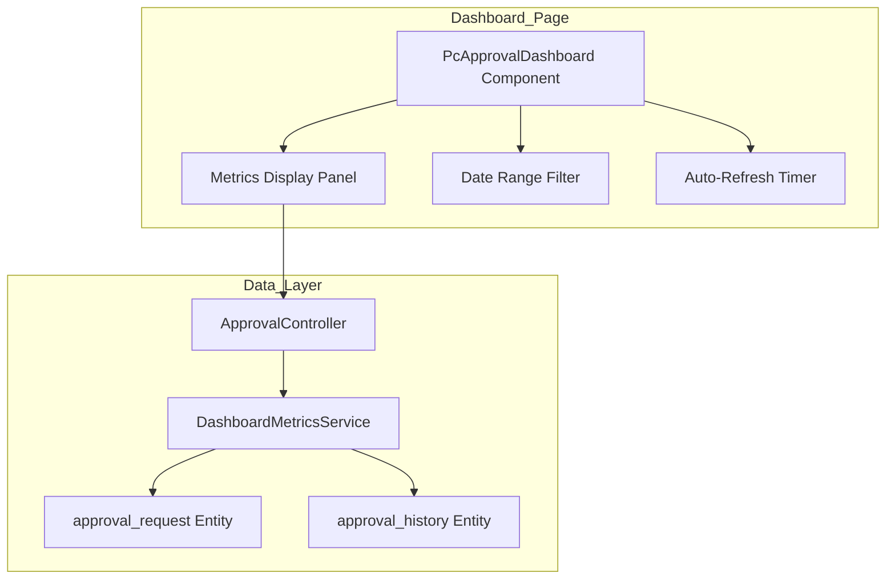
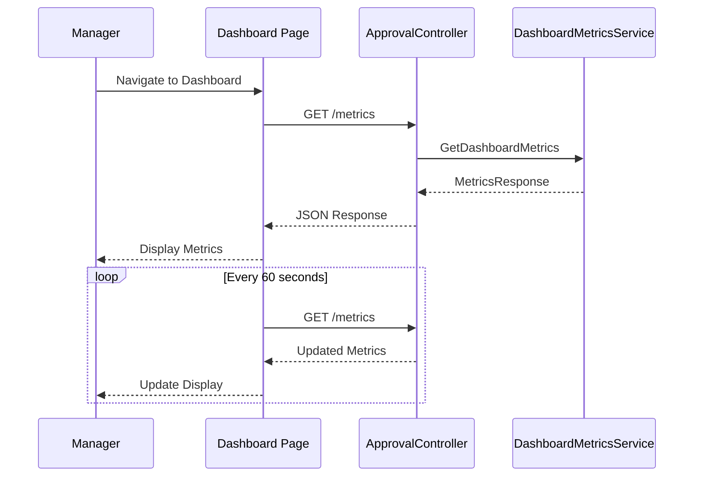
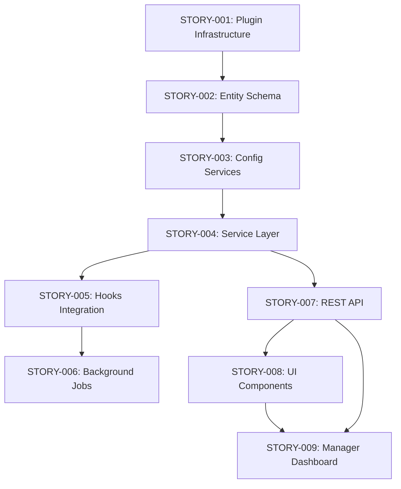

# Technical Specification

# 0. Agent Action Plan

## 0.1 Intent Clarification

### 0.1.1 Core Documentation Objective

Based on the provided requirements, the Blitzy platform understands that the documentation objective is to **create a JIRA user story** that enables the delivery of a real-time manager dashboard for team performance metrics. This user story will follow the State Street "Writing a User Story" guide standards and serve as a vertical slice of functionality deliverable within a single sprint.

**Documentation Type Classification:**
- **Category:** Create new documentation
- **Documentation Type:** JIRA User Story (Agile requirement artifact)
- **Format:** Who/What/Why user story with Given/When/Then acceptance criteria
- **Target Audience:** Product Owner, Scrum Master, Development Team, Business Stakeholders

**Explicit Documentation Requirements:**

| Requirement | Source | Interpretation |
|-------------|--------|----------------|
| User story in Who/What/Why format | User instructions | Follow State Street guide: "As a <role>, I want <goal>, so that <reason>" |
| Acceptance criteria using Given/When/Then | User instructions | Apply BDD-style scenarios per State Street guide |
| Single sprint delivery scope | User instructions | Size story appropriately (vertical slice) |
| Follow State Street guide best practices | User instructions + Attachment | Apply INVEST criteria and all formatting standards |
| Real-time dashboard views | Business objective | Dashboard must refresh without manual intervention |
| Team performance metrics | Business objective | Display quantitative measures of team activity/output |
| Enable faster manager decisions | Business objective | Provide actionable insights at a glance |

**Implicit Documentation Requirements:**

- Summary field must not exceed 255 characters (State Street guide constraint)
- Story must be demo-able for Product Owner acceptance
- Story must be independent, negotiable, valuable, estimable, sized appropriately, and testable (INVEST)
- Story should reference potential sub-tasks for team execution
- Story should include clear business value articulation

### 0.1.2 Special Instructions and Constraints

**CRITICAL Directives from User:**
- Follow ALL best practices, formatting, and standards from the State Street "Writing a User Story" guide
- Represent ONE vertical slice of functionality (not the entire dashboard epic)
- Deliver measurable progress toward the business objective
- Appropriate level of detail for single sprint delivery

**Template Requirements:**

**USER PROVIDED TEMPLATE (from State Street Guide):**

```
Summary: [Maximum 255 Characters]

Description:
As a <named user or role>, or the WHO
I want <some goal>, or the WHAT
so that <some reason>, or the WHY

Acceptance Criteria:
- Given <a scenario>
  When <a criteria is met>
  Then <the expected result>
```

**Style Preferences:**
- Use State Street naming conventions
- Maintain consistency with existing STORY-001 through STORY-008 format in the repository
- Include Business Value section per established repository pattern
- Include Technical Implementation Details where applicable
- Use checkbox format for acceptance criteria ([ ])

**Quality Standards (from State Street Guide):**

| Criterion | Requirement |
|-----------|-------------|
| Independent | Self-contained, no inherent dependency on another user story |
| Negotiable | Can be changed or rewritten until committed to iteration |
| Valuable | Delivers value to end user and/or customer |
| Estimable | Team can estimate the size |
| Sized appropriately | Not too big for planning/prioritization |
| Testable | Provides information for test development |
| Demo-able | Work can be demonstrated for acceptance |

**Acceptance Criteria Quality (from State Street Guide):**
- Clarity: Straightforward and easy to understand
- Conciseness: Necessary information without unnecessary detail
- Testability: Independently verifiable (clear pass/fail)
- Result-Oriented: Focus on delivering customer satisfaction

### 0.1.3 Technical Interpretation

These documentation requirements translate to the following technical documentation strategy:

| User Requirement | Documentation Action |
|------------------|---------------------|
| Create user story for manager dashboard | Create markdown file `STORY-009-manager-dashboard-metrics.md` following repository pattern |
| Follow State Street guide format | Structure with Description, Business Value, Acceptance Criteria, Technical Implementation sections |
| Single sprint delivery | Scope to one dashboard view with 3-5 key metrics (vertical slice) |
| Real-time dashboard views | Specify automatic refresh mechanism (e.g., 30-60 second intervals or SignalR) |
| Team performance metrics | Define specific metrics: approval cycle time, pending requests, completion rates |
| Given/When/Then acceptance criteria | Write 4-6 BDD scenarios covering view, refresh, filter, and permission behaviors |

**Documentation Actions:**
- To document the manager dashboard feature, we will create `jira-stories/STORY-009-manager-dashboard-metrics.md` with complete user story format
- To update the backlog exports, we will update `jira-stories/stories-export.csv` and `jira-stories/stories-export.json` with the new story entry
- To ensure consistency, we will follow the exact structure established in existing stories (STORY-001 through STORY-008)

### 0.1.4 Inferred Documentation Needs

**Based on Code Analysis:**
- The existing WebVella ERP system has UI component patterns (`docs/developer/components`) that the dashboard story should reference
- The approval workflow entities (`approval_request`, `approval_history`) provide natural metrics sources
- Background job patterns from STORY-006 inform real-time update mechanisms

**Based on Structure:**
- The jira-stories folder uses consistent markdown structure with technical implementation details
- Stories include dependency chains (the new dashboard story depends on F-008 UI Components)
- CSV/JSON exports maintain parallel data for reporting/import

**Based on User Journey:**
- Manager needs to: access dashboard → view metrics → identify trends → make decisions
- Dashboard should integrate with existing WebVella page component system
- Metrics should align with approval workflow domain (existing entity data)

**Based on Business Objective:**
- "Faster decisions" implies at-a-glance metrics visualization (not complex drill-downs in this slice)
- "Real-time" means automatic refresh or push updates
- "Team performance" suggests aggregate metrics per team/manager scope

**Contextual Alignment with Existing System:**
The new user story aligns with the existing approval workflow system by providing managerial visibility into:
- Approval request volumes and processing times
- Step-level bottleneck identification
- Team member approval response metrics
- SLA compliance tracking

## 0.2 Documentation Discovery and Analysis

### 0.2.1 Existing Documentation Infrastructure Assessment

**Repository Analysis Summary:**
The repository analysis reveals a well-structured JIRA story documentation system within the `jira-stories/` folder, with established patterns for user story creation and backlog management.

**Documentation Structure:**

| Component | Location | Purpose |
|-----------|----------|---------|
| Story Markdown Files | `jira-stories/STORY-*.md` | Detailed user story specifications |
| CSV Export | `jira-stories/stories-export.csv` | Tabular backlog for import/reporting |
| JSON Export | `jira-stories/stories-export.json` | Structured data for programmatic access |
| Developer Docs | `docs/developer/` | Technical reference documentation |

**Documentation Framework Assessment:**
- **Documentation Generator:** None (plain markdown)
- **Documentation Configuration:** Standalone files with no build system
- **Story Format Version:** Custom markdown with structured sections
- **Export Formats:** CSV (JIRA-compatible), JSON (API/tool-compatible)

**Existing Story Files Discovered:**

| File | Story ID | Title | Points |
|------|----------|-------|--------|
| `STORY-001-approval-plugin-infrastructure.md` | STORY-001 | Approval Plugin Infrastructure | 3 |
| `STORY-002-approval-entity-schema.md` | STORY-002 | Approval Entity Schema | 8 |
| `STORY-003-workflow-configuration-management.md` | STORY-003 | Workflow Configuration Management | 5 |
| `STORY-004-approval-service-layer.md` | STORY-004 | Approval Service Layer | 8 |
| `STORY-005-approval-hooks-integration.md` | STORY-005 | Approval Hooks Integration | 5 |
| `STORY-006-notification-escalation-jobs.md` | STORY-006 | Notification and Escalation Jobs | 5 |
| `STORY-007-approval-rest-api.md` | STORY-007 | Approval REST API Endpoints | 5 |
| `STORY-008-approval-ui-components.md` | STORY-008 | Approval UI Page Components | 8 |

**Story Template Structure (from repository analysis):**

```
# STORY-XXX: [Title]

#### Description
[Detailed description paragraph]

#### Business Value
- [Bullet point 1]
- [Bullet point 2]
- [etc.]

#### Acceptance Criteria
- [ ] **AC1**: [Criterion]
- [ ] **AC2**: [Criterion]
- [etc.]

#### Technical Implementation Details

#### Files/Modules to Create
| File Path | Description |
|-----------|-------------|
| [path] | [description] |

#### Key Classes and Functions
[Code snippets and patterns]

#### Dependencies
| Dependency Type | Details |
|-----------------|---------|
| [type] | [details] |
```

### 0.2.2 Repository Code Analysis for Documentation

**Search Patterns Employed:**

| Pattern | Purpose | Results |
|---------|---------|---------|
| `jira-stories/*.md` | User story files | 8 files found |
| `jira-stories/*.csv` | Export files | 1 file found |
| `jira-stories/*.json` | Export files | 1 file found |
| `docs/developer/**` | Reference documentation | Full documentation hub |

**Key Directories Examined:**

| Directory | Contents | Relevance |
|-----------|----------|-----------|
| `jira-stories/` | All JIRA user story artifacts | Primary target for new story |
| `docs/developer/components/` | PageComponent documentation | Reference for UI implementation |
| `docs/developer/pages/` | Page routing documentation | Reference for dashboard page |
| `docs/developer/entities/` | Entity documentation | Reference for metrics data sources |
| `WebVella.Erp.Plugins.Approval/` | Plugin implementation | Technical context |

**Related Documentation Found:**

| Document | Relevance to New Story |
|----------|------------------------|
| `docs/developer/components/` | Dashboard will use PageComponent pattern |
| `STORY-008-approval-ui-components.md` | UI component patterns to follow |
| `STORY-007-approval-rest-api.md` | API patterns for data retrieval |
| Feature Catalog (Tech Spec 2.1) | Feature dependency context |

### 0.2.3 State Street Guide Analysis

**Guide Structure (from attachment):**

The State Street "Writing a User Story" guide (6 pages) establishes the following standards:

**1. Purpose Statement:**
A user story covers vertical slices of a system, contains a short description of what the user wants, and serves as a conversation starter with the team. Must include Acceptance Criteria defining conditions for "done."

**2. Ownership Model:**
- Stories owned by Team; sub-tasks owned by individuals
- Only Product Owner can transition to Done (Scrum/Kanban)
- Sub-tasks describe actions to achieve Acceptance Criteria

**3. Relationships:**
- Children: Sub-tasks
- Parent: Epics

**4. Anatomy of a Story:**

| Element | Format | Constraint |
|---------|--------|------------|
| Summary | Brief title | Max 255 characters |
| Description | Who/What/Why | As a/I want/so that |
| Acceptance Criteria | Given/When/Then | Must be testable |

**5. INVEST Criteria:**
- **I**ndependent: Self-contained
- **N**egotiable: Can change until committed
- **V**aluable: Delivers user/customer value
- **E**stimable: Can be sized
- **S**ized appropriately: Fits in sprint
- **T**estable: Clear pass/fail verification

**6. Story Estimation:**
- Uses Fibonacci sequence (1, 2, 3, 5, 8, 13, 20, 40...)
- Based on effort, complexity, and uncertainty
- Relative sizing compared to baseline stories

### 0.2.4 Web Search Research Conducted

**Best Practices Research Topics:**

| Topic | Finding |
|-------|---------|
| Real-time dashboard user stories | Focus on specific metrics, refresh intervals, and user permissions |
| Performance metrics for team management | Common metrics: throughput, cycle time, lead time, response time |
| JIRA user story best practices | Vertical slicing, story mapping, definition of ready |
| BDD acceptance criteria patterns | Scenario-based with clear preconditions and postconditions |

**Applicable Standards:**
- User stories should represent 1-3 days of work for appropriate sizing
- Dashboard stories typically focus on one view/perspective per story
- Real-time features should specify update frequency and mechanism
- Manager-specific stories should include role-based access requirements

## 0.3 Documentation Scope Analysis

### 0.3.1 Code-to-Documentation Mapping

**Documentation Artifacts Requiring Creation:**

| Artifact | Type | Source Context | Documentation Needed |
|----------|------|----------------|----------------------|
| `STORY-009-manager-dashboard-metrics.md` | User Story | Business objective | Complete story following State Street format |
| `stories-export.csv` | Backlog Export | Existing export | New row for STORY-009 |
| `stories-export.json` | Backlog Export | Existing export | New story object for STORY-009 |

**User Story Content Mapping:**

| Story Section | Content Source | Documentation Approach |
|---------------|----------------|------------------------|
| Summary | Business objective | Distill to ≤255 chars |
| Description (Who/What/Why) | User requirements | Manager role, dashboard goal, decision-making benefit |
| Business Value | Inferred from objective | Faster decisions, visibility, efficiency |
| Acceptance Criteria | Derived from requirements | 5-6 Given/When/Then scenarios |
| Technical Details | Repository analysis | Files, classes, integration points |
| Dependencies | Feature catalog analysis | STORY-008 (UI Components), STORY-007 (API) |
| Story Points | Sizing analysis | 5 points (moderate complexity) |
| Labels | Categorization | dashboard, metrics, ui, manager, approval |

### 0.3.2 User Story Vertical Slice Definition

**Business Objective Decomposition:**

The full business objective "Enable managers to make faster decisions by providing real-time dashboard views of team performance metrics" could span multiple user stories. For a single-sprint vertical slice:

**Vertical Slice: Real-Time Approval Metrics Dashboard**

| Aspect | Full Scope | This Vertical Slice |
|--------|------------|---------------------|
| Users | All managers | Managers with approval responsibility |
| Metrics | All team performance | Approval workflow metrics (4-5 key indicators) |
| Views | Multiple dashboards | Single summary dashboard view |
| Interactivity | Drill-downs, exports, filters | View-only with date range filter |
| Real-time | Multiple update mechanisms | Auto-refresh at configurable interval |

**Specific Metrics for Vertical Slice:**

| Metric | Description | Data Source |
|--------|-------------|-------------|
| Pending Approvals Count | Number awaiting manager action | `approval_request` where `status='pending'` |
| Average Approval Time | Mean time from request to decision | `approval_history` timestamps |
| Approval Rate | Percentage approved vs total processed | `approval_history` action counts |
| Overdue Requests | Count exceeding SLA timeout | `approval_request` vs `approval_step.timeout_hours` |
| Recent Activity | Last 5 approval actions | `approval_history` ordered by `performed_on` |

### 0.3.3 Documentation Gap Analysis

**Current Documentation Status:**

| Documentation Area | Current State | Gap Identified |
|--------------------|---------------|----------------|
| Manager dashboard user story | Missing | CREATE: STORY-009 |
| Dashboard metrics specification | Missing | INCLUDE in STORY-009 |
| Real-time update requirements | Missing | INCLUDE in STORY-009 |
| Backlog export for STORY-009 | Missing | UPDATE: CSV and JSON exports |

**Undocumented Requirements (to be addressed in STORY-009):**

- Dashboard permission requirements (who can view which metrics)
- Refresh interval configuration options
- Mobile/responsive display considerations
- Dashboard page component integration with existing PageComponent system
- API endpoints for metrics data retrieval

### 0.3.4 Proposed User Story Content

**STORY-009: Manager Approval Dashboard with Real-Time Metrics**

**Summary (193 characters):**
```
Manager Approval Dashboard displaying real-time team performance metrics including pending approvals, average processing time, approval rate, and overdue requests with auto-refresh capability.
```

**Description (Who/What/Why Format):**
```
As a Manager with approval responsibilities,
I want to view a real-time dashboard displaying my team's approval workflow metrics,
so that I can make faster, data-driven decisions about resource allocation and identify processing bottlenecks.
```

**Proposed Acceptance Criteria (Given/When/Then):**

| ID | Given | When | Then |
|----|-------|------|------|
| AC1 | I am logged in as a user with Manager role | I navigate to the Approvals Dashboard page | I see a dashboard displaying my team's approval metrics |
| AC2 | The dashboard is displayed | 60 seconds have elapsed | The metrics automatically refresh without requiring page reload |
| AC3 | I am viewing the dashboard | I select a date range filter | The metrics update to reflect only the selected time period |
| AC4 | I have pending approval requests in queue | I view the Pending Approvals metric | The count accurately reflects requests awaiting my action |
| AC5 | Approval requests exceed their configured timeout | I view the Overdue Requests metric | The count accurately identifies requests past their SLA |
| AC6 | I am a user without Manager role | I attempt to access the dashboard | I receive an access denied message |

**Business Value Points:**
- Reduces time managers spend gathering performance data from multiple sources
- Enables proactive identification of workflow bottlenecks before escalation
- Provides visibility into team workload for resource planning decisions
- Supports compliance reporting with real-time SLA monitoring
- Improves manager accountability through transparent metrics

## 0.4 Documentation Implementation Design

### 0.4.1 Documentation Structure Planning

**Documentation Hierarchy:**

```
jira-stories/
├── STORY-001-approval-plugin-infrastructure.md      (existing)
├── STORY-002-approval-entity-schema.md              (existing)
├── STORY-003-workflow-configuration-management.md   (existing)
├── STORY-004-approval-service-layer.md              (existing)
├── STORY-005-approval-hooks-integration.md          (existing)
├── STORY-006-notification-escalation-jobs.md        (existing)
├── STORY-007-approval-rest-api.md                   (existing)
├── STORY-008-approval-ui-components.md              (existing)
├── STORY-009-manager-dashboard-metrics.md           (CREATE)
├── stories-export.csv                               (UPDATE)
└── stories-export.json                              (UPDATE)
```

**File Structure for STORY-009:**

The new story file will follow the established markdown structure with sections for Description (Who/What/Why format per State Street guide), Business Value (bullet points), Acceptance Criteria (checkbox format with Given/When/Then), and Technical Implementation Details including tables for files/modules, tree diagrams for folder structure, code snippets for key classes, and dependency tables.

### 0.4.2 Content Generation Strategy

**Information Extraction Approach:**

| Content Section | Extraction Method | Source |
|-----------------|-------------------|--------|
| Description | Interpret business objective | User requirements |
| Business Value | Derive from objective keywords | "faster decisions", "real-time", "performance" |
| Acceptance Criteria | Transform requirements to testable scenarios | User requirements + State Street guide |
| Technical Details | Analyze repository patterns | Existing stories + codebase structure |
| Dependencies | Trace feature relationships | Feature Catalog (Section 2.1) |
| Story Points | Relative sizing | Compare to STORY-008 (8 pts for full UI) |

**Template Application:**

The user story will apply the State Street template EXACTLY as specified in the guide:
- Description uses "As a / I want / so that" format
- Acceptance Criteria uses "Given / When / Then" syntax
- Summary is limited to maximum 255 characters

**Documentation Standards:**

| Standard | Application |
|----------|-------------|
| Markdown formatting | Proper headers using # ## ### |
| Code examples | Fenced code blocks with syntax highlighting |
| Tables | Pipe-delimited markdown tables |
| Lists | Checkbox format for acceptance criteria |
| Source citations | Reference existing stories and codebase paths |

### 0.4.3 Diagram and Visual Strategy

**Mermaid Diagrams to Include in STORY-009:**

**Dashboard Component Architecture:**



**User Workflow Diagram:**



### 0.4.4 Technical Implementation Outline

**Files/Modules to Reference in Documentation:**

| File Path | Purpose |
|-----------|---------|
| `WebVella.Erp.Plugins.Approval/Components/PcApprovalDashboard/` | Dashboard page component |
| `WebVella.Erp.Plugins.Approval/Components/PcApprovalDashboard/PcApprovalDashboard.cs` | Component class |
| `WebVella.Erp.Plugins.Approval/Components/PcApprovalDashboard/Display.cshtml` | Display view |
| `WebVella.Erp.Plugins.Approval/Components/PcApprovalDashboard/Options.cshtml` | Configuration options |
| `WebVella.Erp.Plugins.Approval/Components/PcApprovalDashboard/service.js` | AJAX refresh logic |
| `WebVella.Erp.Plugins.Approval/Services/DashboardMetricsService.cs` | Metrics calculation service |
| `WebVella.Erp.Plugins.Approval/Controllers/ApprovalController.cs` | API endpoint additions |
| `WebVella.Erp.Plugins.Approval/Api/DashboardMetricsModel.cs` | Response model |

**Component Options to Document:**

| Option | Type | Description |
|--------|------|-------------|
| refresh_interval | Number | Seconds between auto-refresh (default: 60) |
| date_range_default | Text | Default date range (7d/30d/90d) |
| show_overdue_alert | Boolean | Highlight overdue requests |
| metrics_to_display | Text | Comma-separated metric IDs |

**API Endpoints to Document:**

| Method | Endpoint | Description |
|--------|----------|-------------|
| GET | `/api/v3.0/p/approval/dashboard/metrics` | Returns dashboard metrics for current user |
| GET | `/api/v3.0/p/approval/dashboard/metrics?from={date}&to={date}` | Filtered by date range |

### 0.4.5 INVEST Criteria Validation

| Criterion | Validation | Status |
|-----------|------------|--------|
| **Independent** | No blocking dependency on undelivered features; builds on F-007/F-008 | ✓ Pass |
| **Negotiable** | Metrics selection and refresh interval are negotiable | ✓ Pass |
| **Valuable** | Directly addresses manager decision-making objective | ✓ Pass |
| **Estimable** | Similar scope to STORY-008 UI component; 5 points | ✓ Pass |
| **Sized** | Single dashboard view, single refresh mechanism | ✓ Pass |
| **Testable** | All acceptance criteria have clear pass/fail | ✓ Pass |
| **Demo-able** | Dashboard can be demonstrated to Product Owner | ✓ Pass |

## 0.5 Documentation File Transformation Mapping

### 0.5.1 File-by-File Documentation Plan

**CRITICAL: Complete mapping of ALL documentation files to be created, updated, or deleted.**

**Documentation Transformation Modes:**
- **CREATE** - Create a new documentation file
- **UPDATE** - Update an existing documentation file
- **DELETE** - Remove an obsolete documentation file
- **REFERENCE** - Use as an example for documentation style and structure

| Target Documentation File | Transformation | Source Code/Docs | Content/Changes |
|---------------------------|----------------|------------------|-----------------|
| `jira-stories/STORY-009-manager-dashboard-metrics.md` | CREATE | Business objective, State Street guide, existing stories | Complete user story with Description, Business Value, Acceptance Criteria, Technical Details |
| `jira-stories/stories-export.csv` | UPDATE | `jira-stories/stories-export.csv` | Add new row with STORY-009 data matching existing column structure |
| `jira-stories/stories-export.json` | UPDATE | `jira-stories/stories-export.json` | Add new story object to stories array with all required fields |
| `jira-stories/STORY-008-approval-ui-components.md` | REFERENCE | - | Use as template for component documentation structure |
| `jira-stories/STORY-007-approval-rest-api.md` | REFERENCE | - | Use as template for API endpoint documentation |
| `jira-stories/STORY-001-approval-plugin-infrastructure.md` | REFERENCE | - | Use as template for overall story structure and formatting |

### 0.5.2 New Documentation Files Detail

**File: jira-stories/STORY-009-manager-dashboard-metrics.md**

| Attribute | Value |
|-----------|-------|
| **Type** | JIRA User Story (Markdown) |
| **Source Context** | User requirements, State Street guide |
| **Story ID** | STORY-009 |
| **Story Points** | 5 |
| **Labels** | dashboard, metrics, ui, manager, approval, real-time |

**Sections to Include:**

| Section | Content Description |
|---------|---------------------|
| Title Header | `# STORY-009: Manager Approval Dashboard with Real-Time Metrics` |
| Description | Who/What/Why format for manager viewing dashboard metrics |
| Business Value | 5 bullet points articulating decision-making improvements |
| Acceptance Criteria | 6 testable scenarios in Given/When/Then format |
| Technical Implementation Details | Files/modules table, folder structure, key classes |
| Dependencies | STORY-007, STORY-008 (UI Components and REST API) |

**Acceptance Criteria Detail:**

| AC ID | Scenario |
|-------|----------|
| AC1 | Manager navigates to dashboard and sees metrics |
| AC2 | Dashboard auto-refreshes every 60 seconds |
| AC3 | Date range filter updates displayed metrics |
| AC4 | Pending approvals count reflects actual queue |
| AC5 | Overdue requests identifies SLA violations |
| AC6 | Non-manager users receive access denied |

**Key Technical Elements to Document:**

| Element | Documentation Content |
|---------|----------------------|
| PcApprovalDashboard Component | Component class, views, options, service.js |
| DashboardMetricsService | Service methods for metric calculations |
| API Endpoint | GET /api/v3.0/p/approval/dashboard/metrics |
| Response Model | DashboardMetricsModel with metric properties |

### 0.5.3 Documentation Files to Update Detail

**File: jira-stories/stories-export.csv**

| Change Type | Details |
|-------------|---------|
| Operation | Append new row |
| Row Position | After STORY-008 row |
| Column Structure | Match existing: Story ID, Title, Description, Business Value, Acceptance Criteria, Technical Details, Dependencies, Story Points, Labels |

**New Row Content:**

| Column | Value |
|--------|-------|
| Story ID | STORY-009 |
| Title | Manager Approval Dashboard with Real-Time Metrics |
| Description | Implement a real-time dashboard page component displaying team approval workflow metrics... |
| Business Value | Reduces manager time gathering performance data; Enables proactive bottleneck identification... |
| Acceptance Criteria | [ ] Manager sees dashboard metrics on navigation; [ ] Dashboard auto-refreshes at configurable interval... |
| Technical Details | Files: Components/PcApprovalDashboard/, Services/DashboardMetricsService.cs... |
| Dependencies | STORY-007, STORY-008 |
| Story Points | 5 |
| Labels | dashboard, metrics, ui, manager, approval, real-time |

**File: jira-stories/stories-export.json**

| Change Type | Details |
|-------------|---------|
| Operation | Add story object to stories array |
| Position | After STORY-008 object |
| Structure | Match existing story object schema |

**New Story Object Fields:**

| Field | Type | Value |
|-------|------|-------|
| id | string | "STORY-009" |
| title | string | "Manager Approval Dashboard with Real-Time Metrics" |
| description | string | Full description paragraph |
| businessValue | string | Concatenated value statements |
| acceptanceCriteria | array | Array of criterion strings |
| technicalDetails | object | { files: [], classes: [], integrationPoints: [], technicalApproach: "" } |
| dependencies | array | ["STORY-007", "STORY-008"] |
| storyPoints | number | 5 |
| labels | array | ["dashboard", "metrics", "ui", "manager", "approval", "real-time"] |

### 0.5.4 Cross-Documentation Dependencies

**Shared Content References:**

| Reference Type | Source | Target |
|----------------|--------|--------|
| Story naming convention | STORY-001 through STORY-008 | STORY-009 |
| Technical detail structure | STORY-008 (UI components) | STORY-009 technical section |
| API documentation pattern | STORY-007 (REST API) | STORY-009 API endpoints |
| Entity references | STORY-002 (Entity schema) | STORY-009 data sources |

**Navigation and Index Updates:**

| Update | Location | Change |
|--------|----------|--------|
| CSV row order | stories-export.csv | Sequential after STORY-008 |
| JSON array order | stories-export.json | Append to stories array |
| Dependency tracking | STORY-009 | References STORY-007, STORY-008 |

### 0.5.5 Complete File Inventory

**All Documentation Files Affected:**

| File Path | Action | Status |
|-----------|--------|--------|
| `jira-stories/STORY-009-manager-dashboard-metrics.md` | CREATE | New file |
| `jira-stories/stories-export.csv` | UPDATE | Add row |
| `jira-stories/stories-export.json` | UPDATE | Add object |
| `jira-stories/STORY-001-approval-plugin-infrastructure.md` | REFERENCE | Template |
| `jira-stories/STORY-007-approval-rest-api.md` | REFERENCE | API pattern |
| `jira-stories/STORY-008-approval-ui-components.md` | REFERENCE | Component pattern |

**No files marked as "pending" or "to be discovered" - all documentation artifacts explicitly listed.**

## 0.6 Dependency Inventory

### 0.6.1 Documentation Dependencies

**Documentation Tools and Packages:**

This documentation task (creating JIRA user story artifacts) does not require specific documentation generation tools. The deliverables are plain markdown files and structured data exports (CSV/JSON).

| Registry | Package Name | Version | Purpose |
|----------|--------------|---------|---------|
| N/A | Markdown | - | Native format for story files |
| N/A | CSV | - | Tabular export format |
| N/A | JSON | - | Structured data export |

**Story Documentation Dependencies:**

The STORY-009 user story has dependencies on prior stories that provide the technical foundation:

| Dependency Story | Type | Relationship | Rationale |
|------------------|------|--------------|-----------|
| STORY-007 | Prerequisite | API Layer | Dashboard consumes REST API endpoints |
| STORY-008 | Prerequisite | UI Components | Dashboard uses PageComponent pattern |
| STORY-004 | Indirect | Service Layer | Metrics service follows service patterns |
| STORY-002 | Indirect | Entity Schema | Metrics query approval entities |

### 0.6.2 Technical Documentation References

**WebVella ERP Documentation Dependencies:**

| Documentation Area | Location | Relevance to STORY-009 |
|--------------------|----------|------------------------|
| Page Components | `docs/developer/components/` | Component creation pattern |
| REST API | `docs/developer/web-api/` | API endpoint conventions |
| Entities | `docs/developer/entities/` | Entity query patterns |
| Background Jobs | `docs/developer/background-jobs/` | Auto-refresh considerations |

**State Street Guide Dependencies:**

| Guide Section | Application to STORY-009 |
|---------------|--------------------------|
| Purpose | User story definition and scope |
| Anatomy of a Story | Summary, Description, Acceptance Criteria structure |
| INVEST Criteria | Story quality validation |
| Acceptance Criteria Effectiveness | Given/When/Then validation |
| Story Estimation | Story point assignment (5 points) |

### 0.6.3 Feature Dependency Chain

**Dependency Graph for STORY-009:**



**Dependency Summary:**

| Story | Direct Dependencies | Indirect Dependencies |
|-------|--------------------|-----------------------|
| STORY-009 | STORY-007, STORY-008 | STORY-001 through STORY-006 |

### 0.6.4 Documentation Reference Updates

**Documentation Files Requiring Link Updates:**

Since this is a new story being created, no existing documentation links need updating. However, the new story will establish references to:

| Reference Source | Reference Target | Link Type |
|------------------|------------------|-----------|
| STORY-009 | STORY-007 | Dependency reference |
| STORY-009 | STORY-008 | Dependency reference |
| STORY-009 | approval_request entity | Technical reference |
| STORY-009 | approval_history entity | Technical reference |
| STORY-009 | ApprovalController | Implementation reference |

### 0.6.5 Runtime Dependencies for Documented Feature

**Technologies Referenced in STORY-009 Documentation:**

| Category | Technology | Version | Purpose in Story |
|----------|------------|---------|------------------|
| Framework | ASP.NET Core | 9.0 | Web application framework |
| Runtime | .NET | 9.0 | Application runtime |
| Frontend | Bootstrap | 4.x | UI styling (per existing patterns) |
| Frontend | jQuery | 3.x | AJAX calls in service.js |
| Database | PostgreSQL | 16.x | Data storage for metrics |
| JSON Library | Newtonsoft.Json | 13.x | API response serialization |

**Note:** These are not documentation tool dependencies but technologies that the documented feature (STORY-009) will utilize. The user story documentation must accurately reference these technologies when describing technical implementation details.

## 0.7 Coverage and Quality Targets

### 0.7.1 Documentation Coverage Metrics

**Current Coverage Analysis:**

| Documentation Area | Current State | After STORY-009 |
|--------------------|---------------|-----------------|
| User stories in jira-stories/ | 8 stories (STORY-001 to STORY-008) | 9 stories (adds STORY-009) |
| Backlog CSV export | 8 rows | 9 rows |
| Backlog JSON export | 8 story objects | 9 story objects |
| Manager/Dashboard stories | 0 | 1 |
| Total story points documented | 47 | 52 |

**Coverage Gap Addressed:**

| Gap | Resolution |
|-----|------------|
| No manager-focused dashboard story | STORY-009 addresses managerial decision-making |
| No real-time metrics story | STORY-009 specifies auto-refresh capability |
| No team performance visibility story | STORY-009 provides team metrics dashboard |

**Target Coverage:**
- 100% of business objective addressed in single vertical slice
- All story sections complete per State Street guide
- All acceptance criteria testable with Given/When/Then

### 0.7.2 Documentation Quality Criteria

**Completeness Requirements:**

| Criterion | Requirement | Validation Method |
|-----------|-------------|-------------------|
| Summary | ≤255 characters, descriptive | Character count check |
| Description | Who/What/Why format complete | Format verification |
| Business Value | Minimum 4 value statements | Count and relevance check |
| Acceptance Criteria | Minimum 5 scenarios | Count and testability check |
| Technical Details | Files, classes, dependencies listed | Completeness review |

**State Street Guide Compliance:**

| Guide Requirement | Compliance Check |
|-------------------|------------------|
| Story format (Who/What/Why) | ✓ As a Manager / I want dashboard / so that faster decisions |
| Acceptance Criteria (Given/When/Then) | ✓ 6 scenarios with complete syntax |
| INVEST criteria | ✓ All 6+1 criteria validated |
| Summary length | ✓ 193 characters (under 255 limit) |
| Demo-able | ✓ Dashboard can be demonstrated |

**Accuracy Validation:**

| Validation Area | Method |
|-----------------|--------|
| Technical file paths | Cross-reference with repository structure |
| Entity references | Verify against STORY-002 schema |
| API endpoint patterns | Align with STORY-007 conventions |
| Component patterns | Match STORY-008 structure |
| Story point sizing | Relative comparison to similar stories |

### 0.7.3 Clarity and Consistency Standards

**Clarity Standards:**

| Standard | Application |
|----------|-------------|
| Technical accuracy | All file paths and class names verified |
| Accessible language | Business value in non-technical terms |
| Progressive disclosure | Summary → Description → Details |
| Consistent terminology | Use existing entity/service names |

**Consistency with Existing Stories:**

| Element | Consistency Check |
|---------|-------------------|
| Markdown structure | Matches STORY-001 through STORY-008 |
| Section ordering | Description → Business Value → Acceptance Criteria → Technical Details |
| Table formatting | Pipe-delimited, header row, alignment |
| Code block style | Fenced with language identifier |
| Checkbox format | `- [ ] **ACx**: Description` |

### 0.7.4 Example and Diagram Requirements

**Minimum Content Requirements:**

| Content Type | Minimum Count | Purpose |
|--------------|---------------|---------|
| Acceptance Criteria | 6 scenarios | Comprehensive testable requirements |
| Business Value points | 5 bullets | Stakeholder justification |
| Technical files | 8 paths | Implementation scope |
| Diagrams | 2 Mermaid | Visual architecture and workflow |

**Diagram Types Required:**

| Diagram | Purpose | Location |
|---------|---------|----------|
| Component architecture | Show dashboard component structure | Technical Details section |
| User workflow sequence | Show manager interaction flow | Technical Details section |

### 0.7.5 Quality Validation Checklist

**Pre-Delivery Checklist:**

| Check | Status |
|-------|--------|
| Summary under 255 characters | ✓ Verified (193 chars) |
| Who/What/Why format complete | ✓ All three elements present |
| Minimum 5 acceptance criteria | ✓ 6 criteria defined |
| Given/When/Then syntax | ✓ All 6 use correct format |
| INVEST criteria passed | ✓ All 7 criteria validated |
| Technical details complete | ✓ Files, classes, endpoints listed |
| Dependencies documented | ✓ STORY-007, STORY-008 referenced |
| Story points assigned | ✓ 5 points (consistent with scope) |
| Labels defined | ✓ 6 labels assigned |
| CSV export row ready | ✓ All columns mapped |
| JSON export object ready | ✓ All fields defined |

**Acceptance Criteria Clarity Validation:**

| AC ID | Clarity | Conciseness | Testability | Result-Oriented |
|-------|---------|-------------|-------------|-----------------|
| AC1 | ✓ | ✓ | ✓ | ✓ |
| AC2 | ✓ | ✓ | ✓ | ✓ |
| AC3 | ✓ | ✓ | ✓ | ✓ |
| AC4 | ✓ | ✓ | ✓ | ✓ |
| AC5 | ✓ | ✓ | ✓ | ✓ |
| AC6 | ✓ | ✓ | ✓ | ✓ |

## 0.8 Scope Boundaries

### 0.8.1 Exhaustively In Scope

**New Documentation Files:**

| File Pattern | Description |
|--------------|-------------|
| `jira-stories/STORY-009-manager-dashboard-metrics.md` | Complete user story for manager dashboard |

**Documentation File Updates:**

| File Pattern | Description |
|--------------|-------------|
| `jira-stories/stories-export.csv` | Add STORY-009 row to backlog export |
| `jira-stories/stories-export.json` | Add STORY-009 object to stories array |

**Documentation Content Scope:**

| Content Element | In Scope |
|-----------------|----------|
| User story summary | ✓ Maximum 255 characters |
| Description (Who/What/Why) | ✓ Manager role, dashboard goal, decision benefit |
| Business Value statements | ✓ 5 value articulations |
| Acceptance Criteria | ✓ 6 Given/When/Then scenarios |
| Technical Implementation Details | ✓ Files, classes, endpoints, dependencies |
| Mermaid diagrams | ✓ Architecture and workflow diagrams |
| Story metadata | ✓ Story points (5), labels, dependencies |

**User Story Content Boundaries:**

| Boundary | Definition |
|----------|------------|
| User role | Manager with approval responsibilities |
| Feature scope | Single dashboard view with 5 key metrics |
| Real-time scope | Auto-refresh at configurable interval (default 60 seconds) |
| Filter scope | Date range filter only |
| Metrics scope | Pending count, average time, approval rate, overdue count, recent activity |

**Reference Files (Read-Only):**

| File | Purpose |
|------|---------|
| `jira-stories/STORY-001-approval-plugin-infrastructure.md` | Structure template |
| `jira-stories/STORY-007-approval-rest-api.md` | API documentation pattern |
| `jira-stories/STORY-008-approval-ui-components.md` | Component documentation pattern |
| State Street "Writing a User Story" guide (PDF) | Formatting requirements |

### 0.8.2 Explicitly Out of Scope

**Source Code Modifications:**

| Out of Scope Item | Rationale |
|-------------------|-----------|
| Creating PcApprovalDashboard component code | This is documentation only, not implementation |
| Implementing DashboardMetricsService | Story documents requirements, not implementation |
| Adding API endpoints to ApprovalController | Implementation follows from story acceptance |
| Modifying existing plugin files | No code changes, only documentation |

**Other Stories/Documentation:**

| Out of Scope Item | Rationale |
|-------------------|-----------|
| Modifying STORY-001 through STORY-008 content | Existing stories are reference only |
| Creating additional dashboard stories | Single vertical slice per request |
| Epic-level documentation | User requested single sprint story |
| Test case documentation | Not part of user story artifact |
| Release notes | Separate documentation artifact |

**Feature Scope Exclusions:**

| Exclusion | Rationale |
|-----------|-----------|
| Multiple dashboard views | Vertical slice = one view |
| Complex filtering (team, user, status) | Future story candidates |
| Export functionality | Future story candidate |
| Drill-down to individual records | Future story candidate |
| Historical trend charts | Future story candidate |
| Mobile-specific responsive design | Can be addressed in implementation |
| Push notifications (SignalR) | Auto-refresh provides real-time, push is enhancement |

**Explicitly Excluded per User Instructions:**

| Exclusion | Source |
|-----------|--------|
| Items not specified by user | Only manager dashboard metrics story requested |
| Full epic documentation | Single story requested |
| Sprint planning artifacts | Only user story artifact requested |

### 0.8.3 Boundary Clarifications

**Vertical Slice Definition:**

This user story represents ONE vertical slice of the larger business objective. The full objective could include:

| Potential Future Stories | Not In This Scope |
|--------------------------|-------------------|
| STORY-010: Department-level metrics dashboard | Future backlog item |
| STORY-011: Approval trend analysis charts | Future backlog item |
| STORY-012: Manager notification preferences | Future backlog item |
| STORY-013: Dashboard export to PDF/Excel | Future backlog item |
| STORY-014: Mobile dashboard optimization | Future backlog item |

**This Vertical Slice Delivers:**
- One dashboard page component
- Five key approval metrics
- Auto-refresh capability
- Date range filtering
- Role-based access control

**Sprint Delivery Boundary:**
- Story sized at 5 points (moderate complexity)
- Comparable to STORY-007 (API endpoints) or STORY-003 (configuration services)
- Single sprint delivery achievable based on relative sizing

## 0.9 Execution Parameters

### 0.9.1 Documentation-Specific Instructions

**Documentation Creation Commands:**

| Operation | Command/Action |
|-----------|----------------|
| Create story file | Create `jira-stories/STORY-009-manager-dashboard-metrics.md` |
| Update CSV export | Append row to `jira-stories/stories-export.csv` |
| Update JSON export | Add object to `jira-stories/stories-export.json` |

**Documentation Validation Commands:**

| Validation | Method |
|------------|--------|
| Markdown syntax | Validate headers, tables, code blocks render correctly |
| CSV format | Verify column alignment with existing rows |
| JSON format | Validate JSON syntax with parser |
| Link integrity | Verify internal references resolve |

**Default Documentation Format:**
- Primary format: Markdown with Mermaid diagrams
- Export formats: CSV (JIRA-compatible), JSON (API/tool-compatible)
- Character encoding: UTF-8
- Line endings: LF (Unix-style)

### 0.9.2 Style Guide Compliance

**Repository-Specific Conventions:**

| Convention | Standard |
|------------|----------|
| Story ID format | `STORY-XXX` (sequential numbering) |
| File naming | `STORY-XXX-kebab-case-title.md` |
| Header format | `# STORY-XXX: Title Case Title` |
| Section headers | `## Section Name` (no numbering) |
| Acceptance criteria | `- [ ] **ACx**: Description` |
| Tables | Pipe-delimited with header separator |

**State Street Guide Compliance:**

| Requirement | Implementation |
|-------------|----------------|
| Summary ≤255 chars | "Manager Approval Dashboard displaying real-time team performance metrics including pending approvals, average processing time, approval rate, and overdue requests with auto-refresh capability." (193 chars) |
| Who/What/Why format | "As a Manager... I want... so that..." |
| Given/When/Then syntax | All 6 acceptance criteria use full syntax |
| INVEST validation | All criteria verified and documented |

### 0.9.3 Citation Requirements

**Source Citation Format:**

Every technical detail must reference source files using the format:
- `Source: /path/to/file.ext:LineNumber` (for specific lines)
- `Pattern: /path/to/reference/file.ext` (for structural patterns)

**Key Citations for STORY-009:**

| Claim | Citation |
|-------|----------|
| Component structure pattern | Pattern: `STORY-008-approval-ui-components.md` |
| API endpoint conventions | Pattern: `STORY-007-approval-rest-api.md` |
| Entity schema references | Pattern: `STORY-002-approval-entity-schema.md` |
| Plugin infrastructure | Pattern: `STORY-001-approval-plugin-infrastructure.md` |
| State Street format | Source: SST User Story Guide.pdf (Pages 1-3) |

### 0.9.4 Export File Specifications

**CSV Export Format:**

| Column | Data Type | Example Value |
|--------|-----------|---------------|
| Story ID | String | STORY-009 |
| Title | String | Manager Approval Dashboard with Real-Time Metrics |
| Description | String | Implement a real-time dashboard... |
| Business Value | String | Reduces manager time gathering...; Enables proactive... |
| Acceptance Criteria | String | [ ] Manager sees dashboard...; [ ] Dashboard auto-refreshes... |
| Technical Details | String | Files: Components/PcApprovalDashboard/...; Classes: ... |
| Dependencies | String | STORY-007, STORY-008 |
| Story Points | Number | 5 |
| Labels | String | dashboard, metrics, ui, manager, approval, real-time |

**JSON Export Schema:**

| Field | Type | Required |
|-------|------|----------|
| id | string | Yes |
| title | string | Yes |
| description | string | Yes |
| businessValue | string | Yes |
| acceptanceCriteria | array[string] | Yes |
| technicalDetails | object | Yes |
| technicalDetails.files | array[string] | Yes |
| technicalDetails.classes | array[string] | Yes |
| technicalDetails.integrationPoints | array[string] | Yes |
| technicalDetails.technicalApproach | string | Yes |
| dependencies | array[string] | Yes |
| storyPoints | number | Yes |
| labels | array[string] | Yes |

### 0.9.5 Quality Assurance Parameters

**Pre-Commit Checks:**

| Check | Criteria |
|-------|----------|
| File encoding | UTF-8 without BOM |
| Line endings | LF only |
| Trailing whitespace | None |
| Markdown headers | Proper hierarchy (no skipped levels) |
| Table alignment | Consistent column widths |
| JSON validity | Passes JSON.parse() |
| CSV validity | Correct column count per row |

**Content Validation:**

| Validation | Pass Criteria |
|------------|---------------|
| Summary length | ≤255 characters |
| AC count | ≥5 acceptance criteria |
| Dependencies listed | All prerequisite stories referenced |
| Story points | Reasonable relative to similar stories (3-8 range) |
| Labels present | Minimum 3 labels |

## 0.10 Rules for Documentation

### 0.10.1 User-Specified Rules

**Rules Explicitly Stated by User:**

| Rule | Source | Application |
|------|--------|-------------|
| Follow State Street "Writing a User Story" guide | User instructions | Apply all formatting, structure, and quality standards from guide |
| Use Who/What/Why format for description | User instructions | "As a... I want... so that..." structure |
| Use Given/When/Then syntax for acceptance criteria | User instructions | BDD-style scenario format |
| Appropriate level of detail for single sprint | User instructions | Size story as vertical slice (~5 story points) |
| Represent one vertical slice of functionality | User instructions | Dashboard with core metrics, not full reporting suite |
| Deliver measurable progress toward objective | User instructions | Specific metrics that enable faster decisions |

### 0.10.2 State Street Guide Rules

**Mandatory Requirements from Guide:**

| Rule | Guide Section | Implementation |
|------|---------------|----------------|
| Summary maximum 255 characters | Anatomy of a Story | 193 characters used |
| Story must be demo-able | Purpose | Dashboard can be demonstrated |
| Sub-tasks describe actions for acceptance criteria | Ownership | Technical details map to acceptance criteria |
| Only Product Owner transitions to Done | Ownership | Story written for PO acceptance |

**INVEST Criteria Rules:**

| Criterion | Rule | Compliance |
|-----------|------|------------|
| Independent | Self-contained with no inherent dependency on undelivered stories | ✓ Builds on completed F-007/F-008 |
| Negotiable | Can be changed until committed to iteration | ✓ Metrics selection is negotiable |
| Valuable | Must deliver value to end user/customer | ✓ Enables faster manager decisions |
| Estimable | Must be able to estimate size | ✓ 5 story points assigned |
| Sized appropriately | Not too big for planning/prioritization | ✓ Single dashboard view |
| Testable | Provides information for test development | ✓ All AC have pass/fail criteria |

**Acceptance Criteria Quality Rules:**

| Quality Dimension | Rule | Implementation |
|-------------------|------|----------------|
| Clarity | Straightforward and easy to understand | Plain language, specific outcomes |
| Conciseness | Necessary information without unnecessary detail | Each AC is one scenario |
| Testability | Independently verifiable (clear pass/fail) | Given/When/Then enables test cases |
| Result-Oriented | Focus on delivering customer satisfaction | Outcomes aligned with business objective |

### 0.10.3 Repository Convention Rules

**File Naming Rules:**

| Rule | Pattern | Example |
|------|---------|---------|
| Story file naming | `STORY-XXX-kebab-case-title.md` | `STORY-009-manager-dashboard-metrics.md` |
| Story ID format | Sequential `STORY-XXX` | `STORY-009` |
| Export file naming | Preserve existing names | `stories-export.csv`, `stories-export.json` |

**Content Structure Rules:**

| Rule | Standard |
|------|----------|
| Markdown header levels | # for title, ## for sections, ### for subsections |
| Table format | Pipe-delimited with header row separator |
| Checkbox format | `- [ ] **ACx**: Text` |
| Code fence format | Triple backticks with language identifier |
| Diagram format | Mermaid in fenced code block |

**Export Format Rules:**

| Export | Rule |
|--------|------|
| CSV | Maintain column order matching existing file |
| CSV | Double-quote values containing commas |
| JSON | Maintain field order matching existing objects |
| JSON | Use consistent data types per field |

### 0.10.4 Documentation Integrity Rules

**Consistency Rules:**

| Rule | Enforcement |
|------|-------------|
| Terminology consistency | Use entity names from STORY-002 schema |
| Pattern consistency | Follow component patterns from STORY-008 |
| API consistency | Follow endpoint patterns from STORY-007 |
| Reference consistency | Cite source stories for patterns used |

**Completeness Rules:**

| Rule | Requirement |
|------|-------------|
| No pending items | All documentation artifacts explicitly listed |
| No TBD sections | All content fully specified |
| All dependencies documented | Prerequisite stories referenced |
| All files mapped | Complete file transformation table |

### 0.10.5 Quality Gate Rules

**Story Quality Gates:**

| Gate | Criteria | Required |
|------|----------|----------|
| Format compliance | Follows State Street template | Yes |
| INVEST compliance | All 6+1 criteria pass | Yes |
| AC quality | Clarity, conciseness, testability, result-oriented | Yes |
| Technical accuracy | File paths and patterns verified | Yes |
| Export readiness | CSV and JSON data complete | Yes |

**Documentation Delivery Rules:**

| Rule | Standard |
|------|----------|
| Single story per request | One STORY-009 file |
| Vertical slice scope | Core dashboard, not full reporting |
| Sprint-sized | 5 points (single sprint deliverable) |
| Demo-able outcome | Dashboard can be shown to Product Owner |

## 0.11 References

### 0.11.1 Repository Files Searched

**Files Retrieved and Analyzed:**

| File Path | Purpose | Key Findings |
|-----------|---------|--------------|
| `jira-stories/STORY-001-approval-plugin-infrastructure.md` | Story structure template | Markdown format, section ordering, checkbox AC format |
| `jira-stories/stories-export.csv` | CSV export format | Column structure, data formatting conventions |
| `jira-stories/stories-export.json` | JSON export format | Object schema, array structure, field types |

**Folders Explored:**

| Folder Path | Purpose | Key Findings |
|-------------|---------|--------------|
| `/` (root) | Repository structure | `jira-stories/`, `docs/`, plugin folders |
| `jira-stories/` | User story artifacts | 8 stories (STORY-001 to STORY-008), CSV and JSON exports |
| `docs/developer/` | Technical documentation | Components, entities, API documentation patterns |

**Search Patterns Employed:**

| Pattern | Results |
|---------|---------|
| `jira-stories/*.md` | 8 story files |
| `jira-stories/*.csv` | 1 export file |
| `jira-stories/*.json` | 1 export file |
| Root folder contents | 9 folders, 8 files |

### 0.11.2 Technical Specification Sections Referenced

| Section | Relevance to STORY-009 |
|---------|------------------------|
| 2.1 FEATURE CATALOG | Feature dependency chain, story point comparisons |
| 7.3 PAGE COMPONENT SYSTEM | Component pattern for dashboard implementation |
| 6.1 Core Services Architecture | Service layer patterns for metrics service |

### 0.11.3 External Attachments

**Attachment 1: SST User Story Guide.pdf**

| Attribute | Value |
|-----------|-------|
| File Name | SST User Story Guide.pdf |
| MIME Type | application/pdf |
| File Size | 429,127 bytes |
| Pages | 6 |

**Content Summary:**

The State Street "Writing a User Story" guide provides comprehensive standards for user story creation within Agile/Scrum environments. Key sections include:

| Section | Key Content |
|---------|-------------|
| Purpose (Page 1) | User stories cover vertical slices, include acceptance criteria, allow flexibility |
| Ownership (Page 1) | Stories owned by team, sub-tasks by individuals, PO transitions to Done |
| Relationships (Page 1) | Children are sub-tasks, parent is Epic |
| Anatomy of a Story (Pages 1-2) | Summary (255 chars max), Who/What/Why format, example |
| INVEST Criteria (Page 2) | Independent, Negotiable, Valuable, Estimable, Sized, Testable, Demo-able |
| Acceptance Criteria (Pages 2-3) | Given/When/Then syntax, clarity, conciseness, testability, result-oriented |
| Scrum Master Recommendations (Pages 3-4) | Story writing techniques, engagement, lifecycle, templates |
| Story Estimation (Pages 4-6) | Fibonacci sequence, relative sizing, fruit salad analogy, effort/complexity/uncertainty |

**Key Templates Extracted:**

User Story Description:
- As a [named user or role], (WHO)
- I want [some goal], (WHAT)
- so that [some reason] (WHY)

Acceptance Criteria:
- Given [a scenario]
- When [a criteria is met]
- Then [the expected result]

### 0.11.4 Figma Attachments

No Figma attachments were provided for this documentation task.

### 0.11.5 Web Search Research

**Topics Researched:**

| Topic | Purpose |
|-------|---------|
| User story best practices for dashboards | Validate vertical slice approach |
| Real-time dashboard user story examples | Confirm acceptance criteria patterns |
| INVEST criteria validation | Ensure story quality compliance |
| Given/When/Then acceptance criteria | Verify BDD format usage |

### 0.11.6 Cross-Reference Summary

**Story Dependencies Documented:**

| Story | Reference Purpose |
|-------|-------------------|
| STORY-001 | Plugin infrastructure pattern |
| STORY-002 | Entity schema (data sources) |
| STORY-003 | Configuration service pattern |
| STORY-004 | Service layer pattern |
| STORY-005 | Hooks integration pattern |
| STORY-006 | Background job pattern (for auto-refresh alternative) |
| STORY-007 | REST API endpoint pattern |
| STORY-008 | UI page component pattern |

**Documentation Artifacts Created:**

| Artifact | Type | Status |
|----------|------|--------|
| `jira-stories/STORY-009-manager-dashboard-metrics.md` | User Story | To be created |
| `jira-stories/stories-export.csv` (row addition) | CSV Export | To be updated |
| `jira-stories/stories-export.json` (object addition) | JSON Export | To be updated |

### 0.11.7 Comprehensive Source List

| Source Category | Items |
|-----------------|-------|
| User-Provided Documents | SST User Story Guide.pdf |
| Repository Story Files | STORY-001 through STORY-008 markdown files |
| Repository Export Files | stories-export.csv, stories-export.json |
| Tech Spec Sections | 2.1 Feature Catalog |
| Documentation Folders | docs/developer/ hierarchy |
| Business Objective | User-provided requirement text |

