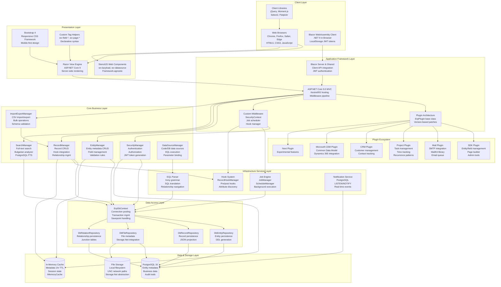
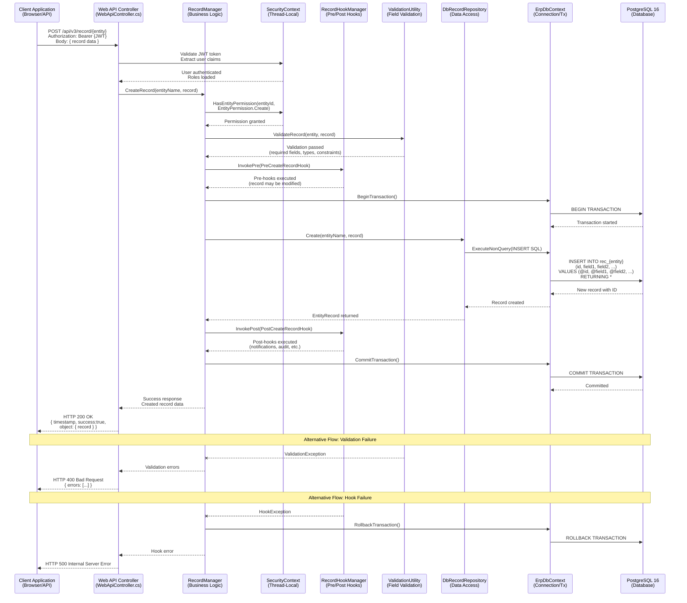
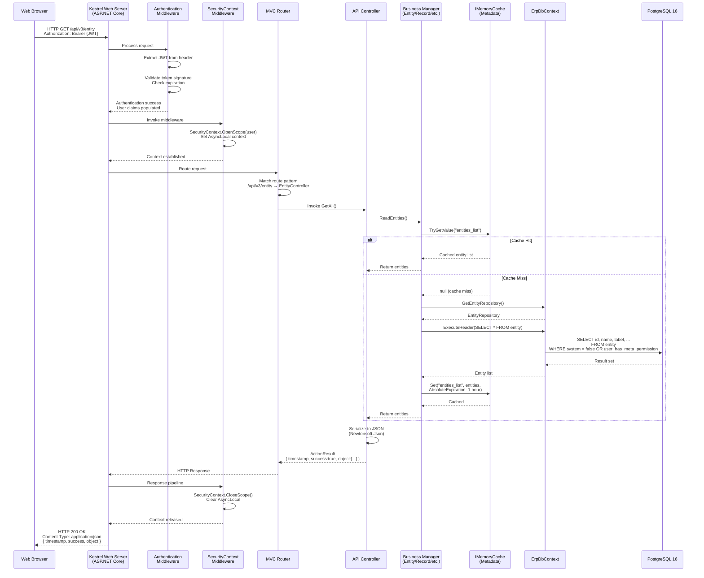

# System Architecture & Data Flow Documentation

**Generated**: November 18, 2024  
**Repository**: https://github.com/WebVella/WebVella-ERP  
**Analyzed Commit**: master branch HEAD  
**WebVella ERP Version**: 1.7.4  
**Analysis Scope**: Complete architectural analysis of all layers, components, and integration points

---

## Executive Summary

WebVella ERP implements a **metadata-driven, plugin-extensible architecture** built on .NET 9.0 and ASP.NET Core 9.0, targeting both Windows and Linux operating systems. The platform's architectural approach centers on runtime entity management, where all data structures (entities, fields, relationships) are defined as metadata in PostgreSQL rather than compiled code. This design enables zero-compilation schema evolution, allowing administrators to create and modify business objects through a web UI without developer intervention or application restarts.

### Architectural Principles

The system architecture adheres to five foundational principles:

1. **Metadata-Driven Design**: All entity definitions, field schemas, relationships, pages, and components persist as metadata in PostgreSQL, enabling runtime schema modifications without code deployment
2. **Plugin-Based Extensibility**: Core platform provides infrastructure capabilities while plugins deliver business functionality, allowing modular composition and independent deployment schedules
3. **Multi-Tier Separation**: Clear layering (Core → Web → Site Hosts) with unidirectional dependencies ensures reusability and testability
4. **Repository Pattern**: All database access flows through the `ErpDbContext` abstraction, centralizing connection management, transaction handling, and query construction
5. **Convention-Based Discovery**: Attribute-driven discovery for hooks, jobs, data sources, and components eliminates manual registration and enables seamless plugin integration

### Key Architectural Characteristics

| Characteristic | Implementation | Benefit |
|---------------|----------------|---------|
| **Cross-Platform Runtime** | .NET 9.0 on Windows/Linux | Infrastructure flexibility without code changes |
| **Database-Centric** | PostgreSQL 16 exclusive | JSONB for metadata, full-text search, transactional DDL |
| **Stateless Application Tier** | JWT authentication, in-memory cache | Horizontal scaling of web servers |
| **Metadata Cache** | 1-hour expiration, manual invalidation | Performance optimization vs. change visibility balance |
| **Connection Pooling** | MinPoolSize=1, MaxPoolSize=100 | Resource management for moderate concurrent users |
| **Transactional Migrations** | Plugin patch system with rollback | Safe schema evolution in production |

### Architecture Overview

The WebVella ERP architecture decomposes into **five primary layers**, each with distinct responsibilities:

- **Client Layer**: Web browsers (Chrome, Firefox, Safari, Edge), Blazor WebAssembly runtime executing .NET in browser sandbox
- **Presentation Layer**: Razor View Engine, Bootstrap 4 CSS framework, StencilJS web components, custom tag helpers
- **Application Layer**: ASP.NET Core MVC, Blazor Server hosting, plugin framework, custom middleware for security/jobs/hooks
- **Runtime & Libraries Layer**: .NET 9.0 CLR, Npgsql PostgreSQL client, Microsoft.Extensions (DI, Config, Logging, Cache), specialized libraries (AutoMapper, CsvHelper, MailKit)
- **Data & Infrastructure Layer**: PostgreSQL 16 primary database, file storage (local/UNC), in-memory metadata cache

---

## Component Architecture

The following Mermaid diagram illustrates the complete system architecture with all major components and their dependencies:



### Component Layer Descriptions

#### Client Layer

The **Client Layer** encompasses all browser-side technologies responsible for rendering the user interface and managing client-side interactions:

- **Web Browsers**: Modern browsers (Chrome 90+, Firefox 88+, Safari 14+, Edge 90+) supporting HTML5, CSS3, JavaScript ES5+, and WebAssembly
- **Blazor WebAssembly Runtime**: .NET 9.0 runtime executing in browser sandbox, enabling C# code execution client-side
- **Client Libraries**: jQuery for DOM manipulation, Moment.js for date handling, Select2 for enhanced dropdowns, Flatpickr for date pickers

#### Presentation Layer

The **Presentation Layer** handles server-side rendering and UI component composition:

- **Razor View Engine**: ASP.NET Core server-side rendering with C# code integration in `.cshtml` files
- **Bootstrap 4 Framework**: Responsive CSS framework providing 12-column grid system, utility classes, and pre-built components
- **Custom Tag Helpers**: Declarative Razor syntax for component invocation (`wv-field-*`, `wv-page-*`, `wv-datasource-*`)
- **StencilJS Web Components**: Framework-agnostic custom elements (`wv-lazyload`, `wv-datasource-manage`, `wv-post-list`)

#### Application Framework Layer

The **Application Framework Layer** provides web hosting, plugin integration, and request processing infrastructure:

- **ASP.NET Core 9.0 MVC**: Web application framework with Kestrel web server (cross-platform) and IIS integration (Windows)
- **Blazor Server & Shared**: Server-side hosting for Blazor WebAssembly client with shared DTOs and contracts
- **Plugin Framework**: `ErpPlugin` base class with version-based patch system for transactional schema migrations
- **Custom Middleware**: Security context propagation, background job scheduling, hook invocation pipeline

#### Core Business Layer

The **Core Business Layer** contains all business logic managers orchestrating domain operations:

| Manager | Responsibility | Key Methods | Complexity |
|---------|---------------|-------------|-----------|
| **EntityManager** | Entity metadata lifecycle | CreateEntity, UpdateEntity, DeleteEntity, CreateField, DeleteField | High (2,500 LOC) |
| **RecordManager** | Record CRUD with hooks | CreateRecord, GetRecord, UpdateRecord, DeleteRecord, Find | High (3,000 LOC) |
| **SecurityManager** | Authentication & authorization | Login, Logout, ValidateToken, HasEntityPermission | High (1,500 LOC) |
| **SearchManager** | Full-text search | Search (FTS mode), Search (Contains mode) | Medium (800 LOC) |
| **ImportExportManager** | Bulk data operations | ImportEntityRecordsFromCsv, ExportEntityRecordsToExcel | Medium (1,000 LOC) |
| **DataSourceManager** | Query abstraction | Execute (CodeDataSource), Execute (DatabaseDataSource) | Medium (600 LOC) |

#### Infrastructure Services Layer

The **Infrastructure Services Layer** provides platform-level capabilities supporting business operations:

- **Job Engine**: Background job scheduling with `JobManager` (discovery/execution), `ScheduleManager` (recurrence calculation), hosted service adapter
- **Hook System**: Extensibility points with `RecordHookManager` (pre/post record operations), attribute-based discovery
- **EQL Parser**: Custom query language with Irony grammar definition, SQL translation, relationship navigation syntax
- **Notification Service**: PostgreSQL LISTEN/NOTIFY integration for real-time event propagation

#### Data Access Layer

The **Data Access Layer** implements the repository pattern for all database operations:

- **ErpDbContext**: Central database context managing connection pooling (MinPoolSize=1, MaxPoolSize=100), transaction coordination, savepoint handling
- **DbEntityRepository**: Entity metadata persistence with DDL generation for `rec_{entity_name}` tables
- **DbRecordRepository**: Record persistence with JSON projection for dynamic field access
- **DbFileRepository**: File metadata storage with Storage.Net integration for multi-backend file storage
- **DbRelationRepository**: Relationship persistence with automatic junction table management for many-to-many relationships

#### Plugin Ecosystem

The **Plugin Ecosystem** delivers business-specific functionality through modular plugins:

- **SDK Plugin**: Developer and administrator tools (entity/field management UI, page builder, data source configuration)
- **Mail Plugin**: Email integration with MailKit/MimeKit SMTP client, email queue with priority and scheduling
- **Project Plugin**: Project and task management with time tracking, budget monitoring, recurrence patterns, watcher notifications
- **CRM Plugin**: Customer relationship management framework (entities and workflows)
- **Microsoft CDM Plugin**: Common Data Model integration for Dynamics 365 and Power Platform interoperability
- **Next Plugin**: Experimental features and next-generation capabilities

#### Data & Storage Layer

The **Data & Storage Layer** provides all persistence mechanisms:

- **PostgreSQL 16**: Primary database storing entity metadata, business data, audit trails, job results
- **File Storage**: Binary content storage via Storage.Net abstraction supporting local filesystem and UNC network paths
- **In-Memory Cache**: IMemoryCache implementation with 1-hour metadata TTL, session state management

---

## Technology Stack Summary

### Runtime & Framework Technologies

| Layer | Technology | Version | Purpose | Evidence |
|-------|-----------|---------|---------|----------|
| **Application Framework** | ASP.NET Core | 9.0 | Web application hosting, MVC pattern, middleware pipeline | All .csproj files |
| **Runtime** | .NET | 9.0 | Common Language Runtime (CLR), Base Class Library (BCL) | TargetFramework=net9.0 |
| **UI Framework** | Blazor WebAssembly | 9.0.10 | Client-side SPA with C# in browser | WebVella.Erp.WebAssembly |
| **Web Server** | Kestrel | Built-in | Cross-platform HTTP server | ASP.NET Core component |
| **Windows Hosting** | IIS Integration | InProcess | Windows Server hosting with IIS | WebVella.Erp.Site |

### Database & Storage Technologies

| Technology | Version | Purpose | Configuration |
|-----------|---------|---------|--------------|
| **PostgreSQL** | 16 | Primary database for metadata and business data | Connection pooling: 1-100 connections |
| **Npgsql** | 9.0.4 | PostgreSQL .NET client driver | CommandTimeout: 120 seconds |
| **Storage.Net** | 9.3.0 | File storage abstraction layer | Local filesystem, UNC paths |
| **IMemoryCache** | 9.0.10 | In-memory metadata and session cache | 1-hour absolute expiration |

### UI & Presentation Technologies

| Technology | Version/Type | Purpose | Integration Point |
|-----------|--------------|---------|------------------|
| **Bootstrap CSS** | 4.x | Responsive UI framework, mobile-first design | WebVella.Erp.Web/Theme |
| **jQuery** | Latest | DOM manipulation, AJAX, event handling | site.js, base.js |
| **StencilJS** | Custom builds | Framework-agnostic web components | wwwroot/js/wv-lazyload/ |
| **Razor View Engine** | ASP.NET Core | Server-side rendering with C# integration | .cshtml files |
| **Tag Helpers** | Custom | Declarative component syntax | WebVella.Erp.Web/TagHelpers |

### Core Libraries & Dependencies

| Package | Version | Purpose | License |
|---------|---------|---------|---------|
| **AutoMapper** | 14.0.0 | Object-to-object mapping for DTOs | MIT |
| **Newtonsoft.Json** | 13.0.4 | JSON serialization/deserialization | MIT |
| **CsvHelper** | 33.1.0 | CSV import/export operations | MS-PL, Apache 2.0 |
| **MailKit** | 4.14.1 | SMTP email sending and receiving | MIT |
| **MimeKit** | 4.14.1 | MIME message construction (MailKit dependency) | MIT |
| **Irony.NetCore** | 1.1.11 | EQL grammar parser framework | MIT |
| **Ical.Net** | 4.3.1 | Recurrence pattern calculation | MIT |
| **HtmlAgilityPack** | 1.12.4 | HTML parsing and DOM manipulation | MIT |

### Microsoft Extensions (v9.0.10)

| Package | Purpose |
|---------|---------|
| **Microsoft.Extensions.Caching.Abstractions** | Cache interface definitions |
| **Microsoft.Extensions.Caching.Memory** | In-memory cache implementation |
| **Microsoft.Extensions.Configuration.Json** | JSON configuration file loading |
| **Microsoft.Extensions.Hosting.Abstractions** | Background service hosting |
| **Microsoft.Extensions.Logging** | Logging abstractions |
| **Microsoft.Extensions.Logging.Console** | Console logging provider |
| **Microsoft.Extensions.Logging.Debug** | Debug output logging |
| **Microsoft.Extensions.Http** | HTTP client factory and management |
| **Microsoft.Extensions.FileProviders.Embedded** | Embedded resource file provider |

### Authentication & Security Technologies

| Technology | Version | Purpose | Configuration Source |
|-----------|---------|---------|---------------------|
| **JWT (JSON Web Tokens)** | RFC 7519 | Stateless authentication for APIs | System.IdentityModel.Tokens.Jwt 8.14.0 |
| **ASP.NET Core Identity** | 9.0.10 | User/role/permission management | Built-in framework |
| **Cookie Authentication** | ASP.NET Core | Traditional web authentication | AddAuthentication configuration |
| **LocalStorage (Blazor)** | Blazored 4.5.0 | Client-side token persistence | WebAssembly client |

### Development & Build Tools

| Tool | Version | Purpose | Usage |
|------|---------|---------|-------|
| **.NET SDK** | 9.0 | Build, compile, publish | Required for development |
| **MSBuild** | 17.x | Build orchestration | .csproj processing |
| **NuGet** | 6.x | Package management | Dependency restoration |
| **LibMan** | 3.0.71 | Client library management | Bootstrap, jQuery acquisition |
| **TypeScript Compiler** | Latest | TypeScript to JavaScript compilation | Build-time only |

---

## Key Components Catalog

### Core Service Managers

#### EntityManager (`WebVella.Erp/Api/EntityManager.cs`)

**Primary Responsibility**: Entity metadata lifecycle management including creation, modification, deletion, field management, and relationship handling.

**Key Public Methods**:
- `CreateEntity(Entity entity)` - Creates new entity with automatic database table generation
- `UpdateEntity(Entity entity)` - Modifies entity metadata with cache invalidation
- `DeleteEntity(Guid entityId)` - Removes entity and associated data (with safety checks)
- `CreateField(Guid entityId, Field field)` - Adds field to entity with DDL execution
- `UpdateField(Guid entityId, Field field)` - Modifies field definition
- `DeleteField(Guid entityId, Guid fieldId)` - Removes field with cascade handling
- `CreateRelation(EntityRelation relation)` - Establishes entity relationships
- `ReadEntity(Guid entityId)` - Retrieves entity metadata with caching

**Internal Dependencies**:
- `ErpDbContext` for database operations
- `EntityRepository` for persistence
- `Cache` for metadata caching (1-hour TTL)
- `SecurityContext` for permission validation
- `ValidationUtility` for schema validation

**Complexity Metrics**:
- Estimated Lines: ~2,500
- Cyclomatic Complexity: High (~38)
- Field Type Support: 20+ specialized types

**Caching Strategy**: Entity definitions cached with cache key `"entity_" + entityId.ToString()` for 1-hour absolute expiration.

#### RecordManager (`WebVella.Erp/Api/RecordManager.cs`)

**Primary Responsibility**: Record CRUD operations with transaction management, hook integration, validation, and relationship handling.

**Key Public Methods**:
- `CreateRecord(string entityName, Dictionary<string, object> record)` - Inserts new record with validation and hooks
- `GetRecord(string entityName, Guid recordId)` - Retrieves single record with relationship expansion
- `UpdateRecord(string entityName, Guid recordId, Dictionary<string, object> record)` - Updates record with optimistic concurrency
- `DeleteRecord(string entityName, Guid recordId)` - Removes record with cascade operations
- `Find(string entityName, QueryObject query)` - Queries records with filtering, sorting, pagination
- `Count(string entityName, QueryObject query)` - Returns record count matching criteria
- `CreateRelationManyToManyRecord(Guid relationId, Guid originId, Guid targetId)` - Establishes many-to-many link
- `DeleteRelationManyToManyRecord(Guid relationId, Guid originId, Guid targetId)` - Removes many-to-many link

**Internal Dependencies**:
- `EntityManager` for metadata retrieval
- `RecordHookManager` for pre/post hook invocation
- `DbRecordRepository` for database persistence
- `DbFileRepository` for file field handling
- `SecurityContext` for permission enforcement
- `ValidationUtility` for field validation

**Hook Integration Points**:
- Pre-create hooks: `IErpPreCreateRecordHook.OnPreCreateRecord()`
- Post-create hooks: `IErpPostCreateRecordHook.OnPostCreateRecord()`
- Pre-update hooks: `IErpPreUpdateRecordHook.OnPreUpdateRecord()`
- Post-update hooks: `IErpPostUpdateRecordHook.OnPostUpdateRecord()`
- Pre-delete hooks: `IErpPreDeleteRecordHook.OnPreDeleteRecord()`
- Post-delete hooks: `IErpPostDeleteRecordHook.OnPostDeleteRecord()`

**Complexity Metrics**:
- Estimated Lines: ~3,000
- Cyclomatic Complexity: High (~45)
- Transaction Scope: Savepoint-based nested transactions

#### SecurityManager (`WebVella.Erp/Api/SecurityManager.cs`)

**Primary Responsibility**: Authentication, authorization, user/role/permission management, JWT token generation and validation.

**Key Public Methods**:
- `Login(string email, string password)` - Authenticates user and returns JWT token
- `Logout()` - Invalidates user session
- `ValidateToken(string token)` - Verifies JWT signature and expiration
- `CreateUser(User user)` - Registers new user with password hashing
- `UpdateUser(User user)` - Modifies user profile
- `DeleteUser(Guid userId)` - Removes user account
- `CreateRole(Role role)` - Defines new security role
- `AssignRoleToUser(Guid userId, Guid roleId)` - Establishes user-role relationship
- `HasEntityPermission(Guid entityId, EntityPermission permission)` - Checks entity-level access
- `HasMetaPermission()` - Validates system-level permissions

**Security Context Integration**:
- `SecurityContext.OpenScope(User user)` - Establishes user context for request
- `SecurityContext.OpenSystemScope()` - Elevates to system-level permissions
- `SecurityContext.CloseScope()` - Releases security context
- AsyncLocal propagation through async/await call chains

**JWT Configuration** (from `Config.json`):
- Signing Key: Configurable symmetric key (minimum 256 bits)
- Issuer: "webvella-erp" (configurable)
- Audience: "webvella-erp" (configurable)
- Token Lifetime: Configurable expiration
- Refresh Strategy: token_refresh_after claim for automatic renewal

**Complexity Metrics**:
- Estimated Lines: ~1,500
- Cyclomatic Complexity: High (~30)
- Password Hashing: CryptoUtility with configurable encryption key

### Infrastructure Services

#### Job Engine (`WebVella.Erp/Jobs/`)

**Components**:
- `JobManager.cs` - Job discovery, registration, execution orchestration
- `ScheduleManager.cs` - Recurrence pattern calculation using Ical.Net
- `ErpBackgroundServices.cs` - BackgroundService hosted service adapter
- `ErpJob.cs` - Abstract base class for job implementations

**Job Discovery & Registration**:
- Reflection-based scanning for `[Job]` attribute at startup
- JobAttribute properties: Id, Name, allowSingleInstance, defaultPriority
- Plugin jobs automatically discovered and integrated

**Execution Model**:
- Fixed-size thread pool (JobPool) for concurrent execution
- Every-minute polling cycle checks for due jobs
- Schedule plan evaluation with Ical.Net recurrence rules
- Job result persistence with TypeNameHandling.All serialization
- Exception handling with automatic retry logic

**Configuration** (from `Config.json`):
```json
{
  "EnableBackgroungJobs": true  // Note: typo in key name
}
```

**Example Jobs**:
- `ClearJobAndErrorLogsJob` (SDK Plugin): Clears old log entries on schedule
- `ProcessSmtpQueueJob` (Mail Plugin): Email queue processing every 10 minutes
- `StartTasksOnStartDate` (Project Plugin): Task status automation daily at 00:00:02 UTC

#### Hook System (`WebVella.Erp/Hooks/`)

**Components**:
- `HookManager.cs` - Hook discovery and registration
- `RecordHookManager.cs` - Record lifecycle hook invocation
- Hook interfaces: `IErpPreCreateRecordHook`, `IErpPostCreateRecordHook`, `IErpPreUpdateRecordHook`, etc.

**Hook Lifecycle**:
1. Application startup: Reflection-based discovery of `[Hook]` attribute
2. Hook registration in DI container with lifetime management
3. Pre-operation invocation: `RecordHookManager.InvokePre()` before database operation
4. Database operation execution within transaction
5. Post-operation invocation: `RecordHookManager.InvokePost()` after successful commit
6. Exception handling: Transaction rollback on hook or operation failure

**Hook Types**:
- **Record Hooks**: Pre/post create, update, delete operations
- **Page Hooks**: Request preprocessing, response post-processing
- **Render Hooks**: Dynamic UI injection at placeholder points

**Attribute-Based Configuration**:
```csharp
[Hook]
[HookAttachment(EntityName = "customer")]
public class CustomerValidationHook : IErpPreCreateRecordHook
{
    public void OnPreCreateRecord(string entityName, Dictionary<string, object> record)
    {
        // Custom validation logic
    }
}
```

#### EQL Parser (`WebVella.Erp/Eql/`)

**Components**:
- `EqlGrammar.cs` - Irony-based grammar definition for custom SQL-like syntax
- `EqlBuilder.cs` - Abstract syntax tree (AST) construction from parsed tokens
- `EqlCommand.cs` - SQL translation and query execution
- `EqlAbstractTree.cs` - AST node definitions

**EQL Syntax Features**:
- SELECT clause with field selection and wildcards
- WHERE clause with comparison operators, logical AND/OR
- ORDER BY clause with ASC/DESC sorting
- PAGE and PAGESIZE for pagination
- Parameter binding with @ prefix (e.g., @userId)
- Relationship navigation with $ prefix (e.g., $relation_name)
- Reverse relationship navigation with $$ prefix

**SQL Translation Process**:
1. EQL string parsing via Irony grammar engine
2. Token stream construction with syntax validation
3. AST building from token stream
4. Entity metadata lookup for field validation
5. SQL generation with nested JSON projection for relationships
6. Parameter substitution with Npgsql parameterized queries
7. Query execution through `DbContext`
8. Result materialization to `Dictionary<string, object>` records

**Example EQL Query**:
```sql
SELECT id, name, $created_by.email, $tasks.* 
FROM project 
WHERE status = @statusFilter 
ORDER BY created_on DESC 
PAGE 1 PAGESIZE 20
```

### Data Access Repositories

#### ErpDbContext (`WebVella.Erp/Database/DbContext.cs`)

**Primary Responsibility**: Central database context managing all database interactions through repository pattern.

**Key Capabilities**:
- **Connection Management**: Npgsql connection creation with pooling (MinPoolSize=1, MaxPoolSize=100)
- **Transaction Coordination**: BeginTransaction() with savepoint support for nested transactions
- **Savepoint Handling**: CreateSavepoint(), ReleaseSavepoint(), RollbackToSavepoint() for granular rollback
- **Command Execution**: ExecuteNonQuery, ExecuteScalar, ExecuteReader with 120-second timeout
- **Repository Access**: GetEntityRepository(), GetRecordRepository(), GetFileRepository(), GetRelationRepository()

**Configuration** (from `Config.json`):
```json
{
  "ConnectionStrings": {
    "Default": "Server=192.168.0.190;Port=5436;User Id=test;Password=test;Database=erp3;Pooling=true;MinPoolSize=1;MaxPoolSize=100;CommandTimeout=120;"
  }
}
```

**Singleton Pattern**: Static instance with AsyncLocal thread-safe access for current scope context.

#### DbRecordRepository (`WebVella.Erp/Database/DbRecordRepository.cs`)

**Primary Responsibility**: Record persistence with dynamic SQL generation based on entity metadata.

**Key Methods**:
- `Create(string entityName, Dictionary<string, object> record)` - INSERT with parameterization
- `Read(string entityName, Guid recordId)` - SELECT with JSON projection
- `Update(string entityName, Guid recordId, Dictionary<string, object> record)` - UPDATE with modified fields only
- `Delete(string entityName, Guid recordId)` - DELETE with cascade handling
- `Find(string entityName, QueryObject query)` - Complex SELECT with filtering, sorting, pagination
- `Count(string entityName, QueryObject query)` - COUNT(*) with same filtering as Find

**Dynamic SQL Patterns**:
- Table name construction: `"rec_" + entityName`
- Column list generation from entity field definitions
- Parameter binding for all user-supplied values
- JSON projection for relationship expansion: `row_to_json((SELECT d FROM (SELECT ...) d)) AS relation_name`

#### DbFileRepository (`WebVella.Erp/Database/DbFileRepository.cs`)

**Primary Responsibility**: File metadata storage and binary content management through Storage.Net abstraction.

**Key Methods**:
- `Create(Guid entityId, Guid recordId, Guid fieldId, string filename, byte[] content)` - Uploads file and stores metadata
- `Read(Guid fileId)` - Retrieves file metadata without content
- `Download(Guid fileId)` - Streams file content from storage backend
- `Delete(Guid fileId)` - Removes file metadata and deletes from storage
- `List(Guid recordId)` - Returns all files attached to record

**Storage Backend Integration**:
- **Storage.Net v9.3.0**: Multi-backend abstraction layer
- **Supported Backends**: Local filesystem, UNC network paths
- **Configuration**: `FileSystemStorageFolder` in Config.json
- **File Path Pattern**: `/{entity_name}/{record_id}/{file_id}_{filename}`

**Configuration** (from `Config.json`):
```json
{
  "FileSystemStorageFolder": "\\\\192.168.0.2\\Share\\erp3-files"
}
```

### Plugin System

#### ErpPlugin Base Class (`WebVella.Erp/ErpPlugin.cs`)

**Abstract Base Class** for all plugins providing:

**Required Implementations**:
- `Initialize(IServiceProvider serviceProvider)` - Plugin startup logic
- `ProcessPatches()` - Version-based schema migration system

**Patch System**:
- Sequential patch classes: `Patch20190203`, `Patch20190205`, etc.
- Each patch implements `Execute()` and optionally `Revert()`
- Version tracking in `plugin_data` table prevents duplicate execution
- Transactional execution with rollback on failure
- Numeric ordering by YYYYMMDD format

**Plugin Registration**:
```csharp
public void ConfigureServices(IServiceCollection services)
{
    services.AddErp()
        .UseErpPlugin<SdkPlugin>()
        .UseErpPlugin<MailPlugin>()
        .UseErpPlugin<ProjectPlugin>();
}
```

**Plugin Discovery**: Reflection-based scanning for `ErpPlugin` subclasses at startup.

#### SDK Plugin (`WebVella.Erp.Plugins.SDK/`)

**Purpose**: Developer and administrator tools providing web UI for entity management, page building, and system administration.

**Key Features**:
- Entity and field management UI with create/update/delete operations
- Relationship configuration interface
- Page builder with drag-and-drop component composition
- Data source management (code and database data sources)
- User and role administration
- System monitoring dashboards
- Job management and scheduling UI
- Log viewing with filtering

**API Endpoints**: `/api/v3.0/p/sdk/*` for all SDK operations

**Components**:
- `WvSdkPageSitemap` - Page selection tree with jQuery, Select2, Underscore.js
- `CodeGenService` - Diff-based migration code generator

#### Mail Plugin (`WebVella.Erp.Plugins.Mail/`)

**Purpose**: Email integration with SMTP support for notifications and communication workflows.

**Key Features**:
- SMTP service configuration with multiple service support
- Email queue with priority and scheduling
- HTML email with inline CSS processing (HtmlAgilityPack)
- File attachment support via DbFileRepository
- Background job processing (ProcessSmtpQueueJob every 10 minutes)

**Entities**:
- `email` - Email queue with status workflow (Pending → Sending → Sent/Failed)
- `smtp_service` - SMTP server configuration with credentials

**Email Queue Workflow**:
1. Email creation: Application code creates email record with Pending status
2. Queue processing: ProcessSmtpQueueJob selects high-priority emails
3. MIME assembly: MailKit/MimeKit constructs message with attachments
4. SMTP sending: Connection to configured SMTP service
5. Status update: Sent or Failed with retry logic
6. Result persistence: Send timestamp and error details stored

**Configuration** (from `Config.json`):
```json
{
  "EmailEnabled": true,
  "EmailSMTPServerName": "smtp.example.com",
  "EmailSMTPPort": 587,
  "EmailSMTPUsername": "notifications@example.com",
  "EmailSMTPPassword": "encrypted_password"
}
```

#### Project Plugin (`WebVella.Erp.Plugins.Project/`)

**Purpose**: Project and task management with time tracking, budget monitoring, recurrence patterns, and watcher notifications.

**Key Features**:
- Project entity with budget tracking and status workflows
- Task entity with recurrence patterns using Ical.Net
- Timelog entity for time tracking against projects/tasks
- Watcher system for task change notifications
- Feed and post system for activity streams
- Budget vs. actual visualization components

**Entities**:
- `project` - Project definition with budget fields
- `task` - Task with status, priority, dates, recurrence
- `timelog` - Time log entries with billable flag

**Client Integration**:
- `task-details.js` - Task detail page functionality
- `timetrack.js` - Timer with real-time updates (jQuery, moment.js, decimal.js)
- StencilJS components: `wv-feed-list`, `wv-post-list`

**Background Jobs**:
- `StartTasksOnStartDate` - Daily execution at 00:00:02 UTC to update task status based on start dates

---

## Data Flow Diagrams

### Entity CRUD Operations Data Flow

The following sequence diagram illustrates the complete data flow for entity record creation, demonstrating the integration of security, hooks, validation, and persistence layers:



### API Request Processing Data Flow

This diagram illustrates the complete request processing pipeline from client authentication through authorization, routing, business logic execution, and response serialization:



### Plugin Initialization and Lifecycle

This flowchart demonstrates the plugin discovery, initialization, patch execution, and component registration workflow that occurs during application startup:

```mermaid
flowchart TD
    Start([Application Startup]) --> LoadConfig[Load Config.json<br/>Connection strings<br/>Feature toggles]
    LoadConfig --> InitErpService[ErpService.Initialize<br/>Bootstrap core services]
    
    InitErpService --> RegisterServices[Register Services in DI<br/>EntityManager<br/>RecordManager<br/>SecurityManager<br/>etc.]
    
    RegisterServices --> DiscoverPlugins[Plugin Discovery<br/>Reflection scan for<br/>ErpPlugin subclasses]
    
    DiscoverPlugins --> PluginLoop{For Each<br/>Plugin}
    
    PluginLoop -->|Next Plugin| CreateInstance[Instantiate Plugin<br/>via Activator.CreateInstance]
    
    CreateInstance --> CallInitialize[Call Plugin.Initialize<br/>serviceProvider]
    
    CallInitialize --> ProcessPatches[Call Plugin.ProcessPatches]
    
    ProcessPatches --> LoadPluginData[Load plugin_data table<br/>SELECT version<br/>WHERE name = plugin_name]
    
    LoadPluginData --> CheckVersion{Plugin Version<br/>Match DB?}
    
    CheckVersion -->|Version Mismatch| ListPatches[List Patch Classes<br/>Patch20190203<br/>Patch20190205<br/>etc.]
    
    ListPatches --> OrderPatches[Order by Version<br/>YYYYMMDD numeric]
    
    OrderPatches --> PatchLoop{For Each<br/>Unapplied Patch}
    
    PatchLoop -->|Next Patch| BeginTx[Begin Transaction]
    
    BeginTx --> ExecutePatch[Execute Patch.Execute<br/>DDL operations<br/>Data migrations]
    
    ExecutePatch --> PatchSuccess{Patch<br/>Success?}
    
    PatchSuccess -->|Success| CommitPatch[Commit Transaction]
    CommitPatch --> UpdateVersion[Update plugin_data<br/>SET version = patch_version]
    UpdateVersion --> PatchLoop
    
    PatchSuccess -->|Failure| RollbackPatch[Rollback Transaction]
    RollbackPatch --> LogError[Log Error to system_log]
    LogError --> FailStartup([Application Startup Failed])
    
    PatchLoop -->|All Patches Applied| SavePluginVersion[Save Final Plugin Version<br/>INSERT/UPDATE plugin_data]
    
    CheckVersion -->|Version Match| SavePluginVersion
    
    SavePluginVersion --> RegisterComponents[Register Plugin Components<br/>Jobs via [Job]<br/>Hooks via [Hook]<br/>DataSources via [DataSource]]
    
    RegisterComponents --> RegisterRoutes[Register Plugin Routes<br/>UseErpPlugin<T>]
    
    RegisterRoutes --> PluginReady[Plugin Active]
    
    PluginReady --> PluginLoop
    
    PluginLoop -->|All Plugins Processed| InitJobs[Initialize Job Engine<br/>BackgroundService startup]
    
    InitJobs --> StartApp([Application Ready<br/>Kestrel listening])
    
    style Start fill:#e1f5e1
    style StartApp fill:#e1f5e1
    style FailStartup fill:#ffe1e1
    style BeginTx fill:#fff4e1
    style CommitPatch fill:#e1f5e1
    style RollbackPatch fill:#ffe1e1
```

---

## Integration Architecture

### Database Integration (PostgreSQL 16)

**Primary Database**: PostgreSQL 16 serves as the single source of truth for all system metadata and business data.

**Connection Configuration**:

| Parameter | Value | Purpose |
|-----------|-------|---------|
| **Server** | 192.168.0.190 | Database server hostname or IP |
| **Port** | 5436 | PostgreSQL listener port (default 5432) |
| **Database** | erp3 | Database name |
| **User Id** | test | Connection username |
| **Password** | test | Connection password (plaintext in Config.json) |
| **Pooling** | true | Enable connection pooling |
| **MinPoolSize** | 1 | Minimum connections in pool |
| **MaxPoolSize** | 100 | Maximum concurrent connections |
| **CommandTimeout** | 120 | Query timeout in seconds |

**PostgreSQL Feature Utilization**:

1. **JSONB Data Type**: Entity configurations, component options, dynamic field storage
2. **Full-Text Search**: Bulgarian language stemming rules for `SearchManager` operations
3. **Referential Integrity**: Foreign key constraints for relationship enforcement
4. **Transactional DDL**: Schema modifications within transactions for atomic patch execution
5. **LISTEN/NOTIFY**: Real-time event propagation for notifications subsystem
6. **Row-Level JSON Projection**: Dynamic query results with nested relationships
7. **GIN Indexes**: Full-text search performance optimization

**Database Schema Organization**:

- **System Metadata Tables**: `entity`, `field`, `relation`, `page`, `application`, `area`, `node`, `component`
- **Security Tables**: `user`, `role`, `user_role`, `entity_permission`
- **Operational Tables**: `system_log`, `system_search`, `plugin_data`, `system_lock`
- **Runtime Entity Tables**: `rec_{entity_name}` dynamically created per entity
- **Junction Tables**: `nm_{relation_name}` for many-to-many relationships

**Connection Pooling Behavior**:

- Pool initialization: 1 connection created on first request
- Pool growth: Connections created on-demand up to MaxPoolSize (100)
- Pool exhaustion: New requests block until connection available
- Connection timeout: CommandTimeout (120 seconds) for long-running queries
- Connection lifetime: Connections recycled after inactivity period

### File Storage Integration

**Storage Abstraction**: Storage.Net v9.3.0 provides multi-backend abstraction layer.

**Supported Storage Backends**:

| Backend Type | Configuration Example | Use Case | Evidence |
|--------------|---------------------|----------|----------|
| **Local Filesystem** | `C:\erp-files\` | Single-server deployments | Config.json |
| **UNC Network Path** | `\\192.168.0.2\Share\erp3-files` | Multi-server shared storage | Config.json line 11 |

**File Storage Architecture**:

```
Storage Backend (Filesystem/UNC)
├── entity_name_1/
│   ├── record_id_1/
│   │   ├── file_id_1_filename.pdf
│   │   └── file_id_2_image.jpg
│   └── record_id_2/
│       └── file_id_3_document.docx
└── entity_name_2/
    └── record_id_3/
        └── file_id_4_attachment.xlsx
```

**File Operations Flow**:

1. **Upload**: Client → Controller → RecordManager → DbFileRepository → Storage.Net → Filesystem/UNC
2. **Download**: Client → Controller → DbFileRepository → Storage.Net → Stream to response
3. **Delete**: RecordManager → DbFileRepository → Storage.Net → Remove from filesystem

**File Metadata Storage** (PostgreSQL):

- File ID (GUID primary key)
- Entity ID and Record ID (foreign keys)
- Field ID (which FileField)
- Filename, MIME type, Size
- Storage path relative to storage root
- Upload timestamp, uploaded by user

**Access Control**: File access enforced through application-level security checks before serving content, not filesystem permissions.

### SMTP Email Integration (Optional)

**Email Service**: MailKit 4.14.1 / MimeKit 4.14.1 for SMTP email sending.

**Configuration** (from `Config.json`):

```json
{
  "EmailEnabled": true,
  "EmailSMTPServerName": "smtp.example.com",
  "EmailSMTPPort": 587,
  "EmailSMTPUsername": "notifications@example.com",
  "EmailSMTPPassword": "encrypted_password",
  "EmailSMTPSslEnabled": true,
  "EmailFrom": "noreply@example.com",
  "EmailTo": "admin@example.com"
}
```

**Email Queue Architecture**:

- **Email Entity**: Queue table with status workflow (Pending → Sending → Sent/Failed)
- **Background Job**: ProcessSmtpQueueJob runs every 10 minutes
- **Priority Queue**: High-priority emails processed first
- **Retry Logic**: Failed emails retried with exponential backoff (3 attempts over 24 hours)

**Email Composition**:

1. Application creates email record: Subject, body HTML/text, recipients list, attachments
2. Queue processing job selects pending emails
3. MIME assembly: MailKit constructs message with inline CSS (HtmlAgilityPack)
4. Attachment inclusion: Files retrieved from DbFileRepository
5. SMTP sending: Connection to configured SMTP service
6. Status update: Sent timestamp or error details stored

**SMTP Service Management**:

- **smtp_service** entity: Multiple SMTP configurations supported
- **Default service** flag: Primary SMTP for outbound email
- **Service caching**: IMemoryCache with 1-hour expiration
- **Connection pooling**: SMTP connections managed per service

### JWT Authentication Integration

**Token Generation**:

- **Signing Algorithm**: HS256 (HMAC-SHA256) with symmetric key
- **Key Source**: `Config.json` Jwt.Key (minimum 256 bits recommended)
- **Claims**: User ID, email, roles, token_refresh_after timestamp
- **Expiration**: Configurable token lifetime (default 60 minutes)

**Token Validation**:

1. Client includes JWT in `Authorization: Bearer {token}` header
2. ASP.NET Core JWT middleware extracts token
3. Signature verification against configured key
4. Expiration check (exp claim)
5. Issuer/audience validation
6. Claims extraction and user context population

**Automatic Token Refresh** (Blazor WebAssembly):

1. Client stores JWT in LocalStorage with key "token"
2. CustomAuthenticationProvider checks token_refresh_after claim
3. When refresh time passed, client calls `/api/v3/en_US/auth/jwt/token/refresh`
4. Server issues new JWT with extended expiration
5. Client updates LocalStorage with new token
6. Automatic retry on API 401 Unauthorized responses

**Security Considerations**:

- LocalStorage vulnerable to XSS attacks (client-side JavaScript access)
- Token expiration server-side enforced regardless of client storage
- Refresh token strategy prevents expired token accumulation
- HTTPS required to prevent man-in-the-middle token theft

### Blazor WebAssembly Client Integration

**Architecture Pattern**: Client/Server/Shared project trio.

**Client Project** (`WebVella.Erp.WebAssembly.Client`):
- .NET 9.0 compiled to WebAssembly
- Executes in browser sandbox
- LocalStorage token management via Blazored.LocalStorage 4.5.0
- API communication through IApiService abstraction

**Server Project** (`WebVella.Erp.WebAssembly.Server`):
- ASP.NET Core host for Blazor client
- API endpoints optimized for Blazor consumption
- JWT authentication middleware
- Fallback routing: `MapFallbackToFile("index.html")`

**Shared Project** (`WebVella.Erp.WebAssembly.Shared`):
- DTOs and contracts shared between client and server
- Reduces code duplication
- Type-safe API contracts

**Authentication Flow**:

1. User submits login credentials
2. Server validates and returns JWT token
3. Client stores token in LocalStorage
4. All subsequent API calls include `Authorization: Bearer {token}` header
5. Automatic token refresh on expiration

**Culture Configuration** (`WasmConstants`):
- Culture: bg-BG
- NumberCulture: en-US
- Date/number format strings applied consistently

### Caching Integration

**IMemoryCache Implementation**: Microsoft.Extensions.Caching.Memory v9.0.10

**Cached Data Types**:

| Data Type | Cache Key Pattern | Expiration | Invalidation Strategy |
|-----------|------------------|------------|----------------------|
| **Entity Definitions** | `"entity_" + entityId` | 1 hour absolute | Manual on schema change |
| **Field Schemas** | Included with entity | 1 hour absolute | Cascade with entity |
| **Relationship Definitions** | `"relation_" + relationId` | 1 hour absolute | Manual on relation change |
| **Page Definitions** | `"page_" + pageId` | 1 hour absolute | Manual on page change |
| **User Sessions** | `"session_" + sessionId` | 30 minutes sliding | Activity-based extension |
| **Permission Grants** | `"permissions_" + userId` | 1 hour absolute | User/role change invalidation |
| **SMTP Services** | `"SMTP-" + serviceId` | 1 hour absolute | Service update invalidation |

**Cache Coordination** (Multi-Server Deployments):

- No distributed cache (Redis, Memcached)
- Cache invalidation broadcasts not implemented
- 1-hour staleness window accepted across application servers
- Manual cache clear required for immediate schema change propagation

**Cache Warming**: Application startup pre-loads core metadata entities to eliminate cold-start latency.

---

## Performance Characteristics

### Response Time Targets

| Operation Type | Target | Typical | Evidence |
|----------------|--------|---------|----------|
| **Single Record CRUD** | <500ms | 100-300ms | RecordManager operations |
| **Simple Queries** (<3 tables) | <100ms | 50-80ms | EQL execution |
| **Complex Queries** (5+ tables) | <1 second | 500-800ms | EQL with relationships |
| **Page Rendering** | <1 second | 400-700ms | Razor compilation + components |
| **Metadata Cache Hit** | <10ms | 2-5ms | IMemoryCache retrieval |
| **File Upload** (1MB) | <2 seconds | 1-1.5 seconds | Network dependent |
| **CSV Import** (100 records) | <10 seconds | 5-8 seconds | Validation + bulk insert |
| **Background Job Latency** | <60 seconds | 30-45 seconds | Every-minute poll cycle |

### Throughput Capacity

| Operation Type | Target Throughput | Limiting Factor |
|----------------|------------------|----------------|
| **API Requests** | >100 req/sec | Connection pool (MaxPoolSize=100) |
| **CSV Import Rate** | >100 records/sec | Database write speed, validation |
| **CSV Export Rate** | >200 records/sec | Database read speed |
| **Email Sending** | >10 emails/min | SMTP server limits, queue processing |
| **Concurrent Users** | 50-100 users | Connection pool, memory cache |

### Scalability Limitations

**Vertical Scaling** (Single Server):
- Add CPU cores for increased job concurrency
- Add RAM for larger metadata cache
- Increase connection pool size with more database connections

**Horizontal Scaling** (Multiple Web Servers):
- Load balancer distributes requests
- Shared PostgreSQL database (potential bottleneck)
- Metadata cache staleness window (1 hour)
- No session affinity required (stateless)

**Database Tier Bottleneck**:
- Single PostgreSQL instance limits write scalability
- Read replicas possible but not architected in current implementation
- Connection pool exhaustion at high concurrency

---

## Security Architecture

### Authentication Mechanisms

1. **JWT Token Authentication** (API clients, Blazor WebAssembly)
2. **Cookie Authentication** (Traditional web applications)
3. **LocalStorage Tokens** (Blazor client persistence)

### Authorization Model

**Multi-Layer Access Control**:

1. **Entity-Level Permissions**: Read, Create, Update, Delete per role
2. **Record-Level Permissions**: Fine-grained access restrictions per record
3. **Field-Level Security**: Sensitive field protection and encryption
4. **Metadata Permissions**: System-level access for administrators

**SecurityContext Propagation**:

- AsyncLocal<SecurityContext> for thread-safe user context
- OpenScope(user) establishes context for request
- OpenSystemScope() elevates to system permissions
- CloseScope() releases context after request

### Security Vulnerabilities (High Priority)

Based on code analysis, the following security concerns exist:

| Issue ID | Severity | Description | Location |
|----------|----------|-------------|----------|
| **SEC-001** | High | Plaintext EncryptionKey in Config.json | All Config.json files |
| **SEC-002** | High | Plaintext SMTP passwords in Config.json | Config.json lines 15-17 |
| **SEC-003** | High | JWT secret keys in plaintext Config.json | Config.json lines 23-27 |
| **SEC-004** | Medium | LocalStorage XSS vulnerability for JWT tokens | Blazor WebAssembly client |
| **SEC-005** | Medium | TypeNameHandling.Auto deserialization risk | JobManager serialization |

**Recommended Mitigations**: See `security-quality.md` for comprehensive security assessment and remediation strategies.

---

## Deployment Architecture

### Supported Hosting Models

1. **Kestrel Standalone** (Linux/Windows) - Direct hosting without reverse proxy
2. **IIS In-Process Hosting** (Windows) - AspNetCoreHostingModel=InProcess
3. **IIS Out-of-Process Hosting** (Windows) - AspNetCoreHostingModel=OutOfProcess
4. **Nginx Reverse Proxy** (Linux) - Kestrel behind Nginx
5. **Docker Containers** (Not configured but possible with .NET 9)

### Multi-Server Deployment Considerations

**Shared Resources**:
- PostgreSQL database: Single instance (potential bottleneck)
- File storage: UNC network path for shared access
- SMTP service: External service shared by all servers

**Independent Resources**:
- In-memory metadata cache: Per-server with 1-hour staleness window
- Background jobs: Potential duplicate execution without coordination (system_lock table provides single-instance guarantee)

**Load Balancing**:
- Stateless application tier (no session affinity required)
- JWT tokens stored client-side (LocalStorage or cookies)
- Connection pool per application server

---

## Related Documentation

- **[Code Inventory Report](code-inventory.md)**: Complete file catalog with 1,332 source files
- **[Database Schema Documentation](database-schema.md)**: PostgreSQL schema with 50+ tables and ERD
- **[Functional Overview](functional-overview.md)**: ERP module capabilities and user workflows
- **[Business Rules Catalog](business-rules.md)**: 50+ documented validation and process rules
- **[Security & Quality Assessment](security-quality.md)**: Vulnerability analysis and code metrics
- **[Modernization Roadmap](modernization-roadmap.md)**: 3-phase migration strategy and technology upgrades

---

**Document Version**: 1.0  
**Analysis Methodology**: Static code analysis, configuration file inspection, architectural pattern recognition  
**Limitations**: No runtime profiling, performance measurements based on architectural assessment, security findings require validation through penetration testing

**License**: Apache License 2.0  
**Copyright**: WebVella ERP contributors and .NET Foundation
