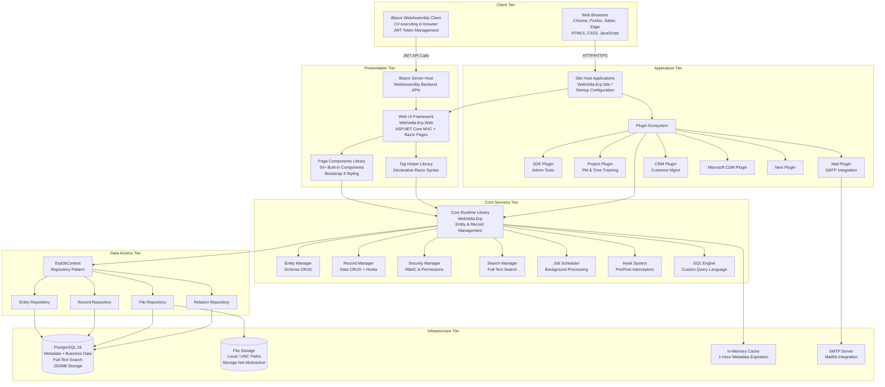
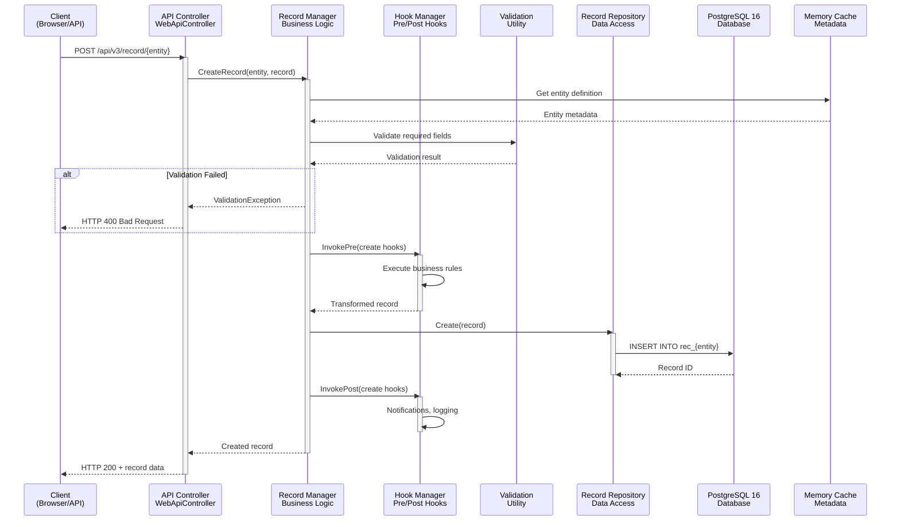
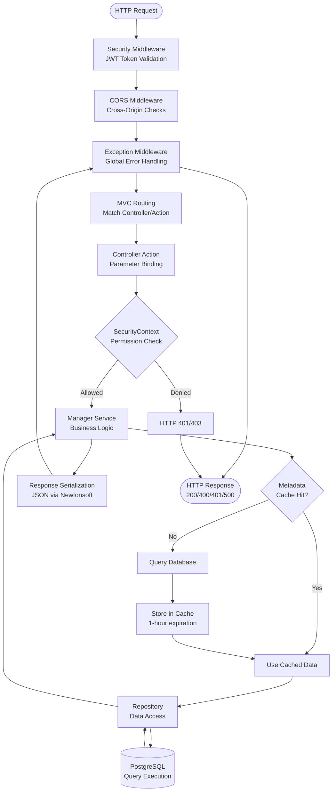
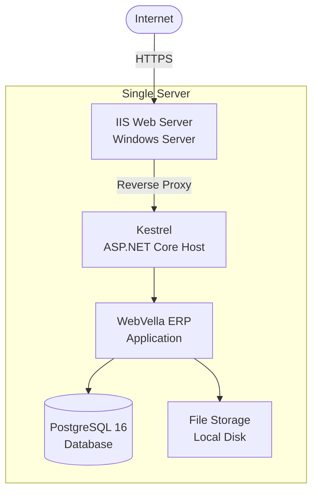
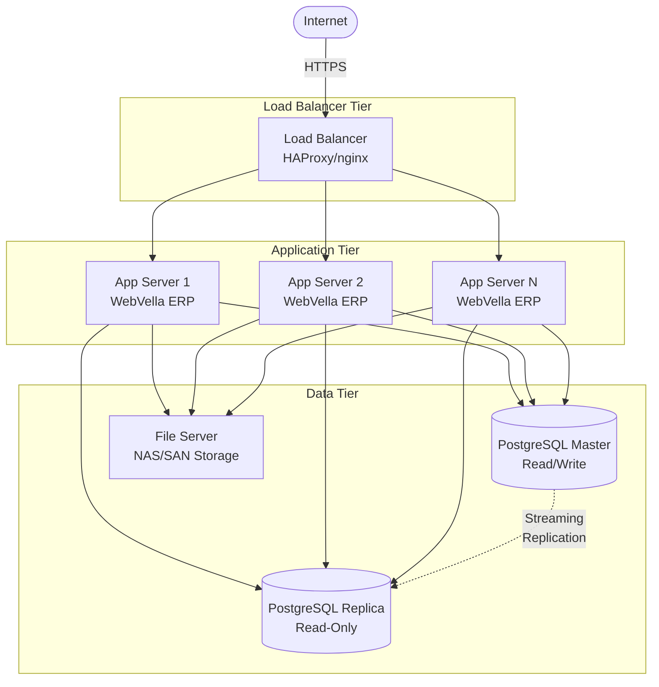

# WebVella ERP - System Architecture & Data Flow Documentation

**Generated:** 2024-11-20 UTC  
**Repository:** https://github.com/WebVella/WebVella-ERP  
**Analyzed Commit:** Current branch state  
**Documentation Suite:** Reverse Engineering Documentation  

---

## Executive Summary

WebVella ERP implements a **metadata-driven, plugin-extensible architecture** built on .NET 9.0, ASP.NET Core 9, and PostgreSQL 16. The system employs a layered architecture pattern with clear separation between core infrastructure, web presentation, plugin-based business logic, and client applications.

### Architectural Highlights

- **Metadata-Driven Design:** Entity definitions, field schemas, and UI pages stored as runtime metadata in PostgreSQL, enabling zero-compilation schema evolution
- **Plugin Architecture:** Modular business functionality through versioned plugin system with transactional migration patterns
- **Multi-Tier Layering:** Core → Web → Plugins → Site Hosts, with unidirectional dependencies ensuring architectural integrity
- **Cross-Platform Deployment:** Single codebase supports Windows and Linux hosting via .NET 9.0 runtime
- **Dual UI Strategy:** Traditional Razor Pages server-side rendering + Blazor WebAssembly SPA for rich client experiences

### Key Architectural Decisions

| Decision | Rationale | Trade-offs |
|----------|-----------|------------|
| **PostgreSQL Exclusive** | JSONB support for flexible schemas, full-text search, robust transactional DDL | No multi-database portability |
| **Metadata-First Design** | Runtime schema evolution without compilation | One-hour cache expiration for change propagation |
| **Plugin-Based Extensibility** | Modular business logic, independent deployment schedules | Plugin initialization complexity |
| **Repository Pattern** | Centralized data access, testability | Additional abstraction layer overhead |
| **Single Database Architecture** | Simplified operations, ACID guarantees | Limited horizontal database scaling |

---

## Component Architecture

### High-Level System Architecture



### Architectural Layers Explained

#### Layer 1: Client Tier

**Web Browsers:**
- Modern browsers supporting HTML5, CSS3, ES5+ JavaScript
- Bootstrap 4 responsive layouts for mobile/desktop compatibility
- No browser plugins or extensions required

**Blazor WebAssembly Client:**
- C# code compiled to WebAssembly, executes entirely in browser
- JWT token management with LocalStorage persistence
- Automatic token refresh prevents session expiration
- Progressive Web App (PWA) capabilities for offline scenarios

#### Layer 2: Presentation Tier

**Web UI Framework (WebVella.Erp.Web):**
- ASP.NET Core 9 MVC + Razor Pages for server-side rendering
- Component-based architecture with 50+ reusable page components
- Tag helper library provides declarative Razor syntax
- Bootstrap 4 styling with custom WebVella theme overrides

**Key Design Patterns:**
- **Component Lifecycle:** Design (configuration) → Options (parameter resolution) → Display (rendering)
- **Tag Helpers:** HTML-like syntax compiles to C# methods for type-safe rendering
- **View Models:** Strong typing between controllers and views via C# classes

#### Layer 3: Application Tier

**Site Host Applications:**
- Multiple site variants demonstrating different hosting configurations
- `Program.cs` defines application entry points
- `Startup.cs` configures ASP.NET Core middleware pipeline
- `Config.json` provides runtime settings (database, security, email)

**Plugin Ecosystem:**
- Each plugin inherits from `ErpPlugin` base class
- Versioned patch system for transactional schema migrations
- Plugins register entities, pages, components, hooks, jobs at startup
- Independent deployment schedules without core platform redeployment

**Plugin Responsibilities:**
- **SDK Plugin:** Administrative tools for entity/field/page management
- **Project Plugin:** Project and task management with time tracking
- **Mail Plugin:** SMTP email integration with queue processing
- **CRM Plugin:** Customer relationship management framework
- **CDM Plugin:** Microsoft Common Data Model integration
- **Next Plugin:** Next-generation features and experiments

#### Layer 4: Core Services Tier

**Core Runtime Library (WebVella.Erp):**
- Framework-agnostic business logic (no UI dependencies)
- Entity metadata management and runtime DDL generation
- Record CRUD operations with validation and hooks
- Security context propagation via AsyncLocal storage
- Background job scheduling with Ical.Net recurrence
- Hook system for extensibility (pre/post record operations)
- EQL (Entity Query Language) parsing and execution

**Manager Classes:**
- `EntityManager`: Entity and field metadata CRUD
- `RecordManager`: Record operations with transaction management
- `SecurityManager`: User, role, and permission management
- `SearchManager`: Full-text search with Bulgarian language support
- `ImportExportManager`: CSV import/export operations
- `JobManager`: Background job registration and execution
- `DataSourceManager`: Code and database data source abstraction

#### Layer 5: Data Access Tier

**Repository Pattern Implementation:**
- `ErpDbContext`: Centralized database connection management with nested transaction support
- Specialized repositories for entities, records, files, relationships
- Npgsql 9.0.4 client for PostgreSQL connectivity
- Connection pooling (MinPoolSize=1, MaxPoolSize=100)
- Command timeout: 120 seconds for long-running queries

**Repository Classes:**
- `DbEntityRepository`: Entity metadata persistence
- `DbRecordRepository`: Business data CRUD with parameterized SQL and dynamic query generation
- `DbFileRepository`: File metadata storage, binary content in file storage
- `DbRelationRepository`: Relationship management (1:1, 1:N, N:M)

**Architecture Deep Dive:**

**DbContext - Nested Transaction Management**

`DbContext.cs` implements a sophisticated nested transaction system using AsyncLocal for thread-safe context propagation:

- **AsyncLocal Context Storage**: Uses `AsyncLocal<DbContext>` to maintain per-async-flow context, ensuring thread safety across async/await operations
- **Nested Context Support**: Tracks nested contexts through a stack-based depth counter, allowing transaction nesting without conflict
- **Automatic Connection Management**: Creates and manages Npgsql connections with automatic disposal on context destruction
- **Singleton Access Pattern**: `Current` property provides access to the current async context's DbContext instance

**Evidence**: `WebVella.Erp/Database/DbContext.cs`

**DbConnection - True Nested Transactions with Savepoints**

`DbConnection.cs` provides true nested transaction support through PostgreSQL savepoints:

- **Savepoint-Based Nesting**: Each nested transaction level creates a uniquely named savepoint (`sp0`, `sp1`, `sp2`, etc.)
- **Stack Depth Tracking**: Maintains `stackDepth` counter to generate unique savepoint names and manage nested levels
- **Transactional Operations**:
  - `BeginTransaction()`: Creates root transaction or savepoint for nested levels
  - `CreateSavepoint()`: Explicitly creates named savepoints for fine-grained rollback control
  - `ReleaseSavepoint()`: Commits savepoint changes to parent transaction
  - `RollbackSavepoint()`: Rolls back to specific savepoint, preserving parent transaction
- **Automatic Cleanup**: Decrements stack depth on transaction commit/rollback to maintain consistency

**Evidence**: `WebVella.Erp/Database/DbConnection.cs`

**Transaction Lifecycle Example**:

```
DbContext.Current.BeginTransaction()           → BEGIN TRANSACTION (stackDepth=0)
  DbContext.Current.BeginTransaction()         → SAVEPOINT sp1 (stackDepth=1)
    DbContext.Current.CreateSavepoint()        → SAVEPOINT sp2 (stackDepth=2)
    DbContext.Current.ReleaseSavepoint()       → RELEASE SAVEPOINT sp2
  DbContext.Current.CommitTransaction()        → RELEASE SAVEPOINT sp1
DbContext.Current.CommitTransaction()          → COMMIT TRANSACTION
```

**DbRecordRepository - Dynamic SQL Generation**

`DbRecordRepository.cs` (2,098 lines) implements the repository pattern with sophisticated SQL generation:

- **Dynamic Query Building**: Constructs SQL queries at runtime based on entity metadata and query parameters
- **Field Type Mapping**: Maps 20+ field types to appropriate PostgreSQL data types and SQL generation strategies
- **Relational Data Handling**: 
  - Supports relationship traversal through JSON aggregation
  - Implements `QueryType.RELATED` and `QueryType.NOTRELATED` filtering (note: NOTRELATED not fully implemented)
  - Uses nested SELECT with JSON_AGG for one-to-many relationships
- **Parameter Binding**: All values parameterized to prevent SQL injection
- **Special Field Handling**:
  - File fields: Integration with `DbFileRepository` for binary content
  - Encrypted fields: Automatic encryption/decryption with Config.json EncryptionKey
  - Auto-number fields: Sequence generation and formatting
  - Geography fields: PostGIS or text-based storage with SRID support

**Critical Implementation Notes**:
- **Bug Identified**: Line 1996 contains `AddMonths(minuteOffset)` which should be `AddMinutes(minuteOffset)` for timezone conversion
- **Performance**: Uses `COUNT(*) OVER()` window function for pagination total counts without separate queries
- **Timezone Handling**: All datetime values converted to configured system timezone from UTC

**Evidence**: `WebVella.Erp/Database/DbRecordRepository.cs` (1,662 LOC)

#### Layer 6: Infrastructure Tier

**PostgreSQL 16:**
- Primary data store for metadata and business data
- JSONB columns for flexible schema storage
- Full-text search with to_tsquery/plainto_tsquery
- Transactional DDL for atomic schema modifications
- LISTEN/NOTIFY for real-time notifications

**File Storage:**
- Local file system or UNC network paths
- Storage.Net 9.3.0 abstraction layer
- Configuration-driven backend selection
- File metadata in PostgreSQL, binary content in storage

**Memory Cache:**
- Microsoft.Extensions.Caching.Memory v9.0.10
- 1-hour expiration for entity metadata
- Manual cache invalidation on schema changes
- Request-scoped caching for query results

**SMTP Server:**
- Optional email integration via MailKit 4.14.1
- Configuration in Config.json (server, port, credentials)
- Queue-based processing through background jobs

---

## Technology Stack Summary

### Runtime & Framework

| Component | Technology | Version | Purpose |
|-----------|-----------|---------|---------|
| **Application Framework** | ASP.NET Core | 9.0 | Web application hosting, MVC, Razor Pages |
| **Runtime** | .NET | 9.0 | Cross-platform execution environment (CLR + BCL) |
| **Language** | C# | 12 | Primary programming language (implicit with .NET 9) |
| **SDK** | .NET SDK | 9.0 | Build, compilation, NuGet restoration |
| **Web Server** | Kestrel | 9.0 (built-in) | Cross-platform HTTP server |
| **SPA Framework** | Blazor WebAssembly | 9.0.10 | Client-side C# execution in browser |

### Data Layer

| Component | Technology | Version | Purpose |
|-----------|-----------|---------|---------|
| **Database** | PostgreSQL | 16 | Primary data store for metadata and business data |
| **Database Client** | Npgsql | 9.0.4 | .NET PostgreSQL provider |
| **ORM Pattern** | Custom Repositories | N/A | Repository pattern with parameterized SQL |
| **File Storage** | Storage.Net | 9.3.0 | Multi-backend file storage abstraction |
| **Cache** | Microsoft.Extensions.Caching.Memory | 9.0.10 | In-memory metadata caching |

### Presentation Layer

| Component | Technology | Version | Purpose |
|-----------|-----------|---------|---------|
| **UI Framework** | Bootstrap CSS | 4.x | Responsive web design components |
| **View Engine** | Razor | 9.0 (built-in) | Server-side HTML templating |
| **Web Components** | StencilJS | Latest | Framework-agnostic custom elements |
| **Client Libraries** | jQuery, Moment.js, js-cookie | Various | Client-side utilities and interactivity |
| **Tag Helpers** | WebVella.TagHelpers | 1.7.2 | Custom Razor tag helper library |

### Core Dependencies

| Component | Technology | Version | Purpose |
|-----------|-----------|---------|---------|
| **JSON Serialization** | Newtonsoft.Json | 13.0.4 | JSON processing for APIs and configuration |
| **Object Mapping** | AutoMapper | 14.0.0 | DTO transformations |
| **CSV Processing** | CsvHelper | 33.1.0 | Import/export functionality |
| **Email** | MailKit + MimeKit | 4.14.1 | SMTP email sending |
| **Query Parser** | Irony.NetCore | 1.1.11 | EQL grammar parsing |
| **Scheduling** | Ical.Net | 4.3.1 | Recurrence pattern calculation |
| **HTML Processing** | HtmlAgilityPack | 1.12.4 | HTML parsing and manipulation |
| **Code Execution** | CS-Script + Roslyn | 4.11.2 + 4.14.0 | Runtime C# code compilation |

### Security & Authentication

| Component | Technology | Version | Purpose |
|-----------|-----------|---------|---------|
| **JWT Tokens** | System.IdentityModel.Tokens.Jwt | 8.14.0 | JWT creation and validation |
| **JWT Middleware** | Microsoft.AspNetCore.Authentication.JwtBearer | 9.0.10 | ASP.NET Core JWT authentication |
| **LocalStorage** | Blazored.LocalStorage | 4.5.0 | Browser storage for Blazor WebAssembly |

### Microsoft Extensions (v9.0.10)

- **Configuration:** Microsoft.Extensions.Configuration.Json
- **Dependency Injection:** Microsoft.Extensions.DependencyInjection (built-in)
- **Logging:** Microsoft.Extensions.Logging, .Logging.Console, .Logging.Debug
- **Hosting:** Microsoft.Extensions.Hosting.Abstractions
- **HTTP:** Microsoft.Extensions.Http
- **File Providers:** Microsoft.Extensions.FileProviders.Embedded

### Development & Build Tools

| Component | Technology | Version | Purpose |
|-----------|-----------|---------|---------|
| **IDE** | Visual Studio | 2022+ | Primary development environment |
| **Build System** | MSBuild + .NET CLI | 9.0 | Project compilation and packaging |
| **Library Manager** | LibMan | 3.0.71 | Client-side library acquisition |
| **TypeScript Compiler** | Microsoft.TypeScript.MSBuild | Latest | TypeScript to JavaScript transpilation |
| **Database Admin** | pgAdmin | Latest | PostgreSQL management |

---

## Key Component Details

### Entity Manager (WebVella.Erp/Api/EntityManager.cs)

**Purpose:** Runtime entity metadata management with automatic database schema generation.

**Responsibilities:**
- Create, read, update, delete entity definitions
- Manage field schemas across 20+ field types
- Define entity relationships (OneToOne, OneToMany, ManyToMany)
- Generate PostgreSQL tables dynamically (rec_{entity_name} convention)
- Validate entity/field constraints
- Cache entity metadata with 1-hour expiration

**Key Methods:**
- `CreateEntity(Entity entity)`: Creates entity definition and database table
- `UpdateEntity(Entity entity)`: Modifies entity metadata
- `DeleteEntity(Guid entityId)`: Removes entity and associated data
- `ReadEntity(Guid entityId)`: Retrieves entity definition from cache
- `CreateField(Field field)`: Adds field to entity and alters table schema
- `UpdateField(Field field)`: Modifies field definition
- `DeleteField(Guid fieldId)`: Removes field from entity

**Caching Strategy:**
- Metadata cached in `ErpAppContext` singleton
- Cache key: `entity-{entityId}`
- Expiration: 1 hour (configurable)
- Manual invalidation via `EntityManager.lockObj` static lock

**Evidence:** `WebVella.Erp/Api/EntityManager.cs` (1,482 LOC)

### Record Manager (WebVella.Erp/Api/RecordManager.cs)

**Purpose:** Business data CRUD operations with validation, hooks, and transaction management.

**Responsibilities:**
- Create, read, update, delete records across all entities
- Execute pre/post record hooks for extensibility
- Field-level validation against entity definitions
- Relationship management (populate foreign keys, junction tables)
- File attachment handling via DbFileRepository
- Permission checks via SecurityContext
- Transaction coordination for data consistency

**Key Methods:**
- `CreateRecord(string entityName, Dictionary<string,object> record)`: Inserts record with validation
- `GetRecord(string entityName, Guid recordId)`: Retrieves single record
- `UpdateRecord(string entityName, Guid recordId, Dictionary<string,object> record)`: Updates existing record
- `DeleteRecord(string entityName, Guid recordId)`: Deletes record with cascade handling
- `Find(string entityName, QueryObject query)`: Executes filtered queries with pagination

**Hook Integration:**
- `RecordHookManager.InvokePre()`: Validation and transformation before persistence
- `RecordHookManager.InvokePost()`: Side effects and notifications after persistence

**Evidence:** `WebVella.Erp/Api/RecordManager.cs` (1,743 LOC)

### Security Manager (WebVella.Erp/Api/SecurityManager.cs)

**Purpose:** Authentication, authorization, and security context management.

**Responsibilities:**
- User authentication with password hashing
- JWT token generation and validation
- Role-based access control (RBAC)
- Entity-level permissions (Read, Create, Update, Delete)
- Record-level permission enforcement
- SecurityContext AsyncLocal propagation
- Password encryption with configurable key

**Security Models:**
- **Role:** User group with associated permissions
- **User:** Authentication identity with role memberships
- **EntityPermission:** Per-entity CRUD permissions by role
- **RecordPermissions:** Per-record access control lists

**System Roles:**
- **Administrator:** Full system access (BDC56420-CAF0-4030-8A0E-D264938E0CDA)
- **Regular:** Standard user access (F16EC6DB-626D-4C27-8DE0-3E7CE542C55F)
- **Guest:** Limited read-only access (987148B1-AFA8-4B33-8616-55861E5FD065)

**Evidence:** `WebVella.Erp/Api/SecurityManager.cs`

### Security Context (WebVella.Erp/Api/SecurityContext.cs)

**Purpose:** Thread-safe user context propagation through async operations.

**Implementation:**
- AsyncLocal<SecurityContext> storage for execution context isolation
- OpenScope(User user): Sets current user context
- OpenSystemScope(): Elevates to system-level permissions (bypasses checks)
- HasEntityPermission(Entity entity, EntityPermission permission): Permission check
- HasMetaPermission(): System-level operation authorization

**Usage Pattern:**
```csharp
using (SecurityContext.OpenScope(currentUser))
{
    // All operations in this scope use currentUser's permissions
    var record = recordManager.GetRecord("customer", recordId);
}
```

**Evidence:** `WebVella.Erp/Api/SecurityContext.cs`

### EQL Engine (WebVella.Erp/Eql/)

**Purpose:** Custom Entity Query Language parsing and SQL translation.

**Components:**
- `EqlGrammar`: Irony-based grammar definition (BNF rules)
- `EqlBuilder`: Parser for EQL strings to abstract syntax tree (AST)
- `EqlCommand`: Executes parsed queries against PostgreSQL
- `EqlAbstractTree`: AST representation of parsed query

**EQL Features:**
- Entity-aware querying without explicit JOIN syntax
- Relationship navigation via `$relation` and `$$` operators
- Parameter binding with `@param` syntax
- Pagination with PAGE and PAGESIZE keywords
- Sorting with ORDER BY clause

**Example EQL Query:**
```sql
SELECT id, name, $account.name 
FROM contact 
WHERE email = @userEmail 
ORDER BY created_on DESC 
PAGE 1 PAGESIZE 50
```

**Evidence:** `WebVella.Erp/Eql/` folder with multiple parser files

### Job Scheduler (WebVella.Erp/Jobs/)

**Purpose:** Background task scheduling with recurrence patterns and persistent results.

**Components:**
- `JobManager`: Job registration and execution coordination
- `ScheduleManager`: Recurrence pattern management using Ical.Net
- `ErpBackgroundServices`: ASP.NET Core BackgroundService adapter
- `ErpJob`: Base class for all job implementations

**Job Architecture:**
- Reflection-based discovery via `[Job]` attribute
- Schedule plans define daily, weekly, monthly recurrence
- Job pool with fixed thread count for concurrent execution
- Job results serialized to database with TypeNameHandling.All
- Execution cycle: Check every minute for due jobs

**Example Job:**
```csharp
[Job("clear-logs", "Clear Old Logs", allowSingleInstance: true, defaultPriority: JobPriority.Medium)]
public class ClearJobAndErrorLogsJob : ErpJob
{
    public override void Execute(JobContext context)
    {
        // Job implementation
    }
}
```

**Evidence:** `WebVella.Erp/Jobs/` folder, multiple job implementations in plugins

### Hook System (WebVella.Erp/Hooks/)

**Purpose:** Extensibility through pre/post operation interception.

**Hook Types:**
- **Record Hooks:** Pre/post create, update, delete
- **Page Hooks:** Request preprocessing, response post-processing
- **Render Hooks:** Dynamic UI component injection

**Hook Interfaces:**
- `IErpPreCreateRecordHook`: Validation before record creation
- `IErpPostCreateRecordHook`: Side effects after record creation
- `IErpPreUpdateRecordHook`: Validation before record update
- `IErpPostUpdateRecordHook`: Side effects after record update
- `IErpPreDeleteRecordHook`: Validation before record deletion
- `IErpPostDeleteRecordHook`: Side effects after record deletion

**Hook Registration:**
```csharp
[Hook]
[HookAttachment(entityName: "customer")]
public class CustomerValidationHook : IErpPreCreateRecordHook
{
    public void OnPreCreateRecord(string entityName, EntityRecord record)
    {
        // Validation logic
    }
}
```

**Evidence:** `WebVella.Erp/Hooks/` folder

---

## Data Flow Diagrams

### Entity CRUD Data Flow



**Flow Description:**

1. **Request Reception:** Client submits record creation request to REST API
2. **Entity Metadata Retrieval:** Record Manager fetches entity definition from cache
3. **Field Validation:** Required fields, data types, constraints validated
4. **Pre-Create Hooks:** Business rules execute before database persistence
5. **Database Insertion:** Parameterized SQL INSERT via Npgsql
6. **Post-Create Hooks:** Notifications, audit logs, derived data updates
7. **Response:** Created record with generated ID returned to client

**Performance Characteristics:**
- Cache hit eliminates entity metadata query (~10ms saved)
- Hook execution adds 50-200ms depending on complexity
- Database insertion typically <50ms for simple entities
- Total latency: 100-500ms for typical record creation

### API Request Processing Flow



**Flow Description:**

1. **Middleware Pipeline:** Request passes through security, CORS, exception handling
2. **Routing:** URL pattern matched to controller and action method
3. **Authorization:** SecurityContext validates user permissions
4. **Business Logic:** Manager classes orchestrate operations
5. **Caching:** Metadata cache checked before database queries
6. **Data Access:** Repository pattern executes parameterized SQL
7. **Serialization:** Response object serialized to JSON
8. **Response:** HTTP response with status code and payload

**Error Handling:**
- JWT validation failures → 401 Unauthorized
- Permission checks → 403 Forbidden
- Validation errors → 400 Bad Request
- Unhandled exceptions → 500 Internal Server Error

### Plugin Lifecycle Execution Flow

```mermaid
flowchart TD
    Startup[Application Startup<br/>Program.cs] --> InitPlugins[ErpService.InitializePlugins]
    
    InitPlugins --> Scan[Assembly Scanning<br/>Reflect ErpPlugin Subclasses]
    Scan --> Discover[Plugin Discovery<br/>Create Plugin Instances]
    
    Discover --> Sort[Sort by Dependencies<br/>Topological Order]
    Sort --> LoopStart{For Each<br/>Plugin}
    
    LoopStart --> Initialize[Plugin.Initialize<br/>IServiceProvider]
    Initialize --> CheckVersion{Plugin Version<br/>Match DB?}
    
    CheckVersion -->|Match| Skip[Skip Migration]
    CheckVersion -->|Mismatch| ProcessPatches[Plugin.ProcessPatches<br/>Sequential Execution]
    
    ProcessPatches --> BeginTx[Begin Transaction]
    BeginTx --> PatchLoop{For Each<br/>Patch Method}
    
    PatchLoop --> ExecutePatch[Execute Patch<br/>Entity/Field/Page Setup]
    ExecutePatch --> PatchLoop
    
    PatchLoop -->|All Done| UpdateVersion[Update plugin_data<br/>Store New Version]
    UpdateVersion --> CommitTx[Commit Transaction]
    
    CommitTx --> Skip
    Skip --> RegisterJobs[Register Jobs<br/>[Job] Attribute Scan]
    RegisterJobs --> RegisterHooks[Register Hooks<br/>[Hook] Attribute Scan]
    RegisterHooks --> RegisterComponents[Register Components<br/>[PageComponent] Scan]
    RegisterComponents --> RegisterRoutes[Register Routes<br/>Plugin Page Paths]
    
    RegisterRoutes --> PluginReady[Plugin Active]
    PluginReady --> LoopStart
    
    LoopStart -->|All Plugins| AppReady[Application Ready<br/>Accept Requests]
    
    BeginTx -->|Error| Rollback[Rollback Transaction]
    Rollback --> LogError[Log Error<br/>system_log]
    LogError --> Fail[Startup Failure]
```

**Flow Description:**

1. **Plugin Discovery:** Assembly scanning identifies all ErpPlugin subclasses
2. **Dependency Ordering:** Plugins sorted by inter-plugin dependencies
3. **Initialization:** Each plugin's Initialize method invoked with DI container
4. **Version Check:** Compare plugin version with stored database version
5. **Migration Execution:** ProcessPatches runs sequential migration methods
6. **Transactional Semantics:** All patches execute in single transaction
7. **Component Registration:** Jobs, hooks, components discovered via reflection
8. **Route Registration:** Plugin pages integrated into MVC routing table

**Migration Pattern:**
```csharp
public class ProjectPlugin : ErpPlugin
{
    [Patch("20190203")]
    public void Patch20190203()
    {
        // Create entities, fields, relationships
        // All DDL operations in transaction
    }
    
    [Patch("20190222")]
    public void Patch20190222()
    {
        // Incremental schema changes
    }
}
```

**Evidence:** Plugin initialization code in all plugin projects

---

## Integration Architecture

### PostgreSQL Integration

**Connection Management:**
- Connection string in `Config.json`
- Npgsql 9.0.4 provider for .NET connectivity
- Connection pooling: MinPoolSize=1, MaxPoolSize=100
- Command timeout: 120 seconds for long queries

**Database Usage Patterns:**

| Pattern | Technology | Example |
|---------|-----------|---------|
| **Metadata Storage** | JSONB columns | Entity definitions, field schemas, page configurations |
| **Business Data** | Relational tables | rec_{entity_name} pattern with typed columns |
| **Full-Text Search** | to_tsquery/plainto_tsquery | Bulgarian language analyzer support |
| **Transactional DDL** | BEGIN/COMMIT/ROLLBACK | Schema modifications in plugin patches |
| **Pub/Sub** | LISTEN/NOTIFY | Real-time notifications (NotificationContext.cs) |
| **Referential Integrity** | Foreign keys | Relationship enforcement at database level |

**Schema Conventions:**
- System tables: `entity`, `field`, `relation`, `user`, `role`, `system_log`
- Entity tables: `rec_{entity_name}` (e.g., `rec_customer`)
- Junction tables: `nm_{relation_name}` for many-to-many relationships
- Audit tables: Optional per-entity audit trail storage

**Evidence:** `WebVella.Erp/Database/DbContext.cs`, `WebVella.Erp/Database/DbRepository.cs`

### File Storage Integration

**Storage Abstraction:**
- Storage.Net 9.3.0 library provides multi-backend support
- Configuration-driven backend selection in Config.json
- File metadata in PostgreSQL, binary content in storage

**Supported Backends:**
- **Local File System:** Direct disk access via System.IO
- **UNC Network Paths:** Centralized file server access (e.g., `\\192.168.0.2\Share\erp3-files`)
- **Future:** Cloud storage (AWS S3, Azure Blob) via Storage.Net plugins

**File Operations:**
- **Upload:** Multipart form data → save binary → store path in FileField
- **Download:** GET /file/{id} → permission check → stream from storage
- **Deletion:** Remove file metadata → delete binary from storage
- **Caching:** If-Modified-Since HTTP headers for browser cache

**Evidence:** `WebVella.Erp/Database/DbFileRepository.cs`, `Config.json` FileSystemStorageFolder

### SMTP Email Integration

**MailKit Integration:**
- MailKit 4.14.1 + MimeKit for SMTP communication
- Configuration in Config.json: server, port, credentials, SSL
- Queue-based processing via background job (ProcessSmtpQueueJob)

**Email Queue Architecture:**
- Email entity stores pending messages with priority
- ProcessSmtpQueueJob runs every 10 minutes
- HTML with inline CSS via HtmlAgilityPack
- Attachment support via DbFileRepository
- Retry logic for failed sends

**Configuration Example:**
```json
{
  "EmailEnabled": true,
  "EmailSMTPServerName": "smtp.example.com",
  "EmailSMTPPort": 587,
  "EmailSMTPUsername": "notifications@example.com",
  "EmailSMTPPassword": "encrypted_password",
  "EmailSMTPSslEnabled": true
}
```

**Evidence:** `WebVella.Erp.Plugins.Mail/` plugin folder

### Blazor WebAssembly Integration

**Client-Server Architecture:**
- Blazor client executes C# in browser via WebAssembly
- Server provides API endpoints for data operations
- Shared project defines DTOs used by both client and server

**Authentication Flow:**
1. User submits credentials to `/v3/en_US/auth/jwt/` endpoint
2. Server validates and generates JWT token
3. Client stores token in LocalStorage (Blazored.LocalStorage)
4. Client includes token in Authorization header for API calls
5. Automatic token refresh using token_refresh_after claim

**API Communication:**
- IApiService abstraction for HTTP client
- GetAuthorizedHttpClientAsync injects Authorization header
- Base URL configured in appsettings.json
- Error handling with user-friendly messages

**Evidence:** `WebVella.Erp.WebAssembly/` project structure

---

## Deployment Architecture

### Single-Server Deployment



**Characteristics:**
- Suitable for development and small-scale production (< 50 concurrent users)
- All components on single Windows or Linux server
- IIS optional (Kestrel can run standalone)
- PostgreSQL on same host or localhost connection
- File storage on local disk or mounted share

### Multi-Server Deployment



**Characteristics:**
- Suitable for high availability and horizontal scaling
- Multiple application servers behind load balancer
- Shared database (PostgreSQL streaming replication)
- Centralized file storage (NAS/SAN or cloud)
- Metadata cache synchronization via 1-hour expiration

**Limitations:**
- Database writes do not scale horizontally
- Cache staleness window up to 1 hour across app servers
- No distributed cache (Redis/Memcached) integration

---

## Performance Considerations

### Caching Strategy

**Metadata Cache:**
- Entity definitions cached in memory for 1 hour
- Field schemas cached with entity
- Relationship metadata cached
- Manual cache clear for immediate propagation
- Cache key format: `entity-{entityId}`

**Query Optimization:**
- EQL queries translate to parameterized SQL (prevents injection)
- Relationship navigation generates LEFT JOIN clauses
- Pagination via OFFSET/LIMIT clauses
- Full-text search via PostgreSQL GIN indexes

**Connection Pooling:**
- Npgsql connection pool reduces connection overhead
- MinPoolSize maintains warm connections
- MaxPoolSize prevents database overload
- Connection recycling on idle timeout

### Scalability Patterns

**Vertical Scaling (Primary Strategy):**
- Add CPU cores for increased concurrent request processing
- Add RAM for larger metadata cache
- Increase database server resources (CPU, RAM, IOPS)

**Horizontal Scaling (Limited):**
- Multiple application servers share database
- Load balancer distributes requests
- Stateless application design (no server affinity required)
- Database tier does not scale horizontally

**Bottlenecks:**
- Single PostgreSQL master for all writes
- Metadata cache synchronization delay (1 hour)
- Connection pool exhaustion at high concurrency

---

## Monitoring & Observability

### Built-In Logging

**system_log Table:**
- Application-level event logging
- Job execution results
- Error tracking with stack traces
- Audit trail for security events

**PostgreSQL Logs:**
- Slow query log for performance tuning
- Connection tracking
- Error diagnostics

### Recommended Monitoring

**Application Metrics:**
- Request rate and latency (via APM tools)
- Error rate and exception types
- Active user count
- Connection pool utilization

**Database Metrics:**
- Query performance (pg_stat_statements)
- Connection count and pool health
- Cache hit ratio
- Table and index sizes

**Infrastructure Metrics:**
- CPU and memory utilization
- Disk I/O and space
- Network bandwidth
- Service availability

**Tools:** Application Insights, Prometheus, Grafana, pgAdmin, custom dashboards

---

## Security Architecture

### Authentication Mechanisms

**JWT Token-Based:**
- Token generation on successful login
- Configurable token lifetime in Config.json
- Claims include user ID, roles, permissions
- Automatic refresh using token_refresh_after claim
- Token stored in LocalStorage (Blazor) or cookies (Razor)

**Cookie Authentication:**
- Traditional web app authentication
- Sliding expiration based on activity
- HttpOnly cookies for XSS mitigation
- Secure flag for HTTPS enforcement

### Authorization Model

**Role-Based Access Control (RBAC):**
- Users assigned to multiple roles
- Roles grant entity-level permissions
- Permission types: Read, Create, Update, Delete

**Entity-Level Permissions:**
- RecordPermissions contain role lists per operation
- SecurityContext validates user roles against entity permissions
- Permission denied returns HTTP 403 Forbidden

**Record-Level Permissions:**
- Fine-grained access control per record
- Optional implementation for sensitive entities
- Overrides entity-level permissions

**Field-Level Security:**
- PasswordField encryption with Config.json EncryptionKey
- Encrypted fields never return plain values in API responses
- Field permissions filter read operations

### Security Context Propagation

**AsyncLocal Storage:**
- Thread-safe user context across async operations
- OpenScope(User user) sets current user
- OpenSystemScope() elevates to system permissions
- HasEntityPermission() validates operations
- Context cleared after request completion

**Evidence:** `WebVella.Erp/Api/SecurityContext.cs`

---

## Appendix A: Component File Mapping

| Component | Primary Files | LOC | Evidence |
|-----------|--------------|-----|----------|
| **Entity Manager** | EntityManager.cs | 1,482 | WebVella.Erp/Api/ |
| **Record Manager** | RecordManager.cs | 1,743 | WebVella.Erp/Api/ |
| **Security Manager** | SecurityManager.cs | ~800 | WebVella.Erp/Api/ |
| **Search Manager** | SearchManager.cs | ~600 | WebVella.Erp/Api/ |
| **Job Manager** | JobManager.cs, ScheduleManager.cs | ~1,000 | WebVella.Erp/Jobs/ |
| **Hook Manager** | RecordHookManager.cs | ~500 | WebVella.Erp/Hooks/ |
| **EQL Engine** | EqlBuilder.cs, EqlCommand.cs | ~2,000 | WebVella.Erp/Eql/ |
| **Database Context** | DbContext.cs | ~800 | WebVella.Erp/Database/ |
| **Record Repository** | DbRecordRepository.cs | 1,662 | WebVella.Erp/Database/ |
| **Web API Controller** | WebApiController.cs | 3,645 | WebVella.Erp.Web/Controllers/ |
| **Page Service** | PageService.cs | 1,408 | WebVella.Erp.Web/Services/ |

---

## Appendix B: Glossary

**Metadata-Driven:** Runtime entity definitions stored in database, enabling schema changes without code deployment.

**Plugin:** Extensibility module inheriting from ErpPlugin with versioned migration patches.

**Entity:** Metadata-defined data structure (analogous to database table).

**Field:** Column definition within an entity with type, constraints, and default values.

**Record:** Instance of an entity (analogous to database row).

**Manager:** Service layer class orchestrating business logic (EntityManager, RecordManager).

**Repository:** Data access layer implementing repository pattern with parameterized SQL.

**Hook:** Pre/post operation interceptor for business logic injection.

**Job:** Background task with schedule plan for automated execution.

**EQL:** Entity Query Language, custom SQL-like syntax for entity-aware queries.

**Patch:** Versioned migration method within plugin for transactional schema changes.

**SecurityContext:** AsyncLocal user context for thread-safe permission propagation.

**RecordPermissions:** Entity-level access control lists specifying roles for CRUD operations.

---

**End of Architecture & Data Flow Documentation**

