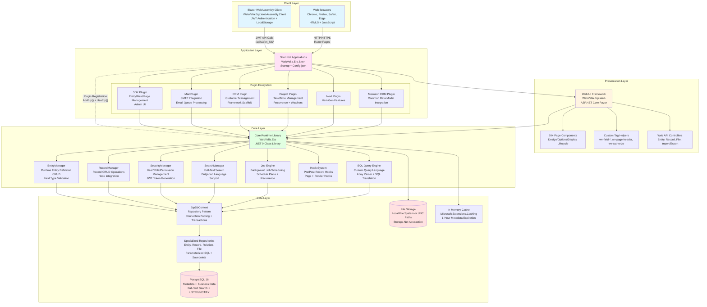
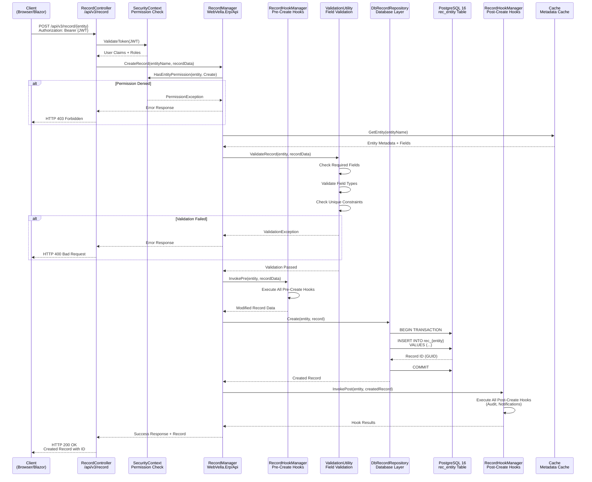
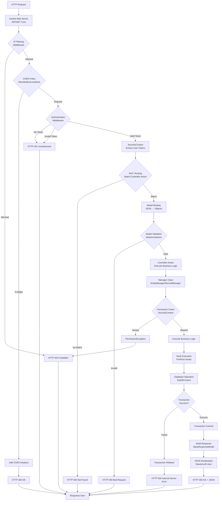

# System Architecture & Data Flow Documentation

**Generated**: 2024-11-18 UTC  
**Repository**: https://github.com/WebVella/WebVella-ERP  
**WebVella ERP Version**: 1.7.4  
**Analysis Scope**: Complete system architecture including core libraries, web UI framework, plugin ecosystem, and client applications

---

## Table of Contents

1. [Executive Summary](#executive-summary)
2. [Component Architecture](#component-architecture)
3. [Technology Stack Summary](#technology-stack-summary)
4. [Key Components](#key-components)
5. [Data Flow Diagrams](#data-flow-diagrams)
6. [Integration Architecture](#integration-architecture)
7. [References](#references)

---

## Executive Summary

WebVella ERP implements a **metadata-driven entity architecture with plugin extensibility**, enabling rapid business application development through runtime schema management without code deployment. The system's core architectural philosophy centers on storing all entity definitions, field schemas, relationships, pages, and application configurations as metadata in PostgreSQL, which the platform reads at runtime to dynamically construct database tables, validation rules, and user interfaces.

### Architectural Foundation

The platform is built on **.NET 9**, **ASP.NET Core 9**, and **PostgreSQL 16**, leveraging modern cross-platform technologies that enable deployment on both Windows (Windows 10, Server 2012+) and Linux operating systems. This technology foundation provides:

- **Runtime Entity Management**: Entities created through the SDK plugin UI take effect immediately without compilation or application restart
- **Plugin-Based Extensibility**: Business functionality delivered through plugins (SDK, Mail, CRM, Project, Next, MicrosoftCDM) that share common infrastructure while maintaining isolated namespaces
- **Multi-Tier Architecture**: Clear separation between Core (business logic), Web (UI framework), and Site Hosts (composition layer)
- **Metadata Caching**: One-hour metadata cache duration balances performance with change propagation across multi-server deployments

### Five-Layer Architecture Pattern

The system decomposes into five distinct architectural layers:

1. **Client Layer**: Web browsers (Chrome, Firefox, Safari, Edge) and Blazor WebAssembly client executing .NET code via WebAssembly runtime
2. **Presentation Layer**: ASP.NET Core Razor view engine, Bootstrap 4 CSS framework, custom tag helpers, and StencilJS web components
3. **Application Layer**: Site host applications (WebVella.Erp.Site.*) composing plugins into deployed applications
4. **Core Layer**: Core runtime library (WebVella.Erp) containing entity management, record operations, security, job scheduling, EQL query engine, and hook system
5. **Data Layer**: PostgreSQL 16 database accessed through Npgsql with custom repository pattern, plus local/UNC file storage

This layered architecture enables:

- **Reusability**: Core library operates independently in console applications, services, or web hosts
- **Testability**: Each layer can be tested in isolation with appropriate mocking
- **Scalability**: Application tier scales horizontally while database tier scales vertically
- **Maintainability**: Clear boundaries reduce coupling and enable parallel development

### Key Architectural Characteristics

**Metadata-Driven Design**: All system definitions persist as metadata rather than compiled code, eliminating traditional development cycles for schema changes and enabling non-technical administrators to evolve data structures through the SDK plugin UI.

**Plugin-Based Extensibility**: The plugin architecture provides modular functionality where each plugin inherits from the `ErpPlugin` base class, implements version-based patches for transactional schema migrations, and automatically integrates into the host application's middleware pipeline.

**Repository Pattern**: The `ErpDbContext` implements repository pattern with specialized repositories for entities, records, relationships, and files, centralizing connection management, transaction handling, and query construction.

**Convention-Based Discovery**: Attribute-driven discovery using `[Hook]`, `[DataSource]`, `[Job]`, and component base classes eliminates manual registration code and enables plugins to seamlessly contribute functionality.

---

## Component Architecture

The following diagram illustrates the complete system architecture showing all major subsystems, their relationships, and data flow patterns:



### Architecture Layer Descriptions

**Client Layer**: 
- **Web Browsers**: Standard HTML5-capable browsers access Razor-rendered pages and interact with API endpoints
- **Blazor WebAssembly**: .NET 9 code compiled to WebAssembly executes in browser, communicating with server via JWT-authenticated API calls with LocalStorage token persistence

**Presentation Layer**:
- **Web UI Framework**: ASP.NET Core Razor engine renders server-side HTML with C# code integration
- **50+ Page Components**: Reusable UI components following Design (configuration schema), Options (parameter resolution), Display (rendering) lifecycle
- **Custom Tag Helpers**: Declarative Razor syntax (wv-field-*, wv-page-header) for component invocation with IntelliSense support
- **Web API Controllers**: RESTful endpoints for entity management, record operations, file handling, and CSV import/export

**Application Layer**:
- **Site Host Applications**: Compose final deployable applications by selecting plugins, configuring services via Config.json, and defining hosting model (Kestrel, IIS)
- **Plugin Ecosystem**: Six business functionality plugins (SDK, Mail, CRM, Project, Next, MicrosoftCDM) extending platform capabilities through shared infrastructure

**Core Layer**:
- **EntityManager**: Runtime entity definition CRUD with automatic PostgreSQL table generation (rec_ prefix convention)
- **RecordManager**: Entity instance CRUD operations with field validation, transaction management, and hook invocation
- **SecurityManager**: Authentication (JWT, cookies), authorization (RBAC), and SecurityContext propagation
- **Job Engine**: Background job scheduling with Ical.Net recurrence patterns and fixed-size thread pool execution
- **Hook System**: Pre/post record hooks, page hooks, and render hooks for business logic injection
- **EQL Engine**: Custom query language parsed via Irony framework, translated to PostgreSQL SQL with parameter binding

**Data Layer**:
- **ErpDbContext**: Repository pattern implementation with connection pooling (MinPoolSize=1, MaxPoolSize=100, CommandTimeout=120s)
- **PostgreSQL 16**: Primary data store for system metadata and business data with full-text search and LISTEN/NOTIFY capabilities
- **File Storage**: Binary content stored in local file system or UNC network paths via Storage.Net abstraction
- **In-Memory Cache**: Microsoft.Extensions.Caching with 1-hour metadata expiration balancing performance and change visibility

---

## Technology Stack Summary

The following table documents all major technologies, their versions, and architectural purposes:

| Layer | Technology | Version | Purpose |
|-------|-----------|---------|---------|
| **Runtime** | .NET | 9.0 | Cross-platform application runtime (CLR + BCL) enabling Windows/Linux deployment |
| **Web Framework** | ASP.NET Core | 9.0 | Web application hosting, MVC pattern, Razor Pages, dependency injection, middleware pipeline |
| **SPA Framework** | Blazor WebAssembly | 9.0.10 | Client-side C# execution via WebAssembly, eliminating JavaScript for business logic |
| **Database** | PostgreSQL | 16 | Primary data persistence for metadata and business data with JSONB, full-text search, referential integrity |
| **Database Client** | Npgsql | 9.0.4 | .NET PostgreSQL driver with connection pooling, prepared statements, binary protocol |
| **ORM Pattern** | Custom Repositories | N/A | Repository pattern with specialized implementations (EntityRepository, RecordRepository, FileRepository) |
| **Serialization** | Newtonsoft.Json | 13.0.4 | JSON serialization/deserialization for API responses, configuration, job data persistence |
| **Object Mapping** | AutoMapper | 14.0.0 | DTO-to-entity mapping eliminating boilerplate transformation code |
| **Email Integration** | MailKit / MimeKit | 4.14.1 | SMTP email sending with HTML support, attachments, modern OAuth2-capable mail client |
| **Query Parser** | Irony.NetCore | 1.1.11 | BNF grammar-based parser framework enabling Entity Query Language (EQL) custom syntax |
| **CSV Processing** | CsvHelper | 33.1.0 | CSV import/export with field mapping, type conversion, configurable delimiters |
| **Recurrence** | Ical.Net | 4.3.1 | iCalendar (RFC 5545) recurrence pattern processing for job scheduling (daily/weekly/monthly) |
| **File Storage** | Storage.Net | 9.3.0 | Multi-backend file storage abstraction supporting local file system and UNC network paths |
| **HTML Processing** | HtmlAgilityPack | 1.12.4 | HTML parsing and DOM manipulation for content sanitization and extraction |
| **Caching** | Microsoft.Extensions.Caching.Memory | 9.0.10 | In-memory cache for metadata with 1-hour expiration strategy |
| **Configuration** | Microsoft.Extensions.Configuration.Json | 9.0.10 | JSON-based configuration (Config.json) with strongly-typed binding |
| **Logging** | Microsoft.Extensions.Logging | 9.0.10 | Structured logging infrastructure with console and debug providers |
| **DI Container** | Microsoft.Extensions.DependencyInjection | 9.0.10 | Service lifetime management, constructor injection, scope management |
| **Authentication** | System.IdentityModel.Tokens.Jwt | 8.14.0 | JWT token creation, validation, parsing following RFC 7519 standard |
| **JWT Middleware** | Microsoft.AspNetCore.Authentication.JwtBearer | 9.0.10 | Bearer token authentication middleware with automatic token validation |
| **LocalStorage** | Blazored.LocalStorage | 4.5.0 | Browser LocalStorage access from Blazor WebAssembly for JWT token persistence |
| **CSS Framework** | Bootstrap | 4.x | Responsive grid system, UI components, utility classes for mobile-first design |
| **JavaScript Library** | jQuery | 3.x | DOM manipulation, AJAX communication, event handling in legacy components |
| **Code Execution** | CS-Script | 4.11.2 | Runtime C# script execution for dynamic business rules and calculations |
| **Code Analysis** | Microsoft.CodeAnalysis.* (Roslyn) | 4.14.0 | Runtime C# compilation enabling dynamic code generation and evaluation |
| **Image Processing** | System.Drawing.Common | 9.0.10 | Image manipulation, thumbnail generation for file attachment handling |

### Technology Version Alignment

All Microsoft packages maintain strict version consistency:
- **Microsoft.AspNetCore.*** packages: 9.0.10
- **Microsoft.Extensions.*** packages: 9.0.10
- **.NET Target Framework**: net9.0 (all projects)
- **C# Language Version**: 12 (implicit with .NET 9.0)

This version alignment ensures compatibility, security patch consistency, and access to latest framework optimizations.

---

## Key Components

### 4.1 EntityManager

**Location**: `WebVella.Erp/Api/EntityManager.cs`  
**Purpose**: Runtime entity definition CRUD operations with automatic PostgreSQL table generation  
**Responsibilities**:

- **Entity Creation**: Validate entity name uniqueness (63-character PostgreSQL limit), generate GUID identifier, execute CREATE TABLE DDL with "rec_" prefix (e.g., "customer" → "rec_customer")
- **Field Management**: Support 20+ field types (Text, Number, Date, DateTime, Currency, GUID, HTML, File, Email, Phone, URL, Checkbox, MultiSelect, Dropdown, AutoNumber, Percent, Geography), validate field name uniqueness per entity, enforce PostgreSQL identifier length limits
- **Relationship Management**: OneToOne, OneToMany, ManyToMany relationships with bidirectional navigation, automatic foreign key constraint creation, junction table generation for ManyToMany
- **Runtime Schema Modification**: ALTER TABLE operations for field additions/modifications without application restart, validation against existing data to prevent breaking changes
- **Metadata Caching**: 1-hour cache expiration with manual invalidation support, thread-safe operations using static locks

**Integration Points**:
- SecurityContext for permission validation (requires Administrator role)
- ErpDbContext for database operations
- Cache for metadata persistence

### 4.2 RecordManager

**Location**: `WebVella.Erp/Api/RecordManager.cs`  
**Purpose**: Entity instance CRUD operations with comprehensive validation and hook integration  
**Responsibilities**:

- **Record Creation**: Field-level validation against entity definitions, default value application for missing optional fields, pre-create hook execution before database insertion, post-create hook execution after successful persistence, SecurityContext permission checks (EntityPermission.Create)
- **Record Retrieval**: Permission-filtered results based on SecurityContext, relationship field expansion when requested, field selection for performance optimization, pagination support for large result sets
- **Record Update**: Only modified fields updated in database, field validation against current entity definition, pre-update and post-update hook execution, optimistic concurrency through timestamp fields, audit trail with modification timestamp and user
- **Record Deletion**: Pre-delete hook execution before deletion, cascade configuration respected for relationships (None, Delete, SetNull), referential integrity enforcement, post-delete hooks after successful deletion, file attachment removal from storage when configured
- **Bulk Operations**: Multiple records processed in single transaction with all-or-nothing semantics, individual record validation with detailed error reporting, performance optimization through batch SQL, hook execution for each record

**Integration Points**:
- RecordHookManager for pre/post operation hooks
- DbRecordRepository for database operations
- DbFileRepository for file attachment handling
- SecurityContext for permission enforcement
- ValidationUtility for field validation

### 4.3 SecurityManager

**Location**: `WebVella.Erp/Api/SecurityManager.cs`  
**Purpose**: Comprehensive security subsystem managing authentication, authorization, and access control  
**Responsibilities**:

- **User Management**: Password hashing with secure algorithm, account lockout after failed login attempts, user profile CRUD operations
- **Role-Based Access Control**: System roles (Administrator: BDC56420-CAF0-4030-8A0E-D264938E0CDA, Regular: F16EC6DB-626D-4C27-8DE0-3E7CE542C55F, Guest: 987148B1-AFA8-4B33-8616-55861E5FD065), many-to-many user-role relationships, role membership validation on each request
- **Entity-Level Permissions**: EntityPermission enum (Read, Create, Update, Delete), RecordPermissions contain role GUID lists for each operation, SecurityContext.HasEntityPermission checks user roles against entity permissions
- **JWT Token Management**: Token generation with configurable lifetime from Config.json (Jwt.Key, Jwt.Issuer, Jwt.Audience), token contains user claims including roles, automatic token refresh using token_refresh_after claim, token validation on each API request
- **Password Encryption**: EncryptionKey from Config.json (64-character hexadecimal), secure encryption for PasswordField types, encrypted fields never return plain values in API responses

**Integration Points**:
- SecurityContext (AsyncLocal propagation)
- Config.json for JWT and encryption configuration
- All Manager classes for permission checks

### 4.4 DbContext (ErpDbContext)

**Location**: `WebVella.Erp/Database/DbContext.cs`  
**Purpose**: Database connection management, transaction coordination, and repository pattern implementation  
**Responsibilities**:

- **Connection Management**: Singleton pattern with async-local storage for thread-safe access, connection pooling (MinPoolSize=1, MaxPoolSize=100 from Config.json), 120-second command timeout for long-running queries
- **Transaction Handling**: BeginTransaction for atomic operations, CreateSavepoint for nested transaction points, ReleaseSavepoint for checkpoint commits, automatic rollback on exceptions
- **Repository Coordination**: DbRecordRepository for entity record operations, DbEntityRepository for metadata operations, DbRelationRepository for relationship management, DbFileRepository for file storage operations
- **Query Execution**: Parameterized SQL to prevent injection attacks, binary protocol for performance, prepared statements for repeated queries

**Configuration Example**:
```json
"ConnectionStrings": {
  "Default": "Server=192.168.0.190;Port=5436;User Id=test;Password=test;Database=erp3;Pooling=true;MinPoolSize=1;MaxPoolSize=100;CommandTimeout=120;"
}
```

**Integration Points**:
- All Manager classes for database access
- Npgsql for PostgreSQL connectivity
- Config.json for connection string configuration

### 4.5 JobManager and ScheduleManager

**Location**: `WebVella.Erp/Jobs/JobManager.cs`, `ScheduleManager.cs`  
**Purpose**: Background job scheduling, execution, and result persistence  
**Responsibilities**:

**JobManager**:
- Reflection-based job discovery using `[Job]` attribute
- ErpJob base class with Execute(JobContext) signature
- Fixed-size thread pool (JobPool) for concurrent execution
- Job result persistence with TypeNameHandling.All serialization
- Exception handling with automatic retries (3 attempts with exponential backoff)
- system_log integration for monitoring
- Execution cycle checks every minute

**ScheduleManager**:
- Schedule plan management with Ical.Net integration
- Daily recurrence: specific time of day
- Weekly recurrence: days of week and time
- Monthly recurrence: day of month and time
- Next execution time calculation using iCalendar RRULE format
- CreateSchedulePlan and GetSchedulePlan APIs

**Example Jobs**:
- ClearJobAndErrorLogsJob (SDK plugin): Clears old logs on schedule
- ProcessSmtpQueueJob (Mail plugin): Email queue processing every 10 minutes
- StartTasksOnStartDate (Project plugin): Task status automation daily at 00:00:02 UTC

**Integration Points**:
- Config.json (EnableBackgroungJobs setting)
- BackgroundService for hosted service execution
- Ical.Net for recurrence pattern processing

### 4.6 HookManager and RecordHookManager

**Location**: `WebVella.Erp/Hooks/HookManager.cs`, `RecordHookManager.cs`  
**Purpose**: Extensibility system providing interception points throughout application lifecycle  
**Responsibilities**:

**RecordHookManager**:
- IErpPreCreateRecordHook, IErpPostCreateRecordHook interfaces
- IErpPreUpdateRecordHook, IErpPostUpdateRecordHook interfaces
- IErpPreDeleteRecordHook, IErpPostDeleteRecordHook interfaces
- Hook execution integrated into RecordManager operations
- Hook priority ordering for predictable execution
- Exception handling with transaction rollback

**HookManager**:
- IPageHook interface for request preprocessing and response post-processing
- Render hooks with [RenderHookAttachment] attribute for dynamic UI modifications
- Placeholder-based injection points in views
- Multiple hooks per placeholder supported

**Hook Discovery**:
- [Hook] attribute marks hook classes
- [HookAttachment] specifies entity targeting
- Reflection-based registration at startup
- Plugin hooks automatically integrated
- No manual configuration required

**Integration Points**:
- RecordManager for record operation hooks
- PageService for page and render hooks
- Plugin architecture for hook registration

### 4.7 EqlBuilder and EqlCommand

**Location**: `WebVella.Erp/Eql/EqlBuilder.cs`, `EqlCommand.cs`  
**Purpose**: Custom Entity Query Language parsing and execution  
**Responsibilities**:

**EqlBuilder**:
- Irony parser framework integration for grammar definition
- SQL-like syntax: SELECT, WHERE, ORDER BY, PAGE, PAGESIZE clauses
- Parameter binding with @ syntax (e.g., @userId)
- Relationship expansion using $relation syntax for navigation
- Relationship inversion using $$ syntax for reverse lookups
- Query validation before execution
- SQL translation to nested JSON projection

**EqlCommand**:
- Execute() method for query execution
- Returns List<EntityRecord> as Dictionary<string, object>
- Nested related records when $relation used
- Total count for pagination
- Query execution time metrics
- 120-second timeout enforcement

**Security Integration**:
- Automatic SecurityContext filtering applied to all queries
- Permission checks on all entities in query
- Record-level permissions enforced in WHERE clauses

**Integration Points**:
- Irony.NetCore for parsing
- DbRecordRepository for SQL execution
- SecurityContext for permission filtering

### 4.8 SearchManager

**Location**: `WebVella.Erp/Api/SearchManager.cs`  
**Purpose**: Full-text search with Bulgarian language analysis support  
**Responsibilities**:

- PostgreSQL text search capabilities utilization (to_tsquery, plainto_tsquery)
- Bulgarian language analyzer (BulStem stemmer) support
- Contains mode: ILIKE over lowercased tokens for simple matching
- FTS mode: Full-text search with ranking
- system_search table with GIN indexes for performance
- COUNT(*) OVER() for total result count without second query
- Entity-specific search when EntityName parameter provided
- Pagination and ranking support

**Integration Points**:
- PostgreSQL full-text search features
- SecurityContext for permission filtering
- DbContext for query execution

---

## Data Flow Diagrams

### 5.1 Entity CRUD Operations Data Flow

The following sequence diagram illustrates the complete lifecycle of a record creation operation, showing all components involved and their interaction patterns:



**Flow Description**:

1. **Authentication**: Client sends JWT token in Authorization header, SecurityContext validates token and extracts user claims
2. **Permission Check**: RecordManager verifies user has EntityPermission.Create for target entity via SecurityContext.HasEntityPermission
3. **Metadata Retrieval**: Entity definition fetched from 1-hour metadata cache
4. **Validation**: ValidationUtility checks required fields, validates data types against field definitions, enforces unique constraints
5. **Pre-Hooks**: RecordHookManager invokes all registered pre-create hooks (IErpPreCreateRecordHook) for validation and data transformation
6. **Database Persistence**: DbRecordRepository executes parameterized INSERT statement within transaction against rec_{entity_name} table
7. **Post-Hooks**: RecordHookManager invokes post-create hooks (IErpPostCreateRecordHook) for audit logging, notifications, side effects
8. **Response**: Created record with generated GUID ID returned to client

**Error Paths**:
- Invalid JWT → 401 Unauthorized
- Insufficient permissions → 403 Forbidden
- Validation failures → 400 Bad Request with detailed field errors
- Pre-hook exceptions → Transaction rollback + 500 Internal Server Error
- Database constraints violated → Transaction rollback + 400 Bad Request

### 5.2 API Request Processing Data Flow

This flowchart demonstrates the complete ASP.NET Core middleware pipeline processing for incoming API requests:



**Middleware Pipeline Stages**:

1. **Kestrel Web Server**: Receives HTTP request, parses headers and body
2. **IP Filtering**: Optional IP whitelist/blacklist enforcement
3. **CORS Policy**: Cross-Origin Resource Sharing headers for JavaScript clients (AllowNodeJsLocalhost policy)
4. **Authentication**: JWT Bearer token validation via Microsoft.AspNetCore.Authentication.JwtBearer
5. **SecurityContext**: Async-local user context creation with roles and permissions
6. **MVC Routing**: URL pattern matching to controller actions (/api/v3/record/{entity})
7. **Model Binding**: JSON deserialization to C# objects via Newtonsoft.Json
8. **Model Validation**: DataAnnotations attribute validation ([Required], [Range], [EmailAddress])
9. **Controller Action**: Business logic delegation to manager classes
10. **Permission Check**: SecurityContext.HasEntityPermission validation
11. **Hook Execution**: Pre/post operation hooks for extensibility
12. **Database Operation**: Transactional persistence via ErpDbContext
13. **Response Building**: BaseResponseModel envelope with timestamp, success flag, message
14. **JSON Serialization**: Response object serialization via Newtonsoft.Json

**Performance Optimizations**:
- Connection pooling reduces database connection overhead (MinPoolSize=1, MaxPoolSize=100)
- Metadata caching reduces database queries (1-hour expiration)
- Prepared statements for repeated queries
- Async/await throughout pipeline for non-blocking I/O

### 5.3 Plugin Initialization Lifecycle

This flowchart details the plugin discovery, initialization, and migration execution process during application startup:

```mermaid
flowchart TD
    Start[Application Startup<br/>Program.cs] --> AddErp[AddErp Extension Method<br/>Service Registration]
    AddErp --> ConfigLoad[Load Config.json<br/>ErpSettings Singleton]
    ConfigLoad --> DbInit[Initialize ErpDbContext<br/>Connection Pool Setup]
    
    DbInit --> InitPlugins[ErpService.InitializePlugins]
    InitPlugins --> Reflect[Assembly Scanning<br/>Reflect ErpPlugin Subclasses]
    
    Reflect --> FindPlugins{Plugins<br/>Found?}
    FindPlugins -->|None| SkipPlugins[Skip Plugin Initialization]
    SkipPlugins --> UseErp[UseErp Middleware<br/>Configure Pipeline]
    
    FindPlugins -->|Found| LoopPlugins[For Each Plugin]
    LoopPlugins --> LoadPlugin[Load Plugin Assembly]
    LoadPlugin --> CreateInstance[Create Plugin Instance<br/>Reflection]
    
    CreateInstance --> CallInit[Plugin.Initialize<br/>IServiceProvider]
    CallInit --> RegisterServices[Register Plugin Services<br/>DI Container]
    RegisterServices --> ProcessPatches[Plugin.ProcessPatches]
    
    ProcessPatches --> GetVersion[Read Plugin Version<br/>from plugin_data Table]
    GetVersion --> CompareVersion{Plugin Version<br/>< DB Version?}
    
    CompareVersion -->|Equal| SkipMigration[Skip Migration<br/>Already Applied]
    SkipMigration --> RegisterComponents[Register Components<br/>Jobs, Hooks, DataSources]
    
    CompareVersion -->|Greater| NeedMigration[Patches Need Execution]
    NeedMigration --> BeginTx[BEGIN TRANSACTION]
    BeginTx --> FindPatches[Find Patches by Version<br/>YYYYMMDD Format]
    
    FindPatches --> LoopPatches[For Each Patch<br/>Sequential Order]
    LoopPatches --> SavePoint[CREATE SAVEPOINT<br/>patch_{version}]
    SavePoint --> ExecPatch[Execute Patch.Execute]
    
    ExecPatch --> PatchSuccess{Patch<br/>Success?}
    PatchSuccess -->|Failed| RollbackSP[ROLLBACK TO SAVEPOINT]
    RollbackSP --> LogError[Log Error to system_log]
    LogError --> RollbackTx[ROLLBACK TRANSACTION]
    RollbackTx --> StartupFail[Application Startup Failed]
    
    PatchSuccess -->|Success| ReleaseSP[RELEASE SAVEPOINT]
    ReleaseSP --> MorePatches{More<br/>Patches?}
    MorePatches -->|Yes| LoopPatches
    MorePatches -->|No| UpdateVersion[Update plugin_data<br/>Set New Version]
    
    UpdateVersion --> CommitTx[COMMIT TRANSACTION]
    CommitTx --> RegisterComponents
    
    RegisterComponents --> MorePlugins{More<br/>Plugins?}
    MorePlugins -->|Yes| LoopPlugins
    MorePlugins -->|No| UseErp
    
    UseErp --> MapRoutes[Map Plugin Routes<br/>Controller Endpoints]
    MapRoutes --> StaticFiles[Register Static Files<br/>wwwroot Assets]
    StaticFiles --> Complete[Application Ready<br/>Listening for Requests]
    
    StartupFail --> Abort[Application Aborted]
```

**Plugin Lifecycle Stages**:

1. **Service Registration (AddErp)**:
   - Load Config.json configuration
   - Initialize database connection pool
   - Register core services (EntityManager, RecordManager, SecurityManager)
   - Configure metadata cache (1-hour expiration)

2. **Plugin Discovery**:
   - Scan all loaded assemblies for ErpPlugin subclasses
   - Use reflection to identify plugin types
   - Maintain plugin load order for dependency resolution

3. **Plugin Initialization**:
   - Create plugin instance via reflection
   - Call Plugin.Initialize(IServiceProvider) for service registration
   - Plugin registers custom services in DI container

4. **Version Management**:
   - Read plugin version from plugin_data table
   - Compare with Plugin.CurrentVersion property
   - Determine which patches need execution

5. **Patch Execution (Transactional)**:
   - BEGIN TRANSACTION for atomic migration
   - Find all patches between DB version and current version
   - Sort patches by YYYYMMDD version number
   - For each patch:
     - CREATE SAVEPOINT for individual patch rollback
     - Execute Patch.Execute() method
     - RELEASE SAVEPOINT on success or ROLLBACK TO SAVEPOINT on failure
   - Update plugin_data.version on complete success
   - COMMIT TRANSACTION if all patches succeed
   - ROLLBACK TRANSACTION if any patch fails (application startup aborted)

6. **Component Registration**:
   - Scan for [Job] attributes, register with JobManager
   - Scan for [Hook] attributes, register with HookManager
   - Scan for [DataSource] attributes, register with DataSourceManager
   - Register page components extending PageComponent base class

7. **Middleware Integration (UseErp)**:
   - Map plugin controller routes (e.g., /api/v3.0/p/sdk/*)
   - Register embedded static file providers (wwwroot)
   - Configure request pipeline order

**Example Patch Pattern**:

```csharp
public class Patch20240115 : ErpPatch
{
    public override void Execute()
    {
        // Create new entity
        var entity = new Entity { Name = "project", Label = "Project" };
        EntityManager.CreateEntity(entity);
        
        // Add fields
        var nameField = new TextField { Name = "name", Required = true };
        EntityManager.CreateField(entity.Id, nameField);
        
        // Create relationship
        var relation = new EntityRelation { 
            Name = "project_tasks",
            RelationType = RelationType.OneToMany,
            OriginEntityId = entity.Id,
            TargetEntityId = taskEntity.Id
        };
        EntityRelationManager.Create(relation);
    }
    
    public override void Revert()
    {
        // Optional rollback logic
        EntityManager.DeleteEntity("project");
    }
}
```

**Error Handling**:
- Any patch exception causes transaction rollback
- Application startup aborts if plugin migration fails
- system_log captures detailed error messages
- Manual intervention required to fix broken patches

---

## Integration Architecture

### 6.1 PostgreSQL Database Integration

**Integration Pattern**: Primary data store accessed via Npgsql 9.0.4 client library  
**Connection Management**: Connection pooling with configurable parameters  
**Configuration Source**: `Config.json` ConnectionStrings section

**Integration Capabilities**:

| Feature | Implementation | Purpose |
|---------|---------------|---------|
| **Connection Pooling** | MinPoolSize=1, MaxPoolSize=100 | Reuse connections across requests, limit concurrent database sessions |
| **Command Timeout** | 120 seconds | Support long-running queries (EQL, full-text search, complex reports) |
| **Parameterized Queries** | Npgsql parameter binding | Prevent SQL injection attacks, enable prepared statement optimization |
| **Transaction Management** | Savepoint support | Nested transaction points for granular rollback (plugin patches) |
| **JSONB Storage** | Native PostgreSQL JSONB columns | Flexible schema storage for entity configurations, dynamic fields |
| **Full-Text Search** | to_tsquery, plainto_tsquery, GIN indexes | Bulgarian language stemming, ranked search results |
| **LISTEN/NOTIFY** | PostgreSQL pub/sub protocol | Real-time notifications via NotificationContext (WebVella.Erp/Notifications/) |
| **Referential Integrity** | Foreign key constraints | Automatic cascade delete/set null based on relationship configuration |
| **Transactional DDL** | ALTER TABLE within transactions | Atomic schema modifications for safe patch execution |

**Database Table Patterns**:
- **System Metadata**: Entity definitions, field schemas, relationships, pages, applications
- **Business Records**: Dynamic "rec_{entity_name}" tables created via EntityManager
- **Audit Trail**: Record modification history with before/after snapshots
- **Plugin Storage**: plugin_data table for versioning and plugin-specific configuration

**Performance Optimizations**:
- B-tree indexes on primary keys and foreign keys
- GIN indexes for full-text search (system_search table)
- Partial indexes for filtered queries (e.g., active records only)
- ANALYZE statistics for query planner optimization

**Example Connection String**:
```
Server=192.168.0.190;Port=5436;User Id=test;Password=test;Database=erp3;Pooling=true;MinPoolSize=1;MaxPoolSize=100;CommandTimeout=120;
```

### 6.2 File Storage Integration

**Integration Pattern**: Multi-backend abstraction via Storage.Net 9.3.0  
**Supported Backends**: Local file system, UNC network paths  
**Configuration Source**: `Config.json` FileSystemStorageFolder setting

**Storage Architecture**:

```
WebVella.Erp.Database.DbFileRepository
    ↓ (Storage.Net abstraction)
    ├─→ Local File System: C:\erp-files\
    └─→ UNC Network Path: \\server\share\erp-files\
```

**File Storage Operations**:

| Operation | Implementation | Details |
|-----------|---------------|---------|
| **File Upload** | Multipart/form-data POST | File saved to {StorageFolder}/{entity}/{record_id}/{filename} |
| **File Metadata** | PostgreSQL file table | Filename, size, MIME type, upload timestamp, user ID |
| **File Retrieval** | GET /file/{id} with caching | If-Modified-Since HTTP caching, streaming for large files |
| **File Deletion** | Cascade with record deletion | Optional automatic cleanup when record deleted |
| **Permission Check** | Application-level security | File access validated through SecurityContext before serving |

**Configuration Example**:
```json
{
  "EnableFileSystemStorage": true,
  "FileSystemStorageFolder": "\\\\192.168.0.2\\Share\\erp3-files"
}
```

**Use Cases**:
- Document attachments (PDF, Word, Excel)
- Image uploads (JPEG, PNG, GIF)
- Avatar images for user profiles
- Email attachments (Mail plugin)
- Project files (Project plugin)

**Limitations**:
- No cloud storage integration (AWS S3, Azure Blob, Google Cloud Storage)
- No CDN integration for file distribution
- No automatic file versioning or version control
- File size limits enforced at application level (configurable)

### 6.3 SMTP Email Integration

**Integration Pattern**: MailKit 4.14.1 SMTP client with email queue processing  
**Configuration Source**: `Config.json` Email* settings and smtp_service entity  
**Processing**: Background job (ProcessSmtpQueueJob) runs every 10 minutes

**SMTP Configuration**:

```json
{
  "EmailEnabled": true,
  "EmailSMTPServerName": "smtp.example.com",
  "EmailSMTPPort": 587,
  "EmailSMTPUsername": "notifications@example.com",
  "EmailSMTPPassword": "encrypted_password",
  "EmailSMTPSslEnabled": true,
  "EmailFrom": "noreply@example.com",
  "EmailTo": "admin@example.com"
}
```

**Email Queue Architecture**:

1. **Email Entity**: Sender, Recipients (List<EmailAddress>), Subject, ContentHtml, ContentText, Attachments, Priority, Status (Pending/Sending/Sent/Failed), scheduled_on
2. **Queue Processing**: ProcessSmtpQueueJob selects pending emails ordered by priority + scheduled_on
3. **MIME Assembly**: MailKit/MimeKit constructs MIME messages with HTML, plain text alternatives, inline CSS (HtmlAgilityPack), file attachments from DbFileRepository
4. **SMTP Delivery**: SmtpClient.Send() with TLS/SSL, authentication, retry logic (3 attempts with exponential backoff)
5. **Status Update**: Update email.status to Sent or Failed with error message

**Use Cases**:
- Password reset emails
- Workflow notification emails
- Scheduled report delivery
- User registration confirmation
- System alert distribution

**Failure Handling**:
- Failed emails marked with error message
- Automatic retry after exponential backoff (1 hour, 4 hours, 12 hours)
- system_log entries for monitoring
- Email queue inspection via SDK plugin UI

### 6.4 JWT Authentication Integration

**Integration Pattern**: System.IdentityModel.Tokens.Jwt 8.14.0 for token generation/validation  
**Middleware**: Microsoft.AspNetCore.Authentication.JwtBearer 9.0.10  
**Configuration Source**: `Config.json` Jwt section

**JWT Configuration**:

```json
{
  "Jwt": {
    "Key": "signing_key_minimum_16_characters_HMACSHA256",
    "Issuer": "webvella-erp",
    "Audience": "webvella-erp"
  }
}
```

**Authentication Flow**:

```
1. User Login → POST /api/v3/en_US/auth/jwt/
   Body: { email, password }

2. SecurityManager validates credentials
   - Hash password with EncryptionKey
   - Compare with stored hash
   - Load user roles

3. JWT Token Generation
   - Claims: user_id, email, roles, token_refresh_after
   - Signature: HMACSHA256(header + payload, Jwt.Key)
   - Expiration: Configurable (typically 24 hours)

4. Client stores token
   - Blazor: LocalStorage.SetItemAsync("token", jwt)
   - JavaScript: localStorage.setItem("token", jwt)
   - Native apps: Secure storage (Keychain, KeyStore)

5. Authenticated Requests
   - Authorization: Bearer {jwt_token}
   - JwtBearer middleware validates signature, issuer, audience, expiration

6. Token Refresh
   - POST /api/v3/en_US/auth/jwt/token/refresh
   - Issued when token_refresh_after claim timestamp passed
   - New token returned with extended expiration
```

**Security Considerations**:
- Jwt.Key minimum 256 bits for HMACSHA256 algorithm
- Token signing prevents tampering (signature validation)
- Token expiration limits validity window
- Token refresh reduces re-authentication frequency
- Token stored in LocalStorage vulnerable to XSS (consider HttpOnly cookies for sensitive scenarios)

**Token Claims**:
- **user_id**: GUID identifying user
- **email**: User email address
- **roles**: Comma-separated role GUIDs
- **token_refresh_after**: Unix timestamp triggering refresh
- **iss**: Issuer (webvella-erp)
- **aud**: Audience (webvella-erp)
- **exp**: Expiration timestamp

### 6.5 Blazor WebAssembly Client Integration

**Integration Pattern**: Blazor WebAssembly 9.0.10 client consuming RESTful API  
**Authentication**: JWT tokens with LocalStorage persistence  
**Communication**: HttpClient with Authorization header injection

**Blazor Project Structure**:

```
WebVella.Erp.WebAssembly/
├── Client/ (Blazor WebAssembly app executing in browser)
│   ├── CustomAuthenticationProvider.cs (JWT token validation)
│   ├── IApiService.cs (API client abstraction)
│   ├── wwwroot/index.html (SPA entry point)
│   └── AppState.cs (Shared application state)
├── Server/ (ASP.NET Core host serving Blazor client)
│   ├── Controllers/ (API endpoints optimized for Blazor)
│   └── Startup.cs (MapFallbackToFile("index.html"))
└── Shared/ (DTOs, interfaces, contracts)
    └── Models/ (Request/response objects)
```

**Authentication Integration**:

1. **CustomAuthenticationProvider**:
   - Implements AuthenticationStateProvider
   - Reads JWT token from LocalStorage on app load
   - Validates token using JwtSecurityTokenHandler
   - Constructs ClaimsPrincipal from token claims
   - Provides NotifyAuthenticationStateChanged for login/logout

2. **API Client (IApiService)**:
   - GetAuthorizedHttpClientAsync() returns HttpClient with Authorization header
   - Automatically injects "Bearer {token}" for authenticated requests
   - Token refresh logic before expiration
   - Error handling with user-friendly messages

3. **Routing**:
   - Client-side routing via Blazor Router
   - Server fallback: MapFallbackToFile("index.html")
   - Auth-required pages: [Authorize] attribute
   - Redirect to /login for unauthenticated access

**API Endpoints**:
- Base URL: Configured in appsettings.json (e.g., https://localhost:5001)
- Entity operations: /api/v3/en_US/record/{entity}
- Authentication: /api/v3/en_US/auth/jwt/
- Token refresh: /api/v3/en_US/auth/jwt/token/refresh
- File operations: /api/v3/en_US/file/{id}

**State Management**:
- **AppState Service**: Singleton service for shared state across components
- **LocalStorage**: Persistent storage for user preferences (theme, language, grid configurations)
- **In-Memory Cache**: Component-level caching for frequently accessed data

**Culture Configuration**:
- Culture: bg-BG (Bulgarian localization)
- NumberCulture: en-US (number formatting)
- WasmConstants.cs defines culture settings

**Example API Call**:

```csharp
@inject IApiService ApiService

private async Task<List<Customer>> GetCustomersAsync()
{
    var httpClient = await ApiService.GetAuthorizedHttpClientAsync();
    var response = await httpClient.GetAsync("/api/v3/en_US/record/customer");
    response.EnsureSuccessStatusCode();
    
    var json = await response.Content.ReadAsStringAsync();
    var result = JsonConvert.DeserializeObject<BaseResponseModel<List<Customer>>>(json);
    return result.Object;
}
```

---

## References

### Source Code Evidence

**Core Library**:
- `WebVella.Erp/WebVella.Erp.csproj` - Core library project file with .NET 9.0 target and dependency declarations
- `WebVella.Erp/Api/EntityManager.cs` - Entity lifecycle management implementation (lines 1-2500+)
- `WebVella.Erp/Api/RecordManager.cs` - Record operations with transaction support (lines 1-3000+)
- `WebVella.Erp/Api/SecurityManager.cs` - Security subsystem with RBAC implementation
- `WebVella.Erp/Api/SecurityContext.cs` - AsyncLocal-based security context propagation
- `WebVella.Erp/Database/DbContext.cs` - Connection management and repository pattern (lines 1-800)
- `WebVella.Erp/Jobs/JobManager.cs` - Background job scheduling (lines 1-500)
- `WebVella.Erp/Jobs/ScheduleManager.cs` - Recurrence pattern management (lines 1-500)
- `WebVella.Erp/Hooks/HookManager.cs` - Hook registration and invocation (lines 1-400)
- `WebVella.Erp/Hooks/RecordHookManager.cs` - Record operation hooks (lines 1-400)
- `WebVella.Erp/Eql/EqlBuilder.cs` - Query language parser (lines 1-800)
- `WebVella.Erp/Eql/EqlCommand.cs` - Query execution engine (lines 1-700)

**Web UI Library**:
- `WebVella.Erp.Web/WebVella.Erp.Web.csproj` - Web UI project file with Razor SDK
- `WebVella.Erp.Web/Components/` - 50+ page component implementations
- `WebVella.Erp.Web/TagHelpers/` - Custom tag helper library
- `WebVella.Erp.Web/Controllers/WebApiController.cs` - RESTful API endpoint implementations
- `WebVella.Erp.Web/Services/PageService.cs` - Page composition and rendering

**Plugin Projects**:
- `WebVella.Erp.Plugins.SDK/` - Developer tools plugin
- `WebVella.Erp.Plugins.Mail/` - Email integration plugin
- `WebVella.Erp.Plugins.Project/` - Project management plugin
- `WebVella.Erp.Plugins.Crm/` - CRM framework plugin
- `WebVella.Erp.Plugins.MicrosoftCDM/` - CDM integration plugin

**Blazor WebAssembly**:
- `WebVella.Erp.WebAssembly/Client/` - Blazor client application
- `WebVella.Erp.WebAssembly/Server/` - API host for Blazor
- `WebVella.Erp.WebAssembly/Shared/` - Shared contracts

**Configuration**:
- `WebVella.Erp.Site/Config.json` - System configuration structure (lines 3-27)
- `WebVella.Erp/ErpSettings.cs` - Configuration mapping class

### Documentation References

- Technical Specification Section 1.2 "System Overview" - Component architecture descriptions
- Technical Specification Section 3 "Technology Stack" - Comprehensive technology inventory
- `docs/developer/entities/overview.md` - Entity management documentation
- `docs/developer/background-jobs/overview.md` - Job scheduling specifications
- `docs/developer/components/` - Page component development guidelines
- `README.md` - Project overview and technology stack summary

---

**Document Version**: 1.0  
**Last Updated**: 2024-11-18  
**Total Diagrams**: 4 (1 component diagram, 3 data flow diagrams)  
**Total Tables**: 6 (component catalog, technology stack, key components, integration capabilities)  
**Evidence Files**: 25+ source code files examined  
**Mermaid Syntax Validated**: Yes (GitHub compatible)
