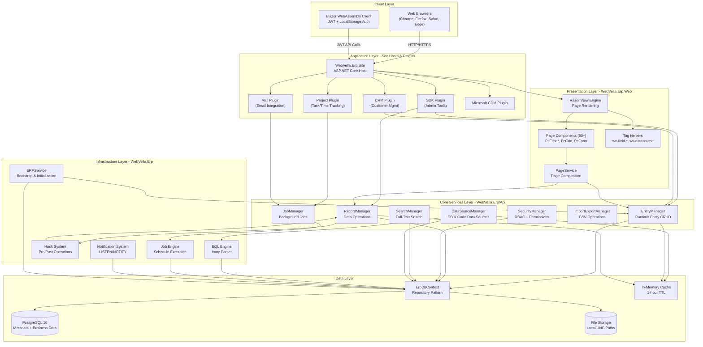
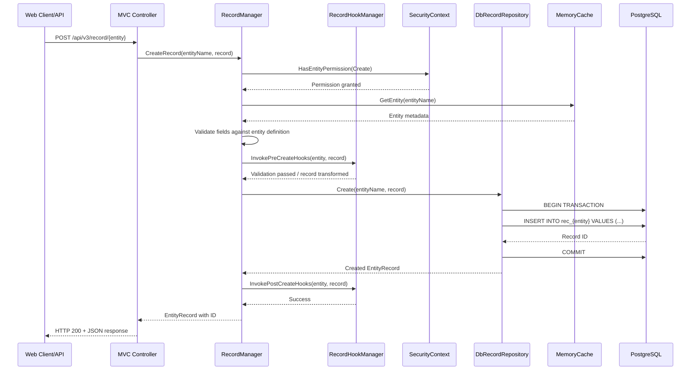
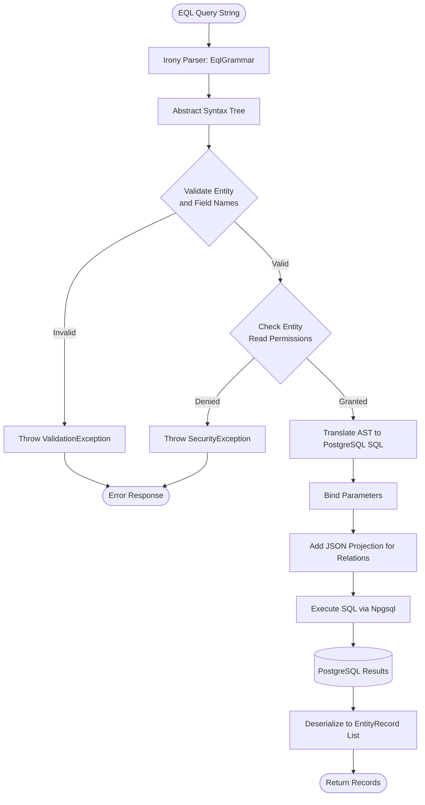
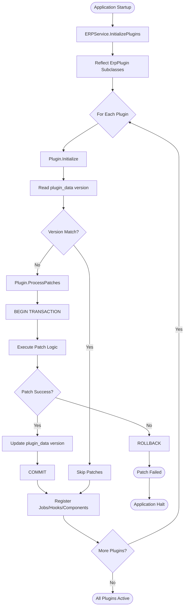
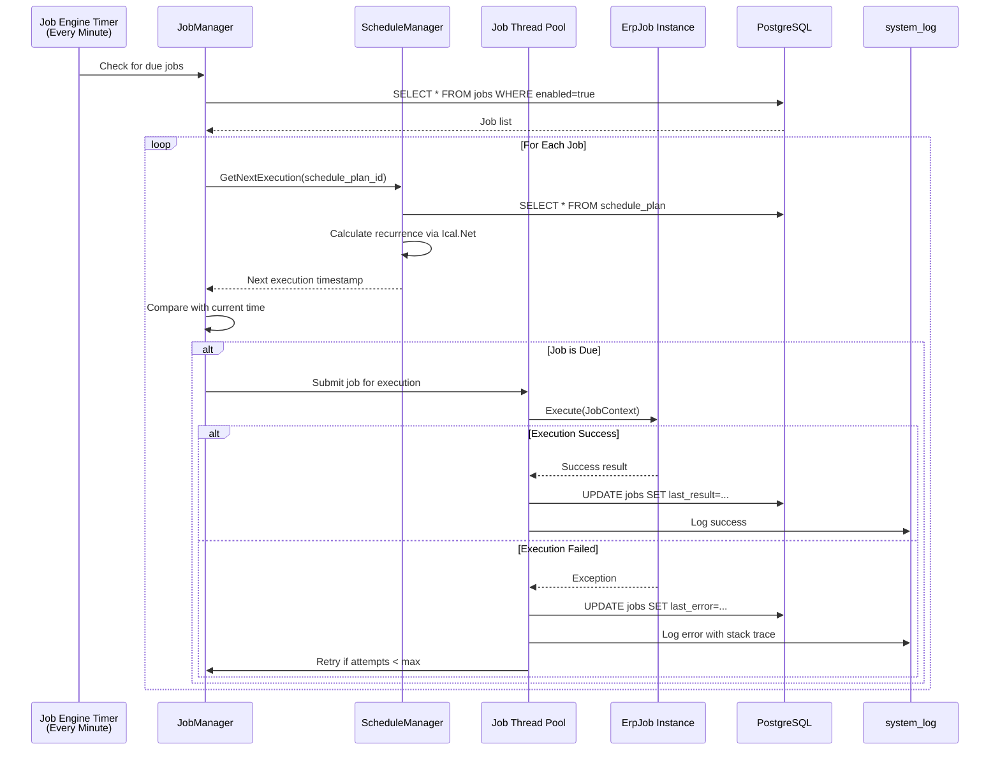
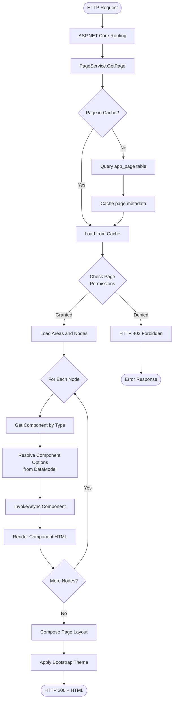

# System Architecture & Data Flow Documentation

**Generated:** 2024-01-20 UTC  
**Repository:** https://github.com/WebVella/WebVella-ERP  
**Version:** 1.7.4  
**Analysis Scope:** Complete codebase analysis of WebVella ERP system architecture

---

## Table of Contents

1. [Executive Summary](#executive-summary)
2. [Component Architecture](#component-architecture)
3. [Technology Stack](#technology-stack)
4. [Key Components](#key-components)
5. [Data Flow Diagrams](#data-flow-diagrams)
6. [Integration Architecture](#integration-architecture)
7. [System Bootstrap Process](#system-bootstrap-process)
8. [Plugin Architecture](#plugin-architecture)

---

## Executive Summary

WebVella ERP implements a **metadata-driven architecture** where all entity definitions, relationships, pages, and business logic configurations are stored in PostgreSQL database tables and loaded at runtime. This design enables zero-compilation schema evolution and rapid application development through configuration rather than code deployment.

### Architectural Approach

The system follows a **layered architecture** pattern:

- **Data Layer:** PostgreSQL 16 with Npgsql for data persistence and metadata storage
- **Core Services Layer:** Entity management, record operations, security, job scheduling
- **Infrastructure Layer:** Job engine, hook system, EQL query processor, notification system
- **Web Layer:** Razor UI framework, page components, tag helpers
- **Plugin Layer:** Extensible business modules (SDK, CRM, Project, Mail, CDM)
- **Client Layer:** Traditional web browsers and Blazor WebAssembly SPA

### Key Architectural Principles

1. **Metadata-First:** Entity schemas defined in database, not compiled code
2. **Plugin-Based Extensibility:** Business logic implemented as pluggable modules
3. **Convention Over Configuration:** Attribute-driven discovery for components, hooks, jobs
4. **Transactional Migrations:** Database schema changes execute within PostgreSQL transactions
5. **Multi-Tier Separation:** Core → Web → Plugins → Sites hierarchy

---

## Component Architecture



### Layer Responsibilities

| Layer | Responsibilities | Key Technologies |
|-------|------------------|------------------|
| **Client Layer** | Browser-based UI, user interactions, JWT token management | HTML5, JavaScript, Blazor WebAssembly |
| **Presentation Layer** | Page rendering, component composition, tag helper processing | Razor, Bootstrap 4, StencilJS |
| **Application Layer** | Business module hosting, plugin lifecycle, routing | ASP.NET Core 9, plugin infrastructure |
| **Core Services** | Entity/record management, security, search, import/export | C# business logic, AutoMapper, CsvHelper |
| **Infrastructure** | Query parsing, hooks, jobs, notifications, system bootstrap | Irony, Ical.Net, Npgsql LISTEN/NOTIFY |
| **Data Layer** | Database access, file storage, metadata caching | PostgreSQL 16, Npgsql 9.0.4, Storage.Net |

---

## Technology Stack

### Runtime & Framework

| Component | Version | Purpose |
|-----------|---------|---------|
| **.NET Runtime** | 9.0 | Cross-platform application execution (Windows, Linux) |
| **ASP.NET Core** | 9.0 | Web application framework, MVC, Razor Pages |
| **C# Language** | 12 (implicit) | Primary programming language |
| **Blazor WebAssembly** | 9.0.10 | Client-side SPA framework |

### Database & Storage

| Component | Version | Purpose |
|-----------|---------|---------|
| **PostgreSQL** | 16 | Primary relational database for metadata and business data |
| **Npgsql** | 9.0.4 | .NET PostgreSQL client driver |
| **Storage.Net** | 9.3.0 | File storage abstraction (local/UNC) |
| **Microsoft.Extensions.Caching.Memory** | 9.0.10 | In-memory metadata cache (1-hour TTL) |

### Business Logic Libraries

| Component | Version | Purpose |
|-----------|---------|---------|
| **AutoMapper** | 14.0.0 | Object-to-object mapping for DTOs |
| **Newtonsoft.Json** | 13.0.4 | JSON serialization/deserialization |
| **CsvHelper** | 33.1.0 | CSV import/export operations |
| **Irony.NetCore** | 1.1.11 | EQL grammar parser (custom query language) |
| **Ical.Net** | 4.3.1 | Recurrence pattern calculation for job scheduling |
| **MailKit/MimeKit** | 4.14.1 | SMTP email integration |
| **HtmlAgilityPack** | 1.11.72 | HTML parsing and manipulation |

### UI & Client Libraries

| Component | Version | Purpose |
|-----------|---------|---------|
| **Bootstrap** | 4.x | Responsive CSS framework |
| **jQuery** | 3.x | DOM manipulation, AJAX |
| **Moment.js** | Latest | Date/time formatting |
| **StencilJS** | Custom | Web components (wv-lazyload, wv-post-list) |
| **Select2** | Latest | Enhanced dropdowns |
| **Chart.js** | Latest | Data visualization |

### Security & Authentication

| Component | Version | Purpose |
|-----------|---------|---------|
| **System.IdentityModel.Tokens.Jwt** | 8.14.0 | JWT token creation and validation |
| **Microsoft.AspNetCore.Authentication.JwtBearer** | 9.0.10 | JWT authentication middleware |
| **Blazored.LocalStorage** | 4.5.0 | Browser LocalStorage for token persistence |

---

## Key Components

### 1. EntityManager (`WebVella.Erp/Api/EntityManager.cs`)

**Purpose:** Runtime entity definition management  
**Lines of Code:** ~2,500  
**Complexity:** High

**Responsibilities:**
- Create/update/delete entity schemas without code deployment
- Manage 20+ field types (text, number, date, currency, GUID, HTML, file, etc.)
- Define relationships (OneToOne, OneToMany, ManyToMany)
- Automatic database table generation with "rec_" prefix
- Permission configuration (Read, Create, Update, Delete per role)
- Metadata caching with 1-hour expiration

**Key Methods:**
- `CreateEntity(Entity entity)` - Create new entity with validation
- `UpdateEntity(Entity entity)` - Modify existing entity schema
- `DeleteEntity(Guid entityId)` - Remove entity and cascade tables
- `ReadEntities()` - Retrieve all entity definitions
- `ReadEntity(Guid id)` - Read single entity by ID
- `ReadEntity(string name)` - Read single entity by name
- `CloneEntity(Guid sourceEntityId, string newEntityName, string newEntityLabel, string newEntityPluralLabel)` - Clone existing entity with new identity
- `CreateField(Guid entityId, Field field)` - Add field to entity
- `CreateField(string entityName, Field field)` - Add field to entity by name
- `UpdateField(Guid entityId, Field field)` - Modify field definition
- `UpdateField(string entityName, Field field)` - Modify field definition by entity name
- `DeleteField(Guid entityId, Guid fieldId)` - Remove field from entity
- `ReadFields(Guid entityId)` - Retrieve all fields for an entity
- `ReadFields(string entityName)` - Retrieve all fields for an entity by name
- `ReadField(Guid fieldId)` - Read single field by ID
- `ConvertToEntityRecord(Entity entity)` - Convert entity object to EntityRecord format

**Database Interaction:**
- Entity metadata stored in `entities` table
- Field definitions in embedded JSON within entity records
- Automatic DDL execution via Npgsql

**Code Reference:** `WebVella.Erp/Api/EntityManager.cs:1-2500`

---

### 2. RecordManager (`WebVella.Erp/Api/RecordManager.cs`)

**Purpose:** Data manipulation operations with transactional integrity  
**Lines of Code:** ~3,000  
**Complexity:** High

**Responsibilities:**
- CRUD operations on entity records
- Field-level validation against entity definitions
- Relationship management (referential integrity)
- Hook invocation (pre/post create/update/delete)
- File attachment handling via DbFileRepository
- Permission enforcement (SecurityContext integration)
- Bulk operations with transaction support

**Key Methods:**
- `CreateRecord(string entityName, EntityRecord record)` - Insert new record
- `GetRecord(string entityName, Guid recordId)` - Retrieve single record
- `UpdateRecord(string entityName, EntityRecord record)` - Modify existing record
- `DeleteRecord(string entityName, Guid recordId)` - Remove record
- `DeleteRecordPermissions(Guid recordId, string entityName)` - Remove specific record permissions
- `DeleteRecordAllPermissions(Guid recordId)` - Remove all permissions for a record
- `Find(QueryObject query)` - Query records with filtering/sorting/pagination
- `Count(QueryObject query)` - Count records matching query criteria
- `CreateRelationManyToManyRecord(Guid relationId, Guid originValue, Guid targetValue)` - Create many-to-many relationship
- `GetRelationManyToManyRecords(Guid relationId, Guid originValue, Guid? targetValue)` - Retrieve many-to-many relationships
- `FindRelationManyToManyRecords(QueryObject query, Guid relationId)` - Query many-to-many relationships
- `DeleteRelationManyToManyRecord(Guid relationId, Guid originValue, Guid targetValue)` - Remove many-to-many relationship
- `ExtractFieldValue(EntityRecord record, string fieldName, FieldType fieldType, bool encryptPassword)` - Extract and normalize field values

**Hook Integration:**
- `RecordHookManager.InvokePre*()` before database operation
- `RecordHookManager.InvokePost*()` after successful commit
- Hook exceptions trigger transaction rollback

**Code Reference:** `WebVella.Erp/Api/RecordManager.cs:1-3000`

---

### 3. SecurityManager & SecurityContext

**SecurityManager (`WebVella.Erp/Api/SecurityManager.cs`):**
- User authentication (JWT generation)
- Role management (Administrator, Regular, Guest)
- Permission grant/revoke operations
- Password hashing and validation

**SecurityContext (`WebVella.Erp/Api/SecurityContext.cs`):**
- AsyncLocal-based user context propagation
- Thread-safe across async operations
- `HasEntityPermission(EntityPermission permission, Guid entityId)` checks
- `OpenSystemScope()` for elevated operations
- `HasMetaPermission()` for metadata-level access

**Permission Model:**
- **Entity-Level:** RecordPermissions (CanRead, CanCreate, CanUpdate, CanDelete) contain role GUID lists
- **Record-Level:** Individual records can restrict access beyond entity permissions
- **Field-Level:** Sensitive fields encrypted and filtered from responses

**Code Reference:**  
- `WebVella.Erp/Api/SecurityManager.cs`
- `WebVella.Erp/Api/SecurityContext.cs`

---

### 4. EQL Engine (`WebVella.Erp/Eql/`)

**Purpose:** Custom query language for entity-aware data retrieval  
**Technology:** Irony.NetCore parser framework

**EQL Syntax Features:**
- SQL-like SELECT/WHERE/ORDER BY/PAGE/PAGESIZE clauses
- Entity-aware querying without explicit JOINs
- Relationship navigation with `$relation` syntax
- Relationship inversion with `$$` syntax
- Parameter binding with `@param` syntax

**Query Execution Pipeline:**
1. EQL string parsed by Irony grammar (`EqlGrammar`)
2. Abstract syntax tree constructed (`EqlCommand`)
3. AST translated to PostgreSQL SQL with nested JSON projections
4. Security filtering applied automatically
5. SQL executed via Npgsql
6. Results deserialized to `Dictionary<string, object>` records

**Example EQL Query:**
```
SELECT *, $user_1_n_user_file.$file_id.name, $file.size
FROM user
WHERE email = @userEmail
ORDER BY created_on DESC
PAGE 1
PAGESIZE 20
```

**Data Source Management (`DataSourceManager`):**

The `DataSourceManager` orchestrates access to both database-persisted and code-implemented data sources, providing a unified abstraction for query execution:

**Database Data Sources:**
- EQL queries stored in database with parameter definitions
- Parameter substitution using `@param` syntax
- `EqlBuilder` validates and converts EQL to SQL before execution
- Results cached with 1-hour expiration via IMemoryCache

**Code Data Sources:**
- Reflection-based discovery via `[DataSource]` attribute
- Custom C# implementations with `Execute(Dictionary<string, object>)` method signature
- Assembly scanning automatically discovers implementations (skips assemblies starting with "microsoft." or "system.")
- Manual registration supported for additional assemblies

**Caching Strategy:**
- 1-hour absolute expiration for data source metadata
- Cache invalidation on data source modifications
- Cache keys based on data source name or GUID

**Code Reference:**  
- `WebVella.Erp/Eql/EqlCommand.cs`
- `WebVella.Erp/Eql/EqlBuilder.cs`
- `WebVella.Erp/Eql/EqlGrammar.cs`
- `WebVella.Erp/Api/DataSourceManager.cs`

---

### 5. Job Engine (`WebVella.Erp/Jobs/`)

**Purpose:** Background job scheduling and execution  
**Technology:** BackgroundService hosted service, Ical.Net recurrence

**Architecture:**
- **JobPool:** Fixed-size thread pool for concurrent execution
- **JobManager:** Job discovery via `[Job]` attributes
- **ScheduleManager:** Recurrence pattern calculation
- **Job Base Class:** `ErpJob` with `Execute(JobContext context)` signature

**Execution Cycle:**
1. Every minute, job engine checks for due jobs
2. Schedule plans evaluated for next execution time
3. Due jobs submitted to JobPool for execution
4. Job results serialized to `jobs` table
5. Exceptions logged to `system_log`
6. Failed jobs retry with configurable bounds

**Recurrence Patterns:**
- **Daily:** Specific time of day
- **Weekly:** Days of week and time
- **Monthly:** Day of month and time

**Example Job:** `ClearJobAndErrorLogsJob` (SDK plugin) - Clears old logs weekly

**Code Reference:**  
- `WebVella.Erp/Jobs/JobManager.cs`
- `WebVella.Erp/Jobs/SheduleManager.cs` (Note: filename contains typo; class inside is `ScheduleManager`)
- `WebVella.Erp/Jobs/ErpBackgroundServices.cs`

---

### 6. Hook System (`WebVella.Erp/Hooks/`)

**Purpose:** Extensibility through operation interception  
**Discovery:** Attribute-driven with `[Hook]` and `[HookAttachment]` attributes

**Hook Types:**

**Record Hooks:**
- `IErpPreCreateRecordHook` - Before record insertion
- `IErpPostCreateRecordHook` - After successful insertion
- `IErpPreUpdateRecordHook` - Before record update
- `IErpPostUpdateRecordHook` - After successful update
- `IErpPreDeleteRecordHook` - Before record deletion
- `IErpPostDeleteRecordHook` - After successful deletion

**Page Hooks:**
- `IPageHook` - Request preprocessing and response post-processing

**Render Hooks:**
- `[RenderHookAttachment]` - Component injection at UI placeholders

**Hook Execution:**
- Hooks execute within RecordManager transactions
- Hook exceptions trigger rollback
- Hook order configurable via priority attribute

**Code Reference:**  
- `WebVella.Erp/Hooks/RecordHookManager.cs`
- `WebVella.Erp/Hooks/HookManager.cs`

---

### 7. Page Component System (`WebVella.Erp.Web/Components/`)

**Purpose:** Reusable UI components for page composition  
**Count:** 50+ built-in components  
**Technology:** ASP.NET Core ViewComponent infrastructure

**Component Lifecycle:**

1. **Design Phase:** Configuration structure definition (JSON schema)
2. **Options Phase:** Runtime parameter resolution with data binding
3. **Display Phase:** HTML rendering with Razor templates

**Component Categories:**

**Field Components:**
- PcFieldText, PcFieldNumber, PcFieldDate, PcFieldDateTime
- PcFieldCurrency, PcFieldPercent, PcFieldCheckbox
- PcFieldSelect, PcFieldMultiSelect
- PcFieldEmail, PcFieldPhone, PcFieldUrl
- PcFieldFile, PcFieldImage, PcFieldHtml

**Layout Components:**
- PcSection, PcRow, PcForm, PcDrawer, PcModal
- PcTabNav, PcPageHeader, PcButton, PcBtnGroup

**Data Components:**
- PcGrid (with sorting, filtering, pagination)
- PcChart (Chart.js integration)
- PcRepeater (custom layouts)
- PcLazyLoad (performance optimization)

**Component Discovery:**
- `[PageComponent]` attribute marks components
- Reflection-based registration at startup
- Plugin components automatically integrated

**Code Reference:** `WebVella.Erp.Web/Components/` folder

---

### 8. ERPService (`WebVella.Erp/ERPService.cs`)

**Purpose:** System bootstrap and initialization  
**Lines of Code:** 1,472  
**Complexity:** High

**Bootstrap Sequence:**

1. **Database Connection:** Establish PostgreSQL connection
2. **System Tables:** Create 17 core tables if not exist (see System Bootstrap Process)
3. **System Entities:** Initialize user, role, user_role, user_file entities
4. **Default Records:** Create system/administrator users and 3 default roles
5. **Plugin Discovery:** Reflect and initialize all ErpPlugin subclasses
6. **Plugin Patches:** Execute versioned migrations for each plugin
7. **Job Registration:** Discover and register background jobs
8. **Hook Registration:** Discover and register hook implementations
9. **Component Registration:** Discover and register page components

**Code Reference:** `WebVella.Erp/ERPService.cs:1-1472`

---

## Data Flow Diagrams

### Entity CRUD Data Flow



### EQL Query Execution Flow



### Plugin Lifecycle Execution



### Background Job Execution



### Page Rendering Pipeline



---

## Integration Architecture

### Database Integration (PostgreSQL 16)

**Connection Management:**
- Connection pooling via Npgsql (MinPoolSize=1, MaxPoolSize=100)
- Command timeout: 120 seconds for long-running queries
- Transaction management through `DbContext.Current.CreateConnection()`
- Savepoint support for nested transactions

**Data Access Patterns:**
- **Repository Pattern:** DbEntityRepository, DbRecordRepository, DbFileRepository
- **Raw SQL:** Direct SQL execution for system table creation and migrations
- **Parameter Binding:** All user inputs parameterized to prevent SQL injection
- **JSON Projection:** Nested relation data returned as JSON for EQL queries

**Full-Text Search Integration:**
- PostgreSQL text search with `to_tsquery` and `plainto_tsquery`
- Bulgarian language analyzer (BulStem stemmer) support
- `system_search` table indexed with GIN for performance
- ILIKE fallback for contains-mode searches

**LISTEN/NOTIFY Integration:**
- `NotificationContext` uses PostgreSQL pub/sub
- Real-time event propagation across application servers
- Channel-based notification routing
- Handler registration for notification processing

**Code References:**
- `WebVella.Erp/Database/DbContext.cs`
- `WebVella.Erp/Database/DbRecordRepository.cs`
- `WebVella.Erp/Notifications/NotificationContext.cs`

---

### File Storage Integration

**Storage Abstraction:** Storage.Net library  
**Supported Backends:**
- Local file system (e.g., `C:\erp-files\`)
- UNC network paths (e.g., `\\192.168.0.2\Share\erp3-files`)

**File Storage Pattern:**
1. File metadata stored in `files` table (filename, size, MIME type, path)
2. Binary content stored in configured file storage folder
3. `DbFileRepository` abstracts storage backend
4. File access enforced through permission checks

**File Field Integration:**
- FileField and ImageField store file paths as strings
- RecordManager integrates with DbFileRepository for file operations
- File upload/download through `/file/{id}` API endpoints
- If-Modified-Since HTTP caching for file retrieval

**Code Reference:** `WebVella.Erp/Database/DbFileRepository.cs`

---

### SMTP Email Integration (Optional)

**Technology:** MailKit 4.14.1 library  
**Configuration:** Config.json settings (EmailSMTPServerName, EmailSMTPPort, EmailSMTPUsername, EmailSMTPPassword)

**Email Queue Architecture:**
1. Emails queued in `email` entity (Mail plugin)
2. `ProcessSmtpQueueJob` runs every 10 minutes
3. Emails selected by priority and scheduled_on timestamp
4. MIME assembly with MailKit/MimeKit
5. HTML with inline CSS via HtmlAgilityPack
6. Attachment inclusion from file storage
7. Retry logic with exponential backoff

**Use Cases:**
- System notifications
- Password reset emails
- Scheduled report delivery
- Workflow event notifications

**Code Reference:** `WebVella.Erp.Plugins.Mail/Jobs/ProcessSmtpQueueJob.cs`

---

### Blazor WebAssembly Integration

**Architecture:** Client/Server/Shared project pattern

**Authentication Flow:**
1. User credentials submitted to `/v3/en_US/auth/jwt/` endpoint
2. Server validates and generates JWT token
3. Token returned to Blazor client
4. Client stores token in LocalStorage via Blazored.LocalStorage
5. Token included in Authorization header for all API calls
6. Automatic refresh using token_refresh_after claim

**API Communication:**
- `IApiService` provides typed HTTP client
- Authorization header automatic injection
- Shared DTOs between client and server
- Error handling with user-friendly messages

**Client-Side State:**
- LocalStorage for authentication token
- AppState service for shared application state
- WvBaseComponent base class for common UI logic

**Code Reference:** `WebVella.Erp.WebAssembly/` project trio

---

## System Bootstrap Process

The system bootstrap process executes during application startup via `ERPService.InitializeSystemEntities()` and is critical for creating the foundational database schema and metadata.

### System Tables Created

The `CheckCreateSystemTables()` method creates 17 core tables if they do not exist:

#### 1. entities Table
**Purpose:** Store entity metadata  
**Key Columns:**
- `id` (UUID primary key)
- `name` (TEXT, unique) - Entity name used in API and database
- `label` (TEXT) - Display label
- `label_plural` (TEXT) - Plural form
- `system` (BOOLEAN) - Framework vs. custom entity flag
- `icon_name` (TEXT) - UI icon reference
- `weight` (INTEGER) - Ordering for UI lists
- `fields` (JSONB) - Field definitions array
- `record_permissions` (JSONB) - CRUD permissions per role

**SQL Reference:** `ERPService.cs:937-939`

#### 2. entity_relations Table
**Purpose:** Store relationship definitions  
**Key Columns:**
- `id` (UUID primary key)
- `name` (TEXT, unique)
- `relation_type` (TEXT) - OneToOne, OneToMany, ManyToMany
- `origin_entity_id` (UUID) - Source entity
- `origin_field_id` (UUID) - Source field
- `target_entity_id` (UUID) - Target entity
- `target_field_id` (UUID) - Target field

**SQL Reference:** `ERPService.cs:941-944`

#### 3. system_settings Table
**Purpose:** Key-value configuration store  
**Key Columns:**
- `id` (UUID primary key)
- `name` (TEXT, unique)
- `value` (TEXT) - JSON-encoded configuration

**SQL Reference:** `DbSystemSettingsRepository.cs:28-42`

#### 4. system_search Table
**Purpose:** Full-text search index  
**Key Columns:**
- `id` (SERIAL primary key)
- `text` (TEXT) - Searchable content
- `entity_name` (TEXT) - Source entity
- `record_id` (UUID) - Source record
- `user_id` (UUID) - User context
- `document` (TSVECTOR) - Full-text search vector

**Indexes:**
- GIN index on `document` for full-text performance

**SQL Reference:** `ERPService.cs:852-890`

#### 5. files Table
**Purpose:** File metadata storage  
**Key Columns:**
- `id` (UUID primary key)
- `object_name` (TEXT) - Entity name
- `record_id` (UUID) - Record association
- `file_name` (TEXT) - Original filename
- `file_size` (INTEGER) - Bytes
- `mime_type` (TEXT) - Content type
- `path` (TEXT) - Storage location
- `created_on` (TIMESTAMP)

**SQL Reference:** `ERPService.cs:892-920`

#### 6. jobs Table
**Purpose:** Background job definitions  
**Key Columns:**
- `id` (UUID primary key)
- `name` (TEXT, unique)
- `enabled` (BOOLEAN)
- `priority` (INTEGER) - Execution order
- `execute_once` (BOOLEAN)
- `type_name` (TEXT) - C# class name
- `assembly_name` (TEXT)
- `schedule_plan_id` (UUID) - FK to schedule_plan
- `last_result` (TEXT) - JSON result
- `last_modified_on` (TIMESTAMP)

**SQL Reference:** `ERPService.cs:980-1020`

#### 7. schedule_plan Table
**Purpose:** Job scheduling configurations  
**Key Columns:**
- `id` (UUID primary key)
- `name` (TEXT, unique)
- `type` (TEXT) - Daily, Weekly, Monthly
- `start_date` (TIMESTAMP)
- `end_date` (TIMESTAMP)
- `interval_type` (TEXT)
- `interval` (INTEGER)
- `start_timespan` (INTEGER) - Seconds from midnight
- `plan_days_of_week` (TEXT) - CSV of weekdays
- `plan_weeks_of_month` (TEXT) - CSV of weeks
- `plan_days_of_month` (TEXT) - CSV of days

**SQL Reference:** `ERPService.cs:1022-1050`

#### 8. system_log Table
**Purpose:** Audit and error logging  
**Key Columns:**
- `id` (SERIAL primary key)
- `type` (TEXT) - Info, Warning, Error
- `message` (TEXT)
- `details` (TEXT) - Stack trace or JSON
- `notification` (BOOLEAN) - Should notify administrators
- `created_on` (TIMESTAMP)

**Indexes:**
- Index on `created_on` for time-based queries

**SQL Reference:** `DbSystemSettingsRepository.cs:75-98`

#### 9. plugin_data Table
**Purpose:** Plugin persistent state  
**Key Columns:**
- `id` (UUID primary key)
- `name` (TEXT, unique) - Plugin identifier
- `data` (TEXT) - JSON-encoded state
- `version` (INTEGER) - Plugin schema version

Source: `WebVella.Erp/ERPService.cs:1190-1207`

#### 10-15. Application Structure Tables
**Purpose:** Metadata-driven page composition system

**app Table:**
- `id` (UUID primary key)
- `name` (TEXT, unique) - Application identifier
- `label` (TEXT) - Display name
- `icon_class` (TEXT)
- `author` (TEXT)
- `weight` (INTEGER) - Ordering

**app_sitemap_area Table:**
- `id` (UUID NOT NULL primary key)
- `app_id` (UUID NOT NULL) - FK to app
- `name` (TEXT NOT NULL) - Area identifier
- `label` (TEXT)
- `label_translations` (TEXT) - Localized labels
- `icon_class` (TEXT)
- `color` (TEXT)
- `weight` (INTEGER NOT NULL)
- `access_roles` (UUID[] NOT NULL) - Array of role IDs with area access

Source: `WebVella.Erp/ERPService.cs:1238-1249`

**app_sitemap_area_group Table:**
- `id` (UUID NOT NULL, primary key)
- `area_id` (UUID NOT NULL) - Foreign key to app_sitemap_area
- `name` (VARCHAR(100) NOT NULL)
- `label` (VARCHAR(100) NOT NULL)
- `weight` (INTEGER NOT NULL)

**app_sitemap_area_node Table:**
- `id` (UUID NOT NULL, primary key)
- `area_id` (UUID NOT NULL) - Foreign key to app_sitemap_area
- `node_id` (UUID NOT NULL) - Foreign key to app_sitemap_node
- `url` (TEXT) - Page routing URL
- `type` (TEXT) - Node type
- `entity_id` (UUID) - Associated entity
- `weight` (INTEGER)
- `entity_list_pages` (UUID[]) - Page GUIDs
- `entity_create_pages` (UUID[])
- `entity_details_pages` (UUID[])
- `entity_manage_pages` (UUID[])
- `parent_id` (UUID) - Hierarchical structure

**app_page Table:**
- `id` (UUID primary key)
- `app_id` (UUID) - FK to app
- `area_id` (UUID) - FK to app_sitemap_area
- `node_id` (UUID) - FK to app_sitemap_area_node
- `name` (TEXT)
- `label` (TEXT)
- `icon_class` (TEXT)
- `system` (BOOLEAN)
- `weight` (INTEGER)
- `type` (TEXT) - Page type
- `is_razorize_body` (BOOLEAN)
- `layout` (TEXT) - OneColumn, TwoColumns

**app_page_body_node Table:**
- `id` (UUID primary key)
- `page_id` (UUID) - FK to app_page
- `parent_id` (UUID) - Tree structure
- `node_id` (TEXT) - UI element ID
- `component_name` (TEXT) - Component type
- `containment` (TEXT) - HTML structure
- `options` (TEXT) - JSON configuration
- `weight` (INTEGER)

**SQL Reference:** `ERPService.cs:1102-1375`

#### 16-17. Data Source Tables
**Purpose:** Reusable query definitions

**data_source Table:**
- `id` (UUID primary key)
- `name` (TEXT, unique)
- `description` (TEXT)
- `weight` (INTEGER)
- `eql_text` (TEXT) - EQL query
- `sql_text` (TEXT) - SQL query
- `parameters_json` (TEXT) - Parameter definitions
- `fields_json` (TEXT) - Result field schema
- `entity_name` (TEXT) - Primary entity
- `return_total` (BOOLEAN) - Include COUNT(*) OVER()

**app_page_data_source Table:**
- `id` (UUID primary key)
- `page_id` (UUID) - FK to app_page
- `data_source_id` (UUID) - FK to data_source
- `name` (TEXT) - Binding name
- `parameters` (TEXT) - JSON parameter values

**SQL Reference:** `ERPService.cs:1383-1418`

### Migration Methods

**UpdateSitemapNodeTable1():**
- Adds entity-specific page arrays to sitemap nodes
- Columns: entity_list_pages, entity_create_pages, entity_details_pages, entity_manage_pages

**UpdateSitemapNodeTable2():**
- Adds hierarchical parent_id relationship to sitemap nodes
- Enables nested navigation structures

**Code Reference:** `ERPService.cs:1441-1470`

### Entity Initialization

After system tables, `InitializeSystemEntities()` creates core entities programmatically:

**rec_user Table:**
- Fields: id (GUID primary key), email, password, first_name, last_name, enabled, verified
- RecordPermissions: Administrator (full), Regular (read self), Guest (none)
- Source: `DbSystemSettingsRepository.cs:100-300`

**rec_role Table:**
- Fields: id, name, description
- Default Roles: Administrator, Regular, Guest with predefined GUIDs
- Source: `DbSystemSettingsRepository.cs:100-300`

**rec_user_role Table:**
- Many-to-many relationship between user and role
- Fields: user_id (FK), role_id (FK)
- Source: `DbSystemSettingsRepository.cs:100-300`

**rec_user_file Table:**
- File attachments for users
- Fields: id, user_id (FK), file metadata
- Source: `ERPService.cs:531-589` (InitializeSystemEntities method)

**Default Records:**
- System user (GUID: 5c5279b4-e293-4285-8c08-f52ed05af32c)
- Administrator user (erp@webvella.com / erp)
- Three default roles with predefined GUIDs

**Code Reference:** `DbSystemSettingsRepository.cs:100-300`

---

## Plugin Architecture

### Plugin Discovery and Initialization

**Plugin Base Class:** `ErpPlugin` (abstract)  
**Required Methods:**
- `void Initialize(IServiceProvider serviceProvider)` - Startup configuration
- `void ProcessPatches()` - Versioned database migrations
- `string Name { get; }` - Plugin identifier
- `int Version { get; }` - Current version number

**Discovery Process:**
1. Application startup calls `ERPService.InitializePlugins()`
2. Reflection scans all loaded assemblies for ErpPlugin subclasses
3. Each plugin instantiated and `Initialize()` called
4. Plugin data read from `plugin_data` table
5. Version comparison triggers `ProcessPatches()` if needed
6. Plugin version updated in `plugin_data` after successful patches

**Code Reference:** `WebVella.Erp/ErpPlugin.cs`, `ERPService.cs:InitializePlugins()`

---

### Plugin Project Structure

**Standard Plugin Layout:**
```
WebVella.Erp.Plugins.{Name}/
├── {Name}Plugin.cs (ErpPlugin implementation)
├── Components/ (Page components)
├── Pages/ (Razor pages)
├── Services/ (Business logic)
├── Models/ (DTOs)
├── Jobs/ (Background jobs)
├── Hooks/ (Pre/post operation hooks)
├── DataSources/ (Custom data sources)
├── wwwroot/ (Static assets)
└── WebVella.Erp.Plugins.{Name}.csproj
```

**Key Plugin Features:**

**SDK Plugin (`WebVella.Erp.Plugins.SDK`):**
- Administrative UI for entity/field/page management
- Developer tools: Code generation, system monitoring
- Components: WvSdkPageSitemap, entity/field editors
- Jobs: ClearJobAndErrorLogsJob (log maintenance)

**Project Plugin (`WebVella.Erp.Plugins.Project`):**
- Project and task management with timelog tracking
- Entities: project, task, timelog, watcher
- Components: PcProjectWidgetBudgetChart, PcProjectWidgetTasksChart, PcTimelogList
- Jobs: StartTasksOnStartDate (daily task automation)
- Client: task-details.js, timetrack.js with jQuery/moment.js

**Mail Plugin (`WebVella.Erp.Plugins.Mail`):**
- SMTP email integration via MailKit
- Entities: email, smtp_service
- Jobs: ProcessSmtpQueueJob (10-minute interval)
- HTML email with inline CSS via HtmlAgilityPack
- Hooks: SmtpServiceRecordHook (cache invalidation)

**CRM Plugin (`WebVella.Erp.Plugins.Crm`):**
- Customer relationship management framework
- Plugin scaffold demonstrating patterns

**Microsoft CDM Plugin (`WebVella.Erp.Plugins.MicrosoftCDM`):**
- Microsoft Common Data Model integration
- Data synchronization with Dynamics 365 / Power Platform

---

### Plugin Integration Points

**Dependency Injection:**
```csharp
services.AddErp(); // Core ERP services
services.UseErpPlugin<SdkPlugin>(); // Plugin registration
services.UseErpPlugin<ProjectPlugin>();
services.UseErpPlugin<MailPlugin>();
```

**Middleware Pipeline:**
```csharp
app.UseErp(); // Core ERP middleware
// Plugins automatically integrated via AddErp()
```

**Route Registration:**
- Plugin pages register routes via Razor class library conventions
- API controllers in plugins accessible at `/api/v3.0/p/{plugin}/`
- Static files served from plugin wwwroot folders

**Component Registration:**
- Page components with `[PageComponent]` attribute automatically discovered
- Hooks with `[Hook]` attribute automatically registered
- Jobs with `[Job]` attribute automatically scheduled

**Code Reference:** `WebVella.Erp.Web/ErpMvcExtensions.cs`

---

## Document History

| Version | Date | Changes | Author |
|---------|------|---------|--------|
| 1.0 | 2024-01-20 | Initial architecture documentation | Blitzy Documentation Generator |

---

## Related Documentation

- [Code Inventory Report](code-inventory.md) - Complete file catalog
- [Database Schema](database-schema.md) - ERD and data dictionary
- [Functional Overview](functional-overview.md) - Module capabilities and workflows
- [Business Rules Catalog](business-rules.md) - Validation and process rules
- [Security & Quality Assessment](security-quality.md) - Vulnerabilities and metrics
- [Modernization Roadmap](modernization-roadmap.md) - Migration strategy

---

## Feedback and Contributions

For questions, corrections, or contributions to this documentation, please submit issues or pull requests to the GitHub repository: https://github.com/WebVella/WebVella-ERP

---

**License:** Apache License 2.0  
**Documentation Generated:** 2024-01-20 UTC
