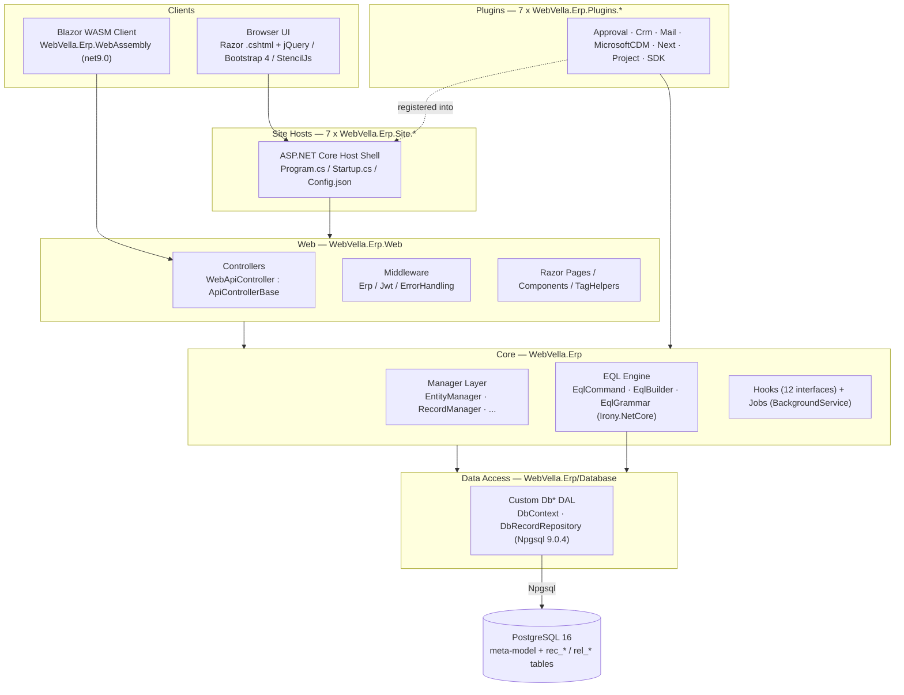
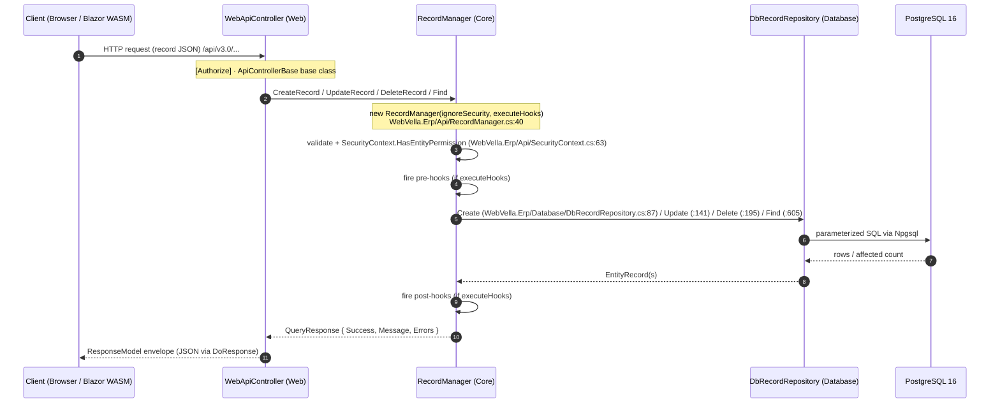
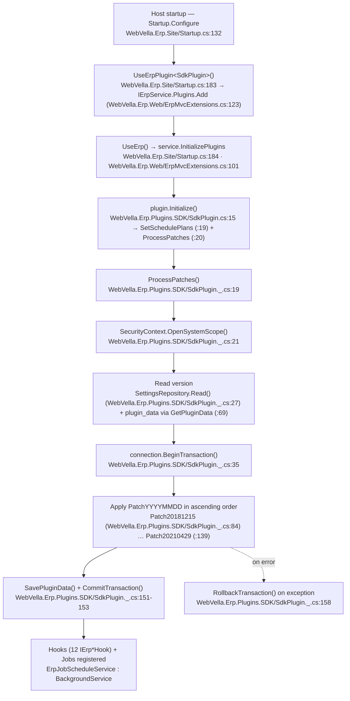

# WebVella ERP — System Architecture & Data Flow

> **Part of the [Reverse-Engineering / As-Built Documentation Suite](./README.md).** This document is the canonical reference for *how WebVella ERP is built*: its layered design, the core manager layer, the custom **EQL** read path, the web request pipeline, the plugin patch-migration model, and the multi-site host shell. Terminology follows the canonical [Glossary & Acronyms](./README.md#glossary--acronyms) in the suite index.

---

## Executive Summary

**WebVella ERP** is an open-source, **entity-centric, plugin-driven** enterprise platform built on **ASP.NET Core 9 / .NET 9** with **PostgreSQL 16**. Rather than modelling business objects as compile-time POCOs, the platform stores **entities, fields, and relations as data** in a meta-model and generates physical PostgreSQL tables for records at runtime. This single architectural decision shapes every layer described below.

The system is organized as a strict, top-down **layered architecture**:

```text
Site host (WebVella.Erp.Site.*)  →  Web (WebVella.Erp.Web)  →  Core (WebVella.Erp/Api)  →  Database (WebVella.Erp/Database)  →  PostgreSQL 16
```

Each layer depends only on the layer beneath it. A **Site host** is a thin ASP.NET Core shell that wires dependency injection, authentication, and plugin registration; the **Web** layer adds the versioned REST surface, MVC/Razor pages, and middleware; the **Core** layer holds the manager classes, the EQL engine, hooks, and jobs; the **Database** layer is a hand-written `Db*` data-access layer over **Npgsql**; and **PostgreSQL 16** is the only persistent store.

Four defining traits recur throughout this document and distinguish WebVella from a conventional CRUD application:

| Trait | What it means | Where it lives |
|-------|---------------|----------------|
| **Data-driven meta-model** | Entities, fields, and relations are rows of data, not classes; new entities create new physical tables at runtime. | `WebVella.Erp/Api/EntityManager.cs:16`, `WebVella.Erp/Api/EntityRelationManager.cs:11` |
| **Custom EQL query language** | A bespoke **Entity Query Language** parsed with **Irony.NetCore** and translated to SQL drives the record read path. | `WebVella.Erp/Eql/EqlGrammar.cs:7`, `WebVella.Erp/Eql/EqlCommand.cs:190` |
| **Plugin patch-migration model** | Schema evolves through **date-versioned plugin partial classes** applied in order during startup — there is no Entity Framework `Migrations/` folder. | `WebVella.Erp.Plugins.SDK/SdkPlugin._.cs:19` |
| **Multi-site host shell** | **Seven** interchangeable `WebVella.Erp.Site.*` projects each compose a chosen plugin set into a runnable application. | `WebVella.Erp.Site/Startup.cs:183` |

**Verified-reality corrections.** This is an analysis-only, factual document; two assumptions commonly attached to a project of this kind are corrected here against the codebase: the platform **already targets .NET 9** (18 of 20 projects on `net9.0`), not an older runtime (**C2**); and the data layer is a **custom `Db*` repository DAL over Npgsql 9.0.4**, **not** Entity Framework Core (**C3**). The frontend (**C1**) and hosting/CI posture (**C5**) corrections are detailed in [§9](#9-blazor-client--frontend) and [§8](#8-hosting--multi-site-host-shell). The full C1–C5 table lives in the [suite index](./README.md#requirement-vs-reality-corrections-c1c5).

---

## Generation Metadata

| Field | Value |
|-------|-------|
| **Documentation Generated** | 2026-06-05 15:15 UTC |
| **Source commit** | `bfe15661c7f0c1dae57288d789b854186793b157` |
| **Branch** | `master` |
| **Solution** | `WebVella.ERP3.sln` (20 projects) |
| **Scope** | Architecture & data flow (analysis-only; no source modified) |
| **Citation convention** | Inline `path:line` (e.g., `WebVella.Erp/Api/RecordManager.cs:206`) |
| **Diagrams** | 3 Mermaid diagrams — component, record-CRUD sequence, plugin lifecycle |

---

## How to Read This Document

The document follows the request path from the outside in. [§1](#1-layered-architecture) establishes the layers and the component diagram; [§2](#2-manager-layer-core-api) details the Core manager layer; [§3](#3-the-entity-centric-meta-model) explains the meta-model; [§4](#4-eql-read-path) covers the EQL read path; [§5](#5-record-crud-data-flow) traces a CRUD request end-to-end with a sequence diagram; [§6](#6-web-request-pipeline--middleware) documents the middleware and REST surface; [§7](#7-plugin-model--lifecycle) describes the plugin model and its lifecycle diagram; and [§8](#8-hosting--multi-site-host-shell)–[§9](#9-blazor-client--frontend) cover hosting and the Blazor/Razor frontend. Every technical claim carries a `path:line` citation so it can be checked against the source at the commit above.

---

## 1. Layered Architecture

WebVella is a classic layered solution in which dependencies point strictly downward. The diagram below shows the five runtime layers, the Blazor WebAssembly client, the seven feature plugins registered into each host, and the EQL engine that lives inside Core.

### 1.1 Component Diagram


```mermaid
flowchart TD
    subgraph Clients["Clients"]
        Browser["Browser UI<br/>Razor .cshtml + jQuery / Bootstrap 4 / StencilJs"]
        WASM["Blazor WASM Client<br/>WebVella.Erp.WebAssembly (net9.0)"]
    end

    subgraph Hosts["Site Hosts — 7 x WebVella.Erp.Site.*"]
        SiteHost["ASP.NET Core Host Shell<br/>Program.cs / Startup.cs / Config.json"]
    end

    subgraph WebLayer["Web — WebVella.Erp.Web"]
        Controllers["Controllers<br/>WebApiController : ApiControllerBase"]
        Middleware["Middleware<br/>Erp / Jwt / ErrorHandling"]
        Pages["Razor Pages / Components / TagHelpers"]
    end

    subgraph Core["Core — WebVella.Erp"]
        Managers["Manager Layer<br/>EntityManager · RecordManager · ..."]
        EQL["EQL Engine<br/>EqlCommand · EqlBuilder · EqlGrammar (Irony.NetCore)"]
        HooksJobs["Hooks (12 interfaces) + Jobs (BackgroundService)"]
    end

    subgraph DataLayer["Data Access — WebVella.Erp/Database"]
        DAL["Custom Db* DAL<br/>DbContext · DbRecordRepository (Npgsql 9.0.4)"]
    end

    subgraph Plugins["Plugins — 7 x WebVella.Erp.Plugins.*"]
        PluginSet["Approval · Crm · Mail · MicrosoftCDM · Next · Project · SDK"]
    end

    DB[("PostgreSQL 16<br/>meta-model + rec_* / rel_* tables")]

    Browser --> SiteHost
    WASM --> Controllers
    SiteHost --> WebLayer
    PluginSet -. registered into .-> SiteHost
    WebLayer --> Core
    Core --> DataLayer
    EQL --> DataLayer
    DAL -->|Npgsql| DB
    PluginSet --> Core
```

### 1.2 Layer Responsibilities

| Layer | Project(s) | Responsibility | Key entry points |
|-------|-----------|----------------|------------------|
| **Site host** | `WebVella.Erp.Site{,.Crm,.Mail,.MicrosoftCDM,.Next,.Project,.Sdk}` | DI registration, authentication, plugin registration, configuration | `WebVella.Erp.Site/Program.cs:14`, `WebVella.Erp.Site/Startup.cs:37` |
| **Web** | `WebVella.Erp.Web` | Versioned REST controllers, middleware chain, Razor Pages, components, tag helpers | `WebVella.Erp.Web/Controllers/WebApiController.cs:36`, `Middleware/` |
| **Core** | `WebVella.Erp` | Manager layer, EQL engine, hooks, jobs, recurrence, FTS, notifications | `WebVella.Erp/Api/`, `WebVella.Erp/Eql/` |
| **Data access** | `WebVella.Erp/Database` | Custom `Db*` repositories, connection/transaction management over Npgsql | `WebVella.Erp/Database/DbContext.cs:10`, `WebVella.Erp/Database/DbRecordRepository.cs` |
| **Database** | — | Persistent store: meta-model tables plus generated `rec_*` / `rel_*` tables | PostgreSQL 16 |

### 1.3 How the Layers Are Wired (Startup)

A host activates the entire stack in two phases inside `WebVella.Erp.Site/Startup.cs`. During `ConfigureServices` the host registers MVC (`WebVella.Erp.Site/Startup.cs:67`), the hybrid authentication schemes (`WebVella.Erp.Site/Startup.cs:88-125`), and then calls `services.AddErp()` (`WebVella.Erp.Site/Startup.cs:128`) to register the Core services. During `Configure` the host composes the application pipeline, registering each plugin and then the ERP middleware in a fluent chain:

```csharp
app.UseErpPlugin<SdkPlugin>()   // WebVella.Erp.Site/Startup.cs:183 — adds the plugin to IErpService.Plugins
   .UseErp()                    // WebVella.Erp.Site/Startup.cs:184 — initializes settings, DbContext, AutoMapper, plugins
   .UseErpMiddleware()          // WebVella.Erp.Site/Startup.cs:185 — registers ErpMiddleware
   .UseJwtMiddleware();         // WebVella.Erp.Site/Startup.cs:186 — registers JwtMiddleware
```

`AddErp()` (`WebVella.Erp.Web/ErpMvcExtensions.cs:26`) registers the singleton `IErpService`, the scoped `ErpRequestContext`, the two background hosted services (`ErpJobScheduleService`, `ErpJobProcessService`), and the Blazor `SecuritityCircuitHandler` (spelling as-is in source). `UseErp()` (`WebVella.Erp.Web/ErpMvcExtensions.cs:39`) opens a system security scope, initializes `ErpSettings` from `config.json`, creates the `DbContext`, configures AutoMapper, initializes the system entities, and finally calls `service.InitializePlugins(app.ApplicationServices)` (`WebVella.Erp.Web/ErpMvcExtensions.cs:101`).

---

## 2. Manager Layer (Core API)

The **manager layer** under `WebVella.Erp/Api/` is the heart of the platform. Every operation on the meta-model, on records, on relations, on data sources, on search, and on security flows through one of these classes. Controllers, plugins, and background jobs all consume managers rather than touching the database directly. Managers are plain classes instantiated with `new` (they accept an optional `DbContext` so they can enlist in an ambient transaction), which is why the web layer simply news them up in the controller constructor (`WebVella.Erp.Web/Controllers/WebApiController.cs:53-56`).

| Manager | Responsibility | Representative members | LOC | Source |
|---------|----------------|------------------------|-----|--------|
| **EntityManager** | Entity & field meta-model CRUD plus validation | `CreateEntity` (`:439`), `UpdateEntity` (`:537`), `DeleteEntity` (`:618`), `ReadEntity` (`:760`/`:800`), `CreateField` (`:924`/`:1042`) | 1873 | `WebVella.Erp/Api/EntityManager.cs:16` |
| **RecordManager** | Record CRUD, relation linking, and EQL-backed `Find` | `CreateRecord` (`:206`), `UpdateRecord` (`:904`), `DeleteRecord` (`:1579`), `Find` (`:1736`) | 2109 | `WebVella.Erp/Api/RecordManager.cs:15` |
| **EntityRelationManager** | Relation definition CRUD (1:N, N:N, etc.) | `Read` (`:238`/`:292`/`:332`), `Create` (`:388`), `Update` (`:458`), `Delete` (`:518`) | 568 | `WebVella.Erp/Api/EntityRelationManager.cs:11` |
| **DataSourceManager** | Named, reusable EQL- or code-backed query definitions | `Get` (`:82`), `GetAll` (`:87`), `Create` (`:127`), `Update` (`:191`), `Delete` (`:464`) | 539 | `WebVella.Erp/Api/DataSourceManager.cs:15` |
| **SearchManager** | Full-text search index and queries (FTS) | `Search` (`:18`), `AddToIndex` (`:185`), `RemoveFromIndex` (`:230`) | 242 | `WebVella.Erp/Api/SearchManager.cs:14` |
| **SecurityManager** | User & role data access | `GetUser` (`:36`/`:49`/`:63`/`:77`), `GetUsers` (`:167`), `GetAllRoles` (`:186`), `SaveUser` (`:191`), `SaveRole` (`:295`) | 371 | `WebVella.Erp/Api/SecurityManager.cs:17` |
| **ImportExportManager** | CSV import/export — bulk record import & evaluation | `ImportEntityRecordsFromCsv` (`:34`), `EvaluateImportEntityRecordsFromCsv` (`:308`) | 1106 | `WebVella.Erp/Api/ImportExportManager.cs:17` |
| **SecurityContext** | Ambient current-user scope + permission checks | `CurrentUser` (`:34`), `IsUserInRole` (`:45`/`:54`), `HasEntityPermission` (`:63`), `OpenScope` (`:120`), `OpenSystemScope` (`:134`) | 169 | `WebVella.Erp/Api/SecurityContext.cs:11` |

> The first seven rows are the platform's core **manager** classes — `EntityManager`, `EntityRelationManager`, `RecordManager`, `DataSourceManager`, `SearchManager`, `SecurityManager`, and `ImportExportManager`. `SecurityContext` is listed alongside them as the **ambient current-user scope** the managers consult for permission checks; it is a static scope helper rather than a CRUD manager.

### 2.1 RecordManager Construction Flags

`RecordManager` exposes two behavioural switches on its constructor that the rest of the platform relies on for transactional batch work and for system-level bootstrap operations:

```csharp
public RecordManager(DbContext currentContext = null, bool ignoreSecurity = false, bool executeHooks = true)
// WebVella.Erp/Api/RecordManager.cs:40
```

- `ignoreSecurity` — when `true`, record operations bypass the `SecurityContext` permission checks (used by trusted, system-scoped code such as patch migrations).
- `executeHooks` — when `true` (the default), pre/post hooks fire around create/update/delete/search (see [§7.2](#72-hooks)).

### 2.2 SecurityContext — Ambient Identity & Permission Checks

`SecurityContext` (`WebVella.Erp/Api/SecurityContext.cs:11`) is an `IDisposable` that maintains an **`AsyncLocal`** stack of users so the "current user" flows across `await` boundaries without being passed explicitly (`WebVella.Erp/Api/SecurityContext.cs:14`). `CurrentUser` peeks the top of that stack (`WebVella.Erp/Api/SecurityContext.cs:34`). Trusted code opens a system scope with `OpenSystemScope()` (`WebVella.Erp/Api/SecurityContext.cs:134`), which pushes a built-in administrator-roled system user (`WebVella.Erp/Api/SecurityContext.cs:17-27`); the system user is granted unlimited permissions (`WebVella.Erp/Api/SecurityContext.cs:74`). Authorization for ordinary users is evaluated by `HasEntityPermission`, which matches a user's roles against the entity's `RecordPermissions` for the requested `Read`/`Create`/`Update`/`Delete` operation (`WebVella.Erp/Api/SecurityContext.cs:63-90`).

---

## 3. The Entity-Centric Meta-Model

The platform's defining trait is that **entities, fields, and relations are stored as data** rather than as compile-time classes. `EntityManager` (`WebVella.Erp/Api/EntityManager.cs:16`) and `EntityRelationManager` (`WebVella.Erp/Api/EntityRelationManager.cs:11`) manage these definitions; when a new entity is created, a corresponding **physical PostgreSQL table** is generated to hold its records. The suite uses two naming conventions for these generated tables (defined in the [README glossary](./README.md#glossary--acronyms)):

- **`rec_*`** — the per-entity physical table that stores records of a given entity.
- **`rel_*`** — the join table that materializes a many-to-many relation between two entities.

This means the data dictionary must distinguish **meta-model tables** (which describe entities/fields/relations) from the **physical tables** they generate at runtime. The full treatment of both — including the ERD and the column-level dictionary — lives in [`database-schema.md`](./database-schema.md) and [`data-dictionary.csv`](./data-dictionary.csv). For architecture purposes the key point is that the read and write paths in [§4](#4-eql-read-path) and [§5](#5-record-crud-data-flow) operate against these generated tables through the manager layer, never against hand-written entity classes.

---

## 4. EQL Read Path

WebVella ships its own **Entity Query Language (EQL)** for reading records from the meta-model. EQL is a compact, SQL-like language whose grammar is defined with **Irony.NetCore 1.1.11** and then translated to parameterized PostgreSQL SQL at execution time.

### 4.1 Grammar (Irony.NetCore)

The grammar is declared in `WebVella.Erp/Eql/EqlGrammar.cs:7`:

```csharp
[Language("EntityQL")]
internal class EqlGrammar : Grammar   // Irony.Parsing.Grammar — WebVella.Erp/Eql/EqlGrammar.cs:7
```

It defines the familiar reading keywords — `SELECT`, `FROM`, `WHERE`, `ORDER BY`, `PAGE`, `PAGESIZE`, `ASC`, `DESC` (`WebVella.Erp/Eql/EqlGrammar.cs:23-31`) — and a `SELECT` statement rule combining a column list, a `FROM` clause, and optional `WHERE`/`ORDER BY`/paging clauses (`WebVella.Erp/Eql/EqlGrammar.cs:82`). Parameters are introduced with an `@` prefix (`WebVella.Erp/Eql/EqlGrammar.cs:74`), enabling safe, parameterized queries.

### 4.2 Command & Builder

`EqlCommand` (`WebVella.Erp/Eql/EqlCommand.cs`) is the public entry point. It carries the query `Text` (`WebVella.Erp/Eql/EqlCommand.cs:19`) and a `Parameters` list (`WebVella.Erp/Eql/EqlCommand.cs:39`), and offers a family of constructors for supplying parameters, an explicit `DbContext`, a `DbConnection`, or a raw `NpgsqlConnection`/transaction (`WebVella.Erp/Eql/EqlCommand.cs:65-164`). Calling `Execute()` (`WebVella.Erp/Eql/EqlCommand.cs:190`) drives the translation-and-run pipeline:

1. Construct an `EqlBuilder(Text, CurrentContext, Settings)` and `Build(Parameters)` to produce SQL (`WebVella.Erp/Eql/EqlCommand.cs:192-193`).
2. Throw an `EqlException` if the build reported errors (`WebVella.Erp/Eql/EqlCommand.cs:196`).
3. Convert each `EqlParameter` to an `NpgsqlParameter` via `ToNpgsqlParameter()` (`WebVella.Erp/Eql/EqlCommand.cs:204`).
4. Execute the generated SQL with Npgsql and materialize an `EntityRecordList` result (`WebVella.Erp/Eql/EqlCommand.cs:190` returns `EntityRecordList`).

The EQL→SQL translation itself lives in the partial class `EqlBuilder` (`WebVella.Erp/Eql/EqlBuilder.cs:11`) and its large companion partial `WebVella.Erp/Eql/EqlBuilder.Sql.cs`, which together resolve entity/field names against the meta-model and emit the final SQL string.

### 4.3 A Concrete Read-Path Example

The Approval plugin's `DashboardMetricsService` shows the read path used in real code. It holds a `RecordManager` (`WebVella.Erp.Plugins.Approval/Services/DashboardMetricsService.cs:25`) and counts pending approval requests with a parameterized EQL query executed directly:

```csharp
var eqlCommand = @"SELECT id FROM approval_request WHERE status = @status";
var eqlParams = new List<EqlParameter> { new EqlParameter("status", "pending") };
var result = new EqlCommand(eqlCommand, eqlParams).Execute();   // WebVella.Erp.Plugins.Approval/Services/DashboardMetricsService.cs:74
```

Here `approval_request` is **not** a table created by the Approval project: the Approval plugin ships **no `ApprovalPlugin` bootstrap and no migration**, so `DashboardMetricsService` queries the **story-defined logical approval entities** (`approval_request`, `approval_history`) and wraps each query in a `try/catch` that returns an empty/zero result when those entities do not exist at the pinned commit (`WebVella.Erp.Plugins.Approval/Services/DashboardMetricsService.cs:60-77`); `@status` is bound safely as an Npgsql parameter. The same `EqlCommand.Execute()` path backs `RecordManager.Find` (`WebVella.Erp/Api/RecordManager.cs:1736`) and the data sources managed by `DataSourceManager` (`WebVella.Erp/Api/DataSourceManager.cs:127`), as well as the `api/v3/en_US/eql` endpoint exposed by the web layer (`WebVella.Erp.Web/Controllers/WebApiController.cs:63`). The implemented-versus-story-specified split for Approval is detailed in [`functional-overview.md` §2.4](./functional-overview.md#24-approval-webvellaerppluginsapproval) and [`database-schema.md` §7](./database-schema.md#7-approval-domain-story-specified).

---


## 5. Record CRUD Data Flow

A write or read **record** request follows a consistent path down the layers and back up, returning the standard response envelope used by record/manager actions. The sequence below traces a record operation from the client through the web controller, the Core `RecordManager`, the `DbRecordRepository`, and PostgreSQL, and back as a `QueryResponse`/`ResponseModel`.

### 5.1 Record-CRUD Sequence Diagram


```mermaid
sequenceDiagram
    autonumber
    participant C as Client (Browser / Blazor WASM)
    participant API as WebApiController (Web)
    participant RM as RecordManager (Core)
    participant Repo as DbRecordRepository (Database)
    participant PG as PostgreSQL 16

    C->>API: HTTP request (record JSON) /api/v3.0/...
    Note over API: [Authorize] · ApiControllerBase base class
    API->>RM: CreateRecord / UpdateRecord / DeleteRecord / Find
    Note over RM: new RecordManager(ignoreSecurity, executeHooks)<br/>WebVella.Erp/Api/RecordManager.cs:40
    RM->>RM: validate + SecurityContext.HasEntityPermission (WebVella.Erp/Api/SecurityContext.cs:63)
    RM->>RM: fire pre-hooks (if executeHooks)
    RM->>Repo: Create (WebVella.Erp/Database/DbRecordRepository.cs:87) / Update (:141) / Delete (:195) / Find (:605)
    Repo->>PG: parameterized SQL via Npgsql
    PG-->>Repo: rows / affected count
    Repo-->>RM: EntityRecord(s)
    RM->>RM: fire post-hooks (if executeHooks)
    RM-->>API: QueryResponse { Success, Message, Errors }
    API-->>C: ResponseModel envelope (JSON via DoResponse)
```

### 5.2 The Response Envelope

Record/manager CRUD actions and most JSON API actions return the platform's standard **response envelope**, which makes success/error handling uniform across those endpoints; a few actions are exceptions — content endpoints and raw-JSON endpoints, detailed in [§6.3](#63-controllers--versioned-rest-surface). The base type is `BaseResponseModel` (`WebVella.Erp/Api/Models/BaseModels.cs:8`); the manager layer returns the query-shaped subclass `QueryResponse` (`WebVella.Erp/Api/Models/QueryResponse.cs:9`), and other actions return `ResponseModel` (`WebVella.Erp/Api/Models/BaseModels.cs:40`). The envelope's core members are:

| Member | Type | Purpose | Source |
|--------|------|---------|--------|
| `Success` | `bool` | Overall success flag | `WebVella.Erp/Api/Models/BaseModels.cs:14` |
| `Message` | `string` | Human-readable status/error message | `WebVella.Erp/Api/Models/BaseModels.cs:17` |
| `Errors` | `List<ErrorModel>` | Field-level / operation errors | `WebVella.Erp/Api/Models/BaseModels.cs:23` |
| `Timestamp` | `DateTime` | Server timestamp of the response | `WebVella.Erp/Api/Models/BaseModels.cs:11` |
| `StatusCode` | `HttpStatusCode` | Intended HTTP status (mapped on the way out) | `WebVella.Erp/Api/Models/BaseModels.cs:30` |

The base controller serializes this envelope and maps its status to HTTP in `ApiControllerBase.DoResponse` (`WebVella.Erp.Web/Controllers/ApiControllerBase.cs:16`): when `Errors` is non-empty or `Success` is `false`, the response status is set to `400 Bad Request` (or the envelope's explicit `StatusCode`) before the JSON is written. For `RecordManager.Find`, `QueryResponse.Object` is set to a `QueryResult` (`WebVella.Erp/Api/Models/QueryResult.cs:6`) that carries `fieldsMeta` (`List<Field>`) and `data` (`List<EntityRecord>`) (`WebVella.Erp/Api/RecordManager.cs:1789`). Direct EQL execution via `EqlCommand.Execute()` instead returns an `EntityRecordList` (`WebVella.Erp/Eql/EqlCommand.cs:190`, `WebVella.Erp/Api/Models/EntityRecordList.cs:6`).

### 5.3 Connection & Transaction Management

The Database layer centralizes connections and transactions in `DbContext` (`WebVella.Erp/Database/DbContext.cs:10`). A single ambient context is resolved through an `AsyncLocal` id (`WebVella.Erp/Database/DbContext.cs:12`) and exposes four repositories — `RecordRepository`, `EntityRepository`, `RelationRepository`, and `SettingsRepository` (`WebVella.Erp/Database/DbContext.cs:30-33`) — plus the active `NpgsqlTransaction` (`WebVella.Erp/Database/DbContext.cs:34`). `CreateConnection()` (`WebVella.Erp/Database/DbContext.cs:54`) hands back a connection that automatically enlists in the ambient transaction when one is open, which is exactly how plugin patch migrations wrap many DDL/DML statements in a single atomic unit (see [§7.1](#71-plugin-lifecycle-diagram)).

---

## 6. Web Request Pipeline & Middleware

The Web layer (`WebVella.Erp.Web`) sits on top of standard ASP.NET Core MVC and adds a small, focused middleware chain plus a large versioned REST controller.

### 6.1 Middleware

All middleware lives under `WebVella.Erp.Web/Middleware/` and is registered through the fluent extension methods in `WebVella.Erp.Web/Middleware/ErpAppBuilderExtensions.cs` (class `AppBuilderExtensions`):

| Middleware | Responsibility | Registration | Source |
|------------|----------------|--------------|--------|
| **ErpMiddleware** | Creates the per-request `DbContext`, opens a `SecurityContext` scope from the authenticated user, disposes both at the end of the request | `UseErpMiddleware()` (`WebVella.Erp.Web/Middleware/ErpAppBuilderExtensions.cs:7`) | `WebVella.Erp.Web/Middleware/ErpMiddleware.cs:23` |
| **JwtMiddleware** | Hybrid token extraction (cookie `access_token`, then `Authorization: Bearer`); validates the token and attaches a `ClaimsPrincipal` | `UseJwtMiddleware()` (`WebVella.Erp.Web/Middleware/ErpAppBuilderExtensions.cs:13`) | `WebVella.Erp.Web/Middleware/JwtMiddleware.cs:21` |
| **ErpErrorHandlingMiddleware** | Wraps the pipeline in try/catch and logs unhandled exceptions to the system log, then rethrows | `UseErrorHandlingMiddleware()` (`WebVella.Erp.Web/Middleware/ErpAppBuilderExtensions.cs:25`) | `WebVella.Erp.Web/Middleware/ErpErrorHandlingMiddleware.cs:19` |
| **ErpDebugLogMiddleware** | Optional request-level debug logging | `UseDebugLogMiddleware()` (`WebVella.Erp.Web/Middleware/ErpAppBuilderExtensions.cs:19`) | `WebVella.Erp.Web/Middleware/ErpDebugLogMiddleware.cs` |
| **SecuritityCircuitHandler** | Blazor `CircuitHandler` that propagates the security scope into Blazor server circuits (spelling as-is in source) | `AddErp()` (`WebVella.Erp.Web/ErpMvcExtensions.cs:26`) | `WebVella.Erp.Web/Middleware/SecuritityCircuitHandler.cs` |

`ErpMiddleware.Invoke` (`WebVella.Erp.Web/Middleware/ErpMiddleware.cs:23`) creates the request `DbContext` from `ErpSettings.ConnectionString` (`WebVella.Erp.Web/Middleware/ErpMiddleware.cs:29`), resolves the user via `AuthService.GetUser(context.User)` (`WebVella.Erp.Web/Middleware/ErpMiddleware.cs:32`), and — if a user is present — opens the domain `SecurityContext` scope with `OpenScope(user)` (`WebVella.Erp.Web/Middleware/ErpMiddleware.cs:35`); both the DB and security contexts are disposed after `next` runs (`WebVella.Erp.Web/Middleware/ErpMiddleware.cs:46-52`).

### 6.2 Hybrid Authentication

Authentication is configured at the host as a **JWT-or-cookie** policy scheme in `WebVella.Erp.Site/Startup.cs:88-125`. The host registers a default `"JWT_OR_COOKIE"` scheme (`WebVella.Erp.Site/Startup.cs:88-92`), a cookie scheme named `erp_auth_base` with `/login` and `/logout` paths (`WebVella.Erp.Site/Startup.cs:93`), and a JWT bearer scheme that validates issuer, audience, lifetime, and signing key from configuration (`WebVella.Erp.Site/Startup.cs:102`). A policy scheme then forwards each request to the bearer handler when the `Authorization` header starts with `"Bearer "`, and to the cookie handler otherwise (`WebVella.Erp.Site/Startup.cs:115`).

On top of the framework schemes, `JwtMiddleware` performs its own hybrid extraction so API and browser clients share one code path. It first reads the `access_token` cookie via `GetTokenAsync("access_token")` (`WebVella.Erp.Web/Middleware/JwtMiddleware.cs:23`); if absent, it falls back to the `Authorization` header and strips the `Bearer ` prefix (`WebVella.Erp.Web/Middleware/JwtMiddleware.cs:26-32`). A valid token is exchanged for the user through `AuthService.GetValidSecurityTokenAsync` and `SecurityManager().GetUser` (`WebVella.Erp.Web/Middleware/JwtMiddleware.cs:42-48`), and a `ClaimsIdentity`/`ClaimsPrincipal` is attached to the request (`WebVella.Erp.Web/Middleware/JwtMiddleware.cs:51-52`).

> **Identity model note.** The active identity model uses the framework's `ClaimsIdentity`/`ClaimsPrincipal` populated by the host schemes above; `ErpMiddleware` then opens the domain `SecurityContext` from `context.User`. The legacy `ErpPrincipal`/`ErpIdentity` types under `WebVella.Erp.Web/Security/` are **commented out** and do not enforce authorization at runtime — see [`security-quality.md`](./security-quality.md) for the full authentication/authorization assessment.

### 6.3 Controllers & Versioned REST Surface

The primary controller is `WebApiController` (`WebVella.Erp.Web/Controllers/WebApiController.cs:36`, 4313 LOC), which derives from `ApiControllerBase` (`WebVella.Erp.Web/Controllers/ApiControllerBase.cs:10`); both are decorated `[Authorize]` so every action requires authentication by default. The controller is constructor-injected with `IErpService`, `ErpRequestContext`, and `IDetectionService`, and instantiates the managers it needs (`WebVella.Erp.Web/Controllers/WebApiController.cs:48-56`). Routes are versioned under `/api/v3.0/...` (with a few `/api/v3/...` legacy routes). Representative routes:

| Method | Route | Purpose | Source |
|--------|-------|---------|--------|
| POST | `api/v3/en_US/eql` | Execute an ad-hoc EQL query | `WebVella.Erp.Web/Controllers/WebApiController.cs:63` |
| POST | `api/v3.0/datasource/{dataSourceId}/test` | Test a stored data source | `WebVella.Erp.Web/Controllers/WebApiController.cs:542` |
| POST | `api/v3.0/page/{pageId}/node/create` | Create a page-builder body node | `WebVella.Erp.Web/Controllers/WebApiController.cs:603` |
| POST | `api/v3.0/pc/{fullComponentName}/view/{renderMode}` | Render a page component view | `WebVella.Erp.Web/Controllers/WebApiController.cs:823` |
| GET | `api/v3.0/p/core/styles.css` | Serve aggregated core component styles | `WebVella.Erp.Web/Controllers/WebApiController.cs:1039` |

In addition to the core surface, **each plugin contributes its own endpoints** under the `api/v3.0/p/{plugin}/...` convention — for example the SDK admin endpoints (`WebVella.Erp.Plugins.SDK/Controllers/AdminController.cs:39`) and the Project endpoints (`WebVella.Erp.Plugins.Project/Controllers/ProjectController.cs:19`). The complete plugin endpoint catalog is documented in [`functional-overview.md`](./functional-overview.md). **Record/manager CRUD actions and many JSON API actions** return the `ResponseModel`/`QueryResponse` envelope described in [§5.2](#52-the-response-envelope), but **not every action uses it**: content endpoints such as `api/v3.0/p/core/styles.css` (`WebVella.Erp.Web/Controllers/WebApiController.cs:1039`) and plugin JavaScript serving (`WebVella.Erp.Plugins.Project/Controllers/ProjectController.cs:466`) return a `ContentResult`, and some endpoints return raw JSON objects/lists rather than the envelope (for example `WebVella.Erp.Plugins.SDK/Controllers/AdminController.cs:39`).

---


## 7. Plugin Model & Lifecycle

Feature domains are delivered as **plugins**. A plugin is a subclass of the abstract base `ErpPlugin` (`WebVella.Erp/ErpPlugin.cs:12`), which declares descriptive metadata properties — `Name` (`WebVella.Erp/ErpPlugin.cs:15`), `Prefix` (`WebVella.Erp/ErpPlugin.cs:18`), `Url` (`WebVella.Erp/ErpPlugin.cs:21`), `Description` (`WebVella.Erp/ErpPlugin.cs:24`), an integer `Version` (`WebVella.Erp/ErpPlugin.cs:27`), plus company/author/license fields — and two extension hooks, `SetAutoMapperConfiguration` (`WebVella.Erp/ErpPlugin.cs:53`) and `Initialize` (`WebVella.Erp/ErpPlugin.cs:57`). The base also provides `GetPluginData()` (`WebVella.Erp/ErpPlugin.cs:67`) and `SavePluginData(string)` (`WebVella.Erp/ErpPlugin.cs:87`), which read and upsert the plugin's stored state (including its applied version) in the `plugin_data` table.

Each plugin is implemented as a **`partial class`** split across multiple files:

- `XPlugin.cs` — the main partial: sets `Name` and overrides `Initialize` (e.g., `WebVella.Erp.Plugins.SDK/SdkPlugin.cs:10`, `Name = "sdk"` at `WebVella.Erp.Plugins.SDK/SdkPlugin.cs:13`, `Initialize` at `WebVella.Erp.Plugins.SDK/SdkPlugin.cs:15`).
- `XPlugin._.cs` — the **bootstrap** partial that contains `ProcessPatches()` (e.g., `WebVella.Erp.Plugins.SDK/SdkPlugin._.cs:19`).
- `XPlugin.YYYYMMDD.cs` — **dated migration partials**, one per schema change, each containing a `PatchYYYYMMDD(...)` method.

There are **25 dated migration partials** in the solution, distributed across four plugins: **Mail** (7), **Next** (5), **Project** (8), and **SDK** (5). The Crm and MicrosoftCDM plugins also run `ProcessPatches`, while the Approval plugin currently uses runtime services (e.g., `DashboardMetricsService`) rather than dated patches. The full per-patch history is reconstructed in [`database-schema.md`](./database-schema.md).

### 7.1 Plugin-Lifecycle Diagram

The diagram traces a plugin from host registration through patch application. Registration adds the plugin to the service's plugin list; `UseErp()` later initializes each plugin, which runs its scheduled-job setup and then `ProcessPatches()`. `ProcessPatches` opens a system scope, reads the stored version, and applies any newer dated patches in ascending order inside a single database transaction before saving the new version and committing.


```mermaid
flowchart TD
    Start["Host startup — Startup.Configure<br/>WebVella.Erp.Site/Startup.cs:132"]
    Reg["UseErpPlugin&lt;SdkPlugin&gt;()<br/>WebVella.Erp.Site/Startup.cs:183 → IErpService.Plugins.Add (WebVella.Erp.Web/ErpMvcExtensions.cs:123)"]
    UseErp["UseErp() → service.InitializePlugins<br/>WebVella.Erp.Site/Startup.cs:184 · WebVella.Erp.Web/ErpMvcExtensions.cs:101"]
    Init["plugin.Initialize()<br/>WebVella.Erp.Plugins.SDK/SdkPlugin.cs:15 → SetSchedulePlans (:19) + ProcessPatches (:20)"]
    PP["ProcessPatches()<br/>WebVella.Erp.Plugins.SDK/SdkPlugin._.cs:19"]
    Scope["SecurityContext.OpenSystemScope()<br/>WebVella.Erp.Plugins.SDK/SdkPlugin._.cs:21"]
    Ver["Read version<br/>SettingsRepository.Read() (WebVella.Erp.Plugins.SDK/SdkPlugin._.cs:27) + plugin_data via GetPluginData (:69)"]
    Tx["connection.BeginTransaction()<br/>WebVella.Erp.Plugins.SDK/SdkPlugin._.cs:35"]
    Patch["Apply PatchYYYYMMDD in ascending order<br/>Patch20181215 (WebVella.Erp.Plugins.SDK/SdkPlugin._.cs:84) … Patch20210429 (:139)"]
    Save["SavePluginData() + CommitTransaction()<br/>WebVella.Erp.Plugins.SDK/SdkPlugin._.cs:151-153"]
    HJ["Hooks (12 IErp*Hook) + Jobs registered<br/>ErpJobScheduleService : BackgroundService"]
    Rollback["RollbackTransaction() on exception<br/>WebVella.Erp.Plugins.SDK/SdkPlugin._.cs:158"]

    Start --> Reg --> UseErp --> Init --> PP --> Scope --> Ver --> Tx --> Patch --> Save --> HJ
    Patch -. on error .-> Rollback
```

The driving logic is the version-guarded patch ladder in `SdkPlugin._.cs`: each `if (currentPluginSettings.Version < YYYYMMDD)` block bumps the version and calls the matching `PatchYYYYMMDD` method (`WebVella.Erp.Plugins.SDK/SdkPlugin._.cs:79-145`), so a freshly provisioned database runs every patch in order while an up-to-date database runs none. Because the whole ladder executes inside one `DbContext` transaction (`WebVella.Erp.Plugins.SDK/SdkPlugin._.cs:35-153`), a failure in any patch rolls the entire upgrade back (`WebVella.Erp.Plugins.SDK/SdkPlugin._.cs:158`).

### 7.2 Hooks

Hooks are the platform's record-level extension points. There are **12 `IErp*Hook` interfaces** under `WebVella.Erp/Hooks/`: **eight record hooks** — pre/post variants of create, update, delete, and search (`IErpPreCreateRecordHook`, `IErpPostCreateRecordHook`, … `IErpPreSearchRecordHook`, `IErpPostSearchRecordHook`) — and **four many-to-many relation hooks** — pre/post create and delete (`IErpPreCreateManyToManyRelationHook`, `IErpPostDeleteManyToManyRelationHook`, etc.). `RecordManager` fires the relevant pre/post hooks around each operation when its `executeHooks` flag is set (`WebVella.Erp/Api/RecordManager.cs:40`), letting plugins inject validation, derivation, or side effects without modifying the Core.

### 7.3 Jobs

Background work is modelled as **jobs** derived from `ErpJob` (`WebVella.Erp/Jobs/ErpJob.cs`) and driven by two hosted `BackgroundService` implementations declared in `WebVella.Erp/Jobs/ErpBackgroundServices.cs`: `ErpJobScheduleService : BackgroundService` (`WebVella.Erp/Jobs/ErpBackgroundServices.cs:7`), which enqueues due jobs from their schedule plans, and `ErpJobProcessService : BackgroundService` (`WebVella.Erp/Jobs/ErpBackgroundServices.cs:24`), which executes queued jobs. Both are registered as `IHostedService` singletons in `AddErp()` (`WebVella.Erp.Web/ErpMvcExtensions.cs:26`), so they run for the lifetime of every host. Plugins declare their schedule plans during `Initialize` (e.g., `SdkPlugin.SetSchedulePlans` at `WebVella.Erp.Plugins.SDK/SdkPlugin.cs:19`).

---

## 8. Hosting & Multi-Site Host Shell

WebVella is deployed not as one monolith but as a family of **seven interchangeable Site hosts**, each a thin ASP.NET Core shell that composes a chosen set of plugins:

`WebVella.Erp.Site`, `WebVella.Erp.Site.Crm`, `WebVella.Erp.Site.Mail`, `WebVella.Erp.Site.MicrosoftCDM`, `WebVella.Erp.Site.Next`, `WebVella.Erp.Site.Project`, and `WebVella.Erp.Site.Sdk`.

Each host follows the same structure: a minimal `Program.cs` that builds the web host with `WebHost.CreateDefaultBuilder(args).UseStartup<Startup>()` (`WebVella.Erp.Site/Program.cs:14`), a `Startup.cs` that wires DI/auth/plugins (`WebVella.Erp.Site/Startup.cs:37`), and a `Config.json` carrying the connection string, locale, and JWT settings. The difference between hosts is **which plugins they register** in the `Configure` fluent chain (`WebVella.Erp.Site/Startup.cs:183`), which is how the same Core/Web platform is shipped as several focused applications. A `WebVella.Erp.ConsoleApp` provides a non-web harness for bootstrap and maintenance tasks; the host-shell pattern is described from the functional angle in [`functional-overview.md`](./functional-overview.md).

### 8.1 Deployment Reality (Correction C5)

The repository targets **IIS in-process hosting**: `WebVella.Erp.Site/web.config` declares `hostingModel="InProcess"` under `AspNetCoreModuleV2`, and the root `README.md` documents Windows-based testing. There is **no Dockerfile, no `docker-compose`, and no CI workflow** (`.github/` contains only `FUNDING.yml`); NuGet packaging is handled by `create-nuget-pkgs.bat`. This corrects the common assumption that container/CI infrastructure already exists (**C5**); containerization and a CI pipeline are flagged as opportunities in [`modernization-roadmap.md`](./modernization-roadmap.md), not present today.

---

## 9. Blazor Client & Frontend

The interactive client tier is `WebVella.Erp.WebAssembly`, structured as a **Blazor WebAssembly hosted** solution with three projects: `Client`, `Server`, and `Shared`. The `Client` project (with `ApiService/`, `Components/`, `Pages/`, `Services/`, and `Models/`) targets `net9.0`, while the `Server` and `Shared` projects target `net7.0` — the only two `net7.0` projects in the solution.

### 9.1 Frontend Stack (Correction C1)

The frontend is **server-rendered Razor plus Blazor WebAssembly plus classic JavaScript libraries** — not a single-page Angular or React application. Concretely, the UI is built from ~400 Razor `.cshtml` views, **11** Blazor `.razor` components, and host-bundled `jQuery`, `Bootstrap 4`, `StencilJs` (under `WebVella.Erp.Web/wwwroot/js/wv-lazyload/`), and `js-cookie` (`WebVella.Erp.Web/wwwroot/lib/js-cookie/`). There is **no `package.json`** and **no npm-managed build**; client libraries are vendored into `wwwroot`. This corrects the assumption of an Angular/React frontend (**C1**); a SPA migration is noted as an option in [`modernization-roadmap.md`](./modernization-roadmap.md).

---

## 10. Cross-Document Consistency

This document aligns with its siblings as follows, so module names and terminology stay consistent across the suite:

- **Module taxonomy** (Core, Web, Blazor client, Console harness, 7 plugins, 7 Site hosts) matches the canonical [Module Taxonomy](./README.md#module-taxonomy-canonical) and the per-file detail in [`code-inventory.md`](./code-inventory.md).
- **Database concepts** (meta-model vs `rec_*`/`rel_*` physical tables, patch-class migration history) are detailed in [`database-schema.md`](./database-schema.md).
- **Modules, roles, workflows, and the full plugin endpoint catalog** are in [`functional-overview.md`](./functional-overview.md).
- **Authentication/authorization assessment and dependency/CVE audit** are in [`security-quality.md`](./security-quality.md).
- **Vocabulary** follows the [Glossary & Acronyms](./README.md#glossary--acronyms); the C1–C5 corrections referenced here are tabulated in the [suite index](./README.md#requirement-vs-reality-corrections-c1c5).

---

*Generated as part of the WebVella ERP reverse-engineering documentation suite · analysis-only · no production source was modified.*

