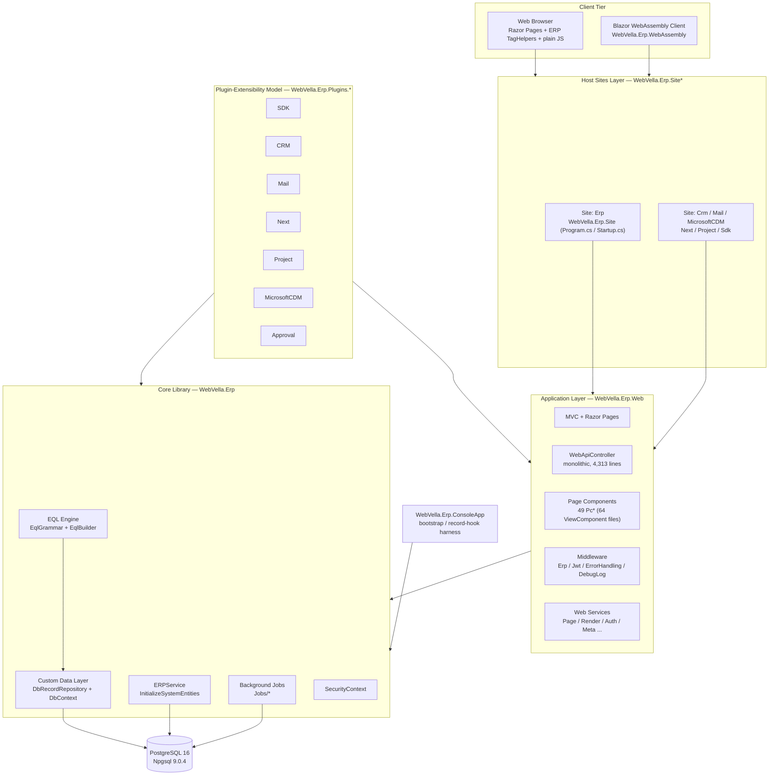
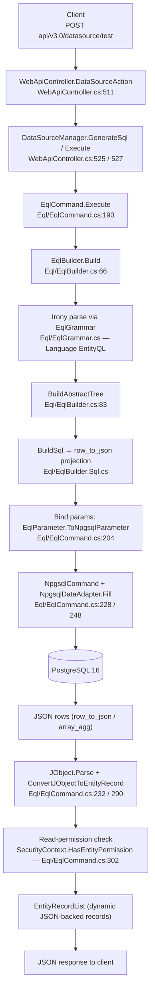
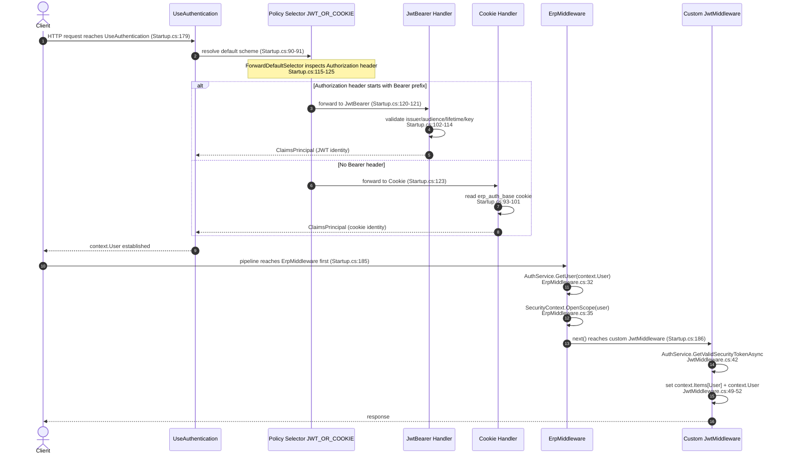
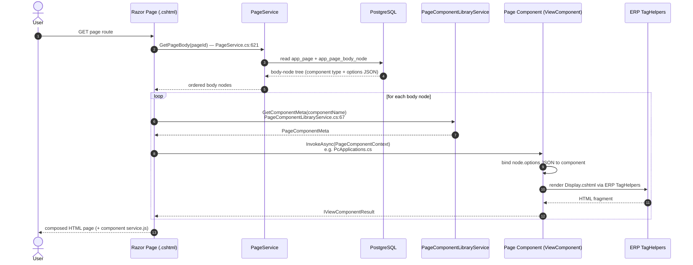
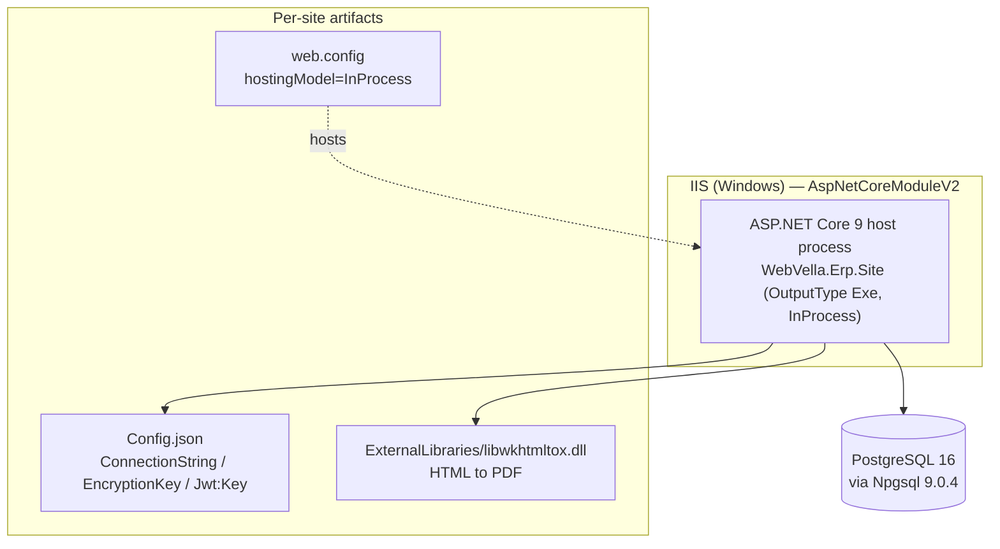

# System Architecture & Data Flow — WebVella ERP

> **Deliverable 2 of 7** · Reverse-Engineering Documentation Suite
> **Generated (UTC):** 2026-06-05 18:10 UTC
> **Analysis mode:** Read-only static inspection of the `WebVella.ERP3.sln` solution. **No production code, configuration, or schema artifact was modified.**
> **Companion deliverables:** [`code-inventory.md`](./code-inventory.md) · [`database-schema.md`](./database-schema.md) · [`functional-overview.md`](./functional-overview.md) · [`business-rules.md`](./business-rules.md) · `security-quality.md` _(forthcoming)_ · `modernization-roadmap.md` _(forthcoming)_
> **Suite index:** `README.md` _(forthcoming)_

---

## Executive Summary

WebVella ERP is a metadata-driven, extensible ERP platform built on **ASP.NET Core 9** over **PostgreSQL 16**. Its architecture is a **classic three-layer stack** — runnable **host Sites** delegate to a single **Web application layer** (`WebVella.Erp.Web`), which in turn depends on a shared **Core library** (`WebVella.Erp`) — wrapped in a **plugin-extensibility model** that loads optional capability modules (SDK, CRM, Mail, Next, Project, MicrosoftCDM, Approval) at startup.

Four architectural characteristics define the system as it is actually built and are documented in detail below:

1. **A custom data layer, not an off-the-shelf ORM.** Data access is hand-written, parameterized SQL executed through **Npgsql 9.0.4** (`WebVella.Erp/Database/DbRecordRepository.cs`), with records materialized from PostgreSQL JSON. There is **no Entity Framework Core**.
2. **A custom query language (EQL).** Read queries are expressed in **EQL** (`EntityQL`), parsed by an **Irony.NetCore 1.1.11** grammar (`WebVella.Erp/Eql/EqlGrammar.cs`) and translated to parameterized SQL by `WebVella.Erp/Eql/EqlBuilder.cs` + `EqlBuilder.Sql.cs`.
3. **A hybrid authentication scheme.** A policy scheme named `"JWT_OR_COOKIE"` (`WebVella.Erp.Site/Startup.cs`) routes requests carrying an `Authorization: Bearer` header to JWT bearer validation and all others to cookie authentication.
4. **A page-builder render model.** User-facing screens are composed at runtime from a persisted page tree (`app_page` / `app_page_body_node`) rendered by **page components** — ASP.NET Core ViewComponents under `WebVella.Erp.Web/Components/**` — using **ERP TagHelpers** (`WebVella.TagHelpers 1.7.2`) and plain JavaScript. The UI is **Razor Pages + Blazor WebAssembly + plain JS**, not Angular/React/TypeScript.

Deployment is plain ASP.NET Core host sites designed for **IIS in-process hosting** (`WebVella.Erp.Site/web.config` declares `AspNetCoreModuleV2` with `hostingModel="InProcess"`; `WebVella.Erp.Site/WebVella.Erp.Site.csproj` sets `<AspNetCoreHostingModel>InProcess</AspNetCoreHostingModel>`). There is **no Docker** artifact anywhere in the repository.

The HTTP API is intentionally noted as a structural observation: it is delivered through a **single, monolithic** `WebVella.Erp.Web/Controllers/WebApiController.cs` of **4,313 lines** (plus the 64-line base class `ApiControllerBase.cs`), rather than per-resource controllers.

This document renders the as-built architecture as narrative plus **six Mermaid diagrams**: a system component diagram, an EQL query-lifecycle data-flow diagram, a JWT-or-Cookie authentication sequence, a page-builder render sequence, a middleware-pipeline flow, and a deployment-topology diagram. Every architectural claim cites a real file, class, or method. Module names and file paths are kept identical to the shared taxonomy established in [`code-inventory.md`](./code-inventory.md) and the schema in [`database-schema.md`](./database-schema.md).

---

## Table of Contents

1. [Architectural Style & Runtime Topology](#1-architectural-style--runtime-topology)
2. [Layered + Plugin Composition](#2-layered--plugin-composition)
3. [EQL → SQL Data Path](#3-eql--sql-data-path)
4. [Authentication — JWT-or-Cookie Hybrid](#4-authentication--jwt-or-cookie-hybrid)
5. [Page-Builder Render Lifecycle](#5-page-builder-render-lifecycle)
6. [Cross-Cutting Concerns](#6-cross-cutting-concerns)
7. [Four Corrections — What This System Is *Not*](#7-four-corrections--what-this-system-is-not)
8. [Cross-Document Consistency Contracts](#8-cross-document-consistency-contracts)
9. [Source Citation Index](#9-source-citation-index)

---

## 1. Architectural Style & Runtime Topology

### 1.1 A classic layered architecture

WebVella ERP follows a strict, one-directional dependency chain across three layers. The shared module taxonomy used throughout this suite (see [`code-inventory.md`](./code-inventory.md) §2) names them:

| Layer | Module(s) | Responsibility |
|-------|-----------|----------------|
| **Host Sites** | `WebVella.Erp.Site*` (7 sites) | Runnable ASP.NET Core processes. Each thin host wires up Core + Web + a selection of plugins and supplies runtime configuration (`Program.cs`, `Startup.cs`, `Config.json`). |
| **Application (Web)** | `WebVella.Erp.Web` | MVC + Razor Pages, the monolithic `WebApiController`, page components, middleware, and web-tier services. |
| **Core** | `WebVella.Erp` | Domain/meta-model, the EQL engine, the custom Npgsql data layer, security, background jobs, and the plugin contract. |

The reference host is `WebVella.Erp.Site`. Its entry point is conventional rather than the minimal-hosting model: <code>WebVella.Erp.Site/Program.cs</code> builds an `IWebHost` via `WebHost.CreateDefaultBuilder(args).UseStartup<Startup>().Build()` and calls `.Run()`. All service registration and pipeline composition happen in `WebVella.Erp.Site/Startup.cs` (`ConfigureServices` and `Configure`).

Each of the seven sites references a different plugin set; the bindings (catalogued identically in [`code-inventory.md`](./code-inventory.md) §2.6) are:

| Site | Plugins referenced (beyond Web + Core) |
|------|----------------------------------------|
| `WebVella.Erp.Site` (reference) | SDK |
| `WebVella.Erp.Site.Crm` | Crm, Next, SDK |
| `WebVella.Erp.Site.Mail` | Mail, Next, SDK |
| `WebVella.Erp.Site.MicrosoftCDM` | MicrosoftCDM, SDK |
| `WebVella.Erp.Site.Next` | Next |
| `WebVella.Erp.Site.Project` | Next, Project, SDK |
| `WebVella.Erp.Site.Sdk` | Next, SDK |

### 1.2 The plugin-extensibility model

Wrapping the layers is a plugin model. A plugin is any class deriving from the abstract base `ErpPlugin` (`WebVella.Erp/ErpPlugin.cs`). Plugins are registered into the running `IErpService` via the `app.UseErpPlugin<T>()` extension and may contribute entities, pages, components, controllers, services, and schema patches. The seven plugins are `SDK`, `CRM`, `Mail`, `Next`, `Project`, `MicrosoftCDM`, and `Approval` (see §2.4 for the patch lifecycle and [`functional-overview.md`](./functional-overview.md) for capability detail).

### 1.3 Runtime & deployment

- **Framework / data store:** ASP.NET Core 9 on PostgreSQL 16. The Core library `WebVella.Erp` is versioned `1.7.4` (`WebVella.Erp/WebVella.Erp.csproj`).
- **Target frameworks:** 18 of 20 projects target `net9.0`; the two Blazor WebAssembly projects `WebVella.Erp.WebAssembly/Server` and `WebVella.Erp.WebAssembly/Shared` target the out-of-support `net7.0` (the WebAssembly `Client` project targets `net9.0`).
- **Hosting:** IIS **in-process**. `WebVella.Erp.Site/web.config` registers the `aspNetCore` handler with `modules="AspNetCoreModuleV2"` and `hostingModel="InProcess"`; the project sets `<OutputType>Exe</OutputType>` and `<AspNetCoreHostingModel>InProcess</AspNetCoreHostingModel>`.
- **Native dependency:** `ExternalLibraries/libwkhtmltox.dll` (wkhtmltopdf) provides HTML→PDF rendering.

A full deployment topology is rendered in §6.5.

---

## 2. Layered + Plugin Composition

### 2.1 Composition root — `AddErp` / `UseErp`

The platform is composed by two extension methods in `WebVella.Erp.Web/ErpMvcExtensions.cs` (class `ErpMvcServicesExtensions`):

**`IServiceCollection.AddErp()`** (`ErpMvcExtensions.cs:26`) registers the Core services into DI:

- `IErpService` → `ErpService` (singleton)
- `AuthService` (transient)
- `ErpRequestContext` (scoped)
- a Razor `ViewLocationExpander` (`ErpViewLocationExpander`) so plugin/component views resolve
- two background-job hosted services — `ErpJobScheduleService` and `ErpJobProcessService` (registered as `IHostedService`)
- `SecuritityCircuitHandler` (a Blazor `CircuitHandler`)

The host calls `services.AddErp()` from `WebVella.Erp.Site/Startup.cs:128`.

**`IApplicationBuilder.UseErp()`** (`ErpMvcExtensions.cs:39`) performs one-time platform initialization inside a system security scope. In order, it:

1. creates the database context — `DbContext.CreateContext(ErpSettings.ConnectionString)` (`ErpMvcExtensions.cs:64`);
2. configures AutoMapper for core + web + plugins (`ErpMvcExtensions.cs:68–76`);
3. calls **`service.InitializeSystemEntities()`** to create/seed the fixed schema (`ErpMvcExtensions.cs:83`);
4. seeds the default home page via `CheckCreateHomePage()` (`ErpMvcExtensions.cs:89`, defined at `:134`), whose root body node references the `WebVella.Erp.Web.Components.PcApplications` component (`ErpMvcExtensions.cs:162`);
5. initializes background jobs — `service.InitializeBackgroundJobs(...)` (`ErpMvcExtensions.cs:91`);
6. initializes the `ErpAppContext` (`ErpMvcExtensions.cs:93`);
7. runs **`service.InitializePlugins(app.ApplicationServices)`** (`ErpMvcExtensions.cs:101`), which drives each registered plugin's patch processing.

### 2.2 Core service initialization — `InitializeSystemEntities`

`WebVella.Erp/ERPService.cs` (1,472 lines) hosts the schema bootstrap. `InitializeSystemEntities()` (`ERPService.cs:18`) issues **17 embedded `CREATE TABLE` statements** that provision the fixed system tables — `entities`, `entity_relations`, `system_settings`, `system_search`, `files`, `jobs`, `schedule_plan`, `system_log`, `plugin_data`, `app`, `app_sitemap_area`, `app_sitemap_area_group`, `app_sitemap_area_node`, `app_page`, `app_page_body_node`, `data_source`, `app_page_data_source` (full per-table detail in [`database-schema.md`](./database-schema.md) §4). The same class also exposes `InitializePlugins` (`ERPService.cs:891`) and `InitializeBackgroundJobs` (`ERPService.cs:906`).

The `entities` and `entity_relations` tables are defined as `id uuid` + a single `"json" json` column — the physical storage for the **dynamic entity meta-model** in which user- and plugin-defined entities/fields are persisted as JSON records rather than as physical tables (see [`database-schema.md`](./database-schema.md) §5).

### 2.3 Plugin registration

A plugin is added to the live service via `UseErpPlugin<T>()` (`ErpMvcExtensions.cs:123`), which instantiates the plugin and appends it to `IErpService.Plugins`. The reference host registers the SDK plugin in its pipeline: `app.UseErpPlugin<SdkPlugin>()` (`WebVella.Erp.Site/Startup.cs:183`).

### 2.4 Plugin schema evolution — `ProcessPatches()` and dated patch methods

Plugins that own schema evolve it through a `ProcessPatches()` method that calls **date-versioned patch methods**. The SDK plugin is the canonical example:

- `SdkPlugin.cs:20` invokes `ProcessPatches()` during plugin initialization;
- `SdkPlugin._.cs:19` defines `public void ProcessPatches()`;
- dated patch files such as `SdkPlugin.20181215.cs:12` define `private static void Patch20181215(EntityManager entMan, EntityRelationManager relMan, RecordManager recMan)` (further patches `Patch20190227`, `Patch20200610`, `Patch20201221`, `Patch20210429`).

Patch coverage differs by plugin (consistent with [`code-inventory.md`](./code-inventory.md) §2.5 and [`database-schema.md`](./database-schema.md) §7.3): only **`SDK`, `Mail`, `Next`, and `Project`** ship dated `<Plugin>.YYYYMMDD.cs` files (25 in total). **`Crm`** and **`MicrosoftCDM`** define a `ProcessPatches()` shell whose `Patch20190123` call is commented out, and **`Approval`** defines no `ProcessPatches()` at all.

`Approval` nonetheless demonstrates **one** of the available plugin extension patterns: it ships a page component (`WebVella.Erp.Plugins.Approval/Components/PcApprovalDashboard/PcApprovalDashboard.cs`), a controller (`Controllers/ApprovalController.cs`), an API model (`Api/DashboardMetricsModel.cs`), and a service (`Services/DashboardMetricsService.cs`). This Component/Controller/Service/Api combination is **not** a universal plugin shape — plugin structure varies across the suite: `Crm` ships a `Model` folder only and `MicrosoftCDM` ships `Model` + `wwwroot` (neither has Controllers, Services, or Api folders); `Mail` ships `Services` + `Api` but no controllers; `Next` ships `Hooks` + `Model` + `Services` (no `Controllers`/`Api`/`Components`); and `Project` and `SDK` ship `Controllers` + `Services` but no `Api` folder.

### 2.5 Diagram 1 — System component diagram (C4-style)

```mermaid
flowchart TB
    subgraph ClientTier["Client Tier"]
        BROWSER["Web Browser<br/>Razor Pages + ERP TagHelpers + plain JS"]
        WASM["Blazor WebAssembly Client<br/>WebVella.Erp.WebAssembly"]
    end

    subgraph SitesLayer["Host Sites Layer — WebVella.Erp.Site*"]
        SITE_ERP["Site: Erp<br/>WebVella.Erp.Site (Program.cs / Startup.cs)"]
        SITE_OTHERS["Site: Crm / Mail / MicrosoftCDM<br/>Next / Project / Sdk"]
    end

    subgraph WebLayer["Application Layer — WebVella.Erp.Web"]
        MVC["MVC + Razor Pages"]
        API["WebApiController<br/>monolithic, 4,313 lines"]
        COMP["Page Components<br/>49 Pc* (64 ViewComponent files)"]
        MW["Middleware<br/>Erp / Jwt / ErrorHandling / DebugLog"]
        WSVC["Web Services<br/>Page / Render / Auth / Meta ..."]
    end

    subgraph CoreLayer["Core Library — WebVella.Erp"]
        ERPSVC["ERPService<br/>InitializeSystemEntities"]
        EQL["EQL Engine<br/>EqlGrammar + EqlBuilder"]
        DAL["Custom Data Layer<br/>DbRecordRepository + DbContext"]
        JOBS["Background Jobs<br/>Jobs/*"]
        SEC["SecurityContext"]
    end

    subgraph PluginLayer["Plugin-Extensibility Model — WebVella.Erp.Plugins.*"]
        P_SDK["SDK"]
        P_CRM["CRM"]
        P_MAIL["Mail"]
        P_NEXT["Next"]
        P_PROJ["Project"]
        P_CDM["MicrosoftCDM"]
        P_APPR["Approval"]
    end

    DB[("PostgreSQL 16<br/>Npgsql 9.0.4")]
    CONSOLE["WebVella.Erp.ConsoleApp<br/>bootstrap / record-hook harness"]

    BROWSER --> SitesLayer
    WASM --> SitesLayer
    SITE_ERP --> WebLayer
    SITE_OTHERS --> WebLayer
    WebLayer --> CoreLayer
    PluginLayer --> WebLayer
    PluginLayer --> CoreLayer
    EQL --> DAL
    DAL --> DB
    ERPSVC --> DB
    JOBS --> DB
    CONSOLE --> CoreLayer
```

The diagram captures the one-directional dependency flow (Sites → Web → Core → PostgreSQL), the plugin layer that extends both Web and Core, and the two non-web entry points: the Blazor WebAssembly client and the `WebVella.Erp.ConsoleApp` harness.

---

## 3. EQL → SQL Data Path

WebVella ERP does not use Entity Framework Core. Read access is expressed in a custom query language, **EQL** (the grammar declares the language name `EntityQL`), which is parsed, translated to parameterized SQL, executed through Npgsql, and materialized from PostgreSQL JSON into dynamic `EntityRecord` objects. This section traces that pipeline end-to-end.

### 3.1 EQL grammar (Irony)

`WebVella.Erp/Eql/EqlGrammar.cs` (121 lines) defines an `internal class EqlGrammar : Grammar` decorated with `[Language("EntityQL")]`, built on **Irony.NetCore 1.1.11** (`using Irony.Parsing`). The grammar declares a SQL-like surface syntax with terminals for `SELECT`, `FROM`, `WHERE`, `ORDER BY`, `PAGE`, `PAGESIZE`, `ASC`, `DESC`, plus string/number/identifier and `@argument` parameter terminals, and comment terminals for `/* */` and `--`.

### 3.2 Parse → abstract tree → SQL (`EqlBuilder`)

The translation is implemented across a partial class `EqlBuilder`:

- `WebVella.Erp/Eql/EqlBuilder.cs` — the `Build(...)` entry point (`EqlBuilder.cs:66`) constructs an `EqlGrammar`, runs the Irony `Parser` over the EQL text (`Parse(...)` at `:76`), converts the parse tree to an abstract tree via `BuildAbstractTree(...)` (`:83`), then emits SQL with `BuildSql(...)` (`:96`).
- `WebVella.Erp/Eql/EqlBuilder.Sql.cs` (960 lines) — the SQL emitter. It composes a PostgreSQL JSON projection: the outer query is `SELECT row_to_json( X ) FROM ( ... ) X`, and nested relations are emitted with `array_to_json(array_agg(row_to_json(d)))`, so a query returns its result set as JSON. A windowed `COUNT(*) OVER()` is added as `___total_count___` for pagination totals.

The `Build(...)` result (`EqlBuildResult`) carries the generated `Sql`, the list of `EqlParameter`s, and the field/relation `Meta` used to rehydrate records.

### 3.3 Parameterized execution over Npgsql

`WebVella.Erp/Eql/EqlCommand.cs` orchestrates execution. `EqlCommand.Execute()` (`EqlCommand.cs:190`):

1. builds the SQL (`new EqlBuilder(...).Build(Parameters)`);
2. converts each `EqlParameter` to a real ADO.NET parameter via `ToNpgsqlParameter()` (`EqlCommand.cs:204`) — **all user values are bound as parameters, never string-concatenated**;
3. creates an `NpgsqlCommand`, sets `CommandTimeout = 600`, and fills a `DataTable` through an `NpgsqlDataAdapter` (`EqlCommand.cs:228` / `:248`).

The same parameterized discipline governs the lower-level repository `WebVella.Erp/Database/DbRecordRepository.cs` (2,097 lines), which builds `NpgsqlCommand`s and adds `NpgsqlParameter`s for record CRUD (e.g., `DbRecordRepository.cs:215`, `:1196`, `:1282`) and `GenerateWhereClause(...)` (`:1167`). Connections are produced by `WebVella.Erp/Database/DbContext.cs` — `CreateContext(connString)` (`DbContext.cs:111`) and `CreateConnection()` (`:54`) — a thread-scoped Npgsql connection factory. This is the "custom ORM" referenced throughout the suite: raw, parameterized Npgsql, not EF Core.

### 3.4 JSON record materialization

Because every row arrives as a JSON document, `EqlCommand` parses each row with `JObject.Parse((string)dr[0])` (`EqlCommand.cs:232` / `:251`) and converts it to an `EntityRecord` via `ConvertJObjectToEntityRecord(...)` (`:290`). During conversion the engine enforces field-level access by calling `SecurityContext.HasEntityPermission(EntityPermission.Read, entity)` (`EqlCommand.cs:302`) and applies `DbRecordRepository.ExtractFieldValue(...)` for type coercion. If present, `___total_count___` populates `EntityRecordList.TotalCount`. Post-search record hooks are dispatched through `RecordHookManager` when any are registered for the entity (`EqlCommand.cs:207`, `:240`).

### 3.5 API entry point — `datasource/test`

The EQL→SQL path is exposed for tooling through the monolithic Web API. In `WebVella.Erp.Web/Controllers/WebApiController.cs`, the route `[Route("api/v3.0/datasource/test")]` (`WebApiController.cs:511`) accepts a `DataSourceTestModel` and, via a `DataSourceManager`, either returns the generated SQL — `dataSourceManager.GenerateSql(model.Eql, model.Parameters, model.ReturnTotal)` (`WebApiController.cs:525`) — or executes it and serializes the records — `dataSourceManager.Execute(...)` (`:527`). A sibling route `[Route("api/v3.0/datasource/code-compile")]` (`:494`) compiles C# data-source code at runtime via `CodeEvalService.Compile(...)` (analyzed as a remote-code-execution surface in `security-quality.md`, a forthcoming deliverable).

### 3.6 Diagram 2 — EQL query lifecycle (request data-flow)

```mermaid
flowchart TD
    A["Client<br/>POST api/v3.0/datasource/test"] --> B["WebApiController.DataSourceAction<br/>WebApiController.cs:511"]
    B --> C["DataSourceManager.GenerateSql / Execute<br/>WebApiController.cs:525 / 527"]
    C --> D["EqlCommand.Execute<br/>Eql/EqlCommand.cs:190"]
    D --> E["EqlBuilder.Build<br/>Eql/EqlBuilder.cs:66"]
    E --> F["Irony parse via EqlGrammar<br/>Eql/EqlGrammar.cs — Language EntityQL"]
    F --> G["BuildAbstractTree<br/>Eql/EqlBuilder.cs:83"]
    G --> H["BuildSql → row_to_json projection<br/>Eql/EqlBuilder.Sql.cs"]
    H --> I["Bind params: EqlParameter.ToNpgsqlParameter<br/>Eql/EqlCommand.cs:204"]
    I --> J["NpgsqlCommand + NpgsqlDataAdapter.Fill<br/>Eql/EqlCommand.cs:228 / 248"]
    J --> K[("PostgreSQL 16")]
    K --> L["JSON rows (row_to_json / array_agg)"]
    L --> M["JObject.Parse + ConvertJObjectToEntityRecord<br/>Eql/EqlCommand.cs:232 / 290"]
    M --> N["Read-permission check<br/>SecurityContext.HasEntityPermission — Eql/EqlCommand.cs:302"]
    N --> O["EntityRecordList (dynamic JSON-backed records)"]
    O --> P["JSON response to client"]
```

---

## 4. Authentication — JWT-or-Cookie Hybrid

WebVella ERP supports two credential styles on the same endpoints: **cookie** sessions for the interactive web UI and **JWT bearer** tokens for API clients. A custom policy scheme picks the correct handler per request. The entire configuration lives in `WebVella.Erp.Site/Startup.cs`.

### 4.1 Scheme registration

`ConfigureServices` calls `services.AddAuthentication(...)` and sets both the default and challenge schemes to the string `"JWT_OR_COOKIE"` (`Startup.cs:90–91`). Three schemes are then registered:

- **Cookie** — `.AddCookie(CookieAuthenticationDefaults.AuthenticationScheme, ...)` (`Startup.cs:93–101`): an `HttpOnly` cookie named `erp_auth_base`, with `LoginPath = /login`, `LogoutPath = /logout`, and `AccessDeniedPath = /error?access_denied`.
- **JWT bearer** — `.AddJwtBearer(JwtBearerDefaults.AuthenticationScheme, ...)` (`Startup.cs:102–114`): `TokenValidationParameters` validate issuer, audience, lifetime, and signing key, sourced from configuration `Settings:Jwt:Issuer` (`:110`), `Settings:Jwt:Audience` (`:111`), and a `SymmetricSecurityKey` built from `Settings:Jwt:Key` (`:112`).
- **The policy selector** — `.AddPolicyScheme("JWT_OR_COOKIE", "JWT_OR_COOKIE", ...)` (`Startup.cs:115–125`).

### 4.2 The policy selector

The policy scheme's `ForwardDefaultSelector` (`Startup.cs:117`) inspects the inbound `Authorization` header: if it is non-empty and starts with `"Bearer "`, the request is forwarded to the JWT bearer scheme (`Startup.cs:120–121`); otherwise it falls through to the cookie scheme (`:123`). This is what allows a single set of routes to serve both browser sessions and token-bearing API calls.

### 4.3 `ErpMiddleware`, custom `JwtMiddleware`, and the `SecurityContext` bridge

The `ClaimsPrincipal` that the ERP-specific middleware consumes is the one already produced by ASP.NET `UseAuthentication` (§4.1–4.2) — built by whichever handler the policy scheme selected (the JwtBearer handler for `Bearer` requests, otherwise the cookie handler). Both custom middleware components run **after** `UseAuthentication`/`UseAuthorization`, and `ErpMiddleware` runs **before** the custom `JwtMiddleware` (`Startup.cs:185` then `:186`; see §4.4).

`ErpMiddleware` (`WebVella.Erp.Web/Middleware/ErpMiddleware.cs`) runs first and bridges the ASP.NET principal into the ERP authorization world. `Invoke(HttpContext)` opens a per-request `DbContext` (`ErpMiddleware.cs:29`), resolves the `ErpUser` from the already-authenticated principal via `AuthService.GetUser(context.User)` (`:32`), and — when a user resolves — opens a security scope with `SecurityContext.OpenScope(user)` (`:35`); if the principal is authenticated but no ERP user resolves, it signs the cookie out (`:41`). It then invokes the remainder of the pipeline with `await next(context)` (`:45`) and disposes both the DB and security scopes after the request completes (`:46–52`). Because this runs before the custom `JwtMiddleware`, the principal it reads is the one created by `UseAuthentication`, **not** by the custom middleware.

The custom `WebVella.Erp.Web/Middleware/JwtMiddleware.cs` runs next, inside `ErpMiddleware`'s `next(context)` call. `Invoke(HttpContext)` (`JwtMiddleware.cs:21`) obtains a token from `GetTokenAsync("access_token")` (`:23`) or by stripping the 7-character `"Bearer "` prefix off the `Authorization` header (`:26–32`); when a token is present it validates it via `AuthService.GetValidSecurityTokenAsync(token)` (`:42`), loads the user with `new SecurityManager().GetUser(...)` (`:48`), sets `context.Items["User"]`, and replaces `context.User` with a JWT `ClaimsPrincipal` built from the token's claims (`:49–52`). Validation failures are swallowed (`:56–60`), leaving the existing principal in place rather than throwing.

### 4.4 Pipeline order

`Configure` wires the request pipeline so authentication precedes the ERP-specific middleware (`Startup.cs:179–186`):

`UseAuthentication` (`:179`) → `UseAuthorization` (`:180`) → `UseErpPlugin<SdkPlugin>()` (`:183`) → `UseErp()` (`:184`) → `UseErpMiddleware()` (`:185`) → `UseJwtMiddleware()` (`:186`), followed by `UseEndpoints` mapping Razor Pages and the default controller route (`:189–193`). The `UseErpMiddleware`/`UseJwtMiddleware` extensions are defined in `WebVella.Erp.Web/Middleware/ErpAppBuilderExtensions.cs` (class `AppBuilderExtensions`).

### 4.5 Diagram 3 — Authentication sequence

```mermaid
sequenceDiagram
    autonumber
    actor C as Client
    participant AUTH as UseAuthentication
    participant PS as Policy Selector JWT_OR_COOKIE
    participant JWT as JwtBearer Handler
    participant CK as Cookie Handler
    participant ERP as ErpMiddleware
    participant MW as Custom JwtMiddleware

    C->>AUTH: HTTP request reaches UseAuthentication (Startup.cs:179)
    AUTH->>PS: resolve default scheme (Startup.cs:90-91)
    Note over PS: ForwardDefaultSelector inspects Authorization header<br/>Startup.cs:115-125
    alt Authorization header starts with Bearer prefix
        PS->>JWT: forward to JwtBearer (Startup.cs:120-121)
        JWT->>JWT: validate issuer/audience/lifetime/key<br/>Startup.cs:102-114
        JWT-->>AUTH: ClaimsPrincipal (JWT identity)
    else No Bearer header
        PS->>CK: forward to Cookie (Startup.cs:123)
        CK->>CK: read erp_auth_base cookie<br/>Startup.cs:93-101
        CK-->>AUTH: ClaimsPrincipal (cookie identity)
    end
    AUTH-->>C: context.User established
    C->>ERP: pipeline reaches ErpMiddleware first (Startup.cs:185)
    ERP->>ERP: AuthService.GetUser(context.User)<br/>ErpMiddleware.cs:32
    ERP->>ERP: SecurityContext.OpenScope(user)<br/>ErpMiddleware.cs:35
    ERP->>MW: next() reaches custom JwtMiddleware (Startup.cs:186)
    MW->>MW: AuthService.GetValidSecurityTokenAsync<br/>JwtMiddleware.cs:42
    MW->>MW: set context.Items[User] + context.User<br/>JwtMiddleware.cs:49-52
    MW-->>C: response
```

---

## 5. Page-Builder Render Lifecycle

User-facing screens in WebVella ERP are not hard-coded views. A page is a **tree of body nodes** persisted in the database; each node names a **page component**, and components render themselves through Razor views and ERP TagHelpers. This is the mechanism the SDK app-builder UI manipulates.

### 5.1 The persisted page tree

Pages and their content are stored in the fixed system tables `app_page` and `app_page_body_node` (created by `ERPService.InitializeSystemEntities`; documented in [`database-schema.md`](./database-schema.md) §4.14–4.15). The page tree is read and written by `WebVella.Erp.Web/Services/PageService.cs` (derives from `BaseService`): `GetAll(...)` (`PageService.cs:42`), `GetPage(...)` (`:64`), `GetPageBody(pageId)` (`:621`), `GetPageNodes(pageId)` (`:670`), `CreatePage(...)` (`:194`), and `CreatePageBodyNode(...)` (`:692`). Each body-node row records the parent/weight (ordering), the fully-qualified component type name (for example `WebVella.Erp.Web.Components.PcApplications`), and a JSON `options` blob that configures that component instance.

### 5.2 Page components are ViewComponents

A page component is an ASP.NET Core **ViewComponent** that derives from the base `PageComponent` (`WebVella.Erp.Web/Models/PageComponent.cs`) and is decorated with a `[PageComponent(...)]` attribute (`Models/PageComponentAttribute.cs`) carrying its label, library, and version metadata. There are **64** ViewComponent files under `WebVella.Erp.Web/Components/**`, of which **49** are `Pc`-prefixed page components (**48** decorated with `[PageComponent]`); the remaining **15** are infrastructure ViewComponents (menus, includes, nav). The reference component `WebVella.Erp.Web/Components/PcApplications/PcApplications.cs` shows the contract: a `[PageComponent(Label = "Application list", Library = "WebVella", ...)]` class implementing `public async Task<IViewComponentResult> InvokeAsync(PageComponentContext context)`, where `context.Node` is the persisted body node whose `options` JSON the component binds to.

Each component ships a set of mode-specific Razor views and a client script — for example `PcApplications` includes `Display.cshtml` (runtime), `Design.cshtml` (builder canvas), `Options.cshtml` (configuration), `Help.cshtml`, `Error.cshtml`, and `service.js`. Rendering uses **ERP TagHelpers** (`WebVella.TagHelpers 1.7.2`) and plain JavaScript — there is no Angular/React/TypeScript layer.

### 5.3 Component library & rendering services

- `WebVella.Erp.Web/Services/PageComponentLibraryService.cs` is the component registry: `GetPageComponentsList()` (`:13`) returns the available `PageComponentMeta` set and `GetComponentMeta(componentName)` (`:67`) resolves a single component's metadata — this is how the builder enumerates installable components and how a node's type name is mapped to a renderable component.
- `WebVella.Erp.Web/Services/RenderService.cs` (487 lines) provides template/HTML rendering helpers used by components and pages, including `RenderHtmlWithTemplate(template, EntityRecord, ErpRequestContext, ErpAppContext)` (`:126`) and menu-tree assembly via `ConvertListToTree(...)` (`:454`).

### 5.4 Diagram 4 — Page render sequence

```mermaid
sequenceDiagram
    autonumber
    actor U as User
    participant RP as Razor Page (.cshtml)
    participant PSVC as PageService
    participant DB as PostgreSQL
    participant LIB as PageComponentLibraryService
    participant VC as Page Component (ViewComponent)
    participant TH as ERP TagHelpers

    U->>RP: GET page route
    RP->>PSVC: GetPageBody(pageId) — PageService.cs:621
    PSVC->>DB: read app_page + app_page_body_node
    DB-->>PSVC: body-node tree (component type + options JSON)
    PSVC-->>RP: ordered body nodes
    loop for each body node
        RP->>LIB: GetComponentMeta(componentName)<br/>PageComponentLibraryService.cs:67
        LIB-->>RP: PageComponentMeta
        RP->>VC: InvokeAsync(PageComponentContext)<br/>e.g. PcApplications.cs
        VC->>VC: bind node.options JSON to component
        VC->>TH: render Display.cshtml via ERP TagHelpers
        TH-->>VC: HTML fragment
        VC-->>RP: IViewComponentResult
    end
    RP-->>U: composed HTML page (+ component service.js)
```

---

## 6. Cross-Cutting Concerns

### 6.1 Middleware

Beyond the framework middleware, the platform adds a small middleware set under `WebVella.Erp.Web/Middleware/**`, registered through `AppBuilderExtensions` (`ErpAppBuilderExtensions.cs`):

| Middleware | File | Responsibility |
|------------|------|----------------|
| `ErpMiddleware` | `ErpMiddleware.cs` | Per-request bridge: creates the `DbContext`, resolves the `ErpUser`, opens/closes the `SecurityContext` scope, and enables synchronous IO. |
| `JwtMiddleware` | `JwtMiddleware.cs` | Resolves a bearer token to an ERP user and attaches the JWT `ClaimsPrincipal` (see §4.3). |
| `ErpErrorHandlingMiddleware` | `ErpErrorHandlingMiddleware.cs` | Wraps the pipeline in try/catch; on exception logs through `LogService.Create(LogType.Error, "Global", ex, request)` (`:53`) and rethrows. Registered as `UseErrorHandlingMiddleware()` for non-development environments (`Startup.cs:155`). |
| `ErpDebugLogMiddleware` | `ErpDebugLogMiddleware.cs` | Optional debug request logging (`UseDebugLogMiddleware()`). |
| `SecuritityCircuitHandler` | `SecuritityCircuitHandler.cs` | A Blazor `CircuitHandler` (registered in `AddErp`) that propagates the security scope into Blazor circuits. *(File name spelled as in source.)* |

### 6.2 Background jobs

Background processing lives in `WebVella.Erp/Jobs/**` — `ErpBackgroundServices.cs`, `ErpJob.cs`, `JobManager.cs`, `JobPool.cs`, `JobDataService.cs`, `JobAttribute.cs`, and `SheduleManager.cs` *(spelled as in source)*. The two `IHostedService` implementations registered in `AddErp` (`ErpJobScheduleService`, `ErpJobProcessService`) drive scheduling and execution; job state is persisted to the `jobs` and `schedule_plan` tables (see [`database-schema.md`](./database-schema.md) §4.6–4.7). Per-site activation is gated by the `EnableBackgroundJobs` flag in `Config.json`.

### 6.3 API surface — a single monolithic controller

The HTTP API is delivered through **one** controller, `WebVella.Erp.Web/Controllers/WebApiController.cs`, which is **4,313 lines** long and inherits the 64-line base `ApiControllerBase.cs`. Rather than per-resource controllers, it concentrates record CRUD, data-source testing/compilation (§3.5), UI-state, file, and administrative endpoints in a single type. This is recorded here as an architectural fact; its maintainability implications will be quantified in `security-quality.md` and addressed in `modernization-roadmap.md` (both forthcoming deliverables).

### 6.4 Diagram 5 — Request middleware pipeline

```mermaid
flowchart LR
    REQ["HTTP Request"] --> RL["UseRequestLocalization<br/>Startup.cs:136"]
    RL --> EH["UseErrorHandlingMiddleware<br/>(non-dev) Startup.cs:155"]
    EH --> RC["UseResponseCompression<br/>Startup.cs:161"]
    RC --> CORS["UseCors<br/>Startup.cs:164"]
    CORS --> SF["UseStaticFiles<br/>Startup.cs:166-176"]
    SF --> RT["UseRouting<br/>Startup.cs:177"]
    RT --> AUTHN["UseAuthentication<br/>Startup.cs:179"]
    AUTHN --> AUTHZ["UseAuthorization<br/>Startup.cs:180"]
    AUTHZ --> PLUG["UseErpPlugin&lt;SdkPlugin&gt;<br/>Startup.cs:183"]
    PLUG --> UE["UseErp<br/>Startup.cs:184"]
    UE --> EM["UseErpMiddleware (ErpMiddleware)<br/>Startup.cs:185"]
    EM --> JM["UseJwtMiddleware (JwtMiddleware)<br/>Startup.cs:186"]
    JM --> EP["UseEndpoints<br/>MapRazorPages + MapControllerRoute<br/>Startup.cs:189-193"]
    EP --> RESP["Response"]
```

### 6.5 Diagram 6 — Deployment topology (IIS InProcess)

```mermaid
flowchart TB
    subgraph IIS["IIS (Windows) — AspNetCoreModuleV2"]
        HOST["ASP.NET Core 9 host process<br/>WebVella.Erp.Site (OutputType Exe, InProcess)"]
    end

    subgraph SiteFiles["Per-site artifacts"]
        WEBCONFIG["web.config<br/>hostingModel=InProcess"]
        CONFIG["Config.json<br/>ConnectionString / EncryptionKey / Jwt:Key"]
        EXT["ExternalLibraries/libwkhtmltox.dll<br/>HTML to PDF"]
    end

    DB[("PostgreSQL 16<br/>via Npgsql 9.0.4")]

    WEBCONFIG -.->|hosts| HOST
    HOST --> CONFIG
    HOST --> EXT
    HOST --> DB
```

> **No containerization.** There is no `Dockerfile` or `docker-compose` anywhere in the repository; containerization appears only as a recommendation in `modernization-roadmap.md` (a forthcoming deliverable), never as existing state.

---

## 7. Four Corrections — What This System Is *Not*

Reverse-engineering surfaced four points where the system's actual architecture differs from common assumptions. These corrections are honored throughout this document and the rest of the suite.

| # | Common assumption | Verified reality (this system) | Primary evidence |
|---|-------------------|--------------------------------|------------------|
| 1 | Entity Framework Core ORM | **Custom data layer** — hand-written, parameterized Npgsql SQL with JSON-serialized dynamic records | `WebVella.Erp/Database/DbRecordRepository.cs`, `WebVella.Erp/Eql/EqlCommand.cs`, `WebVella.Erp/WebVella.Erp.csproj` (`Npgsql 9.0.4`) |
| 2 | Angular / React / TypeScript frontend | **Razor Pages + ERP TagHelpers + Blazor WebAssembly + plain JS** (no `.ts` files) | `WebVella.Erp.Web/Components/**`, `WebVella.Erp.WebAssembly/**`, `WebVella.TagHelpers 1.7.2` |
| 3 | EF Core Migrations folder | **Code-embedded DDL + dated plugin patch methods** (no `Migrations/`, no `.sql` files) | `WebVella.Erp/ERPService.cs` (`InitializeSystemEntities`), `WebVella.Erp.Plugins.SDK/SdkPlugin.20181215.cs` (`Patch20181215`) |
| 4 | Docker containerization | **No Docker.** Plain ASP.NET Core host sites on IIS in-process | `WebVella.Erp.Site/web.config` (`hostingModel="InProcess"`), `WebVella.Erp.Site/Program.cs` |

---

## 8. Cross-Document Consistency Contracts

This deliverable upholds the suite-wide consistency contracts defined in [`code-inventory.md`](./code-inventory.md) §6:

- **Module taxonomy.** Component/layer names used here — Core (`WebVella.Erp`), Web (`WebVella.Erp.Web`), WebAssembly (`WebVella.Erp.WebAssembly`), ConsoleApp (`WebVella.Erp.ConsoleApp`), the 7 Plugins (`SDK`, `CRM`, `Mail`, `Next`, `Project`, `MicrosoftCDM`, `Approval`), and the 7 Sites (`WebVella.Erp.Site*`) — are identical to [`code-inventory.md`](./code-inventory.md) §2 and will match the module catalog in [`functional-overview.md`](./functional-overview.md).
- **File paths.** Every path cited here is catalogued in [`code-inventory.md`](./code-inventory.md).
- **Schema names.** The tables referenced in §2.2 and §5.1 (`entities`, `app_page`, `app_page_body_node`, `jobs`, `schedule_plan`, `data_source`, …) match the per-table dictionary in [`database-schema.md`](./database-schema.md) §4 and the rows of [`data-dictionary.csv`](./data-dictionary.csv).
- **Findings hand-off.** The structural observations here (monolithic `WebApiController`; the `datasource/code-compile` runtime-compilation surface; `net7.0` WebAssembly projects) will feed the assessments in `security-quality.md` and the phases of `modernization-roadmap.md` (both forthcoming deliverables).

---

## 9. Source Citation Index

Every architectural claim in this document resolves to one of the following real source locations.

| Concern | File | Key symbols / lines |
|---------|------|---------------------|
| Host bootstrap | `WebVella.Erp.Site/Program.cs` | `Main`, `BuildWebHost`, `WebHost.CreateDefaultBuilder().UseStartup<Startup>()` |
| Service & pipeline composition | `WebVella.Erp.Site/Startup.cs` | `ConfigureServices`; `AddAuthentication`/`DefaultScheme` (90); `AddCookie` (93–101); `AddJwtBearer` (102–114); `AddPolicyScheme`/`ForwardDefaultSelector` (115–125); `AddErp` (128); pipeline `UseAuthentication`→…→`UseJwtMiddleware` (179–186); `UseErpPlugin<SdkPlugin>()` (183) |
| IIS in-process hosting | `WebVella.Erp.Site/web.config`, `WebVella.Erp.Site/WebVella.Erp.Site.csproj` | `AspNetCoreModuleV2`, `hostingModel="InProcess"`; `<AspNetCoreHostingModel>InProcess</AspNetCoreHostingModel>` |
| DI / platform init | `WebVella.Erp.Web/ErpMvcExtensions.cs` | `AddErp` (26); `UseErp` (39); `InitializeSystemEntities` call (83); `InitializePlugins` call (101); `UseErpPlugin<T>` (123) |
| Core schema bootstrap | `WebVella.Erp/ERPService.cs` | `InitializeSystemEntities` (18); 17 `CREATE TABLE` statements (937–1399); `InitializePlugins` (891); `InitializeBackgroundJobs` (906) |
| Plugin contract | `WebVella.Erp/ErpPlugin.cs`; `WebVella.Erp.Plugins.SDK/SdkPlugin.cs`, `SdkPlugin._.cs`, `SdkPlugin.20181215.cs` | `ErpPlugin`; `ProcessPatches` (`SdkPlugin._.cs:19`); `Patch20181215` (`:12`) |
| Representative plugin | `WebVella.Erp.Plugins.Approval/**` | `PcApprovalDashboard.cs`, `ApprovalController.cs`, `DashboardMetricsModel.cs`, `DashboardMetricsService.cs` |
| EQL grammar | `WebVella.Erp/Eql/EqlGrammar.cs` | `[Language("EntityQL")]`, `EqlGrammar : Grammar` |
| EQL → SQL builder | `WebVella.Erp/Eql/EqlBuilder.cs`, `EqlBuilder.Sql.cs` | `Build` (66), `Parse` (76), `BuildAbstractTree` (83), `BuildSql` (96); `row_to_json` projection |
| EQL execution | `WebVella.Erp/Eql/EqlCommand.cs` | `Execute` (190); `ToNpgsqlParameter` (204); `NpgsqlDataAdapter.Fill` (228/248); `ConvertJObjectToEntityRecord` (290); `HasEntityPermission` (302) |
| Custom data layer | `WebVella.Erp/Database/DbRecordRepository.cs`, `DbContext.cs` | `NpgsqlParameter` usage (215/1196/1282); `GenerateWhereClause` (1167); `CreateContext` (111), `CreateConnection` (54) |
| API surface | `WebVella.Erp.Web/Controllers/WebApiController.cs`, `ApiControllerBase.cs` | 4,313 lines; `datasource/test` (511), `GenerateSql` (525), `Execute` (527), `datasource/code-compile` (494) |
| JWT middleware | `WebVella.Erp.Web/Middleware/JwtMiddleware.cs` | `Invoke` (21); `GetValidSecurityTokenAsync` (42); principal attach (49–52) |
| ERP / error middleware | `WebVella.Erp.Web/Middleware/ErpMiddleware.cs`, `ErpErrorHandlingMiddleware.cs`, `ErpAppBuilderExtensions.cs` | `SecurityContext.OpenScope` (`ErpMiddleware.cs:35`); `LogService.Create` (`ErpErrorHandlingMiddleware.cs:53`); `UseErpMiddleware`/`UseJwtMiddleware` |
| Page tree & components | `WebVella.Erp.Web/Services/PageService.cs`, `PageComponentLibraryService.cs`, `Models/PageComponent.cs`, `Components/PcApplications/PcApplications.cs` | `GetPageBody` (621), `GetPageNodes` (670); `GetComponentMeta` (67); `PageComponent`; `InvokeAsync(PageComponentContext)` |
| Render helpers | `WebVella.Erp.Web/Services/RenderService.cs` | `RenderHtmlWithTemplate` (126); `ConvertListToTree` (454) |
| Background jobs | `WebVella.Erp/Jobs/**` | `ErpBackgroundServices`, `JobManager`, `JobPool`, `SheduleManager` |

---

*End of Deliverable 2 — System Architecture & Data Flow. Generated read-only from the `WebVella.ERP3.sln` source tree; no production code, configuration, or schema was modified in producing this document.*

