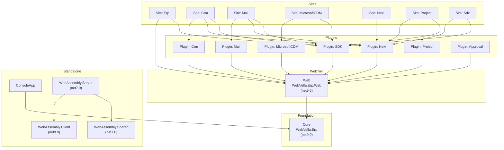

# Code Inventory Report — WebVella ERP

> **Deliverable 1 of 7** · Reverse-Engineering Documentation Suite
> **Generated (UTC):** 2026-06-05 15:02 UTC
> **Analysis mode:** Read-only static inspection of the `WebVella.ERP3.sln` solution. **No production code, configuration, or schema artifact was modified.**
> **Companion data export:** [`code-inventory.csv`](./code-inventory.csv)
> **Suite index:** [`README.md`](./README.md)

---

## Executive Summary

This report is the **foundational coverage map** for the entire reverse-engineering suite. It catalogs the WebVella ERP source tree, groups every file into a stable **module taxonomy**, and records per-module file counts, lines-of-code (LOC), and the inter-project dependency tree. The module names and canonical file paths established here are reused **verbatim** by [`architecture.md`](./architecture.md), [`functional-overview.md`](./functional-overview.md), [`business-rules.md`](./business-rules.md), and [`security-quality.md`](./security-quality.md), so that every document in the suite reconciles against a single source of truth.

WebVella ERP is an **open-source, metadata-driven ERP platform** built on **ASP.NET Core 9** over **PostgreSQL 16**. The core library `WebVella.Erp` is versioned **1.7.4** and licensed **Apache-2.0**. The solution is organized as a classic **layered architecture** (Sites → Web → Core) wrapped in a **plugin-extensibility model** (SDK, CRM, Mail, Next, Project, MicrosoftCDM, Approval).

At a glance:

| Metric | Value |
|--------|-------|
| Primary source files cataloged | **1,315** (excludes `bin/`, `obj/`, `.git/`, `node_modules/`) |
| — C# (`.cs`) | **703** files (~137,605 source lines) |
| — Razor views (`.cshtml`) | **400** files (~17,929 source lines) |
| — Blazor components (`.razor`) | **11** files |
| — JavaScript (`.js`) | **181** files |
| — MSBuild project files (`.csproj`) | **20** files |
| TypeScript (`.ts`) files | **0** (the front end is Razor + Blazor + plain JS, **not** Angular/React/TypeScript) |
| Projects in the solution | **20** total — **18** target `net9.0`, **2** target `net7.0` |
| Largest single file | `WebVella.Erp.Web/Controllers/WebApiController.cs` — **4,313 lines** |
| Data-access strategy | **Custom Npgsql data layer** (raw parameterized SQL + dynamic JSON record model) — **not** Entity Framework Core |
| Database provisioning | **Code-embedded DDL** + **date-versioned plugin patch methods** — **no** `.sql` files and **no** EF Migrations folder |
| Containerization | **None present** — no `Dockerfile` or `docker-compose` anywhere in the repository |

The companion [`code-inventory.csv`](./code-inventory.csv) enumerates **every** primary source file (1,328 rows = the 1,315 primary files plus 13 host `Config.json`/`appsettings*.json` files), delivering **100% coverage** of in-scope primary files against the **≥95%** target. Each CSV row carries per-file `Module`, `File Path`, `Language`, `Dependencies`, `LOC`, `Last Modified`, `Primary Purpose`, and `Complexity Score`.

This document reports the system **as built**. Forward-looking recommendations (modular decomposition, containerization, dependency upgrades) are deliberately confined to [`modernization-roadmap.md`](./modernization-roadmap.md).

---

## Table of Contents

1. [Coverage Statement & LOC Methodology](#1-coverage-statement--loc-methodology)
2. [Functional Grouping — Shared Module Taxonomy](#2-functional-grouping--shared-module-taxonomy)
3. [Per-Module File & LOC Tables](#3-per-module-file--loc-tables)
4. [Dependency Tree & Third-Party Packages](#4-dependency-tree--third-party-packages)
5. [Inventory Generation Methodology](#5-inventory-generation-methodology)
6. [Cross-Document Consistency Contracts](#6-cross-document-consistency-contracts)

---

## 1. Coverage Statement & LOC Methodology

### 1.1 Coverage target and result

The **coverage denominator** is the set of **in-scope primary source files** — all C#, Razor, Blazor, JavaScript, and MSBuild project files, excluding generated/transient directories (`bin/`, `obj/`, `.git/`, `node_modules/`):

| Language | Extension | File count |
|----------|-----------|-----------:|
| C# | `.cs` | 703 |
| Razor view | `.cshtml` | 400 |
| Blazor component | `.razor` | 11 |
| JavaScript | `.js` | 181 |
| MSBuild project | `.csproj` | 20 |
| **Primary total** | | **1,315** |

The companion `code-inventory.csv` catalogs **1,328 rows**: all **1,315** primary files **plus 13** host configuration files (`Config.json` per site, plus `appsettings*.json` in `Site.MicrosoftCDM` and `WebVella.Erp.WebAssembly`). Primary-file coverage is therefore **100%** (1,315 / 1,315), comfortably above the **≥95%** success criterion. Generated and embedded static assets under `wwwroot/` that are vendored third-party libraries are summarized in aggregate within their owning module while still counting toward coverage.

> There are **0 TypeScript (`.ts`) files** in the repository. This is recorded explicitly because it corrects a common assumption: the WebVella ERP front end is delivered with server-rendered **Razor Pages (`.cshtml`)**, **ERP TagHelpers**, **Blazor WebAssembly (`.razor`)**, and **plain JavaScript (`.js`)** — there is no Angular, React, or TypeScript build.

### 1.2 LOC measurement method

Two distinct, clearly-labeled LOC measures are used in this suite; do not conflate them:

- **(a) Physical source-line baseline** — the total physical lines in each source file. This is the headline sizing metric used for the module-level figures in this document: approximately **137,605** `.cs` source lines and **17,929** `.cshtml` source lines across the solution.
- **(b) Per-file code-only LOC** — physical lines **excluding blank lines and comment-only lines** (line comments `//`, block comments `/* … */`, and Razor comments `@* … *@`). This is the value stored in the `LOC` column of `code-inventory.csv`, computed per file. Because it removes whitespace and commentary, the code-only total is lower than the physical baseline.

Per-module LOC figures in [§3](#3-per-module-file--loc-tables) are approximate **physical `.cs` source-line** counts (measure **a**) and are marked with a leading `~`. The CSV's per-file `LOC` column uses measure **(b)**. The full extraction procedure is documented in [§5](#5-inventory-generation-methodology).

---

## 2. Functional Grouping — Shared Module Taxonomy

This is the **canonical taxonomy** for the entire suite. Every other document refers to modules by exactly these labels, and every code citation resolves to a real path under one of these modules. The taxonomy comprises **18 logical modules**: Core, Web, WebAssembly, ConsoleApp, **7 Plugins**, and **7 Sites**.

| Taxonomy label | Project / path root | Role |
|----------------|---------------------|------|
| `Core (WebVella.Erp)` | `WebVella.Erp/` | Metadata engine, data layer, EQL, jobs, hooks |
| `Web (WebVella.Erp.Web)` | `WebVella.Erp.Web/` | ASP.NET Core web app, Web API, page builder, TagHelpers |
| `WebAssembly` | `WebVella.Erp.WebAssembly/` | Blazor WebAssembly Client / Server / Shared |
| `ConsoleApp` | `WebVella.Erp.ConsoleApp/` | Console bootstrap & sample hooks harness |
| `Plugin: Approval` | `WebVella.Erp.Plugins.Approval/` | Approval dashboard & metrics |
| `Plugin: Crm` | `WebVella.Erp.Plugins.Crm/` | CRM entities & seed |
| `Plugin: Mail` | `WebVella.Erp.Plugins.Mail/` | Email send/receive, IMAP/SMTP |
| `Plugin: MicrosoftCDM` | `WebVella.Erp.Plugins.MicrosoftCDM/` | Microsoft Common Data Model mapping |
| `Plugin: Next` | `WebVella.Erp.Plugins.Next/` | "Next" application framework & shared components |
| `Plugin: Project` | `WebVella.Erp.Plugins.Project/` | Project-management module |
| `Plugin: SDK` | `WebVella.Erp.Plugins.SDK/` | App-builder / developer SDK UI |
| `Site: Erp` | `WebVella.Erp.Site/` | Reference host site |
| `Site: Crm` | `WebVella.Erp.Site.Crm/` | CRM-configured host site |
| `Site: Mail` | `WebVella.Erp.Site.Mail/` | Mail-configured host site |
| `Site: MicrosoftCDM` | `WebVella.Erp.Site.MicrosoftCDM/` | CDM-configured host site |
| `Site: Next` | `WebVella.Erp.Site.Next/` | Next-configured host site |
| `Site: Project` | `WebVella.Erp.Site.Project/` | Project-configured host site |
| `Site: Sdk` | `WebVella.Erp.Site.Sdk/` | SDK-configured host site |

### 2.1 Core — `WebVella.Erp`

**Purpose.** The platform engine. It defines the **dynamic entity meta-model** (entities, fields, relations stored as records), the custom data-access layer, the EQL query language, background jobs, the hook pipeline, full-text search, notifications, and recurrence. `Core` has **no project dependencies** — it is the foundation every other project builds on.

**Size.** 232 `.cs` files, ~30,587 physical `.cs` source lines.

**Key folders (by `.cs` file count):**

| Folder | `.cs` files | Responsibility |
|--------|------------:|----------------|
| `Api/` | 96 | Entity/record/relation managers, models, AutoMapper profiles — the public programmatic API |
| `Database/` | 53 | **Custom Npgsql data layer** — DDL builders, `DbRecordRepository`, connection/transaction management |
| `Hooks/` | 21 | Hook registration & dispatch (entity/record lifecycle interception) |
| `Utilities/` | 13 | Shared helpers (security, dates, JSON, expando) |
| `Eql/` | 13 | **EQL** grammar, parser tree, and SQL builder |
| `Jobs/` | 12 | Background job manager, scheduler, job models |
| `Recurrence/` | 7 | iCal-based recurrence expansion |
| `Notifications/` | 5 | Notification service & templates |
| `Exceptions/` | 3 | `ValidationException` and related typed exceptions |
| `Fts/` | 3 | Full-text search integration |
| `Diagnostics/` | 1 | Diagnostic helpers |

**Representative files.** `ERPService.cs` (1,472 lines — bootstrap; contains the embedded PostgreSQL DDL in `InitializeSystemEntities`), `ErpPlugin.cs` (the plugin base class), `ErpSettings.cs`, `IErpService.cs`, `IQueryRepository.cs`, `Database/DbRecordRepository.cs` (2,097 lines), `Eql/EqlBuilder.cs`, `Eql/EqlBuilder.Sql.cs`, `Eql/EqlGrammar.cs`.

> **Correction 1 — Custom ORM, not EF Core.** The data layer is hand-written over the **Npgsql** ADO.NET driver. `Database/DbRecordRepository.cs` issues raw, parameterized SQL and serializes the dynamic record model as JSON; there is no `DbContext`, no `DbSet<T>`, and no Entity Framework Core dependency anywhere in `Core`.

### 2.2 Web — `WebVella.Erp.Web`

**Purpose.** The primary ASP.NET Core web application. It hosts the centralized Web API, the metadata-driven **page-builder** rendering pipeline, the ERP TagHelpers, view components, request middleware, security plumbing, and the developer-facing repositories/services. `Web` depends only on `Core`.

**Size.** 252 `.cs`, 282 `.cshtml`, 2 `.razor`, 73 `.js`; ~36,807 physical `.cs` source lines.

**Key folders (by `.cs` file count):**

| Folder | `.cs` files | Responsibility |
|--------|------------:|----------------|
| `Components/` | 64 | Page-builder view components (`PageComponentBase` derivatives) |
| `Models/` | 58 | Page, node, and view models |
| `TagHelpers/` | 28 | ERP-specific Razor TagHelpers |
| `Hooks/` | 24 | Web-tier page/record hooks |
| `Services/` | 18 | Application services (rendering, datasource, security) |
| `Pages/` | 18 | Razor Pages code-behind (`*.cshtml.cs`) |
| `Repositories/` | 8 | Page/app/sitemap repositories |
| `Security/` | 8 | Authentication & authorization plumbing (see [`security-quality.md`](./security-quality.md)) |
| `Middleware/` | 6 | Request pipeline middleware |
| `Datasource/` | 3 | Datasource resolution & code-compiled datasources |
| `Controllers/` | 2 | `WebApiController.cs` (**4,313 lines**) + `ApiControllerBase.cs` (64 lines) |

**Representative files.** `Controllers/WebApiController.cs` (the **single, monolithic** Web API surface — the largest file in the solution at 4,313 lines), `Controllers/ApiControllerBase.cs`, `ErpMvcExtensions.cs` (174 lines — DI/middleware registration), `Theme/styles.css`, and the vendored client assets under `wwwroot/`.

> **Correction 2 — Razor / Blazor / JavaScript front end, not a SPA framework.** The 282 `.cshtml`, 2 `.razor`, and 73 `.js` files in this module — and **0** `.ts` files solution-wide — confirm a server-rendered Razor + TagHelper UI augmented by plain JavaScript page-builder components, with Blazor WebAssembly used for specific interactive surfaces.

### 2.3 WebAssembly — `WebVella.Erp.WebAssembly`

**Purpose.** A **Blazor WebAssembly** front-end subsystem split into three projects — `Client`, `Server`, and `Shared`.

**Size.** 36 `.cs`, 9 `.razor` across the three projects.

| Sub-project | Target framework | `.cs` | `.razor` | Notes |
|-------------|------------------|------:|---------:|-------|
| `Client/` | `net9.0` | 34 | 9 | Blazor WASM client; in the solution |
| `Server/` | `net7.0` | 1 | 0 | Host; references `Client` + `Shared`; **out of support** |
| `Shared/` | `net7.0` | 1 | 0 | Shared contracts; **out of support** |

> **Out-of-support runtime.** The `Server` and `Shared` projects target **`net7.0`**, which is past Microsoft's support window, and `Server` pins `Microsoft.AspNetCore.Components.WebAssembly.Server` **7.0.13**. These two projects are **not** part of `WebVella.ERP3.sln` (which contains 18 `net9.0` projects); they are built independently. This is flagged for [`modernization-roadmap.md`](./modernization-roadmap.md).

### 2.4 Console — `WebVella.Erp.ConsoleApp`

**Purpose.** A minimal console bootstrap and sample harness demonstrating record hooks against `Core`. It depends only on `Core`.

**Size.** 4 `.cs` files.

**Files.** `Program.cs` (host bootstrap), `RoleRecordHooks.cs`, `UserRecordHooks.cs` (sample hook implementations), and `StringExtensions.cs` (a small helper). The project also ships a `Config.json`.

### 2.5 Plugins (7) — `WebVella.Erp.Plugins.*`

**Purpose.** Optional capability modules loaded through the plugin-extensibility model. Every plugin **references `Web` and `Core`**, derives its entry class from `ErpPlugin`, and (except `Approval`) provisions and evolves its schema through a `ProcessPatches()` method that invokes **date-versioned patch files** named `<Plugin>.YYYYMMDD.cs`.

| Plugin | Main class | Patch mechanism | `.cs` | Notable assets |
|--------|-----------|-----------------|------:|----------------|
| `Approval` | `PcApprovalDashboard` component + `ApprovalController` | *No* `ProcessPatches()` (newer plugin) | 4 | `Api/DashboardMetricsModel.cs`, `Services/DashboardMetricsService.cs`, 5 `.cshtml`, 1 `.js` |
| `Crm` | `CrmPlugin` | `CrmPlugin._.cs` → `Patch20190123` | 3 | `Model/PluginSettings.cs` |
| `Mail` | `MailPlugin` | `MailPlugin._.cs` + **7** dated patches (2019-02-15 … 2020-06-11) | 23 | IMAP/SMTP services (`MailKit`) |
| `MicrosoftCDM` | `MicrosoftCDMPlugin` | `MicrosoftCDMPlugin._.cs` | 3 | CDM entity mapping |
| `Next` | `NextPlugin` | `NextPlugin._.cs` + **5** dated patches (2019-02-03 … 2019-02-22) | 14 | `Configuration.cs`; large shared component library |
| `Project` | `ProjectPlugin` | `ProjectPlugin._.cs` + **8** dated patches (2019-02-03 … 2021-10-13) | 45 | 56 `.cshtml`, 65 `.js` |
| `SDK` | `SdkPlugin` | `SdkPlugin._.cs` + **5** dated patches (2018-12-15 … 2021-04-29) | 69 | 54 `.cshtml`, 42 `.js` — the app-builder UI |

> **Correction 3 — Code-embedded DDL + dated patch methods, not a Migrations folder.** Schema is created by embedded PostgreSQL DDL in `Core`'s `ERPService.InitializeSystemEntities`, then extended at startup by each plugin's `ProcessPatches()` calling dated patch methods such as `WebVella.Erp.Plugins.Crm/CrmPlugin._.cs → Patch20190123`. There are **no** `.sql` files and **no** EF Core `Migrations/` folder anywhere in the repository.

### 2.6 Sites (7) — `WebVella.Erp.Site*`

**Purpose.** Runnable ASP.NET Core **host sites**. Each is a thin shell that wires up `Core` + `Web` + a selection of plugins and supplies runtime configuration. Each site contains `Program.cs`, `Startup.cs`, and a plaintext `Config.json` (connection string, encryption key, JWT secret — analyzed in [`security-quality.md`](./security-quality.md)).

| Site | Plugins referenced (beyond Web + Core) | `.cs` | `.cshtml` |
|------|----------------------------------------|------:|----------:|
| `Site: Erp` (`WebVella.Erp.Site`) | SDK | 6 | 3 |
| `Site: Crm` | Crm, Next, SDK | 2 | 0 |
| `Site: Mail` | Mail, Next, SDK | 2 | 0 |
| `Site: MicrosoftCDM` | MicrosoftCDM, SDK | 2 | 0 |
| `Site: Next` | Next | 2 | 0 |
| `Site: Project` | Next, Project, SDK | 2 | 0 |
| `Site: Sdk` | Next, SDK | 2 | 0 |

The reference `Site: Erp` is the richest host: beyond `Program.cs`/`Startup.cs` it includes diagnostic Razor Pages (`Pages/EQL.cshtml`, `Pages/debug.cshtml`, `Pages/search.cshtml`) and `Properties/AppSettings.cs`.

> **Correction 4 — No containerization present.** Deployment is plain ASP.NET Core host sites (designed for IIS in-process hosting). There is **no `Dockerfile`, no `docker-compose`**, and no container manifest anywhere in the repository. Containerization appears only as a recommendation in [`modernization-roadmap.md`](./modernization-roadmap.md), never as existing state.

---

## 3. Per-Module File & LOC Tables

### 3.1 File counts by language and module

The table below is the authoritative per-module file matrix that backs `code-inventory.csv`. Columns are file **counts**. The `JSON` column holds host configuration files (`Config.json`, `appsettings*.json`); all other columns are primary source files. Row totals match the CSV's row distribution exactly.

| Module | C# `.cs` | Razor `.cshtml` | Blazor `.razor` | JS `.js` | MSBuild `.csproj` | JSON | Module total |
|--------|---------:|----------------:|----------------:|---------:|------------------:|-----:|-------------:|
| Core (WebVella.Erp) | 232 | 0 | 0 | 0 | 1 | 0 | 233 |
| Web (WebVella.Erp.Web) | 252 | 282 | 2 | 73 | 1 | 0 | 610 |
| WebAssembly | 36 | 0 | 9 | 0 | 3 | 3 | 51 |
| ConsoleApp | 4 | 0 | 0 | 0 | 1 | 1 | 6 |
| Plugin: Approval | 4 | 5 | 0 | 1 | 1 | 0 | 11 |
| Plugin: Crm | 3 | 0 | 0 | 0 | 1 | 0 | 4 |
| Plugin: Mail | 23 | 0 | 0 | 0 | 1 | 0 | 24 |
| Plugin: MicrosoftCDM | 3 | 0 | 0 | 0 | 1 | 0 | 4 |
| Plugin: Next | 14 | 0 | 0 | 0 | 1 | 0 | 15 |
| Plugin: Project | 45 | 56 | 0 | 65 | 1 | 0 | 167 |
| Plugin: SDK | 69 | 54 | 0 | 42 | 1 | 0 | 166 |
| Site: Erp | 6 | 3 | 0 | 0 | 1 | 1 | 11 |
| Site: Crm | 2 | 0 | 0 | 0 | 1 | 1 | 4 |
| Site: Mail | 2 | 0 | 0 | 0 | 1 | 1 | 4 |
| Site: MicrosoftCDM | 2 | 0 | 0 | 0 | 1 | 3 | 6 |
| Site: Next | 2 | 0 | 0 | 0 | 1 | 1 | 4 |
| Site: Project | 2 | 0 | 0 | 0 | 1 | 1 | 4 |
| Site: Sdk | 2 | 0 | 0 | 0 | 1 | 1 | 4 |
| **TOTALS** | **703** | **400** | **11** | **181** | **20** | **13** | **1,328** |

**Reconciliation.** Primary files = 703 + 400 + 11 + 181 + 20 = **1,315**. Adding the 13 `JSON` configuration files gives the **1,328** rows in `code-inventory.csv`. The **20** `.csproj` files are the 20 projects; **18** target `net9.0` (all in `WebVella.ERP3.sln`) and **2** target `net7.0` (`WebVella.Erp.WebAssembly/Server`, `WebVella.Erp.WebAssembly/Shared`, both outside the `.sln`).

### 3.2 Approximate physical `.cs` LOC by module

These are approximate **physical `.cs` source-line** counts (measure **a** from [§1.2](#12-loc-measurement-method)); the leading `~` denotes approximation. The column sums to approximately the **~137,605** verified `.cs` baseline.

| Module | `.cs` files | Approx. physical `.cs` LOC |
|--------|------------:|---------------------------:|
| Web (WebVella.Erp.Web) | 252 | ~36,807 |
| Core (WebVella.Erp) | 232 | ~30,587 |
| Plugin: SDK | 69 | ~21,175 |
| Plugin: Project | 45 | ~19,244 |
| Plugin: Next | 14 | ~16,446 |
| Plugin: Mail | 23 | ~8,888 |
| WebAssembly | 36 | ~1,560 |
| Sites (all 7) | 18 | ~1,435 |
| Plugin: Approval | 4 | ~917 |
| ConsoleApp | 4 | ~318 |
| Plugin: MicrosoftCDM | 3 | ~139 |
| Plugin: Crm | 3 | ~136 |
| **Total** | **703** | **≈137,605** |

In addition to the `.cs` baseline, the Razor views contribute approximately **17,929** `.cshtml` physical source lines (concentrated in `Web`, `Plugin: SDK`, and `Plugin: Project`).

> **Note on the CSV `LOC` column.** `code-inventory.csv` records **code-only LOC** (measure **b**, excluding blank and comment lines) per file and across **all** languages, so its module subtotals (e.g., `Web` ≈ 40,639 spanning `.cs` + `.cshtml` + `.js`) intentionally differ from the physical `.cs`-only figures above. Both views are correct for their stated measure; see [§5](#5-inventory-generation-methodology).

### 3.3 Notable size outliers

| File | Module | Lines | Why it matters |
|------|--------|------:|----------------|
| `Controllers/WebApiController.cs` | Web | 4,313 | The entire Web API in one monolithic controller — a primary decomposition target |
| `Database/DbRecordRepository.cs` | Core | 2,097 | Heart of the custom Npgsql data layer |
| `ERPService.cs` | Core | 1,472 | Bootstrap + embedded system-entity DDL (`InitializeSystemEntities`) |

---

## 4. Dependency Tree & Third-Party Packages

### 4.1 Project-reference tree (internal `ProjectReference` edges)

The internal dependency graph, extracted from the `<ProjectReference>` entries in each `.csproj`, follows a strict layering: **Sites → Plugins → Web → Core**. `Core` is the leaf with no outgoing references; every other in-solution project transitively depends on it.



The same relationships in compact textual form (each line lists a project and its direct project references; plugins additionally reference `Web` and `Core`, sites additionally reference `Web` and `Core`):

```text
WebVella.Erp                       -> (none — foundation)
WebVella.Erp.Web                   -> WebVella.Erp
WebVella.Erp.ConsoleApp            -> WebVella.Erp
WebVella.Erp.Plugins.Approval      -> WebVella.Erp.Web, WebVella.Erp
WebVella.Erp.Plugins.Crm           -> WebVella.Erp.Web, WebVella.Erp
WebVella.Erp.Plugins.Mail          -> WebVella.Erp.Web, WebVella.Erp
WebVella.Erp.Plugins.MicrosoftCDM  -> WebVella.Erp.Web, WebVella.Erp
WebVella.Erp.Plugins.Next          -> WebVella.Erp.Web, WebVella.Erp
WebVella.Erp.Plugins.Project       -> WebVella.Erp.Web, WebVella.Erp
WebVella.Erp.Plugins.SDK           -> WebVella.Erp.Web, WebVella.Erp
WebVella.Erp.Site                  -> WebVella.Erp.Plugins.SDK, WebVella.Erp.Web, WebVella.Erp
WebVella.Erp.Site.Crm              -> WebVella.Erp.Plugins.{Crm, Next, SDK}, WebVella.Erp.Web, WebVella.Erp
WebVella.Erp.Site.Mail             -> WebVella.Erp.Plugins.{Mail, Next, SDK}, WebVella.Erp.Web, WebVella.Erp
WebVella.Erp.Site.MicrosoftCDM     -> WebVella.Erp.Plugins.{MicrosoftCDM, SDK}, WebVella.Erp.Web, WebVella.Erp
WebVella.Erp.Site.Next             -> WebVella.Erp.Plugins.Next, WebVella.Erp.Web, WebVella.Erp
WebVella.Erp.Site.Project          -> WebVella.Erp.Plugins.{Next, Project, SDK}, WebVella.Erp.Web, WebVella.Erp
WebVella.Erp.Site.Sdk              -> WebVella.Erp.Plugins.{Next, SDK}, WebVella.Erp.Web, WebVella.Erp
WebVella.Erp.WebAssembly (Client)  -> (none)
WebVella.Erp.WebAssembly.Server    -> WebVella.Erp.WebAssembly (Client), WebVella.Erp.WebAssembly.Shared
WebVella.Erp.WebAssembly.Shared    -> (none)
```

### 4.2 Key third-party packages (audited — exact pinned versions)

The following are the principal public (nuget.org) `PackageReference` dependencies, recorded at the **exact pinned versions** found in the manifests. Square brackets (e.g., `[14.0.0]`) denote an exact-version constraint in the `.csproj`. **These versions are audited as input and were not changed by this task.**

| Package | Version | Declared in | Purpose |
|---------|---------|-------------|---------|
| Npgsql | 9.0.4 | Core | PostgreSQL ADO.NET driver (custom data layer) |
| Newtonsoft.Json | 13.0.4 | Core, Web, Sites | JSON serialization (record/entity model, API envelope) |
| AutoMapper | [14.0.0] | Core | DTO ↔ entity mapping |
| Irony.NetCore | 1.1.11 | Core | EQL grammar/parser |
| Ical.Net | [4.3.1] | Core | Recurrence / calendar |
| CsvHelper | 33.1.0 | Core | CSV read/write |
| Storage.Net | 9.3.0 | Core | Blob/file storage abstraction |
| MimeMapping | 3.1.0 | Core, Site: Erp | MIME-type lookup |
| System.Drawing.Common | 9.0.10 | Core | Imaging (Windows-only since .NET 6 — portability caveat) |
| Microsoft.Extensions.* | 9.0.10 | Core | Caching, configuration, hosting, logging, DI |
| Microsoft.CodeAnalysis.CSharp / .Scripting / .Workspaces / .Common | 4.14.0 | Web | **Roslyn — runtime code compilation** (security-relevant) |
| CS-Script | 4.11.2 | Web | Runtime C# scripting (datasource code-compile) |
| HtmlAgilityPack | 1.12.4 | Web | HTML parsing |
| Microsoft.AspNetCore.Mvc.NewtonsoftJson | 9.0.10 | Web, Sites, some Plugins | JSON.NET MVC formatter |
| Microsoft.AspNetCore.Mvc.Razor.RuntimeCompilation | 9.0.10 | Web | Runtime Razor view compilation |
| Microsoft.Extensions.FileProviders.Embedded | 9.0.10 | Web | Embedded file providers |
| Wangkanai.Detection | 8.20.0 | Web | Device/browser detection |
| WebVella.TagHelpers | 1.7.2 | Web | **Proprietary** ERP UI tag-helper library (Bootstrap/jQuery/Stencil assets) |
| System.IdentityModel.Tokens.Jwt | 8.14.0 | Web, WebAssembly (Client) | JWT token handling |
| Microsoft.AspNetCore.Authentication.JwtBearer | 9.0.10 | Site: Erp, Site: Project | JWT bearer authentication |
| MailKit | 4.14.1 | Plugin: Mail | Email (IMAP/SMTP) |
| Microsoft.AspNetCore.Components.WebAssembly / .Authentication / .DevServer | 9.0.10 | WebAssembly (Client) | Blazor WebAssembly runtime |
| Microsoft.AspNetCore.Components.WebAssembly.Server | 7.0.13 | WebAssembly.Server | Blazor WASM host (**net7.0 — out of support**) |
| Blazored.LocalStorage | 4.5.0 | WebAssembly (Client) | Blazor local-storage helper |
| Microsoft.Web.LibraryManager.Build | 3.0.71 | Site: Erp | LibMan client-library restore |
| morelinq | 4.4.0 | Site: Erp | LINQ extension helpers |

A native (non-NuGet) dependency is also present: **`ExternalLibraries/libwkhtmltox.dll`** (wkhtmltopdf), used for HTML→PDF rendering.

### 4.3 Fidelity note — commented-out references and SDK pinning

Several entries that might appear to be active dependencies are in fact **commented-out** in the manifests and therefore **not part of the build**. They are reported here for completeness and are revisited as dependency-hygiene findings in [`security-quality.md`](./security-quality.md):

| Commented-out reference | Version | Location (verified) | Status |
|-------------------------|---------|---------------------|--------|
| Microsoft.AspNetCore.Http.Abstractions | 2.2.0 | `WebVella.Erp/WebVella.Erp.csproj:51` | Commented-out |
| Microsoft.AspNetCore.Mvc.ViewFeatures | 2.2.0 | `WebVella.Erp.Web/WebVella.Erp.Web.csproj:136` | Commented-out |
| Microsoft.AspNetCore.StaticFiles | 2.2.0 | `WebVella.Erp.Web/WebVella.Erp.Web.csproj:137` | Commented-out |
| Microsoft.AspNetCore.ResponseCompression | 2.2.0 | `WebVella.Erp.Site/WebVella.Erp.Site.csproj:56` | Commented-out |
| SixLabors.ImageSharp | 3.1.6 | `WebVella.Erp.Web/WebVella.Erp.Web.csproj` | Commented-out |
| SixLabors.ImageSharp.Drawing | 2.1.5 | `WebVella.Erp.Web/WebVella.Erp.Web.csproj` | Commented-out |

> **The four ASP.NET Core `2.2.0` references** (`Http.Abstractions`, `Mvc.ViewFeatures`, `StaticFiles`, `ResponseCompression`) are **commented-out**, not active. ASP.NET Core 2.2 reached end-of-life in December 2019; were these re-enabled inside a `.NET 9` solution they would be a material dependency-hygiene concern, but as committed they do **not** participate in the build. The **`SixLabors.ImageSharp` / `ImageSharp.Drawing`** references in `Web` are likewise commented-out — image processing in the active build relies on `System.Drawing.Common` (Core) instead.

> **`global.json` SDK pin is disabled.** The repository's `global.json` has its SDK `version` **commented out** (`//"version": "7.0.103"`), so the build uses the **latest installed .NET SDK** rather than a pinned version.

---

## 5. Inventory Generation Methodology

`code-inventory.csv` was produced by **read-only** analysis of the working tree. No analyzer package was permanently added to the repository; any measurement was transient and left the source tree unchanged. Each column was derived as follows:

- **File walk.** The tree was enumerated recursively, **excluding** `bin/`, `obj/`, `.git/`, and `node_modules/`. Every C#, Razor, Blazor, JavaScript, and MSBuild project file was captured as a row, plus host `Config.json` / `appsettings*.json` files.
- **`Module`.** Assigned from the canonical taxonomy in [§2](#2-functional-grouping--shared-module-taxonomy) based on the file's owning project directory (e.g., `Core (WebVella.Erp)`, `Web (WebVella.Erp.Web)`, `Plugin: SDK`, `Site: Erp`).
- **`File Path`.** Repository-relative path, used verbatim as the citation key across the suite.
- **`Language`.** Derived from extension: `C#`, `Razor (.cshtml)`, `Blazor (.razor)`, `JavaScript`, `MSBuild/XML (.csproj)`, or `JSON`.
- **`Dependencies`.** For `.cs` files, the distinct set of `using` namespaces (truncated with a `(+N more)` suffix when long); for `.csproj` files, the `ProjectReference` / `PackageReference` targets; for `Config.json`, the salient configuration keys.
- **`LOC`.** **Code-only** lines — physical lines **excluding blank lines and comment-only lines** (`//`, `/* … */`, and Razor `@* … *@`). This is measure **(b)** from [§1.2](#12-loc-measurement-method).
- **`Last Modified`.** The date of the file's most recent commit, obtained via Git history (`git log -1 --format=%ci -- <path>`).
- **`Complexity Score`.** Each file is assigned a band derived from **cyclomatic complexity (CC)**. The intended authoritative source is the .NET code-quality (Roslyn) analyzers — **CA1502** (cyclomatic complexity), **CA1505** (maintainability index), **CA1501** (inheritance depth), and **CA1506** (class coupling); where the analyzers are not run, a deterministic **LOC + decision-point heuristic** (counting branch/loop/boolean operators) yields a comparable estimate. The bands and thresholds are:

| Band | Cyclomatic complexity | Interpretation |
|------|-----------------------|----------------|
| `Low` | CC ≤ 10 | Within McCabe's recommended limit |
| `Watch` | CC > 10 | Above the recommended limit; monitor |
| `High` | CC > 15 | Hard to maintain |
| `Split` | CC > 30 | Should be decomposed |

Across the 1,328 cataloged files the band distribution is approximately **Low 910**, **Watch 110**, **High 128**, **Split 180** — concentrating refactoring attention on the `Split`/`High` files (notably `Controllers/WebApiController.cs`), which feed directly into [`security-quality.md`](./security-quality.md) and [`modernization-roadmap.md`](./modernization-roadmap.md).

> **Maintainability Index context.** Microsoft's composite Maintainability Index (a function of Halstead Volume, Cyclomatic Complexity, and LOC) is reported on a 0–100 scale where **20–100** is good, **10–19** moderate, and **0–9** low. It is referenced qualitatively here and quantified in `security-quality.md`.

---

## 6. Cross-Document Consistency Contracts

This document is the **source of truth** for structure. To keep the suite internally consistent, the following contracts hold and must be honored by every other deliverable:

1. **Shared module taxonomy.** The 18 module labels in [§2](#2-functional-grouping--shared-module-taxonomy) — `Core (WebVella.Erp)`, `Web (WebVella.Erp.Web)`, `WebAssembly`, `ConsoleApp`, the seven `Plugin: *`, and the seven `Site: *` — are used **verbatim** everywhere. In particular, `architecture.md` component names and `functional-overview.md` module names **must match** these labels.
2. **Canonical file paths.** Repository-relative paths recorded here and in `code-inventory.csv` are the citation keys reused by `business-rules.md`, `security-quality.md`, and `architecture.md`. Every citation resolves to a real file (e.g., `WebVella.Erp/ERPService.cs`, `WebVella.Erp.Web/Controllers/WebApiController.cs`, `WebVella.Erp.Plugins.Crm/CrmPlugin._.cs`).
3. **Inventory as the coverage map.** The file/LOC counts here are the denominator for the suite's coverage claims; downstream documents do not re-derive their own counts.
4. **Factual reporting.** This document describes the system **as built** (custom Npgsql data layer; Razor/Blazor/JS UI; code-embedded DDL + dated patches; no Docker). Aspirational guidance lives only in `modernization-roadmap.md`.

### 6.1 Suite navigation

| # | Document | Contents |
|---|----------|----------|
| 1 | **`code-inventory.md`** *(this file)* + [`code-inventory.csv`](./code-inventory.csv) | Module taxonomy, file/LOC tables, dependency tree |
| 2 | [`architecture.md`](./architecture.md) | Layered + plugin model, EQL→SQL path, auth flow, page-builder lifecycle |
| 3 | [`database-schema.md`](./database-schema.md) + [`data-dictionary.csv`](./data-dictionary.csv) | Schema from embedded DDL + patches; ERD |
| 4 | [`functional-overview.md`](./functional-overview.md) | Module catalog, workflows, user roles |
| 5 | [`business-rules.md`](./business-rules.md) | Catalogued business rules with citations |
| 6 | [`security-quality.md`](./security-quality.md) | Vulnerabilities, code metrics, CVE audit |
| 7 | [`modernization-roadmap.md`](./modernization-roadmap.md) | Current-state, target-state, 3-phase plan |
| — | [`README.md`](./README.md) | Master index & executive overview |

---

*Generated 2026-06-05 15:02 UTC by read-only static analysis of `WebVella.ERP3.sln`. No production code, configuration, or schema artifact was modified in the production of this report.*


