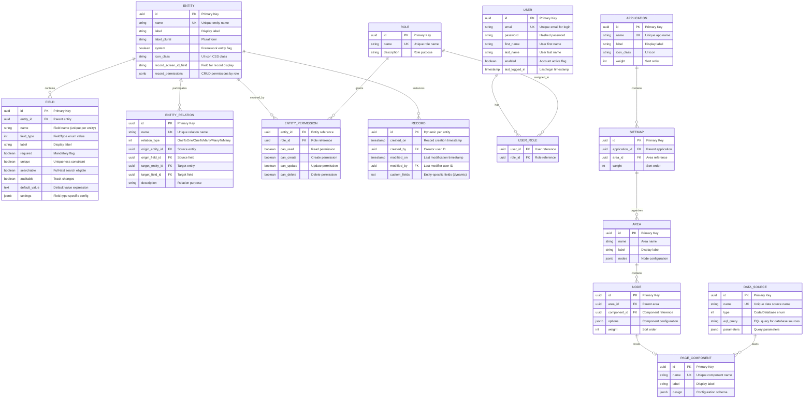

# WebVella ERP - Database Schema & Data Dictionary

**Generated:** 2024-11-20 UTC  
**Repository:** https://github.com/WebVella/WebVella-ERP  
**Analyzed Commit:** Current branch state  
**Documentation Suite:** Reverse Engineering Documentation  

---

## Executive Summary

WebVella ERP employs a **hybrid database schema** combining **static system tables** for framework metadata with **dynamic entity tables** generated at runtime. All data persists in PostgreSQL 16, leveraging JSONB columns for flexible schema storage, full-text search capabilities, and transactional DDL for atomic schema modifications.

### Database Architecture Highlights

- **Database Technology:** PostgreSQL 16 (exclusive)
- **Total Schema Size:** 50-70 tables (system + plugin + runtime entities)
- **Schema Management:** Mixed static (system tables) + dynamic (runtime DDL generation)
- **Relationship Patterns:** One-to-One, One-to-Many, Many-to-Many via junction tables
- **Special Features:** JSONB storage, full-text search (Bulgarian), LISTEN/NOTIFY pub/sub

### Key Database Characteristics

| Characteristic | Implementation | Rationale |
|---------------|----------------|-----------|
| **Metadata Storage** | JSONB columns in system tables | Flexible schema evolution without migration scripts |
| **Entity Tables** | Dynamic CREATE TABLE at runtime | Metadata-driven architecture enables zero-compilation entity creation |
| **Table Naming Convention** | `rec_{entity_name}` for entities, `nm_{relation_name}` for junctions | Clear separation between system and business data |
| **Primary Keys** | GUID (UUID) columns named `id` | Distributed system readiness, no auto-increment sequences |
| **Foreign Keys** | Database-level constraints | Referential integrity enforced at database layer |
| **Full-Text Search** | PostgreSQL to_tsquery with GIN indexes | Built-in search without external dependencies |
| **Audit Trail** | Optional per-entity audit tables | Compliance and change tracking |

---

## Entity Relationship Diagram - System Entities

### Core Metadata Schema



### System Administration Schema

```mermaid
erDiagram
    SYSTEM_LOG {
        uuid id PK "Primary Key"
        timestamp created_on "Log entry timestamp"
        string level "Debug/Info/Warning/Error"
        string category "Log category"
        text message "Log message"
        text details "Stack trace or details"
        uuid user_id FK "User who triggered"
    }
    
    JOB_SCHEDULE {
        uuid id PK "Primary Key"
        string job_name "Job identifier"
        string schedule_plan "iCalendar recurrence rule"
        timestamp last_execution "Last run timestamp"
        timestamp next_execution "Next scheduled run"
        boolean enabled "Job active flag"
        int priority "Execution priority"
    }
    
    JOB_RESULT {
        uuid id PK "Primary Key"
        uuid job_schedule_id FK "Job reference"
        timestamp started_on "Execution start time"
        timestamp finished_on "Execution end time"
        string status "Success/Failed/Running"
        text result_message "Execution output"
        text error_message "Error details if failed"
    }
    
    PLUGIN_DATA {
        uuid id PK "Primary Key"
        string plugin_name UK "Unique plugin identifier"
        string version "Current plugin version"
        jsonb configuration "Plugin-specific settings"
        timestamp installed_on "Installation timestamp"
        timestamp updated_on "Last update timestamp"
    }
    
    SYSTEM_SEARCH {
        uuid id PK "Primary Key"
        uuid entity_id FK "Entity being searched"
        uuid record_id FK "Record reference"
        tsvector search_vector "Full-text search index"
        timestamp indexed_on "Last indexing timestamp"
    }
    
    NOTIFICATION {
        uuid id PK "Primary Key"
        uuid user_id FK "Target user"
        string type "Notification category"
        string title "Notification title"
        text message "Notification content"
        boolean read "Read status"
        timestamp created_on "Creation timestamp"
    }
```



---

## Schema Overview by Domain

### System Metadata Domain

**Purpose:** Store entity definitions, field schemas, relationships, and application structure.

**Tables:**
- **entity:** Entity definitions with names, labels, icons, permissions
- **field:** Field definitions with types, constraints, defaults
- **entity_relation:** Relationship definitions (1:1, 1:N, N:M)
- **application:** Application definitions for UI organization
- **sitemap:** Application navigation structure
- **area:** Page layout regions
- **node:** Component placements within areas
- **page_component:** Reusable UI component definitions
- **data_source:** Query and data source abstractions

**Key Characteristics:**
- JSONB columns for flexible configuration storage
- Cached in memory for 1 hour after retrieval
- Modified through SDK plugin UI or EntityManager API
- Changes trigger runtime DDL generation for entity tables

**Sample Query - List All Entities:**
```sql
SELECT id, name, label, label_plural, system 
FROM entity 
ORDER BY label;
```

### Security Domain

**Purpose:** User authentication, authorization, role-based access control.

**Tables:**
- **user:** User accounts with credentials and profile
- **role:** Role definitions for permission grouping
- **user_role:** Many-to-many relationship between users and roles
- **entity_permission:** Per-entity CRUD permissions by role

**System Roles:**
- **Administrator (BDC56420-CAF0-4030-8A0E-D264938E0CDA):** Full system access including metadata management
- **Regular (F16EC6DB-626D-4C27-8DE0-3E7CE542C55F):** Standard user with entity-level permissions
- **Guest (987148B1-AFA8-4B33-8616-55861E5FD065):** Limited read-only access where explicitly granted

**Password Storage:**
- Hashed using secure algorithm (implementation in SecurityManager)
- EncryptionKey from Config.json for additional sensitive field encryption

**Sample Query - User Roles:**
```sql
SELECT u.email, r.name AS role_name
FROM user u
JOIN user_role ur ON u.id = ur.user_id
JOIN role r ON ur.role_id = r.id
WHERE u.enabled = true;
```

### Operational Domain

**Purpose:** Application logging, job scheduling, notifications, audit trails.

**Tables:**
- **system_log:** Application-level logging with categories and stack traces
- **job_schedule:** Background job definitions with recurrence patterns
- **job_result:** Job execution history and results
- **plugin_data:** Plugin version tracking and configuration
- **system_search:** Full-text search index with tsvector
- **notification:** User notification queue

**Log Levels:**
- Debug: Detailed diagnostic information
- Info: General informational messages
- Warning: Potential issues that don't prevent operation
- Error: Errors requiring attention

**Sample Query - Recent Errors:**
```sql
SELECT created_on, category, message, details
FROM system_log
WHERE level = 'Error'
ORDER BY created_on DESC
LIMIT 50;
```

### Runtime Entity Domain

**Purpose:** Store business data for dynamically created entities.

**Table Naming Convention:**
- **rec_{entity_name}:** Entity instance data (e.g., rec_customer, rec_invoice)
- **nm_{relation_name}:** Many-to-many junction tables (e.g., nm_customer_tags)

**Standard Columns (All Entity Tables):**
- `id` (uuid): Primary key, generated on insert
- `created_on` (timestamp): Record creation timestamp
- `created_by` (uuid): User who created record
- `modified_on` (timestamp): Last modification timestamp
- `modified_by` (uuid): User who last modified record
- Dynamic columns per entity field definitions

**Sample Entity Table - rec_customer:**
```sql
CREATE TABLE rec_customer (
    id uuid PRIMARY KEY DEFAULT uuid_generate_v4(),
    created_on timestamp NOT NULL DEFAULT now(),
    created_by uuid REFERENCES user(id),
    modified_on timestamp,
    modified_by uuid REFERENCES user(id),
    
    -- Entity-specific fields
    name varchar(255) NOT NULL,
    email varchar(255) UNIQUE,
    phone varchar(50),
    address text,
    credit_limit decimal(18,2),
    is_active boolean DEFAULT true,
    
    -- Relationship fields
    account_manager_id uuid REFERENCES user(id),
    industry_id uuid REFERENCES rec_industry(id)
);
```

**Sample Query - Entity Records with Creator:**
```sql
SELECT 
    c.id, 
    c.name, 
    c.email, 
    c.created_on,
    u.email AS created_by_email
FROM rec_customer c
LEFT JOIN user u ON c.created_by = u.id
WHERE c.is_active = true
ORDER BY c.created_on DESC;
```

### Plugin-Specific Domain

**Purpose:** Store plugin-defined entities and business logic data.

**SDK Plugin Tables:**
- Minimal - primarily uses system metadata tables
- May extend with custom configuration tables

**Mail Plugin Tables:**
- **rec_email:** Email queue with sender, recipients, subject, content
- **rec_smtp_service:** SMTP server configurations
- **rec_email_template:** Email templates for notifications

**Project Plugin Tables:**
- **rec_project:** Project definitions with budget, dates, status
- **rec_task:** Task definitions with assignments, dependencies, recurrence
- **rec_timelog:** Time entries against projects and tasks
- **rec_watcher:** User notification subscriptions for tasks
- **rec_feed:** Activity stream entries
- **rec_post:** Discussion posts within feeds

**CRM Plugin Tables:**
- **rec_account:** Customer accounts
- **rec_contact:** Contact persons
- **rec_opportunity:** Sales opportunities
- **rec_activity:** Customer interactions

**Sample Query - Project Time Logs:**
```sql
SELECT 
    p.name AS project_name,
    t.name AS task_name,
    tl.logged_on,
    tl.minutes,
    u.email AS user_email
FROM rec_timelog tl
JOIN rec_task t ON tl.task_id = t.id
JOIN rec_project p ON t.project_id = p.id
JOIN user u ON tl.user_id = u.id
WHERE tl.logged_on >= current_date - interval '30 days'
ORDER BY tl.logged_on DESC;
```

---

## Migration History & Schema Evolution

### Initial Schema Bootstrap

**Source:** `ErpService.InitializeSystemEntities()` method  
**Execution:** First application startup on empty database

**System Entities Created:**
1. **entity** - Core metadata table for entity definitions
2. **field** - Field schema definitions
3. **entity_relation** - Relationship definitions
4. **user** - User accounts
5. **role** - Role definitions
6. **user_role** - User-role associations
7. **application** - Application containers
8. **sitemap** - Navigation structure
9. **area** - Page layout regions
10. **node** - Component placements
11. **page_component** - Component registry
12. **data_source** - Query abstractions
13. **system_log** - Application logging
14. **job_schedule** - Background jobs
15. **plugin_data** - Plugin version tracking

**Bootstrap Process:**
1. Check if `entity` table exists
2. If not found, execute transactional DDL script
3. Create all system tables with initial data
4. Insert default Administrator role and admin user
5. Insert default system entities (self-referential)

### Plugin Migration Pattern

**Versioned Patch System:**

Each plugin implements `ProcessPatches()` method with sequential patch methods:

```csharp
public class ProjectPlugin : ErpPlugin
{
    public override void ProcessPatches()
    {
        using (var connection = DbContext.Current.CreateConnection())
        {
            try
            {
                connection.BeginTransaction();
                
                // Check current version
                var currentVersion = GetCurrentVersion();
                
                // Execute patches in order
                if (currentVersion < 20190203)
                    Patch20190203(); // Initial schema
                
                if (currentVersion < 20190222)
                    Patch20190222(); // Add fields
                
                if (currentVersion < 20190305)
                    Patch20190305(); // New entities
                
                // Update version
                SavePluginData("version", "20190305");
                
                connection.CommitTransaction();
            }
            catch (Exception ex)
            {
                connection.RollbackTransaction();
                throw;
            }
        }
    }
    
    [Patch("20190203")]
    private void Patch20190203()
    {
        // Create project entity
        var projectEntity = new Entity
        {
            Name = "project",
            Label = "Project",
            LabelPlural = "Projects",
            // ... field definitions
        };
        EntityManager.CreateEntity(projectEntity);
        
        // Create related entities
        // Create relationships
        // Seed initial data
    }
}
```

**Patch Versioning Convention:**
- Format: YYYYMMDD (e.g., 20190203)
- Sequential execution by numeric order
- Version stored in plugin_data table
- Already-applied patches skipped automatically

**Transactional Semantics:**
- All patches execute within single transaction
- Rollback on any failure prevents partial migrations
- Success updates plugin version atomically

**Evidence:** All plugin projects contain ProcessPatches implementations

### Runtime Entity Creation

**Dynamic DDL Generation:**

When EntityManager.CreateEntity is called:

```csharp
public void CreateEntity(Entity entity)
{
    // 1. Validate entity definition
    ValidateEntity(entity);
    
    // 2. Insert entity metadata
    DbEntityRepository.Create(entity);
    
    // 3. Generate CREATE TABLE statement
    var sql = GenerateCreateTableSQL(entity);
    
    // 4. Execute DDL
    DbContext.Current.ExecuteNonQuery(sql);
    
    // 5. Create indexes for searchable fields
    foreach (var field in entity.Fields.Where(f => f.Searchable))
    {
        CreateSearchIndex(entity.Name, field.Name);
    }
    
    // 6. Invalidate metadata cache
    Cache.Remove($"entity-{entity.Id}");
}

private string GenerateCreateTableSQL(Entity entity)
{
    var sql = new StringBuilder();
    sql.AppendLine($"CREATE TABLE rec_{entity.Name} (");
    sql.AppendLine("    id uuid PRIMARY KEY DEFAULT uuid_generate_v4(),");
    sql.AppendLine("    created_on timestamp NOT NULL DEFAULT now(),");
    sql.AppendLine("    created_by uuid REFERENCES \"user\"(id),");
    sql.AppendLine("    modified_on timestamp,");
    sql.AppendLine("    modified_by uuid REFERENCES \"user\"(id),");
    
    foreach (var field in entity.Fields)
    {
        sql.AppendLine($"    {field.Name} {GetPostgreSQLType(field)},");
    }
    
    sql.AppendLine(");");
    return sql.ToString();
}
```

**Field Type Mapping:**
| WebVella Field Type | PostgreSQL Type | Notes |
|---------------------|----------------|-------|
| TextField | varchar(255) | Default max length |
| MultiLineTextField | text | Unlimited length |
| NumberField | decimal(18,6) | Configurable precision |
| CurrencyField | decimal(18,2) | 2 decimal places |
| DateField | date | Date only |
| DateTimeField | timestamp | Full timestamp |
| CheckboxField | boolean | true/false |
| GuidField | uuid | Primary keys, foreign keys |
| EmailField | varchar(255) | With email validation |
| PhoneField | varchar(50) | International format support |
| UrlField | varchar(500) | URL strings |
| PasswordField | varchar(500) | Encrypted storage |
| HtmlField | text | HTML content |
| FileField | text | File path reference |
| ImageField | text | Image path reference |
| SelectField | varchar(255) | Single selection |
| MultiSelectField | text[] | Array for multiple selections |
| PercentField | decimal(5,4) | 0.0000 to 1.0000 range |
| AutoNumberField | bigint | Sequential auto-increment |
| GeographyField | jsonb | GeoJSON or text format |

### Schema Modification Operations

**Add Field:**
```sql
ALTER TABLE rec_{entity_name} 
ADD COLUMN {field_name} {postgresql_type} {constraints};
```

**Modify Field:**
```sql
-- Change data type
ALTER TABLE rec_{entity_name} 
ALTER COLUMN {field_name} TYPE {new_postgresql_type};

-- Add/remove constraint
ALTER TABLE rec_{entity_name} 
ALTER COLUMN {field_name} SET NOT NULL;
```

**Delete Field:**
```sql
ALTER TABLE rec_{entity_name} 
DROP COLUMN {field_name};
```

**Create Relationship:**

One-to-Many:
```sql
ALTER TABLE rec_{origin_entity}
ADD COLUMN {foreign_key_field} uuid REFERENCES rec_{target_entity}(id);
```

Many-to-Many (creates junction table):
```sql
CREATE TABLE nm_{relation_name} (
    id uuid PRIMARY KEY DEFAULT uuid_generate_v4(),
    {origin_entity}_id uuid REFERENCES rec_{origin_entity}(id) ON DELETE CASCADE,
    {target_entity}_id uuid REFERENCES rec_{target_entity}(id) ON DELETE CASCADE,
    UNIQUE({origin_entity}_id, {target_entity}_id)
);
```

---

## Indexes & Constraints

### Primary Key Indexes

**Convention:** All tables have UUID primary key named `id`

**Benefits:**
- Globally unique identifiers enable distributed scenarios
- No auto-increment sequence contention
- Safe for replication and merging
- Consistent 16-byte storage

**Generation:** `uuid_generate_v4()` PostgreSQL function

### Foreign Key Constraints

**Entity Relationships:**
- All foreign keys reference `id` columns
- ON DELETE CASCADE for many-to-many junctions
- ON DELETE RESTRICT for critical relationships (prevent orphans)
- Foreign key name convention: `{table}_fk_{referenced_table}`

**Example:**
```sql
ALTER TABLE rec_task
ADD CONSTRAINT task_fk_project 
FOREIGN KEY (project_id) 
REFERENCES rec_project(id) 
ON DELETE CASCADE;
```

### Unique Constraints

**System Tables:**
- `entity.name` - Entity names must be unique
- `field.entity_id + field.name` - Field names unique per entity
- `user.email` - Email addresses unique for login
- `role.name` - Role names unique

**Entity Tables:**
- Applied dynamically when field.Unique = true
- Enforced at database level with unique index

**Example:**
```sql
CREATE UNIQUE INDEX idx_customer_email 
ON rec_customer(email) 
WHERE email IS NOT NULL;
```

### Full-Text Search Indexes

**GIN Indexes for tsvector:**

Created on `system_search` table:
```sql
CREATE INDEX idx_system_search_vector 
ON system_search 
USING GIN(search_vector);
```

**Searchable Field Indexes:**

When field.Searchable = true:
```sql
CREATE INDEX idx_{entity}_{field}_search 
ON rec_{entity} 
USING GIN(to_tsvector('bulgarian', {field}));
```

### Performance Indexes

**Frequently Queried Columns:**
- created_on, modified_on timestamps (common filters)
- Foreign key columns (JOIN performance)
- Status/active flags (common WHERE clauses)

**Example:**
```sql
CREATE INDEX idx_customer_created_on 
ON rec_customer(created_on DESC);

CREATE INDEX idx_task_status 
ON rec_task(status) 
WHERE status != 'Completed';
```

---

## Database Administration

### Connection Configuration

**Config.json Example:**
```json
{
  "ConnectionStrings": {
    "Default": "Server=192.168.0.190;Port=5436;User Id=test;Password=test;Database=erp3;Pooling=true;MinPoolSize=1;MaxPoolSize=100;CommandTimeout=120;"
  }
}
```

**Connection Pool Parameters:**
- **Pooling:** true (enable connection reuse)
- **MinPoolSize:** 1 (maintain one warm connection)
- **MaxPoolSize:** 100 (limit concurrent connections)
- **CommandTimeout:** 120 seconds (long-running query timeout)

### Backup & Recovery

**Recommended Backup Strategy:**

Daily full backup:
```bash
pg_dump -h localhost -U postgres -Fc erp3 > erp3_backup_$(date +%Y%m%d).dump
```

Continuous WAL archiving:
```
wal_level = replica
archive_mode = on
archive_command = 'cp %p /backup/wal/%f'
```

Point-in-time recovery capability:
```bash
pg_basebackup -h localhost -U postgres -D /backup/base -Fp -Xs -P
```

**Retention Policy:**
- Daily backups: Keep 30 days
- Weekly backups: Keep 12 weeks
- Monthly backups: Keep 12 months

### Maintenance Operations

**VACUUM:**
```sql
-- Reclaim storage and update statistics
VACUUM ANALYZE entity;
VACUUM ANALYZE rec_customer;
```

**REINDEX:**
```sql
-- Rebuild indexes for performance
REINDEX TABLE rec_customer;
REINDEX INDEX idx_customer_email;
```

**Statistics Update:**
```sql
-- Update query planner statistics
ANALYZE entity;
ANALYZE rec_customer;
```

**Bloat Monitoring:**
```sql
SELECT 
    schemaname, 
    tablename, 
    pg_size_pretty(pg_total_relation_size(schemaname||'.'||tablename)) AS size,
    pg_size_pretty(pg_relation_size(schemaname||'.'||tablename)) AS table_size,
    pg_size_pretty(pg_total_relation_size(schemaname||'.'||tablename) - pg_relation_size(schemaname||'.'||tablename)) AS index_size
FROM pg_tables
WHERE schemaname = 'public'
ORDER BY pg_total_relation_size(schemaname||'.'||tablename) DESC;
```

---

## Data Dictionary Export

**Complete column-level data dictionary exported to:** `data-dictionary.csv`

**CSV Schema:**
```
Table Name, Column Name, Data Type, Key Type, Nullable, Default Value, Description, Constraints
```

**Sample Rows:**
```csv
entity,id,uuid,PK,No,uuid_generate_v4(),Unique entity identifier,PRIMARY KEY
entity,name,varchar(255),UK,No,NULL,Entity name used in API and database,UNIQUE NOT NULL
field,id,uuid,PK,No,uuid_generate_v4(),Unique field identifier,PRIMARY KEY
field,entity_id,uuid,FK,No,NULL,Reference to parent entity,FOREIGN KEY -> entity(id)
user,id,uuid,PK,No,uuid_generate_v4(),Unique user identifier,PRIMARY KEY
user,email,varchar(255),UK,No,NULL,User email for authentication,UNIQUE NOT NULL
rec_{entity},id,uuid,PK,No,uuid_generate_v4(),Record unique identifier,PRIMARY KEY
rec_{entity},created_on,timestamp,None,No,now(),Record creation timestamp,NOT NULL
rec_{entity},created_by,uuid,FK,No,NULL,User who created record,FOREIGN KEY -> user(id)
```

---

## Security Considerations

### Password Storage

**User Passwords:**
- Hashed using secure algorithm (BCrypt or similar)
- Never stored in plain text
- Verified via hash comparison on authentication

**Encryption Key:**
- 64-character hexadecimal key in Config.json
- Used for PasswordField encryption
- Required for decrypting sensitive fields

### SQL Injection Prevention

**Parameterized Queries:**

All database access uses parameterized SQL:
```csharp
var sql = "SELECT * FROM rec_customer WHERE email = @email";
var parameters = new { email = userEmail };
var result = DbContext.Current.Query(sql, parameters);
```

**EQL Translation:**

EQL queries translate to parameterized SQL:
```csharp
// EQL: SELECT * FROM customer WHERE email = @userEmail
// Translates to:
// SELECT * FROM rec_customer WHERE email = $1
// Parameters: [@userEmail value]
```

### Permission Enforcement

**Database-Level:**
- PostgreSQL user has full DDL/DML access
- Application enforces permissions (not database roles)

**Application-Level:**
- SecurityContext checks before all operations
- Entity-level permissions from RecordPermissions
- Record-level permissions for fine-grained control

### Audit Trail

**Automatic Tracking:**
- created_on, created_by on all records
- modified_on, modified_by on updates
- system_log captures all significant operations

**Optional Full Audit:**
- Before/after snapshots in audit tables
- Configurable per entity
- Compliance requirement support (GDPR, SOX)

---

## Performance Optimization

### Query Optimization

**Index Usage:**
- Foreign keys automatically indexed
- Searchable fields with GIN indexes
- Frequently filtered columns with B-tree indexes

**Query Planning:**
```sql
-- Analyze query performance
EXPLAIN ANALYZE 
SELECT * FROM rec_customer 
WHERE email = 'test@example.com';
```

**Slow Query Log:**
```
log_min_duration_statement = 1000  # Log queries > 1 second
```

### Connection Pooling

**Npgsql Configuration:**
- MinPoolSize=1: One warm connection ready
- MaxPoolSize=100: Limit concurrent connections
- Connection recycling on idle timeout
- Automatic retry on transient failures

### Caching Strategy

**Metadata Cache:**
- Entity definitions cached in memory (1 hour)
- Reduces entity lookups on every record operation
- Manual invalidation via EntityManager.lockObj

**Query Result Cache:**
- Optional per data source
- Configurable expiration
- Invalidated on related record changes

---

## Appendix A: System Entity Reference

### Entity Table Structure

```sql
CREATE TABLE entity (
    id uuid PRIMARY KEY DEFAULT uuid_generate_v4(),
    name varchar(255) UNIQUE NOT NULL,
    label varchar(255) NOT NULL,
    label_plural varchar(255) NOT NULL,
    system boolean DEFAULT false,
    icon_class varchar(100),
    color varchar(20),
    record_screen_id_field varchar(100),
    record_permissions jsonb,
    created_on timestamp DEFAULT now(),
    modified_on timestamp
);
```

### Field Table Structure

```sql
CREATE TABLE field (
    id uuid PRIMARY KEY DEFAULT uuid_generate_v4(),
    entity_id uuid REFERENCES entity(id) ON DELETE CASCADE,
    name varchar(255) NOT NULL,
    field_type int NOT NULL,
    label varchar(255) NOT NULL,
    placeholder_text varchar(255),
    description text,
    help_text text,
    required boolean DEFAULT false,
    unique boolean DEFAULT false,
    searchable boolean DEFAULT false,
    auditable boolean DEFAULT false,
    default_value text,
    enable_security boolean DEFAULT false,
    settings jsonb,
    UNIQUE(entity_id, name)
);
```

### User Table Structure

```sql
CREATE TABLE "user" (
    id uuid PRIMARY KEY DEFAULT uuid_generate_v4(),
    email varchar(255) UNIQUE NOT NULL,
    password varchar(500) NOT NULL,
    first_name varchar(100),
    last_name varchar(100),
    image varchar(500),
    enabled boolean DEFAULT true,
    verified boolean DEFAULT false,
    last_logged_in timestamp,
    created_on timestamp DEFAULT now(),
    modified_on timestamp
);
```

---

## Appendix B: Plugin Entity Inventory

### Mail Plugin Entities

**rec_email:**
- Sender (email address)
- Recipients (array)
- Subject
- Content HTML/Text
- Priority
- Status (Pending/Sending/Sent/Failed)
- Scheduled send time
- Sent timestamp

**rec_smtp_service:**
- Service name
- Server name
- Port
- Username
- Password (encrypted)
- Use SSL flag
- Default service flag

### Project Plugin Entities

**rec_project:**
- Name
- Description
- Start date
- End date
- Budget
- Status (Planning/Active/Completed/Cancelled)
- Owner
- Billable flag

**rec_task:**
- Name
- Description
- Project reference
- Assigned user
- Start date
- End date
- Priority
- Status (New/InProgress/Completed/Cancelled)
- Estimated minutes
- Recurrence pattern (iCalendar RRULE)

**rec_timelog:**
- User reference
- Project reference
- Task reference
- Logged date
- Minutes logged
- Notes
- Billable flag

### CRM Plugin Entities

**rec_account:**
- Company name
- Industry
- Annual revenue
- Employee count
- Account manager
- Status

**rec_contact:**
- First name
- Last name
- Email
- Phone
- Account reference
- Position/title

**rec_opportunity:**
- Name
- Account reference
- Amount
- Stage
- Probability
- Close date
- Owner

---

**End of Database Schema & Data Dictionary**

