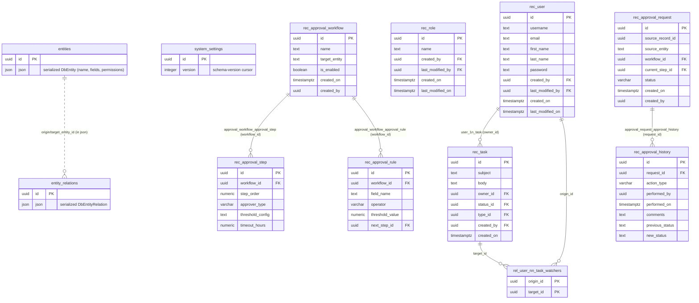

# WebVella ERP — Database Schema & Data Dictionary

> **Part of the [Reverse-Engineering / As-Built Documentation Suite](./README.md).** This document is the canonical reference for *how WebVella ERP stores data*: the data-driven meta-model, the custom `Db*` data-access layer, the runtime-generated physical tables, the field-type-to-PostgreSQL mapping, and the patch-class migration history. It is the narrative companion to the column-level [`data-dictionary.csv`](./data-dictionary.csv) and cross-references the [`architecture.md`](./architecture.md) EQL read path. Terminology follows the canonical [Glossary & Acronyms](./README.md#glossary--acronyms) in the suite index.

---

## Executive Summary

**WebVella ERP** persists everything in a single **PostgreSQL 16** database, reached exclusively through a **hand-written `Db*` data-access layer (DAL)** built directly on the **Npgsql 9.0.4** ADO.NET provider (`WebVella.Erp/WebVella.Erp.csproj:61`). There is **no Entity Framework Core** and **no ORM** (this corrects assumption **C3**), and there is **no Entity Framework `Migrations/` folder** anywhere in the repository (this corrects assumption **C4**).

The defining characteristic of the schema is that it is **data-driven**. Business objects are **not** modelled as compile-time POCOs that map one-to-one onto fixed tables. Instead, **entities, fields, and relations are stored as data** — rows of serialized JSON in three meta-model tables managed by `EntityManager` and `EntityRelationManager` (`WebVella.Erp/Api/EntityManager.cs:1693`). When an entity is defined, the platform **generates a physical PostgreSQL table at runtime** to hold that entity's records. This single decision produces two distinct categories of table that this document keeps rigorously separate:

| Category | Examples | Purpose |
|----------|----------|---------|
| **Meta-model tables** | `entities`, `entity_relations`, `system_settings` | Store the *definitions* of entities, fields, and relations as serialized JSON, plus the schema-version cursor. |
| **Physical record tables** | `rec_user`, `rec_account`, `rec_task`, … | Generated at runtime — one `rec_<entity_name>` table per entity — to hold the actual records. |
| **N:N join tables** | `rel_account_nn_contact`, `rel_project_nn_task`, … | Materialize many-to-many relations as `rel_<relation_name>` join tables with `origin_id`/`target_id`. |

Schema evolution is implemented as **plugin "patch" partial classes** — there are exactly **25 date-versioned partial classes** (e.g., `MailPlugin.20190419.cs`) that run idempotently at startup, gated on a stored version cursor. This document reverse-engineers the schema from the DAL, the bootstrap DDL, and these patch classes, and presents an entity-relationship diagram, a field-type mapping, a per-domain schema breakdown, and the complete migration history.

| Attribute | Value |
|-----------|-------|
| **Documentation Generated** | 2026-06-05 15:15 UTC |
| **Source commit** | `bfe15661c7f0c1dae57288d789b854186793b157` (branch `master`) |
| **Database engine** | PostgreSQL 16 |
| **Data provider** | Npgsql 9.0.4 — `WebVella.Erp/WebVella.Erp.csproj:61` |
| **ORM** | **None** — custom `Db*` repository DAL (no EF Core) |
| **Migration mechanism** | 25 date-versioned plugin patch partial classes (no EF Migrations) |
| **Citation convention** | Inline `path:line` (e.g., `WebVella.Erp/Database/DbRepository.cs:60`) |
| **Scope** | Analysis-only; no source, schema, configuration, or migration file was modified |

### How to read this document

[§1](#1-access-layer-overview) introduces the `Db*` access layer and DDL helpers that build every table. [§2](#2-meta-model-vs-physical-tables) explains the central meta-model-versus-physical-table distinction and documents each meta-model and system table. [§3](#3-field-types--postgresql-types) maps the 21 persisted field types to their PostgreSQL column types. [§4](#4-entity-relationship-diagram) presents the Mermaid ERD. [§5](#5-schema-by-domain) breaks the schema down by functional domain (CRM, Project, Mail, Approval). [§6](#6-migration-history--the-patch-class-model) documents the 25-class patch-migration model. [§7](#7-approval-domain-story-specified) details the story-specified Approval schema. [§8](#8-cross-document-consistency) ties terminology back to the rest of the suite, and the [Appendix](#appendix-a-complete-system-table-reference) gives a complete system-table reference.

---

## 1. Access Layer Overview

All database access flows through the custom DAL in `WebVella.Erp/Database/`. There is a single ambient context object, a small set of repositories for the meta-model and records, and a static helper class that emits all Data-Definition-Language (DDL).

### 1.1 `DbContext` and the ambient connection

`DbContext` is the unit-of-work/context object. The **current** context is held in an `AsyncLocal<string>` so that each async request flow resolves its own context without explicit threading (`WebVella.Erp/Database/DbContext.cs:12`). The context exposes the four repositories the rest of the platform uses:

| Repository property | Type | Responsibility | Citation |
|---------------------|------|----------------|----------|
| `RecordRepository` | `DbRecordRepository` | CRUD over `rec_*` physical record tables and `rel_*` joins | `WebVella.Erp/Database/DbContext.cs:30` |
| `EntityRepository` | `DbEntityRepository` | CRUD over the `entities` meta-model table | `WebVella.Erp/Database/DbContext.cs:31` |
| `RelationRepository` | `DbRelationRepository` | CRUD over the `entity_relations` meta-model table | `WebVella.Erp/Database/DbContext.cs:32` |
| `SettingsRepository` | `DbSystemSettingsRepository` | Reads/writes the `system_settings` version cursor | `WebVella.Erp/Database/DbContext.cs:33` |

The repositories are wired in the private constructor (`WebVella.Erp/Database/DbContext.cs:44-47`), and `DbContext.Current` returns the context for the current async flow or `null` if none is open (`WebVella.Erp/Database/DbContext.cs:15-26`).

### 1.2 DDL helpers — `DbRepository`

`DbRepository` is a `static` class that issues every schema-mutating statement. Critically, **`CreateTable` creates an empty table** (`CREATE TABLE "{name}" ();`, `WebVella.Erp/Database/DbRepository.cs:60,64`); columns are then added one at a time. This is why every physical `rec_*` table is assembled column-by-column from its field definitions rather than from a single `CREATE TABLE` statement.

| DDL operation | Method | Citation |
|---------------|--------|----------|
| Create empty table | `CreateTable(name)` | `WebVella.Erp/Database/DbRepository.cs:60` |
| Rename table | `RenameTable(name,newName)` | `WebVella.Erp/Database/DbRepository.cs:72` |
| Delete table | `DeleteTable(name,cascade)` | `WebVella.Erp/Database/DbRepository.cs:84` |
| Add column (from `Field`) | `CreateColumn(table,Field)` | `WebVella.Erp/Database/DbRepository.cs:154` |
| Add column (from `DbBaseField`) | `CreateColumn(table,DbBaseField)` | `WebVella.Erp/Database/DbRepository.cs:181` |
| Add column (full signature) | `CreateColumn(table,name,type,…)` | `WebVella.Erp/Database/DbRepository.cs:209` |
| Rename column | `RenameColumn(table,name,newName)` | `WebVella.Erp/Database/DbRepository.cs:264` |
| Drop column | `DeleteColumn(table,name)` | `WebVella.Erp/Database/DbRepository.cs:276` |
| Set primary key | `SetPrimaryKey(table,columns)` | `WebVella.Erp/Database/DbRepository.cs:288` |
| Add unique constraint | `CreateUniqueConstraint(name,table,columns)` | `WebVella.Erp/Database/DbRepository.cs:310` |
| Drop unique constraint | `DropUniqueConstraint(name,table)` | `WebVella.Erp/Database/DbRepository.cs:334` |
| Toggle column nullability | `SetColumnNullable(table,column,nullable)` | `WebVella.Erp/Database/DbRepository.cs:344` |
| Set column default | `SetColumnDefaultValue(table,field,…)` — `now()` for date/datetime | `WebVella.Erp/Database/DbRepository.cs:357` |
| Add FK (1:1, 1:N) | `CreateRelation(rel,origin,originFld,target,targetFld)` | `WebVella.Erp/Database/DbRepository.cs:394` |
| Create N:N join table | `CreateNtoNRelation(rel,…)` | `WebVella.Erp/Database/DbRepository.cs:410` |
| Create / drop index | `CreateIndex(…)` / `DropIndex(name)` | `WebVella.Erp/Database/DbRepository.cs:461,507` |

DML for record tables (`InsertRecord`, `UpdateRecord`, `DeleteRecord`) is also centralized here (`WebVella.Erp/Database/DbRepository.cs:517,555,589`). The read path for records is **not** in `DbRepository`; it is driven by EQL through `RecordManager`/`EqlCommand`, documented in [`architecture.md` §4](./architecture.md#4-eql-read-path).

### 1.3 Type conversion

`DbTypeConverter` translates the platform's logical `FieldType` enum into the physical PostgreSQL type used in `ALTER TABLE … ADD COLUMN` (`WebVella.Erp/Database/DBTypeConverter.cs:9`) and into the `NpgsqlDbType` used to bind parameters (`WebVella.Erp/Database/DBTypeConverter.cs:82,161`). The full mapping is tabulated in [§3](#3-field-types--postgresql-types).

---

## 2. Meta-Model vs Physical Tables

This is the central concept of the WebVella schema. Three **meta-model tables** store the *definitions* of the data model; the platform then **generates physical tables at runtime** to hold the records those definitions describe. The bootstrap DDL for all meta-model and system tables lives in a single method, `ERPService.CheckCreateSystemTables()` (`WebVella.Erp/ERPService.cs:922`), which creates each table only if it does not already exist.

### 2.1 `entities` — the entity & field catalog

The `entities` table stores one row per defined entity. Its DDL has **exactly two columns**: a `uuid` primary key and a `json` payload (`WebVella.Erp/ERPService.cs:937`):

```sql
CREATE TABLE public.entities ( id uuid NOT NULL, "json" json NOT NULL,
  CONSTRAINT entities_pkey PRIMARY KEY (id) );
```

> **Factual note (corrects a common assumption).** The `entities` table does **not** have separate `created_by`/`last_modified_by` columns — the entire entity definition, including its field list and permissions, lives **inside the serialized `json` column**. Writes serialize the `DbEntity` object to JSON (`WebVella.Erp/Database/DbEntityRepository.cs:74` insert, `WebVella.Erp/Database/DbEntityRepository.cs:163` update); reads deserialize `SELECT json FROM entities` (`WebVella.Erp/Database/DbEntityRepository.cs:205`). Deleting an entity both removes its row and `DROP TABLE rec_<name>` for its physical table (`WebVella.Erp/Database/DbEntityRepository.cs:275`).

The JSON payload deserializes into `DbEntity` (`WebVella.Erp/Database/DbEntity.cs`), whose `Id` comes from `DbDocumentBase` (`WebVella.Erp/Database/DbDocumentBase.cs:13`):

| `DbEntity` property | JSON key | Notes |
|---------------------|----------|-------|
| `Id` | `id` | `Guid`, from `DbDocumentBase` |
| `Name` | `name` | snake_case entity name; drives the `rec_<name>` table name |
| `Label` / `LabelPlural` | `label` / `label_plural` | Display names |
| `System` | `system` | `true` for built-in entities |
| `IconName` / `Color` | `icon_name` / `color` | UI metadata |
| `RecordPermissions` | `record_permissions` | `DbRecordPermissions` with `CanRead`/`CanCreate`/`CanUpdate`/`CanDelete`, each a `List<Guid>` of **role** IDs (`WebVella.Erp/Database/DbEntity.cs:37-50`) |
| `Fields` | `fields` | `List<DbBaseField>` — the field definitions for the entity (`WebVella.Erp/Database/DbEntity.cs:31`) |
| `RecordScreenIdField` | `record_screen_id_field` | Optional `Guid?`; the `id` field is used if null |

### 2.2 `entity_relations` — the relation catalog

The `entity_relations` table also stores one row per relation with the same two-column `(id uuid, json json)` shape (`WebVella.Erp/ERPService.cs:952`):

```sql
CREATE TABLE public.entity_relations ( id uuid NOT NULL, "json" json NOT NULL,
  CONSTRAINT entity_relations_pkey PRIMARY KEY (id) );
```

Writes serialize a `DbEntityRelation` to the `json` column (`WebVella.Erp/Database/DbRelationRepository.cs:78` insert, `WebVella.Erp/Database/DbRelationRepository.cs:126` update, `WebVella.Erp/Database/DbRelationRepository.cs:169` read, `WebVella.Erp/Database/DbRelationRepository.cs:214` delete). The JSON deserializes into `DbEntityRelation` (`WebVella.Erp/Database/DbEntityRelation.cs`):

| `DbEntityRelation` property | JSON key | Notes |
|-----------------------------|----------|-------|
| `Id` | `id` | `Guid` |
| `Name` | `name` | Relation name; drives the `rel_<name>` join-table name for N:N |
| `Label` / `Description` | `label` / `description` | Display metadata |
| `System` | `system` | `true` for built-in relations |
| `RelationType` | `relation_type` | `EntityRelationType` enum (see below) |
| `OriginEntityId` / `OriginFieldId` | `origin_entity_id` / `origin_field_id` | The "one" side |
| `TargetEntityId` / `TargetFieldId` | `target_entity_id` / `target_field_id` | The "many" / join side |

The `EntityRelationType` enum (exposed via the `RelationType` property) has three members (`WebVella.Erp/Api/Models/EntityRelation.cs:9`):

| Member | Value | Physical realization |
|--------|-------|----------------------|
| `OneToOne` | `1` | Foreign-key constraint on the target `rec_*` table |
| `OneToMany` | `2` | Foreign-key constraint on the target `rec_*` table |
| `ManyToMany` | `3` | A dedicated `rel_<name>` join table |

For `OneToOne`/`OneToMany`, `DbRelationRepository.Create` calls `DbRepository.CreateRelation`, which adds a `FOREIGN KEY` on the **target** table referencing the **origin** (`WebVella.Erp/Database/DbRepository.cs:394,404`). For `ManyToMany`, it calls `DbRepository.CreateNtoNRelation` to build the join table (`WebVella.Erp/Database/DbRelationRepository.cs:80-98`).

### 2.3 `system_settings` — the schema-version cursor

`system_settings` records the global database schema version and is the cursor the patch model reads. Its DDL is `(id uuid, version integer)` (`WebVella.Erp/ERPService.cs:968`):

```sql
CREATE TABLE public.system_settings ( id uuid NOT NULL, version integer NOT NULL,
  CONSTRAINT system_settings_pkey PRIMARY KEY (id) );
```

`DbSystemSettingsRepository.Read()` issues `SELECT * FROM system_settings` and maps `id` and `version` (`WebVella.Erp/Database/DbSystemSettingsRepository.cs:42,49-50`); `Save()` upserts the single row (`WebVella.Erp/Database/DbSystemSettingsRepository.cs:86,88`). The deserialized shape is `DbSystemSettings { Id, Version }` (`WebVella.Erp/Database/DbSystemSettings.cs:5-8`).

### 2.4 Physical record tables — `rec_<entity_name>`

For each entity, a physical table named `rec_<entity_name>` holds its records. The prefix constant is `RECORD_COLLECTION_PREFIX = "rec_"` (`WebVella.Erp/Database/DbRecordRepository.cs:31`). The table is created empty (`WebVella.Erp/Database/DbRepository.cs:64`) and each field becomes a column via `DbRepository.CreateColumn` during entity creation (`WebVella.Erp/Database/DbEntityRepository.cs:66-72`).

Every entity created with the full field set receives **five standard system columns**, defined in `EntityManager.CreateEntityDefaultFields` (`WebVella.Erp/Api/EntityManager.cs:1693`):

| Column | Logical field type | PostgreSQL type | Properties | Citation |
|--------|--------------------|-----------------|------------|----------|
| `id` | `GuidField` | `uuid` | Primary key, Required, Unique, System | `WebVella.Erp/Api/EntityManager.cs:1707` |
| `created_by` | `GuidField` | `uuid` | System, nullable | `WebVella.Erp/Api/EntityManager.cs:1734` |
| `last_modified_by` | `GuidField` | `uuid` | System, nullable | `WebVella.Erp/Api/EntityManager.cs:1759` |
| `created_on` | `DateTimeField` | `timestamptz` | System; defaults to current time | `WebVella.Erp/Api/EntityManager.cs:1784` |
| `last_modified_on` | `DateTimeField` | `timestamptz` | System; defaults to current time | `WebVella.Erp/Api/EntityManager.cs:1811` |

All other columns on a `rec_*` table come from the entity's user-defined fields, typed per [§3](#3-field-types--postgresql-types).

### 2.5 N:N join tables — `rel_<relation_name>`

A `ManyToMany` relation materializes a join table named `rel_<relation_name>`, built by `DbRepository.CreateNtoNRelation` (`WebVella.Erp/Database/DbRepository.cs:410`). The table has two `uuid` columns, `origin_id` and `target_id`, a **composite primary key** over both, and a foreign key from each column into the respective entity table (`WebVella.Erp/Database/DbRepository.cs:412-419`):

```sql
-- conceptual shape of every rel_<name> join table
CREATE TABLE "rel_<name>" ();                         -- CreateTable :410-411
ALTER TABLE … ADD COLUMN "origin_id" uuid;            -- CreateColumn :412
ALTER TABLE … ADD COLUMN "target_id" uuid;            -- CreateColumn :413
ALTER TABLE … ADD PRIMARY KEY ("origin_id","target_id"); -- SetPrimaryKey :415
-- + FK "<name>_origin" -> origin table, FK "<name>_target" -> target table
```

Join rows are written by `DbRelationRepository.CreateManyToManyRecord`, which inserts `(origin_id, target_id)` into `rel_<name>` (`WebVella.Erp/Database/DbRelationRepository.cs:261,265`), and removed by `DeleteManyToManyRecord` (`WebVella.Erp/Database/DbRelationRepository.cs:284`). The EQL read path joins through these tables using `target_id`/`origin_id` (`WebVella.Erp/Database/DbRecordRepository.cs:1343-1345`).

### 2.6 Other system tables

Beyond the three meta-model tables, `CheckCreateSystemTables` bootstraps a fixed set of operational tables. These are summarized here and listed in full in [Appendix A](#appendix-a-complete-system-table-reference):

| Table | Purpose | Citation |
|-------|---------|----------|
| `system_search` | Full-text search index (GIN on `stem_content`) | `WebVella.Erp/ERPService.cs:984` |
| `files` | File metadata (path, object id, audit) | `WebVella.Erp/ERPService.cs:1018` |
| `jobs` | Background-job queue | `WebVella.Erp/ERPService.cs:1061` |
| `schedule_plan` | Recurring-job schedules | `WebVella.Erp/ERPService.cs:1101` |
| `system_log` | Application/diagnostic log | `WebVella.Erp/ERPService.cs:1159` |
| `plugin_data` | Per-plugin settings/version JSON | `WebVella.Erp/ERPService.cs:1201` |
| `app`, `app_sitemap_area`, `app_sitemap_area_group`, `app_sitemap_area_node`, `app_page`, `app_page_body_node` | Application & page-builder structure | `WebVella.Erp/ERPService.cs:1225` |
| `data_source` | Named EQL/SQL data sources | `WebVella.Erp/ERPService.cs:1383` |
| `app_page_data_source` | Page-to-datasource bindings | `WebVella.Erp/ERPService.cs:1399` |

---

## 3. Field Types → PostgreSQL Types

When a field is added to a `rec_*` table, its logical type is converted to a physical PostgreSQL column type by `DbTypeConverter.ConvertToDatabaseSqlType` (`WebVella.Erp/Database/DBTypeConverter.cs:9`). The `FieldTypes/` directory under `WebVella.Erp/Database/` contains 24 files: **21 concrete persisted field types**, the abstract base `DbBaseField`, the `DbFieldPermissions` helper, and `DbFormulaField` (which is **commented out and unsupported**, so it produces no column — `WebVella.Erp/Database/FieldTypes/DbFormulaField.cs`). The mapping below is authoritative; the SQL DDL type comes from `ConvertToDatabaseSqlType` and the parameter binding type from `GetDatabaseFieldType` (`WebVella.Erp/Database/DBTypeConverter.cs:161`).

| Field type class | `FieldType` enum | PostgreSQL column type | `NpgsqlDbType` |
|------------------|------------------|------------------------|----------------|
| `DbGuidField` | `GuidField` | `uuid` | `Uuid` |
| `DbTextField` | `TextField` | `text` | `Text` |
| `DbMultiLineTextField` | `MultiLineTextField` | `text` | `Text` |
| `DbHtmlField` | `HtmlField` | `text` | `Text` |
| `DbNumberField` | `NumberField` | `numeric` | `Numeric` |
| `DbCurrencyField` | `CurrencyField` | `numeric` | `Numeric` |
| `DbPercentField` | `PercentField` | `numeric` | `Numeric` |
| `DbAutoNumberField` | `AutoNumberField` | `serial` | `Numeric` |
| `DbCheckboxField` | `CheckboxField` | `boolean` | `Boolean` |
| `DbDateField` | `DateField` | `date` | `Date` |
| `DbDateTimeField` | `DateTimeField` | `timestamptz` | `TimestampTz` |
| `DbSelectField` | `SelectField` | `varchar(200)` | `Varchar` |
| `DbMultiSelectField` | `MultiSelectField` | `text[]` | `Array \| Text` |
| `DbEmailField` | `EmailField` | `varchar(500)` | `Varchar` |
| `DbPasswordField` | `PasswordField` | `varchar(500)` | `Varchar` |
| `DbPhoneField` | `PhoneField` | `varchar(100)` | `Varchar` |
| `DbUrlField` | `UrlField` | `varchar(1000)` | `Varchar` |
| `DbImageField` | `ImageField` | `varchar(1000)` | `Varchar` |
| `DbFileField` | `FileField` | `varchar(1000)` | `Varchar` |
| `DbGeographyField` | `GeographyField` | `geography` | `Geography` |

Notes:

- **`DbTreeSelectField`** has **no DDL SQL column type** and is **not persisted** through the standard column path: `DbBaseField.GetFieldType()` does not handle it and throws `Unknown field type` (`WebVella.Erp/Database/FieldTypes/DbBaseField.cs:159`), and `DBTypeConverter.ConvertToDatabaseSqlType` has no `TreeSelect`/`uuid[]` branch. A `DbTreeSelectField` branch exists **only** in the parameter-binding helper `GetDatabaseFieldType(DbBaseField)` (`WebVella.Erp/Database/DBTypeConverter.cs:201`), which returns `NpgsqlDbType.Array | NpgsqlDbType.Uuid` for ADO.NET parameter binding — this is **separate from the DDL column-type mapping** in the table above and does not define a persisted column.
- **`DbFormulaField`** is commented out in source ("Not supported at the moment", `WebVella.Erp/Database/FieldTypes/DbFormulaField.cs`); formula values are computed, not stored, so no column is generated.
- **`RelationField`** (`FieldType` value `20`, `WebVella.Erp/Api/Models/FieldTypes/FieldType.cs:45`) is a *virtual* projection used by EQL relation expansion and does not produce a physical column.
- Every field definition derives from the abstract `DbBaseField`, which carries the common attributes `id`, `name`, `label`, `required`, `unique`, `searchable`, `auditable`, `system`, and `permissions` (`WebVella.Erp/Database/FieldTypes/DbBaseField.cs:8-47`); the concrete subtype is resolved by `GetFieldType()` (`WebVella.Erp/Database/FieldTypes/DbBaseField.cs:114`).
- Date/datetime columns receive a `now()` default when `UseCurrentTimeAsDefaultValue` is set (`WebVella.Erp/Database/DbRepository.cs:357,367`).

---

## 4. Entity-Relationship Diagram

The diagram below shows the three **meta-model** tables, representative **physical** tables (`rec_user`, `rec_role`, `rec_task`), one **N:N join** table (`rel_user_nn_task_watchers`), and the **story-specified Approval** tables. Cardinalities use the `EntityRelationType` enum: `||--||` = OneToOne, `||--o{` = OneToMany, and a many-to-many is shown via its `rel_*` join table (two OneToMany edges, the physically accurate form). Dotted edges (`..`) denote **logical** references stored inside JSON rather than physical foreign keys. Column/table names match [`data-dictionary.csv`](./data-dictionary.csv).


```mermaid
erDiagram
    entities {
        uuid id PK
        json json "serialized DbEntity (name, fields, permissions)"
    }
    entity_relations {
        uuid id PK
        json json "serialized DbEntityRelation"
    }
    system_settings {
        uuid id PK
        integer version "schema-version cursor"
    }

    rec_user {
        uuid id PK
        text username
        text email
        text first_name
        text last_name
        text password
        uuid created_by FK
        uuid last_modified_by FK
        timestamptz created_on
        timestamptz last_modified_on
    }
    rec_role {
        uuid id PK
        text name
        uuid created_by FK
        uuid last_modified_by FK
        timestamptz created_on
        timestamptz last_modified_on
    }
    rec_task {
        uuid id PK
        text subject
        text body
        uuid owner_id FK
        uuid status_id FK
        uuid type_id FK
        uuid created_by FK
        timestamptz created_on
    }
    rel_user_nn_task_watchers {
        uuid origin_id PK
        uuid target_id PK
    }

    rec_approval_workflow {
        uuid id PK
        text name
        text target_entity
        boolean is_enabled
        timestamptz created_on
        uuid created_by
    }
    rec_approval_step {
        uuid id PK
        uuid workflow_id FK
        numeric step_order
        varchar approver_type
        text threshold_config
        numeric timeout_hours
    }
    rec_approval_rule {
        uuid id PK
        uuid workflow_id FK
        text field_name
        varchar operator
        numeric threshold_value
        uuid next_step_id FK
    }
    rec_approval_request {
        uuid id PK
        uuid source_record_id
        text source_entity
        uuid workflow_id FK
        uuid current_step_id FK
        varchar status
        timestamptz created_on
        uuid created_by
    }
    rec_approval_history {
        uuid id PK
        uuid request_id FK
        varchar action_type
        uuid performed_by
        timestamptz performed_on
        text comments
        text previous_status
        text new_status
    }

    entities ||..o{ entity_relations : "origin/target_entity_id (in json)"
    rec_user ||--o{ rec_task : "user_1n_task (owner_id)"
    rec_user ||--o{ rel_user_nn_task_watchers : "origin_id"
    rec_task ||--o{ rel_user_nn_task_watchers : "target_id"

    rec_approval_workflow ||--o{ rec_approval_step : "approval_workflow_approval_step (workflow_id)"
    rec_approval_workflow ||--o{ rec_approval_rule : "approval_workflow_approval_rule (workflow_id)"
    rec_approval_request ||--o{ rec_approval_history : "approval_request_approval_history (request_id)"
```

**Reading the diagram.** The `entities` and `entity_relations` tables are the meta-model: an `entity_relations` row references entities through `origin_entity_id`/`target_entity_id` values stored *inside* its `json` payload (hence the dotted edge — there is no physical FK). The `rec_*` tables are runtime-generated physical tables; each carries the five standard system columns from [§2.4](#24-physical-record-tables--rec_entity_name). The `rel_user_nn_task_watchers` join table demonstrates the N:N pattern from [§2.5](#25-nn-join-tables--rel_relation_name): two `uuid` columns forming a composite key, each a FK into `rec_user` and `rec_task`. The `rec_approval_*` tables are **story-specified** (see [§7](#7-approval-domain-story-specified)) and are shown for completeness; they are not present in the shipped database.

---

## 5. Schema by Domain

The business data model is seeded primarily by the **Next** plugin's patch classes, which create the core CRM and Project entities; the **Crm** and **Project** plugins then layer pages, components, and data sources on top, and the **Mail** plugin adds its own entities. Every domain entity below maps to a physical `rec_<entity_name>` table with the five system columns from [§2.4](#24-physical-record-tables--rec_entity_name) plus its domain-specific fields. Relation names follow the convention `<origin>_1n_<target>` (OneToMany → FK column on the target table) and `<a>_nn_<b>` (ManyToMany → `rel_<name>` join table).

### 5.1 Core / system domain

| Entity (table) | Representative columns | Notes | Citation |
|----------------|------------------------|-------|----------|
| `user` (`rec_user`) | `id`, `username`, `email`, `first_name`, `last_name`, `password` | Seeded with `system` and `administrator` users | `WebVella.Erp/ERPService.cs:160,183,206,453,469` |
| `role` (`rec_role`) | `id`, `name` | Seeded roles: `administrator`, `regular`, `guest` | `WebVella.Erp/ERPService.cs:375,481,492,503` |
| `user_file` (`rec_user_file`) | `id`, `name` | User-uploaded file metadata | `WebVella.Erp/ERPService.cs:706` |

Role IDs are referenced from every entity's `record_permissions` JSON (`WebVella.Erp/Database/DbEntity.cs:37-50`); for example, `ProjectPlugin.20211012` writes the three seeded role GUIDs into the `role` and `user` entities' permissions (`WebVella.Erp.Plugins.Project/ProjectPlugin.20211012.cs:33-39`).

### 5.2 CRM domain

Created by the Next plugin and used by the Crm plugin. Core entities and relations:

| Entity (table) | Purpose |
|----------------|---------|
| `account` (`rec_account`) | Companies / organizations |
| `contact` (`rec_contact`) | People associated with accounts |
| `case` (`rec_case`) | Support / service cases |
| `case_status` (`rec_case_status`), `case_type` (`rec_case_type`) | Lookups for cases |
| `address` (`rec_address`) | Postal addresses |
| `comment` (`rec_comment`), `attachment` (`rec_attachment`) | Activity comments and attachments |
| `country` (`rec_country`), `currency` (`rec_currency`), `language` (`rec_language`), `industry` (`rec_industry`), `salutation` (`rec_salutation`) | Reference / lookup entities |
| `feed_item` (`rec_feed_item`) | Activity-feed entries |

Representative relations (`WebVella.Erp.Plugins.Next/*.cs`):

| Relation | Type | Physical realization |
|----------|------|----------------------|
| `account_nn_contact` | N:N | `rel_account_nn_contact` join table |
| `account_1n_case` | 1:N | FK on `rec_case` |
| `account_nn_case` | N:N | `rel_account_nn_case` join table |
| `address_nn_account` | N:N | `rel_address_nn_account` join table |
| `case_status_1n_case`, `case_type_1n_case` | 1:N | FK on `rec_case` |
| `country_1n_account`, `country_1n_address`, `country_1n_contact` | 1:N | FK on target tables |
| `currency_1n_account`, `language_1n_account` | 1:N | FK on `rec_account` |
| `salutation_1n_account`, `salutation_1n_contact` | 1:N | FK on target tables |
| `comment_nn_attachment` | N:N | `rel_comment_nn_attachment` join table |
| `user_1n_comment`, `user_1n_feed_item` | 1:N | FK on target tables |

> **Source note:** the repository also contains relations named `solutation_1n_account` / `solutation_1n_contact` — a misspelling of "salutation" present in the source (`WebVella.Erp.Plugins.Next/*.cs`). Per the factual-reporting mandate, the misspelling is reported as-is rather than silently corrected.

### 5.3 Project domain

Created by the Next plugin; enriched with data sources by the Project plugin.

| Entity (table) | Purpose |
|----------------|---------|
| `project` (`rec_project`) | Projects |
| `milestone` (`rec_milestone`) | Project milestones |
| `task` (`rec_task`) | Work items / tasks |
| `task_status` (`rec_task_status`), `task_type` (`rec_task_type`) | Task lookups |
| `timelog` (`rec_timelog`) | Time-tracking entries |

Representative relations:

| Relation | Type | Physical realization |
|----------|------|----------------------|
| `project_nn_task` | N:N | `rel_project_nn_task` join table |
| `project_nn_milestone` | N:N | `rel_project_nn_milestone` join table |
| `milestone_nn_task` | N:N | `rel_milestone_nn_task` join table |
| `task_status_1n_task`, `task_type_1n_task` | 1:N | FK on `rec_task` |
| `user_1n_task`, `user_1n_task_creator`, `user_1n_project_owner`, `user_1n_timelog` | 1:N | FK on target tables |
| `user_nn_task_watchers` | N:N | `rel_user_nn_task_watchers` join table |

The verified `rec_task` columns (read directly from the data-source SQL in `WebVella.Erp.Plugins.Project/ProjectPlugin.20211012.cs:1192-1215`) include `id`, `subject`, `body`, `created_on`, `created_by`, `completed_on`, `number`, `parent_id`, `status_id`, `key`, `estimated_minutes`, `x_billable_minutes`, `x_nonbillable_minutes`, `priority`, `timelog_started_on`, `owner_id`, `type_id`, `start_time`, `end_time`, `recurrence_id`, `reserve_time`, `recurrence_template`, `l_scope`, and `x_search`.

### 5.4 Mail domain

Created and evolved by the Mail plugin's seven patch classes.

| Entity (table) | Purpose | Citation |
|----------------|---------|----------|
| `email` (`rec_email`) | Outbound/inbound email records | `WebVella.Erp.Plugins.Mail/MailPlugin.20190419.cs:18` |
| `smtp_service` (`rec_smtp_service`) | SMTP service configuration | `WebVella.Erp.Plugins.Mail/*.cs` |

The `email` entity is evolved across patches; for example `Patch20190419` adds the `sender` and `recipients` text fields and removes the legacy `recipient_name`, `sender_name`, `recipient_email`, and `sender_email` fields (`WebVella.Erp.Plugins.Mail/MailPlugin.20190419.cs:22,52,371-401`).

### 5.5 Approval domain

The Approval domain schema is **specified in `jira-stories/STORY-002` but not implemented** — see [§7](#7-approval-domain-story-specified) for the full field-level detail. The shipped Approval plugin contains only a dashboard component (`PcApprovalDashboard`), a controller, and a metrics service; it ships **no** entity-creating patch class.

---

## 6. Migration History — the Patch-Class Model

WebVella has **no Entity Framework `Migrations/` folder** and **no EF Core** (corrects **C4** and **C3**). Schema evolution is instead implemented as **date-versioned plugin partial classes**. **Plugins that implement schema patches** are each a `partial class XPlugin : ErpPlugin` whose `._.cs` file defines `ProcessPatches()`, and each dated file (e.g., `MailPlugin.20190419.cs`) contributes one `static void PatchYYYYMMDD(EntityManager, EntityRelationManager, RecordManager)` method to that partial class. This applies to the **six plugin projects with a `*Plugin._.cs` bootstrap** (CRM, Mail, Microsoft CDM, Next, Project, SDK); the **Approval project is an exception** — it has no `ApprovalPlugin` subclass, no bootstrap, and no migration at this commit (see [§7](#7-approval-domain-story-specified) and [`functional-overview.md` §2.4](./functional-overview.md#24-approval-webvellaerppluginsapproval)).

### 6.1 How patches run

The mechanism is identical across plugins; using the SDK plugin as the reference implementation (`WebVella.Erp.Plugins.SDK/SdkPlugin._.cs:19`):

1. **Open a system security scope** — `using (SecurityContext.OpenSystemScope())` bypasses per-user authorization for bootstrap work (`WebVella.Erp.Plugins.SDK/SdkPlugin._.cs:21`).
2. **Instantiate the managers** — `new EntityManager()`, `new EntityRelationManager()`, `new RecordManager()` (`WebVella.Erp.Plugins.SDK/SdkPlugin._.cs:24-26`).
3. **Read the version cursor** — `DbContext.Current.SettingsRepository.Read()` loads `system_settings.version` (`WebVella.Erp.Plugins.SDK/SdkPlugin._.cs:27-28`), and the plugin's own version is read from the `plugin_data` table (`WebVella.Erp.Plugins.SDK/SdkPlugin._.cs:68-71`).
4. **Begin a transaction** — `connection.BeginTransaction()` (`WebVella.Erp.Plugins.SDK/SdkPlugin._.cs:35`).
5. **Apply patches in date order** — a guarded `if (currentPluginSettings.Version < YYYYMMDD) { currentPluginSettings.Version = YYYYMMDD; PatchYYYYMMDD(entMan, relMan, recMan); }` block per patch (`WebVella.Erp.Plugins.SDK/SdkPlugin._.cs:79-145`).
6. **Persist and commit** — `SavePluginData(...)` writes the new version JSON, then `connection.CommitTransaction()` (`WebVella.Erp.Plugins.SDK/SdkPlugin._.cs:151-153`); any exception triggers `RollbackTransaction()` (`WebVella.Erp.Plugins.SDK/SdkPlugin._.cs:158`).

The comparison `Version < YYYYMMDD` makes patches **idempotent**: already-applied patches are skipped on subsequent startups. Note the two distinct version cursors — the **global** `system_settings.version` ([§2.3](#23-system_settings--the-schema-version-cursor)) and the **per-plugin** version stored in `plugin_data.data` ([Appendix A](#appendix-a-complete-system-table-reference)) — the latter is what gates each plugin's patch sequence.

A patch can create or update entities, fields, relations, and seed records. For example, `ProjectPlugin.20211012.Patch20211012` updates the `role` entity's `record_permissions` with the three seeded role GUIDs and likewise updates `user` (`WebVella.Erp.Plugins.Project/ProjectPlugin.20211012.cs:14,17-45`), while `MailPlugin.20190419.Patch20190419` adds and removes fields on the `email` entity (`WebVella.Erp.Plugins.Mail/MailPlugin.20190419.cs:16`).

### 6.2 The 25 date-versioned patch classes

There are **exactly 25** dated patch partial classes across four plugins, listed here in chronological order:

| # | Date | Patch file | Plugin |
|---|------|------------|--------|
| 1 | 2018-12-15 | `WebVella.Erp.Plugins.SDK/SdkPlugin.20181215.cs` | SDK |
| 2 | 2019-02-03 | `WebVella.Erp.Plugins.Next/NextPlugin.20190203.cs` | Next |
| 3 | 2019-02-03 | `WebVella.Erp.Plugins.Project/ProjectPlugin.20190203.cs` | Project |
| 4 | 2019-02-04 | `WebVella.Erp.Plugins.Next/NextPlugin.20190204.cs` | Next |
| 5 | 2019-02-05 | `WebVella.Erp.Plugins.Next/NextPlugin.20190205.cs` | Next |
| 6 | 2019-02-05 | `WebVella.Erp.Plugins.Project/ProjectPlugin.20190205.cs` | Project |
| 7 | 2019-02-06 | `WebVella.Erp.Plugins.Next/NextPlugin.20190206.cs` | Next |
| 8 | 2019-02-06 | `WebVella.Erp.Plugins.Project/ProjectPlugin.20190206.cs` | Project |
| 9 | 2019-02-07 | `WebVella.Erp.Plugins.Project/ProjectPlugin.20190207.cs` | Project |
| 10 | 2019-02-08 | `WebVella.Erp.Plugins.Project/ProjectPlugin.20190208.cs` | Project |
| 11 | 2019-02-15 | `WebVella.Erp.Plugins.Mail/MailPlugin.20190215.cs` | Mail |
| 12 | 2019-02-22 | `WebVella.Erp.Plugins.Next/NextPlugin.20190222.cs` | Next |
| 13 | 2019-02-22 | `WebVella.Erp.Plugins.Project/ProjectPlugin.20190222.cs` | Project |
| 14 | 2019-02-27 | `WebVella.Erp.Plugins.SDK/SdkPlugin.20190227.cs` | SDK |
| 15 | 2019-04-19 | `WebVella.Erp.Plugins.Mail/MailPlugin.20190419.cs` | Mail |
| 16 | 2019-04-20 | `WebVella.Erp.Plugins.Mail/MailPlugin.20190420.cs` | Mail |
| 17 | 2019-04-22 | `WebVella.Erp.Plugins.Mail/MailPlugin.20190422.cs` | Mail |
| 18 | 2019-05-29 | `WebVella.Erp.Plugins.Mail/MailPlugin.20190529.cs` | Mail |
| 19 | 2020-06-10 | `WebVella.Erp.Plugins.Mail/MailPlugin.20200610.cs` | Mail |
| 20 | 2020-06-10 | `WebVella.Erp.Plugins.SDK/SdkPlugin.20200610.cs` | SDK |
| 21 | 2020-06-11 | `WebVella.Erp.Plugins.Mail/MailPlugin.20200611.cs` | Mail |
| 22 | 2020-12-21 | `WebVella.Erp.Plugins.SDK/SdkPlugin.20201221.cs` | SDK |
| 23 | 2021-04-29 | `WebVella.Erp.Plugins.SDK/SdkPlugin.20210429.cs` | SDK |
| 24 | 2021-10-12 | `WebVella.Erp.Plugins.Project/ProjectPlugin.20211012.cs` | Project |
| 25 | 2021-10-13 | `WebVella.Erp.Plugins.Project/ProjectPlugin.20211013.cs` | Project |

Per-plugin totals: **Mail 7**, **Next 5**, **Project 8**, **SDK 5** — totaling **25**.

### 6.3 Plugins without dated patch classes

| Plugin | Patch classes | Notes |
|--------|---------------|-------|
| Crm | **0** | Patches inline in `ProcessPatches()`; the only patch (`Patch20190123`) is **commented out** (`WebVella.Erp.Plugins.Crm/CrmPlugin._.cs:58-79`). The CRM entities are created by the Next plugin. |
| MicrosoftCDM | **0** | No dated partials present. |
| Approval | **0** | Ships only the dashboard; the entity schema is story-specified (see [§7](#7-approval-domain-story-specified)). |

---

## 7. Approval Domain (Story-Specified)

> **⚠️ STORY-SPECIFIED, NOT IMPLEMENTED.** Everything in this section is drawn from `jira-stories/STORY-002-approval-entity-schema.md` and describes a **planned** schema. As of commit `bfe15661`, the shipped `WebVella.Erp.Plugins.Approval` project contains only `Components/PcApprovalDashboard/`, `Controllers/ApprovalController.cs`, and `Services/DashboardMetricsService.cs` — there are **no** dated `ApprovalPlugin.*` patch classes and **none** of the tables below exist in the database. They are documented here for completeness and to support the modernization roadmap, and are clearly distinguished from the as-built schema per the factual-reporting mandate.

The story specifies five entities (which would become `rec_approval_workflow`, `rec_approval_step`, `rec_approval_rule`, `rec_approval_request`, and `rec_approval_history`) plus three OneToMany relations. Were the story implemented, these would be created by a dated `ApprovalPlugin` patch class following the model in [§6](#6-migration-history--the-patch-class-model); no such patch class exists today (`jira-stories/STORY-002-approval-entity-schema.md:14,49`).

### 7.1 `approval_workflow` (planned `rec_approval_workflow`)

| Column | Field type | PG type | Required | Unique | Description |
|--------|------------|---------|----------|--------|-------------|
| `id` | GuidField | `uuid` | Yes | Yes | Primary key |
| `name` | TextField | `text` | Yes | Yes | Workflow display name (max 200) |
| `target_entity` | TextField | `text` | Yes | No | Entity the workflow applies to |
| `is_enabled` | CheckboxField | `boolean` | Yes | No | Active flag (default `true`) |
| `created_on` | DateTimeField | `timestamptz` | Yes | No | Creation timestamp |
| `created_by` | GuidField | `uuid` | Yes | No | Creator user ID |

*Source:* `jira-stories/STORY-002-approval-entity-schema.md:55-62`.

### 7.2 `approval_step` (planned `rec_approval_step`)

| Column | Field type | PG type | Required | Unique | Description |
|--------|------------|---------|----------|--------|-------------|
| `id` | GuidField | `uuid` | Yes | Yes | Primary key |
| `workflow_id` | GuidField | `uuid` | Yes | No | FK → `approval_workflow` |
| `step_order` | NumberField | `numeric` | Yes | No | Execution order |
| `approver_type` | SelectField | `varchar(200)` | Yes | No | `role` / `user` / `department_head` |
| `threshold_config` | TextField | `text` | No | No | JSON threshold/approver config |
| `timeout_hours` | NumberField | `numeric` | No | No | Escalation timeout (0 = none) |

*Source:* `jira-stories/STORY-002-approval-entity-schema.md:73-80`.

### 7.3 `approval_rule` (planned `rec_approval_rule`)

| Column | Field type | PG type | Required | Unique | Description |
|--------|------------|---------|----------|--------|-------------|
| `id` | GuidField | `uuid` | Yes | Yes | Primary key |
| `workflow_id` | GuidField | `uuid` | Yes | No | FK → `approval_workflow` |
| `field_name` | TextField | `text` | Yes | No | Source field to evaluate |
| `operator` | SelectField | `varchar(200)` | Yes | No | `eq`/`ne`/`gt`/`gte`/`lt`/`lte` |
| `threshold_value` | NumberField | `numeric` | Yes | No | Comparison threshold (decimal) |
| `next_step_id` | GuidField | `uuid` | No | No | Optional FK → `approval_step` |

*Source:* `jira-stories/STORY-002-approval-entity-schema.md:100-107`.

### 7.4 `approval_request` (planned `rec_approval_request`)

| Column | Field type | PG type | Required | Unique | Description |
|--------|------------|---------|----------|--------|-------------|
| `id` | GuidField | `uuid` | Yes | Yes | Primary key |
| `source_record_id` | GuidField | `uuid` | Yes | No | Record being approved |
| `source_entity` | TextField | `text` | Yes | No | Source record's entity name |
| `workflow_id` | GuidField | `uuid` | Yes | No | FK → `approval_workflow` |
| `current_step_id` | GuidField | `uuid` | No | No | FK → current `approval_step` |
| `status` | SelectField | `varchar(200)` | Yes | No | `pending`/`approved`/`rejected`/`escalated` |
| `created_on` | DateTimeField | `timestamptz` | Yes | No | Creation timestamp |
| `created_by` | GuidField | `uuid` | Yes | No | Creator user ID |

*Source:* `jira-stories/STORY-002-approval-entity-schema.md:130-139`.

### 7.5 `approval_history` (planned `rec_approval_history`)

| Column | Field type | PG type | Required | Unique | Description |
|--------|------------|---------|----------|--------|-------------|
| `id` | GuidField | `uuid` | Yes | Yes | Primary key |
| `request_id` | GuidField | `uuid` | Yes | No | FK → `approval_request` |
| `action_type` | SelectField | `varchar(200)` | Yes | No | `submitted`/`approved`/`rejected`/`escalated`/`delegated`/`recalled`/`commented` |
| `performed_by` | GuidField | `uuid` | Yes | No | Acting user ID |
| `performed_on` | DateTimeField | `timestamptz` | Yes | No | Action timestamp |
| `comments` | MultiLineTextField | `text` | No | No | Optional justification |
| `previous_status` | TextField | `text` | No | No | Status before action |
| `new_status` | TextField | `text` | No | No | Status after action |

*Source:* `jira-stories/STORY-002-approval-entity-schema.md:160-169`.

### 7.6 Planned relations

All three relations are `OneToMany` (`jira-stories/STORY-002-approval-entity-schema.md:193-197`):

| Relation | Type | Origin | Target | Target FK column |
|----------|------|--------|--------|------------------|
| `approval_workflow_approval_step` | OneToMany | `approval_workflow.id` | `approval_step` | `workflow_id` |
| `approval_workflow_approval_rule` | OneToMany | `approval_workflow.id` | `approval_rule` | `workflow_id` |
| `approval_request_approval_history` | OneToMany | `approval_request.id` | `approval_history` | `request_id` |

Because these are `OneToMany`, they would be realized as FK constraints on the target `rec_*` tables ([§2.2](#22-entity_relations--the-relation-catalog)), not as `rel_*` join tables.

---

## 8. Cross-Document Consistency

This document is one of ten artifacts in the reverse-engineering suite and aligns with them as follows:

- **[`data-dictionary.csv`](./data-dictionary.csv)** — the column-level companion to this narrative. Every table and column name used here (`entities`, `entity_relations`, `system_settings`, `rec_user`, `rec_role`, `rec_task`, `rel_user_nn_task_watchers`, the `rec_approval_*` tables, and all system tables) is intended to appear identically in the data dictionary so the two can be cross-checked row-for-row.
- **[`architecture.md`](./architecture.md)** — the EQL read path, the manager layer (`EntityManager`, `RecordManager`, `EntityRelationManager`), and the `Db*` DAL described here are detailed there; this document supplies the storage model those managers operate on. See [`architecture.md` §3 (meta-model)](./architecture.md#3-the-entity-centric-meta-model) and [§4 (EQL read path)](./architecture.md#4-eql-read-path).
- **[`functional-overview.md`](./functional-overview.md)** — uses the same domain entity names (account, contact, case, project, task, email, …) introduced in [§5](#5-schema-by-domain).
- **[`business-rules.md`](./business-rules.md)** — references the field constraints (required/unique), `record_permissions`, and validation embedded in the field definitions catalogued here.
- **[`README.md`](./README.md)** — hosts the shared [Glossary & Acronyms](./README.md#glossary--acronyms) defining *meta-model*, *`rec_*`*, *`rel_*`*, *EQL*, and *DAL*, and records the same generation timestamp and source commit used above.

The assumption corrections relevant to the schema — **C3** (custom `Db*` DAL over Npgsql, no EF Core) and **C4** (date-versioned patch classes, no EF `Migrations/` folder) — are tracked centrally in the [README assumption-reconciliation table](./README.md).

---

## Appendix A. Complete System-Table Reference

Every table below is bootstrapped by `ERPService.CheckCreateSystemTables()` (`WebVella.Erp/ERPService.cs:922`) if missing. The three meta-model tables are repeated here for completeness.

| Table | Key columns | PG types (representative) | Citation |
|-------|-------------|---------------------------|----------|
| `entities` | `id` PK, `json` | `uuid`, `json` | `WebVella.Erp/ERPService.cs:937` |
| `entity_relations` | `id` PK, `json` | `uuid`, `json` | `WebVella.Erp/ERPService.cs:952` |
| `system_settings` | `id` PK, `version` | `uuid`, `integer` | `WebVella.Erp/ERPService.cs:968` |
| `system_search` | `id` PK, `entities`, `apps`, `records`, `content`, `snippet`, `url`, `aux_data`, `timestamp`, `stem_content` | `uuid`, `text`, `timestamptz` (+ GIN index on `stem_content`) | `WebVella.Erp/ERPService.cs:984` |
| `files` | `id` PK, `object_id`, `filepath`, `created_on`, `modified_on`, `created_by`, `modified_by` | `uuid`, `numeric(18)`, `text`, `timestamp` | `WebVella.Erp/ERPService.cs:1018` |
| `jobs` | `id` PK, `type_id`, `type_name`, `complete_class_name`, `attributes`, `status`, `priority`, `started_on`, `finished_on`, `aborted_by`, `canceled_by`, `error_message`, `schedule_plan_id`, `created_on`, `last_modified_on`, `created_by`, `last_modified_by`, `result` | `uuid`, `text`, `integer`, `timestamptz` | `WebVella.Erp/ERPService.cs:1061` |
| `schedule_plan` | `id` PK, `name`, `type`, `start_date`, `end_date`, `schedule_days`, `interval_in_minutes`, `start_timespan`, `end_timespan`, `last_trigger_time`, `next_trigger_time`, `job_type_id`, `job_attributes`, `enabled`, `last_started_job_id`, `created_on`, `last_modified_on`, `last_modified_by` | `uuid`, `text`, `integer`, `json`, `boolean`, `timestamptz` | `WebVella.Erp/ERPService.cs:1101` |
| `system_log` | `id` PK, `created_on`, `type`, `message`, `source`, `details`, `notification_status` | `uuid`, `timestamptz`, `integer`, `text` | `WebVella.Erp/ERPService.cs:1159` |
| `plugin_data` | `id` PK, `name` (unique), `data` | `uuid`, `text` | `WebVella.Erp/ERPService.cs:1201` |
| `app` | `id` PK, `name`, `label`, `description`, `icon_class`, `author`, `color`, `weight`, `access` | `uuid`, `text`, `integer`, `uuid[]` | `WebVella.Erp/ERPService.cs:1225` |
| `app_sitemap_area` | `id` PK, `name`, `label`, `description`, `icon_class`, `weight`, `color`, `show_group_names`, `access_roles`, `app_id` | `uuid`, `text`, `integer`, `boolean`, `uuid[]` | `WebVella.Erp/ERPService.cs:1238` |
| `app_sitemap_area_group` | `id` PK, `area_id`, `weight`, `name`, `label`, `render_roles` | `uuid`, `integer`, `text`, `uuid[]` | `WebVella.Erp/ERPService.cs:1254` |
| `app_sitemap_area_node` | `id` PK, `area_id`, `name`, `label`, `icon_class`, `url`, `weight`, `access_roles`, `type`, `entity_id` | `uuid`, `text`, `integer`, `uuid[]` | `WebVella.Erp/ERPService.cs:1265` |
| `app_page` | `id` PK, `name`, `label`, `icon_class`, `system`, `type`, `weight`, `razor_body`, `area_id`, `node_id`, `app_id`, `entity_id`, `is_razor_body`, `layout` | `uuid`, `text`, `boolean`, `integer` | `WebVella.Erp/ERPService.cs:1280` |
| `app_page_body_node` | `id` PK, `parent_id`, `node_id`, `page_id`, `weight`, `component_name`, `options`, `container_id` | `uuid`, `integer`, `text` | `WebVella.Erp/ERPService.cs:1298` |
| `data_source` | `id` PK, `name` (unique), `description`, `weight`, `eql_text`, `sql_text`, `parameters_json`, `fields_json`, `entity_name`, `return_total` | `uuid`, `text`, `integer` | `WebVella.Erp/ERPService.cs:1383,1425` |
| `app_page_data_source` | `id` PK, `page_id`, `data_source_id`, `name`, `parameters` | `uuid`, `text` | `WebVella.Erp/ERPService.cs:1399` |

> *Generated 2026-06-05 15:15 UTC from source commit `bfe15661c7f0c1dae57288d789b854186793b157` (branch `master`). This is an analysis-only, reverse-engineering document — no production source, schema, configuration, migration, or test file was modified, and all output is confined to `docs/reverse-engineering/`.*
