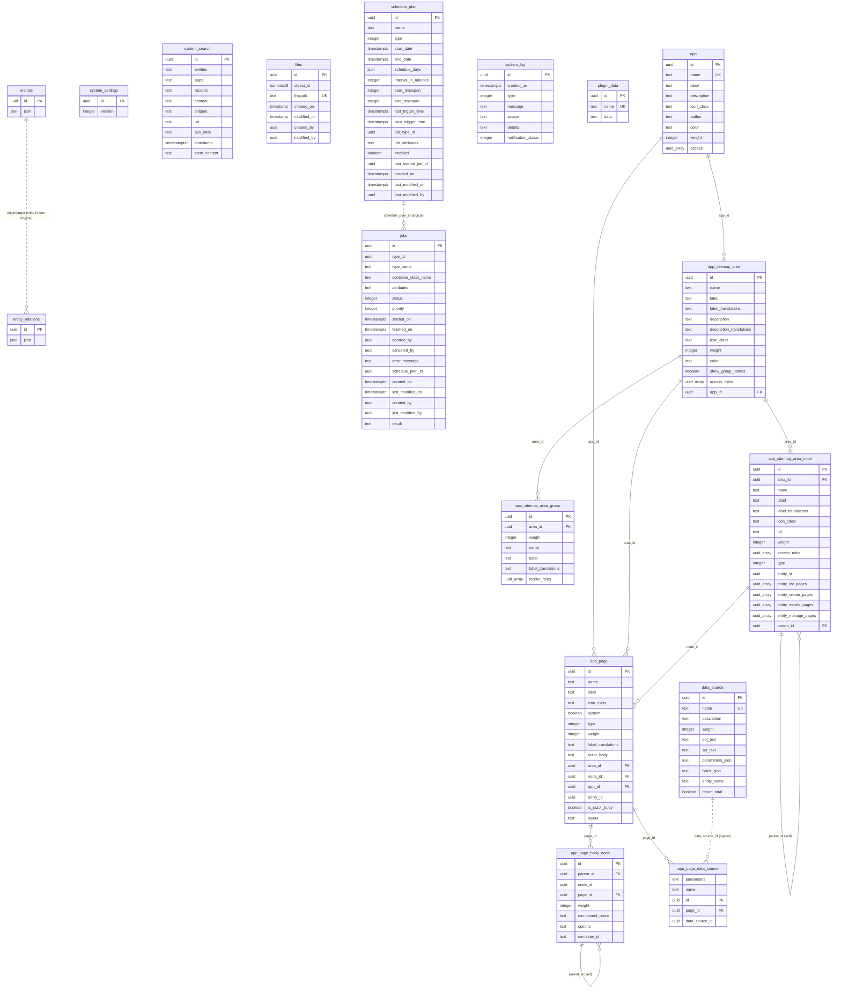
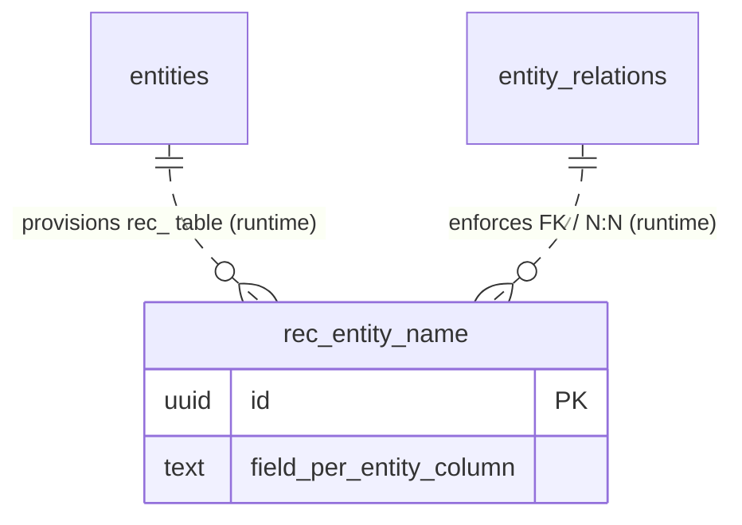

# Database Schema & Data Dictionary — WebVella ERP

*Generated 2026-06-05 15:39 UTC by read-only static analysis of `WebVella.ERP3.sln`. No production code, configuration, or schema artifact was modified in the production of this report.*

This is **Deliverable 3** of the WebVella ERP reverse-engineering suite. It reconstructs the database schema **entirely from code**, because the repository contains **no `.sql` files and no migrations folder of any kind**. The companion machine-readable export is [`data-dictionary.csv`](./data-dictionary.csv); the table and column names in the [Entity-Relationship Diagram](#6-entity-relationship-diagram-mermaid) of this document are kept in **exact lockstep** with that CSV.

---

## Executive Summary

WebVella ERP is a **metadata-driven ERP platform** running on **ASP.NET Core 9** over **PostgreSQL 16**. Unlike a conventional application, its database is **not** provisioned by an ORM migration tool. Instead, the schema is **created at runtime from PostgreSQL DDL embedded directly in C#**, in the method `InitializeSystemEntities()` (starting at line 18 of `WebVella.Erp/ERPService.cs`), which delegates the `CREATE TABLE` work to `CheckCreateSystemTables()` in the same file. Data access is performed through a **custom Npgsql data layer** that issues raw, parameterized SQL — it is **not** Entity Framework Core.

The schema follows a **dual model** that this document captures in full:

| Layer | What it is | Where it lives | How it is stored |
|-------|------------|----------------|------------------|
| **Fixed system tables** | 17 physical tables that bootstrap the platform (apps, pages, jobs, files, logs, plugin state, full-text search, and the meta-model store) | Embedded `CREATE TABLE` DDL in `WebVella.Erp/ERPService.cs` | Conventional relational tables and columns |
| **Dynamic entity meta-model** | User- and plugin-defined "entities", "fields", and "relations" | **Serialized as JSON** inside the `entities` and `entity_relations` tables; record data lives in dynamically created `rec_<entity_name>` tables | Meta-definition = JSON document; record data = typed columns in per-entity tables |

At a glance:

| Metric | Value |
|--------|-------|
| Database engine | **PostgreSQL 16** |
| Data-access strategy | **Custom Npgsql data layer** (raw parameterized SQL) — **not** Entity Framework Core |
| Schema provisioning | **Code-embedded DDL** in `WebVella.Erp/ERPService.cs` — **no** `.sql` files, **no** EF Migrations folder |
| Fixed physical system tables | **17** (16 created with the `public.` schema prefix; **`plugin_data` created without it**) |
| Dynamic record tables | Created on demand, one per entity, with the `rec_` prefix (`rec_<entity_name>`) |
| Meta-model store | `entities` and `entity_relations` (definitions held in a `json` column) |
| Schema evolution | `system_settings.version`-gated initialization patches + **date-versioned plugin patch methods** (`Patch20YYMMDD`) |
| Observed plugin patch files | **25** dated `<Plugin>.YYYYMMDD.cs` files (2018-12-15 → 2021-10-13) |

This document reports the system **as built**. Forward-looking schema recommendations are deliberately confined to `modernization-roadmap.md`.

---

## Table of Contents

1. [Reconstruction Methodology](#1-reconstruction-methodology)
2. [The Dual Schema Model](#2-the-dual-schema-model)
3. [Fixed System Tables — Overview](#3-fixed-system-tables--overview)
4. [Fixed System Tables — Per-Table Data Dictionary](#4-fixed-system-tables--per-table-data-dictionary)
5. [The Dynamic Entity Meta-Model](#5-the-dynamic-entity-meta-model)
6. [Entity-Relationship Diagram (Mermaid)](#6-entity-relationship-diagram-mermaid)
7. [Schema Evolution — Version Gates & Plugin Patch History](#7-schema-evolution--version-gates--plugin-patch-history)
8. [Cross-Document Consistency Contracts](#8-cross-document-consistency-contracts)
9. [Source Citation Index](#9-source-citation-index)

---

## 1. Reconstruction Methodology

There are **no SQL scripts and no Entity Framework migrations** anywhere in the solution. This was confirmed by inspecting the repository tree: the directory `WebVella.Erp.Web/Migrations/` assumed by a conventional EF Core application **does not exist**, and there are no `*.sql` source files that define the schema. The schema is therefore reconstructed by reading the embedded DDL and the data-layer builders directly.

The authoritative sources, all read **read-only**, are:

- **`WebVella.Erp/ERPService.cs`** — `InitializeSystemEntities()` (line 18) opens a connection, creates the required PostgreSQL extensions and casts, and calls **`CheckCreateSystemTables()`** (line 922). That method holds the embedded `CREATE TABLE` statements for the 17 fixed tables (lines 937–1399), interleaved with `ALTER TABLE` column additions and index/constraint creation.
- **`WebVella.Erp/Database/DbEntityRepository.cs`**, **`DbRelationRepository.cs`**, **`DbRecordRepository.cs`** — the builders that create and manage the dynamic meta-model and its `rec_<entity_name>` record tables.
- **`WebVella.Erp/ErpPlugin.cs`** — the base-class plumbing (`GetPluginData()` / `SavePluginData()`) that reads and writes plugin patch state in the `plugin_data` table.
- **The dated plugin patch files** — `<Plugin>.YYYYMMDD.cs` partial-class files containing `Patch20YYMMDD(...)` methods that evolve the schema and seed data after the initial bootstrap.

**Reading the DDL faithfully.** Every column, type, primary key, foreign key, unique constraint, default, and index documented below was read from the embedded DDL — not inferred. Where the schema is mutated after creation (e.g., a column added by a later `ALTER TABLE`, or a unique constraint that is created and then dropped), this document records the **net resulting shape** and notes the mutation, with the exact source line.

> **Four fidelity corrections honored throughout.** (1) The data layer is a **custom Npgsql** implementation with a **JSON record meta-model** — **not** EF Core. (2) The UI is Razor Pages + ERP TagHelpers + Blazor WebAssembly + plain JS (relevant here only insofar as `app_page.razor_body` and `app_page.is_razor_body` exist). (3) Schema provisioning is **code-embedded DDL plus dated patch methods** — **not** an EF Migrations folder, which does not exist. (4) There is **no Docker**; deployment is a plain ASP.NET Core host. Containerization appears only as a recommendation in the roadmap.

---

## 2. The Dual Schema Model

WebVella ERP stores two fundamentally different kinds of data, and the schema reflects both.

### 2.1 Fixed system tables (relational)

These are the seventeen bootstrap tables created by the embedded DDL. They hold platform infrastructure: applications and their navigation sitemaps, pages and page-builder body nodes, data sources, background jobs and their schedules, files, the system log, full-text search index, singleton system settings, plugin state, and — crucially — the two tables that **store the meta-model itself**. Sections [3](#3-fixed-system-tables--overview) and [4](#4-fixed-system-tables--per-table-data-dictionary) document every one of these tables and columns.

### 2.2 Dynamic entity meta-model (metadata-driven)

A user or a plugin can define a new **entity** (the platform's term for a business object such as "account", "task", or "email") together with its **fields** and **relations**, entirely at runtime. These definitions are **not** physical tables. Instead:

- The **entity definition** (name, label, fields, system flags) is **serialized to JSON** and inserted into the **`entities`** table's `json` column.
- The **relation definition** (origin/target entity and field, relation type, name) is serialized to JSON and inserted into the **`entity_relations`** table's `json` column.
- The **record data** for that entity is stored in a **dynamically created physical table** named **`rec_<entity_name>`**, with one typed column per field.

This metadata-driven design — definitions as JSON, data in generated `rec_` tables — is the heart of the platform's customizability and is documented in detail in [§5](#5-the-dynamic-entity-meta-model).

---

## 3. Fixed System Tables — Overview

The seventeen fixed tables are created by `CheckCreateSystemTables()` in `WebVella.Erp/ERPService.cs`. The table below lists each with the exact source line of its `CREATE TABLE` statement and its schema prefix. **Sixteen** tables are created with the `public.` prefix; **`plugin_data` is created without any schema prefix** (it relies on the connection's default `search_path`, which is `public`).

| # | Table | `CREATE TABLE` line | Schema prefix | Role |
|---|-------|--------------------:|---------------|------|
| 1 | `entities` | 937 | `public.` | Meta-model store: dynamic entity definitions (JSON) |
| 2 | `entity_relations` | 952 | `public.` | Meta-model store: dynamic relation definitions (JSON) |
| 3 | `system_settings` | 968 | `public.` | Singleton settings + schema version gate |
| 4 | `system_search` | 984 | `public.` | Full-text search index (GIN) |
| 5 | `files` | 1018 | `public.` | File-storage records |
| 6 | `jobs` | 1061 | `public.` | Background job queue/history |
| 7 | `schedule_plan` | 1101 | `public.` | Recurring job schedules |
| 8 | `system_log` | 1159 | `public.` | Application log (5 btree indexes) |
| 9 | `plugin_data` | 1201 | **none** ⚠️ | Plugin/patch state (stringified JSON) |
| 10 | `app` | 1225 | `public.` | Applications |
| 11 | `app_sitemap_area` | 1238 | `public.` | App navigation: areas |
| 12 | `app_sitemap_area_group` | 1254 | `public.` | App navigation: groups within areas |
| 13 | `app_sitemap_area_node` | 1265 | `public.` | App navigation: nodes (links) |
| 14 | `app_page` | 1280 | `public.` | Pages |
| 15 | `app_page_body_node` | 1298 | `public.` | Page-builder body nodes (nested) |
| 16 | `data_source` | 1383 | `public.` | Reusable EQL/SQL data sources |
| 17 | `app_page_data_source` | 1399 | `public.` | Page-to-data-source bindings |

> ⚠️ **`plugin_data` prefix anomaly.** Every other `CREATE TABLE` in `CheckCreateSystemTables()` is written `CREATE TABLE public.<name>`, but `plugin_data` is written `CREATE TABLE plugin_data(...)` (line 1201 of `WebVella.Erp/ERPService.cs`) — **without** the `public.` qualifier. The table is functionally identical (it resolves to `public.plugin_data` via the default `search_path`), but the inconsistency is preserved here because it is a faithful "what exists" observation and is mirrored in the `Constraints`/`Description` columns of `data-dictionary.csv`.

---

## 4. Fixed System Tables — Per-Table Data Dictionary

Each subsection documents one fixed table exactly as defined in the embedded DDL of `WebVella.Erp/ERPService.cs`. Columns, types, key designations, nullability, defaults, and constraints are read verbatim from the `CREATE TABLE`/`ALTER TABLE` statements and are mirrored row-for-row in [`data-dictionary.csv`](./data-dictionary.csv). PostgreSQL types are shown as written in the DDL (e.g., `timestamp with time zone`, `numeric(18)`, `uuid[]`).

### 4.1 `entities` — dynamic entity meta-model store

> `CREATE TABLE public.entities` — `WebVella.Erp/ERPService.cs:937`

Holds the JSON definition of every dynamic entity (system, user-defined, and plugin-defined). The physical record data for each entity lives in a separately created `rec_<entity_name>` table (see [§5](#5-the-dynamic-entity-meta-model)).

| Column | Data Type | Key | Nullable | Default | Constraints / Notes |
|--------|-----------|-----|----------|---------|---------------------|
| `id` | `uuid` | PK | NO | — | `entities_pkey PRIMARY KEY (id)` |
| `json` | `json` | — | NO | — | Serialized entity meta-definition (name, label, fields, system flags). Column name is the reserved word `json`, double-quoted in the DDL as `"json"`. |

### 4.2 `entity_relations` — dynamic relation meta-model store

> `CREATE TABLE public.entity_relations` — `WebVella.Erp/ERPService.cs:952`

Holds the JSON definition of every relation between entities. Physical enforcement (foreign keys for 1:N, junction tables for N:N) is created against the `rec_<entity_name>` tables by `DbRelationRepository`.

| Column | Data Type | Key | Nullable | Default | Constraints / Notes |
|--------|-----------|-----|----------|---------|---------------------|
| `id` | `uuid` | PK | NO | — | `entity_relations_pkey PRIMARY KEY (id)` |
| `json` | `json` | — | NO | — | Serialized relation definition (origin/target entity & field, relation type, name). Column name is the reserved word `json`, double-quoted in the DDL as `"json"`. |

### 4.3 `system_settings` — singleton settings & schema version

> `CREATE TABLE public.system_settings` — `WebVella.Erp/ERPService.cs:968`

A singleton row (fixed id `F3223177-B2FF-43F5-9A4B-FF16FC67D186`) whose `version` drives the version-gated initialization patches described in [§7.1](#71-version-gated-initialization-patches).

| Column | Data Type | Key | Nullable | Default | Constraints / Notes |
|--------|-----------|-----|----------|---------|---------------------|
| `id` | `uuid` | PK | NO | — | `system_settings_pkey PRIMARY KEY (id)` |
| `version` | `integer` | — | NO | — | Schema version; gates `UpdateSitemapNodeTable1()`/`UpdateSitemapNodeTable2()`. |

### 4.4 `system_search` — full-text search index

> `CREATE TABLE public.system_search` — `WebVella.Erp/ERPService.cs:984`

Backs the platform's global search. A GIN index `system_search_fts_idx` is built over `to_tsvector('english', stem_content)`.

| Column | Data Type | Key | Nullable | Default | Constraints / Notes |
|--------|-----------|-----|----------|---------|---------------------|
| `id` | `uuid` | PK | NO | — | `system_search_pkey PRIMARY KEY (id)` |
| `entities` | `text` | — | NO | `''::text` | Entities associated with the indexed item. |
| `apps` | `text` | — | NO | `''::text` | Apps associated with the indexed item. |
| `records` | `text` | — | NO | `''::text` | Records associated with the indexed item. |
| `content` | `text` | — | NO | `''::text` | Original indexed textual content. |
| `snippet` | `text` | — | NO | `''::text` | Preview snippet for results. |
| `url` | `text` | — | NO | `''::text` | Target URL of the search result. |
| `aux_data` | `text` | — | NO | `''::text` | Auxiliary metadata. |
| `timestamp` | `timestamp(0) with time zone` | — | NO | — | Index time. Column name is the reserved word `timestamp`, double-quoted in the DDL as `"timestamp"`. |
| `stem_content` | `text` | — | NO | `''::text` | Stemmed content; basis of `system_search_fts_idx` (GIN on `to_tsvector('english', stem_content)`). |

### 4.5 `files` — file-storage records

> `CREATE TABLE public.files` — `WebVella.Erp/ERPService.cs:1018`

Records for stored files. The `udx_object_id` unique constraint is created in the DDL and then **immediately dropped** via `DbRepository.DropUniqueConstraint("udx_object_id", "files")` to support file-system storage (where `object_id` is `0` for all files). A unique index `idx_filepath` is created on `filepath`.

| Column | Data Type | Key | Nullable | Default | Constraints / Notes |
|--------|-----------|-----|----------|---------|---------------------|
| `id` | `uuid` | PK | NO | — | `files_pkey PRIMARY KEY (id)` |
| `object_id` | `numeric(18)` | — | NO | — | `udx_object_id UNIQUE (object_id)` declared then **dropped** during initialization. |
| `filepath` | `text` | Unique | NO | — | `udx_filepath UNIQUE (filepath)`; unique index `idx_filepath`. |
| `created_on` | `timestamp without time zone` | — | NO | — | Creation timestamp. |
| `modified_on` | `timestamp without time zone` | — | NO | — | Last-modified timestamp. |
| `created_by` | `uuid` | — | YES | — | Creating user. |
| `modified_by` | `uuid` | — | YES | — | Last-modifying user. |

### 4.6 `jobs` — background job queue & history

> `CREATE TABLE public.jobs` — `WebVella.Erp/ERPService.cs:1061`; `result` column added by `ALTER TABLE public.jobs ADD COLUMN result text` — `WebVella.Erp/ERPService.cs:1143`

The background-job store. `schedule_plan_id` **logically** references `schedule_plan.id` but **no explicit foreign key** is declared in the DDL.

| Column | Data Type | Key | Nullable | Default | Constraints / Notes |
|--------|-----------|-----|----------|---------|---------------------|
| `id` | `uuid` | PK | NO | — | `jobs_pkey PRIMARY KEY (id)` |
| `type_id` | `uuid` | — | NO | — | Registered job-type id. |
| `type_name` | `text` | — | NO | — | Registered job-type name. |
| `complete_class_name` | `text` | — | NO | — | Fully-qualified .NET implementing class. |
| `attributes` | `text` | — | YES | — | Serialized job input attributes. |
| `status` | `integer` | — | NO | — | Job status code (enum). |
| `priority` | `integer` | — | NO | — | Scheduler priority. |
| `started_on` | `timestamp with time zone` | — | YES | — | Execution start. |
| `finished_on` | `timestamp with time zone` | — | YES | — | Execution end. |
| `aborted_by` | `uuid` | — | YES | — | User who aborted. |
| `canceled_by` | `uuid` | — | YES | — | User who canceled. |
| `error_message` | `text` | — | YES | — | Captured failure message. |
| `schedule_plan_id` | `uuid` | — | YES | — | Logical reference to `schedule_plan.id` (no explicit FK in DDL). |
| `created_on` | `timestamp with time zone` | — | NO | — | Record creation. |
| `last_modified_on` | `timestamp with time zone` | — | NO | — | Record last-modified. |
| `created_by` | `uuid` | — | YES | — | Creating user. |
| `last_modified_by` | `uuid` | — | YES | — | Last-modifying user. |
| `result` | `text` | — | YES | — | Serialized job result; added via `ALTER TABLE` during initialization. |

### 4.7 `schedule_plan` — recurring job schedules

> `CREATE TABLE public.schedule_plan` — `WebVella.Erp/ERPService.cs:1101`

Defines recurring schedules that enqueue jobs.

| Column | Data Type | Key | Nullable | Default | Constraints / Notes |
|--------|-----------|-----|----------|---------|---------------------|
| `id` | `uuid` | PK | NO | — | `schedule_plan_pkey PRIMARY KEY (id)` |
| `name` | `text` | — | NO | — | Human-readable name. |
| `type` | `integer` | — | NO | — | Schedule type code (enum). |
| `start_date` | `timestamp with time zone` | — | YES | — | Activation date/time. |
| `end_date` | `timestamp with time zone` | — | YES | — | Deactivation date/time. |
| `schedule_days` | `json` | — | YES | — | JSON recurrence/day specification. |
| `interval_in_minutes` | `integer` | — | YES | — | Interval for interval-based schedules. |
| `start_timespan` | `integer` | — | YES | — | Start time-of-day boundary. |
| `end_timespan` | `integer` | — | YES | — | End time-of-day boundary. |
| `last_trigger_time` | `timestamp with time zone` | — | YES | — | Last trigger time. |
| `next_trigger_time` | `timestamp with time zone` | — | YES | — | Computed next trigger time. |
| `job_type_id` | `uuid` | — | NO | — | Job type to enqueue. |
| `job_attributes` | `text` | — | YES | — | Serialized attributes for the triggered job. |
| `enabled` | `boolean` | — | NO | — | Whether the plan is active. |
| `last_started_job_id` | `uuid` | — | YES | — | Most recent job started by this plan. |
| `created_on` | `timestamp with time zone` | — | NO | — | Record creation. |
| `last_modified_on` | `timestamp with time zone` | — | NO | — | Record last-modified. |
| `last_modified_by` | `uuid` | — | YES | — | Last-modifying user. |

### 4.8 `system_log` — application log

> `CREATE TABLE public.system_log` — `WebVella.Erp/ERPService.cs:1159`

The application log, with five btree indexes (`idx_system_log_created_on`, `idx_system_log_message`, `idx_system_log_notification_status`, `idx_system_log_source`, `idx_system_log_type`).

| Column | Data Type | Key | Nullable | Default | Constraints / Notes |
|--------|-----------|-----|----------|---------|---------------------|
| `id` | `uuid` | PK | NO | — | `system_log_pkey PRIMARY KEY (id)` |
| `created_on` | `timestamp with time zone` | — | NO | `'2011-11-11 02:11:11+02'::timestamp with time zone` | Indexed by `idx_system_log_created_on`. |
| `type` | `integer` | — | NO | `1` | Severity/type code; indexed by `idx_system_log_type`. |
| `message` | `text` | — | NO | `'message'::text` | Log message; indexed by `idx_system_log_message`. |
| `source` | `text` | — | NO | `'source'::text` | Producing source/component; indexed by `idx_system_log_source`. |
| `details` | `text` | — | YES | — | Detailed payload (e.g., stack trace). |
| `notification_status` | `integer` | — | NO | `1` | Notification dispatch status; indexed by `idx_system_log_notification_status`. |


### 4.9 `plugin_data` — plugin & patch state ⚠️ (no `public.` prefix)

> `CREATE TABLE plugin_data` — `WebVella.Erp/ERPService.cs:1201` — **created without the `public.` schema prefix** (the only such table)

Stores each plugin's stringified-JSON state, including the **applied patch version** used to drive incremental patches (see [§7.2](#72-plugin-patch-mechanism)). Read/written by `ErpPlugin.GetPluginData()` / `SavePluginData()`.

| Column | Data Type | Key | Nullable | Default | Constraints / Notes |
|--------|-----------|-----|----------|---------|---------------------|
| `id` | `uuid` | PK | NO | — | `plugin_data_pkey PRIMARY KEY (id)`. **Table created without the `public.` prefix** (unlike all other system tables). |
| `name` | `text` | Unique | NO | `''::text` | `idx_u_plugin_data_name UNIQUE (name)`. Unique key under which the plugin/patch payload is stored. |
| `data` | `text` | — | YES | `''::text` | Serialized plugin/patch payload persisted by `ProcessPatches()`. |

### 4.10 `app` — applications

> `CREATE TABLE public.app` — `WebVella.Erp/ERPService.cs:1225`; `ux_app_name` unique constraint added at line 1377

The top of the application/navigation hierarchy.

| Column | Data Type | Key | Nullable | Default | Constraints / Notes |
|--------|-----------|-----|----------|---------|---------------------|
| `id` | `uuid` | PK | NO | — | `app_pkey PRIMARY KEY (id)` |
| `name` | `text` | Unique | NO | `''::text` | `ux_app_name UNIQUE (name)` |
| `label` | `text` | — | NO | — | Display label. |
| `description` | `text` | — | YES | — | Description. |
| `icon_class` | `text` | — | YES | — | CSS icon class. |
| `author` | `text` | — | YES | — | Author/owner. |
| `color` | `text` | — | YES | — | Theme color. |
| `weight` | `integer` | — | NO | `'-1'::integer` | Ordering weight. |
| `access` | `uuid[]` | — | YES | — | Array of role ids granted access. |

### 4.11 `app_sitemap_area` — navigation areas

> `CREATE TABLE public.app_sitemap_area` — `WebVella.Erp/ERPService.cs:1238`

Navigation areas belonging to an app.

| Column | Data Type | Key | Nullable | Default | Constraints / Notes |
|--------|-----------|-----|----------|---------|---------------------|
| `id` | `uuid` | PK | NO | — | `app_sitemap_area_pkey PRIMARY KEY (id)` |
| `name` | `text` | — | NO | `''::text` | System name. |
| `label` | `text` | — | YES | — | Display label. |
| `label_translations` | `text` | — | YES | — | Localized label translations. |
| `description` | `text` | — | YES | — | Description. |
| `description_translations` | `text` | — | YES | — | Localized description translations. |
| `icon_class` | `text` | — | YES | — | CSS icon class. |
| `weight` | `integer` | — | NO | `'-1'::integer` | Ordering weight. |
| `color` | `text` | — | YES | — | Theme color. |
| `show_group_names` | `boolean` | — | NO | `false` | Whether group names display. |
| `access_roles` | `uuid[]` | — | NO | — | Roles permitted to access the area. |
| `app_id` | `uuid` | FK | NO | — | `fkey_app_id FOREIGN KEY (app_id) REFERENCES app(id)` |

### 4.12 `app_sitemap_area_group` — navigation groups

> `CREATE TABLE public.app_sitemap_area_group` — `WebVella.Erp/ERPService.cs:1254`

Groups of nodes within a navigation area.

| Column | Data Type | Key | Nullable | Default | Constraints / Notes |
|--------|-----------|-----|----------|---------|---------------------|
| `id` | `uuid` | PK | NO | — | `app_sitemap_area_group_pkey PRIMARY KEY (id)` |
| `area_id` | `uuid` | FK | NO | — | `fkey_area_id FOREIGN KEY (area_id) REFERENCES app_sitemap_area(id)` |
| `weight` | `integer` | — | NO | `'-1'::integer` | Ordering weight. |
| `name` | `text` | — | NO | — | System name. |
| `label` | `text` | — | YES | — | Display label. |
| `label_translations` | `text` | — | YES | — | Localized label translations. |
| `render_roles` | `uuid[]` | — | NO | — | Roles for which the group renders. |

### 4.13 `app_sitemap_area_node` — navigation nodes

> `CREATE TABLE public.app_sitemap_area_node` — `WebVella.Erp/ERPService.cs:1265`; `entity_*_pages` columns added by `UpdateSitemapNodeTable1()` (line 1441); `parent_id` added by `UpdateSitemapNodeTable2()` (line 1456)

Navigation nodes (links). Five columns are added post-creation by the version-gated patches in [§7.1](#71-version-gated-initialization-patches).

| Column | Data Type | Key | Nullable | Default | Constraints / Notes |
|--------|-----------|-----|----------|---------|---------------------|
| `id` | `uuid` | PK | NO | — | `app_sitemap_area_node_pkey PRIMARY KEY (id)` |
| `area_id` | `uuid` | FK | NO | — | `fkey_area_id FOREIGN KEY (area_id) REFERENCES app_sitemap_area(id)` |
| `name` | `text` | — | NO | — | System name. |
| `label` | `text` | — | YES | — | Display label. |
| `label_translations` | `text` | — | YES | — | Localized label translations. |
| `icon_class` | `text` | — | YES | — | CSS icon class. |
| `url` | `text` | — | YES | — | Navigation URL. |
| `weight` | `integer` | — | NO | — | Ordering weight. |
| `access_roles` | `uuid[]` | — | NO | — | Roles permitted to access the node. |
| `type` | `integer` | — | NO | — | Node type code (enum). |
| `entity_id` | `uuid` | — | YES | — | Bound entity id (references the dynamic `entities` meta-model). |
| `entity_list_pages` | `uuid[]` | — | NO | `array[]::uuid[]` | Entity list pages; added via `UpdateSitemapNodeTable1()`. |
| `entity_create_pages` | `uuid[]` | — | NO | `array[]::uuid[]` | Entity create pages; added via `UpdateSitemapNodeTable1()`. |
| `entity_details_pages` | `uuid[]` | — | NO | `array[]::uuid[]` | Entity details pages; added via `UpdateSitemapNodeTable1()`. |
| `entity_manage_pages` | `uuid[]` | — | NO | `array[]::uuid[]` | Entity manage pages; added via `UpdateSitemapNodeTable1()`. |
| `parent_id` | `uuid` | FK | YES | `NULL` | Self-referencing parent; added via `UpdateSitemapNodeTable2()`. `fkey_app_sitemap_area_node_parent_id FOREIGN KEY (parent_id) REFERENCES app_sitemap_area_node(id)` |

### 4.14 `app_page` — pages

> `CREATE TABLE public.app_page` — `WebVella.Erp/ERPService.cs:1280`; `layout` column added by `ALTER TABLE public.app_page ADD COLUMN layout` — line 1381

Pages within an app. `razor_body`/`is_razor_body` support Razor-rendered pages; `area_id`/`node_id`/`app_id` tie a page into the navigation hierarchy.

| Column | Data Type | Key | Nullable | Default | Constraints / Notes |
|--------|-----------|-----|----------|---------|---------------------|
| `id` | `uuid` | PK | NO | — | `app_page_pkey PRIMARY KEY (id)` |
| `name` | `text` | — | NO | — | System name. |
| `label` | `text` | — | YES | — | Display label. |
| `icon_class` | `text` | — | YES | — | CSS icon class. |
| `system` | `boolean` | — | YES | `false` | Whether a protected system page. |
| `type` | `integer` | — | NO | — | Page type code (enum). |
| `weight` | `integer` | — | NO | `'-1'::integer` | Ordering weight. |
| `label_translations` | `text` | — | YES | — | Localized label translations. |
| `razor_body` | `text` | — | YES | — | Razor markup body. |
| `area_id` | `uuid` | FK | YES | — | `fkey_area_id FOREIGN KEY (area_id) REFERENCES app_sitemap_area(id)` |
| `node_id` | `uuid` | FK | YES | — | `fkey_node_id FOREIGN KEY (node_id) REFERENCES app_sitemap_area_node(id)` |
| `app_id` | `uuid` | FK | YES | — | `fkey_app_id FOREIGN KEY (app_id) REFERENCES app(id)` |
| `entity_id` | `uuid` | — | YES | — | Bound entity id (references the dynamic `entities` meta-model). |
| `is_razor_body` | `boolean` | — | NO | `false` | Whether the body is rendered from `razor_body`. |
| `layout` | `text` | — | NO | `''` | Layout template name; added via `ALTER TABLE` during initialization. |

### 4.15 `app_page_body_node` — page-builder body nodes

> `CREATE TABLE public.app_page_body_node` — `WebVella.Erp/ERPService.cs:1298`; `container_id` column added by `ALTER TABLE public.app_page_body_node ADD COLUMN container_id` — line 1311

Nested page-builder nodes that compose a page's body. Self-referencing via `parent_id`.

| Column | Data Type | Key | Nullable | Default | Constraints / Notes |
|--------|-----------|-----|----------|---------|---------------------|
| `id` | `uuid` | PK | NO | — | `app_page_body_node_pkey PRIMARY KEY (id)` |
| `parent_id` | `uuid` | FK | YES | — | `fkey_app_page_body_node_parent_id FOREIGN KEY (parent_id) REFERENCES app_page_body_node(id)` (self-reference) |
| `node_id` | `uuid` | — | YES | — | Associated sitemap node, if any. |
| `page_id` | `uuid` | FK | NO | — | `fkey_app_page_body_node_page_id FOREIGN KEY (page_id) REFERENCES app_page(id)` |
| `weight` | `integer` | — | NO | `'-1'::integer` | Ordering weight within the parent. |
| `component_name` | `text` | — | YES | — | Page-builder component rendered at this node. |
| `options` | `text` | — | YES | — | Serialized component options. |
| `container_id` | `text` | — | YES | — | Container/region id; added via `ALTER TABLE` during initialization. |

### 4.16 `data_source` — reusable EQL/SQL data sources

> `CREATE TABLE public.data_source` — `WebVella.Erp/ERPService.cs:1383`; `return_total` column added by `ALTER TABLE data_source ADD COLUMN return_total` — line 1435

Stores reusable data sources. The `eql_text` is authored in EQL (the platform's query language) and `sql_text` holds the translated SQL — the on-disk evidence of the EQL→SQL path documented in `architecture.md`.

| Column | Data Type | Key | Nullable | Default | Constraints / Notes |
|--------|-----------|-----|----------|---------|---------------------|
| `id` | `uuid` | PK | NO | — | `data_source_pkey PRIMARY KEY (id)` |
| `name` | `text` | Unique | NO | — | `ux_data_source_name UNIQUE (name)` |
| `description` | `text` | — | NO | — | Description. |
| `weight` | `integer` | — | NO | — | Ordering weight. |
| `eql_text` | `text` | — | NO | — | EQL query text. |
| `sql_text` | `text` | — | NO | — | SQL translated from the EQL. |
| `parameters_json` | `text` | — | NO | — | Serialized parameter definitions. |
| `fields_json` | `text` | — | NO | — | Serialized field definitions. |
| `entity_name` | `text` | — | NO | — | Primary entity queried. |
| `return_total` | `boolean` | — | NO | `true` | Whether a total count is returned; added via `ALTER TABLE` during initialization. |

### 4.17 `app_page_data_source` — page-to-data-source bindings

> `CREATE TABLE public.app_page_data_source` — `WebVella.Erp/ERPService.cs:1399`; FK `fkey_page_id` added at line 1411

Binds a `data_source` to an `app_page`. `page_id` has an explicit foreign key; `data_source_id` is a **logical** reference (no explicit FK in DDL). Columns are listed in DDL declaration order.

| Column | Data Type | Key | Nullable | Default | Constraints / Notes |
|--------|-----------|-----|----------|---------|---------------------|
| `parameters` | `text` | — | NO | — | Serialized parameter bindings. |
| `name` | `text` | — | NO | — | Binding name; part of `app_page_data_uxc_name_page_id UNIQUE (name, page_id)`. |
| `id` | `uuid` | PK | NO | — | `app_page_data_source_pkey PRIMARY KEY (id)` |
| `page_id` | `uuid` | FK | NO | — | `fkey_page_id FOREIGN KEY (page_id) REFERENCES public.app_page(id) ON DELETE NO ACTION ON UPDATE NO ACTION`; part of `app_page_data_uxc_name_page_id UNIQUE (name, page_id)`; indexed by `fki_app_page_data_fkc_page_id`. |
| `data_source_id` | `uuid` | — | NO | — | Logical reference to `data_source.id` (no explicit FK in DDL). |


---

## 5. The Dynamic Entity Meta-Model

The fixed tables above bootstrap the platform, but most business data in WebVella ERP lives in **dynamically defined entities**. This section documents how the meta-model is stored and how the three `Database/` repositories manage it.

### 5.1 Definitions are JSON; record data is typed columns

There are two distinct concerns, stored differently:

1. **Meta-definitions (JSON).** An entity's structure (its name, label, fields, and system flags) and a relation's structure (origin/target entity & field, relation type, name) are **serialized to JSON** and stored as a single row in the `entities` or `entity_relations` table respectively (the `json` column of each). The serializer is Newtonsoft.Json configured with `TypeNameHandling.Auto`.
2. **Record data (typed columns).** The actual rows of a dynamic entity are stored in a **dedicated physical table** named `rec_<entity_name>`. Every field of the entity becomes a **typed column** in that table — record data is **not** kept as an opaque JSON blob.

The shared constant that defines the table-name prefix is `RECORD_COLLECTION_PREFIX = "rec_"`, declared in both `WebVella.Erp/Database/DbEntityRepository.cs:17` and `WebVella.Erp/Database/DbRecordRepository.cs:31`.

### 5.2 `DbEntityRepository` — creating an entity

`DbEntityRepository.Create(...)` (`WebVella.Erp/Database/DbEntityRepository.cs`) performs a two-part write inside a transaction:

- It serializes the `DbEntity` to JSON (`JsonConvert.SerializeObject(entity, settings)` with `TypeNameHandling.Auto`) and **inserts the meta-definition** into the `entities` table (`DbRepository.InsertRecord("entities", parameters)`).
- It **provisions the physical record table** `rec_<entity_name>` via `DbRepository.CreateTable(tableName)`, then iterates `entity.Fields` and adds a typed column per field via `DbRepository.CreateColumn(tableName, field)`.

For non-system entities it also auto-creates two system relations linking the built-in user entity to the new entity — `user_<entity>_created_by` and `user_<entity>_modified_by` — so every record carries authorship.

### 5.3 `DbRelationRepository` — creating a relation

`DbRelationRepository.Create(...)` (`WebVella.Erp/Database/DbRelationRepository.cs`) serializes the relation to JSON and **inserts the definition** into `entity_relations` (`DbRepository.InsertRecord("entity_relations", parameters)`). It then enforces the relation physically against the `rec_` tables:

- **Many-to-many** relations create a **junction table** (`DbRepository.CreateNtoNRelation(...)`, names derived as `rec_{originEntity.Name}` and `rec_{targetEntity.Name}`).
- **One-to-many / one-to-one** relations create the appropriate **foreign key and supporting index** on the target `rec_` table.

### 5.4 `DbRecordRepository` — reading & writing records

`DbRecordRepository` (`WebVella.Erp/Database/DbRecordRepository.cs`) is the largest data-layer class and performs all record CRUD against `rec_<entity_name>` tables:

- `Create(...)` / `Update(...)` / `Delete(...)` build parameterized commands over `RECORD_COLLECTION_PREFIX + entityName`, converting each field value to its database type via `DbTypeConverter` (with special handling for geography fields using PostGIS `ST_Transform`/`ST_GeomFrom*`).
- `CreateRecordField(...)`, `UpdateRecordField(...)`, and `RemoveRecordField(...)` add, alter, and drop the **typed columns** of a `rec_` table when an entity's fields change.
- Queries are expressed via `EntityQuery` and resolve to the same `rec_` tables (the runtime target of the EQL→SQL path).

### 5.5 Why this matters

This metadata-driven approach means the **physical schema grows at runtime**: defining a new entity creates a new `rec_<entity_name>` table, and adding a field adds a column. Because these tables are created on demand from user/plugin actions, they are **not** part of the fixed DDL and are therefore **not** enumerated as fixed tables in [`data-dictionary.csv`](./data-dictionary.csv) (which catalogs the 17 bootstrap tables). They are illustrated separately as a conceptual pattern in §6.1 and are intentionally **not** part of the lockstep ERD in §6 (which is limited to the 17 fixed physical tables).

---

## 6. Entity-Relationship Diagram (Mermaid)

The diagram renders all **17 fixed system tables** with their columns, primary keys, foreign keys, and unique keys, plus the **meta-model** relationship between `entities` and `entity_relations`. It contains **only** these 17 physical tables, in exact lockstep with `data-dictionary.csv`. The dynamically created per-entity `rec_<entity_name>` record tables are illustrated separately in §6.1 as a conceptual pattern (they are runtime-created and are not part of the fixed schema).

**Lockstep contract.** Every fixed-table name and column name below matches [`data-dictionary.csv`](./data-dictionary.csv) **exactly** (case and spelling). Attribute **types** are shown as Mermaid-safe single tokens (`timestamptz` = `timestamp with time zone`, `timestamptz0` = `timestamp(0) with time zone`, `timestamp` = `timestamp without time zone`, `uuid_array` = `uuid[]`, `numeric18` = `numeric(18)`); the **precise PostgreSQL types** are in the per-table tables of [§4](#4-fixed-system-tables--per-table-data-dictionary) and in the CSV. Relationship lines are **solid** for DDL-declared foreign keys and **dashed** for logical references that have no explicit FK in the DDL.


```mermaid
erDiagram
    entities {
        uuid id PK
        json json
    }
    entity_relations {
        uuid id PK
        json json
    }
    system_settings {
        uuid id PK
        integer version
    }
    system_search {
        uuid id PK
        text entities
        text apps
        text records
        text content
        text snippet
        text url
        text aux_data
        timestamptz0 timestamp
        text stem_content
    }
    files {
        uuid id PK
        numeric18 object_id
        text filepath UK
        timestamp created_on
        timestamp modified_on
        uuid created_by
        uuid modified_by
    }
    jobs {
        uuid id PK
        uuid type_id
        text type_name
        text complete_class_name
        text attributes
        integer status
        integer priority
        timestamptz started_on
        timestamptz finished_on
        uuid aborted_by
        uuid canceled_by
        text error_message
        uuid schedule_plan_id
        timestamptz created_on
        timestamptz last_modified_on
        uuid created_by
        uuid last_modified_by
        text result
    }
    schedule_plan {
        uuid id PK
        text name
        integer type
        timestamptz start_date
        timestamptz end_date
        json schedule_days
        integer interval_in_minutes
        integer start_timespan
        integer end_timespan
        timestamptz last_trigger_time
        timestamptz next_trigger_time
        uuid job_type_id
        text job_attributes
        boolean enabled
        uuid last_started_job_id
        timestamptz created_on
        timestamptz last_modified_on
        uuid last_modified_by
    }
    system_log {
        uuid id PK
        timestamptz created_on
        integer type
        text message
        text source
        text details
        integer notification_status
    }
    plugin_data {
        uuid id PK
        text name UK
        text data
    }
    app {
        uuid id PK
        text name UK
        text label
        text description
        text icon_class
        text author
        text color
        integer weight
        uuid_array access
    }
    app_sitemap_area {
        uuid id PK
        text name
        text label
        text label_translations
        text description
        text description_translations
        text icon_class
        integer weight
        text color
        boolean show_group_names
        uuid_array access_roles
        uuid app_id FK
    }
    app_sitemap_area_group {
        uuid id PK
        uuid area_id FK
        integer weight
        text name
        text label
        text label_translations
        uuid_array render_roles
    }
    app_sitemap_area_node {
        uuid id PK
        uuid area_id FK
        text name
        text label
        text label_translations
        text icon_class
        text url
        integer weight
        uuid_array access_roles
        integer type
        uuid entity_id
        uuid_array entity_list_pages
        uuid_array entity_create_pages
        uuid_array entity_details_pages
        uuid_array entity_manage_pages
        uuid parent_id FK
    }
    app_page {
        uuid id PK
        text name
        text label
        text icon_class
        boolean system
        integer type
        integer weight
        text label_translations
        text razor_body
        uuid area_id FK
        uuid node_id FK
        uuid app_id FK
        uuid entity_id
        boolean is_razor_body
        text layout
    }
    app_page_body_node {
        uuid id PK
        uuid parent_id FK
        uuid node_id
        uuid page_id FK
        integer weight
        text component_name
        text options
        text container_id
    }
    data_source {
        uuid id PK
        text name UK
        text description
        integer weight
        text eql_text
        text sql_text
        text parameters_json
        text fields_json
        text entity_name
        boolean return_total
    }
    app_page_data_source {
        text parameters
        text name
        uuid id PK
        uuid page_id FK
        uuid data_source_id
    }

    app ||--o{ app_sitemap_area : "app_id"
    app ||--o{ app_page : "app_id"
    app_sitemap_area ||--o{ app_sitemap_area_group : "area_id"
    app_sitemap_area ||--o{ app_sitemap_area_node : "area_id"
    app_sitemap_area ||--o{ app_page : "area_id"
    app_sitemap_area_node ||--o{ app_page : "node_id"
    app_sitemap_area_node ||--o{ app_sitemap_area_node : "parent_id (self)"
    app_page ||--o{ app_page_body_node : "page_id"
    app_page_body_node ||--o{ app_page_body_node : "parent_id (self)"
    app_page ||--o{ app_page_data_source : "page_id"
    data_source ||..o{ app_page_data_source : "data_source_id (logical)"
    schedule_plan ||..o{ jobs : "schedule_plan_id (logical)"
    entities ||..o{ entity_relations : "origin/target entity in json (logical)"
```

> **Reading the diagram.** Solid connectors (`--`) are foreign keys declared in the embedded DDL via `ALTER TABLE ... ADD CONSTRAINT fkey_*`. Dashed connectors (`..`) are references that exist logically in code/data but have **no** explicit DDL foreign key: `jobs.schedule_plan_id → schedule_plan.id`, `app_page_data_source.data_source_id → data_source.id`, and the logical link from `entities` to `entity_relations`. This ERD contains **only** the 17 fixed physical tables and their columns, exactly matching `data-dictionary.csv` (the ERD↔CSV lockstep contract). The dynamically created `rec_<entity_name>` record tables are **not** physical fixed tables and are therefore **not** part of this lockstep ERD; they are illustrated separately as a conceptual pattern in §6.1 below.


### 6.1 Conceptual: the dynamic `rec_<entity_name>` pattern (not in CSV lockstep)

The §6 ERD above is the **authoritative, machine-checkable** view of the fixed schema and is kept in exact lockstep with `data-dictionary.csv`. Separately, the metadata-driven engine materializes **physical per-entity record tables at runtime**: one `rec_<entity_name>` table per user- or plugin-defined entity, each with an `id` column plus one typed column per field (see §5). These runtime tables are **not** part of the fixed DDL, are **not** enumerated in `data-dictionary.csv`, and are therefore **deliberately excluded** from the lockstep ERD in §6.

The diagram below is **illustrative only**. `rec_entity_name` is a *template* standing in for the many concrete `rec_*` tables that exist at runtime; it is **not** a CSV row and is **not** claimed to be in lockstep with `data-dictionary.csv`. `entities` and `entity_relations` appear here only to show where the runtime provisioning originates (they are real fixed tables, fully specified in §6 and the CSV).


```mermaid
erDiagram
    entities ||..o{ rec_entity_name : "provisions rec_ table (runtime)"
    entity_relations ||..o{ rec_entity_name : "enforces FK / N:N (runtime)"
    rec_entity_name {
        uuid id PK
        text field_per_entity_column
    }
```

> **Why this is separate.** Keeping the runtime `rec_*` tables out of the §6 ERD preserves the hard **ERD ↔ `data-dictionary.csv` lockstep** — every box and column in §6 appears verbatim as a CSV row, and every CSV row appears in §6 — while still documenting the meta-model's runtime materialization here for completeness.

---

## 7. Schema Evolution — Version Gates & Plugin Patch History

With no migration framework, the schema and its seed data evolve through **two complementary mechanisms**: core version-gated initialization patches, and date-versioned plugin patch methods.

### 7.1 Version-gated initialization patches

The core schema version is stored in `system_settings.version` and read at startup by `InitializeSystemEntities()` (`WebVella.Erp/ERPService.cs:18`). After `CheckCreateSystemTables()` creates any missing tables, the method applies forward-only patches gated on `currentVersion`:

| Gate | Action | Method | Source |
|------|--------|--------|--------|
| `currentVersion < 1` | Create system tables and seed system entities, fields, relations, and roles; set `version = 1` | inline in `InitializeSystemEntities()` | `WebVella.Erp/ERPService.cs:51` |
| `currentVersion < 2` | Add `entity_list_pages`, `entity_create_pages`, `entity_details_pages`, `entity_manage_pages` to `app_sitemap_area_node`; set `version = 2` | `UpdateSitemapNodeTable1()` | `WebVella.Erp/ERPService.cs:1441` |
| `currentVersion < 3` | Add self-referencing `parent_id` (+ FK `fkey_app_sitemap_area_node_parent_id`) to `app_sitemap_area_node`; set `version = 3` | `UpdateSitemapNodeTable2()` | `WebVella.Erp/ERPService.cs:1456` |

The new version is persisted via `DbSystemSettingsRepository.Save(...)` (`WebVella.Erp/ERPService.cs:877`). This is the on-disk evidence that the `system_settings.version` column functions as the core schema-version marker.

### 7.2 Plugin patch mechanism

Each patch-bearing plugin contributes a partial class `<Plugin>` split across files. The orchestrator lives in `<Plugin>._.cs` as a public method **`ProcessPatches()`**, and each individual patch lives in its own dated partial-class file **`<Plugin>.YYYYMMDD.cs`** as a method with the signature:

```csharp
private static void Patch20YYMMDD(EntityManager entMan, EntityRelationManager relMan, RecordManager recMan)
```

`ProcessPatches()` runs inside a transaction under a system security scope and:

1. Reads the plugin's persisted state from the **`plugin_data`** table via `ErpPlugin.GetPluginData()` — `SELECT * FROM plugin_data WHERE name = @name` (`WebVella.Erp/ErpPlugin.cs`), deserializing the `data` payload into a `PluginSettings` object carrying a numeric `Version`.
2. For each dated patch, in **ascending date order**, applies it only when `currentPluginSettings.Version < patchVersion`, then advances `currentPluginSettings.Version` to that patch's date.
3. Persists the updated state via `ErpPlugin.SavePluginData(...)` — `INSERT INTO plugin_data (id,name,data) VALUES(...)` on first run or `UPDATE plugin_data SET data = @data WHERE name = @name` thereafter (`WebVella.Erp/ErpPlugin.cs`).

All `plugin_data` access uses parameterized `NpgsqlParameter` values — consistent with the custom-Npgsql, injection-aware data layer noted in `security-quality.md`.

`ProcessPatches()` is defined in six plugins: `WebVella.Erp.Plugins.Crm/CrmPlugin._.cs`, `WebVella.Erp.Plugins.Mail/MailPlugin._.cs`, `WebVella.Erp.Plugins.MicrosoftCDM/MicrosoftCDMPlugin._.cs`, `WebVella.Erp.Plugins.Next/NextPlugin._.cs`, `WebVella.Erp.Plugins.Project/ProjectPlugin._.cs`, and `WebVella.Erp.Plugins.SDK/SdkPlugin._.cs`.

> **CRM has no active patch file.** In `WebVella.Erp.Plugins.Crm/CrmPlugin._.cs`, the only reference to `Patch20190123` is a **commented-out** call at **line 66** (`// Patch20190123(entMan, relMan, recMan);`), and **no `CrmPlugin.YYYYMMDD.cs` file exists**. CRM therefore ships `ProcessPatches()` but applies no dated patches. Accordingly, the history below cites only the **real `<Plugin>.YYYYMMDD.cs` definition files**, so every citation resolves to an actual method.

### 7.3 Observed plugin patch history (chronological)

The following **25** dated patch files exist in the repository, each containing a real `Patch20YYMMDD(...)` method. They are applied in ascending date order by their plugin's `ProcessPatches()`. (`WebVella.Erp.Plugins.Approval` and `WebVella.Erp.Plugins.MicrosoftCDM` contribute no dated patch files.)

| # | Date | Plugin | Method | Definition file |
|---|------|--------|--------|-----------------|
| 1 | 2018-12-15 | SDK | `Patch20181215` | `WebVella.Erp.Plugins.SDK/SdkPlugin.20181215.cs` |
| 2 | 2019-02-03 | Next | `Patch20190203` | `WebVella.Erp.Plugins.Next/NextPlugin.20190203.cs` |
| 3 | 2019-02-03 | Project | `Patch20190203` | `WebVella.Erp.Plugins.Project/ProjectPlugin.20190203.cs` |
| 4 | 2019-02-04 | Next | `Patch20190204` | `WebVella.Erp.Plugins.Next/NextPlugin.20190204.cs` |
| 5 | 2019-02-05 | Next | `Patch20190205` | `WebVella.Erp.Plugins.Next/NextPlugin.20190205.cs` |
| 6 | 2019-02-05 | Project | `Patch20190205` | `WebVella.Erp.Plugins.Project/ProjectPlugin.20190205.cs` |
| 7 | 2019-02-06 | Next | `Patch20190206` | `WebVella.Erp.Plugins.Next/NextPlugin.20190206.cs` |
| 8 | 2019-02-06 | Project | `Patch20190206` | `WebVella.Erp.Plugins.Project/ProjectPlugin.20190206.cs` |
| 9 | 2019-02-07 | Project | `Patch20190207` | `WebVella.Erp.Plugins.Project/ProjectPlugin.20190207.cs` |
| 10 | 2019-02-08 | Project | `Patch20190208` | `WebVella.Erp.Plugins.Project/ProjectPlugin.20190208.cs` |
| 11 | 2019-02-15 | Mail | `Patch20190215` | `WebVella.Erp.Plugins.Mail/MailPlugin.20190215.cs` |
| 12 | 2019-02-22 | Next | `Patch20190222` | `WebVella.Erp.Plugins.Next/NextPlugin.20190222.cs` |
| 13 | 2019-02-22 | Project | `Patch20190222` | `WebVella.Erp.Plugins.Project/ProjectPlugin.20190222.cs` |
| 14 | 2019-02-27 | SDK | `Patch20190227` | `WebVella.Erp.Plugins.SDK/SdkPlugin.20190227.cs` |
| 15 | 2019-04-19 | Mail | `Patch20190419` | `WebVella.Erp.Plugins.Mail/MailPlugin.20190419.cs` |
| 16 | 2019-04-20 | Mail | `Patch20190420` | `WebVella.Erp.Plugins.Mail/MailPlugin.20190420.cs` |
| 17 | 2019-04-22 | Mail | `Patch20190422` | `WebVella.Erp.Plugins.Mail/MailPlugin.20190422.cs` |
| 18 | 2019-05-29 | Mail | `Patch20190529` | `WebVella.Erp.Plugins.Mail/MailPlugin.20190529.cs` |
| 19 | 2020-06-10 | Mail | `Patch20200610` | `WebVella.Erp.Plugins.Mail/MailPlugin.20200610.cs` |
| 20 | 2020-06-10 | SDK | `Patch20200610` | `WebVella.Erp.Plugins.SDK/SdkPlugin.20200610.cs` |
| 21 | 2020-06-11 | Mail | `Patch20200611` | `WebVella.Erp.Plugins.Mail/MailPlugin.20200611.cs` |
| 22 | 2020-12-21 | SDK | `Patch20201221` | `WebVella.Erp.Plugins.SDK/SdkPlugin.20201221.cs` |
| 23 | 2021-04-29 | SDK | `Patch20210429` | `WebVella.Erp.Plugins.SDK/SdkPlugin.20210429.cs` |
| 24 | 2021-10-12 | Project | `Patch20211012` | `WebVella.Erp.Plugins.Project/ProjectPlugin.20211012.cs` |
| 25 | 2021-10-13 | Project | `Patch20211013` | `WebVella.Erp.Plugins.Project/ProjectPlugin.20211013.cs` |

The earliest patch is `SdkPlugin.20181215.cs` (2018-12-15) and the most recent is `ProjectPlugin.20211013.cs` (2021-10-13). A representative patch — `WebVella.Erp.Plugins.Project/ProjectPlugin.20190222.cs` (`Patch20190222`) — deletes and recreates page data sources and data sources via `PageService` and `DataSourceManager`, illustrating that patches operate on **records and meta-model objects** (not raw DDL), using the same `EntityManager`/`EntityRelationManager`/`RecordManager` APIs available to application code.

---

## 8. Cross-Document Consistency Contracts

This document honors the suite-wide consistency contracts established by [`code-inventory.md`](./code-inventory.md):

1. **ERD ↔ CSV lockstep (hard contract).** Every fixed-table name and column name in the [ERD](#6-entity-relationship-diagram-mermaid) and the [per-table dictionary](#4-fixed-system-tables--per-table-data-dictionary) matches [`data-dictionary.csv`](./data-dictionary.csv) row-for-row (case and spelling) — the §6 ERD contains exactly the 17 fixed physical tables, no more and no fewer. The CSV is the machine-readable form of this document. The illustrative conceptual diagram in §6.1 (the dynamic `rec_<entity_name>` template) is explicitly **outside** this lockstep and is not enumerated in the CSV.
2. **Shared module taxonomy & canonical paths.** All citations use the repository-relative paths catalogued in `code-inventory.md`/`code-inventory.csv` (e.g., `WebVella.Erp/ERPService.cs`, `WebVella.Erp/Database/DbRecordRepository.cs`, `WebVella.Erp.Plugins.Project/ProjectPlugin.20190222.cs`), and resolve to real files/methods.
3. **Reconciliation with sibling documents.** The table names and the meta-model concept reconcile with the Data Integrity rules in `business-rules.md` (relation/foreign-key constraints via `entity_relations`) and with the EQL→SQL path in `architecture.md` (the `data_source.eql_text`/`sql_text` columns are the persisted evidence of that path).
4. **Factual reporting.** This document describes the schema **as built** — custom Npgsql data layer, code-embedded DDL, dynamic JSON meta-model, dated patch methods, no EF Core, no migrations folder, no Docker. Aspirational schema guidance lives only in `modernization-roadmap.md`.

### 8.1 Suite navigation

| # | Document | Contents |
|---|----------|----------|
| 1 | [`code-inventory.md`](./code-inventory.md) + [`code-inventory.csv`](./code-inventory.csv) | Module taxonomy, file/LOC tables, dependency tree |
| 2 | `architecture.md` | Layered + plugin model, EQL→SQL path, auth flow, page-builder lifecycle |
| 3 | **`database-schema.md`** *(this file)* + [`data-dictionary.csv`](./data-dictionary.csv) | Schema from embedded DDL + patches; ERD |
| 4 | `functional-overview.md` | Module catalog, workflows, user roles |
| 5 | `business-rules.md` | Catalogued business rules with citations |
| 6 | `security-quality.md` | Vulnerabilities, code metrics, CVE audit |
| 7 | `modernization-roadmap.md` | Current-state, target-state, 3-phase plan |
| — | `README.md` | Master index & executive overview |

---

## 9. Source Citation Index

Every schema claim in this document resolves to one of the following read-only sources:

| Source | Role in the schema |
|--------|--------------------|
| `WebVella.Erp/ERPService.cs` | `InitializeSystemEntities()` (18), `CheckCreateSystemTables()` (922), all 17 `CREATE TABLE` blocks (937–1399), `ALTER TABLE` additions (`jobs.result` 1143, `app_page_body_node.container_id` 1311, `ux_app_name` 1377, `app_page.layout` 1381, `app_page_data_source.fkey_page_id` 1411, `data_source.return_total` 1435), version-gated patches `UpdateSitemapNodeTable1()` (1441) / `UpdateSitemapNodeTable2()` (1456), version save (877) |
| `WebVella.Erp/Database/DbEntityRepository.cs` | Entity meta-model creation; `RECORD_COLLECTION_PREFIX` (17); `rec_<entity_name>` table & column provisioning |
| `WebVella.Erp/Database/DbRelationRepository.cs` | Relation meta-model creation; FK (1:N) and junction-table (N:N) enforcement on `rec_` tables |
| `WebVella.Erp/Database/DbRecordRepository.cs` | Record CRUD over `rec_<entity_name>`; `RECORD_COLLECTION_PREFIX` (31); typed-column field management |
| `WebVella.Erp/ErpPlugin.cs` | `GetPluginData()` / `SavePluginData()` — `plugin_data` SELECT/INSERT/UPDATE for patch state |
| `WebVella.Erp.Plugins.Crm/CrmPlugin._.cs` | `ProcessPatches()` (15); commented `Patch20190123` call (66); no dated CRM patch file |
| `WebVella.Erp.Plugins.Project/ProjectPlugin.20190222.cs` | Representative dated patch (`Patch20190222`) operating on data sources and records |
| The 25 `<Plugin>.YYYYMMDD.cs` files | Dated `Patch20YYMMDD` definition files enumerated in [§7.3](#73-observed-plugin-patch-history-chronological) |
| [`data-dictionary.csv`](./data-dictionary.csv) | Machine-readable mirror of [§4](#4-fixed-system-tables--per-table-data-dictionary); authoritative table/column name list for the ERD lockstep |

---

*Generated 2026-06-05 15:39 UTC by read-only static analysis of `WebVella.ERP3.sln`. No production code, configuration, or schema artifact was modified in the production of this report.*

