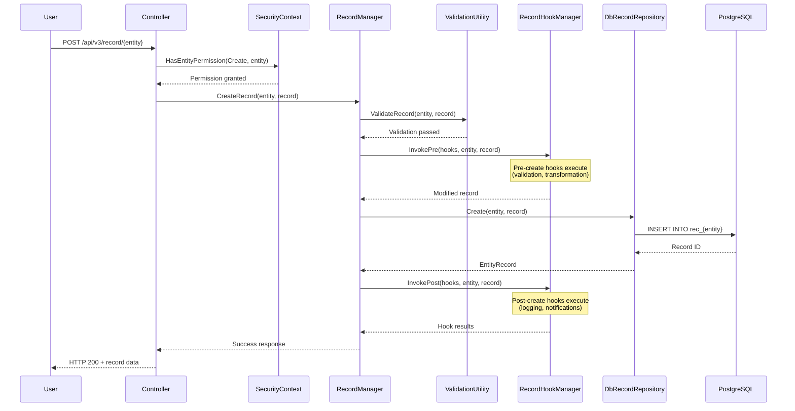
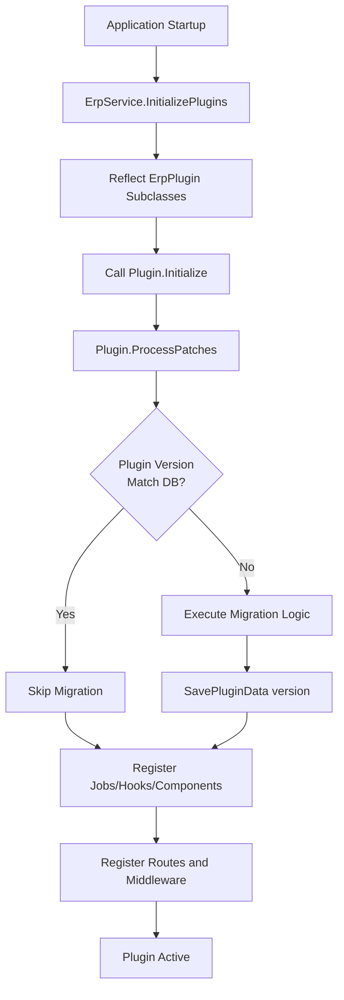
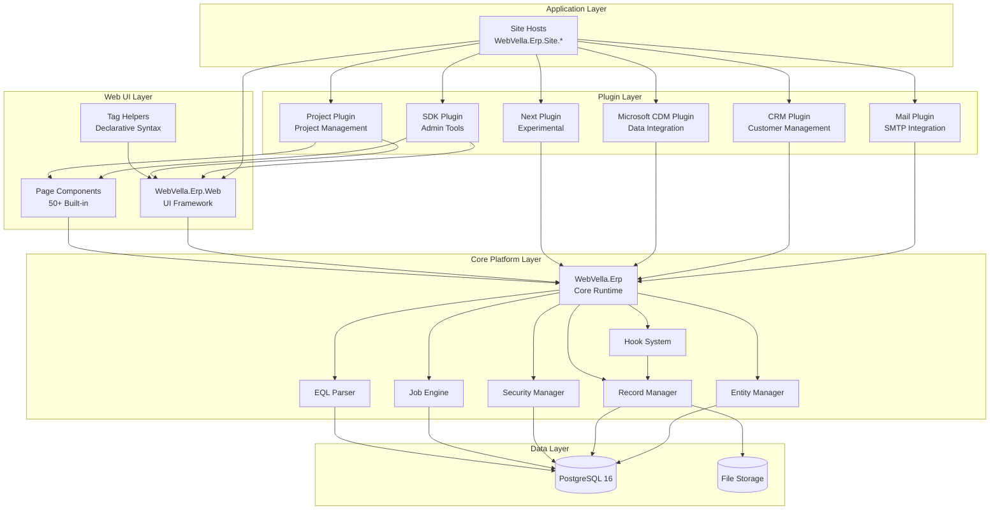

# Functional Overview - WebVella ERP

**Generated:** 2024-01-20 UTC  
**Repository:** https://github.com/WebVella/WebVella-ERP  
**Version:** 1.7.4  
**Analysis Scope:** Complete functional capabilities across all modules and plugins

---

## Table of Contents

1. [Executive Summary](#executive-summary)
2. [ERP Module Catalog](#erp-module-catalog)
3. [User Roles and Permissions](#user-roles-and-permissions)
4. [Key Workflows](#key-workflows)
5. [Module Interdependencies](#module-interdependencies)
6. [Integration Points](#integration-points)
7. [Glossary](#glossary)

---

## Executive Summary

WebVella ERP delivers comprehensive business application capabilities spanning six major plugins (SDK, Mail, CRM, Project, Next, Microsoft CDM), a core platform for metadata-driven entity management, and flexible web UI composition. The system serves multiple stakeholder groups through role-based access controls with three primary roles (Administrator, Regular, Guest) and fine-grained entity-level permissions.

**System Capabilities Overview:**

- **Dynamic Entity Management**: Runtime entity creation and modification without code deployment
- **Plugin Ecosystem**: Six built-in plugins with domain-specific business logic
- **Security Framework**: Multi-layered access control (role-based, entity-level, record-level, field-level)
- **Workflow Automation**: Background jobs, hooks, and event-driven processing
- **User Interface**: 50+ page components with metadata-driven composition
- **Data Operations**: CRUD operations, EQL queries, full-text search, CSV import/export

**Audience:**

- **Developers**: Plugin development patterns, API integration, custom component creation
- **Architects**: System design, module interactions, integration architecture
- **Business Stakeholders**: Business capabilities, user workflows, module features

---

## ERP Module Catalog

### Core Platform (WebVella.Erp)

**Purpose**: Foundational runtime library providing entity management, record operations, security, query processing, and extensibility infrastructure.

**Key Features**:
- Dynamic entity and field creation with 20+ field types
- Record CRUD operations with transactional integrity
- EQL (Entity Query Language) custom query syntax
- Full-text search with Bulgarian language support
- Background job scheduling with daily/weekly/monthly recurrence
- Hook system for pre/post operation interception
- File storage abstraction (local/UNC paths)
- PostgreSQL 16 exclusive database support

**Primary Entities**: entity, field, relation, user, role, user_role, data_source, system_log

**User Workflows**:
- **Entity Creation**: Administrator → SDK Plugin → Entities → Create → Define fields → Save
- **Record Operations**: User → Entity Pages → Create/Edit/Delete → Validation → Persistence
- **Query Execution**: Application → EQL Query → Parser → SQL Translation → PostgreSQL → Results

**Usage Patterns**: Core library consumed by all plugins and site hosts. All business logic depends on EntityManager, RecordManager, and SecurityManager services.

**Code Reference**: `WebVella.Erp/` (all files)

---

### SDK Plugin (System Development Kit)

**Purpose**: Administrative interface for entity management, field configuration, relationship setup, page building, and system administration.

**Key Features**:
- Visual entity and field management with validation
- Relationship configuration (OneToOne, OneToMany, ManyToMany)
- Page builder with drag-and-drop component composition
- Application and sitemap hierarchy design
- Data source management (code-based and database-based)
- User and role administration
- Job scheduling and monitoring
- System log viewing with filtering
- Code generation utilities (diff-based migration code)

**Primary Entities**: 
- All system entities (entity, field, relation, page, application, area, node, component)
- job, job_pool, schedule_plan
- system_log, system_search

**User Workflows**:

**Create Entity:**
1. **Trigger**: Administrator accesses SDK Plugin → Entities section
2. **Steps**:
   - Enter entity name (unique, max 63 characters)
   - Define label and plural label
   - Configure record permissions (CanRead, CanCreate, CanUpdate, CanDelete role lists)
   - Set optional icon and color
   - Click Save
3. **System Actions**:
   - EntityManager.CreateEntity() validates metadata
   - Database table "rec_{entity_name}" created automatically
   - Entity metadata cached for 1 hour
   - Success response with entity GUID
4. **User Interactions**: Form input, validation feedback, success confirmation
5. **System Outputs**: New entity available in SDK entity list, accessible for field creation
6. **Alternative Flows**: Validation failure (duplicate name, invalid format) returns error messages

**Manage Relations:**
1. **Trigger**: Administrator accesses SDK Plugin → Relations section
2. **Steps**:
   - Select origin and target entities
   - Choose relationship type (OneToOne, OneToMany, ManyToMany)
   - Configure cascade behavior (None, Delete, SetNull)
   - Define bidirectional field names
   - Save relationship
3. **System Actions**:
   - EntityRelationManager creates relationship metadata
   - Foreign key constraints added to database
   - Junction table created for ManyToMany (nm_{relation_name})
   - Relationship metadata cached
4. **System Outputs**: Relationship navigation available in EQL queries, record operations support related data

**Build Pages:**
1. **Trigger**: Administrator accesses SDK Plugin → Pages section
2. **Steps**:
   - Select application and sitemap location
   - Choose page layout (OneColumn, TwoColumns)
   - Add areas and nodes
   - Configure components per node (select component type, set options)
   - Save page
3. **System Actions**:
   - PageService persists page metadata
   - Routing configured automatically
   - Page available at /{app}/a/{pageName}
4. **System Outputs**: Page accessible to users with appropriate permissions, components render with configured options

**Usage Patterns**: Essential for system administration and custom application development. Used by administrators daily for schema evolution, page composition, and user management.

**Code Reference**: 
- `WebVella.Erp.Plugins.SDK/` (all files)
- `WebVella.Erp.Plugins.SDK/Api/AdminController.cs` (API endpoints)
- `WebVella.Erp.Plugins.SDK/Services/CodeGenService.cs` (migration code generation)
- `WebVella.Erp.Plugins.SDK/Components/WvSdkPageSitemap/` (page tree component)

---

### Mail Plugin

**Purpose**: Email integration using MailKit with SMTP configuration, email queue with priority and scheduling, HTML email with inline CSS, and attachment support.

**Key Features**:
- SMTP service configuration with multiple service support
- Email queue with priority-based processing
- HTML email with inline CSS via HtmlAgilityPack
- File attachments from file storage
- Automatic queue processing every 10 minutes (ProcessSmtpQueueJob)
- Retry logic for failed emails with configurable bounds
- Email template support

**Primary Entities**:
- **smtp_service**: SMTP server configurations (server, port, username, password, SSL/TLS)
- **email**: Queued emails with Sender, Recipients, Subject, ContentHtml, ContentText, Attachments, Priority, Status, scheduled_on

**User Workflows**:

**Configure SMTP Service:**
1. **Trigger**: Administrator configures email settings in Config.json or SDK UI
2. **Steps**:
   - Enter SMTP server details (host, port, credentials)
   - Configure SecureSocketOptions (SSL/TLS)
   - Set as default service
   - Test connection
3. **System Actions**:
   - EmailServiceManager caches service configuration (1-hour expiration)
   - SmtpServiceRecordHook validates configuration on save
   - Test email sent to verify connectivity
4. **System Outputs**: SMTP service available for outbound emails

**Send Email:**
1. **Trigger**: Application code calls email sending API or user submits email form
2. **Steps**:
   - Compose email (recipients, subject, content)
   - Attach files if needed
   - Set priority (High, Normal, Low)
   - Optionally schedule for future sending
3. **System Actions**:
   - Email record created in database with Status=Pending
   - ProcessSmtpQueueJob polls queue every 10 minutes
   - Emails processed by priority and scheduled_on
   - MIME message assembled with MailKit/MimeKit
   - HTML inline CSS applied via HtmlAgilityPack
   - Attachments included from file storage
   - Status updated to Sent or Failed
4. **User Interactions**: Email composition, recipient selection, file attachment
5. **System Outputs**: Email sent to recipients, delivery status recorded
6. **Alternative Flows**: SMTP failure triggers retry with exponential backoff (3 attempts over 24 hours)

**Usage Patterns**: Enables automated notifications, transactional emails, communication workflows. Mail plugin used by other plugins (Project, CRM) for notification delivery.

**Code Reference**:
- `WebVella.Erp.Plugins.Mail/` (all files)
- `WebVella.Erp.Plugins.Mail/Jobs/ProcessSmtpQueueJob.cs` (queue processing)
- `WebVella.Erp.Plugins.Mail/Hooks/SmtpServiceRecordHook.cs` (validation)
- `WebVella.Erp.Plugins.Mail/Services/EmailServiceManager.cs` (cache management)

---

### Project Plugin

**Purpose**: Comprehensive project and task management module with budget tracking, time logging, recurrence patterns, watcher notifications, and activity streams.

**Key Features**:
- Project management with budget tracking and status workflows
- Task management with recurrence patterns (Ical.Net integration)
- Time logging with timer functionality (start/stop tracking)
- Watcher notifications for task changes
- Activity streams (feeds and posts) for collaboration
- Automated task status updates via background jobs
- Budget vs. actual tracking with chart visualizations
- Task dependencies support

**Primary Entities**:
- **project**: Budget fields, status (Planning, Active, Completed, Cancelled), project-level permissions
- **task**: Status, priority, dates, recurrence patterns, watcher list, dependencies
- **timelog**: User, project, task associations, start/stop timestamps, billing status
- **feed**: Activity stream records
- **post**: Collaboration posts and comments

**User Workflows**:

**Create Project:**
1. **Trigger**: Project manager accesses Project Plugin → Projects → Create
2. **Steps**:
   - Enter project name, description
   - Set budget and timeline
   - Assign project status (Planning)
   - Configure permissions
   - Save project
3. **System Actions**:
   - RecordManager.CreateRecord() creates project record
   - Budget tracking initialized
   - Project accessible to team members
4. **System Outputs**: Project available in project list, ready for task creation

**Manage Tasks:**
1. **Trigger**: Team member accesses Project → Tasks → Create/Edit
2. **Steps**:
   - Enter task title, description
   - Set priority (Critical, High, Normal, Low)
   - Assign due date and owner
   - Configure recurrence pattern if recurring (daily, weekly, monthly via Ical.Net)
   - Add watchers for notifications
   - Set task dependencies
   - Save task
3. **System Actions**:
   - Task record created with status=New
   - Recurrence pattern stored for automatic task generation
   - Watchers notified of task creation
   - PcTaskRepeatRecurrenceSet component handles recurrence UI
4. **User Interactions**: Form input, recurrence configuration, watcher selection
5. **System Outputs**: Task visible in project task list, watchers receive notifications
6. **Alternative Flows**: 
   - Recurring tasks generate new instances automatically at recurrence intervals
   - Task status changes trigger watcher notifications

**Log Time:**
1. **Trigger**: Team member accesses Project → Tasks → Task Detail → Log Time
2. **Steps**:
   - Start timer or enter manual time entry
   - Associate with task and project
   - Add time description
   - Stop timer or save entry
3. **System Actions**:
   - Timelog record created with timestamps
   - Client-side timer updates (timetrack.js with moment.js, decimal.js)
   - Periodic server sync maintains accuracy
   - Time aggregation by project/user/period for reporting
4. **User Interactions**: Timer start/stop, manual time entry
5. **System Outputs**: Timelog displayed in PcTimelogList component, time reports updated

**Automated Task Updates:**
1. **Trigger**: StartTasksOnStartDate background job executes daily at 00:00:02 UTC
2. **System Actions**:
   - Job queries tasks with start_date <= today and status=New
   - Updates task status to In Progress automatically
   - Watchers notified of status change
   - Job execution logged to system_log
3. **System Outputs**: Tasks automatically transitioned, no manual intervention required

**Usage Patterns**: Project-based organizations track work, budget, time without external tools. Provides visibility into project health and resource allocation. Activity streams support team collaboration.

**Code Reference**:
- `WebVella.Erp.Plugins.Project/` (all files)
- `WebVella.Erp.Plugins.Project/Controllers/ProjectController.cs` (API endpoints)
- `WebVella.Erp.Plugins.Project/Jobs/StartTasksOnStartDate.cs` (automation)
- `WebVella.Erp.Plugins.Project/wwwroot/js/task-details.js` (client-side logic)
- `WebVella.Erp.Plugins.Project/wwwroot/js/timetrack.js` (timer functionality)
- `WebVella.Erp.Plugins.Project/Components/PcProjectWidgetBudgetChart/` (budget visualization)
- `WebVella.Erp.Plugins.Project/Components/PcProjectWidgetTasksChart/` (task charts)
- `WebVella.Erp.Plugins.Project/Components/PcTimelogList/` (time log display)

---

### CRM Plugin

**Purpose**: Customer relationship management module providing framework scaffold for customer-centric business processes.

**Key Features**:
- Framework for customer data management
- Plugin versioning and migration orchestration
- Extensibility pattern demonstration

**Primary Entities**: Custom entities defined in plugin patches (specific entities require deeper codebase inspection)

**User Workflows**:
- **Framework Workflow**: Plugin initialization → ProcessPatches execution → Entity creation → UI generation
- **Extensibility Pattern**: Custom hooks, jobs, and components registered during plugin initialization

**Usage Patterns**: Demonstrates plugin architecture and versioning patterns. Provides foundation for customer management features. Current implementation appears to be framework scaffold with minimal business logic visible in analyzed files.

**Code Reference**:
- `WebVella.Erp.Plugins.Crm/` (all files)
- Plugin infrastructure inherits from ErpPlugin base class
- Versioned patch system for schema evolution

---

### Next Plugin

**Purpose**: Next-generation features and experimental capabilities.

**Key Features**: Requires deeper codebase inspection to document specific features.

**Primary Entities**: Custom entities defined in plugin patches.

**User Workflows**: To be documented based on plugin implementation analysis.

**Usage Patterns**: Experimental plugin for testing new features before integrating into core platform or other plugins.

**Code Reference**: `WebVella.Erp.Plugins.Next/` (all files)

---

### Microsoft CDM Plugin

**Purpose**: Integration with Microsoft Common Data Model enabling data interchange with Dynamics 365, Power Platform, and other CDM-compliant systems.

**Key Features**:
- CDM schema mapping and synchronization
- Entity mapping configuration between WebVella and CDM
- Field type translation for compatibility
- Bidirectional data synchronization
- Conflict resolution strategies
- Incremental updates for efficiency

**Primary Entities**: CDM entity mappings (specific entities require deeper inspection)

**User Workflows**:

**Configure CDM Integration:**
1. **Trigger**: Administrator accesses Microsoft CDM Plugin → Configuration
2. **Steps**:
   - Configure Microsoft authentication credentials
   - Map WebVella entities to CDM schema definitions
   - Configure field type translations
   - Set synchronization schedule
   - Test connection and mapping
3. **System Actions**:
   - Schema mapping stored in plugin configuration
   - CDM libraries initialize connection
   - Test synchronization validates mappings
4. **System Outputs**: Integration active, ready for data synchronization

**Synchronize Data:**
1. **Trigger**: Scheduled job or manual trigger initiates sync
2. **System Actions**:
   - Query WebVella entities for changes since last sync
   - Query CDM entities for changes
   - Apply conflict resolution rules
   - Perform incremental updates bidirectionally
   - Log sync results and errors
3. **System Outputs**: Data synchronized between WebVella ERP and CDM-compliant systems

**Usage Patterns**: Enterprise integration scenarios with Microsoft ecosystem. Enables bidirectional data synchronization between WebVella ERP and Dynamics 365/Power Platform.

**Code Reference**: `WebVella.Erp.Plugins.MicrosoftCDM/` (all files)

---

## User Roles and Permissions

### Role-Based Access Control (RBAC)

WebVella ERP implements multi-layered access control through roles, entity-level permissions, record-level permissions, and field-level security.

**System Roles (Definitions.cs)**:

| Role | GUID | Purpose | Permissions |
|------|------|---------|-------------|
| **Administrator** | BDC56420-CAF0-4030-8A0E-D264938E0CDA | System administration and metadata management | Full system access including metadata operations (HasMetaPermission), entity management, user/role administration, all entity data access |
| **Regular** | F16EC6DB-626D-4C27-8DE0-3E7CE542C55F | Standard authenticated users | Entity data access per RecordPermissions configuration, no metadata operations, permissions vary by entity |
| **Guest** | 987148B1-AFA8-4B33-8616-55861E5FD065 | Anonymous/unauthenticated users | Read-only access where explicitly granted in entity RecordPermissions, highly restricted |

**Default Administrative Account**:
- **Email**: erp@webvella.com
- **Password**: erp
- **Purpose**: Initial system configuration and bootstrapping
- **Security Note**: Production deployments should change default credentials and implement least-privilege principles

**Code Reference**: `WebVella.Erp/Api/Definitions.cs`, lines 10-12

---

### Entity-Level Permissions

**Permission Model**:

Entity-level permissions control which roles can perform operations on entity records. Each entity has a `RecordPermissions` object containing four lists of role GUIDs:

| Permission Type | Description | Usage |
|----------------|-------------|-------|
| **CanRead** | Roles that can view records | Required for any record access, query operations, list views |
| **CanCreate** | Roles that can create new records | Requires CanRead permission implicitly |
| **CanUpdate** | Roles that can modify existing records | Requires CanRead permission implicitly |
| **CanDelete** | Roles that can delete records | Requires CanUpdate permission implicitly |

**Permission Checking Logic (SecurityContext.cs)**:

```csharp
// SecurityContext.HasEntityPermission method (lines 47-107)
public static bool HasEntityPermission(EntityPermission permission, Entity entity, ErpUser user = null)
{
    // System user has unlimited permissions
    if (user?.Id == SystemIds.SystemUserId)
        return true;
    
    // Authenticated users: check if user's roles match entity permissions
    if (user != null)
    {
        switch (permission)
        {
            case EntityPermission.Read:
                return user.Roles.Any(x => entity.RecordPermissions.CanRead.Contains(x.Id));
            case EntityPermission.Create:
                return user.Roles.Any(x => entity.RecordPermissions.CanCreate.Contains(x.Id));
            case EntityPermission.Update:
                return user.Roles.Any(x => entity.RecordPermissions.CanUpdate.Contains(x.Id));
            case EntityPermission.Delete:
                return user.Roles.Any(x => entity.RecordPermissions.CanDelete.Contains(x.Id));
        }
    }
    
    // Anonymous users: check if GuestRoleId is in permission lists
    return entity.RecordPermissions.{CanRead|CanCreate|CanUpdate|CanDelete}.Contains(SystemIds.GuestRoleId);
}
```

**Code Reference**: `WebVella.Erp/Api/SecurityContext.cs`, lines 47-107

---

### Meta-Level Permissions

**Metadata Operations**:

Meta-level permissions control access to system metadata operations (entity creation, field management, relationship configuration, page building). Only users with the **Administrator** role can perform metadata operations.

**Permission Checking (SecurityContext.cs)**:

```csharp
// HasMetaPermission method (lines 109-118)
public static bool HasMetaPermission(ErpUser user = null)
{
    if (user == null)
        user = CurrentUser;
    
    if (user == null)
        return false;
    
    return user.Roles.Any(x => x.Id == SystemIds.AdministratorRoleId);
}
```

**Metadata Operations Requiring Administrator Role**:
- Entity creation, modification, deletion
- Field creation, modification, deletion
- Relationship creation, modification, deletion
- Page and component configuration
- Application and sitemap management
- User and role administration
- System configuration changes

**Code Reference**: `WebVella.Erp/Api/SecurityContext.cs`, lines 109-118

---

### Security Context Propagation

**Thread-Safe Context Management**:

WebVella ERP uses `AsyncLocal<SecurityContext>` for thread-safe user context propagation through asynchronous operations. This ensures the current user's identity and permissions are available throughout the request processing pipeline.

**Security Context Architecture (SecurityContext.cs)**:

| Component | Purpose | Code Reference |
|-----------|---------|----------------|
| **AsyncLocal<SecurityContext>** | Thread-safe context storage | Lines 16-17 |
| **OpenScope(ErpUser user)** | Opens security context with specific user | Lines 120-132 |
| **OpenSystemScope()** | Opens context with system user (unlimited permissions) | Lines 134-137 |
| **CloseScope()** | Pops user from context stack | Lines 139-151 |
| **CurrentUser** | Returns current user from context | Lines 28-38 |
| **IDisposable Pattern** | Automatic scope cleanup with using statements | Lines 153-167 |

**Usage Pattern**:

```csharp
// Authenticated user scope (normal operations)
using (SecurityContext.OpenScope(authenticatedUser))
{
    // All operations execute with authenticatedUser's permissions
    var records = recordManager.Find(entityName, queryObject);
}

// System scope (elevated operations, bypasses permission checks)
using (SecurityContext.OpenSystemScope())
{
    // Operations execute with unlimited permissions
    var entity = entityManager.CreateEntity(newEntityDefinition);
}
```

**Security Notes**:
- System scope should only be used for trusted operations (plugin initialization, system maintenance)
- User scope automatically closed when using statement completes (IDisposable pattern)
- Stack-based context enables nested scopes (outer context restored after inner scope closes)

**Code Reference**: `WebVella.Erp/Api/SecurityContext.cs`, lines 120-167

---

### User Management

**User Lifecycle (SecurityManager.cs)**:

| Operation | Method | Code Reference | Description |
|-----------|--------|----------------|-------------|
| **Create User** | SaveUser (new user) | Lines 200-272 | Creates user record with roles via $user_role.id field |
| **Update User** | SaveUser (existing user) | Lines 200-272 | Updates user details and role assignments |
| **Get User** | GetUser (by ID, email, username) | Lines 18-160 | Retrieves user with roles populated |
| **Delete User** | DeleteUser | Not visible in analyzed lines | Removes user record |
| **Assign Roles** | SaveUser with roles list | Line 228 | `record["$user_role.id"] = user.Roles.Select(x => x.Id).ToList();` |

**User-Role Relationship**:
- Many-to-many relationship between user and role entities
- Managed through $user_role.id junction field
- Role assignment atomic with user save operation
- Multiple roles per user supported

**Code Reference**: `WebVella.Erp/Api/SecurityManager.cs`, lines 200-272

---

### Role Management

**Role Lifecycle (SecurityManager.cs)**:

| Operation | Method | Code Reference | Description |
|-----------|--------|----------------|-------------|
| **Create Role** | SaveRole (new role) | Lines 300-347 | Creates role record with name and description |
| **Update Role** | SaveRole (existing role) | Lines 300-347 | Updates role metadata |
| **Get Role** | GetRole (by ID, name) | Lines 274-298 | Retrieves role definition |
| **Delete Role** | Not visible | Not analyzed | Removes role (requires cascade handling for user-role relationships) |

**Role Properties**:
- **Id**: GUID primary key
- **Name**: Unique role identifier (Administrator, Regular, Guest, custom)
- **Description**: Human-readable role description

**Code Reference**: `WebVella.Erp/Api/SecurityManager.cs`, lines 300-347

---

## Key Workflows

### Entity CRUD Lifecycle

**Complete Record Creation Flow with All Subsystems**:



**Workflow Description**:

1. **Trigger**: User submits create form or API POST request
2. **Process Steps**:
   - Controller receives HTTP request with record data
   - SecurityContext.HasEntityPermission checks Create permission
   - RecordManager.CreateRecord() invoked with entity name and record dictionary
   - ValidationUtility validates required fields, data types, unique constraints
   - RecordHookManager.InvokePre() executes pre-create hooks for validation and augmentation
   - Field values extracted and typed using ExtractFieldValue
   - DbRecordRepository executes parameterized INSERT statement
   - RecordHookManager.InvokePost() executes post-create hooks for logging and notifications
   - Response returned with new record ID
3. **User Interactions**: Form submission with field values, file uploads
4. **System Outputs**: Created record with GUID ID, audit log entry, hook side effects (emails, notifications)
5. **Alternative Flows**:
   - Permission denied: HTTP 403 Forbidden
   - Validation failure: HTTP 400 Bad Request with field-level error messages
   - Hook exception: Transaction rollback, error logged

**Code Reference**: 
- `WebVella.Erp.Web/Controllers/WebApiController.cs` (API endpoint)
- `WebVella.Erp/Api/RecordManager.cs`, lines 150-260 (CreateRecord method)
- `WebVella.Erp/Api/SecurityContext.cs`, lines 47-107 (permission check)
- `WebVella.Erp/Hooks/RecordHookManager.cs` (hook invocation)

---

### Plugin Installation and Initialization

**Plugin Lifecycle from Startup to Active**:



**Workflow Description**:

1. **Trigger**: Application startup calls ErpService.InitializePlugins() in Startup.cs
2. **Process Steps**:
   - Reflection discovers all ErpPlugin subclasses in loaded assemblies
   - For each plugin:
     - Plugin.Initialize(IServiceProvider) invoked with DI container
     - Plugin.ProcessPatches() checks version from plugin_data table
     - If version mismatch:
       - Execute migration patches sequentially (Patch20190203, Patch20190205, etc.)
       - Each patch wrapped in database transaction
       - Update plugin_data with new version on success
     - If version matches: Skip migrations
     - Register jobs marked with [Job] attribute via reflection
     - Register hooks marked with [Hook] attribute via reflection
     - Register components extending PageComponent base class
     - Register data sources marked with [DataSource] attribute
     - Register routes and middleware in ASP.NET Core pipeline
   - Plugin marked as active
3. **System Outputs**: 
   - Plugin entities created (if new installation)
   - Plugin version recorded in plugin_data table
   - Jobs scheduled in job_pool
   - Hooks registered in hook registry
   - Components available in component catalog
   - Routes accessible at /p/{plugin}/
4. **Alternative Flows**:
   - Patch failure: Transaction rollback, application startup fails with detailed error
   - Dependency missing: Initialization exception, plugin disabled

**Code Reference**:
- `WebVella.Erp/ErpService.cs`, InitializePlugins method
- `WebVella.Erp/ErpPlugin.cs` (base class)
- All plugin projects: `*Plugin.cs` and ProcessPatches methods

---

### Background Job Execution

**Job Scheduling and Execution Cycle**:

1. **Trigger**: BackgroundService hosted service polls every minute
2. **Process Steps**:
   - ScheduleManager evaluates schedule plans for all registered jobs
   - Jobs with next_execution_time <= now selected for execution
   - JobPool allocates thread from fixed-size pool (configurable capacity)
   - Job.Execute(JobContext) invoked with context (connection, user, parameters)
   - Job result serialized with TypeNameHandling.All (Newtonsoft.Json)
   - Result persisted to job_result table
   - system_log entry created for monitoring
   - next_execution_time recalculated using Ical.Net recurrence rules
3. **System Outputs**:
   - Job execution logged to system_log
   - Job result stored for debugging
   - Side effects (database changes, emails sent, etc.) committed
4. **Alternative Flows**:
   - Job exception: Caught, logged, retry scheduled (3 attempts with exponential backoff)
   - Pool exhausted: Job queued for next cycle
   - Schedule evaluation error: Logged, job skipped

**Example Jobs**:
- **ClearJobAndErrorLogsJob** (SDK plugin): Clears old system_log entries on schedule
- **ProcessSmtpQueueJob** (Mail plugin): Email queue processing every 10 minutes
- **StartTasksOnStartDate** (Project plugin): Task status automation daily at 00:00:02 UTC

**Code Reference**:
- `WebVella.Erp/Jobs/JobManager.cs` (job execution)
- `WebVella.Erp/Jobs/ScheduleManager.cs` (recurrence calculation)
- `WebVella.Erp/Jobs/ErpBackgroundServices.cs` (hosted service)

---

### EQL Query Processing

**Entity Query Language Execution Pipeline**:

1. **Trigger**: Application code calls EqlCommand.Execute() or API endpoint POST /api/v3/eql
2. **Process Steps**:
   - EQL query string parsed by Irony-based EqlGrammar
   - Abstract syntax tree (AST) constructed from tokens
   - AST validated (entity names, field names, parameter types)
   - EqlBuilder translates AST to PostgreSQL SQL with JSON projection
   - Parameters bound to SQL query (prevents SQL injection)
   - SecurityContext applies permission filtering automatically
   - SQL query executed via Npgsql with CommandTimeout=120 seconds
   - Result set materialized as List<EntityRecord> or Dictionary<string, object>
   - Relationship fields expanded when $relation syntax used
3. **User Interactions**: Query string with parameters (e.g., @userId, @startDate)
4. **System Outputs**: Query results as JSON, total count for pagination, execution time metrics
5. **Alternative Flows**:
   - Parse error: HTTP 400 Bad Request with syntax error details
   - Invalid entity name: HTTP 404 Not Found
   - Permission denied: Empty result set (permission filtering at SQL level)
   - Query timeout: HTTP 500 Internal Server Error after 120 seconds

**EQL Syntax Examples**:

```sql
-- Simple query
SELECT * FROM customer WHERE status = 'active' ORDER BY created_on DESC PAGE 1 PAGESIZE 20

-- Query with parameters
SELECT * FROM task WHERE owner_id = @userId AND due_date >= @startDate

-- Query with relationship navigation
SELECT *, $user_1_n_task.username FROM task

-- Query with relationship inversion
SELECT *, $$task_n_1_project.name FROM project
```

**Code Reference**:
- `WebVella.Erp/Eql/EqlGrammar.cs` (grammar definition)
- `WebVella.Erp/Eql/EqlBuilder.cs` (SQL translation)
- `WebVella.Erp/Eql/EqlCommand.cs` (execution)

---

### CSV Import with Validation

**Bulk Data Import Workflow**:

1. **Trigger**: User uploads CSV file via SDK Plugin or API POST /api/v3/import/csv
2. **Process Steps**:
   - CSV file parsed with CsvHelper library
   - Header row mapped to entity fields
   - Column commands parsed for field mapping (e.g., "field_name", "field_name|lookup:target_entity")
   - Optional dry-run validation mode (EvaluateImportEntityRecordsFromCsv)
   - For each row:
     - Field values validated against entity definition (required, type, format)
     - Relationship fields resolved through naming conventions
     - Unique constraints checked
     - ValidationUtility validates complete record
   - Transaction opened for atomic import
   - All valid rows imported via RecordManager.CreateRecord() or UpdateRecord()
   - Invalid rows collected with line numbers and error messages
   - Transaction committed if all rows valid, or rolled back if any errors
3. **User Interactions**: CSV file upload, delimiter selection, field mapping configuration
4. **System Outputs**:
   - Import summary: X records created, Y updated, Z errors
   - Row-level error messages with line numbers for fixing
   - Created/updated record GUIDs
5. **Alternative Flows**:
   - Validation errors: Import rejected, error list returned
   - Relationship target not found: Row skipped or error reported
   - Optional automatic field creation: New fields created dynamically if configured

**Code Reference**:
- `WebVella.Erp/Api/ImportExportManager.cs`, EvaluateImportEntityRecordsFromCsv and ImportEntityRecordsFromCsv methods
- CsvHelper library integration

---

## Module Interdependencies

### Dependency Hierarchy



**Dependency Analysis**:

| Module | Depends On | Consumed By | Dependency Strength |
|--------|-----------|-------------|---------------------|
| **Core Platform** | PostgreSQL, File Storage | All plugins, Web UI, Sites | Critical (all features depend) |
| **EntityManager** | DbContext, SecurityContext | RecordManager, All plugins | Critical (metadata foundation) |
| **RecordManager** | EntityManager, DbRepository, HookManager | All plugins, API endpoints | Critical (all CRUD operations) |
| **SecurityManager** | DbContext | EntityManager, RecordManager, All APIs | Critical (all operations validate) |
| **Web UI** | Core Platform | All plugins, Sites | High (UI infrastructure) |
| **SDK Plugin** | Core, Web UI, Components | Sites, Administrators | High (admin functionality) |
| **Mail Plugin** | Core, Background Jobs | Project Plugin, CRM Plugin | Medium (notification delivery) |
| **Project Plugin** | Core, Jobs, Hooks, Mail | Sites | Medium (business module) |
| **CRM Plugin** | Core | Sites | Medium (business module) |
| **CDM Plugin** | Core, Import/Export | Sites | Low (specialized integration) |

---

### Cross-Plugin Communication

**Communication Patterns**:

1. **Shared Entity Data**: Plugins access entities created by other plugins via RecordManager
   - Example: Project plugin accesses user entities from core platform
   - Example: Mail plugin sends emails to users from any entity with email fields

2. **Event-Driven Hooks**: Plugins implement hooks to react to events in other modules
   - Example: CRM plugin hook executes when task record created (Project plugin)
   - Example: Mail plugin hook executes when user record updated

3. **Background Job Coordination**: Plugins schedule jobs that interact with other plugin data
   - Example: Project plugin job updates task status, Mail plugin job sends notifications

4. **Page Component Composition**: Plugins provide components used in pages across applications
   - Example: SDK plugin components used in custom admin pages
   - Example: Project plugin components embedded in CRM pages

5. **API Integration**: Plugins expose API endpoints accessible to other plugins
   - Example: Mail plugin API for sending emails from Project plugin
   - Example: SDK plugin API for retrieving entity metadata

---

## Integration Points

### External System Integration

| Integration Type | Technology | Configuration | Purpose |
|-----------------|-----------|---------------|---------|
| **Database** | PostgreSQL 16 | ConnectionString in Config.json | Primary data persistence |
| **SMTP Email** | MailKit | EmailSMTP* settings in Config.json | Outbound email delivery |
| **File Storage** | Local/UNC paths | FileSystemStorageFolder in Config.json | File attachments |
| **Authentication** | JWT Tokens | Jwt section in Config.json | Stateless authentication |

**No External Service Dependencies**: The platform operates self-contained without cloud services, SaaS platforms, or third-party APIs. All functionality implemented internally or through configured infrastructure (SMTP, file storage).

---

### Internal API Integration

**REST API Endpoints**:

| Endpoint Pattern | Purpose | Authentication | Example |
|-----------------|---------|----------------|---------|
| `/api/v3/entity` | Entity management | JWT or Cookie | POST /api/v3/entity (create entity) |
| `/api/v3/record/{entity}` | Record CRUD | JWT or Cookie | GET /api/v3/record/customer/12345 |
| `/api/v3/eql` | EQL query execution | JWT or Cookie | POST /api/v3/eql (execute query) |
| `/api/v3/import/csv` | CSV import | JWT or Cookie | POST /api/v3/import/csv |
| `/api/v3/export/csv` | CSV export | JWT or Cookie | GET /api/v3/export/csv?entity=customer |
| `/api/v3/file/{id}` | File download | JWT or Cookie | GET /api/v3/file/abc123 |
| `/api/v3.0/p/{plugin}/*` | Plugin endpoints | JWT or Cookie | POST /api/v3.0/p/sdk/admin/entity |

**Code Reference**: `WebVella.Erp.Web/Controllers/WebApiController.cs`

---

## Glossary

| Term | Definition |
|------|------------|
| **Entity** | Runtime-defined data structure with fields, relationships, and permissions (conceptual "table") |
| **Field** | Property definition within an entity with type, validation rules, and display configuration |
| **Record** | Instance of an entity with field values (conceptual "row") |
| **Plugin** | Extensibility module inheriting from ErpPlugin base class with versioned patches |
| **Manager** | Service layer class orchestrating business logic (EntityManager, RecordManager, SecurityManager) |
| **Repository** | Data access layer class implementing database operations (DbRecordRepository, DbFileRepository) |
| **Hook** | Event-driven extension point for pre/post operation interception |
| **Job** | Background task with scheduled execution via job pool |
| **Component** | Reusable UI element following Design/Options/Display lifecycle |
| **EQL** | Entity Query Language - custom SQL-like syntax for entity-aware queries |
| **RecordPermissions** | Entity-level access control lists (CanRead, CanCreate, CanUpdate, CanDelete) |
| **SecurityContext** | Thread-safe user context propagation via AsyncLocal storage |
| **MetaPermission** | Administrator-only access to metadata operations (entity/field management) |
| **SystemScope** | Elevated security context with unlimited permissions for system operations |

---

**Document History:**

| Version | Date | Changes | Author |
|---------|------|---------|--------|
| 1.0 | 2024-01-20 | Initial comprehensive functional overview | Reverse Engineering Agent |

---

**Related Documentation:**

- [Code Inventory Report](code-inventory.md) - Complete file catalog with metadata
- [System Architecture](architecture.md) - Component diagrams and data flows
- [Database Schema](database-schema.md) - ERD and table definitions
- [Business Rules Catalog](business-rules.md) - Validation and process rules
- [Security & Quality Assessment](security-quality.md) - Vulnerabilities and metrics
- [Modernization Roadmap](modernization-roadmap.md) - Migration strategy and technology upgrades

---

**Feedback and Contributions:**

For questions, corrections, or suggestions regarding this functional overview, please open an issue in the GitHub repository at https://github.com/WebVella/WebVella-ERP/issues

---

**License:**

This documentation is part of the WebVella ERP project licensed under Apache License 2.0.
