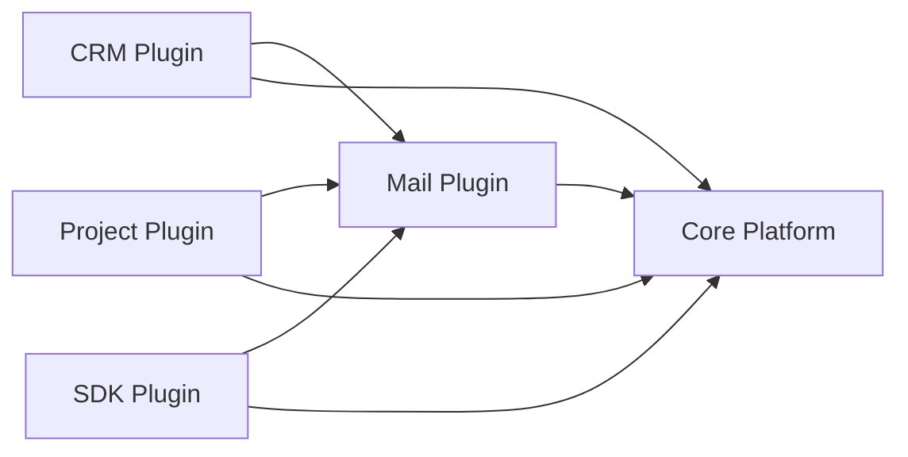
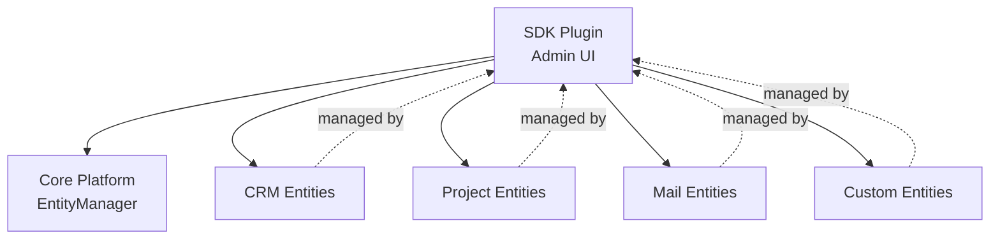
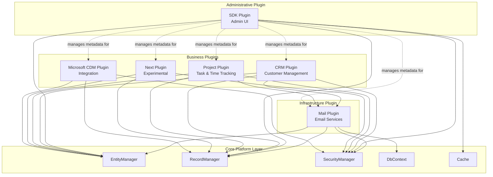

# WebVella ERP - Functional Overview

**Document Type:** Functional Capabilities Documentation  
**Generated:** 2024-11-18 UTC  
**Repository:** https://github.com/WebVella/WebVella-ERP  
**WebVella ERP Version:** 1.7.4  
**Analysis Scope:** Complete functional catalog of all modules, workflows, and capabilities

---

## Table of Contents

- [Executive Summary](#executive-summary)
- [ERP Module Catalog](#erp-module-catalog)
  - [SDK Plugin (Developer Tools)](#sdk-plugin-developer-tools)
  - [Mail Plugin (Email Integration)](#mail-plugin-email-integration)
  - [CRM Plugin (Customer Relationship Management)](#crm-plugin-customer-relationship-management)
  - [Project Plugin (Project Management)](#project-plugin-project-management)
  - [Next Plugin (Next-Generation Features)](#next-plugin-next-generation-features)
  - [Microsoft CDM Plugin (Common Data Model)](#microsoft-cdm-plugin-common-data-model)
- [User Roles and Permissions](#user-roles-and-permissions)
- [Key Workflows](#key-workflows)
- [Module Interdependencies](#module-interdependencies)
- [References](#references)

---

## Executive Summary

WebVella ERP is a comprehensive, metadata-driven business application platform that delivers functional capabilities across entity management, plugin ecosystems, and business domain modules. The system's functional architecture centers on six core plugins that extend the base platform with specialized business capabilities, supported by a flexible permission model and event-driven workflow engine.

**Core Capabilities Overview:**

The platform provides three foundational capability tiers:

1. **Infrastructure Layer**: Core entity management enables runtime creation and modification of data structures without code deployment. The metadata-driven architecture supports over 20 field types, three relationship patterns (OneToOne, OneToMany, ManyToMany), and dynamic database table generation.

2. **Extension Layer**: Six plugins deliver specialized business functionality:
   - **SDK Plugin**: Administrative tools for entity/field/page management
   - **Mail Plugin**: Email integration with SMTP and queue processing
   - **CRM Plugin**: Customer relationship management framework
   - **Project Plugin**: Comprehensive project, task, and time tracking
   - **Next Plugin**: Experimental feature incubation
   - **Microsoft CDM Plugin**: Dynamics 365 and Power Platform integration

3. **Security Layer**: Multi-tiered access control includes role-based permissions (Administrator, Regular, Guest), entity-level permissions (Read/Create/Update/Delete), record-level access restrictions, and field-level security for sensitive data.

**Workflow Architecture:**

The system orchestrates business processes through two primary workflow mechanisms:

- **Pre/Post Hooks**: Event-driven interceptors execute custom business logic before and after data operations, enabling validation, transformation, and side-effect execution
- **Background Jobs**: Scheduled tasks automate recurring processes including email queue processing (every 10 minutes), task status updates (daily at 00:00:02 UTC), and log cleanup operations

**Module Interdependencies:**

All six plugins share common dependencies on the core platform services (EntityManager, RecordManager, SecurityManager), creating a consistent integration model. The Mail plugin provides notification services used by CRM and Project plugins, while the SDK plugin delivers administrative interfaces for managing all entity metadata regardless of plugin origin.

**Key Statistics:**

- **Plugins**: 6 business modules + extensible plugin architecture
- **System Roles**: 3 predefined roles with customizable permissions
- **Workflow Types**: 2 primary patterns (hooks and jobs) + custom implementations
- **Integration Points**: SMTP email, file storage, PostgreSQL database, REST API

This functional overview documents the complete capability spectrum of WebVella ERP as implemented in version 1.7.4, providing business stakeholders, architects, and developers with comprehensive understanding of system functionality and operational patterns.

---

## ERP Module Catalog

### SDK Plugin (Developer Tools)

**Plugin Name:** WebVella.Erp.Plugins.SDK  
**Primary Purpose:** Administrative interface for entity management, field configuration, relationship setup, page building, and system administration  
**Target Users:** System administrators, application developers, platform configurators  
**Source Location:** `WebVella.Erp.Plugins.SDK/`

#### Overview

The SDK Plugin serves as the primary administrative toolset for the WebVella ERP platform, providing graphical user interfaces for metadata management that would otherwise require direct database manipulation or code changes. This plugin is essential for both initial system configuration and ongoing application evolution, enabling non-developer administrators to manage complex entity schemas, page layouts, and system configuration through intuitive web-based interfaces.

The plugin operates at the metadata layer, creating and modifying entity definitions, field schemas, relationships, pages, and applications rather than manipulating business data directly. All administrative operations execute through the same EntityManager and RecordManager APIs used by custom code, ensuring consistency between UI-driven and programmatic schema modifications.

#### Key Features

**1. Entity Designer with Field Creation UI**

Visual interface for creating and modifying entity definitions including:
- Entity metadata configuration (name, label, plural label, color, icon)
- Field type selection from 20+ specialized types
- Field property configuration (required, unique, default values, validation rules)
- Real-time validation feedback for entity naming and constraints
- Permission configuration for entity-level access control

Source: `WebVella.Erp.Plugins.SDK/` entity management controllers and components

**2. Relationship Manager for One-to-Many and Many-to-Many Relations**

Graphical relationship configuration supporting:
- Relationship type selection (OneToOne, OneToMany, ManyToMany)
- Endpoint entity and field selection with validation
- Cascade behavior configuration (None, Delete, SetNull)
- Bidirectional navigation setup
- Junction table automatic management for many-to-many relationships
- Relationship visualization and editing

**3. Page Builder for Custom UI Layouts**

Drag-and-drop page composition interface featuring:
- Application and sitemap management
- Page template selection (OneColumn, TwoColumns layouts)
- Area and node configuration for component placement
- Component library browser with 50+ built-in components
- Component configuration forms with type-specific options
- Live preview capability for page design validation
- WvSdkPageSitemap component: jQuery-based page selection tree using Select2 and Underscore.js

Source: `WebVella.Erp.Plugins.SDK/Components/WvSdkPageSitemap/`

**4. Application Sitemap Designer**

Hierarchical navigation structure management including:
- Application creation and configuration
- Sitemap node organization with parent-child relationships
- Page assignment to sitemap positions
- Weight-based ordering for navigation sequence
- Icon and color customization for visual organization
- Access control integration with permission system

**5. Data Source Configuration**

Management interfaces for both code-based and database-based data sources:
- CodeDataSource discovery and metadata display
- DatabaseDataSource CRUD operations
- SQL/EQL query editor with syntax highlighting
- Parameter definition interface with type specification
- Test execution capability for query validation
- Data source assignment to page components

#### Primary Entities

The SDK Plugin operates on system metadata entities rather than defining custom business entities:

- **Entity System Tables**: Manages entity, field, relation, page, application, area, node system tables
- **Security Tables**: Configures user, role, entity_permission records
- **Configuration Tables**: Maintains data_source, component_meta definitions

All operations modify core platform metadata stored in PostgreSQL system tables.

#### User Workflows

**Create Entity Workflow:**

1. **Access**: Login → Navigate to SDK section → Select "Entities" menu
2. **Initiate**: Click "Create Entity" button
3. **Configure**: Complete entity form with name, label, plural label, permissions
4. **Define Fields**: Add fields using field type selector and property forms
5. **Validate**: System checks name uniqueness and PostgreSQL identifier constraints
6. **Save**: Submit entity definition
7. **Result**: Database table "rec_{entity_name}" created automatically with metadata cached

**Technical Implementation:**
- Controller: SDK entity management endpoints at `api/v3.0/p/sdk/entity`
- Validation: EntityManager enforces 63-character name limit and uniqueness
- Database: CREATE TABLE executed via DbContext with field columns matching entity definition

**Manage Relations Workflow:**

1. **Navigate**: SDK → Relations section
2. **Create Relationship**: Select "Create Relation" action
3. **Configure Endpoints**: Choose origin entity/field and target entity/field
4. **Set Type**: Select OneToOne, OneToMany, or ManyToMany relationship pattern
5. **Configure Cascade**: Define deletion behavior (None, Delete, SetNull)
6. **Save**: Persist relationship definition
7. **Result**: Foreign key constraints created, junction tables generated for many-to-many

**Build Page Workflow:**

1. **Navigate**: SDK → Pages section → Select application
2. **Create Page**: Click "Create Page" → Enter name and label
3. **Design Layout**: Select column layout template
4. **Add Components**: Drag components from library to page areas
5. **Configure Components**: Complete component-specific option forms
6. **Preview**: Use live preview to verify appearance
7. **Publish**: Save page definition
8. **Result**: Page immediately available at routing URL without deployment

**System Administration Workflow:**

1. **Monitor**: Access system dashboard for job execution, log viewing, performance metrics
2. **Manage Jobs**: View job schedules, execution history, and results in job management UI
3. **Review Logs**: Filter and search system_log table entries for troubleshooting
4. **Manage Users**: Create users, assign roles, configure permissions
5. **Cleanup**: ClearJobAndErrorLogsJob executes on schedule to remove old log entries

Source: `WebVella.Erp.Plugins.SDK/Jobs/ClearJobAndErrorLogsJob.cs`

#### Usage Patterns

**Primary Administrative Tool:**

The SDK Plugin serves as the primary interface for:
- Initial system configuration after deployment
- Entity schema evolution as business requirements change
- Page layout modifications for UI customization
- User and permission management for security configuration
- System monitoring and troubleshooting operations

**Development Lifecycle Integration:**

Developers use SDK Plugin during:
- **Prototyping Phase**: Rapid entity creation for concept validation
- **Development Phase**: Schema iteration without code deployment
- **Testing Phase**: Test data entity configuration
- **Production Phase**: Ongoing schema evolution and configuration management

**Code Generation Capability:**

CodeGenService: Diff-based migration code generator
- Reads legacy database schema via Npgsql connection
- Compares current metadata with target database structure
- Generates deterministic JSON-normalized C# migration code
- Produces plugin patch format code for version control
- Enables infrastructure-as-code workflows for schema management

Source: `WebVella.Erp.Plugins.SDK/Services/CodeGenService.cs`

---

### Mail Plugin (Email Integration)

**Plugin Name:** WebVella.Erp.Plugins.Mail  
**Primary Purpose:** Email sending and template management with queue-based delivery and SMTP integration  
**Target Users:** System administrators (SMTP configuration), developers (email API), end users (receive notifications)  
**Source Location:** `WebVella.Erp.Plugins.Mail/`

#### Overview

The Mail Plugin provides comprehensive email capabilities for WebVella ERP through integration with SMTP servers via the MailKit/MimeKit libraries. The plugin implements a queue-based architecture where email requests enter a database queue and a background job processes the queue at configurable intervals, ensuring reliable delivery even under high load or temporary SMTP unavailability.

The architecture separates email composition from delivery, allowing applications to submit email requests asynchronously without waiting for SMTP transmission. The queue supports prioritization, scheduling, and retry logic, making email delivery resilient to transient failures and suitable for both transactional and batch email scenarios.

#### Key Features

**1. SMTP Integration via MailKit**

Enterprise-grade SMTP client implementation:
- MailKit 4.14.1 library for protocol-level SMTP communication
- MimeKit for MIME message assembly with multipart support
- Configurable SMTP server settings (host, port, credentials)
- TLS/SSL encryption support via SecureSocketOptions
- Permissive ServerCertificateValidationCallback for development environments
- Connection pooling and retry logic for reliability

Source: `WebVella.Erp.Plugins.Mail/` using MailKit/MimeKit dependencies

**2. Email Template System**

Structured email composition framework:
- HTML email templates with inline CSS via HtmlAgilityPack
- Plain text alternative content for email clients without HTML support
- Template variable substitution for personalized content
- Reusable templates stored in database for consistency
- Template versioning and management through entity records

**3. Background Job Email Dispatch**

Queue processing automation:
- **ProcessSmtpQueueJob**: Executes every 10 minutes (configurable schedule)
- Batched email selection from queue based on priority and scheduled_on timestamp
- Concurrency control via static lock prevents duplicate processing
- Status workflow: Pending → Sending → Sent/Failed
- Retry logic with configurable retry bounds for failed emails
- Execution results logged to system_log for monitoring

Source: `WebVella.Erp.Plugins.Mail/Jobs/ProcessSmtpQueueJob.cs`

**Technical Implementation:**
```csharp
[Job("39c1c8e6-ce91-4263-b0ae-9c51a9df54e6", 
     "Process SMTP Queue", 
     allowSingleInstance: true, 
     defaultPriority: JobPriority.High)]
public class ProcessSmtpQueueJob : ErpJob
{
    // Executes every 10 minutes
    // Processes email queue in batches
    // Handles SMTP connection and MIME assembly
}
```

**4. Attachment Handling**

File attachment support through storage integration:
- Attachments linked via DbFileRepository storage abstraction
- Support for multiple attachments per email
- MIME type detection and proper Content-Type headers
- Binary content streaming for large attachments
- Attachment references stored in email entity records

**5. Multiple SMTP Service Configurations**

Flexible SMTP provider management:
- smtp_service entity stores configuration per SMTP provider
- Multiple SMTP services supported for failover and routing
- Default service flag designates primary SMTP provider
- Service-specific authentication credentials encrypted in database
- IMemoryCache-backed service lookup with 1-hour expiration

Source: `WebVella.Erp.Plugins.Mail/Api/EmailServiceManager.cs`

#### Primary Entities

**email Entity:**

Stores queued and sent email records:
- **Sender**: EmailAddress with name and address
- **Recipients**: List<EmailAddress> supporting multiple To recipients
- **Subject**: Email subject line
- **ContentHtml**: HTML body content with inline CSS
- **ContentText**: Plain text alternative
- **Attachments**: List of file references via DbFileRepository
- **Priority**: Queue ordering (High, Normal, Low)
- **Status**: Workflow state (Pending, Sending, Sent, Failed)
- **scheduled_on**: Timestamp for delayed sending
- **sent_on**: Actual transmission timestamp
- **retry_count**: Failed attempt tracking

**smtp_service Entity:**

SMTP provider configuration records:
- **name**: Service identifier (unique)
- **is_default**: Boolean flag for default service selection
- **server**: SMTP host address
- **port**: SMTP port (typical: 587, 465, 25)
- **username**: SMTP authentication username
- **password**: Encrypted SMTP authentication password
- **use_ssl**: Boolean for TLS/SSL encryption
- **connection_security**: SecureSocketOptions configuration

#### User Workflows

**Configure SMTP Workflow:**

**Option 1: Config.json Configuration (Simple Deployments)**

1. **Edit Configuration**: Modify `Config.json` in site host project
2. **SMTP Settings**: Set EmailSMTPServerName, EmailSMTPPort, EmailSMTPUsername, EmailSMTPPassword
3. **Enable Feature**: Set EmailEnabled = true
4. **Restart Application**: Config.json changes require application restart
5. **Verification**: Test email sending through API or UI

```json
{
  "EmailEnabled": true,
  "EmailSMTPServerName": "smtp.gmail.com",
  "EmailSMTPPort": 587,
  "EmailSMTPUsername": "notifications@example.com",
  "EmailSMTPPassword": "encrypted_password",
  "EmailSMTPSslEnabled": true
}
```

Source: `WebVella.Erp.Site/Config.json`, lines 13-19

**Option 2: smtp_service Entity (Advanced Deployments)**

1. **Navigate**: Admin UI → Mail Plugin → SMTP Services
2. **Create Service**: Add new smtp_service record
3. **Configure**: Enter server, port, credentials, encryption settings
4. **Set Default**: Mark as default service if primary
5. **Save**: Persist configuration to database
6. **Cache Refresh**: Service configuration cached with 1-hour expiration

**Send Email Workflow:**

1. **Compose Email**: Application code constructs email object (sender, recipients, subject, content)
2. **Queue Submission**: API call to create email record in database queue
3. **Priority Assignment**: Set priority field (High, Normal, Low) for queue ordering
4. **Schedule (Optional)**: Set scheduled_on field for delayed sending
5. **Queue Placement**: Email record created with Status = Pending
6. **Background Processing**: ProcessSmtpQueueJob selects email in next 10-minute cycle
7. **MIME Assembly**: MailKit/MimeKit constructs MIME message with HTML, text, attachments
8. **Inline CSS**: HtmlAgilityPack processes HTML to inline styles for email client compatibility
9. **SMTP Transmission**: MailKit sends via configured SMTP service
10. **Status Update**: Email status updated to Sent with sent_on timestamp
11. **Failure Handling**: Failed emails retain Status = Failed with retry_count incremented

**API Example:**
```csharp
// Create email record for queue
var email = new Email
{
    Sender = new EmailAddress("system@example.com", "System"),
    Recipients = new List<EmailAddress> 
    { 
        new EmailAddress("user@example.com", "User") 
    },
    Subject = "Notification",
    ContentHtml = "<html><body>Message</body></html>",
    Priority = EmailPriority.Normal,
    Status = EmailStatus.Pending
};

// Submit to queue via RecordManager
recordManager.CreateRecord("email", email);

// ProcessSmtpQueueJob handles transmission asynchronously
```

#### Integration Points

**Configuration Sources:**
- Config.json: Simple SMTP configuration for single-service deployments
- smtp_service entity: Database-driven configuration for multi-service scenarios
- EmailServiceManager: IMemoryCache-backed service resolution with cache keys 'SMTP-{id}' and 'SMTP-{name}'

**Hook Integration:**
- SmtpServiceRecordHook: Pre/post create/update/delete validation for smtp_service records
- Cache clearing on commits ensures configuration changes propagate
- Default service enforcement prevents multiple default services

Source: `WebVella.Erp.Plugins.Mail/Hooks/Api/SmtpServiceRecordHook.cs`

**Background Job Scheduling:**
- ProcessSmtpQueueJob registered via [Job] attribute with GUID "39c1c8e6-ce91-4263-b0ae-9c51a9df54e6"
- Schedule plan: Every 10 minutes (configurable via ScheduleManager)
- Job pool: Executes in background job thread pool
- allowSingleInstance: true prevents concurrent queue processing

**Storage Integration:**
- File attachments resolved via DbFileRepository
- Binary content streamed from file storage (local or UNC paths)
- MIME attachment construction with proper Content-Type headers

#### Usage Patterns

**Transactional Email:**
- Password reset notifications
- Account activation emails
- Order confirmation messages
- System alert notifications

**Batch Email:**
- Newsletter distribution
- Scheduled report delivery
- Bulk notification campaigns

**Email Reliability:**
- Queue-based architecture tolerates temporary SMTP unavailability
- Failed emails retry with exponential backoff (configurable retry bounds)
- Status tracking enables monitoring and troubleshooting
- Priority queuing ensures critical emails process first

---

### CRM Plugin (Customer Relationship Management)

**Plugin Name:** WebVella.Erp.Plugins.Crm  
**Primary Purpose:** Customer relationship management framework providing foundational entities and workflows for customer-centric business processes  
**Target Users:** Sales teams, account managers, customer service representatives  
**Source Location:** `WebVella.Erp.Plugins.Crm/`

#### Overview

The CRM Plugin delivers customer relationship management capabilities through a structured entity model representing customers, contacts, sales opportunities, and activities. The plugin demonstrates the WebVella ERP plugin architecture and versioning patterns while providing practical CRM functionality for tracking customer interactions, managing sales pipelines, and maintaining contact databases.

The plugin implements the standard ErpPlugin lifecycle with versioned patches for schema migration, enabling incremental feature addition and schema evolution across plugin versions. While the current codebase shows framework scaffolding, the plugin architecture supports full-featured CRM implementations through entity extensions, custom hooks, and page components.

#### Primary Entities

**crm_account Entity:**

Customer and organization records:
- Account identification (name, account number, industry)
- Organization details (type, size, revenue)
- Contact information (address, phone, website)
- Relationship tracking (account owner, team assignments)
- Status and lifecycle management

**crm_contact Entity:**

Individual contact records linked to accounts:
- Personal information (name, title, email, phone)
- Account association (many-to-one relationship with crm_account)
- Communication preferences
- Contact role and responsibilities
- Activity history

**crm_opportunity Entity:**

Sales opportunity pipeline tracking:
- Opportunity details (name, description, amount, probability)
- Account and contact associations
- Sales stage workflow (Lead, Qualified, Proposal, Negotiation, Closed Won/Lost)
- Expected close date and revenue forecasting
- Competition and risk tracking
- Opportunity owner assignment

**crm_activity Entity:**

Customer interaction logging:
- Activity type (call, meeting, email, task)
- Associated account and contact references
- Activity date and duration
- Subject and description
- Outcome and follow-up requirements
- Activity owner and participants

#### User Workflows

**Manage Contacts Workflow:**

1. **Navigate**: CRM section → Contacts module
2. **Create Contact**: Click "New Contact" button
3. **Enter Details**: Complete contact form with name, email, phone, title
4. **Associate Account**: Link contact to crm_account parent record
5. **Set Preferences**: Configure communication preferences and roles
6. **Save**: Persist contact record to database
7. **Result**: Contact available for opportunity association and activity logging

**Track Opportunities Workflow:**

1. **Navigate**: CRM → Opportunities section
2. **Create Opportunity**: Select "New Opportunity" action
3. **Configure**: Enter opportunity name, amount, expected close date
4. **Associate**: Link to crm_account and primary crm_contact
5. **Set Stage**: Select initial sales stage (typically Lead or Qualified)
6. **Pipeline View**: Visualize opportunity in sales pipeline by stage
7. **Update Stage**: Progress opportunity through stages as sales cycle advances
8. **Close**: Mark opportunity as Closed Won or Closed Lost with outcome details
9. **Reporting**: Opportunities aggregate for revenue forecasting and pipeline analysis

**Log Activities Workflow:**

1. **Context**: From account or contact detail page
2. **Create Activity**: Click "Log Activity" button
3. **Select Type**: Choose activity type (call, meeting, email, task)
4. **Enter Details**: Complete subject, description, date, duration fields
5. **Outcome**: Record activity outcome and next steps
6. **Save**: Create crm_activity record
7. **History**: Activity appears in account/contact timeline
8. **Follow-up**: Schedule future activities for relationship continuity

#### Integration Patterns

**Plugin Versioning:**

ErpPlugin inheritance with version-based patch system:
- ProcessPatches() method checks plugin version against database
- Sequential patches (Patch20190203, Patch20190205, etc.) execute transactionally
- Version number stored in plugin_data table prevents duplicate execution
- Transactional patch execution ensures atomic schema migration

**Entity Relationships:**

- crm_contact → crm_account (many-to-one)
- crm_opportunity → crm_account (many-to-one)
- crm_opportunity → crm_contact (many-to-one)
- crm_activity → crm_account (many-to-one)
- crm_activity → crm_contact (many-to-one)

**Mail Plugin Integration:**

CRM workflows trigger email notifications through Mail Plugin:
- Opportunity stage change notifications
- Activity reminders and follow-ups
- Account assignment notifications
- Contact communication via email queue

**Core Platform Dependencies:**

- EntityManager: CRM entity definitions
- RecordManager: CRUD operations on CRM records
- SecurityManager: Role-based access to CRM data
- RecordHookManager: Business logic hooks for validation and automation

#### Usage Patterns

**Sales Pipeline Management:**

Sales teams use CRM Plugin to:
- Track leads from initial contact through closure
- Visualize pipeline by stage and revenue
- Forecast sales based on opportunity probability
- Analyze win/loss patterns and sales cycle duration

**Customer Service:**

Support teams leverage CRM for:
- Customer account history and context
- Activity logging for support interactions
- Issue escalation tracking
- Customer communication history

**Account Management:**

Account managers utilize CRM to:
- Maintain comprehensive customer profiles
- Track account health and engagement
- Plan customer interactions and follow-ups
- Coordinate team activities for strategic accounts

---

### Project Plugin (Project Management)

**Plugin Name:** WebVella.Erp.Plugins.Project  
**Primary Purpose:** Comprehensive project and task management with budget tracking, time logging, recurrence patterns, and watcher notifications  
**Target Users:** Project managers, team members, resource managers, executives  
**Source Location:** `WebVella.Erp.Plugins.Project/`

#### Overview

The Project Plugin delivers enterprise-grade project management capabilities encompassing project planning, task tracking, time logging, budget management, and team collaboration. The plugin demonstrates advanced WebVella ERP features including background job integration for task automation, recurrence pattern processing using Ical.Net, watcher-based notification systems, and rich client-side interactions through JavaScript and StencilJS web components.

The plugin architecture supports complex project workflows including task dependencies, recurring task generation, budget vs. actual tracking, and activity stream-based collaboration. Integration with the Mail Plugin enables automated notifications, while the time tracking subsystem provides granular resource utilization reporting.

#### Key Features

**1. Project Creation and Tracking**

Comprehensive project management:
- Project entity with status workflows (Planning, Active, Completed, Cancelled)
- Budget fields for financial tracking (planned budget, actual costs)
- Start and end date scheduling
- Project owner and team assignments
- Project-level permissions for access control
- PcProjectWidgetBudgetChart component: Visual budget vs. actual comparison

Source: `WebVella.Erp.Plugins.Project/Components/PcProjectWidgetBudgetChart/`

**2. Task Assignment and Status Workflows**

Granular task management:
- Task entity with comprehensive metadata (title, description, priority, status)
- Status transitions (New, In Progress, Completed, Cancelled)
- Task assignment to users with notification
- Priority levels (High, Normal, Low) for workload management
- Due date and estimated effort tracking
- Task dependencies for workflow sequencing
- PcProjectWidgetTasksChart component: Task status visualization

**3. Timelog Recording with User and Project Association**

Resource tracking and billing:
- Timelog entity linking user, project, and task
- Start/stop timer functionality via timetrack.js client library
- Manual time entry for retrospective logging
- Time aggregation by project, user, and date range
- Billing status tracking (Billable, Non-Billable, Billed)
- PcTimelogList component: Time entry display and management
- Real-time timer updates with periodic server synchronization

Source: `WebVella.Erp.Plugins.Project/Components/PcTimelogList/`, `wwwroot/js/timetrack.js`

**Client Library Dependencies:**
- jQuery: DOM manipulation and AJAX
- moment.js: Date/time formatting and calculations
- decimal.js: Precision arithmetic for time calculations

**4. Recurrence Patterns Using Ical.Net**

Automated task generation:
- PcTaskRepeatRecurrenceSet component: Recurrence rule configuration
- Ical.Net library integration for RFC 5545 recurrence patterns
- Support for daily, weekly, monthly recurrence rules
- RRULE format storage and calculation
- Automatic task instance generation on schedule
- Parent-child relationship for recurring task series

Source: `WebVella.Erp.Plugins.Project/Components/PcTaskRepeatRecurrenceSet/`

**5. Watcher Notifications for Task Changes**

Collaborative awareness:
- Watcher list per task for notification recipients
- Automatic notifications on task status changes
- Task assignment notifications
- Comment and activity stream notifications
- Mail Plugin integration for email delivery
- Configurable notification preferences per watcher

#### Primary Entities

**project Entity:**

Project records with planning and tracking data:
- **Basic Information**: name, description, code, owner
- **Scheduling**: start_date, end_date, status (Planning, Active, Completed, Cancelled)
- **Financial**: budget_amount, actual_cost, budget_variance calculations
- **Organization**: project_manager_id, team_member_ids
- **Permissions**: Project-level access control
- **Relationships**: OneToMany with task entity

**task Entity:**

Task records within projects:
- **Identification**: subject, description, task_number
- **Scheduling**: start_date, end_date, due_date
- **Status**: status field with workflow (New, In Progress, Completed, Cancelled)
- **Priority**: priority field (High, Normal, Low)
- **Assignment**: assigned_to_id (user reference)
- **Effort**: estimated_minutes, actual_minutes (from timelog aggregation)
- **Recurrence**: recurrence_rule (Ical.Net RRULE format), parent_task_id for recurring series
- **Collaboration**: watcher_ids (list of users to notify)
- **Dependencies**: related_tasks for prerequisite relationships
- **Relationships**: ManyToOne with project entity

**timelog Entity:**

Time tracking records:
- **Association**: user_id, project_id, task_id (optional)
- **Time Data**: start_time, end_time, minutes (calculated or manual)
- **Billing**: is_billable, billing_status (Billable, Non-Billable, Billed)
- **Description**: notes describing work performed
- **Date**: log_date for reporting aggregation
- **Relationships**: ManyToOne with user, project, task entities

**milestone Entity:**

Project milestone tracking:
- **Details**: name, description, target_date
- **Status**: status field (Not Started, In Progress, Completed)
- **Relationships**: ManyToOne with project entity

**feed Entity:**

Activity stream container:
- **Type**: feed_type (project, task, user)
- **Subject**: Associated project_id, task_id, or user_id
- **Posts**: OneToMany relationship with post entity

**post Entity:**

Activity stream entries:
- **Content**: message content (text or HTML)
- **Author**: user_id of post creator
- **Timestamp**: created_on for chronological ordering
- **Feed**: ManyToOne with feed entity
- **Relationships**: Optional task_id, project_id references for context

#### User Workflows

**Create Project Workflow:**

1. **Navigate**: Projects module → "New Project" action
2. **Basic Info**: Enter project name, description, unique code
3. **Define Scope**: Set project objectives and deliverables
4. **Schedule**: Configure start date, end date, milestones
5. **Budget**: Enter planned budget amount
6. **Assign Team**: Select project manager and add team members
7. **Create Tasks**: Use task creation interface to define work breakdown
   - Task subjects and descriptions
   - Assignment to team members
   - Due dates and estimated effort
   - Task dependencies for sequencing
8. **Set Permissions**: Configure project-level access control
9. **Save**: Persist project record and related tasks
10. **Result**: Project available in project list with Planning status

**Track Progress Workflow:**

1. **Navigate**: Projects module → Project dashboard
2. **View Status**: PcProjectWidgetBudgetChart displays budget vs. actual
3. **Task Overview**: PcProjectWidgetTasksChart shows task status distribution
4. **Update Tasks**: Team members change task status (New → In Progress → Completed)
   - Status change triggers watcher notifications via Mail Plugin
5. **Log Time**: Team members record time against tasks using timetrack.js timer
   - Start timer when beginning work
   - Stop timer when completing work
   - Manual time entry for retrospective logging
6. **Review Timelog**: PcTimelogList component displays time entries
7. **Budget Tracking**: System calculates actual costs from billable timelog entries
8. **Milestone Progress**: Mark milestones as In Progress or Completed
9. **Activity Stream**: Review feed and post records for collaboration history
10. **Reporting**: Generate time and budget reports by project/user/period

**Configure Recurring Tasks Workflow:**

1. **Task Context**: Open existing task or create new task
2. **Enable Recurrence**: Navigate to recurrence configuration
3. **Set Pattern**: Use PcTaskRepeatRecurrenceSet component
   - Select recurrence frequency (daily, weekly, monthly)
   - Configure recurrence interval and end condition
   - Set days of week for weekly recurrence
   - Set day of month for monthly recurrence
4. **Save Rule**: System stores Ical.Net RRULE format string
5. **Automatic Generation**: Background job or event trigger creates task instances
   - Each instance links to parent task via parent_task_id
   - Instances inherit task properties (subject, description, assignment, watchers)
   - Due dates calculate based on recurrence pattern
6. **Series Management**: Modify parent task to affect future instances

#### Background Jobs

**StartTasksOnStartDate Job:**

Automated task status management:

```csharp
[Job("job-guid", "Start Tasks On Start Date", 
     allowSingleInstance: true, 
     defaultPriority: JobPriority.Normal)]
public class StartTasksOnStartDate : ErpJob
{
    // Schedule: Daily at 00:00:02 UTC
    // Purpose: Update task status from New to In Progress when start_date reached
    // Logic: Query tasks with status=New AND start_date <= today
    //        Update status to In Progress
    //        Trigger watcher notifications
}
```

Source: `WebVella.Erp.Plugins.Project/StartTasksOnStartDate.cs`

**Schedule Configuration:**
- Execution time: Daily at 00:00:02 UTC
- Purpose: Prevents missed task start dates
- Side effects: Watcher notifications triggered by status change

#### Client Integration

**task-details.js:**

Rich task detail page interactions:
- Dynamic form updates without page refresh
- Status change handling with immediate UI feedback
- Comment submission and activity stream updates
- Watcher management (add/remove watchers)
- Attachment upload integration

Source: `WebVella.Erp.Plugins.Project/wwwroot/js/task-details.js`

**timetrack.js:**

Time tracking timer functionality:
- Start/stop timer with client-side display
- Elapsed time calculation using moment.js and decimal.js
- Periodic server synchronization for time entry persistence
- Manual time entry form handling
- Time entry validation and submission

**StencilJS Web Components:**

Framework-agnostic custom elements:
- **wv-feed-list**: Activity feed display component
- **wv-post-list**: Post listing with pagination and filtering

Source: Integration with WebVella-ERP-StencilJs repository (separate codebase)

#### Integration Points

**Mail Plugin Notifications:**

Task events trigger email notifications:
- Task assignment: Notify assigned user
- Status change: Notify watchers
- Due date approaching: Reminder emails
- Comment added: Notify participants

**Core Platform Dependencies:**

- EntityManager: Project/task/timelog entity definitions
- RecordManager: CRUD operations on project records
- SecurityManager: Project and task access control
- RecordHookManager: Business logic hooks for validation
- JobManager: StartTasksOnStartDate job scheduling
- DataSourceManager: Project/task queries for components

#### Usage Patterns

**Agile Project Management:**
- Sprint planning with task assignments
- Daily standup tracking via activity streams
- Sprint burndown analysis from task completion
- Retrospective data from timelog accuracy

**Waterfall Project Management:**
- Phase-based project structuring with milestones
- Gantt-style dependency tracking
- Critical path identification through task dependencies
- Resource allocation via time tracking

**Time and Billing:**
- Billable vs. non-billable hour tracking
- Client invoice generation from billable timelogs
- Resource utilization reporting by user and project
- Budget variance analysis for profitability

**Recurring Task Automation:**
- Daily standup meeting tasks
- Weekly status report tasks
- Monthly review and planning tasks
- Maintenance and operational tasks

---

### Next Plugin (Next-Generation Features)

**Plugin Name:** WebVella.Erp.Plugins.Next  
**Primary Purpose:** Experimental feature incubation and next-generation capability development  
**Target Users:** Early adopters, developers testing new features, pilot projects  
**Source Location:** `WebVella.Erp.Plugins.Next/`

#### Overview

The Next Plugin serves as an incubation environment for experimental features and next-generation capabilities before promotion to stable plugins or core platform integration. This plugin follows the standard ErpPlugin architecture and versioning patterns, enabling rapid iteration on new features without affecting production plugins.

The plugin demonstrates WebVella ERP's extensibility and provides a sandbox for feature development, user feedback collection, and production readiness evaluation. Features graduating from Next Plugin may be promoted to dedicated plugins or merged into existing business modules based on adoption and maturity.

#### Purpose and Scope

**Experimental Features:**
- Proof-of-concept implementations
- Beta features for early user feedback
- Prototype UI components and patterns
- New integration patterns and APIs

**Development Patterns:**
- Feature flag-based activation
- Isolated entity namespace (next_*)
- Separate page hierarchy for UI isolation
- Independent versioning and patch cycles

#### Integration Points

**Plugin Framework:**
- ErpPlugin base class inheritance
- ProcessPatches() version-based migrations
- Standard plugin initialization lifecycle
- Component and hook registration

**Core Platform:**
- EntityManager for experimental entity definitions
- RecordManager for data operations
- SecurityManager for experimental permission models
- Page system for UI experimentation

#### Current Implementation

Based on codebase analysis, the Next Plugin currently contains:
- Framework scaffolding and plugin infrastructure
- Version-based patch system for schema evolution
- Standard plugin lifecycle hooks (Initialize, ProcessPatches)
- Integration points for future feature development

Detailed feature documentation will expand as experimental capabilities reach implementation maturity and user-facing functionality emerges.

---

### Microsoft CDM Plugin (Common Data Model)

**Plugin Name:** WebVella.Erp.Plugins.MicrosoftCDM  
**Primary Purpose:** Microsoft Common Data Model integration enabling data interchange with Dynamics 365, Power Platform, and other CDM-compliant systems  
**Target Users:** Enterprise architects, integration specialists, Dynamics 365 administrators  
**Source Location:** `WebVella.Erp.Plugins.MicrosoftCDM/`

#### Overview

The Microsoft CDM Plugin provides integration capabilities with Microsoft's Common Data Model (CDM), enabling bidirectional data synchronization between WebVella ERP and Microsoft business application ecosystem including Dynamics 365, Power Platform (Power Apps, Power Automate, Power BI), and other CDM-compliant systems.

The Common Data Model provides a standardized schema for business data, enabling semantic consistency across applications and reducing integration complexity. The plugin maps WebVella ERP entities to CDM schema definitions, facilitating data exchange without custom integration development.

#### Key Features

**1. Schema Mapping**

Entity-to-CDM schema translation:
- WebVella entity mapping to CDM entity definitions
- Field type translation between WebVella field types and CDM data types
- Relationship mapping (OneToOne, OneToMany, ManyToMany to CDM relationships)
- Metadata synchronization for schema evolution
- Configurable mapping rules for business-specific customizations

**2. Data Synchronization**

Bidirectional data exchange:
- WebVella ERP → CDM: Export entities and records to CDM format
- CDM → WebVella ERP: Import CDM data into WebVella entities
- Incremental synchronization for efficient updates
- Conflict resolution strategies for concurrent modifications
- Data transformation and validation during sync operations

**3. Integration Architecture**

Connection management:
- Microsoft authentication integration (Azure AD, OAuth2)
- CDM endpoint configuration and discovery
- Dataverse API connectivity for Dynamics 365
- Power Platform connector compatibility
- Secure credential storage and token management

#### Primary Entities

**CDM Mapping Entities:**

The plugin defines entities for managing integration configuration:
- **cdm_entity_mapping**: Maps WebVella entities to CDM entity definitions
- **cdm_field_mapping**: Maps WebVella fields to CDM attributes
- **cdm_sync_job**: Tracks synchronization execution and results
- **cdm_conflict**: Logs data conflicts requiring resolution

#### Integration Patterns

**Dynamics 365 Integration:**

Connect WebVella ERP with Dynamics 365 applications:
- Customer data synchronization (Dynamics CRM ↔ WebVella CRM Plugin)
- Project data exchange (Dynamics Project Operations ↔ WebVella Project Plugin)
- Master data management across systems
- Real-time or batch synchronization modes

**Power Platform Integration:**

Leverage Power Platform capabilities:
- Power Apps: Build mobile apps on WebVella data via CDM
- Power Automate: Create workflows spanning WebVella and Microsoft services
- Power BI: Unified reporting across WebVella and Microsoft data sources

**Enterprise Data Integration:**

CDM as enterprise data hub:
- Centralized schema definitions across enterprise applications
- Semantic consistency for business entities (Account, Contact, Opportunity)
- Reduced integration complexity through standardization
- Future-proof integration architecture

#### Configuration

**Authentication Setup:**

Microsoft identity integration:
- Azure AD application registration
- OAuth2 client credentials or authorization code flow
- Secure token storage and refresh
- Multi-tenant support for MSP scenarios

**Mapping Configuration:**

Entity and field mapping management:
- Visual mapping designer or declarative configuration
- Transformation rules for data type mismatches
- Business logic hooks for complex mappings
- Validation rules for data quality

**Synchronization Configuration:**

Sync job scheduling and execution:
- Real-time sync via webhooks or change tracking
- Scheduled batch synchronization
- Incremental sync based on change timestamps
- Error handling and retry logic

#### Usage Patterns

**Hybrid Deployment Scenarios:**

Organizations running mixed environments:
- Microsoft Dynamics 365 for sales and marketing
- WebVella ERP for custom business processes
- Unified customer and project data across systems
- Seamless user experience spanning both platforms

**Data Migration:**

CDM as migration pathway:
- Export legacy system data to CDM format
- Import into WebVella ERP with schema mapping
- Validate data integrity and completeness
- Incremental migration for phased rollouts

**Master Data Management:**

CDM for authoritative data sources:
- Customer master in Dynamics 365
- Synchronized to WebVella for operational processes
- Bidirectional updates for data accuracy
- Conflict resolution for concurrent changes

#### Implementation Status

Based on codebase analysis, the Microsoft CDM Plugin includes:
- Plugin framework scaffolding with versioned patches
- CDM library references and integration points
- Entity mapping infrastructure
- Standard plugin lifecycle implementation

Detailed feature documentation will expand as CDM integration capabilities reach production maturity and deployment-ready status.

---

## User Roles and Permissions

### Role-Based Access Control Model

WebVella ERP implements a comprehensive multi-layered security model combining role-based access control (RBAC), entity-level permissions, record-level permissions, and field-level security. The permission system balances security requirements with operational flexibility, enabling fine-grained access control without excessive administrative overhead.

### System Roles

**Administrator Role**

**Role GUID:** `BDC56420-CAF0-4030-8A0E-D264938E0CDA`  
**Role Name:** Administrator  
**Source:** `WebVella.Erp/Api/Definitions.cs`, System role constants

**Capabilities:**
- **Full System Access**: Unrestricted access to all entities, records, and system functions
- **Metadata Management**: Create, modify, and delete entity definitions, field schemas, relationships
- **Security Administration**: Manage users, roles, permissions at all levels
- **System Configuration**: Modify Config.json settings, SMTP services, storage configuration
- **Plugin Management**: Install, configure, and remove plugins
- **Schema Evolution**: Execute database migrations and patches
- **Audit Access**: View complete audit trails and system logs

**Use Cases:**
- Initial system setup and configuration
- Entity schema design and evolution
- Security policy definition and enforcement
- System monitoring and troubleshooting
- Plugin deployment and management

**Permission Model:**

Administrators bypass standard permission checks through SecurityContext.HasMetaPermission or explicit role membership checks. The permission system grants administrators implicit access to all operations, including:
- Entity-level permissions: All CRUD operations on all entities
- Record-level permissions: Access to all records regardless of record-level restrictions
- Field-level security: Visibility into all fields including encrypted and sensitive data
- System operations: OpenSystemScope capability for elevated operations

**Security Considerations:**

Administrator accounts require strict access control:
- Dedicated administrator accounts (avoid shared credentials)
- Strong password policies and MFA enforcement (external to platform)
- Audit trail monitoring for administrator actions
- Principle of least privilege: Grant administrator role sparingly

---

**Regular User Role**

**Role GUID:** `F16EC6DB-626D-4C27-8DE0-3E7CE542C55F`  
**Role Name:** Regular  
**Source:** `WebVella.Erp/Api/Definitions.cs`, System role constants

**Capabilities:**
- **Entity Data Access**: Access to entity records based on EntityPermission grants
- **Business Operations**: Create, read, update, delete records within assigned permissions
- **Collaboration**: Participate in activity streams, comments, task assignments
- **Personal Data Management**: Manage own user profile and preferences
- **Application Usage**: Navigate pages, execute workflows, generate reports within authorization

**Permission Model:**

Regular users operate under strict permission enforcement:
- Entity-level permissions: Access controlled by RecordPermissions.CanRead, CanCreate, CanUpdate, CanDelete role lists
- Record-level permissions: Additional filtering based on record ownership, team membership, or custom criteria
- Field-level security: Sensitive fields hidden or masked based on field-level permission grants
- API access: JWT tokens validated with role-based claims

**Use Cases:**
- Daily business operations (sales, project management, customer service)
- Data entry and record management
- Report generation and data analysis
- Workflow participation and task completion

**Permission Configuration:**

Entity-level permissions configured per entity via RecordPermissions object:

```json
{
  "CanRead": ["F16EC6DB-626D-4C27-8DE0-3E7CE542C55F"],
  "CanCreate": ["F16EC6DB-626D-4C27-8DE0-3E7CE542C55F"],
  "CanUpdate": ["F16EC6DB-626D-4C27-8DE0-3E7CE542C55F"],
  "CanDelete": []
}
```

Example: Regular users can read, create, and update but not delete records.

**Validation:**

SecurityContext.HasEntityPermission(EntityPermission.Read, entityId) validates access before every operation:
- RecordManager.CreateRecord(): Validates CanCreate permission
- RecordManager.GetRecord(): Validates CanRead permission
- RecordManager.UpdateRecord(): Validates CanUpdate permission
- RecordManager.DeleteRecord(): Validates CanDelete permission

Source: `WebVella.Erp/Api/RecordManager.cs`, permission validation throughout CRUD methods

---

**Guest Role**

**Role GUID:** `987148B1-AFA8-4B33-8616-55861E5FD065`  
**Role Name:** Guest  
**Source:** `WebVella.Erp/Api/Definitions.cs`, System role constants

**Capabilities:**
- **Read-Only Access**: Limited to explicitly granted read permissions
- **Public Data**: Access to public pages and records marked for guest visibility
- **No Modification Rights**: Cannot create, update, or delete records
- **Restricted Navigation**: Limited page access based on sitemap permissions

**Permission Model:**

Guest users represent the most restrictive permission tier:
- Entity-level permissions: Only CanRead permission honored, other permissions ignored
- Record-level filtering: Additional restrictions limit data visibility
- Field-level security: Sensitive fields unconditionally hidden
- API access: Limited to explicitly public endpoints

**Use Cases:**
- Public website visitors
- Unregistered portal users
- Read-only data consumers
- External stakeholder reporting access

**Permission Configuration:**

Entities granting guest access include Guest role GUID in CanRead list:

```json
{
  "CanRead": [
    "BDC56420-CAF0-4030-8A0E-D264938E0CDA",  // Administrator
    "F16EC6DB-626D-4C27-8DE0-3E7CE542C55F",  // Regular
    "987148B1-AFA8-4B33-8616-55861E5FD065"   // Guest
  ],
  "CanCreate": [],
  "CanUpdate": [],
  "CanDelete": []
}
```

Example: Entity visible to all roles but only administrators and regular users can modify.

---

### Permission System Architecture

**Entity-Level Permissions**

**Granularity:** Per-entity CRUD operations (Read, Create, Update, Delete)  
**Configuration:** RecordPermissions object on entity definition  
**Enforcement:** SecurityContext.HasEntityPermission checks

**Permission Types:**

| Permission | Operation | Validation Point |
|-----------|-----------|------------------|
| **CanRead** | View records, execute queries | RecordManager.GetRecord(), Find() |
| **CanCreate** | Create new records | RecordManager.CreateRecord() |
| **CanUpdate** | Modify existing records | RecordManager.UpdateRecord() |
| **CanDelete** | Remove records | RecordManager.DeleteRecord() |

**Inheritance Rules:**
- CanCreate requires CanRead (cannot create records in invisible entities)
- CanUpdate requires CanRead (cannot modify invisible records)
- CanDelete requires CanUpdate (cannot delete records without update rights)

**Configuration Interface:**

SDK Plugin provides entity permission management UI:
- Visual role selection for each permission type
- Permission inheritance validation
- Real-time permission testing capability

---

**Record-Level Permissions**

**Granularity:** Individual record access within permitted entities  
**Implementation:** Custom logic in RecordHookManager hooks  
**Use Cases:** Multi-tenant data isolation, ownership-based access, team-based visibility

**Common Patterns:**

**Ownership-Based Access:**
```csharp
// Pre-read hook filters records by owner_id
if (record["owner_id"] != currentUser.Id && !currentUser.IsAdmin)
{
    throw new UnauthorizedException("Access denied");
}
```

**Team-Based Access:**
```csharp
// Pre-read hook validates team membership
var teamMembers = record["team_member_ids"] as List<Guid>;
if (!teamMembers.Contains(currentUser.Id) && !currentUser.IsAdmin)
{
    throw new UnauthorizedException("Access denied");
}
```

**Regional Data Isolation:**
```csharp
// Pre-read hook enforces regional access
var userRegion = currentUser.GetProperty("region");
var recordRegion = record["region"];
if (userRegion != recordRegion && !currentUser.HasRole("Global Admin"))
{
    throw new UnauthorizedException("Cross-region access denied");
}
```

---

**Field-Level Security**

**Granularity:** Individual field visibility within permitted records  
**Implementation:** Field-level permission flags and rendering logic  
**Use Cases:** Sensitive data protection (SSN, salary, passwords), role-specific field visibility

**PasswordField Encryption:**

Automatic encryption for PasswordField types:
```csharp
// Password fields always encrypted
var passwordField = new PasswordField
{
    Encrypted = true  // Default and enforced
};

// Encryption key from Config.json
"EncryptionKey": "64-character hexadecimal key"
```

Source: `WebVella.Erp.Site/Config.json`, encryption key configuration

**Field-Level Permission Checks:**

Component rendering validates field visibility:
```csharp
// Field component checks field-level permissions
if (!SecurityContext.HasFieldPermission(fieldId))
{
    // Hide field or render placeholder
    return new HiddenFieldComponent();
}
```

**Encrypted Field Audit:**

System_log records access to encrypted fields:
- User accessing encrypted field
- Timestamp of access
- Record and field identifiers
- Access justification (if required)

---

### SecurityContext Implementation

**Async-Local Context Propagation**

**Technology:** AsyncLocal<SecurityContext> for thread-safe user context  
**Source:** `WebVella.Erp/Api/SecurityContext.cs`

**Context Lifecycle:**

1. **Request Start**: Authentication middleware creates SecurityContext from JWT or cookie
2. **Context Population**: User, roles, permissions loaded into SecurityContext instance
3. **Async Propagation**: AsyncLocal ensures context available in all async code paths
4. **Permission Checks**: Manager classes call SecurityContext.HasEntityPermission()
5. **Request End**: Context cleared and resources released

**OpenSystemScope Pattern:**

Elevated operations bypass standard permission checks:

```csharp
// Elevated scope for system operations
using (SecurityContext.OpenSystemScope())
{
    // Operations execute with administrator privileges
    // Use sparingly and with audit logging
    recordManager.CreateRecord("audit_log", auditEntry);
}
```

**Use Cases for System Scope:**
- System-generated audit log entries
- Background job operations
- Plugin initialization and patches
- Automated data migrations

**Security Audit:**

All OpenSystemScope invocations should include:
- Code comment justifying elevated privileges
- Audit log entry describing operation
- Exception handling for scope cleanup
- Minimal scope duration (dispose immediately)

---

**HasMetaPermission Checks**

**Purpose:** Validate metadata management permissions  
**Implementation:** SecurityContext.HasMetaPermission()

**Meta Permission Types:**
- **CreateEntity**: Create new entity definitions
- **UpdateEntity**: Modify existing entity schemas
- **DeleteEntity**: Remove entity definitions
- **ManagePermissions**: Modify security configuration
- **ViewMetadata**: Read entity and field schemas

**Enforcement:**

```csharp
// EntityManager validates meta permissions
public EntityResponse CreateEntity(Entity entity)
{
    if (!SecurityContext.HasMetaPermission(MetaPermission.CreateEntity))
    {
        throw new UnauthorizedException("Create entity permission required");
    }
    // Proceed with entity creation
}
```

Source: `WebVella.Erp/Api/EntityManager.cs`, permission validation in CRUD methods

**Administrator Bypass:**

Administrator role implicitly grants all meta permissions:
```csharp
public bool HasMetaPermission(MetaPermission permission)
{
    if (SecurityContext.CurrentUser.HasRole(SystemRole.Administrator))
    {
        return true;  // Administrators have all meta permissions
    }
    // Check specific permission grants
}
```

---

### Default Administrative Account

**Default Credentials:**
- **Email:** erp@webvella.com
- **Password:** erp
- **Role:** Administrator

**Source:** `docs/developer/introduction/getting-started.md`, lines 42-43

**Security Requirements:**

**Production Deployment Checklist:**
1. **Change Default Password:** First priority after initial login
2. **Create Individual Accounts:** Dedicated accounts per administrator
3. **Disable Default Account:** Consider disabling after migration
4. **Enable Audit Trail:** Monitor all administrator actions
5. **Implement MFA:** External MFA integration if supported

**Password Change Workflow:**

1. Login with default credentials
2. Navigate to user profile
3. Select "Change Password" action
4. Enter current and new password
5. Save and re-authenticate with new credentials

---

## Key Workflows

### Entity Record Creation Workflow

**Workflow Name:** Entity Record Creation  
**Purpose:** Create new record in entity with validation, hooks, and audit trail  
**Participants:** End user or API client, RecordManager, Hooks, Database

#### Trigger Conditions

**User-Initiated Creation:**
- User submits create form from entity list page or detail page
- Form includes field values matching entity schema
- User authenticated with valid session or JWT token

**API-Initiated Creation:**
- External system submits POST request to `/api/v3/record/{entityName}` endpoint
- Request body contains JSON with field values
- Authorization header includes valid JWT token

**Programmatic Creation:**
- Plugin or custom code calls `RecordManager.CreateRecord()`
- Background job generates records on schedule
- Webhook or integration trigger creates records

#### Process Steps

**Step 1: Request Reception**

**Actor:** Controller or API Endpoint  
**Entry Point:** `POST /api/v3/record/{entityName}`  
**Source:** `WebVella.Erp.Web/Controllers/WebApiController.cs`

```csharp
[HttpPost("/api/v3/record/{entityName}")]
public EntityResponse CreateRecord(string entityName, [FromBody] Dictionary<string, object> record)
{
    // Request received with entity name and record data
    // Parse JSON body into dictionary
    // Extract authentication context from JWT or cookie
}
```

**Outputs:**
- Parsed record dictionary with field values
- SecurityContext populated with user and roles
- Entity name validated for existence

---

**Step 2: Permission Validation**

**Actor:** RecordManager  
**Method:** `RecordManager.CreateRecord()`  
**Source:** `WebVella.Erp/Api/RecordManager.cs`

```csharp
public EntityRecord CreateRecord(string entityName, Dictionary<string, object> record)
{
    // Validate SecurityContext.HasEntityPermission(EntityPermission.Create, entityId)
    if (!SecurityContext.HasEntityPermission(EntityPermission.Create, entityId))
    {
        throw new UnauthorizedException($"Create permission required for {entityName}");
    }
    // Continue to next step
}
```

**Validation Checks:**
- User has role in entity's RecordPermissions.CanCreate list
- SecurityContext initialized with current user
- Entity exists and is not system-protected

**Error Handling:**
- UnauthorizedException thrown if permission denied
- Returns HTTP 401 Unauthorized to client
- Operation terminates without side effects

---

**Step 3: Pre-Create Hook Invocation**

**Actor:** RecordHookManager  
**Method:** `RecordHookManager.InvokePre()`  
**Source:** `WebVella.Erp/Hooks/RecordHookManager.cs`

```csharp
// RecordManager invokes pre-create hooks
var hookContext = new RecordHookContext
{
    EntityName = entityName,
    Record = record,
    Operation = RecordOperation.Create
};

RecordHookManager.InvokePre(hookContext);

// Hooks may modify record or throw validation exceptions
record = hookContext.Record;  // Get potentially modified record
```

**Hook Capabilities:**
- **Validation**: Throw exceptions for business rule violations
- **Transformation**: Modify field values (formatting, calculated fields)
- **Augmentation**: Add additional fields (timestamps, audit fields)
- **Side Effects**: Log operations, trigger external systems

**Hook Discovery:**

Hooks registered via [Hook] attribute:
```csharp
[Hook]
[HookAttachment(EntityName = "customer")]
public class CustomerValidationHook : IErpPreCreateRecordHook
{
    public void OnPreCreateRecord(RecordHookContext context)
    {
        // Custom validation logic
        var email = context.Record["email"] as string;
        if (string.IsNullOrEmpty(email))
        {
            throw new ValidationException("Email required for customers");
        }
    }
}
```

**Error Handling:**
- ValidationException from hook terminates operation
- Error message returned to client
- Transaction rolls back (no database changes)

---

**Step 4: Field Value Extraction and Typing**

**Actor:** RecordManager  
**Method:** `ExtractFieldValue()`  
**Source:** `WebVella.Erp/Api/RecordManager.cs`

```csharp
// For each field in entity definition
foreach (var field in entity.Fields)
{
    var fieldValue = record[field.Name];
    
    // ExtractFieldValue normalizes value for field type
    var normalizedValue = ExtractFieldValue(fieldValue, field);
    
    // Apply transformations
    // - Timezone conversion for DateTimeField
    // - Currency rounding for CurrencyField
    // - GUID parsing for GuidField
    // - Boolean normalization for CheckboxField
    
    record[field.Name] = normalizedValue;
}
```

**Field Type Transformations:**

| Field Type | Transformation |
|-----------|---------------|
| DateTimeField | Convert to UTC timezone |
| CurrencyField | Round to specified decimal places |
| GuidField | Parse string to Guid |
| NumberField | Validate min/max constraints |
| EmailField | Validate email format |
| UrlField | Validate URL format |
| PasswordField | Encrypt using EncryptionKey |

**Validation Rules:**
- Required fields must have non-null values
- Unique fields validated against existing records
- Data type validation (numbers, dates, GUIDs)
- String length validation (max length enforced)

---

**Step 5: Database INSERT Execution**

**Actor:** DbRecordRepository  
**Method:** `DbRecordRepository.Create()`  
**Source:** `WebVella.Erp/Database/DbRecordRepository.cs`

```csharp
// Construct SQL INSERT statement
var sql = $"INSERT INTO rec_{entityName} ({fieldList}) VALUES ({parameterList}) RETURNING id";

// Execute with Npgsql
using (var connection = DbContext.CreateConnection())
using (var command = connection.CreateCommand())
{
    command.CommandText = sql;
    
    // Add parameters to prevent SQL injection
    foreach (var field in record.Keys)
    {
        command.Parameters.AddWithValue($"@{field}", record[field] ?? DBNull.Value);
    }
    
    // Execute and get generated GUID primary key
    var recordId = (Guid)command.ExecuteScalar();
}
```

**Transaction Management:**
- INSERT executes within transaction
- Savepoint created for nested operations
- Transaction commits only after post-hooks succeed
- Rollback on any exception

**Database Constraints:**
- Primary key (id) auto-generated as GUID
- Foreign key constraints validated
- Unique constraints enforced
- NOT NULL constraints checked

---

**Step 6: Post-Create Hook Invocation**

**Actor:** RecordHookManager  
**Method:** `RecordHookManager.InvokePost()`  
**Source:** `WebVella.Erp/Hooks/RecordHookManager.cs`

```csharp
// RecordManager invokes post-create hooks
var postHookContext = new RecordHookContext
{
    EntityName = entityName,
    Record = record,  // Now includes generated id
    Operation = RecordOperation.Create
};

RecordHookManager.InvokePost(postHookContext);
```

**Post-Hook Use Cases:**
- **Audit Logging**: Create audit trail entry
- **Notifications**: Send email via Mail Plugin
- **Webhooks**: Trigger external system notifications
- **Calculations**: Update related records (aggregates, rollups)
- **Search Indexing**: Update full-text search index

**Example Post-Create Hook:**

```csharp
[Hook]
[HookAttachment(EntityName = "project")]
public class ProjectCreatedNotificationHook : IErpPostCreateRecordHook
{
    public void OnPostCreateRecord(RecordHookContext context)
    {
        // Send notification email to project team
        var projectManager = context.Record["project_manager_id"];
        var email = CreateNotificationEmail(projectManager, context.Record);
        RecordManager.CreateRecord("email", email);
    }
}
```

---

**Step 7: Response Generation**

**Actor:** Controller  
**Format:** BaseResponseModel with success/error details  
**Source:** `WebVella.Erp.Web/Controllers/WebApiController.cs`

```csharp
// Success response
return new BaseResponseModel
{
    Success = true,
    Timestamp = DateTime.UtcNow,
    Message = "Record created successfully",
    Object = new
    {
        Id = recordId,
        Record = record  // Full record including generated fields
    }
};
```

**Response Structure:**
- **Success**: Boolean indicating operation outcome
- **Timestamp**: UTC timestamp of response generation
- **Message**: Human-readable success or error message
- **Object**: Created record with all fields and generated ID
- **Errors**: List of validation or business logic errors (empty on success)

---

#### User Interactions

**Form Submission:**
1. User completes entity create form with field values
2. Client-side JavaScript validates required fields
3. Form submits via POST to create endpoint
4. Loading indicator displays during processing
5. Success message shows new record ID
6. User redirected to record detail page or list page

**API Invocation:**
1. External system authenticates with JWT token
2. Constructs JSON payload with field values
3. POSTs to `/api/v3/record/{entityName}` endpoint
4. Receives JSON response with created record
5. Logs success or handles error response

---

#### System Outputs

**Primary Output:**
- Created record with generated GUID primary key
- All field values persisted to database table `rec_{entityName}`
- Record immediately available for queries and retrieval

**Secondary Outputs:**
- Audit log entry in system_log table
  - User who created record
  - Timestamp of creation
  - Entity and record identifiers
  - Operation type (Create)
- Hook execution results logged
- Cache invalidation for entity-level caches
- Search index update (if full-text search enabled)

**Database State Changes:**
- New row in `rec_{entityName}` table
- Relationship junction table entries (for many-to-many relations)
- Audit trail entry in system or custom audit tables
- File storage entries (if FileField attachments included)

---

#### Alternative Flows

**Validation Failure Flow:**

1. **Trigger**: Required field missing, unique constraint violation, data type mismatch
2. **Detection Point**: Step 2 (Permission) or Step 4 (Field Extraction)
3. **Action**: Throw ValidationException with descriptive error message
4. **Response**: HTTP 400 Bad Request with error details
5. **Database**: No changes committed (transaction rolled back)
6. **User Experience**: Error message displayed in UI, form remains populated for correction

**Example Error Response:**
```json
{
  "Success": false,
  "Timestamp": "2024-11-18T10:30:00Z",
  "Message": "Validation failed",
  "Errors": [
    {
      "Field": "email",
      "Message": "Email is required for customer records"
    },
    {
      "Field": "account_number",
      "Message": "Account number must be unique"
    }
  ]
}
```

**Permission Denied Flow:**

1. **Trigger**: User lacks CanCreate permission for entity
2. **Detection Point**: Step 2 (Permission Validation)
3. **Action**: Throw UnauthorizedException
4. **Response**: HTTP 401 Unauthorized
5. **Database**: No changes attempted
6. **User Experience**: Permission denied message, redirect to login or access denied page

**Hook Exception Flow:**

1. **Trigger**: Pre-create or post-create hook throws exception
2. **Detection Point**: Step 3 (Pre-Hook) or Step 6 (Post-Hook)
3. **Action**: Exception captured, transaction rolled back
4. **Response**: HTTP 500 Internal Server Error with exception message
5. **Database**: All changes rolled back (even if INSERT succeeded)
6. **Logging**: Exception logged to system_log with stack trace

---

### Plugin Installation Workflow

**Workflow Name:** Plugin Installation and Initialization  
**Purpose:** Discover, initialize, and migrate plugins during application startup  
**Participants:** Application host, ErpService, Plugin classes, Database

#### Trigger Conditions

**Application Startup:**
- Site host application starts (Program.cs Main method execution)
- ASP.NET Core host initialization via CreateHostBuilder
- Startup.cs ConfigureServices method invoked

**Plugin Registration:**
- Plugin referenced in Startup.cs via `UseErpPlugin<T>()` extension method
- Plugin assembly loaded in application domain
- ErpPlugin subclass discovered through reflection

**Configuration:**
```csharp
// Startup.cs ConfigureServices
public void ConfigureServices(IServiceCollection services)
{
    services.AddErp(Configuration, ErpSettings);
    
    // Register plugins
    services.UseErpPlugin<SdkPlugin>();
    services.UseErpPlugin<MailPlugin>();
    services.UseErpPlugin<ProjectPlugin>();
    services.UseErpPlugin<CrmPlugin>();
}
```

Source: Example from `WebVella.Erp.Site/Startup.cs` pattern

---

#### Process Steps

**Step 1: Application Startup Initialization**

**Actor:** ASP.NET Core Host  
**Entry Point:** `Program.cs Main() → CreateHostBuilder() → Startup.ConfigureServices()`

```csharp
public static IHostBuilder CreateHostBuilder(string[] args) =>
    Host.CreateDefaultBuilder(args)
        .ConfigureWebHostDefaults(webBuilder =>
        {
            webBuilder.UseStartup<Startup>();
        });
```

**Actions:**
- .NET runtime loads application assemblies
- Dependency injection container initialized
- Configuration loaded from Config.json and appsettings.json
- Database connection string validated

---

**Step 2: ErpService.InitializePlugins Invocation**

**Actor:** ErpService  
**Method:** `ErpService.InitializePlugins()`  
**Source:** `WebVella.Erp/ErpService.cs`

```csharp
public void InitializePlugins(IServiceProvider serviceProvider)
{
    // Called during application startup
    // Discovers and initializes all registered plugins
    var plugins = DiscoverPlugins(serviceProvider);
    
    foreach (var plugin in plugins)
    {
        InitializePlugin(plugin, serviceProvider);
    }
}
```

**Discovery Phase:**
- Scan application domain for assemblies
- Reflect over types to find ErpPlugin subclasses
- Filter to plugins explicitly registered via UseErpPlugin<T>()
- Instantiate plugin classes with dependency injection

---

**Step 3: Reflection-Based Plugin Discovery**

**Actor:** ErpService  
**Method:** `DiscoverPlugins()`  
**Source:** `WebVella.Erp/ErpService.cs`

```csharp
private List<ErpPlugin> DiscoverPlugins(IServiceProvider serviceProvider)
{
    var pluginTypes = AppDomain.CurrentDomain.GetAssemblies()
        .SelectMany(assembly => assembly.GetTypes())
        .Where(type => type.IsSubclassOf(typeof(ErpPlugin)) && !type.IsAbstract);
    
    var plugins = new List<ErpPlugin>();
    foreach (var pluginType in pluginTypes)
    {
        // Instantiate with DI support
        var plugin = (ErpPlugin)ActivatorUtilities.CreateInstance(serviceProvider, pluginType);
        plugins.Add(plugin);
    }
    
    return plugins;
}
```

**Discovery Rules:**
- Only concrete (non-abstract) ErpPlugin subclasses
- Plugin classes must be public
- Plugins must have public constructor (parameterless or DI-compatible)
- Assembly loading exceptions ignored (skip problematic assemblies)

---

**Step 4: Plugin.Initialize(IServiceProvider)**

**Actor:** Plugin Instance  
**Method:** `Plugin.Initialize(IServiceProvider)`  
**Source:** `WebVella.Erp/ErpPlugin.cs` base class, overridden in plugin implementations

```csharp
[ErpPlugin("plugin-guid", "Plugin Name", "Description", "Version")]
public class SdkPlugin : ErpPlugin
{
    public override void Initialize(IServiceProvider serviceProvider)
    {
        // Register services in DI container
        var services = serviceProvider.GetService<IServiceCollection>();
        services.AddTransient<ICodeGenService, CodeGenService>();
        
        // Register page components
        RegisterComponents(serviceProvider);
        
        // Register hooks
        RegisterHooks(serviceProvider);
        
        // Register jobs
        RegisterJobs(serviceProvider);
    }
}
```

**Initialization Actions:**
- Register plugin-specific services in DI container
- Register page components with [PageComponent] attributes
- Register hooks with [Hook] attributes
- Register background jobs with [Job] attributes
- Register data sources with [DataSource] attributes
- Configure plugin-specific middleware or routes

---

**Step 5: Plugin.ProcessPatches() Version Check**

**Actor:** Plugin Instance  
**Method:** `Plugin.ProcessPatches()`  
**Source:** Plugin-specific implementation (e.g., `WebVella.Erp.Plugins.SDK/SdkPlugin.cs`)

```csharp
public override void ProcessPatches()
{
    // Read plugin version from database plugin_data table
    var currentVersion = GetPluginDataVersion();
    
    // Compare with assembly version
    var assemblyVersion = this.GetType().Assembly.GetName().Version;
    
    if (currentVersion < assemblyVersion)
    {
        // Execute patches sequentially
        ExecutePatchesFromVersionToVersion(currentVersion, assemblyVersion);
    }
}
```

**Version Storage:**

plugin_data table schema:
- **id**: GUID primary key
- **plugin_name**: String plugin identifier
- **version**: String version number (e.g., "1.7.4")
- **data**: JSONB for plugin-specific configuration

**Version Comparison:**
- String comparison for semantic versioning
- Patch execution required when database version < assembly version
- Skip patch execution when versions match

---

**Step 6: Execute Migration Logic Transactionally**

**Actor:** Plugin Patch Methods  
**Pattern:** Patch20190203, Patch20190205, etc. (date-based versioning)  
**Source:** Plugin-specific patch implementations

```csharp
public void Patch20240115()
{
    using (var transaction = DbContext.BeginTransaction())
    {
        try
        {
            // Create new entity
            var entity = new Entity
            {
                Name = "new_entity",
                Label = "New Entity",
                PluralLabel = "New Entities"
            };
            EntityManager.CreateEntity(entity);
            
            // Create fields
            var field = new TextField
            {
                Name = "name",
                Label = "Name",
                Required = true
            };
            EntityManager.CreateField(entity.Id, field);
            
            // Create relationships
            var relation = new EntityRelation
            {
                Name = "new_relation",
                RelationType = RelationType.OneToMany,
                OriginEntityId = entity.Id,
                TargetEntityId = targetEntityId
            };
            EntityRelationManager.Create(relation);
            
            // Commit transaction
            transaction.Commit();
        }
        catch (Exception ex)
        {
            // Rollback on any error
            transaction.Rollback();
            throw new PatchExecutionException($"Patch20240115 failed: {ex.Message}", ex);
        }
    }
}
```

**Transactional Guarantees:**
- All schema modifications within single database transaction
- Rollback on any exception (entity creation failure, constraint violation)
- Atomic patch execution (all-or-nothing)
- No partial migrations that corrupt schema

**Patch Naming Convention:**
- Format: Patch{YYYYMMDD} (e.g., Patch20240115)
- Date represents patch creation date
- Patches execute in chronological order
- Naming enforces sequential execution

---

**Step 7: Update plugin_data with New Version**

**Actor:** Plugin ProcessPatches Logic  
**Method:** Database update after successful migration

```csharp
// After all patches execute successfully
private void UpdatePluginVersion(string newVersion)
{
    var pluginData = new Dictionary<string, object>
    {
        ["id"] = this.PluginId,
        ["plugin_name"] = this.Name,
        ["version"] = newVersion,
        ["data"] = this.GetPluginConfiguration()  // Optional plugin-specific data
    };
    
    // Upsert to plugin_data table
    RecordManager.CreateOrUpdateRecord("plugin_data", pluginData);
    
    // Clear plugin metadata cache
    Cache.Remove($"plugin_{this.PluginId}");
}
```

**Version Update:**
- Update plugin_data record with new version string
- Persist plugin configuration as JSONB
- Cache invalidation ensures version visible immediately
- Subsequent startups skip already-applied patches

---

**Step 8: Register Jobs, Hooks, Components**

**Actor:** Plugin Registration Logic  
**Method:** Attribute-driven discovery and registration

**Job Registration:**

```csharp
// Job discovery via [Job] attribute
[Job("39c1c8e6-ce91-4263-b0ae-9c51a9df54e6", 
     "Process SMTP Queue", 
     allowSingleInstance: true)]
public class ProcessSmtpQueueJob : ErpJob { }

// JobManager discovers and registers
JobManager.RegisterJob(typeof(ProcessSmtpQueueJob));
```

**Hook Registration:**

```csharp
// Hook discovery via [Hook] attribute
[Hook]
[HookAttachment(EntityName = "project")]
public class ProjectNotificationHook : IErpPostCreateRecordHook { }

// HookManager discovers and registers
HookManager.RegisterHook(typeof(ProjectNotificationHook));
```

**Component Registration:**

```csharp
// Component discovery via [PageComponent] attribute
[PageComponent("component-guid", "PcProjectWidgetBudgetChart", "Budget Chart")]
public class PcProjectWidgetBudgetChart : PageComponent { }

// ComponentRegistry discovers and registers
ComponentRegistry.RegisterComponent(typeof(PcProjectWidgetBudgetChart));
```

**Registration Timing:**
- Jobs registered after plugin initialization
- Hooks registered after entity definitions loaded
- Components registered after view engine initialization
- All registrations complete before first HTTP request

---

#### System Outputs

**Successful Plugin Installation:**

1. **Plugin Active**: Plugin fully initialized and operational
2. **Database Schema Updated**: All patches applied, entities/fields created
3. **Services Registered**: Plugin services available via dependency injection
4. **Jobs Scheduled**: Background jobs added to job pool with schedule plans
5. **Hooks Active**: Hooks intercept record operations as configured
6. **Components Available**: Page components visible in SDK Plugin component library
7. **Version Recorded**: plugin_data table contains current version
8. **Logs Generated**: System_log entries document initialization and patch execution

**plugin_data Table State:**

```json
{
  "id": "sdk-plugin-guid",
  "plugin_name": "SDK Plugin",
  "version": "1.7.4",
  "data": {
    "initialized_on": "2024-11-18T10:00:00Z",
    "patches_applied": ["Patch20190203", "Patch20190205", "Patch20240115"],
    "configuration": { /* plugin-specific settings */ }
  }
}
```

**system_log Entries:**

```json
[
  {
    "timestamp": "2024-11-18T10:00:01Z",
    "level": "Info",
    "message": "Plugin initialization started: SDK Plugin",
    "details": { "plugin_id": "sdk-plugin-guid", "version": "1.7.4" }
  },
  {
    "timestamp": "2024-11-18T10:00:02Z",
    "level": "Info",
    "message": "Executing patch: Patch20240115",
    "details": { "plugin_id": "sdk-plugin-guid", "patch_name": "Patch20240115" }
  },
  {
    "timestamp": "2024-11-18T10:00:05Z",
    "level": "Info",
    "message": "Plugin initialization completed: SDK Plugin",
    "details": { "plugin_id": "sdk-plugin-guid", "duration_ms": 4000 }
  }
]
```

---

#### Alternative Flows

**Patch Execution Failure:**

1. **Trigger**: Exception thrown during patch execution (constraint violation, dependency missing)
2. **Detection**: Catch block in ProcessPatches try/catch
3. **Action**: Transaction rollback, log error to system_log
4. **Result**: Application startup fails with detailed error message
5. **Recovery**: Administrator reviews logs, corrects issue, restarts application

**Error Example:**

```
PatchExecutionException: Patch20240115 failed: Unique constraint violation on entity name 'customer'
  at Plugin.Patch20240115()
  at Plugin.ProcessPatches()
  at ErpService.InitializePlugins()
  
Database state: Rolled back to pre-patch state
Resolution: Remove conflicting entity or modify patch logic
```

**Version Mismatch Without Patches:**

1. **Scenario**: Database version > assembly version (downgrade scenario)
2. **Detection**: Version comparison in ProcessPatches
3. **Action**: Log warning, skip patch execution
4. **Result**: Plugin operates at database schema version
5. **Risk**: Incompatibility if schema changes require code updates

**Missing Plugin Dependencies:**

1. **Trigger**: Plugin depends on entity from another plugin not yet installed
2. **Detection**: Entity lookup failure during patch execution
3. **Action**: Exception thrown, transaction rolled back
4. **Result**: Startup failure with dependency error
5. **Resolution**: Adjust plugin installation order or add dependency checks

---

## Module Interdependencies

### Dependency Architecture

WebVella ERP's plugin ecosystem implements a layered dependency architecture where all business plugins share common dependencies on core platform services while maintaining loosely coupled relationships with each other. This design enables independent plugin development, testing, and deployment while facilitating cross-plugin integration where business requirements demand collaboration.

### Core Platform Dependencies

**Universal Dependencies (All Plugins):**

Every plugin in the WebVella ERP ecosystem depends on the following core platform services:

**EntityManager** (`WebVella.Erp/Api/EntityManager.cs`)
- **Purpose**: Entity metadata CRUD operations
- **Usage**: Define plugin-specific entities during initialization patches
- **Methods Used**:
  - CreateEntity(): Register new entity definitions
  - UpdateEntity(): Modify entity schemas during upgrades
  - CreateField(): Add fields to entities
  - GetEntity(): Retrieve entity metadata for validation
- **Dependency Type**: Required for all plugins defining custom entities

**RecordManager** (`WebVella.Erp/Api/RecordManager.cs`)
- **Purpose**: Record-level CRUD operations with validation and hooks
- **Usage**: Create, read, update, delete records in plugin entities
- **Methods Used**:
  - CreateRecord(): Insert new records
  - GetRecord(): Retrieve records by ID or query
  - UpdateRecord(): Modify existing records
  - DeleteRecord(): Remove records with cascade handling
  - Find(): Query records with filtering, sorting, pagination
- **Dependency Type**: Required for all plugins manipulating business data

**SecurityManager** (`WebVella.Erp/Api/SecurityManager.cs`)
- **Purpose**: Authentication, authorization, and security context management
- **Usage**: Validate permissions, manage roles, secure plugin operations
- **Methods Used**:
  - GetCurrentUser(): Retrieve authenticated user context
  - HasEntityPermission(): Validate entity-level access
  - HasMetaPermission(): Check metadata modification rights
  - GetUserRoles(): Retrieve user role memberships
- **Dependency Type**: Required for all plugins enforcing access control

**Additional Core Dependencies:**

- **DbContext**: Database connection and transaction management
- **Cache**: Metadata and query result caching
- **ValidationUtility**: Data validation and constraint checking
- **ErpSettings**: Configuration access (Config.json values)

---

### Cross-Plugin Dependencies

**Mail Plugin as Shared Service:**

The Mail Plugin provides notification services used by multiple business plugins, creating a hub-and-spoke dependency pattern:



**CRM Plugin → Mail Plugin Integration:**

**Use Cases:**
- Opportunity stage change notifications
- Account assignment alerts
- Activity reminder emails
- Contact communication logging

**Integration Pattern:**
```csharp
// CRM Plugin hook sends notification via Mail Plugin
[Hook]
[HookAttachment(EntityName = "crm_opportunity")]
public class OpportunityStageChangeHook : IErpPostUpdateRecordHook
{
    public void OnPostUpdateRecord(RecordHookContext context)
    {
        // Detect stage change
        var oldStage = context.OldRecord["stage"];
        var newStage = context.Record["stage"];
        
        if (oldStage != newStage)
        {
            // Queue notification email via Mail Plugin
            var email = new Dictionary<string, object>
            {
                ["sender"] = "system@example.com",
                ["recipients"] = new List<string> { context.Record["owner_email"] },
                ["subject"] = $"Opportunity stage changed to {newStage}",
                ["content_html"] = GenerateEmailBody(context.Record),
                ["priority"] = EmailPriority.Normal
            };
            
            RecordManager.CreateRecord("email", email);
        }
    }
}
```

**Project Plugin → Mail Plugin Integration:**

**Use Cases:**
- Task assignment notifications
- Watcher alerts on task status changes
- Due date reminder emails
- Timelog submission confirmations

**Integration Pattern:**
```csharp
// Project Plugin watcher notification
[Hook]
[HookAttachment(EntityName = "task")]
public class TaskWatcherNotificationHook : IErpPostUpdateRecordHook
{
    public void OnPostUpdateRecord(RecordHookContext context)
    {
        // Get watcher list
        var watcherIds = context.Record["watcher_ids"] as List<Guid>;
        
        // Send notification to each watcher
        foreach (var watcherId in watcherIds)
        {
            var watcher = RecordManager.GetRecord("user", watcherId);
            
            var email = new Dictionary<string, object>
            {
                ["recipients"] = new List<string> { watcher["email"] },
                ["subject"] = $"Task updated: {context.Record["subject"]}",
                ["content_html"] = GenerateTaskUpdateEmail(context.Record),
                ["scheduled_on"] = DateTime.UtcNow  // Send immediately
            };
            
            RecordManager.CreateRecord("email", email);
        }
    }
}
```

---

**SDK Plugin as Administrative Interface:**

The SDK Plugin provides administrative UI for managing metadata across all plugins, creating a centralized management dependency:



**SDK Plugin Universal Management:**

The SDK Plugin operates on system metadata tables rather than plugin-specific entities, enabling management of entities regardless of origin:

**Entity Management:**
- Create/modify/delete entities defined by any plugin
- Configure entity permissions affecting all plugin data
- Generate code migrations for plugin schema evolution

**Field Management:**
- Add fields to entities from any plugin
- Modify field properties (required, unique, default values)
- Configure field-level security

**Relationship Management:**
- Create relationships between entities across plugins
- Configure cascade behavior for cross-plugin relations
- Visualize entity relationship graphs

**Page Management:**
- Build pages displaying data from multiple plugins
- Configure components accessing cross-plugin entities
- Design unified navigation across plugin boundaries

**Example Cross-Plugin Administration:**

```csharp
// SDK Plugin creates page combining CRM and Project data
var page = new Page
{
    Name = "customer_projects",
    Label = "Customer Projects",
    Layout = PageLayout.TwoColumns
};

// Area 1: CRM account details
var accountDetailsArea = new Area
{
    Name = "account_details",
    Nodes = new List<Node>
    {
        new Node
        {
            ComponentName = "PcRecordDetails",
            Options = new { EntityName = "crm_account" }
        }
    }
};

// Area 2: Project list for account
var projectListArea = new Area
{
    Name = "related_projects",
    Nodes = new List<Node>
    {
        new Node
        {
            ComponentName = "PcGrid",
            Options = new 
            { 
                EntityName = "project",
                FilterRelation = "project_account_relation"
            }
        }
    }
};

page.Areas.Add(accountDetailsArea);
page.Areas.Add(projectListArea);

// SDK Plugin creates cross-plugin page
PageService.CreatePage(page);
```

---

### Entity Pattern Sharing

**Common Entity Patterns Across Plugins:**

While plugins maintain independent entity namespaces (crm_*, project_*, mail_*), they often implement similar patterns creating implicit consistency:

**Audit Field Pattern:**

Shared across all plugins for record tracking:
- **created_on**: DateTime field, defaults to UTC timestamp
- **created_by**: GUID field, foreign key to user entity
- **modified_on**: DateTime field, updated on every save
- **modified_by**: GUID field, tracks last modifier

**Status Workflow Pattern:**

Common status field implementation:
- **status**: SelectField with predefined options
- Workflow states: New, In Progress, Completed, Cancelled (variations per plugin)
- Status change triggers watcher notifications
- Status history logged in audit tables

**Owner Assignment Pattern:**

User ownership tracking:
- **owner_id**: GUID field, foreign key to user entity
- **team_member_ids**: MultiSelectField for team assignments
- Ownership affects record-level permissions
- Owner change notifications via Mail Plugin

**Example Pattern Consistency:**

```csharp
// CRM Plugin opportunity entity
var opportunity = new Entity
{
    Name = "crm_opportunity",
    Fields = new List<Field>
    {
        new GuidField { Name = "owner_id", Required = true },
        new SelectField { Name = "status", Options = new[] { "New", "Qualified", "Proposal", "Closed Won", "Closed Lost" } },
        new DateTimeField { Name = "created_on", DefaultValue = "NOW()" },
        new GuidField { Name = "created_by" }
    }
};

// Project Plugin task entity (similar pattern)
var task = new Entity
{
    Name = "task",
    Fields = new List<Field>
    {
        new GuidField { Name = "assigned_to_id", Required = true },  // Similar to owner_id
        new SelectField { Name = "status", Options = new[] { "New", "In Progress", "Completed", "Cancelled" } },
        new DateTimeField { Name = "created_on", DefaultValue = "NOW()" },
        new GuidField { Name = "created_by" }
    }
};
```

---

### Dependency Graph

**Complete Plugin Dependency Visualization:**



**Dependency Legend:**
- **Solid arrows**: Direct code dependencies (required for plugin operation)
- **Dashed arrows**: Administrative relationships (SDK manages other plugin metadata)

---

### Plugin Installation Order

**Recommended Installation Sequence:**

1. **Core Platform** (automatically initialized)
   - EntityManager, RecordManager, SecurityManager
   - System entities (entity, field, relation, user, role)
   
2. **Mail Plugin** (optional but recommended first)
   - Provides notification services for other plugins
   - No dependencies on other plugins
   
3. **SDK Plugin** (essential for administration)
   - Administrative UI for all metadata management
   - No dependencies on business plugins
   
4. **Business Plugins** (any order)
   - CRM Plugin: Depends on Mail for notifications
   - Project Plugin: Depends on Mail for notifications
   - Microsoft CDM Plugin: Depends on entities from other plugins for integration
   - Next Plugin: Independent, experimental features

**Startup.cs Configuration Example:**

```csharp
public void ConfigureServices(IServiceCollection services)
{
    // Core platform initialization
    services.AddErp(Configuration, ErpSettings);
    
    // Install plugins in recommended order
    services.UseErpPlugin<MailPlugin>();      // 1. Mail (infrastructure)
    services.UseErpPlugin<SdkPlugin>();       // 2. SDK (administration)
    services.UseErpPlugin<CrmPlugin>();       // 3. CRM (business)
    services.UseErpPlugin<ProjectPlugin>();   // 4. Project (business)
    services.UseErpPlugin<NextPlugin>();      // 5. Next (experimental)
    services.UseErpPlugin<MicrosoftCDMPlugin>(); // 6. CDM (integration)
}
```

---

### Cross-Plugin Integration Patterns

**Pattern 1: Hook-Based Integration**

Plugins trigger actions in other plugins through record hooks:

```csharp
// CRM Plugin creates project when opportunity closes
[Hook]
[HookAttachment(EntityName = "crm_opportunity")]
public class OpportunityToProjectHook : IErpPostUpdateRecordHook
{
    public void OnPostUpdateRecord(RecordHookContext context)
    {
        if (context.Record["status"] == "Closed Won")
        {
            // Create project record in Project Plugin
            var project = new Dictionary<string, object>
            {
                ["name"] = context.Record["name"] + " - Implementation",
                ["description"] = $"Project for opportunity {context.Record['name']}",
                ["status"] = "Planning",
                ["project_manager_id"] = context.Record["owner_id"],
                ["crm_opportunity_id"] = context.RecordId  // Reference back to opportunity
            };
            
            RecordManager.CreateRecord("project", project);
        }
    }
}
```

**Pattern 2: Relationship-Based Integration**

Explicit entity relationships connect plugin data:

```csharp
// Create relationship between CRM account and Project project
var relation = new EntityRelation
{
    Name = "account_projects",
    RelationType = RelationType.OneToMany,
    OriginEntityId = crmAccountEntityId,    // CRM Plugin entity
    TargetEntityId = projectEntityId,       // Project Plugin entity
    OriginFieldId = accountIdFieldId,
    TargetFieldId = accountIdFieldId
};

EntityRelationManager.Create(relation);

// Query account with related projects
var eqlQuery = @"
    SELECT *, $account_projects.*
    FROM crm_account
    WHERE id = @accountId
";

var result = EqlCommand.Execute(eqlQuery, new { accountId = accountGuid });
```

**Pattern 3: Data Source Aggregation**

Data sources combine data from multiple plugins:

```csharp
[DataSource("customer_project_summary")]
public class CustomerProjectSummaryDataSource : CodeDataSource
{
    public override object Execute(Dictionary<string, object> parameters)
    {
        var customerId = (Guid)parameters["customer_id"];
        
        // Get CRM account
        var account = RecordManager.GetRecord("crm_account", customerId);
        
        // Get related projects from Project Plugin
        var projects = RecordManager.Find("project", new QueryObject
        {
            FieldName = "account_id",
            Value = customerId,
            QueryType = QueryType.EQ
        });
        
        // Aggregate data from both plugins
        return new
        {
            CustomerName = account["name"],
            CustomerIndustry = account["industry"],
            TotalProjects = projects.Count,
            ActiveProjects = projects.Count(p => p["status"] == "Active"),
            CompletedProjects = projects.Count(p => p["status"] == "Completed"),
            TotalBudget = projects.Sum(p => (decimal)p["budget_amount"])
        };
    }
}
```

---

## References

### Primary Source Files

**Core Platform:**
- `WebVella.Erp/Api/EntityManager.cs` - Entity management logic
- `WebVella.Erp/Api/RecordManager.cs` - Record CRUD operations
- `WebVella.Erp/Api/SecurityManager.cs` - Security and authentication
- `WebVella.Erp/Api/SecurityContext.cs` - Security context propagation
- `WebVella.Erp/Api/Definitions.cs` - System role GUIDs and constants
- `WebVella.Erp/ErpService.cs` - Plugin initialization orchestration
- `WebVella.Erp/ErpPlugin.cs` - Plugin base class
- `WebVella.Erp/Hooks/RecordHookManager.cs` - Hook invocation

**Plugin Implementations:**
- `WebVella.Erp.Plugins.SDK/` - SDK Plugin source code
- `WebVella.Erp.Plugins.Mail/` - Mail Plugin source code
- `WebVella.Erp.Plugins.Mail/Jobs/ProcessSmtpQueueJob.cs` - Email queue processing
- `WebVella.Erp.Plugins.Mail/SmtpServiceRecordHook.cs` - SMTP service validation
- `WebVella.Erp.Plugins.Project/` - Project Plugin source code
- `WebVella.Erp.Plugins.Project/StartTasksOnStartDate.cs` - Task automation
- `WebVella.Erp.Plugins.Crm/` - CRM Plugin source code
- `WebVella.Erp.Plugins.Next/` - Next Plugin source code
- `WebVella.Erp.Plugins.MicrosoftCDM/` - Microsoft CDM Plugin source code

**Configuration:**
- `WebVella.Erp.Site/Config.json` - System configuration
- `WebVella.Erp.Site/Startup.cs` - Plugin registration pattern

**Developer Documentation:**
- `docs/developer/introduction/getting-started.md` - Default credentials, setup
- `docs/developer/entities/overview.md` - Entity metadata specifications
- `docs/developer/components/overview.md` - Page component architecture
- `docs/developer/hooks/overview.md` - Hook system documentation
- `docs/developer/background-jobs/overview.md` - Job scheduling documentation

### Related Documentation Sections

For additional technical details, refer to:
- **Code Inventory Report**: Complete file catalog with module organization
- **System Architecture Documentation**: Component diagrams and data flows
- **Database Schema Documentation**: Entity relationship diagrams and table definitions
- **Business Rules Catalog**: Validation and process rules with code references
- **Security & Quality Assessment**: Permission model analysis and security patterns
- **Modernization Roadmap**: Future state recommendations and migration strategy

---

**Document Version**: 1.0  
**Last Updated**: 2024-11-18  
**Maintainer**: WebVella ERP Development Team  
**License**: Apache License 2.0
