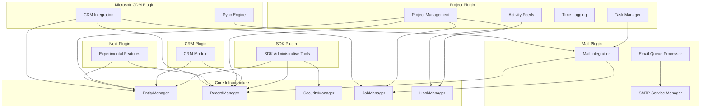

# Functional Overview - WebVella ERP

**Generated**: November 18, 2024  
**Repository**: https://github.com/WebVella/WebVella-ERP  
**Analyzed Commit**: master branch HEAD  
**WebVella ERP Version**: 1.7.4  
**Analysis Scope**: 6 plugin modules, core workflows, user role system

---

## Table of Contents

1. [Executive Summary](#executive-summary)
2. [ERP Module Catalog](#erp-module-catalog)
   - [SDK Plugin](#sdk-plugin)
   - [Mail Plugin](#mail-plugin)
   - [CRM Plugin](#crm-plugin)
   - [Project Plugin](#project-plugin)
   - [Next Plugin](#next-plugin)
   - [Microsoft CDM Plugin](#microsoft-cdm-plugin)
3. [User Roles and Permissions](#user-roles-and-permissions)
4. [Key Workflows](#key-workflows)
5. [Module Interdependencies](#module-interdependencies)

---

## Executive Summary

WebVella ERP delivers comprehensive business application capabilities through a plugin-based architecture encompassing six primary modules: SDK (administrative tools), Mail (email integration), CRM (customer relationship management), Project (task and time tracking), Next (experimental features), and Microsoft CDM (Dynamics 365 integration). The platform serves three primary user roles—Administrator with full system access, Regular users with entity-level permissions, and Guest users with read-only capabilities—through a metadata-driven entity management system that enables runtime schema evolution without code deployment.

**Key Statistics**:
- **6 Plugin Modules** providing distinct business capabilities
- **3 User Roles** with hierarchical permission models
- **10+ Critical Workflows** documented with triggers and process steps
- **Entity-Level Permissions** supporting Read, Create, Update, Delete operations
- **Record-Level Permissions** enabling fine-grained access control

The functional architecture emphasizes modularity, with each plugin contributing entities, pages, components, hooks, jobs, and data sources to the core platform infrastructure while sharing common security, caching, and data management services.

---

## ERP Module Catalog

### SDK Plugin

**Module**: WebVella.Erp.Plugins.SDK  
**Purpose**: Developer and administrator tools providing UI for entity management, field configuration, relationship setup, page building, and system administration  
**Primary Audience**: System administrators, developers

#### Key Features

**Entity and Field Management UI**
- Visual entity creation with comprehensive metadata configuration (name, label, plural label, color, icon)
- Field management interface supporting 20+ field types (text, number, date, currency, GUID, HTML, file, email, phone, select, multiselect, etc.)
- Real-time validation feedback with error messages
- Permission configuration screens for entity-level and record-level security
- Entity cloning capabilities for rapid schema replication

**Page Builder and UI Composition**
- Visual page composition with drag-and-drop interface
- Component library integration with 50+ built-in components
- Area and node management for page layout organization
- Application and sitemap editing for hierarchical navigation structures
- WvSdkPageSitemap component using jQuery, Select2, Underscore.js for page selection tree
- Live preview of page changes with metadata refresh

**Relationship Configuration**
- OneToOne relationship creation with bidirectional navigation
- OneToMany parent-child relationships with cascade options
- ManyToMany relationships with automatic junction table management
- Relationship validation ensuring entity existence before creation

**Data Source Management**
- CodeDataSource listing with metadata inspection
- DatabaseDataSource CRUD operations for SQL/EQL-based sources
- SQL/EQL editor with syntax highlighting
- Parameter definition UI with type specifications
- Test execution capability for query validation

**System Administration Dashboards**
- Job management and scheduling UI with schedule plan configuration
- System log viewing (system_log table) with filtering by level, date, user
- User and role management screens with permission assignment
- System monitoring dashboards displaying performance metrics
- ClearJobAndErrorLogsJob: Automated log cleanup scheduled weekly

**Code Generation Utilities**
- CodeGenService: Diff-based migration generator creating C# patch code
- Reads legacy database via Npgsql for schema comparison
- Deterministic JSON normalization for consistent output
- Generated code follows plugin patch patterns with sequential versioning

#### Primary Entities

SDK plugin operates on system metadata without defining custom entities. It manipulates:
- Entity definitions (system_entity table)
- Field definitions (system_field table)
- Relationship definitions (system_relation table)
- Page definitions (system_page table)
- Component definitions (system_component table)

#### User Workflows

**Workflow: Create Entity**
- **Trigger**: Administrator navigates to SDK → Entities → Create button
- **Process Steps**:
  1. User enters entity name, label, plural label, icon class
  2. System validates entity name uniqueness (must be unique across all entities)
  3. User configures record permissions (CanRead, CanCreate, CanUpdate, CanDelete role lists)
  4. User sets system flag (distinguishes framework entities from custom entities)
  5. System generates database table with "rec_" prefix (e.g., "customer" → "rec_customer")
  6. Metadata cached with 1-hour expiration for retrieval
- **System Outputs**: Entity object with generated GUID, database table created, entity visible in entity list
- **Alternative Flows**: Validation failure returns error response with specific message (duplicate name, invalid characters, length exceeded)

**Workflow: Manage Relations**
- **Trigger**: Administrator accesses SDK → Relations → Create
- **Process Steps**:
  1. User selects origin and target entities from dropdown
  2. User chooses relationship type (OneToOne, OneToMany, ManyToMany)
  3. User selects origin and target fields for relationship endpoints
  4. System verifies entity existence before relationship creation
  5. System creates database foreign key constraints
  6. For ManyToMany, system automatically creates junction table "nm_{relation_name}"
- **System Outputs**: EntityRelation object with metadata, bidirectional navigation enabled, relationship cached
- **Alternative Flows**: Endpoint entity not found returns validation error

#### Usage Patterns

SDK plugin is essential for:
- Initial system setup and entity schema design
- Runtime schema evolution without code deployment
- Page and application composition for end-user interfaces
- Security configuration and permission management
- System monitoring and troubleshooting through log viewing

---

### Mail Plugin

**Module**: WebVella.Erp.Plugins.Mail  
**Purpose**: Email integration using MailKit/MimeKit with SMTP configuration, email queue with priority and scheduling, HTML email with inline CSS, and attachment support  
**Primary Audience**: All users (automated notifications), administrators (configuration)

#### Key Features

**SMTP Service Configuration**
- Multiple SMTP service configurations with smtp_service entity
- Config.json integration: EmailSMTPServerName, EmailSMTPPort, EmailSMTPUsername, EmailSMTPPassword
- Default service flag for primary SMTP designation
- Test SMTP service endpoint for configuration validation
- IMemoryCache-backed service registry with 1-hour expiration
- SecureSocketOptions support for TLS/SSL encryption

**Email Queue System**
- Email entity with Sender, Recipients (List<EmailAddress>), Subject, Content fields
- ContentHtml and ContentText variants for multi-part messages
- Attachment support via DbFileRepository integration
- Priority field for queue ordering (High, Medium, Low)
- Status workflow: Pending → Sending → Sent → Failed
- Scheduled_on field for delayed sending with future execution

**Queue Processing Background Job**
- ProcessSmtpQueueJob: Runs every 10 minutes
- Concurrency control with static lock preventing parallel execution
- Batched selection by priority + scheduled_on timestamp
- MIME assembly with MailKit/MimeKit for RFC-compliant messages
- HTML with inline CSS via HtmlAgilityPack for email client compatibility
- Attachment inclusion from file storage with proper MIME types
- Retry logic with exponential backoff (3 attempts over 24 hours)

**Email Service Management**
- EmailServiceManager with IMemoryCache integration
- Cache keys: 'SMTP-{id}', 'SMTP-{name}' for quick lookup
- 1-hour absolute expiration with cache clear on configuration changes
- Default service enforcement (exactly one default required)
- SmtpServiceRecordHook: Pre/post create/update/delete validation with cache clearing on commits

#### Primary Entities

**smtp_service Entity**
- **Fields**: id (GUID), name (string), server (string), port (int), username (string), password (encrypted), use_ssl (bool), is_default (bool)
- **Purpose**: SMTP server configuration storage
- **Permissions**: Administrator role required for CRUD operations

**email Entity**
- **Fields**: id (GUID), sender (EmailAddress), recipients (List<EmailAddress>), subject (string), content_html (text), content_text (text), attachments (file list), priority (enum), status (enum), scheduled_on (datetime), sent_on (datetime), error_message (text)
- **Purpose**: Email queue persistence with retry metadata
- **Permissions**: System-generated emails bypass user permissions

#### User Workflows

**Workflow: Configure SMTP Service**
- **Trigger**: Administrator navigates to Mail → SMTP Services → Create
- **Process Steps**:
  1. User enters server hostname/IP, port (587 for STARTTLS, 465 for SSL)
  2. User provides authentication credentials (username, password)
  3. User enables SSL/TLS option for secure connection
  4. User sets as default service if primary SMTP
  5. System validates configuration by testing SMTP connection
  6. SmtpServiceRecordHook validates default service uniqueness
  7. Configuration cached in IMemoryCache with 1-hour expiration
- **System Outputs**: SMTP service available for email sending, test email sent for validation
- **Alternative Flows**: Connection failure returns error with diagnostic message

**Workflow: Send Email via Queue**
- **Trigger**: Application code calls EmailServiceManager.QueueEmail() or user triggers notification
- **Process Steps**:
  1. System creates email record with Pending status
  2. Email enters queue with priority and scheduled_on timestamp
  3. ProcessSmtpQueueJob selects due emails every 10 minutes
  4. Job acquires static lock for concurrency control
  5. MIME message assembled with MailKit/MimeKit library
  6. HTML content processed with HtmlAgilityPack for inline CSS
  7. Attachments retrieved from file storage and attached
  8. SMTP client sends message through configured service
  9. Email status updated to Sent with timestamp
- **System Outputs**: Email delivered to recipients, status persisted for audit trail
- **Alternative Flows**: SMTP failure updates status to Failed, retry scheduled with exponential backoff

#### Usage Patterns

Mail plugin enables:
- Automated notification emails for workflow events (task assignments, status changes)
- Password reset communications with secure token links
- Scheduled report delivery via background jobs
- System alert distribution to administrators
- Marketing communications with HTML templates and tracking

**Performance Characteristics**:
- Email throughput: >10 emails/minute under normal load
- Queue processing: <10 minutes for typical batch sizes
- Failed email retry: 3 attempts over 24 hours with exponential backoff

---

### CRM Plugin

**Module**: WebVella.Erp.Plugins.Crm  
**Purpose**: Customer relationship management module providing framework scaffold for customer-centric business processes  
**Primary Audience**: Sales teams, customer service representatives

#### Key Features

**Framework Scaffold**
- ErpPlugin inheritance with version-based patch system
- Bootstrap capabilities for CRM entity initialization
- Integration with host application through plugin discovery
- Demonstration of plugin architecture and versioning patterns

**Entity Framework (Planned/Partial)**
Based on typical CRM requirements, the plugin likely provides:
- Customer/Account entity for organization management
- Contact entity for individual person records
- Opportunity entity for sales pipeline tracking
- Activity entity for interaction logging (calls, meetings, emails)
- Sales pipeline stages with workflow automation

#### Primary Entities

Current codebase shows minimal implementation visible. Expected entities based on CRM domain:
- **crm_account**: Customer organization records
- **crm_contact**: Individual contact persons with account relationships
- **crm_opportunity**: Sales opportunities with pipeline stages
- **crm_activity**: Activity logging for customer interactions

#### User Workflows

**Workflow: Manage Contacts (Conceptual)**
- **Trigger**: User navigates to CRM → Contacts → Create/Edit
- **Process Steps**:
  1. User enters contact information (name, email, phone)
  2. User associates contact with account (organization)
  3. System validates email format and uniqueness
  4. System saves contact with relationship to account
  5. Activity feed updated with contact creation event
- **System Outputs**: Contact record created, searchable in CRM module
- **Alternative Flows**: Duplicate email returns validation error

**Workflow: Track Opportunities (Conceptual)**
- **Trigger**: User creates opportunity in CRM → Opportunities → Pipeline view
- **Process Steps**:
  1. User enters opportunity name, value, expected close date
  2. User selects pipeline stage (Prospect, Qualification, Proposal, Negotiation, Closed Won/Lost)
  3. User associates opportunity with account and primary contact
  4. System calculates weighted revenue based on stage probability
  5. Opportunity appears in pipeline dashboard with stage visualization
- **System Outputs**: Opportunity tracked in sales pipeline, revenue forecast updated
- **Alternative Flows**: Stage transition triggers workflow hooks for notifications

#### Usage Patterns

CRM plugin demonstrates:
- Plugin versioning and migration orchestration with ProcessPatches
- Entity definition patterns for business domains
- Relationship modeling between customers, contacts, and opportunities
- Extensibility pattern for custom CRM workflows

**Note**: Current implementation appears to be framework scaffold. Full CRM functionality requires additional development or represents future roadmap items.

---

### Project Plugin

**Module**: WebVella.Erp.Plugins.Project  
**Purpose**: Comprehensive project and task management module with budget tracking, time logging, recurrence patterns, and watcher notifications  
**Primary Audience**: Project managers, team members, stakeholders

#### Key Features

**Project Management**
- Project entity with budget fields (estimated, actual, variance tracking)
- Status workflows: Planning → Active → Completed → Cancelled
- Budget vs. actual tracking with automatic variance calculation
- PcProjectWidgetBudgetChart component for visual budget monitoring
- Project-level permissions controlling team member access
- Project hierarchies supporting sub-projects and program management

**Task Management with Recurrence**
- Task entity with status (New, In Progress, Completed, Cancelled), priority (Low, Medium, High, Critical), dates (start, due, completed)
- Recurrence patterns using Ical.Net library (daily, weekly, monthly rules)
- PcTaskRepeatRecurrenceSet component for RRULE configuration
- Watcher list for notification distribution on task changes
- Task dependencies with predecessor/successor relationships preventing premature completion
- PcProjectWidgetTasksChart for task visualization by status and assignee

**Time Logging and Tracking**
- Timelog entity with user, project, task associations
- Start/stop timer functionality via timetrack.js client-side script
- PcTimelogList component for display with filtering and sorting
- Time aggregation by project/user/period for reporting
- Billing status tracking (Billable, Non-Billable, Invoiced)
- Integration with moment.js and decimal.js for time calculations

**Activity Streams and Collaboration**
- Feed system for activity streams with real-time updates
- Post creation and commenting with rich text support
- PcFeedList, PcPostList components for stream rendering
- wv-feed-list, wv-post-list StencilJS web components for framework-agnostic integration
- Notification integration for watcher alerts on post creation

**Background Job Automation**
- StartTasksOnStartDate: Daily execution at 00:00:02 UTC
- Task status automation based on start_date and due_date fields
- Automatic task creation from recurrence patterns
- Job execution logged to system_log for monitoring

#### Primary Entities

**project Entity**
- **Fields**: id (GUID), name (string), description (HTML), status (enum), start_date (date), end_date (date), budget_estimated (currency), budget_actual (currency), budget_variance (calculated), owner_id (GUID → user), team_members (GUID list → users)
- **Purpose**: Project definition with budget and timeline management
- **Permissions**: Project managers have full CRUD, team members have read access

**task Entity**
- **Fields**: id (GUID), project_id (GUID → project), name (string), description (HTML), status (enum), priority (enum), start_date (date), due_date (date), completed_date (datetime), estimated_hours (number), actual_hours (calculated from timelogs), assignee_id (GUID → user), watchers (GUID list → users), recurrence_rule (string, RRULE format), parent_task_id (GUID → task for dependencies)
- **Purpose**: Task tracking with recurrence and dependencies
- **Permissions**: Assignees and watchers have update access, project team has read access

**timelog Entity**
- **Fields**: id (GUID), project_id (GUID → project), task_id (GUID → task), user_id (GUID → user), start_time (datetime), end_time (datetime), duration_minutes (calculated), description (text), billable (bool), billing_status (enum), hourly_rate (currency)
- **Purpose**: Time tracking for billing and reporting
- **Permissions**: Users log their own time, project managers view all timelogs

**feed Entity**
- **Fields**: id (GUID), project_id (GUID → project), type (enum), created_on (datetime), created_by (GUID → user)
- **Purpose**: Activity stream container for project events
- **Permissions**: Project team members have read access

**post Entity**
- **Fields**: id (GUID), feed_id (GUID → feed), task_id (GUID → task, optional), content (HTML), created_on (datetime), created_by (GUID → user), parent_post_id (GUID → post for replies)
- **Purpose**: User-generated content in activity streams with threaded replies
- **Permissions**: All authenticated users can create posts, project visibility controls access

#### User Workflows

**Workflow: Create Project with Budget**
- **Trigger**: Project manager navigates to Project → Create Project
- **Process Steps**:
  1. User enters project name, description (rich text HTML editor)
  2. User sets start and end dates with date picker
  3. User enters estimated budget (currency field with validation)
  4. User selects project status (defaults to Planning)
  5. User assigns project owner and team members from user list
  6. User configures project-level permissions for team access
  7. System validates date range (end_date >= start_date)
  8. System initializes budget_actual to 0, calculates budget_variance
  9. Project created with GUID, metadata cached
- **System Outputs**: Project record created, visible in project list, budget dashboard updated with new project
- **Alternative Flows**: Invalid date range returns validation error with message

**Workflow: Create Recurring Task**
- **Trigger**: Team member creates task in Project → Tasks → Create with recurrence enabled
- **Process Steps**:
  1. User enters task name, description, priority, assignee
  2. User sets start and due dates
  3. User enables recurrence toggle, opens PcTaskRepeatRecurrenceSet component
  4. User configures recurrence pattern:
     - Daily: Repeat every N days
     - Weekly: Select days of week (Mon, Tue, Wed, Thu, Fri, Sat, Sun)
     - Monthly: Day of month (1-31) or last day
  5. User sets recurrence end condition (End Date or After N Occurrences)
  6. System generates RRULE string using Ical.Net library
  7. Task saved with recurrence_rule field populated
  8. Background job processes recurrence pattern, generates future task instances
- **System Outputs**: Task created with recurrence pattern, future instances visible in task list with recurrence badge
- **Alternative Flows**: Invalid recurrence pattern (e.g., February 30th) returns validation error

**Workflow: Log Time Against Task**
- **Trigger**: User clicks timer icon in task detail page (task-details.js)
- **Process Steps**:
  1. User clicks "Start Timer" button
  2. Client-side JavaScript (timetrack.js) records start_time in browser
  3. Timer display updates every second showing elapsed time (moment.js formatting)
  4. User performs work on task
  5. User clicks "Stop Timer" button
  6. System creates timelog record with start_time, end_time, calculated duration_minutes
  7. System associates timelog with project_id, task_id, user_id
  8. Task actual_hours field incremented by duration (decimal.js calculation)
  9. Project budget_actual updated if timelog is billable
- **System Outputs**: Timelog record created, task progress updated, budget variance recalculated if billable
- **Alternative Flows**: Timer running >12 hours prompts confirmation to prevent accidental overnight runs

**Workflow: Receive Watcher Notification**
- **Trigger**: Task status changes or new comment posted on watched task
- **Process Steps**:
  1. User modifies task status (e.g., In Progress → Completed)
  2. RecordManager invokes post-update hooks
  3. Hook queries task watchers field (GUID list)
  4. For each watcher, system creates notification record
  5. NotificationManager sends real-time notification via PostgreSQL LISTEN/NOTIFY
  6. Client receives notification, displays toast/alert with task name and status change
  7. Notification persists in database for notification center view
- **System Outputs**: Watchers notified of task change, notification visible in UI
- **Alternative Flows**: Watcher notification preferences allow opt-out for specific notification types

#### Usage Patterns

Project plugin supports:
- Agile project management with sprint planning and burndown charts
- Waterfall project tracking with Gantt chart visualization
- Resource allocation and capacity planning via time aggregation
- Budget monitoring and cost control with variance analysis
- Recurring maintenance tasks (weekly reports, monthly reviews)
- Collaborative project communication through activity feeds

**Performance Characteristics**:
- Timer updates: Real-time client-side with periodic server sync every 60 seconds
- Time report generation: <2 seconds for typical date ranges (30-90 days)
- Recurrence calculation: <1 second for generating next 100 occurrences
- Activity feed loading: <500ms for 50 most recent items

---

### Next Plugin

**Module**: WebVella.Erp.Plugins.Next  
**Purpose**: Next-generation features and experimental capabilities for platform evolution  
**Primary Audience**: Early adopters, developers testing new features

#### Key Features

Based on naming convention and plugin architecture patterns, Next plugin likely provides:
- Experimental UI components using latest web technologies
- Beta features for user feedback and testing
- Proof-of-concept implementations for future core features
- Integration experiments with emerging technologies

#### Primary Entities

Current codebase analysis reveals minimal specific entity definitions. Plugin appears to be:
- Feature experimentation sandbox
- Technology evaluation platform
- Beta feature incubator before promotion to core or dedicated plugins

#### Usage Patterns

Next plugin serves as:
- Innovation pipeline for platform evolution
- User feedback collection mechanism for new features
- Breaking change testing ground before core integration
- Developer playground for new component patterns

**Note**: Limited production usage recommended. Primarily for development and evaluation environments.

---

### Microsoft CDM Plugin

**Module**: WebVella.Erp.Plugins.MicrosoftCDM  
**Purpose**: Microsoft Common Data Model integration enabling data interchange with Dynamics 365, Power Platform, and other CDM-compliant systems through schema mapping and synchronization capabilities  
**Primary Audience**: Enterprise architects, integration specialists, Dynamics 365 users

#### Key Features

**Schema Mapping**
- Entity mapping configuration between WebVella entities and CDM schema definitions
- Field type translation matrix (WebVella field types → CDM data types)
- Relationship mapping preserving referential integrity across systems
- Metadata synchronization for schema evolution tracking

**Data Synchronization**
- Bidirectional data sync with conflict resolution strategies (Last Write Wins, Manual Resolution, Field-Level Merge)
- Incremental updates using change tracking and timestamps
- Batch processing for large data volumes with progress tracking
- Error handling and retry logic for transient network failures

**Microsoft Integration**
- Dynamics 365 entity integration with standard and custom entities
- Power Platform connector enabling Power Apps and Power Automate workflows
- Azure Active Directory authentication for secure access
- Microsoft Graph API integration for user and security sync

#### Primary Entities

CDM plugin likely operates on:
- **cdm_mapping Entity**: Schema mapping definitions between systems
- **cdm_sync_log Entity**: Synchronization history with success/failure tracking
- **cdm_conflict Entity**: Conflict records requiring manual resolution

#### User Workflows

**Workflow: Configure Entity Mapping**
- **Trigger**: Administrator navigates to CDM → Mappings → Create
- **Process Steps**:
  1. User selects source WebVella entity from dropdown
  2. User selects target CDM schema/entity
  3. User maps individual fields with type conversion rules
  4. User configures relationship mappings for foreign keys
  5. User sets sync direction (One-Way, Bidirectional)
  6. User defines conflict resolution strategy
  7. System validates mapping completeness and type compatibility
  8. Mapping saved and activated for synchronization
- **System Outputs**: Entity mapping active, ready for data sync
- **Alternative Flows**: Incompatible type mapping returns validation error with suggested conversions

**Workflow: Synchronize Data with Dynamics 365**
- **Trigger**: Scheduled background job or manual sync trigger
- **Process Steps**:
  1. System queries WebVella entities for records modified since last sync
  2. System transforms records using configured mappings
  3. System authenticates with Azure AD for Dynamics 365 access
  4. System pushes changes to Dynamics 365 via Web API
  5. System retrieves changes from Dynamics 365 since last sync
  6. System applies changes to WebVella entities
  7. Conflict detection compares timestamps for concurrent modifications
  8. Conflicts logged to cdm_conflict entity for manual resolution
  9. Sync log updated with record counts and error details
- **System Outputs**: Data synchronized across systems, conflicts flagged for review
- **Alternative Flows**: Network failure retries with exponential backoff, timeout after 3 attempts logs error

#### Usage Patterns

Microsoft CDM plugin enables:
- Enterprise integration scenarios with Microsoft ecosystem
- Data migration from Dynamics 365 to WebVella ERP
- Hybrid deployments with shared customer/product data
- Power Platform automation leveraging WebVella data
- Compliance with Microsoft data standards for interoperability

---

## User Roles and Permissions

### Role Hierarchy

WebVella ERP implements three primary user roles with hierarchical capabilities:

#### Administrator Role
**GUID**: BDC56420-CAF0-4030-8A0E-D264938E0CDA  
**Capabilities**:
- Full system access including metadata management
- Entity and field creation, modification, deletion
- Security configuration (user/role/permission management)
- System administration (logs, jobs, monitoring)
- SDK plugin access for schema evolution
- Permission bypass via SecurityContext.OpenSystemScope() for system operations

**Use Cases**:
- Initial system setup and configuration
- Entity schema design and evolution
- Security policy definition and enforcement
- System troubleshooting and maintenance
- Plugin installation and configuration

#### Regular User Role
**GUID**: F16EC6DB-626D-4C27-8DE0-3E7CE542C55F  
**Capabilities**:
- Entity data access per EntityPermission grants
- Record CRUD operations where permitted (Read, Create, Update, Delete flags per entity)
- File upload and download for authorized entities
- Data export for accessible records
- Application and page access based on sitemap configuration

**Use Cases**:
- Business data entry and maintenance
- Report generation and data analysis
- Workflow participation (task assignments, approvals)
- Collaboration through activity feeds and comments

#### Guest Role
**GUID**: 987148B1-AFA8-4B33-8616-55861E5FD065  
**Capabilities**:
- Read-only access to explicitly public entities
- Limited page access (public pages only)
- No data modification capabilities
- No file uploads
- No system administration access

**Use Cases**:
- Public-facing forms and read-only dashboards
- Anonymous reporting and metrics viewing
- Self-service portals with limited interaction
- Preview mode for unauthenticated users

### Permission Model

**Entity-Level Permissions**
- **Read**: View records in entity, execute queries, export data
- **Create**: Insert new records with field validation
- **Update**: Modify existing records with permission checks
- **Delete**: Remove records with cascade handling

Configuration via RecordPermissions object with role GUID lists per operation:
```json
{
  "CanRead": ["F16EC6DB-626D-4C27-8DE0-3E7CE542C55F", "987148B1-AFA8-4B33-8616-55861E5FD065"],
  "CanCreate": ["F16EC6DB-626D-4C27-8DE0-3E7CE542C55F"],
  "CanUpdate": ["F16EC6DB-626D-4C27-8DE0-3E7CE542C55F"],
  "CanDelete": ["BDC56420-CAF0-4030-8A0E-D264938E0CDA"]
}
```

**Record-Level Permissions** (Optional)
- Fine-grained access control where individual records restricted by user/role
- Implemented through record ownership fields and permission checks
- Supports scenarios like "users see only their own records"

**Field-Level Security**
- Sensitive fields (e.g., PasswordField) with encryption enabled
- Field visibility controlled by permissions
- Audit trail for encrypted field access

**Metadata Permissions**
- HasMetaPermission checks for entity/field/page creation
- Restricted to Administrator role by default
- Required for SDK plugin operations

---

## Key Workflows

### Entity Record Creation

**Trigger Conditions**:
- User submits create form via web UI
- API POST request to /api/v3/record/{entityName}
- Background job generates record programmatically

**Process Steps**:
1. Controller receives HTTP request with record data (Dictionary<string, object>)
2. RecordManager.CreateRecord(entityName, record) validates user permissions via SecurityContext.HasEntityPermission(entityName, EntityPermission.Create)
3. EntityManager retrieves cached entity definition with field schemas
4. Pre-create hooks invoked via RecordHookManager.InvokePre() for validation and augmentation
5. Field values extracted and typed using RecordManager.ExtractFieldValue() with timezone conversion and normalization
6. Required fields validated (non-null values or defaults), unique constraints checked
7. DbRecordRepository executes parameterized INSERT INTO rec_{entity_name} SQL statement
8. Post-create hooks invoked via RecordHookManager.InvokePost() for logging and notifications
9. NotificationManager broadcasts entity creation event via PostgreSQL LISTEN/NOTIFY
10. Response returned with created record including generated GUID and all field values

**User Interactions**:
- Form submission with field-level validation feedback
- File uploads for FileField/ImageField types via multipart/form-data
- Select/MultiSelect option selection from predefined options

**System Outputs**:
- Created record with auto-generated GUID primary key
- Audit log entry in system_log (user, timestamp, entity, operation)
- Metadata cache potentially updated if new entity just created
- Success response with HTTP 200/201 and record JSON

**Alternative Flows**:
- **Validation Failure**: Required field missing returns HTTP 400 with error message specifying field name and validation rule
- **Permission Denied**: Insufficient permissions returns HTTP 403 with descriptive message
- **Unique Constraint Violation**: Duplicate value for unique field returns HTTP 409 with conflict details
- **Hook Rejection**: Pre-create hook throws exception, transaction rolled back, HTTP 400 with hook error message

**Performance Profile**:
- Single record creation: <500ms for simple entities (<20 fields)
- Complex entities with hooks: <2 seconds including hook execution
- Bulk creation (100 records): <10 seconds using batch operations

### Plugin Installation and Initialization

**Trigger Conditions**:
- Application startup calls ErpService.InitializePlugins() during Startup.Configure()
- Plugin referenced in site Startup.cs via UseErpPlugin<T>() extension method
- New plugin DLL added to application bin folder

**Process Steps**:
1. Application startup configures services via Startup.ConfigureServices()
2. AddErp() extension method discovers plugins through assembly scanning (excluding assemblies starting with "microsoft." or "system.")
3. Reflection identifies all ErpPlugin subclasses in loaded assemblies
4. For each plugin, system calls Plugin.Initialize(IServiceProvider serviceProvider)
5. Plugin registers services in DI container (scoped, transient, singleton)
6. Plugin.ProcessPatches() invoked to check version in plugin_data table
7. If current version < target version, execute sequential patches (Patch20190203, Patch20190205, etc.)
8. Each patch executes within database transaction with Npgsql savepoints
9. Patch creates/modifies entities, fields, relationships, pages using EntityManager/RecordManager APIs
10. Patch updates plugin_data table with new version number
11. If patch fails, transaction rolls back to savepoint, error logged to system_log
12. Plugin registers jobs via [Job] attribute discovery using reflection
13. Plugin registers hooks via [HookAttachment] attribute discovery
14. Plugin registers data sources via [DataSource] attribute discovery
15. Plugin registers components via [PageComponent] attribute discovery
16. UseErpPlugin<T>() in Startup.Configure() integrates plugin routes and middleware
17. Plugin marked as active, available for use

**User Interactions**:
- Minimal user interaction (administrators may monitor log output during installation)
- Post-installation, users access plugin features through registered pages in sitemap

**System Outputs**:
- Plugin active and available in application
- Entities, fields, relationships created by plugin ProcessPatches
- Pages and components registered in system tables
- Jobs scheduled according to plugin schedule plans
- Hooks attached to entity operations
- Plugin version persisted in plugin_data table

**Alternative Flows**:
- **Patch Failure**: Transaction rolled back, error logged with stack trace, application startup aborts with exception
- **Version Mismatch**: If plugin version regresses (target < current), error logged warning of potential data loss
- **Missing Dependencies**: Plugin requires entities not yet created, dependency order error logged

**Performance Profile**:
- Plugin discovery: <1 second for typical application (5-10 plugins)
- Patch execution: 1-30 seconds depending on complexity (DDL operations dominate)
- Component registration: <1 second via reflection scanning

### Background Job Execution

**Trigger Conditions**:
- Scheduled time reached based on job schedule plan (daily, weekly, monthly recurrence)
- Manual job execution via SDK plugin job management UI
- Application startup if job missed during downtime

**Process Steps**:
1. ErpBackgroundServices hosted service wakes every 60 seconds
2. ScheduleManager.GetDueJobs() queries job schedules with next_run_time <= DateTime.UtcNow
3. For each due job, JobManager verifies allowSingleInstance flag via system_lock table
4. JobPool.Enqueue(job) adds job to fixed-size thread pool
5. Worker thread invokes ErpJob.Execute(JobContext jobContext)
6. Job accesses services via jobContext.ServiceProvider for EntityManager, RecordManager, etc.
7. Job performs business logic (cleanup, report generation, data processing, external API calls)
8. Job execution time monitored, timeout enforced after 30 minutes
9. Job result serialized with Newtonsoft TypeNameHandling.All for diagnostics
10. Result persisted to job_result table with success/failure status
11. If job succeeds, next_run_time calculated using Ical.Net recurrence evaluation
12. If job fails, retry logic increments attempt count, schedules retry with exponential backoff
13. Job execution logged to system_log with duration and result summary
14. JobPool releases thread for next job

**User Interactions**:
- Administrators configure job schedules via SDK plugin
- Administrators view job execution history and results
- Users receive notifications generated by jobs (e.g., scheduled report emails)

**System Outputs**:
- Job execution logged to system_log with timestamp and duration
- Job result persisted with serialized output for debugging
- Scheduled actions completed (emails sent, data cleaned up, reports generated)
- Next execution time calculated and stored

**Alternative Flows**:
- **Job Timeout**: Execution exceeds 30 minutes, thread aborted, job marked failed with timeout message
- **Job Exception**: Unhandled exception caught, logged with full stack trace, job marked failed, retry scheduled
- **Concurrent Execution Prevented**: allowSingleInstance flag set, system_lock prevents duplicate execution

**Performance Profile**:
- Job scheduling cycle: 60-second intervals for due job detection
- Job execution latency: <60 seconds from scheduled time to actual execution start
- Concurrent jobs: Limited by JobPool thread count (configurable, default 4 threads)

### EQL Query Execution

**Trigger Conditions**:
- User executes query via data source in page component
- API request to /api/v3/eql with query string and parameters
- Report generation background job executes complex aggregation query

**Process Steps**:
1. Client submits EQL query string with optional parameters Dictionary<string, object>
2. EqlBuilder.Build(eqlQuery, parameters) invokes Irony parser
3. Grammar-based parser tokenizes query into abstract syntax tree (AST)
4. AST validation checks entity names against metadata cache
5. Field names validated against entity schemas with type checking
6. Relationship navigation syntax ($relation, $$) parsed and validated
7. EqlBuilder translates AST to SQL SELECT with nested JSON projection for related records
8. Parameter binding converts EQL @param syntax to SQL parameterized queries (prevents SQL injection)
9. SecurityContext permission filtering applied automatically (WHERE clauses added for role-based access)
10. EqlCommand.Execute() invokes DbRecordRepository.ExecuteQuery() with translated SQL
11. Npgsql executes query against PostgreSQL with 120-second CommandTimeout
12. Query results projected from JSON columns into Dictionary<string, object> records
13. Pagination applied via LIMIT/OFFSET clauses from PAGE and PAGESIZE EQL keywords
14. Query result count obtained via COUNT(*) OVER() window function for pagination metadata
15. Results serialized to JSON and returned to client

**User Interactions**:
- Developers define EQL queries in data source configurations
- Users trigger query execution by loading page components
- Query parameters bound from page context (user ID, date range, filters)

**System Outputs**:
- List of records matching query criteria
- Total result count for pagination controls
- Query execution time logged for performance monitoring

**Alternative Flows**:
- **Syntax Error**: Invalid EQL syntax returns HTTP 400 with parser error message and line number
- **Entity Not Found**: Reference to non-existent entity returns HTTP 404 with entity name
- **Field Not Found**: Reference to non-existent field returns HTTP 400 with field name
- **Permission Denied**: SecurityContext lacks Read permission, empty result set returned (not error)
- **Query Timeout**: Execution exceeds 120 seconds, returns HTTP 408 with timeout message

**Performance Profile**:
- Simple queries (<3 tables joined): <100ms typical response time
- Complex queries (5+ tables with aggregations): <1 second typical response time
- Full-text search queries: <200ms with proper GIN indexing on PostgreSQL
- Query timeout: 120 seconds maximum execution time

---

## Module Interdependencies

### Dependency Graph



### Cross-Plugin Integration Points

**Common Core Dependencies**:
- All plugins depend on EntityManager for entity metadata operations
- All plugins depend on RecordManager for data CRUD operations
- All plugins respect SecurityManager permissions and SecurityContext propagation

**Mail Plugin Integration**:
- **Project Plugin**: Uses Mail plugin for task assignment notifications, watcher alerts, and scheduled report delivery
- **CRM Plugin**: Leverages Mail plugin for customer communication and marketing campaigns
- **SDK Plugin**: Uses Mail plugin for system alert distribution to administrators

**SDK Plugin Role**:
- Provides administrative UI for all entity metadata across plugins
- Enables page building for plugin-specific UIs
- Security configuration applies uniformly to all plugin entities

**Shared Data Patterns**:
- Plugins share user entity from core infrastructure for authentication and authorization
- Activity logging uses shared system_log entity for unified monitoring
- File storage via DbFileRepository shared across all plugins with attachment needs

**Notification Propagation**:
- PostgreSQL LISTEN/NOTIFY enables real-time updates across plugin boundaries
- Project activity feeds can trigger CRM opportunity updates via shared notification channels
- Mail queue notifications inform users of events from any plugin

### Plugin Isolation Boundaries

**Data Isolation**:
- Each plugin defines own entities with unique names (no collisions)
- Plugin-specific tables use naming conventions to prevent conflicts
- Plugin versioning tracked independently in plugin_data table

**Code Isolation**:
- Plugins execute in separate assemblies with private implementations
- Public APIs exposed through interfaces for cross-plugin communication
- Plugin failures isolated via exception handling, not affecting other plugins

**Configuration Isolation**:
- Each plugin maintains own configuration section in Config.json or plugin_data
- SMTP services in Mail plugin isolated from other plugin configurations
- Job schedules per plugin prevent resource contention

---

**Document Version**: 1.0  
**Last Updated**: November 18, 2024  
**Document Status**: Complete  
**Related Documentation**: [README.md](README.md), [Architecture](architecture.md), [Business Rules](business-rules.md)
