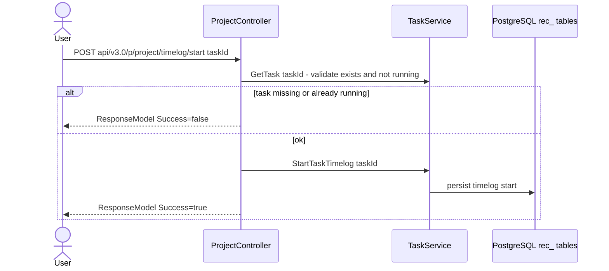
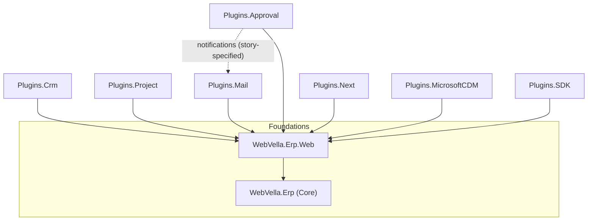

# WebVella ERP — Functional / Module Overview

> Part of the **WebVella ERP Reverse-Engineering / As-Built Documentation Suite**. See the suite index in [`README.md`](./README.md). This document is **analysis-only**: it describes *what exists* in the codebase at the pinned commit and modifies no source.

## Executive Summary

WebVella ERP is a **customizable, plugin-driven Enterprise Resource Planning platform** built on **ASP.NET Core 9**. Its defining trait is an **entity-centric meta-model**: entities, fields, and relations are stored as data and managed at runtime by a core *manager layer*, rather than being fixed compile-time POCOs (see the **meta-model** entry in the [Glossary & Acronyms](./README.md#glossary--acronyms)). Functional capability is delivered through **seven feature plugin projects** — Approval, CRM, Mail, Microsoft CDM, Next, Project, and SDK. **Most** of them (CRM, Mail, Microsoft CDM, Next, Project, and SDK) are implemented as an `ErpPlugin` subclass with a `*Plugin._.cs` bootstrap that applies its own dated schema patches at startup (`WebVella.Erp.Plugins.Crm/CrmPlugin._.cs:11`, `WebVella.Erp.Plugins.Project/ProjectPlugin._.cs:11`). **Approval is the exception**: at the pinned commit it is a plugin *project* containing only dashboard code — it has **no `ApprovalPlugin` subclass, no `*Plugin._.cs` bootstrap, and no migration** (see [§2.4](#24-approval-webvellaerppluginsapproval)). These plugins are composed into runnable applications by **seven `WebVella.Erp.Site*` host shells**, each of which wires dependency injection, hybrid authentication, and a specific plugin set (`WebVella.Erp.Site/Startup.cs:183`).

This document catalogs each functional module, the platform's **role-based access model**, the **key business workflows** an administrator or end user performs, the **interdependencies** between modules, and the **multi-site host-shell pattern** used to assemble and deploy the system. Where a module's behavior is only partially built, this overview states so explicitly and separates *implemented code* from *story-specified design* (most notably for the **Approval** plugin — see [§2.4](#24-approval-webvellaerppluginsapproval)).

**Frontend technology (corrects assumption C1).** WebVella's user interface is **server-rendered Razor (`.cshtml`) + Blazor WebAssembly (`.razor`) + jQuery / Bootstrap 4 / StencilJs** — it is **not** an Angular or React single-page application, and the repository contains **no `package.json`** (verified: zero `package.json` files outside `bin`/`obj`). Front-end libraries are **host-bundled** under `WebVella.Erp.Web/wwwroot/js/` (e.g., `base.js`, `site.js`, and the StencilJs-compiled web components under `WebVella.Erp.Web/wwwroot/js/wv-lazyload/`); there are **11** Blazor `.razor` components in the solution. This correction is recorded in the suite index ([`README.md` C1](./README.md#requirement-vs-reality-corrections-c1c5)) and the [Architecture](./architecture.md) document, and SPA adoption is discussed only as a future option in the [Modernization Roadmap](./modernization-roadmap.md).

| Summary metric | Value | Evidence |
|----------------|-------|----------|
| Feature plugins documented | **7** (Approval, CRM, Mail, Microsoft CDM, Next, Project, SDK) | `WebVella.Erp.Plugins.*` |
| Site host shells documented | **7** (`Site`, `.Crm`, `.Mail`, `.MicrosoftCDM`, `.Next`, `.Project`, `.Sdk`) | `WebVella.Erp.Site*` |
| Console harness | **1** (`WebVella.Erp.ConsoleApp`) | `WebVella.Erp.ConsoleApp/Program.cs` |
| Largest plugin | **Project** — 45 `.cs` / 56 `.cshtml` / 65 `.js` | file scan of `WebVella.Erp.Plugins.Project` |
| Access-control model | Role-based; per-entity `RecordPermissions` enforced via `SecurityContext` | `WebVella.Erp/Api/SecurityContext.cs:63` |
| Frontend stack | Razor `.cshtml` + Blazor `.razor` + jQuery/Bootstrap 4/StencilJs (no SPA, no `package.json`) | `WebVella.Erp.Web/wwwroot/`, repo scan |

---

## Generation Metadata

| Field | Value |
|-------|-------|
| **Documentation Generated** | 2026-06-05 17:30 UTC |
| **Source commit** | `bfe15661c7f0c1dae57288d789b854186793b157` |
| **Branch** | `master` |
| **Scope** | Functional / module overview (modules, roles, workflows, interdependencies, host-shell pattern) |
| **Method** | Static analysis of the source tree; every technical claim carries an inline `path:line` (or `path`) citation |
| **Mandate** | Analysis-only — no production source, schema, configuration, build, or test file was modified; output is confined to `docs/reverse-engineering/` |

---

## How to Read This Document

This overview connects the **structure** of the codebase to the **functionality** users experience. It is best read after the [`code-inventory.md`](./code-inventory.md) (module taxonomy and sizes) and [`architecture.md`](./architecture.md) (layered design, manager layer, EQL read path, plugin lifecycle), and before the [`business-rules.md`](./business-rules.md) catalog. Module names used here are the **canonical names** from the [Module Taxonomy](./README.md#module-taxonomy-canonical) in the suite index; domain terms (EQL, DAL, meta-model, hook, job, `ResponseModel`, `rec_*`/`rel_*`, Site host) follow the shared [Glossary & Acronyms](./README.md#glossary--acronyms).

- [1. Platform at a Glance](#1-platform-at-a-glance)
- [2. ERP Module Catalog](#2-erp-module-catalog) — one subsection per plugin
- [3. Roles & Permissions](#3-roles--permissions)
- [4. Key Business Workflows](#4-key-business-workflows)
- [5. Module Interdependencies](#5-module-interdependencies)
- [6. Multi-site Host-Shell Pattern](#6-multi-site-host-shell-pattern)
- [7. Cross-Document Consistency](#7-cross-document-consistency)

> **Citations & screenshots.** Technical claims cite `path:line`. User-interface figures reference the **pre-existing** screenshots under the repository's `doc-images/` folder via relative links (`../../doc-images/…`); **no images are created or recaptured** by this analysis-only task.

---

## 1. Platform at a Glance

WebVella is organized as a layered, plugin-extensible system. A **core platform** assembly (`WebVella.Erp`) hosts the entity meta-model, the manager layer, the custom **EQL** query engine, hooks, jobs, recurrence, full-text search, and notifications. A **web application** assembly (`WebVella.Erp.Web`) adds the versioned REST surface (`/api/v3.0/...`), middleware, Razor Pages, components, and the security constructs. Feature **plugins** layer ERP domains on top of those two assemblies, and **Site hosts** compose a chosen plugin set into a runnable ASP.NET Core application.

**Frontend composition.** The presentation tier is intentionally server-centric:

| Frontend technology | Where it appears | Evidence |
|---------------------|------------------|----------|
| Server-rendered **Razor** (`.cshtml`) | Pages, components, and page-builder views across Web and plugins (e.g., 56 `.cshtml` in Project, 54 in SDK) | `WebVella.Erp.Plugins.Project/`, `WebVella.Erp.Plugins.SDK/` |
| **Blazor WebAssembly** (`.razor`) | `WebVella.Erp.WebAssembly` (`Client`/`Server`/`Shared`) — 11 `.razor` components | `WebVella.Erp.WebAssembly/` |
| **jQuery / Bootstrap 4 / StencilJs** | Host-bundled scripts and web components | `WebVella.Erp.Web/wwwroot/js/`, `WebVella.Erp.Web/wwwroot/js/wv-lazyload/` |
| **No** Angular / React / `package.json` | — (assumption C1 corrected) | repo scan: 0 `package.json` outside `bin`/`obj` |

**Versioned REST surface.** Functionality is reached over a stable, versioned API rooted at `/api/v3.0/...`. The core web layer exposes generic record/datasource/page endpoints, and each plugin contributes its own endpoints under `/api/v3.0/p/{plugin}/...` (for example, the SDK admin endpoints under `api/v3.0/p/sdk/...` at `WebVella.Erp.Plugins.SDK/Controllers/AdminController.cs:39` and the Project endpoints under `api/v3.0/p/project/...` at `WebVella.Erp.Plugins.Project/Controllers/ProjectController.cs:56`). Most record/manager JSON API actions return the standard `ResponseModel` envelope (`WebVella.Erp/Api/Models/BaseModels.cs:40`), but **some actions are exceptions** — for example `ProjectController.TimeTrackJs` returns a `ContentResult` (`WebVella.Erp.Plugins.Project/Controllers/ProjectController.cs:466`), `ProjectController.GetCurrentUser` returns a raw JSON user record (`WebVella.Erp.Plugins.Project/Controllers/ProjectController.cs:488`), and `AdminController.DataSourceAction` returns a raw datasource list (`WebVella.Erp.Plugins.SDK/Controllers/AdminController.cs:39`).

**Plugin bootstrap pattern.** Plugins that own schema patches are implemented as a partial class deriving from `ErpPlugin` whose `ProcessPatches()` method runs at startup inside a system security scope and a database transaction, applying that plugin's schema patches in version order (`WebVella.Erp.Plugins.Mail/MailPlugin._.cs:10`, `WebVella.Erp.Plugins.SDK/SdkPlugin._.cs:10`). **Six of the seven** plugin projects follow this pattern; **Approval does not** — it has no `*Plugin._.cs` bootstrap and contributes no patches (see [§2.4](#24-approval-webvellaerppluginsapproval)). The platform has **no Entity Framework `Migrations/` folder**; schema history is carried by ~25 **date-versioned plugin partial classes** (the *patch-class migration* convention — see [Glossary](./README.md#glossary--acronyms) and [`database-schema.md`](./database-schema.md)).

---

## 2. ERP Module Catalog

The seven feature plugins are summarized below, then described individually. Sizes are physical file counts (excluding `bin`/`obj`); each plugin ships a `*Plugin._.cs` **bootstrap** and, where applicable, `Controllers/`, `Services/`, `Hooks/`, `Jobs/`, `Components/`, and dated migration partials.

| Module (canonical name) | Project | `.cs` | `.cshtml` | `.js` | Dated patches | Primary domain |
|-------------------------|---------|------:|----------:|------:|--------------:|----------------|
| **CRM** | `WebVella.Erp.Plugins.Crm` | 3 | 0 | 0 | 0 | Customer / contact domain scaffold |
| **Project** | `WebVella.Erp.Plugins.Project` | 45 | 56 | 65 | 8 | Projects, tasks, time logs, feeds/comments |
| **Mail** | `WebVella.Erp.Plugins.Mail` | 23 | 0 | 0 | 7 | SMTP send + mail queue, hooks & jobs |
| **Approval** | `WebVella.Erp.Plugins.Approval` | 4 | 5 | 1 | 0 | Manager approval dashboard (rest is design-stage) |
| **Next** | `WebVella.Erp.Plugins.Next` | 14 | 0 | 0 | 5 | Search index + entity-migration behavior |
| **Microsoft CDM** | `WebVella.Erp.Plugins.MicrosoftCDM` | 3 | 0 | 0 | 0 | Common Data Model migration scaffolding |
| **SDK** | `WebVella.Erp.Plugins.SDK` | 69 | 54 | 42 | 5 | Admin / design tooling (entities, pages, datasources, sitemap) |

*(File counts are from a source-tree scan; per-file rows live in [`code-inventory.csv`](./code-inventory.csv) and the narrative in [`code-inventory.md`](./code-inventory.md).)*

### 2.1 CRM (`WebVella.Erp.Plugins.Crm`)

CRM is the **customer / contact domain** module. It is a small plugin (3 `.cs` files) whose bootstrap `CrmPlugin._.cs` follows the standard `ErpPlugin.ProcessPatches()` pattern — opening a system scope, instantiating the `EntityManager`/`EntityRelationManager`/`RecordManager`, reading system settings, and committing within a transaction (`WebVella.Erp.Plugins.Crm/CrmPlugin._.cs:11-101`). Its initialization version constant is `WEBVELLA_CRM_INIT_VERSION = 20190101` (`WebVella.Erp.Plugins.Crm/CrmPlugin._.cs:13`).

Notably, CRM's schema patches are written **inline in the bootstrap** rather than as separate dated partial files, and the only versioned patch (`Patch20190123`) is **commented out** — the call `Patch20190123(entMan, relMan, recMan);` and its surrounding block are disabled (`WebVella.Erp.Plugins.Crm/CrmPlugin._.cs:66`, block `WebVella.Erp.Plugins.Crm/CrmPlugin._.cs:58-79`). As an as-built fact, CRM therefore initializes plugin settings but **applies no active schema patch** at the pinned commit.

> **Excerpt** — the disabled patch call (`WebVella.Erp.Plugins.Crm/CrmPlugin._.cs:66`):
> ```csharp
> //          Patch20190123(entMan, relMan, recMan);
> ```

### 2.2 Project (`WebVella.Erp.Plugins.Project`)

Project is the **largest feature plugin** (45 `.cs`, 56 `.cshtml`, 65 `.js`) and the most functionally complete. It covers **projects, tasks, time logs, and activity feeds/comments**, and is organized into `Components/`, `Controllers/`, `Datasource/`, `Files/`, `Hooks/`, `Jobs/`, `Model/`, `Services/`, `Theme/`, `Utils/`, and `wwwroot/` directories. Its bootstrap `ProjectPlugin._.cs` uses the standard pattern with `WEBVELLA_PROJECT_INIT_VERSION = 20190101` (`WebVella.Erp.Plugins.Project/ProjectPlugin._.cs:11-13`), and its schema evolves through **8 dated patch classes** (`ProjectPlugin.20190203.cs` … `ProjectPlugin.20190222.cs`, then `ProjectPlugin.20211012.cs` and `ProjectPlugin.20211013.cs`).

**REST endpoints** are exposed by `ProjectController` (`WebVella.Erp.Plugins.Project/Controllers/ProjectController.cs:19`) under the `api/v3.0/p/project/...` route family. **Most** actions return the `ResponseModel` envelope; the two `GET` actions in the table below are exceptions — `files/javascript` returns a `ContentResult` (`WebVella.Erp.Plugins.Project/Controllers/ProjectController.cs:466`) and `user/get-current` returns a raw JSON user record (`WebVella.Erp.Plugins.Project/Controllers/ProjectController.cs:488`).

| HTTP | Route | Action | Citation |
|------|-------|--------|----------|
| POST | `api/v3.0/p/project/pc-post-list/create` | Create a feed/comment post-list item | `WebVella.Erp.Plugins.Project/Controllers/ProjectController.cs:56` |
| POST | `api/v3.0/p/project/pc-post-list/delete` | Delete a post-list item | `WebVella.Erp.Plugins.Project/Controllers/ProjectController.cs:142` |
| POST | `api/v3.0/p/project/pc-timelog-list/create` | Create a time-log list item | `WebVella.Erp.Plugins.Project/Controllers/ProjectController.cs:177` |
| POST | `api/v3.0/p/project/pc-timelog-list/delete` | Delete a time-log list item | `WebVella.Erp.Plugins.Project/Controllers/ProjectController.cs:257` |
| POST | `api/v3.0/p/project/timelog/start` | Start a task's time log | `WebVella.Erp.Plugins.Project/Controllers/ProjectController.cs:295` |
| POST | `api/v3.0/p/project/task/status` | Set a task's status | `WebVella.Erp.Plugins.Project/Controllers/ProjectController.cs:362` |
| POST | `api/v3.0/p/project/task/watch` | Toggle task watch for a user | `WebVella.Erp.Plugins.Project/Controllers/ProjectController.cs:396` |
| GET | `api/v3.0/p/project/files/javascript` | Serve plugin JavaScript | `WebVella.Erp.Plugins.Project/Controllers/ProjectController.cs:463` |
| GET | `api/v3.0/p/project/user/get-current` | Return the current user | `WebVella.Erp.Plugins.Project/Controllers/ProjectController.cs:486` |

> **As-built note — time-log "stop".** A `timelog/stop` endpoint (`StopTimeLog`) is **present but entirely commented out** in the controller (`WebVella.Erp.Plugins.Project/Controllers/ProjectController.cs:328-360`); only `timelog/start` is active at the pinned commit. The active `StartTimeLog` validates that the task exists and is not already running before delegating to `TaskService` (`WebVella.Erp.Plugins.Project/Controllers/ProjectController.cs:295-326`).

**Service layer.** Business logic lives in service classes that all extend a shared `BaseService`, which centralizes the core managers (`RecordManager`, `EntityManager`, `SecurityManager`, `EntityRelationManager`, `DbFileRepository`) as protected properties (`WebVella.Erp.Plugins.Project/Services/BaseService.cs:10-16`):

| Service | Responsibility | Citation |
|---------|----------------|----------|
| `ProjectService` | Project lifecycle and queries | `Services/ProjectService.cs:11` |
| `TaskService` | Task state, status, time-log start | `Services/TaskService.cs:20` |
| `TimeLogService` | Time-log records | `Services/TimeLogService.cs:18` |
| `CommentService` | Feed comments | `Services/CommentService.cs:14` |
| `FeedItemService` | Activity-feed items | `Services/FeedItemService.cs:13` |
| `RenderService` | View/markup rendering | `Services/RenderService.cs:12` |

*(A `ReportService` also exists in `Services/` but does not extend `BaseService`.)*

### 2.3 Mail (`WebVella.Erp.Plugins.Mail`)

Mail provides **SMTP send and a mail-queue** subsystem, organized into `Api/`, `Hooks/`, `Jobs/`, and `Services/` directories (23 `.cs` files). Outbound email is built on **MailKit 4.14.1** (`WebVella.Erp.Plugins.Mail/WebVella.Erp.Plugins.Mail.csproj:28`). Its bootstrap `MailPlugin._.cs` uses the standard `ProcessPatches()` pattern with `WEBVELLA_MAIL_INIT_VERSION = 20190101` (`WebVella.Erp.Plugins.Mail/MailPlugin._.cs:10-12`), and its schema evolves through **7 dated patches spanning 2019–2020** (`MailPlugin.20190215.cs`, `MailPlugin.20190419.cs`, `MailPlugin.20190420.cs`, `MailPlugin.20190422.cs`, `MailPlugin.20190529.cs`, `MailPlugin.20200610.cs`, `MailPlugin.20200611.cs`). The presence of `Hooks/` and `Jobs/` reflects the queue model: records trigger hook-driven processing, and background jobs perform the actual SMTP delivery. Mail is the integration target for the Approval plugin's *specified* notification jobs (see [§2.4](#24-approval-webvellaerppluginsapproval) and [§5](#5-module-interdependencies)).

### 2.4 Approval (`WebVella.Erp.Plugins.Approval`)

> **Read this section carefully.** The Approval plugin is the one module where **shipped code is a small subset of a larger design**. To honor the suite's factual-reporting mandate, this section separates **(A) Implemented** behavior — verifiable in `.cs` source at the pinned commit — from **(B) Story-specified** behavior — requirements defined in `jira-stories/STORY-00X-*.md` whose service/hook/job/UI implementation is **design-stage and not present in the repository**. The same distinction is mirrored in [`business-rules.md`](./business-rules.md#implemented-vs-story-specified-rules).

At the pinned commit the Approval plugin contains **only four `.cs` files**: `Api/DashboardMetricsModel.cs`, `Components/PcApprovalDashboard/PcApprovalDashboard.cs`, `Controllers/ApprovalController.cs`, and `Services/DashboardMetricsService.cs`. There is **no `ApprovalPlugin._.cs` bootstrap, no entity migration, no workflow services, no hooks, and no jobs** — i.e., the broader workflow engine described by the Jira stories has not been built.

#### (A) Implemented — Manager Approval Dashboard with real-time metrics

The shipped functionality corresponds to **STORY-009** (Manager Approval Dashboard). It surfaces team approval metrics through two read endpoints exposed by `ApprovalController`, which is decorated `[Authorize]` (`WebVella.Erp.Plugins.Approval/Controllers/ApprovalController.cs:20-21`):

| HTTP | Route | Action | Citation |
|------|-------|--------|----------|
| GET | `api/v3.0/p/approval/dashboard/metrics` | Return aggregated dashboard metrics | `WebVella.Erp.Plugins.Approval/Controllers/ApprovalController.cs:113` |
| GET | `api/v3.0/p/approval/dashboard/health` | Lightweight health/status payload | `WebVella.Erp.Plugins.Approval/Controllers/ApprovalController.cs:187` |

**Role gating (implemented).** Access to the dashboard is restricted to a fixed allow-list of role names — `manager`, `administrator`, and `admin` (`WebVella.Erp.Plugins.Approval/Controllers/ApprovalController.cs:30-35`). The check `IsManagerRole()` compares the current user's roles (lower-cased) against that list (`WebVella.Erp.Plugins.Approval/Controllers/ApprovalController.cs:92`); unauthenticated callers receive `401` (`WebVella.Erp.Plugins.Approval/Controllers/ApprovalController.cs:124-127`) and authenticated-but-unauthorized callers receive `403` (`WebVella.Erp.Plugins.Approval/Controllers/ApprovalController.cs:131-134`). 

> **Story-vs-implemented nuance.** STORY-009 specified access for the **Manager** role only (`jira-stories/STORY-009-manager-dashboard-metrics.md`), but the shipped controller **broadens** the allow-list to `manager`/`administrator`/`admin`. This is also catalogued as authorization rule `AUTHZ-013` in [`business-rules.md`](./business-rules.md#5-authorization-rules-authz-).

**Metric computation (implemented).** `DashboardMetricsService` (`WebVella.Erp.Plugins.Approval/Services/DashboardMetricsService.cs:16`) computes each metric by running **EQL** against the (story-defined) approval entities via `new EqlCommand(...).Execute()` over a `RecordManager` (`WebVella.Erp.Plugins.Approval/Services/DashboardMetricsService.cs:23-25`). The aggregator `GetDashboardMetrics(userId, fromDate, toDate)` (`WebVella.Erp.Plugins.Approval/Services/DashboardMetricsService.cs:35`) calls:

| Metric | Method | Citation |
|--------|--------|----------|
| Pending approvals (for the user) | `GetPendingApprovalsCount` | `WebVella.Erp.Plugins.Approval/Services/DashboardMetricsService.cs:58` |
| Overdue requests | `GetOverdueRequestsCount` | `WebVella.Erp.Plugins.Approval/Services/DashboardMetricsService.cs:90` |
| Average approval time (hours, 2 dp) | `GetAverageApprovalTime` | `WebVella.Erp.Plugins.Approval/Services/DashboardMetricsService.cs:146` |
| Approval rate (%, 1 dp) | `GetApprovalRate` | `WebVella.Erp.Plugins.Approval/Services/DashboardMetricsService.cs:205` |
| Recent activity feed | `GetRecentActivity` | `WebVella.Erp.Plugins.Approval/Services/DashboardMetricsService.cs:252` |

The dashboard's user-facing surface is the page component `PcApprovalDashboard` (`WebVella.Erp.Plugins.Approval/Components/PcApprovalDashboard/PcApprovalDashboard.cs`), with its Razor views and `WebVella.Erp.Plugins.Approval/Components/PcApprovalDashboard/service.js` (5 `.cshtml`, 1 `.js`). The metric formulas (e.g., average-time and rate rounding) are catalogued as calculation rules `CALC-004`/`CALC-005` in [`business-rules.md`](./business-rules.md#4-calculation--derivation-rules-calc-).

> **Important:** the metric methods query approval entities (e.g., `approval_request`, `approval_history`) that are **defined by the stories, not by an implemented migration**. The dashboard code exists and compiles, but the entities it reads are part of the design-stage schema described below.

#### (B) Story-specified — full approval workflow engine (design-stage, not implemented)

The complete approval system is specified across **nine Jira stories** (`jira-stories/STORY-001…009`, summarized in `jira-stories/stories-export.csv`). Only STORY-009 (above) is implemented; STORY-001 through STORY-008 are **requirements, not shipped behavior**.

| Story | Title | Specifies (design-stage) | Points |
|-------|-------|--------------------------|-------:|
| `STORY-001` | Approval Plugin Infrastructure | `ApprovalPlugin : ErpPlugin` scaffold, `ProcessPatches()`, `SetSchedulePlans()` | 3 |
| `STORY-002` | Approval Entity Schema | **5 entities** — `approval_workflow`, `approval_step`, `approval_rule`, `approval_request`, `approval_history` — via migration `ApprovalPlugin.20260115.cs` | 8 |
| `STORY-003` | Workflow Configuration Management | `WorkflowConfigService`, `StepConfigService`, `RuleConfigService`, `BaseApprovalService` | 5 |
| `STORY-004` | Approval Service Layer | Runtime services (workflow / route / request / history); request **lifecycle** | 8 |
| `STORY-005` | Approval Hooks Integration | Pre/post record hooks to trigger and advance workflows | 5 |
| `STORY-006` | Notification & Escalation Jobs | Scheduled jobs (notifications, escalation, cleanup) integrating with **Mail** | 5 |
| `STORY-007` | Approval REST API | Workflow CRUD + approve/reject/delegate + queries | 5 |
| `STORY-008` | Approval UI Page Components | `PcApprovalWorkflowConfig`, `PcApprovalRequestList`, `PcApprovalAction`, `PcApprovalHistory` | 8 |
| `STORY-009` | Manager Dashboard (✅ implemented) | `PcApprovalDashboard` + metrics endpoint — see **(A)** above | 5 |

**Specified request lifecycle.** Per `STORY-004`, an approval request is intended to follow the state machine **Pending → Approved / Rejected / Escalated**, with delegation and cancellation as additional transitions (`jira-stories/STORY-004-approval-service-layer.md:11`). The audit trail (`approval_history`) is specified to record action types including *submitted, approved, rejected, escalated, delegated, recalled, commented* (`jira-stories/STORY-004-approval-service-layer.md:49`). The corresponding background automation — notifications, timeout-driven escalation, and cleanup — is specified in `STORY-006` and is the basis for the Mail-integration dependency noted in [§5](#5-module-interdependencies). These are catalogued as story-specified rules `PROC-011`–`PROC-014` and `AUTHZ-011`/`AUTHZ-012` in [`business-rules.md`](./business-rules.md#2-process-rules-proc-).

### 2.5 Next (`WebVella.Erp.Plugins.Next`)

Next is a platform-extension plugin (14 `.cs`) providing **search-index maintenance and entity-migration behavior**. Its bootstrap `NextPlugin._.cs` follows the standard pattern with `WEBVELLA_NEXT_INIT_VERSION = 20190101` (`WebVella.Erp.Plugins.Next/NextPlugin._.cs:13-15`) and evolves through **5 dated patches** (`NextPlugin.20190203.cs` … `NextPlugin.20190222.cs`). Its search behavior is implemented in `Services/SearchService.cs` (`WebVella.Erp.Plugins.Next/Services/SearchService.cs`), which complements the core full-text search subsystem (**FTS**, surfaced via `SearchManager`; see [Glossary](./README.md#glossary--acronyms)). Next is registered first in several Site hosts (for example `WebVella.Erp.Site.Crm/Startup.cs:120` and `WebVella.Erp.Site.Project/Startup.cs:167`), reflecting its role as a foundational extension other plugins build upon.

### 2.6 Microsoft CDM (`WebVella.Erp.Plugins.MicrosoftCDM`)

Microsoft CDM provides **Common Data Model migration scaffolding** — aligning WebVella entities with Microsoft's Common Data Model schema (see the **CDM** [Glossary](./README.md#glossary--acronyms) entry). It is a small plugin (3 `.cs`) whose bootstrap `MicrosoftCDMPlugin._.cs` uses the standard `ProcessPatches()` pattern (`WebVella.Erp.Plugins.MicrosoftCDM/MicrosoftCDMPlugin._.cs:12`). Its initialization-version constant is `20200824`, though the constant is (as an as-built quirk) named `WEBVELLA_CRM_INIT_VERSION` rather than a CDM-specific name (`WebVella.Erp.Plugins.MicrosoftCDM/MicrosoftCDMPlugin._.cs:15`) — a copy-paste artifact from the CRM template. It has **no dated patch classes** at the pinned commit.

### 2.7 SDK (`WebVella.Erp.Plugins.SDK`)

The SDK is the platform's **administration and design tooling** (69 `.cs`, 54 `.cshtml`, 42 `.js`) — the module behind the screenshots under `doc-images/sdk-*.png`. It lets administrators design entities, fields, and relations; build applications, sitemaps, and pages; define datasources (EQL- or code-backed); and manage background jobs, schedule plans, roles, users, and the system log. Its bootstrap `SdkPlugin._.cs` defines the SDK application identity (app name `"sdk"`, fixed GUIDs for the app and its areas) and uses the standard `ProcessPatches()` pattern with `WEBVELLA_SDK_INIT_VERSION = 20181001` (`WebVella.Erp.Plugins.SDK/SdkPlugin._.cs:10-16`); it evolves through **5 dated patches** (`SdkPlugin.20181215.cs`, `SdkPlugin.20190227.cs`, `SdkPlugin.20200610.cs`, `SdkPlugin.20201221.cs`, `SdkPlugin.20210429.cs`).

**REST endpoints** are provided by `AdminController` (`WebVella.Erp.Plugins.SDK/Controllers/AdminController.cs:17`), which is guarded for cookie-authenticated users at the class level (`[Authorize(AuthenticationSchemes = CookieAuthenticationDefaults.AuthenticationScheme)]`, `WebVella.Erp.Plugins.SDK/Controllers/AdminController.cs:16`); sitemap mutations additionally require the `administrator` role (`[Authorize(Roles = "administrator")]`, `WebVella.Erp.Plugins.SDK/Controllers/AdminController.cs:53`). The controller mixes `[Route]` and `[AcceptVerbs(..., Route = ...)]` styles:

| HTTP | Route | Action | Citation |
|------|-------|--------|----------|
| GET | `api/v3.0/p/sdk/datasource/list` | List all datasources | `WebVella.Erp.Plugins.SDK/Controllers/AdminController.cs:39` |
| POST | `api/v3.0/p/sdk/sitemap/area` | Create a sitemap area | `WebVella.Erp.Plugins.SDK/Controllers/AdminController.cs:54` |
| POST | `api/v3.0/p/sdk/sitemap/area/{areaId}` | Update a sitemap area | `WebVella.Erp.Plugins.SDK/Controllers/AdminController.cs:104` |
| POST | `api/v3.0/p/sdk/sitemap/area/{areaId}/delete` | Delete a sitemap area | `WebVella.Erp.Plugins.SDK/Controllers/AdminController.cs:156` |
| POST | `api/v3.0/p/sdk/sitemap/node` | Create a sitemap node | `WebVella.Erp.Plugins.SDK/Controllers/AdminController.cs:203` |
| POST | `api/v3.0/p/sdk/sitemap/node/{nodeId}` | Update a sitemap node | `WebVella.Erp.Plugins.SDK/Controllers/AdminController.cs:274` |
| POST | `api/v3.0/p/sdk/sitemap/node/{nodeId}/delete` | Delete a sitemap node | `WebVella.Erp.Plugins.SDK/Controllers/AdminController.cs:378` |
| GET | `api/v3.0/p/sdk/sitemap/node/get-aux-info` | Auxiliary node metadata | `WebVella.Erp.Plugins.SDK/Controllers/AdminController.cs:424` |

The SDK's design surfaces are the subject of the workflow walkthroughs in [§4](#4-key-business-workflows).

---

## 3. Roles & Permissions

WebVella's access model is **role-based**, with permissions attached to **entity definitions** and enforced centrally by the security context. Users belong to one or more **roles** (each identified by a GUID), and each entity carries a `RecordPermissions` object listing the role GUIDs allowed to perform each operation.

**Per-entity record permissions.** Every entity definition stores a `RecordPermissions` value (`WebVella.Erp/Database/DbEntity.cs:27`); the `DbRecordPermissions` type holds four lists of role GUIDs — `CanRead`, `CanCreate`, `CanUpdate`, and `CanDelete` (`WebVella.Erp/Database/DbEntity.cs:37-50`). Granting a role access to an operation is therefore as simple as adding its GUID to the corresponding list on the entity.

**Enforcement via `SecurityContext`.** Authorization decisions are made by the static `SecurityContext` (`WebVella.Erp/Api/SecurityContext.cs:11`), which the platform consults on the record and meta paths:

| Check | Behavior | Citation |
|-------|----------|----------|
| `IsUserInRole(...)` | True when the current user holds any of the supplied roles (overloads for `ErpRole[]` and `Guid[]`) | `WebVella.Erp/Api/SecurityContext.cs:45`, `WebVella.Erp/Api/SecurityContext.cs:54` |
| `HasEntityPermission(permission, entity, user)` | Switches on `Read`/`Create`/`Update`/`Delete` and tests the user's roles against the entity's `RecordPermissions`; the **system user** has unlimited rights, and an unauthenticated caller is evaluated against the **guest** role | `WebVella.Erp/Api/SecurityContext.cs:63` |
| `HasMetaPermission(user)` | True only when the user holds the **administrator** role — gating meta-model (schema) operations | `WebVella.Erp/Api/SecurityContext.cs:109` |

> **Excerpt** — read-permission test (`WebVella.Erp/Api/SecurityContext.cs:63`):
> ```csharp
> case EntityPermission.Read:
>     return user.Roles.Any(x => entity.RecordPermissions.CanRead.Any(z => z == x.Id));
> ```

**User & role management.** Users and roles are administered through `SecurityManager` (`WebVella.Erp/Api/SecurityManager.cs`), which provides `GetUser(...)` lookups by id, email, or email+password (`WebVella.Erp/Api/SecurityManager.cs:36`, `WebVella.Erp/Api/SecurityManager.cs:49`, `WebVella.Erp/Api/SecurityManager.cs:77`), `GetAllRoles()` (`WebVella.Erp/Api/SecurityManager.cs:186`), and `SaveRole(...)` (`WebVella.Erp/Api/SecurityManager.cs:295`), among others. The base service shared by Project's services exposes a `SecurityManager` instance for convenience (`WebVella.Erp.Plugins.Project/Services/BaseService.cs:12`).

> **Identity model (cross-doc alignment).** Authentication is performed by the framework's claims-based identity (`ClaimsPrincipal`/`ClaimsIdentity`), populated by the host authentication schemes (cookie + JWT — see [§6](#6-multi-site-host-shell-pattern)); the platform's `ErpPrincipal`/`ErpIdentity`/`AuthorizeAttribute` types under `WebVella.Erp.Web/Security/` are **legacy and commented out** and do **not** enforce authorization at runtime (see the [`ErpPrincipal`/`ErpIdentity` glossary entry](./README.md#glossary--acronyms) and [`security-quality.md`](./security-quality.md)). Authorization at the domain level is the `SecurityContext` + `RecordPermissions` mechanism described above.

The roles and users themselves are managed through the **SDK** administration UI:

| Screen | Figure |
|--------|--------|
| Roles list | `../../doc-images/sdk-roles.png` |
| New role | `../../doc-images/sdk-role-new.png` |
| Users list | `../../doc-images/sdk-users.png` |
| New user | `../../doc-images/sdk-user-new.png` |


---

## 4. Key Business Workflows

The workflows below are the high-value tasks the platform supports. Configuration/design workflows are performed in the **SDK** administration UI (illustrated by the pre-existing `doc-images/sdk-*.png` screenshots); the runtime workflows come from the **Project** and **Approval** plugins. All screenshots are referenced via relative links; none are created or recaptured here.

### 4.1 Entity, field & relation design

Administrators model the domain by defining **entities**, their **fields**, and **relations** between them — the data that drives the meta-model and the physical `rec_*`/`rel_*` tables (see [`database-schema.md`](./database-schema.md)). These operations are gated by `HasMetaPermission` (administrator-only; `WebVella.Erp/Api/SecurityContext.cs:109`).

| Step | Figure |
|------|--------|
| Create an entity | `../../doc-images/sdk-entity-create.png` |
| Add a field to an entity | `../../doc-images/sdk-entity-field-create.png` |
| Define a relation | `../../doc-images/sdk-entity-relation-create.png` |
| Browse entities | `../../doc-images/sdk-entity-list.png` |


### 4.2 Applications, sitemap & home pages

Entities and pages are organized into **applications**, each with a **sitemap** (areas and nodes) and **home pages**. Sitemap areas/nodes are created and edited through the SDK admin endpoints in [§2.7](#27-sdk-webvellaerppluginssdk) (`WebVella.Erp.Plugins.SDK/Controllers/AdminController.cs:54`, `WebVella.Erp.Plugins.SDK/Controllers/AdminController.cs:203`).

| Step | Figure |
|------|--------|
| Create an application | `../../doc-images/sdk-application-create.png` |
| Configure the sitemap | `../../doc-images/sdk-application-sitemap.png` |
| Set home pages | `../../doc-images/sdk-application-home-pages.png` |
| Browse applications | `../../doc-images/sdk-application-list.png` |


### 4.3 Pages & the page builder

Pages are assembled from **page components**; the page builder supports both generated and custom page bodies.

| Step | Figure |
|------|--------|
| Create a page | `../../doc-images/sdk-page-create.png` |
| Generated page body | `../../doc-images/sdk-page-generated-body.png` |
| Custom page body | `../../doc-images/sdk-page-custom-body.png` |
| Browse pages | `../../doc-images/sdk-page-list.png` |

### 4.4 Datasources & EQL

**Datasources** are named, reusable queries that feed pages and components; they may be **EQL**-based or backed by Roslyn/CS-Script code (see the **DataSource** and **EQL** [Glossary](./README.md#glossary--acronyms) entries). The SDK lists datasources through `api/v3.0/p/sdk/datasource/list` (`WebVella.Erp.Plugins.SDK/Controllers/AdminController.cs:39`).

| Step | Figure |
|------|--------|
| Create a datasource | `../../doc-images/sdk-datasource-create.png` |
| Browse datasources | `../../doc-images/sdk-datasource-list.png` |


### 4.5 Background jobs, schedule plans & system log

Operational administration covers **background jobs** (units of work derived from `ErpJob`), **schedule plans** that run them on a cadence, and the **system log** for diagnostics.

| Step | Figure |
|------|--------|
| Background jobs | `../../doc-images/sdk-background-jobs.png` |
| Schedule plans | `../../doc-images/sdk-schedule-plans.png` |
| System log | `../../doc-images/sdk-system-log.png` |

### 4.6 Project time-tracking (runtime)

A core Project workflow is **task time-tracking**. A user starts a task's timer via `POST api/v3.0/p/project/timelog/start`, which validates that the task exists and is not already running before delegating to `TaskService` (`WebVella.Erp.Plugins.Project/Controllers/ProjectController.cs:295-326`). Task status changes (`task/status`, `WebVella.Erp.Plugins.Project/Controllers/ProjectController.cs:362`) and watch toggling (`task/watch`, `WebVella.Erp.Plugins.Project/Controllers/ProjectController.cs:396`) are sibling operations. *As-built caveat:* the matching `timelog/stop` endpoint is **commented out** (`WebVella.Erp.Plugins.Project/Controllers/ProjectController.cs:328-360`), so stopping a timer is not available through that route at the pinned commit.


```mermaid
sequenceDiagram
    actor User
    participant API as ProjectController
    participant Svc as TaskService
    participant DB as PostgreSQL rec_ tables
    User->>API: POST api/v3.0/p/project/timelog/start taskId
    API->>Svc: GetTask taskId - validate exists and not running
    alt task missing or already running
        API-->>User: ResponseModel Success=false
    else ok
        API->>Svc: StartTaskTimelog taskId
        Svc->>DB: persist timelog start
        API-->>User: ResponseModel Success=true
    end
```

### 4.7 Manager approval dashboard (runtime, implemented)

A manager opens the **approval dashboard** to monitor team workload. The page component requests `GET api/v3.0/p/approval/dashboard/metrics` (`WebVella.Erp.Plugins.Approval/Controllers/ApprovalController.cs:113`); the controller enforces the `manager`/`administrator`/`admin` allow-list (`WebVella.Erp.Plugins.Approval/Controllers/ApprovalController.cs:30-35`, `WebVella.Erp.Plugins.Approval/Controllers/ApprovalController.cs:92`) and returns `403` to other authenticated users (`WebVella.Erp.Plugins.Approval/Controllers/ApprovalController.cs:131-134`). On success, `DashboardMetricsService` returns pending, overdue, average-time, rate, and recent-activity values computed via EQL (`WebVella.Erp.Plugins.Approval/Services/DashboardMetricsService.cs:35`). This is the implemented slice of **STORY-009**; the broader approval workflow it would sit atop is design-stage (see [§2.4](#24-approval-webvellaerppluginsapproval)).

---

## 5. Module Interdependencies

Every feature plugin depends on **two foundations**: the **Core platform** (`WebVella.Erp`) for the meta-model, manager layer, EQL, hooks, and jobs; and the **Web application** (`WebVella.Erp.Web`) for controllers, middleware, security constructs, and page infrastructure. These dependencies are declared as project references — for example, the Project plugin references both `WebVella.Erp.Web` and `WebVella.Erp` (`WebVella.Erp.Plugins.Project/WebVella.Erp.Plugins.Project.csproj:56-57`), as does the Approval plugin (`WebVella.Erp.Plugins.Approval/WebVella.Erp.Plugins.Approval.csproj:26-27`).

| Module | Depends on Core (`WebVella.Erp`) | Depends on Web (`WebVella.Erp.Web`) | Additional dependencies |
|--------|:-------------------------------:|:----------------------------------:|-------------------------|
| CRM | ✔ | ✔ | — |
| Project | ✔ (`…Project.csproj:57`) | ✔ (`…Project.csproj:56`) | — |
| Mail | ✔ | ✔ | MailKit 4.14.1 (`…Mail.csproj:28`) |
| Approval | ✔ (`…Approval.csproj:27`) | ✔ (`…Approval.csproj:26`) | **Mail** for notifications *(story-specified, STORY-006)* |
| Next | ✔ | ✔ | — |
| Microsoft CDM | ✔ | ✔ | — |
| SDK | ✔ | ✔ | — |

**Cross-plugin relationships.**

- **Approval → Mail.** The Approval design routes approval notifications and escalations through the **Mail** plugin's SMTP infrastructure; this is a *story-specified* integration (`jira-stories/STORY-006-notification-escalation-jobs.md`) and is therefore **not yet wired** in shipped code (consistent with [§2.4](#24-approval-webvellaerppluginsapproval)).
- **SDK is foundational tooling.** The SDK plugin provides the design-time UI used to create the entities, pages, and datasources that every other module consumes at runtime; correspondingly, it is registered in most Site hosts (see [§6](#6-multi-site-host-shell-pattern)).
- **Next is a base extension.** Next is registered ahead of domain plugins in several hosts (`WebVella.Erp.Site.Crm/Startup.cs:120`, `WebVella.Erp.Site.Project/Startup.cs:167`), supplying search-index/migration behavior the domain plugins rely on.


```mermaid
graph TD
    subgraph Foundations
        Core["WebVella.Erp (Core)"]
        Web["WebVella.Erp.Web"]
    end
    Web --> Core
    CRM["Plugins.Crm"] --> Web
    Project["Plugins.Project"] --> Web
    Mail["Plugins.Mail"] --> Web
    Approval["Plugins.Approval"] --> Web
    Next["Plugins.Next"] --> Web
    CDM["Plugins.MicrosoftCDM"] --> Web
    SDK["Plugins.SDK"] --> Web
    Approval -. "notifications (story-specified)" .-> Mail
```

---

## 6. Multi-site Host-Shell Pattern

WebVella does not ship a single monolithic web application. Instead, **seven `WebVella.Erp.Site*` host shells** each compose a chosen **plugin set** into a runnable ASP.NET Core app. Each host contains the same four files — `Program.cs`, `Startup.cs`, `Config.json`, and a `.csproj` — and wires **dependency injection**, **hybrid authentication**, and **plugin registration**.

**Host bootstrapping.** `Program.cs` builds the default web host and points it at `Startup` (`WebVella.Erp.Site/Program.cs:14-17`). `Startup.ConfigureServices` registers **hybrid authentication** — a cookie scheme plus JWT bearer — via `AddAuthentication(...)` (`WebVella.Erp.Site/Startup.cs:88`), `.AddCookie(...)` (`WebVella.Erp.Site/Startup.cs:93`), and `.AddJwtBearer(...)` (`WebVella.Erp.Site/Startup.cs:102`), then calls `services.AddErp()` (`WebVella.Erp.Site/Startup.cs:128`). `Startup.Configure` enables `UseAuthentication()`/`UseAuthorization()` (`WebVella.Erp.Site/Startup.cs:179-180`) and registers the plugin set and ERP middleware pipeline, e.g. `.UseErpPlugin<SdkPlugin>().UseErp().UseErpMiddleware().UseJwtMiddleware()` (`WebVella.Erp.Site/Startup.cs:183-186`).

> **Excerpt** — plugin + middleware registration (`WebVella.Erp.Site/Startup.cs:183`):
> ```csharp
> .UseErpPlugin<SdkPlugin>()
> .UseErp()
> .UseErpMiddleware()
> .UseJwtMiddleware();
> ```

**Plugin set per host.** Each host registers a different combination of plugins, which is what differentiates the deployed applications:

| Site host | Registered plugins (in order) | Citations |
|-----------|-------------------------------|-----------|
| `WebVella.Erp.Site` (default) | SDK | `WebVella.Erp.Site/Startup.cs:183` |
| `WebVella.Erp.Site.Crm` | Next, SDK, CRM | `WebVella.Erp.Site.Crm/Startup.cs:120-122` |
| `WebVella.Erp.Site.Mail` | SDK, Mail *(Next commented out)* | `WebVella.Erp.Site.Mail/Startup.cs:121-122` (`WebVella.Erp.Site.Mail/Startup.cs:120`) |
| `WebVella.Erp.Site.MicrosoftCDM` | Microsoft CDM, SDK | `WebVella.Erp.Site.MicrosoftCDM/Startup.cs:122-123` |
| `WebVella.Erp.Site.Next` | Next | `WebVella.Erp.Site.Next/Startup.cs:123` |
| `WebVella.Erp.Site.Project` | Next, SDK, Project | `WebVella.Erp.Site.Project/Startup.cs:167-169` |
| `WebVella.Erp.Site.Sdk` | SDK *(Next commented out)* | `WebVella.Erp.Site.Sdk/Startup.cs:123` (`WebVella.Erp.Site.Sdk/Startup.cs:122`) |

> **As-built observation.** **No Site host registers the Approval plugin.** Combined with the absence of an `ApprovalPlugin._.cs` bootstrap, this confirms that the Approval workflow engine is design-stage; only its dashboard controller/service are present in the tree (see [§2.4](#24-approval-webvellaerppluginsapproval)). Note also that the SDK plugin appears in almost every host, reflecting its role as shared design tooling.

**Host configuration (`Config.json`).** Each host reads runtime configuration from a `Config.json` (`WebVella.Erp.Site/Config.json`). The file is **documented here but never modified**, and its sensitive values are intentionally **not reproduced**. Its fields, by name, include:

| `Config.json` field (under `Settings`) | Purpose |
|----------------------------------------|---------|
| `ConnectionString` | PostgreSQL connection (Npgsql) for the host database |
| `EncryptionKey` | Symmetric key used by the platform for encryption *(value redacted)* |
| `Lang`, `Locale`, `TimeZoneName` | Localization / time-zone defaults |
| `DevelopmentMode` | Toggles development behavior |
| `EnableBackgroundJobs` | Enables/disables the background-job scheduler |
| `EnableFileSystemStorage`, `FileSystemStorageFolder` | File-storage backend selection and path |
| `EmailEnabled`, `EmailSMTP*`, `EmailFrom`, `EmailTo` | SMTP settings consumed by the Mail plugin |
| `AppName`, `NavLogoUrl` | Branding |
| `Jwt` → `Key`, `Issuer`, `Audience` | JWT bearer settings *(key redacted)* — paired with `.AddJwtBearer(...)` in `WebVella.Erp.Site/Startup.cs:102` |

> **Security note.** `Config.json` contains a database password, an `EncryptionKey`, and a `Jwt:Key`. Per the suite's secret-handling policy these values are **redacted** in this documentation; the broader secrets-in-configuration discussion lives in [`security-quality.md`](./security-quality.md).

### 6.1 Console harness (`WebVella.Erp.ConsoleApp`)

Alongside the web hosts, the solution includes a **console harness** that exercises the platform API outside of ASP.NET Core. Its `Program.Main()` opens a system security scope, initializes the ERP engine (culture setup, loading `config.json`, `DbContext.CreateContext(...)`, `ErpService`, and AutoMapper configuration), then demonstrates a record query and a record-hook sample (`WebVella.Erp.ConsoleApp/Program.cs:16-45`). The harness also ships example record hooks — `WebVella.Erp.ConsoleApp/RoleRecordHooks.cs` and `WebVella.Erp.ConsoleApp/UserRecordHooks.cs` — together with `WebVella.Erp.ConsoleApp/StringExtensions.cs` and its own `Config.json` and `.csproj`. It is useful for bootstrap/maintenance tasks and as a minimal, self-contained illustration of the manager layer and hook mechanism.

---

## 7. Cross-Document Consistency

This overview is one of ten artifacts in the suite indexed by [`README.md`](./README.md). To keep the suite coherent:

- **Module names** here are the canonical names from the [Module Taxonomy](./README.md#module-taxonomy-canonical) and match those used in [`code-inventory.md`](./code-inventory.md) and [`architecture.md`](./architecture.md): Core platform (`WebVella.Erp`), Web application (`WebVella.Erp.Web`), Blazor client (`WebVella.Erp.WebAssembly`), Console harness (`WebVella.Erp.ConsoleApp`), the seven plugins, and the seven Site hosts.
- **Terminology** (EQL, DAL, meta-model, plugin bootstrap, patch-class migration, hook, job, `ResponseModel`, `rec_*`/`rel_*`, manager layer, DataSource, FTS, Site host) follows the shared [Glossary & Acronyms](./README.md#glossary--acronyms).
- **Entities and endpoints** referenced here (e.g., the `approval_request`/`approval_history` entities, the `/api/v3.0/p/{plugin}/...` route families) align with [`architecture.md`](./architecture.md), [`database-schema.md`](./database-schema.md), and the rule citations in [`business-rules.md`](./business-rules.md). The Approval module's **implemented-vs-story-specified** split mirrors the [business-rules implemented-vs-specified section](./business-rules.md#implemented-vs-story-specified-rules).
- **Assumption C1** (frontend = Razor + Blazor + jQuery/Bootstrap/StencilJs, not Angular/React) is corrected consistently with the [suite index](./README.md#requirement-vs-reality-corrections-c1c5) and the [Architecture](./architecture.md) and [Modernization Roadmap](./modernization-roadmap.md) documents.

> **Note on companion links.** Some sibling documents (e.g., [`code-inventory.md`](./code-inventory.md), [`architecture.md`](./architecture.md), [`database-schema.md`](./database-schema.md)) are part of the same generated suite; their links resolve within `docs/reverse-engineering/` once the full suite is present.

---

*Generated 2026-06-05 17:30 UTC from source commit `bfe15661c7f0c1dae57288d789b854186793b157` (branch `master`). This is an analysis-only, reverse-engineering artifact — no production source, schema, configuration, build, or test file was modified, and all output is confined to `docs/reverse-engineering/`. All technical claims carry an inline `path:line` (or `path` / `jira-stories/STORY-00X`) citation; user-interface figures reference pre-existing screenshots under `doc-images/` and none were created or recaptured.*

