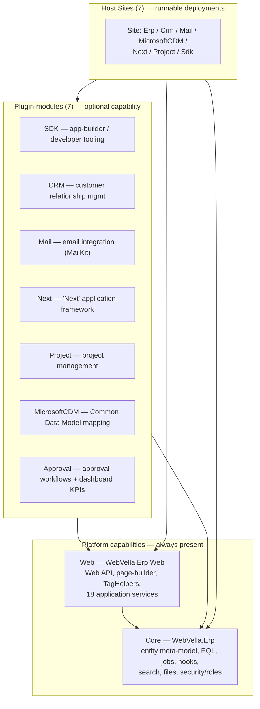

# Functional Overview — WebVella ERP

> **Deliverable 4 of 7** · Reverse-Engineering Documentation Suite
> **Generated (UTC):** 2026-06-05 18:31 UTC
> **Analysis mode:** Read-only static inspection of the `WebVella.ERP3.sln` solution. **No production code, configuration, or schema artifact was modified.**
> **Companion deliverables:** [`code-inventory.md`](./code-inventory.md) · [`architecture.md`](./architecture.md) · [`database-schema.md`](./database-schema.md) · [`business-rules.md`](./business-rules.md) · `security-quality.md` _(forthcoming)_ · `modernization-roadmap.md` _(forthcoming)_
> **Suite index:** `README.md` _(forthcoming)_

---

## Executive Summary

**WebVella ERP is a customizable, metadata-driven, plugin-driven ERP platform.** Rather than shipping a fixed set of business screens, it provides a *dynamic entity/record platform* — a meta-model in which entities, fields, and relations are defined as data — and then delivers concrete ERP functionality **primarily through plugins** that seed that platform with entities, pages, components, services, and controllers at startup.

Functionally, the system is organized into three tiers:

1. **Platform capabilities** supplied by the **Core** library (`WebVella.Erp`) and the **Web** application (`WebVella.Erp.Web`): the dynamic entity meta-model, the EQL query language, the page-builder render pipeline, background jobs, full-text search, file storage, the system log, and the security/roles model. These are the always-present foundations.
2. **Seven optional plugin-modules** (`SDK`, `CRM`, `Mail`, `Next`, `Project`, `MicrosoftCDM`, `Approval`) layered over the platform through the plugin-extensibility model. Each derives from the `ErpPlugin` base class and is registered with the host via `app.UseErpPlugin<T>()`.
3. **Seven runnable host Sites** (`WebVella.Erp.Site*`) that compose Core + Web + a chosen set of plugins and supply runtime configuration.

The platform runs on **ASP.NET Core 9** over **PostgreSQL 16**; the Core library `WebVella.Erp` is versioned **1.7.4** (`WebVella.Erp/WebVella.Erp.csproj`). Of the 20 projects, 18 target `net9.0`; the two Blazor WebAssembly `Server`/`Shared` projects target the out-of-support `net7.0`.

This document catalogs the seven plugin-modules (each cited to its project and main class), enumerates the platform capabilities and maps them to the existing `docs/developer/**` topic taxonomy (for cross-check consistency only), derives representative **workflows** from the 18 Web service classes plus the Approval plugin's read-only dashboard/KPI model, and documents the **user roles** seeded by the security model. Every claim resolves to a real file, class, or method, and module names are kept identical to the shared taxonomy established in [`code-inventory.md`](./code-inventory.md) and [`architecture.md`](./architecture.md).

Four "what-exists" characteristics are honored throughout this suite and are relevant to the functional picture:

1. **Custom Npgsql data layer, not Entity Framework Core.** Persistence is hand-written, parameterized SQL through **Npgsql** (`WebVella.Erp/Database/DbRecordRepository.cs`), with records materialized from PostgreSQL JSON.
2. **Razor Pages + ERP TagHelpers + Blazor WebAssembly + plain JavaScript UI**, *not* Angular/React/TypeScript — there are **0** `.ts` files in the repository.
3. **Code-embedded DDL + date-versioned plugin patch methods**, not an EF Core `Migrations/` folder (there are no `.sql` files anywhere).
4. **No Docker.** Deployment is plain ASP.NET Core host sites designed for IIS in-process hosting.

> This is a factual description of the system **as built**. It contains **no** time or effort estimates; forward-looking guidance lives only in `modernization-roadmap.md` (a forthcoming deliverable).

---

## Table of Contents

1. [Functional Composition at a Glance](#1-functional-composition-at-a-glance)
2. [ERP Module Catalog — The Seven Plugins](#2-erp-module-catalog--the-seven-plugins)
3. [Platform Capabilities (Core + Web)](#3-platform-capabilities-core--web)
4. [Functional Workflows](#4-functional-workflows)
5. [User Roles & Security Model](#5-user-roles--security-model)
6. [Cross-Document Consistency Contracts](#6-cross-document-consistency-contracts)
7. [Source Citation Index](#7-source-citation-index)

---

## 1. Functional Composition at a Glance

The functional surface of WebVella ERP is the sum of the **platform** (Core + Web), the **plugin-modules** that extend it, and the **host sites** that package selected plugins for deployment. The map below shows how capability flows from the platform outward to the plugins and how host sites assemble them.


```mermaid
flowchart TB
    subgraph PLATFORM["Platform capabilities — always present"]
        CORE["Core — WebVella.Erp<br/>entity meta-model, EQL, jobs, hooks,<br/>search, files, security/roles"]
        WEB["Web — WebVella.Erp.Web<br/>Web API, page-builder, TagHelpers,<br/>18 application services"]
    end

    subgraph PLUGINS["Plugin-modules (7) — optional capability"]
        P_SDK["SDK — app-builder / developer tooling"]
        P_CRM["CRM — customer relationship mgmt"]
        P_MAIL["Mail — email integration (MailKit)"]
        P_NEXT["Next — 'Next' application framework"]
        P_PROJ["Project — project management"]
        P_CDM["MicrosoftCDM — Common Data Model mapping"]
        P_APPR["Approval — approval workflows + dashboard KPIs"]
    end

    subgraph SITES["Host Sites (7) — runnable deployments"]
        S["Site: Erp / Crm / Mail / MicrosoftCDM /<br/>Next / Project / Sdk"]
    end

    WEB --> CORE
    PLUGINS --> WEB
    PLUGINS --> CORE
    SITES --> PLUGINS
    SITES --> WEB
    SITES --> CORE
```

### 1.1 Shared module taxonomy

This suite uses one **canonical taxonomy** of **18 logical modules**, defined authoritatively in [`code-inventory.md`](./code-inventory.md) §2 and reused here verbatim. The functional roles below describe *what each module does* for the user; structural file/LOC detail lives in the inventory.

| Taxonomy label | Project / path root | Functional role |
|----------------|---------------------|-----------------|
| `Core (WebVella.Erp)` | `WebVella.Erp/` | Platform engine: entity meta-model, data layer, EQL, jobs, hooks, search, security |
| `Web (WebVella.Erp.Web)` | `WebVella.Erp.Web/` | Web app: Web API, page-builder rendering, TagHelpers, application services |
| `WebAssembly` | `WebVella.Erp.WebAssembly/` | Blazor WebAssembly Client / Server / Shared interactive surfaces |
| `ConsoleApp` | `WebVella.Erp.ConsoleApp/` | Console bootstrap & sample record-hook harness |
| `Plugin: Approval` | `WebVella.Erp.Plugins.Approval/` | Approval dashboard & KPI metrics (read-only over `approval_request`/`approval_history`) |
| `Plugin: Crm` | `WebVella.Erp.Plugins.Crm/` | Customer/relationship management entities & pages |
| `Plugin: Mail` | `WebVella.Erp.Plugins.Mail/` | Email send/receive (SMTP/IMAP) integration |
| `Plugin: MicrosoftCDM` | `WebVella.Erp.Plugins.MicrosoftCDM/` | Microsoft Common Data Model mapping |
| `Plugin: Next` | `WebVella.Erp.Plugins.Next/` | "Next" application framework & shared components |
| `Plugin: Project` | `WebVella.Erp.Plugins.Project/` | Project-management module |
| `Plugin: SDK` | `WebVella.Erp.Plugins.SDK/` | App-builder / developer SDK & admin tooling |
| `Site: Erp` | `WebVella.Erp.Site/` | Reference host site (registers SDK) |
| `Site: Crm` | `WebVella.Erp.Site.Crm/` | CRM-configured host (Crm, Next, SDK) |
| `Site: Mail` | `WebVella.Erp.Site.Mail/` | Mail-configured host (Mail, Next, SDK) |
| `Site: MicrosoftCDM` | `WebVella.Erp.Site.MicrosoftCDM/` | CDM-configured host (MicrosoftCDM, SDK) |
| `Site: Next` | `WebVella.Erp.Site.Next/` | Next-configured host (Next) |
| `Site: Project` | `WebVella.Erp.Site.Project/` | Project-configured host (Next, Project, SDK) |
| `Site: Sdk` | `WebVella.Erp.Site.Sdk/` | SDK-configured host (Next, SDK) |

> The plugins are referred to in prose as **SDK, CRM, Mail, Next, Project, MicrosoftCDM, Approval** — the same names used in [`architecture.md`](./architecture.md) §1.2 and the component diagram.

---

## 2. ERP Module Catalog — The Seven Plugins

Every ERP capability beyond the bare platform is delivered by a **plugin**. A plugin is a class that derives from the abstract base `ErpPlugin` (`WebVella.Erp/ErpPlugin.cs`); it is added to the running `IErpService` through the `app.UseErpPlugin<T>()` extension and may contribute entities, pages, page components, controllers, services, and schema patches. At startup, `ERPService.InitializePlugins(...)` (`WebVella.Erp/ERPService.cs:891`) drives each registered plugin's initialization.

**Bootstrapping pattern.** Each plugin's `Initialize(IServiceProvider)` opens a system security scope (`SecurityContext.OpenSystemScope()`) and, for plugins that own schema, calls a `ProcessPatches()` method that in turn invokes **date-versioned patch methods** named `Patch<YYYYMMDD>` declared in `<Plugin>.YYYYMMDD.cs` files. Patch coverage differs by plugin and is documented precisely below (and reconciled with [`code-inventory.md`](./code-inventory.md) §2.5 and [`database-schema.md`](./database-schema.md) §7.3):

- **`Mail`, `Next`, `Project`, and `SDK`** ship dated `<Plugin>.YYYYMMDD.cs` patch files (**25** in total) that seed and evolve their module entities.
- **`Crm` and `MicrosoftCDM`** declare a `ProcessPatches()` **shell** whose single `Patch20190123` call is **commented out** — they ship **no** dated patch file.
- **`Approval`** defines **no** `ProcessPatches()` at all; it is a newer plugin built around a page component, a controller, and a service.

| Plugin module | Project | Main class / entry point | Bootstrapping | Notable assets |
|---------------|---------|--------------------------|---------------|----------------|
| **CRM** | `WebVella.Erp.Plugins.Crm/` | `CrmPlugin` (`CrmPlugin.cs`) | `Initialize()` → `ProcessPatches()` *(shell; `Patch20190123` commented out)* | `Model/PluginSettings.cs` |
| **Project** | `WebVella.Erp.Plugins.Project/` | `ProjectPlugin` (`ProjectPlugin.cs`) | `Initialize()` → `ProcessPatches()` + `SetSchedulePlans()`; **8** dated patches | 56 `.cshtml`, 65 `.js`; `StartTasksOnStartDate` job |
| **Mail** | `WebVella.Erp.Plugins.Mail/` | `MailPlugin` (`MailPlugin.cs`) | `Initialize()` → `ProcessPatches()` + `SetSchedulePlans()`; **7** dated patches | `MailKit` SMTP/IMAP services; AutoMapper config |
| **Next** | `WebVella.Erp.Plugins.Next/` | `NextPlugin` (`NextPlugin.cs`) | `Initialize()` → `ProcessPatches()`; **5** dated patches | `Configuration.cs`; large shared component library |
| **MicrosoftCDM** | `WebVella.Erp.Plugins.MicrosoftCDM/` | `MicrosoftCDMPlugin` (`MicrosoftCDMPlugin.cs`) | `Initialize()` → `ProcessPatches()` *(shell; `Patch20190123` commented out)* | CDM entity mapping |
| **SDK** | `WebVella.Erp.Plugins.SDK/` | `SdkPlugin` (`SdkPlugin.cs`) | `Initialize()` → `SetSchedulePlans()` + `ProcessPatches()`; **5** dated patches | 54 `.cshtml`, 42 `.js` (app-builder UI); log-cleanup job |
| **Approval** | `WebVella.Erp.Plugins.Approval/` | `PcApprovalDashboard` component + `ApprovalController` | *No* `ProcessPatches()` (component/controller/service pattern) | `Services/DashboardMetricsService.cs`, `Api/DashboardMetricsModel.cs` |

### 2.1 CRM — `WebVella.Erp.Plugins.Crm`

**Purpose.** Customer- and relationship-management capability. The CRM module contributes the customer/relationship entities and pages that turn the generic record platform into a CRM surface.

**Main class.** `public partial class CrmPlugin : ErpPlugin` (`WebVella.Erp.Plugins.Crm/CrmPlugin.cs`), with `Name = "crm"`. Its `Initialize(IServiceProvider)` opens a system scope and calls `ProcessPatches()`.

**Bootstrapping.** `ProcessPatches()` is declared at `WebVella.Erp.Plugins.Crm/CrmPlugin._.cs:15`, but its `Patch20190123(...)` invocation is **commented out** (`CrmPlugin._.cs:66`). CRM therefore carries the patch *scaffold* without shipping a dated patch file — a fidelity point matched in [`code-inventory.md`](./code-inventory.md) §2.5.

### 2.2 Project — `WebVella.Erp.Plugins.Project`

**Purpose.** Project management — projects, tasks, and related scheduling. This is the largest plugin by UI footprint (56 `.cshtml`, 65 `.js`).

**Main class.** `public partial class ProjectPlugin : ErpPlugin` (`WebVella.Erp.Plugins.Project/ProjectPlugin.cs`), `Name = "project"`. `Initialize(IServiceProvider)` calls `ProcessPatches()` followed by `SetSchedulePlans()`.

**Bootstrapping.** `ProcessPatches()` runs **8** date-versioned patches (`ProjectPlugin.20190203.cs` … `ProjectPlugin.20211013.cs`). `SetSchedulePlans()` registers a **daily** schedule plan, *"Start tasks on start_date"*, that drives the `StartTasksOnStartDate` background job (the plugin also ships under `WebVella.Erp.Plugins.Project.Jobs`).

### 2.3 Mail — `WebVella.Erp.Plugins.Mail`

**Purpose.** Email integration — outbound SMTP sending and inbound processing — built on the **MailKit** library.

**Main class.** `public partial class MailPlugin : ErpPlugin` (`WebVella.Erp.Plugins.Mail/MailPlugin.cs`), `Name = "mail"`. `Initialize(IServiceProvider)` calls `ProcessPatches()` then `SetSchedulePlans()`, and the plugin overrides `SetAutoMapperConfiguration(...)` to register `MailPluginAutoMapperConfiguration`.

**Bootstrapping.** `ProcessPatches()` runs **7** dated patches (`MailPlugin.20190215.cs` … `MailPlugin.20200611.cs`). `SetSchedulePlans()` registers an **interval** schedule plan, *"Start tasks to process SMTP email queue"*, that fires every **10 minutes** to drain the outbound SMTP queue (job type referenced under `WebVella.Erp.Plugins.Mail.Jobs`).

### 2.4 Next — `WebVella.Erp.Plugins.Next`

**Purpose.** The **"Next"** application framework — a shared UI/application experience and a sizable shared component library that other modules and host sites build upon.

**Main class.** `public partial class NextPlugin : ErpPlugin` (`WebVella.Erp.Plugins.Next/NextPlugin.cs`), `Name = "next"`. `Initialize(IServiceProvider)` calls `ProcessPatches()`.

**Bootstrapping.** `ProcessPatches()` runs **5** dated patches (`NextPlugin.20190203.cs` … `NextPlugin.20190222.cs`). The plugin also ships a `Configuration.cs` and is referenced by most host sites (Crm, Mail, Project, Sdk) as a shared dependency.

### 2.5 MicrosoftCDM — `WebVella.Erp.Plugins.MicrosoftCDM`

**Purpose.** Mapping to the **Microsoft Common Data Model** — aligning ERP entities with CDM entity definitions.

**Main class.** `public partial class MicrosoftCDMPlugin : ErpPlugin` (`WebVella.Erp.Plugins.MicrosoftCDM/MicrosoftCDMPlugin.cs`), `Name = "MicrosoftCDMPlugin"`. `Initialize(IServiceProvider)` opens a system scope and calls `ProcessPatches()`.

**Bootstrapping.** As with CRM, `ProcessPatches()` is a **shell**: declared at `MicrosoftCDMPlugin._.cs:17` with its `Patch20190123(...)` call **commented out** (`MicrosoftCDMPlugin._.cs:68`). No dated patch file ships with this plugin.

### 2.6 SDK — `WebVella.Erp.Plugins.SDK`

**Purpose.** The developer **SDK** and **app-builder** — the admin/design-time tooling used to define entities, build pages from components, and generate code. It is the richest plugin by `.cs` count and supplies the visual app-builder UI (54 `.cshtml`, 42 `.js`).

**Main class.** `public partial class SdkPlugin : ErpPlugin` (`WebVella.Erp.Plugins.SDK/SdkPlugin.cs`), `Name = "sdk"`. `Initialize(IServiceProvider)` calls `SetSchedulePlans()` then `ProcessPatches()`. The reference host registers it explicitly via `app.UseErpPlugin<SdkPlugin>()` (`WebVella.Erp.Site/Startup.cs:183`).

**Bootstrapping.** `ProcessPatches()` runs **5** dated patches (`SdkPlugin.20181215.cs` … `SdkPlugin.20210429.cs`). `SetSchedulePlans()` registers a **daily** plan, *"Clear job and error logs."*, that runs the log-cleanup job; the plugin also defines `SampleJob` and `ClearJobAndErrorLogsJob` under `WebVella.Erp.Plugins.SDK.Jobs`.

### 2.7 Approval — `WebVella.Erp.Plugins.Approval`

**Purpose.** A manager **dashboard** of approval KPIs. Functionally the plugin is a **read-only metrics/KPI reader**: it queries approval data and computes dashboard metrics over it. It does **not** itself implement request submission, review, or approve/reject state transitions — no lifecycle-mutating endpoints or code exist in the plugin (see **Behavior** below).

**Entry points.** Unlike the other plugins, Approval has **no** `*Plugin.cs` entry class and **no** `ProcessPatches()`. It is structured around four pieces that together demonstrate **one** available plugin extension pattern (Component / Controller / Api / Service) — not a universal plugin shape, since plugin structure varies across the suite (see [`architecture.md`](./architecture.md) §2.4):

- a page component — `Components/PcApprovalDashboard/PcApprovalDashboard.cs`;
- a controller — `Controllers/ApprovalController.cs`;
- an API model — `Api/DashboardMetricsModel.cs`;
- a service — `Services/DashboardMetricsService.cs`.

**Behavior.** `ApprovalController` is annotated `[Authorize]` and exposes exactly two endpoints — `GET api/v3.0/p/approval/dashboard/metrics` (restricted to manager/administrator roles) and an `[AllowAnonymous]` `GET api/v3.0/p/approval/dashboard/health` probe; there are **no** submit/review/approve/reject (or other state-changing) actions. `DashboardMetricsService` issues **read-only EQL `SELECT` queries** over the `approval_request` and `approval_history` entities to compute the dashboard KPIs — it creates and mutates no records. The KPI formulas are documented in [§4.12](#412-approval-dashboard-and-kpis-plugin-approval).

---

## 3. Platform Capabilities (Core + Web)

Beneath the plugin-modules sits the always-present platform, provided by **Core** (`WebVella.Erp`) and **Web** (`WebVella.Erp.Web`). These are the capabilities every plugin and every host site depends on. The table below names each capability, points to its primary implementation, and maps it to the matching topic area in the existing `docs/developer/**` documentation (used here for **cross-check consistency only** — that directory is never modified by this suite).

| Platform capability | What it does | Primary implementation | `docs/developer/**` topic |
|---------------------|--------------|------------------------|---------------------------|
| **Dynamic entities, fields & relations** (meta-model) | User- and plugin-defined entities/fields/relations stored *as JSON records* in the `entities` / `entity_relations` tables rather than as physical tables | `WebVella.Erp/Api/**` (entity/record/relation managers); `WebVella.Erp/ERPService.cs` (`InitializeSystemEntities`) | `entities` |
| **Applications & sitemap/navigation** | Applications, sitemap areas, area groups, and nodes that organize the UI | `WebVella.Erp.Web/Services/AppService.cs`; tables `app`, `app_sitemap_area*` | `applications` |
| **Pages & page-builder** | Pages stored as a tree of body nodes; each node names a page component | `WebVella.Erp.Web/Services/PageService.cs`; tables `app_page`, `app_page_body_node` | `pages` |
| **Page components** | The ~64 `Pc*` ViewComponents that render page nodes | `WebVella.Erp.Web/Components/**`; `Services/PageComponentLibraryService.cs` | `components` |
| **Data sources (EQL + code)** | EQL queries and runtime-compiled C# data sources resolved per page/component | `WebVella.Erp/Eql/**`; `WebVella.Erp.Web/Datasource/**`; `Services/CodeEvalService.cs` | `data-sources` |
| **Hooks** | Lifecycle interception for entity/record/page events | `WebVella.Erp/Hooks/**`; `WebVella.Erp.Web/Hooks/**` | `hooks` |
| **Background jobs & scheduling** | Scheduled and queued background processing | `WebVella.Erp/Jobs/**`; tables `jobs`, `schedule_plan` | `background-jobs` |
| **Full-text search** | Cross-entity search indexing and query | `WebVella.Erp/Fts/**`; table `system_search`; `Services/AppSearchService.cs` | (search) |
| **Files & media** | Embedded-resource access and user-uploaded file management | `WebVella.Erp.Web/Services/FileService.cs`, `UserFileService.cs`; table `files` | (files) |
| **System log** | Structured error/info logging with optional notification | `WebVella.Erp.Web/Services/LogService.cs`; table `system_log` | `system-log` |
| **Tag helpers** | ERP-specific Razor TagHelpers used by page components | `WebVella.Erp.Web/TagHelpers/**`; `WebVella.TagHelpers 1.7.2` | `tag-helpers` |
| **Server & Web API** | Programmatic API (managers) and the centralized HTTP Web API | `WebVella.Erp/Api/**`; `WebVella.Erp.Web/Controllers/WebApiController.cs` | `server-api`, `web-api` |
| **Plugins** | The extensibility model that loads the seven plugin-modules | `WebVella.Erp/ErpPlugin.cs`; `app.UseErpPlugin<T>()` | `plugins` |
| **Users & roles** | Authentication identities, roles, and per-entity permissions | `WebVella.Erp/Api/SecurityContext.cs`, `Api/Models/ErpUser.cs`, `Api/Models/ErpRole.cs`; `WebVella.Erp.Web/Services/AuthService.cs`, `UserService.cs` | `users-and-roles` |

The `docs/developer/**` directory contains **14** topic areas — `applications`, `background-jobs`, `components`, `data-sources`, `entities`, `hooks`, `introduction`, `pages`, `plugins`, `server-api`, `system-log`, `tag-helpers`, `users-and-roles`, and `web-api`. The mapping above aligns the as-built capabilities with that established taxonomy so the two documentation sets stay consistent; the `introduction` topic is the developer-guide preface and has no single code owner. (Search and files are platform capabilities documented here even though they do not have a dedicated top-level developer topic folder.)

> **Data-access fidelity.** All of these capabilities read and write through the **custom Npgsql data layer** and the **EQL** query language — *not* Entity Framework Core. The end-to-end EQL → SQL path is detailed in [`architecture.md`](./architecture.md) §3, and the dual (fixed-tables + dynamic-meta-model) storage scheme is detailed in [`database-schema.md`](./database-schema.md).

---

## 4. Functional Workflows

The Web application layer concentrates its behavior in **18 application service classes** under `WebVella.Erp.Web/Services/**`. Each service encapsulates one functional concern; together they implement the platform's user-facing workflows. The subsections below describe representative workflows factually, each citing the service class (and key methods) that implement it. A complete service inventory appears in [§4.13](#413-web-service-inventory).

### 4.1 Authentication & session (`AuthService`, `UserService`)

`WebVella.Erp.Web/Services/AuthService.cs` implements credential authentication and token lifecycle. `Authenticate(string email, string password)` (`AuthService.cs:29`) resolves the user via `SecurityManager().GetUser(email, password)`, and — if the user exists and is `Enabled` — builds a claims set (`ClaimTypes.NameIdentifier` = user id, `ClaimTypes.Email`, and one `ClaimTypes.Role` per `role.Name`) and signs the user in under the **cookie** scheme (`CookieAuthenticationDefaults.AuthenticationScheme`). `Logout()` (`:57`) signs the cookie out. For API clients, the static helpers `GetTokenAsync(email, password)` (`:83`), `GetNewTokenAsync(tokenString)` (`:94`), and `GetValidSecurityTokenAsync(token)` (`:120`) issue and validate **JWT** tokens; `GetUser(ClaimsPrincipal)` (`:63`) maps a principal back to an `ErpUser`. This is the service side of the hybrid **JWT-or-Cookie** scheme described in [`architecture.md`](./architecture.md) §4.

`WebVella.Erp.Web/Services/UserService.cs` provides read access to user records over **EQL**: `GetAll()` (`UserService.cs:16`) runs `SELECT * from user`, and `Get(Guid userId)` (`:25`) runs `SELECT * from user WHERE id = @userId` with a bound `EqlParameter` — illustrating the parameterized EQL discipline used platform-wide.

### 4.2 Page composition & rendering (`PageService`, `RenderService`, `PageComponentLibraryService`)

Rendering a user-facing screen is a three-service workflow:

1. **`PageService`** (`PageService.cs`, the largest service at ~68 KB) reads the persisted page tree: `GetPage(...)` (`:64`), `GetPageBody(pageId)` (`:621`), and `GetPageNodes(pageId)` (`:670`) return the ordered body nodes (each carrying a component type name and an `options` JSON blob); `CreatePage(...)` (`:194`) and `CreatePageBodyNode(...)` (`:692`) write them.
2. **`PageComponentLibraryService`** resolves each node's component: `GetPageComponentsList()` (`:13`) enumerates available `PageComponentMeta`, and `GetComponentMeta(componentName)` (`:67`) maps a node's type name to a renderable component.
3. **`RenderService`** (`RenderService.cs`) renders content: `RenderHtmlWithTemplate(template, EntityRecord, ErpRequestContext, ErpAppContext)` (`:126`) merges a record into an HTML template, and `ConvertListToTree(...)` (`:454`) assembles menu/navigation trees.

The full page-render sequence (Razor Page → `PageService` → component `InvokeAsync` → ERP TagHelpers) is diagrammed in [`architecture.md`](./architecture.md) §5.

### 4.3 Application & navigation management (`AppService`)

`WebVella.Erp.Web/Services/AppService.cs` manages applications and their sitemap structure. It exposes the application lifecycle — `GetAllApplications(bool useCache)` (`:35`), `GetApplication(Guid id)` (`:51`) / `GetApplication(string name)` (`:74`), `CreateApplication(...)` (`:96`), `UpdateApplication(...)` (`:135`), `DeleteApplication(...)` (`:168`) — together with sitemap-area operations (`CreateArea(...)` `:277`, `UpdateArea(...)` `:313`) and cache management (`ClearAppCache(Guid appId)` `:241`, `ClearAllAppCache()` `:250`). These back the navigation/sitemap that the page-builder surfaces.

### 4.4 File & media handling (`FileService`, `UserFileService`)

Two services cover files. `FileService` (a static helper) resolves **embedded** resources and types: `GetEmbeddedTextResource(...)` (`:10`), `EmbeddedResourceExists(...)` (`:35`), `GetTypeAssembly(typeName)` (`:58`), and `GetType(typeName)` (`:75`). `UserFileService` manages **user-uploaded** files persisted via the `files` table and a storage abstraction: `GetFilesList(type, search, sort, page, pageSize)` (`:15`) lists files with paging and `CreateUserFile(path, alt, caption)` (`:51`) registers a new one.

### 4.5 Email & notification (`MailService`)

`WebVella.Erp.Web/Services/MailService.cs` sends outbound email. `SendLogMessage(LogType type, string source, string message, string details, string host)` (`:22`) composes and dispatches a message (used, for example, to notify on logged errors). Full mailbox integration (SMTP send queue, IMAP receive) is provided by the **Mail** plugin (§2.3) on top of **MailKit**.

### 4.6 Runtime code evaluation (`CodeEvalService`)

`WebVella.Erp.Web/Services/CodeEvalService.cs` (a static class) compiles and runs C# at runtime: `Evaluate(string sourceCode, BaseErpPageModel pageModel)` (`:51`). This powers code-defined data sources and dynamic page logic. Because it executes arbitrary C# on the server, it is also a **security-relevant** surface — its remote-code-execution implications are assessed in `security-quality.md` (a forthcoming deliverable; see also the `datasource/code-compile` endpoint in [`architecture.md`](./architecture.md) §3.5).

### 4.7 Search (`AppSearchService`)

`WebVella.Erp.Web/Services/AppSearchService.cs` provides application-level search over the full-text index (`system_search` table; Core `Fts/**`). It backs the search experiences surfaced by the host sites (for example the reference site's `Pages/search.cshtml`).

### 4.8 Metadata (`MetaService`)

`WebVella.Erp.Web/Services/MetaService.cs` adapts entity metadata for the UI. `GetEntitiesAsSelectOptions()` (`:12`) returns the entity set as `SelectOption`s — the kind of metadata the app-builder and page components bind dropdowns to.

### 4.9 Logging (`LogService`)

`WebVella.Erp.Web/Services/LogService.cs` writes structured entries to the `system_log` table. Its overloaded `Create(...)` methods (`:18`, `:41`, `:64`) accept a `LogType`, a source, and either a message+details or an `Exception` (plus optional `HttpRequest` and notification status). The global error-handling middleware logs through this service (`ErpErrorHandlingMiddleware` → `LogService.Create(LogType.Error, "Global", ex, request)`; see [`architecture.md`](./architecture.md) §6.1).

### 4.10 Theming (`ThemeService`)

`WebVella.Erp.Web/Services/ThemeService.cs` produces the runtime CSS. `Get()` (`:14`) loads the active `Theme`; `GenerateStyleFrameworkContent()` (`:27`) and `GenerateStylesContent()` (`:36`) emit framework and theme stylesheets; `ApplyThemeSettingsToString(input)` (`:45`) substitutes theme variables into a template.

### 4.11 User preferences & settings (`UserPreferencies`, `WebSettingsService`, `SnippetService`, `BaseService`)

`UserPreferencies` persists per-user UI state: `SetSidebarSize(userId, size)` (`:14`), `SdkUseComponent(userId, componentFullName)` (`:31`), and the component-data trio `GetComponentData(...)` (`:67`) / `SetComponentData(...)` (`:86`) / `RemoveComponentData(...)` (`:106`). `WebSettingsService.Get()` (`:9`) returns global web settings; `SnippetService` (an internal static cache) exposes reusable snippets via `GetSnippet(name)` (`:36`). All record-backed services derive from `BaseService` (`BaseService.cs`), whose constructor accepts a `DbContext` (`:14`) so they share the per-request Npgsql connection scope.

### 4.12 Approval dashboard and KPIs (`Plugin: Approval`)

The Approval plugin provides a manager **dashboard** that **reads** approval data and computes KPIs over it. It does **not** implement a submit/review/approve-reject lifecycle: the plugin contains no request-mutating endpoints or state-transition code (its controller exposes only the metrics and health endpoints — see §2.7 and [`code-inventory.md`](./code-inventory.md)). Its read queries reference two **dynamic, EQL-referenced entities**: `approval_request` (the `SELECT`s filter on a `status` of `pending`, `approved`, or `rejected` and read `created_on` / `completed_on`) and `approval_history` (read as an activity feed of `action`, `performed_by`, `performed_on`, `request_id`). These names appear only inside the plugin's EQL `SELECT` statements; they are **not** part of the fixed bootstrap schema (see the schema-consistency note in §6, and the conceptual dynamic-entity pattern in [`database-schema.md`](./database-schema.md) §6.1).

**API surface (`Controllers/ApprovalController.cs`).** The controller is `[Authorize]`. `GetDashboardMetrics([FromQuery] DateTime? from, DateTime? to)` is mapped to `GET api/v3.0/p/approval/dashboard/metrics`; it requires a manager-class role (it validates the caller against the `{ "manager", "administrator", "admin" }` allow-list before returning data), defaults the window to the last 30 days when no dates are supplied, validates that `from <= to`, and returns a `ResponseModel` wrapping a `DashboardMetricsModel`. `GetDashboardHealth()` is mapped to `GET api/v3.0/p/approval/dashboard/health` and is `[AllowAnonymous]`.

**Metrics computation (`Services/DashboardMetricsService.cs`).** `GetDashboardMetrics(userId, fromDate, toDate)` composes five KPIs, each derived from an EQL query over the approval entities:

| KPI | Method | Definition (as implemented) |
|-----|--------|-----------------------------|
| Pending approvals | `GetPendingApprovalsCount(userId)` | Count of `approval_request` where `status = 'pending'` |
| Overdue requests | `GetOverdueRequestsCount(userId)` | Pending requests whose `created_on + 24h` (default timeout) is earlier than now |
| Average approval time | `GetAverageApprovalTime(from, to)` | Mean of `completed_on − created_on` (hours) for approved/rejected requests in range, rounded to 2 dp |
| Approval rate | `GetApprovalRate(from, to)` | `approved ÷ total processed × 100` for the range, rounded to 1 dp |
| Recent activity | `GetRecentActivity(limit)` | Latest `approval_history` rows, `ORDER BY performed_on DESC LIMIT @limit` |

The calculation KPIs (average approval time and approval rate) are also catalogued in [`business-rules.md`](./business-rules.md) under the *Calculation* category.

### 4.13 Web service inventory

All 18 services under `WebVella.Erp.Web/Services/**`, with their functional concern:

| Service class | Concern |
|---------------|---------|
| `AuthService` | Authentication; cookie sign-in; JWT token issue/validate |
| `UserService` | User record read access via EQL |
| `PageService` | Page-tree CRUD (pages, body nodes) |
| `RenderService` | Template/HTML rendering, menu-tree assembly |
| `PageComponentLibraryService` | Page-component registry & metadata lookup |
| `AppService` | Applications & sitemap-area lifecycle, app cache |
| `AppSearchService` | Application-level full-text search |
| `MetaService` | Entity metadata adapters (select options) |
| `FileService` | Embedded-resource & type/assembly resolution |
| `UserFileService` | User-uploaded file management |
| `MailService` | Outbound email (log/notification messages) |
| `CodeEvalService` | Runtime C# compilation/evaluation |
| `LogService` | System-log writes (info/error, exceptions) |
| `ThemeService` | Theme loading & CSS generation |
| `UserPreferencies` | Per-user UI preferences & component data |
| `WebSettingsService` | Global web settings |
| `SnippetService` | Reusable snippet cache |
| `BaseService` | Shared base (per-request `DbContext` scope) |

---

## 5. User Roles & Security Model

WebVella ERP's authorization is **role-based**, with per-entity permissions. Roles, the user/role relation, and the seed identities are defined in the Core security model and created during system initialization.

### 5.1 Seeded roles

The fixed role identifiers are declared as well-known GUIDs in `WebVella.Erp/Api/Definitions.cs` (`class SystemIds`), and the corresponding role **records** are created during `ERPService.InitializeSystemEntities()` (`WebVella.Erp/ERPService.cs`). Three roles are seeded:

| Role | Name (seeded) | Identifier (`SystemIds`) | Seed site |
|------|---------------|--------------------------|-----------|
| Administrator | `administrator` | `AdministratorRoleId` = `BDC56420-CAF0-4030-8A0E-D264938E0CDA` | `ERPService.cs:481` |
| Regular | `regular` | `RegularRoleId` = `F16EC6DB-626D-4C27-8DE0-3E7CE542C55F` | `ERPService.cs:492` |
| Guest | `guest` | `GuestRoleId` = `987148B1-AFA8-4B33-8616-55861E5FD065` | `ERPService.cs:503` |

A role record is an `ErpRole` (`WebVella.Erp/Api/Models/ErpRole.cs`) with `Id`, `Name`, and `Description`.

### 5.2 Seeded identities

Two well-known users are established:

- **System user** — `SystemIds.SystemUserId` = `10000000-0000-0000-0000-000000000000`. Constructed statically in `WebVella.Erp/Api/SecurityContext.cs` with `Username = "system"`, `Email = "system@webvella.com"`, `Enabled = true`, and the **administrator** role attached. The system user has **unlimited** permissions (see §5.4) and is the identity under which plugin patches run (`SecurityContext.OpenSystemScope()`).
- **First user** — `SystemIds.FirstUserId` = `EABD66FD-8DE1-4D79-9674-447EE89921C2`. Created as a record in `ERPService.cs:463` with `username = "administrator"`, `email = "erp@webvella.com"`, and `enabled = true`.

The seed also wires the **user ↔ role** many-to-many relation (`SystemIds.UserRoleRelationId`): the system user is linked to the administrator role (`ERPService.cs:512`), and the first user is linked to **both** the administrator and the regular roles (`ERPService.cs:518`, `:523`).

### 5.3 User & role model

The authenticated principal is represented by `ErpUser` (`WebVella.Erp/Api/Models/ErpUser.cs`):

- Identity & profile: `Id`, `Username`, `Email`, `FirstName`, `LastName`, `Image`, `CreatedOn`, `LastLoggedIn`.
- Account state: `Enabled` and `Verified` (both default to `true`).
- Security: `Password` is marked `[JsonIgnore]` so it never serializes into API payloads; `Roles` is a `List<ErpRole>`; and the computed `IsAdmin` returns `true` when any attached role is the administrator role (`Roles.Any(x => x.Id == SystemIds.AdministratorRoleId)`).
- Preferences: an `ErpUserPreferences` object (backing the `UserPreferencies` service in §4.11).

### 5.4 Permission enforcement

Authorization is centralized in `WebVella.Erp/Api/SecurityContext.cs`:

- **Role checks.** `IsUserInRole(params ErpRole[] roles)` / `IsUserInRole(params Guid[] roles)` return `true` when the current user holds any of the supplied roles.
- **Entity permissions.** `HasEntityPermission(EntityPermission permission, Entity entity, ErpUser user = null)` evaluates the four-way permission enum `EntityPermission { Read, Create, Update, Delete }` (declared in `WebVella.Erp/Api/Definitions.cs`) against the entity's `RecordPermissions` allow-lists — `CanRead`, `CanCreate`, `CanUpdate`, `CanDelete` — each of which is a set of role IDs. The **system user is exempt** and always returns `true`.

This is the same permission check enforced during query materialization: EQL read results are filtered by `SecurityContext.HasEntityPermission(EntityPermission.Read, entity)` (see [`architecture.md`](./architecture.md) §3.4). The system entities seeded in `ERPService.cs` set their `RecordPermissions` accordingly — for example, the `user` and `role` entities grant `CanRead` to administrator/regular/guest but restrict `CanUpdate` / `CanDelete` to administrator (`ERPService.cs:77–83`, `:363–369`).

### 5.5 Plugin authorization allow-lists

Beyond the seeded roles, plugins may enforce their own role allow-lists at the controller layer. The **Approval** plugin is the representative example: `ApprovalController` is `[Authorize]`, and its dashboard endpoint additionally restricts access to a manager-class allow-list:

```text
AuthorizedDashboardRoles = { "manager", "administrator", "admin" }
```

The controller reads the caller's roles from the `ClaimTypes.Role` claims (lower-cased) and admits the request only if one matches the allow-list. The role names used here are reconciled with the **Authorization** category of [`business-rules.md`](./business-rules.md): `administrator` is the canonical seeded role; `manager` and `admin` are plugin-level role labels expected on the principal's claims.

> **Authentication mechanics** (cookie vs. JWT bearer, the `JWT_OR_COOKIE` policy selector, and the `JwtMiddleware` → `SecurityContext` bridge) are documented in [`architecture.md`](./architecture.md) §4; this section covers the *roles and permissions* those mechanics authorize against.

---

## 6. Cross-Document Consistency Contracts

This deliverable upholds the suite-wide consistency contracts defined in [`code-inventory.md`](./code-inventory.md) §6 and mirrored in [`architecture.md`](./architecture.md) §8:

- **Module taxonomy.** The module names used here — Core (`WebVella.Erp`), Web (`WebVella.Erp.Web`), WebAssembly, ConsoleApp, the 7 Plugins (`SDK`, `CRM`, `Mail`, `Next`, `Project`, `MicrosoftCDM`, `Approval`), and the 7 Sites (`WebVella.Erp.Site*`) — are **identical** to the canonical taxonomy in [`code-inventory.md`](./code-inventory.md) §2 and the component names in [`architecture.md`](./architecture.md).
- **File paths.** Every file path cited here is catalogued in [`code-inventory.md`](./code-inventory.md) / [`code-inventory.csv`](./code-inventory.csv); citations resolve to real files (e.g., `WebVella.Erp.Plugins.Crm/CrmPlugin.cs`, `WebVella.Erp.Web/Services/AuthService.cs`, `WebVella.Erp/Api/SecurityContext.cs`).
- **Schema names.** The **fixed system tables** referenced here (`app_page`, `app_page_body_node`, `jobs`, `schedule_plan`, `system_search`, `system_log`, `files`, `entities`, `entity_relations`) match the per-table dictionary in [`database-schema.md`](./database-schema.md) §4 and the rows of [`data-dictionary.csv`](./data-dictionary.csv). The Approval entity names (`approval_request`, `approval_history`) are **dynamic, EQL-referenced entities** — they appear only in the Approval plugin's EQL `SELECT` statements and are **not** fixed bootstrap tables, so they are intentionally **not** enumerated in [`database-schema.md`](./database-schema.md) / [`data-dictionary.csv`](./data-dictionary.csv) (which catalog the 17 fixed tables); they follow the conceptual dynamic `rec_<entity_name>` record-table pattern documented in [`database-schema.md`](./database-schema.md) §6.1.
- **Patch lifecycle.** The per-plugin patch facts here (Mail/Next/Project/SDK ship 25 dated patches; Crm/MicrosoftCDM carry a commented-out `Patch20190123` shell; Approval has no `ProcessPatches()`) match [`code-inventory.md`](./code-inventory.md) §2.5, [`architecture.md`](./architecture.md) §2.4, and the patch/version history in [`database-schema.md`](./database-schema.md) §7.3.
- **Rule reconciliation.** The role allow-lists and KPI calculations described here feed the **Authorization** and **Calculation** categories of [`business-rules.md`](./business-rules.md).

### 6.1 Suite navigation

| # | Document | Contents |
|---|----------|----------|
| 1 | [`code-inventory.md`](./code-inventory.md) + [`code-inventory.csv`](./code-inventory.csv) | Module taxonomy, file/LOC tables, dependency tree |
| 2 | [`architecture.md`](./architecture.md) | Layered + plugin model, EQL→SQL path, auth flow, page-builder lifecycle |
| 3 | [`database-schema.md`](./database-schema.md) + [`data-dictionary.csv`](./data-dictionary.csv) | Schema from embedded DDL + patches; ERD |
| 4 | **`functional-overview.md`** *(this file)* | Module catalog, platform capabilities, workflows, user roles |
| 5 | [`business-rules.md`](./business-rules.md) | Catalogued business rules with citations |
| 6 | `security-quality.md` _(forthcoming)_ | Vulnerabilities, code metrics, CVE audit |
| 7 | `modernization-roadmap.md` _(forthcoming)_ | Current-state, target-state, 3-phase plan |
| — | `README.md` _(forthcoming)_ | Master index & executive overview |

---

## 7. Source Citation Index

Every functional claim in this document resolves to one of the following real source locations.

| Concern | File | Key symbols / lines |
|---------|------|---------------------|
| Plugin base contract | `WebVella.Erp/ErpPlugin.cs` | `ErpPlugin` (abstract base); `Initialize`, `ProcessPatches` overrides |
| Plugin registration / init | `WebVella.Erp/ERPService.cs` | `InitializePlugins` (891); `app.UseErpPlugin<T>()` |
| CRM module | `WebVella.Erp.Plugins.Crm/CrmPlugin.cs`, `CrmPlugin._.cs` | `CrmPlugin` (`Name = "crm"`); `ProcessPatches` (`._.cs:15`); commented `Patch20190123` (`._.cs:66`) |
| Project module | `WebVella.Erp.Plugins.Project/ProjectPlugin.cs` | `ProjectPlugin` (`Name = "project"`); `ProcessPatches` + `SetSchedulePlans`; 8 dated patches |
| Mail module | `WebVella.Erp.Plugins.Mail/MailPlugin.cs` | `MailPlugin` (`Name = "mail"`); `SetSchedulePlans` (SMTP queue, 10-min interval); 7 dated patches |
| Next module | `WebVella.Erp.Plugins.Next/NextPlugin.cs` | `NextPlugin` (`Name = "next"`); `ProcessPatches`; 5 dated patches; `Configuration.cs` |
| MicrosoftCDM module | `WebVella.Erp.Plugins.MicrosoftCDM/MicrosoftCDMPlugin.cs`, `MicrosoftCDMPlugin._.cs` | `MicrosoftCDMPlugin` (`Name = "MicrosoftCDMPlugin"`); `ProcessPatches` (`._.cs:17`); commented `Patch20190123` (`._.cs:68`) |
| SDK module | `WebVella.Erp.Plugins.SDK/SdkPlugin.cs` | `SdkPlugin` (`Name = "sdk"`); `SetSchedulePlans` (log cleanup); 5 dated patches; `UseErpPlugin<SdkPlugin>()` |
| Approval module | `WebVella.Erp.Plugins.Approval/**` | `Components/PcApprovalDashboard/PcApprovalDashboard.cs`, `Controllers/ApprovalController.cs`, `Api/DashboardMetricsModel.cs`, `Services/DashboardMetricsService.cs` |
| Approval API | `WebVella.Erp.Plugins.Approval/Controllers/ApprovalController.cs` | `[Authorize]`; `GetDashboardMetrics` (`api/v3.0/p/approval/dashboard/metrics`); `GetDashboardHealth` (`[AllowAnonymous]`); `AuthorizedDashboardRoles` |
| Approval KPIs | `WebVella.Erp.Plugins.Approval/Services/DashboardMetricsService.cs` | `GetDashboardMetrics`; `GetPendingApprovalsCount`, `GetOverdueRequestsCount`, `GetAverageApprovalTime`, `GetApprovalRate`, `GetRecentActivity` |
| Authentication | `WebVella.Erp.Web/Services/AuthService.cs` | `Authenticate` (29), `Logout` (57), `GetUser` (63), `GetTokenAsync` (83), `GetNewTokenAsync` (94), `GetValidSecurityTokenAsync` (120) |
| User read | `WebVella.Erp.Web/Services/UserService.cs` | `GetAll` (16), `Get` (25) — EQL `SELECT * from user` |
| Page composition | `WebVella.Erp.Web/Services/PageService.cs` | `GetPage` (64), `GetPageBody` (621), `GetPageNodes` (670), `CreatePage` (194), `CreatePageBodyNode` (692) |
| Component registry | `WebVella.Erp.Web/Services/PageComponentLibraryService.cs` | `GetPageComponentsList` (13), `GetComponentMeta` (67) |
| Rendering | `WebVella.Erp.Web/Services/RenderService.cs` | `RenderHtmlWithTemplate` (126), `ConvertListToTree` (454) |
| Applications & sitemap | `WebVella.Erp.Web/Services/AppService.cs` | `GetAllApplications` (35), `GetApplication` (51/74), `CreateApplication` (96), `UpdateApplication` (135), `DeleteApplication` (168), `CreateArea` (277) |
| Files | `WebVella.Erp.Web/Services/FileService.cs`, `UserFileService.cs` | `GetEmbeddedTextResource`, `GetType`; `GetFilesList` (15), `CreateUserFile` (51) |
| Email | `WebVella.Erp.Web/Services/MailService.cs` | `SendLogMessage` (22) |
| Code evaluation | `WebVella.Erp.Web/Services/CodeEvalService.cs` | `Evaluate` (51) |
| Metadata | `WebVella.Erp.Web/Services/MetaService.cs` | `GetEntitiesAsSelectOptions` (12) |
| Logging | `WebVella.Erp.Web/Services/LogService.cs` | `Create` overloads (18 / 41 / 64) |
| Theming | `WebVella.Erp.Web/Services/ThemeService.cs` | `Get` (14), `GenerateStylesContent` (36), `ApplyThemeSettingsToString` (45) |
| Preferences / settings | `WebVella.Erp.Web/Services/UserPreferencies.cs`, `WebSettingsService.cs`, `SnippetService.cs`, `BaseService.cs` | `SetSidebarSize` (14), `Set/GetComponentData`; `Get` (9); `GetSnippet` (36); `BaseService(DbContext)` (14) |
| Roles & identities | `WebVella.Erp/Api/Definitions.cs` | `SystemIds` (`AdministratorRoleId`, `RegularRoleId`, `GuestRoleId`, `SystemUserId`, `FirstUserId`, `UserRoleRelationId`); `enum EntityPermission { Read, Create, Update, Delete }` |
| Role/user seed | `WebVella.Erp/ERPService.cs` | first user (463); `administrator` (481), `regular` (492), `guest` (503); user↔role relations (512 / 518 / 523) |
| Security context | `WebVella.Erp/Api/SecurityContext.cs` | static system user; `IsUserInRole`; `HasEntityPermission(EntityPermission, Entity, ErpUser)` |
| User / role models | `WebVella.Erp/Api/Models/ErpUser.cs`, `Api/Models/ErpRole.cs` | `ErpUser` (`Roles`, `IsAdmin`, `Password [JsonIgnore]`); `ErpRole` (`Id`, `Name`, `Description`) |

---

*End of Deliverable 4 — Functional Overview. Generated read-only from the `WebVella.ERP3.sln` source tree; no production code, configuration, or schema was modified in producing this document.*

