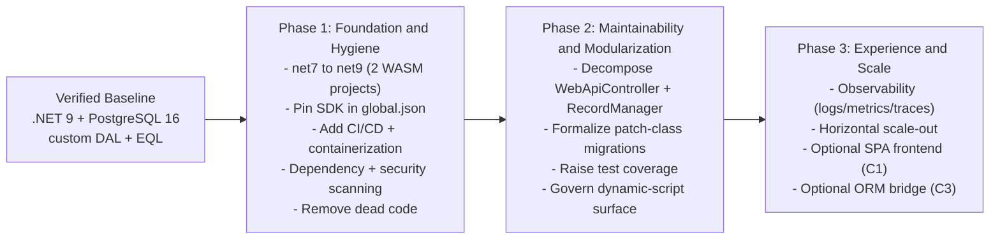

# WebVella ERP — Modernization Roadmap

> **Document 9 of the [Reverse-Engineering / As-Built Documentation Suite](./README.md).** This roadmap is the **synthesis** deliverable: it draws its current-state facts from [`code-inventory.md`](./code-inventory.md), [`architecture.md`](./architecture.md), [`database-schema.md`](./database-schema.md), and [`security-quality.md`](./security-quality.md), and proposes a forward path. It is **advisory and analysis-only** — **no production source, schema, configuration, build, or test file was modified** by this task. Every recommendation is an *option to consider*, not a change that has been made.

---

## Executive Summary

WebVella ERP is a mature, **entity-centric, plugin-driven** ERP platform that is already on a **modern runtime**: ASP.NET Core 9 over PostgreSQL 16, with a custom data-access layer (DAL) and its own Entity Query Language (EQL). Reverse-engineering the codebase at the pinned commit shows a system whose **core technology is current** — so this roadmap is deliberately **calibrated to the verified .NET 9 baseline** rather than to a generic "upgrade the framework" narrative. The biggest opportunities are not in the runtime; they are in **delivery engineering** (there is no CI/CD or containerization today), **runtime hygiene** (two projects still target the out-of-support `net7.0`, and the SDK is not pinned), and **maintainability** (a handful of very large files concentrate complexity).

The roadmap is organized as **exactly three phases**, sequenced from lowest-risk/highest-leverage to most ambitious:

| Phase | Theme | Headline outcomes |
|-------|-------|-------------------|
| **Phase 1** | **Foundation & Hygiene** | Bring the 2 `net7.0` WebAssembly projects to `net9.0`; pin a current .NET SDK in `global.json`; stand up **CI/CD and containerization** (the single largest gap); add dependency & security scanning; remove dead code. |
| **Phase 2** | **Maintainability & Modularization** | Decompose the largest files (`WebApiController.cs`, `RecordManager.cs`); formalize the date-versioned patch-class schema-migration process; raise automated-test coverage. |
| **Phase 3** | **Experience & Scale** | *Optional* SPA frontend and *optional* ORM bridge (each framed with trade-offs); add observability; enable horizontal scale-out. |

**What this roadmap is careful NOT to recommend.** Several assumptions commonly attached to a project of this kind are **contradicted by the verified codebase**; propagating them would waste effort or introduce regressions. This document therefore **does not** propose a ".NET 8 upgrade" (the platform is already on **.NET 9**), **does not** assert an Angular/React frontend exists (it is server-rendered **Razor + Blazor WASM + jQuery**), and **does not** assume Entity Framework Core or an EF `Migrations/` folder (the platform uses a **custom DAL** and **patch-class migrations**). These calibrations (C1–C5) are summarized below and govern every recommendation that follows.

---

## Generation Metadata

| Field | Value |
|-------|-------|
| **Documentation Generated** | 2026-06-05 15:15 UTC |
| **Source commit** | `bfe15661c7f0c1dae57288d789b854186793b157` |
| **Branch** | `master` |
| **Solution** | `WebVella.ERP3.sln` (20 projects) |
| **Document role** | Modernization roadmap (synthesis of the suite) |
| **Inputs synthesized** | [`code-inventory.md`](./code-inventory.md), [`architecture.md`](./architecture.md), [`database-schema.md`](./database-schema.md), [`security-quality.md`](./security-quality.md) |
| **Citation convention** | Inline `path:line` (e.g., `WebVella.Erp/Api/RecordManager.cs:15`) or `path` for whole-file references |
| **Mandate** | **Analysis-only** — advisory recommendations; **no code, schema, config, build, or test file was modified** |
| **Render target** | GitHub-Flavored Markdown (GFM) + Mermaid — renders natively on GitHub with no build step |

> **Reproducibility.** The timestamp and commit pin this roadmap to an exact repository state, identical to the rest of the suite. All current-state claims below cite a `path:line` (or `path`) at that commit so any reader can independently verify them.

---

## Roadmap Calibration — Requirement vs. Reality (C1–C5)

The corrections below are inherited verbatim from the suite's [master index](./README.md#requirement-vs-reality-corrections-c1c5) and restated here only to make the roadmap's framing explicit. **Each correction changes what a responsible roadmap should propose.**

| ID | Common Assumption | Verified Reality (with citation) | Roadmap Framing |
|----|-------------------|----------------------------------|------------------|
| **C1** | Frontend is Angular and/or React | Server-rendered **Razor** `.cshtml` + **Blazor WASM** `.razor` + **jQuery/Bootstrap 4/StencilJs**; **no** `package.json` (root `README.md:18`) | A SPA migration is an **OPTIONAL** Phase-3 item, framed as a *choice with trade-offs* — **not** a stated current fact |
| **C2** | Target a ".NET 8" upgrade | Already on **.NET 9** — **18 of 20** projects target `net9.0`; the 2 exceptions are `net7.0` (`WebVella.Erp.WebAssembly/Server/WebVella.Erp.WebAssembly.Server.csproj:4`, `WebVella.Erp.WebAssembly/Shared/WebVella.Erp.WebAssembly.Shared.csproj:4`) | **No ".NET 8 upgrade."** Calibrate to the **.NET 9 baseline**; the real runtime work is **`net7.0` → `net9.0`** for the 2 WASM projects |
| **C3** | Uses Entity Framework Core (or another ORM) | Custom **`Db*` DAL** over **Npgsql 9.0.4** (`WebVella.Erp/Database/`); **no EF Core** | EF/ORM adoption is an **OPTIONAL** Phase-3 consideration; the custom **EQL** engine + **meta-model** would need bridging |
| **C4** | Schema migrations live in a `Migrations/` folder | **No** EF `Migrations/` folder; schema evolves via **25 date-versioned plugin partial classes** (patch-class migrations) | A formal migration framework is an **OPTIONAL** improvement; Phase 2 formalizes the *existing* patch-class process first |
| **C5** | Docker containerization / CI pipelines exist | **None present** — `.github/` holds only `FUNDING.yml`; no Dockerfile/compose; packaging via `create-nuget-pkgs.bat`; **IIS InProcess** hosting (`WebVella.Erp.Site/web.config:7`) | **Containerization + CI/CD are the headline opportunities** — front-loaded into **Phase 1** |

---

## 1. Current-State Assessment

This section synthesizes the verified baseline and the principal hotspots/gaps. It **references** the detailed findings in the sibling documents rather than restating them — see [`security-quality.md`](./security-quality.md), [`architecture.md`](./architecture.md), and [`code-inventory.md`](./code-inventory.md) for the underlying analysis.

### 1.1 Verified Technology Baseline

Every value below was confirmed against the codebase at commit `bfe15661`; figures are consistent with the suite's [Verified Technology Baseline](./README.md#verified-technology-baseline).

| Aspect | Verified Finding | Primary Evidence |
|--------|------------------|------------------|
| **Runtime** | ASP.NET Core 9 / .NET 9 — **18 of 20** projects target `net9.0`; **2** target `net7.0` | root `README.md:18`; `*.csproj` `<TargetFramework>` |
| **Database** | PostgreSQL 16, via a **custom `Db*` DAL** over **Npgsql 9.0.4** — **no EF Core** | root `README.md:18`; `WebVella.Erp/Database/`, `WebVella.Erp/WebVella.Erp.csproj:61` |
| **Query engine** | Custom **Entity Query Language (EQL)**, parsed with **Irony.NetCore 1.1.11** | `WebVella.Erp/Eql/`, `WebVella.Erp/Api/RecordManager.cs:15` |
| **Frontend** | Server-rendered **Razor** + **Blazor WASM** + **jQuery/Bootstrap 4/StencilJs**; **no** `package.json` | root `README.md:18`; `WebVella.Erp.Web/wwwroot/` |
| **Hosting** | ASP.NET Core; **IIS InProcess**; **tested only on Windows** | root `README.md:18`; `WebVella.Erp.Site/web.config:7` |
| **Auth model** | Hybrid **cookie + JWT bearer**, wired per Site host | `WebVella.Erp.Site/Startup.cs` |
| **Schema evolution** | **Patch-class migrations** — 25 date-versioned plugin partial classes; **no** EF `Migrations/` | e.g. `WebVella.Erp.Plugins.Mail/MailPlugin.20190419.cs` |
| **Containerization / CI** | **Not present** — no Dockerfile/compose, no `.github/workflows`; packaging via `create-nuget-pkgs.bat` | `.github/FUNDING.yml` (only file under `.github/`, no `workflows/`); `create-nuget-pkgs.bat:1` |
| **SDK pin** | `global.json` exists but its `sdk.version` is **commented out** — no SDK is pinned | `global.json:3` |
| **Source size** | ~**703** `.cs`, ~**400** `.cshtml`, ~**11** `.razor`, ~**181** `.js` → ~**1,295** primary files across **20** modules | full source tree; see [`code-inventory.csv`](./code-inventory.csv) |

### 1.2 Strengths to Preserve

These are deliberate design choices that the roadmap **builds on rather than replaces**:

- **Current core runtime.** The platform already runs on **.NET 9 / ASP.NET Core 9** (root `README.md:18`) — there is no framework-version emergency, which is why this roadmap targets *delivery* and *maintainability* rather than a runtime rewrite.
- **Extensible plugin architecture.** Seven first-party **plugins** (Approval, Crm, Mail, MicrosoftCDM, Next, Project, SDK) and seven **Site hosts** compose cleanly through a documented bootstrap/registration model (see [`architecture.md`](./architecture.md)). New capability is additive.
- **Entity-centric meta-model.** Entities, fields, and relations are stored **as data** and materialized into physical `rec_*`/`rel_*` tables at runtime (see [`database-schema.md`](./database-schema.md)), giving the product extreme customizability without code changes.
- **A coherent manager layer + EQL read path.** Core operations funnel through a small set of managers (`EntityManager`, `RecordManager`, `SecurityManager`, …) and the custom EQL engine (`WebVella.Erp/Api/RecordManager.cs:15`), which keeps cross-cutting concerns centralized.

### 1.3 Hotspots and Gaps

These are the verified weak points the roadmap addresses. They are **described, not remediated** here (analysis-only); the detailed evidence lives in [`security-quality.md`](./security-quality.md) and [`code-inventory.md`](./code-inventory.md).

| # | Hotspot / Gap | Evidence (`path:line`) | Why it matters |
|---|---------------|------------------------|----------------|
| H1 | **No CI/CD pipeline** | `.github/` contains only `FUNDING.yml` | No automated build/test gate on changes; regressions can merge silently |
| H2 | **No containerization** | `create-nuget-pkgs.bat:1`; `WebVella.Erp.Site/web.config:7` (IIS InProcess) — no Dockerfile/compose present | Manual, Windows/IIS-bound deployment; hard to reproduce environments |
| H3 | **2 projects on out-of-support `net7.0`** | `WebVella.Erp.WebAssembly/Server/WebVella.Erp.WebAssembly.Server.csproj:4`, `WebVella.Erp.WebAssembly/Shared/WebVella.Erp.WebAssembly.Shared.csproj:4` | `net7.0` is end-of-life; no security patches for the runtime |
| H4 | **SDK not pinned** | `global.json:3` (`//"version": "7.0.103"` commented out) | Non-deterministic builds across machines/CI; the only version hint points at an old SDK |
| H5 | **Very large controller** | `WebVella.Erp.Web/Controllers/WebApiController.cs` — **4,313** lines (class at `:37`) | Hard to navigate, test, and review; concentrates risk |
| H6 | **Very large manager** | `WebVella.Erp/Api/RecordManager.cs` — **2,109** lines (class at `:15`) | Central read/write logic in one unit; change-risk and merge-conflict magnet |
| H7 | **Dynamic-script attack surface** | `WebVella.Erp.Web/WebVella.Erp.Web.csproj:128` (Roslyn scripting 4.14.0), `:132` (CS-Script 4.11.2) | Code-as-data execution must be sandboxed/authorized; see [`security-quality.md`](./security-quality.md) |
| H8 | **Disabled/dead authorization code** | `WebVella.Erp.Web/Security/AuthorizeAttribute.cs:1-147` (entire file commented out) | A custom `AuthorizeAttribute` exists only as dead code — misleading; clean up or reinstate |
| H9 | **Development environment baked into host config** | `WebVella.Erp.Site/web.config:10` (`ASPNETCORE_ENVIRONMENT=Development`) | Shipping a host with `Development` env risks verbose errors/diagnostics in production |
| H10 | **Windows-only validation** | root `README.md:18` ("tested only on Windows") | Cross-platform (Linux/container) operation is plausible but unverified |

---

## 2. Target Architecture

The target is **pragmatic and evolutionary**: keep the proven entity-centric, plugin-driven design and the **.NET 9+** runtime, and add the delivery, observability, and modularization scaffolding the platform lacks today. Nothing in this section is a current fact about the codebase; each item is a **target option** with explicit trade-offs so stakeholders can choose what to adopt.

### 2.1 Architectural Principles for the Target State

- **Stay on the current paradigm.** Preserve the manager layer, the **EQL** read path, the **meta-model**, the **plugin** model, and the **Site host** shells. Modernization should be *additive*, minimizing risk to a working system.
- **Stay on a supported runtime.** Standardize **all** projects on **.NET 9** (and adopt the next LTS when it ships) so no module runs on an end-of-life framework.
- **Make builds deterministic and gated.** Every change should flow through automated build, test, and security gates before merge.
- **Make deployment reproducible.** Treat the runtime environment as an artifact (container image) rather than a hand-configured IIS site.
- **Reduce concentration of complexity.** Carve the largest units into cohesive, independently testable components without changing externally observed behavior.

### 2.2 Reference Target (Conceptual)

The component shape stays the same; the **surrounding platform** gains a pipeline, container packaging, and telemetry. The following are **options**, not commitments:

| Target capability | Current state | Target option | Trade-offs to weigh |
|-------------------|---------------|---------------|---------------------|
| **Runtime baseline** | 18× `net9.0`, 2× `net7.0` | **All** projects on `net9.0`; pinned SDK | Low risk; small API/behavior deltas across TFMs must be retested |
| **Delivery pipeline** | None (`.github/FUNDING.yml` only) | CI on every PR (build + test + scan); CD to a packaged artifact | Requires test stabilization to be a meaningful gate |
| **Packaging / hosting** | IIS InProcess (`WebVella.Erp.Site/web.config:7`), `create-nuget-pkgs.bat` | **Container images** + orchestration; IIS remains a supported option | Linux/container path is currently **untested** (root `README.md:18`); needs validation |
| **Frontend** *(optional, C1)* | Razor + Blazor WASM + jQuery | *Optionally* extract a SPA (Angular/React) behind the existing API; or modernize Blazor incrementally | A SPA is a large rewrite; the **server-rendered** model already works and is simpler to operate |
| **Data access** *(optional, C3)* | Custom `Db*` DAL over Npgsql 9.0.4 | *Optionally* introduce an **ORM bridge** for new modules while keeping EQL | EF Core would have to coexist with **EQL + meta-model**; bridging cost is non-trivial |
| **Schema migrations** *(optional, C4)* | 25 date-versioned patch classes (no EF `Migrations/`) | Formalize the **existing** patch-class process; *optionally* adopt a migration framework later | A framework swap touches every plugin's schema history; formalizing first is lower-risk |
| **Observability** | Ad-hoc logging via `Microsoft.Extensions.Logging` | Structured logs + metrics + traces (OpenTelemetry-style) | Adds dependencies/operational surface; high payoff for diagnosis and scale |
| **Scale-out** | Single-host, IIS InProcess | Stateless app tier behind a load balancer; externalized session/cache | Requires auditing in-process state and background-job scheduling for multi-instance safety |

> **Design constraint for every option above:** the custom **EQL** engine and the **meta-model** are load-bearing. Any data-layer or frontend change must preserve the contract that *entities/fields/relations are data* and that reads flow through `RecordManager`/EQL (`WebVella.Erp/Api/RecordManager.cs:15`). This is the single biggest reason ORM adoption (C3) is framed as *optional with trade-offs* rather than recommended outright.

---

## 3. Technology Upgrades

The table below enumerates **candidate** upgrades with their rationale. Priority reflects risk-reduction value, not difficulty. None of these has been applied — they are options for the phased plan in §4.

| # | Upgrade candidate | Current state (citation) | Target | Rationale | Priority |
|---|-------------------|--------------------------|--------|-----------|----------|
| U1 | **`net7.0` → `net9.0`** for the 2 WASM projects | `WebVella.Erp.WebAssembly/Server/WebVella.Erp.WebAssembly.Server.csproj:4`, `WebVella.Erp.WebAssembly/Shared/WebVella.Erp.WebAssembly.Shared.csproj:4` | `net9.0` | Removes the only **out-of-support** runtimes; aligns the whole solution on one TFM | **High** |
| U2 | **Pin a current .NET SDK** in `global.json` | `global.json:3` — `sdk.version` commented out (`//"version": "7.0.103"`) | A pinned **current .NET 9** SDK (with `rollForward`) | Deterministic builds locally and in CI; the only existing hint points at an old SDK and must **not** be used as the target | **High** |
| U3 | **Add CI/CD** | `.github/` has only `FUNDING.yml` | Build + test + scan on every PR; packaged CD | Establishes a quality gate; prerequisite for safe refactoring | **High** |
| U4 | **Containerize** | No Dockerfile/compose; IIS InProcess (`WebVella.Erp.Site/web.config:7`) | Reproducible container image(s) | Environment-as-artifact; enables the Linux/scale-out options; reduces deploy drift | **High** |
| U5 | **Dependency & vulnerability tracking** | Versions pinned in `*.csproj` (e.g., `WebVella.Erp.Web/WebVella.Erp.Web.csproj:128,132`) but no automated audit | Scheduled `dotnet list package --vulnerable`/SCA in CI | Continuous CVE visibility for the documented NuGet set (see [`security-quality.md`](./security-quality.md)) | **Medium** |
| U6 | **Harden host environment defaults** | `ASPNETCORE_ENVIRONMENT=Development` in host config (`WebVella.Erp.Site/web.config:10`) | Environment-specific config; `Production` defaults for shipped hosts | Prevents verbose diagnostics/error leakage in production | **Medium** |
| U7 | **Dead-code removal** | `WebVella.Erp.Web/Security/AuthorizeAttribute.cs:1-147` fully commented | Remove or reinstate intentionally | Eliminates misleading "ghost" authorization code | **Medium** |
| U8 | **Decompose large files** | `WebApiController.cs` (4,313 lines, `:37`); `RecordManager.cs` (2,109 lines, `:15`) | Cohesive partial classes / extracted services | Improves testability, review-ability, and merge-safety | **Medium** |
| U9 | **Optional docs-site generator** | None (`mkdocs.yml`/`docusaurus.config.js`/`docfx.json` absent) | *Optional* static docs site (e.g., DocFX/MkDocs) | Nicer browsing of this suite; **not** required — GitHub renders the Markdown/Mermaid natively | **Low** |
| U10 | **Optional SPA / ORM bridge** *(C1/C3)* | Razor+Blazor+jQuery; custom `Db*` DAL | *Optional* SPA behind the API; *optional* EF bridge for new modules | Larger, opt-in modernization with significant trade-offs (see §2.2) | **Low** |

---

## 4. Three-Phase Migration Plan

The plan has **exactly three phases**, sequenced so that each one de-risks the next. **Phase 1** establishes a supported runtime and a delivery gate; **Phase 2** uses that gate to safely reduce complexity; **Phase 3** pursues optional, higher-ambition modernization on a now-stable, observable base. The phase boundaries are also reflected one-for-one in the [§7 roadmap diagram](#7-roadmap-diagram).

> The optional items (SPA, ORM bridge) are intentionally placed in **Phase 3** and remain **choices with trade-offs** (C1/C3); they are never prerequisites.

### 4.1 Phase 1 — Foundation & Hygiene

*Lowest-risk, highest-leverage work: get every project onto a supported runtime and put an automated gate around all future change.*

**Objectives**

- Eliminate out-of-support runtimes and make builds deterministic.
- Stand up **CI/CD** and **containerization** — the platform's single largest delivery gap (C5).
- Establish continuous dependency/vulnerability visibility and remove misleading dead code.

**Representative workstreams**

- **Runtime alignment (U1).** Migrate `WebVella.Erp.WebAssembly/Server` (`...Server.csproj:4`) and `WebVella.Erp.WebAssembly/Shared` (`...Shared.csproj:4`) from `net7.0` to `net9.0`, and bump the WASM Server's `Microsoft.AspNetCore.Components.WebAssembly.Server` reference accordingly, so all **20** projects share one supported TFM.
- **SDK pinning (U2).** Replace the commented-out entry in `global.json:3` with a pinned **current .NET 9** SDK plus a `rollForward` policy. Do **not** restore `7.0.103`.
- **CI (U3).** Add a pipeline that, on every PR, restores, builds the solution, runs the test suite, and runs a vulnerability scan (`dotnet list package --vulnerable`).
- **Containerization (U4).** Author a Dockerfile (and compose for local PostgreSQL 16) for at least one Site host; validate a Linux container start-up path that today is untested (root `README.md:18`).
- **Dependency/security scanning (U5).** Wire SCA against the documented NuGet set (e.g., `WebVella.Erp.Web/WebVella.Erp.Web.csproj:128,132`) and surface results in CI; cross-reference [`security-quality.md`](./security-quality.md).
- **Hygiene (U6, U7).** Move the `Development` environment value out of shipped host config (`WebVella.Erp.Site/web.config:10`); remove or intentionally reinstate the dead `AuthorizeAttribute` (`WebVella.Erp.Web/Security/AuthorizeAttribute.cs:1-147`).

**Exit criteria**

- **0** projects target an out-of-support TFM (all on `net9.0`).
- `global.json` pins a current .NET 9 SDK; a clean machine reproduces the build deterministically.
- CI is **green on every PR** (build + test + vulnerability scan run automatically).
- At least one Site host builds and runs as a container image.
- No fully-commented "ghost" source files remain; shipped host config no longer defaults to `Development`.

### 4.2 Phase 2 — Maintainability & Modularization

*With a supported runtime and a CI gate in place, reduce the concentration of complexity and formalize the schema-evolution process — all behavior-preserving.*

**Objectives**

- Decompose the largest files into cohesive, testable units **without changing observable behavior**.
- Formalize the **existing** date-versioned patch-class migration process (C4) before considering any framework change.
- Raise automated-test coverage so the Phase-1 gate becomes a strong regression guard.

**Representative workstreams**

- **Controller decomposition (U8).** Carve `WebVella.Erp.Web/Controllers/WebApiController.cs` (**4,313** lines, class at `:37`) into feature-aligned partials/area controllers (e.g., datasource, page-node, file-serving), preserving every existing route (`/api/v3.0/...`).
- **Manager decomposition (U8).** Extract cohesive responsibilities from `WebVella.Erp/Api/RecordManager.cs` (**2,109** lines, class at `:15`) — e.g., separate the EQL read path from the write/validation path — while keeping the public manager contract stable.
- **Formalize schema migrations (C4).** Document and tool the patch-class convention (25 date-versioned plugin partials such as `WebVella.Erp.Plugins.Mail/MailPlugin.20190419.cs`): a deterministic ordering check, an idempotency guard, and a catalog generated from [`database-schema.md`](./database-schema.md). A formal migration framework remains **optional** and deferred.
- **Test coverage.** Add unit/integration tests around the manager layer and the highest-traffic endpoints so refactoring is safe; gate coverage in CI.
- **Dynamic-script governance (H7).** Document and constrain the Roslyn/CS-Script execution path (`WebVella.Erp.Web/WebVella.Erp.Web.csproj:128,132`) — authorization, sandboxing, and audit — per [`security-quality.md`](./security-quality.md).

**Exit criteria**

- The two flagged files are materially smaller and split into cohesive units; **no public route or manager contract changed**.
- A documented, repeatable schema-migration process exists, with an automated ordering/idempotency check in CI.
- Test coverage meets an agreed threshold and runs as a required CI gate.
- The dynamic-script surface has a documented authorization/sandboxing posture.

### 4.3 Phase 3 — Experience & Scale

*On a stable, observable base, pursue the optional, higher-ambition modernization — each item a deliberate choice, not a default.*

**Objectives**

- Add first-class observability and prepare the app tier for horizontal scale.
- Evaluate (and only then optionally adopt) the larger frontend and data-layer modernizations (C1/C3).

**Representative workstreams**

- **Observability.** Introduce structured logging, metrics, and tracing (OpenTelemetry-style) building on the existing `Microsoft.Extensions.Logging` usage; expose health endpoints suitable for orchestration.
- **Horizontal scale.** Audit in-process state and background-**job** scheduling (`WebVella.Erp/Jobs/`) for multi-instance safety; externalize session/cache so the app tier can run stateless behind a load balancer.
- **Optional SPA frontend (C1).** *If chosen*, extract a SPA (Angular/React) behind the existing versioned API while the server-rendered Razor/Blazor frontend keeps working during transition. **Trade-off:** a large rewrite versus an already-functional server-rendered UI.
- **Optional ORM bridge (C3).** *If chosen*, introduce EF Core for **new** modules behind an abstraction while preserving **EQL + meta-model** for existing ones. **Trade-off:** coexistence/bridging cost against incremental developer familiarity.

**Exit criteria**

- Logs/metrics/traces are emitted and dashboarded; health checks back orchestration.
- The application tier runs **stateless** across multiple instances with no correctness regressions in jobs or sessions.
- Any optional SPA/ORM adoption is delivered behind an abstraction, is independently reversible, and does **not** break the EQL/meta-model contract (`WebVella.Erp/Api/RecordManager.cs:15`).

---

## 5. Risk Mitigation

The risks below are derived from the §1.3 hotspots and the suite's analysis. Each maps to a concrete mitigation and the phase that owns it. (Likelihood/impact are qualitative planning estimates, not measured probabilities.)

| # | Risk | Likelihood | Impact | Mitigation | Owning phase |
|---|------|-----------|--------|------------|--------------|
| R1 | **Out-of-support runtime** on the 2 `net7.0` WASM projects (`...Server.csproj:4`, `...Shared.csproj:4`) leaves them unpatched | High | High | Migrate to `net9.0` (U1); verify WASM build/runtime parity | **Phase 1** |
| R2 | **Non-deterministic builds** from the unpinned SDK (`global.json:3`) cause "works on my machine" drift | High | Medium | Pin a current .NET 9 SDK + `rollForward` (U2); build on pinned CI image | **Phase 1** |
| R3 | **No CI gate** (`.github/FUNDING.yml` only) lets regressions merge unnoticed | High | High | Stand up CI (build+test+scan) on every PR (U3) | **Phase 1** |
| R4 | **Irreproducible/Windows-bound deployment** (IIS InProcess `web.config:7`; Windows-only testing `README.md:18`) | Medium | High | Containerize + validate a Linux path (U4) | **Phase 1** |
| R5 | **Unpatched dependency CVEs** go unnoticed across the NuGet set (e.g., `Web.csproj:128,132`) | Medium | High | Automated SCA/vulnerability scanning in CI (U5); see [`security-quality.md`](./security-quality.md) | **Phase 1** |
| R6 | **Dynamic-script execution** (Roslyn/CS-Script, `Web.csproj:128,132`) is an injection/abuse surface | Medium | High | Authorization + sandboxing + audit of the script path | **Phase 2** |
| R7 | **Refactoring regressions** when splitting `WebApiController.cs` (`:37`, 4,313 LOC) / `RecordManager.cs` (`:15`, 2,109 LOC) | Medium | High | Behavior-preserving decomposition behind the Phase-1 test gate; keep routes/contracts stable (U8) | **Phase 2** |
| R8 | **Schema drift** from the informal patch-class process (25 partials, no EF `Migrations/`) | Medium | Medium | Formalize ordering/idempotency checks for the existing patch model (C4) | **Phase 2** |
| R9 | **Dead/disabled authorization code** (`AuthorizeAttribute.cs:1-147`) misleads maintainers about the security model | Low | Medium | Remove or intentionally reinstate (U7); document the real auth model from `Site/Startup.cs` | **Phase 1** |
| R10 | **Production diagnostics leakage** from `ASPNETCORE_ENVIRONMENT=Development` in host config (`web.config:10`) | Medium | Medium | Environment-specific config; `Production` defaults for shipped hosts (U6) | **Phase 1** |
| R11 | **Multi-instance correctness** issues (in-process state, job scheduling) when scaling out | Medium | High | Audit/externalize state before enabling horizontal scale | **Phase 3** |
| R12 | **Over-reach** — adopting an optional SPA/ORM (C1/C3) without need destabilizes a working system | Medium | High | Keep them optional, behind abstractions, reversible, and gated on a clear business case | **Phase 3** |

---

## 6. Success Metrics

Each metric is measurable, tied to a phase, and traceable to the current-state baseline. "Baseline" reflects the verified state at commit `bfe15661`.

| # | Metric | Baseline (verified) | Target | Phase |
|---|--------|---------------------|--------|-------|
| M1 | Projects on an **out-of-support TFM** | **2** (`net7.0` WASM Server + Shared) | **0** (all `net9.0`) | Phase 1 |
| M2 | **SDK pinned** in `global.json` | **No** (`global.json:3` commented) | **Yes** — current .NET 9 SDK pinned | Phase 1 |
| M3 | **CI green on every PR** (build + test + scan) | **None** (`.github/FUNDING.yml` only) | **100%** of PRs gated | Phase 1 |
| M4 | **Container image** for a Site host | **None** | **≥1** host runs as a container on Linux | Phase 1 |
| M5 | **Automated vulnerability scan** of dependencies | **None** | Scheduled SCA; **0** unaddressed High/Critical CVEs | Phase 1 |
| M6 | **Fully-commented "ghost" source files** | **≥1** (`AuthorizeAttribute.cs:1-147`) | **0** | Phase 1 |
| M7 | **Max single-file LOC** (flagged hotspots) | **4,313** (`WebApiController.cs`) | Materially reduced (e.g., no file > ~1,000 LOC) with contracts intact | Phase 2 |
| M8 | **Documented, repeatable schema-migration process** | **Informal** (25 patch classes) | **Documented + CI-checked** ordering/idempotency | Phase 2 |
| M9 | **Automated-test coverage** gate | **Not gated** | Agreed threshold enforced in CI | Phase 2 |
| M10 | **Observability** (structured logs + metrics + traces) | **Ad-hoc logging** | Emitted + dashboarded; health checks present | Phase 3 |
| M11 | **Horizontal scale** (stateless multi-instance) | **Single-host, IIS InProcess** | Runs stateless across **≥2** instances, no regressions | Phase 3 |

---

## 7. Roadmap Diagram

The diagram encodes **exactly the three phases** of §4 — Foundation & Hygiene → Maintainability & Modularization → Experience & Scale — anchored on the verified **.NET 9** baseline. Labels are ASCII so the block renders cleanly on GitHub.

```mermaid
graph LR
    Base["Verified Baseline<br/>.NET 9 + PostgreSQL 16<br/>custom DAL + EQL"]
    P1["Phase 1: Foundation and Hygiene<br/>- net7 to net9 (2 WASM projects)<br/>- Pin SDK in global.json<br/>- Add CI/CD + containerization<br/>- Dependency + security scanning<br/>- Remove dead code"]
    P2["Phase 2: Maintainability and Modularization<br/>- Decompose WebApiController + RecordManager<br/>- Formalize patch-class migrations<br/>- Raise test coverage<br/>- Govern dynamic-script surface"]
    P3["Phase 3: Experience and Scale<br/>- Observability (logs/metrics/traces)<br/>- Horizontal scale-out<br/>- Optional SPA frontend (C1)<br/>- Optional ORM bridge (C3)"]
    Base --> P1 --> P2 --> P3
```

> Optional items (SPA, ORM bridge) sit only in Phase 3 and remain **choices with trade-offs** (see §2.2 and §4.3); they are never prerequisites for the earlier phases.

---

## Cross-Document References

This roadmap synthesizes — and stays consistent with — the rest of the suite. Terminology and module names follow the canonical [Glossary & Acronyms](./README.md#glossary--acronyms) and [Module Taxonomy](./README.md#module-taxonomy-canonical).

| Topic | See |
|-------|-----|
| Per-module/file inventory, LOC, dependency tree | [`code-inventory.md`](./code-inventory.md) · [`code-inventory.csv`](./code-inventory.csv) |
| Layered design, manager layer, EQL read path, plugin lifecycle | [`architecture.md`](./architecture.md) |
| Meta-model vs physical tables, ERD, patch-class migration history | [`database-schema.md`](./database-schema.md) · [`data-dictionary.csv`](./data-dictionary.csv) |
| Modules, roles/permissions, workflows, Site host-shell model | [`functional-overview.md`](./functional-overview.md) |
| Catalogued business rules (validation/process/integrity/calc/authz) | [`business-rules.md`](./business-rules.md) |
| Auth/authz model, dependency/CVE audit, complexity metrics | [`security-quality.md`](./security-quality.md) |
| Baseline facts, glossary, C1–C5 corrections, reading order | [`README.md`](./README.md) |

---

*Generated 2026-06-05 15:15 UTC from source commit `bfe15661c7f0c1dae57288d789b854186793b157` (branch `master`). This is an analysis-only, reverse-engineering roadmap — its recommendations are advisory options, and **no production source, schema, configuration, build, or test file was modified**. All output is confined to `docs/reverse-engineering/`.*
