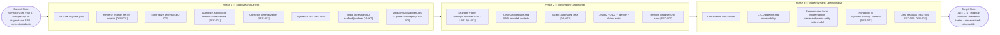

# Modernization Roadmap — WebVella ERP

> **Deliverable 7 of 7** · Reverse-Engineering Documentation Suite
> **Generated (UTC):** 2026-06-06 18:52 UTC
> **Analysis mode:** Read-only static inspection of the `WebVella.ERP3.sln` solution. **No production code, configuration, or schema artifact was modified.** Any static measurement performed was transient and left the source tree unchanged.
> **Companion deliverables:** [`code-inventory.md`](./code-inventory.md) · [`architecture.md`](./architecture.md) · [`database-schema.md`](./database-schema.md) · [`functional-overview.md`](./functional-overview.md) · [`business-rules.md`](./business-rules.md) · [`security-quality.md`](./security-quality.md)
> **Suite index:** [`README.md`](./README.md)

---

## Executive Summary

WebVella ERP is a **mature, plugin-driven ERP platform** built on **ASP.NET Core 9** over **PostgreSQL 16** (core library `WebVella.Erp` v1.7.4, Apache-2.0; `WebVella.Erp/WebVella.Erp.csproj`). Its architecture is a classic **layered** design (Sites → Web → Core) wrapped in a **plugin-extensibility model**, with a **custom Npgsql data layer**, an **EQL → SQL** query path, a **JWT-or-Cookie hybrid** authentication scheme, and a **dynamic entity meta-model** that lets applications define entities and fields at runtime. These traits are documented in detail in [`architecture.md`](./architecture.md) and [`functional-overview.md`](./functional-overview.md).

This roadmap synthesizes the suite's prior findings — primarily the security and quality assessment in [`security-quality.md`](./security-quality.md), the structural inventory in [`code-inventory.md`](./code-inventory.md), and the architecture analysis in [`architecture.md`](./architecture.md) — into a **current-state assessment → target-state vision → three-phase modernization plan**. It observes one governing distinction throughout:

- **What exists** is reported **factually**, with every claim citing a real file (and, where the prior deliverables fixed one, a real line).
- **What is recommended** is framed **explicitly as a recommendation** — a possible future state informed by industry best practice — and is **never** described as already present.

The system's debt is **concentrated, not pervasive**. A small number of high-leverage issues account for most of the risk:

- A single **monolithic Web API controller of exactly 4,313 lines** — `WebVella.Erp.Web/Controllers/WebApiController.cs` — concentrates the entire HTTP API surface in one class (`QA-002`).
- A **runtime code-compilation endpoint** (`POST api/v3.0/datasource/code-compile`) compiles and loads arbitrary user-supplied C# (`SEC-001`).
- **Two Blazor WebAssembly projects target the out-of-support `net7.0` runtime** while 18 of 20 projects target `net9.0` (`DEP-001`).
- The active **`AutoMapper 14.0.0`** mapper carries a **known High-severity advisory** (DoS via uncontrolled recursion) for which there is **no fix on the free `14.x` line** (`DEP-004`).
- **Secrets are stored in cleartext** in each host site's `Config.json` (`SEC-003`).
- The **`global.json` SDK version is commented out**, so builds float to the latest installed SDK.
- **No automated tests** and **no containerization** exist anywhere in the repository (`QA-001`; Docker absence).

None of these is fatal, and several have mitigating factors recorded below. The plan that follows sequences remediation by **dependency and risk** — stabilize and de-risk, then decompose and harden, then modernize and operationalize — **ordered strictly by prerequisite and risk reduction**. Each recommendation references the same finding identifiers used in [`security-quality.md`](./security-quality.md) so the two documents reconcile precisely.

> **Ordering by prerequisite and risk.** The three phases are ordered by **prerequisite and risk reduction**; phase boundaries denote dependency and risk gates only.

---

## Table of Contents

1. [Current-State Assessment (Factual)](#1-current-state-assessment-factual)
   - [1.1 Strengths — What Exists](#11-strengths--what-exists)
   - [1.2 Technical Debt & Risks — What Exists](#12-technical-debt--risks--what-exists)
   - [1.3 Qualitative Risk Matrix](#13-qualitative-risk-matrix)
   - [1.4 Findings → Roadmap Traceability](#14-findings--roadmap-traceability)
2. [Target-State Vision (Recommendations)](#2-target-state-vision-recommendations)
   - [2.1 Guiding Principles](#21-guiding-principles)
   - [2.2 Runtime & Framework Cadence](#22-runtime--framework-cadence)
   - [2.3 Security Hardening](#23-security-hardening)
   - [2.4 Quality & Test Strategy](#24-quality--test-strategy)
   - [2.5 Build, Packaging & Deployment](#25-build-packaging--deployment)
   - [2.6 Recommended Target Architecture](#26-recommended-target-architecture)
3. [Three-Phase Modernization Roadmap](#3-three-phase-modernization-roadmap)
   - [3.1 Sequencing Rationale](#31-sequencing-rationale)
   - [3.2 Phase 1 — Stabilize & De-risk](#32-phase-1--stabilize--de-risk)
   - [3.3 Phase 2 — Decompose & Harden](#33-phase-2--decompose--harden)
   - [3.4 Phase 3 — Modernize & Operationalize](#34-phase-3--modernize--operationalize)
   - [3.5 Phased-Roadmap Flow Diagram](#35-phased-roadmap-flow-diagram)
4. [Cross-Document Consistency Contracts](#4-cross-document-consistency-contracts)
5. [Four Corrections Honored](#5-four-corrections-honored)
6. [Source Citation Index](#6-source-citation-index)

---

## 1. Current-State Assessment (Factual)

This section reports **only what exists in the repository today**. Every observation cites a real file; finding identifiers (`SEC-*`, `DEP-*`, `QA-*`) are the same ones defined and detailed in [`security-quality.md`](./security-quality.md) §2, which is the authoritative source for severity ratings and full evidence.

### 1.1 Strengths — What Exists

The platform has real, load-bearing strengths that a modernization effort should **preserve**, not discard:

- **Modular plugin-extensibility model.** Optional capability is delivered through plugins loaded at composition time. The solution ships **seven plugins** — `SDK`, `CRM`, `Mail`, `Next`, `Project`, `MicrosoftCDM`, and `Approval` (`WebVella.Erp.Plugins.*`) — each deriving its entry class from the `ErpPlugin` base class. This model, documented in [`architecture.md`](./architecture.md) §1.2 and §2.3, cleanly separates optional features from the core and is the single most valuable structural asset to retain.
- **Consistent custom data layer with parameterized SQL.** Rather than an off-the-shelf ORM, the platform uses a **hand-written Npgsql data layer** (`WebVella.Erp/Database/**`). Crucially, it **parameterizes values** via `NpgsqlParameter` throughout (the assessment counted 50 parameter constructions), which is the correct primary defense against SQL injection — recorded as a **strength** in `SEC-006`.
- **Dynamic entity meta-model enabling runtime schema.** Beyond the fixed system tables created by embedded DDL, applications and plugins define **entities and fields as records** (JSON-serialized) at runtime, without database migrations. This metadata-driven model — detailed in [`database-schema.md`](./database-schema.md) — is a distinctive capability that gives the product its low-code character and must be **preserved through any data-layer change**.
- **Broad, coherent feature coverage.** The seven plugins plus the core deliver CRM, project management, email (IMAP/SMTP), a developer SDK / app-builder, Microsoft Common Data Model mapping, an approval workflow, and a "Next" application framework. The functional breadth is catalogued in [`functional-overview.md`](./functional-overview.md).
- **A largely current dependency baseline for active packages.** Most active third-party NuGet packages are pinned to current major versions (for example `Npgsql 9.0.4` and `Newtonsoft.Json 13.0.4`; see `WebVella.Erp/WebVella.Erp.csproj`), which is a favorable starting point for the framework-alignment work recommended below. **One active package is a notable exception:** `AutoMapper 14.0.0` carries a **known High-severity advisory** (`DEP-004` — DoS via uncontrolled recursion) with **no fix on the free `14.x` line**, so it is **excluded from this favorable baseline** and is addressed in the hardening work in §3.2.

These strengths frame the modernization stance: this is an **incremental hardening and decomposition** effort over a sound foundation — **not** a rationale for a ground-up rewrite.

### 1.2 Technical Debt & Risks — What Exists

The following are **present in the repository today**. Severity ratings, full evidence, and remediation context originate in [`security-quality.md`](./security-quality.md); they are summarized here as the inputs to the roadmap.

- **Monolithic Web API controller (`QA-002`).** `WebVella.Erp.Web/Controllers/WebApiController.cs` is **exactly 4,313 lines** — a single `[Authorize]`-gated class that concentrates the entire HTTP API surface (records, relations, files, data sources, and the code-compile endpoint) rather than per-resource controllers. [`code-inventory.md`](./code-inventory.md) §3.3 catalogues it as the largest Web/API file, and [`security-quality.md`](./security-quality.md) §5.3 measures its branching density on the order of 600+ aggregate decision points — well above the cyclomatic-complexity "split" threshold. It is a **maintainability and testability bottleneck** and is the canonical input to the decomposition recommendation in §3.3.

- **Two `net7.0` projects on an out-of-support runtime (`DEP-001`).** The Blazor WebAssembly projects `WebVella.Erp.WebAssembly/Server` (which references `Microsoft.AspNetCore.Components.WebAssembly.Server` **7.0.13**; see `WebVella.Erp.WebAssembly/Server/WebVella.Erp.WebAssembly.Server.csproj`) and `WebVella.Erp.WebAssembly/Shared` (`WebVella.Erp.WebAssembly/Shared/WebVella.Erp.WebAssembly.Shared.csproj`) both target **`net7.0`**, which reached end of support in May 2024. The remaining 18 of 20 projects target `net9.0`. Per [`code-inventory.md`](./code-inventory.md) §2.3 and [`security-quality.md`](./security-quality.md) §4.2, these two projects are **orphaned** — not registered in `WebVella.ERP3.sln` — so they do not ship in the main solution build; nonetheless they remain in the repository on an unsupported target and receive no framework security patches. (The `Server` project also carries a dangling `ProjectReference` at `WebVella.Erp.WebAssembly/Server/WebVella.Erp.WebAssembly.Server.csproj:14` to the non-existent `..\Client\WebVella.Erp.WebAssembly.Client.csproj` — the actual Client project file on disk is named `WebVella.Erp.WebAssembly/Client/WebVella.Erp.WebAssembly.csproj`.)

- **Non-deterministic SDK selection — `global.json` version commented out.** `global.json` declares an SDK block whose version is **commented out** (`//"version": "7.0.103"`), so the build floats to the **latest installed SDK** rather than a pinned one. This makes builds **non-deterministic** across environments and is recorded in [`code-inventory.md`](./code-inventory.md) §4.3.

- **Runtime code-compilation surface (`SEC-001`, Critical).** `WebVella.Erp.Web/Controllers/WebApiController.cs:494` exposes `POST api/v3.0/datasource/code-compile`, which routes user-supplied C# into `WebVella.Erp.Web/Services/CodeEvalService.cs` (line 1 `using CSScriptLib;`, line 45 `CSScript.Evaluator.LoadCode<ICodeVariable>`, line 57 `Compile`), backed by **Roslyn** (`Microsoft.CodeAnalysis.*` 4.14.0) and **CS-Script** (4.11.2). Compiling and loading caller-controlled code is a **remote-code-execution-class** capability. The verified mitigating control is a class-level `[Authorize]` at `WebApiController.cs:36`, so the endpoint is **authenticated-only**; the full analysis lives in [`security-quality.md`](./security-quality.md) §3.1.

- **Insecure-deserialization configuration (`SEC-002`, High).** Newtonsoft `TypeNameHandling.All`/`.Auto` is configured in background-job and relation serialization — `WebVella.Erp/Jobs/JobDataService.cs:27,96,297,346` and `WebVella.Erp/Database/DbRelationRepository.cs:47,128,173` — without a `SerializationBinder` to constrain resolvable types. See [`security-quality.md`](./security-quality.md) §3.2.

- **Plaintext secrets in host configuration (`SEC-003`, High).** Every host site's `Config.json` stores a database connection string, an encryption key, and (in two sites) a weak hardcoded JWT signing key **in cleartext** — `WebVella.Erp.Site/Config.json:3,4,24`, a pattern repeated across all seven sites (`WebVella.Erp.Site`, `.Crm`, `.Mail`, `.MicrosoftCDM`, `.Next`, `.Project`, `.Sdk`). The encryption key is **identical** across sites. (Per the suite's secret-handling discipline, the actual secret values are **not reproduced** in this documentation; only their locations are cited.) See [`security-quality.md`](./security-quality.md) §3.3.

- **Overly permissive default CORS (`SEC-004`, Medium).** `WebVella.Erp.Site/Startup.cs` registers an `AllowAnyOrigin`-style default CORS policy (lines 61–63) and applies it via an unnamed `app.UseCors()` (line 164). See [`security-quality.md`](./security-quality.md) §3.4.

- **Global Npgsql legacy-timestamp switch (`SEC-005`, Low/Info).** Each site's `Startup.cs` sets `AppContext.SetSwitch("Npgsql.EnableLegacyTimestampBehavior", true)` at line 40, preceded by the in-code comment **`//legacy until we fix system tables`** (line 39). This is a **deliberately retained legacy behavior**, not an accidental setting; it appears in `WebVella.Erp.Site/Startup.cs` and six other sites. See [`security-quality.md`](./security-quality.md) §3.5.

- **Residual dynamic SQL — identifiers and the FTS-language literal (`SEC-006`, residual).** While ordinary values are parameterized (the strength noted in §1.1), two categories of SQL text are composed by string interpolation in `WebVella.Erp/Database/**`: (a) **SQL identifiers** (table/column names sourced from entity metadata), and (b) the **full-text-search language literal** — `query.FtsLanguage`, a public, externally-bindable query-model property (`WebVella.Erp/Api/Models/QueryObject.cs:23`) — concatenated **unparameterized** into the SQL at `WebVella.Erp/Database/DbRecordRepository.cs:1503,1511`. The identifier path derives from trusted metadata; the FTS-language path can carry external input and is the more material of the two. Both are detailed in [`security-quality.md`](./security-quality.md) §3.6.

- **Substantial commented-out legacy security code (`SEC-007`, Low/Info).** The `WebVella.Erp.Web/Security/**` folder (8 files) is largely **commented-out** legacy authentication/authorization code — for example `WebSecurityUtil.cs` is 193 of 232 lines commented. This is a **code-hygiene** signal, detailed in [`security-quality.md`](./security-quality.md) §3.7.

- **No automated tests (`QA-001`, High).** The solution contains **no test project** of any kind (no xUnit/NUnit/MSTest), confirmed by both the setup analysis and [`security-quality.md`](./security-quality.md) §5.4. This is itself a quality risk and a prerequisite concern for any safe decomposition.

- **No containerization present.** There is **no `Dockerfile` and no `docker-compose`** anywhere in the repository. Deployment is plain ASP.NET Core host sites on **IIS in-process** (`WebVella.Erp.Site/web.config` registers `AspNetCoreModuleV2` with `hostingModel="InProcess"`), as documented in [`architecture.md`](./architecture.md) §1.3 and §6.5. Containerization therefore appears in this roadmap **only as a recommendation** (§2.5, §3.4) — never as existing state.

- **Commented-out legacy package references (`DEP-002`, Low/Info).** Several `.csproj` files contain **commented-out** legacy `PackageReference` entries — the ASP.NET Core **2.2.0** packages (for example `WebVella.Erp/WebVella.Erp.csproj:51`) and the SixLabors imaging packages. Because they are inside XML comments they are **not active dependencies**; this is a hygiene observation only, per [`security-quality.md`](./security-quality.md) §4.3.

- **Windows-bound imaging dependency (`DEP-003`, Medium).** The **active** imaging package `System.Drawing.Common` 9.0.10 (`WebVella.Erp/WebVella.Erp.csproj:63`) is **Windows-only since .NET 6**. Combined with the IIS in-process hosting model, this is consistent with a Windows-bound runtime and is a **portability** obstacle to the Linux-hosting / containerization options explored in §3.4. See [`security-quality.md`](./security-quality.md) §4.4.

- **Known-vulnerable active dependency — `AutoMapper 14.0.0` (`DEP-004`, High).** The DTO ↔ entity mapper `AutoMapper` is pinned to `14.0.0` (`WebVella.Erp/WebVella.Erp.csproj:47`) and wired into the runtime mapping pipeline (`WebVella.Erp/ERPService.cs:900`, `SetAutoMapperConfiguration`). That version is affected by a **High-severity advisory** (`CVE-2026-32933` / `GHSA-rvv3-g6hj-g44x`, CVSS 7.5) — a **denial-of-service via uncontrolled recursion**: a deeply nested object graph mapped without a `MaxDepth` limit can exhaust the thread stack and crash the process with a `StackOverflowException`. Critically, there is **no fix on the free `14.x` line** — the maintainer will not patch `14.x`, and the fix ships only in the **paid** `15.1.1` / `16.1.1` releases — so remediation is **not a trivial version bump**. See [`security-quality.md`](./security-quality.md) §4.5.

### 1.3 Qualitative Risk Matrix

The matrix below ranks each current-state finding **qualitatively** by **likelihood** (how readily the condition could lead to an adverse outcome) and **impact** (the severity of that outcome). The "Roadmap phase" column shows where remediation is ordered, by dependency and risk, in §3.

| Finding | Condition (what exists) | Likelihood | Impact | Qualitative risk | Roadmap phase |
|---------|-------------------------|------------|--------|------------------|---------------|
| `SEC-001` | Authenticated runtime C# compile endpoint (`WebApiController.cs:494`) | Low (authn-gated) | Critical | **High** | Phase 1 |
| `SEC-002` | `TypeNameHandling.All`/`.Auto` without `SerializationBinder` | Medium | High | **High** | Phase 1 |
| `SEC-003` | Plaintext secrets in `Config.json` (×7 sites) | Medium | High | **High** | Phase 1 |
| `QA-001` | No automated tests anywhere | High | High | **High** | Phase 2 (enabled in Phase 1) |
| `DEP-001` | Two `net7.0` projects, out of support | Medium | Medium | **Medium** | Phase 1 |
| `SEC-004` | `AllowAnyOrigin` default CORS | Medium | Medium | **Medium** | Phase 1 |
| `QA-002` | 4,313-line monolithic `WebApiController` | High | Medium | **Medium–High** | Phase 2 |
| `DEP-003` | `System.Drawing.Common` Windows-only | Medium | Medium | **Medium** | Phase 3 |
| `DEP-004` | `AutoMapper 14.0.0` known High advisory (DoS via uncontrolled recursion); no fix on free 14.x line | Medium | High | **High** | Phase 1 |
| `global.json` | SDK version commented out (non-deterministic builds) | Medium | Medium | **Medium** | Phase 1 |
| `SEC-006` | SQL identifiers interpolated from metadata; FTS-language literal (`query.FtsLanguage`) concatenated unparameterized (`DbRecordRepository.cs:1503,1511`) | Medium | High | **Medium–High** | Phase 3 |
| `SEC-005` | Npgsql legacy-timestamp switch retained | Low | Low | **Low** | Phase 3 |
| `SEC-007` | Commented-out legacy security code | Low | Low | **Low** | Phase 2 |
| `DEP-002` | Commented-out legacy package references | Low | Low | **Low** | Phase 3 |

> **Reading the matrix.** `SEC-001` is rated **High** overall despite **Low** likelihood because its impact is **Critical** and authenticated remote code execution warrants the strictest treatment. `QA-001` (no tests) is rated **High** because it both raises the likelihood of undetected regressions and amplifies the impact of every other change — which is why a testing capability is **established early** (a Phase 1 enabler) even though the bulk of test authoring is sequenced in Phase 2.

### 1.4 Findings → Roadmap Traceability

Every finding above maps forward to a concrete initiative. This table is the **traceability contract** between [`security-quality.md`](./security-quality.md) and this roadmap: the identifiers and file citations are identical in both documents.

| Finding | Primary file citation | Recommended response (see §3) |
|---------|-----------------------|-------------------------------|
| `SEC-001` | `WebVella.Erp.Web/Controllers/WebApiController.cs:494`; `WebVella.Erp.Web/Services/CodeEvalService.cs:45,57` | Gate behind a dedicated developer/admin authorization policy; sandbox; or remove from production builds — Phase 1 |
| `SEC-002` | `WebVella.Erp/Jobs/JobDataService.cs:27,96,297,346`; `WebVella.Erp/Database/DbRelationRepository.cs:47,128,173` | Constrain deserialization with a `SerializationBinder` / type allow-list — Phase 1 |
| `SEC-003` | Connection string + encryption key in **all 7** sites' `Config.json:3,4`; `Jwt:Key` in **2 sites only** — `WebVella.Erp.Site/Config.json:24` and `WebVella.Erp.Site.Project/Config.json:20` | Externalize secrets (user-secrets / Key Vault / environment variables); per-environment key separation — Phase 1 |
| `SEC-004` | `WebVella.Erp.Site/Startup.cs:61–63,164` | Replace `AllowAnyOrigin` with an explicit origin allow-list — Phase 1 |
| `SEC-005` | `WebVella.Erp.Site/Startup.cs:40` | Resolve the underlying system-table timestamp handling, then remove the switch — Phase 3 |
| `SEC-006` | `WebVella.Erp/Database/DbRecordRepository.cs:1503,1511`; `WebVella.Erp/Api/Models/QueryObject.cs:23` | Validate/allow-list the FTS-language literal (or bind it as a parameter); centralize and validate identifier quoting against the entity meta-model — Phase 3 |
| `SEC-007` | `WebVella.Erp.Web/Security/**` (8 files) | Delete dead commented-out security code during decomposition — Phase 2 |
| `DEP-001` | `WebVella.Erp.WebAssembly/Server/WebVella.Erp.WebAssembly.Server.csproj`; `WebVella.Erp.WebAssembly/Shared/WebVella.Erp.WebAssembly.Shared.csproj` | Retarget to a .NET LTS line or retire the orphaned projects — Phase 1 |
| `DEP-002` | `*.csproj` comment lines | Remove commented-out legacy references during cleanup — Phase 3 |
| `DEP-003` | `WebVella.Erp/WebVella.Erp.csproj:63` | Migrate imaging to a cross-platform library (e.g., the commented-out SixLabors path) — Phase 3 |
| `DEP-004` | `WebVella.Erp/WebVella.Erp.csproj:47` (`AutoMapper [14.0.0]`; `CVE-2026-32933` / `GHSA-rvv3-g6hj-g44x`) | Interim: configure a global `MaxDepth` on the AutoMapper profiles; durable: upgrade to the paid `15.1.1`+ **or** migrate to a maintained mapper (e.g., Mapperly) / hand-mapping — Phase 1 |
| `QA-001` | solution-wide | Stand up a test project and CI gate; backfill tests around decomposition seams — Phase 2 (enabled in Phase 1) |
| `QA-002` | `WebVella.Erp.Web/Controllers/WebApiController.cs` (4,313 LOC) | Apply the Strangler Fig pattern to carve into per-resource controllers/services — Phase 2 |
| `global.json` | `global.json` | Pin the SDK version for deterministic builds — Phase 1 |

---

## 2. Target-State Vision (Recommendations)

> **Framing.** Everything in this section is a **recommendation** — a description of a **possible future state** informed by industry best practice. **None of it describes the system as it exists today.** Where a recommendation contrasts with current state, the current state is the factual baseline established in §1.

The target state keeps WebVella ERP's distinctive strengths — the plugin-extensibility model, the dynamic entity meta-model, and the parameterized custom data layer — while **decomposing the concentrated debt**, **hardening the security posture**, **aligning to a supported runtime**, and **introducing the automated quality and deployment capabilities** that are absent today.

### 2.1 Guiding Principles

- **Incremental replacement over big-bang rewrite — the Strangler Fig pattern (recommended).** Rather than rewriting the platform wholesale, the recommendation is to **incrementally route capability away from the monolithic `WebApiController` to new, focused components**, retiring slices of the old controller as replacements prove out. The Strangler Fig pattern lets the system keep running throughout and bounds the blast radius of each change — particularly important given the absence of a test safety net today (`QA-001`).
- **Modular monolith / Clean Architecture / Domain-Driven Design (recommended).** The recommendation is to introduce **Clean Architecture layering** (a clear domain core with dependencies pointing inward) and to organize capability around **DDD bounded contexts** that align naturally with the existing plugin boundaries (CRM, Project, Mail, and so on). This is the structural vehicle for decomposing the **4,313-line `WebApiController.cs`** (`QA-002`) into **per-resource / per-bounded-context controllers and services**. A **modular monolith** is the recommended default destination; extraction into separate services should be an evidence-driven later option, not an assumed goal.
- **Preserve the metadata-driven core.** Any restructuring must **retain the dynamic entity meta-model** documented in [`database-schema.md`](./database-schema.md). The recommendation explicitly excludes replacing the runtime entity/field model with static, compile-time schema — that capability is a product differentiator, not debt.

### 2.2 Runtime & Framework Cadence

- **Align to a .NET Long-Term-Support (LTS) line (recommended).** A relevant cadence fact: **.NET 9 is a Standard-Term-Support (STS) release, not LTS.** The recommendation is to standardize the solution on a **.NET LTS** line. The current LTS release is **.NET 10** (an LTS release supported through November 2028); the prior LTS, **.NET 8**, reaches end of support in November 2026, so **.NET 10 is the recommended forward target**, with a deliberate policy for STS-to-LTS transitions thereafter. The most urgent application of this principle is **retiring the out-of-support `net7.0` projects** (`DEP-001`): retarget `WebVella.Erp.WebAssembly/Server` and `/Shared` to the chosen LTS target, or remove them if the orphaned Blazor WebAssembly host is no longer required.
- **Deterministic builds (recommended).** Pin the SDK version in **`global.json`** (currently commented out) so every environment builds against a known toolchain. This is a foundational, low-risk change that makes all subsequent work reproducible.

### 2.3 Security Hardening

These recommendations map one-to-one onto the `SEC-*` findings in §1.2 and [`security-quality.md`](./security-quality.md):

- **Standardize on OAuth2 / OpenID Connect with ASP.NET Core Identity and claims-based authorization (recommended).** Evolve the current JWT-or-Cookie hybrid (documented in [`architecture.md`](./architecture.md) §4) toward an OIDC-based identity flow, and replace coarse authentication-only gates with **claims/policy-based authorization**. The runtime code-compile endpoint (`SEC-001`) should be restricted to a **dedicated, narrowly-scoped developer/administrator policy** — and **sandboxed or removed from production builds** — rather than relying on the class-level authentication gate alone.
- **Externalize secret management (recommended).** Move connection strings, encryption keys, and JWT signing keys out of source-controlled `Config.json` (`SEC-003`) into **user-secrets (development)**, **a secret store such as Azure Key Vault**, or **environment variables**, with **per-environment key separation** so no key is shared across sites.
- **Constrain deserialization (recommended).** Replace unconstrained `TypeNameHandling` (`SEC-002`) with a **`SerializationBinder` / explicit type allow-list**, or migrate the affected job and relation payloads to a serializer configuration that does not resolve arbitrary types.
- **Tighten transport and origin controls (recommended).** Replace the `AllowAnyOrigin` default CORS policy (`SEC-004`) with an **explicit origin allow-list**, and enforce **HTTPS / HSTS** consistently across the host sites.
- **Input validation and output encoding (recommended).** Adopt systematic input validation and contextual output encoding across the API and page-builder surfaces as a standing practice — including **validating or allow-listing the full-text-search language value** (`query.FtsLanguage`) that `SEC-006` shows is concatenated into SQL at `DbRecordRepository.cs:1503,1511` — complementing the existing parameterized-value strength.
- **Remediate the known-vulnerable `AutoMapper 14.0.0` dependency (recommended).** Address the `DEP-004` advisory (`CVE-2026-32933` / `GHSA-rvv3-g6hj-g44x`, DoS via uncontrolled recursion). Because **no fix exists on the free `14.x` line**, the recommended path is — as an **immediate, low-cost mitigation** — to configure a **global `MaxDepth`** on the AutoMapper profiles so recursive mapping is bounded, and — as the **durable** remediation — to either upgrade to the **paid** `15.1.1`+ release **or** migrate to a maintained alternative such as **Mapperly** (or explicit hand-mapping). This is **not** a trivial version bump and is sequenced into Phase 1 (§3.2).

### 2.4 Quality & Test Strategy

- **Introduce automated tests (recommended).** No tests exist today (`QA-001`). The recommendation is to **stand up a test project** and grow coverage in layers: **unit tests** for the data layer, EQL translation, and business-rule logic; **integration tests** against a disposable PostgreSQL 16 instance; and **characterization tests** captured around the `WebApiController` seams **before** decomposition, so behavior is pinned while the controller is carved up.
- **Continuous quality gates (recommended).** Run the .NET code-quality (Roslyn) analyzers — for example the cyclomatic-complexity and maintainability-index rules referenced in [`security-quality.md`](./security-quality.md) §5 — as part of an automated gate, and track the 4,313-line controller's complexity **down** as decomposition proceeds.

### 2.5 Build, Packaging & Deployment

- **Containerization with Docker (recommended; not present today).** There is **no Docker** in the repository (§1.2); deployment is IIS in-process. The recommendation is to **containerize the host sites** for portability and reproducible deploys. This depends on resolving the **`System.Drawing.Common` Windows-only constraint** (`DEP-003`) — for example by adopting the cross-platform SixLabors imaging path that currently sits commented-out (`DEP-002`) — so the application can run on a Linux base image.
- **CI/CD and observability (recommended).** Introduce a **continuous-integration pipeline** that restores, builds, runs analyzers, and executes the new test suite on every change, followed by **continuous delivery** of container images. Add **structured logging, metrics, and tracing** to replace ad-hoc diagnostics.

### 2.6 Recommended Target Architecture

The recommended destination — **explicitly future-state** — is a **.NET LTS, modular-monolith** WebVella ERP that:

- keeps the **plugin-extensibility model** and the **dynamic entity meta-model** intact;
- replaces the single 4,313-line API controller with **per-bounded-context controllers and application services** behind a **Clean Architecture** core;
- authenticates and authorizes through **OIDC + ASP.NET Core Identity + claims/policies**, with secrets externalized;
- evaluates **data-layer modernization** options (a thin repository abstraction, or a vetted ORM **for the fixed system tables only**) **while preserving** the metadata-driven record store;
- ships as **portable containers** through a **CI/CD pipeline** with automated tests and quality gates and first-class observability.

This vision is realized incrementally by the three-phase plan in §3.

---

## 3. Three-Phase Modernization Roadmap

This roadmap defines **exactly three phases**. Each phase lists its **objectives**, **representative initiatives**, and **exit criteria**. Initiatives reference the same finding identifiers as [`security-quality.md`](./security-quality.md).

### 3.1 Sequencing Rationale

The phases are ordered by **dependency and risk** — each phase is gated by the prerequisites the next one depends on. The ordering reflects prerequisite and risk reduction only.

- **Phase 1 first** because it removes the **highest-severity, lowest-coupling** risks (authenticated RCE surface, insecure deserialization, plaintext secrets) and establishes the **build determinism and supported-runtime baseline** that every later change depends on.
- **Phase 2 next** because safely **decomposing the monolithic controller** depends on the stabilized, test-enabled baseline from Phase 1 — characterization tests must pin behavior **before** the Strangler Fig carving begins.
- **Phase 3 last** because **containerization, CI/CD, and data-layer evolution** build on the decomposed, hardened, and tested system produced by Phases 1 and 2 (for example, containerization depends on resolving the Windows-only imaging constraint exposed during hardening).

A phase is considered complete only when its **exit criteria** are met; those criteria are the gates that authorize starting the next phase.

### 3.2 Phase 1 — Stabilize & De-risk

**Objective.** Eliminate or contain the highest-severity security risks and establish a **deterministic, supported build baseline** — without changing application behavior or structure. This phase is the prerequisite foundation for all later work.

**Representative initiatives.**

- **Pin the SDK for deterministic builds.** Restore a concrete SDK version in **`global.json`** (currently commented out) so the toolchain is fixed across environments.
- **Retire or retarget the `net7.0` projects (`DEP-001`).** Move `WebVella.Erp.WebAssembly/Server` and `WebVella.Erp.WebAssembly/Shared` to the chosen **.NET LTS** target, or remove the orphaned projects if the Blazor WebAssembly host is not required. (Also resolve the `Server` project's dangling `ProjectReference` — `WebVella.Erp.WebAssembly/Server/WebVella.Erp.WebAssembly.Server.csproj:14` points to the non-existent `..\Client\WebVella.Erp.WebAssembly.Client.csproj`, whereas the actual Client project file is `WebVella.Erp.WebAssembly/Client/WebVella.Erp.WebAssembly.csproj` — as part of this.)
- **Externalize secrets (`SEC-003`).** Move the connection string and encryption key out of **all seven** sites' `Config.json` (lines 3–4 in each), and the JWT key out of the **two** sites that actually define one — `WebVella.Erp.Site/Config.json:24` and `WebVella.Erp.Site.Project/Config.json:20` — into user-secrets / a secret store / environment variables, with per-environment key separation.
- **Lock down the code-compile endpoint (`SEC-001`).** Place `api/v3.0/datasource/code-compile` behind a **dedicated developer/administrator authorization policy**, sandbox the compilation, or **disable it in production builds** — replacing reliance on the class-level authentication-only gate at `WebApiController.cs:36`.
- **Constrain deserialization (`SEC-002`).** Introduce a `SerializationBinder` / type allow-list (or change serializer configuration) for the `TypeNameHandling` usages in `JobDataService.cs` and `DbRelationRepository.cs`.
- **Tighten CORS (`SEC-004`).** Replace the `AllowAnyOrigin` default policy with an explicit origin allow-list, and confirm HTTPS/HSTS enforcement.
- **Mitigate the `AutoMapper` DoS advisory (`DEP-004`).** As an immediate, low-cost step, configure a **global `MaxDepth`** on the AutoMapper profiles to bound recursive mapping; in parallel, plan the **durable** remediation — upgrade to the paid `AutoMapper 15.1.1`+ or migrate to a maintained mapper (e.g., Mapperly) — since the free `14.x` line will not be patched.
- **Establish the test and CI scaffold (enabler for `QA-001`).** Create an (initially small) automated-test project and a continuous-integration build so that subsequent phases have a place to add coverage and a gate to enforce it. *(Authoring the bulk of tests is Phase 2; standing up the capability here is what makes Phase 2 safe.)*

**Exit criteria.**

- The SDK version is pinned in `global.json` and builds are reproducible.
- No project targets `net7.0` (each is retargeted to an LTS line or removed).
- No secret value is present in any source-controlled `Config.json`.
- The code-compile endpoint is unreachable in production builds **or** restricted to a dedicated privileged policy and sandboxed.
- `TypeNameHandling` deserialization is type-constrained.
- The default CORS policy enumerates explicit origins.
- The `AutoMapper` DoS advisory (`DEP-004`) is mitigated (a global `MaxDepth` is configured to bound recursive mapping) and a durable remediation — paid upgrade or migration to a maintained mapper — is decided and scheduled.
- A test project builds and runs in CI, even if coverage is initially minimal.

### 3.3 Phase 2 — Decompose & Harden

**Objective.** Reduce structural debt by **decomposing the monolithic API** and introducing **layering, tests, and modern identity** — building on the stabilized baseline from Phase 1.

**Representative initiatives.**

- **Apply the Strangler Fig pattern to `WebApiController.cs` (`QA-002`).** Incrementally carve the **4,313-line** controller into **per-resource / per-bounded-context controllers and application services** (records, relations, files, data sources, and the isolated code-compile capability), routing traffic to the new components and retiring the corresponding slices of the monolith as each is proven.
- **Introduce Clean Architecture layering.** Establish a domain core with dependencies pointing inward, and align bounded contexts to the existing plugin boundaries (CRM, Project, Mail, Next, MicrosoftCDM, SDK, Approval) — **preserving** the plugin-extensibility model and the dynamic entity meta-model.
- **Backfill automated tests (`QA-001`).** Add **characterization tests** around controller seams **before** carving, then unit and integration tests for the extracted services, the custom data layer, and EQL → SQL translation, all enforced by the Phase 1 CI gate.
- **Adopt OAuth2 / OIDC + ASP.NET Core Identity + claims-based authorization.** Evolve the JWT-or-Cookie hybrid into an OIDC identity flow and replace coarse `[Authorize]` gates with claims/policy-based authorization across the new controllers.
- **Remove dead security code (`SEC-007`).** Delete the commented-out legacy authentication/authorization code in `WebVella.Erp.Web/Security/**` as those concerns are reimplemented cleanly.

**Exit criteria.**

- The bulk of the API surface is served by focused, per-resource controllers/services; `WebApiController.cs` is materially reduced or eliminated.
- A Clean Architecture layering is in place and enforced (for example, via analyzer/architecture tests).
- Meaningful automated-test coverage exists for the extracted components, the data layer, and EQL translation, and is enforced in CI.
- Authentication/authorization is claims/policy-based; the commented-out `Security/**` code is removed.

### 3.4 Phase 3 — Modernize & Operationalize

**Objective.** Make the decomposed, hardened system **portable, observable, and operationally modern**, and resolve the remaining lower-severity residuals — building on the outputs of Phases 1 and 2.

**Representative initiatives.**

- **Containerize with Docker (not present today).** Package the host sites as **containers** for portable, reproducible deployment, replacing the IIS in-process model documented in [`architecture.md`](./architecture.md) §6.5. This depends on the portability fix below.
- **Portability fixes (`DEP-003`).** Migrate imaging off the Windows-only `System.Drawing.Common` to a **cross-platform library** (for example the SixLabors path currently commented-out, `DEP-002`) so the application can run on a Linux container base.
- **CI/CD and observability.** Extend the Phase 1 CI into a full **CI/CD pipeline** delivering container images, and add **structured logging, metrics, and distributed tracing**.
- **Evaluate data-layer modernization — while preserving the meta-model.** Assess introducing a thin repository abstraction or a vetted ORM **for the fixed system tables only**, **explicitly retaining** the dynamic entity/record store and the EQL → SQL path that define the platform. This is an **evaluation**, not a mandated replacement.
- **Clear remaining residuals.** Resolve the underlying system-table timestamp handling so the `Npgsql.EnableLegacyTimestampBehavior` switch (`SEC-005`, the *"legacy until we fix system tables"* comment) can be removed; for `SEC-006`, **validate or allow-list the full-text-search language literal** (`query.FtsLanguage`, concatenated into SQL at `DbRecordRepository.cs:1503,1511`) or bind it as a parameter, and **centralize and validate SQL identifier quoting**; and delete the commented-out legacy package references (`DEP-002`).

**Exit criteria.**

- The host sites build and run as containers on a Linux base image (imaging dependency is cross-platform).
- A CI/CD pipeline delivers container images, with observability instrumented.
- A documented decision exists on data-layer modernization that **preserves** the dynamic entity meta-model.
- The legacy-timestamp switch is removed (or a documented decision records why it is retained), the FTS-language literal is validated/allow-listed (or parameterized) and identifier quoting is centralized, and commented-out package references are gone.

### 3.5 Phased-Roadmap Flow Diagram

The diagram ties the three phases together, showing the key initiatives in each and the **dependency-and-risk** ordering between them. It is the suite's roadmap-flow Mermaid diagram (one of the suite's planned diagrams; see the inventory in [`code-inventory.md`](./code-inventory.md) and [`architecture.md`](./architecture.md)).

```mermaid
flowchart LR
    Start(["Current State<br/>ASP.NET Core 9 STS · PostgreSQL 16<br/>plugin-driven ERP · concentrated debt"])

    subgraph P1["Phase 1 — Stabilize and De-risk"]
        direction TB
        P1a["Pin SDK in global.json"]
        P1b["Retire or retarget net7.0 projects [DEP-001]"]
        P1c["Externalize secrets [SEC-003]"]
        P1d["Authorize, sandbox or remove code-compile [SEC-001]"]
        P1e["Constrain deserialization [SEC-002]"]
        P1f["Tighten CORS [SEC-004]"]
        P1g["Stand up test and CI scaffold [enables QA-001]"]
        P1h["Mitigate AutoMapper DoS — global MaxDepth [DEP-004]"]
    end

    subgraph P2["Phase 2 — Decompose and Harden"]
        direction TB
        P2a["Strangler Fig on WebApiController 4,313 LOC [QA-002]"]
        P2b["Clean Architecture and DDD bounded contexts"]
        P2c["Backfill automated tests [QA-001]"]
        P2d["OAuth2 / OIDC + Identity + claims authz"]
        P2e["Remove dead security code [SEC-007]"]
    end

    subgraph P3["Phase 3 — Modernize and Operationalize"]
        direction TB
        P3a["Containerize with Docker"]
        P3b["CI/CD pipeline and observability"]
        P3c["Evaluate data-layer modernization<br/>preserve dynamic entity meta-model"]
        P3d["Portability fix System.Drawing.Common [DEP-003]"]
        P3e["Clear residuals [SEC-005, SEC-006, DEP-002]"]
    end

    Target(["Target State<br/>.NET LTS · modular monolith · hardened<br/>tested · containerized · observable"])

    Start --> P1
    P1 --> P2
    P2 --> P3
    P3 --> Target
```

> The diagram is **directional and dependency-based**: each arrow denotes "is a prerequisite for." The ordering reflects prerequisites and risk reduction only.

---

## 4. Cross-Document Consistency Contracts

This deliverable upholds the suite-wide consistency contracts defined in [`code-inventory.md`](./code-inventory.md) §6:

- **Module taxonomy.** Module names used here — Core (`WebVella.Erp`), Web (`WebVella.Erp.Web`), WebAssembly (`WebVella.Erp.WebAssembly`), ConsoleApp (`WebVella.Erp.ConsoleApp`), the 7 Plugins (`SDK`, `CRM`, `Mail`, `Next`, `Project`, `MicrosoftCDM`, `Approval`), and the 7 Sites (`WebVella.Erp.Site*`) — are identical to [`code-inventory.md`](./code-inventory.md) §2, [`architecture.md`](./architecture.md) §8, and [`functional-overview.md`](./functional-overview.md).
- **File paths.** Every path cited here (for example `WebVella.Erp.Web/Controllers/WebApiController.cs`, `WebVella.Erp.WebAssembly/Server/WebVella.Erp.WebAssembly.Server.csproj`, `global.json`, `WebVella.Erp.Site/Startup.cs`, `WebVella.Erp/WebVella.Erp.csproj`) is catalogued in [`code-inventory.md`](./code-inventory.md).
- **Finding identifiers.** The `SEC-*`, `DEP-*`, and `QA-*` identifiers, their severities, and their file citations are taken **verbatim** from [`security-quality.md`](./security-quality.md) §2; this document adds the **forward-looking remediation** that the security assessment deliberately deferred to the roadmap. The two documents therefore reconcile one-to-one.
- **Architecture references.** The layered + plugin model, the EQL → SQL data path, the JWT-or-Cookie hybrid authentication, the page-builder render lifecycle, and the IIS in-process deployment topology referenced here all match [`architecture.md`](./architecture.md).
- **Schema references.** The dynamic entity meta-model and the fixed system tables referenced here match [`database-schema.md`](./database-schema.md) and [`data-dictionary.csv`](./data-dictionary.csv).

---

## 5. Four Corrections Honored

This roadmap honors the four prompt-vs-reality corrections established across the suite (see [`architecture.md`](./architecture.md) §7 and [`security-quality.md`](./security-quality.md) §7). They constrain which recommendations are valid:

| # | Common assumption | Verified reality (this system) | Effect on this roadmap |
|---|-------------------|--------------------------------|------------------------|
| 1 | Entity Framework Core ORM | **Custom, parameterized Npgsql data layer** with JSON-serialized dynamic records (`WebVella.Erp/Database/**`) | Data-layer modernization (Phase 3) is framed as an **evaluation that preserves the meta-model**, not an EF Core migration |
| 2 | Angular / React / TypeScript frontend | **Razor Pages + ERP TagHelpers + Blazor WebAssembly + plain JS** (no `.ts` files) | Frontend recommendations concern the **Blazor WebAssembly `net7.0`** projects (`DEP-001`), not a JS-framework upgrade |
| 3 | EF Core Migrations folder | **Code-embedded DDL + dated plugin patch methods** (no `Migrations/`, no `.sql` files) | The roadmap does not assume a migrations pipeline; the legacy-timestamp **"fix system tables"** item (`SEC-005`) is framed in this context |
| 4 | Docker containerization | **No Docker present.** Plain ASP.NET Core sites on IIS in-process | Containerization is a **Phase 3 recommendation only** — never described as existing state |

Additionally, the cadence correction is honored throughout: **.NET 9 is a Standard-Term-Support (STS) release, not LTS**, so the runtime recommendation targets a **.NET LTS** line.

---

## 6. Source Citation Index

Current-state claims in this document resolve to the following real files (line numbers re-verified against the working tree where the prior deliverables fixed one). Forward-looking items are recommendations and are intentionally **not** tied to existing code.

| Citation | Location | Used for |
|----------|----------|----------|
| Monolithic API controller (4,313 LOC) | `WebVella.Erp.Web/Controllers/WebApiController.cs` | `QA-002`; decomposition target (§3.3) |
| Code-compile route | `WebVella.Erp.Web/Controllers/WebApiController.cs:494` | `SEC-001` (§1.2, §3.2) |
| Class-level authorize gate | `WebVella.Erp.Web/Controllers/WebApiController.cs:36` | `SEC-001` mitigating control |
| Runtime C# evaluation | `WebVella.Erp.Web/Services/CodeEvalService.cs:1,45,57` | `SEC-001` |
| Insecure deserialization (jobs) | `WebVella.Erp/Jobs/JobDataService.cs:27,96,297,346` | `SEC-002` |
| Insecure deserialization (relations) | `WebVella.Erp/Database/DbRelationRepository.cs:47,128,173` | `SEC-002` |
| Plaintext secrets — connection string + encryption key | `WebVella.Erp.Site/Config.json:3,4` (present in **all 7** sites) | `SEC-003` (values not reproduced) |
| Plaintext secrets — JWT signing key | `WebVella.Erp.Site/Config.json:24`; `WebVella.Erp.Site.Project/Config.json:20` (**2 sites only**) | `SEC-003` (values not reproduced) |
| Default CORS + legacy switch + hybrid auth | `WebVella.Erp.Site/Startup.cs:40,61–63,164` | `SEC-004`, `SEC-005`; auth model |
| Parameterized data layer; FTS-language residual | `WebVella.Erp/Database/**`; `WebVella.Erp/Database/DbRecordRepository.cs:1503,1511`; `WebVella.Erp/Api/Models/QueryObject.cs:23` | `SEC-006` (parameterized-value strength + identifier/FTS-language residual) |
| Commented-out security code | `WebVella.Erp.Web/Security/**` (8 files) | `SEC-007` |
| `net7.0` WebAssembly Server | `WebVella.Erp.WebAssembly/Server/WebVella.Erp.WebAssembly.Server.csproj` | `DEP-001` |
| `net7.0` WebAssembly Shared | `WebVella.Erp.WebAssembly/Shared/WebVella.Erp.WebAssembly.Shared.csproj` | `DEP-001` |
| Commented-out 2.2.0 reference | `WebVella.Erp/WebVella.Erp.csproj:51` | `DEP-002` |
| Windows-only imaging dependency | `WebVella.Erp/WebVella.Erp.csproj:63` | `DEP-003` |
| Known-vulnerable mapper (`AutoMapper [14.0.0]`) | `WebVella.Erp/WebVella.Erp.csproj:47`; runtime wiring `WebVella.Erp/ERPService.cs:900` | `DEP-004` (`CVE-2026-32933` / `GHSA-rvv3-g6hj-g44x`) |
| Core library version & license | `WebVella.Erp/WebVella.Erp.csproj` (`Version 1.7.4`, Apache-2.0) | Executive summary, §1.1 |
| SDK version commented out | `global.json` | Non-deterministic builds (§1.2, §3.2) |
| IIS in-process hosting | `WebVella.Erp.Site/web.config` (`hostingModel="InProcess"`) | No-Docker baseline (§1.2, §3.4) |
| Solution composition | `WebVella.ERP3.sln` (18 of 20 projects `net9.0`) | `DEP-001` context |

> **Authoritative cross-references.** Severity ratings and full evidence for every `SEC-*`/`DEP-*`/`QA-*` finding live in [`security-quality.md`](./security-quality.md). Structural counts and the module taxonomy live in [`code-inventory.md`](./code-inventory.md). Architectural details live in [`architecture.md`](./architecture.md). This roadmap synthesizes those factual findings into recommendations and **introduces no new factual claims** beyond the citations above.

---

_End of Deliverable 7 — Modernization Roadmap. This document is part of the WebVella ERP Reverse-Engineering Documentation Suite and was produced by read-only analysis; no production code, configuration, or schema was modified in its creation._
