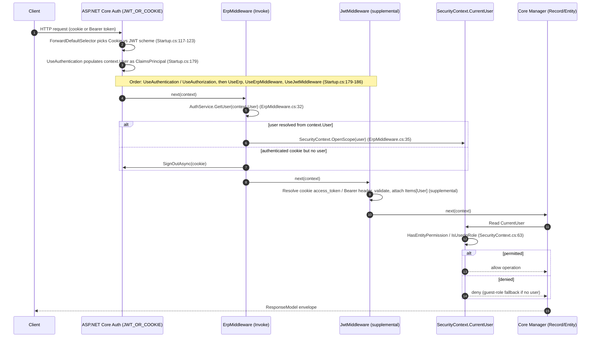

# WebVella ERP — Security & Quality Assessment

> **Document 8 of the [Reverse-Engineering / As-Built Documentation Suite](./README.md).** This assessment records the **verified security posture and code-quality profile** of WebVella ERP at the pinned commit. It is **analysis-only** — it documents *"what exists"* and notes technical debt **without remediating it**. **No production source, schema, configuration, build, or test file was modified.** Remediation ideas live only in [`modernization-roadmap.md`](./modernization-roadmap.md) and are advisory.

---

## Executive Summary

WebVella ERP authenticates requests with a **hybrid JWT-or-cookie scheme** wired in the Site host (`WebVella.Erp.Site/Startup.cs:88-125`) and resolved per request by a custom middleware (`WebVella.Erp.Web/Middleware/JwtMiddleware.cs:21-65`). Authorization is enforced **not** by the classes in the `WebVella.Erp.Web/Security/` folder — which are **entirely commented-out dead code** — but by the ASP.NET Core authentication schemes together with the domain-layer `SecurityContext` (`WebVella.Erp/Api/SecurityContext.cs:63`). Identities are represented with the framework's native `ClaimsIdentity`/`ClaimsPrincipal` (`WebVella.Erp.Web/Middleware/JwtMiddleware.cs:51-52`), and credentials are checked by hashing the supplied password and matching it against the `user` entity (`WebVella.Erp/Api/SecurityManager.cs:84-86`).

The assessment surfaces several **factual findings** worth a stakeholder's attention, each traceable to a `path:line` citation and presented as an observation rather than a fix:

- **Dead security infrastructure.** All eight files under `WebVella.Erp.Web/Security/` are 100% commented out, including the custom `AuthorizeAttribute` (`WebVella.Erp.Web/Security/AuthorizeAttribute.cs:1-147`, with a duplicated class block at `:13` and `:86`).
- **Password hashing uses unsalted MD5** via a shared static hasher (`WebVella.Erp/Utilities/PasswordUtil.cs:9-23`).
- **A hardcoded JWT signing-key fallback** is used when no key is configured (`WebVella.Erp/ErpSettings.cs:118`).
- **Two projects target the out-of-support `net7.0` runtime** (`WebVella.Erp.WebAssembly/Server/WebVella.Erp.WebAssembly.Server.csproj:4`, `WebVella.Erp.WebAssembly/Shared/WebVella.Erp.WebAssembly.Shared.csproj:4`).
- **Dynamic code execution** is available through Roslyn/CS-Script for dynamic data sources (`WebVella.Erp.Web/Services/CodeEvalService.cs:44-45`).
- **No automated CI or security scanning** exists — `.github/` holds only `FUNDING.yml` (per correction **C5**).

On code quality, complexity is concentrated in a handful of very large files — the `WebApiController` (`WebVella.Erp.Web/Controllers/WebApiController.cs`, 4,313 lines) and the core managers/repositories — while the largest files overall are the date-versioned plugin seed/migration partials. These are flagged as maintainability hotspots, consistent with [`code-inventory.md`](./code-inventory.md).

> **Scope reminder.** This document reports the system **as built**. Where a common assumption is contradicted by the code (the C1–C5 corrections inherited from the [master index](./README.md#requirement-vs-reality-corrections-c1c5)), the verified reality is reported here and the assumption is **not** propagated.

---

## Generation Metadata

| Field | Value |
|-------|-------|
| **Documentation Generated** | 2026-06-05 15:15 UTC |
| **Source commit** | `bfe15661c7f0c1dae57288d789b854186793b157` |
| **Branch** | `master` |
| **Solution** | `WebVella.ERP3.sln` (20 projects) |
| **Document role** | Security & quality assessment (auth model, dependency/CVE audit, maintainability metrics) |
| **Citation convention** | Inline `path:line` (e.g., `WebVella.Erp/Api/SecurityContext.cs:63`) or `path` for whole-file references |
| **Render target** | GitHub-Flavored Markdown (GFM) + Mermaid — renders natively on GitHub with no build step |

> **Reproducibility.** The timestamp and commit pin this assessment to an exact repository state, identical to the rest of the suite. Every claim below cites a `path:line` (or `path`) at that commit so any reader can independently verify it.

---

## Requirement vs. Reality (C1–C5) — Security Lens

The suite-wide corrections (defined once in the [master index](./README.md#requirement-vs-reality-corrections-c1c5)) carry direct security and quality implications, summarized here for this document's framing.

| ID | Common Assumption | Verified Reality (with citation) | Security/Quality Implication |
|----|-------------------|----------------------------------|------------------------------|
| **C2** | A ".NET 8 upgrade" is needed | Already on **.NET 9** — 18 of 20 projects target `net9.0`; the exceptions are **2 `net7.0`** projects (`WebVella.Erp.WebAssembly/Server/WebVella.Erp.WebAssembly.Server.csproj:4`, `WebVella.Erp.WebAssembly/Shared/WebVella.Erp.WebAssembly.Shared.csproj:4`) | The runtime is current except for **two out-of-support `net7.0` projects**, which receive no runtime security patches |
| **C3** | Entity Framework Core is used | Custom **`Db*` DAL** over **Npgsql 9.0.4** (`WebVella.Erp/Database/`); **no EF Core** | Parameterization and SQL construction are the application's own responsibility (see §1.6, §2) rather than an ORM's |
| **C5** | Docker/CI pipelines exist | **None present** — `.github/` holds only `FUNDING.yml`; **IIS InProcess** hosting (`WebVella.Erp.Site/web.config:7`) | **No automated dependency or security scanning** in the pipeline; audits are manual (see §3.1, §5) |

---

## 1. Authentication & Authorization Model

WebVella ERP uses a **hybrid authentication model** that accepts either a **cookie** (for interactive Razor/Blazor sessions) or a **JWT bearer token** (for API clients), selecting the scheme per request. Authentication (who you are) is handled by the ASP.NET Core middleware pipeline; **authorization** (what you may do) is enforced at the **domain layer** by `SecurityContext` and the manager classes, not by the (dead) `Security/` folder filters.

### 1.1 Scheme registration — the `JWT_OR_COOKIE` policy (`Startup.cs`)

The Site host registers a composite authentication scheme named `JWT_OR_COOKIE` as both the default and default-challenge scheme (`WebVella.Erp.Site/Startup.cs:88-91`). It layers three registrations:

- **Cookie** authentication (`WebVella.Erp.Site/Startup.cs:93`) — the cookie is marked `HttpOnly = true` and named `erp_auth_base` (`WebVella.Erp.Site/Startup.cs:95-96`), with login/logout/access-denied paths configured (`WebVella.Erp.Site/Startup.cs:97-99`).
- **JWT bearer** authentication (`WebVella.Erp.Site/Startup.cs:102`), whose `TokenValidationParameters` enable issuer, audience, lifetime, and signing-key validation (`WebVella.Erp.Site/Startup.cs:106-112`).
- A **policy scheme** (`WebVella.Erp.Site/Startup.cs:115`) whose `ForwardDefaultSelector` inspects the `Authorization` header: if it begins with `Bearer `, the request is routed to the JWT scheme; otherwise it falls back to the cookie scheme (`WebVella.Erp.Site/Startup.cs:117-123`).

```csharp
// WebVella.Erp.Site/Startup.cs:120-123 — per-request scheme selection
if (!string.IsNullOrEmpty(authorization) && authorization.StartsWith("Bearer ")) return JwtBearerDefaults.AuthenticationScheme;
return CookieAuthenticationDefaults.AuthenticationScheme;
```

### 1.2 Request-time token resolution (`JwtMiddleware`)

A custom middleware resolves a token on every request in its `Invoke` method (`WebVella.Erp.Web/Middleware/JwtMiddleware.cs:21-65`). It first attempts to read the cookie-stored `access_token` via `GetTokenAsync` (`WebVella.Erp.Web/Middleware/JwtMiddleware.cs:23`); if that is empty it falls back to the `Authorization` header, stripping the seven-character `Bearer ` prefix with `.Substring(7)` (`WebVella.Erp.Web/Middleware/JwtMiddleware.cs:26-32`). A resolved token is validated by `AuthService.GetValidSecurityTokenAsync` (`WebVella.Erp.Web/Middleware/JwtMiddleware.cs:42`); on success the user is loaded and attached to `HttpContext.Items["User"]` and a native `ClaimsPrincipal` is built from the token claims (`WebVella.Erp.Web/Middleware/JwtMiddleware.cs:48-52`).

> **Pipeline-order note (factual).** `JwtMiddleware` is registered **last**, in the chain `.UseErp().UseErpMiddleware().UseJwtMiddleware()`, which itself runs **after** `app.UseAuthentication()` / `app.UseAuthorization()` (`WebVella.Erp.Site/Startup.cs:179-186`). The principal that feeds the domain layer is therefore populated by **ASP.NET Core authentication** (the `JWT_OR_COOKIE` scheme of §1.1, which sets `context.User`) and consumed by **`ErpMiddleware`**, which opens the `SecurityContext` scope from `context.User` (`WebVella.Erp.Web/Middleware/ErpMiddleware.cs:32-35`) **before** `JwtMiddleware` executes. `JwtMiddleware` is thus a **supplemental/secondary token resolver**, not the primary bridge into `SecurityContext.CurrentUser`.
>
> **Finding (handled in §2.4).** Token-validation failures are swallowed by an empty `catch` block that intentionally leaves the user unattached (`WebVella.Erp.Web/Middleware/JwtMiddleware.cs:56-60`).

### 1.3 Sign-in, sign-out, and token issuance (`AuthService`)

`AuthService` mediates both cookie and JWT flows:

- **Cookie sign-in** — `Authenticate(email, password)` validates the credentials, builds a `ClaimsIdentity` under the cookie scheme (`WebVella.Erp.Web/Services/AuthService.cs:39`), and calls `SignInAsync` (`WebVella.Erp.Web/Services/AuthService.cs:50`); `Logout()` calls `SignOutAsync` (`WebVella.Erp.Web/Services/AuthService.cs:60`).
- **JWT validation** — `GetValidSecurityTokenAsync` validates the token against the configured key/issuer/audience and returns `null` on any failure (`WebVella.Erp.Web/Services/AuthService.cs:120`, validation parameters at `:127-136`).
- **JWT issuance** — `BuildTokenAsync` signs tokens with **HMAC-SHA256** (`WebVella.Erp.Web/Services/AuthService.cs:156`); access-token lifetime is **1440 minutes** with a 120-minute forced-refresh window (`WebVella.Erp.Web/Services/AuthService.cs:19-20`).

> **Observation (factual).** The cookie's `AuthenticationProperties.ExpiresUtc` is set to `DateTimeOffset.UtcNow.AddYears(100)` (`WebVella.Erp.Web/Services/AuthService.cs:44`), i.e. an effectively non-expiring authentication cookie.

### 1.4 Identity representation

Although the suite glossary names the `ErpPrincipal`/`ErpIdentity` types, the **active** identity representation at runtime is the framework's native `ClaimsIdentity`/`ClaimsPrincipal`, constructed from the validated JWT claims (`WebVella.Erp.Web/Middleware/JwtMiddleware.cs:51-52`) and from the credential claims during cookie sign-in (`WebVella.Erp.Web/Services/AuthService.cs:34-39`). The custom `ErpIdentity`/`ErpPrincipal` source files exist but are commented out (see §2.1).

### 1.5 Domain-layer authorization (`SecurityContext` / `SecurityManager`)

Once a user is established, authorization decisions are made in the core layer:

- **Ambient user** — `SecurityContext.CurrentUser` exposes the current user from an `AsyncLocal` stack (`WebVella.Erp/Api/SecurityContext.cs:34-43`); scopes are pushed/popped via `OpenScope`/`CloseScope` (`WebVella.Erp/Api/SecurityContext.cs:120-151`). For a web request this scope is opened by **`ErpMiddleware`** from the authenticated `context.User` (`WebVella.Erp.Web/Middleware/ErpMiddleware.cs:32-35`) — the **active bridge** from ASP.NET Core authentication into the domain layer.
- **Role checks** — `IsUserInRole(...)` overloads test the current user's roles (`WebVella.Erp/Api/SecurityContext.cs:45`, `:54`).
- **Entity permissions** — `HasEntityPermission(permission, entity, user)` maps Read/Create/Update/Delete to the entity's `RecordPermissions` role lists (`WebVella.Erp/Api/SecurityContext.cs:63`, `:79-86`); when no user is present, the **guest role** is evaluated instead (`WebVella.Erp/Api/SecurityContext.cs:91-106`).
- **Privileged bypass** — the built-in **system user** is granted unconditional permission (`WebVella.Erp/Api/SecurityContext.cs:74-75`); `OpenSystemScope()` opens a scope as that user (`WebVella.Erp/Api/SecurityContext.cs:134-137`), a pattern used internally for trusted operations such as credential lookup.
- **Credential verification** — `SecurityManager.GetUser(email, password)` opens a system scope, hashes the supplied password with `PasswordUtil.GetMd5Hash`, and matches it against the `user` entity via a **parameterized EQL query** (`WebVella.Erp/Api/SecurityManager.cs:77`, `:82-86`), followed by a case-insensitive email comparison (`WebVella.Erp/Api/SecurityManager.cs:90`). The hashing mechanism itself is examined in §2.2.

```csharp
// WebVella.Erp/Api/SecurityManager.cs:84-86 — parameterized credential lookup (no string concatenation)
var encryptedPassword = PasswordUtil.GetMd5Hash(password);
var result = new EqlCommand("SELECT *, $user_role.* FROM user WHERE email ~* @email AND password = @password", eqlParams /* @email, @password */).Execute();
```

### 1.6 Authentication flow (sequence diagram)

The diagram below traces a request through **ASP.NET Core authentication** (which selects the cookie or JWT scheme and populates `context.User`), the **`ErpMiddleware`** scope bridge into `SecurityContext`, the **supplemental `JwtMiddleware`** token resolver, and the domain-layer permission check used by the managers. It follows the **actual** pipeline order registered at `WebVella.Erp.Site/Startup.cs:179-186` — `UseAuthentication`/`UseAuthorization` run first, and `ErpMiddleware` opens the `SecurityContext` scope **before** `JwtMiddleware` runs.



---

## 2. Key Security Findings & Code Smells

Every item below is a **factual observation** with a citation, presented for awareness. Per the analysis-only mandate, **nothing here is remediated**; remediation options are deferred to [`modernization-roadmap.md`](./modernization-roadmap.md).

### 2.1 CRITICAL — the entire `WebVella.Erp.Web/Security/` folder is commented-out dead code

The flagship finding is that **all eight files** in `WebVella.Erp.Web/Security/` are **100% commented out** (every non-blank line begins with `//`), so none of these types participate in the running application. The custom MVC authorization filter `AuthorizeAttribute` is therefore **non-functional**, and authorization relies entirely on the host authentication schemes (§1.1) plus the domain-layer `SecurityContext` and page security (§1.5).

| File | Lines | Status |
|------|-------|--------|
| `WebVella.Erp.Web/Security/AuthorizeAttribute.cs` | 1–147 | Entirely commented out; **duplicated `class AuthorizeAttribute : ActionFilterAttribute` block** at `:13` and `:86` |
| `WebVella.Erp.Web/Security/AuthToken.cs` | 1–147 | Entirely commented out (JWT build/verify/encrypt/decrypt scaffolding) |
| `WebVella.Erp.Web/Security/WebSecurityUtil.cs` | 1–232 | Entirely commented out |
| `WebVella.Erp.Web/Security/AuthCache.cs` | 1–62 | Entirely commented out |
| `WebVella.Erp.Web/Security/ErpIdentity.cs` | 1–28 | Entirely commented out |
| `WebVella.Erp.Web/Security/ErpPrincipal.cs` | 1–12 | Entirely commented out |
| `WebVella.Erp.Web/Security/HttpForbiddenResult.cs` | 1–19 | Entirely commented out |
| `WebVella.Erp.Web/Security/HttpUnauthorizedResult.cs` | 1–19 | Entirely commented out |

> **Why this matters (factual).** The folder's presence implies a custom authorization layer that **does not run**. Any reader auditing authorization must look to `WebVella.Erp.Site/Startup.cs:88-125` and `WebVella.Erp/Api/SecurityContext.cs:63` for the **active** controls. The `AuthorizeAttribute` citation `:1-147` and its duplicated class block at `:13`/`:86` are the canonical example of this dead-code condition.

### 2.2 Password hashing uses unsalted MD5

Credential verification hashes the password with `PasswordUtil.GetMd5Hash` (`WebVella.Erp/Api/SecurityManager.cs:84`). The utility computes an **MD5** digest of the UTF-8 bytes and hex-encodes it, using a **shared static `MD5` instance** (`WebVella.Erp/Utilities/PasswordUtil.cs:9`, hashing at `:11-23`); a companion `VerifyMd5Hash` performs a case-insensitive comparison (`WebVella.Erp/Utilities/PasswordUtil.cs:25-30`).

```csharp
// WebVella.Erp/Utilities/PasswordUtil.cs:9,16 — shared static MD5, no per-credential salt
private static MD5 md5Hash = MD5.Create();
byte[] data = md5Hash.ComputeHash(Encoding.UTF8.GetBytes(input));
```

Factual properties of this implementation, stated without remediation: the hash is **unsalted**, MD5 is a **fast, general-purpose digest** (not a memory-hard password KDF), and the **shared static hasher instance** is not inherently thread-safe for concurrent `ComputeHash` calls. The same `GetMd5Hash` routine is also used by the password field type in the data layer (`WebVella.Erp/Database/DbRecordRepository.cs:554`, `:1856`) and in `RecordManager` (`WebVella.Erp/Api/RecordManager.cs:2017`).

### 2.3 Hardcoded JWT signing-key fallback

When no JWT key is supplied in configuration, the platform falls back to a **hardcoded default signing key** (`WebVella.Erp/ErpSettings.cs:118`); the issuer and audience similarly default to `webvella-erp` (`WebVella.Erp/ErpSettings.cs:119-120`).

```csharp
// WebVella.Erp/ErpSettings.cs:118 — hardcoded fallback when Settings:Jwt:Key is absent
JwtKey = string.IsNullOrWhiteSpace(configuration["Settings:Jwt:Key"]) ? "<redacted-hardcoded-fallback>" : configuration["Settings:Jwt:Key"];
```

In words: when `Settings:Jwt:Key` is unset, `ErpSettings` substitutes a **hardcoded fallback signing key** (`WebVella.Erp/ErpSettings.cs:118`). Because tokens are signed with this symmetric key via HMAC-SHA256 (`WebVella.Erp.Web/Services/AuthService.cs:155-156`), a deployment that does not override `Settings:Jwt:Key` would sign and validate tokens with a **publicly known constant**. The literal default value is **intentionally not reproduced in this document**; it can be inspected directly at the cited source line.

### 2.4 Silent exception handling on the authentication path

Both the middleware and the validation service **swallow exceptions silently**: the middleware's `try/catch` around token validation has an empty body that, by design, leaves the request unauthenticated (`WebVella.Erp.Web/Middleware/JwtMiddleware.cs:56-60`), and `GetValidSecurityTokenAsync` catches all exceptions and returns `null` (`WebVella.Erp.Web/Services/AuthService.cs:139-142`). `AuthService.GetUser(ClaimsPrincipal)` does the same when claims cannot be mapped (`WebVella.Erp.Web/Services/AuthService.cs:74-78`). The behavior is **fail-closed** for access, but it produces **no audit log** of validation failures.

### 2.5 Dynamic code execution surfaces

The platform supports **dynamic data sources** backed by runtime-compiled C#. `CodeEvalService` loads and evaluates source text through **CS-Script** (`WebVella.Erp.Web/Services/CodeEvalService.cs:44-45`), and the project references both **Microsoft.CodeAnalysis.CSharp.Scripting** (Roslyn) and **CS-Script** (`WebVella.Erp.Web/WebVella.Erp.Web.csproj:128-132`). Executing code supplied through data-source definitions is a meaningful **attack surface** (code-injection / RCE if definition authorship is not tightly controlled); it is noted here as a factual consideration.

### 2.6 Maintainability hotspots — very large files

A small number of files concentrate disproportionate size and, by inference, complexity. The hand-written hotspots are:

| File | Lines | Role |
|------|-------|------|
| `WebVella.Erp.Web/Controllers/WebApiController.cs` | 4,313 | Monolithic REST controller for the versioned API |
| `WebVella.Erp/Api/RecordManager.cs` | 2,109 | Core record CRUD + EQL read path |
| `WebVella.Erp/Database/DbRecordRepository.cs` | 2,097 | Record persistence over Npgsql |
| `WebVella.Erp/Api/EntityManager.cs` | 1,873 | Entity meta-model management |

The **largest files overall** are the date-versioned plugin partials and the SDK code generator — e.g. `WebVella.Erp.Plugins.Next/NextPlugin.20190203.cs` (11,502 lines), `WebVella.Erp.Plugins.Project/ProjectPlugin.20190203.cs` (11,035), `WebVella.Erp.Plugins.SDK/Services/CodeGenService.cs` (9,321), and `WebVella.Erp.Plugins.Mail/MailPlugin.20190215.cs` (5,499) — but these are predominantly **declarative seed/migration data** (patch-class migrations) rather than control-flow-heavy logic. These figures are consistent with [`code-inventory.md`](./code-inventory.md) and detailed per file in [`code-inventory.csv`](./code-inventory.csv).

### 2.7 Naming and consistency smells

Two type/file names carry spelling errors that propagate into their public type names, a low-severity but visible maintainability smell:

- `WebVella.Erp.Web/Middleware/SecuritityCircuitHandler.cs` — "Securitity" (transposed/duplicated letters in "Security").
- `WebVella.Erp/Jobs/SheduleManager.cs` — "Shedule" (missing "c" in "Schedule").

### 2.8 Findings summary

| # | Finding | Severity (descriptive) | Primary citation |
|---|---------|------------------------|------------------|
| F1 | Entire `Security/` folder is commented-out dead code (non-functional `AuthorizeAttribute`) | High — misleading dead code | `WebVella.Erp.Web/Security/AuthorizeAttribute.cs:1-147` |
| F2 | Unsalted MD5 password hashing | High — weak credential storage | `WebVella.Erp/Utilities/PasswordUtil.cs:9-23` |
| F3 | Hardcoded JWT signing-key fallback | High — token forgery if not overridden | `WebVella.Erp/ErpSettings.cs:118` |
| F4 | Silent exception swallowing on auth path (no audit) | Medium — observability gap | `WebVella.Erp.Web/Middleware/JwtMiddleware.cs:56-60` |
| F5 | Dynamic C# execution (Roslyn / CS-Script) | Medium — RCE surface if untrusted | `WebVella.Erp.Web/Services/CodeEvalService.cs:44-45` |
| F6 | Effectively non-expiring auth cookie (`AddYears(100)`) | Medium — session longevity | `WebVella.Erp.Web/Services/AuthService.cs:44` |
| F7 | Very large controller/managers concentrate complexity | Medium — maintainability | `WebVella.Erp.Web/Controllers/WebApiController.cs` (4,313) |
| F8 | Out-of-support `net7.0` on 2 WASM projects | Medium — unpatched runtime | `WebVella.Erp.WebAssembly/Server/WebVella.Erp.WebAssembly.Server.csproj:4` |
| F9 | Typo'd public type names | Low — naming consistency | `WebVella.Erp/Jobs/SheduleManager.cs` |

> Severities are **descriptive labels for prioritization**, not formal CVSS scores; they reflect the relative impact and exploitability of each observation as written in the code.

---

## 3. Dependency / CVE Audit

### 3.1 Audit methodology

The versions below were read **directly from the `.csproj` manifests** at commit `bfe15661`; they are reported verbatim and **none is changed by this task**. Because the repository has **no CI and no automated dependency scanning** (`.github/` holds only `FUNDING.yml`, per C5), there is no committed lockfile-driven advisory report to cite. To balance fabrication-avoidance with completeness, this audit reports **only** advisories that are **independently verifiable against authoritative advisory databases** (the GitHub Advisory Database and the NVD) and cites each to its source; concretely, it:

1. **Anchors every package to its exact pinned/declared version** (the authoritative fact in the repo).
2. **Flags version- and platform-level risks** that are determinable from the manifests and runtime (e.g., an out-of-support TFM, a platform-restricted library).
3. **Surfaces known advisories that apply to a pinned (or transitively-resolved) version** — when, and only when, the advisory is independently verifiable against an authoritative database — citing the advisory ID and source URL (see the MailKit/MimeKit advisory note in §3.4 and the .NET 9 servicing-currency note in §3.2). **No CVE/GHSA identifier appears in this document without such a citation**, and the absence of an advisory note on a row means none was substantiated at the pinned version as of the generation date, **not** that the package was proven clean.
4. **Recommends a repeatable version-tracking step** — running `dotnet list package --vulnerable --include-transitive` (or an equivalent advisory-database lookup) against these pinned versions in a CI job — as the mechanism to attach **live, continuously-updated** CVE data. This recommendation is advisory and is carried into [`modernization-roadmap.md`](./modernization-roadmap.md); it is **not** performed as a code change here.

> **Pinned vs. floating.** AutoMapper and Ical.Net are declared with exact-version brackets (`[14.0.0]`, `[4.3.1]`), i.e. **hard-pinned**; the remaining packages use minimum-version semantics. Hard-pinning aids reproducibility but can delay security patch uptake — a factual trade-off.

### 3.2 Core platform — `WebVella.Erp/WebVella.Erp.csproj`

| Package | Version | Notes / known-CVE considerations |
|---------|---------|----------------------------------|
| Npgsql | 9.0.4 | PostgreSQL ADO.NET provider; the DAL foundation (no EF Core). Track Npgsql advisories against 9.0.4 in CI. |
| AutoMapper | 14.0.0 (pinned `[14.0.0]`) | Object-to-object mapping in the data layer. Hard-pinned. |
| Irony.NetCore | 1.1.11 | Grammar/parser backbone for **EQL**. Niche package; low release cadence — monitor manually. |
| CsvHelper | 33.1.0 | CSV import/export. Parses externally supplied CSV — validate inputs. |
| Ical.Net | 4.3.1 (pinned `[4.3.1]`) | Calendar/recurrence support. Hard-pinned. |
| Newtonsoft.Json | 13.0.4 | JSON serialization across core/web/host. Historically a deserialization-gadget surface — avoid `TypeNameHandling.All` on untrusted input. |
| Storage.Net | 9.3.0 | Storage abstraction. |
| System.Drawing.Common | 9.0.10 | Image handling. **Platform risk:** unsupported on non-Windows since .NET 6 — see §3.6. |
| Microsoft.Extensions.* | 9.0.10 | Caching (`Abstractions`, `Memory`), `Configuration.Json`, `Hosting.Abstractions`, `Logging` (+ `Console`, `Debug`). Aligned to the .NET 9 BCL at the `9.0.10` servicing level — see the servicing-currency note below. |
| MimeMapping | 3.1.0 | MIME-type lookup utility. |

> **Servicing currency of the `9.0.10` packages (applies across §3.2–§3.4).** Every `Microsoft.AspNetCore.*` / `Microsoft.Extensions.*` package in this audit is pinned at **`9.0.10`**, the **October 2025 .NET 9 security release**. That release is **already patched** for the headline ASP.NET Core advisory **CVE-2025-55315** — an HTTP request/response-smuggling / security-feature-bypass flaw scored **CVSS 9.9 (Critical)**, fixed in `9.0.10` after affecting ASP.NET Core `9.0.0`–`9.0.9` — so this solution is **not** exposed to that specific issue ([MSRC advisory](https://github.com/dotnet/aspnetcore/security/advisories/GHSA-5rrx-jjjq-q2r5)). However, `9.0.10` is **not the current .NET 9 servicing level**: Microsoft ships cumulative monthly patches (`9.0.11`, `9.0.12`, …) whose later, separately-tracked advisories a `9.0.10` consumer does not yet carry. The authoritative, continuously-updated list is the [dotnet/core .NET 9 CVE log](https://github.com/dotnet/core/blob/main/release-notes/9.0/cve.md). The practical exposure of shared-framework (Kestrel) advisories is further **reduced — not eliminated —** by the IIS **InProcess** hosting posture (`WebVella.Erp.Site/web.config:7`), under which Kestrel is not the public-facing listener. This is a **servicing-currency** observation, **not** a confirmed unpatched vulnerability at `9.0.10`; tracking the latest `9.0.x` patch level is carried into [`modernization-roadmap.md`](./modernization-roadmap.md) as advisory-only.

### 3.3 Web application — `WebVella.Erp.Web/WebVella.Erp.Web.csproj`

| Package | Version | Notes / known-CVE considerations |
|---------|---------|----------------------------------|
| Microsoft.CodeAnalysis.CSharp.Scripting | 4.14.0 | Roslyn scripting for dynamic data sources. **Dynamic-code attack surface** (§2.5). Also references `Microsoft.CodeAnalysis.Common`, `.CSharp`, `.CSharp.Workspaces` at 4.14.0 (`WebVella.Erp.Web/WebVella.Erp.Web.csproj:128-131`). |
| CS-Script | 4.11.2 | Dynamic C# script execution (`CodeEvalService`). **RCE surface** if definitions are untrusted (§2.5). |
| HtmlAgilityPack | 1.12.4 | HTML parsing. Parses externally sourced HTML — treat input as untrusted. |
| System.IdentityModel.Tokens.Jwt | 8.14.0 | JWT creation/validation in `AuthService`. Keep current with Microsoft IdentityModel advisories. |
| Microsoft.AspNetCore.Mvc.NewtonsoftJson | 9.0.10 | MVC JSON formatter (Newtonsoft pipeline). |
| Microsoft.AspNetCore.Mvc.Razor.RuntimeCompilation | 9.0.10 | Runtime Razor compilation. |
| Wangkanai.Detection | 8.20.0 | Device/browser detection. |
| WebVella.TagHelpers | 1.7.2 | Platform UI tag helpers. |
| Microsoft.Extensions.FileProviders.Embedded | 9.0.10 | Embedded static-file provider. |
| Newtonsoft.Json | 13.0.4 | JSON serialization (see §3.2 note). |
| SixLabors.ImageSharp / .Drawing | 3.1.6 / 2.1.5 | **Commented out** in the manifest (`WebVella.Erp.Web/WebVella.Erp.Web.csproj:139-140`) — declared but **not active**; listed for completeness. |

### 3.4 Host, plugin, and Blazor dependencies

| Package | Version | Project / manifest | Notes |
|---------|---------|--------------------|-------|
| Microsoft.AspNetCore.Mvc.NewtonsoftJson | 9.0.10 | `WebVella.Erp.Site/WebVella.Erp.Site.csproj:49` | MVC JSON formatter (host). Recurs at the same version across the other Site hosts and Approval/Project plugins — see the deduplication note below. |
| Microsoft.Web.LibraryManager.Build | 3.0.71 | `WebVella.Erp.Site/WebVella.Erp.Site.csproj:50` | Client-library (`libman`) restore at build. |
| System.Linq | 4.3.0 | `WebVella.Erp.Site/WebVella.Erp.Site.csproj:51` | Legacy `netstandard1.x`-era reference package; resolves into the .NET 9 BCL — no third-party surface. |
| System.Threading | 4.3.0 | `WebVella.Erp.Site/WebVella.Erp.Site.csproj:52` | Legacy `netstandard1.x`-era reference package; resolves into the .NET 9 BCL — no third-party surface. |
| morelinq | 4.4.0 | `WebVella.Erp.Site/WebVella.Erp.Site.csproj:55` | LINQ extensions (host). |
| Microsoft.AspNetCore.Authentication.JwtBearer | 9.0.10 | `WebVella.Erp.Site/WebVella.Erp.Site.csproj:57` | JWT bearer scheme for the host (§1.1). Also referenced by `WebVella.Erp.Site.Project/WebVella.Erp.Site.Project.csproj:14`. |
| Microsoft.AspNetCore.Components | 9.0.10 | `WebVella.Erp.Plugins.MicrosoftCDM/WebVella.Erp.Plugins.MicrosoftCDM.csproj:10` | Blazor component runtime for the Microsoft CDM plugin UI. |
| Microsoft.AspNetCore.Components.Web | 9.0.10 | `WebVella.Erp.Plugins.MicrosoftCDM/WebVella.Erp.Plugins.MicrosoftCDM.csproj:11` | Blazor web bindings for the Microsoft CDM plugin UI. |
| MailKit | 4.14.1 | `WebVella.Erp.Plugins.Mail/WebVella.Erp.Plugins.Mail.csproj:28` | SMTP/IMAP for the Mail plugin; handles external mail servers/credentials. **Subject to a verified advisory at this version (STARTTLS injection) and pulls a transitively-affected MimeKit — see the mail-library advisory note below.** |
| Microsoft.AspNetCore.Components.WebAssembly | 9.0.10 | `WebVella.Erp.WebAssembly/Client/WebVella.Erp.WebAssembly.csproj:16` | Blazor WASM client runtime. |
| Microsoft.AspNetCore.Components.WebAssembly.DevServer | 9.0.10 | `WebVella.Erp.WebAssembly/Client/WebVella.Erp.WebAssembly.csproj:17` | Dev-time WASM host (`PrivateAssets="all"` — development-only, not shipped to production). |
| Microsoft.Extensions.Http | 9.0.10 | `WebVella.Erp.WebAssembly/Client/WebVella.Erp.WebAssembly.csproj:18` | `HttpClient` factory for the WASM client. |
| Microsoft.AspNetCore.Components.WebAssembly.Authentication | 9.0.10 | `WebVella.Erp.WebAssembly/Client/WebVella.Erp.WebAssembly.csproj:19` | Token/OIDC auth plumbing for the WASM client. |
| Blazored.LocalStorage | 4.5.0 | `WebVella.Erp.WebAssembly/Client/WebVella.Erp.WebAssembly.csproj:20` | Browser local-storage access (WASM client). |
| System.IdentityModel.Tokens.Jwt | 8.14.0 | `WebVella.Erp.WebAssembly/Client/WebVella.Erp.WebAssembly.csproj:21` | JWT handling (WASM client). |
| Microsoft.AspNetCore.Components.WebAssembly.Server | 7.0.13 | `WebVella.Erp.WebAssembly/Server/WebVella.Erp.WebAssembly.Server.csproj:10` | **On `net7.0`** — see §3.5. |

> **Audit completeness — deduplication & exclusions (synchronized with [`code-inventory.md` §4](./code-inventory.md#4-nuget-dependency-tree-summary)).** §3.2–§3.4 audit **every active direct `PackageReference`** across all 20 `.csproj` files, deduplicated by the rules below; the two documents cover the identical package set.
>
> - **Commented-out references are excluded** (declared but not built, so not an attack surface): `Microsoft.AspNetCore.ResponseCompression` 2.2.0 (`WebVella.Erp.Site/WebVella.Erp.Site.csproj:56`), `SixLabors.ImageSharp` 3.1.6 / `SixLabors.ImageSharp.Drawing` 2.1.5 (`WebVella.Erp.Web/WebVella.Erp.Web.csproj:139-140`, also noted in §3.3), `Microsoft.AspNetCore.Mvc.ViewFeatures` 2.2.0 and `Microsoft.AspNetCore.StaticFiles` 2.2.0 (`WebVella.Erp.Web/WebVella.Erp.Web.csproj:136-137`), and `Microsoft.AspNetCore.Http.Abstractions` 2.2.0 (`WebVella.Erp/WebVella.Erp.csproj:51`).
> - **Cross-project duplicates are audited once, at the primary owner above.** `Microsoft.AspNetCore.Mvc.NewtonsoftJson` 9.0.10 also appears — at the same version — at `WebVella.Erp.Plugins.Approval/WebVella.Erp.Plugins.Approval.csproj:22`, `WebVella.Erp.Plugins.Project/WebVella.Erp.Plugins.Project.csproj:52`, `WebVella.Erp.Site.Crm/WebVella.Erp.Site.Crm.csproj:12`, `WebVella.Erp.Site.Mail/WebVella.Erp.Site.Mail.csproj:12`, `WebVella.Erp.Site.MicrosoftCDM/WebVella.Erp.Site.MicrosoftCDM.csproj:9`, `WebVella.Erp.Site.Next/WebVella.Erp.Site.Next.csproj:12`, `WebVella.Erp.Site.Project/WebVella.Erp.Site.Project.csproj:13`, and `WebVella.Erp.Site.Sdk/WebVella.Erp.Site.Sdk.csproj:12`. `System.IdentityModel.Tokens.Jwt` 8.14.0 also appears in Web (§3.3). `Newtonsoft.Json` 13.0.4 and `MimeMapping` 3.1.0 recur across Core/Web/Host at the versions already audited in §3.2–§3.3. Each such package carries one advisory-tracking obligation regardless of how many projects reference it.

> **Verified mail-library advisories (MailKit direct + MimeKit transitive).** The Mail plugin's `MailKit 4.14.1` reference (`WebVella.Erp.Plugins.Mail/WebVella.Erp.Plugins.Mail.csproj:28`) is subject to two independently-verified advisories at the pinned version:
>
> - **MailKit — STARTTLS Response Injection** ([GHSA-9j88-vvj5-vhgr](https://github.com/advisories/GHSA-9j88-vvj5-vhgr) / CVE-2026-41319). An unflushed internal read buffer is not reset when the stream is upgraded to TLS during `STARTTLS`, letting a network man-in-the-middle inject pre-TLS responses that are then processed as trusted post-TLS data, enabling a **SASL authentication-mechanism downgrade** (e.g., forcing `PLAIN` instead of `SCRAM-SHA-256`). **Severity MEDIUM, CVSS 3.1 = 6.5** (`AV:N/AC:L/PR:N/UI:R/S:U/C:N/I:H/A:N`). **Affected: versions before `4.16.0`; fixed in `4.16.0`.** The pinned `4.14.1` is within the affected range, and the plugin's SMTP/IMAP path — which "handles external mail servers/credentials" — is exactly the exposed surface.
> - **MimeKit (transitive) — CRLF Injection in a quoted local-part** ([GHSA-g7hc-96xr-gvvx](https://github.com/advisories/GHSA-g7hc-96xr-gvvx) / [CVE-2026-30227](https://nvd.nist.gov/vuln/detail/CVE-2026-30227); CWE-93). A `\r\n` embedded in a quoted-string local-part of a `MailboxAddress` (`MAIL FROM` / `RCPT TO`) can inject additional SMTP commands or forge mail. **Severity MEDIUM, CVSS ≈ 6.9.** **Affected: all versions before `4.15.1`; fixed in `4.15.1`.** `MailKit 4.14.1` resolves `MimeKit` transitively on the matching `4.14.x` line (there is **no direct `MimeKit` `PackageReference`** anywhere in the solution), which is within the affected range — surfaced here per §3.1's `--include-transitive` recommendation.
> - **Single remediation (advisory-only, deferred).** Per the MailKit release notes, `MailKit 4.15.1` bumped `MimeKit` to `4.15.1` (the CRLF fix) and `MailKit 4.16.0` added the STARTTLS fix (and bumped `MimeKit` to `4.16.0`). Therefore **updating `MailKit` to `≥ 4.16.0` resolves both advisories at once** — the direct STARTTLS issue and, transitively, the MimeKit CRLF issue. This is carried into [`modernization-roadmap.md`](./modernization-roadmap.md) as advisory-only; consistent with the analysis-only mandate, **no manifest is changed by this task.**

### 3.5 Runtime risk — two projects on out-of-support `net7.0`

Of the 20 projects, **18 target `net9.0`** and **2 target `net7.0`**: the Blazor **Server** and **Shared** projects (`WebVella.Erp.WebAssembly/Server/WebVella.Erp.WebAssembly.Server.csproj:4`, `WebVella.Erp.WebAssembly/Shared/WebVella.Erp.WebAssembly.Shared.csproj:4`). `net7.0` reached end of support, meaning the **runtime no longer receives security patches**; this is the single most concrete dependency-level risk in the solution and is flagged as a high-priority hygiene item. The associated `Microsoft.AspNetCore.Components.WebAssembly.Server 7.0.13` reference is correspondingly on the 7.x line.

> **Calibration (C2).** This is **not** an argument for a ".NET 8 upgrade." The solution is already on **.NET 9**; the concrete work is bringing the two `net7.0` projects **up to `net9.0`** so all projects share one supported runtime — see [`modernization-roadmap.md`](./modernization-roadmap.md).

### 3.6 Platform risk — `System.Drawing.Common`

`System.Drawing.Common 9.0.10` (`WebVella.Erp/WebVella.Erp.csproj:63`) is **only supported on Windows** since .NET 6; on Linux/macOS its APIs throw at runtime. Combined with the IIS-InProcess/Windows hosting posture (`WebVella.Erp.Site/web.config:7`), this is consistent with the documented **Windows-only** deployment model, but it is a **portability/security constraint** to note for any cross-platform or container migration.

---

## 4. Complexity & Maintainability Metrics

### 4.1 Complexity-score methodology

This suite uses a **size-and-structure proxy** for per-file complexity rather than a full cyclomatic-complexity pass, because the deliverables are static documents with no build step. The method, defined in [`code-inventory.md`](./code-inventory.md) and applied uniformly across the suite, derives a **descriptive complexity band** primarily from **physical lines of code (LOC)**, adjusted for file role (declarative seed/migration partials are treated as lower logical complexity than control-flow-heavy managers/controllers of comparable size). Bands are indicative — **Low / Moderate / High / Very High** — and exist to direct attention, not to assign a precise numeric score. The per-file `Complexity Score` column in [`code-inventory.csv`](./code-inventory.csv) carries the authoritative value for each file.

### 4.2 Largest files (maintainability hotspots)

The hand-written logic hotspots and the largest declarative partials are restated here for the security/quality lens (full detail in [`code-inventory.csv`](./code-inventory.csv)):

| File | Lines | Band | Character |
|------|-------|------|-----------|
| `WebVella.Erp.Plugins.Next/NextPlugin.20190203.cs` | 11,502 | Very High (declarative) | Patch-class seed/migration data |
| `WebVella.Erp.Plugins.Project/ProjectPlugin.20190203.cs` | 11,035 | Very High (declarative) | Patch-class seed/migration data |
| `WebVella.Erp.Plugins.SDK/Services/CodeGenService.cs` | 9,321 | Very High (logic) | SDK code generator |
| `WebVella.Erp.Plugins.Mail/MailPlugin.20190215.cs` | 5,499 | Very High (declarative) | Patch-class seed/migration data |
| `WebVella.Erp.Web/Controllers/WebApiController.cs` | 4,313 | Very High (logic) | Monolithic versioned REST controller |
| `WebVella.Erp/Api/RecordManager.cs` | 2,109 | High (logic) | Record CRUD + EQL read path |
| `WebVella.Erp/Database/DbRecordRepository.cs` | 2,097 | High (logic) | Record persistence over Npgsql |
| `WebVella.Erp/Api/EntityManager.cs` | 1,873 | High (logic) | Entity meta-model management |

### 4.3 Distribution by module (qualitative)

- **Core (`WebVella.Erp`)** concentrates the highest-value logic complexity in the manager layer (`RecordManager`, `EntityManager`) and the DAL (`DbRecordRepository`), each near or above 2,000 lines — these are the files most worth decomposing for testability.
- **Web (`WebVella.Erp.Web`)** complexity is dominated by the single `WebApiController` (4,313 lines), which fronts the versioned `/api/v3.0/...` surface described in [`architecture.md`](./architecture.md).
- **Plugins** carry their bulk in **dated partial classes** that are largely declarative schema/seed data; their size reflects data volume, not branching depth, which is why they are banded separately.
- **Blazor (`WebVella.Erp.WebAssembly`)** is the smallest functional area but carries the **runtime-currency risk** (the two `net7.0` projects, §3.5).

### 4.4 Cross-cutting maintainability observations (factual)

- **Dead code** (§2.1) inflates the security surface area readers must reason about and is a maintainability tax in its own right.
- **Spelling drift in type names** (§2.7) reduces searchability and signals uneven review rigor.
- **No automated test gate** (there is no CI, §5) means none of the above hotspots are protected by an enforced regression suite at merge time.

---

## 5. Compliance & Data-Protection Notes

These notes are **factual** and **process-oriented**; they describe the controls present (or absent) in the code and configuration without prescribing remediation.

### 5.1 Session & token handling

- **Cookie hardening.** The authentication cookie is `HttpOnly` and explicitly named (`WebVella.Erp.Site/Startup.cs:95-96`), which mitigates script-based theft of the cookie value. The code does **not** set an explicit `Cookie.SecurePolicy` in this block, so the `Secure` attribute follows framework defaults rather than being pinned in source (factual observation at `WebVella.Erp.Site/Startup.cs:93-101`).
- **Cookie lifetime.** The cookie's authentication properties set `ExpiresUtc` to `AddYears(100)` (`WebVella.Erp.Web/Services/AuthService.cs:44`), i.e. an effectively non-expiring session marker (also noted as F6).
- **JWT handling.** Tokens are validated for issuer, audience, lifetime, and signing key (`WebVella.Erp.Site/Startup.cs:106-112`; `WebVella.Erp.Web/Services/AuthService.cs:127-136`) and signed with HMAC-SHA256 (`WebVella.Erp.Web/Services/AuthService.cs:156`). The signing key's hardcoded fallback (§2.3) is the key caveat to this otherwise standard configuration.

### 5.2 Data-at-rest and secrets

- **Credential storage** is the unsalted-MD5 mechanism documented in §2.2 (`WebVella.Erp/Utilities/PasswordUtil.cs:9-23`).
- **Runtime secret loading.** At runtime `ErpSettings` reads the database connection string from configuration (`WebVella.Erp/ErpSettings.cs:65`); the cloud-blob connection string has a disk-path default (`WebVella.Erp/ErpSettings.cs:80`), and the **JWT key** falls back to an in-source constant when unset (§2.3). Loading values *from* configuration is not the same as *securing* that configuration — see the next item.
- **Committed configuration secrets (redacted).** The repository's per-host `Config.json` files **commit secret-bearing settings in plaintext**, including database **connection strings with embedded `User Id` / `Password`**, an **`EncryptionKey`**, and — in some hosts — a JWT **`Key`** entry. Examples (paths and line ranges only; the **values are deliberately not reproduced in this document**): `WebVella.Erp.Site/Config.json:3-4,23-24` and `WebVella.Erp.Site.Project/Config.json:3-4,19-20`. This is **distinct from** the `ErpSettings` in-source fallback of §2.3: here the actual deployment secrets are checked into source control. Reported factually; remediation (secret management / externalized config) is deferred to [`modernization-roadmap.md`](./modernization-roadmap.md).
- **Committed environment posture.** The IIS host config sets `ASPNETCORE_ENVIRONMENT` to `Development` (`WebVella.Erp.Site/web.config:10`), which typically enables detailed diagnostics; this is a deployment-hygiene observation, reported factually.

### 5.3 Process gaps — no automated CI or security scanning (C5)

There is **no CI/CD pipeline and no automated security/dependency scanning** in the repository — `.github/` contains only `FUNDING.yml`, and packaging is a manual `create-nuget-pkgs.bat` step. Consequently:

- The dependency/CVE audit (§3) is **point-in-time and manual**; there is no recurring `dotnet list package --vulnerable` gate.
- The auth-path silent failures (§2.4) are **not surfaced** to any centralized monitoring by default.
- The maintainability hotspots (§4) are **not protected** by an enforced test/coverage gate.

These are recorded as **process gaps**; addressing them is an explicit, advisory-only item in [`modernization-roadmap.md`](./modernization-roadmap.md) (Phase 1: CI/CD, scanning, and dead-code removal).

---

## Appendix A — Verified Baseline Recap (C1–C5)

| Correction | As reflected in this assessment |
|------------|----------------------------------|
| **C1** (frontend) | Auth serves server-rendered **Razor** + **Blazor WASM** sessions (cookie scheme) and API clients (JWT); no SPA framework is assumed. |
| **C2** (runtime) | **.NET 9 baseline**; the only runtime risk is the **2 `net7.0`** WASM projects (§3.5). |
| **C3** (data access) | **Custom `Db*` DAL over Npgsql** — credential lookup uses **parameterized EQL** (§1.5), not an ORM. |
| **C4** (migrations) | Schema evolves via **patch-class partials**, which also explains the very large declarative files in §4.2. |
| **C5** (infra) | **No Docker/CI**; `.github/` holds only `FUNDING.yml`; **IIS InProcess** hosting — see §5.3. |

---

## Appendix B — Citation Index (primary sources)

| Topic | File(s) |
|-------|---------|
| Hybrid scheme registration | `WebVella.Erp.Site/Startup.cs:88-125` |
| Request-time token resolution | `WebVella.Erp.Web/Middleware/JwtMiddleware.cs:21-65` |
| Sign-in / JWT issuance & validation | `WebVella.Erp.Web/Services/AuthService.cs` |
| Domain authorization | `WebVella.Erp/Api/SecurityContext.cs`, `WebVella.Erp/Api/SecurityManager.cs:77` |
| Password hashing | `WebVella.Erp/Utilities/PasswordUtil.cs` |
| JWT key fallback | `WebVella.Erp/ErpSettings.cs:118-120` |
| Dead security folder | `WebVella.Erp.Web/Security/*.cs` (`AuthorizeAttribute.cs:1-147`) |
| Dynamic code execution | `WebVella.Erp.Web/Services/CodeEvalService.cs:44-45` |
| Dependency manifests | `WebVella.Erp/WebVella.Erp.csproj`, `WebVella.Erp.Web/WebVella.Erp.Web.csproj`, `WebVella.Erp.Site/WebVella.Erp.Site.csproj`, `WebVella.Erp.Plugins.Mail/WebVella.Erp.Plugins.Mail.csproj`, `WebVella.Erp.WebAssembly/Client/WebVella.Erp.WebAssembly.csproj` |
| Dependency advisories (independently verified) | MailKit STARTTLS [GHSA-9j88-vvj5-vhgr](https://github.com/advisories/GHSA-9j88-vvj5-vhgr) (CVE-2026-41319); MimeKit CRLF [GHSA-g7hc-96xr-gvvx](https://github.com/advisories/GHSA-g7hc-96xr-gvvx) ([CVE-2026-30227](https://nvd.nist.gov/vuln/detail/CVE-2026-30227)); .NET 9 servicing [dotnet/core 9.0 CVE log](https://github.com/dotnet/core/blob/main/release-notes/9.0/cve.md) and [CVE-2025-55315 MSRC advisory](https://github.com/dotnet/aspnetcore/security/advisories/GHSA-5rrx-jjjq-q2r5) |
| Runtime / infra | `*.csproj` `<TargetFramework>`, `global.json:3`, `WebVella.Erp.Site/web.config:7,10`, `.github/FUNDING.yml` |

---

*Generated 2026-06-05 15:15 UTC from source commit `bfe15661c7f0c1dae57288d789b854186793b157` (branch `master`). This is an analysis-only, reverse-engineering security & quality assessment — every finding is an observation with a `path:line` citation, **no production source, schema, configuration, build, or test file was modified**, and all output is confined to `docs/reverse-engineering/`.*
