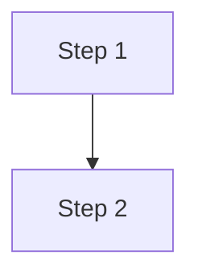
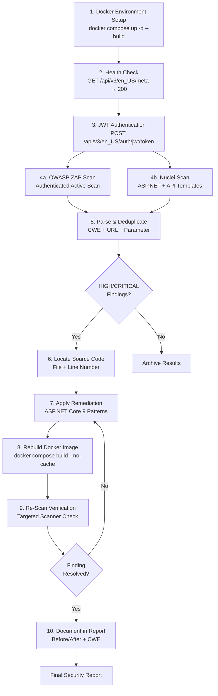

<!--{"sort_order": 1, "name": "readme", "label": "Security Assessment Overview"}-->
# Security Assessment — WebVella ERP

## Overview

This document provides a complete **dynamic security validation workflow** for [WebVella ERP](https://github.com/WebVella/WebVella-ERP) — a free and open-source web software platform targeting extreme customization and plugability for business data management needs.

**Target Application**: WebVella ERP v1.7.4 — an ASP.NET Core 9 open-source ERP system backed by PostgreSQL 16.

> Source: `README.md` — "WebVella ERP is a free and open-source web software, that targets extreme customization and plugability in service of any business data management needs."
> Source: `WebVella.Erp.Site/WebVella.Erp.Site.csproj:L4` — `<TargetFramework>net9.0</TargetFramework>`

The workflow covers **6 phases** executed sequentially:

1. **Docker Environment Setup** — Stand up the application and its PostgreSQL 16 dependency via Docker Compose
2. **Authentication** — Acquire a JWT Bearer token for authenticated scanning
3. **Attack Surface Inventory** — Review the complete API endpoint security classification (60+ endpoints)
4. **Scanner Configuration** — Configure and run OWASP ZAP and Nuclei in parallel
5. **Finding Analysis** — Parse, deduplicate, and triage scanner outputs
6. **Remediation and Verification** — Apply ASP.NET Core 9 secure coding patterns, rebuild, and re-scan

**Scanners Used**:

| Scanner | Version | Purpose |
|---------|---------|---------|
| OWASP ZAP | 2.17.0 (stable) | Dynamic Application Security Testing (DAST) — authenticated active scanning |
| Nuclei | v3.7.1 | Template-based vulnerability scanning with 9,821+ community templates (v10.3.9) |

---

## Prerequisites

The following tools must be available on the host machine before beginning the security assessment workflow.

| Prerequisite | Version | Purpose |
|---|---|---|
| Docker Engine | 24.0+ | Container runtime for application, database, and scanners |
| Docker Compose | V2 (2.20+) | Multi-container orchestration for WebVella ERP + PostgreSQL |
| OWASP ZAP | 2.17.0 | Dynamic application security testing (DAST) via Docker image `ghcr.io/zaproxy/zaproxy:stable` |
| Nuclei | v3.7.1 | Template-based vulnerability scanning via Docker image `projectdiscovery/nuclei:latest` |
| .NET 9.0 SDK | 9.0 | Building WebVella ERP (included in the Dockerfile build stage) |
| PostgreSQL | 16 | Database server (included in docker-compose.yml as a service) |
| jq | 1.7+ | Command-line JSON processor for parsing ZAP and Nuclei scan outputs |
| curl | 8.0+ | HTTP client for health check polling and JWT authentication requests |
| Git | Any | Cloning the WebVella ERP repository from GitHub |

> **Note**: The .NET 9.0 SDK and PostgreSQL 16 are provisioned automatically within Docker containers — no local installation is required for those two. Only Docker, jq, curl, and Git need to be installed on the host.

---

## Quick Start — 6-Step Procedure

This section provides a condensed end-to-end procedure. Each step links to a detailed sub-document for full instructions.

### Step 1: Environment Setup

> **Detailed guide**: [Docker Environment Setup](docker-setup.md)

Clone the repository and start the Docker environment:

```bash
git clone https://github.com/WebVella/WebVella-ERP.git && cd WebVella-ERP
docker compose up -d --build

```text

Validate health by polling the metadata endpoint until an HTTP 200 response is returned:

```bash
until curl -sf http://localhost:5000/api/v3/en_US/meta > /dev/null 2>&1; do
  echo "Waiting for WebVella ERP to start..."
  sleep 5
done
echo "WebVella ERP is ready!"

```

### Step 2: Authenticate

> **Detailed guide**: [Authentication](authentication.md)

Acquire a JWT Bearer token using the default administrator credentials (`erp@webvella.com` / `erp`):

```bash
TOKEN=$(curl -s -X POST http://localhost:5000/api/v3/en_US/auth/jwt/token \
  -H "Content-Type: application/json" \
  -d '{"email":"erp@webvella.com","password":"erp"}' | jq -r '.object')

echo "Bearer token acquired: ${TOKEN:0:20}..."

```text

> Source: `docs/developer/introduction/getting-started.md` — default account email `erp@webvella.com` and password `erp`.

### Step 3: Review Attack Surface

> **Detailed guide**: [Attack Surface Inventory](attack-surface-inventory.md)

The WebVella ERP `WebApiController.cs` exposes **60+ REST API endpoints** across the following functional groups:

- **EQL Execution** — Direct query execution endpoints (CRITICAL risk)
- **Entity Meta CRUD** — Schema management endpoints (HIGH risk)
- **Record CRUD** — Data record operations (HIGH risk)
- **File System** — Upload, move, delete handlers (HIGH risk)
- **Authentication** — JWT token issuance and refresh (MEDIUM risk)
- **Scheduling** — Background job management (MEDIUM risk)
- **Dynamic Code Compilation** — Runtime C# compilation (CRITICAL risk)

> Source: `WebVella.Erp.Web/Controllers/WebApiController.cs` — 4313 lines, 60+ routes.

### Step 4: Run Parallel Scans

> **Detailed guides**: [ZAP Scan Configuration](zap-scan-config.md) | [Nuclei Scan Configuration](nuclei-scan-config.md)

Execute OWASP ZAP and Nuclei scans **in parallel** against the running WebVella ERP instance:

```bash
# ZAP scan (background)
docker run --network host -v $(pwd)/zap-work:/zap/wrk \
  ghcr.io/zaproxy/zaproxy:stable zap-full-scan.py \
  -t http://localhost:5000 -J zap-report.json \
  -z "-config replacer.full_list(0).matchtype=REQ_HEADER \
      -config replacer.full_list(0).matchstr=Authorization \
      -config replacer.full_list(0).replacement='Bearer $TOKEN'" &

# Nuclei scan (background)
docker run --network host projectdiscovery/nuclei:latest \
  -u http://localhost:5000 -tags aspnet,api -severity critical,high \
  -H "Authorization: Bearer $TOKEN" -jsonl -o nuclei-results.jsonl &

# Wait for both scanners to complete
wait
echo "Both scans complete."

```

### Step 5: Analyze Findings

> **Detailed guide**: [Finding Analysis](finding-analysis.md)

Parse and process the scan outputs:

1. **Parse** ZAP JSON report and Nuclei JSONL output using `jq`
2. **Deduplicate** findings across scanners by matching on CWE ID + affected URL + parameter
3. **Filter** for HIGH and CRITICAL severity findings only
4. **Locate** vulnerable source code (file + line number) for each finding

### Step 6: Remediate and Verify

> **Detailed guides**: [Remediation Guide](remediation-guide.md) | [Security Report](security-report.md)

For each HIGH or CRITICAL finding:

1. Locate the vulnerable file and line number in the WebVella source
2. Apply the appropriate ASP.NET Core 9 secure coding pattern (parameterized EQL queries, `[Authorize]` attributes, output encoding, etc.)
3. Rebuild the Docker image:

   ```bash
   docker compose build --no-cache web && docker compose up -d web

   ```

4. Re-run the targeted scan check to confirm resolution
5. Document the finding in the [Security Report](security-report.md) with before/after code and scanner confirmation

---

## Document Index

### Procedure Documents

| # | Document | Description |
|---|---|---|
| 1 | [Docker Environment Setup](docker-setup.md) | Dockerfile and Docker Compose creation, container startup, health check validation |
| 2 | [Authentication](authentication.md) | JWT token acquisition via `POST /api/v3/en_US/auth/jwt/token`, Bearer header configuration |
| 3 | [Attack Surface Inventory](attack-surface-inventory.md) | Complete API endpoint inventory with security risk classification (60+ endpoints) |
| 4 | [ZAP Scan Configuration](zap-scan-config.md) | OWASP ZAP 2.17.0 authenticated active scan setup, Automation Framework YAML |
| 5 | [Nuclei Scan Configuration](nuclei-scan-config.md) | Nuclei v3.7.1 template-based scan with ASP.NET Core and API template packs |
| 6 | [Finding Analysis](finding-analysis.md) | ZAP/Nuclei output parsing, cross-scanner deduplication, severity triage |
| 7 | [Remediation Guide](remediation-guide.md) | 8 ASP.NET Core 9 secure coding patterns with before/after code examples |
| 8 | [Security Report](security-report.md) | Final per-finding report with CWE references and scanner confirmation |

### Diagrams

| Diagram | Description |
|---|---|
| [Scan Workflow](diagrams/scan-workflow.md) | End-to-end scan workflow flowchart (Mermaid) |
| [Attack Surface](diagrams/attack-surface.md) | API endpoint risk classification diagram (Mermaid) |
| [Remediation Flow](diagrams/remediation-flow.md) | Patch-rebuild-verify iterative cycle (Mermaid) |

### Related Developer Documentation

| Document | Relevance |
|---|---|
| [Getting Started](../developer/introduction/getting-started.md) | Manual (non-Docker) setup alternative and default credentials |
| [Web API Overview](../developer/web-api/overview.md) | REST API base URL conventions, CORS behavior, response format |
| [Users and Roles](../developer/users-and-roles/overview.md) | User management, role system (Administrator / Regular / Guest) |
| [Entities](../developer/entities/overview.md) | Entity modeling reference for understanding CRUD endpoints |

---

## Conventions

The following terminology, formatting conventions, and standards are used consistently throughout all security assessment documents.

### Terminology

| Term | Definition |
|---|---|
| **Finding** | A scanner-reported security issue (the output from ZAP or Nuclei) |
| **Remediation** | A code-level fix applied to resolve a finding |
| **Verification** | A targeted re-scan confirming that a remediation resolved the finding |
| **Scan target** | The application under test (not "attack target") |
| **Pre-existing finding** | A known security weakness identified through code review before scanning |

### Severity Levels

| Level | Description |
|---|---|
| **CRITICAL** | Exploitable with immediate, severe impact (e.g., RCE, unsalted password hashing) |
| **HIGH** | Exploitable with significant impact (e.g., SQLi, IDOR, stack trace leakage) |
| **MEDIUM** | Exploitable under specific conditions or with moderate impact |
| **LOW** | Minor security concern with limited exploitability |
| **INFORMATIONAL** | Security observation with no direct exploitability |

### CWE References

All findings include a [Common Weakness Enumeration (CWE)](https://cwe.mitre.org/) identifier for standardized vulnerability classification. Example: `CWE-89` for SQL Injection, `CWE-209` for Information Disclosure via Error Messages.

### Source Citations

Every technical claim in the documentation references its source file using the format:

```text
Source: <file_path>:<line_range>

```

Examples:

- `Source: WebVella.Erp.Web/Controllers/WebApiController.cs:L4287`
- `Source: WebVella.Erp.Site/Startup.cs:L58-64`
- `Source: WebVella.Erp.Site/Config.json:L24`

### Code Examples

All code examples use fenced code blocks with explicit syntax highlighting:

- **C#**: ` ```csharp `
- **JSON**: ` ```json `
- **Bash**: ` ```bash `
- **YAML**: ` ```yaml `
- **Dockerfile**: ` ```dockerfile `

### Mermaid Diagrams

Workflow visualizations use inline [Mermaid](https://mermaid.js.org/) fenced code blocks. These render natively on GitHub, in VS Code (with the Mermaid extension), and in any Mermaid-compatible Markdown renderer:

````markdown



````markdown

---

## End-to-End Workflow Overview

The following Mermaid flowchart illustrates the complete security validation workflow from environment setup through final report generation.



### Workflow Phase Summary

| Phase | Input | Output | Document |
|---|---|---|---|
| 1. Docker Setup | Repository source code | Running WebVella ERP + PostgreSQL containers | [docker-setup.md](docker-setup.md) |
| 2. Authentication | Default admin credentials | JWT Bearer token | [authentication.md](authentication.md) |
| 3. Attack Surface | WebApiController.cs route inventory | Classified endpoint inventory | [attack-surface-inventory.md](attack-surface-inventory.md) |
| 4a. ZAP Scan | Bearer token + scan scope | `zap-report.json` | [zap-scan-config.md](zap-scan-config.md) |
| 4b. Nuclei Scan | Bearer token + template packs | `nuclei-results.jsonl` | [nuclei-scan-config.md](nuclei-scan-config.md) |
| 5. Finding Analysis | ZAP JSON + Nuclei JSONL | Deduplicated HIGH/CRITICAL findings | [finding-analysis.md](finding-analysis.md) |
| 6. Remediation | Findings + source code | Patched code + rebuilt image | [remediation-guide.md](remediation-guide.md) |
| 7. Report | Remediated findings + re-scan results | Final security assessment report | [security-report.md](security-report.md) |

---

## Version Information

| Component | Version | Notes |
|---|---|---|
| WebVella ERP | v1.7.4 | Source: `WebVella.Erp/WebVella.Erp.csproj` |
| ASP.NET Core | 9.0 | Source: `WebVella.Erp.Site/WebVella.Erp.Site.csproj:L4` |
| PostgreSQL | 16 | Source: `docs/developer/introduction/overview.md` |
| OWASP ZAP | 2.17.0 (stable) | Docker image: `ghcr.io/zaproxy/zaproxy:stable` |
| Nuclei | v3.7.1 | Docker image: `projectdiscovery/nuclei:latest` |
| Nuclei Templates | v10.3.9 | 9,821+ community templates |

---

*Back to [Developer Documentation](../developer/introduction/overview.md) · See [Getting Started](../developer/introduction/getting-started.md) for manual setup alternative*
