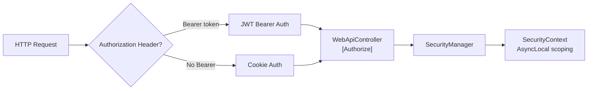
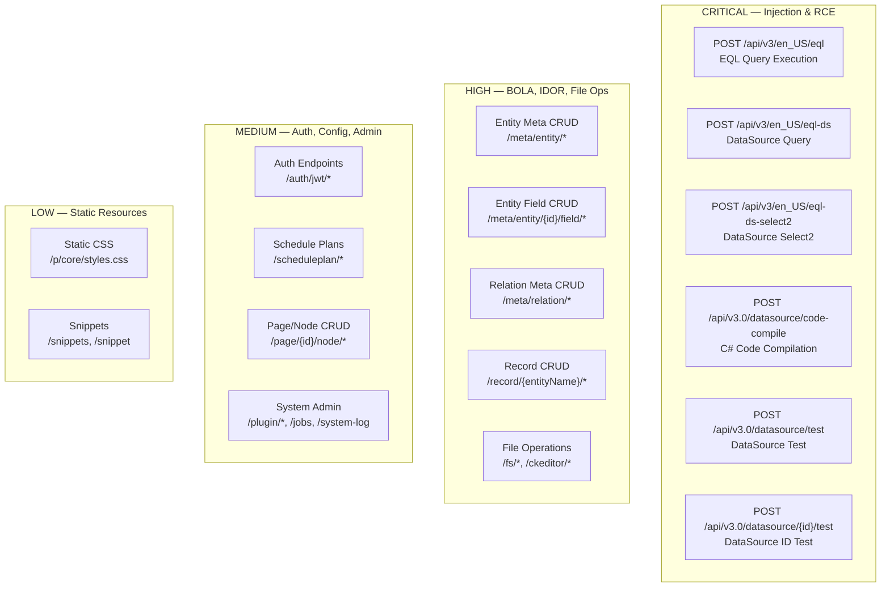

<!--{"sort_order": 4, "name": "attack-surface-inventory", "label": "Attack Surface Inventory"}-->
# Attack Surface Inventory — WebVella ERP API

## Overview

This document provides a complete endpoint inventory of all REST API routes exposed by WebVella ERP's `WebApiController.cs` (4313 lines, 60+ endpoints), categorized by functional group and classified by security risk level. It serves as the definitive reference for scoping OWASP ZAP and Nuclei security scans.

Every endpoint listed below was extracted directly from the source code by analyzing `[Route("...")]`, `[HttpGet]`, `[HttpPost]`, `[HttpPut]`, `[HttpPatch]`, `[HttpDelete]`, and `[AcceptVerbs]` attributes across the controller hierarchy.

> **Cross-reference**: See [Web API Overview](../developer/web-api/overview.md) for base URL and response format conventions.

> **Cross-reference**: See [Authentication](authentication.md) for scan authentication setup.

> **Cross-reference**: See [Docker Environment Setup](docker-setup.md) for starting the scan target environment.

---

## Controller Architecture Overview

The WebVella ERP API surface is served primarily by a single controller class:

- **`WebApiController`** extends `ApiControllerBase` and is decorated with `[Authorize]` at the class level (line 36), meaning **all endpoints require authentication by default** unless explicitly overridden with `[AllowAnonymous]`.
- **`ApiControllerBase`** extends `Controller` and is also decorated with `[Authorize]` (line 9). It provides shared response helper methods (`DoResponse`, `DoBadRequestResponse`, `DoPageNotFoundResponse`).
- **`AdminController`** (in `WebVella.Erp.Plugins.SDK`) is a separate controller with `[Authorize(AuthenticationSchemes = CookieAuthenticationDefaults.AuthenticationScheme)]`, serving SDK-specific routes.

> Source: `WebVella.Erp.Web/Controllers/WebApiController.cs:L36-37`
> Source: `WebVella.Erp.Web/Controllers/ApiControllerBase.cs:L9-10`

### Authentication Scheme

The application uses a **dual authentication policy** named `JWT_OR_COOKIE`:

- If the request contains an `Authorization: Bearer ...` header, it forwards to the **JWT Bearer** handler.
- Otherwise, it falls back to the **Cookie** authentication handler (`erp_auth_base` cookie).

> Source: `WebVella.Erp.Site/Startup.cs:L88-125`

### Role-Based Access Control

Endpoints are protected at two levels:

1. **Class-level `[Authorize]`** — requires any authenticated user (line 36).
2. **Method-level `[Authorize(Roles = "administrator")]`** — restricts to administrator role only (applied to 25+ endpoints including all entity meta, relation meta, scheduling, plugin, job, and system log endpoints).
3. **`[AllowAnonymous]`** — explicitly permits unauthenticated access (applied to only 3 endpoints: static CSS, JWT token, JWT token refresh).

---

## Security Architecture Overview



> Source: `WebVella.Erp.Site/Startup.cs:L115-125` for `JWT_OR_COOKIE` policy scheme

### CORS Configuration

The application uses a permissive default CORS policy:

```csharp
services.AddCors(options =>
{
    options.AddDefaultPolicy(policy =>
        policy.AllowAnyOrigin()
            .AllowAnyMethod()
            .AllowAnyHeader());
});
```

> Source: `WebVella.Erp.Site/Startup.cs:L59-64`

> **⚠️ Security Note**: `AllowAnyOrigin()` combined with `AllowAnyMethod()` and `AllowAnyHeader()` means any domain can make cross-origin requests to all API endpoints. This is a known misconfiguration that scanners will flag.

---

## Complete Endpoint Inventory

The following tables document every active (non-commented-out) route in the `WebApiController`. Routes are organized by functional group and include authorization requirements and risk classification.

### Legend

| Column | Description |
|---|---|
| **Route** | The URL pattern as declared in the `[Route]` or `[AcceptVerbs]` attribute |
| **HTTP Method** | GET, POST, PUT, PATCH, or DELETE |
| **Auth Required** | `Yes` = class-level `[Authorize]`; `Admin` = `[Authorize(Roles = "administrator")]`; `No` = `[AllowAnonymous]` |
| **Risk Level** | CRITICAL / HIGH / MEDIUM / LOW — based on potential security impact |
| **Notes** | Security-relevant observations |

---

### 1. EQL Execution Endpoints — CRITICAL Risk

Direct EQL (Entity Query Language) and data source query execution endpoints. These accept user-supplied query strings or data source parameters and execute them against the database, presenting a direct injection surface.

| Route | HTTP Method | Auth Required | Risk Level | Notes |
|---|---|---|---|---|
| `api/v3/en_US/eql` | POST | Yes | CRITICAL | Executes arbitrary EQL queries via `EqlCommand`. Accepts `model.Eql` and `model.Parameters` from request body. Source: L63-95 |
| `api/v3/en_US/eql-ds` | POST | Yes | CRITICAL | Executes named data source queries. Supports both `DatabaseDataSource` (EQL) and `CodeDataSource` (dynamic C# execution). Source: L97-188 |
| `api/v3/en_US/eql-ds-select2` | POST | Yes | CRITICAL | Select2-formatted data source query. Same execution paths as `eql-ds` but formats response for Select2 widget. Source: L190-337 |

> **Scan Target Priority**: These endpoints should be the highest priority for SQL injection (CWE-89) testing. The `eql` endpoint directly executes user-supplied EQL strings. The `eql-ds` endpoint also supports `CodeDataSource` execution, which invokes dynamically compiled C# code.

---

### 2. Dynamic Code Compilation Endpoints — CRITICAL Risk

Endpoints that compile and/or execute arbitrary C# code at runtime, using the `Microsoft.CodeAnalysis.CSharp.Scripting` package.

| Route | HTTP Method | Auth Required | Risk Level | Notes |
|---|---|---|---|---|
| `api/v3.0/datasource/code-compile` | POST | Yes | CRITICAL | Compiles arbitrary C# code via `CodeEvalService.Compile()`. Accepts `DataSourceCodeTestModel.CsCode` from body. Remote Code Execution (RCE) surface. Source: L494-509 |
| `api/v3.0/datasource/test` | POST | Yes | CRITICAL | Tests a data source definition including code data sources. Source: L511-541 |
| `api/v3.0/datasource/{dataSourceId}/test` | POST | Yes | CRITICAL | Tests a specific data source by ID, executes data source logic. Source: L542-600 |

> **Scan Target Priority**: The `code-compile` endpoint is the single most dangerous endpoint in the API — it accepts arbitrary C# code and compiles it (CWE-94: Improper Control of Generation of Code). Even without direct execution, compilation output can leak system information.

---

### 3. Entity Meta CRUD Endpoints — HIGH Risk

Full CRUD operations on entity schema definitions. Modifying entity metadata alters the database schema structure, which could be exploited for IDOR (Insecure Direct Object Reference) attacks to alter system-level entities.

| Route | HTTP Method | Auth Required | Risk Level | Notes |
|---|---|---|---|---|
| `api/v3/en_US/meta/entity/list` | GET | Admin | HIGH | Lists all entity definitions. Hash-based cache invalidation. Source: L1436-1448 |
| `api/v3/en_US/meta/entity/id/{entityId}` | GET | Admin | HIGH | Get entity metadata by GUID. Source: L1452-1458 |
| `api/v3/en_US/meta/entity/{Name}` | GET | Admin | HIGH | Get entity metadata by name. Source: L1462-1468 |
| `api/v3/en_US/meta/entity` | POST | Admin | HIGH | Create a new entity definition. Source: L1473-1490 |
| `api/v3/en_US/meta/entity/{StringId}` | PATCH | Admin | HIGH | Partial update entity. Iterates over submitted properties dynamically. Source: L1494-1561 |
| `api/v3/en_US/meta/entity/{StringId}` | DELETE | Admin | HIGH | Delete entity. Accepts string ID parsed as GUID. Source: L1566-1587 |

> **Scan Target Notes**: All entity meta endpoints require `administrator` role. However, IDOR testing is relevant if an authenticated non-admin can craft requests targeting these routes. The `PATCH` endpoint dynamically iterates over submitted JSON properties, which widens the attack surface.

---

### 4. Entity Field CRUD Endpoints — HIGH Risk

CRUD operations on entity field definitions within an entity. Modifying fields changes database column structure.

| Route | HTTP Method | Auth Required | Risk Level | Notes |
|---|---|---|---|---|
| `api/v3/en_US/meta/entity/{Id}/field` | POST | Admin | HIGH | Create field on entity. Uses `InputField.ConvertField()` dynamic deserialization. Source: L1592-1617 |
| `api/v3/en_US/meta/entity/{Id}/field/{FieldId}` | PUT | Admin | HIGH | Update field. Dynamic field type detection via `fieldTypeProp`. Source: L1619-1673 |
| `api/v3/en_US/meta/entity/{Id}/field/{FieldId}` | PATCH | Admin | HIGH | Partial update field. Large switch statement covering all 20+ field types. Source: L1675-1979 |
| `api/v3/en_US/meta/entity/{Id}/field/{FieldId}` | DELETE | Admin | HIGH | Delete field from entity. Source: L1981-2001 |

---

### 5. Entity Relation Meta Endpoints — HIGH Risk

CRUD operations on entity relationship definitions. Altering relations can break referential integrity.

| Route | HTTP Method | Auth Required | Risk Level | Notes |
|---|---|---|---|---|
| `api/v3/en_US/meta/relation/list` | GET | Admin | HIGH | List all entity relations. Hash-based cache invalidation. Source: L2008-2020 |
| `api/v3/en_US/meta/relation/{name}` | GET | Admin | HIGH | Get relation by name. Source: L2024-2030 |
| `api/v3/en_US/meta/relation` | POST | Admin | HIGH | Create entity relation. Auto-assigns GUID if missing. Source: L2035-2052 |
| `api/v3/en_US/meta/relation/{RelationIdString}` | PUT | Admin | HIGH | Update entity relation. Source: L2056-2079 |
| `api/v3/en_US/meta/relation/{idToken}` | DELETE | Admin | HIGH | Delete entity relation. Source: L2083-2098 |

---

### 6. Record CRUD Endpoints — HIGH Risk

Full CRUD on entity data records. These are the primary data access endpoints, vulnerable to Broken Object-Level Authorization (BOLA/IDOR) if record-level access control is insufficient.

| Route | HTTP Method | Auth Required | Risk Level | Notes |
|---|---|---|---|---|
| `api/v3/en_US/record/{entityName}/{recordId}` | GET | Yes | HIGH | Get single record by entity name and record ID. No record-level permission check in controller. Source: L2504-2517 |
| `api/v3/en_US/record/{entityName}/{recordId}` | DELETE | Yes | HIGH | Delete record. Uses database transaction. Source: L2521-2551 |
| `api/v3/en_US/record/{entityName}/regex/{fieldName}` | POST | Yes | HIGH | Query records by field regex pattern. Accepts regex pattern from request body. Source: L2555-2568 |
| `api/v3/en_US/record/{entityName}` | POST | Yes | HIGH | Create record. Auto-generates ID if not provided. Source: L2573-2612 |
| `api/v3/en_US/record/{entityName}/with-relation/{relationName}/{relatedRecordId}` | POST | Yes | HIGH | Create record with automatic relation attachment. Complex multi-entity transaction. Source: L2614-2783 |
| `api/v3/en_US/record/{entityName}/{recordId}` | PUT | Yes | HIGH | Full record update. Throws exception for `user` entity name. Source: L2788-2833 |
| `api/v3/en_US/record/{entityName}/{recordId}` | PATCH | Yes | HIGH | Partial record update. Throws exception for `user` entity name. Source: L2837-2875 |
| `api/v3/en_US/record/{entityName}/list` | GET | Yes | HIGH | List records with optional ID filtering, field selection, and pagination. Source: L2878-2973 |
| `api/v3/en_US/record/{entityName}/import` | POST | Yes | HIGH | Import records from CSV file. Accepts file path from request body. Source: L2989-3005 |
| `api/v3/en_US/record/{entityName}/import-evaluate` | POST | Yes | HIGH | Evaluate CSV import without committing. Source: L3010-3018 |
| `api/v3/en_US/record/relation` | POST | Yes | HIGH | Update entity relation record (attach/detach). Complex many-to-many transaction logic. Source: L2106-2300 |
| `api/v3/en_US/record/relation/reverse` | POST | Yes | HIGH | Update entity relation record in reverse direction. Source: L2305-2499 |

> **Scan Target Priority**: Record endpoints are the primary BOLA (CWE-639) scan target. The controller does not implement record-level authorization checks — it relies on `RecordManager` internal logic. Test by accessing records belonging to different users/roles.

---

### 7. File System Endpoints — HIGH Risk

File upload, download, move, and delete operations. Multiple upload handlers exist with no visible content-type validation or file size limits in the controller code.

| Route | HTTP Method | Auth Required | Risk Level | Notes |
|---|---|---|---|---|
| `/fs/{fileName}` (+ 4 nested path variants: `/fs/{root}/{fileName}`, `/fs/{root}/{root2}/{fileName}`, `/fs/{root}/{root2}/{root3}/{fileName}`, `/fs/{root}/{root2}/{root3}/{root4}/{fileName}`) | GET | Yes | HIGH | File download. Single action method with 5 route patterns for 0–4 subdirectory levels. No path traversal validation in controller — relies on `DbFileRepository.Find()`. Source: L3252-3324 |
| `/fs/upload/` | POST | Yes | HIGH | Single file upload. No content-type validation, no file size limit enforced in controller. Source: L3327-3345 |
| `/fs/move/` | POST | Yes | HIGH | Move file from `source` to `target` path. Paths accepted directly from request body with no sanitization. Path traversal surface (CWE-22). Source: L3347-3368 |
| `{*filepath}` | DELETE | Yes | HIGH | **Wildcard file deletion**. Matches any path. Accepts `filepath` route parameter with no validation. Source: L3370-3383 |
| `/fs/upload-user-file-multiple/` | POST | Yes | HIGH | Multi-file upload with user-scoped storage. No content-type or extension filtering. Source: L4041-4132 |
| `/fs/upload-file-multiple/` | POST | Yes | HIGH | Multi-file upload to temp storage. No content-type or extension filtering. Source: L4134-4214 |
| `/ckeditor/drop-upload-url` | POST | Yes | HIGH | CKEditor drag-drop upload. Creates file in `tmp/` then moves to user file storage. Source: L3962-4006 |
| `/ckeditor/image-upload-url` | POST | Yes | HIGH | CKEditor image upload. Returns HTML with inline JavaScript — potential XSS vector if `CKEditorFuncNum` is not sanitized. Source: L4009-4039 |

> **Scan Target Priority**: File upload handlers should be tested for unrestricted file upload (CWE-434), path traversal (CWE-22), and the wildcard DELETE route (`{*filepath}`) for arbitrary file deletion. The `/ckeditor/image-upload-url` endpoint outputs HTML with user-supplied `CKEditorFuncNum` parameter injected into inline script — test for reflected XSS (CWE-79).

---

### 8. Authentication Endpoints — MEDIUM Risk

JWT token issuance and refresh endpoints. These are the only non-static `[AllowAnonymous]` endpoints in the controller, meaning they are accessible without any authentication.

| Route | HTTP Method | Auth Required | Risk Level | Notes |
|---|---|---|---|---|
| `api/v3/en_US/auth/jwt/token` | POST | **No** (`[AllowAnonymous]`) | MEDIUM | JWT token issuance. Accepts email + password. **Stack trace leakage**: error handler returns `e.Message + e.StackTrace` (L4287). Source: L4273-4290 |
| `api/v3/en_US/auth/jwt/token/refresh` | POST | **No** (`[AllowAnonymous]`) | MEDIUM | JWT token refresh. Accepts existing token. **Stack trace leakage**: error handler returns `e.Message + e.StackTrace` (L4306). Source: L4292-4309 |

> **Scan Target Priority**: Test for brute-force resistance (no rate limiting observed), information disclosure via stack trace leakage (CWE-209), and token handling weaknesses. Both endpoints expose full exception stack traces in error responses.

---

### 9. Schedule Plan Management Endpoints — MEDIUM Risk

Background job scheduling management endpoints. All require administrator role.

| Route | HTTP Method | Auth Required | Risk Level | Notes |
|---|---|---|---|---|
| `api/v3/en_US/scheduleplan/list` | GET | Admin | MEDIUM | List all schedule plans. Source: L3704-3725 |
| `api/v3/en_US/scheduleplan/{planId}` | GET | Admin | MEDIUM | Get schedule plan by ID. Error returns `e.Message + e.StackTrace`. Source: L3727-3757 |
| `api/v3/en_US/scheduleplan/{planId}` | PUT | Admin | MEDIUM | Update schedule plan. Complex validation. Stack trace in errors (L3655). Source: L3449-3669 |
| `api/v3/en_US/scheduleplan/{planId}/trigger` | POST | Admin | MEDIUM | Immediately trigger a schedule plan. Stack trace in errors (L3695). Source: L3671-3702 |
| `api/v3/en_US/scheduleplan/test` | GET | Admin | MEDIUM | Create test schedule plan with hardcoded GUID. Stack trace in errors (L3807). Source: L3759-3811 |

> **Scan Target Notes**: All scheduling endpoints return `e.Message + e.StackTrace` in error responses — information disclosure surface (CWE-209).

---

### 10. Page and Node Management Endpoints — MEDIUM Risk

CRUD operations for application pages and page component nodes. These endpoints modify the application UI structure. All have commented-out `[AllowAnonymous]` attributes in the source, indicating they were temporarily opened during development.

| Route | HTTP Method | Auth Required | Risk Level | Notes |
|---|---|---|---|---|
| `api/v3.0/page/{pageId}/node/create` | POST | Yes | MEDIUM | Create page body node. Commented-out `[AllowAnonymous]` at L602. Source: L603-648 |
| `api/v3.0/page/{pageId}/node/{nodeId}/update` | POST | Yes | MEDIUM | Update page body node. Commented-out `[AllowAnonymous]` at L650. Source: L651-694 |
| `api/v3.0/page/{pageId}/node/{nodeId}/move` | POST | Yes | MEDIUM | Move page body node. Commented-out `[AllowAnonymous]` at L695. Source: L696-752 |
| `api/v3.0/page/{pageId}/node/{nodeId}/delete` | POST | Yes | MEDIUM | Delete page body node. Commented-out `[AllowAnonymous]` at L753. Source: L754-786 |
| `api/v3.0/page/{pageId}/node/{nodeId}/options/update` | POST | Yes | MEDIUM | Update page body node options (JSON payload). Commented-out `[AllowAnonymous]` at L787. Source: L788-821 |
| `api/v3.0/pc/{fullComponentName}/view/{renderMode}` | POST | Yes | MEDIUM | Render a page component in specified mode. Commented-out `[AllowAnonymous]` at L822. Source: L823-996 |
| `api/v3.0/pc/{fullComponentName}/resource/{filename}` | GET | Yes | MEDIUM | Serve page component resource file. Commented-out `[AllowAnonymous]` at L996. Source: L997-1037 |

> **Scan Target Notes**: The commented-out `[AllowAnonymous]` attributes (e.g., `//[AllowAnonymous] //Needed only when webcomponent development`) indicate these endpoints may be inadvertently opened in development builds. Verify that authentication is enforced in the scan target.

---

### 11. User Preferences Endpoints — MEDIUM Risk

User preference management endpoints for UI state (sidebar size, section collapse state).

| Route | HTTP Method | Auth Required | Risk Level | Notes |
|---|---|---|---|---|
| `api/v3.0/user/preferences/toggle-sidebar-size` | POST | Yes | MEDIUM | Toggle sidebar size preference. Accesses `AuthService.GetUser(User)`. Source: L340-375 |
| `api/v3.0/user/preferences/toggle-section-collapse` | POST | Yes | MEDIUM | Toggle section collapse state. Stores per-node collapsed/uncollapsed state. Source: L377-492 |

---

### 12. UI Component Support Endpoints — MEDIUM Risk

Server-side API support for UI field components (multi-select, select field options, table data preview).

| Route | HTTP Method | Auth Required | Risk Level | Notes |
|---|---|---|---|---|
| `api/v3.0/p/core/related-field-multiselect` | GET, POST | Yes | MEDIUM | Related field multi-select typeahead. Accepts `entityName`, `fieldName`, `search` as query parameters — potential for EQL injection if not parameterized. Source: L1138-1214 |
| `api/v3.0/p/core/select-field-add-option` | PUT | Yes | MEDIUM | Add option to select/multi-select field. Modifies entity field definitions. Source: L1217-1336 |
| `api/v3.0/{lang}/p/core/ui/field-table-data/generate/preview` | POST | Yes | MEDIUM | Generate table data preview from CSV. Language route parameter. Source: L1339-1429 |

---

### 13. Quick Search Endpoint — MEDIUM Risk

Entity record search endpoint with extensive query-building parameters.

| Route | HTTP Method | Auth Required | Risk Level | Notes |
|---|---|---|---|---|
| `api/v3/en_US/quick-search` | GET | Yes | MEDIUM | Search records with configurable match methods (EQ, contains, startsWith, FTS). Accepts `entityName`, `query`, `lookupFieldsCsv`, `forceFiltersCsv`. The `forceFiltersCsv` parameter uses a custom `fieldName:dataType:eqValue` format parsed without extensive validation. Source: L3020-3246 |

---

### 14. System Administration Endpoints — MEDIUM Risk

Plugin listing, job management, system log access, and user file management.

| Route | HTTP Method | Auth Required | Risk Level | Notes |
|---|---|---|---|---|
| `api/v3/en_US/plugin/list` | GET | Admin | MEDIUM | List installed plugins. Source: L3402-3414 |
| `api/v3/en_US/jobs` | GET | Admin | MEDIUM | Query background jobs with date filters. Error returns `e.Message + e.StackTrace` (L3437). Source: L3419-3441 |
| `api/v3/en_US/system-log` | GET | Admin | MEDIUM | Query system log records. Uses EQL queries internally. Source: L3816-3881 |
| `api/v3/en_US/user_file` | GET | Yes | MEDIUM | List user files with search and pagination. Error returns `e.Message + e.StackTrace` (L3900). Source: L3886-3904 |
| `api/v3/en_US/user_file` | POST | Yes | MEDIUM | Create user file record from path. Source: L3906-3959 |

---

### 15. Snippet Endpoints — LOW Risk

Code snippet lookup endpoints for the content editor.

| Route | HTTP Method | Auth Required | Risk Level | Notes |
|---|---|---|---|---|
| `api/v3/en_US/snippets` | GET | Yes | LOW | List snippet names with search and pagination. Source: L4234-4243 |
| `api/v3/en_US/snippet` | GET | Yes | LOW | Get snippet text by name. Error returns `e.Message + e.StackTrace` (L4262). Source: L4245-4266 |

---

### 16. Anonymous / Static Endpoints — LOW Risk

Endpoints explicitly marked with `[AllowAnonymous]` that serve static or public resources.

| Route | HTTP Method | Auth Required | Risk Level | Notes |
|---|---|---|---|---|
| `api/v3.0/p/core/styles.css` | GET | **No** (`[AllowAnonymous]`) | LOW | Dynamic CSS generation. Source: L1038-1063 |

---

### 17. SDK Plugin Endpoints (AdminController)

These endpoints are served by `AdminController` in `WebVella.Erp.Plugins.SDK`, which uses **cookie-only authentication** (`[Authorize(AuthenticationSchemes = CookieAuthenticationDefaults.AuthenticationScheme)]`).

| Route | HTTP Method | Auth Required | Risk Level | Notes |
|---|---|---|---|---|
| `api/v3.0/p/sdk/datasource/list` | GET | Yes (Cookie) | MEDIUM | List all data sources. Source: `AdminController.cs:L39-47` |

> **Note**: The SDK `AdminController` is a separate controller with its own authentication scheme. It uses cookie-only auth, so JWT Bearer tokens will not authenticate against these routes.

---

## Security Risk Classification Matrix

| Risk Level | Count | OWASP Category | Key Scan Targets |
|---|---|---|---|
| **CRITICAL** | 6 | A03:2021 Injection, A08:2021 Software and Data Integrity | EQL execution (`/eql`, `/eql-ds`, `/eql-ds-select2`), code compilation (`/datasource/code-compile`, `/datasource/test`, `/datasource/{id}/test`) |
| **HIGH** | 35 | A01:2021 Broken Access Control, A04:2021 Insecure Design | Entity meta CRUD (6), entity field CRUD (4), relation meta (5), record CRUD (12), file system operations (8) |
| **MEDIUM** | 26 | A07:2021 Identification and Authentication Failures, A05:2021 Security Misconfiguration | Authentication (2), scheduling (5), page/node management (7), user preferences (2), UI components (3), quick search (1), system administration (5), SDK plugin (1) |
| **LOW** | 3 | — | Static CSS (1), snippets (2) |
| **Total** | **70** | | Counts unique action methods; file download counts as 1 endpoint with 5 route patterns |

---

## Attack Surface Classification Graph



---

## Key Security Observations

### 1. Information Disclosure via Stack Traces (CWE-209)

Multiple endpoints return `e.Message + e.StackTrace` in error responses. This pattern appears in at least 15 endpoints across the controller:

- JWT token endpoints: L4287, L4306
- Job management: L3437
- Schedule plan management: L3655, L3695, L3807
- User file management: L3900, L3955
- System log: L3877
- Snippet retrieval: L4262
- `ApiControllerBase.DoBadRequestResponse()` in development mode: `ApiControllerBase.cs:L52`

> Source: `WebVella.Erp.Web/Controllers/WebApiController.cs` — multiple locations listed above
> Source: `WebVella.Erp.Web/Controllers/ApiControllerBase.cs:L49-53`

### 2. No Content-Type Validation on File Uploads (CWE-434)

None of the five file upload endpoints validate the uploaded file's content type, extension, or magic bytes:

- `/fs/upload/` (L3327)
- `/fs/upload-user-file-multiple/` (L4041)
- `/fs/upload-file-multiple/` (L4134)
- `/ckeditor/drop-upload-url` (L3962)
- `/ckeditor/image-upload-url` (L4009)

### 3. Wildcard Delete Route (CWE-22)

The `DELETE {*filepath}` route at L3370 matches **any URL path** for deletion. The path is lowercased but otherwise passed directly to `DbFileRepository.Delete()` with no validation.

### 4. Permissive CORS Policy (CWE-942)

`AllowAnyOrigin()` + `AllowAnyMethod()` + `AllowAnyHeader()` permits all cross-origin requests. Source: `Startup.cs:L59-64`.

### 5. Commented-Out AllowAnonymous Attributes

Seven page/node management endpoints have `//[AllowAnonymous]` comments, indicating they were previously or intermittently accessible without authentication during development (L602, L650, L695, L753, L787, L822, L996).

### 6. Missing Record-Level Authorization

Record CRUD endpoints (`/record/{entityName}/*`) use class-level `[Authorize]` but do not enforce entity-level `RecordPermissions` (CanRead, CanUpdate, CanDelete role GUIDs) at the controller level. Authorization is delegated entirely to `RecordManager` internal logic.

---

## Scan Scope Summary

For use in ZAP and Nuclei scan configuration, the following URL patterns cover the complete API attack surface:

| Scope Pattern | Endpoints Covered | Priority |
|---|---|---|
| `http://localhost:5000/api/v3/en_US/eql*` | EQL execution (3 endpoints) | P1 — CRITICAL |
| `http://localhost:5000/api/v3.0/datasource/*` | Code compilation and DS tests (3 endpoints) | P1 — CRITICAL |
| `http://localhost:5000/api/v3/en_US/meta/entity/*` | Entity meta CRUD (6 endpoints) | P2 — HIGH |
| `http://localhost:5000/api/v3/en_US/meta/entity/*/field/*` | Entity field CRUD (4 endpoints) | P2 — HIGH |
| `http://localhost:5000/api/v3/en_US/meta/relation/*` | Relation meta CRUD (5 endpoints) | P2 — HIGH |
| `http://localhost:5000/api/v3/en_US/record/*` | Record CRUD (12 endpoints) | P2 — HIGH |
| `http://localhost:5000/fs/*` | File download, upload, move, delete | P2 — HIGH |
| `http://localhost:5000/ckeditor/*` | CKEditor file uploads (2 endpoints) | P2 — HIGH |
| `http://localhost:5000/api/v3/en_US/auth/jwt/*` | JWT authentication (2 endpoints) | P3 — MEDIUM |
| `http://localhost:5000/api/v3/en_US/scheduleplan/*` | Schedule management (5 endpoints) | P3 — MEDIUM |
| `http://localhost:5000/api/v3.0/page/*` | Page/node management (7 endpoints) | P3 — MEDIUM |
| `http://localhost:5000/api/v3/en_US/*` | All remaining v3 endpoints | P4 — LOW |

---

## Next Steps

- **[ZAP Scan Configuration](zap-scan-config.md)** — Configure OWASP ZAP authenticated active scan using the scope patterns above.
- **[Nuclei Scan Configuration](nuclei-scan-config.md)** — Configure Nuclei template-based scan with ASP.NET Core templates.
- **[Authentication](authentication.md)** — Obtain JWT Bearer token for authenticated scanning.

---

> **Navigation**: [← Authentication](authentication.md) | [Security Assessment Overview](README.md) | [ZAP Scan Configuration →](zap-scan-config.md)
