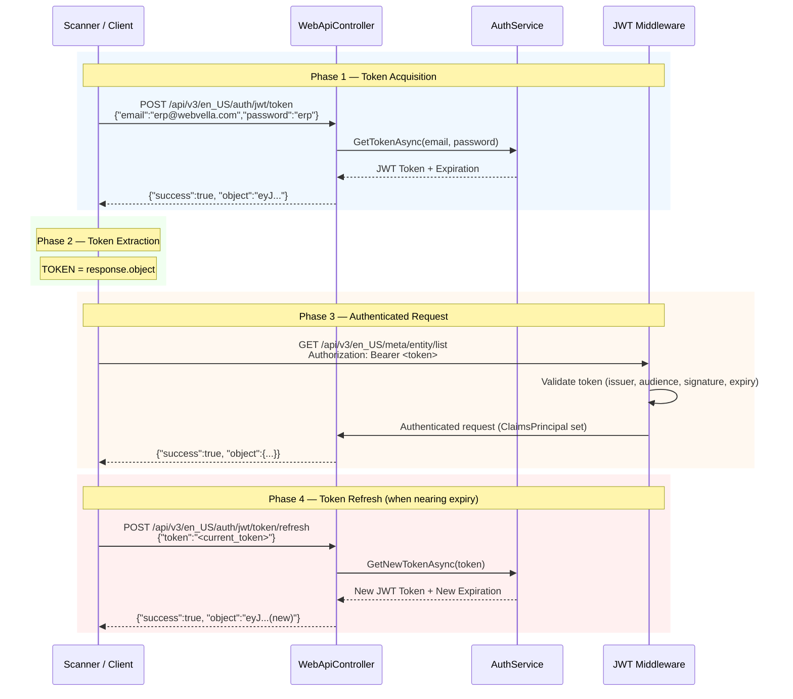

<!--{"sort_order": 3, "name": "authentication", "label": "Authentication"}-->
# Authentication Procedure

## Overview

Acquire a JWT Bearer token from the WebVella ERP authentication endpoint for authenticated security scanning. This token is required for both OWASP ZAP and Nuclei scans to access protected API endpoints.

WebVella ERP uses a dual authentication scheme called `JWT_OR_COOKIE`. When an `Authorization: Bearer <token>` header is present, the request is routed to the JWT Bearer handler; otherwise, it falls back to cookie-based authentication. For security scanner integration, the JWT Bearer approach is preferred because it enables stateless, header-based authentication without managing browser cookies.

> **Prerequisite**: Ensure the Docker environment is running and the health check passes before proceeding. See [Docker Environment Setup](docker-setup.md) for the full setup procedure.

---

## Default Credentials

WebVella ERP ships with a default administrator account for initial access:

| Field | Value |
|---|---|
| Email | `erp@webvella.com` |
| Password | `erp` |

> **Source**: `docs/developer/introduction/getting-started.md:L46` — "Use the default account email `erp@webvella.com` and password `erp` to authenticate."

> **Cross-reference**: See [User Management](../developer/users-and-roles/users.md) for details on creating and managing user accounts via the SDK Plugin.

> **⚠️ IMPORTANT**: These are development-only credentials intended for local security scanning. In any production or staging environment, change the default administrator password immediately after first login. Failing to do so constitutes a **Critical** security finding (CWE-798: Use of Hard-coded Credentials).

---

## JWT Token Request

The WebVella ERP API exposes a JWT token endpoint that accepts email and password credentials and returns a signed JWT token.

**Endpoint Details**:

| Property | Value |
|---|---|
| URL | `POST /api/v3/en_US/auth/jwt/token` |
| Authentication | `[AllowAnonymous]` — no prior authentication required |
| Content-Type | `application/json` |
| Request Model | `JwtTokenLoginModel` with `email` and `password` fields |
| Handler Method | `GetJwtToken()` → calls `AuthService.GetTokenAsync(model.Email, model.Password)` |

> **Source**: `WebVella.Erp.Web/Controllers/WebApiController.cs:L4273-4289`

**Request Command**:

```bash
curl -X POST http://localhost:5000/api/v3/en_US/auth/jwt/token \
  -H "Content-Type: application/json" \
  -d '{"email":"erp@webvella.com","password":"erp"}'

```text

This sends a JSON payload with the default admin credentials to the JWT token endpoint. On success, the server returns a signed JWT token in the standard WebVella JSON response envelope.

---

## Response Parsing

The JWT token endpoint returns the standard WebVella JSON response envelope containing the token as a plain string in the `object` field.

**Expected Successful Response**:

```json
{
  "success": true,
  "message": "",
  "timestamp": "2024-01-01T00:00:00.000Z",
  "errors": [],
  "object": "eyJhbGciOiJIUzI1NiIsInR5cCI6IkpXVCJ9..."
}

```

The `object` field contains the JWT token directly as a bare string — it is **not** a nested object. This is because `AuthService.GetTokenAsync()` returns `ValueTask<string>`, and the `ResponseModel.Object` property (annotated with `[JsonProperty(PropertyName = "object")]` in `BaseModels.cs:L40-47`) serializes the returned string directly.

The response follows the standard WebVella API envelope format with `success`, `message`, `timestamp`, `errors`, and `object` fields.

> **Source**: `WebVella.Erp.Web/Controllers/WebApiController.cs:L4273-4289` — `AuthService.GetTokenAsync()` returns a plain JWT string.

> **Cross-reference**: See [Web API Response Format](../developer/web-api/overview.md) for the full JSON envelope specification.

**Extract the Token Using `jq`**:

```bash
TOKEN=$(curl -s -X POST http://localhost:5000/api/v3/en_US/auth/jwt/token \
  -H "Content-Type: application/json" \
  -d '{"email":"erp@webvella.com","password":"erp"}' | jq -r '.object')

echo $TOKEN

```text

This command silently (`-s`) issues the POST request, pipes the JSON response to `jq`, and extracts the `object` field — which contains the JWT token as a plain string — into the `TOKEN` shell variable.

**Expected Error Response**:

If authentication fails (invalid credentials, missing fields), the response will contain:

```json
{
  "success": false,
  "message": "<error_message><stack_trace>",
  "timestamp": "2024-01-01T00:00:00.000Z",
  "errors": [],
  "object": null
}

```

> **⚠️ Security Finding (CWE-209: Generation of Error Message Containing Sensitive Information)**: On failure, the endpoint concatenates `e.Message + e.StackTrace` into the response `message` field (`Source: WebVella.Erp.Web/Controllers/WebApiController.cs:L4287`). This leaks internal implementation details including file paths, class names, and method signatures to the caller. This information disclosure aids attackers in mapping the application internals and is flagged as a **High** severity finding.

---

## Bearer Header Configuration

Once the JWT token is extracted, configure it as an `Authorization` header for all subsequent API requests.

**Header Format**:

```text
Authorization: Bearer <token>

```

**Verify Token by Calling a Protected Endpoint**:

```bash
# Verify token works by calling a protected endpoint
curl -H "Authorization: Bearer $TOKEN" \
  http://localhost:5000/api/v3/en_US/meta/entity/list

```text

A successful response (`"success": true` with entity data in `object`) confirms that the token is valid and the `JWT_OR_COOKIE` policy scheme correctly routed the request to the JWT Bearer handler.

**How the `JWT_OR_COOKIE` Policy Scheme Works**:

The `JWT_OR_COOKIE` policy scheme inspects the incoming `Authorization` header. If the header is present and starts with `"Bearer "`, the request is forwarded to `JwtBearerDefaults.AuthenticationScheme` for JWT validation. Otherwise, it falls back to `CookieAuthenticationDefaults.AuthenticationScheme`.

> **Source**: `WebVella.Erp.Site/Startup.cs:L115-125`

```csharp
.AddPolicyScheme("JWT_OR_COOKIE", "JWT_OR_COOKIE", options =>
{
    options.ForwardDefaultSelector = context =>
    {
        string authorization = context.Request.Headers[HeaderNames.Authorization];
        if (!string.IsNullOrEmpty(authorization) && authorization.StartsWith("Bearer "))
            return JwtBearerDefaults.AuthenticationScheme;

        return CookieAuthenticationDefaults.AuthenticationScheme;
    };
});

```

This dual-scheme design means that security scanners using `Authorization: Bearer <token>` headers operate on the JWT code path, while browser-based users continue to use cookie authentication seamlessly.

---

## Token Refresh Procedure

WebVella ERP provides a token refresh endpoint to obtain a new JWT token from an existing valid token without re-authenticating with credentials.

**Endpoint Details**:

| Property | Value |
|---|---|
| URL | `POST /api/v3/en_US/auth/jwt/token/refresh` |
| Authentication | `[AllowAnonymous]` — no prior authentication required |
| Content-Type | `application/json` |
| Request Model | `JwtTokenModel` with `token` field |
| Handler Method | `GetNewJwtToken()` → calls `AuthService.GetNewTokenAsync(model.Token)` |

> **Source**: `WebVella.Erp.Web/Controllers/WebApiController.cs:L4292-4309`

**Refresh Command**:

```bash
curl -X POST http://localhost:5000/api/v3/en_US/auth/jwt/token/refresh \
  -H "Content-Type: application/json" \
  -d "{\"token\":\"$TOKEN\"}"

```text

The refresh endpoint accepts the current token and returns a new token with an updated expiration. This is useful for long-running security scans that may exceed the original token lifetime.

**Refresh and Re-extract**:

```bash
TOKEN=$(curl -s -X POST http://localhost:5000/api/v3/en_US/auth/jwt/token/refresh \
  -H "Content-Type: application/json" \
  -d "{\"token\":\"$TOKEN\"}" | jq -r '.object')

echo $TOKEN

```

> **⚠️ Security Finding (CWE-209: Generation of Error Message Containing Sensitive Information)**: The refresh endpoint also leaks stack traces in error responses via `e.Message + e.StackTrace` (`Source: WebVella.Erp.Web/Controllers/WebApiController.cs:L4306`). This is the same information disclosure pattern as the login endpoint and carries the same **High** severity classification.

---

## Cookie-Based Authentication Alternative

WebVella ERP also supports cookie-based authentication for browser-based sessions. This method is documented for completeness but is **not recommended** for security scanner integration.

**Cookie Configuration**:

| Property | Value | Source |
|---|---|---|
| Cookie Name | `erp_auth_base` | `Startup.cs:L96` |
| HttpOnly | `true` | `Startup.cs:L95` |
| Login Path | `/login` | `Startup.cs:L97` |
| Logout Path | `/logout` | `Startup.cs:L98` |
| Access Denied Path | `/error?access_denied` | `Startup.cs:L99` |

> **Source**: `WebVella.Erp.Site/Startup.cs:L93-100`

The cookie-based authentication is primarily designed for the Razor Pages web interface. When a user logs in through the `/login` page, the server sets the `erp_auth_base` cookie with an encrypted authentication ticket. The `JWT_OR_COOKIE` policy scheme detects the absence of an `Authorization` header and routes to the cookie handler.

**Why JWT Is Preferred for Scanning**:

- **Stateless**: JWT tokens are self-contained and do not require server-side session state
- **Header-based**: Easily injected into scanner configurations via custom headers
- **Explicit expiration**: Token lifetime is visible in the response and can be refreshed programmatically
- **No cookie management**: Scanners do not need to handle cookie jars or domain scoping

---

## Scanner Authentication Setup

Configure the extracted JWT Bearer token in both OWASP ZAP and Nuclei for authenticated scanning.

### ZAP Authentication

OWASP ZAP supports header injection via the Replacer add-on. Configure the Bearer token as a global request header replacement:

```bash
# ZAP replacer configuration for Bearer token injection
-z "-config replacer.full_list(0).matchtype=REQ_HEADER \
    -config replacer.full_list(0).matchstr=Authorization \
    -config replacer.full_list(0).replacement='Bearer $TOKEN'"

```text

This configures ZAP to inject an `Authorization: Bearer <token>` header into every outgoing request during the scan. The Replacer add-on operates at the proxy level, ensuring all spidered and actively scanned requests include the authentication header.

> **Cross-reference**: See [ZAP Scan Configuration](zap-scan-config.md) for the full ZAP Automation Framework plan including scope definitions and active scan policies.

### Nuclei Authentication

Nuclei supports custom header injection via the `-H` flag:

```bash
# Nuclei custom header injection
-H "Authorization: Bearer $TOKEN"

```

Pass this flag alongside your Nuclei scan command to inject the Bearer token into every HTTP request template execution.

> **Cross-reference**: See [Nuclei Scan Configuration](nuclei-scan-config.md) for the complete Nuclei command with ASP.NET Core template packs and severity filtering.

### Full Authentication Script

Combine the token acquisition and scanner setup into a single reusable script:

```bash
#!/usr/bin/env bash
set -euo pipefail

# Configuration
ERP_URL="http://localhost:5000"
ERP_EMAIL="erp@webvella.com"
ERP_PASSWORD="erp"

# Step 1: Acquire JWT token
echo "[*] Acquiring JWT token..."
TOKEN=$(curl -sf -X POST "${ERP_URL}/api/v3/en_US/auth/jwt/token" \
  -H "Content-Type: application/json" \
  -d "{\"email\":\"${ERP_EMAIL}\",\"password\":\"${ERP_PASSWORD}\"}" | jq -r '.object')

if [ -z "$TOKEN" ] || [ "$TOKEN" = "null" ]; then
  echo "[!] Failed to acquire JWT token. Check credentials and ERP availability."
  exit 1
fi

echo "[+] Token acquired: ${TOKEN:0:20}..."

# Step 2: Verify token against a protected endpoint
echo "[*] Verifying token..."
VERIFY=$(curl -sf -H "Authorization: Bearer $TOKEN" \
  "${ERP_URL}/api/v3/en_US/meta/entity/list" | jq -r '.success')

if [ "$VERIFY" != "true" ]; then
  echo "[!] Token verification failed."
  exit 1
fi

echo "[+] Token verified successfully."

# Step 3: Export for scanner use
export AUTH_TOKEN="$TOKEN"
export AUTH_HEADER="Authorization: Bearer $TOKEN"
echo "[+] Exported AUTH_TOKEN and AUTH_HEADER for scanner configuration."
echo "[+] Use: -H \"Authorization: Bearer \$AUTH_TOKEN\" for Nuclei"
echo "[+] Use: -z \"-config replacer.full_list(0).matchtype=REQ_HEADER ...\" for ZAP"

```text

Save this script as `get-token.sh`, make it executable (`chmod +x get-token.sh`), and source it (`source get-token.sh`) to populate the `AUTH_TOKEN` and `AUTH_HEADER` environment variables for scanner use.

---

## JWT Configuration Analysis (Security Context)

Understanding the JWT configuration is essential for assessing the authentication security posture. The following parameters are configured in `Startup.cs` and `Config.json`.

### Token Validation Parameters

| Parameter | Value | Source |
|---|---|---|
| `ValidateIssuer` | `true` | `Startup.cs:L106` |
| `ValidateAudience` | `true` | `Startup.cs:L107` |
| `ValidateLifetime` | `true` | `Startup.cs:L108` |
| `ValidateIssuerSigningKey` | `true` | `Startup.cs:L109` |
| `ValidIssuer` | `webvella-erp` | `Config.json:L25` |
| `ValidAudience` | `webvella-erp` | `Config.json:L26` |
| Signing Key | `ThisIsMySecretKeyThisIsMySecretKey...` | `Config.json:L24` |
| Algorithm | HMAC-SHA256 (symmetric) | Inferred from `SymmetricSecurityKey` usage |

> **Source**: `WebVella.Erp.Site/Startup.cs:L102-114` and `WebVella.Erp.Site/Config.json:L23-27`

### Security Assessment of JWT Configuration

**Positive Findings**:

- All four validation flags (`ValidateIssuer`, `ValidateAudience`, `ValidateLifetime`, `ValidateIssuerSigningKey`) are enabled, which is correct practice
- The policy scheme (`JWT_OR_COOKIE`) correctly segregates JWT and cookie authentication paths

**Security Findings**:

> **⚠️ Finding: Hardcoded JWT Signing Key (CWE-798: Use of Hard-coded Credentials)**
>
> The JWT signing key is hardcoded in `Config.json` as `ThisIsMySecretKeyThisIsMySecretKeyThisIsMySecretKey`. This key is committed to version control and is identical across all deployments using the default configuration. An attacker with access to the repository (which is public on GitHub) can forge arbitrary JWT tokens, impersonating any user including the administrator.
>
> **Severity**: Critical
>
> **Remediation**: Move the JWT signing key to an environment variable or a secrets manager (e.g., Azure Key Vault, AWS Secrets Manager). Generate a cryptographically random key of at least 256 bits. See [Remediation Guide](remediation-guide.md) for the detailed remediation pattern.
>
> `Source: WebVella.Erp.Site/Config.json:L24`

> **⚠️ Finding: Hardcoded Database Credentials (CWE-798)**
>
> The `Config.json` file also contains hardcoded database credentials (`User Id=test;Password=test`) in the connection string at line 3. These should be externalized to environment variables.
>
> `Source: WebVella.Erp.Site/Config.json:L3`

> **⚠️ Finding: Development Mode Enabled (CWE-489: Active Debug Code)**
>
> The `DevelopmentMode` flag is set to `"true"` in `Config.json:L9`, and when the environment is "Development", `UseDeveloperExceptionPage()` is enabled (`Startup.cs:L149`), which exposes detailed exception pages to clients.
>
> `Source: WebVella.Erp.Site/Config.json:L9, WebVella.Erp.Site/Startup.cs:L149`

---

## Authentication Sequence Diagram

The following Mermaid diagram illustrates the complete JWT authentication flow from initial token acquisition through authenticated API requests:



---

## Troubleshooting

### Token Acquisition Fails

**Symptom**: `curl` returns `"success": false` or connection refused.

**Checks**:

1. Verify the Docker environment is running: `docker compose ps`
2. Verify the health endpoint: `curl -sf http://localhost:5000/api/v3/en_US/meta`
3. Verify the credentials are correct (default: `erp@webvella.com` / `erp`)
4. Check the WebVella container logs: `docker compose logs web`

### Token Extraction Returns `null`

**Symptom**: `$TOKEN` is empty or `null` after `jq` extraction.

**Checks**:

1. Verify `jq` is installed: `jq --version`
2. Inspect the raw response: remove `| jq -r '.object'` from the command and examine the full JSON
3. If `"success": false`, check the `message` field for error details (note: may contain stack trace per CWE-209 finding)

### Token Rejected on Protected Endpoints

**Symptom**: Protected endpoint returns 401 Unauthorized despite providing the Bearer token.

**Checks**:

1. Ensure the header format is exact: `Authorization: Bearer <token>` (note the space after "Bearer")
2. Check if the token has expired (compare `expiration` field from the response with current UTC time)
3. Refresh the token using the refresh endpoint
4. Verify the JWT issuer and audience match the server configuration (`webvella-erp` for both)

### Long-Running Scans and Token Expiry

Security scans may run for extended periods. If a token expires mid-scan:

1. Re-run the token acquisition command to get a fresh token
2. Update the scanner configuration with the new token
3. For ZAP: restart the scan with the updated Replacer configuration
4. For Nuclei: re-run with the updated `-H` flag
5. Consider scripting periodic token refresh (every 30 minutes) for extended scans

---

## Cross-References

| Document | Purpose |
|---|---|
| [Security Assessment Overview](README.md) | Return to the main security documentation index |
| [Docker Environment Setup](docker-setup.md) | Environment prerequisite — must be completed before authentication |
| [Attack Surface Inventory](attack-surface-inventory.md) | **Next step**: Review the complete API endpoint security classification |
| [ZAP Scan Configuration](zap-scan-config.md) | Full ZAP Automation Framework setup using the Bearer token |
| [Nuclei Scan Configuration](nuclei-scan-config.md) | Full Nuclei scan command with ASP.NET Core templates |
| [User Management](../developer/users-and-roles/users.md) | WebVella user account management details |
| [Web API Overview](../developer/web-api/overview.md) | REST API conventions and JSON response envelope format |
| [Remediation Guide](remediation-guide.md) | ASP.NET Core secure coding patterns for the findings noted in this document |

---

## Source Citations Index

| Citation | File | Lines |
|---|---|---|
| JWT token endpoint | `WebVella.Erp.Web/Controllers/WebApiController.cs` | L4273-4289 |
| JWT refresh endpoint | `WebVella.Erp.Web/Controllers/WebApiController.cs` | L4292-4309 |
| Stack trace leakage (login) | `WebVella.Erp.Web/Controllers/WebApiController.cs` | L4287 |
| Stack trace leakage (refresh) | `WebVella.Erp.Web/Controllers/WebApiController.cs` | L4306 |
| Cookie auth configuration | `WebVella.Erp.Site/Startup.cs` | L93-100 |
| JWT Bearer configuration | `WebVella.Erp.Site/Startup.cs` | L102-114 |
| JWT_OR_COOKIE policy scheme | `WebVella.Erp.Site/Startup.cs` | L115-125 |
| JWT signing key (hardcoded) | `WebVella.Erp.Site/Config.json` | L24 |
| JWT issuer/audience | `WebVella.Erp.Site/Config.json` | L25-26 |
| Database credentials (hardcoded) | `WebVella.Erp.Site/Config.json` | L3 |
| Development mode flag | `WebVella.Erp.Site/Config.json` | L9 |
| WebSecurityUtil (legacy, commented out) | `WebVella.Erp.Web/Security/WebSecurityUtil.cs` | L1-232 |
| Default admin credentials | `docs/developer/introduction/getting-started.md` | L46 |
