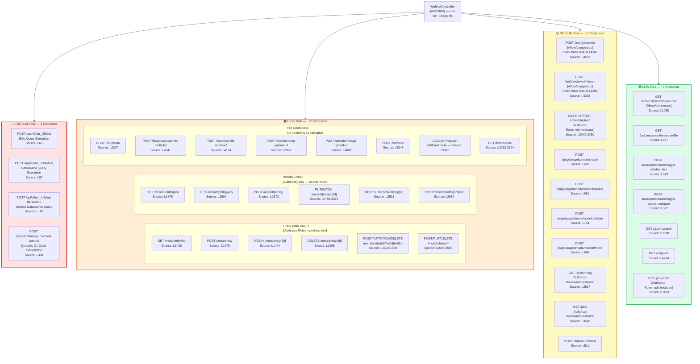

<!--{"sort_order": 2, "name": "attack-surface", "label": "Attack Surface"}-->
# API Attack Surface Classification

This diagram categorizes all REST API endpoints exposed by `WebApiController.cs` (4313 lines, 60+ routes) by security risk level. The classification is based on the potential impact of exploitation and the sensitivity of the operations performed. Endpoints are grouped into four risk tiers — 🔴 CRITICAL, 🟠 HIGH, 🟡 MEDIUM, and 🟢 LOW — to prioritize scan coverage and remediation effort.

> Source: `WebVella.Erp.Web/Controllers/WebApiController.cs` (full file, 4313 lines)
> Source: `WebVella.Erp.Web/Controllers/ApiControllerBase.cs:L9-10` (base controller with `[Authorize]`)

---

## Attack Surface Classification Graph

---

## CRITICAL Route Details from Source Code Analysis

### 🔴 EQL Execution (CRITICAL) — SQL Injection Surface

- **`POST /api/v3/en_US/eql`** (Source: `WebApiController.cs:L63-95`) — Accepts raw EQL strings from user input via `model.Eql` and executes them through `new EqlCommand(model.Eql, model.Parameters).Execute()`. While parameters are supported, the EQL string itself is user-controlled, making this a direct SQL injection (CWE-89) surface.
- **`POST /api/v3/en_US/eql-ds`** (Source: `WebApiController.cs:L97-188`) — Executes named data source queries. Supports both `DatabaseDataSource` (EQL-based) and `CodeDataSource` (dynamic C# execution via compiled code). The code path at line 162 calls `((CodeDataSource)ds).Execute(arguments)`, which invokes dynamically compiled C# code.
- **`POST /api/v3/en_US/eql-ds-select2`** (Source: `WebApiController.cs:L190-337`) — Same execution paths as `eql-ds` but formats response for Select2 widget. Shares the same injection and code execution risk.

### 🔴 Code Compilation (CRITICAL) — Remote Code Execution Surface

- **`POST /api/v3.0/datasource/code-compile`** (Source: `WebApiController.cs:L494-509`) — Accepts arbitrary C# code via `model.CsCode` and compiles it using `CodeEvalService.Compile()` backed by `Microsoft.CodeAnalysis.CSharp.Scripting`. This creates a Remote Code Execution (RCE) surface (CWE-94: Improper Control of Generation of Code). Even compilation without execution can leak system information through error messages.

### 🟠 Entity Meta CRUD (HIGH) — IDOR Surface

- **Lines 1436–2098** — All entity meta endpoints require `[Authorize(Roles = "administrator")]` but are still Insecure Direct Object Reference (IDOR) surfaces if admin tokens are compromised. The `PATCH` endpoint at line 1494 dynamically iterates over submitted JSON properties, widening the attack surface.

### 🟠 Record CRUD (HIGH) — BOLA Surface

- **Lines 2106–3010** — Record endpoints do **NOT** have `[Authorize(Roles = "administrator")]` constraint — only the class-level `[Authorize]` applies. Any authenticated user can access these endpoints. This makes them Broken Object-Level Authorization (BOLA) surfaces (CWE-639). The controller does not implement record-level authorization checks — it relies entirely on `RecordManager` internal logic.

### 🟠 File Operations (HIGH) — Unrestricted Upload Surface

- **Upload handlers** at `/fs/upload/` (L3327), `/fs/upload-user-file-multiple/` (L4041), `/fs/upload-file-multiple/` (L4134), `/ckeditor/drop-upload-url` (L3962), `/ckeditor/image-upload-url` (L4009) — No content-type validation or file size limits observed in the controller code. The CKEditor handlers store files to predictable paths.
- **`DELETE /{*filepath}`** (L3370) — Uses a wildcard route parameter that could match any URL path, creating a path traversal surface (CWE-22).
- **`POST /fs/move/`** (L3347) — Accepts `source` and `target` paths from request body without path sanitization.

### 🟡 Authentication (MEDIUM) — Information Disclosure

- **Lines 4273–4314** — `[AllowAnonymous]` endpoints for JWT token issuance and refresh. Both handlers leak stack traces in error responses: `response.Message = e.Message + e.StackTrace` at line 4287 (token endpoint) and line 4306 (refresh endpoint). This constitutes information disclosure (CWE-209: Generation of Error Message Containing Sensitive Information).

### 🟢 Static/Read-only (LOW)

- **`GET /api/v3.0/p/core/styles.css`** (L1039) — `[AllowAnonymous]` endpoint serving static CSS with 30-day cache. Minimal attack surface. Other LOW-risk endpoints include user preference toggles, quick search, and snippet retrieval.

---

## Risk Classification Summary

| Risk Level | Endpoint Count | Categories | Key Vulnerabilities |
|---|---|---|---|
| 🔴 CRITICAL | 4 | EQL execution, Code compilation | SQL Injection (CWE-89), Remote Code Execution (CWE-94) |
| 🟠 HIGH | ~20 | Entity CRUD, Record CRUD, File operations | IDOR (CWE-639), BOLA, Unrestricted file upload (CWE-434), Path traversal (CWE-22) |
| 🟡 MEDIUM | ~10 | Auth, Schedule plans, Page node management, System | Information disclosure (CWE-209), Brute-force, Privilege escalation |
| 🟢 LOW | ~7 | Static resources, User preferences, Search, Snippets | Minimal attack surface |

> **Total documented endpoints**: 60+ routes across 4 risk tiers covering 11 functional categories.

---

## Authorization Model Summary

The WebVella ERP API uses a layered authorization model with four distinct access levels:

### Class-Level Authorization

All endpoints inherit `[Authorize]` from both the base controller (`ApiControllerBase:L9`) and the `WebApiController` class declaration (L36). This means **every endpoint requires authentication** by default.

> Source: `WebVella.Erp.Web/Controllers/WebApiController.cs:L36` — `[Authorize] public class WebApiController : ApiControllerBase`
> Source: `WebVella.Erp.Web/Controllers/ApiControllerBase.cs:L9` — `[Authorize] public class ApiControllerBase : Controller`

### Admin-Only Endpoints

`[Authorize(Roles = "administrator")]` is applied at the method level on approximately 25+ endpoints:

- **Entity meta CRUD** — all GET/POST/PATCH/DELETE operations on entity definitions (L1436–2098)
- **Entity field CRUD** — all POST/PUT/PATCH/DELETE operations on entity fields (L1592–2001)
- **Entity relation CRUD** — all GET/POST/PUT/DELETE operations on entity relations (L2008–2098)
- **Schedule plans** — all GET/PUT/POST operations on schedule plans (L3449–3760)
- **System log** — `GET /api/v3/en_US/system-log` (L3817)
- **Background jobs** — `GET /api/v3/en_US/jobs` (L3420)
- **Plugin list** — `GET /api/v3/en_US/plugin/list` (L3403)

### Anonymous Endpoints

`[AllowAnonymous]` explicitly permits unauthenticated access on only **3 endpoints**:

| Endpoint | Source Line | Purpose |
|---|---|---|
| `POST /api/v3/en_US/auth/jwt/token` | L4273 | JWT token issuance |
| `POST /api/v3/en_US/auth/jwt/token/refresh` | L4292 | JWT token refresh |
| `GET /api/v3.0/p/core/styles.css` | L1038 | Static CSS serving |

### No Role Check (Class-Level Only)

The following endpoint groups have only class-level `[Authorize]` with **no role-based restriction** — any authenticated user (Administrator, Regular, or Guest) can access them:

- **Record CRUD** — all GET/POST/PUT/PATCH/DELETE operations on entity records (L2106–3010)
- **File operations** — all upload, move, download, and delete handlers (L3252–4234)
- **EQL execution** — all 3 EQL query endpoints (L63–337)
- **Code compilation** — datasource code compile and test endpoints (L494–600)
- **Page node management** — create, update, move, delete page nodes (L603–810)
- **User preferences** — sidebar and section collapse toggles (L340–491)
- **Quick search** — `GET /api/v3/en_US/quick-search` (L3020)
- **Snippets** — `GET /api/v3/en_US/snippets` (L4234)

> **⚠️ Security Note**: The CRITICAL-risk EQL execution and code compilation endpoints are protected only by class-level `[Authorize]` — they do **not** require the `administrator` role. Any authenticated user, including those with the `Guest` role, can execute arbitrary EQL queries and compile C# code. This is the highest-priority authorization gap in the API.

---

## Cross-References

- **[Attack Surface Inventory](../attack-surface-inventory.md)** — See the complete endpoint table with detailed route descriptions, parameter specifications, and per-endpoint security observations.
- **[Security Assessment Overview](../README.md)** — Back to the security assessment overview and 6-step workflow quick start.
- **[ZAP Scan Configuration](../zap-scan-config.md)** — Configure OWASP ZAP scan scopes based on this risk classification.
- **[Nuclei Scan Configuration](../nuclei-scan-config.md)** — Configure Nuclei templates targeting the identified attack surface.
- **[Remediation Guide](../remediation-guide.md)** — ASP.NET Core 9 secure coding patterns for addressing the vulnerabilities identified in this classification.
