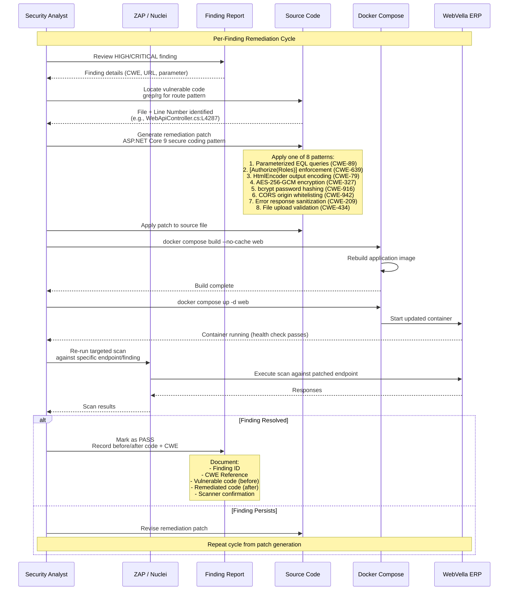

<!--{"sort_order": 3, "name": "remediation-flow", "label": "Remediation Flow"}-->
# Remediation Patch-Rebuild-Verify Cycle

This diagram visualizes the iterative remediation workflow applied to each HIGH or CRITICAL finding from the WebVella ERP security assessment. For each finding, the cycle repeats: identify the vulnerable code, apply an ASP.NET Core 9 secure coding pattern, rebuild the Docker image, and re-run the targeted scan to verify the finding is resolved. If the finding persists, the remediation patch is revised and the cycle repeats until the scanner confirms the issue is no longer present.

> **Cross-reference**: See [Remediation Guide](../remediation-guide.md) for all 8 ASP.NET Core 9 secure coding patterns with before/after code examples.

---

## Sequence Diagram

The following Mermaid sequence diagram shows the interaction between six participants across the full remediation lifecycle. Each HIGH or CRITICAL finding follows this cycle independently.



---

## Cycle Steps Reference

The table below maps each step of the remediation cycle to its corresponding tool or command and the detailed documentation page.

| Step | Action | Tool / Command | Documentation |
|---|---|---|---|
| 1. Review Finding | Examine scanner output for HIGH/CRITICAL entries | `jq` parsing of ZAP JSON or Nuclei JSONL output | [Finding Analysis](../finding-analysis.md) |
| 2. Locate Source | Find vulnerable code in the WebVella ERP codebase | `rg '[Route("...")]' --type cs` | [Finding Analysis](../finding-analysis.md) |
| 3. Generate Patch | Select and apply the appropriate secure coding pattern | ASP.NET Core 9 patterns (8 patterns documented) | [Remediation Guide](../remediation-guide.md) |
| 4. Rebuild Image | Rebuild the Docker application container with no cache | `docker compose build --no-cache web` | [Docker Environment Setup](../docker-setup.md) |
| 5. Restart Container | Start the updated application container | `docker compose up -d web` | [Docker Environment Setup](../docker-setup.md) |
| 6. Re-Scan | Execute a targeted verification scan against the patched endpoint | ZAP or Nuclei targeted commands | [ZAP Scan Configuration](../zap-scan-config.md), [Nuclei Scan Configuration](../nuclei-scan-config.md) |
| 7. Verify | Confirm the finding is resolved in scanner output | Scanner output analysis and report documentation | [Security Report](../security-report.md) |

---

## Remediation Patterns Quick Reference

Each pattern corresponds to a specific CWE and addresses a distinct vulnerability class. See [Remediation Guide](../remediation-guide.md) for complete before/after code examples.

| # | Pattern | CWE | Severity | Affected File |
|---|---------|-----|----------|---------------|
| 1 | Parameterized EQL Queries | [CWE-89](https://cwe.mitre.org/data/definitions/89.html) | CRITICAL | `WebApiController.cs` |
| 2 | `[Authorize(Roles)]` Enforcement | [CWE-639](https://cwe.mitre.org/data/definitions/639.html) | HIGH | `WebApiController.cs`, `AuthorizeAttribute.cs` |
| 3 | `HtmlEncoder` Output Encoding | [CWE-79](https://cwe.mitre.org/data/definitions/79.html) | HIGH | `WebApiController.cs` |
| 4 | AES-256-GCM Encryption Upgrade | [CWE-327](https://cwe.mitre.org/data/definitions/327.html) | HIGH | `CryptoUtility.cs` |
| 5 | bcrypt Password Hashing | [CWE-916](https://cwe.mitre.org/data/definitions/916.html) | CRITICAL | `PasswordUtil.cs` |
| 6 | CORS Origin Whitelisting | [CWE-942](https://cwe.mitre.org/data/definitions/942.html) | MEDIUM | `Startup.cs` |
| 7 | Error Response Sanitization | [CWE-209](https://cwe.mitre.org/data/definitions/209.html) | HIGH | `WebApiController.cs` |
| 8 | File Upload Validation | [CWE-434](https://cwe.mitre.org/data/definitions/434.html) | HIGH | `WebApiController.cs` |

> Source: `WebVella.Erp.Web/Controllers/WebApiController.cs:L4287` — stack trace leakage example (`e.Message + e.StackTrace`)
>
> Source: `WebVella.Erp/Utilities/CryptoUtility.cs:L51-53` — DES encryption usage
>
> Source: `WebVella.Erp/Utilities/PasswordUtil.cs:L9-23` — unsalted MD5 password hashing
>
> Source: `WebVella.Erp.Site/Startup.cs:L58-64` — `AllowAnyOrigin()` CORS policy

---

## Docker Rebuild Commands

After applying a remediation patch to any source file, rebuild the Docker image and restart the container. Verify the application is healthy before running the re-scan.

```bash
# Rebuild the WebVella ERP application image (no cache)
docker compose build --no-cache web

# Restart the updated container
docker compose up -d web

# Verify health check passes after rebuild
until curl -sf http://localhost:5000/api/v3/en_US/meta; do
  echo "Waiting for rebuilt container..."
  sleep 5
done
echo "Container is healthy."
```

> **Cross-reference**: See [Docker Environment Setup](../docker-setup.md) for the full container startup and health check procedure.

---

## Targeted Re-Scan Examples

After the rebuilt container is healthy, run a targeted re-scan against the specific endpoint or vulnerability class that was remediated. The following examples demonstrate common re-scan commands.

### ZAP Targeted Re-Scan

```bash
# ZAP: Re-scan specific endpoint for information disclosure (CWE-209)
docker run --network host ghcr.io/zaproxy/zaproxy:stable zap-active-scan.py \
  -t http://localhost:5000/api/v3/en_US/auth/jwt/token

# ZAP: Re-scan file upload endpoints for unrestricted upload (CWE-434)
docker run --network host -v $(pwd)/zap-work:/zap/wrk \
  ghcr.io/zaproxy/zaproxy:stable zap-active-scan.py \
  -t http://localhost:5000/fs/upload/ -J zap-rescan-upload.json \
  -z "-config replacer.full_list(0).matchtype=REQ_HEADER \
      -config replacer.full_list(0).matchstr=Authorization \
      -config replacer.full_list(0).replacement='Bearer <TOKEN>'"
```

### Nuclei Targeted Re-Scan

```bash
# Nuclei: Re-scan for SQL injection on EQL endpoints (CWE-89)
docker run --network host projectdiscovery/nuclei:latest \
  -u http://localhost:5000/api/v3/en_US/eql \
  -tags sqli -severity critical,high \
  -H "Authorization: Bearer <TOKEN>" \
  -jsonl -o nuclei-eql-rescan.jsonl

# Nuclei: Re-scan with specific template for crypto weakness (CWE-327)
docker run --network host projectdiscovery/nuclei:latest \
  -u http://localhost:5000 \
  -t <specific-template-path> \
  -severity critical,high \
  -H "Authorization: Bearer <TOKEN>" \
  -jsonl -o nuclei-crypto-rescan.jsonl
```

> **Cross-reference**: See [ZAP Scan Configuration](../zap-scan-config.md) for full ZAP scan setup and scope definitions.
>
> **Cross-reference**: See [Nuclei Scan Configuration](../nuclei-scan-config.md) for Nuclei template selection and execution options.

---

## Verification Criteria

A remediation is considered **verified** when the following conditions are met:

1. **Build succeeds**: `docker compose build --no-cache web` completes without errors
2. **Health check passes**: `GET /api/v3/en_US/meta` returns HTTP 200 after container restart
3. **Scanner confirmation**: The targeted re-scan produces **zero** HIGH or CRITICAL findings for the specific endpoint and CWE that was remediated
4. **Report documented**: The finding entry in the [Security Report](../security-report.md) includes:
   - Finding ID (e.g., `WV-SEC-001`)
   - CWE Reference (e.g., `CWE-209`)
   - Vulnerable code (before patch)
   - Remediated code (after patch)
   - Scanner re-scan confirmation status (`PASS`)

If **any** of these conditions is not met, the remediation cycle repeats from the patch generation step.

---

## Cross-References

- [Remediation Guide](../remediation-guide.md) — All 8 ASP.NET Core 9 secure coding patterns with before/after code examples
- [Finding Analysis](../finding-analysis.md) — Source code location methodology and cross-scanner deduplication algorithm
- [Security Report](../security-report.md) — Per-finding documentation template with CWE references and scanner confirmation
- [Docker Environment Setup](../docker-setup.md) — Container rebuild procedures and health check validation
- [ZAP Scan Configuration](../zap-scan-config.md) — OWASP ZAP 2.17.0 authenticated active scan setup
- [Nuclei Scan Configuration](../nuclei-scan-config.md) — Nuclei v3.7.1 template-based scan configuration
- [Security Assessment Overview](../README.md) — Back to the full workflow index
