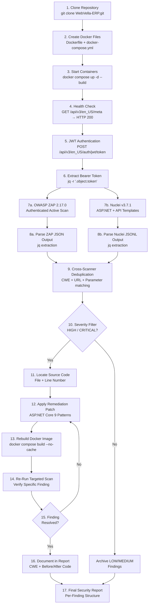

<!--{"sort_order": 1, "name": "scan-workflow", "label": "Scan Workflow"}-->
# End-to-End Scan Workflow

This diagram visualizes the complete **6-phase dynamic security validation workflow** for WebVella ERP, from Docker environment setup through scan execution to final report generation. The workflow is designed so that OWASP ZAP 2.17.0 and Nuclei v3.7.1 scans execute **in parallel** — not sequentially — to maximize coverage while minimizing total elapsed time.

Each numbered step maps to a specific procedure documented in the [Security Assessment Overview](../README.md). Use the [Phase Reference Table](#phase-reference-table) below the diagram to navigate directly to the detailed guide for any phase.

---

## Workflow Diagram



### How to Read the Diagram

- **Rectangular nodes** represent action steps in the workflow.
- **Diamond nodes** represent decision points where the workflow branches.
- **Parallel branches** (steps 7a and 7b) indicate that ZAP and Nuclei scans run simultaneously in separate containers.
- **Loop arrows** from step 15 back to step 12 indicate the iterative remediation cycle — each finding is patched, rebuilt, and re-scanned until the scanner confirms resolution.
- **Converging arrows** at step 9 show that both scanner outputs feed into a single deduplication process.
- **Archived findings** (LOW/MEDIUM) bypass the remediation loop and flow directly into the final report.

---

## Phase Reference Table

| Phase | Steps | Documentation |
|---|---|---|
| Docker Environment Setup | 1–4 | [docker-setup.md](../docker-setup.md) |
| Authentication | 5–6 | [authentication.md](../authentication.md) |
| Scanner Configuration & Execution | 7a–7b | [zap-scan-config.md](../zap-scan-config.md), [nuclei-scan-config.md](../nuclei-scan-config.md) |
| Finding Analysis | 8–10 | [finding-analysis.md](../finding-analysis.md) |
| Remediation | 11–13 | [remediation-guide.md](../remediation-guide.md) |
| Verification & Reporting | 14–17 | [security-report.md](../security-report.md) |

---

## Key Details

### Parallel Scan Execution

Steps 7a and 7b run **simultaneously** in separate terminals or containers. This is a deliberate design choice — the two scanners have complementary detection capabilities and running them in parallel reduces total assessment time without sacrificing coverage.

| Scanner | Docker Image | Focus |
|---|---|---|
| OWASP ZAP 2.17.0 | `ghcr.io/zaproxy/zaproxy:stable` | Active scanning — IDOR, BOLA, SQLi, XSS, CSRF, path traversal, file upload fuzzing |
| Nuclei v3.7.1 | `projectdiscovery/nuclei:latest` | Template-based detection — ASP.NET Core misconfigurations, known CVEs, API security patterns |

Both scanners receive the same JWT Bearer token extracted in step 6 to authenticate against protected WebVella ERP endpoints. See [ZAP Scan Configuration](../zap-scan-config.md) and [Nuclei Scan Configuration](../nuclei-scan-config.md) for the exact Docker commands.

### Cross-Scanner Deduplication

Step 9 correlates findings from both scanners using a composite deduplication key:

```
Deduplication Key = CWE ID + Affected URL + Parameter Name
```

This ensures that findings reported by both ZAP and Nuclei for the same vulnerability are merged into a single entry rather than appearing as duplicates in the report. See [Finding Analysis](../finding-analysis.md) for the complete deduplication algorithm.

### Remediation Loop

Each HIGH or CRITICAL finding follows an iterative **patch → rebuild → verify** cycle (steps 12–15):

1. **Patch** — Apply the appropriate ASP.NET Core 9 secure coding pattern to the vulnerable source file
2. **Rebuild** — Rebuild the Docker image with `docker compose build --no-cache web`
3. **Verify** — Re-run the specific scanner check targeting only the remediated finding
4. **Loop** — If the finding persists, refine the patch and repeat from step 12

The cycle continues until the scanner confirms the finding is resolved. Only then is the finding documented in the report (step 16) with before/after code and scanner confirmation. See [Remediation Guide](../remediation-guide.md) for the 8 ASP.NET Core remediation patterns.

### Scanner Versions

| Component | Version | Notes |
|---|---|---|
| OWASP ZAP | 2.17.0 (stable) | Released December 15, 2025. Docker image: `ghcr.io/zaproxy/zaproxy:stable` |
| Nuclei | v3.7.1 | Released March 5, 2026. Docker image: `projectdiscovery/nuclei:latest` |
| Nuclei Templates | v10.3.9 | 9,821+ community templates. Auto-downloaded on first run or via `-update-templates` |

---

## Cross-References

- [← Back to Security Assessment Overview](../README.md)
- [Docker Environment Setup →](../docker-setup.md) — Phase 1 detailed guide
- [Authentication →](../authentication.md) — Phase 2 detailed guide
- [Attack Surface Inventory →](../attack-surface-inventory.md) — Complete endpoint classification
- [ZAP Scan Configuration →](../zap-scan-config.md) — Phase 3a detailed guide
- [Nuclei Scan Configuration →](../nuclei-scan-config.md) — Phase 3b detailed guide
- [Finding Analysis →](../finding-analysis.md) — Phase 4 detailed guide
- [Remediation Guide →](../remediation-guide.md) — Phase 5 detailed guide
- [Security Report →](../security-report.md) — Phase 6 detailed guide

See also the companion diagrams:

- [Attack Surface Classification](attack-surface.md) — API endpoint risk classification by severity
- [Remediation Flow](remediation-flow.md) — Detailed patch-rebuild-verify sequence diagram
