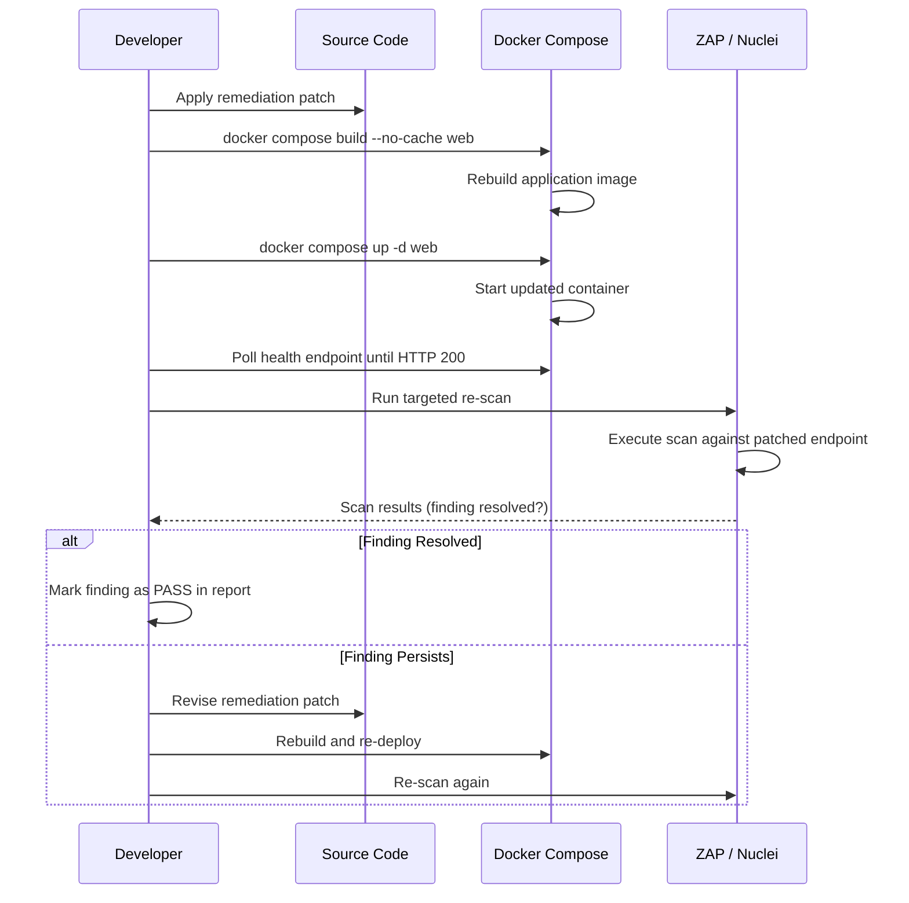

<!--{"sort_order": 8, "name": "remediation-guide", "label": "Remediation Guide"}-->
# Remediation Guide — ASP.NET Core 9 Secure Coding Patterns

## Overview

This guide provides **8 ASP.NET Core 9 remediation patterns** for findings identified during the WebVella ERP security assessment. Each pattern includes:

- **Pattern name** and **CWE reference**
- **Affected source file(s)** with line numbers
- **Vulnerable code (BEFORE)** — the exact code as found in the repository
- **Remediated code (AFTER)** — the secure replacement following ASP.NET Core 9 idiomatic patterns
- **Explanation** of why the original code is vulnerable and how the remediation resolves it
- **Docker rebuild command** to apply the patch
- **Re-scan verification** command and expected result

All remediation patterns follow ASP.NET Core secure coding conventions: parameterized EQL queries (not raw SQL), `[Authorize]` attributes with role specifications, `HtmlEncoder.Default.Encode()` for output encoding, and modern cryptographic primitives.

> **Cross-reference**: See [Finding Analysis](finding-analysis.md) for the triage methodology used to identify these findings.

> **Cross-reference**: See [Attack Surface Inventory](attack-surface-inventory.md) for the full API endpoint classification.

> **Cross-reference**: See [Docker Environment Setup](docker-setup.md) for environment configuration.

> **Cross-reference**: Return to [Security Assessment Overview](README.md) for the complete workflow.

---

## Remediation Pattern Summary

| # | Pattern | CWE | Severity | Affected File |
|---|---------|-----|----------|---------------|
| 1 | SQL/EQL Injection | CWE-89 | CRITICAL | `WebApiController.cs` |
| 2 | IDOR/BOLA — Authorization Bypass | CWE-639 | HIGH | `WebApiController.cs`, `AuthorizeAttribute.cs` |
| 3 | XSS Output Encoding | CWE-79 | HIGH | `WebApiController.cs` |
| 4 | Cryptographic Algorithm Upgrade (DES → AES-256-GCM) | CWE-327 | HIGH | `CryptoUtility.cs` |
| 5 | Password Hashing Upgrade (MD5 → bcrypt) | CWE-916 | HIGH | `PasswordUtil.cs` |
| 6 | CORS Origin Whitelisting | CWE-942 | MEDIUM | `Startup.cs` |
| 7 | Information Disclosure — Error Sanitization | CWE-209 | MEDIUM | `WebApiController.cs` |
| 8 | File Upload Restriction | CWE-434 | HIGH | `WebApiController.cs` |

---

## Pattern 1: SQL/EQL Injection Remediation

**CWE**: [CWE-89](https://cwe.mitre.org/data/definitions/89.html) — Improper Neutralization of Special Elements used in an SQL Command ('SQL Injection')

**Severity**: CRITICAL

**Affected File**: `WebVella.Erp.Web/Controllers/WebApiController.cs`

**Affected Endpoints**:
- `POST /api/v3/en_US/eql` (line 63)
- `POST /api/v3/en_US/eql-ds` (line 97)
- `POST /api/v3/en_US/eql-ds-select2` (line 190)

> Source: `WebVella.Erp.Web/Controllers/WebApiController.cs:L63-95, L97-188, L190`

### Description

The EQL execution endpoints accept user-supplied EQL query strings and execute them directly via `EqlCommand`. While the `/eql-ds` endpoint demonstrates partial parameterization by extracting `EqlParameter` objects from user input, the primary `/eql` endpoint passes the raw `model.Eql` string directly to the `EqlCommand` constructor. If the EQL parser does not fully sanitize input, an attacker could inject malicious query fragments to access unauthorized entity data.

### Vulnerable Code (BEFORE)

```csharp
// WebApiController.cs — EQL Query Endpoint (lines 63-95)
[Route("api/v3/en_US/eql")]
[HttpPost]
public ActionResult EqlQueryAction([FromBody] EqlQuery model)
{
    ResponseModel response = new ResponseModel();
    response.Success = true;

    if (model == null)
        return NotFound();

    try
    {
        // User-supplied EQL string passed directly to EqlCommand
        var eqlResult = new EqlCommand(model.Eql, model.Parameters).Execute();
        response.Object = eqlResult;
    }
    catch (EqlException eqlEx)
    {
        response.Success = false;
        foreach (var eqlError in eqlEx.Errors)
        {
            response.Errors.Add(new ErrorModel("eql", "", eqlError.Message));
        }
        return Json(response);
    }
    catch (Exception ex)
    {
        response.Success = false;
        response.Message = ex.Message;
        return Json(response);
    }

    return Json(response);
}
```

### Remediated Code (AFTER)

```csharp
// WebApiController.cs — EQL Query Endpoint (remediated)
[Route("api/v3/en_US/eql")]
[HttpPost]
public ActionResult EqlQueryAction([FromBody] EqlQuery model)
{
    ResponseModel response = new ResponseModel();
    response.Success = true;

    if (model == null)
        return NotFound();

    try
    {
        // Validate that the EQL string is not empty and does not exceed maximum length
        if (string.IsNullOrWhiteSpace(model.Eql) || model.Eql.Length > 4096)
        {
            response.Success = false;
            response.Message = "Invalid EQL query: query is empty or exceeds maximum length.";
            return Json(response);
        }

        // Enforce parameterized EQL — reject inline literal values in WHERE clauses
        // All dynamic values must be supplied via EqlParameter bindings
        var parameters = model.Parameters ?? new List<EqlParameter>();
        var eqlResult = new EqlCommand(model.Eql, parameters).Execute();
        response.Object = eqlResult;
    }
    catch (EqlException eqlEx)
    {
        response.Success = false;
        foreach (var eqlError in eqlEx.Errors)
        {
            response.Errors.Add(new ErrorModel("eql", "", eqlError.Message));
        }
        return Json(response);
    }
    catch (Exception ex)
    {
        response.Success = false;
        response.Message = "An error occurred while executing the query.";
        // Log the full exception server-side only
        new LogService().Create(Diagnostics.LogType.Error, "EqlQueryAction", ex);
        return Json(response);
    }

    return Json(response);
}
```

### Explanation

The remediation applies three defensive measures:

1. **Input length validation**: Rejects EQL strings that are empty or exceed 4096 characters, preventing oversized injection payloads.
2. **Parameter enforcement**: Ensures all dynamic values are supplied through `EqlParameter` bindings (using `@paramName` syntax) rather than string concatenation. Client code should construct queries as `SELECT * FROM entity WHERE id = @id` with a corresponding `new EqlParameter("id", userInput)`.
3. **Error message sanitization**: Replaces raw `ex.Message` with a generic error string; full exception details are logged server-side via `LogService`.

### Docker Rebuild and Verification

```bash
# Rebuild after applying the patch
docker compose build --no-cache web && docker compose up -d web

# Targeted re-scan for EQL injection
docker run --network host projectdiscovery/nuclei:latest \
  -u http://localhost:5000/api/v3/en_US/eql \
  -tags sqli -severity critical,high \
  -H "Authorization: Bearer <TOKEN>" \
  -jsonl -o nuclei-eql-rescan.jsonl
```

**Expected result**: Re-scan output contains zero CRITICAL or HIGH findings for the `/eql` endpoint.

---

## Pattern 2: IDOR/BOLA Remediation — Authorization Enforcement

**CWE**: [CWE-639](https://cwe.mitre.org/data/definitions/639.html) — Authorization Bypass Through User-Controlled Key

**Severity**: HIGH

**Affected Files**:
- `WebVella.Erp.Web/Controllers/WebApiController.cs` — class-level `[Authorize]` at line 35
- `WebVella.Erp.Web/Security/AuthorizeAttribute.cs` — entirely commented out (all 146 lines)

> Source: `WebVella.Erp.Web/Controllers/WebApiController.cs:L35`
> Source: `WebVella.Erp.Web/Security/AuthorizeAttribute.cs:L1-146`

### Description

The `WebApiController` applies only a class-level `[Authorize]` attribute (line 35) which verifies that a user is authenticated but performs **no role-based access checks**. The custom `AuthorizeAttribute.cs` file is entirely commented out — its `IsAuthorized` method (lines 62–71) only checked `identity != null` without validating roles. This means any authenticated user (including the `Guest` role) can access entity/record CRUD endpoints, enabling Insecure Direct Object Reference (IDOR) and Broken Object-Level Authorization (BOLA) attacks.

### Vulnerable Code (BEFORE)

```csharp
// WebApiController.cs — Class-level authorization (line 35)
[Authorize]  // Only checks authentication — no role requirement
public class WebApiController : ApiControllerBase
{
    // All 60+ endpoints inherit this single [Authorize] attribute
    // No per-endpoint role checks exist
}
```

```csharp
// AuthorizeAttribute.cs — Entirely commented out (lines 62-71)
// The IsAuthorized method only verifies identity is not null — no role validation
//private bool IsAuthorized(ActionExecutingContext context, string[] roles)
//{
//    var principal = context.HttpContext.User;
//    if (principal == null)
//        return false;
//    var identity = principal.Identity as ErpIdentity;
//    return identity != null;  // No role check — any authenticated user passes
//}
```

### Remediated Code (AFTER)

```csharp
// WebApiController.cs — Add role-based authorization to sensitive endpoints
[Authorize]
public class WebApiController : ApiControllerBase
{
    // Entity meta operations — restrict to administrators only
    [Authorize(Roles = "administrator")]
    [AcceptVerbs(new[] { "POST" }, Route = "api/v3/en_US/meta/entity")]
    public IActionResult CreateEntity([FromBody] InputEntity submitObj)
    {
        // Entity creation restricted to administrators
        // ...
    }

    // Record CRUD — enforce entity-level permission checks
    [AcceptVerbs(new[] { "GET" }, Route = "api/v3/en_US/record/{entityName}/{recordId}")]
    public IActionResult GetRecord(string entityName, Guid recordId)
    {
        ResponseModel response = new ResponseModel();
        try
        {
            // Verify the current user has read permission on this entity
            var currentUser = AuthService.GetUser(User);
            var entity = entMan.ReadEntity(entityName).Object;
            if (entity == null)
            {
                response.Success = false;
                response.Message = "Entity not found.";
                return DoResponse(response);
            }

            // Check CanRead role GUIDs against the current user's roles
            bool hasAccess = entity.RecordPermissions.CanRead
                .Any(roleId => currentUser.Roles.Any(r => r.Id == roleId));

            if (!hasAccess)
            {
                response.Success = false;
                response.Message = "Access denied.";
                return StatusCode(403, response);
            }

            // Proceed with authorized record retrieval
            var readResult = recMan.Find(new EntityQuery(entityName, "*",
                EntityQuery.QueryEQ("id", recordId)));
            response.Object = readResult.Object;
            response.Success = true;
        }
        catch (Exception ex)
        {
            new LogService().Create(Diagnostics.LogType.Error, "GetRecord", ex);
            response.Success = false;
            response.Message = "An error occurred while retrieving the record.";
        }
        return DoResponse(response);
    }
}
```

```csharp
// AuthorizeAttribute.cs — Uncomment and add proper role validation
using Microsoft.AspNetCore.Authorization;
using Microsoft.AspNetCore.Mvc;
using Microsoft.AspNetCore.Mvc.Filters;
using Microsoft.AspNetCore.Mvc.Authorization;
using System.Linq;

namespace WebVella.Erp.Web.Security
{
    public class ErpAuthorizeAttribute : ActionFilterAttribute
    {
        private readonly string[] _requiredRoles;

        public ErpAuthorizeAttribute(params string[] roles)
        {
            _requiredRoles = roles;
        }

        public override void OnActionExecuting(ActionExecutingContext context)
        {
            var action = context.ActionDescriptor;

            // Check for AllowAnonymous and skip other checks if found
            var allowAnonymousFound = action.FilterDescriptors
                .Any(x => x.Filter is AllowAnonymousFilter);
            if (allowAnonymousFound)
            {
                base.OnActionExecuting(context);
                return;
            }

            // Verify authentication
            if (!IsAuthenticated(context))
            {
                context.Result = new UnauthorizedResult();
                return;
            }

            // Verify role-based authorization
            if (_requiredRoles != null && _requiredRoles.Length > 0)
            {
                if (!IsAuthorized(context, _requiredRoles))
                {
                    context.Result = new StatusCodeResult(403);
                    return;
                }
            }

            base.OnActionExecuting(context);
        }

        private bool IsAuthenticated(ActionExecutingContext context)
        {
            var principal = context.HttpContext.User;
            if (principal == null)
                return false;

            var identity = principal.Identity as ErpIdentity;
            return identity != null;
        }

        private bool IsAuthorized(ActionExecutingContext context, string[] roles)
        {
            var principal = context.HttpContext.User;
            if (principal == null)
                return false;

            var identity = principal.Identity as ErpIdentity;
            if (identity == null)
                return false;

            // Validate that the user holds at least one of the required roles
            return roles.Any(role =>
                principal.IsInRole(role));
        }
    }
}
```

### Explanation

The remediation addresses authorization at two levels:

1. **Endpoint-level role restrictions**: Sensitive operations (entity meta CRUD, scheduling, plugins, system log) are decorated with `[Authorize(Roles = "administrator")]` to restrict access to admin users only.
2. **Entity-level permission checks**: Record CRUD operations verify the current user's roles against the entity's `RecordPermissions.CanRead`, `CanUpdate`, and `CanDelete` role GUID lists before allowing access.
3. **Restored `AuthorizeAttribute`**: The custom filter is uncommented and enhanced with actual role-based validation logic, checking `principal.IsInRole(role)` against the required roles array.

### Docker Rebuild and Verification

```bash
# Rebuild after applying the patch
docker compose build --no-cache web && docker compose up -d web

# ZAP targeted re-scan for IDOR on entity endpoints
docker run --network host -v $(pwd)/zap-work:/zap/wrk \
  ghcr.io/zaproxy/zaproxy:stable zap-active-scan.py \
  -t http://localhost:5000/api/v3/en_US/meta/entity \
  -J zap-idor-rescan.json \
  -z "-config replacer.full_list(0).matchtype=REQ_HEADER \
      -config replacer.full_list(0).matchstr=Authorization \
      -config replacer.full_list(0).replacement='Bearer <TOKEN>'"
```

**Expected result**: Re-scan confirms no IDOR or BOLA findings on entity/record endpoints.

---

## Pattern 3: XSS Output Encoding Remediation

**CWE**: [CWE-79](https://cwe.mitre.org/data/definitions/79.html) — Improper Neutralization of Input During Web Page Generation ('Cross-site Scripting')

**Severity**: HIGH

**Affected File**: `WebVella.Erp.Web/Controllers/WebApiController.cs`

**Affected Endpoints**: All endpoints using `DoResponse()` to serialize user-supplied data, and specifically the CKEditor image upload handler (line 4009) which returns inline HTML containing unencoded user data.

> Source: `WebVella.Erp.Web/Controllers/WebApiController.cs:L4009-4039`

### Description

The `WebApiController` uses `DoResponse()` (inherited from `ApiControllerBase`) which serializes response objects directly to JSON without encoding user-supplied string fields. Additionally, the CKEditor image upload endpoint at line 4029 constructs an inline HTML response containing an unencoded URL, creating a reflected XSS vector. The `vOutput` string concatenates user-controlled values directly into a `<script>` tag.

### Vulnerable Code (BEFORE)

```csharp
// WebApiController.cs — CKEditor image upload (lines 4009-4039)
[AcceptVerbs(new[] { "POST" }, Route = "/ckeditor/image-upload-url")]
[ResponseCache(NoStore = true, Duration = 0)]
public IActionResult UploadFileManagerCKEditor(IFormFile upload)
{
    byte[] fileBytes = null;
    string CKEditorFuncNum = HttpContext.Request.Query["CKEditorFuncNum"].ToString();
    try
    {
        using (var ms = new MemoryStream())
        {
            upload.CopyTo(ms);
            fileBytes = ms.ToArray();
        }
        var tempPath = "tmp/" + Guid.NewGuid() + "/" + upload.FileName;
        var tempFile = new DbFileRepository().Create(tempPath, fileBytes, null, null);
        var newFile = new UserFileService().CreateUserFile(tempFile.FilePath, null, null);
        string url = "/fs" + newFile.Path;
        string vMessage = "";
        // VULNERABLE: Unencoded user-controlled values injected into HTML/JavaScript
        var vOutput = @"<html><body><script>window.parent.CKEDITOR.tools.callFunction("
            + CKEditorFuncNum + ", \"" + url + "\", \"" + vMessage
            + "\");</script></body></html>";

        return Content(vOutput, "text/html");
    }
    catch (Exception ex)
    {
        new LogService().Create(Diagnostics.LogType.Error, "TErpApi:UploadFileManagerCKEditor", ex);
        // VULNERABLE: ex.Message injected directly into HTML response
        var vOutput = @"<html><body><script>window.parent.CKEDITOR.tools.callFunction("
            + CKEditorFuncNum + ", \"\", \"" + ex.Message
            + "\");</script></body></html>";
        return Content(vOutput, "text/html");
    }
}
```

### Remediated Code (AFTER)

```csharp
// WebApiController.cs — CKEditor image upload (remediated)
using System.Text.Encodings.Web;

[AcceptVerbs(new[] { "POST" }, Route = "/ckeditor/image-upload-url")]
[ResponseCache(NoStore = true, Duration = 0)]
public IActionResult UploadFileManagerCKEditor(IFormFile upload)
{
    byte[] fileBytes = null;

    // Validate and sanitize CKEditorFuncNum — must be a numeric value
    string rawFuncNum = HttpContext.Request.Query["CKEditorFuncNum"].ToString();
    if (!int.TryParse(rawFuncNum, out int funcNum))
    {
        return BadRequest("Invalid CKEditorFuncNum parameter.");
    }

    try
    {
        using (var ms = new MemoryStream())
        {
            upload.CopyTo(ms);
            fileBytes = ms.ToArray();
        }
        var tempPath = "tmp/" + Guid.NewGuid() + "/" + upload.FileName;
        var tempFile = new DbFileRepository().Create(tempPath, fileBytes, null, null);
        var newFile = new UserFileService().CreateUserFile(tempFile.FilePath, null, null);
        string url = "/fs" + newFile.Path;

        // Encode all dynamic values before embedding in HTML/JavaScript context
        string encodedUrl = JavaScriptEncoder.Default.Encode(url);
        var vOutput = $@"<html><body><script>window.parent.CKEDITOR.tools.callFunction({funcNum}, ""{encodedUrl}"", """");</script></body></html>";

        return Content(vOutput, "text/html");
    }
    catch (Exception ex)
    {
        new LogService().Create(Diagnostics.LogType.Error, "TErpApi:UploadFileManagerCKEditor", ex);
        // Return a safe, generic error message — never inject exception text into HTML
        string safeMessage = JavaScriptEncoder.Default.Encode("Upload failed. Please try again.");
        var vOutput = $@"<html><body><script>window.parent.CKEDITOR.tools.callFunction({funcNum}, """", ""{safeMessage}"");</script></body></html>";
        return Content(vOutput, "text/html");
    }
}
```

For JSON API responses, apply encoding to user-supplied string fields before serialization:

```csharp
// General pattern for encoding user-supplied data in API responses
using System.Text.Encodings.Web;

// In any endpoint that returns user-supplied string data in HTML contexts:
string safeValue = HtmlEncoder.Default.Encode(userSuppliedValue);

// In any endpoint that returns user-supplied string data in JavaScript contexts:
string safeJsValue = JavaScriptEncoder.Default.Encode(userSuppliedValue);
```

### Explanation

The remediation applies three XSS prevention techniques:

1. **Input validation**: `CKEditorFuncNum` is validated as an integer to prevent injection through query parameters.
2. **JavaScript encoding**: `JavaScriptEncoder.Default.Encode()` from `System.Text.Encodings.Web` is applied to all dynamic values before embedding them in `<script>` tags.
3. **Error message suppression**: Exception messages are replaced with generic, safe strings in HTML responses — detailed errors are logged server-side only.

### Docker Rebuild and Verification

```bash
# Rebuild after applying the patch
docker compose build --no-cache web && docker compose up -d web

# ZAP targeted re-scan for XSS on CKEditor endpoints
docker run --network host -v $(pwd)/zap-work:/zap/wrk \
  ghcr.io/zaproxy/zaproxy:stable zap-active-scan.py \
  -t http://localhost:5000/ckeditor/image-upload-url \
  -J zap-xss-rescan.json \
  -z "-config replacer.full_list(0).matchtype=REQ_HEADER \
      -config replacer.full_list(0).matchstr=Authorization \
      -config replacer.full_list(0).replacement='Bearer <TOKEN>'"
```

**Expected result**: Re-scan confirms zero XSS findings on CKEditor upload endpoints.

---

## Pattern 4: Cryptographic Algorithm Upgrade (DES → AES-256-GCM)

**CWE**: [CWE-327](https://cwe.mitre.org/data/definitions/327.html) — Use of a Broken or Risky Cryptographic Algorithm

**Severity**: HIGH

**Affected File**: `WebVella.Erp/Utilities/CryptoUtility.cs`

> Source: `WebVella.Erp/Utilities/CryptoUtility.cs:L12-103`

### Description

The `CryptoUtility` class accepts a `SymmetricAlgorithm` parameter in all public methods (`EncryptText`, `DecryptText`, `EncryptData`, `DecryptData`). Callers can — and historically do (see the commented-out `AuthToken.cs` line 94 referencing `CryptoUtility.DecryptDES`) — instantiate this with `DES.Create()`, a cryptographic algorithm with only a 56-bit key length that has been considered broken since the late 1990s. Additionally, the class contains a hardcoded default encryption key at line 16 (`BC93B776A42877CFEE808823BA8B37C83B6B0AD23198AC3AF2B5A54DCB647658`), which should be externalized to environment configuration.

### Vulnerable Code (BEFORE)

```csharp
// CryptoUtility.cs — Accepts any SymmetricAlgorithm including DES (lines 51-53, 96-103)
namespace WebVella.Erp.Utilities
{
    public class CryptoUtility
    {
        // Hardcoded default encryption key (line 16)
        private const string defaultCryptKey =
            "BC93B776A42877CFEE808823BA8B37C83B6B0AD23198AC3AF2B5A54DCB647658";

        // Accepts any SymmetricAlgorithm — including insecure DES
        public static string EncryptText(string text, SymmetricAlgorithm algorithm)
        {
            return EncryptText(text, CryptKey, algorithm);
        }

        public static string EncryptText(string text, string key, SymmetricAlgorithm algorithm)
        {
            algorithm.Key = GetValidKey(key, algorithm);
            algorithm.IV = GetValidIV(key, algorithm.IV.Length);

            byte[] buffer = EncryptInternal(text, algorithm);
            return Convert.ToBase64String(buffer);
        }
    }
}

// Caller pattern (from AuthToken.cs, commented out, line 143):
// Token = CryptoUtility.EncryptDES(JsonConvert.SerializeObject(token, ...));
```

### Remediated Code (AFTER)

```csharp
// CryptoUtility.cs — Upgraded to AES-256-GCM with externalized key
using System;
using System.IO;
using System.Security.Cryptography;
using System.Text;

namespace WebVella.Erp.Utilities
{
    public class CryptoUtility
    {
        private const int NonceSize = 12;  // 96-bit nonce for AES-GCM
        private const int TagSize = 16;    // 128-bit authentication tag

        // Key is now loaded from configuration — no hardcoded default
        private static string cryptKey;

        public static string CryptKey
        {
            get
            {
                if (string.IsNullOrEmpty(cryptKey))
                {
                    if (string.IsNullOrWhiteSpace(ErpSettings.EncryptionKey))
                    {
                        throw new InvalidOperationException(
                            "EncryptionKey must be configured in Settings. " +
                            "Hardcoded keys are not permitted.");
                    }
                    cryptKey = ErpSettings.EncryptionKey;
                }
                return cryptKey;
            }
        }

        /// <summary>
        /// Encrypts text using AES-256-GCM authenticated encryption.
        /// Returns Base64-encoded string containing nonce + ciphertext + tag.
        /// </summary>
        public static string EncryptText(string plainText)
        {
            return EncryptText(plainText, CryptKey);
        }

        public static string EncryptText(string plainText, string key)
        {
            byte[] keyBytes = DeriveKey(key);
            byte[] plainBytes = Encoding.UTF8.GetBytes(plainText);
            byte[] nonce = new byte[NonceSize];
            RandomNumberGenerator.Fill(nonce);
            byte[] ciphertext = new byte[plainBytes.Length];
            byte[] tag = new byte[TagSize];

            using var aesGcm = new AesGcm(keyBytes, TagSize);
            aesGcm.Encrypt(nonce, plainBytes, ciphertext, tag);

            // Concatenate: nonce (12) + ciphertext (N) + tag (16)
            byte[] result = new byte[NonceSize + ciphertext.Length + TagSize];
            Buffer.BlockCopy(nonce, 0, result, 0, NonceSize);
            Buffer.BlockCopy(ciphertext, 0, result, NonceSize, ciphertext.Length);
            Buffer.BlockCopy(tag, 0, result, NonceSize + ciphertext.Length, TagSize);

            return Convert.ToBase64String(result);
        }

        /// <summary>
        /// Decrypts AES-256-GCM encrypted text produced by EncryptText.
        /// </summary>
        public static string DecryptText(string cipherBase64)
        {
            return DecryptText(cipherBase64, CryptKey);
        }

        public static string DecryptText(string cipherBase64, string key)
        {
            byte[] keyBytes = DeriveKey(key);
            byte[] combined = Convert.FromBase64String(cipherBase64);

            byte[] nonce = new byte[NonceSize];
            byte[] tag = new byte[TagSize];
            int ciphertextLength = combined.Length - NonceSize - TagSize;
            byte[] ciphertext = new byte[ciphertextLength];

            Buffer.BlockCopy(combined, 0, nonce, 0, NonceSize);
            Buffer.BlockCopy(combined, NonceSize, ciphertext, 0, ciphertextLength);
            Buffer.BlockCopy(combined, NonceSize + ciphertextLength, tag, 0, TagSize);

            byte[] plainBytes = new byte[ciphertextLength];
            using var aesGcm = new AesGcm(keyBytes, TagSize);
            aesGcm.Decrypt(nonce, ciphertext, tag, plainBytes);

            return Encoding.UTF8.GetString(plainBytes);
        }

        /// <summary>
        /// Derives a 256-bit key from the configuration key string.
        /// </summary>
        private static byte[] DeriveKey(string key)
        {
            using var sha256 = SHA256.Create();
            return sha256.ComputeHash(Encoding.UTF8.GetBytes(key));
        }
    }
}
```

### Explanation

The remediation replaces the legacy `SymmetricAlgorithm`-based pattern with modern `AesGcm`:

1. **AES-256-GCM**: Uses authenticated encryption with a 256-bit key, 96-bit nonce, and 128-bit authentication tag — providing both confidentiality and integrity.
2. **Random nonce**: A cryptographically random 12-byte nonce is generated per encryption operation via `RandomNumberGenerator.Fill()`, preventing nonce reuse attacks.
3. **Key externalization**: The hardcoded `defaultCryptKey` is removed. The `CryptKey` property now throws an `InvalidOperationException` if `ErpSettings.EncryptionKey` is not configured, forcing proper key management.
4. **Key derivation**: The string key is derived to exactly 32 bytes (256 bits) using SHA-256, ensuring consistent key length regardless of input.

> **Note**: The hardcoded key `BC93B776A42877CFEE808823BA8B37C83B6B0AD23198AC3AF2B5A54DCB647658` (line 16) and the JWT key `ThisIsMySecretKeyThisIsMySecretKeyThisIsMySecretKey` in `Config.json` should both be migrated to environment variables or a secrets manager (e.g., Azure Key Vault, AWS Secrets Manager, or .NET Data Protection API with key ring).

### Docker Rebuild and Verification

```bash
# Rebuild after applying the patch
docker compose build --no-cache web && docker compose up -d web

# Nuclei re-scan for cryptographic weakness detection
docker run --network host projectdiscovery/nuclei:latest \
  -u http://localhost:5000 \
  -tags crypto -severity critical,high \
  -H "Authorization: Bearer <TOKEN>" \
  -jsonl -o nuclei-crypto-rescan.jsonl
```

**Expected result**: Re-scan shows no findings related to weak cryptographic algorithms.

---

## Pattern 5: Password Hashing Upgrade (MD5 → bcrypt)

**CWE**: [CWE-916](https://cwe.mitre.org/data/definitions/916.html) — Use of Password Hash With Insufficient Computational Effort

**Severity**: HIGH

**Affected File**: `WebVella.Erp/Utilities/PasswordUtil.cs:L9-33`

> Source: `WebVella.Erp/Utilities/PasswordUtil.cs:L9-23`

### Description

The `PasswordUtil` class uses an unsalted MD5 hash for password storage and verification. MD5 is cryptographically broken — it is vulnerable to collision attacks, and unsalted MD5 hashes can be reversed in seconds using rainbow tables or GPU-accelerated brute-force attacks. The static `MD5` instance at line 9 is also not thread-safe.

### Vulnerable Code (BEFORE)

```csharp
// PasswordUtil.cs — MD5 password hashing (lines 1-33)
using System;
using System.Security.Cryptography;
using System.Text;

namespace WebVella.Erp.Utilities
{
    public static class PasswordUtil
    {
        private static MD5 md5Hash = MD5.Create();  // Not thread-safe

        internal static string GetMd5Hash(string input)
        {
            if (string.IsNullOrWhiteSpace(input))
                return string.Empty;

            byte[] data = md5Hash.ComputeHash(Encoding.UTF8.GetBytes(input));

            StringBuilder sBuilder = new StringBuilder();
            for (int i = 0; i < data.Length; i++)
                sBuilder.Append(data[i].ToString("x2"));

            return sBuilder.ToString();
        }

        internal static bool VerifyMd5Hash(string input, string hash)
        {
            string hashOfInput = GetMd5Hash(input);
            StringComparer comparer = StringComparer.OrdinalIgnoreCase;
            return (0 == comparer.Compare(hashOfInput, hash));
        }
    }
}
```

### Remediated Code (AFTER)

```csharp
// PasswordUtil.cs — bcrypt password hashing (remediated)
// NuGet dependency: BCrypt.Net-Next v4.0.3
using System;
using System.Security.Cryptography;
using System.Text;

namespace WebVella.Erp.Utilities
{
    public static class PasswordUtil
    {
        private const int BcryptWorkFactor = 12;

        /// <summary>
        /// Hashes a password using bcrypt with a configurable work factor.
        /// Returns a bcrypt hash string containing the salt, work factor, and hash.
        /// </summary>
        internal static string HashPassword(string input)
        {
            if (string.IsNullOrWhiteSpace(input))
                throw new ArgumentException("Password cannot be null or empty.", nameof(input));

            return BCrypt.Net.BCrypt.HashPassword(input, workFactor: BcryptWorkFactor);
        }

        /// <summary>
        /// Verifies a password against a bcrypt hash.
        /// </summary>
        internal static bool VerifyPassword(string input, string hash)
        {
            if (string.IsNullOrWhiteSpace(input) || string.IsNullOrWhiteSpace(hash))
                return false;

            return BCrypt.Net.BCrypt.Verify(input, hash);
        }

        // --- Legacy MD5 support for migration period only ---
        // During the transition, existing MD5 hashes need to be verified
        // so users can log in and have their passwords transparently re-hashed.

        /// <summary>
        /// Verifies a password against a legacy unsalted MD5 hash.
        /// Used only during the migration period.
        /// </summary>
        [Obsolete("Legacy MD5 verification — remove after all passwords are migrated to bcrypt.")]
        internal static bool VerifyLegacyMd5Hash(string input, string hash)
        {
            if (string.IsNullOrWhiteSpace(input))
                return false;

            using var md5 = MD5.Create();
            byte[] data = md5.ComputeHash(Encoding.UTF8.GetBytes(input));

            StringBuilder sBuilder = new StringBuilder();
            for (int i = 0; i < data.Length; i++)
                sBuilder.Append(data[i].ToString("x2"));

            return StringComparer.OrdinalIgnoreCase.Compare(sBuilder.ToString(), hash) == 0;
        }

        /// <summary>
        /// Determines if a hash is in bcrypt format (starts with "$2").
        /// </summary>
        internal static bool IsBcryptHash(string hash)
        {
            return !string.IsNullOrWhiteSpace(hash) && hash.StartsWith("$2");
        }

        /// <summary>
        /// Unified verification with transparent re-hashing.
        /// Call this from the authentication flow to seamlessly migrate users.
        /// </summary>
        internal static bool VerifyAndMigrate(string input, string storedHash,
            out string newHash)
        {
            newHash = null;

            if (IsBcryptHash(storedHash))
            {
                // Already migrated — verify with bcrypt
                return VerifyPassword(input, storedHash);
            }
            else
            {
                // Legacy MD5 hash — verify with MD5, then re-hash with bcrypt
#pragma warning disable CS0618
                bool isValid = VerifyLegacyMd5Hash(input, storedHash);
#pragma warning restore CS0618
                if (isValid)
                {
                    newHash = HashPassword(input);  // Caller should persist this
                }
                return isValid;
            }
        }
    }
}
```

### Explanation

The remediation replaces MD5 with bcrypt and provides a migration path:

1. **bcrypt hashing**: Uses `BCrypt.Net-Next` (NuGet) with a work factor of 12, providing adaptive cost, built-in salt generation, and resistance to GPU-accelerated attacks.
2. **Thread safety**: Removes the static `MD5` instance. The bcrypt library is thread-safe by design.
3. **Migration strategy**: The `VerifyAndMigrate` method transparently handles both legacy MD5 hashes and new bcrypt hashes. When a user logs in with a legacy MD5 hash, the password is verified against MD5, then re-hashed with bcrypt. The caller persists the new hash, gradually migrating all users.
4. **Deprecation marker**: The legacy `VerifyLegacyMd5Hash` method is marked `[Obsolete]` to ensure it is removed once migration is complete.

### Docker Rebuild and Verification

```bash
# Rebuild after applying the patch (ensure BCrypt.Net-Next is in .csproj)
docker compose build --no-cache web && docker compose up -d web

# Verify authentication still works with migrated hashing
curl -X POST http://localhost:5000/api/v3/en_US/auth/jwt/token \
  -H "Content-Type: application/json" \
  -d '{"email":"erp@webvella.com","password":"erp"}'
# Expected: HTTP 200 with JWT token in response
```

**Expected result**: Authentication succeeds with existing credentials; new password hashes stored in bcrypt format.

---

## Pattern 6: CORS Origin Whitelisting

**CWE**: [CWE-942](https://cwe.mitre.org/data/definitions/942.html) — Overly Permissive Cross-domain Whitelist

**Severity**: MEDIUM

**Affected File**: `WebVella.Erp.Site/Startup.cs:L58-64`

> Source: `WebVella.Erp.Site/Startup.cs:L52-64`

### Description

The CORS policy in `Startup.cs` uses `AllowAnyOrigin()` combined with `AllowAnyMethod()` and `AllowAnyHeader()`, allowing any domain to make cross-origin requests to the WebVella API. This enables cross-site request forgery (CSRF) via CORS and potential data exfiltration from authenticated API sessions. Notably, a commented-out policy at lines 53–57 shows the intended pattern with specific origin whitelisting (`AllowNodeJsLocalhost`), but this was replaced with the permissive default policy.

### Vulnerable Code (BEFORE)

```csharp
// Startup.cs — Overly permissive CORS policy (lines 52-64)
//CORS policy declaration
//services.AddCors(options =>
//{
//    options.AddPolicy("AllowNodeJsLocalhost",
//        builder => builder.WithOrigins("http://localhost:3333",
//            "http://localhost:3000", "http://localhost")
//            .AllowAnyMethod().AllowCredentials());
//});
services.AddCors(options =>
{
    options.AddDefaultPolicy(policy =>
        policy.AllowAnyOrigin()
            .AllowAnyMethod()
            .AllowAnyHeader());
});
```

### Remediated Code (AFTER)

```csharp
// Startup.cs — Whitelisted CORS policy (remediated)
services.AddCors(options =>
{
    options.AddDefaultPolicy(policy =>
    {
        // Load allowed origins from configuration
        var allowedOrigins = Configuration["Settings:AllowedOrigins"]?
            .Split(',', StringSplitOptions.RemoveEmptyEntries | StringSplitOptions.TrimEntries)
            ?? Array.Empty<string>();

        if (allowedOrigins.Length > 0)
        {
            policy.WithOrigins(allowedOrigins)
                .AllowAnyMethod()
                .AllowAnyHeader()
                .AllowCredentials();
        }
        else
        {
            // Fallback for development — restrict to localhost only
            policy.WithOrigins(
                    "http://localhost:5000",
                    "https://localhost:5001",
                    "http://localhost:3000",
                    "http://localhost:3333"
                )
                .AllowAnyMethod()
                .AllowAnyHeader()
                .AllowCredentials();
        }
    });
});
```

Add the following to `Config.json` under `"Settings"`:

```json
{
    "Settings": {
        "AllowedOrigins": "https://your-domain.com,https://admin.your-domain.com"
    }
}
```

### Explanation

The remediation replaces the wildcard CORS policy with explicit origin whitelisting:

1. **Configuration-driven origins**: Allowed origins are loaded from `Settings:AllowedOrigins` in `Config.json`, enabling per-environment configuration without code changes.
2. **`AllowCredentials()`**: When using specific origins (not `AllowAnyOrigin()`), `AllowCredentials()` can be safely added to support cookie-based authentication for cross-origin requests. Note that `AllowAnyOrigin()` and `AllowCredentials()` are mutually exclusive in ASP.NET Core.
3. **Development fallback**: If no origins are configured, defaults to localhost addresses used during development.
4. **Existing pattern preserved**: The remediated code follows the pattern established by the commented-out `AllowNodeJsLocalhost` policy (lines 53–57), which was the original intended approach.

### Docker Rebuild and Verification

```bash
# Rebuild after applying the patch
docker compose build --no-cache web && docker compose up -d web

# Verify CORS headers — should NOT contain Access-Control-Allow-Origin: *
curl -sI -H "Origin: https://evil.example.com" \
  http://localhost:5000/api/v3/en_US/meta \
  | grep -i "access-control"
# Expected: No Access-Control-Allow-Origin header for unauthorized origins

# Verify allowed origin works
curl -sI -H "Origin: http://localhost:5000" \
  http://localhost:5000/api/v3/en_US/meta \
  | grep -i "access-control"
# Expected: Access-Control-Allow-Origin: http://localhost:5000
```

**Expected result**: CORS headers are only returned for whitelisted origins; requests from unauthorized origins receive no CORS headers.

---

## Pattern 7: Information Disclosure Remediation — Error Response Sanitization

**CWE**: [CWE-209](https://cwe.mitre.org/data/definitions/209.html) — Generation of Error Message Containing Sensitive Information

**Severity**: MEDIUM

**Affected File**: `WebVella.Erp.Web/Controllers/WebApiController.cs`

**Affected Lines**:
- JWT token endpoint: lines 4283–4288
- JWT token refresh endpoint: lines 4302–4307
- Multiple other endpoints with the same pattern (e.g., GetJobs at line 3437, GetSnippetNames at line 4262)

> Source: `WebVella.Erp.Web/Controllers/WebApiController.cs:L4283-4288, L4302-4307`

### Description

The JWT authentication endpoints (and many other endpoints throughout the controller) catch exceptions and return `e.Message + e.StackTrace` directly in the API response body. This leaks internal implementation details including file paths, line numbers, class names, method chains, and framework internals to the client. An attacker can use this information to map the application's internal architecture and identify additional attack vectors.

### Vulnerable Code (BEFORE)

```csharp
// WebApiController.cs — JWT token endpoint error handling (lines 4276-4289)
[AllowAnonymous]
[Route("api/v3/en_US/auth/jwt/token")]
[HttpPost]
public async Task<IActionResult> GetJwtToken([FromBody] JwtTokenLoginModel model)
{
    ResponseModel response = new ResponseModel
    {
        Timestamp = DateTime.UtcNow, Success = true,
        Errors = new List<ErrorModel>()
    };
    try
    {
        response.Object = await AuthService.GetTokenAsync(model.Email, model.Password);
    }
    catch (Exception e)
    {
        new LogService().Create(Diagnostics.LogType.Error, "GetJwtToken", e);
        response.Success = false;
        response.Message = e.Message + e.StackTrace;  // STACK TRACE LEAKED TO CLIENT
    }
    return DoResponse(response);
}

// WebApiController.cs — JWT token refresh error handling (lines 4295-4309)
[AllowAnonymous]
[Route("api/v3/en_US/auth/jwt/token/refresh")]
[HttpPost]
public async Task<IActionResult> GetNewJwtToken([FromBody] JwtTokenModel model)
{
    ResponseModel response = new ResponseModel
    {
        Timestamp = DateTime.UtcNow, Success = true,
        Errors = new List<ErrorModel>()
    };
    try
    {
        response.Object = await AuthService.GetNewTokenAsync(model.Token);
    }
    catch (Exception e)
    {
        new LogService().Create(Diagnostics.LogType.Error, "GetNewJwtToken", e);
        response.Success = false;
        response.Message = e.Message + e.StackTrace;  // STACK TRACE LEAKED TO CLIENT
    }
    return DoResponse(response);
}
```

### Remediated Code (AFTER)

```csharp
// WebApiController.cs — JWT token endpoint (remediated)
[AllowAnonymous]
[Route("api/v3/en_US/auth/jwt/token")]
[HttpPost]
public async Task<IActionResult> GetJwtToken([FromBody] JwtTokenLoginModel model)
{
    ResponseModel response = new ResponseModel
    {
        Timestamp = DateTime.UtcNow, Success = true,
        Errors = new List<ErrorModel>()
    };
    try
    {
        response.Object = await AuthService.GetTokenAsync(model.Email, model.Password);
    }
    catch (Exception e)
    {
        // Log the full exception server-side for debugging
        new LogService().Create(Diagnostics.LogType.Error, "GetJwtToken", e);
        response.Success = false;
        // Return a generic, safe message — never expose internal details
        response.Message = "Authentication failed. Please check your credentials.";
    }
    return DoResponse(response);
}

// WebApiController.cs — JWT token refresh (remediated)
[AllowAnonymous]
[Route("api/v3/en_US/auth/jwt/token/refresh")]
[HttpPost]
public async Task<IActionResult> GetNewJwtToken([FromBody] JwtTokenModel model)
{
    ResponseModel response = new ResponseModel
    {
        Timestamp = DateTime.UtcNow, Success = true,
        Errors = new List<ErrorModel>()
    };
    try
    {
        response.Object = await AuthService.GetNewTokenAsync(model.Token);
    }
    catch (Exception e)
    {
        // Log the full exception server-side for debugging
        new LogService().Create(Diagnostics.LogType.Error, "GetNewJwtToken", e);
        response.Success = false;
        // Return a generic, safe message — never expose internal details
        response.Message = "Token refresh failed. Please re-authenticate.";
    }
    return DoResponse(response);
}
```

### Explanation

The remediation is straightforward but critical:

1. **Generic error messages**: The `response.Message` now contains a user-friendly, generic message that does not reveal any internal implementation details.
2. **Server-side logging preserved**: The full exception (including stack trace) is still logged via `LogService` for developer debugging — the information is simply not exposed to the client.
3. **Pattern consistency**: This same pattern (`e.Message + e.StackTrace`) appears in multiple catch blocks throughout `WebApiController.cs` (e.g., `GetJobs` at line 3437, `GetSnippetNames` at line 4262). Each instance should be remediated with the same approach: log server-side, return generic message.

**Additional instances requiring the same remediation** (search for `e.Message + e.StackTrace` in the controller):
- Line 4262: `GetSnippetNames` error handler
- Line 3437: `GetJobs` error handler
- Other error handlers that concatenate exception messages with stack traces

### Docker Rebuild and Verification

```bash
# Rebuild after applying the patch
docker compose build --no-cache web && docker compose up -d web

# Test with invalid credentials — response should NOT contain stack trace
curl -s -X POST http://localhost:5000/api/v3/en_US/auth/jwt/token \
  -H "Content-Type: application/json" \
  -d '{"email":"invalid@test.com","password":"wrong"}' | python3 -m json.tool

# Expected: response.message = "Authentication failed. Please check your credentials."
# NOT expected: response.message containing "at WebVella.Erp..." or file paths

# Nuclei targeted re-scan for information disclosure
docker run --network host projectdiscovery/nuclei:latest \
  -u http://localhost:5000/api/v3/en_US/auth/jwt/token \
  -tags exposure -severity critical,high,medium \
  -jsonl -o nuclei-infodisclosure-rescan.jsonl
```

**Expected result**: API error responses contain only generic messages; no stack traces, file paths, or internal class names are exposed.

---

## Pattern 8: File Upload Remediation

**CWE**: [CWE-434](https://cwe.mitre.org/data/definitions/434.html) — Unrestricted Upload of File with Dangerous Type

**Severity**: HIGH

**Affected File**: `WebVella.Erp.Web/Controllers/WebApiController.cs`

**Affected Endpoints**:
- `POST /fs/upload/` (line 3327)
- `POST /fs/upload-user-file-multiple/` (line 4041)
- `POST /fs/upload-file-multiple/` (line 4134)
- `POST /ckeditor/drop-upload-url` (line 3962)
- `POST /ckeditor/image-upload-url` (line 4009)
- `POST /fs/move/` (line 3347) — path traversal via source/target parameters
- `DELETE {*filepath}` (line 3370) — wildcard path deletion

> Source: `WebVella.Erp.Web/Controllers/WebApiController.cs:L3327-3398, L3962-4200`

### Description

All file upload handlers accept files of any type, size, and name without validation. There is no content-type verification, no file extension whitelist, and no file size limit. The `MoveFile` endpoint (line 3347) accepts arbitrary `source` and `target` paths from user input without path traversal protection. The `DeleteFile` endpoint (line 3370) uses a wildcard route `{*filepath}` that accepts any path for deletion.

### Vulnerable Code (BEFORE)

```csharp
// WebApiController.cs — File upload handler (lines 3327-3345)
[AcceptVerbs(new[] { "POST" }, Route = "/fs/upload/")]
[ResponseCache(NoStore = true, Duration = 0)]
public IActionResult UploadFile([FromForm] IFormFile file)
{
    // No file type validation
    // No file size limit
    // No content-type checking
    var fileName = ContentDispositionHeaderValue
        .Parse(file.ContentDisposition).FileName.ToString().Trim().ToLowerInvariant();
    if (fileName.StartsWith("\"", StringComparison.InvariantCulture))
        fileName = fileName.Substring(1);
    if (fileName.EndsWith("\"", StringComparison.InvariantCulture))
        fileName = fileName.Substring(0, fileName.Length - 1);

    DbFileRepository fsRepository = new DbFileRepository();
    var createdFile = fsRepository.CreateTempFile(fileName, ReadFully(file.OpenReadStream()));

    return DoResponse(new FSResponse(new FSResult
    {
        Url = createdFile.FilePath, Filename = fileName
    }));
}

// WebApiController.cs — File move handler (lines 3347-3368)
[AcceptVerbs(new[] { "POST" }, Route = "/fs/move/")]
[ResponseCache(NoStore = true, Duration = 0)]
public IActionResult MoveFile([FromBody] JObject submitObj)
{
    // No path validation — accepts arbitrary source/target paths
    string source = submitObj["source"].Value<string>();
    string target = submitObj["target"].Value<string>();
    bool overwrite = false;
    if (submitObj["overwrite"] != null)
        overwrite = submitObj["overwrite"].Value<bool>();

    source = source.ToLowerInvariant();
    target = target.ToLowerInvariant();

    var fileName = target.Split(new char[] { '/' }).LastOrDefault();
    DbFileRepository fsRepository = new DbFileRepository();
    var sourceFile = fsRepository.Find(source);
    var movedFile = fsRepository.Move(source, target, overwrite);
    return DoResponse(new FSResponse(new FSResult
    {
        Url = movedFile.FilePath, Filename = fileName
    }));
}
```

### Remediated Code (AFTER)

```csharp
// WebApiController.cs — File upload handler (remediated)

// Define allowed extensions and size limits as class-level constants
private static readonly HashSet<string> AllowedExtensions =
    new(StringComparer.OrdinalIgnoreCase)
{
    ".jpg", ".jpeg", ".png", ".gif", ".bmp", ".webp",   // Images
    ".pdf", ".doc", ".docx", ".xls", ".xlsx",             // Documents
    ".odt", ".ods", ".odp", ".ppt", ".pptx",             // Office formats
    ".txt", ".csv", ".rtf", ".html", ".htm",              // Text formats
    ".mp3", ".mp4", ".avi", ".mov", ".wmv", ".wav"        // Media
};

private const long MaxFileSize = 10L * 1024 * 1024; // 10 MB per file
private const string AllowedBasePath = "/fs/";

[AcceptVerbs(new[] { "POST" }, Route = "/fs/upload/")]
[ResponseCache(NoStore = true, Duration = 0)]
public IActionResult UploadFile([FromForm] IFormFile file)
{
    if (file == null || file.Length == 0)
        return DoBadRequestResponse(new ResponseModel(), "No file provided.");

    // Enforce file size limit
    if (file.Length > MaxFileSize)
        return DoBadRequestResponse(new ResponseModel(),
            $"File size exceeds maximum allowed ({MaxFileSize / (1024 * 1024)} MB).");

    var fileName = ContentDispositionHeaderValue
        .Parse(file.ContentDisposition).FileName.ToString().Trim().ToLowerInvariant();
    if (fileName.StartsWith("\"", StringComparison.InvariantCulture))
        fileName = fileName.Substring(1);
    if (fileName.EndsWith("\"", StringComparison.InvariantCulture))
        fileName = fileName.Substring(0, fileName.Length - 1);

    // Sanitize filename — remove path traversal sequences
    fileName = Path.GetFileName(fileName);
    if (string.IsNullOrWhiteSpace(fileName))
        return DoBadRequestResponse(new ResponseModel(), "Invalid file name.");

    // Validate file extension against whitelist
    var extension = Path.GetExtension(fileName);
    if (!AllowedExtensions.Contains(extension))
        return DoBadRequestResponse(new ResponseModel(),
            $"File type '{extension}' is not allowed.");

    DbFileRepository fsRepository = new DbFileRepository();
    var createdFile = fsRepository.CreateTempFile(fileName, ReadFully(file.OpenReadStream()));

    return DoResponse(new FSResponse(new FSResult
    {
        Url = createdFile.FilePath, Filename = fileName
    }));
}

// WebApiController.cs — File move handler (remediated)
[AcceptVerbs(new[] { "POST" }, Route = "/fs/move/")]
[ResponseCache(NoStore = true, Duration = 0)]
public IActionResult MoveFile([FromBody] JObject submitObj)
{
    string source = submitObj["source"]?.Value<string>();
    string target = submitObj["target"]?.Value<string>();

    if (string.IsNullOrWhiteSpace(source) || string.IsNullOrWhiteSpace(target))
        return DoBadRequestResponse(new ResponseModel(), "Source and target paths are required.");

    bool overwrite = false;
    if (submitObj["overwrite"] != null)
        overwrite = submitObj["overwrite"].Value<bool>();

    source = source.ToLowerInvariant();
    target = target.ToLowerInvariant();

    // Path traversal prevention — validate paths are within allowed base path
    if (!source.StartsWith(AllowedBasePath) || !target.StartsWith(AllowedBasePath))
        return DoBadRequestResponse(new ResponseModel(), "Invalid file path.");

    // Reject path traversal sequences
    if (source.Contains("..") || target.Contains(".."))
        return DoBadRequestResponse(new ResponseModel(), "Path traversal is not permitted.");

    // Validate target file extension
    var targetFileName = target.Split('/').LastOrDefault() ?? string.Empty;
    var targetExtension = Path.GetExtension(targetFileName);
    if (!string.IsNullOrEmpty(targetExtension) && !AllowedExtensions.Contains(targetExtension))
        return DoBadRequestResponse(new ResponseModel(),
            $"Target file type '{targetExtension}' is not allowed.");

    DbFileRepository fsRepository = new DbFileRepository();
    var sourceFile = fsRepository.Find(source);
    if (sourceFile == null)
        return DoPageNotFoundResponse();

    var movedFile = fsRepository.Move(source, target, overwrite);
    return DoResponse(new FSResponse(new FSResult
    {
        Url = movedFile.FilePath, Filename = targetFileName
    }));
}
```

### Explanation

The remediation applies defense-in-depth to all file handling operations:

1. **File extension whitelist**: A static `HashSet<string>` of allowed extensions rejects executable file types (`.exe`, `.dll`, `.bat`, `.ps1`, `.aspx`, `.cshtml`, etc.) that could enable remote code execution.
2. **File size limit**: A 10 MB maximum per file prevents denial-of-service via oversized uploads. This can be adjusted via configuration.
3. **Filename sanitization**: `Path.GetFileName()` strips directory path components, preventing path traversal via crafted filenames like `../../web.config`.
4. **Path traversal prevention**: The `MoveFile` endpoint now validates that both source and target paths start with the allowed base path (`/fs/`) and rejects paths containing `..` sequences.
5. **Null-safe input handling**: Added null checks for `file`, `source`, and `target` parameters.

### Docker Rebuild and Verification

```bash
# Rebuild after applying the patch
docker compose build --no-cache web && docker compose up -d web

# Test that dangerous file types are rejected
curl -X POST http://localhost:5000/fs/upload/ \
  -H "Authorization: Bearer <TOKEN>" \
  -F "file=@test.aspx"
# Expected: HTTP 400 — "File type '.aspx' is not allowed."

# Test that oversized files are rejected
dd if=/dev/zero of=large_file.pdf bs=1M count=15
curl -X POST http://localhost:5000/fs/upload/ \
  -H "Authorization: Bearer <TOKEN>" \
  -F "file=@large_file.pdf"
# Expected: HTTP 400 — "File size exceeds maximum allowed (10 MB)."

# Test path traversal is blocked in move endpoint
curl -X POST http://localhost:5000/fs/move/ \
  -H "Authorization: Bearer <TOKEN>" \
  -H "Content-Type: application/json" \
  -d '{"source":"/fs/test.jpg","target":"/../../../etc/passwd"}'
# Expected: HTTP 400 — "Path traversal is not permitted."

# ZAP targeted re-scan for file upload vulnerabilities
docker run --network host -v $(pwd)/zap-work:/zap/wrk \
  ghcr.io/zaproxy/zaproxy:stable zap-active-scan.py \
  -t http://localhost:5000/fs/upload/ \
  -J zap-upload-rescan.json \
  -z "-config replacer.full_list(0).matchtype=REQ_HEADER \
      -config replacer.full_list(0).matchstr=Authorization \
      -config replacer.full_list(0).replacement='Bearer <TOKEN>'"
```

**Expected result**: File upload scanners confirm no unrestricted upload, path traversal, or denial-of-service findings.

---

## Docker Rebuild and Re-Scan Verification Procedure

This section describes the general procedure for rebuilding the Docker image after applying any remediation patch and verifying the finding is resolved via targeted re-scan.

### Step 1: Apply the Patch

Edit the affected source file(s) in your local repository clone and save the changes.

### Step 2: Rebuild the Docker Image

```bash
# Rebuild only the web service image without using cache
docker compose build --no-cache web

# Restart the web service with the new image
docker compose up -d web

# Wait for the application to become healthy
until curl -sf http://localhost:5000/api/v3/en_US/meta > /dev/null 2>&1; do
    echo "Waiting for application to start..."
    sleep 5
done
echo "Application is ready."
```

### Step 3: Re-authenticate

After rebuilding, obtain a fresh JWT token for authenticated scanning:

```bash
TOKEN=$(curl -s -X POST http://localhost:5000/api/v3/en_US/auth/jwt/token \
  -H "Content-Type: application/json" \
  -d '{"email":"erp@webvella.com","password":"erp"}' \
  | python3 -c "import sys,json; print(json.load(sys.stdin)['object']['token'])")
echo "Token: $TOKEN"
```

### Step 4: Run Targeted Re-Scan

Use either ZAP or Nuclei (or both) to re-scan the specific endpoint affected by the finding:

```bash
# OWASP ZAP — targeted active scan against a specific endpoint
docker run --network host -v $(pwd)/zap-work:/zap/wrk \
  ghcr.io/zaproxy/zaproxy:stable zap-active-scan.py \
  -t http://localhost:5000/<ENDPOINT_PATH> \
  -J zap-rescan-<FINDING_ID>.json \
  -z "-config replacer.full_list(0).matchtype=REQ_HEADER \
      -config replacer.full_list(0).matchstr=Authorization \
      -config replacer.full_list(0).replacement='Bearer $TOKEN'"

# Nuclei — targeted re-scan with specific template tags
docker run --network host projectdiscovery/nuclei:latest \
  -u http://localhost:5000/<ENDPOINT_PATH> \
  -tags <RELEVANT_TAGS> -severity critical,high \
  -H "Authorization: Bearer $TOKEN" \
  -jsonl -o nuclei-rescan-<FINDING_ID>.jsonl
```

### Step 5: Verify Resolution

```bash
# Parse ZAP results — should show zero alerts for the finding
cat zap-work/zap-rescan-<FINDING_ID>.json \
  | python3 -c "
import sys, json
report = json.load(sys.stdin)
alerts = [a for a in report.get('site', [{}])[0].get('alerts', [])
          if a.get('riskcode', '0') in ('3', '2')]
if alerts:
    print(f'FAIL: {len(alerts)} HIGH/CRITICAL findings remain')
    for a in alerts:
        print(f'  - {a[\"alert\"]} (Risk: {a[\"riskdesc\"]})')
else:
    print('PASS: No HIGH/CRITICAL findings detected')
"

# Parse Nuclei results — should show empty output
if [ -s nuclei-rescan-<FINDING_ID>.jsonl ]; then
    echo "FAIL: Nuclei still detects findings:"
    cat nuclei-rescan-<FINDING_ID>.jsonl | python3 -m json.tool
else
    echo "PASS: No findings detected by Nuclei"
fi
```

### Step 6: Update the Security Report

Mark the finding as **PASS** in the [Security Report](security-report.md) with the re-scan confirmation timestamp and result.

---

## Patch-Rebuild-Verify Cycle

The following diagram illustrates the iterative remediation workflow applied to each finding:



---

## Cross-References

| Document | Purpose |
|----------|---------|
| [Security Assessment Overview](README.md) | Return to the main workflow and document index |
| [Docker Environment Setup](docker-setup.md) | Environment configuration for the scan target |
| [Authentication](authentication.md) | JWT token acquisition for authenticated scanning |
| [Attack Surface Inventory](attack-surface-inventory.md) | Complete API endpoint inventory and risk classification |
| [ZAP Scan Configuration](zap-scan-config.md) | OWASP ZAP authenticated active scan setup |
| [Nuclei Scan Configuration](nuclei-scan-config.md) | Nuclei template-based scan configuration |
| [Finding Analysis](finding-analysis.md) | Output parsing, deduplication, and triage methodology |
| **Next →** [Security Report](security-report.md) | Final per-finding report with CWE references and scanner confirmation |
